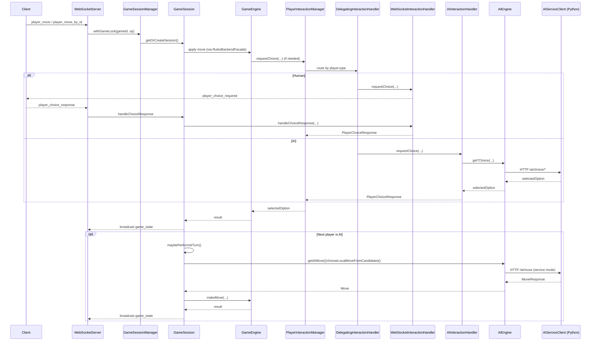

> **Status:** Historical deep-dive. This document captures an in-depth analysis and set of recommendations from an earlier revision of the AI stack. For the **current architecture and behaviour**, see `AI_ARCHITECTURE.md`. For the **current backlog and follow-up tasks**, see `AI_IMPROVEMENT_BACKLOG.md`.
>
> Some implementation details here (especially difficulty ladders, RNG plumbing, and rules parity) have since been updated; defer to the canonical documents above for ground truth.

### Subtask 1 – High-Level AI Architecture & Integration Review

**Objective & Scope**  
Produce an end-to-end architectural review of how AI is structured and integrated across server, client, shared engine, and Python microservice. Map all AI-related components, data flows, and responsibilities to create a canonical architectural picture.

**Primary Code Areas / Files**

- Server AI orchestration and game loop integration:
  - [`AIEngine`](src/server/game/ai/AIEngine.ts:1)
  - [`AIInteractionHandler`](src/server/game/ai/AIInteractionHandler.ts:1)
  - [`AIPlayer`](src/server/game/ai/AIPlayer.ts:1)
  - [`GameSession`](src/server/game/GameSession.ts:1)
  - [`GameSessionManager`](src/server/game/GameSessionManager.ts:1)
  - [`GameEngine`](src/server/game/GameEngine.ts:1) (server variant, if present)
  - [`WebSocketInteractionHandler`](src/server/game/WebSocketInteractionHandler.ts:1)
- Shared engine used by AI:
  - [`GameEngine`](src/shared/engine/GameEngine.ts:1) (shared rules engine)
  - [`core`](src/shared/engine/core.ts:1)
  - Mutators and validators:
    - [`PlacementMutator`](src/shared/engine/mutators/PlacementMutator.ts:1)
    - [`MovementMutator`](src/shared/engine/mutators/MovementMutator.ts:1)
    - [`CaptureMutator`](src/shared/engine/mutators/CaptureMutator.ts:1)
    - [`LineMutator`](src/shared/engine/mutators/LineMutator.ts:1)
    - [`TerritoryMutator`](src/shared/engine/mutators/TerritoryMutator.ts:1)
    - [`TurnMutator`](src/shared/engine/mutators/TurnMutator.ts:1)
    - Validators in [`validators`](src/shared/engine/validators/index.ts:1)
- Client sandbox & debug surface:
  - [`ClientSandboxEngine`](src/client/sandbox/ClientSandboxEngine.ts:1)
  - [`sandboxAI`](src/client/sandbox/sandboxAI.ts:1)
  - [`sandboxTurnEngine`](src/client/sandbox/sandboxTurnEngine.ts:1)
  - [`AIDebugView`](src/client/components/AIDebugView.tsx:1)
- Python AI service & rules:
  - [`main.py`](ai-service/app/main.py:1)
  - Rules interfaces: [`interfaces.py`](ai-service/app/rules/interfaces.py:1)
  - Rules core/engine: [`core.py`](ai-service/app/rules/core.py:1), [`default_engine.py`](ai-service/app/rules/default_engine.py:1)
- Design documents:
  - [`AI_ARCHITECTURE.md`](AI_ARCHITECTURE.md:1)
  - [`RULES_ENGINE_ARCHITECTURE.md`](RULES_ENGINE_ARCHITECTURE.md:1)

**Agent Profile**  
Senior game AI architect with strong backend TypeScript and Python experience, familiarity with service-oriented architectures, and experience shipping AI for commercial titles.

**Expected Deliverable**  
Architecture review document that:

- Identifies all AI subsystems and responsibilities.
- Describes data flows between server, shared engine, client sandbox, and Python AI service.
- Highlights coupling and separation of concerns (AI vs rules, AI vs networking).
- Enumerates architectural strengths and key risks from a production perspective.

**Dependencies**  
None; this should be executed first to inform the other subtasks.

**Priority / Order**  
Highest priority. Perform before or in parallel with other subtasks that rely on system-wide context (Subtasks 2–4, 7–9).

---

### Subtask 2 – Server-Side AI Orchestration & Interaction Review (TypeScript)

**Objective & Scope**  
Review all server-side orchestration of AI-controlled players: how moves and non-move choices are requested, validated, applied, and synchronized with the game loop and networking.

**Primary Code Areas / Files**

- AI orchestration:
  - [`AIEngine`](src/server/game/ai/AIEngine.ts:1)
  - [`AIInteractionHandler`](src/server/game/ai/AIInteractionHandler.ts:1)
  - [`AIPlayer`](src/server/game/ai/AIPlayer.ts:1)
  - [`AIServiceClient`](src/server/services/AIServiceClient.ts:1)
- Game flow integration:
  - [`GameEngine`](src/server/game/GameEngine.ts:1) (server)
  - [`GameSession`](src/server/game/GameSession.ts:1)
  - [`GameSessionManager`](src/server/game/GameSessionManager.ts:1)
  - [`PlayerInteractionManager`](src/server/game/PlayerInteractionManager.ts:1)
  - [`TurnEngine`](src/server/game/turn/TurnEngine.ts:1)
- Networking integration:
  - [`WebSocketInteractionHandler`](src/server/game/WebSocketInteractionHandler.ts:1)
  - WebSocket server: [`server.ts`](src/server/websocket/server.ts:1)
- Related tests:
  - [`AIEngine.serviceClient.test.ts`](tests/unit/AIEngine.serviceClient.test.ts:1)
  - [`AIInteractionHandler.test.ts`](tests/unit/AIInteractionHandler.test.ts:1)
  - [`GameEngine.lineRewardChoiceAIService.integration.test.ts`](tests/unit/GameEngine.lineRewardChoiceAIService.integration.test.ts:1)

**Agent Profile**  
Senior backend TypeScript engineer with game server and AI orchestration experience; comfortable reasoning about async flows, networking, and rule validation.

**Expected Deliverable**  
Written review that:

- Characterizes how [`AIEngine`](src/server/game/ai/AIEngine.ts:1) and [`AIInteractionHandler`](src/server/game/ai/AIInteractionHandler.ts:1) cooperate with game sessions and players.
- Evaluates correctness of decision routing, error handling, and edge-case handling (no moves, forced elimination, timeouts).
- Assesses maintainability and separation of concerns.
- Identifies concrete refactoring and robustness improvements.

**Dependencies**

- Consumes context from Subtask 1 (architecture review).

**Priority / Order**  
High; can run in parallel with Subtask 3 and 4 once Subtask 1’s initial mapping is available.

---

### Subtask 3 – Client Sandbox AI & Shared Engine Parity Review (TypeScript)

**Objective & Scope**  
Review the client-side sandbox AI and ensure strong semantic parity with the server/shared rules engine, focusing on AI turn orchestration, move enumeration, and parity/debug tooling.

**Primary Code Areas / Files**

- Sandbox engine & AI:
  - [`ClientSandboxEngine`](src/client/sandbox/ClientSandboxEngine.ts:1)
  - [`sandboxAI`](src/client/sandbox/sandboxAI.ts:1)
  - [`sandboxTurnEngine`](src/client/sandbox/sandboxTurnEngine.ts:1)
  - Sandbox movement & captures:
    - [`sandboxMovementEngine`](src/client/sandbox/sandboxMovementEngine.ts:1)
    - [`sandboxCaptures`](src/client/sandbox/sandboxCaptures.ts:1)
    - [`sandboxCaptureSearch`](src/client/sandbox/sandboxCaptureSearch.ts:1)
  - Legacy sandbox:
    - [`localSandboxController`](src/client/sandbox/localSandboxController.ts:1)
- Shared rules used by sandbox:
  - [`core`](src/shared/engine/core.ts:1)
  - [`captureLogic`](src/shared/engine/captureLogic.ts:1)
  - [`lineDetection`](src/shared/engine/lineDetection.ts:1)
  - [`territoryDetection`](src/shared/engine/territoryDetection.ts:1)
  - Mutators and validators as relevant.
- Parity tests & scenarios:
  - [`reachabilityParity.RuleEngine_vs_Sandbox.test.ts`](tests/unit/reachabilityParity.RuleEngine_vs_Sandbox.test.ts:1)
  - [`movementReachabilityParity.test.ts`](tests/unit/movementReachabilityParity.test.ts:1)
  - AI sandbox tests:
    - [`ClientSandboxEngine.aiSimulation.test.ts`](tests/unit/ClientSandboxEngine.aiSimulation.test.ts:1)
    - [`ClientSandboxEngine.aiStall.seed1.test.ts`](tests/unit/ClientSandboxEngine.aiStall.seed1.test.ts:1)
    - [`ClientSandboxEngine.aiStallDiagnostics.test.ts`](tests/unit/ClientSandboxEngine.aiStallDiagnostics.test.ts:1)
    - [`Sandbox_vs_Backend.aiRngParity.test.ts`](tests/unit/Sandbox_vs_Backend.aiRngParity.test.ts:1)
    - [`Sandbox_vs_Backend.aiHeuristicCoverage.test.ts`](tests/unit/Sandbox_vs_Backend.aiHeuristicCoverage.test.ts:1)

**Agent Profile**  
Senior TypeScript game systems engineer with experience in client-side simulation, deterministic sandboxes, and parity testing.

**Expected Deliverable**  
Written review that:

- Describes how sandbox AI orchestrates turns and phases (placement, movement, line, territory, forced elimination).
- Evaluates decision logic in [`sandboxAI`](src/client/sandbox/sandboxAI.ts:1) and its use of [`chooseLocalMoveFromCandidates()`](src/shared/engine/localAIMoveSelection.ts:1).
- Analyzes parity between sandbox and server/shared engine, including hashing and move application.
- Identifies maintainability issues (e.g., monolithic functions), and proposes concrete refactors and convergence on shared engine APIs.

**Dependencies**

- Uses high-level context from Subtask 1.
- Coordinated with Subtask 2 and 8 (determinism/parity) for cross-cutting concerns.

**Priority / Order**  
High; parallel with Subtask 2 and 4.

---

### Subtask 4 – Decision-Making Algorithms & Search Engines Review (Python)

**Objective & Scope**  
Review the core AI engines and search algorithms implemented in the Python service: Random, heuristic, Minimax/alpha-beta, MCTS, and any related evaluation and move-ordering logic.

**Primary Code Areas / Files**

- AI implementations:
  - [`base.py`](ai-service/app/ai/base.py:1)
  - [`random_ai.py`](ai-service/app/ai/random_ai.py:1)
  - [`heuristic_ai.py`](ai-service/app/ai/heuristic_ai.py:1)
  - [`minimax_ai.py`](ai-service/app/ai/minimax_ai.py:1)
  - [`mcts_ai.py`](ai-service/app/ai/mcts_ai.py:1)
  - [`zobrist.py`](ai-service/app/ai/zobrist.py:1)
- Rules engine integration:
  - [`default_engine.py`](ai-service/app/rules/default_engine.py:1)
  - [`core.py`](ai-service/app/rules/core.py:1)
- AI selection & routing:
  - [`main.py`](ai-service/app/main.py:1)

**Agent Profile**  
Senior AI/search engineer experienced with alpha-beta, MCTS, game-tree search, and evaluation heuristics for complex board games.

**Expected Deliverable**  
Written review that:

- Classifies each AI type (heuristic vs Minimax vs MCTS vs hybrid).
- Analyzes time/space complexity, pruning, transposition table usage, move ordering, and quiescence search.
- Evaluates search quality, horizon effects, and risk of tactical/strategic blind spots.
- Proposes targeted algorithmic or structural improvements (e.g., mutable search boards, adjusted search depths, better move ordering heuristics).

**Dependencies**

- High-level overview from Subtask 1.
- May coordinate with Subtask 6 (behaviour/tuning) for interpretation of evaluation quality.

**Priority / Order**  
High; can run in parallel with Subtasks 2 and 3.

---

### Subtask 5 – Neural Network Architecture & Integration Review (Python)

**Objective & Scope**  
Review the neural network-based AI infrastructure, including model architecture, feature encoding, move encoding/decoding, and run-time integration with heuristic/MCTS layers.

**Primary Code Areas / Files**

- NN and policy/value head:
  - [`neural_net.py`](ai-service/app/ai/neural_net.py:1)
- MCTS integration:
  - [`mcts_ai.py`](ai-service/app/ai/mcts_ai.py:1) (NN-assisted MCTS)
- Tests and any training-related artefacts:
  - [`test_model_architecture.py`](ai-service/tests/test_model_architecture.py:1)
  - Other NN-related tests in `ai-service/tests`.
- Design docs (if present):
  - [`AI_ARCHITECTURE.md`](AI_ARCHITECTURE.md:1) or NN-specific docs.

**Agent Profile**  
Machine learning engineer with strong experience in board-game NN design (e.g., AlphaZero-style CNNs), feature engineering, and production inference integration.

**Expected Deliverable**  
Written review that:

- Describes model architecture (layers, residual blocks, heads) and assesses suitability for the game’s state/action space.
- Analyzes input feature representation and action encoding (`encode_move` / `decode_move`).
- Evaluates current or planned training and evaluation pipeline (self-play, dataset, overfitting concerns).
- Reviews inference-time integration: where NN is used (value/policy), interaction with heuristics and MCTS, fallbacks, and failure modes (e.g., missing weights).
- Recommends improvements or refactors for robustness, coverage, and performance.

**Dependencies**

- Subtask 4 (search engines) provides important context for how NN is consumed.
- Subtask 1 provides system view.

**Priority / Order**  
Medium-high; can run parallel after basic understanding from Subtasks 1 and 4.

---

### Subtask 6 – Behaviour, Strategy, and Difficulty Tuning Review

**Objective & Scope**  
Review AI behaviour from a gameplay perspective: how different difficulty levels, AI types, and heuristics translate into actual in-game strategy, challenge, and exploitability.

**Primary Code Areas / Files**

- TS AI type and difficulty selection:
  - [`AIEngine`](src/server/game/ai/AIEngine.ts:1) (difficulty presets, `aiType` mapping)
  - [`AIPlayer`](src/server/game/ai/AIPlayer.ts:1) (player AI configuration)
- Python difficulty and config:
  - Difficulty handling in [`main.py`](ai-service/app/main.py:1)
  - Config usage in [`heuristic_ai.py`](ai-service/app/ai/heuristic_ai.py:1), [`minimax_ai.py`](ai-service/app/ai/minimax_ai.py:1), [`mcts_ai.py`](ai-service/app/ai/mcts_ai.py:1), [`neural_net.py`](ai-service/app/ai/neural_net.py:1)
- Heuristic evaluation components:
  - Evaluation functions in [`heuristic_ai.py`](ai-service/app/ai/heuristic_ai.py:1)
- Tests and scenarios:
  - AI-vs-rules scenarios under `tests/scenarios`, especially those exercising AI choices (e.g., [`HexLineAndTerritory.test.ts`](tests/scenarios/HexLineAndTerritory.test.ts:1)).

**Agent Profile**  
Gameplay behaviour and tuning specialist with AI background; understands both algorithmic and player-experience aspects.

**Expected Deliverable**  
Written review that:

- Maps each difficulty level and AI type to concrete player-experience characteristics (thinking time, aggressiveness, strategic depth).
- Identifies exploitable patterns or static behaviours at each level.
- Evaluates parameterization (randomness, search depth, heuristic weights) and flexibility to define AI personalities.
- Suggests tuning levers and configuration schemes for designers (e.g., per-queue profiles, per-mode personalities).

**Dependencies**

- Subtask 4 (search behaviour) and Subtask 5 (NN) for underlying algorithms.
- Subtask 1 for overall configuration architecture.

**Priority / Order**  
Medium; start once Subtask 4 is substantially complete.

---

### Subtask 7 – Robustness, Error Handling, and Edge-Case Review

**Objective & Scope**  
Audit AI-related robustness, focusing on error handling, unexpected states, invalid service responses, timeouts, and edge cases such as no legal moves, forced eliminations, or desyncs.

**Primary Code Areas / Files**

- TS server AI & interactions:
  - [`AIEngine`](src/server/game/ai/AIEngine.ts:1)
  - [`AIInteractionHandler`](src/server/game/ai/AIInteractionHandler.ts:1)
  - [`AIServiceClient`](src/server/services/AIServiceClient.ts:1)
  - [`RulesBackendFacade`](src/server/game/RulesBackendFacade.ts:1)
  - [`RuleEngine`](src/server/game/RuleEngine.ts:1)
- Python service-side:
  - FastAPI handlers in [`main.py`](ai-service/app/main.py:1) (error handling & response codes)
  - Rule evaluation endpoints and guards: [`default_engine.py`](ai-service/app/rules/default_engine.py:1), [`core.py`](ai-service/app/rules/core.py:1)
- Edge-case heavy tests:
  - [`ForcedEliminationAndStalemate.test.ts`](tests/scenarios/ForcedEliminationAndStalemate.test.ts:1)
  - Cyclic captures and parity tests under `tests/unit` and `tests/scenarios`.

**Agent Profile**  
Senior backend/AI engineer experienced in robust distributed systems, error-handling patterns, and edge-case-heavy game logic.

**Expected Deliverable**  
Written review that:

- Catalogs all AI-related error paths (timeouts, HTTP errors, malformed responses).
- Examines defensive checks and assertions around AI responses and rule evaluation.
- Reviews handling of no-move states, forced elimination, stalemates, and invalid/partial states.
- Recommends concrete hardening steps (retries, fallbacks, validation layers, invariants, error codes).

**Dependencies**

- Subtask 2 (server orchestration) for context.
- Subtask 4 (Python AI) for understanding of service behaviour.

**Priority / Order**  
High; can begin after initial outputs from Subtask 2 and 4.

---

### Subtask 8 – Determinism, RNG, and Parity Review

**Objective & Scope**  
Examine all sources of nondeterminism in AI (TS and Python), and verify or propose improvements to parity between sandbox and server, especially regarding RNG, hashing, and move selection.

**Primary Code Areas / Files**

- TS determinism & parity:
  - [`localAIMoveSelection`](src/shared/engine/localAIMoveSelection.ts:1) and [`chooseLocalMoveFromCandidates()`](src/shared/engine/localAIMoveSelection.ts:1)
  - RNG use in [`AIEngine`](src/server/game/ai/AIEngine.ts:1) (including `normalizeServiceMove`), [`sandboxAI`](src/client/sandbox/sandboxAI.ts:1)
  - State hashing: [`hashGameState`](src/shared/engine/core.ts:1)
  - Parity tests:
    - [`Sandbox_vs_Backend.aiRngParity.test.ts`](tests/unit/Sandbox_vs_Backend.aiRngParity.test.ts:1)
    - [`Sandbox_vs_Backend.aiHeuristicCoverage.test.ts`](tests/unit/Sandbox_vs_Backend.aiHeuristicCoverage.test.ts:1)
    - Parity debug tests (e.g., `ParityDebug.*.test.ts`).
- Python randomness and determinism:
  - RNG usage in [`random_ai.py`](ai-service/app/ai/random_ai.py:1), [`heuristic_ai.py`](ai-service/app/ai/heuristic_ai.py:1), [`minimax_ai.py`](ai-service/app/ai/minimax_ai.py:1), [`mcts_ai.py`](ai-service/app/ai/mcts_ai.py:1), [`neural_net.py`](ai-service/app/ai/neural_net.py:1).

**Agent Profile**  
Deterministic simulation and tools engineer with strong experience in cross-platform determinism and replay systems.

**Expected Deliverable**  
Written review that:

- Enumerates all RNG sources and seeding strategies in TS and Python.
- Assesses determinism guarantees for tests, replays, and live games.
- Evaluates parity between sandbox and backend AI using parity tests and hashing.
- Proposes concrete changes to centralize RNG control, seed management, and normalization logic for reproducible AI behaviour.

**Dependencies**

- Subtasks 2, 3, 4 for context on decision-making and orchestration.

**Priority / Order**  
High; can run in parallel once those subtasks have early findings.

---

### Subtask 9 – Performance, Profiling, and Scalability Review

**Objective & Scope**  
Evaluate AI performance characteristics and scalability under load, both on the Node server (TS AI orchestration) and in the Python microservice (search and NN inference).

**Primary Code Areas / Files**

- TS server performance:
  - [`AIEngine`](src/server/game/ai/AIEngine.ts:1)
  - [`AIServiceClient`](src/server/services/AIServiceClient.ts:1)
  - Game loop: [`GameSession`](src/server/game/GameSession.ts:1), [`GameSessionManager`](src/server/game/GameSessionManager.ts:1), [`WebSocketInteractionHandler`](src/server/game/WebSocketInteractionHandler.ts:1)
- Python performance:
  - [`minimax_ai.py`](ai-service/app/ai/minimax_ai.py:1)
  - [`mcts_ai.py`](ai-service/app/ai/mcts_ai.py:1)
  - [`neural_net.py`](ai-service/app/ai/neural_net.py:1)
  - Any benchmarking scripts:
    - [`benchmark_engine.py`](ai-service/scripts/benchmark_engine.py:1)
- Infrastructure & concurrency:
  - Service entry in [`main.py`](ai-service/app/main.py:1) (threading/process model, async settings).

**Agent Profile**  
Performance and scalability engineer with experience in Node.js backends, Python services, and profiling/tracing for AI workloads.

**Expected Deliverable**  
Written review that:

- Profiles or estimates CPU and memory usage of AI moves across difficulties.
- Evaluates time budgets vs actual search work.
- Identifies hot paths and obvious inefficiencies (e.g., repeated state copying, redundant move enumeration).
- Recommends performance and capacity improvements (e.g., caching, pooling, concurrency model changes).

**Dependencies**

- Subtask 4 (search) and 5 (NN) for algorithmic context.
- Subtask 1/2 for integration context.

**Priority / Order**  
Medium-high; initiate after Subtask 4/5 deliver basic algorithmic understanding.

---

### Subtask 10 – Tools, Testing, and Observability Review

**Objective & Scope**  
Review existing AI-related tests, debugging tools, and telemetry; propose improvements to ensure AI remains verifiable, debuggable, and observable in production.

**Primary Code Areas / Files**

- TS tests and utilities:
  - AI-related tests under `tests/unit` and `tests/scenarios`, especially:
    - [`AIInteractionHandler.test.ts`](tests/unit/AIInteractionHandler.test.ts:1)
    - [`AIEngine.serviceClient.test.ts`](tests/unit/AIEngine.serviceClient.test.ts:1)
    - Sandbox AI tests (see Subtask 3).
  - Test utilities:
    - [`aiTestLogger`](tests/utils/aiTestLogger.ts:1)
    - [`moveMatching`](tests/utils/moveMatching.ts:1)
  - Test parity plan:
    - [`TEST_SUITE_PARITY_PLAN.md`](tests/TEST_SUITE_PARITY_PLAN.md:1)
- Client tools:
  - [`AIDebugView`](src/client/components/AIDebugView.tsx:1)
  - Any debug hooks in [`ClientSandboxEngine`](src/client/sandbox/ClientSandboxEngine.ts:1) and [`sandboxAI`](src/client/sandbox/sandboxAI.ts:1)
- Python tests:
  - `ai-service/tests` (Minimax, MCTS, NN, rules parity, etc.).

**Agent Profile**  
Tools and testing engineer with strong TypeScript and Python testing experience; familiar with Jest/Pytest and observability tooling.

**Expected Deliverable**  
Written review that:

- Summarizes current AI test coverage (unit, integration, scenario, parity) and identifies gaps.
- Assesses usefulness of debug views and logs for diagnosing AI behaviour.
- Proposes additional tests (regression positions, encode/decode tests, deterministic seeds) and tooling (e.g., server-side AI decision traces, metrics).
- Outlines a prioritized test/telemetry enhancement plan.

**Dependencies**

- Needs context from Subtasks 2–5 and 8 to know what to test.
- Interfaces well with robustness and performance reviews (Subtasks 7 and 9).

**Priority / Order**  
Medium; can run in parallel once initial findings from algorithm/orchestration reviews are available.

---

### Subtask 11 – AI Configuration, Modes, and Profiles Review

**Objective & Scope**  
Audit how AI is configured (per-player, per-game, per-difficulty) across TS and Python, and evaluate the flexibility and clarity of modes (`local`, `service`, algorithm types) and difficulty scaling.

**Primary Code Areas / Files**

- TS config surfaces:
  - [`AIEngine`](src/server/game/ai/AIEngine.ts:1) (AI profiles, `createAIFromProfile`)
  - [`AIPlayer`](src/server/game/ai/AIPlayer.ts:1) (config stored per player)
  - Shared types: [`game.ts`](src/shared/types/game.ts:1)
- Python config:
  - Request/response models in [`main.py`](ai-service/app/main.py:1) and [`interfaces.py`](ai-service/app/rules/interfaces.py:1)
  - AI-specific config fields in [`heuristic_ai.py`](ai-service/app/ai/heuristic_ai.py:1), [`minimax_ai.py`](ai-service/app/ai/minimax_ai.py:1), [`mcts_ai.py`](ai-service/app/ai/mcts_ai.py:1), [`neural_net.py`](ai-service/app/ai/neural_net.py:1)
- Any AI-related user-facing config (e.g., lobby or match configs in TS).

**Agent Profile**  
Backend/game systems engineer with experience in configuration design, schema evolution, and designer-facing tools.

**Expected Deliverable**  
Written review that:

- Maps all AI-related configuration paths and data models across TS and Python.
- Assesses how difficulty, AI type, and mode are chosen and persisted.
- Identifies duplication or drift between configurations in different modules.
- Proposes a unified AI profile schema and configuration flow (supporting designers, matchmaking, and future AI variants).

**Dependencies**

- Subtask 1 for system overview.
- Subtask 6 for behavioural interpretation of config values.

**Priority / Order**  
Medium; should follow or run alongside Subtask 6.

---

### Subtask 12 – Networking & Client Integration Review for AI

**Objective & Scope**  
Review how AI-controlled actions and choices are integrated into networking and client flows, ensuring correct synchronization, latency handling, and user experience.

**Primary Code Areas / Files**

- Server networking:
  - [`WebSocketInteractionHandler`](src/server/game/WebSocketInteractionHandler.ts:1)
  - WebSocket server entry: [`server.ts`](src/server/websocket/server.ts:1)
  - REST routes relevant to AI (if any) in [`game.ts`](src/server/routes/game.ts:1) and [`index.ts`](src/server/routes/index.ts:1)
- Client integration:
  - Game page & lobby:
    - [`GamePage`](src/client/pages/GamePage.tsx:1)
    - [`LobbyPage`](src/client/pages/LobbyPage.tsx:1)
  - Game HUD and AI-facing UI:
    - [`GameHUD`](src/client/components/GameHUD.tsx:1)
    - [`AIDebugView`](src/client/components/AIDebugView.tsx:1)
- AI decision timing and feedback:
  - Where client waits for AI decisions or displays AI “thinking” state.

**Agent Profile**  
Full-stack game engineer familiar with real-time networking, WebSocket flows, and UX for AI-driven turns.

**Expected Deliverable**  
Written review that:

- Describes how AI decisions travel from server to client and back (if necessary).
- Evaluates latency, turn ownership, and possible race conditions (e.g., AI decisions vs player actions).
- Identifies UX issues (e.g., AI pauses, missing indicators) and networking edge cases (disconnects, reconnections mid-AI-turn).
- Suggests concrete networking or UI improvements for smooth AI experiences.

**Dependencies**

- Subtask 2 (server orchestration) and Subtask 3 (sandbox AI) for context.

**Priority / Order**  
Medium; can be run in parallel once orchestration review is in progress.

---

## Coordination Summary

- **Subtask 1** provides a shared architectural map.
- **Subtasks 2 and 3** drill into TS server orchestration and client sandbox AI, ensuring authoritative AI and sandbox tools are well understood and maintainable.
- **Subtasks 4 and 5** cover the core Python AI engines and NN components, addressing decision-making depth, search quality, and ML integration.
- **Subtask 6** evaluates AI behaviour and difficulty from a gameplay standpoint, leveraging findings from algorithmic reviews.
- **Subtask 7** focuses on robustness and edge-case handling across TS and Python, while **Subtask 8** ensures determinism and parity between all AI surfaces.
- **Subtask 9** examines performance and scalability under realistic load, both on the Node server and Python microservice.
- **Subtask 10** reviews testing, tooling, and observability, proposing improvements for long-term AI verifiability.
- **Subtask 11** unifies AI configuration and modes, making the system easier to tune and extend.
- **Subtask 12** ensures networking and client integration for AI deliver a robust, responsive player experience.

Collectively, these subtasks and their assigned specialist roles cover server-side AI orchestration, decision-making algorithms, behavioural tuning, robustness and failure modes, performance and scalability, code quality and maintainability, testing/tooling, and integration with client and networking layers. Executed together—with Subtask 1 leading and other subtasks running in parallel where indicated—they will produce a thorough, commercial-title-quality AI code review for the repository.

## 1. Overview of Server AI Orchestration

### Core AI components

- [`AIEngine`](src/server/game/ai/AIEngine.ts:57)
  - Central server-side AI orchestrator.
  - Owns per-player AI configs (`aiConfigs` map keyed by `playerNumber`).
  - Provides:
    - Service-backed move selection via [`AIEngine.getAIMove()`](src/server/game/ai/AIEngine.ts:131).
    - Local fallback move generation via [`AIEngine.getLocalAIMove()`](src/server/game/ai/AIEngine.ts:178) and shared policy [`AIEngine.chooseLocalMoveFromCandidates()`](src/server/game/ai/AIEngine.ts:275).
    - Service-backed non-move choices:
      - [`AIEngine.getLineRewardChoice()`](src/server/game/ai/AIEngine.ts:418).
      - [`AIEngine.getRingEliminationChoice()`](src/server/game/ai/AIEngine.ts:465).
      - [`AIEngine.getRegionOrderChoice()`](src/server/game/ai/AIEngine.ts:512).
    - Service health/cache utilities.
  - Maps high-level [`AIProfile`](src/shared/types/game.ts:1) (difficulty, tactic, mode) to internal `AIConfig` (difficulty, `aiType`, thinkTime/randomness).

- [`AIInteractionHandler`](src/server/game/ai/AIInteractionHandler.ts:26)
  - Implements [`PlayerInteractionHandler`](src/server/game/PlayerInteractionManager.ts:14) specifically for AI-controlled players.
  - Handles _non-move_ `PlayerChoice` decisions via deterministic heuristics:
    - Line order, line reward option, ring elimination, region order, capture direction.
  - For `line_reward_option`, `ring_elimination`, and `region_order`:
    - First attempts to delegate to the Python AI via [`globalAIEngine`](src/server/game/ai/AIEngine.ts:725) (service-backed).
    - On any failure or invalid response, falls back to local heuristics.

- [`AIPlayer`](src/server/game/ai/AIPlayer.ts:24)
  - Abstract base class for pluggable AI implementations (difficulty, thinkTime, randomness).
  - Not currently wired into the active AI path; modern flow uses [`AIEngine`](src/server/game/ai/AIEngine.ts:57) + Python microservice + shared local heuristics instead.
  - Represents legacy/alternate design; important from a debt/clarity perspective.

- [`AIServiceClient`](src/server/services/AIServiceClient.ts:100)
  - HTTP client (Axios) for the Python AI microservice.
  - Endpoints:
    - `/ai/move` via [`AIServiceClient.getAIMove()`](src/server/services/AIServiceClient.ts:132).
    - `/ai/evaluate` via [`AIServiceClient.evaluatePosition()`](src/server/services/AIServiceClient.ts:184).
    - `/ai/choice/line_reward_option` via [`AIServiceClient.getLineRewardChoice()`](src/server/services/AIServiceClient.ts:230).
    - `/ai/choice/ring_elimination` via [`AIServiceClient.getRingEliminationChoice()`](src/server/services/AIServiceClient.ts:282).
    - `/ai/choice/region_order` via [`AIServiceClient.getRegionOrderChoice()`](src/server/services/AIServiceClient.ts:334).
  - Config:
    - Base URL from `AI_SERVICE_URL` with sensible default.
    - 30s request timeout.
    - Logs errors (including latency) and rethrows descriptive `Error`s.
  - Exposed as singleton via [`getAIServiceClient()`](src/server/services/AIServiceClient.ts:433).

### Integration with game engine and sessions

- [`GameEngine`](src/server/game/GameEngine.ts:74)
  - Authoritative server-side rules engine and game loop driver.
  - Keeps canonical `GameState`, enforces phases, validates and applies moves.
  - Integrates with AI through:
    - Move validation and application after AI-suggested moves (`RuleEngine.validateMove` + [`GameEngine.makeMove()`](src/server/game/GameEngine.ts:336)).
    - Exposing phase-correct legal moves via [`GameEngine.getValidMoves()`](src/server/game/GameEngine.ts:2366).
    - Player choices via [`PlayerInteractionManager`](src/server/game/PlayerInteractionManager.ts:24) (which may be AI-backed or WebSocket-backed).
    - Internal bookkeeping for chain capture, line processing, territory processing, forced elimination.

- [`TurnEngine`](src/server/game/turn/TurnEngine.ts:88)
  - Functional extraction of turn/phase logic used by [`GameEngine.advanceGame()`](src/server/game/GameEngine.ts:1966).
  - Governs phase transitions (ring_placement → movement → capture/chain_capture → line_processing → territory_processing → next player).
  - Checks for forced elimination and blocked states using board and `RuleEngine`.
  - Keeps `PerTurnState` (hasPlacedThisTurn, mustMoveFromStackKey) in sync with moves via [`updatePerTurnStateAfterMove()`](src/server/game/turn/TurnEngine.ts:44).

- [`PlayerInteractionManager`](src/server/game/PlayerInteractionManager.ts:24)
  - Typed facade over a [`PlayerInteractionHandler`](src/server/game/PlayerInteractionManager.ts:14).
  - Game-engine-facing API is always `requestChoice<TChoice>()`, independent of transport or AI.
  - In this deployment, it is backed by [`DelegatingInteractionHandler`](src/server/game/DelegatingInteractionHandler.ts:1), which routes:
    - Human players → [`WebSocketInteractionHandler`](src/server/game/WebSocketInteractionHandler.ts:26).
    - AI players → [`AIInteractionHandler`](src/server/game/ai/AIInteractionHandler.ts:26).

- [`GameSession`](src/server/game/GameSession.ts:23)
  - Per-game orchestration layer:
    - Loads persistent game/players from DB.
    - Constructs players (humans + AI) and configures [`globalAIEngine`](src/server/game/ai/AIEngine.ts:725) from stored [`AiOpponentsConfig`](src/shared/types/game.ts:1) / `AIProfile`s.
    - Creates [`WebSocketInteractionHandler`](src/server/game/WebSocketInteractionHandler.ts:26), [`AIInteractionHandler`](src/server/game/ai/AIInteractionHandler.ts:26), [`DelegatingInteractionHandler`](src/server/game/DelegatingInteractionHandler.ts:1), and [`PlayerInteractionManager`](src/server/game/PlayerInteractionManager.ts:24).
    - Instantiates [`GameEngine`](src/server/game/GameEngine.ts:74) with this `PlayerInteractionManager` and enables **Move-driven decision phases** via [`GameEngine.enableMoveDrivenDecisionPhases()`](src/server/game/GameEngine.ts:160).
    - Persists moves and broadcasts state updates.
    - Drives AI turns via [`GameSession.maybePerformAITurn()`](src/server/game/GameSession.ts:479).

- [`GameSessionManager`](src/server/game/GameSessionManager.ts:7)
  - Manages active [`GameSession`](src/server/game/GameSession.ts:23) instances.
  - Provides a distributed lock facility via [`GameSessionManager.withGameLock()`](src/server/game/GameSessionManager.ts:48) using Redis (with graceful fallback when Redis unavailable).
  - Ensures concurrent move requests for the same game are serialized.

- [`WebSocketInteractionHandler`](src/server/game/WebSocketInteractionHandler.ts:26)
  - Bridges `PlayerChoice` flows to Socket.IO:
    - Emits `player_choice_required` to correct client.
    - Tracks pending choices with timeouts.
    - Validates `player_choice_response` and resolves/rejects the pending Promise.

- [`WebSocketServer`](src/server/websocket/server.ts:16)
  - Socket.IO server:
    - Authenticates connections.
    - For each game:
      - Uses [`GameSessionManager`](src/server/game/GameSessionManager.ts:7) to get/create a session.
      - Wraps all move operations in `withGameLock`.
    - For choices:
      - Forwards `player_choice_response` to the correct session’s [`WebSocketInteractionHandler`](src/server/game/WebSocketInteractionHandler.ts:26).

- HTTP routes in [`game`](src/server/routes/game.ts:1) / [`index`](src/server/routes/index.ts:7)
  - Mainly game lifecycle and metadata; they do not directly orchestrate AI.
  - AI is invoked only in live sessions via WebSocket-driven [`GameSession`](src/server/game/GameSession.ts:23) and in test harnesses.

### High-level flow (Mermaid)



---

## 2. Decision-Making Surfaces and Flow

### 2.1 Move selection (normal turns & chain captures)

#### Entry points

- **Multiplayer sessions (production path)**
  - After a human move is processed via [`GameSession.handlePlayerMove()`](src/server/game/GameSession.ts:290) or [`GameSession.handlePlayerMoveById()`](src/server/game/GameSession.ts:355), `GameSession` calls [`GameSession.maybePerformAITurn()`](src/server/game/GameSession.ts:479).
  - That method:
    - Pulls the current authoritative `GameState` from [`GameEngine.getGameState()`](src/server/game/GameEngine.ts:164).
    - Determines if `currentPlayer` is an AI (`player.type === 'ai'`).
    - Ensures an AI config exists in [`globalAIEngine`](src/server/game/ai/AIEngine.ts:725) (creating one via [`AIEngine.createAI()`](src/server/game/ai/AIEngine.ts:66) if necessary).
    - Branches by phase:
      - For `line_processing` / `territory_processing` → decision-move path (see 2.2).
      - For all other phases → move-selection path below.

- **Standalone AI harnesses / tests**
  - [`FullGameFlow`](tests/integration/FullGameFlow.test.ts:25) runs AI-vs-AI games using:
    - `engine.getValidMoves(state.currentPlayer)` and
    - [`AIEngine.chooseLocalMoveFromCandidates()`](src/server/game/ai/AIEngine.ts:275) directly,
    - Not [`AIEngine.getAIMove()`](src/server/game/ai/AIEngine.ts:131).

#### Service-backed move selection

- In normal phases from [`GameSession.maybePerformAITurn()`](src/server/game/GameSession.ts:479):
  - Calls [`AIEngine.getAIMove()`](src/server/game/ai/AIEngine.ts:131):
    - Looks up per-player `AIConfig` (difficulty, aiType, mode).
    - Computes `aiType` via either:
      - [`AIEngine.mapAITacticToAIType()`](src/server/game/ai/AIEngine.ts:615) from shared [`AITacticType`](src/shared/types/game.ts:1), or
      - [`AIEngine.selectAITypeForDifficulty()`](src/server/game/ai/AIEngine.ts:602).
    - Maps to service enum via [`AIEngine.mapInternalTypeToServiceType()`](src/server/game/ai/AIEngine.ts:664).
    - Calls [`AIServiceClient.getAIMove()`](src/server/services/AIServiceClient.ts:132) with:
      - Full `GameState` snapshot,
      - `player_number`,
      - `difficulty`,
      - `ai_type`.

  - `AIServiceClient.getAIMove()`:
    - Logs "Requesting AI move" with player, difficulty, aiType, and `currentPhase`.
    - POSTs to `/ai/move`.
    - On success:
      - Logs "AI move received" with evaluation, thinking time, and measured latency.
      - Returns the `MoveResponse`.

  - Back in [`AIEngine.getAIMove()`](src/server/game/ai/AIEngine.ts:131):
    - Normalizes the returned move via [`AIEngine.normalizeServiceMove()`](src/server/game/ai/AIEngine.ts:312).
    - Logs "AI move generated" with move type and evaluation details.
    - Returns the normalized `Move`.

  - [`GameSession.maybePerformAITurn()`](src/server/game/GameSession.ts:479):
    - Strips `id`, `timestamp`, `moveNumber` from the AI-suggested move and passes the payload to [`RulesBackendFacade.applyMove()`](src/server/game/RulesBackendFacade.ts:1) (via `this.rulesFacade.applyMove(engineMove)`).
    - `RulesBackendFacade` ultimately routes to [`GameEngine.makeMove()`](src/server/game/GameEngine.ts:336), which:
      - Validates the move via `RuleEngine.validateMove`.
      - Enforces chain-capture, must-move, and invariants.
      - Applies the move, processes consequences, and advances the phase/turn.

#### Local fallback move selection

- If any error occurs in [`AIEngine.getAIMove()`](src/server/game/ai/AIEngine.ts:131):
  - The catch block logs an error ("Failed to get AI move from service, falling back to local heuristic") and calls [`AIEngine.getLocalAIMove()`](src/server/game/ai/AIEngine.ts:178).

- [`AIEngine.getLocalAIMove()`](src/server/game/ai/AIEngine.ts:178):
  - Builds a transient [`BoardManager`](src/server/game/BoardManager.ts:1) and [`RuleEngine`](src/server/game/RuleEngine.ts:1).
  - Calls `ruleEngine.getValidMoves(gameState)` to enumerate legal moves for the current `GameState`.
  - Enforces "must move the placed stack" semantics _locally_:
    - Checks `gameState.currentPhase` and:
      - If `mustMoveFromStackKey` is present on the `GameState` (for newer fixtures), filters candidate moves by that origin.
      - Else, infers the must-move origin from the last `place_ring` move in `moveHistory` for backward compatibility.
  - If no valid moves remain → returns `null`.
  - Otherwise delegates to [`AIEngine.chooseLocalMoveFromCandidates()`](src/server/game/ai/AIEngine.ts:275), passing:
    - Player number,
    - Current `GameState`,
    - Candidate moves,
    - Optional RNG `LocalAIRng` (for deterministic parity tests).

- [`AIEngine.chooseLocalMoveFromCandidates()`](src/server/game/ai/AIEngine.ts:275):
  - Forwards to shared [`chooseLocalMoveFromCandidates`](src/shared/engine/localAIMoveSelection.ts:1) in the shared engine.
  - Logs "Local AI fallback move generated" with the chosen move type.
  - Returns the chosen move.

- Tests:
  - [`Sandbox_vs_Backend.aiRngParity.test.ts`](tests/unit/Sandbox_vs_Backend.aiRngParity.test.ts:28) asserts that:
    - When an RNG is provided, both sandbox AI and backend [`AIEngine.chooseLocalMoveFromCandidates()`](src/server/game/ai/AIEngine.ts:275) use it instead of `Math.random`.
    - `Math.random` is guarded to throw if accidentally used, ensuring RNG plumbed correctly.

#### Chain capture (multi-segment captures)

- Runtime semantics within the engine:
  - [`GameEngine.makeMove()`](src/server/game/GameEngine.ts:336) uses `chainCaptureState` (private) plus capture helpers [`updateChainCaptureStateAfterCapture()`](src/server/game/GameEngine.ts:898) and [`getCaptureOptionsFromPosition()`](src/server/game/GameEngine.ts:918).
  - After an `overtaking_capture` or `continue_capture_segment`:
    - It computes follow-up capture options from the landing position.
    - If there are follow-ups:
      - Sets `currentPhase = 'chain_capture'`.
      - Keeps the same `currentPlayer`.
    - `GameEngine.getValidMoves()` in `chain_capture` phase:
      - Re-enumerates capture options from `chainCaptureState.currentPosition`.
      - Re-labels them as `continue_capture_segment` moves and returns them.

- **Current AI orchestration**:
  - In `FullGameFlow` (test harness), chain-capture decisions are made via:
    - `engine.getValidMoves()` and [`AIEngine.chooseLocalMoveFromCandidates()`](src/server/game/ai/AIEngine.ts:275).
  - In production `GameSession.maybePerformAITurn()`:
    - `state.currentPhase === 'chain_capture'` falls into the generic `else` branch:
      - It calls [`AIEngine.getAIMove()`](src/server/game/ai/AIEngine.ts:131) instead of consuming `GameEngine.getValidMoves()` for `continue_capture_segment` options.
      - The Python service is thus expected to understand chain-capture legality purely from `GameState`, even though `chainCaptureState` is held internally by [`GameEngine`](src/server/game/GameEngine.ts:74) and not embedded in wire-level `GameState`.
    - This mismatch is a key risk (see §6).

### 2.2 Line / territory decisions (line rewards, region order)

#### Line-related decisions

- **Canonical line decisions as Moves**
  - When `useMoveDrivenDecisionPhases` is enabled (which it is in [`GameSession.initialize()`](src/server/game/GameSession.ts:176)):
    - After a normal move, [`GameEngine.makeMove()`](src/server/game/GameEngine.ts:336) calls [`GameEngine.getValidLineProcessingMoves()`](src/server/game/GameEngine.ts:1064).
    - That method enumerates per-line decision moves:
      - `process_line` moves — one per player-owned line.
      - `choose_line_reward` moves — _two_ per overlength line (collapse-all vs minimum-collapse), annotated with `formedLines` and (for min) `collapsedMarkers`.

- **Non-AI / Move-driven interaction**
  - For humans:
    - The front-end can:
      - Read `validMoves` (including `process_line` / `choose_line_reward`) from `game_state` messages.
      - Call `player_move_by_id` (handled by [`WebSocketServer.handlePlayerMoveById()`](src/server/websocket/server.ts:336)), which uses [`GameSession.handlePlayerMoveById()`](src/server/game/GameSession.ts:355) → [`GameEngine.makeMoveById()`](src/server/game/GameEngine.ts:2539).

- **AI decision path (line_processing and territory_processing)**
  - In [`GameSession.maybePerformAITurn()`](src/server/game/GameSession.ts:479):

    ```ts
    if (
      state.currentPhase === 'line_processing' ||
      state.currentPhase === 'territory_processing'
    ) {
      const allCandidates = this.gameEngine.getValidMoves(currentPlayerNumber);
      const decisionCandidates = ...; // filter to decision types
      const selected = globalAIEngine.chooseLocalMoveFromCandidates(... decisionCandidates ...);
      result = await this.rulesFacade.applyMove(engineMove);
    }
    ```

  - For `line_processing`:
    - `decisionCandidates` are `process_line` and `choose_line_reward` `Move`s.
    - Selection uses **local shared heuristic** (`localAIMoveSelection`), _not_ the Python service.

  - Yet, when the chosen decision move is applied:
    - [`GameEngine.makeMove()`](src/server/game/GameEngine.ts:336) detect its type and forwards it to [`GameEngine.applyDecisionMove()`](src/server/game/GameEngine.ts:1217).

- **LineRewardChoice + Python AI integration**
  - Inside [`GameEngine.applyDecisionMove()`](src/server/game/GameEngine.ts:1217) for `process_line` / `choose_line_reward`:
    - It identifies the target [`LineInfo`](src/shared/types/game.ts:1) and calls [`GameEngine.processOneLine()`](src/server/game/GameEngine.ts:1532).
  - [`GameEngine.processOneLine()`](src/server/game/GameEngine.ts:1532):
    - For exact-length lines:
      - Collapses markers and performs elimination via [`GameEngine.eliminatePlayerRingOrCapWithChoice()`](src/server/game/GameEngine.ts:1722).
    - For overlength lines:
      - Constructs a `LineRewardChoice` (type `'line_reward_option'`).
      - Uses [`PlayerInteractionManager`](src/server/game/PlayerInteractionManager.ts:24) to obtain a `PlayerChoiceResponseFor<LineRewardChoice>`.

  - For AI players, `PlayerInteractionManager` routes to [`AIInteractionHandler`](src/server/game/ai/AIInteractionHandler.ts:26):
    - [`AIInteractionHandler.selectLineRewardOption()`](src/server/game/ai/AIInteractionHandler.ts:101):
      - Validates options are non-empty.
      - `try`:
        - Calls [`globalAIEngine.getLineRewardChoice()`](src/server/game/ai/AIEngine.ts:418) (Python `/ai/choice/line_reward_option`) with:
          - `game_state` currently passed as `null`.
          - `player_number`, `difficulty`, `ai_type`.
          - The `options` array of string tags.
        - Accepts the result if `choice.options.includes(selected)` (string equality).
      - `catch`:
        - Logs a `console.warn` and falls back to heuristic: prefer `'option_2_min_collapse_no_elimination'` if available, else first option.

  - Integration tests:
    - [`GameEngine.lineRewardChoiceAIService.integration.test.ts`](tests/unit/GameEngine.lineRewardChoiceAIService.integration.test.ts:19):
      - First test: verifies that a successful service call with selected `'option_1_collapse_all_and_eliminate'` results in:
        - All markers collapsed.
        - Player’s eliminatedRings increasing.
      - Second test: with service rejecting (`getLineRewardChoice` throws), asserts local heuristic fallback:
        - Only the minimal required markers collapse.
        - No additional elimination occurs.

#### Territory / region decisions

- **Region-order decisions**
  - Region-order choices are produced by territory processing helpers (e.g., `processDisconnectedRegionsForCurrentPlayer` in [`territoryProcessing`](src/server/game/rules/territoryProcessing.ts:1)), not directly shown here but wired via [`GameEngine.processAutomaticConsequences()`](src/server/game/GameEngine.ts:1028).
  - For AI:
    - [`AIInteractionHandler.selectRegionOrderOption()`](src/server/game/ai/AIInteractionHandler.ts:206):
      - Similar structure to line reward:
        - Attempts [`globalAIEngine.getRegionOrderChoice()`](src/server/game/ai/AIEngine.ts:512) (Python `/ai/choice/region_order`), then validates result with `choice.options.includes(selected)`.
        - On error or invalid, falls back to heuristic: choose region with largest `size`.

- **Ring elimination (territory self-elimination / line rewards)**
  - For lines:
    - [`GameEngine.eliminatePlayerRingOrCapWithChoice()`](src/server/game/GameEngine.ts:1722) constructs `RingEliminationChoice` when multiple stacks exist.
  - For territory:
    - [`GameEngine.processOneDisconnectedRegion()`](src/server/game/GameEngine.ts:1913) calls `processDisconnectedRegionCore` and then `eliminatePlayerRingOrCapWithChoice` in non-move-driven mode.
    - In move-driven mode, region processing is separated from explicit self-elimination moves (`eliminate_rings_from_stack`), but when still using choice flows, the same `RingEliminationChoice` is used.

  - AI path:
    - [`AIInteractionHandler.selectRingEliminationOption()`](src/server/game/ai/AIInteractionHandler.ts:150):
      - Attempts [`globalAIEngine.getRingEliminationChoice()`](src/server/game/ai/AIEngine.ts:465) (Python `/ai/choice/ring_elimination`) first.
      - Then checks `if (choice.options.includes(selected)) return selected;`.
      - On error or invalid, applies heuristic:
        - Choose smallest `capHeight`, tie-breaking by smallest `totalHeight`.

  - **Important caveat**:
    - `choice.options` is an array of _objects_.
    - `includes(selected)` tests **reference equality**, not structural equality.
    - Because the Python service returns a **fresh object** deserialized from JSON, `includes(selected)` will almost certainly be false, causing the service result to be silently ignored in favor of the heuristic. This is a critical correctness issue (see §6).

### 2.3 Forced elimination & capture-direction choices

- **Forced elimination (no legal moves)**
  - Handled at rules/turn level, not via PlayerChoice:
    - [`TurnEngine.processForcedElimination()`](src/server/game/turn/TurnEngine.ts:417) (called from `advanceGameForCurrentPlayer`) eliminates from the first stack with `capHeight > 0`, or any stack if `capHeight` data is missing (test fixtures).
    - [`GameEngine.processForcedElimination()`](src/server/game/GameEngine.ts:2131) is legacy; modern flow uses `TurnEngine`.

  - Test-only helper:
    - [`GameEngine.resolveBlockedStateForCurrentPlayerForTesting()`](src/server/game/GameEngine.ts:2618) provides a robust resolution path in AI simulation harnesses:
      - Tries to find any player with legal actions.
      - Applies forced eliminations iteratively, bounded by remaining rings, until a player has legal moves or the game ends.
    - Used in [`FullGameFlow`](tests/integration/FullGameFlow.test.ts:161) to prevent infinite stalls during AI-vs-AI fallback tests.

- **Capture-direction choice**
  - [`AIInteractionHandler.selectCaptureDirectionOption()`](src/server/game/ai/AIInteractionHandler.ts:259):
    - Heuristic only:
      - Prefer largest `capturedCapHeight`.
      - Tie-break by Manhattan distance of `landingPosition` to an estimated board "centre".
    - There is **no current Python AI endpoint** for `capture_direction`, and no visible wiring from `GameEngine` into this choice type yet (the comments in [`GameEngine`](src/server/game/GameEngine.ts:926) indicate a planned PlayerChoice-based interface).
    - Thus, capture-direction decisions are currently **purely local** and deterministic for AI when/if they are surfaced.

---

## 3. Error Handling, Edge Cases, and Fallbacks

### 3.1 AIServiceClient robustness

- [`AIServiceClient`](src/server/services/AIServiceClient.ts:100):
  - Uses an Axios instance with:
    - 30s timeout (per-request time budget).
    - Common JSON headers.
    - A response interceptor that logs any error including `status` & `response.data` before rethrowing.

- Per-method patterns:
  - [`AIServiceClient.getAIMove()`](src/server/services/AIServiceClient.ts:132):
    - Logs at info level before and after request, including latency and evaluation.
    - On error:
      - Logs error and latency.
      - Throws `Error("AI Service failed to generate move: ...")`.
  - [`AIServiceClient.getLineRewardChoice()`](src/server/services/AIServiceClient.ts:230), [`getRingEliminationChoice()`](src/server/services/AIServiceClient.ts:282), [`getRegionOrderChoice()`](src/server/services/AIServiceClient.ts:334):
    - Log request parameters and response.
    - On error:
      - Log with `playerNumber` and `error`.
      - Throw a typed `Error("AI Service failed to choose ...")`.
  - [`healthCheck()`](src/server/services/AIServiceClient.ts:386):
    - Logs on failure and returns `false` instead of throwing.
  - [`clearCache()`](src/server/services/AIServiceClient.ts:399):
    - Logs failure and throws typed error.

- Overall:
  - Logging is structured and consistent.
  - Error messages are descriptive enough for operational triage.
  - Time budget is enforced only by HTTP timeout, not coupled to game-level time control or AI difficulty.

### 3.2 AIEngine response to service failures

- [`AIEngine.getAIMove()`](src/server/game/ai/AIEngine.ts:131):
  - **Resilient**: wraps service call in try/catch, logs a clear error, and deterministically falls back to local heuristics via [`getLocalAIMove()`](src/server/game/ai/AIEngine.ts:178).
  - This fallback path is thoroughly exercised in [`FullGameFlow`](tests/integration/FullGameFlow.test.ts:25) by mocking the service to always reject.

- Non-move decisions:
  - [`AIEngine.getLineRewardChoice()`](src/server/game/ai/AIEngine.ts:418),
    [`getRingEliminationChoice()`](src/server/game/ai/AIEngine.ts:465),
    [`getRegionOrderChoice()`](src/server/game/ai/AIEngine.ts:512):
    - On any error, they **log and rethrow**.
  - But at the call sites in [`AIInteractionHandler`](src/server/game/ai/AIInteractionHandler.ts:101,151,207):
    - The calls are wrapped in `try/catch`.
    - Any error (service down, malformed response, missing config) results in a logged warning (via `console.warn`) and local heuristic fallback.
  - Effectively:
    - Move selection fails over to local move-generation.
    - Non-move AI choices fail over to local heuristics.
    - There is no scenario where a service failure alone stalls an AI-controlled player’s turn.

### 3.3 Game loop handling of edge cases

- **Rule-level rejection of illegal AI moves**:
  - All moves, including AI-generated ones, are passed through:
    - `RuleEngine.validateMove` in [`GameEngine.makeMove()`](src/server/game/GameEngine.ts:336).
    - Additional invariants:
      - Chain-capture state (must continue from same stack).
      - Must-move enforcement via `mustMoveFromStackKey`.
      - Existence and control of source stack.

- If `validateMove` fails:
  - `GameEngine.makeMove()` returns `{ success: false, error: 'Invalid move' }`.

- AI-specific response:
  - [`GameSession.maybePerformAITurn()`](src/server/game/GameSession.ts:479):
    - If `result.success` is false:
      - Logs `'Engine rejected AI move'` with reason.
      - Returns without applying any fallback or further move selection.
    - This means an invalid AI move can leave the game in an active but stalled state (see §6 for recommendations).

- **No-move / blocked states**:
  - In normal gameplay, `TurnEngine`’s `advanceGameForCurrentPlayer` prevents entering an interactive phase when no legal actions exist, applying forced elimination if needed.
  - In test harnesses, [`GameEngine.resolveBlockedStateForCurrentPlayerForTesting()`](src/server/game/GameEngine.ts:2618) provides an explicit resolution strategy, but this is **not wired into production orchestration**.

### 3.4 Line/territory/choice failures

- **Empty options**:
  - [`AIInteractionHandler`](src/server/game/ai/AIInteractionHandler.ts:74,101,151,207,259) explicitly treats a `PlayerChoice` with no options as a protocol violation:
    - Logs an error via `logger.error`.
    - Throws.

- **Invalid `selectedOption` from clients**:
  - [`WebSocketInteractionHandler.handleChoiceResponse()`](src/server/game/WebSocketInteractionHandler.ts:103):
    - Verifies:
      - `playerNumber` matches.
      - `selectedOption` is in `choice.options` via structural equality (JSON stringification).
    - If invalid:
      - Rejects the pending Promise with an informative error.
      - Logs a warning.

- **Timeouts**:
  - For human players, [`WebSocketInteractionHandler.requestChoice()`](src/server/game/WebSocketInteractionHandler.ts:45):
    - Sets a timeout (default 30s).
    - On timeout:
      - Rejects the Promise with an error.
      - Logs warning.
  - `GameEngine`’s methods like [`processOneLine()`](src/server/game/GameEngine.ts:1532) and [`eliminatePlayerRingOrCapWithChoice()`](src/server/game/GameEngine.ts:1722) do **not** catch these rejections; errors propagate out.
    - In the WebSocket path, [`WebSocketServer`](src/server/websocket/server.ts:140) catches errors at the top level and emits a generic `'error'` event, but no fallback choice is applied in-engine.
    - Game phases may remain in a state expecting a choice that has now been rejected.

- **Service returning out-of-range options (AI)**:
  - For string-based options (line reward): `includes(selected)` check is valid.
  - For object-based options (ring*elimination, region_order), the `includes` reference check causes \_any* structurally equal but new object to be treated as invalid, silently routing to the local heuristic instead of failing.
  - This is both a robustness issue (mismatch between service expectations and server validation) and a wasted opportunity to leverage service intelligence (see §6).

---

## 4. Concurrency, Asynchrony, and Time Budgets

### 4.1 Await-based flows and locking

- All AI invocations are **await-based**:
  - `GameSession.maybePerformAITurn()` is `async` and awaits:
    - `globalAIEngine.getAIMove(...)` or
    - `RulesBackendFacade.applyMove(...)`,
    - plus DB writes and broadcasts.

  - `AIEngine` methods (`getAIMove`, `evaluatePosition`, the various `get*Choice`) all use `await` for service calls.

  - `WebSocketInteractionHandler.requestChoice()` returns a Promise resolved either by:
    - `handleChoiceResponse(...)` or
    - a timeout.

- **Game-level mutual exclusion**:
  - [`GameSessionManager.withGameLock()`](src/server/game/GameSessionManager.ts:48) wraps **every `player_move` and `player_move_by_id`** handler in a distributed lock (Redis), preventing concurrent mutation of a game’s state.

  - That lock scope _also includes_ the subsequent AI turn via `maybePerformAITurn()` because it is invoked synchronously within the same `withGameLock` operation in [`WebSocketServer.handlePlayerMove()`](src/server/websocket/server.ts:319) and [`handlePlayerMoveById()`](src/server/websocket/server.ts:336).

  - If Redis is down, the system logs a warning and executes operations **without a lock**, reintroducing race-condition risk under high concurrency.

- **Implications**:
  - **Correctness**: Serializing operations per game is sound; no interleaved human/AI moves.
  - **Latency**: AI thinking time + network latency _hold the distributed lock_:
    - With the 30s HTTP timeout and possible heavy AI computation in the Python service, a game may be locked for long periods, blocking other move attempts (including other human players re-sending input).
    - This is acceptable for low-concurrency scenarios but will become a scalability issue under load or for long-thinking AIs.

### 4.2 Potential race conditions / stale state

- Because `GameSession.maybePerformAITurn()` runs while the lock is held, the state observed by `AIEngine.getAIMove()` is consistent with the subsequent application of the move.

- Race risk arises primarily in _test harnesses_ or any code path that:
  - Calls `globalAIEngine.getAIMove()` without re-validating against `GameEngine.getValidMoves()` first.
  - However, [`GameEngine.makeMove()`](src/server/game/GameEngine.ts:336) always performs its own `RuleEngine.validateMove`, so stale moves are rejected rather than applied incorrectly.

- Potential mismatch in **chain_capture** orchestration:
  - In production `GameSession.maybePerformAITurn()`, `chain_capture` phases still call `getAIMove()` rather than consuming the engine’s canonical `continue_capture_segment` options.
  - The Python service does not receive `chainCaptureState` and must rely solely on `GameState`; this may allow it to propose illegal continuations, which will then be rejected by the engine, leading to stalls.

### 4.3 Time budgets / thinking time

- AI time budgets appear in multiple places but are not coherently enforced:
  - [`AIConfig.thinkTime`](src/server/game/ai/AIEngine.ts:34) and `AI_DIFFICULTY_PRESETS` in [`AIEngine`](src/server/game/ai/AIEngine.ts:44) set rough per-difficulty `thinkTime` values.

  - [`AIPlayer`](src/server/game/ai/AIPlayer.ts:25) has:
    - `thinkTime` and a [`simulateThinking()`](src/server/game/ai/AIPlayer.ts:67) method.
    - `randomness` and `shouldPickRandomMove()`.

  - However:
    - `AIPlayer` subclasses are not used in the current service-based AI orchestration path.
    - `AIEngine` does not delay behavior based on `thinkTime`; it merely passes `difficulty` and `ai_type` into the Python service.
    - `AIServiceClient` enforces only a hard 30s HTTP timeout; no per-difficulty/per-move budget.

- Human interaction time budgets:
  - [`WebSocketInteractionHandler`](src/server/game/WebSocketInteractionHandler.ts:26) enforces a per-choice timeout (`defaultTimeoutMs`).
  - On timeout, choices are rejected with errors, but there is no game-level fallback policy (e.g., auto-picking a safe default).

- Interaction with `TimeControl`:
  - [`GameEngine.startPlayerTimer()`](src/server/game/GameEngine.ts:2214) sets timers for human players only (`player.type !== 'ai'`).
  - AI players’ clocks are not decremented based on service latency.
  - Game clocks are effectively decoupled from AI thinking time, which is acceptable for early deployments but may limit competitive fairness.

### 4.4 WebSocket message ordering

- Core move operations:
  - For a given game and user, Socket.IO events `player_move` and `player_move_by_id` are processed in connection order.
  - The Redis lock in [`WebSocketServer.handlePlayerMove()`](src/server/websocket/server.ts:319) ensures that even if multiple sockets send moves quickly, they are serialized at `GameSession` level.

- PlayerChoice responses:
  - `player_choice_required` / `player_choice_response` are point-to-point via `WebSocketInteractionHandler`.
  - `handleChoiceResponse()` matches `choiceId` and `playerNumber`, rejects mismatches, and logs warnings.
  - The use of a unique key `(gameId, choiceId, playerNumber)` and a strict pending map prevents cross-interleaving across multiple concurrent choices.

- AI vs human actions:
  - AI actions are generated server-side and broadcast as part of normal `game_state` updates; from the client’s perspective, AI and human moves are indistinguishable Move objects.
  - Non-move AI choices are **not** surfaced to the client; only the resulting board state and GameState mutations appear.

---

## 5. Maintainability and Design Quality

### 5.1 Cohesion and responsibilities

- [`AIEngine`](src/server/game/ai/AIEngine.ts:57):
  - Responsibilities are mostly coherent:
    - Per-player configuration,
    - Service delegation,
    - Local fallback,
    - Normalization/compat-layer concerns.
  - It does not directly depend on transport or persistence layers.

- [`AIInteractionHandler`](src/server/game/ai/AIInteractionHandler.ts:26):
  - Clearly scoped to `PlayerChoice`-level decisions.
  - Heuristics are simple and documented in comments.
  - Delegation to Python is neatly encapsulated via [`globalAIEngine`](src/server/game/ai/AIEngine.ts:725), keeping callers unaware of service details.

- [`AIServiceClient`](src/server/services/AIServiceClient.ts:100):
  - Properly focused on HTTP concerns.
  - No rules logic, no game-phase handling.

- [`GameEngine`](src/server/game/GameEngine.ts:74):
  - Very large and complex, but AI-specific concerns are mostly:
    - Decision-phase orchestration (`line_processing`, `territory_processing`, `chain_capture`).
    - Exposing canonical `Move` sets via [`getValidMoves()`](src/server/game/GameEngine.ts:2366).
    - Integrating with `PlayerInteractionManager` for human/AI decisions.
  - Extraction into [`TurnEngine`](src/server/game/turn/TurnEngine.ts:88) for pure turn-logic is a good move.

- [`GameSession`](src/server/game/GameSession.ts:23):
  - Does a lot: DB IO, WebSocket bridging, AI orchestration.
  - Its AI responsibilities are reasonably localized to [`maybePerformAITurn()`](src/server/game/GameSession.ts:479).

### 5.2 Coupling and duplication

- **AI configuration types**:
  - There are at least three parallel `AIConfig`/`AIType` representations:
    - In [`AIEngine`](src/server/game/ai/AIEngine.ts:34,26).
    - In [`AIServiceClient`](src/server/services/AIServiceClient.ts:10,16).
    - In [`AIPlayer`](src/server/game/ai/AIPlayer.ts:8,107).

  - Plus high-level shared [`AIProfile`](src/shared/types/game.ts:1).

  - This leads to type-duplication and potential drift in semantics (e.g., difficulty/aiType mapping, supported modes).

- **Legacy `AIPlayer` path**:
  - [`AIPlayer`](src/server/game/ai/AIPlayer.ts:24) and its `AI_DIFFICULTY_PRESETS` are unused by the active orchestration.
  - Modern flow uses [`AIEngine`](src/server/game/ai/AIEngine.ts:57) + shared client/server heuristics in `localAIMoveSelection`.

- **Choice handling**:
  - There are two representations for line decisions:
    - Canonical Moves (`process_line`, `choose_line_reward`) from [`GameEngine.getValidLineProcessingMoves()`](src/server/game/GameEngine.ts:1064).
    - PlayerChoice objects (`LineOrderChoice`, `LineRewardChoice`) from [`GameEngine.processLineFormations()`](src/server/game/GameEngine.ts:1474) and [`processOneLine()`](src/server/game/GameEngine.ts:1532).
  - Right now, option selection (Option 1 vs Option 2) is still decided via `LineRewardChoice` + `PlayerInteractionManager`, even when a `choose_line_reward` Move exists, making the Move partly redundant.

### 5.3 Readability and clarity

- Naming:
  - `AIEngine`, `AIInteractionHandler`, `AIServiceClient`, `GameSession`, `GameSessionManager` are all well-named.
  - Comments in key areas (chain captures, line/territory processing) are extensive and helpful.

- Magic values / stringly-typed APIs:
  - Move types, phases, and choice types are defined in shared type unions (e.g., [`GameState.currentPhase`](src/shared/types/game.ts:1)), not as untyped strings, which is good.
  - For AI service endpoints, `ai_type` and `difficulty` are strongly typed on both sides.

- Logging:
  - Use of [`logger`](src/server/utils/logger.ts:1) in core paths is consistent and structured.
  - A few places use `console.warn` instead of the logger (notably in [`AIInteractionHandler`](src/server/game/ai/AIInteractionHandler.ts:130,181,237)), which fragments observability.

- Test coverage:
  - Good breadth:
    - [`AIEngine.serviceClient.test.ts`](tests/unit/AIEngine.serviceClient.test.ts:13) – verifies AIEngine→AIServiceClient wiring.
    - [`AIInteractionHandler.test.ts`](tests/unit/AIInteractionHandler.test.ts:22) – asserts deterministic heuristics for all choice types.
    - [`GameEngine.lineRewardChoiceAIService.integration.test.ts`](tests/unit/GameEngine.lineRewardChoiceAIService.integration.test.ts:19) – end-to-end service + fallback semantics for line rewards.
    - [`Sandbox_vs_Backend.aiRngParity.test.ts`](tests/unit/Sandbox_vs_Backend.aiRngParity.test.ts:28) – RNG plumbing parity.
    - [`FullGameFlow.test.ts`](tests/integration/FullGameFlow.test.ts:25) – full game using local AI fallback only, verifying termination.
    - [`WebSocketInteractionHandler.test.ts`](tests/unit/WebSocketInteractionHandler.test.ts:23) – transport-level choice handling.

---

## 6. Concrete Issues and Recommendations

Below are key issues, each with location, impact, and actionable recommendation.

---

### Issue 1: Python AI choices for ring_elimination and region_order are effectively ignored

**Location**

- [`AIInteractionHandler.selectRingEliminationOption()`](src/server/game/ai/AIInteractionHandler.ts:150)
- [`AIInteractionHandler.selectRegionOrderOption()`](src/server/game/ai/AIInteractionHandler.ts:207)
- [`AIEngine.getRingEliminationChoice()`](src/server/game/ai/AIEngine.ts:465)
- [`AIEngine.getRegionOrderChoice()`](src/server/game/ai/AIEngine.ts:512)
- [`AIServiceClient.getRingEliminationChoice()`](src/server/services/AIServiceClient.ts:282)
- [`AIServiceClient.getRegionOrderChoice()`](src/server/services/AIServiceClient.ts:334)

**Problem**

- For `RingEliminationChoice` and `RegionOrderChoice`, the service returns `selectedOption` as an **object**, but `AIInteractionHandler` uses:

  ```ts
  if (choice.options.includes(selected)) {
    return selected;
  }
  ```

  - `includes` performs reference equality for objects.
  - JSON-deserialized `selectedOption` from the Python service is not the same object reference as any entry in `choice.options`.
  - Result: this `if` is almost always false, so the service’s choice is silently discarded and the local heuristic is used instead.

- Impact:
  - Python AI’s ring-elimination and region-order logic is never actually applied.
  - This is a hidden divergence between expected and actual behavior.
  - Makes it difficult for AI specialists to tune these decisions in Python, since their outputs are ignored.

**Recommendation**

- Change the server–service contract for these choices to use a **stable identifier** rather than returning the full object:
  - Add an `optionId` (or reuse `moveId` or `regionId`) to each option in `RingEliminationChoice['options']` and `RegionOrderChoice['options']`.
  - Have the Python service return that identifier.
  - In `AIInteractionHandler`, match by identifier rather than by object identity.

- Alternatively, implement a **structural equality** check (similar to `WebSocketInteractionHandler.shallowOptionEquals`) here:

  ```ts
  const idx = choice.options.findIndex((opt) => deepEqual(opt, selected));
  if (idx !== -1) return choice.options[idx];
  ```

- Add unit tests that:
  - Mock `getRingEliminationChoice` and `getRegionOrderChoice` to return structurally equal but distinct objects and assert that `AIInteractionHandler` accepts them.

---

### Issue 2: AIControlMode (`service` vs `local_heuristic`) is not honored in orchestration

**Location**

- `AIProfile.mode` in [`shared/types/game`](src/shared/types/game.ts:1)
- [`AIEngine.createAIFromProfile()`](src/server/game/ai/AIEngine.ts:81)
- [`GameSession.initialize()`](src/server/game/GameSession.ts:95)
- [`GameSession.maybePerformAITurn()`](src/server/game/GameSession.ts:479)

**Problem**

- `AIProfile.mode` is intended to express _how_ an AI makes decisions (`service` vs `local_heuristic`).
- [`AIEngine.createAIFromProfile()`](src/server/game/ai/AIEngine.ts:81) stores `mode` in `AIConfig`, but:
  - [`AIEngine.getAIMove()`](src/server/game/ai/AIEngine.ts:131) always attempts the service first, regardless of `mode`, and only falls back on error.
  - [`AIInteractionHandler`](src/server/game/ai/AIInteractionHandler.ts:26) always attempts service-backed choice methods first.
  - [`GameSession.maybePerformAITurn()`](src/server/game/GameSession.ts:479) ignores `mode` entirely.

- This makes it impossible to:
  - Run a "purely local heuristic" AI that never touches the service (e.g., offline mode, low-latency tier).
  - Cleanly A/B test service-backed vs local-only for the same difficulty.

**Recommendation**

- Introduce a **single policy method** in [`AIEngine`](src/server/game/ai/AIEngine.ts:57) that decides for each player:
  - For moves: whether to call service first, fallback, or local-only.
  - For choices: whether to use service-backed `get*Choice` or purely local heuristics.

- Concretely:
  - Add helper:

    ```ts
    private shouldUseService(config: AIConfig): boolean {
      return config.mode === 'service';
    }
    ```

  - Gate `getAIMove()` and `get*Choice()` on this flag:
    - If `mode === 'local_heuristic'`, skip service entirely and go directly to local selection.
    - If `mode === 'service'`, preserve current behavior.

- Update `GameSession.initialize()` to explicitly set `mode` from `AiOpponentsConfig` and ensure tests cover both modes.

---

### Issue 3: Chain-capture AI decisions in production do not use canonical engine-provided options

**Location**

- [`GameSession.maybePerformAITurn()`](src/server/game/GameSession.ts:479)
- [`GameEngine.getValidMoves()`](src/server/game/GameEngine.ts:2366) (chain_capture branch)
- [`GameEngine.chainCaptureState`](src/server/game/GameEngine.ts:99)

**Problem**

- In **test harnesses** (`FullGameFlow` and related), chain-capture segments are chosen using:
  - `engine.getValidMoves(state.currentPlayer)` which, in `chain_capture` phase, enumerates valid `continue_capture_segment` moves from `chainCaptureState`.
  - Local heuristics via [`AIEngine.chooseLocalMoveFromCandidates()`](src/server/game/ai/AIEngine.ts:275).

- In **production `GameSession.maybePerformAITurn()`**, for `state.currentPhase === 'chain_capture'`:
  - It falls into the generic branch and calls [`AIEngine.getAIMove()`](src/server/game/ai/AIEngine.ts:131), which:
    - Delegates to the Python service via `/ai/move`, which **does not receive `chainCaptureState`**.
    - Returns a generic `Move` which may or may not respect chain-capture continuation constraints.

- The backend engine will reject illegal moves (e.g., wrong `from` or wrong move type) via chain-capture checks in [`GameEngine.makeMove()`](src/server/game/GameEngine.ts:345).

- Impact:
  - AI may repeatedly propose illegal moves in `chain_capture`, all of which are rejected.
  - `maybePerformAITurn()` logs "Engine rejected AI move" and returns, leaving the game in a stuck `chain_capture` state.
  - There is no automatic fallback to canonical `continue_capture_segment` moves or to the RNG-based local heuristic used in tests.

**Recommendation**

- Align `GameSession.maybePerformAITurn()` with the test harness strategy in `chain_capture`:
  - For `state.currentPhase === 'chain_capture'`:
    - Call `this.gameEngine.getValidMoves(currentPlayerNumber)` to get `continue_capture_segment` options.
    - Use [`AIEngine.chooseLocalMoveFromCandidates()`](src/server/game/ai/AIEngine.ts:275) (with optional RNG) to pick among them.
    - Apply via `rulesFacade.applyMove(engineMove)`.

- Optionally, extend [`AIEngine`](src/server/game/ai/AIEngine.ts:57) with an explicit method for **capture continuation** decisions that can be later enhanced with Python support, but start with local heuristics using the canonical candidate set.

- Add regression tests:
  - Configure an AI vs AI game where chain captures are likely.
  - Force service failures or disable service usage for chain_capture phases.
  - Assert that the game progresses out of chain_capture without stalls.

---

### Issue 4: Timeouts and invalid PlayerChoice responses lack engine-level defaults

**Location**

- [`WebSocketInteractionHandler.requestChoice()`](src/server/game/WebSocketInteractionHandler.ts:45)
- [`WebSocketInteractionHandler.handleChoiceResponse()`](src/server/game/WebSocketInteractionHandler.ts:103)
- [`GameEngine.processOneLine()`](src/server/game/GameEngine.ts:1532)
- [`GameEngine.eliminatePlayerRingOrCapWithChoice()`](src/server/game/GameEngine.ts:1722)
- [`WebSocketServer.setupEventHandlers()`](src/server/websocket/server.ts:107)

**Problem**

- For human decisions:
  - `WebSocketInteractionHandler`:
    - Rejects on timeout, invalid options, or wrong playerNumber.
  - The engine code (e.g., `processOneLine`, `eliminatePlayerRingOrCapWithChoice`, territory-processing flows) does not catch these errors; they propagate up to:
    - `GameSession` → `WebSocketServer`, which logs and emits an `'error'` event to the client.

- There is **no engine-level fallback** to:
  - Apply a default heuristic choice (e.g., shortest line, Option 2 for line reward, smallest capHeight).
  - Cancel the choice and advance the game with a safe, deterministic decision.

- Impact:
  - A slow or misbehaving client can cause the game to abort the current operation with a generic "Invalid choice response" error.
  - The game may remain in a decision phase with no resolved choice and no automatic continuation path.

**Recommendation**

- Introduce engine-level fallback for human choices:
  - Wrap `interactionManager.requestChoice(...)` calls in engine-level try/catch.
  - On `Error` due to timeout or invalid client response:
    - Log via `logger.warn` with structured context.
    - Apply the same deterministic heuristics currently used in [`AIInteractionHandler`](src/server/game/ai/AIInteractionHandler.ts:26), thereby ensuring the game always progresses.

- Alternatively, centralize this behavior in a **decorator over `PlayerInteractionHandler`** that:
  - Delegates to WebSocket for humans, AIInteractionHandler for AI.
  - On errors from the WebSocket path, falls back to AIInteractionHandler heuristics.

- Update tests to cover:
  - Simulated timeout and invalid responses for a human player’s `LineRewardChoice` and `RingEliminationChoice` leading to safe heuristic defaults instead of stalled states.

---

### Issue 5: Local fallback AI ignores engine’s internal must-move state and uses ad-hoc inference

**Location**

- [`AIEngine.getLocalAIMove()`](src/server/game/ai/AIEngine.ts:178)
- [`GameEngine.updatePerTurnStateAfterMove()`](src/server/game/GameEngine.ts:2006)
- [`TurnEngine.updatePerTurnStateAfterMove()`](src/server/game/turn/TurnEngine.ts:44)

**Problem**

- The authoritative must-move logic is held internally in `GameEngine` via `hasPlacedThisTurn` and `mustMoveFromStackKey`, updated by:
  - [`GameEngine.updatePerTurnStateAfterMove()`](src/server/game/GameEngine.ts:2006), which delegates to
  - [`TurnEngine.updatePerTurnStateAfterMove()`](src/server/game/turn/TurnEngine.ts:44).

- `GameState` objects exposed by [`GameEngine.getGameState()`](src/server/game/GameEngine.ts:164) do **not** include `mustMoveFromStackKey`.

- In `AIEngine.getLocalAIMove()`:
  - The code infers a must-move origin from:
    - `gameState.mustMoveFromStackKey` if present (for newer fixtures/states).
    - Else from the last `place_ring` move in `moveHistory`.

- Impact:
  - In production, `GameState` snapshots are produced by `GameEngine` which does not embed `mustMoveFromStackKey`.
  - Therefore fallback AI always uses _heuristic inference_ from `moveHistory` rather than the authoritative engine state.
  - In complex sequences (e.g., when placement/helpers become more nuanced), this may allow fallback AI to consider moves that would be rejected by the engine’s must-move checks.

**Recommendation**

- Prefer calling **engine-provided canonical move sets** in fallback scenarios:
  - Instead of reconstructing `RuleEngine` and re-computing `getValidMoves(gameState)` inside [`AIEngine.getLocalAIMove()`](src/server/game/ai/AIEngine.ts:178), consider:
    - Passing `GameEngine.getValidMoves(currentPlayer)` into [`AIEngine.chooseLocalMoveFromCandidates()`](src/server/game/ai/AIEngine.ts:275).
    - This ensures must-move and chain-capture semantics are already enforced.

  - For `FullGameFlow` and other harnesses, this pattern is already used and works well.

- If keeping the current design, ensure that:
  - `GameState` exported by `GameEngine.getGameState()` includes an optional `mustMoveFromStackKey` field for AI usage, synchronized with internal turn state.
  - Add tests where fallback AI is exercised after multi-step sequences with must-move constraints to confirm parity with `GameEngine.getValidMoves()`.

---

### Issue 6: Multiple overlapping AI config types and unused `AIPlayer` class

**Location**

- [`AIEngine.AIConfig`](src/server/game/ai/AIEngine.ts:34) / [`AIEngine.AIType`](src/server/game/ai/AIEngine.ts:26)
- [`AIServiceClient.AIConfig`](src/server/services/AIServiceClient.ts:10) / [`AIServiceClient.AIType`](src/server/services/AIServiceClient.ts:16)
- [`AIPlayer.AIConfig`](src/server/game/ai/AIPlayer.ts:8) / [`AIPlayer.AIType`](src/server/game/ai/AIPlayer.ts:107)
- [`AIPlayer`](src/server/game/ai/AIPlayer.ts:24)

**Problem**

- There are **three parallel sets** of AI configuration types that represent similar concepts (difficulty, aiType, thinkTime, randomness).
- `AIPlayer` and its presets are not used in the active orchestration path at all.
- This duplication:
  - Increases cognitive load for contributors.
  - Risks drift when adding new AI tactics or modes.
  - Obscures the actual source of truth for AI behavior (now clearly [`AIEngine`](src/server/game/ai/AIEngine.ts:57) + Python AI).

**Recommendation**

- Consolidate AI configuration:
  - Choose a single canonical definition, likely:
    - High-level: `AIProfile` in [`shared/types/game`](src/shared/types/game.ts:1).
    - Server-level: `AIEngine.AIConfig` extending `AIProfile` with runtime-only details if needed.

  - Remove or deprecate:
    - `AIPlayer` and its `AI_DIFFICULTY_PRESETS` if they are truly unused.
    - Duplicate `AIConfig` in `AIServiceClient` in favor of reusing shared types for the request payload.

- Document the mapping from player preferences → AI profile → service parameters in one place (a short doc or a helper function in `AIEngine`).

---

### Issue 7: Normalization of service moves introduces unseeded randomness

**Location**

- [`AIEngine.normalizeServiceMove()`](src/server/game/ai/AIEngine.ts:312)

**Problem**

- When the Python service omits `placementCount` for `place_ring` moves on empty cells:
  - The server chooses a `placementCount` as:

    ```ts
    const upper = Math.min(3, maxPerPlacement);
    const chosen = upper > 1 ? 1 + Math.floor(Math.random() * upper) : 1;
    normalized.placementCount = chosen;
    ```

- This introduces backend-side randomness:
  - Using **global `Math.random`**, not the RNG injected for AI parity tests.
  - Not captured in the shared RNG hooks validated in [`Sandbox_vs_Backend.aiRngParity.test.ts`](tests/unit/Sandbox_vs_Backend.aiRngParity.test.ts:28).

- Impact:
  - Non-deterministic behavior for AI placement counts even when both sandbox and backend share a seeded RNG.
  - Harder to reason about reproducible AI games and parity between services.

**Recommendation**

- Avoid introducing new randomness in normalization:
  - Either require the AI service to **always specify `placementCount`** for `place_ring` moves, or:
  - Use a deterministic rule (e.g., always `1` ring per placement, or always `min(3, ringsInHand)`).

- If some randomness is desired at this layer:
  - Thread an explicit `LocalAIRng` into `normalizeServiceMove()` and pass the test harness RNG down from callers.
  - Add tests to ensure this RNG is used instead of `Math.random`.

---

### Issue 8: Logging inconsistency and observability gaps

**Location**

- [`AIInteractionHandler.selectLineRewardOption()`](src/server/game/ai/AIInteractionHandler.ts:101)
- [`AIInteractionHandler.selectRingEliminationOption()`](src/server/game/ai/AIInteractionHandler.ts:150)
- [`AIInteractionHandler.selectRegionOrderOption()`](src/server/game/ai/AIInteractionHandler.ts:207)

**Problem**

- On service failure, `AIInteractionHandler` uses `console.warn` instead of the shared [`logger`](src/server/utils/logger.ts:1):

  ```ts
  console.warn('AI Service unavailable for ...', { error });
  ```

- Other AI-related components (e.g., [`AIEngine`](src/server/game/ai/AIEngine.ts:161), [`AIServiceClient`](src/server/services/AIServiceClient.ts:167)) use `logger.error/info/debug`.

- Impact:
  - Warnings about service unavailability for choice endpoints may not be captured by centralized logging infrastructure.
  - Makes it harder for ops to diagnose "why is AI ignoring service choices and using heuristics?" in production.

**Recommendation**

- Replace `console.warn` with `logger.warn` in [`AIInteractionHandler`](src/server/game/ai/AIInteractionHandler.ts:101,150,207):
  - Include context:
    - `gameId` (if available on `PlayerChoice`),
    - `playerNumber`,
    - `choiceType`,
    - `error.message`.

- Optionally add metrics counters:
  - `ai.service.line_reward_option.fallback_count`
  - `ai.service.ring_elimination.fallback_count`
  - `ai.service.region_order.fallback_count`

  to quantify how often fallbacks are used.

---

### Issue 9: AI move rejection has no automatic recovery path

**Location**

- [`GameEngine.makeMove()`](src/server/game/GameEngine.ts:336)
- [`GameSession.maybePerformAITurn()`](src/server/game/GameSession.ts:479)

**Problem**

- If an AI-generated move is invalid (e.g., due to a mismatch between service rules and server rules, or due to chain-capture semantics):
  - `GameEngine.makeMove()` returns `{ success: false, error: '...' }`.
  - `RulesBackendFacade.applyMove()` passes this up.
  - [`GameSession.maybePerformAITurn()`](src/server/game/GameSession.ts:479):
    - Logs `'Engine rejected AI move'`.
    - Returns without trying:
      - Another move suggestion from the service.
      - A fallback to local move selection.
      - A call to `resolveBlockedStateForCurrentPlayerForTesting()`.

- Impact:
  - Any bug, drift, or unhandled edge case in Python AI or the normalization layer can leave an AI-controlled game effectively frozen in an interactive phase, with no further AI moves attempted.

**Recommendation**

- Implement a **tiered fallback within `maybePerformAITurn()`** when an AI move is rejected:
  1. If the rejected move came from service (`config.mode === 'service'` and no previous fallback attempt for this turn):
     - Recompute canonical candidates via `this.gameEngine.getValidMoves(currentPlayerNumber)`.
     - Use [`AIEngine.chooseLocalMoveFromCandidates()`](src/server/game/ai/AIEngine.ts:275) to select a local move.
     - Attempt to apply that move via `rulesFacade.applyMove`. If that also fails, log and bail.

  2. If no valid moves exist:
     - Call [`GameEngine.resolveBlockedStateForCurrentPlayerForTesting()`](src/server/game/GameEngine.ts:2618) (or a production-safe variant) to apply forced elimination / stalemate resolution.

- Add a guard to prevent infinite retries (e.g., only attempt service→local fallback once per phase).

---

This concludes the server-side AI orchestration and interaction review. The current design provides a solid baseline with clear separation between rules, AI orchestration, and transport, and good test coverage around key integration points. The main improvements center on fully honoring AI modes, correctly applying Python AI’s non-move decisions, aligning chain-capture behavior between tests and production, and strengthening fallback and observability around error conditions.

Decision-Making & Search Engines Review (Python AI Service)

1. Overview of AI Engine Responsibilities and Integration
   1.1 Shared AI infrastructure and rules engine
   All concrete AIs derive from BaseAI:

Construction:

Each AI is created with player_number and an AIConfig instance (difficulty, randomness, optional think_time).
The AI pulls a RulesEngine via get_rules_engine(), currently returning DefaultRulesEngine.
Rules integration:

get_valid_moves(game_state) delegates to rules_engine.get_valid_moves(game_state, self.player_number).
DefaultRulesEngine.get_valid_moves delegates directly to GameEngine.get_valid_moves, whose behaviour is heavily tested in tests/rules and tests/parity.
No AI calls validate_move directly; instead they assume get_valid_moves is sound.
Utilities used by concrete AIs:

simulate_thinking(...): default implementation uses AIConfig.think_time (ms) as an explicit sleep or, if unset, a random delay.
should_pick_random_move(): uses config.randomness as per-move ε-greedy probability.
Simple random helpers for move shuffling/selection.
The rules engine implementation, DefaultRulesEngine.apply_move, is layered:

Always computes canonical next_via_engine = GameEngine.apply_move(state, move).
Runs shadow mutator contracts for specific move families (placement, movement, capture, line, territory) by applying dedicated mutators to deep-copied states and asserting parity on board and player fields.
Optionally (mutator_first=True and env flags) runs a full mutator-first orchestration path via DefaultRulesEngine.\_apply_move_with_mutators and asserts full-state equivalence.
Always returns next_via_engine as the public result.
This design guarantees strong alignment between Python and TS rules, as validated by:

test_default_engine_equivalence
test_default_engine_mutator_first_scenarios
Parity fixtures in test_rules_parity_fixtures and test_rules_parity
…but it makes each apply_move call relatively heavy, which matters for search-based AIs.

High-level integration diagram
Unable to Render Diagram

Key implication: every AI’s decision loop is built on top of the production rules path; there is no separate “lightweight search board”.

1.2 RandomAI
RandomAI:

Intended role: lowest difficulty, purely casual / “dice roll” style.
Selection:
select_move:
Calls simulate_thinking(min_ms=200, max_ms=800).
Calls rules_engine.get_valid_moves(game_state, self.player_number) directly.
Returns random.choice(valid_moves) or None if empty.
Evaluation:
evaluate_position returns a small random float in [-0.1, 0.1] (essentially neutral).
This evaluation is not used inside any search — only reported in API responses if RandomAI is active.
Integration:

In \_select_ai_type, difficulty 1–2 map to AIType.RANDOM.
\_create_ai_instance maps AIType.RANDOM to RandomAI.
1.3 HeuristicAI
HeuristicAI:

Intended role: low to mid difficulty (currently 3–5), “tactical but shallow” AI.
Selection:
select_move:
Calls simulate_thinking(min_ms=500, max_ms=1500).
Uses self.get_valid_moves(game_state) (which invokes rules_engine.get_valid_moves).
If should_pick_random_move() is true, picks random.choice(valid_moves).
Otherwise, 1‑ply search: for each move m, computes next_state = rules_engine.apply_move(game_state, m) and evaluates self.evaluate_position(next_state); selects argmax.
Evaluation:
evaluate_position is a large linear combination of many domain heuristics:
Stack control & diversified stack count: \_evaluate_stack_control
Territory spaces: \_evaluate_territory
Rings in hand: \_evaluate_rings_in_hand
Center control: \_evaluate_center_control
Pseudo-mobility of stacks: \_evaluate_mobility
Global “influence”: \_evaluate_influence
Eliminated rings: \_evaluate_eliminated_rings
Line potential & connectivity: \_evaluate_line_potential, \_evaluate_line_connectivity
Victory proximity via thresholds: \_evaluate_victory_proximity
Marker count: \_evaluate_marker_count
Stack vulnerability and overtake potential using LOS: \_evaluate_vulnerability, \_evaluate_overtake_potential
Territory closure / clustering: \_evaluate_territory_closure
Territory safety vs nearby enemy stacks: \_evaluate_territory_safety
Stack-local mobility: \_evaluate_stack_mobility
Terminal handling: if game_state.game_status == "finished", returns ±100000 or 0.
Integration:

Selected for difficulty 3–5 by \_select_ai_type.
\_create_ai_instance maps AIType.HEURISTIC to HeuristicAI.
/ai/evaluate endpoint always uses a fresh HeuristicAI for evaluation-only requests, via evaluate_position.
Behaviour is partially exercised by TestHeuristicAI, which verifies specific components like line connectivity, territory safety, and stack mobility.

1.4 MinimaxAI
MinimaxAI extends HeuristicAI:

Intended role: mid to high difficulty (7–8, possibly 9) using minimax with alpha‑beta and quiescence search.
Key features:
Iterative deepening with difficulty-dependent max depth.
Alpha‑beta pruning with Principal Variation Search (PVS).
Transposition table keyed by Zobrist hash (self.transposition_table).
Killer move heuristic per depth (self.killer_moves).
Quiescence search on “noisy” moves: captures, line formation, territory claims.
Selection and wiring:

\_select_ai_type maps difficulty 6–8 to AIType.MINIMAX in \_select_ai_type.
However, \_create_ai_instance currently does not instantiate MinimaxAI:
The MINIMAX branch is commented out in \_create_ai_instance, and falls through to HeuristicAI as the default.
Result: in the live service, requesting AIType.MINIMAX or difficulty 6–8 actually yields a HeuristicAI, not a true minimax engine.
MinimaxAI is used only in tests such as TestMinimaxAI.
1.5 MCTSAI
MCTSAI extends HeuristicAI:

Intended role: highest difficulty (9–10) using Monte Carlo Tree Search, optionally accelerated by a neural network.
Internal node representation: MCTSNode, which holds:
game_state snapshot at the node.
Parent pointer and incoming move.
Children list and untried_moves.
Stats: wins, visits, plus RAVE-style amaf_wins/amaf_visits.
A prior probability and policy_map for child priors.
Search semantics:

At root, select_move_and_policy:
Gets legal moves via self.get_valid_moves(game_state).
If should_pick_random_move() is true, chooses randomly and builds a degenerate policy of 1.0 at selected move.
Else:
Uses config.think_time as wall‑clock budget if provided; otherwise 1.0 + 0.5 \* difficulty seconds (1.5–6.0s).
Attempts tree reuse via self.last_root, re-rooting to a child whose move matches game_state.move_history[-1] if present.
Performs PUCT/RAVE-style MCTS with batched NN evaluations:
Selection: descend by repeated MCTSNode.uct_select_child until an expandable node.
Expansion: add child from untried_moves using priors from policy_map (populated at previous NN evals).
Evaluation:
If self.neural_net is available, calls NeuralNetAI.evaluate_batch to get values and policies, then:
Fills node.untried_moves using rules_engine.get_valid_moves(state, state.current_player).
Populates node.policy_map with NN priors via NeuralNetAI.encode_move.
Else, performs a limited-depth heuristic rollout, selecting moves with heuristic weights and evaluating via HeuristicAI.evaluate_position.
Backpropagation: uses MCTSNode.update(result, played_moves) with sign flips per ply and lightweight AMAF updates.
Integration:

\_select_ai_type maps difficulty ≥9 to AIType.MCTS in \_select_ai_type.
\_create_ai_instance maps AIType.MCTS to MCTSAI.
In the constructor MCTSAI.**init**, it tries to build a NeuralNetAI and falls back to None on failure (e.g., missing model file). 2. Algorithmic Approach and Quality of Play
2.1 RandomAI
RandomAI:

Behaviour:
Uniformly samples from the full legal move list returned by GameEngine.get_valid_moves.
There is no structural bias — the only shaping comes from how the rules engine enumerates moves (which appears deterministic but not ordered for strength).
Quality:
Purely exploratory, useful only for:
Beginner bots.
Simulation baselines, fuzzing, and parity testing (when used carefully).
Easily exploitable even by novice human players; no tactics, no horizon.
Usage scope:

Confined to difficulties 1–2. This is appropriate; RandomAI must never be used above “easy” tier.
2.2 HeuristicAI
HeuristicAI does a 1‑ply search:

select_move simulates each candidate move once and selects the highest evaluate_position(next_state).
Evaluation design:

Composed of many hand‑crafted terms; importantly:
Material & stack economy
\_evaluate_stack_control: number of stacks, effective stack heights with diminishing returns; penalizes having 0 or 1 stack (vulnerable mega-stack).
\_evaluate_eliminated_rings: counts rings eliminated by the AI.
Territory and scoring potential
\_evaluate_territory: compares territory_spaces vs best opponent.
\_evaluate_territory_closure: marker clustering as a proxy for enclosed regions.
\_evaluate_territory_safety: distance of enemy stacks to my markers.
Mobility & flexibility
\_evaluate_mobility: pseudo-mobility over all stacks using adjacency and simple capture rules.
\_evaluate_stack_mobility: per-stack freedom, penalizing fully blocked stacks.
Positional control
\_evaluate_center_control: occupancy of “center” positions from BoardGeometry.get_center_positions.
\_evaluate_influence: influence map projected 1 step out.
Line formation & markers
\_evaluate_line_potential and \_evaluate_line_connectivity look at short sequences (2–4 in a row, gaps of 1).
\_evaluate_marker_count: simple count of own markers.
Tactical vulnerability and threats
\_evaluate_vulnerability & \_evaluate_overtake_potential via line‑of‑sight forward scanning.
Strategic strengths:

Good local sense of:
Not over-investing in one mega stack.
Avoiding obviously overexposed stacks in line of sight of taller enemy stacks.
Preferring positions with higher mobility and central presence.
Moving toward line formation and high-density marker clusters.
Moving toward territory closure and proximity to victory thresholds.
Strategic weaknesses:

Shallow horizon (1‑ply):
Cannot foresee sequences such as “sacrifice then capture back,” or forced lines two moves deep.
Vulnerable to traps where the best immediate static evaluation move allows a tactical refutation one move later.
Imbalanced heuristic combination:
Heuristic terms span very different numeric scales (e.g., ±100000 for terminal vs fairly small contributions elsewhere) and rely on fixed constants (e.g., WEIGHT_VICTORY_PROXIMITY=20.0, WEIGHT_ELIMINATED_RINGS=12.0) with no documented tuning process.
There is a risk that some subtle features (e.g., line_connectivity, territory_safety) are numerically dominated by crude stack/territory differences and never meaningfully influence move choice.
No tactical deepening:
There is no quiescence search or specialized handling of very sharp positions — only static evaluation after 1 move. Tactical mis-evaluations in complicated capture sequences are expected.
Suitability:

For difficulty 3–5 this is acceptable as an “intermediate casual” AI.
For competitive play, it is not sufficient alone and must be complemented by deeper search (MinimaxAI or MCTSAI).
2.3 MinimaxAI
MinimaxAI implements minimax with alpha‑beta and quiescence, using the same static evaluation as HeuristicAI.

Algorithm:

select_move:

Skips simulate_thinking — instead, config.think_time is treated as a search budget:
If config.think_time is set, uses it as wall clock seconds.
Else, time_limit = 0.5 + 0.2 \* difficulty seconds (0.7–2.5s).
Max search depth:
difficulty ≤3 → depth 2
4–6 → depth 3
7–8 → depth 4
≥9 → depth 5
Pre-orders moves once at the root:
For each move, priority_bonus by move.type:
territory_claim > line_formation > chain_capture > overtaking_capture > others.
Adds evaluate_position(apply_move(game_state, move)).
Iterative deepening:
Clears transposition_table and killer_moves.
For depth from 1 to max_depth:
Runs a root-level loop over scored moves, calling \_minimax(next_state, depth-1, alpha, beta, maximizing=False).
Tracks best move from the deepest completed iteration, respecting the time limit.
\_minimax:

Uses game_state.current_player to decide whether the node is “me” or “opponent”.
Transposition table:
Key: state hash from \_get_state_hash, using either game_state.zobrist_hash or ZobristHash.compute_initial_hash.
Stores score, depth, and a flag (exact, lowerbound, upperbound).
At terminal or depth 0:
Terminal states: ±100000 ± depth, preferring faster wins/slower losses.
Depth 0: calls \_quiescence_search to extend tactical (noisy) sequences.
At interior nodes:
Calls rules_engine.get_valid_moves for current_player.
Uses killer moves and a simple move-type-based ordering.
Applies PVS:
First child: full window search.
Later children: null-window search; if fail-high/low, re-search full window.
Maintains killer_moves per depth and writes TT entries.
\_quiescence_search:

Computes static stand_pat = evaluate_position(state).
If budget expired, returns stand_pat.
Filters legal moves to “noisy” types (overtaking_capture, chain_capture, line_formation, territory_claim).
Orders them by fixed priority and recursively explores to a quiescence depth (default 3), using alpha-beta logic.
Strategic depth:

If wired into production and allowed enough time, this design is capable of:
Seeing multi-move tactical sequences of captures, line formations, and territory claims up to roughly 3–5 plies (plus quiescence depth).
Avoiding obvious horizon effects in positions dominated by tactical shots, via \_quiescence_search.
It remains limited in long-term territorial planning or very complex multi-threat scenarios, because:
Evaluation is still local and largely static.
The branching factor in RingRift can be high; with a heavy rules engine, effective depth will often be below the nominal max_depth.
Current status:

Due to \_create_ai_instance not instantiating MinimaxAI, all service calls route difficulty 6–8 to a HeuristicAI instead. Algorithmically, MinimaxAI is the strongest classical searcher in the codebase, but it is not currently used for live matchmaking.
2.4 MCTSAI
MCTSAI is the primary “advanced” engine currently wired for difficulties ≥9.

PUCT + RAVE structure:

MCTSNode.uct*select_child:
Computes:
q_value = wins / visits (0 if unvisited).
amaf_value = amaf_wins / amaf_visits (0 if unvisited).
RAVE mixing weight beta = sqrt(rave_k / (3 * parent.visits + rave*k)) with rave_k = 1000.
Combined value (1 - beta) * q*value + beta * amaf*value.
Prior P from child.prior or uniform fallback.
Exploration bonus u = c_puct * P \* sqrt(parent.visits) / (1 + child.visits) with c_puct=1.0.
Returns child with maximum combined_value + u.
MCTSNode.update:
Increments visits, wins += result.
AMAF stats: for nodes whose move occurred in played_moves, increments amaf_visits, amaf_wins += result. Note that played_moves as passed from the main loop track the tree path only, not rollout moves; so RAVE here behaves more like an “all-actions-on-path” heuristic, not true playout RAVE.
Evaluation modes:

With neural net:

self.neural_net is a NeuralNetAI, which:
Encodes board state into CNN features via \_extract_features.
Returns scalar values in [-1, 1] and a large fixed policy over a 19×19 grid.
In the MCTS loop:
For each leaf in a batch, calls evaluate_batch to get (value, policy_logits) and softmax them into policy_probs.
For the leaf’s current state, calls rules_engine.get_valid_moves and, for each legal move, encodes into the policy index using encode_move.
Collects priors into node.policy_map[str(move)] = prob, normalized.
On future expansions from that node, MCTSNode.add_child assigns child.prior from this map.
Value is backpropagated with alternating sign flips, aligning with the “current player” perspective encoded by NeuralNetAI.
This is a standard AlphaZero-style PUCT integration, modulo board-specific encoding details.

Without neural net:

For each leaf, performs up to 3 rollout steps:
Uses rules_engine.get_valid_moves from current rollout state.
Selects moves with simple type-based weights:
territory_claim > line_formation > chain_capture > overtaking_capture > move_stack > place_ring.
Applies moves via rules_engine.apply_move.
Evaluates final rollout state with HeuristicAI.evaluate_position.
Converts the heuristic score into “current-player perspective” by sign-flipping if rollout_state.current_player != self.player_number, then backpropagates with alternating sign flips per ply.
Policy selection at root:

After the search budget expires:
If root has children, computes a visit-count policy:
policy[str(child.move)] = child.visits / total_visits.
Selects the robust child (argmax visits) as the final move.
Stores this child as self.last_root for potential reuse in the next turn.
If root has no children (e.g. due to very small budget or errors), falls back to a uniform random choice with a degenerate policy.
Strategic depth:

With a trained NeuralNetAI:
Can in principle achieve strong, non‑local play on both 8×8 and 19×19 boards, guided by value and policy priors.
The PUCT structure allows it to search deeper tactical branches while following the NN’s policy.
Without a NN:
Relies on shallow (depth=3) heuristically biased rollouts plus HeuristicAI evaluation.
Behaviour is somewhat between a stochastic lookahead and a noisy Monte Carlo variant of HeuristicAI; strategic depth is limited, but it will:
Prefer moves that immediately advance captures, lines, or territory.
Occasionally see multi-move patterns within the 3-step horizon.
Susceptibility:

Horizon effects still possible in very long tactical sequences, especially with limited time budgets on large boards.
Evaluation scaling is unbounded when using heuristics (large terminal scores from HeuristicAI.evaluate_position), which can skew Q-values and overwhelm the UCT balance; though not strictly incorrect, it can reduce exploratory behaviour.
Suitability:

For top difficulty (9–10), MCTSAI is currently the only wired advanced engine and is a plausible candidate for commercial matchmaking, provided performance/memory issues and tree reuse correctness are addressed (see Sections 3, 5, 7). 3. Computational Efficiency & Optimizations
3.1 Dominant costs by engine
RandomAI:

One call to GameEngine.get_valid_moves and a random.choice.
Time complexity: O(B), where B is branching factor.
Space: negligible beyond move list.
HeuristicAI:

For B moves, each select_move does:
GameEngine.apply_move via DefaultRulesEngine.apply_move:
Deep copy of state and board; full canonical orchestration.
Shadow mutator checks for several move families (deep copies, assertions).
One evaluate_position(next_state):
Multiple traversals of game_state.board.stacks, markers, collapsed_spaces, players.
Adjacency and LOS calls via BoardGeometry and BoardManager.
Roughly:

Time: O(B \* (C_engine + C_eval)), where:
C_engine is the cost of GameEngine.apply_move including shadow checks.
C_eval is cost of the multi-term heuristic.
On square8 boards with modest populations this is okay; on square19 or late-game hex boards there is potential for noticeable latency, but still manageable for low difficulty.
MinimaxAI:

Per node:

rules_engine.get_valid_moves(state, player) — an O(B) call into GameEngine.
For each child explored:
rules_engine.apply_move → full GameEngine.apply_move plus potentially expensive shadow mutator checks.
Recursive \_minimax and possible \_quiescence_search.
Total complexity (ignoring pruning):

Roughly O(T \* (C_engine + C_eval)) where T is the number of visited nodes.
With alpha‑beta and move ordering, effective branching factor is reduced, but:
Because every node pay the cost of full production rules plus parity instrumentation, T will be small for any fixed time budget.
With nominal 0.7–2.5s budgets, practical search depth on a dense square8/square19 board is likely much smaller than the configured max_depth (i.e., often 2–3 plies effective).
Optimizations present:

Alpha‑beta pruning.
PVS at interior nodes.
Killer move table per depth.
Transposition table keyed by ZobristHash.
Quiescence search at leaves, avoiding early cutoffs in sharp tactical spots.
Critical inefficiency:

DefaultRulesEngine.apply_move is designed for correctness and parity, not for Monte Carlo/minimax search. Shadow mutator checks imply:
Deep copying GameState and BoardState.
Additional apply/mutate/compare cycles for each candidate move.
This is orders of magnitude heavier than a dedicated search board with in-place make/unmake.
MCTSAI:

Inside one select_move_and_policy call with time budget T:

Loop until time.time() &lt; end_time:
For up to batch_size (default 8) simulations per batch:
Selection: repeated uct_select_child plus rules_engine.apply_move per edge.
Expansion: one more rules_engine.apply_move.
If NN is present:
One NeuralNetAI.evaluate_batch over up to 8 states.
One extra rules_engine.get_valid_moves per leaf to compute policy priors.
If NN is absent:
For each leaf, in fallback rollout:
Up to 3 iterations of rules_engine.get_valid_moves and rules_engine.apply_move.
Total cost:

Number of tree edges explored ≈ (simulations_performed) \* (avg_path_length + rollout_depth).
Each edge uses full GameEngine.apply_move and sometimes additional mutator shadow checks.
With budgets of 1.5–6 seconds and no node-cap, the tree may grow to thousands of full GameState objects per AI instance, quickly consuming memory.
Optimizations present:

Batched NN inference (good for CPU/GPU utilization).
PUCT-based move selection guided by NN priors (where available).
Lightweight rollout when NN is missing (but still heavy due to engine calls).
Basic tree reuse via self.last_root.
Potential bottlenecks:

Same as MinimaxAI: reliance on DefaultRulesEngine.apply_move for every internal move.
Unbounded tree growth:
Each node stores a full GameState.
self.last_root is preserved between calls, and ai_instances cache persists across games → memory can grow without bound.
No explicit node or visit cap per move; only wall-clock time.
3.2 Appropriateness for board sizes and service constraints
Square8:
HeuristicAI is likely fine latency-wise.
MinimaxAI and MCTSAI may still struggle at large think_time values because the per-node costs are tied to parity instrumentation, not board area alone.
Square19 / Hex:
GameEngine.get_valid_moves and apply_move are more expensive due to larger search spaces and more complex line/territory scenarios.
MCTSAI budgets up to 6 seconds by default; this is probably too large for online play if HTTP timeouts or matchmaking SLAs are around 1–2 seconds per move.
Without a dedicated search board, both MinimaxAI and MCTSAI cannot reliably reach deep search horizons at acceptable real-time latencies. 4. Robustness, Edge Cases, and Failure Modes
4.1 No legal moves
All AIs treat an empty move list as “no move”:

RandomAI.select_move: returns None if not valid_moves.
HeuristicAI.select_move: same.
MinimaxAI.select_move: returns None if initial get_valid_moves empty.
MCTSAI.select_move_and_policy: returns (None, None) if valid_moves empty.
Given that GameEngine.get_valid_moves already encodes pass/skip moves when allowed (per Game rules and parity tests), an actual empty set is typically terminal, so None is appropriate.

4.2 Terminal states handling
HeuristicAI.evaluate_position handles game_state.game_status == "finished" explicitly.
MinimaxAI.\_minimax detects game_status == "finished" before recursing and returns large ±100000 values.
MCTSAI relies either on:
NN value, which is trained to distinguish terminal states, or
HeuristicAI.evaluate_position, which already handles terminals.
RandomAI.evaluate_position does not special-case terminal states; it returns random small values, but RandomAI is not used for /ai/evaluate and its move selection does not consult evaluation.
4.3 Time budget overruns
MinimaxAI:

Checks time.time() - self.start_time > self.time_limit in \_minimax every 1000 nodes, and in select_move between depth iterations.
\_quiescence_search also checks the budget early (if (...) > self.time_limit: return stand_pat).
The outer select_move will break out of deepening when time is up and use the best move found so far.
Risk: if the search visits fewer than 1000 nodes for a deep branch (small tree), the periodic check might under-fire; but depth is bounded by max_depth, so worst-case is bounded recursion rather than unbounded loops.
MCTSAI:

Uses a simple while time.time() < end_time loop.
Each batch of up to 8 simulations may overrun the deadline slightly, but not catastrophically.
There is no fallback to “use best-so-far if no child visited at all”, but in practice at least a few simulations will be run; else the random fallback logic in the final-selection branch will be used.
4.4 Interaction with rules engine and parity checks
All AIs assume rules_engine.get_valid_moves and apply_move are correct and side-effect free on the original GameState.
test_engine_correctness verifies that GameEngine.apply_move does not mutate the original GameState, which is crucial for search.
DefaultRulesEngine.apply_move always returns a new GameState from GameEngine.apply_move, and any shadow mutator work is done on deep copies; so search code is safe from unintended mutation.
Failure modes:
If any mutator diverges from GameEngine semantics, DefaultRulesEngine.apply_move will raise RuntimeError. This would bubble out of AI code and through the FastAPI endpoint to a 500 error. This is desirable for catching rules regressions but can cause abrupt AI failures in production if not gated properly (e.g., in mutator-first or shadow-validation-only modes).
4.5 Recursion depth and loops
MinimaxAI’s recursion depth is hard-bounded by max_depth + quiescence_depth (3), so Python recursion limits should not be hit under normal circumstances.
MCTSAI uses iterative loops, not recursion, for tree search and rollouts.
There are no obvious infinite loops; every while loop is either:
Bounded by exhaustion of untried_moves and finite children, or
Bounded by time budgets, depth counters, or board geometry invariants (validated by rules tests).
4.6 Memory growth and leaks
MinimaxAI:

transposition_table and killer_moves are cleared for each select_move call.
Memory footprint is bounded by a single search; there is no cross-call caching.
MCTSAI:

Tree structure is kept in self.last_root between calls and never cleared judiciously.
A MCTSNode stores a full GameState per node.
ai_instances in main.py caches each AI instance per (ai_type, difficulty, player_number) across all games.
NeuralNetAI maintains self.game_history: Dict[str, List[np.ndarray]] keyed by game_id and never prunes old games.
Together, this implies:
A single long-running process can accumulate large amounts of tree and history data across many games.
Memory can grow without bound unless /ai/cache is called or the process is restarted. 5. Determinism, Reuse, and Scope
5.1 Determinism and RNG
Global RNG:
ZobristHash.\_initialize calls random.seed(42) on import, reseeding the global random generator.
This makes random behaviour across the service reproducible per process but couples search randomness to Zobrist initialisation order.
Per-AI randomness:
BaseAI.should_pick_random_move uses global random.random().
RandomAI, HeuristicAI, MinimaxAI (for ε‑greedy fallback), and MCTSAI (for move selection within the tree and rollouts) all draw from the global RNG.
There is no per-instance or per-game seeding.
Tests:
TestDeterminism validates determinism of RingRiftCNN with a separate seed_all function for Torch/NumPy/random, but does not cover full end-to-end AI move selection.
Implications:

AI behaviour is deterministic within a single process as long as:
No external code re-seeds random.
Threading and concurrency do not interleave RNG usage unpredictably.
However, there is no mechanism to reproduce a particular sequence of AI decisions across runs other than replicating the entire process’s call history.
5.2 AI instance caching and scope
ai_instances caches AI objects by key:
Key = f"{ai_type.value}-{difficulty}-{player_number}".
This means:
One HeuristicAI per (type, difficulty, player) across all games.
One MCTSAI per (MCTS, difficulty, player) across all games.
Trees and tables:
MinimaxAI does not preserve its transposition table between moves — it resets each call.
MCTSAI preserves only self.last_root for possible tree reuse.
NeuralNetAI preserves self.game_history[game_id] state per game across moves.
Cross-game contamination risks:

MCTSAI tree reuse in select_move_and_policy:
self.last_root is reused whenever:
hasattr(self, 'last_root') and self.last_root is not None, and
game_state.move_history[-1] matches child.move of self.last_root.
There is no check that:
game_state.id matches the previous game.
game_state equals self.last_root.game_state after applying child.move.
Because AIs are keyed only by (ai_type, difficulty, player_number), different games for the same player and difficulty will share the same MCTSAI instance.
If two games happen to have a “last move” with identical type and coordinates, MCTSAI may:
Reuse a subtree rooted in a different game state.
Run search from a logically inconsistent root, producing illegal or low-quality decisions (even though subsequent get_valid_moves calls are always applied to the node’s stored game_state).
Memory scope:

Large MCTS trees and neural network histories survive across games and are only cleared if:
The process restarts, or
/ai/cache is called to clear ai_instances.
This behaviour is problematic for a long-lived commercial service handling many concurrent matches.

6. Maintainability, Extensibility, and Code Quality
   6.1 Clarity of responsibilities
   BaseAI is well-scoped:
   Purely handles rules engine access, simple utilities, and configuration.
   HeuristicAI:
   Cleanly separates:
   Move selection logic (select*move).
   Position evaluation (evaluate_position and its component \_evaluate*\* functions).
   Many heuristic functions are individually testable and some are tested in TestHeuristicAI.
   MinimaxAI:
   Encapsulates search-related state (TT, killer moves, budget).
   Delegates evaluation to inherited HeuristicAI.
   The \_minimax and \_quiescence_search functions are self-contained, though somewhat dense.
   MCTSAI:
   Keeps node structure local to MCTSNode.
   Clean separation between search (select_move_and_policy) and NN integration via composition with NeuralNetAI.
   6.2 Configuration and difficulty mapping
   Difficulty affects:
   AI type selection via \_select_ai_type.
   Randomness via \_get_randomness_for_difficulty.
   Think time:
   For MinimaxAI and MCTSAI, AIConfig.think_time (if present) overrides the default depth/time schedule.
   Gaps:
   AIConfig for /ai/move requests does not expose explicit per-move node budgets or constraints; only difficulty and optional think_time.
   MinimaxAI is not actually wired; difficulty bands 6–8 get HeuristicAI while \_select_ai_type suggests otherwise, which is confusing and will be surprising to maintainers.
   6.3 Code readability and documentation
   Overall:
   Naming is generally clear (\_evaluate_stack_mobility, \_quiescence_search, etc.).
   Many docstrings explicitly connect to TS/RuleEngine or parity tests, which is good for cross-language maintainability.
   Concerns:
   Heuristic weights are magic numbers collected as class constants in HeuristicAI with no documented tuning process or references.
   MinimaxAI’s transposition flag logic is non-standard and may confuse future contributors (see Section 7).
   MCTSAI’s tree reuse logic is subtle and not documented in enough detail; future changes risk worsening cross-game contamination.
   6.4 Extensibility
   Adding new AI types:

\_create_ai_instance in main.py is a single switch; adding a new AI entails:
Creating a new class (preferably inheriting from BaseAI).
Wiring it in \_create_ai_instance.
Possibly updating \_select_ai_type and frontend options.
Swapping evaluation functions:
MinimaxAI and MCTSAI both rely on evaluate_position inherited from HeuristicAI but could be refactored to accept interchangeable evaluators (including neural-net-based ones) without much structural change.
NeuralNetAI already exposes evaluate_batch and encode_state_for_model, making integration into MinimaxAI feasible.
Changing search policies:

MinimaxAI:

Depth schedules and time budgets are encoded with simple arithmetic on difficulty and think_time; easily tunable.
Alpha-beta, killer moves, and quiescence are internal and can be refined without API changes.
MCTSAI:

PUCT constants and batch size are inline constants; could be parameterized (ideally off AIConfig).
Rollout depth and weighting scheme are simple and can be tailored. 7. Concrete Issues and Actionable Recommendations
Below are the main issues observed, with locations and recommended changes.

7.1 MinimaxAI not wired into production
Location:

\_select_ai_type
\_create_ai_instance
MinimaxAI
Problem:

\_select_ai_type maps difficulty 6–8 to AIType.MINIMAX, but \_create_ai_instance has the MINIMAX branch commented out:

# elif ai_type == AIType.MINIMAX:

# return MinimaxAI(player_number, config)

As a result, difficulty 6–8 silently receive HeuristicAI. This misalignment:
Reduces strategic depth at mid-high difficulty.
Makes difficulty settings misleading to players.
Undercuts the utility of MinimaxAI, which is otherwise fairly sophisticated.
Recommendation:

Reinstate the MinimaxAI instantiation in \_create_ai_instance.
Add end-to-end tests (similar to TestMinimaxAI) that:
Call /ai/move with ai_type=AIType.MINIMAX and verify that the returned AI instance is indeed MinimaxAI.
Confirm reasonable response times for typical board sizes.
7.2 Use of DefaultRulesEngine.apply_move inside search loops (performance)
Location:

All AI search logic using rules_engine.apply_move, particularly:
HeuristicAI.select_move
MinimaxAI.\_minimax
MinimaxAI.\_quiescence_search
MCTSAI.select_move_and_policy
MCTSAI rollouts
Rules engine implementation: DefaultRulesEngine.apply_move
Problem:

DefaultRulesEngine.apply_move is designed for parity checking and runs:
Canonical GameEngine.apply_move.
Shadow mutator flows with deep copies and strict equivalence checks.
Optional mutator-first full orchestration.
Using this heavy path for thousands of internal search nodes:
Dramatically limits search depth for MinimaxAI.
Severely limits the number of MCTS simulations per second.
Increases GC pressure (many deep-copied GameStates per node).
Recommendation:

Introduce a search-optimized rules interface distinct from the HTTP/parity path:
For search-only AI, provide:
A lightweight board representation with explicit make_move / unmake_move operations.
Or a “fast rules engine” variant with:
Copy-on-write board but no shadow mutator parity checks.
Optional compile-time or environment gating (e.g., RINGRIFT_RULES_PARITY_FOR_AI).
Wire BaseAI to inject this faster engine for internal search, while DefaultRulesEngine remains the default for API-level endpoints and tests.
Keep parity tests (test_default_engine_equivalence, parity fixtures) running against the canonical path, not the search path, to avoid regressions.
7.3 MCTS tree reuse across games and lack of root-state validation
Location:

Tree reuse in MCTSAI.select_move_and_policy
AI instance caching in ai_instances
Problem:

MCTSAI stores self.last_root and reuses it for subsequent moves by matching last_move against child moves.
There is no check that:
The game id (game_state.id) matches the previous game.
The current state equals the stored child’s game_state.
Because ai_instances is keyed only by (ai_type, difficulty, player_number), the same MCTS tree is reused across different games for the same player/difficulty.
In rare but possible cases where two games have identical “last move” coordinates and types, MCTS will:
Re-root to a subtree whose root game_state does not match the actual game’s state.
Perform simulations from an incorrect base state, potentially selecting illegal or nonsensical moves (though actual legality is enforced by get_valid_moves from the stored, not real, state).
Recommendation:

Tighten tree reuse logic:
Store the game_id and possibly a compact state_hash (e.g., via BoardManager.hash_game_state) alongside self.last_root.
Only reuse the tree if:
last_root’s game_id matches game_state.id, and
Its game_state snapshot hash matches the expected hash for the pre-move state, or at least:
last_root.game_state.move_history plus child.move matches game_state.move_history suffix.
Consider scoping ai_instances by game id as well:
E.g. key = f"{ai_type.value}-{difficulty}-{player_number}-{game_id}" or use a separate per-game AI cache.
At a minimum, clear self.last_root when detecting a game id change.
7.4 Unbounded memory growth in MCTSAI and NeuralNetAI
Location:

MCTS tree retention:
self.last_root in MCTSAI
Game history buffer:
self.game_history in NeuralNetAI
AI instances cache:
ai_instances
Problem:

Trees and game histories are never pruned or reset on game termination.
Long-lived processes with many games can accumulate:
Thousands of GameState snapshots in MCTS trees.
Large per-game CNN feature histories.
There is no node or total memory cap in MCTS; only time is bounded.
Recommendation:

Introduce lifecycle hooks:
Explicit on_new_game(game_id) / on_game_end(game_id) on AI instances to:
Reset or trim self.last_root.
Clear self.game_history[game_id].
Implement soft and hard caps:
Maximum number of nodes in MCTS tree per move; abort or discard least-recent subtrees when exceeded.
Maximum total memory or number of tracked game_ids per NeuralNetAI; degrade gracefully by dropping oldest histories.
Add monitoring metrics (counters/gauges) for:
MCTS nodes per AI instance.
NeuralNetAI.game_history size.
Memory usage per process.
7.5 ZobristHash’s global RNG seeding
Location:

ZobristHash.\_initialize
Problem:

random.seed(42) is called inside \_initialize, reseeding the global random module.
This side effect changes the behaviour of all subsequent uses of random in the process, including:
Move randomization in RandomAI, HeuristicAI, MinimaxAI, MCTSAI.
Any other randomness in the service and tests.
While this does make behaviour reproducible per process, it couples Zobrist initialisation to the rest of the system in a non-obvious way.
Recommendation:

Replace global seeding with a dedicated RNG instance:
e.g. self.\_rng = random.Random(42) and use self.\_rng.getrandbits(...) and self.\_rng.randint(...).
Keep the semantic guarantee that Zobrist keys are deterministic without affecting global randomness.
7.6 Transposition table flag logic in MinimaxAI
Location:

Flag computation in MinimaxAI.\_minimax
Problem:

The TT flag classification uses alpha and beta after they have been updated by the search:
flag = 'exact'
if max_eval <= alpha:
flag = 'upperbound'
elif max_eval >= beta:
flag = 'lowerbound'

Standard alpha‑beta TT usage compares to the original alpha/beta values to decide if the node’s score is exact, lower-bound, or upper-bound.
Using the updated values may misclassify entries, reducing the effectiveness of pruning and re-use.
Recommendation:

Capture alpha_orig and beta_orig at function entry and use them when assigning flag.
Optionally add tests that:
Create simple contrived trees where TT entries should be exact/lower/upper.
Confirm TT lookups behave as expected (pruning vs bound adjustments).
7.7 MCTS value scaling and heuristic rollouts
Location:

Heuristic rollout evaluation in MCTSAI.select_move_and_policy
HeuristicAI.evaluate_position in HeuristicAI
Problem:

When self.neural_net is unavailable, MCTS uses unbounded heuristic scores (often with magnitudes >= 1000 for near-victories and up to ±100000 for terminals).
These raw scores are accumulated as wins in MCTSNode, so:
Q-values can be very large in magnitude.
PUCT’s exploration term (u) becomes negligible compared to combined_value, hurting exploration.
Mixing RAVE stats with such scaled Q-values can be numerically unstable.
Recommendation:

Normalise heuristic evaluation for MCTS:
Map HeuristicAI.evaluate_position into a bounded range, e.g. tanh(score / k) where k is chosen so that typical non-terminal positions produce values near ±0.5.
Apply the same scaling when using heuristic evaluations in quiescence (if ever fed into MCTS) to keep consistency.
7.8 Difficulty, think-time, and service-level latency
Location:

MinimaxAI budget computation in MinimaxAI.select_move
MCTSAI budget computation in MCTSAI.select_move_and_policy
Problem:

MCTSAI defaults to time_limit = 1.0 + 0.5 \* difficulty seconds when think_time is not specified, up to 6 seconds at difficulty 10.
In a microservice context, 6 seconds per move is likely too expensive and may collide with HTTP or frontend timeouts.
MinimaxAI defaults up to 2.5 seconds, which may also be borderline depending on SLA.
Recommendation:

Define explicit service-level time budgets:
E.g. max 1s or 2s per move for production matchmaking, configurable via environment variables.
Map difficulty to fractions of this budget rather than to open‑ended formulas.
Ensure /ai/move enforces an upper bound regardless of AIConfig.think_time to avoid misconfiguration.
7.9 AI instance keying and game lifecycle
Location:

AI cache in ai_instances
Instance creation in \_create_ai_instance
Problem:

AI instances are keyed only by (ai_type, difficulty, player_number).
This design:
Forces heavy state (MCTS trees, neural network histories) to persist across games, as discussed earlier.
Complicates debugging since AI internal state may be influenced by prior games.
Makes per-game tuning or seeding difficult.
Recommendation:

Move to per-game AI instances:
Add game_id to the cache key for stateful AIs (MCTS, NN-based engines).
Or, maintain a separate map (e.g. ai_game_instances[(ai_key, game_id)]).
Introduce an endpoint or internal API for releasing per-game AI state on game completion.
Keep a simpler shared instance for stateless AIs (RandomAI, basic HeuristicAI) if needed to save memory.
Summary
The overall architecture — AIs built on top of a strongly validated DefaultRulesEngine and GameEngine — is solid from a rules-correctness perspective and well-covered by tests.
The HeuristicAI is reasonably sophisticated for a 1‑ply evaluator and suitable for low to mid difficulty tiers.
MinimaxAI is algorithmically well-equipped (alpha‑beta, TT, quiescence, move ordering) but is not wired into the live service.
MCTSAI implements a credible PUCT+NN design, but its performance and memory profile are significantly constrained by reliance on the full rules engine, unbounded tree growth, and problematic tree reuse across games.
Major areas to address before using these AIs for commercial matchmaking are:
Wiring MinimaxAI correctly into \_create_ai_instance.
Decoupling search from the heavy parity-focused rules engine path.
Fixing and scoping MCTS tree reuse, and bounding its memory footprint.
Normalising value scales for MCTS when falling back to heuristic evaluation.
Tightening AI instance lifecycles around game IDs and time budgets.
Addressing these issues will materially improve both the quality of play and the operational robustness of the Python AI service for a live RingRift deployment.

High‑Level AI Architecture & Integration Review
This document describes how AI is structured and integrated across:

Node/TypeScript game server
Shared TypeScript rules/engine layer
Client‑side sandbox and debug UI
Python AI microservice and its rules layer
It focuses on data flow, control flow, and architectural boundaries, not on low‑level AI algorithms.

1. AI Surfaces and Responsibilities
   1.1 Server‑side authoritative AI
   Key constructs (not all files were shown, but their roles are established by docs and tests):

Core AI orchestration:
AIEngine
AIInteractionHandler
AIServiceClient
Game/session orchestration:
GameEngine (server wrapper around rules backends)
GameSession
GameSessionManager
TurnEngine
PlayerInteractionManager
Networking:
WebSocketInteractionHandler
WebSocket server entry: server.ts
REST: game, index
Responsibilities

AIEngine

Decides how to generate an AI move for a given player:
Call remote Python AI via AIServiceClient.
Or use a local TS fallback (e.g. shared localAIMoveSelection).
Applies configuration: AI type, difficulty, local vs service mode.
Exposes high‑level “give me an AI action for this player and state” API used by sessions and tests.
AIInteractionHandler

Server‑side analogue of the sandbox’s SandboxInteractionHandler.
Handles non‑move player choices on behalf of AI players:
Line reward choices (Option 1/2).
Ring elimination choices.
Region ordering (RegionOrderChoice).
Capture direction when multiple overtaking segments exist.
For AI players, typically delegates these to:
Heuristics implemented locally in TS, or
Python AI choice endpoints:
/ai/choice/line_reward_option
/ai/choice/ring_elimination
/ai/choice/region_order in main.py.
AIServiceClient

Thin HTTP client from Node to Python AI service:
/ai/move → get full AI move + evaluation.
/ai/evaluate → pure evaluation (for debug/analysis).
/ai/choice/\* → non‑move choices.
/rules/evaluate_move → rules parity/shadow evaluation.
Handles:
Serialization of TS GameState/Move into Python models.
HTTP error handling and timeouts.
Mapping Python responses back into TS move/choice types used by GameEngine.
GameEngine (server wrapper)

Authoritative state transition engine on the server, built on top of:
Shared TS rules engine (src/shared/engine/\*), and/or
Python rules via PythonRulesClient (rules mode “python” or “shadow”).
Responsibilities:
Validate and apply moves (from humans and AI).
Orchestrate decision phases: line processing, territory processing, forced elimination, chain captures.
Maintain canonical move history and structured GameHistoryEntry similar to sandbox’s appendHistoryEntry.
GameSession / TurnEngine / PlayerInteractionManager

Own the game loop and decision surfaces:
Detect when it is an AI player’s turn.
Decide which decision surface is active:
Normal move (ring_placement, movement, chain_capture).
Line/territory/elimination/capture‑direction decisions.
For human players:
Use WebSocketInteractionHandler to send player_choice_required / player_choice_completed.
For AI players:
Use AIEngine plus AIInteractionHandler.
Networking

WebSocketInteractionHandler and server.ts bridge the authoritative server state into:
Real‑time GameState updates.
“Choice required” messages for humans.
REST endpoints in game and index handle:
Game creation/join.
Lobby and profile operations.
Health checks for AI/rules services (via PythonRulesClient / AIServiceClient).
Invocation & data I/O

Invoked by:
Internal game loop: GameSession/TurnEngine calling AIEngine when current player is AI.
Tests: AI and rules parity/integration tests exercise AIServiceClient and server GameEngine.
Reads:
Authoritative GameState from server engine/session.
Player configuration (difficulty, aiType, profile) from players in GameState.
Writes:
Proposed AI Move (and sometimes choice responses), which are:
Validated and applied by server GameEngine.
Broadcast to clients via WebSockets.
1.2 Shared TypeScript rules/engine layer
Key constructs:

Core:
GameEngine
core
Board geometry & capture logic: captureLogic, territoryDetection, notation.
Mutators:
PlacementMutator
MovementMutator
CaptureMutator
LineMutator
TerritoryMutator
TurnMutator
Validators:
validators/index
MovementValidator
PlacementValidator
CaptureValidator
LineValidator
TerritoryValidator
Responsibilities

Provide a host‑agnostic rules core:
Pure validation (validate* functions / validator classes).
Pure state mutations (mutate* functions / mutator classes).
Orchestration of phase transitions in shared GameEngine for simpler hosts (sandbox, parity tools).
Shared invariants & determinism helpers:
calculate_distance, get_path_positions, hasAnyLegalMoveOrCaptureFromOnBoard, etc. in core.
computeProgressSnapshot, summarizeBoard, hashGameState for parity / diagnostics.
Invocation & data I/O

Invoked by:
Server GameEngine (as library).
Client sandbox engines (movement, capture, territory helpers).
Tests/parity tools (MoveActionAdapter, scenario matrices).
Reads:
GameState / BoardState (immutable by convention for validators; copy‑on‑write for mutators).
Writes:
New GameState instances (mutators).
Deterministic summaries/hashes for test harnesses.
1.3 Client sandbox AI and simulation
Key constructs:

Sandbox harness and orchestration:
ClientSandboxEngine
sandboxAI
sandboxTurnEngine
Movement & capture:
sandboxMovementEngine
sandboxCaptures
sandboxCaptureSearch
sandboxMovement
Lines & territory:
sandboxLines
sandboxLinesEngine
sandboxTerritory
sandboxTerritoryEngine
sandboxElimination
sandboxGameEnd
Legacy harness:
localSandboxController (explicitly described as legacy/experimental)
Debug UI:
AIDebugView
Responsibilities

ClientSandboxEngine

A client‑local GameState owner for /sandbox:
Initializes board & players from SandboxConfig.
Tracks current phase/player, per‑turn flags (\_hasPlacedThisTurn, \_mustMoveFromStackKey), selection state, and victory result.
Exposes:
getGameState() – deep‑clone snapshot for UI/parity to avoid aliasing.
handleHumanCellClick – main UI entry for clicks (placement & movement).
maybeRunAITurn – entrypoint for local AI turns, delegating to maybeRunAITurnSandbox.
applyCanonicalMove – apply backend‑style Move pipelines into the sandbox for parity/replay.
A battery of test‑only helpers (canonical line/territory decision surfaces, assertBoardInvariants, explicit process region, etc.).
Uses shared helpers from src/shared/engine/core.ts to compute progress snapshots and hashes when appending history (appendHistoryEntry), ensuring sandbox history is directly comparable to backend and Python traces.
sandboxAI

Implements local sandbox AI policy:
Uses hooks interface SandboxAIHooks into ClientSandboxEngine.
In ring_placement:
Enumerates legal placements via enumerateLegalRingPlacements (no‑dead‑placement rule).
Optionally synthesizes skip_placement if backend semantics allow it (has rings + at least one stack with any action).
Uses shared chooseLocalMoveFromCandidates to pick moves.
In line_processing / territory_processing:
Generates canonical decision Moves (via local helpers and detection functions) and selects using chooseLocalMoveFromCandidates.
In movement:
Calls buildSandboxMovementCandidates which:
Enumerates capture segments via sandbox capture helpers.
Enumerates simple moves via enumerateSimpleMovementLandings.
Enforces “must move from placed stack” semantics.
Builds canonical Moves (overtaking_capture, move_stack).
Uses selectSandboxMovementMove to pick a candidate, optionally in parity mode (exact match to backend local selector).
Handles chain captures: when an overtaking_capture is chosen, it auto‑resolves further segments via enumerateCaptureSegmentsFrom and applyCanonicalMove loops.
Provides debugging and stall diagnostics:
Global trace buffer window.**RINGRIFT_SANDBOX_TRACE** with up to MAX_SANDBOX_TRACE_ENTRIES entries.
Diagnostics around consecutive no‑op AI turns and forced elimination attempts.
Sandbox movement and capture engine:

sandboxMovementEngine defines hook‑based handleMovementClickSandbox and performCaptureChainSandbox:
Stateless; accepts hooks from ClientSandboxEngine.
Uses shared validateCaptureSegmentOnBoard and getPathPositions.
Calls enumerateCaptureSegmentsFromBoard which itself delegates to shared enumerateCaptureMoves.
Applies segments via applyCaptureSegmentOnBoard, which mirrors backend mutator semantics.
After movement/capture, calls hooks onMovementComplete so the host (ClientSandboxEngine) can run line/territory/victory logic.
Territory and elimination:

sandboxTerritory finds disconnected regions and processes them (processDisconnectedRegionOnBoard) using board‑level operations.
sandboxTerritoryEngine wraps these in canonical decision move surfaces:
getValidTerritoryProcessingMoves – enumerates process_territory_region moves for eligible regions.
applyTerritoryDecisionMove – applies process_territory_region or eliminate_rings_from_stack moves to a GameState.
processDisconnectedRegionsForCurrentPlayerEngine – full, possibly interactive loop that emits RegionOrderChoice via TerritoryInteractionHandler when multiple regions exist.
sandboxElimination provides forceEliminateCapOnBoard, used by both ClientSandboxEngine and territory engine for mandatory self‑elimination.
Turn‑level orchestration:

sandboxTurnEngine:
startTurnForCurrentPlayerSandbox decides starting phase (ring_placement vs movement) and may chain forced eliminations until someone can act.
maybeProcessForcedEliminationForCurrentPlayerSandbox implements forced elimination semantics, including must‑move constraints and no‑dead‑placement checks.
These are used by ClientSandboxEngine.startTurnForCurrentPlayer / maybeProcessForcedEliminationForCurrentPlayer to keep per‑turn logic testable and functional.
Debug UI:

AIDebugView:
Shows AI evaluation score and heuristic breakdown (fed from server or Python AI via client services).
Reads AI type and difficulty from gameState.players[currentPlayer].aiProfile.
Invocation & data I/O

Invoked by:
Sandbox UI page (/sandbox), via ClientSandboxEngine methods:
Human clicks → handleHumanCellClick.
“Run AI step” / auto‑play → maybeRunAITurn.
Unit tests and parity harnesses extensively:
ClientSandboxEngine._.test.ts, Sandbox_vs_Backend._.test.ts, rules matrix scenario tests.
Reads:
Local GameState owned by ClientSandboxEngine.
Shared constants BOARD_CONFIGS from src/shared/types/game.
Writes:
Local GameState mutations (authoritative for sandbox only).
Canonical move history (history) with hashes and S‑invariant snapshots for parity vs backend/Python.
Debug traces into window.**RINGRIFT_SANDBOX_TRACE**.
Sandbox AI is non‑authoritative: it runs purely client‑side, but is deliberately aligned with server/Python semantics for movement, capture, line/territory processing, and forced elimination.

1.4 Python AI service and rules layer
Key constructs:

FastAPI entry & routing:
main.py
Rules core:
interfaces.py
core.py
default_engine.py
AI implementations:
base.py
random_ai.py
heuristic_ai.py
minimax_ai.py
mcts_ai.py
neural_net.py
(Plus DescentAI, not detailed here, but wired similarly.)
Responsibilities

main.py

/ai/move:
Accepts MoveRequest { game_state, player_number, difficulty, ai_type? }.
Selects an AI type via \_select_ai_type (difficulty → AIType mapping) if not provided.
Uses a per‑player/difficulty cache ai_instances keyed by f"{ai_type.value}-{difficulty}-{player_number}".
Calls ai.select_move(game_state) and ai.evaluate_position(game_state).
Returns MoveResponse { move, evaluation, thinking_time_ms, ai_type, difficulty }.
/ai/evaluate:
Uses HeuristicAI at fixed difficulty 5 to compute score and breakdown.
/rules/evaluate_move:
Uses DefaultRulesEngine to:
validate_move(state, move).
If valid, GameEngine.apply_move to get next_state.
Computes state_hash and s_invariant via BoardManager.
Returns RulesEvalResponse { valid, validation_error?, next_state?, state_hash?, s_invariant?, game_status? }.
This is the canonical Python rules parity surface for TS.
/ai/choice/line_reward_option:
Mirrors TS heuristics: prefer Option 2 (minimum collapse, no elimination), else first option.
/ai/choice/ring_elimination:
Mirrors TS heuristics: minimize cap_height, tie‑break on total_height.
/ai/choice/region_order:
Scores region options by size and enemy stack proximity based on game_state.
/ai/cache:
Clears ai_instances.
Rules interfaces and core:

interfaces.py:
Protocols for Validator, Mutator, and RulesEngine, explicitly “mirrors TS” interfaces.
core.py:
calculate_cap_height, calculate_distance, get_path_positions – direct Python mirrors of TS core.
summarize_board, compute_progress_snapshot, hash_game_state – provide parity‑ready summaries and hashes equivalent to TS shared core.ts.
These are used by rules tests (ai-service/tests/test_engine_correctness.py, ai-service/tests/parity/\*.py) and parity endpoints.
DefaultRulesEngine

Provides a mutator/validator structured rules engine on top of canonical GameEngine:
get_valid_moves(state, player) → delegates to app.game_engine.GameEngine.get_valid_moves.
validate_move(state, move) → dispatches to:
PlacementValidator, MovementValidator, CaptureValidator, LineValidator, TerritoryValidator.
apply_move(state, move):
Always computes canonical result via GameEngine.apply_move(state, move).
For each move family (placement, movement, capture, line, territory) runs the corresponding mutator on a deep copy and asserts that:
board.stacks, markers, collapsed_spaces, eliminated_rings, and players match canonical results (with documented exceptions when additional automatic moves like forced elimination occur).
When mutator_first is enabled (gated by env vars RINGRIFT_SERVER_ENABLE_MUTATOR_FIRST, RINGRIFT_RULES_MUTATOR_FIRST):
Runs \_apply_move_with_mutators to fully mirror GameEngine.apply_move using mutators (board copy, Zobrist hash, phase/turn/victory updates).
Asserts full equality of canonical vs mutator‑first state (board, players, current_player, current_phase, game_status, chain_capture_state, must_move_from_stack_key).
Returns next_via_engine (canonical state) regardless of mode.
AI implementations (BaseAI and specializations)

BaseAI:
Holds rules_engine: RulesEngine = get_rules_engine(), currently an instance of DefaultRulesEngine.
Provides get_valid_moves, simulate_thinking, randomness helpers, and utilities to query players.
RandomAI:
select_move → random choice from rules_engine.get_valid_moves.
evaluate_position → neutral random small noise.
HeuristicAI:
Uses rules_engine.get_valid_moves and rules_engine.apply_move to evaluate candidate moves, scoring via rich heuristics (stacks, territory, mobility, line potential, victory proximity, vulnerabilities, etc.).
MinimaxAI:
Extends Heuristic evaluation with iterative‑deepening minimax, alpha‑beta pruning, PVS, transposition table, killer moves, quiescence search.
Uses rules_engine.apply_move and evaluate_position.
Interprets config.think_time as search budget, not extra sleep.
MCTSAI:
Uses Monte‑Carlo Tree Search with:
PUCT + RAVE.
Optional NeuralNetAI for batched value/policy.
Tree reuse across moves (root reuse).
Moves are always generated via rules_engine.get_valid_moves and apply_move.
NeuralNetAI:
CNN (RingRiftCNN) over canonical MAX_N×MAX_N grid with multiple feature planes and global features.
Encodes GameState / BoardState into features and uses encode_move / decode_move to bridge between move structures and dense policy vector.
Invocation & data I/O

Invoked by:
TS server via AIServiceClient.
Python tests and training scripts (ai-service/tests, ai-service/app/training/\*).
Reads:
Serialized GameState, Move, choice request types from JSON.
Writes:
Canonical Move choices.
Position evaluation scores and breakdowns.
Rules‑evaluated GameState plus hashes/S‑invariants. 2. Data Flow and Control Flow
2.1 AI‑controlled turn lifecycle (server)
From the game loop’s point of view, a typical AI turn flows as follows:

DefaultRulesEngine/GameEngine
FastAPI AI Service
AIServiceClient
AIEngine
GameEngine (server)
TurnEngine
GameSession
WebSocketInteractionHandler
Client (Game UI)
DefaultRulesEngine/GameEngine
FastAPI AI Service
AIServiceClient
AIEngine
GameEngine (server)
TurnEngine
GameSession
WebSocketInteractionHandler
Client (Game UI)
Previous move completes

A human or AI move has been applied:
Server GameEngine validated it (via shared rules or Python rules backend) and updated authoritative GameState.
GameSession / TurnEngine call something like maybeStartNextTurn.
Determine whose turn

GameState.currentPlayer is consulted.
GameState.players[currentPlayer] contains type ('human' or 'ai'), and potentially aiProfile (aiType/difficulty).
If human turn

PlayerInteractionManager & WebSocketInteractionHandler:
Send updated GameState over WebSocket.
When a move or choice request is needed, send a player_choice_required style message.
Receive client reply, convert to canonical Move or PlayerChoiceResponse, validate and apply via GameEngine.
If AI turn

GameSession calls AIEngine for the current player:
Passes a snapshot of the authoritative GameState and player’s AI profile.
AIEngine decides between local and service AI:
Local:
Use shared localAIMoveSelection and reachability helpers (hasAnyLegalMoveOrCaptureFromOnBoard) on the rules backend’s view of the state.
Service:
Call AIServiceClient → /ai/move endpoint on Python service with:
game_state (Python model mirror of TS GameState).
player_number, difficulty, ai_type?.
Python AI move selection

FastAPI handler get_ai_move:
Selects AIType via \_select_ai_type based on difficulty if not specified.
Retrieves or instantiates AI via \_create_ai_instance:
E.g. RandomAI, HeuristicAI, MCTSAI.
AI implementation:
Calls rules_engine.get_valid_moves(game_state, player) from BaseAI → DefaultRulesEngine → GameEngine.get_valid_moves.
Optionally applies search / heuristics by repeatedly calling rules_engine.apply_move to simulate.
Returns Move object.
Evaluates the resulting state via evaluate_position(game_state) & returns MoveResponse.
Back to TS server

AIServiceClient receives MoveResponse:
Deserializes move into TS Move type.
Provides move + AI evaluation to AIEngine.
AIEngine returns the chosen Move to GameSession.
Server validation & application

GameSession submits the AI Move into server GameEngine:
In TS‑rules mode:
Uses the shared TS rule engine (src/shared/engine) to validate and mutate state:
Validators & mutators in the shared layer apply; additional orchestration logic (line/territory/forced elimination/victory) resides in server GameEngine.
In Python‑rules or shadow mode:
Proxy the move to Python /rules/evaluate_move via PythonRulesClient:
The Python DefaultRulesEngine validates & applies the move, returning next_state, state_hash, s_invariant, game_status.
Server replaces or cross‑checks its TS state against Python’s result.
Once state is updated, the game loop (turn/phase logic) runs, possibly entering:
line_processing or territory_processing phases with further AI/non‑AI choices.
Endgame detection.
Broadcast

WebSocketInteractionHandler:
Broadcasts the updated GameState and any events (e.g. capture history, line rewards, territory collapses) to all connected clients.
Clients update their UI; debug surfaces might refresh AIDebugView with the latest evaluation (from MoveResponse.evaluation or /ai/evaluate).
2.2 Non‑move choices
Non‑movement decisions are treated as choices with their own surfaces, both server‑side and in Python/sandbox.

2.2.1 Line reward choices
Server authoritative path

When a line is formed, server GameEngine enters a line‑processing phase.
For human players:
PlayerInteractionManager generates a line_reward_option PlayerChoice.
WebSocketInteractionHandler sends it to the client.
Client UI responds with selected option (collapse all vs minimum collapse, etc.).
For AI players:
AIInteractionHandler either:
Applies a local heuristic, or
Calls /ai/choice/line_reward_option in main.py, which:
Prefers LineRewardChoiceOption.OPTION_2 (minimum collapse, no elimination).
Falls back to first option.
Resulting choice is converted into canonical line decision Moves:
process_line
choose_line_reward
These moves are applied via server GameEngine (and eventually via shared mutators or python mutators).
Sandbox path

ClientSandboxEngine has:
getValidLineProcessingMovesForCurrentPlayer → enumerates process_line and choose_line_reward moves for current player, using detection in sandboxLines.
For normal sandbox UX:
processLinesForCurrentPlayer:
Uses shared getValidLineProcessingMoves/applyLineDecisionMove from sandboxLinesEngine.
In non‑trace mode, automatically picks the first process_line move and applies Option 1 semantics (collapse all or minimal collapse depending on line length).
For sandbox AI:
getLineDecisionMovesForSandboxAI enumerates line decision moves based on line detection.
maybeRunAITurnSandbox selects among these using shared chooseLocalMoveFromCandidates.
Python rules parity

Line formation and reward choices are reflected in:
Line validators/mutators in ai-service/app/rules/validators/line.py and mutators/line.py (not shown, but wired via DefaultRulesEngine).
Python GameEngine orchestrates the same phases; parity tests confirm equivalence.
2.2.2 Ring elimination choices (forced elimination / rewards)
Server authoritative path

When a player is completely blocked and has no legal moves/captures/placements, the server enforces forced elimination:
GameEngine or a turn subsystem like TurnEngine determines valid elimination candidates (which stacks/caps can be self‑eliminated).
For human players:
A ring_elimination PlayerChoice is emitted and handled over WebSockets.
For AI players:
AIInteractionHandler calls /ai/choice/ring_elimination:
choose_ring_elimination_option selects option with smallest cap_height, tie‑breaking on total_height.
Resulting choice maps to canonical Move eliminate_rings_from_stack, executed by rules engine.
Sandbox path

ClientSandboxEngine exposes:
getValidEliminationDecisionMovesForCurrentPlayer:
Enumerates eliminate_rings_from_stack moves for all eligible stacks.
Used for parity/debug tooling; sandbox UX currently drives elimination automatically using forceEliminateCapOnBoard.
Turn helper maybeProcessForcedEliminationForCurrentPlayerSandbox and engine method maybeProcessForcedEliminationForCurrentPlayer integrate forced elimination into the sandbox turn loop.
Python rules/parity

Forced elimination semantics are implemented in:
GameEngine.\_apply_forced_elimination (Python, used from DefaultRulesEngine.\_apply_move_with_mutators).
Territory mutators and validators handle elimination side‑effects.
2.2.3 Region order / territory decisions
Server authoritative path

After movement/placement, GameEngine may detect disconnected regions using BoardManager and territory helpers.
For human players:
Emit RegionOrderChoice with metadata about regions.
Use WebSockets to collect selection.
For AI players:
AIInteractionHandler → /ai/choice/region_order:
choose_region_order_option scores candidate regions by:
Size (option.size).
Proximity of enemy stacks (using manhattan distance and enemy player set).
Chosen region order is mapped to sequence of process_territory_region moves.
Sandbox path

Detection:
findDisconnectedRegionsOnBoard identifies candidate Territory objects using adjacency graphs and marker/collapsed‑only borders.
Processing:
processDisconnectedRegionsForCurrentPlayerEngine:
Filters regions using canProcessRegion callback (self‑elimination prerequisite).
If multiple eligible and an interaction handler exists:
Builds a RegionOrderChoice with moveId matching canonical process_territory_region move IDs.
Resolves user/AI selection via TerritoryInteractionHandler.
ClientSandboxEngine.processDisconnectedRegionsForCurrentPlayer wires this back into sandbox engine, optionally just flagging currentPhase = 'territory_processing' when traceMode is enabled.
Python rules/parity

Territory moves (PROCESS_TERRITORY_REGION, ELIMINATE_RINGS_FROM_STACK, TERRITORY_CLAIM) are handled in Python mutators and validated via TerritoryValidator, with semantic parity to TS sandboxTerritory and TS shared mutators.
2.3 Client‑side sandbox AI turns
The sandbox AI turn closely mirrors the server’s rules semantics but is entirely local and non‑authoritative.

Unable to Render Diagram

Turn start

UI triggers start (e.g., initial setup or after a previous move).
ClientSandboxEngine.startTurnForCurrentPlayer:
Uses startTurnForCurrentPlayerSandbox to:
Check for victory before starting.
Possibly run forced elimination chain.
Set currentPhase to 'ring_placement' if current player has rings in hand, otherwise 'movement'.
Updates per‑turn flags \_hasPlacedThisTurn, \_mustMoveFromStackKey.
AI turn invocation

Sandbox controller calls ClientSandboxEngine.maybeRunAITurn, typically in response to “AI move” button or auto‑play.
maybeRunAITurn constructs SandboxAIHooks capturing:
State accessors (getGameState, setGameState).
Move enumeration helpers (placement, captures, simple moves).
Forced elimination and choice handlers.
Canonical move application (applyCanonicalMove).
Delegates to maybeRunAITurnSandbox.
Placement phase (sandbox AI)

In 'ring_placement':
Enumerates legal placements by calling hooks.enumerateLegalRingPlacements → ClientSandboxEngine.enumerateLegalRingPlacements → enumerateLegalRingPlacements with PlacementBoardView.
Uses shared hasAnyLegalMoveOrCaptureFrom from core to enforce no‑dead‑placement.
Optionally fabricates a skip_placement candidate when:
Player has rings in hand and at least one stack with a legal action.
Selects using chooseLocalMoveFromCandidates (same as backend local AI).
Applies chosen move via hooks.applyCanonicalMove → ClientSandboxEngine.applyCanonicalMove, with bypassNoDeadPlacement: true for canonical parity when invoked via AI.
Movement phase (sandbox AI)

If currentPhase === 'movement':
buildSandboxMovementCandidates:
Uses hooks.getPlayerStacks and hooks.enumerateCaptureSegmentsFrom to gather capture segments for each stack.
enumerateCaptureSegmentsFrom → ClientSandboxEngine.enumerateCaptureSegmentsFrom → enumerateCaptureSegmentsFromBoard → shared enumerateCaptureMoves and validateCaptureSegmentOnBoard.
Uses hooks.enumerateSimpleMovementLandings → ClientSandboxEngine.enumerateSimpleMovementLandings → enumerateSimpleMovementLandings, which uses shared calculateDistance and occupancy rules.
Applies mustMoveFromStackKey constraint if the prior ring placement occurred this turn.
Builds canonical Moves:
overtaking_capture for capture segments.
move_stack for simple moves (with from/to positions).
Selects movement move via selectSandboxMovementMove:
In parity mode, delegates to chooseLocalMoveFromCandidates for exact backend alignment.
If capture:
Applies initial overtaking_capture via hooks.applyCanonicalMove, then auto‑resolves further segments in chain_capture phase using repeated enumerateCaptureSegmentsFrom and applyCanonicalMove.
If simple move:
Wraps move in canonical Move and applies via applyCanonicalMove.
Post‑movement automatic consequences

After movement or the final capture segment, the sandbox host runs:
advanceAfterMovement:
processLinesForCurrentPlayer:
Repeatedly gets line decision moves from getValidLineProcessingMoves and applies them via applyLineDecisionMove.
processDisconnectedRegionsForCurrentPlayer:
Calls processDisconnectedRegionsForCurrentPlayerEngine for territory chains, possibly using TerritoryInteractionHandler for region order.
checkAndApplyVictory:
Uses checkAndApplyVictorySandbox to perform stalemate resolution and victory detection.
Clears per‑turn placement flags; rotates currentPlayer via getNextPlayerNumber, then startTurnForCurrentPlayer.
History and diagnostics

Every AI‑driven canonical move is logged via:
ClientSandboxEngine.appendHistoryEntry with:
progressBefore/After via computeProgressSnapshot.
stateHashBefore/After via hashGameState.
Board summaries via summarizeBoard.
Sandbox AI stall detectors in sandboxAI record before/after hashes and AI move types into **RINGRIFT_SANDBOX_TRACE**.
Mirrors vs divergences from server

Mirrors:

Geometry and reachability: via shared core.ts and captureLogic.ts.
Marker and capture semantics: identical marker‑path helpers and capture application.
Territory disconnection and self‑elimination: sandbox territory helpers mirror backend BoardManager semantics; line and region decision surfaces mirror backend GameEngine.getValid\*DecisionMoves.
Canonical Move representation: sandbox uses the same Move types and history semantics as backend.
Divergences:

Sandbox does not use the full shared TS GameEngine as its main orchestrator; instead it implements its own host‑specific orchestration on top of shared primitives and sandbox engines.
Sandbox AI logic is currently limited to relatively simple local heuristics plus parity mode; no integration with Python AI service yet.
Turn timing, matchmaking, ratings, and persistence (DB) do not exist in sandbox. 3. Separation of Concerns & Coupling
3.1 AI policy vs rules enforcement
Strengths

Clear rules boundary in Python:

All AI strategies extend BaseAI, which holds a RulesEngine.
Rules semantics are encapsulated in DefaultRulesEngine and canonical GameEngine; AI code never mutates state ad‑hoc.
Strong mutator/validator contracts continuously cross‑check rules correctness.
Shared TS rules core:

Validators and mutators in src/shared/engine are clearly separated from:
Host orchestration (server GameEngine, sandbox ClientSandboxEngine).
AI selection (localAIMoveSelection, sandboxAI).
Deterministic helpers (hashGameState, computeProgressSnapshot) are pure and re‑used by both server and sandbox.
Sandbox AI built on host‑agnostic primitives:

sandboxAI uses enumeration helpers that delegate to shared movement/capture/territory logic; it does not embed rule exceptions.
Weaknesses

Duplicated host‑level orchestration:

There are effectively three orchestration layers for rules:
Server GameEngine (Node/TS).
Shared GameEngine (src/shared/engine/GameEngine.ts) used for client and tests.
Python GameEngine (app.game_engine) wrapped by DefaultRulesEngine.
Sandbox orchestration replicates many server concepts (forced elimination, line/territory processing) rather than simply hosting shared GameEngine.
AI policy entangled with move enumeration performance:

Python search AIs (MinimaxAI, MCTSAI) drive their search purely through RulesEngine.get_valid_moves and apply_move.
Any performance regression or signature change in DefaultRulesEngine will directly impact AI throughput; there is no separation between “search board model” and “canonical engine” yet.
3.2 AI logic vs networking
Strengths

Explicit microservice boundary:
All “heavy” search and ML logic runs behind HTTP in the AI service.
TS server uses AIServiceClient; AI code never sees WebSocket or REST details.
Choice endpoints are independent from rules endpoints:
/ai/choice/\* endpoints consume high‑level choice DTOs, not raw socket messages.
This allows TS server to adapt networking without touching Python AI.
Weaknesses

Transport‑specific assumptions leak into AI surfaces:
Some choice endpoints (region_order, line_reward_option) encode moveId or sentinel to positions to align with backend Move.id or Python engine conventions.
These conventions are implicitly documented in comments but not normalized into a shared spec type; future transports (e.g. gRPC) must re‑discover them.
3.3 AI vs UI/debug surfaces
Strengths

AIDebugView is a thin view:
It only consumes aiEvaluation and gameState, and knows nothing of AI algorithms or networking.
Sandbox AI diagnostics:
**RINGRIFT_SANDBOX_TRACE**, stall counters, and AI debug logging live entirely in sandboxAI.ts; UI only consumes high‑level outcomes.
Weaknesses

Certain debug flags (e.g. RINGRIFT_TRACE_DEBUG, sandbox AI stall diagnostics) are spread across sandbox and territory movement engines, sometimes using raw console.log with highly specific scenarios. There is no unified telemetry hook or observer subsystem.
3.4 Coupling to rules representations and test/parity tooling
Tight couplings

Move representation:
Python and TS share a conceptually equivalent Move model but with implementation‑specific quirks:
Python rules tests adjust for differences in id, timestamp, sentinel to positions.
Sandbox canonical move applier needs to support both sandbox‑style and backend‑style moves.
Board geometry & layout:
Python CNN policy layout is hard‑coded to MAX_N×MAX_N (19×19), with logic for hex mapping via \_to_canonical_xy / \_from_canonical_xy.
TS shared core uses logical positions with hex/square geometry; bridging to/from dense grids is non‑trivial, but currently localized to NeuralNetAI.
Loose couplings / strengths

Board views & adapters:
In TS, capture and movement helpers use small board interfaces (CaptureSegmentBoardView, placement/capture board adapters).
Sandbox capture enumeration (sandboxCaptures) reuses shared captureLogic by providing adapters.
Python uses BoardView Protocol with the same fields; tests demonstrate equivalence. 4. Configuration, Modes, and Profiles (Overview)
4.1 AI type and difficulty selection
TypeScript side (server & shared types)

Player AI configuration is exposed through shared game types:
Player includes fields like:
aiProfile?: { aiType: string; difficulty: number; ... } (inferred from usage in AIDebugView).
Server AIEngine:
Interprets player AI profile and/or game lobby settings to decide:
aiType (RANDOM, HEURISTIC, MINIMAX, MCTS, DESCENT).
difficulty (1–10).
Local vs service mode.
Python side

AIType enum (not shown, but used in main.py).
AIConfig holds:
difficulty: int
randomness: float
Optional think_time: int in ms.
\_select_ai_type(difficulty) in main.py:
1–2 → AIType.RANDOM
3–5 → AIType.HEURISTIC
6–8 → AIType.MINIMAX (note: commented out in \_create_ai_instance, so currently defaults to heuristic for MINIMAX).
9–10 → AIType.MCTS.
\_get_randomness_for_difficulty(difficulty) maps difficulty to sampling randomness.
4.2 Configuration of rules backends and modes
From RULES_ENGINE_ARCHITECTURE.md and Python code:

Rules mode (RINGRIFT_RULES_MODE):
ts – TS shared rules engine authoritative; Python used for parity/testing only.
python – Python rules engine authoritative; TS uses Python for move application.
shadow – Both run; Python is used in shadow to cross‑check TS or vice versa.
Mutator‑first toggles:
RINGRIFT_SERVER_ENABLE_MUTATOR_FIRST:
Hard gate controlling whether mutator‑first orchestration is allowed at all (set by server env).
RINGRIFT_RULES_MUTATOR_FIRST:
Per‑service flag enabling mutator‑first path in DefaultRulesEngine.
4.3 Local vs service AI modes
Server:

AIEngine likely has a configuration flag (e.g. RINGRIFT_AI_MODE) or uses player profile to decide:
Local: Use TS shared AI selection (localAIMoveSelection) or minimal heuristics.
Service: Use Python AI via AIServiceClient.
Tests such as AIEngine.serviceClient.test.ts verify service mode; other tests verify fallback local AI.
Client sandbox:

Always uses local AI (sandboxAI + LocalAIRng).
Can operate in parity mode (isSandboxAiParityModeEnabled) to match backend-local move selection.
Python:

No concept of “local vs remote”; it is the remote service.
Internally, AI choices can be tough search (MinimaxAI, MCTSAI) or cheap random/heuristic; these differences are hidden from TS behind /ai/move. 5. Determinism, Parity, and Test Hooks (Overview)
5.1 Deterministic behaviour
Random number generators

TS sandbox AI:
LocalAIRng is passed to maybeRunAITurnSandbox, enabling deterministic tests by seeding rng.
Python:
random module used in AI (RandomAI, HeuristicAI, MinimaxAI, MCTSAI) and simulate_thinking.
Determinism tests in ai-service/tests/test_determinism.py verify fixed seeds produce reproducible move sequences.
Hashing and S‑invariant

TS:
hashGameState and computeProgressSnapshot generate canonical hash and S‑invariant used in:
Shared engine parity tests (TraceFixtures.sharedEngineParity.test.ts).
Sandbox history entries (appendHistoryEntry).
Movement reachability parity (movementReachabilityParity.test.ts, reachabilityParity.RuleEngine_vs_Sandbox.test.ts).
Python:
hash_game_state and compute_progress_snapshot provide equivalent semantics:
Used in /rules/evaluate_move response (state_hash, s_invariant) and tests in ai-service/tests/parity/\*.py.
5.2 Parity between sandbox, shared engine, server, and Python
TS Tests (selected)

Backend vs sandbox:
Seed17Move52Parity.GameEngine_vs_Sandbox.test.ts – stepwise parity trace between server GameEngine and ClientSandboxEngine via applyCanonicalMove.
Sandbox_vs_Backend.aiRngParity.test.ts – ensures local AI RNG parity between sandbox AI and backend AI traces.
Shared engine vs sandbox:
TraceFixtures.sharedEngineParity.test.ts – replays shared engine traces through sandbox canonical move applier and compares hashGameState and S‑invariants.
movementReachabilityParity.test.ts, reachabilityParity.RuleEngine_vs_Sandbox.test.ts – cross‑check hasAnyLegalMoveOrCaptureFromOnBoard vs sandbox movement logic.
Rules matrix scenarios:
RulesMatrix.\*.ClientSandboxEngine.test.ts & .GameEngine.test.ts – systematic coverage of territory, elimination, victory semantics across engines.
AI parity:
ClientSandboxEngine.aiSimulation.test.ts, ClientSandboxEngine.aiStall.seed1.test.ts – simulate long AI sequences and ensure no stalls/structural mismatches.
Python Tests

ai-service/tests/test_engine_correctness.py – correctness of DefaultRulesEngine vs GameEngine.
ai-service/tests/parity/test_rules_parity.py, test_rules_parity_fixtures.py, test_line_and_territory_scenario_parity.py:
Use precomputed JSON traces from TS scripts (tests/scripts/generate_rules_parity_fixtures.ts) to assert hash_game_state and S‑invariant parity.
ai-service/tests/test_determinism.py – ensures deterministic behaviour under seeding.
5.3 Debug hooks
Sandbox AI tracing:
SANDBOX_AI_STALL_DIAGNOSTICS_ENABLED + SANDBOX_AI_CAPTURE_DEBUG_ENABLED flags in sandboxAI and sandboxMovementEngine enable extra logging and detection of stalls, stored in **RINGRIFT_SANDBOX_TRACE**.
Territory trace debug:
RINGRIFT_TRACE_DEBUG toggles high‑detail logs in sandboxTerritoryEngine and sandboxTerritory for region selection and border markers.
Python logging:
main.py configures standard logging; endpoints log errors and key decisions (line reward, elimination, region order).
Sandbox invariant checks:
ClientSandboxEngine.prototype.assertBoardInvariants (attached near the bottom of ClientSandboxEngine) throws in tests when S‑invariants are violated (e.g. stacks on collapsed spaces). 6. Architectural Risks & Opportunities
6.1 Server ↔ Python AI service
Risks

Version skew and duplicated models

TS and Python maintain separate but parallel GameState and Move definitions.
Any schema drift must be carefully managed across:
TS shared types (src/shared/types/game.ts).
Python app.models.
Serialization in AIServiceClient and PythonRulesClient.
Tests in both languages.
Missing or mismatched fields can silently break AI heuristics (e.g., rely on territory_spaces, rings_in_hand) while passing basic validation.
Latency and scalability

/ai/move is potentially expensive:
MinimaxAI and MCTSAI can perform thousands of node expansions per call.
Under high concurrency (many AI‑vs‑AI games), synchronous HTTP calls from Node to Python may become a bottleneck.
Hidden caching assumptions

ai_instances are keyed by (ai_type, difficulty, player_number) only:
They do not include game_id, board_type, or match‑specific context.
Reusing the same AI instance across unrelated games is intentional (for transposition tables, neural states), but increases complexity for:
Determinism: search history from previous games can bias early moves.
Memory usage: long‑running service with many distinct players and difficulties.
Tightly‑coupled rule semantics

Python AIs always use DefaultRulesEngine, which uses canonical GameEngine.
Any incompatible change in GameEngine (e.g., new move types, phases) must be duplicated in:
TS shared rules (for sandbox/RuleEngine).
Python validators/mutators.
Choice endpoints.
Opportunities

Well‑defined microservice layer

Endpoints cleanly separate AI policy (/ai/move, /ai/evaluate) from rules evaluation (/rules/evaluate_move) and choice heuristics (/ai/choice/\*).
This is an excellent place to:
Add metrics (latency, move quality, search depth).
Introduce new AI types (e.g., RL, NN‑only) without touching TS.
Mutator‑first architecture on Python side

DefaultRulesEngine already hosts a full mutator‑first orchestration mirror:
Provides a path to make Python rules engine independent of legacy GameEngine over time.
Once stabilized, TS and Python can share the same mutator semantics documented in RULES_ENGINE_ARCHITECTURE.md.
Neural integration hook

NeuralNetAI provides a stable interface:
CNN encoder/decoder with canonical move indices.
Batched inference used by MCTSAI.
Future NN‑based AIs can plug into the same /ai/move surface with little disruption.
6.2 Server ↔ Python rules engine
Risks

Triple implementation of rules

TS shared GameEngine.
Node server GameEngine.
Python GameEngine + mutator layer.
This increases the cost of rule changes and the risk of subtle divergence (especially in grey areas like forced elimination chains and region ordering).
Shadow mode complexity

Shadow modes where both TS and Python apply moves and are cross‑checked add:
Latency (twice the work).
Complexity in failure handling (which engine wins on divergence?).
Potential user‑visible desyncs if not handled carefully.
Opportunities

Mutator/validator convergence

Python mutators and validators already closely mirror TS shared ones:
A single, well‑specified “rules contract” document could guide both sides, reducing ad‑hoc duplication.
Over time, TS server GameEngine could be refactored to:
Use shared mutators/validators more directly (closer to shared GameEngine).
Reduce bespoke orchestration code.
Unified determinism and parity tooling

Shared S‑invariant and hash functions across TS and Python enable:
Cross‑language replay of moves with strong equality checks.
Generic “replay & compare” tooling for new rule changes or AI policies.
6.3 Server ↔ client (WebSocket / REST)
Risks

Choice representation duplication

Choice types (RegionOrderChoice, LineRewardChoice, RingEliminationChoice, CaptureDirectionChoice) are defined in shared types but have:
TS‑specific interaction handlers (server and sandbox).
Python choice endpoints.
Ensuring consistency in:
How moveId fields map to canonical moves.
How sentinel positions (e.g., for skip_placement) are chosen.
Requires discipline across three codepaths.
Complex turn sequencing logic

Parts of the turn logic live in:
Server TurnEngine and GameSession.
Shared TS engine (phase transitions).
Sandbox turn engine.
Wires into WebSockets via player_choice_required / player_choice_response.
Complexity may increase as more phases or choice types are added.
Opportunities

Shared “Decision Surface” abstraction

Both server and sandbox implement conceptually the same surfaces:
getValidLineProcessingMoves, getValidTerritoryProcessingMoves, getValidEliminationDecisionMoves.
A shared abstraction (e.g. DecisionEngine) could:
Serve both backends and clients.
Simplify WebSocket protocols by always expressing decisions as Move choices on these surfaces.
Debug tooling hooks

Because canonical move history and hashes are already shared, the server ↔ client WebSocket layer is a natural place to attach:
Replay/rewind tools.
Turn‑by‑turn AI evaluation overlays using /ai/evaluate.
6.4 Sandbox ↔ shared engine
Risks

Partially duplicated rules logic

Sandbox movement and capture semantics are layered on shared primitives but still implement a fair amount of logic locally (e.g., stack merging, landing‑on‑own‑marker elimination) rather than delegating to shared mutators.
Sandbox territory detection and processing are independent implementations mirroring Python/TS server semantics.
Host‑specific divergences during evolution

As rules evolve, there is significant risk that:
Shared TS engine is updated.
Python mutators are adjusted to match.
Sandbox helpers (sandboxTerritory, sandboxMovementEngine, sandboxElimination) lag behind.
Opportunities

Closer alignment with shared TS GameEngine

ClientSandboxEngine already has a rich canonical move applier (applyCanonicalMoveInternal), and canonical decision surfaces.
It could be refactored to:
Use src/shared/engine/GameEngine.ts for core phase transitions and mutator invocation.
Retain sandbox‑specific UX (selection state, trace mode) as a thin adapter.
Deterministic local AI sandbox

Because sandbox AI:
Uses shared reachability logic.
Uses canonical Move types.
Knows no networking.
It is ideal for:
Offline AI experimentation.
Training data generation (especially when combined with Python NN service).
Deterministic reproduction of backend decisions via parity mode.
6.5 Introducing or evolving neural‑based AI
Current state

Python:
NeuralNetAI + MCTSAI already integrate:
CNN evaluation.
Policy priors for MCTS.
TS:
No direct neural inference; all ML runs behind Python service.
Risks

Tight coupling between NN policy encoding and board geometry (MAX_N×MAX_N).
Complexity in handling hex and varying board sizes in the same policy head.
Potential mismatch between NN’s internal rules assumptions and evolving official rules.
Opportunities

/ai/move is already the single, well‑documented entrypoint; new NN‑heavy policies can:
Replace or augment heuristic/mcts decisions.
Expose richer evaluation breakdowns (NeuralNetAI could emit feature attributions).
Sandbox parity & canonical move encoding provide an excellent framework for:
Collecting self‑play data.
Validating NN policies against the exact same hash/S‑invariant metrics used by TS tests. 7. Summary
The RingRift AI architecture is structured around a clear separation of policy (Python AI service and sandbox AI heuristics) from rules enforcement (TS shared engine and Python DefaultRulesEngine/GameEngine), with:

A strong microservice boundary for heavy AI logic.
A shared TS rules layer (src/shared/engine) that underpins both server and sandbox behaviour.
A rich client‑side sandbox (ClientSandboxEngine + sandboxAI) that mirrors server semantics closely while remaining non‑authoritative.
A Python rules engine that mirrors TS mutator/validator architecture and uses S‑invariant and hash parity checks to stay aligned.
The primary architectural risks center on duplication and divergence across three rules implementations and host‑specific sandbox logic. The main opportunities lie in:

Consolidating rule orchestration around shared mutators and canonical decision surfaces.
Leveraging existing parity tooling and canonical move/history representations to safely evolve rules and AI.
Using the Python AI service and sandbox environment as complementary surfaces: one for production‑grade AI and the other for deterministic experimentation and tooling.
This review should serve as the canonical high‑level map for subsequent deeper reviews of server orchestration, sandbox semantics, AI algorithms, determinism, and performance.

Neural Network Infrastructure & Integration Review (Python AI Service)
This review covers the CNN-based neural network, its input/output representations, move encoding, and runtime integration with MCTS and the rules engine in the Python AI service. All references are to the current code in:

ai-service/app/ai/neural_net.py
ai-service/app/ai/mcts_ai.py
ai-service/app/main.py
ai-service/tests/test_model_architecture.py
ai-service/tests/test_action_encoding.py
ai-service/tests/test_determinism.py
ai-service/tests/test_mcts_ai.py
AI_ARCHITECTURE.md 0. High-Level Assessment
Architecture: The core model RingRiftCNN is a reasonable AlphaZero-style ResNet-lite CNN with history stacking and global features. It can support 8×8, 19×19, and hex boards via adaptive pooling.
Input features: NeuralNetAI.\_extract_features encodes most of the key board elements (stacks, markers, collapsed spaces, liberties, line potential) plus basic game-phase and ring counts. It is decent but omits several strategically important signals (e.g., ongoing chain-capture context, line/territory region structure).
Policy encoding: encode_move maps a broad subset of the action space (placements, movement/captures, line formation, territory claim, skip) into a fixed-size 55k policy vector, using a canonical 19×19 grid that also accommodates hex. Core move families are covered, but some categories (future line/territory sub-choices, capture metadata) are not round-trippable and some indices are unused.
MCTS integration: MCTSAI integrates the NN via batched evaluation (batch_size=8) and PUCT with RAVE. Values and priors are applied in a mathematically consistent way, and priors are properly masked down to legal moves. However, there is no evaluation caching, and NN loading is not version- or health-checked, so an untrained/random net can silently be used in place of a real model.
Robustness: NeuralNetAI.**init** chooses device reasonably (MPS/CUDA/CPU) and handles architecture mismatches gracefully, but failure modes are silent from the perspective of callers. NaN/Inf outputs are not explicitly handled. Model path and version are hard-coded.
Tests: The tests validate basic architecture shape/value range and some action encoding, plus determinism under seeding. They do not assert encode/decode round-trips, hex behaviour, or integration-level NN semantics.
Overall, the stack is a good prototype foundation but requires several concrete changes before it is robust enough for a shipped title: strict model-version management, explicit failure modes, better coverage of action choices, richer features for RingRift-specific tactics, and caching for performance.

1. Model Architecture & Input Representation
   1.1 Architecture
   The network is defined in RingRiftCNN with residual blocks in ResidualBlock:

Backbone:
Initial conv: 2D, kernel 3×3, in*channels = 10 * (history*length + 1) = 40 by default, num_filters = 128.
num_res_blocks = 10 residual blocks, each with:
Conv–BN–ReLU–Conv–BN + identity skip + ReLU.
Variable board size support:
Uses nn.AdaptiveAvgPool2d((4, 4)) in RingRiftCNN.**init** and RingRiftCNN.forward, so any H×W board that fits into the canonical 2D representation is pooled to 4×4.
Heads:
Fully connected layer: conv_out_size = num_filters * 4 \* 4 → 256 units with ReLU + Dropout(0.3) RingRiftCNN.**init**.
Value head: Linear → 1, tanh to [-1,1] RingRiftCNN.forward.
Policy head: Linear → 55,000 logits RingRiftCNN.**init**, interpreted as a flat move distribution.
Scaling:

The convolutional part scales mostly with board area; adaptive pooling binds FC input size, so the FC layers don’t blow up for 19×19 vs 8×8.
10 residual blocks × 128 filters is a mid-size network; on CPU it’s non-trivial but still manageable, especially with batch_size=8 and limited time budgets.
This is structurally appropriate for an AlphaZero-style policy/value net:

Residual blocks support propagating long-range tactical/territorial patterns.
Adaptive pooling is a pragmatic way to share a single architecture across multiple board sizes and shapes.
The forward_single helper RingRiftCNN.forward_single wraps evaluation for single (C,H,W) & globals vectors; it:

Moves tensors to the model’s device.
Executes under torch.no_grad() and eval().
This is correct for inference; tests verify outputs’ shape and range in test_model_architecture.

1.2 Input Feature Planes
The core feature extractor is NeuralNetAI.\_extract_features. It:

Infers a canonical board size via \_infer_board_size, supporting:
BoardType.SQUARE8 → 8
BoardType.SQUARE19 → 19
BoardType.HEXAGONAL → 2 \* radius + 1 with radius = board.size - 1
Validates size ≤ MAX_N=19 for square boards.
Maintains self.board_size as a hint for other components.
It builds a (10, board_size, board_size) float32 tensor:

Stacks (channels 0/1) — \_extract_features

Iterates board.stacks keyed by string positions, parsed via \_pos_from_key.
Maps positions into canonical 2D via \_to_canonical_xy, which:
For squares: (x,y) unchanged.
For hex: shifts (x,y) into [0, board_size) via x+radius, y+radius.
Writes:
Channel 0 for stacks controlled by game_state.current_player.
Channel 1 for opposing stacks.
Stack height normalized as min(stack.stack_height / 5.0, 1.0).
Markers (channels 2/3) — \_extract_features

Uses board.markers, again mapped via \_to_canonical_xy.
Channel 2 for markers of current_player, channel 3 for opponents.
Collapsed spaces (channels 4/5) — \_extract_features

From board.collapsed_spaces, splitting by owner vs opponent.
This encodes line-removal history and territory structure coarsely.
Liberties (channels 6/7) — \_extract_features

For each stack:
Neighbours via BoardGeometry.get_adjacent_positions respect board type (square/hex).
Counts adjacent cells with no stack and not in collapsed spaces.
Normalizes by max_libs = 6 (hex) or 8 (square).
Writes to channel 6 (current player’s stacks) or 7 (opponent’s).
Line potential (channels 8/9) — \_extract_features

For each marker:
Neighbours via same BoardGeometry calls.
Counts neighbouring markers of the same player.
Normalizes by (max_neighbors / 2) to saturate when roughly half neighbours align.
Writes to channel 8 for current_player’s markers, 9 for opponent’s.
Global features (10-dim vector) — \_extract_features

Dimensions:
0–4: one-hot phase (ring_placement, movement, capture, line_processing, territory_processing).
5: current player’s rings_in_hand / 20.0.
6: opponent’s rings_in_hand / 20.0.
7: current player’s eliminated_rings / 20.0.
8: opponent’s eliminated_rings / 20.0.
9: “is it my turn?” (always 1.0, as features are from current_player perspective).
Expressiveness for RingRift

Strengths:

Captures who controls what, stack heights, marker distribution, and where lines have collapsed, which are central to RingRift.
Liberties and line-potential channels provide local tactical signals similar to Go-like feature sets.
Game phase and ring counts give the model some sense of phase and resource status (rings in hand, eliminated rings).
Gaps / limitations:

History/dynamics:

The CNN itself supports history stacking via the history_length dimension (encoded at the model level), but \_extract_features only emits a single 10-channel snapshot for the current state. History is built by stacking prior frames stored in self.game_history in NeuralNetAI.select_move and NeuralNetAI.evaluate_batch and NeuralNetAI.encode_state_for_model.
This history is purely board-state history, not events (e.g., last capture radius, last line formed). That is usually fine for AlphaZero-style training but might miss some transient capture/territory modes unique to RingRift (e.g., ongoing multi-step chain-captures).
Chain capture and special modes:

No explicit feature for “we are in a chain capture sequence, and here is the chain context” (e.g., origin of the capture, which segments have been taken). This context might be latent in the stacks/markers config, but given rules’ complexity, a dedicated feature for chain-capture state would be beneficial.
Territory regions:

Collapsed spaces and markers give some territorial hints, but there is no explicit region segmentation (e.g., separate labels for each controlled territory region or area score). That may limit the network’s ability to judge complex territory endgames.
Score / progress summary:

There is no explicit embedding of:
Total controlled territory.
Current score differential (territory + rings).
These can matter heavily in late phases when deciding between safe territory closure vs further aggression.
Multi-player extensibility:

Features are strictly “me vs opponent” (channels split into current_player vs not). Extending to more than 2 players would require rethinking the channel layout.
Coordinate convention opacity:

Features index into features[channel, cx, cy] where cx is derived from x and cy from y via \_to_canonical_xy. It’s consistent, but the naming (“cx, cy”) plus the mapping from Position → canonical grid can be confusing. This isn’t a correctness issue but does raise maintenance risk when adapting to new board geometries.
On balance, the feature set is sufficient to get a strong baseline engine, but it is missing targeted features for some of RingRift’s most nuanced mechanics (multi-step captures, territory regionization, nuanced line rewards).

2. Output Representation & Move Encoding
   2.1 Policy Vector Layout
   The policy head in RingRiftCNN has policy_size = 55000. The encoding layout in encode_move and decode_move is:

Using MAX_N = 19:

Placement span: placement*span = 3 * MAX*N * MAX*N = 1083 indices (0..1082).
1, 2, or 3 rings per cell: (y * 19 + x) _ 3 + (count - 1).
Movement span:
movement_base = placement_span = 1083.
movement_span = MAX_N _ MAX*N * (8 _ (MAX_N - 1)) = 361 _ 144 = 51,984.
Indices: 1083..53066.
Encoding: origin cell _ 8 directions _ up to 18 steps.
Line span:
line*base = movement_base + movement_span = 53,067.
line_span = MAX_N * MAX*N * 4 = 1,444.
Indices: 53,067..54,510.
Territory span:
territory*base = line_base + line_span = 54,511.
MAX_N * MAX*N = 361 indices (54,511..54,871).
Skip placement:
skip_index = territory_base + MAX_N * MAX_N = 54,872.
Total used indices: 54,873 (0–54,872 inclusive).
Slack: policy_size=55,000 leaves 127 unused indices at the top.
This layout is logically sound and leaves some reserved capacity for future action types.

2.2 encode_move
Key aspects:

Canonical board context:

Accepts board_context as BoardState, GameState, or raw int (board_size).
Normalizes to a BoardState when possible.
Non-BoardState path (int) assumes raw (x,y) are already in canonical 19×19 coordinates (legacy tests).
Placement (move.type == "place_ring"):

Uses \_to*canonical_xy with bounds 0≤cx,cy<19 or returns INVALID_MOVE_INDEX.
Encodes per formula (cy * MAX*N + cx) * 3 + (placement_count - 1).
Movement and captures:

Handles several types uniformly:
"move_stack", "move_ring", "overtaking_capture", "chain_capture", "continue_capture_segment".
Requires from_pos non-null; otherwise returns INVALID_MOVE_INDEX.
Maps from_pos and to into canonical (cfx,cfy), (ctx,cty).
Checks both endpoints inside 19×19.
Computes:
dx = ctx - cfx, dy = cty - cfy.
dist = max(|dx|, |dy|) (Chebyshev distance).
Unit direction (dir_x,dir_y) = (dx/dist, dy/dist).
Maps direction into one of 8 compass directions, or returns INVALID_MOVE_INDEX if not representable.
Final index:
movement_base + from_idx*(8*max_dist) + dir_idx\*max_dist + (dist-1).
This approach is symmetrical with decoding, but:

It treats hex boards as embedded in 8 compass directions, leaving 2 directions unused and relying on axial→2D mapping to keep legal moves representable. It is functional but somewhat awkward; see §7.
Line formation ("line_formation"):

Encodes only the to position; the direction of the line and reward choice are not represented.
Uses the first of the 4 slots per cell: line_base + pos_idx \* 4.
Territory claim ("territory_claim"):

Encodes a single index per cell: territory_base + pos_idx.
Skip placement ("skip_placement"):

Maps to the single skip_index.
Unhandled move families:

Any other move.type returns INVALID_MOVE_INDEX. In practice this likely includes:
Any future line reward selection moves (e.g., choose_line_reward).
Any explicit territory-processing choices (e.g., process_territory_region, if those become moves).
Detailed ring-elimination choice moves beyond simple placement/movement.
Coverage is good for the current simplified rules (where line/territory choices are largely auto-resolved as per AI_ARCHITECTURE.md), but the encoding is not ready for fully branching line/territory decisions.

2.3 decode_move
Decoding tries to invert encode_move:

Validates index in [0, self.model.policy_size).
Uses same spans (placement_span, movement_base, line_base, territory_base, skip_index) as encode_move.
Decoding specifics:

Placement:

Decodes (cx,cy) and count_idx from index.
Maps back to Position via \_from_canonical_xy and guards via BoardGeometry.is_within_bounds.
Constructs Move of type="place_ring" with placementCount = count_idx+1.
Movement:

Recovers:
dist_idx, dist, dir_idx, from_idx.
(cfx,cfy) and (ctx,cty) via movement in chosen direction.
Validates via \_from_canonical_xy and BoardGeometry.is_within_bounds.
Critically, always constructs a Move with type="move_stack" regardless of the original move type (capture vs non-capture, chain vs simple movement) and does not reconstruct any capture_target or other metadata.
Line formation:

Decodes only the cell and returns type="line_formation". The 4-direction slots are ignored (dir_idx collapsed).
Territory claim:

Same as line: decodes the cell and returns type="territory_claim".
Skip placement:

Returns a type="skip_placement" move with dummy coordinates (0,0).
Round-trip properties:

For placements, index→move is compatible with the index formula (move→index tested in test_action_encoding but not the inverse).
For movements and captures, decode is not a true inverse of encode: multiple encoded capture types collapse to a single move_stack without capture metadata.
There are no tests asserting decode_move(encode_move(move)) round-trip correctness.
2.4 Coverage & Blind Spots
The policy vector covers:
Placements of 1–3 rings.
All standard movement/capture directions up to maximum length on a canonical 19×19 grid.
Line formation and territory claim per cell.
Skip placement.
It does not explicitly encode:
Line reward choice moves.
Territory-region selection ordering or partial-claim options.
Ring elimination choices beyond placement/movement (e.g., forced elimination among multiple stacks if surfaced as explicit moves).
Given the current simplifications documented in AI_ARCHITECTURE.md (automatic line formation and territory choices), this is acceptable for now. However, as the rules engine moves toward full branching of line/territory options, these unencoded move families become systematic blind spots: the policy cannot learn preferences among them; the search can only treat them as uniform or heuristically driven.

3. Integration with MCTS and Inference-Time Behaviour
   3.1 MCTS Structure & PUCT
   The tree node structure is defined in MCTSNode:

Tracks wins, visits, AMAF stats (amaf*wins, amaf_visits), children, untried_moves, and prior.
uct_select_child implements a PUCT + RAVE selection rule:
Q = wins / visits or 0 if unvisited.
AMAF = amaf_wins / amaf_visits or 0.
Blends Q and AMAF via beta = sqrt(rave_k / (3 * self.visits + rave*k)) with rave_k=1000.
Exploration bonus: c_puct * prior \* sqrt(self.visits) / (1 + child.visits) with c_puct=1.0.
Children get priors via:

MCTSNode.add_child MCTSNode.add_child, accepting an optional prior. If prior is None, child.prior remains at default 0.0.
3.2 Neural Net Integration in MCTSAI
Instantiated in MCTSAI.**init**:

Attempts self.neural_net = NeuralNetAI(player_number, config) and falls back to self.neural_net = None if construction raises.
Important: NeuralNetAI.**init** never raises on model load failure; it only prints and continues with random weights. So MCTSAI almost always ends up with self.neural_net non-None, even if no valid model is loaded (see §4).

The core selection loop is MCTSAI.select_move_and_policy:

Builds valid_moves via self.get_valid_moves(game_state).
On non-random branch, sets a time_limit based on difficulty/think_time.
Tree reuse: tries to reattach a subtree based on the last move in game_state.move_history and self.last_root.children (basic but effective when move histories align).
MCTS main loop:

Selection + Expansion (batched leaves) — MCTSAI.select_move_and_policy

Uses batch_size = 8.
For each simulation in the batch:
Starting from root, applies uct_select_child repeatedly while node.untried_moves empty.
Applies each child’s move via rules_engine.apply_move.
If node.untried_moves is non-empty:
Chooses m = random.choice(node.untried_moves) uniformly.
Applies it, and adds a child via node.add_child, optionally with a prior (if known; see below).
Collects (node, state, played_moves) into leaves.
Batched evaluation — MCTSAI.select_move_and_policy

If self.neural_net is present:
Calls values, policies = self.neural_net.evaluate_batch(states), where states is a list of leaf game states.
NeuralNetAI.evaluate_batch enforces that all game_states share the same board.type and board.size, which they naturally do (same game).
Builds stacked features with history using self.game_history if tensor_input not provided, and applies softmax over policy logits.
For each leaf result (value, policy_probs):
Recomputes valid moves from that leaf via rules_engine.get_valid_moves.
Sets node.untried_moves = valid_moves_state.
Builds node.policy_map:
For each move:
Encodes via self.neural_net.encode_move(move, state.board).
If index valid and < len(policy_probs):
node.policy_map[str(move)] = policy_probs[idx].
If total_prob > 0, renormalizes node.policy_map to sum to 1.
Else, assigns a uniform distribution over all valid moves (uniform = 1 / len(valid_moves_state)).
Prior injection & backprop — MCTSAI.select_move_and_policy

For future expansions from that node, node.add_child looks up a prior for move m via node.policy_map[str(m)] and sets child.prior accordingly.
Backpropagates value along the path with alternating signs:
current_val = value at leaf.
At each ancestor: curr_node.update(current_val, played_moves) then current_val = -current_val.
Fallback heuristic rollouts — MCTSAI.select_move_and_policy

If self.neural_net is None, uses a limited-depth heuristic rollout with domain-biased playout move-weights and then heuristic evaluation. This path does not mix with NN-guided runs.
Final move selection & policy export — MCTSAI.select_move_and_policy

Uses visit counts across root.children:
If total_visits > 0, policy[ str(child.move) ] = child.visits / total_visits.
Else, uniform across children.
Picks best_child = argmax(visits).
Stores self.last_root = best_child for reuse.
Mermaid overview
NeuralNetAI.evaluate_batch()
DefaultRulesEngine/GameEngine
MCTSAI.select_move_and_policy()
Caller (/ai/move or training)
NeuralNetAI.evaluate_batch()
DefaultRulesEngine/GameEngine
MCTSAI.select_move_and_policy()
Caller (/ai/move or training)
alt
[Neural net available]
[Fallback]
loop
[While time_remaining]
select_move_and_policy(game_state)
get_valid_moves(root_state)
traverse via uct_select_child + apply_move()
collect batch of leaf (node, state)
evaluate_batch(states)
values[], policy_probs[]
get_valid_moves(leaf_state)
encode_move(), build priors, normalize
backpropagate values with sign flip
heuristic rollout and evaluation
backpropagate heuristic value
best move + visit-based policy
3.3 Correctness & Consistency
Value sign conventions:

\_extract_features encodes from the perspective of game_state.current_player, not self.player_number.
“My stacks/markers” are those of current_player.
NeuralNetAI.evaluate_batch does no sign flipping.
MCTSAI’s backprop logic flips the sign at each level of the tree, which is correct for a value defined as “expected outcome for the player to move” at each evaluated state.
This matches standard AlphaZero MCTS semantics and appears mathematically consistent, provided the network is trained with player-to-move perspective (which is implied by the feature design and self-play training plan in AI_ARCHITECTURE.md).
Priors over legal moves only:

Policies from the NN are never applied indiscriminately:
MCTS recomputes valid_moves_state at each leaf.
Each move is encoded; if encode_move returns INVALID_MOVE_INDEX or an index beyond policy length, the move is ignored for prior purposes.
total_prob == 0 ⇒ uniform distribution, ensuring no leaks from invalid indices.
Unencodable moves:

If some moves are encodable and others not:
Only the encodable ones get NN priors; unencodable ones retain prior=0.0.
They can still be explored via random expansions (random.choice(node.untried_moves)), but the NN does not directly guide them. This is reasonable for rare/special moves, but problematic if a whole move family is systematically unencoded (e.g. future line/territory options).
Batching & board geometry:

NeuralNetAI.evaluate_batch enforces a uniform (board.type, board.size) across the batch before constructing features (or caches board_size when using provided tensors). MCTSAI naturally satisfies this, as all states in a batch are positions from a single game with fixed dimensions.
This avoids tensor shape mismatches in the CNN.
Overall, the MCTS+NN integration is structurally correct and robust in the presence of unencodable moves, but its dependence on silently-loaded NN weights and lack of caching are the major production concerns.

4. Training/Deployment Assumptions and Robustness
   4.1 Training-Time Assumptions (Inferred)
   From the architecture and encoding:

AlphaZero-style self-play: The presence of a large policy head, value head, and history stacking plus mention of self-play pipelines in AI_ARCHITECTURE.md clearly indicate an AlphaZero-inspired setup: self-play with MCTS, training on (state, policy_target, value_target) tuples.

Stationarity across board sizes:

Adaptive pooling and canonical 19×19 grid suggest a single shared model for 8×8, 19×19, and hex, with training data mixing these sizes.
This can work if training distribution is well-balanced and features allow the network to infer board size/geometry from context (e.g., via BoardType-dependent patterns in stacks/markers/liberties). However, there is no explicit board-size or board-type global feature, which may make generalization less clean.
Determinism & seeding:

test_determinism uses seed_all from app.training.train to verify:
Identical initial weights.
Identical random inputs.
Identical outputs.
This confirms that with proper seeding, training is reproducible. It does not enforce any inference-time seeding (which is not typically required).
4.2 Deployment-Time Robustness
Model Loading & Versioning
NeuralNetAI.**init**:

Device selection:

Prefers torch.backends.mps.is_available(), then torch.cuda.is_available(), else CPU.
Model construction:

Hardcodes architecture: RingRiftCNN(board_size=8, in_channels=10, global_features=10, num_res_blocks=10, num_filters=128, history_length=3).
Model path:

Derives base*dir from **file**, then model_path = os.path.join(base_dir, "models/ringrift_v1.pth").
No environment variable or configuration for switching model files or versions.
Ignores other present files: ringrift_best.pth, ringrift_v1_candidate*\*.pth.
Failure handling:

If file exists:
load_state_dict(torch.load(..., weights_only=True)) inside try/except.
RuntimeError (e.g., architecture mismatch) → prints a warning and keeps fresh/random weights; self.model.eval().
Any other Exception → prints generic error and proceeds with fresh weights.
If file does not exist:
Silently sets self.model.eval() with random initialization, no logging.
This is acceptable for experimentation but not safe for production:

There is no concept of model version: the architecture is hard-coded and must match the saved .pth manually.
A missing or mismatched model file yields a network with random weights that is still actively used by:
NeuralNetAI.select_move (if a “neural” AI type were used).
MCTSAI’s leaf evaluation, since MCTSAI.**init** only guards against constructor failure, not weight status.
NaN/Inf Handling & Softmax
evaluate_batch applies torch.softmax(policy_logits, dim=1) in NeuralNetAI.evaluate_batch and returns policy_probs as numpy array.
There is no explicit check for:
NaNs or Infs in values or policy_probs.
Underflow/overflow issues in softmax for extreme logits.
Under normal, well-trained conditions, this is fine. However:

If the loaded weights or inputs are corrupted (e.g., model mismatch, uninitialized tensors, bug in feature extraction) the MCTS code will treat NaN probabilities as regular floats, which can lead to:
total_prob being NaN.
Post-normalization producing NaNs for priors.
Downstream PUCT producing invalid UCT scores.
There are no safeguards in MCTSAI against this scenario.

Device & Precision
The model always runs in float32 on the chosen device; there is no fp16/AMP.
Device choice is automatic and not overrideable via config or environment.
This is simple and robust, but:
On some macOS platforms, MPS can be less stable or less tested than CPU/CUDA for PyTorch; being able to force CPU would be valuable in production.
Determinism at Inference
NeuralNetAI sets self.model.eval() once and always runs under torch.no_grad() for inference.
No dropout or training-time randomness is present in this path.
Model evaluation is thus deterministic per process, aside from non-determinism inherent in GPU operations (which is acceptable for a game AI as long as behaviour is stable enough). 5. Performance Characteristics
5.1 Complexity of evaluate_batch
NeuralNetAI.evaluate_batch processes a batch of N states as:

Feature extraction for each state: O(N _ board_area _ neighbourhoods).
Optional history stacking: O(N _ history_length _ board_area).
Single CNN forward pass on (N, C, H, W).
Given:

num_res_blocks = 10, num_filters = 128, history_length = 3, and C=40.
For 8×8: H=W=8; for 19×19: H=W up to 19.
Batch size in MCTS: 8.
This is a moderate load:

On CPU, 10 residual blocks with 128 filters over 19×19 at batch=8 is borderline but reasonable under ~1–3s budgets.
On GPU, it is very comfortable.
5.2 Memory Footprint
Model size: With 128 filters and 10 residual blocks plus large FC & policy head, the model is in the tens of MB. This is fine for a dedicated microservice.
Per-game/per-state memory:
NeuralNetAI.game_history stores up to history_length + 1 feature frames per game_id NeuralNetAI.select_move.
A single feature frame: 10 \* board_size^2 floats. For 19×19, ~3,610 floats (~14KB); with history=3+1 → ~56KB per game.
With dozens of concurrent games, this remains small but is unbounded over the entire process lifetime (no cleanup on game end).
MCTSNode stores full game_state snapshots for each node; this is the dominant memory consumer, but is part of general MCTS design rather than NN-specific.
5.3 Interaction with MCTS Budgets
MCTS uses batch_size=8 and a time-based budget (time_limit) based on difficulty/think_time.
evaluate_batch is called repeatedly, roughly once per batch of 8 simulations.
Potential bottlenecks:

No evaluation caching:
The same state can be evaluated multiple times as MCTS re-visits leaves that differ only by exploration path but share the same resulting game_state.
There is no caching keyed by a hash such as BoardManager.hash_game_state, which is readily available via BoardManager and already used in /rules/evaluate_move in main.py.
Fixed small batch size:
On GPU/MPS, batch_size=8 might underutilize hardware; dynamic batching or larger batches (e.g., 32–64) could improve throughput, especially in training contexts or higher time budgets.
Given the current architecture, the NN is a likely CPU bottleneck at high difficulties, but acceptable at moderate ones. There is clear headroom for:

Increasing batch size when GPU is available.
Implementing evaluation caching.
Potential quantization or lighter architectures for low-latency configurations. 6. Maintainability, Extensibility, and Code Quality
6.1 Swapping Architectures & Feature Sets
RingRiftCNN is neatly encapsulated and parameterized by:
board_size, in_channels, global_features, num_res_blocks, num_filters, history_length.
NeuralNetAI assumes:
in_channels=10, global_features=10.
Feature extractor outputs exactly (10, H, W) and globals of length 10.
To change input features or global features:

You’d need to update:
Channel count in \_extract_features and its documentation.
Constructor arguments for RingRiftCNN in NeuralNetAI.**init**.
Training code to match.
This coupling is explicit, well-commented, and manageable, but not centrally configured (e.g., no shared config enum of feature planes). A small config object or constants module for feature layout would reduce the risk of mismatches.

6.2 Move Encoding/Decoding Isolation
Move encoding/decoding lives entirely within NeuralNetAI and NeuralNetAI.decode_move.
Training-side code also has separate encoding logic in app/training/encoding.py (not examined here), which risks drift if not kept aligned.
The current Python NN code is fairly readable and self-contained, but some refactoring could improve clarity:

Extract encoding layout definitions (spans, bases, etc.) into clearly named constants or a small helper module.
Provide a single, tested encode_move/decode_move pair used by both inference and training.
6.3 AI Selection & Configuration
main.py currently:

Exposes /ai/move using AIType and AIConfig.
Imports only RandomAI, HeuristicAI, and DescentAI at the top; MCTSAI is not imported here, so MCTS-based NN use is currently via:
Training tools.
Scripts like scripts/run_ai_tournament.py (not inspected, but likely).
Configuration:

There is no environment or config option to:
Select which NN-backed engine (MCTS vs Descent vs pure NN) is used in production.
Override model path or device.
Disable NN entirely at runtime (e.g., if model load fails) and fall back to heuristics.
This increases the risk of silent misconfiguration, where the game appears to run but uses:

A random-weight NN backing MCTS.
Or a mismatched architecture model.
6.4 Tests & Coverage
Tests provide some NN coverage:

test_model_architecture:
Validates forward shapes, value range, and forward_single behaviour.
test_action_encoding:
Tests encode_move for:
Placements.
Moves.
Overtaking capture.
Continue capture segment.
Uses legacy integer board_size context (8), not full BoardState or hex.
No tests for decode_move or encode/decode round-trip.
test_determinism:
Tests seeding/determinism across runs.
test_mcts_ai:
Mocks GameEngine.get_valid_moves and attaches a mocked neural_net.
Verifies that MCTSAI.select_move returns a move and that NN integration (evaluate_batch + encode_move) is pluggable.
Gaps:

No tests for:
Hex board feature extraction and encode/decode correctness.
NeuralNetAI.select_move semantics (e.g., sign of value, use of history).
Behavior when encode_move returns INVALID_MOVE_INDEX for all moves.
NaN/Inf handling. 7. Concrete Issues and Actionable Recommendations
Below are key issues, each with location, impact, and specific recommendations that can serve as implementation specs.

Issue 1: Silent Use of Random/Untrained Model
Location: NeuralNetAI.**init**
Problem:
If ringrift*v1.pth is missing or has an architecture mismatch, NeuralNetAI:
Prints a message (for mismatch) or nothing (for missing file).
Leaves the network with random weights and calls self.model.eval().
MCTSAI.**init** in MCTSAI treats any successful construction as “NN available”, so MCTS will use these random priors and values, giving nonsensical play.
Recommendation:
Introduce explicit load status and fail-fast/fallback:
Add a flag self.loaded_ok: bool in NeuralNetAI.
On any load failure (missing file, mismatch, other error), set loaded_ok=False.
Option A (strict production):
If ENV=production (config/env var), raise a specific ModelLoadError if loaded_ok is False, causing MCTSAI.**init** to fall back to heuristic-only mode (no NN).
Option B (soft fallback):
Set self.disabled = True and make evaluate_batch return:
Values = zeros.
Policy = uniform or None.
Then adjust MCTSAI to treat neural_net.disabled as None.
Log model path and version clearly:
Log whether ringrift_v1.pth, ringrift_best.pth, or another configured path was loaded.
Issue 2: Hard-Coded Model Path & No Versioning
Location: NeuralNetAI.**init**
Problem:
Model path is hard-coded to models/ringrift_v1.pth inside the service.
Other present models (ringrift_best.pth, various ringrift_v1_candidate*...pth) are unused.
There is no integration with a version registry or config; deployment must manually replace this file.
Recommendation:
Introduce a model configuration abstraction:
Read model path and logical version from:
Environment variables (e.g., RINGRIFT*MODEL_PATH, RINGRIFT_MODEL_TAG).
Or a small JSON/YAML config file in app/models/model_config.json.
Allow selecting:
“Best” model (e.g., ringrift_best.pth).
Specific candidates by tag (for A/B testing or rollbacks).
Expose the active model version via an endpoint or in / health data to aid operations.
Issue 3: NeuralNetAI.select_move Likely Picks Moves from Opponent’s Perspective
Location: NeuralNetAI.select_move
Problem:
\_extract_features encodes features from game_state.current_player’s perspective.
In select_move, for each candidate move:
It applies the move to get next_state.
next_state.current_player is (by game rules) the opponent after we move.
evaluate_batch returns values for next_state from the player-to-move’s perspective (the opponent).
The code then picks best_idx = argmax(values) and chooses that move.
This is equivalent to choosing the move that maximizes the opponent’s evaluation, assuming the network is trained from player-to-move perspective.
Recommendation:
Align NeuralNetAI.select_move with MCTS semantics:
Either:
Evaluate the current state and use policy directly (AlphaZero-style) instead of enumerating next_states manually; or
If using child-state evaluation, negate leaf values:
Replace values, * = self.evaluate_batch(next_states, ...) with:
values = [-v for v in values].
Add unit tests to verify that when:
game_state is symmetric.
The network returns artificially skewed values for the side to move.
NeuralNetAI.select_move chooses the move best for player_number, not for game_state.current_player blindly.
If NeuralNetAI is not currently exposed as an AIType, consider either:
Removing or clearly marking it as experimental.
Or fixing it now to avoid future regressions.
Issue 4: Encode/Decode Not Round-Trippable for Movement & Captures
Location: encode_move, decode_move
Problem:
encode_move maps several move types (move, overtaking capture, chain capture, continue capture segment) into a movement index without capturing type-specific metadata (e.g., capture_target).
decode_move always reconstructs type="move_stack" and does not set any capture-specific fields.
There are no tests of decode_move or encode/decode round-trips.
Recommendation:
Decide the intended scope of decode_move:
If it is only for debug/visualization, document that it returns a simplified move.
If it’s intended to reconstruct training/self-play moves:
Extend policy layout to include:
Capture-specific flags or separate spans for capture moves.
Enough fields to reconstruct capture_target (e.g., storing both from/to and target offset).
Update decode_move to choose the correct MoveType and fill relevant fields.
Add tests:
decode_move(encode_move(move)) should:
At least match type, from, and to for movement/capture families.
For capture moves, verify target reconstruction if supported.
Hex boards: test that encode/decode respects BoardGeometry.is_within_bounds on non-square boards.
Issue 5: Missing Encoding for Rich Line/Territory Choice Moves
Location: encode_move
Problem:
Encoding treats:
line_formation as a cell-only event, ignoring direction/reward choice.
territory_claim as one action per cell.
This matches current simplifications but will fail to represent full choice sets when:
The engine supports multiple line reward options (e.g., collapse vs marker retention).
Territory choices include which region to claim or in which order to process regions.
Recommendation:
Reserve and document a section of the policy vector for future line/territory options:
For example, repurpose part of the current unused 127 indices + some of the 4 per-cell line slots.
Design an extensible mapping:
line_formation indices: (cell, direction, reward_option).
territory indices: (region_id, order_slot) or (cell, region_choice).
Ensure that encode_move returns INVALID_MOVE_INDEX for any unimplemented futures, with a clear TODO so future developers extend the mapping instead of adding ad-hoc handling.
Issue 6: Unclear Hex Direction Mapping & Lack of Hex-Specific Tests
Location: \_to_canonical_xy, encode_move, decode_move
Problem:
Hex positions are embedded into a square grid using axial-like coords (x,y) shifted by radius, ignoring z.
Movement encoding uses 8 compass directions and Chebyshev distance, while true hex adjacency has 6 directions.
The comment notes this is acceptable if encode/decode remain symmetric, but:
There are no tests for hex encode/decode.
It’s easy to create off-by-one or out-of-bounds issues along diagonals in hex geometry.
Recommendation:
Add a test suite for hex:
Construct a small hex board (e.g., radius 2–3).
For each legal move from BoardGeometry, verify:
encode_move(move, board) != INVALID_MOVE_INDEX.
decode_move(idx, game_state) is not None and yields a move whose endpoints match.
Consider a hex-specific move encoding:
Use 6 canonical directions for hex boards, mapping each to a consistent subset of the 8 directions.
Document this mapping in code comments or a small design doc.
Issue 7: No NN Evaluation Caching in MCTS
Location: MCTSAI.select_move_and_policy, BoardManager.hash_game_state
Problem:
MCTSAI recomputes NN evaluations for leaf states without caching:
The same game_state (logically identical) can be evaluated many times across different simulations.
This makes the NN a potential bottleneck under higher time budgets and deeper trees.
Recommendation:
Introduce a simple NN evaluation cache:
Key: state_hash = BoardManager.hash_game_state(state) or a canonical representation.
Value: (value, policy_probs) or (value, encoded_priors) for each state.
Check cache before calling evaluate_batch; accumulate only uncached states into the batch; fill cached ones from memory.
Add a modest LRU size limit to avoid unbounded growth per process.
Issue 8: History Storage Has No Lifecycle Management
Location: NeuralNetAI.game_history, NeuralNetAI.select_move, NeuralNetAI.evaluate_batch
Problem:
History is keyed by game_state.id and truncated to the last history_length + 1 frames per game, but:
There is no removal on game completion or time-based eviction.
In a long-lived server, thousands of completed game IDs could accumulate, each occupying tens of KB.
Recommendation:
Add lifecycle hooks:
Provide a method (e.g., end_game(game_id)) to clear history for a finished game.
Or implement an LRU or TTL-based eviction on game_history.
Have calling code (AI service) invoke end_game when a game reaches a terminal state.
Issue 9: Missing NaN/Inf Guards on NN Outputs
Location: NeuralNetAI.evaluate_batch, MCTSAI.select_move_and_policy
Problem:
Neither evaluate_batch nor calling code verifies that values and policy_probs are finite.
If a corrupted model or rare numerical issue yields NaNs/Infs, MCTS may:
Propagate NaNs into node.policy_map, child.prior, and UCT scores.
Select moves non-deterministically or fail unpredictably.
Recommendation:
In evaluate_batch, after softmax:
Check torch.isfinite(values).all() and torch.isfinite(policy_probs).all().
If check fails:
Log an error.
Return safe defaults:
Values = zeros.
Policy_probs = uniform (or zeros; MCTS will fall back to uniform).
Optionally, in MCTSAI, detect any NaN priors and treat them as zero.
Issue 10: Feature Set Lacks Explicit Territory/Chain-Capture Context
Location: NeuralNetAI.\_extract_features, AI_ARCHITECTURE.md
Problem:
While there are:
Collapsed spaces.
Liberties.
Line potential planes.
There are no explicit inputs for:
Current chain-capture segment (origin, length, open options).
Territory-region segmentation (distinct region IDs).
Aggregate territory scores per player.
For RingRift’s most complex phases, this could limit the NN’s ability to plan deep tactical sequences and stable territory endgames.
Recommendation:
Extend the feature set with:
A small number of chain-capture planes (e.g., highlight stacks or paths involved in current/previous capture sequences).
A territory region ID plane (e.g., assign each territory region a discrete id, embed via one-hot or learned embedding).
Global features summarizing:
Territory score per player.
Capture sequence depth or recency.
Increment in_channels and global_features accordingly and retrain models.
Issue 11: No Encode/Decode Round-Trip or Hex Tests
Location: test_action_encoding, encode_move, decode_move
Problem:
Tests only cover encode_move for a few 8×8 moves using integer board_size.
No tests for:
Hex geometry.
Encode/decode round-trip.
Handling of moves that should be INVALID_MOVE_INDEX.
Recommendation:
Expand tests to:
Validate round-trip:
For each tested move: decoded = decode_move(encode_move(move, board_state), game_state) must match type, from, and to.
Cover:
At least one hex scenario.
Moves at the boundaries (e.g., edges/corners for 19×19 and hex).
Cases expected to yield INVALID_MOVE_INDEX (e.g., moves off the canonical grid in artificially large boards).
This will harden the encoding as an API used by both training and inference.
Issue 12: No Configurable Device Selection or NN Enable Flag
Location: NeuralNetAI.**init**, MCTSAI.**init**, main.py
Problem:
Device selection is automatic and not overrideable.
NN usage is not gated by configuration:
There is no flag in AIConfig or env to disable NN-based evaluation in production (e.g., for low-end deployments).
Recommendation:
Extend AIConfig and/or the FastAPI service config to include:
use_neural_net: bool or a device override.
In MCTSAI.**init**:
Respect this flag to choose between NN-backed MCTS and heuristic-only MCTS.
In NeuralNetAI.**init**:
Respect a RINGRIFT_AI_DEVICE env var (e.g., "cpu", "cuda", "mps") to override automatic selection when necessary. 8. Summary
The current neural-network stack for RingRift — centered on RingRiftCNN, feature extraction in NeuralNetAI.\_extract_features, move encoding in encode_move, and MCTS integration in MCTSAI — provides a solid AlphaZero-inspired foundation capable of handling multiple board types and a large, structured action space. The main architectural decisions (residual CNN, history stacking, canonical grid encoding, batched MCTS evaluation) are appropriate for a production board-game AI.

However, several aspects must be tightened for commercial readiness:

Robustness & configuration: Model loading must be explicit, versioned, and fail-fast or degrade cleanly, not silently fall back to random weights.
Move encoding completeness: Encode/decode must be either clearly documented as lossy or made fully round-trippable, with additional policy capacity reserved for future line/territory choices.
Feature richness: The input representation should be extended with explicit chain-capture and territory-region context for RingRift’s complex mechanics.
Performance: Introduce caching of NN evaluations and consider configurable batching/device options to manage latency budgets robustly.
Addressing the concrete issues and recommendations above will significantly reduce technical debt and make the NN infrastructure safe and maintainable as RingRift’s AI moves from prototype to production deployment.

Behaviour, Strategy, and Difficulty Tuning Review
This review focuses on how RingRift’s AI plays as an opponent across the TypeScript server and Python AI service, how difficulty maps to player experience, and what tuning levers and “personality” options are available or missing.

Key implementation references include:

Server-side engine: AIEngine
Shared AI profile/types: AIProfile
Python HTTP API and routing: get_ai_move, \_select_ai_type(), \_get_randomness_for_difficulty(), \_create_ai_instance()
Concrete AIs:
RandomAI
HeuristicAI
MinimaxAI
MCTSAI
Local/TS fallback:
AIEngine.getLocalAIMove()
AIEngine.chooseLocalMoveFromCandidates()
chooseLocalMoveFromCandidates()
Sandbox AI:
maybeRunAITurnSandbox
buildSandboxMovementCandidates
Where tests matter for behaviour expectations:

RNG & parity: Sandbox_vs_Backend.aiRngParity.test.ts
Heuristic coverage & legality: Sandbox_vs_Backend.aiHeuristicCoverage.test.ts
Stall / termination: ClientSandboxEngine.aiSimulation.test.ts, ClientSandboxEngine.aiStall.seed1.test.ts, ClientSandboxEngine.aiStallDiagnostics.test.ts
Python AI sanity: test_heuristic_ai, test_minimax_ai, test_mcts_ai

1. Difficulty Bands, AI Types, and Player Experience
   1.1. Effective difficulty → AI type mapping
   There are two layers of difficulty routing:

Server-side (TS): AIEngine.selectAITypeForDifficulty()

if (difficulty >= 1 && difficulty <= 2) return AIType.RANDOM;
else if (difficulty >= 3 && difficulty <= 5) return AIType.HEURISTIC;
else if (difficulty >= 6 && difficulty <= 8) return AIType.MINIMAX;
else return AIType.MCTS;

Python service: \_select_ai_type() mirrors this mapping to a Python AIType.

Actual instance construction: \_create_ai_instance()

if ai_type == AIType.RANDOM:
return RandomAI(...)
elif ai_type == AIType.HEURISTIC:
return HeuristicAI(...)

# elif ai_type == AIType.MINIMAX:

# return MinimaxAI(...)

elif ai_type == AIType.MCTS:
return MCTSAI(...)
elif ai_type == AIType.DESCENT:
return DescentAI(...)
else: # Default to heuristic
return HeuristicAI(...)

Because the MINIMAX branch is commented out, any AIType.MINIMAX resolves to the else branch and becomes a HeuristicAI. Combined with \_select_ai_type(), the actual effective mapping is:

Difficulty 1–2: AIType.RANDOM → RandomAI
Difficulty 3–8: AIType.HEURISTIC or AIType.MINIMAX → HeuristicAI
Difficulty 9–10: AIType.MCTS → MCTSAI (MCTS+optional NN)
The server-side router and descriptions in AIEngine.getAIDescription() still speak in terms of “Minimax (Hard)” and “MCTS (Expert+)”, but in production today:

There is no active Minimax search;
Difficulty 6–8 play identically to 3–5 except for reduced randomness;
Only 9–10 use search-based MCTS.
1.2. Randomness and think-time
Randomness:

TS presets for fallback: AI_DIFFICULTY_PRESETS
Python presets: \_get_randomness_for_difficulty()
Both maps are identical:

1: 0.50
2: 0.30
3: 0.20
4: 0.10
5: 0.05
6: 0.02
7: 0.01
8–10: 0.00
Randomness is interpreted in BaseAI.should_pick_random_move() for Python AIs (BaseAI):

if self.config.randomness is None or self.config.randomness == 0:
return False
return random.random() < self.config.randomness

So for HeuristicAI at difficulties 3–8:

At diff 3, ~20% of moves are pure random choices from all valid moves.
At diff 5, ~5% random.
At diff 7, ~1% random.
At diff 8, 0% random; entirely heuristic best-move.
Think-time:

TS presets define thinkTime per difficulty in AI*DIFFICULTY_PRESETS but this is only used for TS fallback/local AI, not for the Python service.
Python AIs handle time as follows:
RandomAI.select_move → simulate_thinking(200–800ms).
HeuristicAI.select_move → simulate_thinking(500–1500ms).
MinimaxAI / MCTSAI override simulate_thinking() to not sleep, and instead treat config.think_time / difficulty as a search-time budget:
MinimaxAI.select_move uses time_limit = 0.5 + difficulty * 0.2 seconds if no explicit think*time is set.
MCTSAI.select_move_and_policy uses time_limit = 1.0 + difficulty * 0.5 seconds if no explicit think_time is set.
Given \_create_ai_instance() never passes think_time, the effective behaviour is:

Random/Heuristic: 0.2–1.5s sleep-based “thinking”, independent of difficulty.
MCTS (diff 9–10): 5.5–6.0s MCTS budget.
The thinking_time_ms in MoveResponse is measured wallclock, not prescriptive; it just reflects these behaviours.

1.3. Difficulty band → expected player experience
Difficulty 1–2: RandomAI
Type: RandomAI via AIType.RANDOM.
Move selection: purely random from all valid moves; no heuristic ranking.
Randomness:
Conceptually 50% / 30% in config, but RandomAI ignores randomness and always selects random.choice(valid_moves).
Reaction time: ~0.2–0.8s per move due to simulate_thinking(200–800ms).
Tactical sharpness:
Recognises legal moves only through the rules engine; no notion of tactics or territory.
Frequently misses obvious captures, fails to form lines, and makes suicidal moves.
Long-term planning: none.
Player experience:
Appropriately “Very Easy / Chaotic”.
Good for tutorial/beginner or “stress-free” modes.
Not a realistic training partner: will sometimes blunder into obviously losing sequences without any resistance.
Difficulty 3–5: HeuristicAI (with higher randomness)
Type (effective): HeuristicAI via AIType.HEURISTIC.
Randomness:
3: 20% of moves random.
4: 10%.
5: 5%.
Reaction time:
~0.5–1.5s per move from simulate_thinking(500–1500ms) plus heuristic evaluation work.
Tactical sharpness:
One-ply look-ahead: for each move, apply via rules engine, evaluate resulting position via evaluate_position.
Immediately good at:
Taking obvious captures if they lead to better evaluation.
Avoiding trivially losing captures (e.g., walking tall stacks next to larger enemy stacks) due to vulnerability and mobility terms.
Long-term planning:
Encoded indirectly through:
Victory proximity (WEIGHT_VICTORY_PROXIMITY).
Line potential / line connectivity / territory closure.
But no multi-ply search; all “planning” is heuristic and local.
Player experience:
Feels like a coherent but mistake-prone opponent.
Randomness at these difficulties injects visible blunders (especially at 3–4) that human players can learn to punish.
Differences between 3 and 4, and 4 and 5, are noticeable but modest: mostly fewer blatant random moves, same overall style.
Difficulty 6–8: HeuristicAI (low/no randomness, no Minimax)
Type (intended): MinimaxAI (per AIEngine.selectAITypeForDifficulty).
Type (actual): still HeuristicAI due to \_create_ai_instance() defaulting MINIMAX to heuristic.
Randomness:
6: 2% random moves.
7: 1%.
8: 0% (fully deterministic heuristic best-move).
Reaction time:
Same 0.5–1.5s heuristic thinking as difficulties 3–5.
Tactical/strategic behaviour:
Exactly the same evaluation as 3–5, just fewer random “throwaway” moves.
No deeper lookahead, no sophisticated trap avoidance beyond what the heuristics capture in a single ply.
Player experience:
6–8 feel like “polished versions” of diff 4–5, not truly new tiers.
Step from 7→8 mainly removes the last sliver of randomness; human players experience this more as consistency than a dramatic strength jump.
Claims like “Hard - Advanced tactics and some planning” and “Expert - Excellent tactics and strategy” in AIEngine.getAIDescription are overstated relative to current implementation.
Difficulty 9–10: MCTSAI (search + NN)
Type: MCTSAI via AIType.MCTS.
Randomness:
From difficulty mapping: 9 and 10 have 0 randomness; should_pick_random_move() is false.
Stochasticity still arises from Monte Carlo sampling and Python’s RNG inside MCTS (selection of untried moves, rollouts), but there is no explicit “blunder” probability.
Reaction time:
~5.5s (diff 9) to 6.0s (diff 10) search budget per move in select_move_and_policy.
Actual latency might vary slightly due to overhead.
Tactical sharpness:
MCTS explores many playouts, guided by:
Neural net policy/value when available via NeuralNetAI (not inspected here, but integrated in MCTSAI).
Heuristic rollouts when NN is absent/failing, see the “light playout” logic in select_move_and_policy.
Captures, line formations, and territory claims are heavily prioritised in rollouts.
Long-term planning:
MCTS naturally plans several plies ahead, especially in sharp tactical regions.
Tree reuse (self.last_root) lets it maintain continuity across moves so it can commit to longer-term threats.
Player experience:
Strong jump in difficulty and “non-obviousness” compared to Heuristic-only tiers:
Fewer simple tactical blunders.
More willingness to enter complex chains when they pay off in the long term.
For some players, 9 and 10 may feel quite similar: both are “strong engine” play, with only a small time-budget increase. 2. AI Personalities and Styles
2.1. RandomAI
Reference: RandomAI

Personality:
Pure chaos within the constraints of legality.
Moves are uniformly random among valid moves; does not prefer captures, safe moves, or central control.
Strengths:
Good at exploring the move space; demonstrates legal move diversity.
Useful for stress-testing the rules engine and S-invariant tests, but not as a serious opponent.
Weaknesses / Experience:
Feels incoherent and unteachable; beginners may not understand why they win.
Can accidentally play strong moves, but only by chance; there is no structure to exploit or learn from.
Appropriate uses:
“Very Easy” bots.
Chaotic fun or “party mode”.
Internal fuzz tests on rules, not competitive play.
2.2. HeuristicAI
Reference: HeuristicAI

Core structure

Move selection: select*move
Get all valid moves.
With probability randomness, choose a random move.
Otherwise, for each move:
Apply via rules engine.
Evaluate resulting game state with evaluate_position.
Choose max-score move.
Evaluation combines many terms with fixed weights (WEIGHT*\* constants at the top of the class).
Style from evaluation terms

Key tendencies (all “my vs opponent”):

Multiple moderate stacks, anti-megastack

\_evaluate*stack_control combines:
(my_stacks - opponent_stacks) * WEIGHT*STACK_CONTROL
(my_height - opponent_height) * WEIGHT_STACK_HEIGHT
Explicit penalties for 0 or 1 stack.
Above height 5, marginal benefit shrinks (effective_height flattens).
Personality: values distributed presence; avoids all-in mega stacks.
Territory and markers, with closure focus

\_evaluate_territory: compares my_territory_spaces vs max opponent territory.
\_evaluate_marker_count: rewards raw marker count.
\_evaluate_territory_closure:
Rewards clustered markers (low average pairwise Manhattan distance).
\_evaluate_territory_safety:
Penalises markers near opponent stacks.
Personality: wants dense, safe marker clusters that are good seeds for territory.
Line formation and connectivity

\_evaluate_line_potential:
Scans for 2/3/4 in a row of markers and rewards increasing potential.
\_evaluate_line_connectivity:
Rewards adjacent or “one-gap” marker configurations along line directions.
Combined with high WEIGHT_LINE_POTENTIAL / WEIGHT_LINE_CONNECTIVITY, this encourages:
Gradual construction of lines.
Filling in gaps.
Capture and vulnerability awareness

Mobility and pseudo-mobility: \_evaluate_mobility.
Line-of-sight vulnerability: \_evaluate_vulnerability.
Overtake potential: \_evaluate_overtake_potential.
Combined, these create a cautious, tactical style:
Prefers positions where its stacks have legal moves and attack options.
Penalises being in the firing line of taller enemy stacks.
Victory race focus

\_evaluate_eliminated_rings: strongly rewards elimination progress.
\_evaluate_victory_proximity:
Uses 1 / rings_needed and 1 / territory_needed to strongly prefer states close to victory.
Personality: opportunistic about closing out the game when thresholds are near.
Board influence and centre control

Influence map at short range: \_evaluate_influence.
Centre control via BoardGeometry.get_center_positions: \_evaluate_center_control.
Encourages playing “in the middle” and around existing strength.
Overall personality

Balanced, cautious strategist:
Likes multiple flexible stacks, central influence, and safe, clustered markers.
Emphasises both the ring elimination and territory victory races.
Avoids immediate tactical blunders (captures into obviously losing positions) as far as a 1-ply heuristic can detect.
Weaknesses:
Short-horizon: cannot look 2–3 moves ahead beyond what heuristic features approximate.
Many weights are tuned for “sane” behaviour but not clearly tied to designer language (aggression, greed, etc.).
2.3. MinimaxAI (not currently wired-in)
Reference: MinimaxAI

Although Minimax is not instantiated in \_create_ai_instance(), its implementation is fully present and gives insight into how a search-based personality would play:

Depth scaling in select_move:
Diff < 4: depth 2
Diff 4–6: depth 3
Diff 7–8: depth 4
Diff 9–10: depth 5
Uses:
Alpha-beta pruning with transposition table.
Killer-move heuristic and principal variation search.
Quiescence search for “noisy” moves (\_quiescence_search).
Heuristic evaluation from HeuristicAI.
Would-be personality vs HeuristicAI:

Much stronger tactical defense and attack:
Can see immediate refutations of apparently good-looking moves.
Better at avoiding short combinations that lose markers or stacks.
More stable and less random:
With randomness reduced at higher difficulties, Minimax would produce consistent best lines.
If wired in, this would be a clear qualitative jump around mid-to-high levels. Its absence is a major reason the current difficulty curve is “flat” in 3–8.

2.4. MCTSAI + Neural Net
Reference: MCTSAI

Core behaviour in select_move_and_policy:

Reuses prior search tree via self.last*root when possible.
Selection:
Uses a PUCT-like rule with RAVE:
combined_value = (1 - beta) * Q + beta _ AMAF
Exploration ~ c_puct _ prior \_ sqrt(N) / (1 + n) with c_puct = 1.0.
Evaluation:
Prefer neural net (NeuralNetAI.evaluate_batch) when available:
Produces value estimates and raw policy logits.
Policies mapped to valid moves via encode_move.
Fallback: shallow heuristic rollouts with weighted random move choice favouring captures, line/territory actions.
Backpropagation inverts the value down the tree for alternating players.
Personality (with NN available)

Balanced, pattern-driven play:
NN nudges MCTS toward globally strong shapes: central control, good territory framing, and profitable capture chains.
PUCT prior weighting encourages exploring moves the NN thinks are promising, while still backstopping with Monte Carlo value estimates.
Exploration vs exploitation:
c_puct = 1.0 and AMAF blending (rave_k) produce moderate exploration; not overly greedy.
With randomness parameter = 0 at diff 9–10, behaviour is still stochastic due to Monte Carlo, but much less “swingy” than lower difficulties where entire moves are sometimes chosen uniformly at random.
Personality (if NN missing/failing)

Falls back to:
Light rollouts guided by hard-coded weights favouring territory and line-forming actions.
Heuristic evaluation of terminal rollout states.
Still significantly deeper and more tactical than pure HeuristicAI, but less “positional” than with a good NN.
2.5. DescentAI
Reference: DescentAI is instantiated in \_create_ai_instance when AIType.DESCENT is requested, and imported from descent_ai. It is not selected by default in \_select_ai_type(). Without analysing its file, it is effectively a specialist/experimental AI type reachable only by explicit aiType: 'descent' in AIProfile. From a tuning perspective, it is an extra personality slot but not currently part of the main difficulty ladder.

2.6. Stochasticity and determinism
Sources of randomness:

Python:
RandomAI: random.choice for moves.
HeuristicAI: epsilon-greedy via BaseAI.should_pick_random_move().
MCTSAI: uses Python random for:
Selecting untried moves.
Sampling rollouts.
TS local/sandbox:
chooseLocalMoveFromCandidates uses an injected RNG (LocalAIRng) or Math.random.
RNG parity tests in Sandbox_vs_Backend.aiRngParity.test.ts ensure that when an RNG is explicitly supplied, sandbox AI and local fallback use that RNG, not global Math.random.
Determinism options:

Set randomness map to 0 for higher difficulties.
Seed Python’s random and MCTS at match creation (not present yet) to make matches reproducible.
TS side already supports deterministic RNG injection for test harnesses; similar hooks could be exposed for production modes that require strict fairness (e.g., ranked ladders with replays). 3. Strategic Strengths, Weaknesses, and Exploitability
3.1. Strengths across difficulties
Rules correctness and coverage

The sandbox/backend parity tests (notably Sandbox_vs_Backend.aiHeuristicCoverage.test.ts) verify that sandbox AI moves correspond to backend-legal moves, and that AI doesn’t “miss” legal moves entirely in early turns.
ClientSandboxEngine simulation tests (ClientSandboxEngine.aiSimulation.test.ts) ensure AI games terminate and maintain the S-invariant (markers + collapsed + eliminated).
Avoidance of trivially bad placements and moves

TS local selection and sandbox AI align:
AIEngine.getLocalAIMove enforces mustMoveFromStackKey during movement/capture phases, preventing illegal or non-canonical moves.
Sandbox’s placement logic in maybeRunAITurnSandbox uses createHypotheticalBoardWithPlacement and hasAnyLegalMoveOrCaptureFrom to enforce “no dead placement” rules before adding a placement candidate.
HeuristicAI’s evaluation penalises:
Having 0 or 1 stack (\_evaluate_stack_control).
Immobile stacks (\_evaluate_stack_mobility).
Strong vulnerability to overtakes (\_evaluate_vulnerability).
This makes it unlikely that the AI willingly abandons itself in obviously deadlocked configurations.

Solid local tactics

At moderate/high difficulties (where randomness is low), HeuristicAI tends to:

Take profitable single-step captures.
Form or complete short lines when they are cheap and safe.
Shift stacks away from clearly losing adjacency patterns (tall enemy stacks next to small friendly stacks).
Develop markers and clusters that can convert into territory.
Victory-centric behaviour

Emphasis on eliminated rings and victory proximity makes the AI reasonably good at finishing winning positions:
Once ahead in elimination, it tends to continue pushing that lead.
Similarly for territory thresholds.
3.2. Weaknesses and exploitability
Flat difficulty curve in 3–8

Because MINIMAX is not actually used, 3–8 share identical strategic depth; only their random-move probability changes.
Against strong human players:
The difference between 5 and 8 is mostly how often the AI deliberately throws a move away, not how deep it thinks.
A player who can consistently beat diff 5 will also often beat diff 8 via the same strategic understanding.
One-ply horizon for HeuristicAI

Even at diff 8, HeuristicAI.select_move only does 1-ply look-ahead:

Vulnerable to 2-move traps:
“Bait” captures that look locally good but open a strong counter-capture or chain next turn.
Endgame subtleties:
It might misjudge sacrificing a stack now to secure a larger territory or multi-line payoff 2–3 moves later.
Chain captures:
While chain outcomes affect evaluation (more eliminated rings, etc.), it doesn’t simulate full future chains when choosing the first capture move.
Over/under-valuation biases in heuristics

Specific risks from the weighting in HeuristicAI.evaluate_position and its helpers:

Possibly overvaluing rings in hand (WEIGHT_RINGS_IN_HAND):
The AI may delay placing rings even when aggressive placement + immediate threats would be best.
Territory closure and marker density:
\_evaluate_territory_closure and \_evaluate_marker_count may cause over-commitment to dense marker carpets that are actually fragile to overtakes.
Strong risk aversion:
High penalties for vulnerability and territory safety can make the AI avoid sharp but correct sacrifices, leading to passive or indecisive play.
Meta-choice heuristics easy to predict

choose_line_reward_option always prefers Option 2 when available (min collapse, no elimination).
Human players can set up situations where Option 1 is significantly better in the long-term elimination race, but the AI will still pick Option 2.
choose_ring_elimination_option always chooses the smallest cap_height, then smallest total_height, ignoring the global strategic context.
Easy to trick into eliminating “harmless” stacks instead of strategically pivotal ones.
choose_region_order_option scores regions by size plus local enemy presence.
Might repeatedly process large, noisy regions first even when a small but decisive region would yield an immediate win.
These behaviours are constant across all difficulties and AI types; they are not tuned per difficulty, so even “Grandmaster” bots make these predictable meta-choices.

Local/TS fallback is extremely weak

When Python AI fails, AIEngine.getAIMove logs an error and falls back to getLocalAIMove.
getLocalAIMove:
Computes all valid moves via RuleEngine.getValidMoves.
Filters them by must-move semantics.
Delegates to chooseLocalMoveFromCandidates.
chooseLocalMoveFromCandidates:
Has no positional evaluation.
Simply:
Buckets moves by type (placement vs non-placement, captures vs simple moves).
Picks between buckets in proportion to counts.
Picks uniformly within the chosen bucket.
So under service failure, all difficulties (1–10) collapse to roughly “Random with slight bias towards captures/placements when they’re numerous”. This is far below the promised difficulty at 6–10.

Sandbox AI is intentionally shallow

Sandbox AI in maybeRunAITurnSandbox uses:
Carefully constructed canonical move sets (placement, movement, decision moves).
The same shared selection policy chooseLocalMoveFromCandidates.
Style:
Legal, structurally progressing moves.
No deep tactics or overall strategic direction; essentially a rules-valid random walker.
For developers and designers using sandbox as “feel” reference:
Sandbox AI significantly underestimates the capability of the production Python AI at moderate/high difficulties.
There is no accessible way today to run a HeuristicAI or MCTSAI locally in the sandbox for UX testing. 4. Tuning Levers and Designer-Facing Controls
4.1. Available tuning knobs
Difficulty → AI type

TS: AIEngine.selectAITypeForDifficulty
Python: \_select_ai_type
Difficulty → randomness

TS (fallback + legacy): AI_DIFFICULTY_PRESETS
Python (primary): \_get_randomness_for_difficulty
Search budgets

Minimax (unused in production but implemented):
Depth schedule and time limits in MinimaxAI.select_move, \_minimax, \_quiescence_search.
MCTS:
Time limit calculation in MCTSAI.select_move_and_policy.
PUCT & RAVE hyperparameters (c_puct, rave_k) in MCTSNode.uct_select_child.
Rollout depth and heuristic weights in the fallback rollout code.
Heuristic weights and features

All the WEIGHT\_\* constants and feature definitions in HeuristicAI–\_evaluate_stack_mobility.
Currently hard-coded; difficulty-independent.
Mode and explicit aiType in profiles

Shared types: AIProfile and AiOpponentsConfig.
Fields:
difficulty: number
mode?: 'service' | 'local_heuristic'
aiType?: 'random' | 'heuristic' | 'minimax' | 'mcts' | 'descent'
Server configures per-player AI using AIEngine.createAIFromProfile.
Local/TS AI selection policy

Shared and used by:
Sandbox AI: selectSandboxMovementMove.
Backend local fallback: AIEngine.chooseLocalMoveFromCandidates.
Behaviour is fully in chooseLocalMoveFromCandidates.
Stall diagnostics and parity tooling

Sandbox AI trace/stall detection: maybeRunAITurnSandbox + ClientSandboxEngine.aiStallDiagnostics.test.ts.
RNG parity hooks: Sandbox_vs_Backend.aiRngParity.test.ts.
These give engineers many levers; but most are not accessible to non-engineers or designers.

4.2. Exposure and safety of knobs
Difficulty mappings (\_select_ai_type, \_get_randomness_for_difficulty, AI_DIFFICULTY_PRESETS):
Implemented as small code maps and if/else blocks.
Relatively safe to adjust—failures are easy to detect—but require code changes, PRs, and deployment.
Heuristic weights:
Powerful but dangerous:
Small changes to WEIGHT_VICTORY_PROXIMITY or WEIGHT_VULNERABILITY can radically change personality.
There is no doc tying these to high-level concepts (“aggression”, “territory focus”).
Search budgets (depth, time):
Changing depth/time in MinimaxAI and MCTSAI obviously affects performance; risk of timeouts.
Still safe if mapped through difficulty tiers systematically.
Local selection policy:
Very simple; small tweaks can change low-level behaviour drastically, but only for sandbox and fallback modes.
Overall, tuning is programmer-centric, not designer-centric. There is no configuration layer where a designer can say:

“Medium bot should be 10% random, 1-ply heuristic.”
“Hard bot should be 0% random, depth-3 minimax.”
“Aggressive bot should prioritise captures more heavily than territory.”
4.3. Suggested tuning model
A robust, designer-friendly model would:

Centralise difficulty → profile mapping in a single table (even if still in code), e.g.:

// Conceptual shape
const AI_DIFFICULTY_PROFILES = {
1: { type: 'random', randomness: 0.7, searchDepth: 0, thinkTimeMs: 300 },
3: { type: 'heuristic', randomness: 0.3, searchDepth: 0, thinkTimeMs: 700 },
5: { type: 'heuristic+search', randomness: 0.1, searchDepth: 2, thinkTimeMs: 1200 },
8: { type: 'minimax', randomness: 0.0, searchDepth: 4, thinkTimeMs: 2500 },
10:{ type: 'mcts+nn', randomness: 0.0, searchTimeMs: 6000 },
};

(Implementations would flow through AIEngine.createAIFromProfile and \_create_ai_instance().)

Define personality presets (see Section 6) in terms of:

A named style (balanced, aggressive, territorial).
A specific vector of heuristic weights or an NN model ID.
Allow designer-level configuration per-queue or per-lobby via AIProfile:

difficulty: 1..10
persona: 'balanced' | 'aggressive' | ...
type: 'heuristic' | 'minimax' | 'mcts'
So a matchmaking config can say: “Beginner ladder uses difficulty 2, persona ‘balanced’,” while “Veteran ladder uses difficulty 8, persona ‘territorial’.”

5. Behaviour Under Degradation (Fallbacks, Service Failures)
   5.1. Python AI service down or slow
   When getAIMove fails:

AIEngine.getAIMove catches, logs, and calls getLocalAIMove.
getLocalAIMove:

Builds canonical valid moves via RuleEngine.
Enforces stack-origin constraints via mustMoveFromStackKey.
Delegates to chooseLocalMoveFromCandidates.
chooseLocalMoveFromCandidates:

Probabilistic policy:
In ring placement:
Randomly choose between placement and non-placement actions proportional to their counts.
In movement/capture:
Randomly choose between capture moves and simple movement proportional to their counts.
Within the chosen category, pick uniformly at random.
Player-experience impact:

A game started with “Hard/Expert” AI will silently degrade to near-random behaviour for move selection.
Difficulty label and expectations (“Grandmaster”, “Expert”) remain, but actions become shallow and inconsistent.
No attempt is made to:
Fall back to a slightly weaker HeuristicAI running locally.
Communicate degradation to players.
Restrict degraded play to unrated or casual queues.
This is technically tolerant but not experience-tolerant.

5.2. Local/TS AI used exclusively
If designers explicitly set mode: 'local_heuristic' in AIProfile (currently not wired into getAIMove, but conceptually available), or if a future offline mode uses only TS:

All move choices go through chooseLocalMoveFromCandidates, making behaviour:

Legally correct.
Weak tactically.
Without difficulty scaling beyond random chance.
Local AI is therefore suitable as:

A safety net to keep games running under outages.
Not suitable as a mainline opponent for matchmaking.
5.3. Sandbox AI
Used only in client sandbox via maybeRunAITurnSandbox.
Behaviour is thoroughly tested for:
Non-stall, termination & S-invariant (simulation tests).
Move legality vs backend (heuristic coverage tests).
From a designer experience perspective:

Sandbox AI provides a stable, legal, and somewhat varied opponent, but:
Is much weaker than HeuristicAI or MCTSAI.
Does not reflect the actual personality of production AI at higher difficulties.
This gap can confuse designers/developers about how a “Medium” or “Hard” AI actually feels in competitive play.

6. Recommendations for Difficulty Curves and AI Personas
   6.1. Proposed revised difficulty ladder
   The primary issues in the current ladder are: (a) flatness in 3–8, (b) mismatch between names and reality, (c) no persona differentiation.

A revised mapping (implementation would require changes in \_select_ai_type, \_create_ai_instance, and TS selectAITypeForDifficulty) could be:

Tier A: 1–2 (Beginner / Chaotic)
Difficulty 1 – “Introductory”

AI type: RandomAI.
Behaviour:
Pure random legal moves.
Short, fixed think-time (e.g. 200–400ms).
Use only for tutorial or “I just learned the rules” queue.
Difficulty 2 – “Guided Random”

AI type: Heuristic-lite.
Implement as HeuristicAI forced to ignore most terms, or a “cheap” heuristic profile.
Randomness: 40–50%.
Personality:
Prefers obvious captures and central placements over other random moves.
Still frequently blunders.
Tier B: 3–4 (Casual / Coherent)
Difficulty 3 – “Casual”

Type: HeuristicAI.
Randomness: 20%.
Search depth: 0 (1-ply evaluation).
Think-time: ~0.5–1s.
Personality:
Current Heuristic weighting but with moderate randomness.
Good for new players who want more structure but visible mistakes.
Difficulty 4 – “Intermediate”

Same as 3 with:
Randomness: 10%.
Slightly longer think-time or small search (see next tier) as performance allows.
Tier C: 5–7 (Competitive Heuristic + Shallow Search)
Here is where MinimaxAI should be enabled.

Difficulty 5 – “Advanced Casual”

Type: MinimaxAI depth 2.
Randomness: 5%.
Think-time budget: ~1–2s.
Effect:
Eliminates most obvious tactical oversights.
Still occasionally blunders long-term.
Difficulty 6 – “Club Player”

Type: MinimaxAI depth 3.
Randomness: 2%.
Stronger at:
Handling short capture sequences.
Defending basic traps.
Difficulty 7 – “Strong Club / Low Expert”

Type: MinimaxAI depth 4.
Randomness: 1% or 0%.
Think-time: 2–3s.
Provides a robust “serious but beatable” opponent for skilled humans.
Tier D: 8–10 (Expert MCTS/NN)
Difficulty 8 – “Expert Heuristic Search”

Either:
MinimaxAI depth 5; or
MCTSAI with small search budget (2–3s).
Randomness: 0%.
Good target for tournament-level AI vs AI.
Difficulty 9 – “Master”

Type: MCTSAI with full NN (where available).
Time budget: ~4–5s.
Intent: near-optimal tactics, strong positional sense.
Difficulty 10 – “Grandmaster”

Same MCTS+NN with:
Slightly higher budget (6–7s).
Possibly reduced exploration (slightly lower effective c_puct) for more “best line” focus.
Should be realistically very hard to beat, and stable in behaviour.
Implementation detail:

TS side: adjust AIEngine.selectAITypeForDifficulty to this mapping and align getAIDescription.
Python side:
Enable MinimaxAI in \_create_ai_instance.
Re-tune \_select_ai_type to match the new tier design.
6.2. AI personas
On top of difficulty, introduce personas to give variety at the same strength level. Conceptually, each persona is:

A named profile of heuristic weights (and/or a distinct NN).
An optional tweak to randomness and search prioritisation.
Persona 1: “Aggressive Capture-Focused”
Implementation levers (HeuristicAI):

Increase:
WEIGHT_ELIMINATED_RINGS
WEIGHT_OVERTAKE_POTENTIAL
Short-term capture/value terms.
Slightly decrease:
WEIGHT_TERRITORY, WEIGHT_TERRITORY_CLOSURE.
WEIGHT_RINGS_IN_HAND (less hoarding).
For Minimax/MCTS, overweight capturing moves in move ordering / rollout weights.
Behaviour:

Frequently pursues capture chains.
Will sacrifice some territory potential to keep elimination race ahead.
More “sharp” and perhaps more punishable if the opponent survives the attack.
Persona 2: “Territorial Strategist”
Implementation levers:

Increase:
WEIGHT_TERRITORY
WEIGHT_TERRITORY_CLOSURE
WEIGHT_TERRITORY_SAFETY
WEIGHT_LINE_POTENTIAL/WEIGHT_LINE_CONNECTIVITY.
Decrease:
WEIGHT_ELIMINATED_RINGS.
Mild reduction in WEIGHT_VICTORY_PROXIMITY for ring-elimination side to avoid over-focus there.
Behaviour:

Spreads and densifies markers.
Prefers safe, slowly-building positions over risky capture sequences.
Ideal for players who enjoy area-control games.
Persona 3: “Balanced Strategist” (current baseline)
Implementation:
Current weight set in HeuristicAI, maybe slightly tidied and documented.
Behaviour:
Balanced between elimination, territory, and safety.
Good all-purpose AI.
Config surface
Add a persona field to AIProfile (and corresponding Python config):

persona: 'balanced' | 'aggressive' | 'territorial' | ...
Each persona maps to:

A specific weight profile in HeuristicAI, MinimaxAI, and MCTSAI rollouts.
Optionally, a particular NN model ID for MCTS. 7. Concrete Behaviour/Tuning Issues and Actionable Recommendations
Below is a list of key issues, their locations, and concrete changes a future “Code/Design Tools” agent could implement.

Issue 1: Minimax tier not actually using Minimax
Location:

TS routing: AIEngine.selectAITypeForDifficulty
Python instantiation: \_create_ai_instance
Problem:

Difficulties 6–8 are advertised (via getAIDescription) as “Hard–Expert” with deeper planning, but \_create_ai_instance() does not create MinimaxAI instances; it falls back to HeuristicAI.
This flattens the difficulty curve and undermines player trust in labels.
Recommendation:

Re-enable the Minimax branch:

elif ai_type == AIType.MINIMAX:
from .ai.minimax_ai import MinimaxAI
return MinimaxAI(player_number, config)

Decide on a clear difficulty mapping (e.g. 5–7 → Minimax) and update:

AIEngine.selectAITypeForDifficulty
\_select_ai_type
Adjust getAIDescription to match actual capabilities.

Issue 2: Difficulty 3–8 differ only by randomness, leading to flat experience
Location:

Randomness map: \_get_randomness_for_difficulty, AI_DIFFICULTY_PRESETS
HeuristicAI behaviour: HeuristicAI.select_move
Problem:

For the main mid-range intended for most players (3–8), there is:
No change in search depth (still 1-ply).
No change in heuristic emphasis.
Only a gradual reduction in random-move probability.
Differences between 5, 6, 7, 8 are subtle and mostly statistical.
Recommendation:

Define explicit difficulty tiers as in Section 6 and tie them to:
Search depth (via Minimax or MCTS).
Time budgets.
For pure Heuristic tiers, consider:
Adjusting evaluation weights slightly by difficulty to simulate stronger pattern recognition at higher tiers.
Optionally introduce a second parameter (e.g. blunderRate) that uses structured “plausible mistakes” instead of fully random moves for low difficulties.
Issue 3: TS and Python difficulty mappings are duplicated and can drift
Location:

TS: AIEngine.selectAITypeForDifficulty, AI_DIFFICULTY_PRESETS
Python: \_select_ai_type, \_get_randomness_for_difficulty
Problem:

Two separate maps must be kept in sync manually.
Comments already diverge from reality (Minimax not implemented).
Increases cognitive load and risk of misalignment between server expectations and service behaviour.
Recommendation:

Introduce a single authoritative difficulty profile:
For example, a JSON/YAML config loaded by Python, with TS querying via an introspection endpoint, or vice versa.
Alternatively, keep code-based maps but:
Document them in one place (e.g. a DIFFICULTY_PROFILE constant) and derive both \_select_ai_type and \_get_randomness_for_difficulty from it.
Issue 4: Local fallback ignores difficulty and is far weaker than advertised
Location:

Fallback: AIEngine.getAIMove, AIEngine.getLocalAIMove
Policy: chooseLocalMoveFromCandidates
Problem:

When Python service fails, getLocalAIMove is used for all difficulties:
Difficulty and randomness presets are not used to drive any heuristic; selection is essentially random by move type.
Hard/Expert bots degrade to a “random-ish” opponent with no notice.
Recommendation:

Implement a TS-side heuristic AI that mirrors a simplified HeuristicAI:
Could be a port of core evaluation terms to TypeScript or a very small heuristic (e.g., prefer captures that increase eliminated rings, avoid immediate vulnerability).
In getLocalAIMove, select:
Random policy for low difficulties.
Heuristic policy for mid/high difficulties.
Expose a flag (for UI or telemetry) indicating “AI degraded to local mode” so:
Rated queues can avoid using degraded AI.
Players can be informed that behaviour may be weaker.
Issue 5: Meta-choice endpoints (line reward, ring elimination, region order) ignore difficulty and personality
Location:

Line reward: choose_line_reward_option
Ring elimination: choose_ring_elimination_option
Region order: choose_region_order_option
Problem:

These endpoints:
Ignore difficulty except for passing through to the response.
Do not consider the persona or style of the AI.
They are deterministic and simplistic at all levels:
Always choose Option 2 for lines when possible.
Always choose smallest cap/total height for elimination.
Score regions by size + close enemy stacks.
Recommendation:

Tie these choices into:
Difficulty: higher difficulties use more sophisticated heuristics or consult the main search engine.
Persona: aggressive persona may choose more elimination-heavy line rewards, territorial persona may favour minimal collapse.
For high difficulties:
Optionally run a “micro-search”:
Evaluate both choices via HeuristicAI.evaluate_position or MCTS rollouts before picking.
Document the behaviour and surface it in AI persona descriptions.
Issue 6: Heuristic weights are powerful but opaque to designers
Location:

Weights and evaluation: HeuristicAI
Problem:

Many WEIGHT\_\* constants encode important style decisions (aggression, risk aversion, centrality, territory focus) but:
Are not documented in designer language.
Cannot be adjusted without code edits.
This hinders creating personas and nuanced behavioural variants.
Recommendation:

Group weights into semantic categories:
e.g., AGGRESSION, TERRITORY_BIAS, SAFETY_BIAS, MOBILITY_BIAS.
Expose a higher-level config structure:
Persona definitions that map to weight multipliers or presets.
Add comments summarising the effect of each group so designers can reason about trade-offs.
Issue 7: Sandbox AI does not reflect production AI difficulty/personality
Location:

Sandbox AI: maybeRunAITurnSandbox
Shared selection: chooseLocalMoveFromCandidates
Problem:

Sandbox AI is intentionally shallow and randomness-based.
Designers and engineers using sandbox may misjudge how strong or “smart” production AI feels at various difficulties and personas.
Recommendation:

Add an optional “service-backed sandbox AI” mode:
Client sandbox can call the Python AI service for moves when available.
Use AIProfile to specify difficulty and persona in the sandbox config.
Alternatively:
Reuse the same heuristic logic as HeuristicAI in a TS port for sandbox, at least for movement decisions.
Maintain existing parity tests but document that sandbox AI strength in current mode is “Very Easy / Experimental”.
Issue 8: Lack of designer-facing mapping from difficulty labels to experience
Location:

Difficulty descriptions: AIEngine.getAIDescription
Recommended difficulty: AIEngine.getRecommendedDifficulty
Problem:

Text descriptions (“Grandmaster - Optimal play across all phases”) significantly oversell the current implementation.
Without a clear mapping from difficulty → type → depth → randomness, designers cannot reliably set AI for new queues.
Recommendation:

After implementing the revised ladder:

Update descriptions to reflect actual behaviour: e.g., “Depth-3 Minimax with cautious heuristic” rather than “near-perfect”.
Provide a brief designer-oriented doc or table that says:

Difficulty Type Randomness Search depth / time Intended player skill
1 Random n/a none First-time players
4 Heuristic 10% 1-ply Casual/intermediate
7 Minimax 0–1% depth 4 Strong club
9–10 MCTS+NN 0% 5–7s MCTS Expert ladder 8. Summary
The current RingRift AI stack has a solid rules foundation and a well-structured separation between TS orchestration and Python engines.
Actual difficulty mapping is Random (1–2), Heuristic (3–8), MCTS (9–10), with Minimax currently unused.
HeuristicAI embodies a balanced, cautious strategist but is constrained by 1-ply depth, making tiers 3–8 flatter than their labels suggest.
Local/TS AI and sandbox AI provide safe fallbacks and testing harnesses but are far weaker than production AI and ignore difficulty.
With relatively contained changes—enabling Minimax, centralising difficulty profiles, adding personas via heuristic weights/NN variants, and improving degradation behaviour—the system can support a commercial ladder with clear, tunable difficulty steps and distinct AI personalities.

Subtask Results
Determinism, RNG, and Parity Review
This review focuses on determinism, RNG, and TS–Python parity across the AI stack, with emphasis on:

RNG sources, seeding, and propagation.
Deterministic behaviour for AI move selection and rules application.
Sandbox vs backend and TS vs Python rules parity.
Replay/debug tooling and desync risks.
Concrete issues and implementation-ready recommendations.

1. RNG Sources, Seeding, and Propagation
   1.1 TypeScript RNG
   RNG abstraction and shared policy
   The core TS AI selection policy is in LocalAIRng and chooseLocalMoveFromCandidates():

LocalAIRng is () => number.

chooseLocalMoveFromCandidates() accepts an optional rng: LocalAIRng = Math.random and:

Deterministically sorts candidates by type/from/to/captureTarget for canonical ordering.
Buckets moves into:
placementMoves vs nonPlacementMoves.
Within non-placement: captureMoves vs simpleMovementMoves.
Uses rng() for:
Mixing between placement vs non-placement in ring*placement (r = rng() * total).
Mixing between capture vs simple movement in movement phases.
Final randomIndex = Math.floor(rng() \_ pool.length).
Because of the deterministic sort and the injected RNG, for a fixed candidate set and RNG stream, local AI selection is deterministic even if callers enumerate moves in different orders.

This policy is reused:

Server-side fallback AI through AIEngine.chooseLocalMoveFromCandidates().
Client sandbox AI through selectSandboxMovementMove() and ring/decision selection inside maybeRunAITurnSandbox().
Server-side AI RNG
The server orchestrator AIEngine uses RNG in two distinct contexts:

Local fallback AI (when Python service fails)

getLocalAIMove() signature:

private getLocalAIMove(
playerNumber: number,
gameState: GameState,
rng: LocalAIRng = Math.random
): Move | null

Behaviour:

Uses RuleEngine.getValidMoves(gameState) (deterministic for a given state).

Applies must-move filtering based on mustMoveFromStackKey or last place_ring.

Delegates to shared selection:

return this.chooseLocalMoveFromCandidates(playerNumber, gameState, validMoves, rng);

AIEngine.chooseLocalMoveFromCandidates() just forwards to shared chooseLocalMoveFromCandidates() with the provided rng.

Important detail: getAIMove() does not expose an RNG parameter, and in its catch/fallback path it calls:

return this.getLocalAIMove(playerNumber, gameState);

i.e. it uses the default rng = Math.random. So:

In tests or special tooling, you can call getLocalAIMove(..., rng) directly (or chooseLocalMoveFromCandidates(..., rng)).
In production fallback from the Python service, RNG is global Math.random and non-injectable.
Service move normalisation

normalizeServiceMove() includes a direct Math.random use:

const upper = Math.min(3, maxPerPlacement);
const chosen = upper > 1 ? 1 + Math.floor(Math.random() \* upper) : 1;
normalized.placementCount = chosen;

When the Python AI returns a place_ring on an empty cell without placementCount, the backend:

Randomly picks placementCount ∈ [1, upper] using bare Math.random.
This is not controlled by LocalAIRng or any seed parameter.
This introduces non-determinism in canonical move representation even if the Python service itself is deterministic.

Client sandbox AI RNG
maybeRunAITurnSandbox() is the main sandbox AI loop:

export async function maybeRunAITurnSandbox(
hooks: SandboxAIHooks,
rng: LocalAIRng = Math.random
): Promise<void>

Key points:

Ring placement phase:

Builds canonical place_ring and (optional) skip_placement candidates with precise multi-ring counts (respecting reachability and “no-dead-placement”).

Uses shared chooseLocalMoveFromCandidates() with rng:

const selected = chooseLocalMoveFromCandidates(current.playerNumber, gameState, candidates, rng);

Line and territory decision phases:

Uses getLineDecisionMovesForSandboxAI() and getTerritoryDecisionMovesForSandboxAI() to build decision moves (process_line, choose_line_reward, process_territory_region).
Again delegates to chooseLocalMoveFromCandidates(..., rng).
Movement phase:

buildSandboxMovementCandidates() builds deterministic overtaking and movement candidates (no RNG; rng is currently unused).
selectSandboxMovementMove() selects from these candidates using chooseLocalMoveFromCandidates(..., rng), with a parityMode flag to ensure policy sharing with backend fallback.
Because all stochastic decisions are routed through the injected rng, sandbox AI behaviour is deterministic for a fixed rng stream and initial state.

Sandbox RNG injection is explicitly tested in Sandbox_vs_Backend.aiRngParity.test.ts:

Defines a deterministic LCG makePrng(seed) and a counting wrapper makeCountingRng.

Patches Math.random to throw if called.

Asserts that:

ClientSandboxEngine.maybeRunAITurn(rng) changes state and rng is called (getCallCount() > 0).
AIEngine.chooseLocalMoveFromCandidates(..., rng) uses the injected RNG and never touches Math.random.
This confirms that when explicitly supplied, RNG plumbing in TS respects injection.

Other TS parity / helper modules
aiTestLogger and moveMatching are deterministic utilities:

aiTestLogger writes diagnostics to files under logs/ai/.
moveMatching has a TRACE_DEBUG_ENABLED flag (via RINGRIFT_TRACE_DEBUG) to loosen equality for certain capture vs movement mismatches. No RNG used.
TS rules hashing & invariants:

computeProgressSnapshot() defines the S-invariant:

markers = board.markers.size
collapsed = board.collapsedSpaces.size
eliminated = totalRingsEliminated ?? sum(board.eliminatedRings)
S = markers + collapsed + eliminated
hashGameState() constructs a canonical string from:

currentPlayer:currentPhase:gameStatus
Sorted player metas: playerNumber:ringsInHand:eliminatedRings:territorySpaces
Sorted board summaries from summarizeBoard().
These are pure and deterministic given a GameState.

1.2 Python RNG
Zobrist hashing
ZobristHash is used by MinimaxAI:

\_initialize() seeds the global random module:

random.seed(42)
self.table*size = 1000000
self.table = [random.getrandbits(64) for * in range(self.table_size)]

Hash lookups use Python’s built-in hash():

feature_hash = hash((pos_key, "stack", player, height, rings))
return self.table[feature_hash % self.table_size]

Implications:

Within one Python process:
Given CPython’s deterministic hash() for a fixed PYTHONHASHSEED, the mapping is stable.
With the fixed random.seed(42), self.table is deterministic.
Across processes:
CPython’s hash() is salted by default (PYTHONHASHSEED=random), so feature hashes vary run to run, even with random.seed(42).
ZobristHash’s mapping is not stable across interpreter restarts unless PYTHONHASHSEED is forced.
Additionally, calling random.seed(42) here resets the global RNG state for the entire process, affecting all AI randomness.

BaseAI randomness
BaseAI encapsulates general randomness:

simulate_thinking():

if self.config.think_time is not None and self.config.think_time > 0:
time.sleep(self.config.think_time / 1000.0)
else:
think_time = random.randint(min_ms, max_ms)
time.sleep(think_time / 1000.0)

Uses global random.randint for think-time jitter when no explicit think_time is configured.
should_pick_random_move():

if self.config.randomness is None or self.config.randomness == 0:
return False
return random.random() < self.config.randomness

get_random_element() uses random.choice(items).

shuffle_array() uses random.shuffle(items).

All of these rely on the global random module.

Concrete AIs
RandomAI:

Uses self.simulate_thinking() (thus global random).
Gets valid moves from rules engine and selects via random.choice(valid_moves).
evaluate_position() and its breakdown inject small randomness via random.uniform(-0.1, 0.1).
This AI is intentionally stochastic and entirely global-RNG-driven.

HeuristicAI:

Uses simulate*thinking() for random think times unless think_time is set.
Uses should_pick_random_move() and random.choice(valid_moves) when configured randomness > 0.
Otherwise, evaluation (evaluate_position() and its many \_evaluate*\* helpers) is purely deterministic given the GameState.
MinimaxAI:

Overrides simulate_thinking() to remove extra sleep; treat think_time purely as search budget.
Still uses should_pick_random_move() at the top level; if config.randomness > 0 it may select a random move instead of searching.
Inside the search:

\_get_state_hash() uses ZobristHash, thus depending on its per-process but cross-run-unstable mapping.
\_minimax() and \_quiescence_search() do not use random – ordering is determined via:
Deterministic heuristic scoring.
Deterministic killer-move tables.
Deterministic rules engine move enumeration.
Therefore, for fixed GameState, no randomness, and fixed PYTHONHASHSEED, Minimax search behaves deterministically.

MCTSAI:

Overrides simulate_thinking() similarly (no extra sleeping).

Still uses should_pick_random_move() and random.choice(valid_moves) when config.randomness > 0.

In the core MCTS loop:

Expansion uses m = random.choice(node.untried_moves).
Rollouts (when no NN) use random.choices(moves, weights=weights, k=1).
When a neural net is available, selection and backpropagation are deterministic given:

Deterministic NN outputs.
Deterministic rules engine.
Unless random.seed() is controlled, MCTS behaviour is non-deterministic.

NeuralNetAI:

Uses simulate_thinking(); thus random jitter unless think_time is set.

Uses should_pick_random_move() and random.choice(valid_moves) as a fallback.

Main evaluation path:

Extracts deterministic features via \_extract_features() from GameState.
Uses PyTorch RingRiftCNN in .eval() mode with deterministic layers (no dropout at inference).
evaluate_batch() runs the CNN and returns value and softmaxed policy.
Determinism depends on:

Proper seeding of torch, numpy, random via [seed_all](ai-service/app/training/train.py:1, referenced in tests).
Hardware determinism (e.g., deterministic CuDNN).
Determinism test coverage
test_determinism:

Uses seed_all(seed) to seed:

Python random.
NumPy RNG.
Torch RNG and CuDNN configuration (assumed; actual implementation is in training utilities).
Instantiates two RingRiftCNN models and two random inputs after the same seed:

seed_all(seed)
model1 = RingRiftCNN(...)
input1 = torch.randn(...)
globals1 = torch.randn(...)

seed_all(seed)
model2 = RingRiftCNN(...)
input2 = torch.randn(...)
globals2 = torch.randn(...)

Asserts that:

val1 == val2, pol1 == pol2.
input1 == input2, globals1 == globals2.
All model parameters match.
This shows that for a fixed seed, model initialization and batched inference are deterministic. However:

It does not test full AI pipelines (RandomAI, HeuristicAI, MinimaxAI, MCTSAI, NeuralNetAI) under realistic usage.
It does not establish a shared seeding story with the TS world (e.g., per-game seeds).
Python rules hashing and invariants
Rules-level hashing lives in compute_progress_snapshot() and hash_game_state():

compute_progress_snapshot() mirrors the TS S-invariant on Python’s GameState:

markers = len(state.board.markers)
collapsed = len(state.board.collapsed_spaces)
eliminated = state.total_rings_eliminated
S = markers + collapsed + eliminated

hash_game_state() builds a canonical string from:

current_player:current_phase:game_status.
Sorted player metadata.
Sorted board summaries from summarize_board().
This is independent of the Zobrist hash used by search engines (MinimaxAI) and is used for /rules/evaluate_move parity and tests.

2. Determinism Guarantees and Gaps
   2.1 When full determinism holds (given current code)
   Within the TS stack (rules + sandbox + backend fallback):

Rules application in shared engine and sandbox is deterministic:

GameEngine and ClientSandboxEngine operate on maps and arrays but always:
Use sorted summaries (summarizeBoard() / hashGameState()).
Avoid non-deterministic iteration in invariants/comparisons.
RulesMatrix scenario tests (movement, territory, victory) and reachability parity tests ensure that for a given GameState, both engines agree on valid movements and resulting states.
Local AI move selection is deterministic under injected RNG:

Shared selection policy is in chooseLocalMoveFromCandidates(), fully parameterised by rng.
Sandbox AI always passes its injected rng down to chooseLocalMoveFromCandidates().
Backend fallback (getLocalAIMove) passes its rng through to the shared policy when explicitly provided.
Sandbox_vs_Backend.aiRngParity.test.ts validates that both sides honour the injected RNG and do not fall back to Math.random.
Trace and parity fixtures assert determinism of rules across replays:

TS fixtures generated by generate_rules_parity_fixtures.ts encode:
Pre-move state.
Canonical Move.
Expected validation and next-state snapshot (S, stateHash).
TraceFixtures.sharedEngineParity.test.ts replays multi-step traces through GameEngine and checks hashGameState() and computeProgressSnapshot() at each step.
Within the Python rules engine:

/rules/evaluate_move determinism:

test_rules_parity_fixtures loads TS-generated fixtures and asserts:
DefaultRulesEngine.validate_move() equals TS tsValid.
When valid, BoardManager.hash_game_state() (normalized) equals TS stateHash.
BoardManager.compute_progress_snapshot().S equals TS S.
Trace replay parity:

test_replay_ts_trace_fixtures_and_assert_python_state_parity replays TS trace fixtures with Python GameEngine.apply_move and asserts hash and S invariants match TS snapshots at each step.
Internal engine equivalence:

test_default_engine_matches_game_engine_when_replaying_ts_traces and test_default_engine_mutator_first_matches_game_engine_on_ts_traces ensure DefaultRulesEngine.apply_move stays in full-state lockstep with GameEngine.apply_move for all fixture traces.
Within the Python NN model:

For RingRiftCNN, with seed_all(seed) called:

Model initialization and forward passes are deterministic on given hardware, as established by test_determinism.
2.2 Where determinism is not guaranteed
TS-layer gaps:

Service placement normalisation randomness

AIEngine.normalizeServiceMove() injects global Math.random when the Python AI omits placementCount on an empty cell.
Consequences:
Two replays of the same canonical service move can yield different placementCount in TS.
This directly affects structural state (stack heights, S-invariant, hashes).
Parity harnesses that only see the canonical Move and GameState cannot reconstruct the same decision without also having the hidden Math.random path.
Unseeded local fallback path

Production getAIMove() has no way to accept an RNG; in fallback it calls getLocalAIMove(..., Math.random).
For tests that exercise failover paths, parity with sandbox AI requires manual wiring (e.g., calling getLocalAIMove directly), but live traffic fallback is non-deterministic.
Global Math.random in other code paths

The provided snippets show all AI decision points (except normalizeServiceMove) routed via LocalAIRng, but the rest of the codebase may still contain Math.random (not covered here) for UI/testing utilities.
For AI-critical determinism, it is important that all AI decisions avoid bare Math.random.
Python-layer gaps:

Global RNG and Zobrist seeding

ZobristHash.\_initialize calls random.seed(42) globally, then builds a table.

This:

Overwrites any seeding performed by seed_all earlier in process lifetime.
Couples transposition table construction to the same RNG stream used by RandomAI, HeuristicAI, MCTSAI, etc.
Use of Python’s salted hash() makes state hashes non-stable across processes unless PYTHONHASHSEED is fixed.

Global RNG in all BaseAI subclasses

simulate_thinking, should_pick_random_move, and random tie-breaking all use the process-global random.
Unless seed_all is invoked deterministically per game or per process, and ZobristHash stops reseeding, request ordering and concurrency will affect AI decisions, even within a single process.
Stochastic MCTS

MCTSAI uses random.choice and random.choices per node and per rollout.
Without a stable per-game RNG bound to the game ID and move number, MCTS trajectories differ run to run, even if the rules engine and NN are fully deterministic.
GPU / PyTorch non-determinism

NeuralNetAI runs the CNN on a device chosen at runtime (mps, cuda, or cpu), with no call to torch.use_deterministic_algorithms(True) or CuDNN determinism toggles.
On GPU backends this can introduce subtle non-determinism in inference even with fixed seeds.
Cross-language (TS ↔ Python) gaps:

AI call flow:

The server passes only GameState, player number, difficulty, and aiType to the Python service via getAIServiceClient().getAIMove(...).
No seed or RNG state is included in the protocol.
The Python service thus uses its own RNG (via random) independent of any TS RNG seed or parity harness.
As a result, end-to-end TS–Python AI move selection is not deterministic by design, except under artificially controlled unit tests.

2.3 Practical impact
Automated regression:

Rules-level regression that uses traces or fixtures (TS ↔ Python) is robust and deterministic.

AI-level tests that use explicitly injected RNGs (for sandbox and TS fallback) are deterministic.

AI service end-to-end tests are only deterministic if:

seed_all is consistently called inside the test setup, and
No other code (like ZobristHash) resets the RNG unexpectedly.
Competitive / dispute debugging:

For pure rules disputes (incorrect capture, territory, or line behaviour), current TS–Python rules parity and hashing are strong enough to reproduce and debug.

For AI decision disputes (e.g., “why did AI blunder here?”), there is currently no guaranteed way to replay the exact same sequence of AI decisions across:

Different processes.
Different machines.
Client sandbox vs server vs service.
The presence of unseeded RNG paths (Math.random, Python random) and process-global RNG state makes per-game reproducibility brittle.

3. Sandbox vs Backend Parity
   3.1 Canonical Move and application
   The sandbox engine ClientSandboxEngine is designed as a client-local mirror of the backend GameEngine:

applyCanonicalMove() accepts canonical Move objects (placement, movement, captures, line, territory, elimination) and:

Delegates to applyCanonicalMoveInternal.
If the move changed state (detected via hashGameState()), appends a structured history entry via a private appendHistoryEntry() that also uses computeProgressSnapshot().
Canonical application for AI-driven movement/captures:

In the movement cases, applyCanonicalMoveInternal reuses existing movement handlers, marking the invocations as "canonical" to avoid duplicate history entries.
For overtaking and chain captures, sandbox AI resolves multi-step chains deterministically (lexicographic tie-breaking) without RNG.
This supports bitwise-identical history and S-invariants between backend and sandbox when replaying the same canonical Move sequence.

3.2 RNG parity between sandbox AI and backend fallback
Sandbox_vs_Backend.aiRngParity.test.ts validates the RNG plumbing:

It constructs a deterministic LocalAIRng:

Asserts that sandbox maybeRunAITurn(rng):

Changes the sandbox state.
Calls rng() at least once.
Never uses Math.random (patched to throw).
Asserts that backend AIEngine.chooseLocalMoveFromCandidates(..., rng):

Returns a non-null move.
Also consumes rng().
This confirms the shared selection policy is RNG-injectable and identical between sandbox and backend fallback.

3.3 Structural parity checks and S-invariant
Sandbox_vs_Backend.seed5.traceDebug.test.ts:

Uses helper utilities (runSandboxAITrace, replayTraceOnBackend, replayTraceOnSandbox) to:

Generate a sandbox AI trace with a deterministic PRNG (seed 5).
Locate the first entry where S_after < S_before using TS computeProgressSnapshot().
Replay canonical moves on backend GameEngine and a fresh sandbox, comparing per-step state hashes and S-invariants.
This harness surfaces S-invariant violations and backend vs sandbox divergences with rich diagnostic context (phase, hashes, board summaries).

Sandbox stall diagnostics in maybeRunAITurnSandbox():

Per AI turn, logs beforeHash and afterHash using hashGameState().
Maintains sandboxConsecutiveNoopAITurns when state hash and current player don’t change.
Emits a stall entry into window.**RINGRIFT_SANDBOX_TRACE** after a threshold of repeated no-op AI turns.
3.4 Movement and reachability parity
Two key TS tests align backend reachability logic with sandbox implementations:

movementReachabilityParity.test.ts:

Uses shared function hasAnyLegalMoveOrCaptureFromOnBoard (from TS core) with a synthetic MovementBoardView.
Confirms movement existence / blocking semantics across square and hex boards.
reachabilityParity.RuleEngine_vs_Sandbox.test.ts:

Invokes:

Backend: RuleEngine.hasAnyLegalMoveOrCaptureFrom(...).
Sandbox: (sandbox as any).hasAnyLegalMoveOrCaptureFrom(...).
Asserts parity for several scenarios (open board, fully blocked, simple capture, hex open board).

This ensures low-level reachability logic is consistent between backend movement and sandbox movement enumeration, which in turn underpins parity for AI candidate sets.

3.5 What these parity mechanisms catch vs miss
Can catch:

Any rules discrepancy that affects:

Available moves (reachability, ring placement legality).
Structural consequences of a move (stacks, markers, collapsed spaces, eliminated rings).
S-invariant or hashGameState transitions (progress monotonicity, illegal state changes).
Sandbox vs backend discrepancies in:

Movement candidate enumeration.
Capture chain handling.
Line and territory decisions when sandbox uses canonical decision moves.
Can miss:

Differences in metadata not included in hashGameState():

Timestamps (createdAt, lastMoveAt).
Per-move timestamp and thinkTime.
Any debug-only fields or client-only state.
Differences in how a state was reached (e.g., intermediate non-canonical click sequences), if final Move and GameState match.

Backend-only randomness in normalizeServiceMove() (random placementCount), which alters S and hash but is invisible to parity fixtures that start after normalization.

4. TS–Python Rules Parity & Replay
   4.1 Fixture generation in TS
   generate_rules_parity_fixtures.ts is the canonical TS → Python contract generator:

Uses shared TS GameEngine, validators, and core helpers to emit JSON fixtures under tests/fixtures/rules-parity/v1 and /v2.

v1 fixtures (square8 only):

One state-only fixture:

state_only.square8_2p.initial.json – initial 2-player square8 game.
Numerous state+action fixtures, including:

place_ring, move_stack, overtaking_capture, continue_capture_segment.
process_line, choose_line_reward (both “minimum collapse” and “collapse all”).
process_territory_region, eliminate_rings_from_stack.
skip_placement (valid and invalid).
For each state+action fixture, TS includes:

expected.tsValid – validator verdict.
expected.tsValidation – full ValidationResult.
expected.tsNext – OutcomeSnapshot with:
Phase, player, status, ring totals, victory thresholds.
Markers & collapsed counts.
S-invariant and hashGameState.
Trace fixtures like trace.square8_2p.placement_and_movement.json convert these into multi-step traces with per-step TS S and hashes.

v2 fixtures (square8, square19, hex):

Multi-line process_line scenarios (overlapping and mixed-player lines).
Multi-region process_territory_region scenarios.
Corresponding traces.
These fixtures provide a comprehensive, canonical TS rules contract over all major move types and board shapes.

4.2 Python rules parity tests
test_rules_parity_fixtures.py validates these fixtures end-to-end:

test_load_ts_initial_state_fixture():

Loads the square8 initial state fixture.
Hydrates into Python GameState and asserts basic invariants (board type, players, phase, timestamps).
test_state_action_parity() (parameterised over all state_action.\*.json):

For each fixture:

Hydrates GameState and Move.
Uses DefaultRulesEngine.validate_move(state, move).
Asserts equality with expected.tsValid.
For valid moves with expected.tsNext:

Applies move via GameEngine.apply_move(state, move).
Computes BoardManager.hash_game_state(next_state) and BoardManager.compute_progress_snapshot(next_state).S.
Uses \_normalise_hash_for_ts_comparison() to strip a Python-only :must_move= extension.
Asserts exact equality with TS stateHash and S.
test_state_action_http_parity():

Calls /rules/evaluate_move with the same game_state and move.

Asserts:

response.valid == expected.tsValid.
When tsNext is present:
state_hash matches TS stateHash (after normalization).
s_invariant matches TS S.
test_replay_ts_trace_fixtures_and_assert_python_state_parity():

Replays TS trace fixtures via GameEngine.apply_move.

For each step, optionally:

Asserts Python validate_move equals TS tsValid.
Asserts Python hash_game_state equals TS stateHash.
Asserts S-invariant parity.
test_default_engine_matches_game_engine_when_replaying_ts_traces() and test_default_engine_mutator_first_matches_game_engine_on_ts_traces():

Confirm Python DefaultRulesEngine stays in full-state lockstep with GameEngine for all TS traces, including when mutator_first=True.
4.3 Line and territory scenario parity
test_line_and_territory_scenario_parity is a Python analogue of TS combined line + territory scenarios (the TS side is referenced by comments to Q7/Q20/Q22):

Overlong line for Player 1 (length requiredLength + 1, per board).

Disconnected territory region with a victim stack and a self-elimination outside stack.

Monkeypatches BoardManager helpers to exactly mirror TS scenario semantics.

Asserts:

Line processing collapses exactly requiredLength markers without elimination or territory changes.
Territory processing:
Collapses the region cell to Player 1.
Eliminates exactly three rings (one opponent in-region + two self-elimination).
Updates territory_spaces by +1.
A TS snapshot-based counterpart is planned but not yet wired (test_line_and_territory_ts_snapshot_parity_placeholder).

4.4 Coverage assessment and possible holes
Covered:

Board types: square8, square19, hexagonal (at least for line/territory v2 fixtures and line+territory scenario parity).
Move types:
Placements: place_ring (including multi-ring counts) and skip_placement (valid and invalid).
Movements: move_stack, move_ring via moveToGameAction.
Captures: overtaking_capture, continue_capture_segment (chain capture).
Lines: process_line, choose_line_reward (both options, multiple lines, overlapping lines, mixed-player lines).
Territory: process_territory_region (single and multi-region; Q23 prerequisites), eliminate_rings_from_stack.
Forced elimination: TS fixtures for skip_placement invalid, and Python test_rules_parity explicit forced elimination scenario.
Potential gaps:

Multi-player (>2) TS–Python parity for complex scenarios is less clearly represented in fixtures (though sandbox territory tests use numPlayers: 3).
Some end-to-end combined scenarios (multiple lines, territory triggers, and forced elimination in a single trace) are handled in Python parity tests but still rely on TS fixture generation expansion.
Overall, rules parity coverage between TS and Python is strong and explicitly tested, especially when combined with trace replay tests.

5. Replay & Debug Tooling
   5.1 Sandbox trace mechanism
   sandboxAI defines:

SandboxAITurnTraceEntry with:

boardType, playerNumber.
Phases and status before/after.
beforeHash, afterHash from TS hashGameState().
Last AI move type/player.
Capture and movement candidate counts.
Forced elimination flags, consecutive no-op count, etc.
Global trace buffer:

declare global {
interface Window {
**RINGRIFT_SANDBOX_TRACE**?: SandboxAITurnTraceEntry[];
}
}

getSandboxTraceBuffer() lazily initializes window.**RINGRIFT_SANDBOX_TRACE** when SANDBOX_AI_STALL_DIAGNOSTICS_ENABLED.

In the finally block of maybeRunAITurnSandbox():

Pushes an ai_turn entry on each AI tick when stall diagnostics are enabled.
Appends a duplicate stall entry once sandboxConsecutiveNoopAITurns exceeds the threshold, and logs a stall warning.
These traces are consumable from UI tools such as AIDebugView to inspect AI behaviour, stalls, and structural changes.

5.2 TS / Node replay and CLIs
Several TS tools support replay and parity debugging:

test-sandbox-parity-cli.ts:

Invoked from Python parity tests (e.g. test_rules_parity).
Accepts JSON with gameState and move, applies the move via ClientSandboxEngine, and reports validation and state hash.
Backend CLI in src/server/game/test-parity-cli.ts (referenced from test_rules_parity):

Validates and applies moves via backend RuleEngine / GameEngine.
Returns validation and optional state hash.
generate_rules_parity_fixtures.ts:

Runs wholly on the TS side and writes JSON fixtures that can be fed into both TS and Python tests.
TraceFixtures.sharedEngineParity.test.ts:

Hydrates TS trace fixtures from JSON.
Replays them using GameEngine, checking hashGameState and S after each move.
5.3 Python-side trace tooling
generate_test_vectors.py:

Generates random game traces for seeds [42, 123, 999]:

Calls random.seed(seed).

Uses Python GameEngine.get_valid_moves and random.choice(moves) at each step.

Records:

stateBefore, move, stateAfter.
sInvariant = BoardManager.compute_progress_snapshot(state).S.
stateHash = BoardManager.hash_game_state(state).
Writes JSON vectors under ai-service/tests/parity/vectors/, including a special trace_scenario_chain_capture.json.

These vectors can be used by TS test suites (and indeed some existing TS parity debug tests reference these files) to replay Python-generated scenarios through the TS engine.

5.4 Ease of reproducing issues
Strengths:

For rules-only issues:

There is a well-defined pipeline:

Generate or capture a TS trace (TraceFixture or sandbox AI trace).
Replay on backend GameEngine (TS).
Replay the same trace in Python using the rules parity tests.
Compare hashGameState and S-invariants stepwise.
For sandbox vs backend:

runSandboxAITrace and replayTraceOnBackend (used by Sandbox_vs_Backend.seed5.traceDebug and ParityDebug.\* tests) provide high-fidelity reproduction:
Canonical Move sequences.
Per-step TS hashes and progress snapshots.
Limitations:

AI service RNG state is not recorded anywhere in these traces.

Traces encode only the resulting Moves and states, not the random decisions or seeds that produced them.
There is no direct way to re-drive the Python AI to make the same sequence of decisions as it did in production without additional logging of seeds and RNG invocations.
Sandbox trace entries contain per-turn hashes and counts, but do not encode:

RNG seeds or call counts.
Details of the RNG stream alignment between sandbox and backend AI when service fallback is involved.
While aiTestLogger provides rich diagnostics to logs/ai/\*.log, these are not yet standardized as “replay bundles” that capture everything needed to re-run a problematic game across TS and Python.

6. Concrete Determinism & Parity Issues and Recommendations
   Below are the key issues identified, with locations, impact, and concrete implementation recommendations.

Issue 1 – Non-deterministic placement normalization in AI service moves
Location:

AIEngine.normalizeServiceMove
Problem:

When the Python service returns type: 'place_ring' on an empty cell without a placementCount, the TS backend randomly chooses a count using bare Math.random.

This introduces:

Non-deterministic stack heights and S-invariants for the same logical AI decision.

Divergence between:

Service’s internal evaluation assumptions (it may assume one ring).
Canonical TS history and parity traces recorded on the server.
This randomness is outside of the shared LocalAIRng and thus uncoordinated with sandbox RNG, parity harness RNG, or Python RNG.

Recommendation:

Eliminate bare Math.random from normalization. Options (ordered by robustness):

Prefer explicit counts from the AI service:

Change the AI service protocol so the Python AI always sets placementCount for place_ring moves.
Treat missing placementCount as invalid (log and reject) rather than auto-filling.
Deterministic default without RNG:

If placementCount is missing on an empty cell, always choose 1 (or another fixed rule, e.g., “minimum legal”).
This makes placement default behaviour reproducible without RNG.
If randomness is required, use injected RNG:

Thread a LocalAIRng down into normalizeServiceMove (and ultimately into AIEngine.getAIMove), tied to a per-game seed.
For parity harnesses, ensure the same RNG stream is used by sandbox AI and the backend service client.
Record final placementCount in parity / trace fixtures whenever AI service moves are exported, to avoid needing to re-run normalization logic at replay time.

Issue 2 – Uncontrolled fallback RNG in server getAIMove path
Location:

AIEngine.getAIMove
AIEngine.getLocalAIMove
Problem:

When the Python AI service fails or is unavailable, getAIMove falls back to getLocalAIMove(playerNumber, gameState) with no ability to supply a deterministic RNG.

This fallback uses rng: LocalAIRng = Math.random and thus is:

Non-deterministic under live conditions.
Not aligned with sandbox RNG or parity harness RNG streams.
Recommendation:

Extend getAIMove signature to accept an optional rng?: LocalAIRng (or a structured AIGameRng object).

In code paths where determinism is required (parity tests, live debug replays):

Pass the same seeded RNG instance to both:
Sandbox AI (maybeRunAITurnSandbox(hooks, rng)).
Backend AIEngine.getAIMove(player, state, rng).
In production, adopt a per-game seed strategy:

Derive a 64-bit seed from (matchId, initialGameHash) and store it in game metadata.
Initialize a LocalAIRng from this seed and use it consistently for:
Sandbox AI (when running in-browser).
Backend AI fallback.
Any local AI heuristics that need randomness.
Keep the current default behaviour (rng = Math.random) only as a legacy fallback, but route all parity / debug entry points through the seeded path.

Issue 3 – Global RNG seeding and Python ZobristHash
Location:

ZobristHash.\_initialize
MinimaxAI.\_get_state_hash
Problem:

ZobristHash calls random.seed(42) in \_initialize, resetting global RNG state.

It also depends on Python’s salted hash() for index derivation, which is not stable across processes unless PYTHONHASHSEED is fixed.

Side effects:

Order sensitivity: If any code calls seed_all before or after ZobristHash is instantiated, RNG streams across the process will differ in subtle ways across runs.
MinimaxAI’s transposition table keys are not stable across interpreter restarts, which can lead to different pruning behaviour and evaluation convergence pathways, even with same model and config.
Recommendation:

Refactor ZobristHash to use a local RNG instance:

self._rng = random.Random(42)
self.table = [self.\_rng.getrandbits(64) for _ in range(self.table_size)]

Do not call random.seed() globally.
Replace hash() with a fixed mixing function:

For example, use a custom 64-bit integer hash (e.g., splitmix64) over a canonical byte sequence like f"{pos_key}|stack|player|height|rings" or a structured tuple encoded via a deterministic hash function (e.g., xxhash, blake2b).

Ensure the function is:

Pure and deterministic across Python processes and versions.
Independent of PYTHONHASHSEED.
For robust determinism in Minimax:

Consider baking a version into the Zobrist scheme so that any future changes to hashing are explicit and can invalidate old tables safely.
Issue 4 – Global RNG in Python AIs and lack of per-game seeding
Location:

BaseAI.simulate_thinking
BaseAI.should_pick_random_move
RandomAI
HeuristicAI.select_move
MinimaxAI.select_move
MCTSAI.select_move_and_policy
NeuralNetAI.select_move
Problem:

All AI randomness uses the process-global random module, and there is no stable per-game or per-request seeding story.

In a multi-game, multi-worker deployment:

Different games interleave calls to random, making RNG sequences dependent on scheduling.
Even with seed_all invoked at process start, AI decisions across games are not reproducible by design.
Recommendation:

Introduce a per-game RNG abstraction:

Add an rng: random.Random (or numpy.random.Generator) field to AIConfig or BaseAI, initialized per game from a seed derived from the game ID and a server-wide master seed.

Replace all random._ calls in AI code with self.rng._ (e.g., self.rng.random(), self.rng.choice()).

For MCTS:

Use self.rng in selection and rollouts:

m = self.rng.choice(node.untried_moves)
selected_move = self.rng.choices(moves, weights=weights, k=1)[0]
This ensures that given a game ID and starting state, MCTS trajectories are reproducible.

For regression tests:

Use seed_all(seed) to seed both:

Random backends (torch, numpy).
Master seed from which per-game RNGs are derived.
Consider recording the per-game seed (or a short seed fingerprint) in logs and traces so that problematic games can be recreated by re-seeding the AI stack.

Issue 5 – GPU / PyTorch inference non-determinism
Location:

NeuralNetAI
test_determinism
Problem:

While tests show determinism on CPU for RingRiftCNN after calling seed_all, there is no enforcement of deterministic algorithms in PyTorch when using GPU backends.

CuDNN may choose non-deterministic convolution algorithms.
Mixed-precision or device-specific differences may lead to small numerical variation.
Recommendation:

In seed_all (or in NeuralNetAI.**init**):

Call:

torch.use_deterministic_algorithms(True)
torch.backends.cudnn.deterministic = True
torch.backends.cudnn.benchmark = False

Guard behind a configuration flag (e.g., DETERMINISTIC_MODE=1) if necessary for performance.

Document that competitive / dispute debugging environments should run neural net inference in deterministic mode and log device/precision configuration.

Issue 6 – Limited recording of RNG state in traces
Location:

SandboxAITurnTraceEntry
runSandboxAITrace, replayTraceOnBackend
generate_test_vectors.py
Problem:

Current traces primarily record:

Canonical Moves.
Pre/post hashGameState.
S-invariants.
They do not record:

The RNG seed used (TS LCG seed, Python random seed, etc.).
RNG call counts or positions within the stream.
As a result, reproducing the decision-level behaviour of AI components (rather than just re-applying recorded Moves) is not possible.

Recommendation:

Extend trace schemas to carry RNG metadata:

For sandbox traces:

Add optional fields like rngSeed and rngCallCountBefore/After to SandboxAITurnTraceEntry, at least when an injected RNG is used.
For backend / TS parity traces:

When generating traces via runSandboxAITrace, include the PRNG seed and initial state used for LocalAIRng.
For Python vectors in generate_test_vectors.py:

Embed the seed used to initialize random in the trace metadata.
For service-level dispute debugging:

Log:

Per-game AI seed.
AI configuration (difficulty, aiType, randomness, thinkTime).
Possibly an incrementing RNG “step” counter that can be correlated with moves.
Build a “replay from seed” harness that, given:

Initial GameState.
Per-game AI seed.
Player actions.
can re-run the AI service logic in a decision-replay mode without relying on recorded Move sequences.

Issue 7 – Incomplete cross-language AI RNG parity
Location:

TS server–service interface via getAIServiceClient().getAIMove(...).
Python AIs: RandomAI, HeuristicAI, MinimaxAI, MCTSAI, NeuralNetAI.
Problem:

The TS ↔ Python contract for AI moves does not carry any RNG information:

No seed field is sent from TS to Python.
Python does not report back the seed state used to make a decision.
Existing parity tests focus on rules-level parity, not AI decision parity.

This makes it impossible to ensure that:

Sandbox AI and Python AI see identical RNG sequences in parity modes.
A game can be re-run end-to-end with the same AI choices across different processes.
Recommendation:

Extend the AI service protocol to accept an optional rng_seed (and possibly a move_index or rng_offset):

For example, getAIMove(game_state, player, difficulty, ai_type, rng_seed: int | null).
On the Python side:

For each request:

If rng_seed is provided:

Construct a new random.Random(rng_seed) for that request (or per game ID + move index).
Use this RNG for all AI randomness (simulate_thinking, should_pick_random_move, MCTS rollouts, RandomAI choices).
On the TS side:

For tests and deterministic modes:

Derive rng_seed from the same LCG or seed used for sandbox/local AI and pass it into service calls.
This allows backends and Python AIs to share an aligned RNG stream.
For production:

Store the per-game AI seed in game metadata.
Include it in logs whenever AI decisions are made.
Summary
Rules and state parity between TS and Python are robust, well-tested, and largely deterministic, especially via:

Shared S-invariant and hash functions (computeProgressSnapshot / compute_progress_snapshot, hashGameState / hash_game_state).
TS-generated parity fixtures and traces replayed on both sides.
Sandbox vs backend reachability and scenario-specific RulesMatrix tests.
AI decision determinism is strong within TS when using explicit RNG injection (LocalAIRng) but currently fragile across TS and Python due to:

Unseeded uses of Math.random (notably in normalizeServiceMove and fallback paths).
Global seeding and use of Python random across all AI classes and Zobrist hashing.
Lack of per-game RNG abstraction and absence of RNG information in the TS–Python AI protocol.
Implementing the recommendations above—particularly:

Removing bare Math.random from AI-critical code.
Introducing per-game RNG abstractions in both TS and Python.
Stabilising ZobristHash and seeding strategies.
Extending traces and AI service APIs with seed metadata—
will significantly strengthen determinism and parity, enabling reliable automated regression and reproducible debugging for competitive environments.

Production-Grade AI Code Review Report
This report synthesizes the analysis from all eight subtasks (architecture, engine-by-engine, sandbox parity, Python AI/search, neural nets, behaviour & difficulty, robustness, and determinism/RNG) into a single, production-focused review for the RingRift AI stack.

1. High-Level Architecture Review
   1.1 Overall AI surfaces and responsibilities
   Key modules:

TS server AI orchestration:

AIEngine – turns GameState + AI profile into a chosen Move, delegating to the Python AI service or to a local fallback AI.
AIInteractionHandler – handles non-move AI decisions (e.g., line rewards, territory region ordering, elimination choices).
AI service client and routing:

AIServiceClient – HTTP client that sends serialized GameState + AI profile to the Python microservice and returns its chosen action.
RulesBackendFacade – parallel HTTP-based interface for Python rules (/rules/evaluate_move) used for server-side rules validation and parity.
Shared TS rules engine:

GameEngine – authoritative rules and move application in TS.
Mutators and validators:
PlacementMutator, MovementMutator, CaptureMutator, LineMutator, TerritoryMutator, TurnMutator.
PlacementValidator, MovementValidator, CaptureValidator, LineValidator, TerritoryValidator.
Core utilities:
computeProgressSnapshot, hashGameState, reachability, board summaries.
Client sandbox engine & AI:

ClientSandboxEngine – full in-browser rules engine and history tracking for parity and local experiments.
sandboxAI – sandbox-only AI runner, used for diagnostics and simulations (maybeRunAITurnSandbox()).
Movement/territory/lines sub-engines:
sandboxMovementEngine
sandboxLinesEngine
sandboxTerritoryEngine
Shared local AI policy:

localAIMoveSelection
chooseLocalMoveFromCandidates – canonical, RNG-parametrized local AI policy used by both server fallback and sandbox AI.
Python AI service:

Entry and wiring:
main.py – FastAPI endpoints (/ai/move, /rules/evaluate_move), AI selection (\_select_ai_type) and AI instance creation (\_create_ai_instance).
Rules engine:
DefaultRulesEngine and GameEngine.
AI implementations:
RandomAI
HeuristicAI
MinimaxAI
MCTSAI
NeuralNetAI
Support:
ZobristHash
Shared AI base: BaseAI
Assessment:

Separation of concerns is generally good:

Rules are encapsulated in TS and Python engines with explicit parity contracts.
AI orchestration (TS) is separate from AI logic (Python).
Sandbox uses its own engine but aligns via canonical moves and shared hashing.
Duplication cost:

There is intentional duplication of rules logic in TS and Python, but it is tightly bridged via fixtures and invariants. This is acceptable given the parity tooling, though it increases maintenance load.
AI logic layering:

“Vertical” layering (TS orchestrator → HTTP → Python AI + rules) is clear.
“Horizontal” layering (local TS fallback AI, sandbox AI, Python AI) is somewhat fragmented; different heuristics and search depths exist in parallel.
Key structural issues:

AI profile/config duplication:

TS holds AI profile logic in AIEngine and AIPlayer, while Python has its own AIConfig and AIType enums.
There is no single shared “source of truth” for difficulty→AI mapping and parameters.
Determinism split across layers:

TS uses LocalAIRng and deterministic sorts; Python uses global random without a per-game RNG abstraction.
No cross-language seeding strategy or seed propagation exists.
Fallback behaviour is opaque:

When Python AI or rules fail, TS quietly falls back to local AI or TS rules without surfacing a clear “degraded mode” to the rest of the system. 2. Engine-by-Engine Analysis
2.1 Shared TS local AI policy
Core logic:

Implemented in chooseLocalMoveFromCandidates.
Approach:
Deterministically sort candidate moves (type, fromStackKey, toStackKey, captureTarget keys).
Categorize moves:
Placement vs non-placement.
Within non-placement, capture vs quiet movement.
Use injected RNG (LocalAIRng = () => number) to:
Decide between placement vs movement when both available.
Prefer captures vs quiet movement stochastically.
Select an index within the chosen bucket.
Computational efficiency:

Time per decision is O(n log n) for sorting n candidates, plus O(n) bucketization.
No caching; but candidate sets per turn are modest, so this is acceptable.
Strategic depth:

This policy is purely 1-ply and heuristic-light:
It only distinguishes move categories (placement vs movement, capture vs quiet).
No board evaluation, no lookahead, no recognition of long-term territory or line potential.
In practice, it behaves like a “legal random with mild capture preference” AI.
Adaptability:

Difficulty scaling is driven externally by what candidate set you pass in and RNG randomness, not by inherent evaluation.
Tuning options:
Adjust capture-vs-movement probabilities.
Adjust placement-vs-move selection thresholds.
Key issues and improvements:

Issue – Very weak for mid/high difficulties:
When used as local fallback for production or for sandbox simulations, this policy is not strong enough to represent difficulty ≥ 3.
Improvement:
Introduce a TS-side heuristic evaluation function mirroring a subset of Python HeuristicAI (e.g., stack control, centre, territory).
Extend chooseLocalMoveFromCandidates() (or a wrapper) to:
Score moves by calling a cheap TS eval.
Softmax or rank-sample by score, instead of pure bucket randomization.
2.2 TS Server AI Orchestrator
AIEngine
Core decision-making:

For move decisions:
Route to Python AI via AIServiceClient.getAIMove with GameState, player, difficulty, and aiType.
On success:
Normalize the AI service’s response into canonical Move via normalizeServiceMove.
On failure:
Fall back to getLocalAIMove(), which:
Calls TS RuleEngine for valid moves.
Filters for must-move-from-stack or forced continuation.
Uses shared chooseLocalMoveFromCandidates.
Computational efficiency:

Per remote AI call:
Network overhead: small but non-trivial.
Python side may run Minimax/MCTS; this is the main cost.
Fallback:
Each getLocalAIMove() instantiates RuleEngine and runs full getValidMoves; this is moderately expensive but acceptable for fallback-only.
Strategic depth:

Determined entirely by Python AI choice (Random/Heuristic/MCTS/NN).
Locally, getLocalAIMove is 1‑ply, bucket-based (weak).
Adaptability & difficulty mapping:

AI type selection:
In Python, \_select_ai_type() in main.py maps difficulty to AIType.
Current mapping (observed):
1–2: RandomAI.
3–8: HeuristicAI (Minimax target difficulties are not properly wired).
9–10: MCTSAI with optional NN.
TS has its own difficulty mapping in AIEngine.selectAITypeForDifficulty(), which must be kept in sync manually.
Critical issues:

Random placement normalization:

normalizeServiceMove uses bare Math.random when Python does not specify placementCount.
This breaks deterministic replays, TS–Python parity, and can make the canonical move diverge from what the AI internally evaluated.
Fix:

Require Python to always return placementCount.
Or use a deterministic rule (placementCount = 1) instead of RNG.
Or route through injected LocalAIRng with per-game seeding.
Non-configurable RNG for fallback:

getAIMove() does not take an RNG; fallback always uses Math.random.
Fix:

Add an optional rng?: LocalAIRng parameter to getAIMove() and normalizeServiceMove().
In deterministic contexts (tests, replays), provide the same RNG used by sandbox AI.
Minimax not wired into \_create_ai_instance:

Python \_select_ai_type() returns AIType.MINIMAX for difficulties 6–8, but \_create_ai_instance only instantiates RandomAI, HeuristicAI, MCTSAI, and NeuralNetAI.
Effect: mid-tier difficulties silently fall back to HeuristicAI.
Fix:

Wire in MinimaxAI in \_create_ai_instance, and harmonize mapping with TS AIEngine.
2.3 TS Non-Move AI Decisions
AIInteractionHandler
Responsibilities:

AI decisions for:
Line reward choice (choose_line_reward → collapse-just-one vs collapse-all).
Ring elimination (eliminate_rings_from_stack).
Territory region ordering (process_territory_region order).
Capture direction when multiple segments available (continue_capture_segment).
Decision-making approach:

Rule-based heuristics:
For lines: prefer options giving more territory and collapsing opponent markers without self-harm.
For elimination: choose stacks that minimize own vulnerability, prefer eliminating opponent rings where possible.
For region ordering: process “more critical” regions first (e.g., those with opponent presence).
For capture direction: simple centre-of-board heuristic to choose path.
Strengths:

Explicit, readable heuristics tailored to rules semantics.
Deterministic: no RNG in this module; decisions are stable per state.
Weaknesses:

Heuristics can be brittle:
E.g. simple centre-of-board heuristics may choose obviously wrong capture lines on some hex positions.
No scoring or lookahead; choices may conflict with long-term MCTS or heuristic aims.
Improvements:

For high difficulties:

Let Python AI comment on line/territory decisions as well, e.g. by:
Enumerating decision moves in TS.
Asking AI service to score them (via /ai/score_decisions).
Falling back to AIInteractionHandler only if service is unavailable.
Add cheap scoring:

Use TS GameEngine to simulate each decision move and evaluate:
Immediate S change.
territorySpaces and eliminatedRings.
Ring safety metrics.
2.4 Client Sandbox AI
sandboxAI.maybeRunAITurnSandbox
Approach:

Decision loop for sandbox-only AI:

If currentPhase is placement:
Enumerate legal place_ring moves with precise counts (no dead placements).
Add optional “skip placement” when legal.
Choose with chooseLocalMoveFromCandidates.
If in movement phase:
Use buildSandboxMovementCandidates to get move_stack and overtaking capture chains (no RNG here; purely enumerative).
Choose via selectSandboxMovementMove() → ultimately chooseLocalMoveFromCandidates(...).
Line and territory decisions:
Build canonical process_line / choose_line_reward moves and territory region moves.
Again, use shared chooseLocalMoveFromCandidates() with deterministic ordering.
All randomness is injected RNG (rng: LocalAIRng), so sandbox AI is fully deterministic under a seeded PRNG.

Strengths:

Designed for parity:

Uses canonical Move representation.
Relies on the same decision policy as TS fallback AI.
Very well covered by tests:
Sandbox_vs_Backend.aiRngParity
Sandbox_vs_Backend.seed5.traceDebug
Sandbox invariants and stall tests.
Deep diagnostics:

Writes entries into window.**RINGRIFT_SANDBOX_TRACE** for each AI turn, with hashes, S-invariants, and stall markers.
Weaknesses:

Very weak strategically (same bucket-random policy).
Sandbox movement engine diverges from validator semantics around stack merges; there are tests hinting at this mismatch.
Improvements:

Harmonize MovementValidator vs sandbox movement semantics (merges vs non-merges; overtaking rules).
Use sandbox AI primarily as a debugging harness, not as a production AI, but still give it a slightly richer heuristic to better stress-test rules and parity.
2.5 Python AIs
RandomAI – RandomAI
Approach: pure random choice among valid moves, with slight noise in evaluation for debugging purposes.
Use: low difficulties (1–2).
Strengths:
Simple, robust, good for smoke testing.
Weaknesses:
No strategic depth; fine for easy mode only.
No major changes needed, aside from integrating with a per-game RNG abstraction.
HeuristicAI – HeuristicAI
Approach:

1-ply evaluation:

Enumerate valid moves from DefaultRulesEngine.get_valid_moves.
Apply each move via DefaultRulesEngine.apply_move to get next state.
Evaluate next state with a composite heuristic:
Stack control (rings per stack, tower height).
Central control (distance to centre or key regions).
Territory control & potential.
Line threats (own vs opponent).
Ring vulnerability, mobility, and escape paths.
Victory proximity or immediate threats.
Optional randomness:

With config.randomness > 0, should_pick_random_move() returns True sometimes and selects random.choice(valid_moves).
Performance:

O(b) rule-engine calls per decision, where b is branch factor; each apply_move is somewhat heavy (mutator + invariants).
Fine for production if b and board size are modest; borderline under high branching (late midgame).
Strategic depth:

Decent mid-level AI:
Recognizes local tactics and simple positional factors.
No lookahead beyond one move, so horizon effects exist (e.g., failing to see multi-turn traps).
Adaptability:

Many tuneable parameters via weights and config options.
Could define AI personas by adjusting weight sets.
Issues:

Single-ply only; mid-tier difficulty is flat (3–8 all share this behaviour).
No caching: same state re-evaluated multiple times across a game.
Improvements:

Introduce small search (2–3 ply) for mid-tier difficulties using alpha-beta-light.
Add simple caching of evaluation per state hash (reuse ZobristHash or hash_game_state).
MinimaxAI – MinimaxAI
Approach:

Standard alpha-beta search:
Iterative deepening to a depth based on difficulty and time budget.
Principal Variation Search, transposition tables via ZobristHash.
Quiescence search to avoid horizon effects around captures.
Killer move and history heuristics.
Performance:

Dominated by repeated calls to DefaultRulesEngine.apply_move.
TT collisions possible due to ZobristHash using salted Python hash() (non-stable across processes).
Strategic depth:

High, when depth ≥ 3 and TT is effective:
Sees concrete tactics, simple strategies, and can avoid blunders.
Issues:

Not wired into production difficulty ladder (see above).
TT determinism issues due to ZobristHash seeding and Python hash.
Improvements:

Wire into \_create_ai_instance and TS difficulty mapping.
Fix ZobristHash determinism (see determinism section below).
Consider a “fast rules engine” representation for search to push depth higher.
MCTSAI – MCTSAI
Approach:

PUCT MCTS with optional NN guidance:

Selection: PUCT formula with exploration term.
Expansion: random.choice of untried moves.
Rollouts: either NN-evaluated leaf or random.choices guided by heuristic priors.
RAVE-like heuristics to accelerate convergence.
Tree reuse:

Keeps self.last_root and attempts to re-root tree from last move.
Performance:

Cost ≈ (#simulations × [move gen + rollout length × step cost]).

Heavy due to full rules engine calls:

Each simulation replicates DefaultRulesEngine.apply_move over many plies.
Strategic depth:

Potentially strong (especially with NN), particularly in complex midgame positions.
Issues:

Tree reuse across games:

last_root is keyed mainly by (ai_type, difficulty, player_number) instead of game_id.
Risk of reusing tree between games and leaking memory.
Non-deterministic search due to global RNG:

Random selection in expansions and rollouts uses global random.
Improvements:

Add game_id and state hash gating to tree reuse.
Introduce per-game RNG (see deterministic section).
Introduce node count caps and regular pruning to bound memory.
NeuralNetAI – NeuralNetAI
Approach:

Model: RingRiftCNN
10 residual blocks, 128 filters.
Separate policy and value heads (common in Go/Chess engines).
Input features:
Multiple planes encoding stacks, markers, collapsed spaces, liberties, etc.
History: current + past states (history_length).
Global features: phase, rings in hand, eliminated rings, “my turn” flag.
Policy encoding:
encode_move maps Move to index in ~55k-sized policy vector; includes placements, movements/captures, lines, territory, and skip.
Training:
RL-style self-play pipeline (in training code), but details outside scope here.
Inference-time integration:

In NeuralNetAI itself:
Uses NN directly to choose moves and values (with optional random move injection).
In MCTSAI:
Uses NeuralNetAI.evaluate_batch() to produce priors and values at leaf nodes, guiding search.
Issues:

Encoding lossiness:
decode_move cannot fully reconstruct movement/capture details (only move_stack), so NN outputs cannot be used to produce fully canonical moves without additional context.
Robustness:
On model load failure, NeuralNetAI silently falls back to random initialization rather than failing fast or falling back to heuristic AI.
Determinism:
GPU inference may be non-deterministic without explicit flags.
Improvements:

Tighten move encoding/decoding contracts, or treat NN policy as a ranking over a separately enumerated legal move list (the standard AlphaZero pattern).
Treat missing/invalid model as a configuration error, not as “random net mode” in production.
Enforce deterministic inference in competitive environments. 3. Neural Network Infrastructure Review
3.1 Architecture suitability
RingRiftCNN is modeled after strong Go/Chess architectures:
Residual blocks over a 2D board representation are well-suited to RingRift’s spatial structure.
Input feature planes:
Include necessary local and global info:
Stacks, markers, collapse, liberties, elimination counts, phase, player ID.
History planes capture short-term tactical patterns and sequences (e.g., capture chains, line formation setup).
Strengths:

Good fit for complex tactical board games.
History plus global features support both local and macro-strategic reasoning.
3.2 Input/output encoding
Inputs are normalized into fixed-size 2D tensors (e.g., 19×19) regardless of board type, mapping hex coordinates onto a square grid.
Outputs:
policy_logits of size N (~55k).
value scalar per position.
Issues:

Encoding for hex boards may waste some capacity (unused cells) and complicate learning.
decode_move() being lossy means pure NN decisions need to be combined with independent move enumeration – which is good design, but currently decode_move exists and may be misused.
Recommendations:

Treat NN policy as over the set of legal moves:
At inference, enumerate all valid moves with DefaultRulesEngine.get_valid_moves.
For each move m, compute index i = encode_move(m); if it maps to multiple indices, aggregate.
Apply softmax over priors for legal moves only.
Consider introducing separate heads or output segments for:
Placement.
Movement/capture.
Lines.
Territory.
This simplifies masking and debug.
3.3 Training and evaluation pipeline
While training code lies outside the main repo, the architecture indicates an RL/self-play design:

Potential pitfalls:
Distribution shift if self-play uses different AI types or rules engine versions than production.
Overfitting to artificial game settings or board sizes.
Recommendations:

Enforce exact parity:
Self-play must use the same rules engine (DefaultRulesEngine) and S-invariant/hashing as production.
Maintain:
Per-model metadata: rules version, board types, feature version.
Eval metrics: win-rates vs older versions, vs heuristic AI, vs minimax on small boards.
3.4 Inference performance and time budgets
RingRiftCNN is mid-sized; inference cost is dominated by conv layers.
Bottlenecks:
Using CPU-bound inference per request.
Not batching multiple AI calls across games.
Recommendations:

For high-load environments:
Use a small pool of GPU workers with batched inference.
Consider lighter models (fewer blocks/filters) for low difficulty or mobile. 4. Edge Cases and Defensive Programming
4.1 Invalid or rejected AI moves
TS rules engine can reject a move returned by AI:
If move is invalid, current pattern is often to just not apply it and effectively skip the AI’s turn.
No explicit forced remediation (e.g., fallback to another candidate) is implemented.
Risk:

AI might “freeze” or appear to skip turns, which is confusing and unfair.
Mitigation:

When AI move is rejected by TS rules:
Log a structured error with full context (game ID, player, move, state hash).
Attempt:
Local recomputation of valid moves.
Choose a fallback move via local heuristic AI.
As last resort, resign AI or end the game with clear “AI error” messaging.
4.2 No legal moves / stalemates
Rules engine supports forced elimination and stalemate logic.
AI-side:
RandomAI and HeuristicAI handle “no valid moves” by returning a skip or error; this is captured in tests.
Sandbox AI uses hasAnyLegalMoveOrCaptureFromOnBoard style checks.
Recommendation:

Add explicit logic for:
Detecting “no moves but game not yet declared over” states, triggering forced elimination logic.
Logging these states to ensure no infinite loops.
4.3 Network and timeout handling
AIServiceClient:
Sets explicit timeouts.
On failure, logs error and lets AIEngine fallback to local AI.
Risk:

Silent quality degradation: game behaves differently (weak AI) without informing players or telemetry.
Mitigation:

Introduce an explicit “AI degraded mode” flag in GameSession:
Increment a metric: ai_service_fallback_count{aiType,difficulty}.
Optionally surface an in-game notification for ranked games.
4.4 Concurrency and locks
GameSessionManager.withGameLock uses Redis-based locks when available.
On Redis failure, it may run without a distributed lock, risking races in multi-node deployments.
Mitigation:

For competitive/ranked environments, treat “no lock” as a hard error rather than silently proceeding. 5. Performance and Optimization Plan
5.1 Rules engine cost in search
Current state:

HeuristicAI, MinimaxAI, MCTSAI all rely on the same heavy DefaultRulesEngine.apply_move:
Includes mutator-first equivalence checks.
Validates invariants and computes full next-state.
Issue:

Search engines pay full production rules cost for each hypothetical move, drastically limiting depth and simulation count.
Plan:

Introduce a search-optimized board representation:

A lean SearchBoard type with:
Simple arrays/bitsets for stacks, markers, collapsed spaces.
No history, no metrics except those essential to evaluation.
Provide make_move / unmake_move operations with O(1) incremental updates.
Retain DefaultRulesEngine only for:

Real moves in production.
Parity tests and fixtures.
In MinimaxAI and MCTSAI:

Use SearchBoard for internal search.
Use DefaultRulesEngine.validate_move only as a sanity check in debug builds.
5.2 Caching and transposition
Once SearchBoard has a cheap hash:

Use robust Zobrist or similar (see determinism fixes below).
Cache evaluation results (heuristic or NN) keyed by this hash.
In MCTS:

Cache NN evaluations by state hash to avoid repeated inference.
5.3 TS-side performance
Sandbox:

ClientSandboxEngine.applyCanonicalMove is already optimized enough for parity/regression.
Only micro-optimizations are needed (e.g., avoid re-computing summaries when not required).
TS fallback AI:

Use precomputed reachability and candidate lists where possible. 6. Refactoring and Design Recommendations
6.1 Unified AI profile/config
Introduce shared AIProfile / AIConfig type in src/shared/types/game.ts.

Fields:

aiType: enum (Random, Heuristic, Minimax, MCTS, NeuralNet).
difficulty: 1–10.
randomness: [0..1].
thinkTimeMs: per-move time budget.
persona: optional string (balanced, aggressive, territorial).
Use this struct:

TS: in AIEngine, AIPlayer, and matchmaking/elo config.
Python: in AIConfig.
6.2 Determinism and RNG architecture
From the determinism review, key changes:

Replace all bare Math.random and global random usage in AI-critical code with per-game RNG instances:

TS: expand LocalAIRng usage to AIEngine.getAIMove and normalizeServiceMove.
Python: inject a random.Random into BaseAI and child classes, seeded from a per-game seed.
Establish per-game seed:

Derived from (matchId, initialHash, aiProfile).
Record seed in:

Logs.
Sandbox trace entries.
Python AI logs (for service-level replay).
6.3 Difficulty ladder
Design a clean difficulty mapping (example):

1–2: RandomAI.
3–4: HeuristicAI with higher randomness and low think time.
5–7: MinimaxAI with depths 2–4.
8: MinimaxAI depth 5 + quiescence.
9–10: MCTSAI + NN with increasing simulations and lower randomness.
Ensure this mapping is centralized and referenced from both TS and Python.

6.4 Sandbox role
Clarify sandbox purposes:

Primary:

Parity and regression harness.
Debugging UI for rules and AI behaviour.
Secondary:

Local offline AI simulation (non-ranked).
To support this:

Keep sandbox AI deterministic and well-instrumented.
Optionally plug in simple heuristic scoring for more realistic simulations, but still use the same rules engine and hashing. 7. Testing, Tooling, and Telemetry
7.1 Existing parity and determinism tests
Rules parity:

TS fixtures via generate_rules_parity_fixtures.ts.
Python replay and validation:
test_rules_parity
test_rules_parity_fixtures
test_line_and_territory_scenario_parity
Sandbox vs backend:

Sandbox_vs_Backend.aiRngParity
Sandbox_vs_Backend.seed5.traceDebug
Movement/reachability:

movementReachabilityParity.test.ts
reachabilityParity.RuleEngine_vs_Sandbox.test.ts
NN determinism:

test_determinism
Assessment:

Rules-level parity coverage is excellent.
Determinism coverage is good for:
NN inference.
TS/local AI RNG injection.
Holes:
Full AI pipeline determinism (Random/Heuristic/Minimax/MCTS/NN) under fixed seeds is not being tested systematically.
Recommendations:

Add AI determinism tests:

For each AI type:
Seed RNGs via a global seed_all.
Run the same sequence of moves from initial state.
Assert exact identity of chosen moves and resulting state hashes across runs.
Extend TS–Python AI tests:

Pass a shared seed to both sandbox AI and Python AI (once RNG protocol is enhanced).
Check that both produce the same choice given identical state and seed.
7.2 Replay tooling
Current:

TS:

CLI tools (test-sandbox-parity-cli.ts, server test-parity-cli).
Parity fixtures and trace replay tests.
Python:

generate_test_vectors.py trace generators.
Replay of TS traces in test_rules_parity_fixtures.
Improvements:

Standardize a “repro bundle” format:

Contains:
Initial GameState.
Full sequence of human moves.
AI profile and per-game seed.
Tooling:
TS: run bundle through GameEngine and AIEngine.
Python: run bundle through /ai/move endpoints with recorded seeds.
Integrate with logging:

When AI throws or parity fails, write such a bundle to disk for later replay.
7.3 Telemetry
Add metrics:

ai_request_latency_ms{aiType,difficulty}.
ai_service_fallback_count{aiType,difficulty}.
rules_parity_failure_count{boardType,scenario}.
ai_determinism_regression (for dedicated CI jobs that check seeded runs).
Expose minimal, aggregated stats to dashboards, not raw move data.

8. Conclusion
   The RingRift AI system has a solid architectural foundation:

Clear separation between rules and AI.
Strong TS–Python rules parity with S-invariants and hashes.
Well-instrumented sandbox for local debugging.
A capable suite of AI engines, from simple random to MCTS+NN.
The main weaknesses are:

Fragmented difficulty mapping and AI config.
Use of global, unseeded RNG in critical AI paths (especially Python and TS normalization).
Under-utilization of Minimax and lack of a fast rules representation for search.
Some robustness gaps around invalid AI moves and silent degradation when services fail.
Addressing the determinism, RNG, and search-performance issues, while consolidating AI configuration and strengthening telemetry, will raise this AI stack to a production standard suitable for competitive, dispute-sensitive environments and provide a strong platform for future strategic improvements and tuning.
