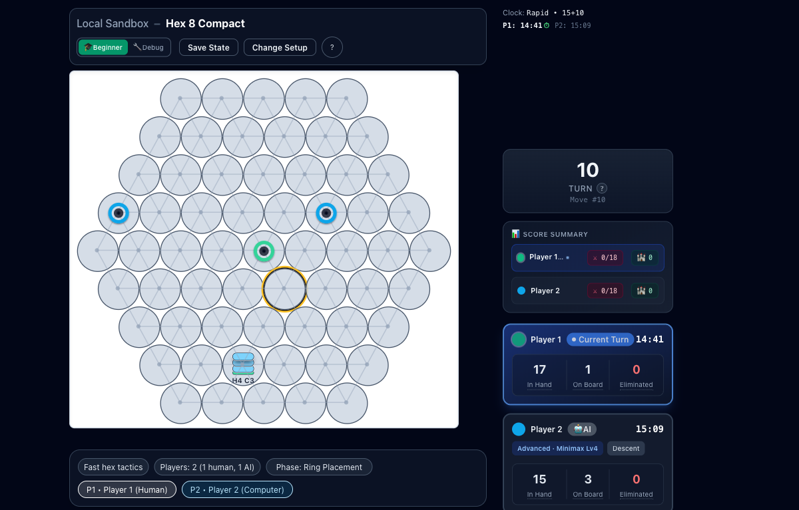

# RingRift

RingRift is a deterministic abstract board game and an AlphaZero-style training project built around it.

The repository contains:

- a playable web app
- a canonical TypeScript rules engine
- a Python AI/parity mirror
- a minimal self-play training loop used to produce the current results

## Why It Is Interesting

RingRift is not just another minimax toy. Moving stacks leaves markers behind, marker lines collapse into territory, and forced eliminations stop players from stalling forever. That creates a game with no randomness, a lot of tactical volatility, and multiplayer dynamics that are harder to model than the usual 2-player board benchmarks.

The strongest evidence so far is narrow but real:

- `hex8_2p`: `1500 -> 1979.8` Elo, `7` promotions
- `square8_2p`: `1500 -> 1782.0` Elo, `5` promotions

The honest caveat is that the proof is still concentrated in 2-player runs. Multiplayer and larger boards are interesting, but not yet convincingly solved.

For the full evidence and caveats, see [docs/RESULTS.md](/docs/RESULTS.md). For the exact commands, hyperparameters, and archived artifacts, see [docs/REPRODUCIBILITY.md](/docs/REPRODUCIBILITY.md). For the engineering retrospective on what broke and what actually worked, see [docs/LESSONS_LEARNED.md](/docs/LESSONS_LEARNED.md).

If you are reviewing the repository cold, start with [docs/REVIEWER_GUIDE.md](/docs/REVIEWER_GUIDE.md). It separates the supported product/research path from historical and operational surfaces.

The machine-readable boundary for AI/training review is [docs/data/ai_surface_manifest.json](/docs/data/ai_surface_manifest.json). It marks which Python modules and scripts are supported, experimental, or historical so a reviewer does not have to infer that from file count alone.

## What The Game Looks Like



This is a live `hex8` sandbox position from the public web client: compact hex board, stack-building ring placement, local AI opponent, and the sidecar HUD showing turn, score, and ring inventory. It is the most distinctive part of the project, and it already works end to end in the browser.

## Two-Minute Demo

The fastest way to see the product is the no-account Human-vs-AI sandbox:

```bash
git clone https://github.com/synaptent/RingRift.git
cd RingRift
npm install
npm run play
```

That opens `http://localhost:5173/sandbox?preset=hex8-1h-1ai`, matching the screenshot above. It does not require Docker, Postgres, Redis, or the Python AI service; if backend AI is unavailable, the browser sandbox uses the local AI fallback. To boot the local backend and database too, use:

```bash
npm run play:full
```

## Quick Start: Play The Game

For first contact, prefer `npm run play` above. For the full local development stack:

```bash
git clone https://github.com/synaptent/RingRift.git
cd RingRift
npm install
cp .env.example .env
docker compose up -d postgres redis
npm run db:migrate
npm run db:generate
npm run dev
```

Then open:

- client: `http://localhost:5173`
- server: `http://localhost:3000`

If you want the Python AI service running locally too:

```bash
cd ai-service
./setup.sh
./run.sh
```

More setup detail is in [QUICKSTART.md](/QUICKSTART.md).

## Quick Start: Train An AI

The supported training path is the minimal loop in [ai-service/scripts/minimal_alphazero_loop.py](/ai-service/scripts/minimal_alphazero_loop.py).

Example `square8_2p` run:

```bash
cd ai-service
export PYTHONPATH=.

python scripts/minimal_alphazero_loop.py \
  --model models/canonical_square8_2p.pth \
  --board-type square8 \
  --num-players 2 \
  --iterations 10 \
  --games-per-iter 100 \
  --selfplay-budget 128 \
  --eval-budget 128 \
  --lr 5e-5 \
  --lr-schedule fixed \
  --train-lr-scheduler none \
  --train-window 3 \
  --work-dir data/minimal_loop_square8_2p
```

That is the same supported loop family used for the published results. Local runs are useful for validation, but the headline Elo improvements came from much longer GH200 cluster runs.

If you want the curated wrapper instead of typing the full command, use:

```bash
./scripts/run_proven_experiment.sh square8_2p --print-only
```

## What Is Proven, And What Is Not

What is proven:

- the game is playable end to end in the web app
- the TypeScript engine is the canonical rules source of truth
- the Python service mirrors those rules closely enough for replay parity and training
- the minimal self-play loop can produce iterative NN improvement on at least two supported 2-player configurations

What is not proven yet:

- strong multiplayer training results
- large-board training maturity
- a general claim that every RingRift configuration trains well

## Supported Path Through The Repo

If you want the shortest path to understanding the project, use this order:

1. [README.md](/README.md)
2. [QUICKSTART.md](/QUICKSTART.md)
3. [docs/REVIEWER_GUIDE.md](/docs/REVIEWER_GUIDE.md)
4. [docs/RESULTS.md](/docs/RESULTS.md)
5. [docs/REPRODUCIBILITY.md](/docs/REPRODUCIBILITY.md)
6. [docs/ARCHITECTURE_OVERVIEW.md](/docs/ARCHITECTURE_OVERVIEW.md)
7. [docs/GAME_RULES.md](/docs/GAME_RULES.md)
8. [docs/rules/HUMAN_RULES.md](/docs/rules/HUMAN_RULES.md)

Core code directories:

- [`src/shared/engine`](/src/shared/engine): canonical game rules
- [`src/client`](/src/client): React frontend
- [`src/server`](/src/server): backend host using the shared engine
- [`ai-service/app`](/ai-service/app): Python AI, parity, and replay logic; start with [ai-service/app/README.md](/ai-service/app/README.md)
- [`ai-service/scripts`](/ai-service/scripts): training and validation entrypoints

## Trust-Building Checks

Useful validation commands for the supported path:

```bash
python3 scripts/check_github_workflows.py
python3 scripts/check_reviewer_surface.py
python3 scripts/check_ai_surface.py
python3 scripts/build_reviewer_packet.py --clean
bash scripts/check_supported_path.sh
npm run results:refresh
```

The `Supported Path` GitHub workflow runs the same core gate and publishes the reviewer packet as a CI artifact.

## What To Ignore At First

RingRift is historically layered. If you are evaluating whether it is interesting, do not start with the entire coordination/orchestration surface.

Treat these as secondary or historical until you need them:

- `docs/archive/`
- `ai-service/archive/`
- legacy coordinator and daemon paths under `ai-service/app/coordination`
- experimental, diagnostic, and broad ops scripts under `ai-service/scripts`

The shortest, most defensible story is: novel game, canonical engine, parity-checked Python mirror, and a minimal loop that really did make at least some models stronger.
