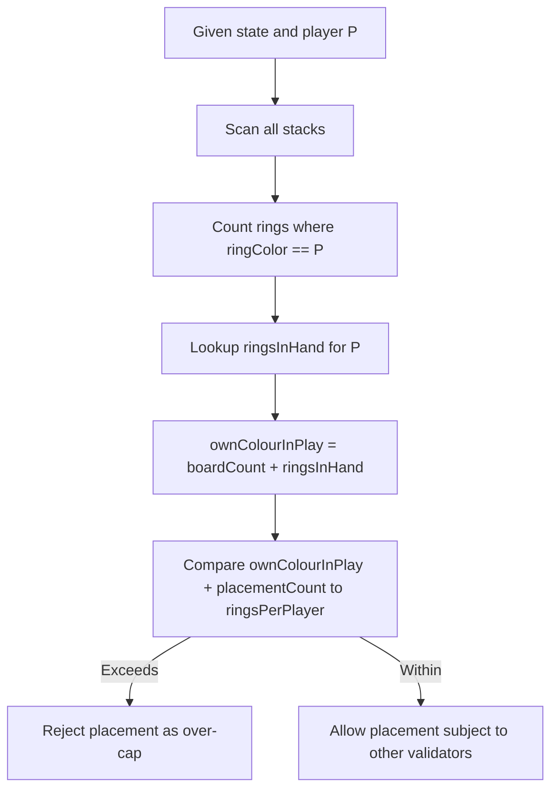

# RULES_ENGINE_R172_RINGCAP_IMPLEMENTATION_PLAN

## 3.1 Overview

### 3.1.1 Final semantics

**Last-player-standing victory (RR-CANON-R172, CLAR-002)**

Authoritative rule sources:

- [`RULES_CANONICAL_SPEC.md`](RULES_CANONICAL_SPEC.md:1) – updated R170–R173.
- [`ringrift_complete_rules.md`](ringrift_complete_rules.md:1) – narrative LPS discussion and examples.
- [`ringrift_compact_rules.md`](ringrift_compact_rules.md:1) – implementation-oriented LPS definition.
- [`RULES_RULESET_CLARIFICATIONS.md`](RULES_RULESET_CLARIFICATIONS.md:1) – CLAR-002 marked resolved.

Semantics to implement:

- **LPS is a true third victory condition** (alongside ring elimination and territory control), not just the final rung of a stalemate ladder.
- A player `P` wins by last-player-standing if and only if:
  1. There has been **at least one full round of turns** in which:
     - On each active player’s own turn in that round, **only P had any legal real action**.
     - Here, “real action” means at least one legal real move of type:
       - Ring placement,
       - Non-capture movement,
       - Overtaking capture (including the ability to _start_ a capture chain).
     - Having only forced elimination available **does not** count as a real action.
  2. At the start of `P`’s **next** turn (after that qualifying round), `P` is **still** the only player with any real action.

- Players with **no rings and no stacks on the board and no rings in hand** are permanently inactive and do not block LPS; they are skipped in turn order (consistent with existing `turnLogic`).

**Per-player ring cap (`ringsPerPlayer`, CLAR-003, R020, R081–R082)**

Authoritative rule sources:

- [`RULES_CANONICAL_SPEC.md`](RULES_CANONICAL_SPEC.md:1) – updated R020, R081–R082.
- [`ringrift_complete_rules.md`](ringrift_complete_rules.md:1) – ring supply section.
- [`ringrift_compact_rules.md`](ringrift_compact_rules.md:1) – board configs and `ringsPerPlayer`.
- [`RULES_RULESET_CLARIFICATIONS.md`](RULES_RULESET_CLARIFICATIONS.md:1) – CLAR-003 marked resolved.

Semantics to implement:

- `ringsPerPlayer` is an **own-colour supply cap only**:
  - For each player `P` on a given board type, at all times:
    - `ownColourRingsOnBoard(P) + ringsInHand(P) ≤ ringsPerPlayer(boardType)`.
  - `ownColourRingsOnBoard(P)` counts **every ring** of `P`’s colour in every stack on the board, regardless of who currently controls the stack.
  - Captured opponent-colour rings sitting under your cap **do not count** against your own cap; they still count toward the original owner’s total supply (board + hand + eliminated).
- Existing implementation approximates supply caps by summing stack heights for stacks a player _controls_; this must be replaced everywhere with a **ring-colour-based** count to match rules.

### 3.1.2 Goals of this implementation plan

- **Maintain strict TS ↔ Python parity**:
  - Back-end [`RuleEngine`](src/server/game/RuleEngine.ts:46) and client sandbox [`ClientSandboxEngine`](src/client/sandbox/ClientSandboxEngine.ts:107) must agree on LPS and placement legality.
  - Python [`GameEngine`](ai-service/app/game_engine.py:32) and [`DefaultRulesEngine`](ai-service/app/rules/default_engine.py:23) must mirror TS outcomes for all plateau/parity fixtures.
- **Preserve termination and S-invariant properties**:
  - LPS must never introduce non-terminating states (see [`RULES_TERMINATION_ANALYSIS.md`](RULES_TERMINATION_ANALYSIS.md:1)).
  - S-invariant (`S = markers + collapsed + eliminated`) monotonicity remains unchanged; early LPS simply stops some games earlier.
- **Minimise behavioural surprises**:
  - Existing tests that implicitly assume “play until bare-board stalemate” must be audited and updated to expect earlier LPS wins where applicable.
  - Ring cap behaviour should only differ where the old “controlled-stack height” approximation diverges from own-colour semantics; most ordinary cases should remain unchanged.

## 3.2 Affected Components (TS & Python)

### 3.2.1 TypeScript – shared engine & backend

Victory and termination:

- [`evaluateVictory()`](src/shared/engine/victoryLogic.ts:45)
  - Currently handles:
    - Ring-elimination (`reason: 'ring_elimination'`),
    - Territory-control (`reason: 'territory_control'`),
    - Bare-board stalemate ladder (territory → eliminated (with hand-conversion) → markers → last actor → `game_completed` / `last_player_standing`).
  - **Does not** implement early LPS as a separate victory path with stacks on the board.
- [`getLastActor()`](src/shared/engine/victoryLogic.ts:200)
  - Used only for stalemate tie-breaking; semantics remain but classification of last rung as “LPS” vs “game_completed” must be revisited.

Turn/phase sequencing and per-turn state:

- [`advanceTurnAndPhase()`](src/shared/engine/turnLogic.ts:135)
  - Canonical shared sequencer; owns:
    - Turn transitions through `ring_placement` → `movement`/`capture` → `line_processing` → `territory_processing`.
    - Forced-elimination triggering via [`TurnLogicDelegates.applyForcedElimination`](src/shared/engine/turnLogic.ts:87).
    - Skipping fully inactive players (no stacks, no rings in hand).
  - This is the **natural hook** for tracking per-turn real-action availability and round structure in a host-agnostic way.

Shared state and board helpers:

- [`GameState`](src/shared/types/game.ts:471)
  - Holds global fields such as `currentPlayer`, `currentPhase`, `gameStatus`, `moveHistory`, `history`, and thresholds.
  - Currently no explicit LPS-tracking metadata.
- [`BOARD_CONFIGS`](src/shared/types/game.ts:602)
  - Source of `ringsPerPlayer` for each board: 18 (square8), 36 (square19, hexagonal).
- [`MovementBoardView` and `hasAnyLegalMoveOrCaptureFromOnBoard()`](src/shared/engine/core.ts:173)
  - Core reachability helper for non-capture moves and overtaking captures; used both for no-dead-placement and forced elimination.
- **New shared helper (to be added)**:
  - A ring-colour-based counting helper in [`core.ts`](src/shared/engine/core.ts:1) or a small new module, e.g.:
    - [`countRingsInPlayForPlayer()`](src/shared/engine/core.ts) – see §3.4.

Backend rules engine orchestration:

- [`RuleEngine`](src/server/game/RuleEngine.ts:46)
  - Validation:
    - [`validateRingPlacement()`](src/server/game/RuleEngine.ts:161)
    - [`validateSkipPlacement()`](src/server/game/RuleEngine.ts:116)
  - Move enumeration:
    - [`getValidRingPlacements()`](src/server/game/RuleEngine.ts:839)
    - [`getValidMoves()`](src/server/game/RuleEngine.ts:752)
  - Victory:
    - [`checkGameEnd()`](src/server/game/RuleEngine.ts:728) – wraps [`evaluateVictory()`](src/shared/engine/victoryLogic.ts:45).
  - Currently enforces ring caps using _controlled stack heights_ as a proxy for “rings on board”.

Backend game engine:

- [`GameEngine`](src/server/game/GameEngine.ts:92)
  - Turn orchestration via [`advanceGame()`](src/server/game/GameEngine.ts:2029) and TS `TurnEngine`.
  - Automatic consequences via [`processAutomaticConsequences()`](src/server/game/GameEngine.ts:1150).
  - Victory detection:
    - Uses [`RuleEngine.checkGameEnd()`](src/server/game/RuleEngine.ts:728) inside [`makeMove()`](src/server/game/GameEngine.ts:391) and decision flows.
  - Per-turn state:
    - `hasPlacedThisTurn`, `mustMoveFromStackKey`,
    - Chain capture state and pending self-elimination flags.
  - **New responsibility**: maintain LPS metadata across turns and call victory checks at the correct LPS evaluation point (start of candidate’s turn).

Backend–sandbox parity harness:

- [`RulesBackendFacade`](src/server/game/RulesBackendFacade.ts:1)
  - Bridges between TS GameEngine and Python rules service.
  - Must be used to cross-check new LPS outcomes and ring-cap placement legality.

### 3.2.2 TypeScript – client sandbox parity

Sandbox engine and placement helpers:

- [`ClientSandboxEngine`](src/client/sandbox/ClientSandboxEngine.ts:307)
  - Applies canonical moves, maintains a sandbox `GameState`, and mirrors backend turn/phase logic.
  - Turn lifecycle:
    - [`startTurnForCurrentPlayer()`](src/client/sandbox/ClientSandboxEngine.ts:828)
    - [`advanceTurnAndPhaseForCurrentPlayer()`](src/client/sandbox/ClientSandboxEngine.ts:878)
  - Placement logic:
    - [`tryPlaceRings()`](src/client/sandbox/ClientSandboxEngine.ts:1615)
    - Uses shared placement helpers in [`sandboxPlacement.ts`](src/client/sandbox/sandboxPlacement.ts:1).
  - Victory:
    - [`checkAndApplyVictory()`](src/client/sandbox/ClientSandboxEngine.ts:1389) delegating to sandbox game-end helpers.

- [`sandboxPlacement.ts`](src/client/sandbox/sandboxPlacement.ts:1)
  - Hypothetical placement helper: [`createHypotheticalBoardWithPlacement()`](src/client/sandbox/sandboxPlacement.ts:29).
  - No-dead-placement reachability: [`hasAnyLegalMoveOrCaptureFrom()`](src/client/sandbox/sandboxPlacement.ts:85).
  - Legal placement enumeration:
    - [`enumerateLegalRingPlacements()`](src/client/sandbox/sandboxPlacement.ts:125)
    - When passed a [`PlacementContext`](src/shared/engine/validators/PlacementValidator.ts:10), already delegates to shared [`validatePlacementOnBoard()`](src/shared/engine/validators/PlacementValidator.ts:76); otherwise uses a legacy geometry-only path.

Sandbox victory and structural stalemate:

- [`sandboxVictory.ts`](src/client/sandbox/sandboxVictory.ts:1)
  - [`checkSandboxVictory()`](src/client/sandbox/sandboxVictory.ts:70) – wraps shared [`evaluateVictory()`](src/shared/engine/victoryLogic.ts:45).
- [`sandboxGameEnd.ts`](src/client/sandbox/sandboxGameEnd.ts:31)
  - [`resolveGlobalStalemateIfNeededSandbox()`](src/client/sandbox/sandboxGameEnd.ts:31)
  - [`checkAndApplyVictorySandbox()`](src/client/sandbox/sandboxGameEnd.ts:117)
  - These mirror structural terminality logic (bare-board stalemate) and must remain consistent once early LPS is added.

### 3.2.3 Python rules engine

Core engine and victory:

- [`GameEngine`](ai-service/app/game_engine.py:32)
  - Move enumeration:
    - [`get_valid_moves()`](ai-service/app/game_engine.py:43)
  - State transitions:
    - [`apply_move()`](ai-service/app/game_engine.py:116)
  - Victory logic:
    - [`_check_victory()`](ai-service/app/game_engine.py:268) – ring elimination, territory, and minimal global structural terminality.
    - Currently has **no early LPS path**; only terminates early on:
      - Elimination threshold crossed,
      - Territory threshold crossed,
      - No stacks and no rings in hand (bare-board stalemate), using a TS-aligned ladder.

- Turn/phase updates and forced elimination:
  - [`_update_phase()`](ai-service/app/game_engine.py:405)
  - [`_advance_to_line_processing()`](ai-service/app/game_engine.py:515)
  - [`_advance_to_territory_processing()`](ai-service/app/game_engine.py:525)
  - [`_end_turn()`](ai-service/app/game_engine.py:559)
  - Forced-elimination helpers:
    - [`_has_valid_actions()`](ai-service/app/game_engine.py:1814)
    - [`_get_forced_elimination_moves()`](ai-service/app/game_engine.py:1832)
    - [`_perform_forced_elimination_for_player()`](ai-service/app/game_engine.py:1873)

Ring-cap computation and placement:

- [`_estimate_rings_per_player()`](ai-service/app/game_engine.py:783)
  - TS-aligned `ringsPerPlayer` per board type.
- Placement enumeration:
  - [`_get_ring_placement_moves()`](ai-service/app/game_engine.py:1425)
    - Computes `rings_on_board` as sum of stack heights for stacks **controlled** by the player, then applies per-player cap using this approximation.
- Placement validation:
  - [`PlacementValidator`](ai-service/app/rules/validators/placement.py:6)
    - [`validate()`](ai-service/app/rules/validators/placement.py:7)
    - Checks:
      - Phase/turn,
      - Rings in hand,
      - Board geometry and occupancy (collapsed spaces, markers),
      - Per-stack placement-count rules (1 on existing stack, 1–3 on empty),
      - No-dead-placement via:
        - [`GameEngine._create_hypothetical_board_with_placement()`](ai-service/app/game_engine.py:873)
        - [`GameEngine._has_any_movement_or_capture_after_hypothetical_placement()`](ai-service/app/game_engine.py:1295)
    - **Does not** currently enforce a per-player ring cap based on own-colour count; relies on the move generator to avoid emitting over-cap placements.

Rules abstraction and mutators:

- [`DefaultRulesEngine`](ai-service/app/rules/default_engine.py:23)
  - Delegates `get_valid_moves()` to [`GameEngine.get_valid_moves()`](ai-service/app/game_engine.py:43).
  - Uses placement validator/mutator:
    - [`PlacementValidator`](ai-service/app/rules/validators/placement.py:6)
    - [`PlacementMutator`](ai-service/app/rules/mutators/placement.py:6)
  - Mutator-first path must remain consistent with new ring-cap semantics.
- [`rules/core.py`](ai-service/app/rules/core.py:1)
  - Currently holds geometry and S-invariant helpers; a natural home for a new Python-side own-colour ring-count helper.

### 3.2.4 Tests and invariants (TS & Python)

TypeScript tests:

- Victory and termination:
  - [`victory.shared.test.ts`](tests/unit/victory.shared.test.ts:1)
  - [`GameEngine.victory.scenarios.test.ts`](tests/unit/GameEngine.victory.scenarios.test.ts:1)
  - [`RulesMatrix.Victory.GameEngine.test.ts`](tests/scenarios/RulesMatrix.Victory.GameEngine.test.ts:1)
  - [`RulesMatrix.Victory.ClientSandboxEngine.test.ts`](tests/scenarios/RulesMatrix.Victory.ClientSandboxEngine.test.ts:1)
  - [`ForcedEliminationAndStalemate.test.ts`](tests/scenarios/ForcedEliminationAndStalemate.test.ts:1)
- Placement and ring caps:
  - [`placement.shared.test.ts`](tests/unit/placement.shared.test.ts:1)
  - [`PlacementParity.RuleEngine_vs_Sandbox.test.ts`](tests/unit/PlacementParity.RuleEngine_vs_Sandbox.test.ts:1)
  - Any tests inspecting placement error codes like `NO_RINGS_AVAILABLE` and capacity boundaries.
- Cross-engine parity:
  - [`VictoryParity.RuleEngine_vs_Sandbox.test.ts`](tests/unit/VictoryParity.RuleEngine_vs_Sandbox.test.ts:1)
  - [`RulesBackendFacade.fixtureParity.test.ts`](tests/unit/RulesBackendFacade.fixtureParity.test.ts:1)
  - [`Python_vs_TS.traceParity.test.ts`](tests/unit/Python_vs_TS.traceParity.test.ts:1)
  - Trace and plateau tests under `tests/unit/TraceParity.*.test.ts` and `tests/scenarios/AI_TerminationFromSeed1Plateau.test.ts`.

Python tests:

- Rules engine correctness and evaluation:
  - [`test_rules_evaluate_move.py`](ai-service/tests/test_rules_evaluate_move.py:1)
  - [`test_rules_global_state_guard.py`](ai-service/tests/test_rules_global_state_guard.py:1)
- Invariants around “active but no moves”:
  - [`test_active_no_moves_movement_forced_elimination_regression.py`](ai-service/tests/invariants/test_active_no_moves_movement_forced_elimination_regression.py:1)
  - [`test_active_no_moves_movement_fully_eliminated_regression.py`](ai-service/tests/invariants/test_active_no_moves_movement_fully_eliminated_regression.py:1)
  - [`test_active_no_moves_movement_placements_only_regression.py`](ai-service/tests/invariants/test_active_no_moves_movement_placements_only_regression.py:1)
  - [`test_active_no_moves_territory_processing_regression.py`](ai-service/tests/invariants/test_active_no_moves_territory_processing_regression.py:1)
- Parity harnesses:
  - [`test_rules_parity.py`](ai-service/tests/parity/test_rules_parity.py:1)
  - [`test_rules_parity_fixtures.py`](ai-service/tests/parity/test_rules_parity_fixtures.py:1)
  - [`test_ts_seed_plateau_snapshot_parity.py`](ai-service/tests/parity/test_ts_seed_plateau_snapshot_parity.py:1)
  - Plateau progress tests such as [`test_ai_plateau_progress.py`](ai-service/tests/parity/test_ai_plateau_progress.py:1).

These suites need targeted updates and new cases to cover:

- Early LPS (R172) in non-stalemate positions.
- Own-colour-only `ringsPerPlayer` caps, including mixed-colour stacks with many captured opponent rings.

## 3.3 Detailed Plan – Last-Player-Standing (R172)

This section describes **state representation**, **real-action classification**, and **victory integration** for both TypeScript and Python, plus test design and invariants.

### 3.3.1 State representation for LPS detection

#### TypeScript

**Objectives**

- Track sufficient metadata to evaluate R172 at the **start of a player’s turn** without re-simulating the entire move history.
- Keep the shared victory helper [`evaluateVictory()`](src/shared/engine/victoryLogic.ts:45) as the single canonical place where LPS is actually declared.
- Avoid storing bulky per-turn logs; instead, maintain compact summary state that is updated at well-defined points in the turn pipeline.

**Proposed additional state**

Rather than adding LPS fields to the wire-level [`GameState`](src/shared/types/game.ts:471), we keep LPS tracking **host-internal** on the backend engine and sandbox, mirroring the existing pattern for `hasPlacedThisTurn` and chain capture state:

- Backend [`GameEngine`](src/server/game/GameEngine.ts:92):
  - New private fields:
    - `private lpsRoundIndex: number = 0;`
    - `private lpsCurrentRoundActorMask: Map<number, boolean>` (or `{ [playerNumber: number]: boolean }`) – records, for the **current** round, whether each player has had **any real action available** at the start of their most recent turn in this round.
    - `private lpsExclusivePlayerForCompletedRound: number | null = null;`
      - If, at the end of a completed round, exactly one player had real actions on every turn in that round, this is set to that player; otherwise `null`.
    - `private lpsLastEvaluatedTurnPlayer: number | null = null;` – optional, for diagnostics and consistency checks.

- Client [`ClientSandboxEngine`](src/client/sandbox/ClientSandboxEngine.ts:307):
  - Mirror the same internal fields with sandbox-specific naming:
    - `private _lpsRoundIndex: number = 0;`
    - `private _lpsCurrentRoundActorMask: Map<number, boolean>;`
    - `private _lpsExclusivePlayerForCompletedRound: number | null = null;`

These fields are **not** part of `GameState` and therefore do not affect snapshots, DB storage, or TS↔Python interchange. LPS victory decisions remain purely a function of:

- The current `GameState` (for _who currently has real actions_), and
- The engine’s internal round-tracking state (for _whether a full prior round was already exclusively owned by the candidate_).

**Turn-pipeline integration points**

- **Backend TS**:
  - Hook into [`advanceGame()`](src/server/game/GameEngine.ts:2029) to detect **start-of-turn events** for interactive players:
    - After `advanceGameForCurrentPlayer` returns and any automatic phases are stepped via [`stepAutomaticPhasesForTesting()`](src/server/game/GameEngine.ts:2789), identify the moment where:
      - `gameStatus === 'active'`, and
      - `currentPhase` is one of the interactive phases (`ring_placement`, `movement`, `capture`, `chain_capture`).
    - At that point, call a new private helper, e.g.:
      - [`updateLpsRoundTrackingForCurrentPlayer()`](src/server/game/GameEngine.ts) which:
        - Computes whether the **current player** has any real actions (see §3.3.2).
        - Updates `lpsCurrentRoundActorMask` and handles round boundaries (increment `lpsRoundIndex`, roll mask, and compute `lpsExclusivePlayerForCompletedRound` when a round completes).
- **Sandbox TS**:
  - Use the same conceptual hook in [`startTurnForCurrentPlayer()`](src/client/sandbox/ClientSandboxEngine.ts:828):
    - At the point where sandbox turn state is initialised for the new active player, call a mirror helper:
      - [`updateLpsRoundTrackingForCurrentPlayerSandbox()`](src/client/sandbox/ClientSandboxEngine.ts)
    - Keep the round-index and mask semantics parallel to the backend.

**Round boundary definition**

- A “round” for R172 is defined over **players who can ever act again** under current material, mirroring TS turn skipping:
  - In backend: players who would not be skipped by [`TurnLogicDelegates.getPlayerStacks()`](src/shared/engine/turnLogic.ts:58) and `ringsInHand > 0` logic in [`advanceTurnAndPhase()`](src/shared/engine/turnLogic.ts:221–255).
  - Rather than re-encoding seat order in LPS logic, treat a round as:

    > The sequence of interactive turns produced by successive calls to `advanceGameForCurrentPlayer/advanceTurnAndPhaseForCurrentPlayerSandbox` that visit each **non-eliminated** player at least once before returning to a given player.

- Implementation strategy:
  - Maintain a simple scalar `numActiveSeats` derived from `GameState.players` filtered by “has stacks or rings in hand”.
  - Each time an interactive turn for some player `X` begins:
    - If that player is the **first active in a new cycle** (e.g. we just rotated past the last seat), increment `lpsRoundIndex`, reset `lpsCurrentRoundActorMask`, and clear `lpsExclusivePlayerForCompletedRound` for the new round.
  - When `lpsCurrentRoundActorMask` has recorded flags for all active players in the current cycle, we have completed a round; see §3.3.3 for candidate derivation.

This algorithm can be implemented host-side without any shared `GameState` changes; only the engines need to maintain these counters.

#### Python

Python’s [`GameEngine`](ai-service/app/game_engine.py:32) currently uses **static methods** and treats `GameState` as the full state carrier. For LPS we have two options:

1. Make `_check_victory()` and related functions instance methods and store LPS-tracking fields on `GameEngine` itself; or
2. Keep `_check_victory()` static and add small, optional LPS metadata fields to the `GameState` Pydantic model.

To keep the architecture closer to TS (where LPS metadata is engine-internal) but without rewriting the Python model layer in this task, prefer option 2:

- Extend Python [`GameState`](ai-service/app/models.py:1) with optional LPS fields:
  - `lps_round_index: int = 0`
  - `lps_current_round_actor_mask: dict[int, bool] = {}` (or `Dict[int, bool]`)
  - `lps_exclusive_player_for_completed_round: int | None = None`
- Maintain these fields inside `GameEngine` turn helpers:
  - In [`_end_turn()`](ai-service/app/game_engine.py:559):
    - After selecting the next `current_player` and deciding their starting phase, call a new helper, e.g. [`_update_lps_round_tracking_for_current_player()`](ai-service/app/game_engine.py:1xx0).
  - On game start, initialise these fields once based on the first active player.

These fields are only used inside [`_check_victory()`](ai-service/app/game_engine.py:268) to determine whether the LPS preconditions (one full prior round of exclusive real actions) have been met.

### 3.3.2 Definition and detection of “real actions”

#### Common semantics

For implementors (TS and Python):

- **Real actions** (count as “can still really play” for R172):
  - Ring placement:
    - TS: `MoveType 'place_ring'`.
    - Python: `MoveType.PLACE_RING`.
  - Non-capture movement:
    - TS: `MoveType 'move_stack'` and legacy `MoveType 'move_ring'` / `'build_stack'`.
    - Python: `MoveType.MOVE_STACK` (and `MOVE_RING` / `BUILD_STACK` if present).
  - Overtaking capture initiation:
    - TS: `MoveType 'overtaking_capture'`.
    - Python: `MoveType.OVERTAKING_CAPTURE`.

- **Not real actions** (must **not** satisfy R172 real-action predicate):
  - `skip_placement` / `MoveType.SKIP_PLACEMENT` – phase control only; relies on underlying movement/capture availability.
  - Any forced elimination or internal elimination moves, including:
    - TS host-only forced elimination in [`TurnEngine`](src/server/game/turn/TurnEngine.ts:1).
    - Python `MoveType.FORCED_ELIMINATION` and `MoveType.ELIMINATE_RINGS_FROM_STACK` when used purely as self/forced elimination decisions.
  - Line-processing and territory-processing moves:
    - TS: `'process_line'`, `'choose_line_reward'`, `'process_territory_region'`, `'eliminate_rings_from_stack'`, legacy `'line_formation'`, `'territory_claim'`.
    - Python: `PROCESS_LINE`, `CHOOSE_LINE_REWARD`, `PROCESS_TERRITORY_REGION`, `TERRITORY_CLAIM`, etc.
  - Any future bookkeeping-only move types that do not change which players have real actions.

In practice, for both languages we should **not** classify moves by type directly; instead, we classify via availability functions:

- TS: new host-side helper `hasAnyRealActionForPlayer(state, playerNumber)`:
  - Implementation idea:
    - Use backend’s `RuleEngine` or shared enumeration primitives to test quickly:
      - Does `getValidMoves(state).filter(...)` contain any `place_ring`, `move_stack`/`move_ring`/`build_stack`, or `overtaking_capture` moves for that player?
    - Or, more efficiently, expose a small shared helper modelled on Python `_has_valid_actions()`:
      - Evaluate:
        - “Has any placement?” via a light wrapper around [`getValidRingPlacements()`](src/server/game/RuleEngine.ts:839) or a dedicated `hasAnyPlacement` call.
        - “Has any movement?” via enumeration over [`getValidStackMovements()`](src/server/game/RuleEngine.ts:925).
        - “Has any capture?” via [`getValidCaptures()`](src/server/game/RuleEngine.ts:985).
- Python: reuse [`_has_valid_actions()`](ai-service/app/game_engine.py:1814) as the canonical “real action available?” predicate for LPS (forced elimination is not considered here).

**Sandbox TS mapping**

- For the sandbox, `hasAnyRealActionForPlayer` should be implemented using the same logic as backend, but via sandbox-specific enumerators:
  - Placement: [`enumerateLegalRingPlacements()`](src/client/sandbox/sandboxPlacement.ts:125) with an appropriate [`PlacementContext`](src/shared/engine/validators/PlacementValidator.ts:10), ignoring `SKIP_PLACEMENT`.
  - Movement: [`enumerateSimpleMovementLandings()`](src/client/sandbox/ClientSandboxEngine.ts:618).
  - Capture: [`enumerateCaptureSegmentsFrom()`](src/client/sandbox/ClientSandboxEngine.ts:681) or capture enumerators in [`sandboxMovementEngine.ts`](src/client/sandbox/sandboxMovementEngine.ts:59).

### 3.3.3 LPS check integration in victory logic

#### TypeScript

**1. Host-side LPS round tracking**

Implement a backend helper on [`GameEngine`](src/server/game/GameEngine.ts:92), e.g.:

- [`updateLpsRoundTrackingForCurrentPlayer()`](src/server/game/GameEngine.ts):
  - Inputs:
    - Current `GameState` snapshot,
    - Current player number `P = gameState.currentPlayer`,
    - A predicate `hasAnyRealActionForPlayer(state, P)` as described in §3.3.2.
  - Responsibilities:
    - Compute `hasRealActionForP`.
    - Update `lpsCurrentRoundActorMask[P] = hasRealActionForP`.
    - Detect when a full round has completed:
      - Maintain a set or count of active seats (players with stacks or rings in hand).
      - When all such players have entries in `lpsCurrentRoundActorMask` for this round, mark the round complete:
        - If exactly one player `Q` in the mask has `true`, set:
          - `lpsExclusivePlayerForCompletedRound = Q`.
        - Otherwise, set:
          - `lpsExclusivePlayerForCompletedRound = null`.
        - Reset mask for next round and increment `lpsRoundIndex`.
    - Called:
      - At the start of a player’s interactive turn after `advanceGame` or `startTurnForCurrentPlayerSandbox`.

Mirror this helper in [`ClientSandboxEngine`](src/client/sandbox/ClientSandboxEngine.ts:307) with sandbox-specific enumerations.

**2. LPS declaration in shared victory logic**

Extend [`evaluateVictory()`](src/shared/engine/victoryLogic.ts:45) to declare early last-player-standing wins as follows:

1. Preserve existing ordering for primary victories:

   ```ts
   // 1) Ring-elimination victory
   // 2) Territory-control victory
   ```

2. Insert a new R172 check **before** the bare-board structural terminality path:

   ```ts
   // 3) Early last-player-standing victory (RR-CANON-R172).
   const lpsWinner = evaluateLastPlayerStandingCandidate(state);
   if (lpsWinner !== undefined) {
     return {
       isGameOver: true,
       winner: lpsWinner,
       reason: 'last_player_standing',
       handCountsAsEliminated: false,
     };
   }

   // 4) Bare-board structural terminality & global stalemate ...
   ```

3. Implement [`evaluateLastPlayerStandingCandidate()`](src/shared/engine/victoryLogic.ts) as a pure helper that uses only the **current** `GameState` plus **engine-maintained metadata** exposed via conventions:
   - `state.gameStatus` must be `'active'`.
   - LPS should **only** be considered at the **start of an interactive turn**:
     - Engines must ensure they call `RuleEngine.checkGameEnd()` or sandbox `checkAndApplyVictory()` at the start of each player’s turn, immediately after updating internal LPS round tracking.
   - The helper can be parameterised with:
     - `candidateFromPreviousRound: number | undefined` – supplied by host via an optional field on `GameState` or by a per-engine call-time argument.
   - Plan for TS:
     - For minimal TS surface change, we **do not** add LPS metadata to `GameState`. Instead:
       - Backend:
         - After `advanceGame()` and `stepAutomaticPhasesForTesting()`, but before restarting the active player’s timer, add a second call to `RuleEngine.checkGameEnd()` which:
           - Passes current `GameState`.
           - Has access to `GameEngine`’s `lpsExclusivePlayerForCompletedRound` and current `currentPlayer`.
           - Only allows LPS if:
             - `candidateFromPreviousRound === currentPlayer`, and
             - `hasAnyRealActionForPlayer(state, currentPlayer)` is still `true`, and
             - All _other_ players have no real actions (`hasAnyRealActionForPlayer(state, q) === false` for each q still with material).

       - Sandbox:
         - In [`advanceAfterMovement()`](src/client/sandbox/ClientSandboxEngine.ts:1715) and in the placement path, after phases have been advanced and before scheduling AI/human turns, call [`checkAndApplyVictory()`](src/client/sandbox/ClientSandboxEngine.ts:1389), which in turn calls [`checkSandboxVictory()`](src/client/sandbox/sandboxVictory.ts:70). That function should be extended to dispatch an LPS check similar to TS backend, using sandbox’s own LPS tracking state.

     - To keep [`evaluateVictory()`](src/shared/engine/victoryLogic.ts:45) free of engine-internal metadata, **LPS detection is conceptually split**:
       - Engine-level code is responsible for:
         - Determining whether an LPS candidate exists per R172,
         - Calling shared `evaluateVictory()` only for elimination/territory/structural conditions,
         - When R172 triggers, directly setting `gameStatus`, `winner`, and using `reason: 'last_player_standing'` in host-specific `GameResult` builders.
       - This approach avoids injecting per-engine LPS state into the shared types, and keeps the shared evaluator focused on ring/territory/stalemate.

Given the strong existing pattern that [`evaluateVictory()`](src/shared/engine/victoryLogic.ts:45) is used only for elimination/territory/stalemate, this plan keeps LPS **engine-local** while still using the shared victory reason `'last_player_standing'` for final reporting.

**3. Backend call sites**

- Modify [`GameEngine.makeMove()`](src/server/game/GameEngine.ts:391) to perform an **additional LPS-aware victory check** at the start of each new interactive turn:
  - After:

    ```ts
    this.advanceGame();
    await this.stepAutomaticPhasesForTesting();
    ```

  - If `this.gameState.gameStatus === 'active'` and currentPhase is interactive:
    - Call a new private helper, e.g. [`maybeEndGameByLastPlayerStanding()`](src/server/game/GameEngine.ts), which:
      - Reads internal LPS tracking state,
      - Uses backend implementations of `hasAnyRealActionForPlayer`,
      - If R172 is satisfied, calls [`endGame(winner, 'last_player_standing')`](src/server/game/GameEngine.ts:2136).

- Ensure that `RuleEngine.checkGameEnd()` remains the single entry for ring-elimination, territory, and structural stalemate; LPS is an **additional** host-level termination path.

**4. Sandbox integration**

- In [`ClientSandboxEngine`](src/client/sandbox/ClientSandboxEngine.ts:369):
  - After advancing to the next player/phase in `advanceAfterMovement()` and `tryPlaceRings()`, call a new helper:
    - [`maybeEndSandboxGameByLastPlayerStanding()`](src/client/sandbox/ClientSandboxEngine.ts), which:
      - Uses sandbox’s LPS tracking fields and sandbox-appropriate `hasAnyRealActionForPlayer` implementation.
      - When R172 triggers, sets sandbox `gameStatus` to `'completed'`, populates [`victoryResult`](src/client/sandbox/ClientSandboxEngine.ts:419) with `reason: 'last_player_standing'`, and normalises `currentPhase` to `'ring_placement'` for terminal snapshots (mirroring backend).

- Extend [`checkSandboxVictory()`](src/client/sandbox/sandboxVictory.ts:70) only if desired; the primary LPS detection path can live in `ClientSandboxEngine` similarly to the backend.

#### Python

**1. Real-action availability**

- Reuse [`_has_valid_actions()`](ai-service/app/game_engine.py:1814) as the R172 “real action available?” predicate.
- Define a small, explicit helper:
  - [`_has_real_action_for_player(game_state, player_number)`](ai-service/app/game_engine.py:1xxx) which simply wraps `_has_valid_actions()` but documents that it excludes forced elimination.

**2. Round tracking**

- Implement `_update_lps_round_tracking_for_current_player()` in [`GameEngine`](ai-service/app/game_engine.py:1xxx):
  - Use the same conceptual fields as in TS but stored on `GameState`:
    - `game_state.lps_round_index`,
    - `game_state.lps_current_round_actor_mask`,
    - `game_state.lps_exclusive_player_for_completed_round`.
  - Called:
    - From `_end_turn()` when selecting the next active `current_player` and starting phase.
    - On game start, immediately after initialising `current_player` and `current_phase`.

- Algorithm sketch (mirroring TS):
  - Let `P = game_state.current_player`.
  - Compute `has_real_action = _has_real_action_for_player(game_state, P)`.
  - Update `game_state.lps_current_round_actor_mask[P] = has_real_action`.
  - Determine active players (`has_stacks` or `rings_in_hand > 0`).
  - When the mask has entries for all active players, complete the round:
    - If exactly one player `Q` has `True` in the mask:
      - `game_state.lps_exclusive_player_for_completed_round = Q`.
    - Else:
      - `game_state.lps_exclusive_player_for_completed_round = None`.
    - Increment `game_state.lps_round_index` and reset the mask.

**3. LPS check in `_check_victory()`**

- Extend [`_check_victory()`](ai-service/app/game_engine.py:268) to include R172 before structural terminality:
  1. Keep existing ring-elimination and territory victory checks unchanged.
  2. Insert new R172 logic:

     ```py
     # 3. Early last-player-standing victory (RR-CANON-R172).
     candidate = getattr(game_state, "lps_exclusive_player_for_completed_round", None)
     if candidate is not None:
         # Re-evaluate real actions at the start of candidate's next turn.
         if (
             game_state.current_player == candidate
             and _has_real_action_for_player(game_state, candidate)
         ):
             # Ensure all other players with material have no real actions.
             others_have_actions = any(
                 _has_real_action_for_player(game_state, p.player_number)
                 for p in game_state.players
                 if p.player_number != candidate
                 and (
                     any(s.controlling_player == p.player_number for s in game_state.board.stacks.values())
                     or p.rings_in_hand > 0
                 )
             )
             if not others_have_actions:
                 game_state.game_status = GameStatus.FINISHED
                 game_state.winner = candidate
                 return
     ```

  3. Leave the bare-board structural terminality and tie-breaker logic in place for stalemate cases.

- Ensure `_check_victory()` is called after each `apply_move()` as it already is.

### 3.3.4 Test design for LPS

#### TypeScript tests

Add new focused LPS tests and update existing scenario suites.

1. **Minimal 3-player LPS success (TS backend)**
   - File: [`tests/unit/GameEngine.victory.LPS.scenarios.test.ts`](tests/unit/GameEngine.victory.LPS.scenarios.test.ts:1) (new).
   - Scenario:
     - 3-player square8 game.
     - Construct a sequence of moves where:
       - Player 1 (`P1`) retains at least one real action (e.g. a legal `place_ring` or `move_stack`),
       - Players 2 and 3 are driven into states where they:
         - Still have stacks or rings, but
         - At the start of their turns, `_has_valid_actions` (TS/Python analogue) returns false so they can only undergo forced elimination, or
         - Have no stacks and no rings in hand and are skipped entirely.
       - This pattern persists for a full round.
       - At the start of `P1`’s next turn, no other player has any real actions.
     - Assertions:
       - `GameEngine.makeMove()` produces a terminal state with:
         - `gameState.gameStatus === 'completed'`,
         - `gameState.winner === 1`,
         - `gameResult.reason === 'last_player_standing'` in the server result.

   - Link to rules:
     - Validates RR-CANON-R172 and CLAR-002 basic example.

2. **LPS candidate reset when another player regains real actions**
   - File: same as above.
   - Scenario:
     - Start from a state where `P1` appears close to LPS (others nearly blocked).
     - Have `P1` perform a move that **re-opens** real actions for `P2` (e.g. move or capture that clears a path).
     - Ensure that:
       - In the next round, `P2`’s `hasAnyRealActionForPlayer` returns true at the start of their turn.
       - LPS tracking resets (no candidate for that completed round).
       - No LPS win is declared at `P1`’s next turn start.

3. **Forced elimination does not count as a real action**
   - File: same.
   - Scenario:
     - Construct a 3-player position where for `P2` and `P3`:
       - At the start of their turns they have stacks but `_has_valid_actions` is false, so forced elimination is triggered by `TurnEngine`.
     - Confirm via test hooks or logs that:
       - The players undergoing forced elimination do **not** cause `lpsCurrentRoundActorMask[player]` to be set `true`.
     - After a full round of such turns with `P1` being the only player with `hasAnyRealActionForPlayer === true`, verify that:
       - LPS win is declared as in test (1), even though `P2`/`P3` have had forced eliminations.

4. **Sandbox parity**
   - File: [`tests/unit/ClientSandboxEngine.victory.test.ts`](tests/unit/ClientSandboxEngine.victory.test.ts:1) – extend or add new case.
   - Mirror scenarios (1)–(3) using the sandbox engine:
     - Use `ClientSandboxEngine.applyCanonicalMove()` to apply the same move sequence as the backend.
     - Assert identical terminal `GameResult` (winner and `reason: 'last_player_standing'`) and matching `GameState` snapshots up to expected differences (e.g., history details).

#### Python tests

1. **Core R172 behaviour**
   - Extend [`test_rules_evaluate_move.py`](ai-service/tests/test_rules_evaluate_move.py:1):
     - Build a 3-player `GameState` mirroring the TS scenario.
     - Apply the same sequence of moves via [`DefaultRulesEngine.apply_move()`](ai-service/app/rules/default_engine.py:285) or [`GameEngine.apply_move()`](ai-service/app/game_engine.py:116).
     - After the sequence, assert:
       - `game_state.game_status == GameStatus.FINISHED`,
       - `game_state.winner == 1`.
     - Cross-check parity with TS using the plateau/parity fixtures (see §3.5).

2. **Invariants interaction**
   - In the invariants suite under `ai-service/tests/invariants/`:
     - Add tests that ensure:
       - When R172 fires, it does **not** violate `STRICT_NO_MOVE_INVARIANT`:
         - After the final LPS-triggering move, either:
           - The winning state is terminal (no further invariant checks), or
           - If `_assert_active_player_has_legal_action()` is still invoked, it recognises that game is non-active or the winner has legal actions (which is allowed).
       - Early LPS does not interfere with the existing “active but no moves” regression tests; some tests may need to be adjusted to expect earlier termination in newly LPS-eligible scenarios.

3. **Parity tests**
   - Extend or add plateau parity tests:
     - [`test_rules_parity.py`](ai-service/tests/parity/test_rules_parity.py:1)
     - [`test_ts_seed_plateau_snapshot_parity.py`](ai-service/tests/parity/test_ts_seed_plateau_snapshot_parity.py:1)
   - Design new parity fixture(s) where:
     - The TS engine and Python engine reach an identical game state at the point where an LPS win should be declared.
     - Both report the same winner and treat that step as the terminal snapshot.

### 3.3.5 Backwards-compatibility & invariants

- **Existing TS stalemate tests** (e.g. [`ForcedEliminationAndStalemate.test.ts`](tests/scenarios/ForcedEliminationAndStalemate.test.ts:1)):
  - Some scenarios that previously ran until bare-board stalemate may now end earlier via LPS when:
    - One player retains real actions and others are fully blocked or out of material for at least a full round.
  - These tests should be:
    - Updated to either:
      - Assert the new LPS-based terminal outcome, or
      - Explicitly construct positions where multiple players maintain real actions, so LPS never fires.

- **S-invariant and termination**:
  - LPS termination does **not** change S-monotonicity; the engines simply stop earlier in some plateaus.
  - The existing termination analysis in [`RULES_TERMINATION_ANALYSIS.md`](RULES_TERMINATION_ANALYSIS.md:1) remains valid; we gain an _earlier_ termination route that prevents uninteresting repeated forced-elimination cycles.

- **AI and training invariants**:
  - `STRICT_NO_MOVE_INVARIANT` in Python remains focused on **active states**:
    - It should treat LPS-terminated states as **non-active**, avoiding false invariant failures.
  - Training code that samples terminal outcomes from the Python engine (e.g. [`generate_data.py`](ai-service/app/training/generate_data.py:1), [`env.py`](ai-service/app/training/env.py:1)) must handle LPS winners identically to ring-elimination and territory wins, differing only in the `reason` code.

## 3.4 Detailed Plan – `ringsPerPlayer` Own-Colour Cap (R020, R081–R082)

### 3.4.1 Current cap computation

#### TypeScript

- Shared placement validator:
  - [`PlacementContext`](src/shared/engine/validators/PlacementValidator.ts:10) carries:
    - `ringsPerPlayerCap`,
    - `ringsInHand`,
    - Optional `ringsOnBoard` and `maxAvailableGlobal`.
  - [`computeRingsOnBoardForPlayer()`](src/shared/engine/validators/PlacementValidator.ts:51) currently computes `ringsOnBoard` as:

    ```ts
    for (const stack of board.stacks.values()) {
      if (stack.controllingPlayer === player) {
        total += stack.rings.length;
      }
    }
    ```

    This is the “controlled-stack height” approximation flagged in the rules audit.

  - [`validatePlacementOnBoard()`](src/shared/engine/validators/PlacementValidator.ts:76):
    - Uses:
      - `ringsPerPlayerCap - ringsOnBoard`,
      - `ringsInHand`,
      - to derive `maxAvailableGlobal`.
    - Enforces `NO_RINGS_AVAILABLE` when `maxAvailableGlobal <= 0`.

- Backend enumeration:
  - [`getValidRingPlacements()`](src/server/game/RuleEngine.ts:839):
    - Recomputes `ringsOnBoard` using `getPlayerStacks()` and summing stack heights.
    - Sets `PlacementContext.ringsOnBoard` and `maxAvailableGlobal` for the shared validator.

- Sandbox enumeration:
  - [`enumerateLegalRingPlacements()`](src/client/sandbox/sandboxPlacement.ts:125):
    - When passed a `PlacementContext`, defers to `validatePlacementOnBoard()` and thus inherits the current approximation.
    - Legacy path (without `ctx`) has **no cap logic** and relies purely on `ringsInHand` as an implicit cap (using the initial supply number).

#### Python

- [`GameEngine._get_ring_placement_moves()`](ai-service/app/game_engine.py:1425):
  - Uses `_estimate_rings_per_player()` to derive `per_player_cap`.
  - Approximates `rings_on_board` as:

    ```py
    player_stacks = BoardManager.get_player_stacks(board, player_number)
    rings_on_board = sum(len(stack.rings) for stack in player_stacks)
    ```

  - Applies:

    ```py
    remaining_by_cap = per_player_cap - rings_on_board
    max_available_global = min(remaining_by_cap, rings_in_hand)
    ```

- [`PlacementValidator.validate()`](ai-service/app/rules/validators/placement.py:7):
  - Checks rings in hand, per-cell limits, and no-dead-placement,
  - Does **not** explicitly enforce caps; instead, it assumes that `GameEngine._get_ring_placement_moves()` will not generate over-cap placements.

### 3.4.2 Target own-colour-only computation

#### TypeScript helper

Add a new shared helper in [`core.ts`](src/shared/engine/core.ts:1) or a small dedicated module (e.g. `supplyHelpers.ts`). The recommended minimal, centralised place is `core.ts`:

- Signature:
  - [`countRingsInPlayForPlayer()`](src/shared/engine/core.ts):

    ```ts
    export function countRingsInPlayForPlayer(state: GameState, playerNumber: number): number {
      const board = state.board;
      let countOnBoard = 0;

      for (const stack of board.stacks.values()) {
        for (const owner of stack.rings) {
          if (owner === playerNumber) {
            countOnBoard += 1;
          }
        }
      }

      const player = state.players.find((p) => p.playerNumber === playerNumber);
      const ringsInHand = player ? player.ringsInHand : 0;

      return countOnBoard + ringsInHand;
    }
    ```

  - A board-only variant is optional if needed:
    - [`countRingsOnBoardForPlayer()`](src/shared/engine/core.ts) that omits the `ringsInHand` component.

#### Python helper

Add the analogous helper in [`rules/core.py`](ai-service/app/rules/core.py:88) or a new `supply.py` module:

- Signature:
  - [`count_rings_in_play_for_player(state: GameState, player_number: int) -> int`](ai-service/app/rules/core.py):

    ```py
    def count_rings_in_play_for_player(state: GameState, player_number: int) -> int:
        board = state.board
        count_on_board = 0
        for stack in board.stacks.values():
            for owner in stack.rings:
                if owner == player_number:
                    count_on_board += 1

        rings_in_hand = 0
        for p in state.players:
            if p.player_number == player_number:
                rings_in_hand = p.rings_in_hand
                break

        return count_on_board + rings_in_hand
    ```

- If a board-only variant is useful for validators, add `count_rings_on_board_for_player(board: BoardState, player_number: int) -> int`.

### 3.4.3 Placement-failure conditions

#### TypeScript – validators and enumeration

1. **Shared validator**
   - Replace [`computeRingsOnBoardForPlayer()`](src/shared/engine/validators/PlacementValidator.ts:51) with a wrapper around the new helper:
     - Option A (minimal):
       - Delete `computeRingsOnBoardForPlayer()` and, inside [`validatePlacementOnBoard()`](src/shared/engine/validators/PlacementValidator.ts:76), require callers to provide `ringsOnBoard` / `maxAvailableGlobal` in `PlacementContext`, derived from `countRingsInPlayForPlayer()`.

     - Option B (less invasive):
       - Rename and repurpose `computeRingsOnBoardForPlayer()` to:
         - Iterate stacks and count only rings with `owner === ctx.player`, ignoring controllingPlayer.

         - Update comments on [`PlacementContext.ringsOnBoard`](src/shared/engine/validators/PlacementValidator.ts:24) to describe “number of this player’s rings currently on the board, regardless of control”.

   - Update `remainingByCap` and `maxAvailableGlobal` computation to use the exact own-colour count:

     ```ts
     const ringsOnBoard =
       ctx.ringsOnBoard !== undefined
         ? ctx.ringsOnBoard
         : computeRingsOnBoardForPlayer(board, ctx.player); // now own-colour-only

     const remainingByCap = ctx.ringsPerPlayerCap - ringsOnBoard;
     const remainingBySupply = ctx.ringsInHand;
     const maxAvailableGlobal =
       ctx.maxAvailableGlobal !== undefined
         ? ctx.maxAvailableGlobal
         : Math.min(remainingByCap, remainingBySupply);
     ```

   - **Placement legality condition**:
     - For a requested placement count `count`:
       - Let `ownInPlayBefore = ringsOnBoard + ctx.ringsInHand`.
       - After hypothetical placement, `ownInPlayAfter = ownInPlayBefore + count`.
       - Placement is **illegal** when `ownInPlayAfter > ctx.ringsPerPlayerCap`.
     - This is already enforced indirectly by the current `maxAvailableGlobal` logic; we just need to ensure `ringsOnBoard` represents own-colour rings, not controlled stacks.

2. **RuleEngine enumeration**
   - In [`getValidRingPlacements()`](src/server/game/RuleEngine.ts:839):
     - Replace the current controlled-stack-based `ringsOnBoard` computation with a call to the shared helper:

       ```ts
       const ownColourRingsInPlay = countRingsInPlayForPlayer(gameState, player);
       const playerState = gameState.players.find((p) => p.playerNumber === player)!;
       const ringsOnBoard = ownColourRingsInPlay - playerState.ringsInHand;
       const remainingByCap = boardConfig.ringsPerPlayer - ringsOnBoard;
       const remainingBySupply = playerState.ringsInHand;
       const maxAvailableGlobal = Math.min(remainingByCap, remainingBySupply);
       ```

     - Populate `PlacementContext` with these correct values:

       ```ts
       const baseCtx: PlacementContext = {
         boardType,
         player,
         ringsInHand: playerState.ringsInHand,
         ringsPerPlayerCap: boardConfig.ringsPerPlayer,
         ringsOnBoard,
         maxAvailableGlobal,
       };
       ```

3. **Sandbox enumeration**
   - When sandbox placement enumeration is called with a `PlacementContext` (e.g. in AI hooks or any new parity harnesses), ensure:
     - `ringsOnBoard` and `maxAvailableGlobal` are computed via the shared helper in the **same way** as backend.

   - If the sandbox still uses a legacy path without `PlacementContext` for some tests, those tests should either:
     - Be migrated to use the shared validator path, or
     - Be clearly annotated as “legacy geometry-only” and excluded from cap semantics assertions.

#### Python – validators and enumeration

1. **Move generator**
   - In [`_get_ring_placement_moves()`](ai-service/app/game_engine.py:1425):
     - Replace the controlled-stack-based `rings_on_board` with the own-colour count:

       ```py
       from app.rules.core import count_rings_in_play_for_player

       total_in_play = count_rings_in_play_for_player(game_state, player_number)
       rings_on_board = total_in_play - rings_in_hand
       per_player_cap = GameEngine._estimate_rings_per_player(game_state)

       remaining_by_cap = per_player_cap - rings_on_board
       max_available_global = min(remaining_by_cap, rings_in_hand)
       ```

   - This ensures the Python cap semantics now match TS exactly: captured opponent rings in your stacks are ignored when computing your cap usage.

2. **PlacementValidator**
   - Optionally harden [`PlacementValidator.validate()`](ai-service/app/rules/validators/placement.py:6) to enforce caps even if a caller constructs an ad hoc `Move` (rare but safer):
     - At the start of `validate()` (after fetching `player` and `count`), insert:

       ```py
       from app.rules.core import count_rings_in_play_for_player
       from app.game_engine import GameEngine

       per_player_cap = GameEngine._estimate_rings_per_player(state)
       current_total = count_rings_in_play_for_player(state, move.player)
       own_after = current_total + count

       if own_after > per_player_cap:
           return False
       ```

   - This keeps validator semantics aligned with the generator and the TS validator.

### 3.4.4 Test design for ring caps

#### TypeScript tests

1. **Own-colour-only cap with tall mixed stacks**
   - File: [`tests/unit/placement.shared.test.ts`](tests/unit/placement.shared.test.ts:1):
     - Add a test like `it('allows placements up to ringsPerPlayer even with many captured opponent rings under cap')`.
   - Scenario:
     - On square8 (18 rings per player), construct a board where:
       - Player 1 has:
         - 10 of their own rings on various stacks,
         - 5 opponent rings captured in stacks they control,
         - 7 rings in hand (total own-colour = 17).
       - Previous approximation (controlled stack heights) would treat them as having 15 rings on board (including captured opponents) and might prematurely forbid placements.
     - Assertions:
       - `validatePlacementOnBoard()` allows an additional placement (own-colour count remains ≤ 18).
       - `RuleEngine.getValidRingPlacements()` returns at least one legal `place_ring` move.
       - Sandbox enumerator (via `enumerateLegalRingPlacements` with `PlacementContext`) matches backend results.

2. **Cap enforcement at exact limit**
   - File: same.
   - Scenario:
     - On square8:
       - Construct a state where `countRingsInPlayForPlayer(state, P) === 18`.
       - Attempt to validate placements that would increase own-colour count to 19.
     - Assertions:
       - `validatePlacementOnBoard()` returns `valid: false` with `code: 'NO_RINGS_AVAILABLE'` (or updated code if changed).
       - `RuleEngine.getValidRingPlacements()` returns an empty array for that player.
       - Similarly for square19 and hex boards (36 as limit).

3. **Per-board-type smoke coverage**
   - File: either:
     - Extend [`tests/scenarios/RulesMatrix.GameEngine.test.ts`](tests/scenarios/RulesMatrix.GameEngine.test.ts:1), or
     - Add dedicated `RulesMatrix.RingCap.*.test.ts` files.
   - For each board type (square8, square19, hexagonal), design a small scenario:
     - Fill the board up to near cap with own-colour rings.
     - Add captured opponent rings to stacks.
     - Confirm:
       - Own-colour placement remains legal up to `ringsPerPlayer`.
       - Over-cap placements are rejected.

4. **Parity**
   - Update / extend [`PlacementParity.RuleEngine_vs_Sandbox.test.ts`](tests/unit/PlacementParity.RuleEngine_vs_Sandbox.test.ts:1):
     - Build board states with:
       - Mixed stacks of many colours.
       - Known own-colour counts near the cap.
     - Assert that:
       - Backend and sandbox expose the **same** placement move set.
       - No spurious discrepancies due to differing interpretations of captured rings.

#### Python tests

1. **Own-colour counting helper**
   - Add tests in [`tests/rules/test_utils.py`](ai-service/tests/rules/test_utils.py:1) or a new file:
     - `test_count_rings_in_play_for_player_simple`.
     - `test_count_rings_in_play_for_player_with_captures`.
   - Scenarios:
     - Simple board with only own stacks; ensure counts match stack sizes + rings in hand.
     - Mixed stacks (captured opponent rings in bottom or middle) – ensure only own-colour rings are counted.

2. **Placement generator respects own-colour cap**
   - Extend [`test_rules_evaluate_move.py`](ai-service/tests/test_rules_evaluate_move.py:1):
     - Construct states similar to TS `placement.shared` tests.
     - Use [`DefaultRulesEngine.get_valid_moves()`](ai-service/app/rules/default_engine.py:97) or direct `GameEngine.get_valid_moves()` to assert:
       - Placements remain legal up to cap when additional rings are captured but owned by other players.
       - No placements are generated when adding one more own-colour ring would exceed cap.

3. **Parity tests**
   - In [`test_rules_parity.py`](ai-service/tests/parity/test_rules_parity.py:1) or dedicated fixtures under `tests/parity/vectors/`:
     - Add plateau states with tall mixed stacks where previous approximated caps differ from own-colour semantics.
     - Use existing parity harness to ensure TS and Python both:
       - Allow placement in scenarios that were previously (incorrectly) blocked.
       - Agree on over-cap illegality when own-colour counts exceed the cap.

4. **Invariants and regression tests**
   - Confirm no regressions are introduced in:
     - `test_rules_global_state_guard` – overall state consistency.
     - Invariant tests that may have assumed the old controlled-stack semantics (update expectations if necessary).

## 3.5 TS ↔ Python Parity & AI Considerations

### 3.5.1 Parity validation strategy

Use the existing TS↔Python parity harness built around:

- TS: [`RulesBackendFacade`](src/server/game/RulesBackendFacade.ts:1) and the suite of JS parity tests under `tests/unit/Python_vs_TS.*.test.ts`.
- Python: parity tests in `ai-service/tests/parity/`, in particular:
  - [`test_rules_parity.py`](ai-service/tests/parity/test_rules_parity.py:1),
  - [`test_rules_parity_fixtures.py`](ai-service/tests/parity/test_rules_parity_fixtures.py:1),
  - [`test_ts_seed_plateau_snapshot_parity.py`](ai-service/tests/parity/test_ts_seed_plateau_snapshot_parity.py:1).

**Planned parity work:**

- Extend parity test vectors and snapshots to include:
  1. **LPS-focused traces**:
     - Multi-player scenarios where:
       - One player progressively becomes the only player with real actions.
       - LPS victory should fire at the same move index in both TS and Python.
     - Ensure:
       - Both engines report `winner` and classify the GameResult reason as `last_player_standing`.
       - Subsequent plateau snapshots are identical (no further moves possible).

  2. **Ring-cap mixed-stack plateaus**:
     - States with:
       - Tall stacks containing many captured rings of mixed colours.
       - Own-colour counts near `ringsPerPlayer`.
     - Validate:
       - TS and Python agree on:
         - Which placements are legal.
         - When caps are reached (both engines stop offering any placement moves for that player).

- Update snapshot fixtures under:
  - TS: `tests/fixtures/rules-parity/v2/trace.*.json`
  - Python: `ai-service/tests/parity/vectors/*.json`
    to cover at least one LPS win and one ring-cap edge case.

### 3.5.2 AI environment updates

- [`env.py`](ai-service/app/training/env.py:1):
  - Ensure that:
    - Early LPS wins are treated as normal terminal outcomes for RL episodes.
    - The environment returns terminal rewards analogous to other win conditions (no special-case difference beyond the reason code).

- [`generate_data.py`](ai-service/app/training/generate_data.py:1) and other dataset generators:
  - When sampling games:
    - Allow games to terminate via `last_player_standing`.
    - Include the new victory reason in any diagnostic or dataset metadata if used (for analysis; model inputs likely remain unchanged).

- Invariant soak tests:
  - [`test_self_play_stability.py`](ai-service/tests/test_self_play_stability.py:1) and plateau tests such as [`test_ai_plateau_progress.py`](ai-service/tests/parity/test_ai_plateau_progress.py:1):
    - Expect some games to end earlier via LPS in multi-player configurations.
    - Adjust thresholds (e.g. max move counts) if needed to account for earlier termination.

### 3.5.3 Summary Mermaid diagrams

#### LPS detection lifecycle (conceptual)

```mermaid
flowchart TD
  A[End of player turn P] --> B[Turn engine selects next player Q]
  B --> C[Start of Q interactive turn]
  C --> D[Compute hasAnyRealActionForPlayer(Q)]
  D --> E[Update lpsCurrentRoundActorMask]
  E --> F{Have all active players been seen this round?}
  F -- No --> G[Wait for next player's turn]
  G --> B
  F -- Yes --> H{Exactly one player had real actions?}
  H -- No --> I[Clear lpsExclusivePlayerForCompletedRound]
  H -- Yes --> J[Set lpsExclusivePlayerForCompletedRound to that player]
  I --> K[Next round starts]
  J --> K
  K --> L[Later: start of candidate P turn]
  L --> M[Recompute real-action vector for all players]
  M --> N{Only P has real actions?}
  N -- Yes --> O[LPS victory: winner P, reason last_player_standing]
  N -- No --> P[Reset candidate and continue normal play]
```

#### Own-colour ring-cap computation



## 3.6 Execution checklist (for Code/Debug agents)

1. **TypeScript – LPS**
   - Implement host-internal LPS tracking in [`GameEngine`](src/server/game/GameEngine.ts:92) and [`ClientSandboxEngine`](src/client/sandbox/ClientSandboxEngine.ts:307).
   - Add `hasAnyRealActionForPlayer` helpers on backend and sandbox.
   - Add LPS-aware victory checks at start-of-turn in backend and sandbox, returning `reason: 'last_player_standing'`.

2. **Python – LPS**
   - Extend [`GameState`](ai-service/app/models.py:1) with optional LPS fields.
   - Implement `_update_lps_round_tracking_for_current_player()` and `_has_real_action_for_player()` in [`GameEngine`](ai-service/app/game_engine.py:32).
   - Integrate new R172 logic in [`_check_victory()`](ai-service/app/game_engine.py:268).

3. **TypeScript – ring caps**
   - Add `countRingsInPlayForPlayer` helper in [`core.ts`](src/shared/engine/core.ts:1).
   - Update [`validatePlacementOnBoard()`](src/shared/engine/validators/PlacementValidator.ts:76) and [`getValidRingPlacements()`](src/server/game/RuleEngine.ts:839) to use own-colour counts.
   - Ensure sandbox [`enumerateLegalRingPlacements()`](src/client/sandbox/sandboxPlacement.ts:125) is aligned via `PlacementContext`.

4. **Python – ring caps**
   - Add `count_rings_in_play_for_player` helper in [`rules/core.py`](ai-service/app/rules/core.py:1).
   - Update [`_get_ring_placement_moves()`](ai-service/app/game_engine.py:1425) to use own-colour counts.
   - Optionally strengthen [`PlacementValidator`](ai-service/app/rules/validators/placement.py:6) to enforce caps defensively.

5. **Tests and parity**
   - Add and update TS unit/scenario tests as described in §3.3.4 and §3.4.4.
   - Add and update Python tests and parity fixtures for LPS and ring caps.
   - Run full TS and Python test suites, focusing on:
     - Victory parity,
     - Plateau snapshot parity,
     - Invariant and soak tests.

6. **AI and training**
   - Confirm RL environment and dataset generation scripts correctly handle LPS wins and new placement legality under own-colour caps.
