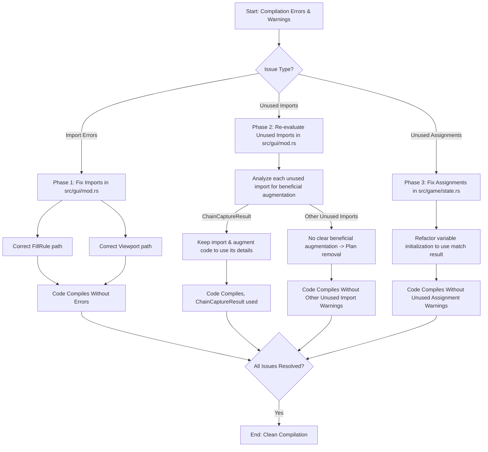

# RingRift Compiler Issues - Correction Plan (v2)

This document outlines the revised plan to address compilation errors and warnings in the `ringrift` project.

## Overall Correction Strategy

The plan is divided into three phases:
1.  Resolve compilation errors related to incorrect imports in [`ringrift/src/gui/mod.rs`](ringrift/src/gui/mod.rs:0).
2.  Address unused import warnings in [`ringrift/src/gui/mod.rs`](ringrift/src/gui/mod.rs:0) by re-evaluating each for potential beneficial augmentation before deciding on removal.
3.  Address unused assignment warnings in [`ringrift/src/game/state.rs`](ringrift/src/game/state.rs:0) by refactoring variable initializations.

## Mermaid Diagram of the Plan


## Phase 1: Resolve Compilation Errors in [`ringrift/src/gui/mod.rs`](ringrift/src/gui/mod.rs:0)

### 1.1. Address `E0432` (unresolved import) and `E0603` (private crate) for `iced::graphics::FillRule`

*   **Issue:** The import `iced::graphics::FillRule` (line 3) is incorrect because `iced::graphics` is private in `iced 0.12.x`. `FillRule` is typically found within the canvas module.
*   **File:** [`ringrift/src/gui/mod.rs`](ringrift/src/gui/mod.rs:0)
*   **Correction:**
    1.  Remove line 3: `graphics::FillRule, // As per original instruction`
    2.  Ensure `FillRule` is present in the `iced::widget::canvas` import block (uncomment or add at line 9).
*   **Reasoning:** The compiler indicates `iced_widget::graphics` is the new path for graphics-related items. `FillRule` is a canvas-specific item, used in `BoardCanvas::draw` (line 454), which is part of `iced::widget::canvas::Program`.
*   **Proposed Code Change (Diff Format):**
    ```diff
    1 | use iced::{
    2 |     executor,
    - |     graphics::FillRule, // As per original instruction
    4 |     widget::{
    5 |         button,
    6 |         canvas::{
    7 |             self, Cache, Canvas, Fill, Frame, Geometry, Path, Program, Stroke, Style,
    8 |             event as canvas_event, // Aliased to avoid conflict
    9 |             FillRule, // Ensure this is uncommented or added
    10 |         },
    ```

### 1.2. Address `E0432` (unresolved import) for `iced::Viewport`

*   **Issue:** The import `iced::Viewport` (line 17) is incorrect.
*   **File:** [`ringrift/src/gui/mod.rs`](ringrift/src/gui/mod.rs:0)
*   **Correction:** Change the import to `iced::widget::scrollable::Viewport` as suggested by the compiler.
*   **Reasoning:** The compiler provides a direct hint for the correct path.
*   **Proposed Code Change (Diff Format):**
    ```diff
    16 |     Application, Color, Command, Element, Length, Point, Rectangle, Settings, Size, Subscription, Theme,
    - |     Viewport, // As per original instruction
    + |     widget::scrollable::Viewport, // As per original instruction
    18 |     Renderer as IcedRenderer, // Alias for iced::Renderer to avoid conflict if any
    ```

## Phase 2: Address Unused Import Warnings in [`ringrift/src/gui/mod.rs`](ringrift/src/gui/mod.rs:0)

For each import flagged as unused, the plan is to analyze if it can be beneficially used. If no clear, simple, and beneficial augmentation is apparent, removal will be planned.

### 2.1. `Container` (widget struct) from `iced::widget` (line 11)
*   **Analysis:** Current code uses `container(content)`. Explicit `Container::new()` offers no significant benefit here.
*   **Decision:** Plan for removal.

### 2.2. `Size` (iced root struct) from `iced` (line 16)
*   **Analysis:** No current need for explicit `Size` type annotations in `gui/mod.rs`.
*   **Decision:** Plan for removal.

### 2.3. `button`, `pick_list`, `radio`, `text_input` (widget modules) from `iced::widget` (lines 5, 11)
*   **Analysis:** Struct versions (`Button::new()`, etc.) are used. Module imports for `button::State` or themed constructors are not currently needed.
*   **Decision:** Plan for removal of these module imports.

### 2.4. `event` (iced root module) from `iced` (line 14)
*   **Analysis:** Event handling seems self-contained within `Message` and `canvas_event`.
*   **Decision:** Plan for removal.

### 2.5. `self` (within `canvas` module import) from `iced::widget::canvas` (line 7)
*   **Analysis:** Specific items are imported directly, making `self` redundant.
*   **Decision:** Plan for removal.

### 2.6. `std::collections::HashMap` (line 20)
*   **Analysis:** Not directly used in `gui/mod.rs`.
*   **Decision:** Plan for removal from this file.

### 2.7. `Duration` and `Instant` from `std::time` (line 22)
*   **Analysis:** No time-based logic evident in `gui/mod.rs` that would require these.
*   **Decision:** Plan for removal.

### 2.8. `saved_game::SavedGame` from `crate::game` (line 29)
*   **Analysis:** "Load Game" is a placeholder. Implementing it is a feature, not a fix.
*   **Decision:** Plan for removal for now.

### 2.9. `player::Player`, `ring::Ring` from `crate::models` (lines 34, 35)
*   **Analysis:** Compiler indicates they are unused, suggesting type inference or qualified paths are sufficient.
*   **Decision:** Plan for removal.

### 2.10. `topology::BoardTopology` from `crate::models::topology` (line 37)
*   **Analysis:** The type `BoardTopology` itself doesn't seem to be named explicitly.
*   **Decision:** Plan for removal.

### 2.11. `ChainCaptureResult` from `crate::rules::capture` (line 39)
*   **Analysis:** This import has a plausible minor beneficial use. The `ChainCaptureResult` struct contains details like `total_rings_captured` which could be used to enhance game messages.
*   **Decision:** Keep the import.
*   **Proposed Augmentation:** In `Message::ProcessClickAsPotentialSelection`, within the `ActionState::SelectingChainCaptureLanding` arm (around line 907), modify the code to use the `chain_result_details` from the `Ok` variant.
    *   **Example (Conceptual):**
        ```diff
        // In ActionState::SelectingChainCaptureLanding arm
        - Ok((_chain_result, action_record)) => {
        + Ok((chain_result_details, action_record)) => {
              // ... existing logic ...
        +     self.game_message = format!("Chain capture step to {}. Total in chain: {}. Player {} continues.",
        +                                 clicked_pos, chain_result_details.total_rings_captured, gs.current_player().id + 1);
              // ...
          }
        ```
    *   This will provide more informative feedback to the user.

### Summary of Unused Import Changes for [`ringrift/src/gui/mod.rs`](ringrift/src/gui/mod.rs:0):

*   **Remove `Container` from line 11.**
*   **Remove `Size` from line 16.**
*   **Remove line 5 (`button,`).**
*   **Remove line 14 (`event, // Added for iced::event::Event`).**
*   **Remove `pick_list,` `radio,` `text_input,` from line 11.**
    *   Consolidated line 11 becomes: `column, container, row, text, Button, Column,`
*   **Remove `self,` from line 7.**
    *   Line 7 becomes: `Cache, Canvas, Fill, Frame, Geometry, Path, Program, Stroke, Style,`
*   **Remove line 20 (`use std::collections::HashMap;`).**
*   **Remove line 22 (`use std::time::{Duration, Instant};`).**
*   **In `use crate::game::{...}` block (lines 25-31), remove `saved_game::SavedGame,` (from line 29).**
*   **In `use crate::models::{...}` block (lines 32-38):**
    *   Remove `player::Player,` (from line 34).
    *   Remove `ring::Ring,` (from line 35).
*   **In `topology::{...}` import (line 37), remove `BoardTopology,`.**
    *   Line 37 becomes: `topology::{BoardType, HexPosition, Position, SquarePosition},`
*   **Keep `use crate::rules::capture::{CaptureError, ChainCaptureResult};` (line 39) and implement the augmentation.**

## Phase 3: Address Unused Assignment Warnings in [`ringrift/src/game/state.rs`](ringrift/src/game/state.rs:0)

### 3.1. Refactor initialization of `collapse_all_for_core` and `elimination_details_for_core`

*   **Issue:** Variables `collapse_all_for_core` (line 2165) and `elimination_details_for_core` (line 2166) are initialized with values that are never read before being reassigned within the subsequent `match` statement.
*   **File:** [`ringrift/src/game/state.rs`](ringrift/src/game/state.rs:0)
*   **Correction:** Declare these variables and assign them the result of the `match` block directly. The `match` expression will be modified to return a tuple `(bool, Option<(Position, usize)>, String)`.
*   **Reasoning:** Avoids initializing them with values that are immediately overwritten.
*   **Proposed Code Change (Diff Format):**
    ```diff
    // Around line 2165
    - |         let mut collapse_all_for_core = false;
    - |         let mut elimination_details_for_core: Option<(Position, usize)> = None; // (Pos, NumRingsToEliminate)
    2167 |         
    2168 |         let action_description_for_history: String;
    2169 | 
    - |         match decision {
    + |         let (collapse_all_for_core_val, elimination_details_for_core_val, action_description_for_history_val) = match decision {
    2171 |             PlayerLineChoiceDecision::CollapseAllAndEliminate { ring_to_eliminate_pos } => {
    2172 |                 if !pending_choice.is_graduated {
    2173 |                     // This case should ideally not be chosen by GUI if not graduated, but handle defensively.
    2174 |                     // Or, this is for a standard line that required elimination.
    2175 |                     // For standard line, is_graduated is false.
    2176 |                 }
    - |                 collapse_all_for_core = true;
    2178 |                 // Find the stack and its cap height for elimination
    2179 |                 if let Some(stack_id) = self.board.get_stack_id_at(&ring_to_eliminate_pos) {
    2180 |                     if let Some(stack) = self.stacks.get(&stack_id) {
    2181 |                         if stack.controlling_color() == Some(line_color) {
    - |                             elimination_details_for_core = Some((ring_to_eliminate_pos, stack.cap_height()));
    - |                             action_description_for_history = format!("Line formed by P{}, chose to collapse all and eliminate from {}.", pending_choice.player_id, ring_to_eliminate_pos);
    + |                             let desc = format!("Line formed by P{}, chose to collapse all and eliminate from {}.", pending_choice.player_id, ring_to_eliminate_pos);
    + |                             (true, Some((ring_to_eliminate_pos, stack.cap_height())), desc)
    2184 |                         } else {
    2185 |                             return Err(format!("Cannot eliminate from stack at {} not controlled by player {}.", ring_to_eliminate_pos, pending_choice.player_id));
    2186 |                         }
    2187 |                     } else {
    2188 |                         return Err(format!("Stack for elimination at {} not found in map.", ring_to_eliminate_pos));
    2189 |                     }
    2190 |                 } else {
    2191 |                     return Err(format!("No stack found at designated elimination position {}.", ring_to_eliminate_pos));
    2192 |                 }
    2193 |             }
    2194 |             PlayerLineChoiceDecision::CollapsePartialAndKeep {} => { // Added {}
    2195 |                 if !pending_choice.is_graduated {
    2196 |                     return Err("Chose CollapsePartialAndKeep for a non-graduated line.".to_string());
    2197 |                 }
    - |                 collapse_all_for_core = false; // Only collapse required_line_length
    - |                 elimination_details_for_core = None; // No elimination for this choice
    - |                 action_description_for_history = format!("Line formed by P{}, chose to collapse partial and keep rings.", pending_choice.player_id);
    + |                 let desc = format!("Line formed by P{}, chose to collapse partial and keep rings.", pending_choice.player_id);
    + |                 (false, None, desc)
    2201 |             }
    2202 |             PlayerLineChoiceDecision::EliminateRingForStandardLine { ring_to_eliminate_pos } => {
    2203 |                 if pending_choice.is_graduated {
    2204 |                     return Err("Chose EliminateRingForStandardLine for a graduated line.".to_string());
    2205 |                 }
    - |                 collapse_all_for_core = true; // Standard lines always collapse all their markers
    2207 |                  if let Some(stack_id) = self.board.get_stack_id_at(&ring_to_eliminate_pos) {
    2208 |                     if let Some(stack) = self.stacks.get(&stack_id) {
    2209 |                         if stack.controlling_color() == Some(line_color) {
    - |                             elimination_details_for_core = Some((ring_to_eliminate_pos, stack.cap_height()));
    - |                              action_description_for_history = format!("Standard line by P{}, eliminated from {}.", pending_choice.player_id, ring_to_eliminate_pos);
    + |                             let desc = format!("Standard line by P{}, eliminated from {}.", pending_choice.player_id, ring_to_eliminate_pos);
    + |                             (true, Some((ring_to_eliminate_pos, stack.cap_height())), desc)
    2212 |                         } else {
    2213 |                             return Err(format!("Cannot eliminate from stack at {} not controlled by player {}.", ring_to_eliminate_pos, pending_choice.player_id));
    2214 |                         }
    2215 |                     } else {
    2216 |                         return Err(format!("Stack for elimination at {} not found in map.", ring_to_eliminate_pos));
    2217 |                     }
    2218 |                 } else {
    2219 |                     return Err(format!("No stack found at designated elimination position {}.", ring_to_eliminate_pos));
    2220 |                 }
    2221 |             }
    2222 |         }
    + |         let collapse_all_for_core = collapse_all_for_core_val;
    + |         let elimination_details_for_core = elimination_details_for_core_val;
    + |         action_description_for_history = action_description_for_history_val;
    2223 | 
    2224 |         self.core_apply_form_line(
    2225 |             &positions_to_collapse_vec, 
    2226 |             line_color,
    2227 |             collapse_all_for_core,
    2228 |             elimination_details_for_core,
    2229 |         )?;
    ```

This concludes the revised plan.
