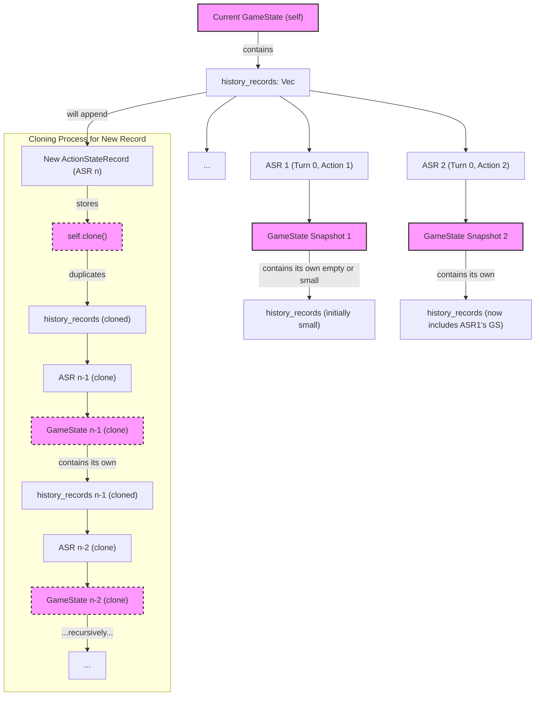

# RingRift History System Refactor Plan

**Objective:** Resolve the progressive performance degradation in RingRift caused by the current high-fidelity history recording mechanism. The root cause is the recursive cloning of `GameState` due to it containing its own history log, leading to exponential increases in clone time and memory usage.

**Core Strategy:** Decouple history recording from the `GameState` struct. Introduce a dedicated `GameHistoryLogger` to manage actions and clean game state snapshots.

---

## 1. Analysis of the Problem

**1.1. Identified Root Cause: Recursive GameState Cloning for History**

*   **`GameState` Contains Its Own History:** The `GameState` struct (in `ringrift/src/game/state.rs`) has a field `history_records: Vec<ActionStateRecord>`.
*   **`ActionStateRecord` Stores Full `GameState`:** Each `ActionStateRecord` (in `ringrift/src/game/history.rs`) stores a complete snapshot of the `GameState` via its `resulting_state: GameState` field.
*   **Recursive Cloning Operation:** The method `GameState::record_action_and_state(&mut self, action: Action)` creates this snapshot by calling `let state_snapshot = self.clone();`. When `self` (the current `GameState` instance) is cloned, its `history_records` vector—which already contains all previous `ActionStateRecord`s (each with their own `GameState` snapshot)—is also cloned.

**1.2. Diagram of the Problematic Structure:**



**1.3. Why This Causes Progressive Slowdown:**

*   **Exponential Growth in Data per Snapshot:** Each new `ActionStateRecord`'s `resulting_state` carries a clone of the *entire history log up to that point*.
*   **Increasing Clone Cost:** The `clone()` operation on `GameState` becomes progressively more expensive.
*   **Memory Explosion:** Memory usage increases dramatically.
*   **Impact of Game Complexity:** As the game state itself becomes more complex, the "base" `GameState` being cloned is larger, and the recursive history cloning multiplies this larger base cost.
*   **Multiple Actions Per Turn:** A single logical game turn can involve multiple `Action` variants, each triggering an expensive recursive clone.

---

## 2. Detailed Implementation Plan

**Goal:** Decouple the high-fidelity history recording from `GameState`.

**Key Components & Steps:**

**2.1. `GameStateSnapshot` Strategy (Preferred: Conditional Cloning)**

*   **Objective:** Create a representation of the game state for history purposes that does *not* itself contain a history log.
*   **Implementation (Conditional Cloning):**
    *   Modify `GameState` to provide a specific method: `fn clone_for_history(&self) -> GameState`.
    *   In this method, the `history_records` field of the new `GameState` instance will be initialized as `Vec::new()` instead of being cloned from `self.history_records`.
    *   This avoids creating a separate `GameStateSnapshot` struct if the only difference is the handling of `history_records` during the clone operation for history.
    *   Ensure `#[derive(Clone)]` on `GameState` remains for general use, but `clone_for_history` is used specifically by the new logger.

**2.2. Modify `ActionStateRecord`**

*   **File:** `ringrift/src/game/history.rs`
*   **Change:** The field `pub resulting_state: GameState` will now store the "clean" snapshot obtained from `GameState::clone_for_history()`. No structural change to `ActionStateRecord` itself is needed if `GameState::clone_for_history()` returns a `GameState`.

**2.3. Create `GameHistoryLogger`**

*   **File:** New file, e.g., `ringrift/src/game/history_logger.rs` (and add to `mod.rs`).
*   **Definition:**
    ```rust
    // In ringrift/src/game/history_logger.rs
    use crate::game::action::Action;
    use crate::game::state::GameState;
    use crate::game::history::ActionStateRecord;
    use serde::{Serialize, Deserialize};

    #[derive(Debug, Clone, Serialize, Deserialize, Default)]
    pub struct GameHistoryLogger {
        records: Vec<ActionStateRecord>,
        initial_rng_seed: u64,
    }

    impl GameHistoryLogger {
        pub fn new(initial_rng_seed: u64) -> Self {
            Self {
                records: Vec::new(),
                initial_rng_seed,
            }
        }

        pub fn record_action(&mut self, action: &Action, game_state_after_action: &GameState) {
            let state_snapshot = game_state_after_action.clone_for_history();

            let record = ActionStateRecord {
                turn_number: game_state_after_action.turn_count,
                player_id: game_state_after_action.current_player_index,
                player_color: game_state_after_action.current_color(),
                action_taken: action.clone(), // Action needs to derive Clone
                resulting_state: state_snapshot,
            };
            self.records.push(record);
        }

        pub fn get_records(&self) -> &Vec<ActionStateRecord> {
            &self.records
        }

        pub fn get_initial_seed(&self) -> u64 {
            self.initial_rng_seed
        }

        // Placeholder for save/load functionality
        pub fn save_history_to_file(&self, file_path: &str) -> Result<(), String> {
            // Implementation similar to current GameState::save_history,
            // serializing `self.initial_rng_seed` and `self.records`.
            #[derive(Serialize)]
            struct HistorySaveData<'a> {
                initial_rng_seed: u64,
                history_records: &'a Vec<ActionStateRecord>,
            }

            let data_to_save = HistorySaveData {
                initial_rng_seed: self.initial_rng_seed,
                history_records: &self.records,
            };

            let file = std::fs::File::create(file_path).map_err(|e| format!("Failed to create file {}: {}", file_path, e))?;
            serde_json::to_writer_pretty(file, &data_to_save)
                .map_err(|e| format!("Failed to serialize history to {}: {}", file_path, e))
        }

        pub fn load_history_from_file(file_path: &str) -> Result<Self, String> {
            // Implementation similar to current GameState::load_history,
            // deserializing into GameHistoryLogger.
            #[derive(Deserialize)]
            struct HistoryLoadData {
                initial_rng_seed: u64,
                history_records: Vec<ActionStateRecord>,
            }

            let file = std::fs::File::open(file_path).map_err(|e| format!("Failed to open file {}: {}", file_path, e))?;
            let loaded_data: HistoryLoadData = serde_json::from_reader(file)
                .map_err(|e| format!("Failed to deserialize history from {}: {}", file_path, e))?;
            
            Ok(Self {
                initial_rng_seed: loaded_data.initial_rng_seed,
                records: loaded_data.history_records,
            })
        }
    }
    ```

**2.4. Modify `GameState` (`ringrift/src/game/state.rs`)**

*   **Remove Fields:**
    *   `pub history_records: Vec<ActionStateRecord>`
    *   `pub initial_rng_seed: u64`
*   **Remove Methods:**
    *   `pub(crate) fn record_action_and_state(&mut self, action: Action)`
    *   `pub fn save_history(&self, file_path: &str)`
    *   `pub fn load_history(file_path: &str)`
    *   (Adapt `get_state_at_action_index`, `get_state_before_action_index`, `replay_history_visual` to work with `GameHistoryLogger` externally if they are still needed in their current form, or reimplement them as methods on `GameHistoryLogger` or as free functions taking logger data.)
*   **Add Method (Conditional Cloning):**
    ```rust
    // Inside impl GameState
    pub fn clone_for_history(&self) -> GameState {
        let mut cloned_state = self.clone(); // Standard clone
        cloned_state.history_records = Vec::new(); // Explicitly clear history in the snapshot
        // Ensure other fields that might be problematic for snapshots are handled if any.
        // For now, only history_records is the known issue.
        cloned_state 
    }
    ```
    *(Note: This assumes `history_records` is still temporarily part of `GameState` for the `clone()` to work before being cleared. If `history_records` is fully removed, then `clone_for_history` just becomes `self.clone()` and the "cleanliness" is guaranteed by `GameState` no longer having the field.)*
    **Correction:** If `history_records` is fully removed from `GameState`, then `clone_for_history` is simply `self.clone()`, and the resulting clone is inherently "clean" of recursive history. The `ActionStateRecord` will store this clean `GameState`.

**2.5. Integrate `GameHistoryLogger` into the Game Loop**

*   The main game management entity (e.g., in `main.rs` or a game runner struct) will own an instance of `GameHistoryLogger`.
*   Initialize `GameHistoryLogger` with the `initial_rng_seed`.
*   After any `Action` is successfully applied to the main `GameState`, the game loop will call:
    `game_history_logger.record_action(&applied_action, &current_game_state);`
*   Update any UI or system components that previously used `GameState`'s history methods to now use the `GameHistoryLogger` instance.

**2.6. Adapt Replay Functionality**

*   Replay functions (like the old `GameState::replay_history_visual`) will now take `initial_rng_seed` and `&[ActionStateRecord]` (from `GameHistoryLogger`) as parameters.
*   The initial state for replay will be reconstructed using the `initial_rng_seed`, board type, and player setup.
*   Then, iterate through the `ActionStateRecord`s:
    *   The `record.resulting_state` provides the state *after* the `record.action_taken`.
    *   To show the state *before* an action, you'd use the `resulting_state` of the *previous* record, or the reconstructed initial state for the very first action.

---

## 3. Diagram of the Refactored System

```mermaid
graph TD
    subgraph GameExecution
        direction LR
        GameManager["Game Manager / Main Loop"]
        Main_GS["Main GameState (No history_records field)"]
        GHL["GameHistoryLogger"]
        ActionHandler["Action Handler (e.g., in GameState or game_loop)"]

        GameManager -->|owns| Main_GS
        GameManager -->|owns| GHL
        GameManager -->|triggers| ActionHandler
        ActionHandler -- "1. Applies Action" --> Main_GS
        ActionHandler -- "2. Notifies with Action & &GameState" --> GameManager
        GameManager -- "3. Calls GHL.record_action()" --> GHL
    end

    subgraph GameHistoryLoggerInstance
        direction LR
        GHL_Instance["GameHistoryLogger Instance"]
        GHL_Instance -- "initial_rng_seed" --> SeedValue["u64"]
        GHL_Instance -- "records: Vec<ActionStateRecord>" --> ASR_Vec["Vec<ActionStateRecord>"]
    end

    subgraph GHL.record_action()
        direction TB
        Input_Action["Input: Action"]
        Input_GS_Ref["Input: &GameState (current, after action)"]
        
        Step1["1. Clone GameState for history (Main_GS.clone())"]
        Input_GS_Ref --> Step1
        Step1 --> Clean_GS_Snapshot["Clean GameState Snapshot (inherently no recursive history)"]
        
        Step2["2. Create ActionStateRecord"]
        Input_Action --> Step2
        Clean_GS_Snapshot --> Step2
        Step2 --> New_ASR["New ActionStateRecord (contains Clean_GS_Snapshot)"]
        
        Step3["3. Push to GHL.records"]
        New_ASR --> Step3
        Step3 --> ASR_Vec
    end

    ASR_Vec --> ASR_Entry1["ActionStateRecord 1"]
    ASR_Entry1 -->|resulting_state| Clean_GS_Snap1["Clean GameState Snapshot 1"]

    ASR_Vec --> ASR_Entry2["ActionStateRecord 2"]
    ASR_Entry2 -->|resulting_state| Clean_GS_Snap2["Clean GameState Snapshot 2"]

    style Main_GS fill:#ccf,stroke:#333,stroke-width:2px
    style GHL fill:#cfc,stroke:#333,stroke-width:2px
    style GHL_Instance fill:#cfc,stroke:#333,stroke-width:2px
    style Clean_GS_Snapshot fill:#f9f,stroke:#333,stroke-width:2px
    style Clean_GS_Snap1 fill:#f9f,stroke:#333,stroke-width:2px
    style Clean_GS_Snap2 fill:#f9f,stroke:#333,stroke-width:2px
```

This refactoring directly targets the identified bottleneck and should restore performance while maintaining the desired high-fidelity replay capability.