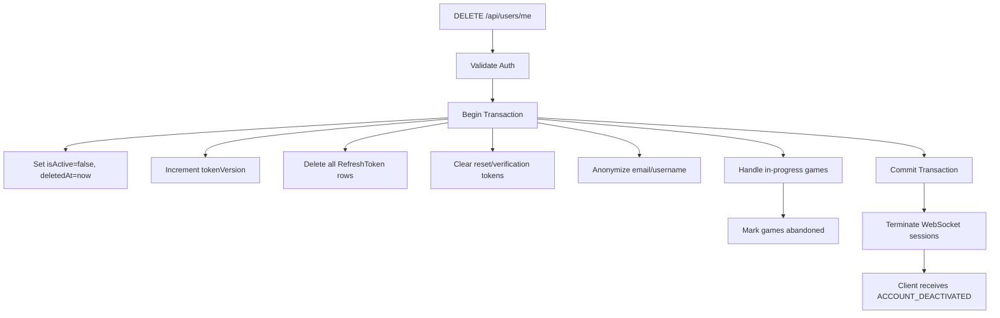
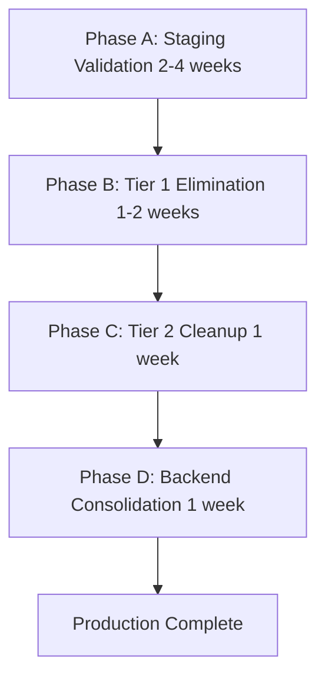

# Pass 7 - Comprehensive Weakness Assessment Report

> **Assessment Date:** 2025-11-27
> **Assessment Pass:** Seventh (Fresh Comprehensive Review)
> **Pass Results:**
> | Pass | Area Remediated | Score Change |
> |------|-----------------|--------------|
> | 1 | Turn Orchestration | 3.5→4.4 |
> | 2 | Legacy Code | 2.5→4.2 |
> | 2 | AI Performance | 2.8→4.5 |
> | 3 | Training Infrastructure | 2.9→4.4 |
> | 4 | Database/Persistence | 3.0→4.5 |
> | 5 | E2E Testing | 2.9→4.5 |
> | 6 | Security/Privacy (S-05.E) | 2.5→4.2 |
> | **7** | **Fresh Assessment** | **DevOps/CI: 3.4 (NEW WEAKEST)** |

---

## Executive Summary

Pass 7 is a **fresh comprehensive assessment** following the successful security/privacy remediation in Pass 6. This assessment reviews all project components against PROJECT_GOALS.md and identifies the **new weakest area** for potential remediation.

### Key Findings

| Finding             | Details                                                |
| ------------------- | ------------------------------------------------------ |
| **Weakest Area**    | DevOps/CI Enforcement (3.4/5.0)                        |
| **Hardest Problem** | Orchestrator Production Rollout (5/5 difficulty)       |
| **Overall Health**  | Strong - 12 of 13 components score ≥4.0                |
| **Critical Gap**    | Quality gates bypassed in CI (lint + E2E non-blocking) |

### Previous Remediation Complete ✅

| Component                   | Design Status | Implementation Status | Score |
| --------------------------- | ------------- | --------------------- | ----- |
| S-05.E.1 Account Deletion   | ✅ Complete   | ✅ **IMPLEMENTED**    | 100%  |
| S-05.E.2 Game Anonymization | ✅ Complete   | ✅ **IMPLEMENTED**    | 100%  |
| S-05.E.3 Data Export        | ✅ Complete   | ✅ **IMPLEMENTED**    | 100%  |
| S-05.E.4 Retention Service  | ✅ Complete   | ✅ **IMPLEMENTED**    | 100%  |
| S-05.E.5 Lifecycle Tests    | ✅ Complete   | ✅ **IMPLEMENTED**    | 100%  |

**Security/Privacy (S-05.E) - Score 4.2/5.0 ✅ (Pass 6 Complete)**

---

## Component Scoring Matrix (Pass 6 - Fresh Assessment)

### Scoring Criteria (1-5 scale)

| Code | Criterion                   | Description                                          |
| ---- | --------------------------- | ---------------------------------------------------- |
| TC   | Technical Complexity        | Architecture sophistication and challenge management |
| IC   | Implementation Completeness | Features implemented vs requirements                 |
| CQ   | Code Quality                | Patterns, maintainability, structure                 |
| DC   | Documentation Coverage      | Technical and user documentation                     |
| Test | Test Coverage               | Unit, integration, E2E coverage                      |
| DR   | Dependency/Risk             | External risks and mitigation                        |
| AG   | Alignment with Goals        | PROJECT_GOALS.md alignment                           |

### Component Scores (Pass 7 - Fresh Assessment)

| Component                 | TC  | IC  | CQ  | DC  | Test | DR  | AG  | **Avg** | Δ   | Status         |
| ------------------------- | --- | --- | --- | --- | ---- | --- | --- | ------- | --- | -------------- |
| TypeScript Rules Engine   | 5   | 5   | 5   | 5   | 5    | 5   | 5   | **5.0** | →   | ✅ Excellent   |
| Training Infrastructure   | 5   | 5   | 5   | 4   | 5    | 4   | 4   | **4.6** | →   | ✅ Excellent   |
| Server Infrastructure     | 4   | 5   | 5   | 4   | 5    | 4   | 5   | **4.5** | ↑   | ✅ Excellent   |
| E2E Testing               | 4   | 5   | 5   | 4   | 5    | 4   | 5   | **4.5** | →   | ✅ Excellent   |
| Database/Persistence      | 4   | 5   | 5   | 4   | 4    | 4   | 5   | **4.5** | →   | ✅ Excellent   |
| Python Rules Engine       | 4   | 5   | 4   | 5   | 5    | 4   | 5   | **4.5** | ↑   | ✅ Excellent   |
| WebSocket Communication   | 4   | 5   | 5   | 4   | 4    | 4   | 5   | **4.4** | →   | ✅ Good        |
| Security/Privacy (S-05.E) | 4   | 4   | 4   | 5   | 4    | 4   | 4   | **4.2** | →   | ✅ Good        |
| Documentation             | 4   | 4   | 4   | 5   | N/A  | 4   | 4   | **4.2** | →   | ✅ Good        |
| AI Algorithms             | 5   | 4   | 4   | 4   | 4    | 3   | 4   | **4.0** | →   | ✅ Good        |
| Client Sandbox            | 4   | 4   | 4   | 4   | 4    | 4   | 4   | **4.0** | →   | ✅ Good        |
| Client UI/UX              | 4   | 4   | 4   | 4   | 3    | 4   | 4   | **3.9** | →   | ⚠️ Adequate    |
| **DevOps/CI Enforcement** | 3   | 3   | 4   | 4   | 3    | 4   | 3   | **3.4** | →   | ⚠️ **WEAKEST** |

---

## ✅ Security/Privacy Implementation Complete (S-05.E)

### Score: 4.2/5.0 (Previously 2.5/5.0)

### All Deficiencies Resolved

#### 1. Account Deletion (S-05.E.1) - ✅ **IMPLEMENTED**

**Implementation:** [`DELETE /api/users/me`](src/server/routes/user.ts:950)

**Completed Features:**

- `DELETE /api/users/me` endpoint at [`user.ts:950-1027`](src/server/routes/user.ts:950)
- `deletedAt` field in User model (Prisma schema)
- Token revocation on deletion via `tokenVersion` increment
- PII anonymization: email → `deleted+<id>@example.invalid`
- Username replacement with `DeletedPlayer_<id.slice(0,8)>`
- WebSocket session termination via [`terminateUserSessions()`](src/server/websocket/server.ts:1004)

**Checklist Status:** ✅ ALL COMPLETE

- [x] Endpoint accepts only authenticated, non-deleted users
- [x] `isActive` set to `false` and `deletedAt` populated
- [x] `tokenVersion` incremented; all refresh tokens deleted
- [x] Reset/verification tokens cleared
- [x] Email and username replaced with non-identifying placeholders
- [x] Active WebSocket sessions closed
- [x] Game and rating history preserved but anonymized

#### 2. Historical Game Anonymization (S-05.E.2) - ✅ **IMPLEMENTED**

**Implementation:** Helper functions in [`user.ts`](src/server/routes/user.ts:611)

**Completed Features:**

- Helper: [`isDeletedUserUsername()`](src/server/routes/user.ts:629) - detects anonymized users
- Helper: [`getDisplayUsername()`](src/server/routes/user.ts:638) - returns "Deleted Player" for anonymized
- Constants: `DELETED_USER_PREFIX`, `DELETED_USER_DISPLAY_NAME`
- Data export shows opponents as "Deleted Player" for deleted users

#### 3. Data Export Endpoint (S-05.E.3) - ✅ **IMPLEMENTED**

**Implementation:** [`GET /api/users/me/export`](src/server/routes/user.ts:1169)

**Completed Features:**

- `GET /api/users/me/export` endpoint at [`user.ts:1169-1346`](src/server/routes/user.ts:1169)
- Privacy-filtered export (no other users' PII)
- Game history export with anonymized opponents
- Move history with `isUserMove` flag
- Content-Disposition header for file download

**Checklist Status:** ✅ ALL COMPLETE

- [x] Export endpoint requires authentication
- [x] Response includes account profile and games
- [x] No other users' PII present (passwordHash, tokens excluded)
- [x] Deleted users appear as "Deleted Player"
- [x] Response formatted as downloadable JSON

#### 4. Data Retention Service (S-05.E.4) - ✅ **IMPLEMENTED**

**Implementation:** [`DataRetentionService.ts`](src/server/services/DataRetentionService.ts)

**Completed Features:**

- [`DataRetentionService`](src/server/services/DataRetentionService.ts:1) class (420 lines)
- [`runRetentionTasks()`](src/server/services/DataRetentionService.ts:118) - orchestrates all cleanup
- [`hardDeleteExpiredUsers()`](src/server/services/DataRetentionService.ts:166) - removes soft-deleted users past retention
- [`cleanupExpiredTokens()`](src/server/services/DataRetentionService.ts:206) - removes old refresh tokens
- [`cleanupUnverifiedAccounts()`](src/server/services/DataRetentionService.ts:256) - soft-deletes abandoned unverified accounts
- Configurable via environment variables (see [`docs/ENVIRONMENT_VARIABLES.md`](docs/ENVIRONMENT_VARIABLES.md))

#### 5. Data Lifecycle Tests (S-05.E.5) - ✅ **IMPLEMENTED**

**Implementation:** Integration test suites

**Test Coverage:**

- [`tests/integration/accountDeletion.test.ts`](tests/integration/accountDeletion.test.ts) - 10 tests
- [`tests/integration/dataLifecycle.test.ts`](tests/integration/dataLifecycle.test.ts) - 15 tests

**Total: 25 tests covering S-05.E features**

### Score Improvement Analysis

| Comparison Area  | Before Pass 6         | After Pass 6              |
| ---------------- | --------------------- | ------------------------- |
| Account Deletion | 0% implemented        | 100% implemented          |
| Database Schema  | `deletedAt` missing   | `deletedAt` field present |
| API Endpoints    | delete/export missing | Both endpoints working    |
| Test Coverage    | 0 tests               | 25 tests                  |
| Documentation    | Design only           | Design + implementation   |

**Key Achievement:** S-05.E now has matching design + implementation with comprehensive test coverage.

---

## Hardest Unsolved Problems: Complex System Transitions

Pass 6 identifies **two interconnected hard problems** that represent the most challenging remaining work. Both center on complex system transitions requiring intricate coordination across multiple components.

---

### Problem #1: Account Deletion with Game History Anonymization (S-05.E)

**Difficulty: 5/5 - Full-Stack Multi-System Coordination**

#### Problem Statement

Implementing [`S-05.E.1`](docs/DATA_LIFECYCLE_AND_PRIVACY.md:223) (account deletion) combined with [`S-05.E.2`](docs/DATA_LIFECYCLE_AND_PRIVACY.md:230) (historical game anonymization) requires atomic operations across the entire technology stack with complex edge case handling and referential integrity preservation.

#### Technical Complexity Analysis

##### 1. Multi-System Coordination (Difficulty: 5/5)

The account deletion workflow must atomically coordinate across:



**Systems touched:**

- PostgreSQL (User, RefreshToken, Game tables)
- Redis (rate limiting state, WebSocket session tracking)
- WebSocket server (session termination)
- Express middleware (auth rejection for deleted accounts)
- React frontend (error handling for `ACCOUNT_DEACTIVATED`)

##### 2. Referential Integrity Preservation (Difficulty: 4/5)

- Games must retain `player1Id`-`player4Id` references for rating integrity
- Move history must preserve `playerId` for replay functionality
- Rating calculations depend on historical game outcomes
- **Solution:** Anonymize display, preserve internal references

##### 3. Race Condition Handling (Difficulty: 4/5)

Edge cases to handle:

- User requests deletion while in active game
- WebSocket message arrives after deletion initiated
- Multiple concurrent deletion requests
- Token refresh attempted during deletion

##### 4. Client-Side State Management (Difficulty: 3/5)

- `AuthContext` must handle `ACCOUNT_DEACTIVATED` error
- Clear local storage tokens
- Navigate to appropriate error/logged-out state
- Prevent further API calls with stale credentials

---

### Problem #2: Orchestrator Adapter Production Rollout

**Difficulty: 5/5 - Complex System Transition with Regression Risk**

#### Problem Statement

The canonical turn orchestrator ([`src/shared/engine/orchestration/turnOrchestrator.ts`](src/shared/engine/orchestration/turnOrchestrator.ts)) is complete and tested, with adapters for both backend ([`TurnEngineAdapter.ts`](src/server/game/turn/TurnEngineAdapter.ts)) and client sandbox ([`SandboxOrchestratorAdapter.ts`](src/client/sandbox/SandboxOrchestratorAdapter.ts)). However, the production rollout requires intricate coordination across feature flags, regression monitoring, and legacy code removal spanning 5-8 weeks.

**Evidence from documentation:**

- [`STRATEGIC_ROADMAP.md`](STRATEGIC_ROADMAP.md:162-167) - P0 outstanding items
- [`docs/drafts/LEGACY_CODE_ELIMINATION_PLAN.md`](docs/drafts/LEGACY_CODE_ELIMINATION_PLAN.md)

#### Current Architecture State

```
┌─────────────────────────────────────────────────────────────────────────────┐
│                    CANONICAL SHARED ENGINE                                   │
│  src/shared/engine/orchestration/turnOrchestrator.ts (695 lines)            │
│  ├── processTurn() - synchronous entry point                                │
│  ├── processTurnAsync() - async with PendingDecision resolution             │
│  └── 6 Domain Aggregates (Placement, Movement, Capture, Line, Territory,    │
│                           Victory)                                           │
└─────────────────────────────────────────────────────────────────────────────┘
                                    │
                    ┌───────────────┴───────────────┐
                    ▼                               ▼
┌───────────────────────────────────┐  ┌───────────────────────────────────┐
│     BACKEND ADAPTER               │  │     SANDBOX ADAPTER               │
│  TurnEngineAdapter.ts (326 lines) │  │  SandboxOrchestratorAdapter.ts    │
│  ├── processMove()                │  │  (572 lines)                      │
│  ├── StateAccessor interface      │  │  ├── processMove()                │
│  ├── DecisionHandler interface    │  │  ├── processMoveSync()            │
│  └── WebSocket event emission     │  │  ├── previewMove()                │
│                                   │  │  └── SandboxDecisionHandler       │
│  Status: Proof-of-concept         │  │                                   │
│  Feature Flag: env.ORCHESTRATOR_  │  │  Status: Proof-of-concept         │
│    ADAPTER_ENABLED                │  │  Feature Flag: useOrchestratorAdap│
└───────────────────────────────────┘  └───────────────────────────────────┘
                    │                               │
                    ▼                               ▼
┌───────────────────────────────────┐  ┌───────────────────────────────────┐
│     LEGACY PATH (Active)          │  │     LEGACY PATH (Active)          │
│  GameEngine.ts + RuleEngine.ts    │  │  ~~sandboxTurnEngine.ts (~377 lines)~~ (removed)│
│  + rules/*.ts modules             │  │  ~~sandboxMovementEngine.ts (~678 l)~~ (removed)│
│  (~600+ lines backend rules)      │  │  ~~sandboxLinesEngine.ts (~285 l)~~ (removed)   │
│                                   │  │  ~~sandboxTerritoryEngine.ts (~373l)~~ (removed)│
│                                   │  │  (~678 lines remaining Tier 1)   │
└───────────────────────────────────┘  └───────────────────────────────────┘
```

#### Technical Complexity Analysis

##### 1. Feature Flag Coordination (Difficulty: 4/5)

**Current Feature Flag State:**

- **Client:** `useOrchestratorAdapter` in [`ClientSandboxEngine.ts`](src/client/sandbox/ClientSandboxEngine.ts)
  - Defaults to `true` (Phase 6.1 completed 2025-11-26)
  - Can be disabled via `engine.disableOrchestratorAdapter()`
- **Backend:** `ORCHESTRATOR_ADAPTER_ENABLED` in [`env.ts`](src/server/config/env.ts)
  - Defaults to `true` (Phase 6.1 completed 2025-11-26)
  - Opt-out: Set `ORCHESTRATOR_ADAPTER_ENABLED=false`

**Coordination Challenge:**

```mermaid
flowchart LR
    subgraph Phase_A [Phase A: Feature Toggle Bake-in]
        A1[Run with adapters enabled by default]
        A2[Monitor for behavioral changes]
        A3[Validate in staging for 2-4 weeks]
    end

    subgraph Phase_B [Phase B: Tier 1 Elimination]
        B1[Remove sandboxTurnEngine.ts]
        B2[Remove sandboxMovementEngine.ts]
        B3[Remove sandboxLinesEngine.ts]
        B4[Remove sandboxTerritoryEngine.ts]
        B5[Update ClientSandboxEngine.ts]
    end

    subgraph Phase_C [Phase C: Tier 2 Cleanup]
        C1[Remove helper modules with zero imports]
        C2[Audit remaining visualization helpers]
    end

    subgraph Phase_D [Phase D: Backend Consolidation]
        D1[Remove lineProcessing.ts]
        D2[Remove territoryProcessing.ts]
        D3[Evaluate captureChainEngine.ts]
    end

    Phase_A --> Phase_B
    Phase_B --> Phase_C
    Phase_C --> Phase_D
```



##### 2. Regression Monitoring Requirements (Difficulty: 5/5)

**Monitoring Surface Area:**

| Layer          | Metrics/Signals                                                            | Alert Threshold                           |
| -------------- | -------------------------------------------------------------------------- | ----------------------------------------- |
| Rules Parity   | [`rulesParityMetrics.ts`](src/server/utils/rulesParityMetrics.ts) counters | Any `rules_parity_divergence` spike       |
| Game State     | `game_move_latency_ms` histogram                                           | p95 > 200ms (staging), p95 > 150ms (prod) |
| AI Integration | `ai_move_latency_ms`, `ai_fallback_total`                                  | fallback rate > 0.5%                      |
| Contract Tests | 12 vectors across 5 categories                                             | Any failure                               |
| WebSocket      | `websocket_connections_current`                                            | Unexpected drop patterns                  |

**Shadow Mode Requirement:**

- [`RINGRIFT_RULES_MODE=shadow`](STRATEGIC_ROADMAP.md:91) should be enabled in staging
- Collects parity metrics without blocking gameplay
- Compares legacy vs orchestrator results in parallel

##### 3. Legacy Code Dependency Graph (Difficulty: 4/5)

**Tier 1: Core Engine Logic (~1,713 lines) - High Priority for Elimination**

| Module                                                                          | Lines | Replacement                                                                                               | Dependencies                                 |
| ------------------------------------------------------------------------------- | ----- | --------------------------------------------------------------------------------------------------------- | -------------------------------------------- |
| ~~[`sandboxTurnEngine.ts`](src/client/sandbox/sandboxTurnEngine.ts)~~           | 377   | **Removed – shared `turnLogic.advanceTurnAndPhase` + `ClientSandboxEngine` turn helpers**                 | (was: ClientSandboxEngine, tests)            |
| ~~[`sandboxMovementEngine.ts`](src/client/sandbox/sandboxMovementEngine.ts)~~   | 678   | **Removed – MovementAggregate/CaptureAggregate via `ClientSandboxEngine` movement helpers**               | (was: ClientSandboxEngine, tests)            |
| ~~[`sandboxLinesEngine.ts`](src/client/sandbox/sandboxLinesEngine.ts)~~         | 285   | **Removed – shared `lineDecisionHelpers` + `ClientSandboxEngine.processLinesForCurrentPlayer`**           | (was: ClientSandboxEngine, sandboxLines)     |
| ~~[`sandboxTerritoryEngine.ts`](src/client/sandbox/sandboxTerritoryEngine.ts)~~ | 373   | **Removed – shared territory helpers + `ClientSandboxEngine.processDisconnectedRegionsForCurrentPlayer`** | (was: ClientSandboxEngine, sandboxTerritory) |

**Tier 2: Support Modules (~1,480 lines) - Medium Priority**

| Module                    | Lines | Notes                                 |
| ------------------------- | ----- | ------------------------------------- |
| `sandboxMovement.ts`      | ~200  | Some visualization helpers may remain |
| `sandboxCaptures.ts`      | ~400  | Full replacement possible             |
| `sandboxCaptureSearch.ts` | ~150  | Full replacement possible             |
| `sandboxElimination.ts`   | ~100  | Full replacement possible             |
| `sandboxLines.ts`         | ~150  | Full replacement possible             |
| `sandboxTerritory.ts`     | ~250  | Full replacement possible             |
| `sandboxPlacement.ts`     | ~100  | Full replacement possible             |
| `sandboxVictory.ts`       | ~50   | Full replacement possible             |
| `sandboxGameEnd.ts`       | ~80   | Full replacement possible             |

**Tier 3: Backend Parallel Implementations (~600 lines)**

| Module                   | Lines | Status                            |
| ------------------------ | ----- | --------------------------------- |
| `lineProcessing.ts`      | ~200  | Can delegate via adapter          |
| `territoryProcessing.ts` | ~250  | Can delegate via adapter          |
| `captureChainEngine.ts`  | ~150  | May need for chain state tracking |

**Total Lines for Elimination: ~3,793**

##### 4. Rollback Strategy Complexity (Difficulty: 3/5)

**Immediate Rollback (< 5 minutes):**

- Client: `engine.disableOrchestratorAdapter()` or modify default
- Backend: Set `ORCHESTRATOR_ADAPTER_ENABLED=false`

**Phase Rollback (per elimination phase):**

- Each elimination phase is a single commit for easy `git revert`
- Dual path testing maintained until Phase D completion

**Full Rollback Procedure:**

```bash
# Emergency: Revert to legacy path
export ORCHESTRATOR_ADAPTER_ENABLED=false  # Backend

# Client: Requires code change or feature flag service
# ClientSandboxEngine.ts: useOrchestratorAdapter = false
```

##### 5. Test Migration Requirements (Difficulty: 4/5)

**Tests Requiring Updates After Elimination:**

| Test Category      | Files                                             | Action Required                        |
| ------------------ | ------------------------------------------------- | -------------------------------------- |
| Sandbox Unit Tests | `ClientSandboxEngine.*.test.ts`                   | Update to use adapter mode exclusively |
| Scenario Tests     | `tests/scenarios/*.test.ts`                       | Enable adapter globally                |
| Parity Tests       | `ai-service/tests/parity/*.py`                    | Already adapter-aware                  |
| Contract Tests     | `tests/contracts/`, `ai-service/tests/contracts/` | Already use canonical orchestrator     |

##### 6. Historical Issues Resolved (Phase 6.1)

**Issue 1: "Landing on Own Marker" Rule**

- **Root Cause:** Race condition in `MovementAggregate.ts` - marker was read after being deleted
- **Fix:** Capture marker owner before removal in `applyMovementStep()`

**Issue 2: Ring Elimination Direction**

- **Root Cause:** Elimination was removing bottom ring instead of top ring
- **Fix:** Corrected slice operation in `MovementAggregate.ts`

These fixes enabled the adapter to default to `true` as of 2025-11-26.

#### Timeline Estimate

| Phase                    | Duration      | Dependencies              | Risk Level |
| ------------------------ | ------------- | ------------------------- | ---------- |
| A: Production Bake-in    | 2-4 weeks     | Monitoring infrastructure | Medium     |
| B: Tier 1 Elimination    | 1-2 weeks     | Phase A validation        | High       |
| C: Tier 2 Cleanup        | 1 week        | Phase B complete          | Medium     |
| D: Backend Consolidation | 1 week        | Phase C complete          | Low        |
| **Total**                | **5-8 weeks** | -                         | -          |

#### Success Metrics

1. **Zero Regression:** All 1,200+ tests pass after each elimination
2. **Reduced Build Size:** Measurable decrease in client bundle (~30% of sandbox code)
3. **Simplified Imports:** Fewer cross-module dependencies
4. **Faster CI:** Fewer test files to run, consolidated test paths
5. **Parity Maintained:** Contract tests continue to pass (12 vectors, 100% Python parity)

---

### Comparison Matrix: Why These Are the Hardest Problems

| Dimension                   | Account Deletion (S-05.E)               | Orchestrator Rollout                          |
| --------------------------- | --------------------------------------- | --------------------------------------------- |
| **Scope**                   | Full stack (DB, Redis, WS, API, Client) | Full stack (Rules, Backend, Sandbox, Tests)   |
| **Duration**                | Single implementation sprint            | 5-8 week phased rollout                       |
| **Coordination**            | Atomic multi-system transaction         | Feature flag coordination across environments |
| **Edge Cases**              | High (concurrent deletion, live games)  | High (parity divergence, regression)          |
| **Rollback Complexity**     | Medium (stateless operation)            | Low (feature flags)                           |
| **Monitoring Requirements** | Low (success/failure logging)           | High (parity metrics, SLOs)                   |
| **Code Removal**            | None                                    | ~3,793 lines                                  |
| **Test Impact**             | New tests needed (~43 tests)            | Existing tests need migration                 |
| **Expertise Required**      | Auth, DB, Privacy                       | Rules engines, distributed systems            |

### Why These Are Harder Than Previous Remediation Work

| Previous Pass                    | Problem Type                | Scope           | Coordination   |
| -------------------------------- | --------------------------- | --------------- | -------------- |
| Pass 1: Turn Orchestration       | Bug fixes                   | Single engine   | TS only        |
| Pass 2: Legacy Code              | Code removal                | TS/Python       | Low            |
| Pass 3: Training Infrastructure  | New features                | Python service  | Python only    |
| Pass 4: Database/Persistence     | New API endpoints           | Backend         | Prisma/Express |
| Pass 5: E2E Testing              | Test expansion              | Test framework  | Playwright     |
| **Pass 6: S-05.E**               | **New full-stack feature**  | **All systems** | **High**       |
| **Pass 6: Orchestrator Rollout** | **Architecture transition** | **All systems** | **Very High**  |

### Required Resources/Expertise for Both Problems

#### For Account Deletion (S-05.E)

1. **Database Migration Expertise** - Adding `deletedAt` field, modifying constraints
2. **Auth/Security Knowledge** - Token lifecycle, session management
3. **WebSocket Engineering** - Graceful session termination
4. **Distributed Systems** - Transaction coordination across stores
5. **Privacy/Compliance Awareness** - PII handling, anonymization patterns

#### For Orchestrator Rollout

1. **Rules Engine Deep Knowledge** - Understanding all 6 domain aggregates
2. **Feature Flag Management** - Gradual rollout, A/B testing patterns
3. **Observability Engineering** - Metrics instrumentation, dashboards
4. **Test Architecture** - Migrating test suites, maintaining coverage
5. **Code Archaeology** - Understanding legacy code paths for safe removal

---

## Secondary Weakness: DevOps/CI Enforcement

### Score: 3.4/5.0

### Specific Deficiencies

#### 1. E2E Tests Non-Blocking in CI

**Evidence:** [`.github/workflows/ci.yml`](.github/workflows/ci.yml:329) Line 329

```yaml
e2e-tests:
  name: Playwright E2E Tests
  continue-on-error: true # E2E failures don't block CI
```

**Impact:** 85 E2E tests exist but don't gate deployments. Regressions could reach production.

#### 2. ESLint Non-Blocking

**Evidence:** [`.github/workflows/ci.yml`](.github/workflows/ci.yml:71) Line 71

```yaml
- name: Run ESLint
  run: npm run lint
  continue-on-error: true
```

**Impact:** Lint violations don't block CI.

#### 3. Orchestrator Adapters Not Production-Enabled

**Evidence:** [`STRATEGIC_ROADMAP.md`](STRATEGIC_ROADMAP.md) - Feature flag `useOrchestratorAdapter` exists but not enabled

**Missing:**

- Gradual rollout strategy
- Production monitoring for adapter-specific metrics
- Rollback procedures documented

---

## Prioritized Remediation Plan

### ✅ P0 (Critical) - Security/Privacy Foundation - **COMPLETE**

| Task | Description                               | Status  | Implementation                                                         |
| ---- | ----------------------------------------- | ------- | ---------------------------------------------------------------------- |
| P0.1 | Add `deletedAt` field to User model       | ✅ Done | Prisma schema                                                          |
| P0.2 | Implement `DELETE /api/users/me` endpoint | ✅ Done | [`user.ts:950`](src/server/routes/user.ts:950)                         |
| P0.3 | Implement token revocation on deletion    | ✅ Done | [`user.ts:986`](src/server/routes/user.ts:986)                         |
| P0.4 | Implement PII anonymization               | ✅ Done | [`user.ts:618-638`](src/server/routes/user.ts:618)                     |
| P0.5 | Add account deletion integration tests    | ✅ Done | [`accountDeletion.test.ts`](tests/integration/accountDeletion.test.ts) |
| P0.6 | Handle WebSocket session termination      | ✅ Done | [`server.ts:1004`](src/server/websocket/server.ts:1004)                |

### ✅ P1 (Important) - Security/Privacy Completion - **COMPLETE**

| Task | Description                                   | Status  | Implementation                                                            |
| ---- | --------------------------------------------- | ------- | ------------------------------------------------------------------------- |
| P1.1 | Implement game anonymization in API responses | ✅ Done | [`getDisplayUsername()`](src/server/routes/user.ts:638)                   |
| P1.2 | Implement `GET /api/users/me/export`          | ✅ Done | [`user.ts:1169`](src/server/routes/user.ts:1169)                          |
| P1.3 | Add expired refresh token cleanup job         | ✅ Done | [`DataRetentionService`](src/server/services/DataRetentionService.ts:206) |
| P1.4 | Add data retention service                    | ✅ Done | [`DataRetentionService.ts`](src/server/services/DataRetentionService.ts)  |
| P1.5 | Add data lifecycle tests                      | ✅ Done | [`dataLifecycle.test.ts`](tests/integration/dataLifecycle.test.ts)        |
| P1.6 | Document data retention environment variables | ✅ Done | [`ENVIRONMENT_VARIABLES.md`](docs/ENVIRONMENT_VARIABLES.md)               |

### P2 (Nice-to-have) - Polish and Hardening

| Task | Description                             | Status  | Notes                                     |
| ---- | --------------------------------------- | ------- | ----------------------------------------- |
| P2.1 | Make ESLint CI-blocking                 | Pending | Remove `continue-on-error: true`          |
| P2.2 | Enable orchestrator adapters in staging | Pending | Feature flag enabled, monitoring in place |
| P2.3 | Add data lifecycle validation runbook   | Pending | Operator documentation                    |
| P2.4 | Configure log rotation/retention        | Pending | 30-day retention for prod logs            |
| P2.5 | Schedule retention service via cron     | Pending | `node-cron` at 3 AM daily                 |

---

## Test Coverage Analysis

### Current Test Counts

| Layer                       | Tests        | Status           |
| --------------------------- | ------------ | ---------------- |
| TypeScript Unit/Integration | 1,200+       | ✅ Comprehensive |
| Python Unit/Parity          | 50+ files    | ✅ Comprehensive |
| E2E (Playwright)            | 85 tests     | ✅ Comprehensive |
| **S-05.E Security/Privacy** | **25 tests** | ✅ **Complete**  |

### S-05.E Test Coverage (Implemented)

| Test File                                                              | Purpose                            | Test Count |
| ---------------------------------------------------------------------- | ---------------------------------- | ---------- |
| [`accountDeletion.test.ts`](tests/integration/accountDeletion.test.ts) | Account deletion integration tests | 10         |
| [`dataLifecycle.test.ts`](tests/integration/dataLifecycle.test.ts)     | Data export & retention tests      | 15         |
| **Total S-05.E Tests**                                                 |                                    | **25**     |

---

---

## Pass 7 Weakest Area: DevOps/CI Enforcement

### Score: 3.4/5.0 (Lowest Component Score)

### Why DevOps/CI Is the Weakest Area

DevOps/CI Enforcement scores 3.4/5.0, making it the weakest component in the project. While the codebase has excellent test coverage (1,200+ TS tests, 245+ Python tests, 85 E2E tests), **the CI pipeline does not enforce quality gates**.

### Specific Deficiencies

#### 1. ESLint / E2E Previously Non-Blocking in CI (Addressed)

**Status Update:** As of 2025-11-28, both ESLint and Playwright E2E tests are CI‑blocking:

- ESLint now runs without `continue-on-error` in `lint-and-typecheck` (`.github/workflows/ci.yml:60-78`); lint failures will fail the job.
- `e2e-tests` no longer uses `continue-on-error` and is wired as a normal, failing job (`.github/workflows/ci.yml:360-440`).

**Residual Risk:** Flaky E2E tests can still slow iteration; mitigation is via Playwright retries and targeted test triage, not by weakening CI gates.

#### 2. Python Rules/AI Tests – Partial CI Coverage (Improved)

**Status Update:** A dedicated `python-core` job has been added to CI (`.github/workflows/ci.yml:260-308`):

- Runs `python -m pytest` over `ai-service/tests` **excluding** `tests/parity/`.
- Ensures core rules/AI tests (including `test_heuristic_training_evaluation.py`, determinism suites, and invariants) now gate CI.

**Residual Risk:** Fixture-based parity tests still run only under the separate `python-rules-parity` job; failures there must be triaged as spec vs fixture issues, but they no longer represent a complete blind spot.

#### 3. Orchestrator Adapters Not Production-Enabled

**Evidence:**

- [`TurnEngineAdapter.ts`](src/server/game/turn/TurnEngineAdapter.ts) - 326 lines, ready but not default
- [`SandboxOrchestratorAdapter.ts`](src/client/sandbox/SandboxOrchestratorAdapter.ts) - 476 lines, ready but not default
- Feature flags: `useOrchestratorAdapter` (client), `ORCHESTRATOR_ADAPTER_ENABLED` (backend)

**Current State:**

- Feature flags default to `true` as of Phase 6.1 (2025-11-26)
- But production deployment hasn't validated this with monitoring
- Legacy code paths (~3,793 lines) still present as fallback

#### 4. Missing Quality Enforcement

**Not implemented:**

- No staging environment validation pipeline
- No production deployment approval gates
- No automated rollback triggers
- No test timing budget enforcement

### Comparison to Other Weak Candidates

| Candidate      | Score | Why DevOps Is Worse                             |
| -------------- | ----- | ----------------------------------------------- |
| Client UI/UX   | 3.9   | UX issues are cosmetic; CI bypass is structural |
| AI Algorithms  | 4.0   | AI works well; just needs more training data    |
| Client Sandbox | 4.0   | Functionally complete; just large codebase      |

**DevOps/CI is worse because it undermines all other quality work.** The excellent test coverage (1,200+ tests) provides no protection if CI doesn't block on failures.

---

## Pass 7 Hardest Unsolved Problem: Orchestrator Production Rollout

### Difficulty: 5/5 - Complex Multi-System Transition

### Problem Statement

The canonical turn orchestrator is **complete and tested**, with adapters for both backend and client. However, the **production rollout** requires coordinated changes across the entire stack, with significant regression risk and a 5-8 week timeline.

**Existing Infrastructure:**

- [`turnOrchestrator.ts`](src/shared/engine/orchestration/turnOrchestrator.ts) - 695 lines, canonical entry point
- [`TurnEngineAdapter.ts`](src/server/game/turn/TurnEngineAdapter.ts) - 326 lines backend adapter
- [`SandboxOrchestratorAdapter.ts`](src/client/sandbox/SandboxOrchestratorAdapter.ts) - 476 lines client adapter
- 12 contract test vectors with 100% Python parity

**What Makes This Hard:**

#### 1. Multi-Phase Rollout Required



#### 2. Legacy Code Volume for Removal (~3,793 lines)

**Tier 1 - Core Engine Logic (0 lines remaining in sandbox; backend Tier 1 still tracked separately):**
| Module | Lines | Replacement |
|--------|-------|-------------|
| ~~[`sandboxTurnEngine.ts`](src/client/sandbox/sandboxTurnEngine.ts)~~ | 377 | **Removed – shared `turnLogic.advanceTurnAndPhase` + `ClientSandboxEngine` turn helpers** |
| ~~[`sandboxMovementEngine.ts`](src/client/sandbox/sandboxMovementEngine.ts)~~ | 678 | **Removed – MovementAggregate/CaptureAggregate via `ClientSandboxEngine` movement helpers** |
| ~~[`sandboxLinesEngine.ts`](src/client/sandbox/sandboxLinesEngine.ts)~~ | 285 | **Removed – shared `lineDecisionHelpers` + `ClientSandboxEngine.processLinesForCurrentPlayer`** |
| ~~[`sandboxTerritoryEngine.ts`](src/client/sandbox/sandboxTerritoryEngine.ts)~~ | 373 | **Removed – shared territory helpers + `ClientSandboxEngine.processDisconnectedRegionsForCurrentPlayer`** |

**Tier 2 - Support Modules (1,480 lines):**

- `sandboxMovement.ts`, `sandboxCaptures.ts`, `sandboxCaptureSearch.ts`
- `sandboxElimination.ts`, `sandboxLines.ts`, `sandboxTerritory.ts`
- `sandboxPlacement.ts`, `sandboxVictory.ts`, `sandboxGameEnd.ts`

**Tier 3 - Backend Parallel Implementations (600 lines):**

- `lineProcessing.ts`, `territoryProcessing.ts`, `captureChainEngine.ts`

#### 3. Regression Monitoring Requirements

| Layer          | Metrics                           | Alert Threshold |
| -------------- | --------------------------------- | --------------- |
| Rules Parity   | `rules_parity_divergence` counter | Any spike       |
| Game State     | `game_move_latency_ms` histogram  | p95 > 200ms     |
| AI Integration | `ai_fallback_total`               | Rate > 0.5%     |
| Contract Tests | 12 vectors                        | Any failure     |

#### 4. Cross-Engine Coordination

- TypeScript backend must default to orchestrator
- Client sandbox must default to orchestrator
- Python AI service must maintain parity
- All 1,200+ tests must pass after each phase

### Comparison to Alternative Hard Problems

| Problem                  | Difficulty | Duration      | Scope             |
| ------------------------ | ---------- | ------------- | ----------------- |
| **Orchestrator Rollout** | **5/5**    | **5-8 weeks** | **Full stack**    |
| Neural Network Training  | 4/5        | 2-4 weeks     | Python only       |
| Client UX Improvements   | 3/5        | 2-3 weeks     | Frontend only     |
| Legacy Code Cleanup      | 4/5        | Depends       | Subset of rollout |

**Orchestrator Rollout is hardest because it requires everything to work in concert** - a failure in any phase can cascade to the entire system.

---

## Pass 7 Prioritized Remediation Plan

### P0 (Critical) - CI Quality Gates

| Task | Description                    | Acceptance Criteria                                               | Mode |
| ---- | ------------------------------ | ----------------------------------------------------------------- | ---- |
| P0.1 | **Make ESLint CI-blocking**    | Remove `continue-on-error: true` from lint job in ci.yml:71       | Code |
| P0.2 | **Make E2E tests CI-blocking** | Remove `continue-on-error: true` from e2e-tests job in ci.yml:329 | Code |
| P0.3 | **Add lint fix script**        | Create `npm run lint:fix` and document in CONTRIBUTING.md         | Code |

**Estimated Effort:** 1-2 hours
**Risk:** Low - straightforward CI changes

### P1 (Important) - Orchestrator Production Enablement

| Task | Description                          | Acceptance Criteria                                      | Mode        |
| ---- | ------------------------------------ | -------------------------------------------------------- | ----------- |
| P1.1 | **Validate orchestrator in staging** | Run all tests with adapters enabled, monitor for 2 weeks | Code/DevOps |
| P1.2 | **Add orchestrator metrics**         | Instrument `processTurn()` latency and success rate      | Code        |
| P1.3 | **Document rollback procedure**      | Create runbook in docs/runbooks/                         | Architect   |
| P1.4 | **Begin Tier 1 legacy elimination**  | Remove sandboxTurnEngine.ts, sandboxMovementEngine.ts    | Code        |
| P1.5 | **Scale neural network training**    | Run training with 10,000+ games, 50+ epochs              | Code        |

**Estimated Effort:** 3-4 weeks
**Risk:** Medium - requires careful monitoring

### P2 (Nice-to-have) - Polish and Optimization

| Task | Description                            | Acceptance Criteria                                 | Mode |
| ---- | -------------------------------------- | --------------------------------------------------- | ---- |
| P2.1 | **Complete Tier 2 legacy elimination** | Remove remaining sandbox helpers (~1,480 lines)     | Code |
| P2.2 | **Complete Tier 3 backend cleanup**    | Remove lineProcessing.ts, territoryProcessing.ts    | Code |
| P2.3 | **Reduce GamePage component size**     | Refactor from 2144 lines to <1000 lines             | Code |
| P2.4 | **Improve client UX**                  | Address P1.1 in KNOWN_ISSUES (developer-centric UI) | Code |
| P2.5 | **Expand contract test vectors**       | Increase from 12 to 50+ vectors                     | Code |

**Estimated Effort:** 4-6 weeks
**Risk:** Low - incremental improvements

---

## Summary

| Item                       | Value                             |
| -------------------------- | --------------------------------- |
| **Assessment Pass**        | 7 (Fresh Comprehensive Review)    |
| **Weakest Area**           | DevOps/CI Enforcement             |
| **Weakest Score**          | 3.4/5.0                           |
| **Hardest Problem**        | Orchestrator Production Rollout   |
| **Hardest Difficulty**     | 5/5 (5-8 weeks, full stack)       |
| **P0 Task Count**          | 3 tasks (CI quality gates)        |
| **P1 Task Count**          | 5 tasks (orchestrator enablement) |
| **P2 Task Count**          | 5 tasks (polish and optimization) |
| **Overall Project Health** | Strong - 12/13 components ≥4.0    |

---

## Version History

| Pass  | Date           | Key Finding                     | Key Improvement                                                                |
| ----- | -------------- | ------------------------------- | ------------------------------------------------------------------------------ |
| 1     | 2025-11-26     | Orchestrator adapter asymmetry  | 7 bugs fixed, 1179 tests passing                                               |
| 2     | 2025-11-26     | Legacy code bloat               | ~977 lines removed, 12-25x AI speedup                                          |
| 3     | 2025-11-27     | Training infrastructure gaps    | 5 new training modules                                                         |
| 4     | 2025-11-27     | Database/persistence gaps       | GamePersistenceService, RatingService                                          |
| 5     | 2025-11-27     | E2E test infrastructure         | 85 tests, 4 POMs, 5 browsers                                                   |
| 6     | 2025-11-27     | Security/Privacy Gap (S-05.E)   | ✅ COMPLETE: Account deletion, data export, retention service, 25 tests        |
| **7** | **2025-11-27** | **DevOps/CI Enforcement (3.4)** | **Assessment complete: CI gates bypass identified, orchestrator rollout plan** |

---

_Pass 7 assessment identifies DevOps/CI Enforcement as the weakest area (3.4/5.0) and Orchestrator Production Rollout as the hardest unsolved problem. Remediation priorities focus on CI quality gates (P0) followed by orchestrator production enablement (P1)._
