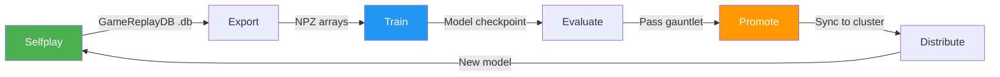
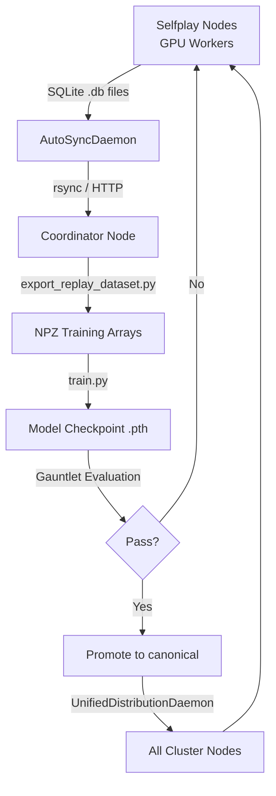
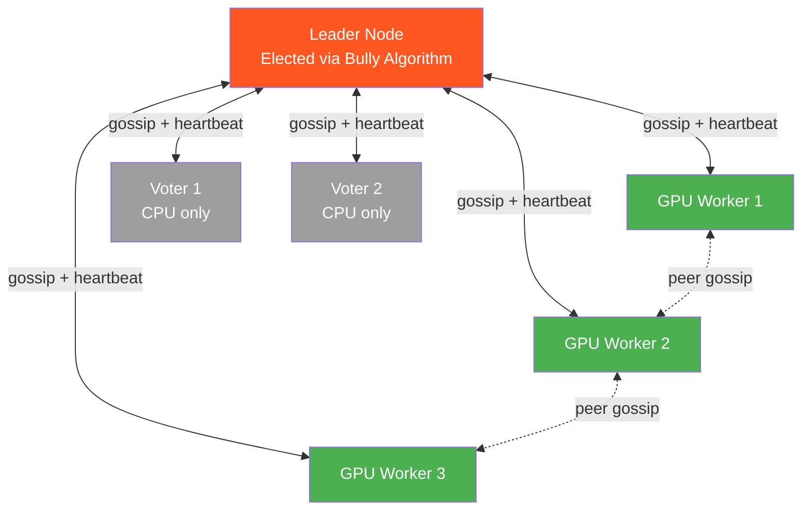
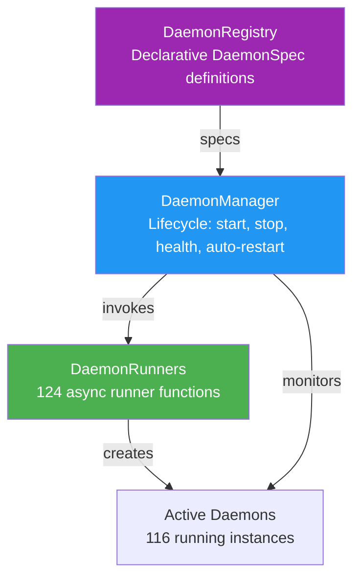
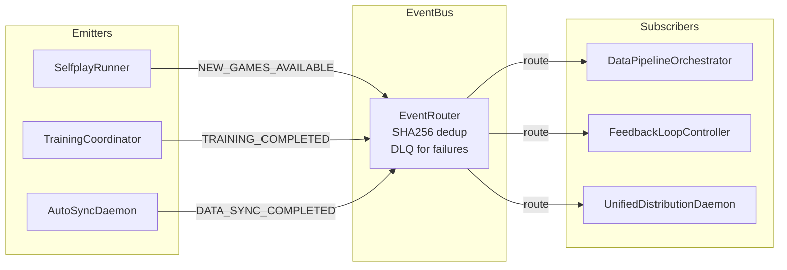

# Distributed Training Architecture

This document describes the end-to-end training pipeline, P2P mesh network, daemon system, event bus, and feedback loops that power RingRift's distributed AI training.

## Training Pipeline

The training pipeline follows an AlphaZero-style loop: selfplay generates games, games are exported to training data, a neural network is trained, evaluated against baselines, and if it passes, promoted and distributed to the cluster for the next round of selfplay.



### Pipeline Stages

| Stage          | Module                                                 | Description                                                              |
| -------------- | ------------------------------------------------------ | ------------------------------------------------------------------------ |
| **Selfplay**   | `scripts/selfplay.py`                                  | Generate games via heuristic, MCTS, or neural network play               |
| **Export**     | `scripts/export_replay_dataset.py`                     | Convert game databases to NPZ training arrays                            |
| **Train**      | `app/training/train.py`                                | Train neural network with early stopping                                 |
| **Evaluate**   | `scripts/quick_gauntlet.py`, `scripts/run_gauntlet.py` | Gauntlet evaluation against baselines (random, heuristic, previous best) |
| **Promote**    | `scripts/auto_promote.py`                              | Promote model to canonical if it passes gauntlet thresholds              |
| **Distribute** | `UnifiedDistributionDaemon`                            | Sync model to all cluster nodes for next selfplay round                  |

### Data Flow



## P2P Mesh Network

The cluster uses a custom P2P mesh network for coordination, built on HTTP and gossip protocols over Tailscale VPN.

### Topology



### Leader Election

- **Algorithm**: Bully algorithm (highest-priority node wins)
- **Heartbeat interval**: 15 seconds
- **Peer timeout**: 60 seconds (node considered dead after missing heartbeats)
- **LeaderProbeLoop**: 10-second probes, 6 consecutive failures = forced election (~60s failover)
- **Quorum**: Requires majority of voter nodes (7 voters, quorum = 4)

### Quorum Health Levels

| Level      | Description           | Behavior                               |
| ---------- | --------------------- | -------------------------------------- |
| `HEALTHY`  | All voters responsive | Normal operation                       |
| `DEGRADED` | Majority responsive   | Training continues, reduced selfplay   |
| `MINIMUM`  | Bare quorum met       | Training allowed, no new selfplay jobs |
| `LOST`     | Below quorum          | Read-only mode, no mutations           |

### Key Endpoints (Port 8770)

| Endpoint               | Method | Description                                |
| ---------------------- | ------ | ------------------------------------------ |
| `/status`              | GET    | Cluster status (leader, alive peers, jobs) |
| `/gossip`              | POST   | Peer-to-peer state synchronization         |
| `/work/claim_training` | POST   | Pull-based training job claiming           |
| `/progress`            | GET    | Elo progress for all configurations        |

## Daemon System

RingRift uses a three-layer daemon architecture for managing 132 background processes.



### Layer 1: DaemonRegistry (`daemon_registry.py`)

Declarative registry mapping `DaemonType` enums to `DaemonSpec` dataclasses:

```python
DaemonSpec(
    daemon_type=DaemonType.AUTO_SYNC,
    category=DaemonCategory.SYNC,
    priority=DaemonPriority.HIGH,
    description="Automated P2P data synchronization",
    health_check_interval=60,
    auto_restart=True,
)
```

### Layer 2: DaemonManager (`daemon_manager.py`)

Lifecycle coordinator (~2,000 LOC):

- Start/stop individual daemons or all at once
- Health monitoring loop with auto-restart on failure
- Startup ordering (event subscribers before emitters)
- HTTP health server on port 8790

### Layer 3: DaemonRunners (`daemon_runners.py`)

124 async runner functions that instantiate and run daemons:

```python
async def run_auto_sync_daemon(context: DaemonContext) -> None:
    daemon = AutoSyncDaemon()
    await daemon.start()
    await daemon.wait_until_stopped()
```

### Daemon Categories

| Category   | Count | Examples                                                   |
| ---------- | ----- | ---------------------------------------------------------- |
| Sync       | ~15   | AUTO_SYNC, MODEL_DISTRIBUTION, ELO_SYNC, GOSSIP_SYNC       |
| Pipeline   | ~10   | DATA_PIPELINE, SELFPLAY_COORDINATOR, TRAINING_NODE_WATCHER |
| Health     | ~12   | NODE_HEALTH_MONITOR, QUALITY_MONITOR, NODE_AVAILABILITY    |
| Resources  | ~8    | IDLE_RESOURCE, NODE_RECOVERY, MEMORY_MONITOR               |
| Autonomous | ~6    | PROGRESS_WATCHDOG, P2P_RECOVERY, STALE_FALLBACK            |
| Evaluation | ~5    | EVALUATION, GAUNTLET_FEEDBACK, TOURNAMENT                  |

## Event Bus

292 event types across 3 layers provide loosely-coupled communication between daemons.



### Event Emission Pattern

All event emissions use `safe_emit_event()` for consistent error handling:

```python
from app.coordination.event_router import emit_event
from app.coordination.data_events import DataEventType

emit_event(DataEventType.TRAINING_COMPLETED, {
    "config_key": "hex8_2p",
    "model_path": "models/canonical_hex8_2p.pth",
})
```

### Critical Event Flows

```
Selfplay -> NEW_GAMES_AVAILABLE -> DataPipeline -> TRAINING_THRESHOLD_REACHED
    -> Training -> TRAINING_COMPLETED -> Evaluation -> EVALUATION_COMPLETED
    -> MODEL_PROMOTED -> Distribution -> Curriculum rebalance
```

### Key Events

| Event                     | Emitter             | Subscribers                                      |
| ------------------------- | ------------------- | ------------------------------------------------ |
| `TRAINING_COMPLETED`      | TrainingCoordinator | FeedbackLoop, DataPipeline, QueuePopulator       |
| `MODEL_PROMOTED`          | PromotionController | UnifiedDistributionDaemon, CurriculumIntegration |
| `DATA_SYNC_COMPLETED`     | AutoSyncDaemon      | DataPipelineOrchestrator                         |
| `REGRESSION_DETECTED`     | RegressionDetector  | TrainingCoordinator, UnifiedFeedback             |
| `EVALUATION_BACKPRESSURE` | EvaluationDaemon    | TrainingCoordinator (pauses training)            |

## Feedback Loops

Five feedback loops create a closed-loop training system that adapts based on results.

```mermaid
flowchart TD
    subgraph "1. Quality -> Training"
        QM[QualityMonitor] -->|QUALITY_SCORE_UPDATED| TC[TrainingCoordinator]
        TC -->|adjust batch size, LR| TRAIN[Training]
    end

    subgraph "2. Elo -> Selfplay"
        EVAL[Evaluation] -->|ELO_UPDATED| SS[SelfplayScheduler]
        SS -->|prioritize stalled configs| SP[Selfplay]
    end

    subgraph "3. Regression -> Curriculum"
        RD[RegressionDetector] -->|REGRESSION_DETECTED| CI[CurriculumIntegration]
        CI -->|emergency curriculum update| SP2[Selfplay]
    end

    subgraph "4. Loss -> Exploration"
        LM[LossMonitor] -->|LOSS_STALL_DETECTED| EXP[ExplorationController]
        EXP -->|increase temperature| SP3[Selfplay]
    end

    subgraph "5. Promotion -> Curriculum"
        PROM[PromotionController] -->|MODEL_PROMOTED| CR[CurriculumRebalancer]
        CR -->|reweight configs| SS2[SelfplayScheduler]
    end
```



| Loop                         | Trigger                                | Response                                                 |
| ---------------------------- | -------------------------------------- | -------------------------------------------------------- |
| **Quality -> Training**      | Data quality scores change             | Adjust training hyperparameters (LR, batch size)         |
| **Elo -> Selfplay**          | Elo ratings updated after evaluation   | Prioritize selfplay for stalled or high-velocity configs |
| **Regression -> Curriculum** | New model performs worse than previous | Emergency curriculum update, boost affected config       |
| **Loss -> Exploration**      | Training loss plateaus                 | Increase selfplay temperature for more exploration       |
| **Promotion -> Curriculum**  | Model promoted to canonical            | Rebalance selfplay allocation across configs             |

## Related Documentation

- [P2P Orchestrator Architecture](P2P_ORCHESTRATOR.md) - Detailed P2P orchestrator internals
- [Event Subscription Matrix](EVENT_SUBSCRIPTION_MATRIX.md) - Full emitter/subscriber mapping
- [Daemon System Architecture](DAEMON_SYSTEM_ARCHITECTURE.md) - Daemon lifecycle details
- [Feedback Loop Wiring](FEEDBACK_LOOP_WIRING.md) - Detailed feedback loop implementation
