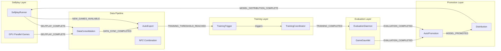
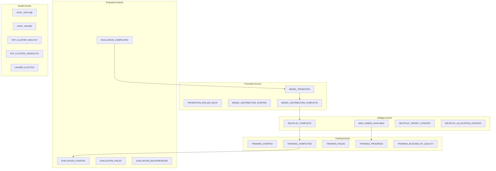
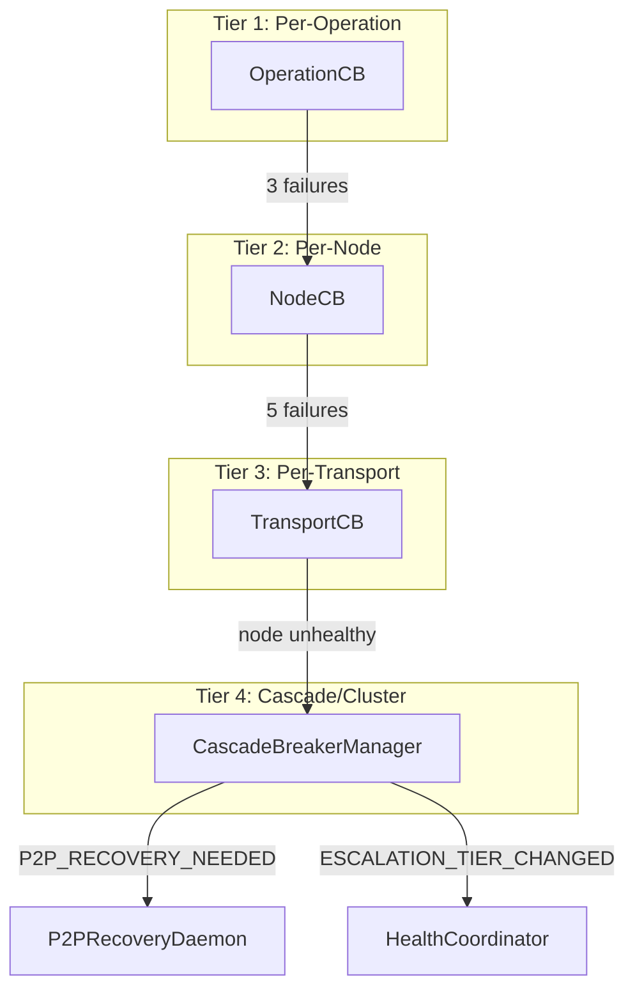
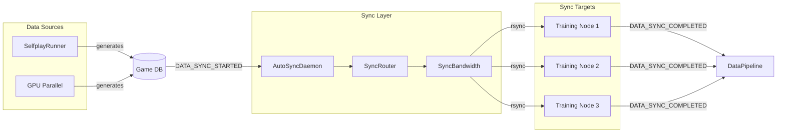
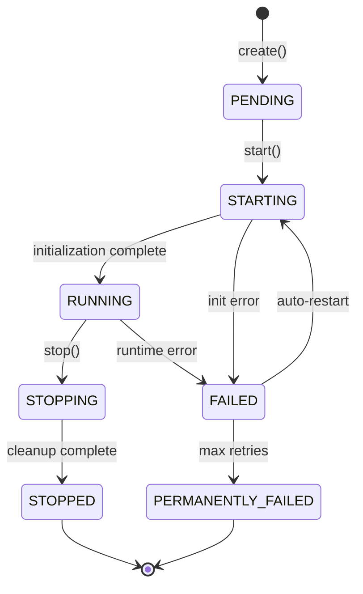
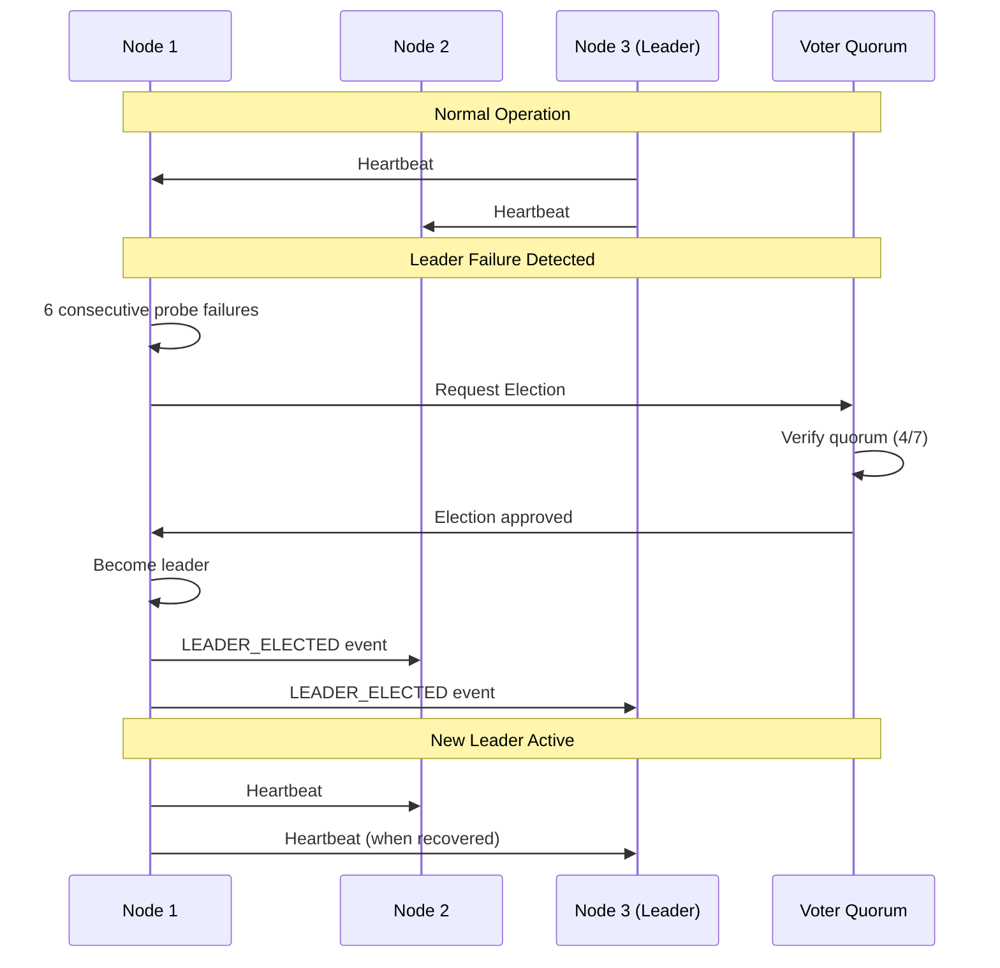
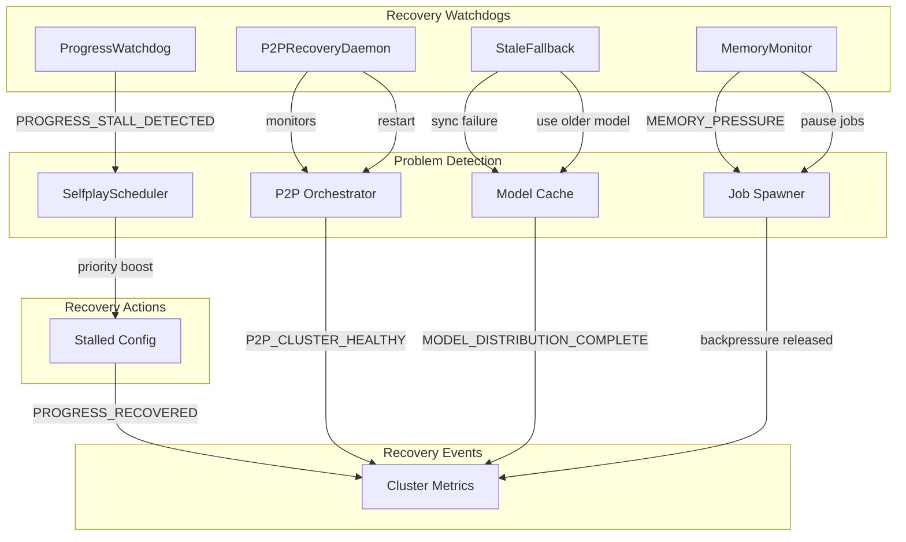

# Event Wiring Diagram

**Last Updated**: January 7, 2026

This document provides visual diagrams of the RingRift event system using Mermaid syntax for GitHub rendering.

## Complete Training Pipeline

## Feedback Loops

```mermaid
flowchart TB
    subgraph Loop1["Quality → Training"]
        QM[QualityMonitor] -->|QUALITY_ASSESSMENT| FLC1[FeedbackLoopController]
        FLC1 -->|adjusts| TT1[TrainingTrigger]
    end

    subgraph Loop2["Elo Velocity → Selfplay"]
        ES[EloService] -->|ELO_UPDATED| SS[SelfplayScheduler]
        SS -->|reallocates| SP2[SelfplayRunner]
    end

    subgraph Loop3["Regression → Curriculum"]
        RD[RegressionDetector] -->|REGRESSION_DETECTED| FLC3[FeedbackLoopController]
        FLC3 -->|CURRICULUM_EMERGENCY_UPDATE| CI[CurriculumIntegration]
    end

    subgraph Loop4["Loss Anomaly → Exploration"]
        TC4[TrainingCoordinator] -->|LOSS_ANOMALY_DETECTED| FLC4[FeedbackLoopController]
        FLC4 -->|EXPLORATION_BOOST| SP4[SelfplayRunner]
    end

    subgraph Loop5["Curriculum → Weights"]
        CI5[CurriculumIntegration] -->|CURRICULUM_REBALANCED| SS5[SelfplayScheduler]
        SS5 -->|updates allocation| SP5[SelfplayRunner]
    end
```

## Event Categories by Flow

## Circuit Breaker Cascade

## Data Sync Flow

## Daemon Lifecycle

## P2P Leader Election

## 48-Hour Autonomous Operation

## Event Subscription Counts by Category

| Category   | Events | Key Events                                             |
| ---------- | ------ | ------------------------------------------------------ |
| Training   | 15     | TRAINING_COMPLETED, TRAINING_FAILED, TRAINING_PROGRESS |
| Selfplay   | 12     | SELFPLAY_COMPLETE, NEW_GAMES_AVAILABLE                 |
| Evaluation | 8      | EVALUATION_COMPLETED, EVALUATION_BACKPRESSURE          |
| Promotion  | 9      | MODEL_PROMOTED, PROMOTION_ROLLED_BACK                  |
| Sync       | 11     | DATA_SYNC_COMPLETED, P2P_MODEL_SYNCED                  |
| Health     | 26     | HOST_OFFLINE, P2P_CLUSTER_UNHEALTHY, LEADER_ELECTED    |
| Daemon     | 13     | DAEMON_STARTED, DAEMON_PERMANENTLY_FAILED              |
| Quality    | 10     | QUALITY_SCORE_UPDATED, QUALITY_DEGRADED                |
| Curriculum | 8      | CURRICULUM_REBALANCED, TIER_PROMOTION                  |
| Work Queue | 12     | WORK_CLAIMED, WORK_COMPLETED, WORK_FAILED              |

**Total Events**: 292 DataEventType members

## See Also

- [EVENT_FLOW_INTEGRATION.md](EVENT_FLOW_INTEGRATION.md) - Detailed event chain documentation
- [EVENT_SUBSCRIPTION_MATRIX.md](EVENT_SUBSCRIPTION_MATRIX.md) - Full emitter/subscriber matrix
- [FEEDBACK_LOOP_WIRING.md](FEEDBACK_LOOP_WIRING.md) - Feedback loop details
- [DAEMON_LIFECYCLE.md](DAEMON_LIFECYCLE.md) - Daemon state management
- `app/coordination/data_events.py` - Event type definitions
- `app/coordination/event_router.py` - Event bus implementation
