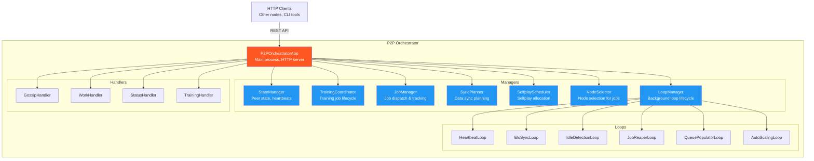
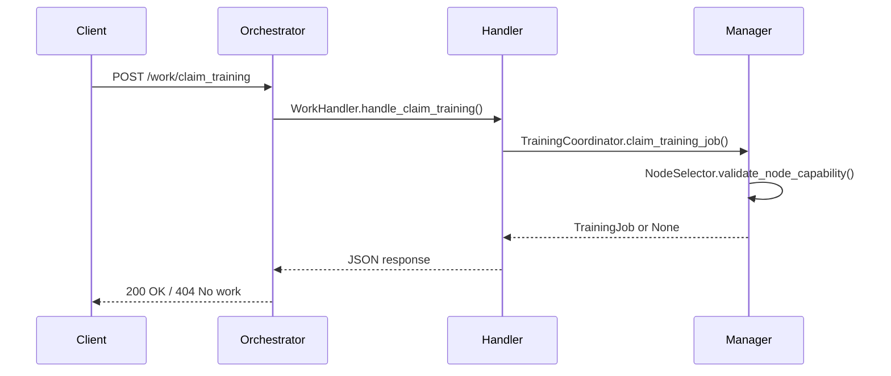
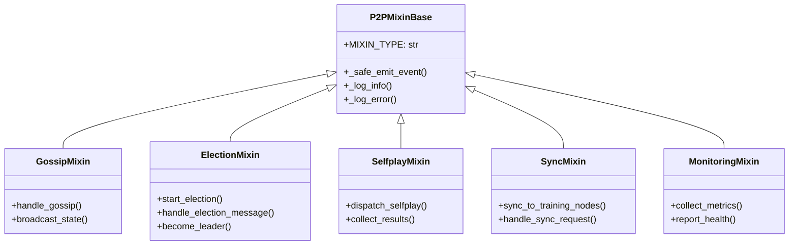
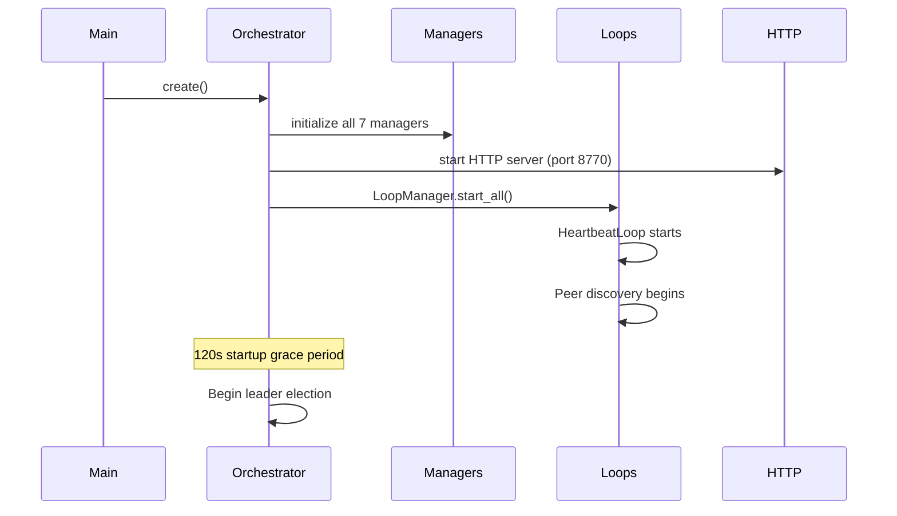

# P2P Orchestrator Architecture

The P2P orchestrator (`scripts/p2p_orchestrator.py`, ~28K LOC) is the central coordination process for each node in the cluster. It manages leader election, job dispatching, data synchronization, and background loops through a manager delegation model.

## Component Diagram



## Manager Delegation Model

The orchestrator delegates all domain logic to 7 specialized managers. The orchestrator itself is a thin HTTP server and lifecycle coordinator.

### Managers

| Manager                 | Location                                       | Responsibility                                                               |
| ----------------------- | ---------------------------------------------- | ---------------------------------------------------------------------------- |
| **StateManager**        | `scripts/p2p/managers/state_manager.py`        | Peer state tracking, heartbeat processing, leader election state             |
| **TrainingCoordinator** | `scripts/p2p/managers/training_coordinator.py` | Training job dispatch, completion handling, gauntlet triggering              |
| **JobManager**          | `scripts/p2p/managers/job_manager.py`          | Job creation, tracking, completion, distributed selfplay/tournament          |
| **SyncPlanner**         | `scripts/p2p/managers/sync_planner.py`         | Data sync planning, sync execution coordination                              |
| **SelfplayScheduler**   | `scripts/p2p/managers/selfplay_scheduler.py`   | Priority-based selfplay allocation using curriculum weights and Elo velocity |
| **NodeSelector**        | `scripts/p2p/managers/node_selector.py`        | Node selection for job placement based on GPU capability, load, health       |
| **LoopManager**         | `scripts/p2p/managers/` (via factory)          | Background loop lifecycle management (start/stop all loops)                  |

### How Requests Flow



## Routes and Handlers

The orchestrator exposes HTTP routes that delegate to handler modules.

| Route                       | Handler           | Description                        |
| --------------------------- | ----------------- | ---------------------------------- |
| `GET /status`               | `StatusHandler`   | Node status, leader, alive peers   |
| `POST /gossip`              | `GossipHandler`   | Peer-to-peer state synchronization |
| `POST /work/claim_training` | `WorkHandler`     | Pull-based training job claiming   |
| `POST /work/submit_result`  | `WorkHandler`     | Report job completion              |
| `GET /progress`             | `StatusHandler`   | Elo progress for all configs       |
| `POST /selfplay/dispatch`   | `SelfplayHandler` | Dispatch selfplay jobs             |
| `GET /health`               | Built-in          | Liveness probe                     |

Handler implementations live in `scripts/p2p/handlers/`.

## Background Loops

Background loops run periodically via the LoopManager. Each loop inherits from `BaseLoop` for consistent lifecycle management.

| Loop                 | Interval | Purpose                                         |
| -------------------- | -------- | ----------------------------------------------- |
| `HeartbeatLoop`      | 15s      | Send heartbeats to peers, detect failures       |
| `EloSyncLoop`        | 60s      | Synchronize Elo ratings across cluster          |
| `IdleDetectionLoop`  | 30s      | Detect idle nodes for scaling decisions         |
| `JobReaperLoop`      | 120s     | Clean up stale/failed jobs                      |
| `QueuePopulatorLoop` | 60s      | Maintain work queue with selfplay/training jobs |
| `AutoScalingLoop`    | 300s     | Scale cloud GPU instances based on demand       |

Loop implementations live in `scripts/p2p/loops/`.

## Mixin Class Hierarchy

The orchestrator uses mixins to organize cross-cutting concerns. All mixins inherit from `P2PMixinBase`.



`P2PMixinBase` (`scripts/p2p/p2p_mixin_base.py`, ~995 LOC) provides:

- Safe event emission with error handling
- Structured logging with node context
- Access to shared orchestrator state
- Common utility methods for P2P operations

## Startup Sequence



## File Structure

```
scripts/p2p/
├── p2p_mixin_base.py          # Base class for all P2P mixins
├── managers/
│   ├── state_manager.py       # Peer state and heartbeats
│   ├── training_coordinator.py # Training job lifecycle
│   ├── job_manager.py         # Job dispatch and tracking
│   ├── sync_planner.py        # Data sync planning
│   ├── selfplay_scheduler.py  # Selfplay allocation
│   ├── node_selector.py       # Node selection for jobs
│   ├── heartbeat_manager.py   # Heartbeat processing
│   ├── quorum_manager.py      # Voter quorum tracking
│   ├── recovery_manager.py    # Failure recovery
│   └── ...                    # 30+ manager modules
├── handlers/
│   ├── gossip.py              # Gossip protocol handler
│   ├── work.py                # Work claiming handler
│   ├── status.py              # Status endpoint handler
│   └── gauntlet.py            # Gauntlet dispatch handler
└── loops/
    ├── elo_sync_loop.py       # Elo synchronization
    ├── job_loops.py           # Job reaper, idle detection
    ├── coordination_loops.py  # Auto-scaling
    └── queue_populator_loop.py # Work queue maintenance
```

## Related Documentation

- [Distributed Training Architecture](DISTRIBUTED_TRAINING.md) - End-to-end pipeline overview
- [P2P Orchestration](P2P_ORCHESTRATION.md) - Older detailed orchestration docs
- [P2P Orchestrator Architecture](P2P_ORCHESTRATOR_ARCHITECTURE.md) - Historical architecture notes
