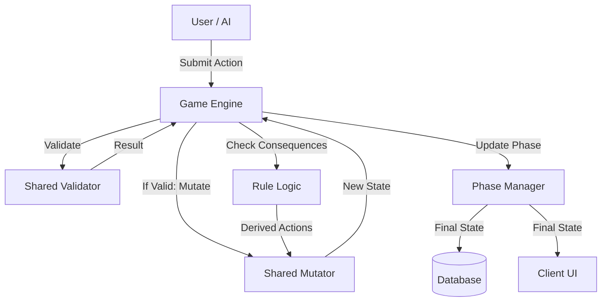

# RingRift Engine Refactoring: Architecture Design

**Date:** November 21, 2025
**Status:** Draft
**Author:** Architect Mode

## 1. Executive Summary

This document outlines the architectural redesign of the RingRift game engine. The primary goal is to transition from a monolithic, coupled architecture to a modular, functional, and type-safe system. This will enable code sharing between the server (backend) and client (sandbox/prediction), reduce technical debt, and facilitate the implementation of complex features like the "Forced Elimination Choice."

## 2. Core Principles

1.  **Single Source of Truth:** The `GameState` object is the definitive record of the game.
2.  **Immutability:** State transitions produce new `GameState` objects; they do not mutate existing ones.
3.  **Pure Functions:** Logic for validation and mutation is implemented as pure functions (`(State, Action) -> Result`).
4.  **Shared Code:** Core logic resides in `src/shared/engine` and is used by both server and client.
5.  **Type Safety:** Strict TypeScript interfaces define all data structures and interactions.

## 3. Proposed Directory Structure

We will reorganize `src/shared/engine` to house the core logic.

```
src/shared/engine/
├── types.ts                # Core type definitions (GameState, Action, etc.)
├── core.ts                 # Existing core helpers (keep for now, migrate slowly)
├── actions/                # Action definitions and factories
│   ├── movement.ts
│   ├── placement.ts
│   ├── capture.ts
│   └── elimination.ts
├── validators/             # Pure validation logic
│   ├── movementValidator.ts
│   ├── placementValidator.ts
│   ├── captureValidator.ts
│   └── ruleValidator.ts    # Composite validator
├── mutators/               # Pure state mutation logic
│   ├── boardMutator.ts
│   ├── playerMutator.ts
│   └── turnMutator.ts
└── orchestration/          # Higher-level flow control (optional, shared)
    └── phaseManager.ts
```

## 4. Key Interface Definitions

### 4.1. Game State (Refined)

We will retain the existing `GameState` but ensure it is strictly serializable and immutable-friendly.

```typescript
// src/shared/engine/types.ts

export interface GameState {
  readonly id: string;
  readonly board: BoardState;
  readonly players: ReadonlyArray<Player>;
  readonly currentPhase: GamePhase;
  readonly currentPlayer: number;
  readonly moveHistory: ReadonlyArray<Move>;
  readonly gameStatus: GameStatus;
  // ... other fields
}
```

### 4.2. Actions

All player interactions and system events are modeled as `Action`s.

```typescript
// src/shared/engine/types.ts

export type ActionType =
  | 'PLACE_RING'
  | 'MOVE_STACK'
  | 'OVERTAKING_CAPTURE'
  | 'CONTINUE_CHAIN'
  | 'PROCESS_LINE'
  | 'CHOOSE_LINE_REWARD'
  | 'PROCESS_TERRITORY'
  | 'ELIMINATE_STACK' // For Forced Elimination Choice
  | 'SKIP_PLACEMENT';

export interface BaseAction {
  type: ActionType;
  playerId: number;
}

export interface PlaceRingAction extends BaseAction {
  type: 'PLACE_RING';
  position: Position;
  count: number;
}

export interface MoveStackAction extends BaseAction {
  type: 'MOVE_STACK';
  from: Position;
  to: Position;
}

export interface EliminateStackAction extends BaseAction {
  type: 'ELIMINATE_STACK';
  stackPosition: Position; // The stack to sacrifice from
}

export type GameAction = PlaceRingAction | MoveStackAction | EliminateStackAction | ...;
```

### 4.3. Validators

Validators check if an action is legal given the current state.

```typescript
export type ValidationResult = { valid: true } | { valid: false; reason: string; code: string };

export type Validator<T extends GameAction> = (state: GameState, action: T) => ValidationResult;
```

### 4.4. Mutators

Mutators apply an action to a state and return the new state.

```typescript
export type Mutator<T extends GameAction> = (state: GameState, action: T) => GameState;
```

## 5. Data Flow: The "Move" Lifecycle

The lifecycle of a move will follow this unidirectional flow:

1.  **Input:** User (or AI) submits a `GameAction`.
2.  **Validation:** The `GameEngine` calls the appropriate `Validator`.
    - If invalid, return error to user.
3.  **Mutation:** If valid, the `GameEngine` calls the appropriate `Mutator`.
    - This produces `nextState`.
4.  **Consequences:** The `GameEngine` checks for automatic consequences (lines, territory).
    - This may trigger internal actions (e.g., `AUTO_COLLAPSE_LINE`).
5.  **Phase Transition:** The `PhaseManager` determines the next phase/player based on `nextState`.
6.  **Persistence/Emit:** The final state is saved and broadcast to clients.



## 6. Addressing the "Forced Elimination Choice" Gap

Currently, forced elimination is automatic. We will introduce a new flow:

1.  **Detection:** `TurnEngine` detects "Blocked" state (stacks exist, but no legal moves).
2.  **Phase Change:** Instead of auto-eliminating, set `currentPhase = 'FORCED_ELIMINATION'`.
3.  **User Action:** User must submit an `ELIMINATE_STACK` action.
4.  **Validation:** Verify the stack belongs to the user and has a cap.
5.  **Mutation:** Remove the cap, update scores.
6.  **Transition:** Return to `MOVEMENT` phase (or next player if still blocked).

## 7. Migration Strategy

We will adopt a "Strangler Fig" pattern to migrate without breaking the existing game.

1.  **Phase 1: Shared Primitives (Current)**
    - Continue moving pure logic to `src/shared/engine/core.ts`.
    - Ensure `GameEngine` and `ClientSandboxEngine` use these primitives.

2.  **Phase 2: Action & Validator Extraction**
    - Define the `GameAction` types.
    - Extract validation logic from `RuleEngine.ts` into `src/shared/engine/validators/`.
    - Update `RuleEngine` to delegate to these shared validators.

3.  **Phase 3: Mutator Extraction**
    - Extract state modification logic from `GameEngine.ts` into `src/shared/engine/mutators/`.
    - Update `GameEngine` to use these mutators (initially wrapping them to maintain the class-based state).

4.  **Phase 4: Forced Elimination Implementation**
    - Implement the `ELIMINATE_STACK` action and flow using the new architecture.

5.  **Phase 5: Full Cutover**
    - Refactor `GameEngine` to be a thin orchestrator.
    - Refactor `ClientSandboxEngine` to use the exact same shared modules.

## 8. Next Steps

1.  Create `src/shared/engine/types.ts` and define the `GameAction` union type.
2.  Create `src/shared/engine/validators/` and migrate `validateStackMovement`.
3.  Create `src/shared/engine/mutators/` and migrate `applyMove` logic.
