# Remaining Implementation Tasks - Code Agent Assignments

**Generated**: November 22, 2025  
**Source**: [`FINAL_ARCHITECT_REPORT.md`](FINAL_ARCHITECT_REPORT.md:1), [`KNOWN_ISSUES.md`](KNOWN_ISSUES.md:1), [`RULES_SCENARIO_MATRIX.md`](RULES_SCENARIO_MATRIX.md:1)  
**Status**: Ready for Code Agent Execution  
**Reference Context**: 13 major tasks completed (see Part 3-4 of architect report)

---

## Summary

**Total Remaining Tasks**: 31 tasks organized across 3 priority levels

- **P0 (Critical)**: 5 tasks - Rules compliance, testing infrastructure
- **P1 (High)**: 14 tasks - Multiplayer, UX polish, AI strength
- **P2 (Medium)**: 12 tasks - Infrastructure, social features, optimization

---

## Table of Contents

1. [P0 Tasks: Critical Path](#p0-tasks-critical-path)
2. [P1 Tasks: Core Features](#p1-tasks-core-features)
3. [P2 Tasks: Polish & Enhancements](#p2-tasks-polish--enhancements)
4. [Task Dependency Graph](#task-dependency-graph)
5. [Implementation Sequence Recommendation](#implementation-sequence-recommendation)

---

## P0 Tasks: Critical Path

### P0-TESTING-001: Complete FAQ Scenario Test Matrix

**Priority**: P0 (Critical for rules confidence)  
**Category**: Testing / Rules Compliance  
**Complexity**: Medium  
**Effort**: 1-2 weeks  
**Dependencies**: None

**Goal**: Create comprehensive test suite covering all FAQ Q1-Q24 examples from [`ringrift_complete_rules.md`](ringrift_complete_rules.md:1) to ensure exhaustive rules compliance.

**Affected Components**:

- Backend: [`GameEngine`](src/shared/engine/GameEngine.ts:1), [`RuleEngine`](src/server/game/RuleEngine.ts:1), [`BoardManager`](src/server/game/BoardManager.ts:1)
- Tests: New scenario test files in [`tests/scenarios/`](tests/scenarios/)
- Documentation: [`RULES_SCENARIO_MATRIX.md`](RULES_SCENARIO_MATRIX.md:1)

**Relevant Files**:

- [`ringrift_complete_rules.md`](ringrift_complete_rules.md:1) - Authoritative rulebook with FAQ Q1-Q24
- [`RULES_SCENARIO_MATRIX.md`](RULES_SCENARIO_MATRIX.md:1) - Current test coverage mapping
- [`tests/scenarios/RulesMatrix.Comprehensive.test.ts`](tests/scenarios/RulesMatrix.Comprehensive.test.ts:1) - Existing scenario framework
- [`tests/utils/fixtures.ts`](tests/utils/fixtures.ts:1) - Test state creation utilities

**Implementation Requirements**:

1. **Create test file for each FAQ question**: `tests/scenarios/FAQ_Q<number>.test.ts` (24 files)
2. **Each test must**:
   - Set up game state matching FAQ example using fixtures
   - Execute moves described in FAQ
   - Assert expected outcomes (captures, eliminations, phase transitions)
   - Test on all relevant board types (square8, square19, hexagonal)
3. **Focus areas from RULES_SCENARIO_MATRIX**:
   - **Q15.3.1**: 180° chain capture reversals (already partially covered but needs direct FAQ test)
   - **Q15.3.2**: Cyclic chain captures (already partially covered but needs direct FAQ test)
   - **Q7-Q8**: Line formation scenarios across board types
   - **Q22**: Graduated line rewards (Option 1 vs Option 2)
   - **Q23**: Territory self-elimination prerequisite
   - **Q2-Q3**: Movement and marker interaction
   - **Q10, Q15, Q20**: Territory disconnection edge cases
   - **Q11, Q18, Q21, Q24**: Victory conditions and stalemate
4. **Use existing test utilities**:
   - [`tests/utils/fixtures.ts`](tests/utils/fixtures.ts:1) for state creation
   - [`tests/scenarios/rulesMatrix.ts`](tests/scenarios/rulesMatrix.ts:1) for scenario helpers
5. **Validate against both engines**:
   - Backend [`GameEngine`](src/shared/engine/GameEngine.ts:1)
   - [`ClientSandboxEngine`](src/client/sandbox/ClientSandboxEngine.ts:1)

**Acceptance Criteria**:

- [ ] 24 new test files created (one per FAQ question Q1-Q24)
- [ ] All tests passing on square8, square19, and hexagonal boards where applicable
- [ ] 100% coverage of FAQ examples with direct assertions
- [ ] [`RULES_SCENARIO_MATRIX.md`](RULES_SCENARIO_MATRIX.md:1) updated with test file references
- [ ] No existing tests broken
- [ ] Each test references specific FAQ section in describe/it blocks
- [ ] CI passing with all new tests included

**Success Metrics**:

- Zero FAQ behaviors untested
- Easy to run subset: `npm test -- FAQ_Q15` runs Q15 tests only
- Scenario tests document exact FAQ example with minimal abstraction
- Test names follow convention: `FAQ_Q<num>_<description>`

**Coordination Needed**: None (independent task)

---

### P0-TESTING-002: Sandbox Parity Hardening

**Priority**: P0 (Critical for correctness)  
**Category**: Testing / Engine Parity  
**Complexity**: High  
**Effort**: 1-2 weeks  
**Dependencies**: None

**Goal**: Close remaining semantic gaps between backend [`GameEngine`](src/shared/engine/GameEngine.ts:1) and [`ClientSandboxEngine`](src/client/sandbox/ClientSandboxEngine.ts:1) to achieve deterministic trace parity.

**Affected Components**:

- Backend: [`GameEngine`](src/shared/engine/GameEngine.ts:1)
- Sandbox: [`ClientSandboxEngine`](src/client/sandbox/ClientSandboxEngine.ts:1), all sandbox modules
- Tests: [`tests/unit/Backend_vs_Sandbox.traceParity.test.ts`](tests/unit/Backend_vs_Sandbox.traceParity.test.ts:1)

**Relevant Files**:

- [`KNOWN_ISSUES.md`](KNOWN_ISSUES.md:104) - Lines 104-188 document current parity gaps
- [`tests/utils/traces.ts`](tests/utils/traces.ts:1) - Trace replay utilities
- [`tests/unit/Backend_vs_Sandbox.traceParity.test.ts`](tests/unit/Backend_vs_Sandbox.traceParity.test.ts:1)
- [`tests/unit/Sandbox_vs_Backend.seed5.traceDebug.test.ts`](tests/unit/Sandbox_vs_Backend.seed5.traceDebug.test.ts:1)

**Implementation Requirements**:

1. **Investigate semantic mismatches**:
   - Sandbox emits `overtaking_capture` moves where backend doesn't enumerate matching captures
   - Sandbox AI attempts `place_ring` with count > 1 that backend rejects as "dead placement"
   - Phase transition disagreements between engines
2. **Unify sandbox canonical mutations**:
   - Treat [`applyCanonicalMoveInternal`](src/client/sandbox/ClientSandboxEngine.ts:1900) as single source of truth
   - Refactor [`maybeRunAITurn`](src/client/sandbox/sandboxAI.ts:437) to express all AI actions as canonical Moves
   - Route through same mutation + history pipeline
3. **Harden backend replay helpers**:
   - Generic `replayMovesOnBackend(initialConfig, moves: Move[]): GameTrace` helper
   - Use [`findMatchingBackendMove`](tests/utils/traces.ts:1) for move matching
   - Produce backend [`GameTrace`](src/shared/types/game.ts:401) for parity analysis
4. **Close semantic gaps iteratively**:
   - When parity failure occurs, confirm backend has genuinely matching legal move
   - Where semantics diverge, treat as engine bug and fix underlying rules/phase logic
   - Use diagnostic env vars: `RINGRIFT_TRACE_DEBUG=1`, `RINGRIFT_AI_DEBUG=1`

**Acceptance Criteria**:

- [ ] Seed 5 trace parity test passes consistently
- [ ] No semantic mismatches in overtaking capture enumeration
- [ ] Placement validation (`hasAnyLegalMoveOrCaptureFrom`) matches between engines
- [ ] Phase transitions occur identically in both engines
- [ ] All sandbox AI actions routed through canonical Move application
- [ ] Backend replay produces identical traces for same seed
- [ ] CI gates enforce parity for curated seeds

**Success Metrics**:

- Backend ↔ Sandbox trace parity test suite passes consistently
- Trace-based debugging fully reliable
- S-invariant matches exactly across engines
- Move history replay deterministic

**Coordination Needed**: May require coordination with AI improvements if issues found in AI move enumeration

---

### P0-TESTING-003: React Testing Library Setup

**Priority**: P0 (Blocking UI component tests)  
**Category**: Testing / Tooling  
**Complexity**: Low  
**Effort**: 2-4 hours  
**Dependencies**: None

**Goal**: Configure Jest to transform TSX/JSX test files, enabling React component snapshot and unit tests.

**Affected Components**:

- Build: [`jest.config.js`](jest.config.js:1)
- Tests: All `*.snapshot.test.tsx` and component test files

**Relevant Files**:

- [`jest.config.js`](jest.config.js:1) - Jest configuration
- [`KNOWN_ISSUES.md`](KNOWN_ISSUES.md:470) - Lines 470-490 document the TSX transform issue
- [`tests/unit/GameEventLog.snapshot.test.tsx`](tests/unit/GameEventLog.snapshot.test.tsx:1) - Currently failing
- [`tests/unit/GameHUD.test.tsx`](tests/unit/GameHUD.test.tsx:1) - Component test

**Implementation Requirements**:

1. **Install dependencies**:

   ```bash
   npm install --save-dev @testing-library/react @testing-library/jest-dom @testing-library/user-event
   ```

2. **Update [`jest.config.js`](jest.config.js:1)**:
   - Add transform for `.tsx` files using `ts-jest` or Babel
   - Configure test environment as `jsdom`
   - Add setup file for `@testing-library/jest-dom`
3. **Create setup file** `tests/setup-rtl.ts`:
   - Import `@testing-library/jest-dom`
   - Configure any global test utilities
4. **Fix failing tests**:
   - Run `npm test -- GameEventLog.snapshot.test.tsx`
   - Regenerate snapshots if needed
   - Verify all component tests pass

**Acceptance Criteria**:

- [ ] `@testing-library/react` installed and configured
- [ ] Jest transforms TSX/JSX files correctly
- [ ] `GameEventLog.snapshot.test.tsx` passes
- [ ] All component tests execute successfully
- [ ] No `SyntaxError: Unexpected token '<'` errors
- [ ] CI runs all React component tests

**Success Metrics**:

- All component tests green in CI
- Easy to add new React component tests
- Snapshot testing workflow functional

**Coordination Needed**: None (tooling task)

---

### P0-INFRA-001: Production Environment Configuration

**Priority**: P0 (Blocking launch)  
**Category**: Infrastructure / Deployment  
**Complexity**: Medium  
**Effort**: 4-8 hours  
**Dependencies**: None

**Goal**: Document and configure production environment settings for secure, scalable deployment.

**Affected Components**:

- Backend: Environment configuration
- Database: PostgreSQL connection and scaling
- Redis: Session management and caching
- AI Service: Python service deployment

**Relevant Files**:

- [`.env.example`](.env.example:1) - Environment template
- [`docker-compose.yml`](docker-compose.yml:1) - Local development setup
- [`Dockerfile`](Dockerfile:1) - Backend container configuration
- [`ai-service/Dockerfile`](ai-service/Dockerfile:1) - AI service container
- [`FINAL_ARCHITECT_REPORT.md`](FINAL_ARCHITECT_REPORT.md:966) - Part 11.2 lists required actions

**Implementation Requirements**:

1. **Create production environment documentation**: `docs/PRODUCTION_DEPLOYMENT.md`
   - Database connection strings (PostgreSQL)
   - Redis configuration for production workload
   - JWT secret generation and rotation
   - CORS configuration for production domain
   - AI service scaling strategy
   - Monitoring and alerting thresholds
2. **Security configuration**:
   - Generate secure JWT_SECRET (never commit to repo)
   - Configure CORS allowlist for production domain
   - Set up database connection pooling
   - Configure Redis sentinel for high availability
   - Set up SSL/TLS certificates
3. **Scaling configuration**:
   - AI service horizontal scaling parameters
   - Database read replicas
   - Redis cluster configuration
   - Load balancer setup
4. **Monitoring setup**:
   - Health check endpoints
   - Prometheus metrics export
   - Alert thresholds
   - Log aggregation

**Acceptance Criteria**:

- [ ] `docs/PRODUCTION_DEPLOYMENT.md` created with full deployment guide
- [ ] Production `.env.production.example` template created
- [ ] Security checklist documented and verified
- [ ] Scaling strategy documented
- [ ] Monitoring endpoints implemented
- [ ] Health check routes working
- [ ] Deployment runbook created

**Success Metrics**:

- Can deploy to production following documentation
- All services pass health checks
- Security audit passes
- Monitoring dashboards operational

**Coordination Needed**: DevOps team for infrastructure provisioning

---

### P0-INFRA-002: Staging Environment Deployment

**Priority**: P0 (Risk mitigation)  
**Category**: Infrastructure / Testing  
**Complexity**: Medium  
**Effort**: 4-8 hours  
**Dependencies**: P0-INFRA-001

**Goal**: Deploy full application stack to staging environment for pre-production validation.

**Affected Components**:

- All services: Backend, Frontend, AI Service, Database, Redis

**Relevant Files**:

- [`FINAL_ARCHITECT_REPORT.md`](FINAL_ARCHITECT_REPORT.md:726) - Part 8 Immediate Action #1
- [`docker-compose.yml`](docker-compose.yml:1)
- Production deployment docs from P0-INFRA-001

**Implementation Requirements**:

1. **Set up staging server**:
   - Provision server infrastructure
   - Install Docker and Docker Compose
   - Configure firewall and networking
2. **Deploy services**:
   - Deploy PostgreSQL with staging data
   - Deploy Redis for sessions
   - Deploy Python AI service
   - Deploy backend Node.js service
   - Deploy frontend static files
3. **Configuration**:
   - Set staging environment variables
   - Configure CORS for staging domain
   - Set up SSL certificates
   - Configure monitoring
4. **Smoke tests**:
   - Create sample user accounts
   - Create and play test games
   - Test AI opponents at all difficulties
   - Test reconnection flows
   - Verify WebSocket communication
5. **Monitoring**:
   - Set up log aggregation
   - Configure health checks
   - Monitor for 24-48 hours
   - Document any issues found

**Acceptance Criteria**:

- [ ] All services deployed and healthy
- [ ] Sample games complete successfully
- [ ] AI service responding correctly
- [ ] WebSocket connections stable
- [ ] Logs showing no critical errors
- [ ] Performance acceptable (< 100ms API response)
- [ ] 24-hour monitoring period completed successfully

**Success Metrics**:

- 99%+ uptime during monitoring period
- Zero critical errors in logs
- All smoke tests passing
- Performance metrics within targets

**Coordination Needed**: DevOps for server provisioning

---

## P1 Tasks: Core Features

### P1-TESTING-001: User Acceptance Testing

**Priority**: P1 (Critical feedback loop)  
**Category**: Testing / UX Validation  
**Complexity**: Low  
**Effort**: 8-16 hours  
**Dependencies**: P0-INFRA-002 (requires staging environment)

**Goal**: Conduct structured playtesting sessions to identify UX issues and rule confusion before public beta.

**Affected Components**:

- Entire user-facing application

**Relevant Files**:

- [`FINAL_ARCHITECT_REPORT.md`](FINAL_ARCHITECT_REPORT.md:751) - Part 8 Immediate Action #3
- [`QUICKSTART.md`](QUICKSTART.md:1) - User onboarding guide
- [`ringrift_complete_rules.md`](ringrift_complete_rules.md:1) - Rules for playtesters

**Implementation Requirements**:

1. **Recruit playtesters**:
   - 3-5 volunteer playtesters
   - Mix of technical and non-technical users
   - Provide access to staging environment
2. **Prepare materials**:
   - Simplified rules summary for playtesters
   - Feedback form/survey
   - Screen recording tools (optional)
   - Test scenarios to walk through
3. **Testing sessions**:
   - Observe complete game sessions
   - Take notes on confusion points
   - Record questions asked
   - Document bugs encountered
   - Measure task completion times
4. **Collect feedback**:
   - Chain capture clarity (is mandatory continuation intuitive?)
   - Line reward decisions (do players understand options?)
   - Territory processing (is self-elimination prerequisite clear?)
   - Victory conditions (are win conditions obvious?)
   - AI difficulty curve (is progression satisfying?)
5. **Metrics to track**:
   - Average game duration by board type
   - Decision time for PlayerChoices
   - AI difficulty distribution preferences
   - Abandonment rate and reasons
   - Rule confusion points

**Acceptance Criteria**:

- [ ] 5+ complete game sessions observed
- [ ] Feedback documented per session
- [ ] Issues logged in issue tracker
- [ ] Common confusion points identified
- [ ] UX improvement recommendations created
- [ ] Success rate for completing games > 80%

**Success Metrics**:

- Users complete games without blocking confusion
- < 5% abandonment due to unclear rules
- Positive feedback on core gameplay
- Clear priorities for UX improvements

**Coordination Needed**: Product/Design for feedback analysis

---

### P1-MULTIPLAYER-001: Reconnection UX Enhancement

**Priority**: P1 (Critical for multiplayer)  
**Category**: Multiplayer / UX  
**Complexity**: Medium  
**Effort**: 4-5 days  
**Dependencies**: None

**Goal**: Enable players to reconnect to games in progress with full state resynchronization.

**Affected Components**:

- Backend: [`WebSocketServer`](src/server/websocket/server.ts:1), [`GameSession`](src/server/game/GameSession.ts:1)
- Frontend: [`GameContext`](src/client/contexts/GameContext.tsx:1), [`GamePage`](src/client/pages/GamePage.tsx:1)

**Relevant Files**:

- [`FINAL_ARCHITECT_REPORT.md`](FINAL_ARCHITECT_REPORT.md:777) - Part 8 Short-Term #2
- [`KNOWN_ISSUES.md`](KNOWN_ISSUES.md:264) - P1.2 lists missing features
- [`src/server/websocket/server.ts`](src/server/websocket/server.ts:1)
- [`src/client/contexts/GameContext.tsx`](src/client/contexts/GameContext.tsx:1)

**Implementation Requirements**:

1. **Backend reconnection handling**:
   - Detect reconnection (same user, different socket)
   - Validate user is participant in game
   - Send full game state on reconnect
   - Resume move/choice listening
   - Handle stale connections (timeout old socket)
2. **Frontend reconnection UI**:
   - Banner: "You were disconnected. Reconnecting..."
   - Show game state summary on reconnect
   - Display missed moves/events
   - Auto-rejoin on WebSocket reconnect
   - Graceful handling of stale connections
3. **State resync**:
   - Full [`GameState`](src/shared/types/game.ts:51) sent on reconnect
   - Validate state hash to ensure consistency
   - Resume from current phase
   - Restore pending choices if applicable
4. **Edge cases**:
   - Reconnect during AI turn
   - Reconnect during pending choice
   - Reconnect with game already ended
   - Multiple rapid reconnections
   - Network flakiness

**Acceptance Criteria**:

- [ ] Players can disconnect and reconnect to active games
- [ ] Full state resynchronization on reconnect
- [ ] Reconnection banner shows appropriate message
- [ ] Game state summary displayed (current turn, phase, scores)
- [ ] Pending choices restored correctly
- [ ] Auto-rejoin works for temporary disconnects
- [ ] Stale connections cleaned up properly
- [ ] Integration tests for reconnection flows

**Success Metrics**:

- < 2 second reconnection time
- 100% state accuracy after reconnect
- Clear user feedback during reconnection
- Zero game state corruption from reconnection

**Coordination Needed**: None (self-contained)

---

### P1-MULTIPLAYER-002: Spectator Mode Refinement

**Priority**: P1 (User engagement)  
**Category**: Multiplayer / UX  
**Complexity**: Low  
**Effort**: 2-3 days  
**Dependencies**: None

**Goal**: Enable users to watch ongoing games in read-only mode with proper UI treatment.

**Affected Components**:

- Backend: [`WebSocketServer`](src/server/websocket/server.ts:1)
- Frontend: New `/spectate/:gameId` route, [`GamePage`](src/client/pages/GamePage.tsx:1)

**Relevant Files**:

- [`FINAL_ARCHITECT_REPORT.md`](FINAL_ARCHITECT_REPORT.md:788) - Part 8 Short-Term #3
- [`src/server/websocket/server.ts`](src/server/websocket/server.ts:1)
- [`src/client/pages/GamePage.tsx`](src/client/pages/GamePage.tsx:1)

**Implementation Requirements**:

1. **Backend spectator support**:
   - Add `spectators` set to [`GameSession`](src/server/game/GameSession.ts:1)
   - Handle `spectator_join` and `spectator_leave` events
   - Broadcast game state to spectators
   - Don't send `player_choice_required` to spectators
   - Track spectator list
2. **Dedicated spectator UI route**: `/spectate/:gameId`
   - Reuse [`BoardView`](src/client/components/BoardView.tsx:1) and [`GameHUD`](src/client/components/GameHUD.tsx:1)
   - Disable all move input
   - Clear visual indicator (banner: "Spectating")
   - Show spectator count
   - Option to stop spectating
3. **Spectator list in game**:
   - Show list of spectators to players
   - Show spectator count to all participants
   - Privacy option to hide spectators (future)
4. **Join/leave functionality**:
   - Join game as spectator from lobby
   - Leave spectator mode
   - Handle spectator disconnection

**Acceptance Criteria**:

- [ ] `/spectate/:gameId` route implemented
- [ ] Read-only game viewing works
- [ ] Spectators receive game state updates
- [ ] Spectators cannot submit moves
- [ ] Spectator list visible in game
- [ ] Join/leave spectator functionality working
- [ ] Clear "Spectating" indicator in UI
- [ ] Tests for spectator WebSocket flows

**Success Metrics**:

- Spectators can watch games without disruption
- Zero spectator actions affecting game state
- Clear UX differentiation from players

**Coordination Needed**: None (self-contained)

---

### P1-MULTIPLAYER-003: Lobby & Matchmaking Foundation

**Priority**: P1 (Player discovery)  
**Category**: Multiplayer / Infrastructure  
**Complexity**: Medium  
**Effort**: 1 week  
**Dependencies**: P2-SOCIAL-001 (rating system for skill-based matching)

**Goal**: Implement game listing, filtering, and basic automated matchmaking queue.

**Affected Components**:

- Backend: [`/api/games`](src/server/routes/game.ts:1) routes, new matchmaking service
- Frontend: Enhanced [`LobbyPage`](src/client/pages/LobbyPage.tsx:1)

**Relevant Files**:

- [`FINAL_ARCHITECT_REPORT.md`](FINAL_ARCHITECT_REPORT.md:824) - Part 8 Medium-Term #3
- [`KNOWN_ISSUES.md`](KNOWN_ISSUES.md:264) - P1.2 lists missing features
- [`src/client/pages/LobbyPage.tsx`](src/client/pages/LobbyPage.tsx:1)
- [`src/server/routes/game.ts`](src/server/routes/game.ts:1)

**Implementation Requirements**:

1. **Enhanced game listing** (already has real-time updates):
   - Add private game flag
   - Add skill/rating filters
   - Add time control filters
   - Pagination for large game lists
2. **Matchmaking queue**:
   - New service: `src/server/services/MatchmakingService.ts`
   - Queue management (join, leave, timeout)
   - ELO-based matching algorithm (requires P2-SOCIAL-001)
   - Time control preferences
   - Board type preferences
   - Auto-create game when match found
3. **Frontend matchmaking UI**:
   - "Quick Match" button in lobby
   - Matchmaking status indicator
   - Cancel matchmaking option
   - Preference selection (board type, time control)
   - Estimated wait time display
4. **Notifications**:
   - Notify when match found
   - Redirect to game automatically
   - Timeout if no match found

**Acceptance Criteria**:

- [ ] Private game flag implemented
- [ ] Matchmaking service created
- [ ] Queue join/leave working
- [ ] Basic matching algorithm working (random if no ratings)
- [ ] Auto-game creation on match
- [ ] UI for quick match implemented
- [ ] Match found notifications working
- [ ] Integration tests for matchmaking flow

**Success Metrics**:

- < 30 second average wait time (with active players)
- Balanced matches created
- Clear status during matchmaking

**Coordination Needed**: Depends on P2-SOCIAL-001 for rating-based matching

---

### P1-UX-001: Enhanced Game HUD

**Priority**: P1 (User clarity)  
**Category**: UX / Frontend  
**Complexity**: Low  
**Effort**: 2-3 days  
**Dependencies**: None (P2-UX-001 extends this)

**Goal**: Comprehensive per-player statistics and game state indicators beyond current basic HUD.

**Affected Components**:

- Frontend: [`GameHUD`](src/client/components/GameHUD.tsx:1)

**Relevant Files**:

- [`KNOWN_ISSUES.md`](KNOWN_ISSUES.md:228) - Lines 228-235 list missing HUD features
- [`src/client/components/GameHUD.tsx`](src/client/components/GameHUD.tsx:1)

**Implementation Requirements**:

1. **Current status** (already implemented per Part 3.3):
   - ✅ Phase indicator with color-coded badges
   - ✅ Per-player ring statistics (in hand, on board, eliminated)
   - ✅ Territory space counts
   - ✅ Time controls with countdown timers
   - ✅ Current player highlighting
   - ✅ Turn/move counter
   - ✅ AI difficulty badges
2. **Additional enhancements needed**:
   - Pending choice type indicator with visual prominence
   - Choice deadline countdown (if time-limited)
   - Move/choice history log (last 5-10 actions)
   - Player status icons (thinking/waiting/disconnected)
   - Compact mode toggle for smaller screens
3. **Visual improvements**:
   - Better responsiveness on mobile
   - Collapsible sections for advanced stats
   - Tooltips explaining each metric
   - Animation for phase transitions

**Acceptance Criteria**:

- [ ] Pending choice type clearly visible
- [ ] Move history log showing recent actions
- [ ] Player status icons implemented
- [ ] Responsive design for mobile (< 768px width)
- [ ] Tooltips for all statistics
- [ ] Visual polish and animations
- [ ] Tests updated for new HUD features

**Success Metrics**:

- Players can see game state at a glance
- Mobile users have good UX
- Clear feedback on what action is needed

**Coordination Needed**: Design review for UI polish

---

### P1-UX-002: Sandbox Experience Improvements

**Priority**: P1 (Development tool)  
**Category**: UX / Developer Experience  
**Complexity**: Medium  
**Effort**: 3-4 days  
**Dependencies**: None

**Goal**: Transform sandbox from developer-centric tool to user-friendly playground.

**Affected Components**:

- Frontend: [`/sandbox`](src/client/pages/GamePage.tsx:1) route, [`ClientSandboxEngine`](src/client/sandbox/ClientSandboxEngine.ts:1)

**Relevant Files**:

- [`KNOWN_ISSUES.md`](KNOWN_ISSUES.md:236) - Lines 236-242 list sandbox limitations
- [`src/client/pages/GamePage.tsx`](src/client/pages/GamePage.tsx:1) - Handles sandbox route
- [`src/client/sandbox/ClientSandboxEngine.ts`](src/client/sandbox/ClientSandboxEngine.ts:1)

**Implementation Requirements**:

1. **Scenario picker**:
   - Dropdown to select pre-built scenarios
   - Scenarios from [`tests/scenarios/rulesMatrix.ts`](tests/scenarios/rulesMatrix.ts:1)
   - Load scenario with one click
   - Examples: "Chain capture reversal", "Line reward choice", "Territory processing"
2. **Enhanced controls**:
   - Reset button (restart scenario or new game)
   - Undo/redo moves
   - Step forward/backward through game
   - Export game state for debugging
3. **Inspection tools**:
   - Show valid moves for current position
   - Highlight legal destinations for selected stack
   - Show game state internals (debug mode)
   - Export move history as JSON
4. **Guidance and help**:
   - Tooltips explaining phase and actions
   - Inline help for PlayerChoice decisions
   - Link to relevant FAQ sections
   - Keyboard shortcuts reference

**Acceptance Criteria**:

- [ ] Scenario picker UI implemented
- [ ] 10+ pre-built scenarios available
- [ ] Undo/redo working correctly
- [ ] Export game state button working
- [ ] Valid moves highlighter working
- [ ] Inline help and tooltips added
- [ ] Keyboard shortcuts documented
- [ ] User testing confirms improved usability

**Success Metrics**:

- Non-developers can use sandbox effectively
- Scenarios make rule learning easier
- Useful for debugging and testing

**Coordination Needed**: Design input for scenario picker UI

---

### P1-AI-001: Complete Service-Backed PlayerChoices

**Priority**: P1 (AI strength)  
**Category**: AI / Integration  
**Complexity**: Low  
**Effort**: 2-3 days  
**Dependencies**: None

**Goal**: Extend AI service to handle `line_order` and `capture_direction` choices, completing full PlayerChoice coverage.

**Affected Components**:

- AI Service: [`ai-service/app/main.py`](ai-service/app/main.py:1)
- Backend: [`AIInteractionHandler`](src/server/game/ai/AIInteractionHandler.ts:1)

**Relevant Files**:

- [`KNOWN_ISSUES.md`](KNOWN_ISSUES.md:339) - Lines 339-344 list missing service coverage
- [`ai-service/app/main.py`](ai-service/app/main.py:1)
- [`src/server/game/ai/AIInteractionHandler.ts`](src/server/game/ai/AIInteractionHandler.ts:1)

**Implementation Requirements**:

1. **Add Python AI endpoints**:
   - `/ai/choice/line_order` - Choose which of multiple lines to process first
   - `/ai/choice/capture_direction` - Choose direction for multi-branch chain captures
2. **Line order heuristic**:
   - Prioritize longer lines
   - Consider line position (edge vs center)
   - Evaluate immediate elimination opportunities
3. **Capture direction heuristic**:
   - Evaluate each branch's potential captures
   - Consider stack heights and positions
   - Prefer directions leading to more captures
4. **Backend integration**:
   - Update [`AIInteractionHandler`](src/server/game/ai/AIInteractionHandler.ts:1) to call new endpoints
   - Maintain fallback to local heuristics
   - Add integration tests

**Acceptance Criteria**:

- [ ] `/ai/choice/line_order` endpoint implemented
- [ ] `/ai/choice/capture_direction` endpoint implemented
- [ ] Heuristics defined and tested
- [ ] Backend calls new endpoints
- [ ] Fallback to local heuristics works
- [ ] Integration tests passing
- [ ] All PlayerChoice types service-backed

**Success Metrics**:

- AI makes reasonable line order choices
- Capture direction choices show tactical awareness
- Service response time < 100ms for choices

**Coordination Needed**: None (extends existing pattern)

---

### P1-AI-002: AI Observability & Metrics

**Priority**: P1 (Operations)  
**Category**: AI / Monitoring  
**Complexity**: Low  
**Effort**: 1-2 days  
**Dependencies**: None

**Goal**: Add metrics collection and monitoring for AI service performance and fallback behavior.

**Affected Components**:

- Backend: [`AIEngine`](src/server/game/ai/AIEngine.ts:1), [`AIServiceClient`](src/server/services/AIServiceClient.ts:1)
- Monitoring: New metrics endpoints

**Relevant Files**:

- [`KNOWN_ISSUES.md`](KNOWN_ISSUES.md:345) - Lines 345-349 mention limited observability
- [`P1_AI_FALLBACK_IMPLEMENTATION_SUMMARY.md`](P1_AI_FALLBACK_IMPLEMENTATION_SUMMARY.md:303) - Defines diagnostics structure
- [`src/server/game/ai/AIEngine.ts`](src/server/game/ai/AIEngine.ts:1)

**Implementation Requirements**:

1. **Metrics to track**:
   - AI service call latency (p50, p95, p99)
   - Service failure rate
   - Fallback usage rate (local heuristic, random)
   - Invalid move rate
   - Circuit breaker open/close events
   - Per-AI-type performance
2. **Expose metrics endpoint**: `/api/metrics/ai`
   - Current circuit breaker status
   - Aggregated diagnostics per AI type
   - Recent error summary
   - Service availability percentage
3. **Dashboard preparation**:
   - Document metrics format for Prometheus/Grafana
   - Define alert thresholds
   - Create sample queries
4. **Logging improvements**:
   - Structured log format for AI events
   - Include game ID, player, AI type
   - Log decision latency
   - Sample AI responses for debugging

**Acceptance Criteria**:

- [ ] `/api/metrics/ai` endpoint implemented
- [ ] All metrics tracked and exposed
- [ ] Prometheus-compatible format
- [ ] Alert thresholds documented
- [ ] Sample Grafana queries provided
- [ ] Structured logging implemented
- [ ] Tests for metrics endpoint

**Success Metrics**:

- Can diagnose AI issues from metrics
- Clear visibility into fallback usage
- Alerts trigger for degraded service

**Coordination Needed**: DevOps for monitoring stack integration

---

### P1-PERF-001: WebSocket Delta Updates

**Priority**: P1 (Performance)  
**Category**: Performance / Optimization  
**Complexity**: Medium  
**Effort**: 3-4 days  
**Dependencies**: None

**Goal**: Send only state deltas over WebSocket instead of full `GameState` on every update.

**Affected Components**:

- Backend: [`WebSocketServer`](src/server/websocket/server.ts:1)
- Frontend: [`GameContext`](src/client/contexts/GameContext.tsx:1)
- Shared: New delta types in [`game.ts`](src/shared/types/game.ts:1)

**Relevant Files**:

- [`FINAL_ARCHITECT_REPORT.md`](FINAL_ARCHITECT_REPORT.md:622) - Part 6.1 Priority #3
- [`src/server/websocket/server.ts`](src/server/websocket/server.ts:1)
- [`src/client/contexts/GameContext.tsx`](src/client/contexts/GameContext.tsx:1)

**Implementation Requirements**:

1. **Define delta types** in [`src/shared/types/game.ts`](src/shared/types/game.ts:1):

   ```typescript
   interface GameStateDelta {
     type: 'move_applied' | 'phase_changed' | 'choice_required';
     moveNumber: number;
     changedFields: Partial<GameState>;
     move?: Move;
     pendingChoice?: PlayerChoice;
   }
   ```

2. **Backend delta generation**:
   - Track previous state in [`GameSession`](src/server/game/GameSession.ts:1)
   - Compute diff after state changes
   - Send delta instead of full state
   - Send full state on first connect or request
3. **Frontend delta application**:
   - Apply delta to local state in [`GameContext`](src/client/contexts/GameContext.tsx:1)
   - Request full state if delta cannot be applied
   - Validate state hash periodically
4. **Fallback to full state**:
   - If delta application fails
   - On reconnection
   - On client request
   - Every N moves as checkpoint

**Acceptance Criteria**:

- [ ] Delta types defined
- [ ] Backend computes and sends deltas
- [ ] Frontend applies deltas correctly
- [ ] Fallback to full state working
- [ ] State hash validation implemented
- [ ] Integration tests for delta updates
- [ ] Bandwidth reduced by >70% for typical games

**Success Metrics**:

- 70%+ reduction in WebSocket payload size
- < 5ms delta computation time
- Zero state corruption from delta application

**Coordination Needed**: None (internal optimization)

---

### P1-PERF-002: React Rendering Optimizations

**Priority**: P1 (Performance)  
**Category**: Performance / Frontend  
**Complexity**: Low  
**Effort**: 2-3 days  
**Dependencies**: None

**Goal**: Optimize React component rendering with memoization and selective updates.

**Affected Components**:

- Frontend: [`BoardView`](src/client/components/BoardView.tsx:1), [`GameHUD`](src/client/components/GameHUD.tsx:1), [`GameContext`](src/client/contexts/GameContext.tsx:1)

**Relevant Files**:

- [`FINAL_ARCHITECT_REPORT.md`](FINAL_ARCHITECT_REPORT.md:622) - Part 6.1 Priority #3
- [`src/client/components/BoardView.tsx`](src/client/components/BoardView.tsx:1)
- [`src/client/components/GameHUD.tsx`](src/client/components/GameHUD.tsx:1)

**Implementation Requirements**:

1. **Memoization**:
   - Wrap [`BoardView`](src/client/components/BoardView.tsx:1) with `React.memo()`
   - Memoize cell rendering
   - Memoize stack widgets
   - Use `useMemo` for expensive calculations
2. **Context optimization**:
   - Split [`GameContext`](src/client/contexts/GameContext.tsx:1) into multiple contexts
   - Separate state from actions
   - Use context selectors
3. **Selective updates**:
   - Only re-render changed cells
   - Avoid full board re-render on each move
   - Update HUD independently from board
4. **Performance profiling**:
   - Add React DevTools profiling
   - Measure render times
   - Identify bottlenecks

**Acceptance Criteria**:

- [ ] `BoardView` memoized correctly
- [ ] Heavy computations memoized
- [ ] Context split for selective updates
- [ ] Cell rendering optimized
- [ ] Performance profiling showing improvements
- [ ] 60fps maintained during gameplay
- [ ] < 16ms render time per frame

**Success Metrics**:

- 50%+ reduction in render times
- Smooth 60fps gameplay
- Responsive UI even with large boards

**Coordination Needed**: None (internal optimization)

---

### P1-PERF-003: Database Query Optimization

**Priority**: P1 (Performance)  
**Category**: Performance / Backend  
**Complexity**: Low  
**Effort**: 2-3 days  
**Dependencies**: None

**Goal**: Optimize database queries and add appropriate indexes for common access patterns.

**Affected Components**:

- Database: [`prisma/schema.prisma`](prisma/schema.prisma:1)
- Backend: All database access patterns

**Relevant Files**:

- [`FINAL_ARCHITECT_REPORT.md`](FINAL_ARCHITECT_REPORT.md:622) - Part 6.1 Priority #3
- [`prisma/schema.prisma`](prisma/schema.prisma:1)

**Implementation Requirements**:

1. **Identify slow queries**:
   - Enable query logging
   - Profile common operations
   - Find N+1 query patterns
   - Identify missing indexes
2. **Add indexes**:
   - Game lookup by ID
   - Games by user ID
   - Games by status
   - Move history by game ID
   - User lookup by username/email
3. **Query optimization**:
   - Use `select` to fetch only needed fields
   - Add `include` for related data
   - Batch related queries
   - Use database-level aggregations
4. **Caching strategy**:
   - Redis caching for game state
   - Cache active game list
   - Cache user profiles
   - Set appropriate TTL values

**Acceptance Criteria**:

- [ ] Indexes added to schema
- [ ] Query profiling completed
- [ ] N+1 queries eliminated
- [ ] Caching implemented for hot paths
- [ ] Query response time < 50ms (p95)
- [ ] Database CPU usage optimized
- [ ] Migration tested on staging

**Success Metrics**:

- 50%+ reduction in query times
- Database CPU usage reduced
- Redis cache hit rate > 80%

**Coordination Needed**: DBA review of schema changes

---

### P1-DOCS-001: WebSocket Lifecycle Documentation

**Priority**: P1 (Critical for developers)  
**Category**: Documentation  
**Complexity**: Low  
**Effort**: 1-2 days  
**Dependencies**: None

**Goal**: Create comprehensive documentation of WebSocket event flow for game lifecycle.

**Affected Components**:

- Documentation: New `docs/WEBSOCKET_API.md`

**Relevant Files**:

- [`KNOWN_ISSUES.md`](KNOWN_ISSUES.md:288) - Lines 288-292 identify missing documentation
- [`src/server/websocket/server.ts`](src/server/websocket/server.ts:1)

**Implementation Requirements**:

1. **Document event types**:
   - Client → Server events
   - Server → Client events
   - Bidirectional flows
2. **Lifecycle documentation**:
   - Connection establishment
   - Game join
   - Turn execution
   - PlayerChoice flows
   - AI turn handling
   - Game end
   - Disconnection/reconnection
3. **Event payloads**:
   - Full TypeScript types
   - Example payloads
   - Error responses
4. **Sequence diagrams**:
   - Human player turn
   - AI player turn
   - Multi-choice decision flow
   - Reconnection flow

**Acceptance Criteria**:

- [ ] `docs/WEBSOCKET_API.md` created
- [ ] All event types documented
- [ ] Sequence diagrams included
- [ ] Example payloads provided
- [ ] Error handling documented
- [ ] Reviewed by team for accuracy

**Success Metrics**:

- Developers can implement clients from documentation alone
- Zero ambiguities in event flow

**Coordination Needed**: Engineering review

---

### P1-DOCS-002: API Documentation Generation

**Priority**: P1 (Developer experience)  
**Category**: Documentation  
**Complexity**: Low  
**Effort**: 1 day  
**Dependencies**: None

**Goal**: Generate comprehensive REST API documentation from code.

**Affected Components**:

- Backend: All API routes
- Documentation: Auto-generated API docs

**Relevant Files**:

- [`src/server/routes/`](src/server/routes/) - All route files
- [`README.md`](README.md:1) - Links to API docs

**Implementation Requirements**:

1. **Choose documentation tool**:
   - Swagger/OpenAPI
   - TypeDoc for types
   - Or custom solution
2. **Add API annotations**:
   - JSDoc comments on route handlers
   - Type annotations
   - Example requests/responses
3. **Generate documentation**:
   - Automated generation script
   - Include in build process
   - Deploy docs alongside app
4. **Document coverage**:
   - All REST endpoints
   - Authentication flows
   - Request/response schemas
   - Error codes
   - Rate limiting

**Acceptance Criteria**:

- [ ] API documentation tool chosen and configured
- [ ] All routes annotated
- [ ] Documentation auto-generated
- [ ] Accessible at `/api/docs`
- [ ] Interactive API explorer (Swagger UI)
- [ ] Kept in sync with code changes

**Success Metrics**:

- 100% API coverage
- Easy to discover endpoints
- Interactive testing available

**Coordination Needed**: None (tooling task)

---

## P2 Tasks: Polish & Enhancements

### P2-AI-001: Neural Network Training Pipeline

**Priority**: P2 (Future AI strength)  
**Category**: AI / Machine Learning  
**Complexity**: High  
**Effort**: 3-4 weeks  
**Dependencies**: P1-AI-001, P1-AI-002

**Goal**: Complete neural network training pipeline for stronger AI opponents.

**Affected Components**:

- AI Service: [`ai-service/app/training/`](ai-service/app/training/)

**Relevant Files**:

- [`FINAL_ARCHITECT_REPORT.md`](FINAL_ARCHITECT_REPORT.md:801) - Part 8 Medium-Term #1
- [`AI_ARCHITECTURE.md`](AI_ARCHITECTURE.md:1)
- [`ai-service/app/training/train.py`](ai-service/app/training/train.py:1)
- [`ai-service/app/ai/neural_net.py`](ai-service/app/ai/neural_net.py:1)

**Implementation Requirements**:

1. **Complete training loop**:
   - Self-play game generation
   - Position encoding
   - Policy and value networks
   - Training orchestration
2. **Data generation**:
   - Generate training data from AI tournaments
   - Store game outcomes and positions
   - Label positions with win/loss outcomes
   - Balance dataset
3. **Model training**:
   - Train initial models
   - Hyperparameter tuning
   - Cross-validation
   - Model versioning
4. **Deployment**:
   - Model serving in AI service
   - A/B testing framework
   - Rollback capability
5. **Benchmarking**:
   - Tournament against existing AI types
   - ELO rating calculation
   - Performance metrics

**Acceptance Criteria**:

- [ ] Training pipeline implemented end-to-end
- [ ] Self-play generates quality data
- [ ] Initial models trained
- [ ] Models beat existing AI types
- [ ] Deployed to AI service
- [ ] Benchmark results documented
- [ ] Continuous training pipeline working

**Success Metrics**:

- Neural network AI defeats Minimax 60%+ of time
- Acceptable inference latency (< 500ms)
- Improving over time with more training

**Coordination Needed**: ML expertise for model architecture

---

### P2-SOCIAL-001: Rating System & Leaderboards

**Priority**: P2 (Engagement)  
**Category**: Social / Backend  
**Complexity**: Medium  
**Effort**: 1-2 weeks  
**Dependencies**: P2-INFRA-001 (database schema)

**Goal**: Implement ELO rating system and public leaderboards.

**Affected Components**:

- Backend: New [`RatingService`](src/server/services/RatingService.ts:1) (exists but basic)
- Frontend: [`LeaderboardPage`](src/client/pages/LeaderboardPage.tsx:1)
- Database: Rating storage and history

**Relevant Files**:

- [`FINAL_ARCHITECT_REPORT.md`](FINAL_ARCHITECT_REPORT.md:638) - Part 6.2 Social Feature #1
- [`src/server/services/RatingService.ts`](src/server/services/RatingService.ts:1)
- [`src/client/pages/LeaderboardPage.tsx`](src/client/pages/LeaderboardPage.tsx:1)

**Implementation Requirements**:

1. **ELO calculation**:
   - Implement standard ELO algorithm
   - K-factor tuning
   - Initial rating for new players
   - Separate ratings per board type (optional)
2. **Rating updates**:
   - Update on game completion
   - Only for rated games
   - Transaction safety
   - Rating history storage
3. **Leaderboards**:
   - Global leaderboard
   - Board-type specific leaderboards
   - Time-based (all-time, monthly, weekly)
   - Pagination
   - Search by username
4. **Profile integration**:
   - Display rating on profile
   - Rating history graph
   - Win/loss record
   - Best/worst matchups

**Acceptance Criteria**:

- [ ] ELO rating system implemented
- [ ] Ratings update after rated games
- [ ] Leaderboard endpoints created
- [ ] Leaderboard UI implemented
- [ ] Rating history tracked
- [ ] Profile shows rating and stats
- [ ] Tests for rating calculations

**Success Metrics**:

- Accurate rating calculations
- Leaderboard updates in real-time
- Engaging competitive experience

**Coordination Needed**: Game design for K-factor tuning

---

### P2-SOCIAL-002: User Profiles & Achievements

**Priority**: P2 (Engagement)  
**Category**: Social / UX  
**Complexity**: Medium  
**Effort**: 1-2 weeks  
**Dependencies**: P2-SOCIAL-001

**Goal**: Enhanced user profiles with customization and achievement system.

**Affected Components**:

- Backend: Profile API, achievement tracking
- Frontend: [`ProfilePage`](src/client/pages/ProfilePage.tsx:1)

**Relevant Files**:

- [`FINAL_ARCHITECT_REPORT.md`](FINAL_ARCHITECT_REPORT.md:643) - Part 6.2 Social Feature #2
- [`src/client/pages/ProfilePage.tsx`](src/client/pages/ProfilePage.tsx:1)

**Implementation Requirements**:

1. **Profile customization**:
   - Avatar upload
   - Bio/description
   - Preferred board types
   - Privacy settings
2. **Achievement system**:
   - Define achievements (first win, 10 wins, perfect game, etc.)
   - Track achievement progress
   - Achievement badges
   - Notifications on unlock
3. **Statistics display**:
   - Games played
   - Win rate by board type
   - Favorite AI opponent
   - Longest winning streak
   - Average game duration
4. **Social features foundation**:
   - View other user profiles
   - Recent games list
   - Challenge to game (future)

**Acceptance Criteria**:

- [ ] Avatar upload working
- [ ] Profile customization implemented
- [ ] 15+ achievements defined
- [ ] Achievement tracking working
- [ ] Achievement notifications
- [ ] Statistics dashboard
- [ ] Tests for achievement tracking

**Success Metrics**:

- User engagement with profiles
- Achievement unlock rate
- Repeat player rate increase

**Coordination Needed**: Design for achievement definitions

---

### P2-SOCIAL-003: Friend System & Private Games

**Priority**: P2 (Social engagement)  
**Category**: Social / Multiplayer  
**Complexity**: Medium  
**Effort**: 1-2 weeks  
**Dependencies**: P2-SOCIAL-002

**Goal**: Enable friend connections and private game invitations.

**Affected Components**:

- Backend: Friend management, private game creation
- Frontend: Friend list UI, invite flows

**Relevant Files**:

- [`FINAL_ARCHITECT_REPORT.md`](FINAL_ARCHITECT_REPORT.md:644) - Part 6.2 Social Feature #2

**Implementation Requirements**:

1. **Friend system**:
   - Send friend requests
   - Accept/decline requests
   - Friend list
   - Unfriend action
   - Online status indicators
2. **Private games**:
   - Create private game with password/invite link
   - Invite friends to game
   - Only invited players can join
   - Private game lobby
3. **Notifications**:
   - Friend request received
   - Friend came online
   - Game invitation
   - Friend finished game
4. **Privacy controls**:
   - Block users
   - Hide online status
   - Private profile option

**Acceptance Criteria**:

- [ ] Friend request system working
- [ ] Friend list displays correctly
- [ ] Private game creation
- [ ] Game invitations sent and received
- [ ] Notifications for friend events
- [ ] Privacy controls working
- [ ] Tests for friend system

**Success Metrics**:

- Friend connections per active user
- Private game creation rate
- Repeat play with friends

**Coordination Needed**: None (extends existing patterns)

---

### P2-UX-001: Mobile Responsive Design

**Priority**: P2 (Accessibility)  
**Category**: UX / Frontend  
**Complexity**: Medium  
**Effort**: 1-2 weeks  
**Dependencies**: P1-UX-001

**Goal**: Full mobile responsiveness for gameplay on phones and tablets.

**Affected Components**:

- Frontend: All pages and components

**Relevant Files**:

- [`FINAL_ARCHITECT_REPORT.md`](FINAL_ARCHITECT_REPORT.md:649) - Part 6.2 Platform #1
- [`src/client/components/BoardView.tsx`](src/client/components/BoardView.tsx:1)
- [`src/client/styles/globals.css`](src/client/styles/globals.css:1)

**Implementation Requirements**:

1. **Responsive board view**:
   - Touch-friendly cell sizes
   - Pinch-to-zoom support
   - Swipe gestures
   - Landscape/portrait modes
2. **Mobile HUD**:
   - Collapsible side panels
   - Bottom sheet for choices
   - Compact statistics display
   - Hamburger menus
3. **Touch interactions**:
   - Tap to select stack
   - Tap destination to move
   - Long-press for details
   - Confirm/cancel dialogs
4. **Performance optimizations**:
   - Reduce render complexity on mobile
   - Optimize for lower-end devices
   - Lazy loading
5. **Testing**:
   - Test on iOS Safari
   - Test on Android Chrome
   - Test on tablets
   - Different screen sizes

**Acceptance Criteria**:

- [ ] Fully playable on mobile phones
- [ ] Touch interactions intuitive
- [ ] Good performance on mid-range phones
- [ ] All features accessible on mobile
- [ ] Tested on iOS and Android
- [ ] Responsive breakpoints working
- [ ] No horizontal scrolling

**Success Metrics**:

- Playable on devices > 360px width
- 60fps on mobile
- Positive mobile user feedback

**Coordination Needed**: UX design for mobile layouts

---

### P2-UX-002: Progressive Web App (PWA)

**Priority**: P2 (Distribution)  
**Category**: UX / Infrastructure  
**Complexity**: Low  
**Effort**: 2-3 days  
**Dependencies**: P2-UX-001

**Goal**: Enable installation as PWA for offline-capable experience.

**Affected Components**:

- Frontend: Service worker, manifest, offline support

**Relevant Files**:

- [`FINAL_ARCHITECT_REPORT.md`](FINAL_ARCHITECT_REPORT.md:650) - Part 6.2 Platform #2
- [`src/client/index.html`](src/client/index.html:1)

**Implementation Requirements**:

1. **PWA manifest**:
   - App name, icons, theme colors
   - Display mode (standalone)
   - Orientation preferences
2. **Service worker**:
   - Cache static assets
   - Cache game states
   - Queue moves for when online
   - Background sync
3. **Offline support**:
   - Play sandbox games offline
   - Cache completed games
   - Sync when reconnected
4. **Installation prompts**:
   - Install banner
   - Install instructions
   - App shortcuts

**Acceptance Criteria**:

- [ ] Manifest file created
- [ ] Service worker implemented
- [ ] Offline sandbox gameplay works
- [ ] Can install on mobile home screen
- [ ] App updates automatically
- [ ] Lighthouse PWA score > 90

**Success Metrics**:

- Installation rate > 20% of mobile users
- Offline usage tracking
- Improved retention

**Coordination Needed**: None (standard PWA patterns)

---

### P2-FEATURE-001: Game Replay System

**Priority**: P2 (User value)  
**Category**: Features / UX  
**Complexity**: Medium  
**Effort**: 2 weeks  
**Dependencies**: P2-INFRA-001 (database)

**Goal**: Complete replay system with step-through controls and analysis.

**Affected Components**:

- Backend: Replay API
- Frontend: New `/replay/:gameId` route

**Relevant Files**:

- [`FINAL_ARCHITECT_REPORT.md`](FINAL_ARCHITECT_REPORT.md:813) - Part 8 Medium-Term #2
- [`src/shared/types/game.ts`](src/shared/types/game.ts:401) - `GameHistoryEntry` already defined

**Implementation Requirements**:

1. **Replay UI**:
   - Step forward/backward through moves
   - Jump to specific move
   - Play/pause auto-replay
   - Speed controls
2. **Analysis features**:
   - Show valid moves at each position
   - Alternative move exploration
   - Position evaluation (if AI available)
   - Critical moments highlighting
3. **Sharing**:
   - Share replay link
   - Embed replay on external sites
   - Export as PGN-like notation
   - Download game state
4. **Integration**:
   - Link from victory modal
   - Link from profile (recent games)
   - Link from leaderboard

**Acceptance Criteria**:

- [ ] Replay UI implemented
- [ ] Step controls working
- [ ] Auto-replay with speed control
- [ ] Share links working
- [ ] Export functionality
- [ ] Integration with game end flow
- [ ] Tests for replay logic

**Success Metrics**:

- Replay usage rate > 30%
- Sharing rate > 10%
- Learning from replays

**Coordination Needed**: Design for replay UI

---

### P2-FEATURE-002: Tutorial System

**Priority**: P2 (Onboarding)  
**Category**: Features / UX  
**Complexity**: Medium  
**Effort**: 1-2 weeks  
**Dependencies**: P1-UX-002

**Goal**: Interactive tutorial teaching RingRift rules and mechanics.

**Affected Components**:

- Frontend: New `/tutorial` route, guided scenarios

**Relevant Files**:

- [`FINAL_ARCHITECT_REPORT.md`](FINAL_ARCHITECT_REPORT.md:1290) - For game designers section mentions tutorial need

**Implementation Requirements**:

1. **Tutorial modules**:
   - Module 1: Basic movement
   - Module 2: Captures
   - Module 3: Chain captures
   - Module 4: Lines and rewards
   - Module 5: Territory
   - Module 6: Victory conditions
2. **Interactive lessons**:
   - Step-by-step guidance
   - Highlighted legal moves
   - Hints and tips
   - Practice scenarios
   - Completion tracking
3. **Progression system**:
   - Unlock modules sequentially
   - Badges for completion
   - Quick reference cards
4. **Integration**:
   - Launch tutorial from home page
   - Resume incomplete tutorial
   - Skip for experienced players

**Acceptance Criteria**:

- [ ] 6 tutorial modules created
- [ ] Interactive guidance implemented
- [ ] Completion tracking working
- [ ] Badges awarded
- [ ] Skip option available
- [ ] Help accessible from all modules
- [ ] User testing shows improved understanding

**Success Metrics**:

- > 70% tutorial completion rate
- Reduced rule confusion in games
- Better new player retention

**Coordination Needed**: Game design for tutorial content

---

### P2-INFRA-001: Database Persistence for Game History

**Priority**: P2 (Features enabler)  
**Category**: Infrastructure / Backend  
**Complexity**: Medium  
**Effort**: 3-5 days  
**Dependencies**: None

**Goal**: Fully persist game states, moves, and outcomes to database for replay and statistics.

**Affected Components**:

- Backend: [`GameSession`](src/server/game/GameSession.ts:1), database routes
- Database: Enhanced Prisma schema

**Relevant Files**:

- [`KNOWN_ISSUES.md`](KNOWN_ISSUES.md:441) - P2.1 documents current gaps
- [`prisma/schema.prisma`](prisma/schema.prisma:1)
- [`src/server/game/GameSession.ts`](src/server/game/GameSession.ts:1)

**Implementation Requirements**:

1. **Schema enhancements**:
   - Store full move history
   - Store game state snapshots
   - Store player statistics
   - Indexes for queries
2. **Persistence hooks**:
   - Save state after each move
   - Save on game completion
   - Save on all phase transitions
   - Handle errors gracefully
3. **Game loading**:
   - Load game state on reconnect
   - Resume from saved state
   - Validate state integrity
4. **Statistics aggregation**:
   - Win/loss records
   - Move counts
   - Game duration
   - Board type preferences

**Acceptance Criteria**:

- [ ] Schema updated with migrations
- [ ] Move history persisted
- [ ] Game state snapshots saved
- [ ] Statistics calculated and stored
- [ ] Load game from database
- [ ] Resume game after restart
- [ ] Tests for persistence logic

**Success Metrics**:

- No data loss on server restart
- Fast state restoration (< 100ms)
- Enables replay and stats features

**Coordination Needed**: DBA review for schema

---

### P2-INFRA-002: Monitoring & Observability Stack

**Priority**: P2 (Operations)  
**Category**: Infrastructure / Monitoring  
**Complexity**: Medium  
**Effort**: 1 week  
**Dependencies**: None

**Goal**: Production monitoring with Prometheus, Grafana, and structured logging.

**Affected Components**:

- Backend: Metrics export
- Infrastructure: Monitoring services

**Relevant Files**:

- [`KNOWN_ISSUES.md`](KNOWN_ISSUES.md:456) - P2.2 identifies gaps
- [`FINAL_ARCHITECT_REPORT.md`](FINAL_ARCHITECT_REPORT.md:622) - Performance section

**Implementation Requirements**:

1. **Prometheus metrics**:
   - Install prom-client
   - Export application metrics
   - System metrics (CPU, memory)
   - Custom business metrics
2. **Grafana dashboards**:
   - Application overview
   - Game metrics (active games, completion rate)
   - AI metrics (from P1-AI-002)
   - Infrastructure health
3. **Structured logging**:
   - Winston JSON format
   - Log aggregation (Loki or ELK)
   - Log levels by environment
   - Request tracing
4. **Alerting**:
   - Define alert rules
   - Critical error notifications
   - Performance degradation alerts
   - AI service availability

**Acceptance Criteria**:

- [ ] Prometheus metrics exposed at `/metrics`
- [ ] Grafana dashboards created (3+)
- [ ] Structured logging implemented
- [ ] Alert rules defined
- [ ] Log aggregation working
- [ ] Oncall runbook created
- [ ] Tests for metrics collection

**Success Metrics**:

- Proactive issue detection
- Mean time to detection < 5 minutes
- Mean time to resolution improved

**Coordination Needed**: DevOps for infrastructure

---

### P2-INFRA-003: Horizontal Scaling Readiness

**Priority**: P2 (Future scale)  
**Category**: Infrastructure / Architecture  
**Complexity**: High  
**Effort**: 2-3 weeks  
**Dependencies**: P2-INFRA-001, P2-INFRA-002

**Goal**: Prepare architecture for horizontal scaling beyond single server.

**Affected Components**:

- Backend: Session management, state storage
- Infrastructure: Load balancing, service mesh

**Relevant Files**:

- [`FINAL_ARCHITECT_REPORT.md`](FINAL_ARCHITECT_REPORT.md:837) - Part 9 Architecture Evolution

**Implementation Requirements**:

1. **Stateless backend**:
   - Move session state to Redis
   - Make all endpoints stateless
   - Share nothing architecture
2. **WebSocket scaling**:
   - Redis pub/sub for WebSocket events
   - Sticky sessions or broadcast
   - Room-based routing
3. **Database scaling**:
   - Connection pooling
   - Read replicas
   - Query optimization (from P1-PERF-003)
4. **Load balancing**:
   - Round-robin or least connections
   - Health check integration
   - Session affinity for WebSockets
5. **Service extraction** (future):
   - Separate game engine service
   - AI service already separate
   - Event-driven architecture foundation

**Acceptance Criteria**:

- [ ] Backend is stateless
- [ ] Redis stores all session data
- [ ] WebSocket pub/sub working
- [ ] Load balancer configured
- [ ] Can run multiple backend instances
- [ ] Tests pass with multi-instance setup
- [ ] Documentation for scaling

**Success Metrics**:

- Can handle 2x load with 2x instances
- Linear scaling up to 10 instances
- No single points of failure

**Coordination Needed**: DevOps for infrastructure

---

### P2-DEBT-001: Legacy Code Cleanup

**Priority**: P2 (Code health)  
**Category**: Technical Debt  
**Complexity**: Low  
**Effort**: 3-5 days  
**Dependencies**: None

**Goal**: Remove legacy automatic decision mode and unused code paths.

**Affected Components**:

- Backend: [`GameEngine`](src/shared/engine/GameEngine.ts:1), legacy helpers

**Relevant Files**:

- [`FINAL_ARCHITECT_REPORT.md`](FINAL_ARCHITECT_REPORT.md:656) - Part 6.3 Technical Debt
- [`P0_TASK_18_STEP_2_SUMMARY.md`](P0_TASK_18_STEP_2_SUMMARY.md:349) - Lists legacy helpers to remove

**Implementation Requirements**:

1. **Remove legacy helpers** (once all tests use move-driven):
   - [`processLineFormations()`](src/server/game/GameEngine.ts:1586)
   - [`processDisconnectedRegions()`](src/server/game/GameEngine.ts:1929)
   - Automatic decision mode flag
2. **Shared engine integration**:
   - Use [`moveActionAdapter.ts`](src/shared/engine/moveActionAdapter.ts:1) in runtime
   - Unify backend and shared mutators
   - Single code path for all moves
3. **Type cleanup**:
   - Remove `any` types
   - Strengthen type safety
   - Remove unused interfaces
4. **Code organization**:
   - Consolidate related functions
   - Remove dead code
   - Improve naming consistency

**Acceptance Criteria**:

- [ ] Legacy automatic mode removed
- [ ] Legacy helper functions removed
- [ ] All tests passing on move-driven mode
- [ ] Shared engine mutators integrated
- [ ] `any` types reduced by 50%+
- [ ] Dead code removed
- [ ] Code complexity reduced

**Success Metrics**:

- Reduced codebase size
- Improved type coverage
- Easier to understand code

**Coordination Needed**: None (cleanup task)

---

### P2-DEBT-002: Documentation Consolidation

**Priority**: P2 (Maintainability)  
**Category**: Technical Debt / Documentation  
**Complexity**: Low  
**Effort**: 2-3 days  
**Dependencies**: None

**Goal**: Consolidate overlapping documentation and ensure consistency.

**Affected Components**:

- Documentation: All markdown files

**Relevant Files**:

- [`FINAL_ARCHITECT_REPORT.md`](FINAL_ARCHITECT_REPORT.md:660) - Part 6.3 Technical Debt
- [`docs/INDEX.md`](docs/INDEX.md:1) - Documentation index

**Implementation Requirements**:

1. **Audit all documentation**:
   - Identify overlaps
   - Find outdated content
   - Check for contradictions
   - Map dependencies
2. **Consolidation**:
   - Merge duplicate content
   - Remove outdated docs
   - Update cross-references
   - Verify code examples
3. **Organization**:
   - Clear hierarchy
   - Consistent formatting
   - Update [`docs/INDEX.md`](docs/INDEX.md:1)
   - Link from [`README.md`](README.md:1)
4. **Maintenance plan**:
   - Documentation update checklist
   - Review process
   - Version history
   - Deprecation policy

**Acceptance Criteria**:

- [ ] Documentation audit completed
- [ ] Overlaps merged
- [ ] Outdated content removed
- [ ] All cross-references valid
- [ ] Consistent formatting
- [ ] Maintenance plan documented
- [ ] Team review completed

**Success Metrics**:

- Single source of truth for each topic
- Easy to find information
- Reduced maintenance burden

**Coordination Needed**: Team review

---

### P2-TESTING-001: Increase Test Coverage Targets

**Priority**: P2 (Quality)  
**Category**: Testing  
**Complexity**: Medium  
**Effort**: Ongoing  
**Dependencies**: P0-TESTING-001, P0-TESTING-002

**Goal**: Raise overall test coverage to 85%+ with focus on gap areas.

**Affected Components**:

- Tests: All test suites

**Relevant Files**:

- [`FINAL_ARCHITECT_REPORT.md`](FINAL_ARCHITECT_REPORT.md:667) - Part 7.1 Current Coverage
- jest-results.json - Coverage reports

**Implementation Requirements**:

1. **Identify coverage gaps**:
   - UI components (requires P0-TESTING-003)
   - Error recovery paths
   - Edge cases in complex scenarios
   - Integration test gaps
2. **Add missing tests**:
   - Component tests for React UI
   - Error path tests
   - Edge case scenarios
   - Integration coverage
3. **CI enforcement**:
   - Set coverage thresholds per module
   - Fail CI on coverage decrease
   - Report coverage trends
4. **Critical path coverage**:
   - Ensure 100% for critical paths
   - Movement validation
   - Capture mechanics
   - Victory conditions
   - AI fallback chain (already 100%)

**Acceptance Criteria**:

- [ ] Overall coverage > 85%
- [ ] Critical paths at 100%
- [ ] UI components > 70%
- [ ] Error paths covered
- [ ] CI enforces coverage minimums
- [ ] Coverage regression prevented

**Success Metrics**:

- Steady coverage increase
- Fewer production bugs
- Easier refactoring

**Coordination Needed**: None (ongoing task)

---

## Task Dependency Graph

```mermaid
graph TD
    %% P0 Tasks
    P0_TEST_001[P0-TESTING-001: FAQ Test Matrix]
    P0_TEST_002[P0-TESTING-002: Sandbox Parity]
    P0_TEST_003[P0-TESTING-003: React Testing Lib]
    P0_INFRA_001[P0-INFRA-001: Prod Config]
    P0_INFRA_002[P0-INFRA-002: Staging Deploy]

    %% P1 Tasks
    P1_TEST_001[P1-TESTING-001: UAT]
    P1_MP_001[P1-MULTIPLAYER-001: Reconnection]
    P1_MP_002[P1-MULTIPLAYER-002: Spectator]
    P1_MP_003[P1-MULTIPLAYER-003: Matchmaking]
    P1_UX_001[P1-UX-001: Enhanced HUD]
    P1_UX_002[P1-UX-002: Sandbox UX]
    P1_AI_001[P1-AI-001: Service Choices]
    P1_AI_002[P1-AI-002: AI Metrics]
    P1_PERF_001[P1-PERF-001: Delta Updates]
    P1_PERF_002[P1-PERF-002: React Optim]
    P1_PERF_003[P1-PERF-003: DB Optim]
    P1_DOCS_001[P1-DOCS-001: WebSocket Docs]
    P1_DOCS_002[P1-DOCS-002: API Docs]

    %% P2 Tasks
    P2_AI_001[P2-AI-001: Neural Network]
    P2_SOCIAL_001[P2-SOCIAL-001: Ratings]
    P2_SOCIAL_002[P2-SOCIAL-002: Profiles]
    P2_SOCIAL_003[P2-SOCIAL-003: Friends]
    P2_UX_001[P2-UX-001: Mobile]
    P2_UX_002[P2-UX-002: PWA]
    P2_FEAT_001[P2-FEATURE-001: Replay]
    P2_FEAT_002[P2-FEATURE-002: Tutorial]
    P2_INFRA_001[P2-INFRA-001: DB Persistence]
    P2_INFRA_002[P2-INFRA-002: Monitoring]
    P2_INFRA_003[P2-INFRA-003: Scaling]
    P2_DEBT_001[P2-DEBT-001: Legacy Cleanup]
    P2_TEST_001[P2-TESTING-001: Coverage]

    %% Dependencies
    P0_INFRA_001 --> P0_INFRA_002
    P0_INFRA_002 --> P1_TEST_001

    P1_UX_001 --> P2_UX_001
    P2_UX_001 --> P2_UX_002

    P1_AI_001 --> P2_AI_001
    P1_AI_002 --> P2_AI_001

    P2_SOCIAL_001 --> P1_MP_003
    P2_SOCIAL_001 --> P2_SOCIAL_002
    P2_SOCIAL_002 --> P2_SOCIAL_003

    P2_INFRA_001 --> P2_FEAT_001
    P2_INFRA_001 --> P2_INFRA_003
    P2_INFRA_002 --> P2_INFRA_003

    P0_TEST_001 --> P2_TEST_001
    P0_TEST_002 --> P2_TEST_001

    P1_UX_002 --> P2_FEAT_002

    %% Independent tasks (indicated by styling)
    class P0_TEST_001,P0_TEST_002,P0_TEST_003 p0
    class P1_MP_001,P1_MP_002,P1_UX_002,P1_PERF_001,P1_PERF_002,P1_PERF_003,P1_DOCS_001,P1_DOCS_002 independent
    class P2_DEBT_001 cleanup
```



**Legend**:

- **No dependencies**: Can start immediately
- **Sequential dependencies**: Must complete prerequisite first
- **Parallel opportunities**: Can work on independently

---

## Implementation Sequence Recommendation

### Phase 1: Foundation & Critical Path (Weeks 1-4)

**Priority**: P0 tasks + essential P1

**Parallel Track A - Testing Foundation**:

1. **P0-TESTING-003**: React Testing Library Setup (2 hours)
2. **P0-TESTING-001**: FAQ Scenario Test Matrix (1-2 weeks)
3. **P0-TESTING-002**: Sandbox Parity Hardening (1-2 weeks)

**Parallel Track B - Infrastructure**:

1. **P0-INFRA-001**: Production Environment Configuration (1 day)
2. **P0-INFRA-002**: Staging Environment Deployment (1 day)
3. **P1-TESTING-001**: User Acceptance Testing (1 week)

**Parallel Track C - Documentation**:

1. **P1-DOCS-001**: WebSocket Lifecycle Documentation (2 days)
2. **P1-DOCS-002**: API Documentation Generation (1 day)

**Outcome**: Production-ready testing, deployable infrastructure, comprehensive docs

---

### Phase 2: Multiplayer & UX Polish (Weeks 5-8)

**Priority**: P1 multiplayer and user experience

**Parallel Track A - Multiplayer**:

1. **P1-MULTIPLAYER-001**: Reconnection UX Enhancement (1 week)
2. **P1-MULTIPLAYER-002**: Spectator Mode Refinement (3 days)
3. **P2-SOCIAL-001**: Rating System (1 week, needed for matchmaking)
4. **P1-MULTIPLAYER-003**: Lobby & Matchmaking (1 week)

**Parallel Track B - UX Improvements**:

1. **P1-UX-001**: Enhanced Game HUD (3 days)
2. **P1-UX-002**: Sandbox Experience Improvements (4 days)

**Parallel Track C - Performance**:

1. **P1-PERF-001**: WebSocket Delta Updates (4 days)
2. **P1-PERF-002**: React Rendering Optimizations (3 days)
3. **P1-PERF-003**: Database Query Optimization (3 days)

**Outcome**: Robust multiplayer, polished UX, optimized performance

---

### Phase 3: AI & Social Features (Weeks 9-14)

**Priority**: P1 AI + P2 social and advanced features

**Parallel Track A - AI Strength**:

1. **P1-AI-001**: Complete Service-Backed PlayerChoices (3 days)
2. **P1-AI-002**: AI Observability & Metrics (2 days)
3. **P2-AI-001**: Neural Network Training Pipeline (3-4 weeks)

**Parallel Track B - Social Features**:

1. **P2-SOCIAL-002**: User Profiles & Achievements (1-2 weeks)
2. **P2-SOCIAL-003**: Friend System & Private Games (1-2 weeks)

**Parallel Track C - Advanced Features**:

1. **P2-INFRA-001**: Database Persistence for Game History (1 week)
2. **P2-FEATURE-001**: Game Replay System (2 weeks)
3. **P2-FEATURE-002**: Tutorial System (1-2 weeks)

**Outcome**: Strong AI opponents, engaging social features, learning tools

---

### Phase 4: Mobile & Scale (Weeks 15-20)

**Priority**: P2 platform expansion and infrastructure

**Parallel Track A - Mobile Experience**:

1. **P2-UX-001**: Mobile Responsive Design (1-2 weeks)
2. **P2-UX-002**: Progressive Web App (3 days)

**Parallel Track B - Infrastructure & Operations**:

1. **P2-INFRA-002**: Monitoring & Observability Stack (1 week)
2. **P2-INFRA-003**: Horizontal Scaling Readiness (2-3 weeks)

**Parallel Track C - Technical Debt**:

1. **P2-DEBT-001**: Legacy Code Cleanup (1 week)
2. **P2-DEBT-002**: Documentation Consolidation (3 days)
3. **P2-TESTING-001**: Increase Test Coverage Targets (ongoing)

**Outcome**: Mobile-ready, scalable infrastructure, clean codebase

---

### Recommended First Sprint (Week 1)

For immediate high-impact work:

1. **Day 1-2**:
   - P0-TESTING-003: React Testing Library Setup
   - P0-INFRA-001: Production Environment Configuration
2. **Day 3-5**:
   - P0-INFRA-002: Staging Environment Deployment
   - P1-DOCS-001: WebSocket Lifecycle Documentation
   - Start P0-TESTING-001: FAQ Scenario Test Matrix
3. **Week 2-3**:
   - Continue P0-TESTING-001: FAQ Scenario Test Matrix
   - P0-TESTING-002: Sandbox Parity Hardening
   - P1-TESTING-001: User Acceptance Testing (after staging)

**Critical Path**: P0 tasks must complete before public beta launch.

---

## Notes for Code Agents

### Task Selection Guidelines

1. **Start with P0 tasks**: These are blocking for production launch
2. **Check dependencies**: Review dependency graph before starting
3. **Prefer parallel work**: Multiple agents can work on independent tasks
4. **Read referenced files**: Always read linked files before implementation
5. **Update progress**: Check off acceptance criteria as you complete items
6. **Test thoroughly**: All tasks require tests as acceptance criteria

### File Reference Conventions

- All file paths are relative to workspace root: `/Users/armand/Development/RingRift`
- Clickable links use format: [`filename`](path/to/file.ext:line)
- Line numbers indicate relevant sections but read full files for context
- Cross-reference between related tasks using task IDs (e.g., P0-TESTING-001)

### Testing Requirements

Every task must include tests as acceptance criteria:

- Unit tests for new functionality
- Integration tests for cross-component changes
- Regression tests to prevent breaking existing features
- Performance tests for optimization tasks

### Documentation Requirements

Update relevant documentation for each task:

- Code comments for complex logic
- API documentation for new endpoints
- User-facing documentation for UX changes
- Migration guides for breaking changes

---

**End of Task Assignment Document**

Total tasks defined: **31 tasks** ready for immediate execution by code agents.
