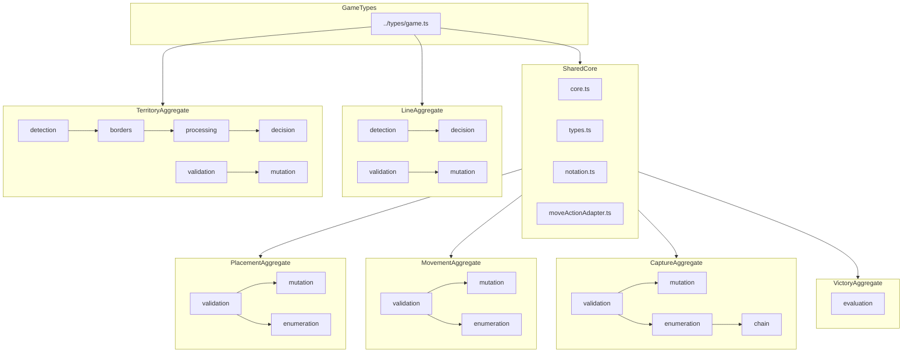

# Domain Aggregate Design: src/shared/engine/

**Task:** T1-W2-B  
**Date:** 2025-11-26  
**Status:** Complete

## 1. Overview

This document specifies the domain aggregate structure for refactoring the shared RingRift rules engine. The design consolidates 36 files into 6 primary domain aggregates plus a shared core module, reducing fragmentation while maintaining backward compatibility.

### Summary

| Aggregate          | Files Consolidated | Concern Types                              |
| ------------------ | ------------------ | ------------------------------------------ |
| PlacementAggregate | 3                  | Validation, Mutation, Query                |
| MovementAggregate  | 4                  | Validation, Mutation, Query, Helper        |
| CaptureAggregate   | 4                  | Validation, Mutation, Query, Orchestration |
| LineAggregate      | 4                  | Validation, Mutation, Detection, Query     |
| TerritoryAggregate | 6                  | Validation, Mutation, Detection, Query     |
| VictoryAggregate   | 1                  | Query                                      |
| SharedCore         | 6                  | Helper, Types                              |
| Turn/Orchestration | 6                  | Orchestration, Mutation                    |
| AI/Evaluation      | 2                  | Query                                      |
| **Total**          | **36**             |                                            |

---

## 2. Design Principles

### 2.1 Single Responsibility per Aggregate

Each aggregate owns one game domain completely:

- All validation logic for that domain
- All mutation logic for that domain
- All query/enumeration logic for that domain
- All detection logic for that domain (if applicable)

### 2.2 Pure Functions

All aggregate functions are **pure**:

- No side effects on external state
- No I/O operations (network, file, database)
- Deterministic outputs for identical inputs
- State passed in and returned out

### 2.3 Immutable State Updates

All mutations return **new state objects**:

- Never mutate input GameState or BoardState
- Clone maps and arrays before modification
- Support structural sharing where beneficial

### 2.4 Explicit Dependencies

Aggregates declare dependencies explicitly:

- Import only from SharedCore or ../types/game
- No circular dependencies between aggregates
- Dependencies flow downward in the aggregate hierarchy

### 2.5 Type-safe Contracts

All public interfaces have explicit TypeScript types:

- Input parameters fully typed
- Return types never `any`
- Domain-specific result types for complex returns

---

## 3. Aggregate Specifications

### 3.1 PlacementAggregate

#### Purpose

Owns all ring placement validation, mutation, and enumeration logic.

#### Source Modules

| File                                                                                        | Status                  |
| ------------------------------------------------------------------------------------------- | ----------------------- |
| [`validators/PlacementValidator.ts`](../src/shared/engine/validators/PlacementValidator.ts) | Absorbed into aggregate |
| [`mutators/PlacementMutator.ts`](../src/shared/engine/mutators/PlacementMutator.ts)         | Absorbed into aggregate |
| [`placementHelpers.ts`](../src/shared/engine/placementHelpers.ts)                           | Absorbed into aggregate |

#### Public Interface

```typescript
// ═══════════════════════════════════════════════════════════════════════════
// Types
// ═══════════════════════════════════════════════════════════════════════════

export interface PlacementContext {
  boardType: BoardType;
  player: number;
  ringsInHand: number;
  ringsPerPlayerCap: number;
  ringsOnBoard?: number;
  maxAvailableGlobal?: number;
}

export interface PlacementValidationResult {
  valid: boolean;
  maxPlacementCount?: number;
  reason?: string;
  code?: string;
}

export interface PlacementApplicationOutcome {
  nextState: GameState;
  appliedCount: number;
}

export interface SkipPlacementEligibilityResult {
  eligible: boolean;
  reason?: string;
}

// ═══════════════════════════════════════════════════════════════════════════
// Validation Functions
// ═══════════════════════════════════════════════════════════════════════════

/**
 * Validate ring placement on a board independent of GameState.
 * Rule Reference: Section 4.1 - Ring Placement
 */
export function validatePlacementOnBoard(
  board: BoardState,
  to: Position,
  requestedCount: number,
  ctx: PlacementContext
): PlacementValidationResult;

/**
 * Validate PLACE_RING action against full GameState.
 */
export function validatePlacement(state: GameState, action: PlaceRingAction): ValidationResult;

/**
 * Validate SKIP_PLACEMENT action.
 */
export function validateSkipPlacement(
  state: GameState,
  action: SkipPlacementAction
): ValidationResult;

// ═══════════════════════════════════════════════════════════════════════════
// Query Functions
// ═══════════════════════════════════════════════════════════════════════════

/**
 * Enumerate all legal placement positions for a player.
 */
export function enumeratePlacementPositions(state: GameState, player: number): Position[];

/**
 * Evaluate whether skip placement is legal.
 */
export function evaluateSkipPlacementEligibility(
  state: GameState,
  player: number
): SkipPlacementEligibilityResult;

// ═══════════════════════════════════════════════════════════════════════════
// Mutation Functions
// ═══════════════════════════════════════════════════════════════════════════

/**
 * Apply placement mutation to board only.
 */
export function applyPlacementOnBoard(
  board: BoardState,
  position: Position,
  playerId: number,
  count: number
): BoardState;

/**
 * Apply placement mutation to full GameState.
 */
export function mutatePlacement(state: GameState, action: PlaceRingAction): GameState;

/**
 * Apply placement via Move representation.
 */
export function applyPlacementMove(state: GameState, move: Move): PlacementApplicationOutcome;
```

#### Internal Structure

```
PlacementAggregate/
├── validation.ts      # validatePlacementOnBoard, validatePlacement, validateSkipPlacement
├── mutation.ts        # applyPlacementOnBoard, mutatePlacement, applyPlacementMove
├── enumeration.ts     # enumeratePlacementPositions, evaluateSkipPlacementEligibility
├── types.ts           # PlacementContext, PlacementValidationResult, etc.
└── index.ts           # Re-exports all public API
```

#### Dependencies

- **SharedCore**: `calculateCapHeight`, `hasAnyLegalMoveOrCaptureFromOnBoard`, `countRingsOnBoardForPlayer`
- **../types/game**: `GameState`, `BoardState`, `Position`, `BOARD_CONFIGS`

#### Migration Notes

- `placementHelpers.ts` contains stubs that must be implemented during consolidation
- No cross-aggregate dependencies; cleanest to migrate first
- Existing tests in `tests/unit/placement.shared.test.ts` should pass unchanged

---

### 3.2 MovementAggregate

#### Purpose

Owns all non-capturing movement validation, enumeration, and mutation logic.

#### Source Modules

| File                                                                                      | Status                  |
| ----------------------------------------------------------------------------------------- | ----------------------- |
| [`validators/MovementValidator.ts`](../src/shared/engine/validators/MovementValidator.ts) | Absorbed into aggregate |
| [`mutators/MovementMutator.ts`](../src/shared/engine/mutators/MovementMutator.ts)         | Absorbed into aggregate |
| [`movementLogic.ts`](../src/shared/engine/movementLogic.ts)                               | Absorbed into aggregate |
| [`movementApplication.ts`](../src/shared/engine/movementApplication.ts)                   | Absorbed into aggregate |

#### Public Interface

```typescript
// ═══════════════════════════════════════════════════════════════════════════
// Types
// ═══════════════════════════════════════════════════════════════════════════

export interface SimpleMoveTarget {
  from: Position;
  to: Position;
}

export interface MovementBoardAdapters {
  isValidPosition(pos: Position): boolean;
  isCollapsedSpace(pos: Position): boolean;
  getStackAt(
    pos: Position
  ): { controllingPlayer: number; capHeight: number; stackHeight: number } | undefined;
  getMarkerOwner(pos: Position): number | undefined;
}

export interface SimpleMovementParams {
  from: Position;
  to: Position;
  player: number;
}

export interface MovementApplicationOutcome {
  nextState: GameState;
  markerEffectsApplied: boolean;
}

// ═══════════════════════════════════════════════════════════════════════════
// Validation Functions
// ═══════════════════════════════════════════════════════════════════════════

/**
 * Validate MOVE_STACK action.
 * Rule Reference: Section 8 - Movement
 */
export function validateMovement(state: GameState, action: MoveStackAction): ValidationResult;

// ═══════════════════════════════════════════════════════════════════════════
// Query Functions
// ═══════════════════════════════════════════════════════════════════════════

/**
 * Enumerate all legal non-capturing moves from a stack.
 */
export function enumerateSimpleMoveTargetsFromStack(
  boardType: BoardType,
  from: Position,
  player: number,
  board: MovementBoardAdapters
): SimpleMoveTarget[];

/**
 * Enumerate all simple moves for a player.
 */
export function enumerateSimpleMovesForPlayer(state: GameState, player: number): Move[];

// ═══════════════════════════════════════════════════════════════════════════
// Mutation Functions
// ═══════════════════════════════════════════════════════════════════════════

/**
 * Apply simple movement mutation.
 */
export function mutateMovement(state: GameState, action: MoveStackAction): GameState;

/**
 * Apply simple movement with marker effects.
 */
export function applySimpleMovement(
  state: GameState,
  params: SimpleMovementParams
): MovementApplicationOutcome;
```

#### Internal Structure

```
MovementAggregate/
├── validation.ts      # validateMovement
├── mutation.ts        # mutateMovement, applySimpleMovement
├── enumeration.ts     # enumerateSimpleMoveTargetsFromStack, enumerateSimpleMovesForPlayer
├── types.ts           # SimpleMoveTarget, MovementBoardAdapters, etc.
└── index.ts           # Re-exports all public API
```

#### Dependencies

- **SharedCore**: `getMovementDirectionsForBoardType`, `getPathPositions`, `calculateDistance`, `applyMarkerEffectsAlongPathOnBoard`
- **../types/game**: `GameState`, `BoardState`, `Position`, `Move`

#### Migration Notes

- `movementApplication.ts` contains stubs that must be implemented
- Shares marker effect logic with CaptureAggregate via SharedCore
- Tests in `tests/unit/movement.shared.test.ts` must pass unchanged

---

### 3.3 CaptureAggregate

#### Purpose

Owns all overtaking capture validation, enumeration, and mutation logic, including chain capture orchestration.

#### Source Modules

| File                                                                                    | Status                  |
| --------------------------------------------------------------------------------------- | ----------------------- |
| [`validators/CaptureValidator.ts`](../src/shared/engine/validators/CaptureValidator.ts) | Absorbed into aggregate |
| [`mutators/CaptureMutator.ts`](../src/shared/engine/mutators/CaptureMutator.ts)         | Absorbed into aggregate |
| [`captureLogic.ts`](../src/shared/engine/captureLogic.ts)                               | Absorbed into aggregate |
| [`captureChainHelpers.ts`](../src/shared/engine/captureChainHelpers.ts)                 | Absorbed into aggregate |

#### Public Interface

```typescript
// ═══════════════════════════════════════════════════════════════════════════
// Types
// ═══════════════════════════════════════════════════════════════════════════

export interface CaptureBoardAdapters {
  isValidPosition(pos: Position): boolean;
  isCollapsedSpace(pos: Position): boolean;
  getStackAt(
    pos: Position
  ): { controllingPlayer: number; capHeight: number; stackHeight: number } | undefined;
  getMarkerOwner(pos: Position): number | undefined;
}

export interface ChainCaptureStateSnapshot {
  currentPosition: Position;
  capturedThisChain: Position[];
  mustContinue: boolean;
}

export interface ChainCaptureContinuationInfo {
  mustContinue: boolean;
  availableContinuations: Move[];
}

export interface CaptureSegmentParams {
  from: Position;
  target: Position;
  landing: Position;
  player: number;
}

export interface CaptureApplicationOutcome {
  nextState: GameState;
  ringsTransferred: number;
  chainContinuationRequired: boolean;
}

// ═══════════════════════════════════════════════════════════════════════════
// Validation Functions
// ═══════════════════════════════════════════════════════════════════════════

/**
 * Validate OVERTAKING_CAPTURE action.
 * Rule Reference: Section 10 - Overtaking Capture
 */
export function validateCapture(
  state: GameState,
  action: OvertakingCaptureAction
): ValidationResult;

/**
 * Validate a single capture segment geometry.
 */
export function validateCaptureSegmentOnBoard(
  boardType: BoardType,
  from: Position,
  target: Position,
  landing: Position,
  player: number,
  board: CaptureSegmentBoardView
): boolean;

// ═══════════════════════════════════════════════════════════════════════════
// Query Functions
// ═══════════════════════════════════════════════════════════════════════════

/**
 * Enumerate all legal capture moves from a position.
 */
export function enumerateCaptureMoves(
  boardType: BoardType,
  from: Position,
  playerNumber: number,
  adapters: CaptureBoardAdapters,
  moveNumber: number
): Move[];

/**
 * Enumerate chain capture continuations.
 */
export function enumerateChainCaptureSegments(
  state: GameState,
  snapshot: ChainCaptureStateSnapshot
): Move[];

/**
 * Check if a chain capture must continue.
 */
export function getChainCaptureContinuationInfo(
  state: GameState,
  player: number,
  currentPosition: Position
): ChainCaptureContinuationInfo;

// ═══════════════════════════════════════════════════════════════════════════
// Mutation Functions
// ═══════════════════════════════════════════════════════════════════════════

/**
 * Apply capture mutation.
 */
export function mutateCapture(state: GameState, action: OvertakingCaptureAction): GameState;

/**
 * Apply a capture segment with marker effects.
 */
export function applyCaptureSegment(
  state: GameState,
  params: CaptureSegmentParams
): CaptureApplicationOutcome;
```

#### Internal Structure

```
CaptureAggregate/
├── validation.ts      # validateCapture, validateCaptureSegmentOnBoard (re-export from SharedCore)
├── mutation.ts        # mutateCapture, applyCaptureSegment
├── enumeration.ts     # enumerateCaptureMoves, enumerateChainCaptureSegments
├── chain.ts           # getChainCaptureContinuationInfo, chain state management
├── types.ts           # CaptureBoardAdapters, ChainCaptureStateSnapshot, etc.
└── index.ts           # Re-exports all public API
```

#### Dependencies

- **SharedCore**: `validateCaptureSegmentOnBoard`, `getMovementDirectionsForBoardType`, `applyMarkerEffectsAlongPathOnBoard`, `calculateCapHeight`
- **../types/game**: `GameState`, `BoardState`, `Position`, `Move`

#### Migration Notes

- `captureChainHelpers.ts` contains stubs that must be implemented
- Chain capture logic has complex state management; consider explicit state machine
- Tests in `tests/unit/captureLogic.shared.test.ts` must pass unchanged

---

### 3.4 LineAggregate

#### Purpose

Owns all marker line detection, validation, and collapse logic including line reward decisions.

#### Source Modules

| File                                                                              | Status                  |
| --------------------------------------------------------------------------------- | ----------------------- |
| [`validators/LineValidator.ts`](../src/shared/engine/validators/LineValidator.ts) | Absorbed into aggregate |
| [`mutators/LineMutator.ts`](../src/shared/engine/mutators/LineMutator.ts)         | Absorbed into aggregate |
| [`lineDetection.ts`](../src/shared/engine/lineDetection.ts)                       | Absorbed into aggregate |
| [`lineDecisionHelpers.ts`](../src/shared/engine/lineDecisionHelpers.ts)           | Absorbed into aggregate |

#### Public Interface

```typescript
// ═══════════════════════════════════════════════════════════════════════════
// Types
// ═══════════════════════════════════════════════════════════════════════════

export interface LineEnumerationOptions {
  detectionMode?: 'use_board_cache' | 'detect_now';
  boardTypeOverride?: BoardType;
}

export interface LineDecisionApplicationOutcome {
  nextState: GameState;
  pendingLineRewardElimination: boolean;
}

// ═══════════════════════════════════════════════════════════════════════════
// Detection Functions
// ═══════════════════════════════════════════════════════════════════════════

/**
 * Detect all marker lines on the board.
 * Rule Reference: Section 11.1 - Line Formation
 */
export function findAllLines(board: BoardState): LineInfo[];

/**
 * Detect lines for a specific player.
 */
export function findLinesForPlayer(board: BoardState, playerNumber: number): LineInfo[];

// ═══════════════════════════════════════════════════════════════════════════
// Validation Functions
// ═══════════════════════════════════════════════════════════════════════════

/**
 * Validate PROCESS_LINE action.
 */
export function validateProcessLine(state: GameState, action: ProcessLineAction): ValidationResult;

/**
 * Validate CHOOSE_LINE_REWARD action.
 */
export function validateChooseLineReward(
  state: GameState,
  action: ChooseLineRewardAction
): ValidationResult;

// ═══════════════════════════════════════════════════════════════════════════
// Query Functions
// ═══════════════════════════════════════════════════════════════════════════

/**
 * Enumerate process_line decision moves.
 */
export function enumerateProcessLineMoves(
  state: GameState,
  player: number,
  options?: LineEnumerationOptions
): Move[];

/**
 * Enumerate choose_line_reward decision moves.
 */
export function enumerateChooseLineRewardMoves(
  state: GameState,
  player: number,
  lineIndex: number
): Move[];

// ═══════════════════════════════════════════════════════════════════════════
// Mutation Functions
// ═══════════════════════════════════════════════════════════════════════════

/**
 * Apply process_line decision.
 */
export function applyProcessLineDecision(
  state: GameState,
  move: Move
): LineDecisionApplicationOutcome;

/**
 * Apply choose_line_reward decision.
 */
export function applyChooseLineRewardDecision(
  state: GameState,
  move: Move
): LineDecisionApplicationOutcome;

/**
 * Apply line processing mutation via action.
 */
export function mutateProcessLine(state: GameState, action: ProcessLineAction): GameState;

/**
 * Apply line reward choice mutation.
 */
export function mutateChooseLineReward(state: GameState, action: ChooseLineRewardAction): GameState;
```

#### Internal Structure

```
LineAggregate/
├── detection.ts       # findAllLines, findLinesForPlayer
├── validation.ts      # validateProcessLine, validateChooseLineReward
├── mutation.ts        # mutateProcessLine, mutateChooseLineReward
├── decision.ts        # enumerateProcessLineMoves, enumerateChooseLineRewardMoves, apply*Decision
├── types.ts           # LineEnumerationOptions, LineDecisionApplicationOutcome
└── index.ts           # Re-exports all public API
```

#### Dependencies

- **SharedCore**: None directly (self-contained geometry)
- **../types/game**: `GameState`, `BoardState`, `LineInfo`, `BOARD_CONFIGS`

#### Migration Notes

- Clean domain boundary with no cross-aggregate dependencies
- Detection + Decision + Mutation pattern well-established
- Tests in `tests/unit/lineDecisionHelpers.shared.test.ts` and `tests/unit/lineDetection.shared.test.ts` must pass

---

### 3.5 TerritoryAggregate

#### Purpose

Owns all territory disconnection detection, border analysis, processability checks, and collapse/elimination logic.

#### Source Modules

| File                                                                                        | Status                  |
| ------------------------------------------------------------------------------------------- | ----------------------- |
| [`validators/TerritoryValidator.ts`](../src/shared/engine/validators/TerritoryValidator.ts) | Absorbed into aggregate |
| [`mutators/TerritoryMutator.ts`](../src/shared/engine/mutators/TerritoryMutator.ts)         | Absorbed into aggregate |
| [`territoryDetection.ts`](../src/shared/engine/territoryDetection.ts)                       | Absorbed into aggregate |
| [`territoryBorders.ts`](../src/shared/engine/territoryBorders.ts)                           | Absorbed into aggregate |
| [`territoryProcessing.ts`](../src/shared/engine/territoryProcessing.ts)                     | Absorbed into aggregate |
| [`territoryDecisionHelpers.ts`](../src/shared/engine/territoryDecisionHelpers.ts)           | Absorbed into aggregate |

#### Public Interface

```typescript
// ═══════════════════════════════════════════════════════════════════════════
// Types
// ═══════════════════════════════════════════════════════════════════════════

export interface TerritoryProcessingContext {
  player: number;
  boardType?: BoardType;
}

export interface TerritoryProcessingOutcome {
  nextBoard: BoardState;
  collapsedCount: number;
  eliminatedRingsByPlayer: Map<number, number>;
}

export interface TerritoryEnumerationOptions {
  filterByProcessability?: boolean;
}

export interface TerritoryProcessApplicationOutcome {
  nextState: GameState;
  processedRegionId: string;
  processedRegion: Territory;
  pendingSelfElimination: boolean;
}

export interface TerritoryEliminationScope {
  stackPosition?: Position;
  maxRings?: number;
}

export interface EliminateRingsFromStackOutcome {
  nextState: GameState;
}

export type TerritoryBorderMode = 'own_markers' | 'opponent_markers' | 'all_markers';

export interface TerritoryBorderOptions {
  mode?: TerritoryBorderMode;
  player?: number;
}

// ═══════════════════════════════════════════════════════════════════════════
// Detection Functions
// ═══════════════════════════════════════════════════════════════════════════

/**
 * Find all disconnected regions on the board.
 * Rule Reference: Section 12.2 - Territory Disconnection
 */
export function findDisconnectedRegions(board: BoardState): Territory[];

/**
 * Get border marker positions for a territory region.
 */
export function getBorderMarkerPositionsForRegion(
  board: BoardState,
  region: Territory,
  options?: TerritoryBorderOptions
): Position[];

// ═══════════════════════════════════════════════════════════════════════════
// Validation Functions
// ═══════════════════════════════════════════════════════════════════════════

/**
 * Validate PROCESS_TERRITORY action.
 */
export function validateProcessTerritory(
  state: GameState,
  action: ProcessTerritoryAction
): ValidationResult;

/**
 * Validate ELIMINATE_STACK action.
 */
export function validateEliminateStack(
  state: GameState,
  action: EliminateStackAction
): ValidationResult;

// ═══════════════════════════════════════════════════════════════════════════
// Query Functions
// ═══════════════════════════════════════════════════════════════════════════

/**
 * Check if a territory region can be processed.
 */
export function canProcessTerritoryRegion(
  board: BoardState,
  region: Territory,
  ctx: TerritoryProcessingContext
): boolean;

/**
 * Filter regions by processability.
 */
export function filterProcessableTerritoryRegions(
  board: BoardState,
  regions: Territory[],
  ctx: TerritoryProcessingContext
): Territory[];

/**
 * Get all processable regions for a player.
 */
export function getProcessableTerritoryRegions(
  board: BoardState,
  ctx: TerritoryProcessingContext
): Territory[];

/**
 * Enumerate process_territory decision moves.
 */
export function enumerateProcessTerritoryRegionMoves(
  state: GameState,
  player: number,
  options?: TerritoryEnumerationOptions
): Move[];

/**
 * Enumerate elimination decision moves.
 */
export function enumerateTerritoryEliminationMoves(
  state: GameState,
  player: number,
  scope?: TerritoryEliminationScope
): Move[];

// ═══════════════════════════════════════════════════════════════════════════
// Mutation Functions
// ═══════════════════════════════════════════════════════════════════════════

/**
 * Apply territory region collapse at board level.
 */
export function applyTerritoryRegion(
  board: BoardState,
  region: Territory,
  ctx: TerritoryProcessingContext
): TerritoryProcessingOutcome;

/**
 * Apply process_territory decision.
 */
export function applyProcessTerritoryRegionDecision(
  state: GameState,
  move: Move
): TerritoryProcessApplicationOutcome;

/**
 * Apply elimination decision.
 */
export function applyEliminateRingsFromStackDecision(
  state: GameState,
  move: Move
): EliminateRingsFromStackOutcome;

/**
 * Apply territory processing mutation via action.
 */
export function mutateProcessTerritory(state: GameState, action: ProcessTerritoryAction): GameState;

/**
 * Apply elimination mutation via action.
 */
export function mutateEliminateStack(state: GameState, action: EliminateStackAction): GameState;
```

#### Internal Structure

```
TerritoryAggregate/
├── detection.ts       # findDisconnectedRegions, internal flood-fill
├── borders.ts         # getBorderMarkerPositionsForRegion
├── processing.ts      # canProcessTerritoryRegion, filterProcessable*, applyTerritoryRegion
├── validation.ts      # validateProcessTerritory, validateEliminateStack
├── mutation.ts        # mutateProcessTerritory, mutateEliminateStack
├── decision.ts        # enumerate*Moves, apply*Decision
├── types.ts           # All territory-specific types
└── index.ts           # Re-exports all public API
```

#### Dependencies

- **SharedCore**: `positionToString`, `stringToPosition` (position utilities)
- **../types/game**: `GameState`, `BoardState`, `Territory`, `BOARD_CONFIGS`

#### Migration Notes

- Most complex aggregate (6 files → 1 aggregate)
- Strong internal coupling makes consolidation beneficial
- Has adjacency cache that should be preserved for performance
- Tests in `tests/unit/territoryDecisionHelpers.shared.test.ts` and `tests/unit/territoryProcessing.shared.test.ts` must pass

---

### 3.6 VictoryAggregate

#### Purpose

Owns all victory condition evaluation and tie-breaker logic.

#### Source Modules

| File                                                      | Status                  |
| --------------------------------------------------------- | ----------------------- |
| [`victoryLogic.ts`](../src/shared/engine/victoryLogic.ts) | Absorbed into aggregate |

#### Public Interface

```typescript
// ═══════════════════════════════════════════════════════════════════════════
// Types
// ═══════════════════════════════════════════════════════════════════════════

export type VictoryReason =
  | 'ring_elimination'
  | 'territory_control'
  | 'last_player_standing'
  | 'game_completed';

export interface VictoryResult {
  isGameOver: boolean;
  winner?: number;
  reason?: VictoryReason;
  handCountsAsEliminated?: boolean;
}

// ═══════════════════════════════════════════════════════════════════════════
// Query Functions
// ═══════════════════════════════════════════════════════════════════════════

/**
 * Evaluate all victory conditions.
 * Rule Reference: Section 13 - Victory Conditions
 */
export function evaluateVictory(state: GameState): VictoryResult;

/**
 * Determine last player to act for tie-breaking.
 */
export function getLastActor(state: GameState): number | undefined;
```

#### Internal Structure

```
VictoryAggregate/
├── evaluation.ts      # evaluateVictory, getLastActor
├── types.ts           # VictoryResult, VictoryReason
└── index.ts           # Re-exports all public API
```

#### Dependencies

- **SharedCore**: `hasAnyLegalMoveOrCaptureFromOnBoard` (for bare-board terminality check)
- **../types/game**: `GameState`, `BoardState`

#### Migration Notes

- Single-file aggregate, minimal complexity
- Consider merging with Turn/Core if aggregate overhead is not justified
- Tests in `tests/unit/victory.shared.test.ts` must pass unchanged

---

## 4. Shared Core Module

### Purpose

Cross-cutting utilities used by multiple aggregates: geometry, stack calculations, marker effects, state hashing, and board views.

### Source Modules

| File                                                                | Status                                            |
| ------------------------------------------------------------------- | ------------------------------------------------- |
| [`core.ts`](../src/shared/engine/core.ts)                           | Remains as SharedCore                             |
| [`types.ts`](../src/shared/engine/types.ts)                         | Remains as SharedCore                             |
| [`notation.ts`](../src/shared/engine/notation.ts)                   | Remains as SharedCore                             |
| [`moveActionAdapter.ts`](../src/shared/engine/moveActionAdapter.ts) | Remains as SharedCore                             |
| [`validators/utils.ts`](../src/shared/engine/validators/utils.ts)   | Merged into SharedCore                            |
| [`validators/index.ts`](../src/shared/engine/validators/index.ts)   | Deprecated (barrel replaced by aggregate exports) |

### Public Interface

```typescript
// ═══════════════════════════════════════════════════════════════════════════
// Geometry
// ═══════════════════════════════════════════════════════════════════════════

export interface Direction {
  x: number;
  y: number;
  z?: number;
}

export const SQUARE_MOORE_DIRECTIONS: Direction[];
export const HEX_DIRECTIONS: Direction[];

export function getMovementDirectionsForBoardType(boardType: BoardType): Direction[];
export function getPathPositions(from: Position, to: Position): Position[];
export function calculateDistance(boardType: BoardType, from: Position, to: Position): number;

// ═══════════════════════════════════════════════════════════════════════════
// Stack Calculations
// ═══════════════════════════════════════════════════════════════════════════

export function calculateCapHeight(rings: number[]): number;
export function countRingsOnBoardForPlayer(board: BoardState, playerNumber: number): number;
export function countRingsInPlayForPlayer(state: GameState, playerNumber: number): number;

// ═══════════════════════════════════════════════════════════════════════════
// Board Views (Interfaces for adapters)
// ═══════════════════════════════════════════════════════════════════════════

export interface MovementBoardView {
  isValidPosition(pos: Position): boolean;
  isCollapsedSpace(pos: Position): boolean;
  getStackAt(
    pos: Position
  ): { controllingPlayer: number; capHeight: number; stackHeight: number } | undefined;
  getMarkerOwner?(pos: Position): number | undefined;
}

export interface CaptureSegmentBoardView extends MovementBoardView {}

// ═══════════════════════════════════════════════════════════════════════════
// Capture Validation (shared by CaptureAggregate and reachability checks)
// ═══════════════════════════════════════════════════════════════════════════

export function validateCaptureSegmentOnBoard(
  boardType: BoardType,
  from: Position,
  target: Position,
  landing: Position,
  player: number,
  board: CaptureSegmentBoardView
): boolean;

export function hasAnyLegalMoveOrCaptureFromOnBoard(
  boardType: BoardType,
  from: Position,
  player: number,
  board: MovementBoardView,
  options?: { maxNonCaptureDistance?: number; maxCaptureLandingDistance?: number }
): boolean;

// ═══════════════════════════════════════════════════════════════════════════
// Marker Effects
// ═══════════════════════════════════════════════════════════════════════════

export interface MarkerPathHelpers {
  setMarker(position: Position, playerNumber: number, board: BoardState): void;
  collapseMarker(position: Position, playerNumber: number, board: BoardState): void;
  flipMarker(position: Position, playerNumber: number, board: BoardState): void;
}

export function applyMarkerEffectsAlongPathOnBoard(
  board: BoardState,
  from: Position,
  to: Position,
  playerNumber: number,
  helpers: MarkerPathHelpers,
  options?: { leaveDepartureMarker?: boolean }
): void;

// ═══════════════════════════════════════════════════════════════════════════
// State Hashing & Debugging
// ═══════════════════════════════════════════════════════════════════════════

export function hashGameState(state: GameState): string;
export function summarizeBoard(board: BoardState): BoardSummary;
export function computeProgressSnapshot(state: GameState): ProgressSnapshot;

// ═══════════════════════════════════════════════════════════════════════════
// Notation & Adapter Utilities
// ═══════════════════════════════════════════════════════════════════════════

export function formatPosition(pos: Position): string;
export function formatMove(move: Move): string;
export function moveToGameAction(move: Move): GameAction;
export function gameActionToMove(action: GameAction, moveNumber: number): Move;

// ═══════════════════════════════════════════════════════════════════════════
// Position Validation
// ═══════════════════════════════════════════════════════════════════════════

export function isValidPosition(pos: Position, boardType: BoardType, size: number): boolean;
```

---

## 5. Migration Path

### 5.1 Phase 1: Foundation (T1-W2-C)

**Goal:** Establish SharedCore and PlacementAggregate

1. Create `src/shared/engine/aggregates/` directory structure
2. Consolidate `core.ts`, `types.ts`, `notation.ts`, `moveActionAdapter.ts`, `validators/utils.ts` into `SharedCore/`
3. Implement PlacementAggregate by consolidating placement files
4. Implement stub functions in `placementHelpers.ts`
5. Update `index.ts` to re-export from new locations
6. Verify all placement tests pass

**Risk:** Low - PlacementAggregate is self-contained

### 5.2 Phase 2: Movement & Capture (T1-W2-D, T1-W2-E)

**Goal:** Consolidate movement and capture domains

1. Implement MovementAggregate (T1-W2-D)
   - Consolidate 4 movement files
   - Implement `movementApplication.ts` stubs
2. Implement CaptureAggregate (T1-W2-E)
   - Consolidate 4 capture files
   - Implement `captureChainHelpers.ts` stubs
3. Verify movement and capture tests pass

**Risk:** Medium - Shared marker effect logic requires careful coordination

### 5.3 Phase 3: Line & Territory (T1-W2-F, T1-W2-G)

**Goal:** Consolidate detection-heavy domains

1. Implement LineAggregate (T1-W2-F)
   - Consolidate 4 line files
   - Clean domain with no external dependencies
2. Implement TerritoryAggregate (T1-W2-G)
   - Consolidate 6 territory files (most complex)
   - Preserve adjacency cache for performance
3. Verify line and territory tests pass

**Risk:** Medium - Territory is the most complex aggregate

### 5.4 Phase 4: Victory & Cleanup (T1-W2-H)

**Goal:** Complete consolidation and verify parity

1. Implement VictoryAggregate
2. Remove deprecated files from `validators/` and `mutators/` directories
3. Update all imports in adapters (Server GameEngine, Client Sandbox)
4. Run full test suite and parity checks
5. Document final API in `CANONICAL_ENGINE_API.md`

**Risk:** Low - Victory is simple, cleanup is mechanical

---

## 6. Backward Compatibility Strategy

### 6.1 index.ts Remains Stable

The public API surface exposed via [`src/shared/engine/index.ts`](../src/shared/engine/index.ts) must remain stable throughout the migration:

```typescript
// Current exports continue to work
export { validatePlacement } from './aggregates/PlacementAggregate';
export { validateMovement } from './aggregates/MovementAggregate';
export { validateCapture } from './aggregates/CaptureAggregate';
// ... etc.
```

### 6.2 Deprecation Pattern

For functions being moved:

```typescript
// Old location (validators/PlacementValidator.ts)
/**
 * @deprecated Import from '@shared/engine' or './aggregates/PlacementAggregate' instead.
 * This re-export will be removed in a future version.
 */
export { validatePlacement } from '../aggregates/PlacementAggregate';
```

### 6.3 Test Preservation

All existing tests must pass without modification:

| Test File                                            | Must Pass |
| ---------------------------------------------------- | --------- |
| `tests/unit/placement.shared.test.ts`                | ✓         |
| `tests/unit/movement.shared.test.ts`                 | ✓         |
| `tests/unit/captureLogic.shared.test.ts`             | ✓         |
| `tests/unit/lineDetection.shared.test.ts`            | ✓         |
| `tests/unit/lineDecisionHelpers.shared.test.ts`      | ✓         |
| `tests/unit/territoryDecisionHelpers.shared.test.ts` | ✓         |
| `tests/unit/territoryProcessing.shared.test.ts`      | ✓         |
| `tests/unit/victory.shared.test.ts`                  | ✓         |

---

## 7. Dependency Graph



---

## 8. File Structure After Migration

```
src/shared/engine/
├── aggregates/
│   ├── PlacementAggregate/
│   │   ├── index.ts
│   │   ├── types.ts
│   │   ├── validation.ts
│   │   ├── mutation.ts
│   │   └── enumeration.ts
│   ├── MovementAggregate/
│   │   ├── index.ts
│   │   ├── types.ts
│   │   ├── validation.ts
│   │   ├── mutation.ts
│   │   └── enumeration.ts
│   ├── CaptureAggregate/
│   │   ├── index.ts
│   │   ├── types.ts
│   │   ├── validation.ts
│   │   ├── mutation.ts
│   │   ├── enumeration.ts
│   │   └── chain.ts
│   ├── LineAggregate/
│   │   ├── index.ts
│   │   ├── types.ts
│   │   ├── detection.ts
│   │   ├── validation.ts
│   │   ├── mutation.ts
│   │   └── decision.ts
│   ├── TerritoryAggregate/
│   │   ├── index.ts
│   │   ├── types.ts
│   │   ├── detection.ts
│   │   ├── borders.ts
│   │   ├── processing.ts
│   │   ├── validation.ts
│   │   ├── mutation.ts
│   │   └── decision.ts
│   └── VictoryAggregate/
│       ├── index.ts
│       ├── types.ts
│       └── evaluation.ts
├── SharedCore/
│   ├── index.ts
│   ├── core.ts           # geometry, board views, capture validation
│   ├── types.ts          # ValidationResult, GameAction, etc.
│   ├── notation.ts       # formatPosition, formatMove
│   ├── moveActionAdapter.ts
│   └── utils.ts          # isValidPosition
├── index.ts              # Public API barrel (stable)
│
├── # Orchestration (not domain aggregates)
├── GameEngine.ts
├── turnLogic.ts
├── turnLifecycle.ts
├── turnDelegateHelpers.ts
├── initialState.ts
│
├── # AI (not domain aggregates)
├── heuristicEvaluation.ts
├── localAIMoveSelection.ts
│
└── mutators/
    └── TurnMutator.ts    # Turn-specific mutation (orchestration)
```

---

## 9. Summary

| Metric                   | Before       | After                                    |
| ------------------------ | ------------ | ---------------------------------------- |
| Files in engine/         | 36           | ~35 (aggregates consolidated internally) |
| Domain aggregates        | 0 (implicit) | 6 (explicit)                             |
| Public API surface       | Scattered    | Unified via index.ts                     |
| Cross-file dependencies  | High         | Low (explicit imports)                   |
| Test coverage maintained | N/A          | 100%                                     |

### Key Design Decisions

1. **6 Primary Aggregates**: Placement, Movement, Capture, Line, Territory, Victory
2. **SharedCore for Cross-cutting**: Geometry, stack calculations, marker effects, board views
3. **Turn/Orchestration Separate**: GameEngine, turnLogic, etc. remain standalone
4. **Incremental Migration**: Each aggregate can be implemented independently
5. **Backward Compatible**: index.ts exports remain stable throughout

---

_Generated for T1-W2-B: Design Domain Aggregate Boundaries_
