# Module Responsibilities: src/shared/engine/

This document catalogs the responsibilities of each module in the canonical shared engine to inform the domain aggregate refactoring planned in T1-W2-B.

> **Updated November 2025:** Added new orchestration and contracts modules from the 4-phase architecture remediation.

## Overview

The `src/shared/engine/` directory contains **44 files** across five locations:

- **24 top-level modules** (`.ts` files)
- **7 validator modules** (`validators/`)
- **6 mutator modules** (`mutators/`)
- **4 orchestration modules** (`orchestration/`) - NEW
- **4 contracts modules** (`contracts/`) - NEW

---

## Module Catalog

### 1. Core Infrastructure

#### [`core.ts`](../src/shared/engine/core.ts)

- **Primary Responsibility**: Shared, browser-safe core helpers for RingRift engine logic
- **Key Functions**:
  - `getMovementDirectionsForBoardType()` - Returns canonical direction vectors
  - `calculateCapHeight()` - Computes cap height for ring stacks
  - `getPathPositions()` - Gets positions along straight-line path
  - `calculateDistance()` - Calculates distance by board type
  - `validateCaptureSegmentOnBoard()` - Validates capture segment legality
  - `hasAnyLegalMoveOrCaptureFromOnBoard()` - Checks movement/capture reachability
  - `computeProgressSnapshot()` - Computes S-invariant for state tracking
  - `summarizeBoard()` / `hashGameState()` - State hashing for parity debugging
  - `applyMarkerEffectsAlongPathOnBoard()` - Applies marker effects along movement path
- **Dependencies**: `../types/game`
- **Dependents**: Almost all other modules
- **Concern Type**: **HELPER** + **VALIDATION** + **QUERY**

#### [`types.ts`](../src/shared/engine/types.ts)

- **Primary Responsibility**: Engine-specific type definitions for actions, validation, and events
- **Key Types**:
  - `GameState` - Engine-level game state interface
  - `GameAction` - Union of all action types (PLACE_RING, MOVE_STACK, etc.)
  - `ValidationResult` - Standard validation response
  - `Validator<T>` / `Mutator<T>` - Generic type signatures
  - `GameEvent` / `GameEventType` - Event system types
- **Dependencies**: `../types/game`
- **Dependents**: All validators, mutators, GameEngine
- **Concern Type**: **HELPER** (type definitions)

#### [`index.ts`](../src/shared/engine/index.ts)

- **Primary Responsibility**: Public API barrel file - stable interface for adapters
- **Key Exports**: Re-exports from all domain modules
- **Dependencies**: All other engine modules
- **Dependents**: External adapters (Server GameEngine, Client Sandbox, Python AI)
- **Concern Type**: **ORCHESTRATION** (API surface)

#### [`initialState.ts`](../src/shared/engine/initialState.ts)

- **Primary Responsibility**: Creates pristine initial GameState for new games
- **Key Functions**:
  - `createInitialGameState()` - Factory for new game state
- **Dependencies**: `../types/game`, `../utils/rng`
- **Dependents**: Game session managers, test fixtures
- **Concern Type**: **MUTATION** (state initialization)

---

### 2. Placement Domain

#### [`placementHelpers.ts`](../src/shared/engine/placementHelpers.ts)

- **Primary Responsibility**: Placement application and skip-placement decision helpers
- **Key Functions**:
  - `applyPlacementMove()` - Apply canonical place_ring move (STUB)
  - `evaluateSkipPlacementEligibility()` - Check if skip is legal (STUB)
- **Key Types**:
  - `PlacementApplicationOutcome`
  - `SkipPlacementEligibilityResult`
- **Dependencies**: `../types/game`
- **Dependents**: Higher-level engines
- **Concern Type**: **MUTATION** + **QUERY** (design-time stubs)

#### [`validators/PlacementValidator.ts`](../src/shared/engine/validators/PlacementValidator.ts)

- **Primary Responsibility**: Validates ring placement legality
- **Key Functions**:
  - `validatePlacementOnBoard()` - Board-level placement validation
  - `validatePlacement()` - GameState-level placement validation
  - `validateSkipPlacement()` - Validates skip_placement action
- **Key Types**:
  - `PlacementContext`
  - `PlacementValidationResult`
- **Dependencies**: `../types`, `../../types/game`, `../core`, `./utils`
- **Dependents**: GameEngine, placement enumeration
- **Concern Type**: **VALIDATION**

#### [`mutators/PlacementMutator.ts`](../src/shared/engine/mutators/PlacementMutator.ts)

- **Primary Responsibility**: Applies placement mutations to game state
- **Key Functions**:
  - `applyPlacementOnBoard()` - Board-level placement mutation
  - `mutatePlacement()` - GameState-level placement mutation
- **Dependencies**: `../types`, `../../types/game`, `../core`
- **Dependents**: GameEngine
- **Concern Type**: **MUTATION**

---

### 3. Movement Domain

#### [`movementLogic.ts`](../src/shared/engine/movementLogic.ts)

- **Primary Responsibility**: Movement enumeration and reachability helpers
- **Key Functions**:
  - `enumerateSimpleMoveTargetsFromStack()` - Enumerate legal non-capturing moves
- **Key Types**:
  - `SimpleMoveTarget`
  - `MovementBoardAdapters`
- **Dependencies**: `../types/game`, `../core`
- **Dependents**: AI, turn logic, sandbox
- **Concern Type**: **QUERY** (move enumeration)

#### [`movementApplication.ts`](../src/shared/engine/movementApplication.ts)

- **Primary Responsibility**: Apply validated movement/capture to game state
- **Key Functions**:
  - `applySimpleMovement()` - Apply non-capturing movement (STUB)
  - `applyCaptureSegment()` - Apply capture segment (STUB)
- **Key Types**:
  - `SimpleMovementParams`
  - `CaptureSegmentParams`
  - `MovementApplicationOutcome`
- **Dependencies**: `../types/game`
- **Dependents**: Higher-level engines
- **Concern Type**: **MUTATION** (design-time stubs)

#### [`validators/MovementValidator.ts`](../src/shared/engine/validators/MovementValidator.ts)

- **Primary Responsibility**: Validates movement legality
- **Key Functions**:
  - `validateMovement()` - Validates MOVE_STACK action
- **Dependencies**: `../types`, `../../types/game`, `../core`, `./utils`
- **Dependents**: GameEngine
- **Concern Type**: **VALIDATION**

#### [`mutators/MovementMutator.ts`](../src/shared/engine/mutators/MovementMutator.ts)

- **Primary Responsibility**: Applies movement mutations to game state
- **Key Functions**:
  - `mutateMovement()` - Apply movement and marker effects
- **Dependencies**: `../types`, `../../types/game`, `../core`
- **Dependents**: GameEngine
- **Concern Type**: **MUTATION**

---

### 4. Capture Domain

#### [`captureLogic.ts`](../src/shared/engine/captureLogic.ts)

- **Primary Responsibility**: Enumerate legal overtaking capture moves
- **Key Functions**:
  - `enumerateCaptureMoves()` - Generate all legal captures from a position
- **Key Types**:
  - `CaptureBoardAdapters`
- **Dependencies**: `../types/game`, `../core`
- **Dependents**: GameEngine, AI, chain capture helpers
- **Concern Type**: **QUERY** (move enumeration)

#### [`captureChainHelpers.ts`](../src/shared/engine/captureChainHelpers.ts)

- **Primary Responsibility**: Capture-chain orchestration primitives
- **Key Functions**:
  - `enumerateChainCaptureSegments()` - Enumerate chain continuations (STUB)
  - `getChainCaptureContinuationInfo()` - Check if chain must continue (STUB)
- **Key Types**:
  - `ChainCaptureStateSnapshot`
  - `ChainCaptureEnumerationOptions`
  - `ChainCaptureContinuationInfo`
- **Dependencies**: `../types/game`
- **Dependents**: Turn logic, sandbox
- **Concern Type**: **QUERY** + **ORCHESTRATION** (design-time stubs)

#### [`validators/CaptureValidator.ts`](../src/shared/engine/validators/CaptureValidator.ts)

- **Primary Responsibility**: Validates capture legality
- **Key Functions**:
  - `validateCapture()` - Validates OVERTAKING_CAPTURE action
- **Dependencies**: `../types`, `../../types/game`, `../core`, `./utils`
- **Dependents**: GameEngine
- **Concern Type**: **VALIDATION**

#### [`mutators/CaptureMutator.ts`](../src/shared/engine/mutators/CaptureMutator.ts)

- **Primary Responsibility**: Applies capture mutations to game state
- **Key Functions**:
  - `mutateCapture()` - Apply capture, marker effects, ring transfers
- **Dependencies**: `../types`, `../../types/game`, `../core`
- **Dependents**: GameEngine
- **Concern Type**: **MUTATION**

---

### 5. Line Domain

#### [`lineDetection.ts`](../src/shared/engine/lineDetection.ts)

- **Primary Responsibility**: Detect marker lines on the board
- **Key Functions**:
  - `findAllLines()` - Detect all lines meeting length threshold
  - `findLinesForPlayer()` - Filter lines by player
- **Dependencies**: `../types/game`
- **Dependents**: GameEngine, line decision helpers
- **Concern Type**: **DETECTION**

#### [`lineDecisionHelpers.ts`](../src/shared/engine/lineDecisionHelpers.ts)

- **Primary Responsibility**: Line processing decision enumeration and application
- **Key Functions**:
  - `enumerateProcessLineMoves()` - Enumerate process_line decisions
  - `enumerateChooseLineRewardMoves()` - Enumerate line reward choices
  - `applyProcessLineDecision()` - Apply line processing
  - `applyChooseLineRewardDecision()` - Apply reward choice
- **Key Types**:
  - `LineEnumerationOptions`
  - `LineDecisionApplicationOutcome`
- **Dependencies**: `../types/game`, `./lineDetection`
- **Dependents**: GameEngine, sandbox
- **Concern Type**: **QUERY** + **MUTATION**

#### [`validators/LineValidator.ts`](../src/shared/engine/validators/LineValidator.ts)

- **Primary Responsibility**: Validates line processing actions
- **Key Functions**:
  - `validateProcessLine()` - Validates PROCESS_LINE action
  - `validateChooseLineReward()` - Validates CHOOSE_LINE_REWARD action
- **Dependencies**: `../types`, `../../types/game`
- **Dependents**: GameEngine
- **Concern Type**: **VALIDATION**

#### [`mutators/LineMutator.ts`](../src/shared/engine/mutators/LineMutator.ts)

- **Primary Responsibility**: Applies line processing mutations
- **Key Functions**:
  - `mutateProcessLine()` - Apply exact-length line collapse
  - `mutateChooseLineReward()` - Apply chosen reward option
- **Dependencies**: `../types`, `../../types/game`
- **Dependents**: GameEngine
- **Concern Type**: **MUTATION**

---

### 6. Territory Domain

#### [`territoryDetection.ts`](../src/shared/engine/territoryDetection.ts)

- **Primary Responsibility**: Detect disconnected territory regions
- **Key Functions**:
  - `findDisconnectedRegions()` - Find all disconnected regions on board
- **Dependencies**: `../types/game`
- **Dependents**: GameEngine, territory processing
- **Concern Type**: **DETECTION**

#### [`territoryBorders.ts`](../src/shared/engine/territoryBorders.ts)

- **Primary Responsibility**: Enumerate territory border markers
- **Key Functions**:
  - `getBorderMarkerPositionsForRegion()` - Find markers bordering a region
- **Key Types**:
  - `TerritoryBorderMode`
  - `TerritoryBorderOptions`
- **Dependencies**: `./types`, `../types/game`, `./core`
- **Dependents**: Territory processing
- **Concern Type**: **QUERY**

#### [`territoryDecisionHelpers.ts`](../src/shared/engine/territoryDecisionHelpers.ts)

- **Primary Responsibility**: Territory processing decision enumeration and application
- **Key Functions**:
  - `enumerateProcessTerritoryRegionMoves()` - Enumerate region choices
  - `enumerateTerritoryEliminationMoves()` - Enumerate self-elimination choices
  - `applyProcessTerritoryRegionDecision()` - Apply region processing
  - `applyEliminateRingsFromStackDecision()` - Apply elimination
- **Key Types**:
  - `TerritoryEnumerationOptions`
  - `TerritoryProcessApplicationOutcome`
  - `TerritoryEliminationScope`
  - `EliminateRingsFromStackOutcome`
- **Dependencies**: `../types/game`, `./core`, `./territoryProcessing`
- **Dependents**: GameEngine, sandbox
- **Concern Type**: **QUERY** + **MUTATION**

#### [`territoryProcessing.ts`](../src/shared/engine/territoryProcessing.ts)

- **Primary Responsibility**: Board-level territory region application
- **Key Functions**:
  - `canProcessTerritoryRegion()` - Check self-elimination prerequisite
  - `filterProcessableTerritoryRegions()` - Filter by prerequisite
  - `getProcessableTerritoryRegions()` - Get all processable regions
  - `applyTerritoryRegion()` - Apply region collapse and eliminations
- **Key Types**:
  - `TerritoryProcessingContext`
  - `TerritoryProcessingOutcome`
- **Dependencies**: `../types/game`, `./territoryDetection`, `./territoryBorders`
- **Dependents**: Territory decision helpers
- **Concern Type**: **QUERY** + **MUTATION**

#### [`validators/TerritoryValidator.ts`](../src/shared/engine/validators/TerritoryValidator.ts)

- **Primary Responsibility**: Validates territory processing actions
- **Key Functions**:
  - `validateProcessTerritory()` - Validates PROCESS_TERRITORY action
  - `validateEliminateStack()` - Validates ELIMINATE_STACK action
- **Dependencies**: `../types`, `../../types/game`
- **Dependents**: GameEngine
- **Concern Type**: **VALIDATION**

#### [`mutators/TerritoryMutator.ts`](../src/shared/engine/mutators/TerritoryMutator.ts)

- **Primary Responsibility**: Applies territory processing mutations
- **Key Functions**:
  - `mutateProcessTerritory()` - Apply region processing
  - `mutateEliminateStack()` - Apply forced/self elimination
- **Dependencies**: `../types`, `../../types/game`, `../core`
- **Dependents**: GameEngine
- **Concern Type**: **MUTATION**

---

### 7. Victory Domain

#### [`victoryLogic.ts`](../src/shared/engine/victoryLogic.ts)

- **Primary Responsibility**: Evaluate victory conditions
- **Key Functions**:
  - `evaluateVictory()` - Check all victory conditions
  - `getLastActor()` - Determine last player to act (tiebreaker)
- **Key Types**:
  - `VictoryResult`
  - `VictoryReason`
- **Dependencies**: `../types/game`, `./core`
- **Dependents**: GameEngine, turn logic
- **Concern Type**: **QUERY**

---

### 8. Turn/Orchestration Domain

#### [`GameEngine.ts`](../src/shared/engine/GameEngine.ts)

- **Primary Responsibility**: Main engine class coordinating validation, mutation, and transitions
- **Key Functions**:
  - `processAction()` - Main entry point for action processing
  - `validateAction()` - Route to appropriate validator
  - `applyMutation()` - Route to appropriate mutator
  - `checkStateTransitions()` - Handle phase/turn transitions
- **Dependencies**: `./types`, `./validators/*`, `./mutators/*`, `./lineDetection`, `./territoryDetection`, `./captureLogic`
- **Dependents**: Server GameEngine adapter, tests
- **Concern Type**: **ORCHESTRATION**

#### [`turnLogic.ts`](../src/shared/engine/turnLogic.ts)

- **Primary Responsibility**: Turn/phase progression state machine
- **Key Functions**:
  - `advanceTurnAndPhase()` - Advance game state through phases
- **Key Types**:
  - `PerTurnState`
  - `TurnLogicDelegates`
  - `TurnAdvanceResult`
- **Dependencies**: `../types/game`
- **Dependents**: turnLifecycle, GameEngine adapters
- **Concern Type**: **ORCHESTRATION**

#### [`turnDelegateHelpers.ts`](../src/shared/engine/turnDelegateHelpers.ts)

- **Primary Responsibility**: Factory for TurnLogicDelegates
- **Key Functions**:
  - `hasAnyPlacementForPlayer()` - Check placement availability (STUB)
  - `hasAnyMovementForPlayer()` - Check movement availability (STUB)
  - `hasAnyCaptureForPlayer()` - Check capture availability (STUB)
  - `createDefaultTurnLogicDelegates()` - Factory function
- **Key Types**:
  - `DefaultTurnDelegatesConfig`
- **Dependencies**: `../types/game`, `./turnLogic`
- **Dependents**: Host engines
- **Concern Type**: **ORCHESTRATION** + **QUERY** (design-time stubs)

#### [`turnLifecycle.ts`](../src/shared/engine/turnLifecycle.ts)

- **Primary Responsibility**: Higher-level turn lifecycle orchestration
- **Key Functions**:
  - `advanceFromMovementBoundary()` - Advance after movement phase
  - `startInteractiveTurnForCurrentPlayer()` - Start interactive turn
- **Key Types**:
  - `TurnLifecycleContext`
  - `TurnLifecycleHooks`
  - `TurnLifecycleDeps`
- **Dependencies**: `../types/game`, `./turnLogic`
- **Dependents**: Host engines
- **Concern Type**: **ORCHESTRATION**

#### [`mutators/TurnMutator.ts`](../src/shared/engine/mutators/TurnMutator.ts)

- **Primary Responsibility**: Turn/phase state mutations
- **Key Functions**:
  - `mutateTurnChange()` - Rotate to next player
  - `mutatePhaseChange()` - Change current phase
- **Dependencies**: `../types`
- **Dependents**: GameEngine
- **Concern Type**: **MUTATION**

---

### 8.5 Orchestration Domain (NEW)

#### [`orchestration/turnOrchestrator.ts`](../src/shared/engine/orchestration/turnOrchestrator.ts)

- **Primary Responsibility**: Single entry point for all turn processing
- **Key Functions**:
  - `processTurn()` - Synchronous turn processing through all phases
  - `processTurnAsync()` - Async version for player interaction
  - `processPhase()` - Process a single phase
- **Key Types**:
  - `TurnResult` - Complete result of turn processing
  - `ProcessTurnOptions` - Configuration options
- **Dependencies**: All domain aggregates, `phaseStateMachine`
- **Dependents**: `TurnEngineAdapter`, `SandboxOrchestratorAdapter`
- **Concern Type**: **ORCHESTRATION**

#### [`orchestration/phaseStateMachine.ts`](../src/shared/engine/orchestration/phaseStateMachine.ts)

- **Primary Responsibility**: Game phase transition logic
- **Key Functions**:
  - `advancePhase()` - Advance to next phase based on context
  - `getNextPhase()` - Determine next phase
  - `isPhaseComplete()` - Check if current phase is finished
- **Key Types**:
  - `PhaseTransition` - Record of phase change
  - `PhaseContext` - Context for phase decisions
- **Dependencies**: `../types/game`
- **Dependents**: `turnOrchestrator`
- **Concern Type**: **ORCHESTRATION**

#### [`orchestration/types.ts`](../src/shared/engine/orchestration/types.ts)

- **Primary Responsibility**: Type definitions for orchestration layer
- **Key Types**:
  - `TurnResult` - Complete turn processing result
  - `PendingDecision` - Player choice required
  - `PhaseTransition` - Phase change record
  - `ProcessTurnOptions` - Turn processing configuration
- **Dependencies**: `../types/game`
- **Dependents**: All orchestration modules, adapters
- **Concern Type**: **HELPER** (type definitions)

#### [`orchestration/index.ts`](../src/shared/engine/orchestration/index.ts)

- **Primary Responsibility**: Public API barrel file for orchestration
- **Concern Type**: **HELPER** (re-exports)

---

### 8.6 Contracts Domain (NEW)

#### [`contracts/schemas.ts`](../src/shared/engine/contracts/schemas.ts)

- **Primary Responsibility**: Contract test vector schema definitions
- **Key Types**:
  - `ContractTestVector` - Complete test vector structure
  - `ContractInput` - Input state and move
  - `ContractOutput` - Expected output state
  - `ContractMetadata` - Vector metadata
- **Dependencies**: `../types/game`
- **Dependents**: `serialization`, `testVectorGenerator`, test runners
- **Concern Type**: **HELPER** (type definitions)

#### [`contracts/serialization.ts`](../src/shared/engine/contracts/serialization.ts)

- **Primary Responsibility**: Deterministic JSON serialization for cross-language parity
- **Key Functions**:
  - `serializeGameState()` - Serialize GameState to deterministic JSON
  - `serializeMove()` - Serialize Move to deterministic JSON
  - `serializeTurnResult()` - Serialize TurnResult to deterministic JSON
  - `deserializeGameState()` - Parse JSON back to GameState
- **Dependencies**: `./schemas`, `../types/game`
- **Dependents**: Test vector generators, contract test runners
- **Concern Type**: **HELPER**

#### [`contracts/testVectorGenerator.ts`](../src/shared/engine/contracts/testVectorGenerator.ts)

- **Primary Responsibility**: Generate contract test vectors from game states
- **Key Functions**:
  - `generateTestVector()` - Create test vector from state + move
  - `generateVectorSet()` - Create category of vectors
- **Dependencies**: `./schemas`, `./serialization`, orchestrator
- **Dependents**: Test fixture generation scripts
- **Concern Type**: **HELPER**

#### [`contracts/index.ts`](../src/shared/engine/contracts/index.ts)

- **Primary Responsibility**: Public API barrel file for contracts
- **Concern Type**: **HELPER** (re-exports)

---

### 9. AI Domain

#### [`heuristicEvaluation.ts`](../src/shared/engine/heuristicEvaluation.ts)

- **Primary Responsibility**: AI heuristic state evaluation
- **Key Functions**:
  - `evaluateHeuristicState()` - Evaluate game state for AI
  - `getHeuristicWeightsTS()` - Resolve weight profile
  - `scoreMove()` - Score a move for ordering (STUB)
- **Key Types**:
  - `HeuristicWeights`
  - `HeuristicPersonaId`
  - `MoveScoringParams`
- **Constants**: Weight profiles (balanced, aggressive, territorial, defensive)
- **Dependencies**: `../types/game`
- **Dependents**: Local AI, sandbox AI
- **Concern Type**: **QUERY**

#### [`localAIMoveSelection.ts`](../src/shared/engine/localAIMoveSelection.ts)

- **Primary Responsibility**: Local/fallback AI move selection policy
- **Key Functions**:
  - `chooseLocalMoveFromCandidates()` - Select move from candidates
- **Key Types**:
  - `LocalAIRng`
- **Dependencies**: `../types/game`
- **Dependents**: Server fallback AI, sandbox AI
- **Concern Type**: **QUERY**

---

### 10. Utility Modules

#### [`notation.ts`](../src/shared/engine/notation.ts)

- **Primary Responsibility**: Move notation formatting for debugging/display
- **Key Functions**:
  - `formatPosition()` - Format position as algebraic notation
  - `formatMove()` - Format move as readable string
  - `formatMoveList()` - Format list of moves
- **Key Types**:
  - `MoveNotationOptions`
- **Dependencies**: `../types/game`
- **Dependents**: Debug tools, tests, logs
- **Concern Type**: **HELPER**

#### [`moveActionAdapter.ts`](../src/shared/engine/moveActionAdapter.ts)

- **Primary Responsibility**: Convert between Move and GameAction representations
- **Key Functions**:
  - `moveToGameAction()` - Move → GameAction
  - `gameActionToMove()` - GameAction → Move
- **Key Types**:
  - `MoveMappingError`
  - `BareMove`
- **Dependencies**: `../types/game`, `./types`
- **Dependents**: GameEngine adapters
- **Concern Type**: **HELPER**

#### [`validators/utils.ts`](../src/shared/engine/validators/utils.ts)

- **Primary Responsibility**: Common validation utilities
- **Key Functions**:
  - `isValidPosition()` - Check if position is within board bounds
- **Dependencies**: `../../types/game`
- **Dependents**: All validators
- **Concern Type**: **HELPER**

#### [`validators/index.ts`](../src/shared/engine/validators/index.ts)

- **Primary Responsibility**: Barrel file for validators
- **Concern Type**: **HELPER** (re-exports)

---

## Concern Type Summary

| Concern Type      | Count | Modules                                                                                                                                                                                                                  |
| ----------------- | ----- | ------------------------------------------------------------------------------------------------------------------------------------------------------------------------------------------------------------------------ |
| **VALIDATION**    | 5     | PlacementValidator, MovementValidator, CaptureValidator, LineValidator, TerritoryValidator                                                                                                                               |
| **DETECTION**     | 2     | lineDetection, territoryDetection                                                                                                                                                                                        |
| **MUTATION**      | 9     | initialState, PlacementMutator, MovementMutator, CaptureMutator, LineMutator, TerritoryMutator, TurnMutator, placementHelpers*, movementApplication*                                                                     |
| **QUERY**         | 8     | movementLogic, captureLogic, victoryLogic, territoryBorders, territoryProcessing*, lineDecisionHelpers*, territoryDecisionHelpers\*, heuristicEvaluation, localAIMoveSelection                                           |
| **ORCHESTRATION** | 7     | GameEngine, index, turnLogic, turnLifecycle, turnDelegateHelpers*, captureChainHelpers*, **turnOrchestrator**, **phaseStateMachine**                                                                                     |
| **HELPER**        | 11    | core, types, notation, moveActionAdapter, validators/utils, **orchestration/types**, **orchestration/index**, **contracts/schemas**, **contracts/serialization**, **contracts/testVectorGenerator**, **contracts/index** |

\*Some modules have multiple concern types or contain design-time stubs
**Bold** = New modules from Phase 1-4 remediation

---

## Dependency Graph (Simplified)

```mermaid
graph TD
    subgraph Core
        core[core.ts]
        types[types.ts]
        game_types[../types/game.ts]
    end

    subgraph Placement
        PlacementValidator
        PlacementMutator
        placementHelpers
    end

    subgraph Movement
        movementLogic
        MovementValidator
        MovementMutator
        movementApplication
    end

    subgraph Capture
        captureLogic
        captureChainHelpers
        CaptureValidator
        CaptureMutator
    end

    subgraph Line
        lineDetection
        lineDecisionHelpers
        LineValidator
        LineMutator
    end

    subgraph Territory
        territoryDetection
        territoryBorders
        territoryProcessing
        territoryDecisionHelpers
        TerritoryValidator
        TerritoryMutator
    end

    subgraph Victory
        victoryLogic
    end

    subgraph Turn_Orchestration
        GameEngine
        turnLogic
        turnLifecycle
        turnDelegateHelpers
        TurnMutator
    end

    subgraph AI
        heuristicEvaluation
        localAIMoveSelection
    end

    subgraph Utilities
        notation
        moveActionAdapter
        initialState
    end

    game_types --> core
    game_types --> types
    core --> PlacementValidator
    core --> MovementValidator
    core --> CaptureValidator
    core --> movementLogic
    core --> captureLogic
    core --> territoryProcessing
    core --> victoryLogic

    types --> GameEngine
    types --> All_Validators[All Validators]
    types --> All_Mutators[All Mutators]

    lineDetection --> lineDecisionHelpers
    lineDetection --> GameEngine

    territoryDetection --> territoryProcessing
    territoryBorders --> territoryProcessing
    territoryProcessing --> territoryDecisionHelpers
    territoryDetection --> GameEngine

    captureLogic --> GameEngine
    captureLogic --> captureChainHelpers

    All_Validators --> GameEngine
    All_Mutators --> GameEngine

    turnLogic --> turnLifecycle
    turnLogic --> turnDelegateHelpers

    GameEngine --> index[index.ts - Public API]
```

---

## Proposed Domain Groupings

Based on the analysis, the modules naturally cluster into these domain aggregates:

### 1. **Placement Aggregate**

Modules: `placementHelpers`, `PlacementValidator`, `PlacementMutator`

- Clean boundaries
- Self-contained with minimal cross-domain dependencies
- **Status**: Ready for consolidation

### 2. **Movement Aggregate**

Modules: `movementLogic`, `movementApplication`, `MovementValidator`, `MovementMutator`

- Mostly self-contained
- Shares marker semantics with Capture
- **Status**: Ready for consolidation (consider shared marker helpers)

### 3. **Capture Aggregate**

Modules: `captureLogic`, `captureChainHelpers`, `CaptureValidator`, `CaptureMutator`

- Chain capture logic creates complexity
- Marker effects overlap with Movement
- **Status**: Ready for consolidation (extract shared marker module)

### 4. **Line Aggregate**

Modules: `lineDetection`, `lineDecisionHelpers`, `LineValidator`, `LineMutator`

- Clean domain boundary
- Detection + Decision + Mutation pattern
- **Status**: Ready for consolidation

### 5. **Territory Aggregate**

Modules: `territoryDetection`, `territoryBorders`, `territoryProcessing`, `territoryDecisionHelpers`, `TerritoryValidator`, `TerritoryMutator`

- Most complex aggregate with 6 modules
- Strong internal coupling
- **Status**: Ready for consolidation into single TerritoryAggregate

### 6. **Victory Aggregate**

Modules: `victoryLogic`

- Single module, minimal complexity
- **Status**: May remain standalone or merge with Turn/Core

### 7. **Turn/Core Aggregate**

Modules: `GameEngine`, `turnLogic`, `turnLifecycle`, `turnDelegateHelpers`, `TurnMutator`, `initialState`

- Game flow orchestration
- Phase state machine
- **Status**: Consider splitting into TurnAggregate + GameEngine wrapper

### 8. **AI/Evaluation Aggregate**

Modules: `heuristicEvaluation`, `localAIMoveSelection`

- Distinct from rules logic
- **Status**: Ready for consolidation

### 9. **Shared Core**

Modules: `core`, `types`, `index`, `notation`, `moveActionAdapter`, `validators/utils`

- Cross-cutting utilities
- **Status**: Remain as shared infrastructure

---

## Recommendations for T1-W2-B

1. **Consolidate Territory Domain First** - Highest file count (6) with strongest internal coupling

2. **Extract Shared Marker Module** - `core.ts` marker helpers used by both Movement and Capture should be formalized

3. **Merge Small Aggregates** - Victory logic can fold into Turn/Core or remain tiny

4. **Stub Implementation** - Several modules contain design-time stubs:
   - `placementHelpers.ts`
   - `movementApplication.ts`
   - `captureChainHelpers.ts`
   - `turnDelegateHelpers.ts`

   These should be implemented before or during consolidation

5. **Maintain Public API Stability** - All consolidation should preserve `index.ts` exports

---

## File Counts by Domain

| Domain        | Files  | Concern Distribution                                      |
| ------------- | ------ | --------------------------------------------------------- |
| Placement     | 3      | 1 Validation, 1 Mutation, 1 Helper                        |
| Movement      | 4      | 1 Validation, 1 Mutation, 1 Query, 1 Helper               |
| Capture       | 4      | 1 Validation, 1 Mutation, 2 Query                         |
| Line          | 4      | 1 Validation, 1 Mutation, 1 Detection, 1 Query+Mutation   |
| Territory     | 6      | 1 Validation, 1 Mutation, 1 Detection, 3 Query+Processing |
| Victory       | 1      | 1 Query                                                   |
| Turn/Core     | 6      | 1 Mutation, 5 Orchestration                               |
| AI            | 2      | 2 Query                                                   |
| Shared        | 6      | 6 Helper                                                  |
| Orchestration | 4      | 2 Orchestration, 2 Helper (NEW)                           |
| Contracts     | 4      | 4 Helper (NEW)                                            |
| **Total**     | **44** |                                                           |

---

## Adapters (External to Shared Engine)

The following adapters wrap the shared engine for specific runtime contexts:

### Backend Adapter

**File:** [`src/server/game/turn/TurnEngineAdapter.ts`](../src/server/game/turn/TurnEngineAdapter.ts)

- **Lines:** 326
- **Purpose:** Wraps canonical orchestrator with WebSocket/session concerns
- **Key Responsibilities:**
  - Player interaction delegation via `PlayerInteractionManager`
  - AI turn integration
  - Timeout handling
  - Feature flag support (`useOrchestratorAdapter`)

### Sandbox Adapter

**File:** [`src/client/sandbox/SandboxOrchestratorAdapter.ts`](../src/client/sandbox/SandboxOrchestratorAdapter.ts)

- **Lines:** 476
- **Purpose:** Wraps canonical orchestrator for browser-local simulation
- **Key Responsibilities:**
  - Same interface as `ClientSandboxEngine`
  - Local AI decision-making
  - Scenario playback support
  - Feature flag support (`useOrchestratorAdapter`)

---

_Generated for T1-W2-A: Document Current Module Responsibilities_
_Updated November 2025: Added orchestration and contracts modules from Phase 1-4 remediation_
