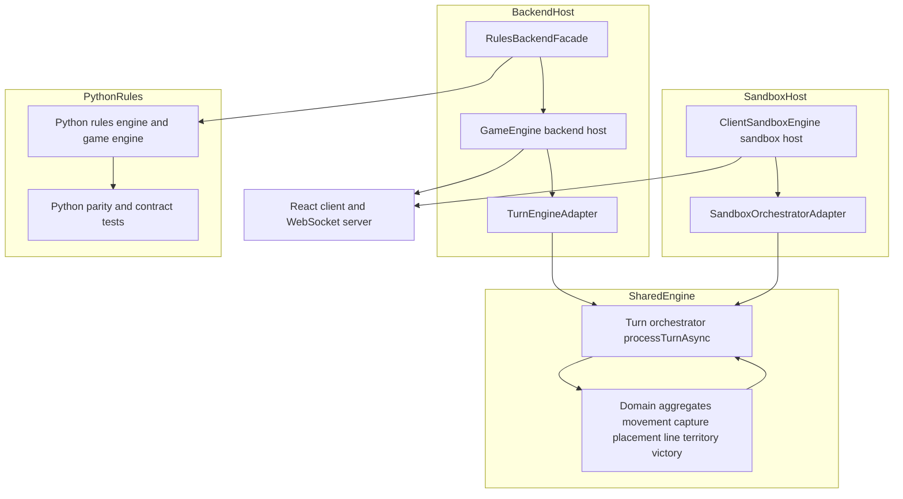

> **Doc Status (2025-11-28): Active (derived)**  
> **Role:** Orchestrator-first rollout and legacy rules shutdown plan for Track A.
>
> **SSoT alignment:** This document is a derived architectural and rollout plan over:
>
> - **Rules/invariants semantics SSoT:** `RULES_CANONICAL_SPEC.md`, `ringrift_complete_rules.md`, `ringrift_compact_rules.md`, and the shared TypeScript rules engine under `src/shared/engine/**` plus v2 contract vectors in `tests/fixtures/contract-vectors/v2/**`.
> - **Lifecycle/API SSoT:** `docs/CANONICAL_ENGINE_API.md` and shared TS/WebSocket types under `src/shared/types/game.ts`, `src/shared/engine/orchestration/types.ts`, `src/shared/types/websocket.ts`, and `src/shared/validation/websocketSchemas.ts`.
> - **TS↔Python parity & determinism SSoT:** `docs/PYTHON_PARITY_REQUIREMENTS.md` and the TS and Python parity/determinism test suites.
>
> **Precedence:** This plan is never the source of truth for rules behaviour or lifecycle semantics. On any conflict with executable code, tests, or canonical rules/lifecycle docs, **code + tests win** and this document must be updated.

# Orchestrator Rollout and Legacy Rules Shutdown Plan

## 1. Purpose and Scope

This document defines the orchestrator-first rollout strategy and legacy rules shutdown blueprint for Track A (tasks P16.6.\*, P16.7, P16.8). It assumes:

- Rules semantics are single-sourced in the shared TS engine under `src/shared/engine/**` (helpers → aggregates → turn orchestrator → contracts) as documented in `docs/SHARED_ENGINE_CONSOLIDATION_PLAN.md` and `docs/RULES_ENGINE_SURFACE_AUDIT.md`.
- The Python rules engine under `ai-service/app/rules/**` is a parity and contract mirror, not an independent SSOT.
- Orchestrator adapters exist for both backend and sandbox hosts and are wired into CI and runbooks as described in `CURRENT_STATE_ASSESSMENT.md`, `WEAKNESS_ASSESSMENT_REPORT.md`, and `docs/runbooks/ORCHESTRATOR_ROLLOUT_RUNBOOK.md`.

The goals of this plan are to:

1. Declare explicit SSOT and ownership boundaries for turn processing.
2. Inventory remaining legacy rules-related modules and paths.
3. Define a small number of concrete shutdown phases.
4. Specify gating tests, metrics, and rollback levers per phase.
5. Provide a concise overview consumable by Track A implementation tasks (P16.6.\*, P16.7, P16.8).

### 1.1 Orchestrator flags and incident posture

At runtime, orchestrator selection and rollout are controlled by a small set of
environment flags:

- `ORCHESTRATOR_ADAPTER_ENABLED` – master switch to enable/disable orchestrator adapters for new sessions.
- `ORCHESTRATOR_ROLLOUT_PERCENTAGE` – percentage of eligible sessions that should use orchestrator; used for gradual rollout where supported.
- `ORCHESTRATOR_SHADOW_MODE_ENABLED` – toggles shadow runs where the orchestrator computes moves in parallel with legacy paths for comparison.
- `RINGRIFT_RULES_MODE` – high‑level rules mode selector (for example `ts`, `shadow`, `legacy`), used by hosts and diagnostics jobs.

**During incidents:**

- Treat these flags as **rules‑engine levers**, not general‑purpose mitigations:
  - If symptoms are clearly AI‑only (remote AI service down/slow/erroring) or infra‑related (timeouts, WebSocket saturation, host overload), leave orchestrator flags in the **orchestrator‑ON** posture and follow the AI and infra runbooks:
    - `docs/runbooks/AI_ERRORS.md`
    - `docs/runbooks/AI_PERFORMANCE.md`
    - `docs/runbooks/AI_FALLBACK.md`
    - `docs/runbooks/AI_SERVICE_DOWN.md`
    - `docs/runbooks/HIGH_LATENCY.md`, `docs/runbooks/SERVICE_DEGRADATION.md`
  - Only adjust `ORCHESTRATOR_ADAPTER_ENABLED` / `ORCHESTRATOR_ROLLOUT_PERCENTAGE` / `RINGRIFT_RULES_MODE` when there is strong evidence of a **rules‑engine or orchestrator defect** (e.g. canonical contract tests failing, `.shared` suites red, or explicit violation of `RULES_CANONICAL_SPEC.md`), and then follow the Safe rollback flow in this document.
- See `AI_ARCHITECTURE.md` §0 (AI Incident Overview) for a quick “rules vs AI vs infra” classification, and use that to choose between **this plan** (rules/orchestrator rollback) and the AI/infra runbooks above.

## 2. Canonical SSOT and Ownership Boundaries

### 2.1 Turn-processing entrypoints

For host-driven turn processing and rules-surface queries, the canonical orchestrator APIs into the shared TS rules engine are:

- `processTurnAsync(state, move, delegates)` in [`turnOrchestrator.ts`](../src/shared/engine/orchestration/turnOrchestrator.ts:1) – **canonical host-facing entrypoint** for applying moves.
- `processTurn(state, move)` in [`turnOrchestrator.ts`](../src/shared/engine/orchestration/turnOrchestrator.ts:1) – synchronous helper used where decisions can be resolved inline.
- `validateMove(state, move)`, `getValidMoves(state)`, and `hasValidMoves(state)` in [`turnOrchestrator.ts`](../src/shared/engine/orchestration/turnOrchestrator.ts:1) – canonical validation and enumeration helpers for hosts and diagnostics harnesses.

All host stacks (backend `GameEngine`, client sandbox `ClientSandboxEngine`, diagnostics harnesses) **must** treat `processTurnAsync` and these helpers as the lifecycle and rules-surface SSOT for turn processing. Legacy turn loops in `GameEngine` and `ClientSandboxEngine` are treated as migration scaffolding to be removed or demoted by this plan.

### 2.2 Domain aggregates as rules semantics SSOT

The following domain aggregates under `src/shared/engine/aggregates/**` are the **single source of truth for rules semantics** in their respective domains:

- [`MovementAggregate`](../src/shared/engine/aggregates/MovementAggregate.ts:1) – non-capturing movement validation, enumeration, and mutation.
- [`CaptureAggregate`](../src/shared/engine/aggregates/CaptureAggregate.ts:1) – capture and chain-capture validation, enumeration, mutation, and continuation logic.
- [`PlacementAggregate`](../src/shared/engine/aggregates/PlacementAggregate.ts:1) – placement and no-dead-placement validation, enumeration, and mutation.
- [`LineAggregate`](../src/shared/engine/aggregates/LineAggregate.ts:1) – line detection and decision moves via `enumerateProcessLineMoves` and `applyProcessLineDecision`.
- [`TerritoryAggregate`](../src/shared/engine/aggregates/TerritoryAggregate.ts:1) – disconnected-region detection, Q23 gating, territory collapse, and elimination decisions.
- [`VictoryAggregate`](../src/shared/engine/aggregates/VictoryAggregate.ts:1) – victory evaluation and tie-breaking, surfaced via `evaluateVictory`.

All hosts and helpers (backend, sandbox, Python mirror, diagnostics scripts) **must** treat these aggregates and their helper modules (`movementLogic.ts`, `captureLogic.ts`, `lineDecisionHelpers.ts`, `territoryDecisionHelpers.ts`, `victoryLogic.ts`, etc.) as the **only authoritative implementation of movement, capture, placement, line, territory, and victory semantics**.

### 2.3 Host adapters and hosts

The orchestrator integration layers are:

- Backend adapter: [`TurnEngineAdapter`](../src/server/game/turn/TurnEngineAdapter.ts:1).
- Sandbox adapter: [`SandboxOrchestratorAdapter`](../src/client/sandbox/SandboxOrchestratorAdapter.ts:1).

These adapters:

- Own all calls from hosts into `processTurnAsync` / `processTurn`.
- Bridge host-specific concerns (state mutability, timers, WebSocket notifications, AI interaction, diagnostics) with the pure shared engine.
- Provide validation/enumeration shims (`validateMove`, `getValidMoves`) that directly delegate to the orchestrator.

**Exclusive integration rule**

For orchestrator-driven turn processing, **all** production and sandbox hosts **must** integrate with the shared rules engine **only via**:

- `TurnEngineAdapter` on the backend.
- `SandboxOrchestratorAdapter` in the sandbox.

Direct calls from hosts into aggregate helpers are allowed for:

- Pure read-side diagnostics and tooling (e.g. board visualisations, offline analysis).
- Test harnesses that deliberately exercise the core engine.

They are **not** allowed as alternative production turn-processing pipelines once this plan is complete.

### 2.4 Host stacks and Python mirror

- Backend host stack:
  - `GameEngine` in [`GameEngine.ts`](../src/server/game/GameEngine.ts:1) – stateful backend host responsible for timers, WebSocket integration, rating updates, and structured history. It currently has:
    - An orchestrator path via `processMoveViaAdapter` + `TurnEngineAdapter`.
    - A legacy path via `makeMove` and internal phase loops that apply moves via shared aggregates and helpers.
  - `RuleEngine` in [`RuleEngine.ts`](../src/server/game/RuleEngine.ts:1) – rules-facing validation and enumeration surface used by `GameEngine` and `TurnEngine`. It delegates to shared helpers and aggregates but still exposes an older `processMove` pipeline.
  - `TurnEngine` in [`turn/TurnEngine.ts`](../src/server/game/turn/TurnEngine.ts:1) – shared backend turn/phase lifecycle for the backend path, already aligned with shared `turnLogic`.

- Sandbox host stack:
  - `ClientSandboxEngine` in [`ClientSandboxEngine.ts`](../src/client/sandbox/ClientSandboxEngine.ts:1) – client-local host for `/sandbox`, with:
    - An orchestrator path via `processMoveViaAdapter` + `SandboxOrchestratorAdapter`.
    - A legacy sandbox pipeline composed out of shared aggregates and sandbox helpers (movement, capture, lines, territory, forced elimination, LPS, and victory).
  - Sandbox helpers under `src/client/sandbox/**` (movement, captures, territory, lines, victory, AI, game-end) – now predominantly UX/diagnostics wrappers over shared aggregates.

- Python rules/AI mirror:
  - `GameEngine` in [`ai-service/app/game_engine.py`](../ai-service/app/game_engine.py:1) and rule modules under `ai-service/app/rules/**` implement a parity-checked Python port of the TS rules engine.
  - Parity and contract tests under `ai-service/tests/**` and `tests/parity/**` validate that Python behaviour matches the TS SSOT.
  - Python code is **not** a semantics SSOT; any divergence must be fixed by updating Python to match the TS shared engine and contracts.

## 3. Architecture Overview

Key properties:

- The **SharedEngine** subgraph (orchestrator + aggregates + helpers) is the **rules semantics SSOT**.
- `TurnEngineAdapter` and `SandboxOrchestratorAdapter` are the **only sanctioned host integration layers** into `processTurnAsync`.
- Backend and sandbox hosts are responsible only for state ownership, player interaction, transport, and diagnostics.
- Python rules/AI remain a validated mirror and do not own semantics.

## 4. Legacy Rules Surfaces Inventory

This section enumerates remaining TS backend and sandbox modules that either:

- Implement or previously implemented movement, capture, placement, line, territory, or victory semantics **outside** the orchestrator+aggregates stack; or
- Provide post-processing over older `RuleEngine` / `GameEngine` / sandbox semantics that are now redundant.

### 4.1 Backend host and rules modules

**Table 1 – Backend rules-related modules and paths**

| File                                                | Current role                                                                                                                                                                                                                                                       | Rules Semantics? (Y/N)                                                                                                  | Remove?                                                                                                                                                                   | Diagnostics-only?                                                              | Target phase                                                                            |
| --------------------------------------------------- | ------------------------------------------------------------------------------------------------------------------------------------------------------------------------------------------------------------------------------------------------------------------ | ----------------------------------------------------------------------------------------------------------------------- | ------------------------------------------------------------------------------------------------------------------------------------------------------------------------- | ------------------------------------------------------------------------------ | --------------------------------------------------------------------------------------- |
| `src/server/game/GameEngine.ts`                     | Stateful backend host; currently has dual path: legacy `makeMove` turn pipeline and orchestrator-based `processMoveViaAdapter` using `TurnEngineAdapter`. Contains chain-capture state, line and territory decision helpers, forced elimination, and LPS tracking. | Y – host-level orchestration semantics layered over aggregates and `TurnEngine`.                                        | Partial – keep GameEngine as backend host but **remove the legacy non-adapter pipeline** and require `TurnEngineAdapter` for all production moves.                        | No – remains primary backend host.                                             | Phase A (enforce adapter) and Phase C (delete dead helpers once adapter-only)           |
| `src/server/game/RuleEngine.ts`                     | Stateless rules facade for validation and enumeration. Delegates to shared aggregates and helpers but still exposes legacy `processMove`, `processLineFormation`, and `processTerritoryDisconnection` flows.                                                       | Y – contains historical orchestration and some pre-aggregate helpers, though main semantics now delegate to aggregates. | Partial – retain validation/enumeration entrypoints, but **delete or quarantine legacy `processMove` and post-processing helpers** once orchestrator-only path is stable. | Yes for legacy helpers – legacy helpers become diagnostics-only until removal. | Phase A (no production calls to `processMove`), Phase C (delete or move to diagnostics) |
| `src/server/game/turn/TurnEngine.ts`                | Shared backend turn lifecycle built on `turnLogic` and shared aggregates. Used by `GameEngine.advanceGame`.                                                                                                                                                        | N – lifecycle orchestration only (semantics live in shared engine).                                                     | No.                                                                                                                                                                       | No.                                                                            | N/A (already canonical host lifecycle)                                                  |
| `src/server/game/BoardManager.ts`                   | Backend board container and geometry bridge. Used by `GameEngine`, `RuleEngine`, and `TurnEngine`.                                                                                                                                                                 | N – uses shared core geometry and does not define independent rules.                                                    | No.                                                                                                                                                                       | No.                                                                            | N/A                                                                                     |
| `src/server/game/rules/lineProcessing.ts`           | Historical backend line-processing module referenced in earlier passes. Marked as removed in [`docs/RULES_ENGINE_SURFACE_AUDIT.md`](./RULES_ENGINE_SURFACE_AUDIT.md:105).                                                                                          | Y (historical)                                                                                                          | Already removed (no current code path).                                                                                                                                   | N/A                                                                            | Historical only                                                                         |
| `src/server/game/rules/territoryProcessing.ts`      | Historical backend territory-processing module. Marked as removed in [`docs/RULES_ENGINE_SURFACE_AUDIT.md`](./RULES_ENGINE_SURFACE_AUDIT.md:106).                                                                                                                  | Y (historical)                                                                                                          | Already removed.                                                                                                                                                          | N/A                                                                            | Historical only                                                                         |
| `src/server/game/rules/captureChainEngine.ts`       | Historical backend capture-chain state helper. Replaced by `CaptureAggregate` and `GameEngine` wiring.                                                                                                                                                             | Y (historical)                                                                                                          | Already removed.                                                                                                                                                          | N/A                                                                            | Historical only                                                                         |
| `src/server/game/RulesBackendFacade.ts`             | Backend rules/AI boundary; selects between TS and Python engines and coordinates shadow parity via `rulesParityMetrics`.                                                                                                                                           | N – engine selection and parity only.                                                                                   | No.                                                                                                                                                                       | No.                                                                            | N/A                                                                                     |
| `src/server/services/OrchestratorRolloutService.ts` | Backend service controlling orchestrator rollout percentage, shadow mode, allow/deny lists, and circuit breaker wiring, surfaced via `/api/admin/orchestrator/status` and Prometheus metrics.                                                                      | N – rollout control only.                                                                                               | No.                                                                                                                                                                       | No.                                                                            | N/A                                                                                     |

**Backend summary**

- The only substantive _legacy semantics_ remaining live in:
  - The non-adapter branch of `GameEngine.makeMove` and associated helpers (`applyMove`, `processLineFormations`, `processOneLine`, `processOneDisconnectedRegion`, legacy forced-elimination and LPS wiring).
  - Legacy orchestration helpers in `RuleEngine` that predate `CaptureAggregate`, `LineAggregate`, and `TerritoryAggregate`.

- All direct geometry and mutator logic now delegates to shared helpers and aggregates as recorded in `docs/SHARED_ENGINE_CONSOLIDATION_PLAN.md` and `docs/RULES_ENGINE_SURFACE_AUDIT.md`.

### 4.2 Sandbox host and helper modules

**Table 2 – Sandbox rules-related modules and paths**

| File                                               | Current role                                                                                                                                                                                                                                               | Rules Semantics? (Y/N)                                                                                       | Remove?                                                                                                                                                         | Diagnostics-only?                                                 | Target phase                                                                                  |
| -------------------------------------------------- | ---------------------------------------------------------------------------------------------------------------------------------------------------------------------------------------------------------------------------------------------------------- | ------------------------------------------------------------------------------------------------------------ | --------------------------------------------------------------------------------------------------------------------------------------------------------------- | ----------------------------------------------------------------- | --------------------------------------------------------------------------------------------- |
| `src/client/sandbox/ClientSandboxEngine.ts`        | Client-local sandbox host. Supports two paths: orchestrator-based via `SandboxOrchestratorAdapter` and legacy sandbox pipeline using shared aggregates plus sandbox helpers for movement, capture, lines, territory, forced elimination, LPS, and victory. | Y – host-level orchestration semantics layered over aggregates.                                              | Partial – retain as sandbox host but **remove or fence legacy pipeline** once orchestrator path is validated; orchestrator becomes the only sandbox rules path. | Legacy pipeline becomes diagnostics-only until removed.           | Phase B (orchestrator-only) and Phase C (remove dead helpers)                                 |
| `src/client/sandbox/SandboxOrchestratorAdapter.ts` | Sandbox adapter over `processTurn` / `processTurnAsync`; exposes `processMove`, `processMoveSync`, `previewMove`, `validateMove`, and `getValidMoves`.                                                                                                     | N – pure adapter over orchestrator.                                                                          | No.                                                                                                                                                             | No.                                                               | N/A (canonical adapter)                                                                       |
| `src/client/sandbox/sandboxMovement.ts`            | Sandbox movement helpers: simple movement landing enumeration and marker-path effects, now delegating to `MovementAggregate` and shared marker helpers. Used by `ClientSandboxEngine` and AI helpers.                                                      | N (semantics delegated to shared engine; acts as adapter and UX helper).                                     | No immediate removal; refactor to explicit UX/diagnostics namespace.                                                                                            | Yes – treated as UX/diagnostics-only helper, not a rules surface. | Phase B (ensure no direct semantics) and Phase C (namespace / banner update)                  |
| `src/client/sandbox/sandboxCaptures.ts`            | Sandbox capture helpers and board-level chain enumeration. Delegates to `CaptureAggregate` and shared helpers, with a retained mutable-board simulator for diagnostics (`applyCaptureSegmentOnBoard`).                                                     | N for live engine semantics (delegates to aggregate); Y for the mutable-board simulator used in diagnostics. | Keep as diagnostics-only; ensure live engine paths use `CaptureAggregate` exclusively.                                                                          | Yes – diagnostics-only (chain search, parity tooling).            | Phase B (engine paths fully adapter-based) and Phase C (diagnostics fencing and SSOT banners) |
| `src/client/sandbox/sandboxCaptureSearch.ts`       | Offline DFS search for maximal capture chains using shared capture enumeration plus sandbox-local mutation for analysis. Not used by live sandbox engine or backend.                                                                                       | Y (analysis semantics only; not a production rules path).                                                    | Keep; move under diagnostics namespace if desired.                                                                                                              | Yes – diagnostics-only.                                           | Phase C                                                                                       |
| `src/client/sandbox/sandboxTerritory.ts`           | Sandbox helpers for disconnected-region discovery and eligibility. Already delegates to shared `territoryDetection`, `territoryProcessing`, and `territoryDecisionHelpers` and is explicitly documented as thin adapter.                                   | N – adapter/visualisation on top of shared semantics.                                                        | Keep; ensure clearly marked as adapter-only.                                                                                                                    | Yes – UX/diagnostics-only.                                        | Phase B and C                                                                                 |
| `src/client/sandbox/sandboxLines.ts`               | Sandbox line-detection helpers; delegates to shared `lineDetection` and is documented as adapter-only.                                                                                                                                                     | N – adapter/visualisation only.                                                                              | Keep; ensure clearly marked as adapter-only.                                                                                                                    | Yes – UX/diagnostics-only.                                        | Phase B and C                                                                                 |
| `src/client/sandbox/sandboxVictory.ts`             | Sandbox wrapper around shared victory evaluation for local games.                                                                                                                                                                                          | N – adapter only.                                                                                            | Keep.                                                                                                                                                           | No.                                                               | N/A                                                                                           |
| `src/client/sandbox/sandboxElimination.ts`         | Sandbox forced-elimination helpers for local games, built on shared helpers.                                                                                                                                                                               | N – host-level orchestration only.                                                                           | Keep; ensure semantics remain aligned with shared aggregates.                                                                                                   | No.                                                               | N/A                                                                                           |
| `src/client/sandbox/sandboxGameEnd.ts`             | Sandbox game-end utilities and stalemate resolution, delegating to shared helpers.                                                                                                                                                                         | N – host-level orchestration only.                                                                           | Keep.                                                                                                                                                           | No.                                                               | N/A                                                                                           |
| `src/client/sandbox/sandboxAI.ts`                  | Local sandbox AI harness for human vs AI sandbox games. Uses shared engine helpers and sandbox movement/capture adapters.                                                                                                                                  | N – AI/UX only.                                                                                              | Keep; may be refactored but not part of rules semantics SSOT.                                                                                                   | No.                                                               | N/A                                                                                           |
| `src/client/sandbox/localSandboxController.ts`     | Minimal, browser-safe local sandbox harness with a very small, experimental rule subset (ring placement + simple movement) independent of `ClientSandboxEngine`.                                                                                           | Y – limited semantics outside orchestrator+aggregates.                                                       | Yes – once `ClientSandboxEngine` orchestrator path is stable and `/sandbox` no longer depends on this harness.                                                  | Yes – treat as legacy/diagnostics-only until removal.             | Phase C                                                                                       |
| `src/client/sandbox/test-sandbox-parity-cli.ts`    | CLI parity harness used for diagnostics, built on `ClientSandboxEngine` and shared engine.                                                                                                                                                                 | N – diagnostics tooling only.                                                                                | Keep; ensure clearly marked as diagnostics-only.                                                                                                                | Yes.                                                              | Phase C                                                                                       |

**Sandbox summary**

- All sandbox helpers that once contained independent rules logic have been refactored to delegate to shared helpers and aggregates.
- Remaining risk lies in the **legacy sandbox orchestration pipeline** in `ClientSandboxEngine` and the implicit assumption that some helpers are still “engine-like” rather than pure UX/diagnostics.
- This plan formalises the orchestrator adapter as the only production rules path for sandbox, demoting the legacy pipeline and analysis helpers to diagnostics-only status.

### 4.3 Diagnostics scripts and tooling

Some scripts under `scripts/` use shared engine helpers to explore or debug rules behaviour (for example, [`scripts/findCyclicCaptures.js`](../scripts/findCyclicCaptures.js:1) and [`scripts/findCyclicCapturesHex.js`](../scripts/findCyclicCapturesHex.js:1)). These scripts:

- Do **not** implement independent semantics.
- Are explicitly documented as analysis tools.
- Should remain available but clearly fenced as diagnostics-only.

They are not considered legacy rules _paths_ for the purposes of rollback; they are covered by **Phase C – Legacy helper shutdown & diagnostics fencing** purely for namespace and SSOT-banner hygiene.

## 5. Shutdown Phases

The remaining orchestrator rollout and legacy shutdown work is organised into four coarse-grained phases that can be implemented in 1–2 passes each by Code, QA, and DevOps agents.

### 5.1 Phase overview table

**Table 3 – Rollout phases**

| Phase                                                      | Description                                                                                                                                                                        | Modules in scope (examples)                                                                                                                                                                                                                                                     | Required tests & metrics (gates)                                                                                                                                                                                                                                                                                                                                      | Rollback levers                                                                                                                                                                                                                                                                               |
| ---------------------------------------------------------- | ---------------------------------------------------------------------------------------------------------------------------------------------------------------------------------- | ------------------------------------------------------------------------------------------------------------------------------------------------------------------------------------------------------------------------------------------------------------------------------- | --------------------------------------------------------------------------------------------------------------------------------------------------------------------------------------------------------------------------------------------------------------------------------------------------------------------------------------------------------------------- | --------------------------------------------------------------------------------------------------------------------------------------------------------------------------------------------------------------------------------------------------------------------------------------------- |
| **Phase A – Backend orchestrator-only path**               | Make `TurnEngineAdapter` + `processTurnAsync` the only production backend turn path. Legacy `GameEngine` and `RuleEngine` pipelines remain only as test harnesses and diagnostics. | `GameEngine.ts` (non-adapter branch of `makeMove` and decision loops), `RuleEngine.ts` legacy `processMove` and post-processing helpers, `TurnEngineAdapter.ts`, `RulesBackendFacade.ts`, `OrchestratorRolloutService.ts`.                                                      | TS: full `test:core`, rules scenario suites (`tests/scenarios/**`), backend parity suites (`tests/unit/Backend_vs_Sandbox.*`), adapter tests. Python: all `ai-service/tests/**` including parity/contract tests. Metrics: orchestrator error rate < 2%, `ringrift_orchestrator_shadow_mismatch_rate` near 0 in shadow runs, `game_move_latency_ms` meeting v1.0 SLOs. | Env flags: `ORCHESTRATOR_ADAPTER_ENABLED=true`, `ORCHESTRATOR_ROLLOUT_PERCENTAGE` kept < 100 until gates met, `ORCHESTRATOR_SHADOW_MODE_ENABLED` toggled for diagnostics, `RINGRIFT_RULES_MODE=ts` vs `shadow` for staging. Git: Phase A implemented in a small number of reversible commits. |
| **Phase B – Sandbox orchestrator-only path**               | Make `SandboxOrchestratorAdapter` + `processTurnAsync` the only sandbox rules path. Legacy sandbox pipeline remains only in trace/parity harnesses.                                | `ClientSandboxEngine.ts` legacy pipeline and post-movement helpers, `SandboxOrchestratorAdapter.ts`, sandbox helpers (`sandboxMovement.ts`, `sandboxCaptures.ts`, `sandboxLines.ts`, `sandboxTerritory.ts`, `sandboxGameEnd.ts`, `sandboxElimination.ts`, `sandboxVictory.ts`). | TS: sandbox unit tests (`tests/unit/ClientSandboxEngine.*.test.ts`), RulesMatrix sandbox scenarios, backend vs sandbox parity tests, orchestrator adapter tests. Metrics: local sandbox parity vs backend on trace seeds, no regressions in `tests/scenarios/RulesMatrix.*`, no change in CLI parity harness behaviour.                                               | Flag: `ClientSandboxEngine.useOrchestratorAdapter` default `true`, with explicit opt-out preserved only for diagnostics. Git: Phase B changes split from Phase A so sandbox-only regressions can be reverted independently.                                                                   |
| **Phase C – Legacy helper shutdown & diagnostics fencing** | Remove truly redundant modules and move any remaining tools into a diagnostics namespace with explicit SSOT banners.                                                               | Backend legacy helpers in `RuleEngine.ts` and `GameEngine.ts` that are no longer referenced; sandbox helpers that are pure analysis (`sandboxCaptureSearch.ts`, mutable-board simulators); diagnostics scripts under `scripts/`.                                                | TS: any tests that directly reference legacy helpers either updated to call shared aggregates or moved under an `archive/` diagnostics suite. Contract and parity tests remain green. No new references to deprecated helpers appear in `eslint-report.json` or `scripts/ssot/rules-ssot-check.ts`.                                                                   | Git: removal commits grouped per host (backend vs sandbox) so reverts are straightforward. No feature flags required; by this point production paths are already orchestrator-only.                                                                                                           |
| **Phase D – Final clean-up and documentation alignment**   | Align documentation and runbooks with orchestrator-only architecture; ensure SSOT checks cover this plan.                                                                          | `docs/CANONICAL_ENGINE_API.md`, `docs/SHARED_ENGINE_CONSOLIDATION_PLAN.md`, `docs/PASS16_ASSESSMENT_REPORT.md`, `docs/INDEX.md`, `docs/runbooks/ORCHESTRATOR_ROLLOUT_RUNBOOK.md`, `docs/RULES_ENGINE_SURFACE_AUDIT.md`.                                                         | Docs: updated SSOT banners and diagrams; cross-links from PASS16 and the docs index to this plan. Scripts: `scripts/ssot/rules-ssot-check.ts` extended to assert that backend and sandbox hosts reference the orchestrator and aggregates as SSOT. All tests and metrics remain green as in previous phases.                                                          | Git: doc-only commits, easily reversible but low risk. No feature flags.                                                                                                                                                                                                                      |

### 5.2 Phase A – Backend orchestrator-only path

**Concrete code-level actions**

- Enforce `TurnEngineAdapter` for all production backend moves:
  - Update `GameEngine.makeMove` to:
    - Consult `OrchestratorRolloutService` and environment flags (`ORCHESTRATOR_ADAPTER_ENABLED`, `ORCHESTRATOR_ROLLOUT_PERCENTAGE`, allow/deny lists).
    - Route all non-test moves through `processMoveViaAdapter`, with legacy path reserved only for test harnesses (guarded by `NODE_ENV === 'test'` or explicit override).

- Quarantine and then deprecate legacy `RuleEngine` pipelines:
  - Identify all remaining call sites of `RuleEngine.processMove`, `processLineFormation`, `processTerritoryDisconnection`, and similar legacy helpers.
  - Replace those call sites with orchestrator adapter calls or direct aggregate usage where appropriate.
  - Mark legacy helpers as deprecated with SSOT banners pointing to shared aggregates and orchestrator, and add TODOs assigning them to **Phase C** removal.

- Tighten backend testing around the adapter:
  - Ensure that existing backend tests for lines, territory, and LPS (`tests/unit/GameEngine.lines.scenarios.test.ts`, `tests/unit/GameEngine.territoryDisconnection.test.ts`, etc.) run with `ORCHESTRATOR_ADAPTER_ENABLED=true` and `RINGRIFT_RULES_MODE=ts`.
  - Add or extend adapter-focused tests if needed to cover:
    - Capture chains including continuation and termination.
    - Line processing including overlength line rewards.
    - Territory disconnection including Q23 self-elimination prerequisite.
    - Last-player-standing (R172) scenarios.

**Gating tests and metrics**

- All TS tests passing:
  - Unit and scenario tests under `tests/unit/**` and `tests/scenarios/**`.
  - Backend vs sandbox parity tests.
  - Contract tests (`tests/contracts/**` and TS-side contract runners).

- All Python tests passing:
  - `ai-service/tests/**`, including parity suites such as `ai-service/tests/parity/test_line_and_territory_scenario_parity.py`.

- Operational gates:
  - No regressions in `game_move_latency_ms` and WebSocket error rates as described in `docs/runbooks/GAME_HEALTH.md`.
  - Orchestrator rollout metrics from `OrchestratorRolloutService`:
    - `ringrift_orchestrator_error_rate < 0.02`.
    - `ringrift_orchestrator_shadow_mismatch_rate < 0.01` for any shadow-mode staging runs.

**Rollback**

- Immediate rollback:
  - Set `ORCHESTRATOR_ADAPTER_ENABLED=false` via environment config to route new sessions back to the legacy backend path.
  - Optionally lower `ORCHESTRATOR_ROLLOUT_PERCENTAGE` to 0 for additional safety.

- Phase rollback:
  - Keep all adapter-enforcement changes in clearly labelled commits (e.g. `P16.6.1 backend orchestrator-first`) so that `git revert` restores the previous behaviour if necessary.

### 5.3 Phase B – Sandbox orchestrator-only path

**Concrete code-level actions**

- Make `SandboxOrchestratorAdapter` the default and only rules path for sandbox:
  - Ensure `ClientSandboxEngine.useOrchestratorAdapter` defaults to `true` across all environments (already true in current code).
  - Tighten sandbox entrypoints so that:
    - Canonical move application (`applyCanonicalMove`, AI turns, parity harnesses) route exclusively through `processMoveViaAdapter`.
    - Legacy sandbox movement/capture/territory pipelines are used only in explicitly marked trace or diagnostics modes.

- Demote sandbox helpers to UX and diagnostics:
  - Review `sandboxMovement.ts`, `sandboxCaptures.ts`, `sandboxCaptureSearch.ts`, `sandboxLines.ts`, `sandboxTerritory.ts`, `sandboxGameEnd.ts`, `sandboxElimination.ts`, and `sandboxVictory.ts`:
    - Confirm all live semantics delegate to shared aggregates and helpers.
    - Add SSOT banners marking these modules as UX/diagnostics-only, deferring to shared TS engine for rules semantics.
    - Ensure no new callers treat these helpers as an alternative engine (SSOT tooling like `rules-ssot-check.ts` can be extended to enforce this).

**Gating tests and metrics**

- All sandbox-focused TS tests passing:
  - `tests/unit/ClientSandboxEngine.*.test.ts` suites (lines, territory, LPS).
  - RulesMatrix sandbox scenarios (territory, chain capture, late-game flows).
  - Backend vs sandbox parity tests and orchestrator adapter tests.

- Operational checks:
  - No regressions in local sandbox behaviour observed via `test-sandbox-parity-cli.ts`.
  - CI jobs that exercise sandbox-only flows (if present) run with `useOrchestratorAdapter=true`.

**Rollback**

- Immediate rollback:
  - Expose a constructor or configuration option to disable orchestrator adapter in `ClientSandboxEngine` for local diagnostics or emergency rollback.
  - For production-style sandbox builds, toggle the same flag via environment variable (mirroring backend `ORCHESTRATOR_ADAPTER_ENABLED`).

- Phase rollback:
  - Keep sandbox orchestrator-enforcement refactors in dedicated commits (e.g. `P16.6.2 sandbox orchestrator-first`) so that `git revert` can restore the previous mixed-path behaviour without touching backend.

### 5.4 Phase C – Legacy helper shutdown and diagnostics fencing

**Concrete code-level actions**

- Backend:
  - Once Phase A is stable and all production call sites use `TurnEngineAdapter`:
    - Delete or archive legacy helpers in `RuleEngine.ts` that are no longer referenced (e.g. `processMove`, `processLineFormation`, `processTerritoryDisconnection`, internal ray-walk helpers).
    - Remove or archive any remaining `src/server/game/rules/**` modules that duplicate aggregate behaviour (most are already removed, as documented in `docs/RULES_ENGINE_SURFACE_AUDIT.md`).

- Sandbox:
  - Move pure analysis helpers (not used by `ClientSandboxEngine` in orchestrator mode) into a dedicated diagnostics namespace (for example, `src/client/sandbox/diagnostics/**`):
    - Chain search and maximal-chain exploration in `sandboxCaptureSearch.ts`.
    - Any residual mutable-board simulators.

  - Add SSOT banners to diagnostics modules making clear that they are **not** rules semantics SSOT; they interpret the shared engine for analysis only.

- Tooling:
  - Update `scripts/ssot/rules-ssot-check.ts` to:
    - Assert that no production code imports removed legacy modules.
    - Enforce that diagnostics modules carry the correct SSOT banners and are not imported from server or client runtime entrypoints.

**Gating tests and metrics**

- All TS and Python tests stay green with no changes to semantics.
- CI reports no imports from deleted legacy modules.
- `rulesParityMetrics` and orchestrator rollout metrics are stable, indicating that helper removal did not alter behaviour.

**Rollback**

- Phase C is inherently low-risk if executed after Phases A and B:
  - All changes are deletions or namespace moves guarded by tests and SSOT scripts.
  - If necessary, individual helper deletions can be reverted using `git revert` without reintroducing them into production code paths.

### 5.5 Phase D – Final clean-up and documentation alignment

**Concrete code-level and documentation actions**

- Update documentation to reflect orchestrator-only architecture:
  - `docs/CANONICAL_ENGINE_API.md` – ensure turn lifecycle sections describe `processTurnAsync` as the only host entrypoint and update placement helper language to reflect that helpers and `PlacementAggregate` are now canonical and production-backed.
  - `docs/SHARED_ENGINE_CONSOLIDATION_PLAN.md` – mark backend and sandbox consolidation phases as complete; update duplicate-line estimates; point to this plan for legacy shutdown status.
  - `docs/PASS16_ASSESSMENT_REPORT.md` – in Section 8 (Remediation Roadmap), reference this plan as the authoritative blueprint for P16.6.\*, P16.7, P16.8.
  - `docs/INDEX.md` – add a link to `docs/ORCHESTRATOR_ROLLOUT_PLAN.md` under the Canonical Orchestrator or architecture sections.

- Tighten SSOT checks and runbooks:
  - Extend `scripts/ssot/rules-ssot-check.ts` and related checks to cover:
    - Orchestrator ownership boundaries (adapters and aggregates as SSOT).
    - Document banners on this plan and on key rules docs.

  - Update `docs/runbooks/ORCHESTRATOR_ROLLOUT_RUNBOOK.md` to:
    - Reference the final steady-state where legacy paths are removed.
    - Document that CI and staging always run with `ORCHESTRATOR_ADAPTER_ENABLED=true` and `ORCHESTRATOR_ROLLOUT_PERCENTAGE=100`.

**Gating tests and metrics**

- No new behavioural gates beyond those for Phases A–C.
- Documentation checks (`scripts/ssot/docs-banner-ssot-check.ts`) and rules SSOT checks pass in CI.

**Rollback**

- Documentation-only changes; rollback is straightforward via `git revert` but unlikely to be needed.

## 6. Tests, Metrics, and Rollback Summary

### 6.1 Test suites

For each phase, the following suites must be green:

- **TypeScript**
  - Unit and integration tests: `tests/unit/**`.
  - Scenario and FAQ matrix tests: `tests/scenarios/**` (including RulesMatrix territory and line tests).
  - Parity tests:
    - Backend vs sandbox parity (`tests/unit/Backend_vs_Sandbox.*` where present).
    - Orchestrator adapter tests for backend and sandbox.

  - Contract tests: `tests/contracts/**` and TS-side contract runners.

- **Python**
  - Core rules and engine tests under `ai-service/tests/**`.
  - Parity and contract tests:
    - `ai-service/tests/parity/test_line_and_territory_scenario_parity.py`.
    - `ai-service/tests/parity/test_chain_capture_parity.py`.
    - `ai-service/tests/contracts/test_contract_vectors.py`.

### 6.2 Metrics and observability

Across Phases A–C, the following metrics must be monitored, as described in `docs/runbooks/ORCHESTRATOR_ROLLOUT_RUNBOOK.md`, `docs/runbooks/RULES_PARITY.md`, and `docs/runbooks/GAME_HEALTH.md`:

- Orchestrator-specific metrics:
  - `ringrift_orchestrator_error_rate`.
  - `ringrift_orchestrator_circuit_breaker_state`.
  - `ringrift_orchestrator_rollout_percentage`.
  - `ringrift_orchestrator_shadow_mismatch_rate`.

- Game performance metrics:
  - `game_move_latency_ms` (backend move latency).
  - `ai_move_latency_ms` and AI fallback counts (`ai_fallback_total`).
  - WebSocket connection and error metrics.

- Rules parity metrics:
  - `rulesParityMetrics` counters surfaced by `RulesBackendFacade` in shadow mode and by TS↔Python parity jobs.

Target thresholds should align with v1.0 SLOs in [`PROJECT_GOALS.md`](../PROJECT_GOALS.md:76) and the thresholds in `monitoring/prometheus/alerts.yml`.

### 6.3 Rollback levers

Rollbacks should rely on:

- Feature flags and environment variables:
  - `ORCHESTRATOR_ADAPTER_ENABLED`.
  - `ORCHESTRATOR_ROLLOUT_PERCENTAGE`.
  - `ORCHESTRATOR_SHADOW_MODE_ENABLED`.
  - `ORCHESTRATOR_CIRCUIT_BREAKER_ENABLED` and related thresholds.
  - `RINGRIFT_RULES_MODE` (`ts` vs `shadow`).
  - Sandbox `useOrchestratorAdapter` flag where exposed.

- Git and deployment practices:
  - Each phase implemented in focused, reversible commits or pull requests.
  - Staging deployments gated on a full green test suite and healthy orchestrator metrics.
  - Production deployments using the existing deployment runbooks and rollback procedures in `docs/runbooks/DEPLOYMENT_ROUTINE.md` and `docs/runbooks/DEPLOYMENT_ROLLBACK.md`.

### 6.4 Test / CI profiles (orchestrator vs legacy/shadow)

To keep semantics and CI signals consistent, test and CI jobs should be
organised around a small set of standard profiles:

- **Orchestrator‑ON (default gate)**
  - Env:
    - `ORCHESTRATOR_ADAPTER_ENABLED=true`
    - `ORCHESTRATOR_ROLLOUT_PERCENTAGE=100`
    - `ORCHESTRATOR_SHADOW_MODE_ENABLED=false` (unless a job is explicitly a shadow test)
    - `RINGRIFT_RULES_MODE=ts`
  - TS:
    - Core/unit/integration suites (`npm run test:core`, `npm run test:ci`), including `.shared` helpers, contract vectors, RulesMatrix/FAQ scenarios, and adapter‑level tests.
  - Python:
    - `pytest` over `ai-service/tests/**`, including contracts and fixture‑driven parity.
  - Policy:
    - These jobs are the **only** ones allowed to block merges; any failure here is a hard gate.

- **Legacy / SHADOW diagnostics**
  - Env (examples; exact wiring may vary by job):
    - `ORCHESTRATOR_ADAPTER_ENABLED=true`
    - `ORCHESTRATOR_SHADOW_MODE_ENABLED=true`
    - `RINGRIFT_RULES_MODE=shadow` or `legacy` for explicitly marked diagnostic runs.
    - `ORCHESTRATOR_ROLLOUT_PERCENTAGE` set according to the experiment (often < 100 in staging).
  - TS:
    - Selected parity/trace suites and host‑comparison tests that are explicitly tagged as **diagnostic** (see `tests/README.md`, `tests/TEST_SUITE_PARITY_PLAN.md`).
  - Python:
    - Optional additional parity / soak tests over TS‑generated fixtures.
  - Policy:
    - These jobs are **non‑canonical** and must not redefine semantics; when they disagree with the orchestrator‑ON profile and `.shared` tests, treat traces as derived and update or archive them.
    - Failures here should open investigation tickets but do not automatically block merges unless explicitly promoted.

When adding new CI jobs or local profiles, align them with one of these two
buckets and keep their environment flags documented so it is always clear
whether a given failure is in the canonical orchestrator‑ON lane or in a
diagnostic legacy/SHADOW lane.

## 7. Track A Orchestrator Rollout Overview

This section summarises the plan for use by Track A implementation tasks:

- **P16.6.1-CODE – Backend orchestrator-first**
  - Implement **Phase A** actions, making `TurnEngineAdapter` + `processTurnAsync` the only backend production path.
  - Quarantine and then deprecate legacy `RuleEngine` pipelines.
  - Ensure all backend tests run with orchestrator enabled and parity metrics monitored.

- **P16.6.2-CODE – Sandbox orchestrator-first**
  - Implement **Phase B** actions, making `SandboxOrchestratorAdapter` + `processTurnAsync` the only sandbox rules path.
  - Demote sandbox helpers to UX/diagnostics-only and ensure orchestrator is used for canonical move processing in `/sandbox`.

- **P16.6.3-CODE – Legacy shutdown & diagnostics fencing**
  - Implement **Phase C**, removing dead backend and sandbox helpers and fencing diagnostics tooling into clearly marked namespaces with SSOT banners.

- **P16.7-QA – Parity and soak testing**
  - Expand orchestrator parity and soak testing across representative seeds and board types, exercising deep capture chains, line and territory combinations, and LPS cases.
  - Ensure TS and Python parity suites remain green and that `rulesParityMetrics` do not regress under realistic workloads.

- **P16.8-DEVOPS – Staging rollout and SLO gating**
  - Use `ORCHESTRATOR_ROLLOUT_PERCENTAGE`, shadow mode, and orchestrator metrics to drive a gradual rollout as described in `docs/runbooks/ORCHESTRATOR_ROLLOUT_RUNBOOK.md`.
  - Require at least one successful staging bake-in period (with shadow metrics and SLOs met) before enabling orchestrator-only mode in production.
  - Maintain clear rollback procedures using feature flags and deployment runbooks.

### 7.1 Phase A – Backend orchestrator-only status (2025-11-28)

- Backend `GameSession` / `GameEngine` production move processing now routes
  exclusively through `TurnEngineAdapter.processMove(...)` and the shared
  `processTurnAsync` orchestrator whenever `config.isTest === false`.
- Legacy `GameEngine` / `RuleEngine` turn pipelines remain available only for
  test and diagnostics harnesses:
  - `GameEngine.makeMove` falls back to the legacy branch only under
    `config.isTest === true` when tests explicitly call
    `disableOrchestratorAdapter()`.
  - `RuleEngine.processMove`, `processLineFormation`, and
    `processTerritoryDisconnection` are now marked as
    **DIAGNOSTICS-ONLY (legacy)** and have no production call sites.
- WebSocket handlers (`GameSession.handlePlayerMove` /
  `handlePlayerMoveById`) and `RulesBackendFacade.applyMove` /
  `applyMoveById` therefore apply moves via the shared orchestrator-only
  backend path in production.

Once all phases are complete, **all production and sandbox rules paths will route exclusively through**:

- `processTurnAsync` in the shared orchestrator as the lifecycle SSOT.
- The six domain aggregates as the rules semantics SSOT for movement, capture, placement, line, territory, and victory.
- `TurnEngineAdapter` and `SandboxOrchestratorAdapter` as the exclusive host integration layers.

Legacy rules pipelines in backend and sandbox hosts will be fully removed or quarantined as diagnostics-only helpers, and documentation will accurately reflect the orchestrator-first architecture.
