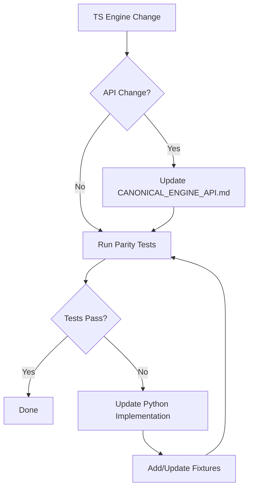

# Python Parity Requirements

**Task:** T1-W1-F  
**Date:** 2025-11-26  
**Status:** Complete

## 1. Overview

This document specifies the parity requirements between the TypeScript canonical engine ([`src/shared/engine/`](../src/shared/engine/)) and the Python AI service rules implementation ([`ai-service/app/rules/`](../ai-service/app/rules/)).

### 1.1 Purpose of Python Rules Engine

The Python rules engine serves two primary purposes:

1. **AI Training**: Provides rules validation for reinforcement learning training loops
2. **AI Inference**: Enables move generation and state simulation during AI move selection

### 1.2 Relationship to TypeScript Canonical Engine

| Aspect           | TypeScript Engine                  | Python AI Service                       |
| ---------------- | ---------------------------------- | --------------------------------------- |
| **Role**         | Canonical source of truth          | Derived implementation                  |
| **Location**     | `src/shared/engine/`               | `ai-service/app/rules/`                 |
| **Exports**      | 90+ functions/types via `index.ts` | Thin adapter via `RulesEngine` protocol |
| **Validation**   | Pure functions                     | Shadow contract validation against TS   |
| **Code Sharing** | Used by Server + Client            | Language boundary prevents sharing      |

### 1.3 Architecture Pattern

The Python AI service uses a **shadow contract validation** pattern:

```
┌─────────────────────────────────────────────────────────────────┐
│                     DefaultRulesEngine                          │
│                                                                 │
│  ┌──────────────────────┐    ┌───────────────────────────────┐ │
│  │  Python Mutators     │    │  GameEngine.apply_move        │ │
│  │  (PlacementMutator,  │◄───│  (Canonical Python GameEngine) │ │
│  │   MovementMutator,   │    │                               │ │
│  │   CaptureMutator,    │    │  Mirrors TS semantics         │ │
│  │   LineMutator,       │    │                               │ │
│  │   TerritoryMutator)  │    └───────────────────────────────┘ │
│  └──────────────────────┘                                       │
│           │                                                     │
│           ▼                                                     │
│  Shadow Contract Assertion: mutator_state == engine_state       │
└─────────────────────────────────────────────────────────────────┘
```

---

## 2. Function Parity Matrix

### 2.1 Core Utilities

| TS Function                                                             | TS File   | Python Function                                                                                  | Python File        | Parity Status | Notes                |
| ----------------------------------------------------------------------- | --------- | ------------------------------------------------------------------------------------------------ | ------------------ | ------------- | -------------------- |
| [`calculateCapHeight()`](../src/shared/engine/core.ts)                  | `core.ts` | [`calculate_cap_height()`](../ai-service/app/rules/core.py:58)                                   | `core.py`          | ✅ MATCHED    | Direct port          |
| [`calculateDistance()`](../src/shared/engine/core.ts)                   | `core.ts` | [`calculate_distance()`](../ai-service/app/rules/core.py:76)                                     | `core.py`          | ✅ MATCHED    | Direct port          |
| [`getPathPositions()`](../src/shared/engine/core.ts)                    | `core.ts` | [`get_path_positions()`](../ai-service/app/rules/core.py:94)                                     | `core.py`          | ✅ MATCHED    | Direct port          |
| [`hashGameState()`](../src/shared/engine/core.ts)                       | `core.ts` | [`hash_game_state()`](../ai-service/app/rules/core.py:208)                                       | `core.py`          | ✅ MATCHED    | Direct port          |
| [`summarizeBoard()`](../src/shared/engine/core.ts)                      | `core.ts` | [`summarize_board()`](../ai-service/app/rules/core.py:127)                                       | `core.py`          | ✅ MATCHED    | Direct port          |
| [`computeProgressSnapshot()`](../src/shared/engine/core.ts)             | `core.ts` | [`compute_progress_snapshot()`](../ai-service/app/rules/core.py:157)                             | `core.py`          | ✅ MATCHED    | Direct port          |
| [`countRingsInPlayForPlayer()`](../src/shared/engine/core.ts)           | `core.ts` | [`count_rings_in_play_for_player()`](../ai-service/app/rules/core.py:179)                        | `core.py`          | ✅ MATCHED    | Direct port          |
| [`countRingsOnBoardForPlayer()`](../src/shared/engine/core.ts)          | `core.ts` | -                                                                                                | -                  | ⚠️ MISSING    | Computed inline      |
| [`getMovementDirectionsForBoardType()`](../src/shared/engine/core.ts)   | `core.ts` | [`_get_all_directions()`](../ai-service/app/board_manager.py)                                    | `board_manager.py` | ✅ MATCHED    | Different location   |
| [`applyMarkerEffectsAlongPathOnBoard()`](../src/shared/engine/core.ts)  | `core.ts` | [`_process_markers_along_path()`](../ai-service/app/game_engine.py:971)                          | `game_engine.py`   | ✅ MATCHED    | Different name       |
| [`hasAnyLegalMoveOrCaptureFromOnBoard()`](../src/shared/engine/core.ts) | `core.ts` | [`_has_any_legal_move_or_capture_from_on_board()`](../ai-service/app/game_engine.py:1205)        | `game_engine.py`   | ✅ MATCHED    | Direct port          |
| [`validateCaptureSegmentOnBoard()`](../src/shared/engine/core.ts)       | `core.ts` | [`_validate_capture_segment_on_board_for_reachability()`](../ai-service/app/game_engine.py:1090) | `game_engine.py`   | ✅ MATCHED    | Different name       |
| `positionToString()`                                                    | `game.ts` | [`Position.to_key()`](../ai-service/app/models.py)                                               | `models.py`        | ✅ MATCHED    | Method style         |
| `stringToPosition()`                                                    | `game.ts` | -                                                                                                | -                  | ⚠️ MISSING    | Not needed in Python |
| `positionsEqual()`                                                      | `game.ts` | `==` operator                                                                                    | -                  | ✅ MATCHED    | Via Pydantic         |

### 2.2 Placement Domain

| TS Function                                                                           | TS File                 | Python Function                                                                      | Python File               | Parity Status | Notes           |
| ------------------------------------------------------------------------------------- | ----------------------- | ------------------------------------------------------------------------------------ | ------------------------- | ------------- | --------------- |
| [`validatePlacementOnBoard()`](../src/shared/engine/validators/PlacementValidator.ts) | `PlacementValidator.ts` | [`PlacementValidator.validate()`](../ai-service/app/rules/validators/placement.py:7) | `validators/placement.py` | ✅ MATCHED    | Reimplemented   |
| [`validatePlacement()`](../src/shared/engine/validators/PlacementValidator.ts)        | `PlacementValidator.ts` | [`PlacementValidator.validate()`](../ai-service/app/rules/validators/placement.py:7) | `validators/placement.py` | ✅ MATCHED    | Combined        |
| [`validateSkipPlacement()`](../src/shared/engine/validators/PlacementValidator.ts)    | `PlacementValidator.ts` | [`_get_skip_placement_moves()`](../ai-service/app/game_engine.py:1407)               | `game_engine.py`          | ✅ MATCHED    | Via enumeration |
| [`applyPlacementMove()`](../src/shared/engine/placementHelpers.ts)                    | `placementHelpers.ts`   | [`GameEngine._apply_place_ring()`](../ai-service/app/game_engine.py:2306)            | `game_engine.py`          | ✅ MATCHED    | Different name  |
| [`evaluateSkipPlacementEligibility()`](../src/shared/engine/placementHelpers.ts)      | `placementHelpers.ts`   | [`_get_skip_placement_moves()`](../ai-service/app/game_engine.py:1407)               | `game_engine.py`          | ✅ MATCHED    | Combined        |

### 2.3 Movement Domain

| TS Function                                                                      | TS File                | Python Function                                                                    | Python File              | Parity Status | Notes          |
| -------------------------------------------------------------------------------- | ---------------------- | ---------------------------------------------------------------------------------- | ------------------------ | ------------- | -------------- |
| [`enumerateSimpleMoveTargetsFromStack()`](../src/shared/engine/movementLogic.ts) | `movementLogic.ts`     | [`_get_movement_moves()`](../ai-service/app/game_engine.py:2183)                   | `game_engine.py`         | ✅ MATCHED    | Returns Move[] |
| [`validateMovement()`](../src/shared/engine/validators/MovementValidator.ts)     | `MovementValidator.ts` | [`MovementValidator.validate()`](../ai-service/app/rules/validators/movement.py:8) | `validators/movement.py` | ✅ MATCHED    | Reimplemented  |

### 2.4 Capture Domain

| TS Function                                                                | TS File               | Python Function                                                                  | Python File             | Parity Status | Notes         |
| -------------------------------------------------------------------------- | --------------------- | -------------------------------------------------------------------------------- | ----------------------- | ------------- | ------------- |
| [`enumerateCaptureMoves()`](../src/shared/engine/captureLogic.ts)          | `captureLogic.ts`     | [`_get_capture_moves()`](../ai-service/app/game_engine.py:1594)                  | `game_engine.py`        | ✅ MATCHED    | Direct port   |
| [`validateCapture()`](../src/shared/engine/validators/CaptureValidator.ts) | `CaptureValidator.ts` | [`CaptureValidator.validate()`](../ai-service/app/rules/validators/capture.py:8) | `validators/capture.py` | ✅ MATCHED    | Reimplemented |

### 2.5 Line Domain

| TS Function                                                                       | TS File                  | Python Function                                                               | Python File        | Parity Status | Notes              |
| --------------------------------------------------------------------------------- | ------------------------ | ----------------------------------------------------------------------------- | ------------------ | ------------- | ------------------ |
| [`findAllLines()`](../src/shared/engine/lineDetection.ts)                         | `lineDetection.ts`       | [`BoardManager.find_all_lines()`](../ai-service/app/board_manager.py)         | `board_manager.py` | ✅ MATCHED    | Different location |
| [`findLinesForPlayer()`](../src/shared/engine/lineDetection.ts)                   | `lineDetection.ts`       | Filtered from `find_all_lines()`                                              | `board_manager.py` | ✅ MATCHED    | Inline filter      |
| [`enumerateProcessLineMoves()`](../src/shared/engine/lineDecisionHelpers.ts)      | `lineDecisionHelpers.ts` | [`_get_line_processing_moves()`](../ai-service/app/game_engine.py:2022)       | `game_engine.py`   | ✅ MATCHED    | Different name     |
| [`enumerateChooseLineRewardMoves()`](../src/shared/engine/lineDecisionHelpers.ts) | `lineDecisionHelpers.ts` | [`_get_line_processing_moves()`](../ai-service/app/game_engine.py:2022)       | `game_engine.py`   | ⚠️ PARTIAL    | Combined           |
| [`applyProcessLineDecision()`](../src/shared/engine/lineDecisionHelpers.ts)       | `lineDecisionHelpers.ts` | [`GameEngine._apply_line_formation()`](../ai-service/app/game_engine.py:2788) | `game_engine.py`   | ✅ MATCHED    | Different name     |
| [`applyChooseLineRewardDecision()`](../src/shared/engine/lineDecisionHelpers.ts)  | `lineDecisionHelpers.ts` | [`GameEngine._apply_line_formation()`](../ai-service/app/game_engine.py:2788) | `game_engine.py`   | ✅ MATCHED    | Combined           |

### 2.6 Territory Domain

| TS Function                                                                                  | TS File                       | Python Function                                                                    | Python File        | Parity Status | Notes              |
| -------------------------------------------------------------------------------------------- | ----------------------------- | ---------------------------------------------------------------------------------- | ------------------ | ------------- | ------------------ |
| [`findDisconnectedRegions()`](../src/shared/engine/territoryDetection.ts)                    | `territoryDetection.ts`       | [`BoardManager.find_disconnected_regions()`](../ai-service/app/board_manager.py)   | `board_manager.py` | ✅ MATCHED    | Different location |
| [`canProcessTerritoryRegion()`](../src/shared/engine/territoryProcessing.ts)                 | `territoryProcessing.ts`      | [`_can_process_disconnected_region()`](../ai-service/app/game_engine.py:2160)      | `game_engine.py`   | ✅ MATCHED    | Different name     |
| [`filterProcessableTerritoryRegions()`](../src/shared/engine/territoryProcessing.ts)         | `territoryProcessing.ts`      | Inline in `_get_territory_processing_moves()`                                      | `game_engine.py`   | ✅ MATCHED    | Inline             |
| [`getProcessableTerritoryRegions()`](../src/shared/engine/territoryProcessing.ts)            | `territoryProcessing.ts`      | Inline in `_get_territory_processing_moves()`                                      | `game_engine.py`   | ✅ MATCHED    | Inline             |
| [`applyTerritoryRegion()`](../src/shared/engine/territoryProcessing.ts)                      | `territoryProcessing.ts`      | [`GameEngine._apply_territory_claim()`](../ai-service/app/game_engine.py:2894)     | `game_engine.py`   | ✅ MATCHED    | Different name     |
| [`enumerateProcessTerritoryRegionMoves()`](../src/shared/engine/territoryDecisionHelpers.ts) | `territoryDecisionHelpers.ts` | [`_get_territory_processing_moves()`](../ai-service/app/game_engine.py:2082)       | `game_engine.py`   | ✅ MATCHED    | Different name     |
| [`enumerateTerritoryEliminationMoves()`](../src/shared/engine/territoryDecisionHelpers.ts)   | `territoryDecisionHelpers.ts` | [`_get_territory_processing_moves()`](../ai-service/app/game_engine.py:2082)       | `game_engine.py`   | ✅ MATCHED    | Combined           |
| [`applyProcessTerritoryRegionDecision()`](../src/shared/engine/territoryDecisionHelpers.ts)  | `territoryDecisionHelpers.ts` | [`GameEngine._apply_territory_claim()`](../ai-service/app/game_engine.py:2894)     | `game_engine.py`   | ✅ MATCHED    | Different name     |
| [`applyEliminateRingsFromStackDecision()`](../src/shared/engine/territoryDecisionHelpers.ts) | `territoryDecisionHelpers.ts` | [`GameEngine._apply_forced_elimination()`](../ai-service/app/game_engine.py:3164)  | `game_engine.py`   | ✅ MATCHED    | Different name     |
| [`getBorderMarkerPositionsForRegion()`](../src/shared/engine/territoryBorders.ts)            | `territoryBorders.ts`         | [`BoardManager.get_border_marker_positions()`](../ai-service/app/board_manager.py) | `board_manager.py` | ✅ MATCHED    | Different location |

### 2.7 Victory Domain

| TS Function                                                 | TS File           | Python Function                                                       | Python File      | Parity Status | Notes          |
| ----------------------------------------------------------- | ----------------- | --------------------------------------------------------------------- | ---------------- | ------------- | -------------- |
| [`evaluateVictory()`](../src/shared/engine/victoryLogic.ts) | `victoryLogic.ts` | [`GameEngine._check_victory()`](../ai-service/app/game_engine.py:269) | `game_engine.py` | ✅ MATCHED    | Different name |
| [`getLastActor()`](../src/shared/engine/victoryLogic.ts)    | `victoryLogic.ts` | Inline in `_check_victory()`                                          | `game_engine.py` | ✅ MATCHED    | Inline         |

### 2.8 Turn Management

| TS Function                                                  | TS File        | Python Function                                                      | Python File      | Parity Status | Notes                       |
| ------------------------------------------------------------ | -------------- | -------------------------------------------------------------------- | ---------------- | ------------- | --------------------------- |
| [`advanceTurnAndPhase()`](../src/shared/engine/turnLogic.ts) | `turnLogic.ts` | [`GameEngine._update_phase()`](../ai-service/app/game_engine.py:440) | `game_engine.py` | ✅ MATCHED    | Combined with `_end_turn()` |

### 2.9 Mutators

| TS Mutator         | TS File                        | Python Mutator                                                        | Python File             | Parity Status | Notes                   |
| ------------------ | ------------------------------ | --------------------------------------------------------------------- | ----------------------- | ------------- | ----------------------- |
| `PlacementMutator` | `mutators/PlacementMutator.ts` | [`PlacementMutator`](../ai-service/app/rules/mutators/placement.py:6) | `mutators/placement.py` | ✅ MATCHED    | Delegates to GameEngine |
| `MovementMutator`  | `mutators/MovementMutator.ts`  | [`MovementMutator`](../ai-service/app/rules/mutators/movement.py:6)   | `mutators/movement.py`  | ✅ MATCHED    | Delegates to GameEngine |
| `CaptureMutator`   | `mutators/CaptureMutator.ts`   | [`CaptureMutator`](../ai-service/app/rules/mutators/capture.py:6)     | `mutators/capture.py`   | ✅ MATCHED    | Delegates to GameEngine |
| `LineMutator`      | `mutators/LineMutator.ts`      | [`LineMutator`](../ai-service/app/rules/mutators/line.py:6)           | `mutators/line.py`      | ✅ MATCHED    | Delegates to GameEngine |
| `TerritoryMutator` | `mutators/TerritoryMutator.ts` | [`TerritoryMutator`](../ai-service/app/rules/mutators/territory.py:6) | `mutators/territory.py` | ✅ MATCHED    | Delegates to GameEngine |
| `TurnMutator`      | `mutators/TurnMutator.ts`      | [`TurnMutator`](../ai-service/app/rules/mutators/turn.py:6)           | `mutators/turn.py`      | ✅ MATCHED    | Delegates to GameEngine |

### 2.10 Validators

| TS Validator         | TS File                            | Python Validator                                                          | Python File               | Parity Status | Notes         |
| -------------------- | ---------------------------------- | ------------------------------------------------------------------------- | ------------------------- | ------------- | ------------- |
| `PlacementValidator` | `validators/PlacementValidator.ts` | [`PlacementValidator`](../ai-service/app/rules/validators/placement.py:6) | `validators/placement.py` | ✅ MATCHED    | Reimplemented |
| `MovementValidator`  | `validators/MovementValidator.ts`  | [`MovementValidator`](../ai-service/app/rules/validators/movement.py:7)   | `validators/movement.py`  | ✅ MATCHED    | Reimplemented |
| `CaptureValidator`   | `validators/CaptureValidator.ts`   | [`CaptureValidator`](../ai-service/app/rules/validators/capture.py:7)     | `validators/capture.py`   | ✅ MATCHED    | Reimplemented |
| `LineValidator`      | `validators/LineValidator.ts`      | [`LineValidator`](../ai-service/app/rules/validators/line.py:15)          | `validators/line.py`      | ✅ MATCHED    | Reimplemented |
| `TerritoryValidator` | `validators/TerritoryValidator.ts` | [`TerritoryValidator`](../ai-service/app/rules/validators/territory.py:6) | `validators/territory.py` | ✅ MATCHED    | Reimplemented |

### 2.11 Functions NOT Implemented in Python

| TS Function                       | TS File                   | Status        | Reason                                      |
| --------------------------------- | ------------------------- | ------------- | ------------------------------------------- |
| `chooseLocalMoveFromCandidates()` | `localAIMoveSelection.ts` | 🚫 NOT NEEDED | Python has own AI selection                 |
| `SQUARE_MOORE_DIRECTIONS`         | `core.ts`                 | ⚠️ INLINE     | Defined directly in `_get_all_directions()` |
| `HEX_DIRECTIONS`                  | `core.ts`                 | ⚠️ INLINE     | Defined directly in `_get_all_directions()` |

---

## 3. Type Parity Matrix

### 3.1 Core Types

| TS Type            | TS File   | Python Type   | Python File | Parity Status |
| ------------------ | --------- | ------------- | ----------- | ------------- |
| `Position`         | `game.ts` | `Position`    | `models.py` | ✅ MATCHED    |
| `BoardType`        | `game.ts` | `BoardType`   | `models.py` | ✅ MATCHED    |
| `BoardState`       | `game.ts` | `BoardState`  | `models.py` | ✅ MATCHED    |
| `BoardConfig`      | `game.ts` | `BoardConfig` | `core.py`   | ✅ MATCHED    |
| `RingStack`        | `game.ts` | `RingStack`   | `models.py` | ✅ MATCHED    |
| `MarkerInfo`       | `game.ts` | `MarkerInfo`  | `models.py` | ✅ MATCHED    |
| `MarkerType`       | `game.ts` | `str` literal | -           | ⚠️ PARTIAL    |
| `GameState`        | `game.ts` | `GameState`   | `models.py` | ✅ MATCHED    |
| `GameStatus`       | `game.ts` | `GameStatus`  | `models.py` | ✅ MATCHED    |
| `GamePhase`        | `game.ts` | `GamePhase`   | `models.py` | ✅ MATCHED    |
| `Player`           | `game.ts` | `Player`      | `models.py` | ✅ MATCHED    |
| `Move`             | `game.ts` | `Move`        | `models.py` | ✅ MATCHED    |
| `MoveType`         | `game.ts` | `MoveType`    | `models.py` | ✅ MATCHED    |
| `LineInfo`         | `game.ts` | `LineInfo`    | `models.py` | ✅ MATCHED    |
| `Territory`        | `game.ts` | `Territory`   | `models.py` | ✅ MATCHED    |
| `GameResult`       | `game.ts` | -             | -           | ⚠️ MISSING    |
| `PlayerChoice`     | `game.ts` | -             | -           | 🚫 NOT NEEDED |
| `ProgressSnapshot` | `game.ts` | `dict`        | -           | ⚠️ PARTIAL    |

### 3.2 Engine Types

| TS Type            | TS File    | Python Type | Python File     | Parity Status |
| ------------------ | ---------- | ----------- | --------------- | ------------- |
| `ValidationResult` | `types.ts` | `bool`      | -               | ⚠️ SIMPLIFIED |
| `GameAction`       | `types.ts` | `Move`      | `models.py`     | ✅ MATCHED    |
| `ActionType`       | `types.ts` | `MoveType`  | `models.py`     | ✅ MATCHED    |
| `Validator`        | `types.ts` | `Validator` | `interfaces.py` | ✅ MATCHED    |
| `Mutator`          | `types.ts` | `Mutator`   | `interfaces.py` | ✅ MATCHED    |

### 3.3 Domain Result Types

| TS Type             | TS File                 | Python Type         | Python File | Parity Status |
| ------------------- | ----------------------- | ------------------- | ----------- | ------------- |
| `TurnAdvanceResult` | `turnLogic.ts`          | -                   | -           | ⚠️ INLINE     |
| `PerTurnState`      | `turnLogic.ts`          | GameState fields    | `models.py` | ✅ MATCHED    |
| `VictoryResult`     | `victoryLogic.ts`       | GameState fields    | `models.py` | ✅ MATCHED    |
| `VictoryReason`     | `victoryLogic.ts`       | -                   | -           | ⚠️ MISSING    |
| `PlacementContext`  | `PlacementValidator.ts` | -                   | -           | ⚠️ INLINE     |
| `SimpleMoveTarget`  | `movementLogic.ts`      | `Move`              | `models.py` | ✅ MATCHED    |
| `ChainCaptureState` | `game.ts`               | `ChainCaptureState` | `models.py` | ✅ MATCHED    |

---

## 4. Behavioral Requirements

### 4.1 Capture Enumeration Parity

**Critical Requirement:** [`enumerateCaptureMoves()`](../src/shared/engine/captureLogic.ts) and [`GameEngine._get_capture_moves()`](../ai-service/app/game_engine.py:1594) must produce identical sets of legal capture moves.

**Verification Points:**

- Cap height comparison: `attacker.cap_height >= target.cap_height`
- Self-capture allowed (capturing own stack)
- Ray-walking termination on collapsed spaces
- Landing marker ownership validation
- Segment distance >= stack height

**Test Strategy:**

```json
{
  "fixture_type": "capture_enumeration",
  "input": { "state": "<GameState>", "player": 1 },
  "expected_output": { "moves": ["<Move>", ...] }
}
```

### 4.2 Movement Validation Parity

**Critical Requirement:** [`validateMovement()`](../src/shared/engine/validators/MovementValidator.ts) and [`MovementValidator.validate()`](../ai-service/app/rules/validators/movement.py:8) must agree on all inputs.

**Verification Points:**

- Minimum distance = stack height
- Path clear of stacks and collapsed spaces
- Landing on opponent marker forbidden
- Must-move constraint after placement
- Straight-line direction only

**Test Strategy:**

```json
{
  "fixture_type": "movement_validation",
  "input": { "state": "<GameState>", "move": "<Move>" },
  "expected_output": { "valid": true/false }
}
```

### 4.3 Line Detection Parity

**Critical Requirement:** [`findAllLines()`](../src/shared/engine/lineDetection.ts) and [`BoardManager.find_all_lines()`](../ai-service/app/board_manager.py) must detect identical lines.

**Verification Points:**

- Line length thresholds per board type (3 for square8, 4 for others)
- Overlength line detection
- Player ownership from marker ownership
- Axis-aligned direction iteration

### 4.4 Territory Detection Parity

**Critical Requirement:** [`findDisconnectedRegions()`](../src/shared/engine/territoryDetection.ts) and [`BoardManager.find_disconnected_regions()`](../ai-service/app/board_manager.py) must identify identical regions.

**Verification Points:**

- Region connectivity via player-owned markers
- Border marker identification
- Region processability (stack outside region required)

### 4.5 Victory Evaluation Parity

**Critical Requirement:** [`evaluateVictory()`](../src/shared/engine/victoryLogic.ts) and [`GameEngine._check_victory()`](../ai-service/app/game_engine.py:269) must produce identical results.

**Verification Points:**

- Ring elimination threshold (victory_threshold)
- Territory control threshold (territory_victory_threshold)
- Last-player-standing (R172) tracking
- Global stalemate tie-breaker ladder
- Rings-in-hand counted as eliminated for tie-breaking

---

## 5. Test Parity Strategy

### 5.1 Shared Test Fixtures

All parity tests use JSON fixtures stored in [`tests/fixtures/rules-parity/`](../tests/fixtures/rules-parity/).

**Fixture Schema (v2):**

```json
{
  "version": "v2",
  "fixture_type": "state_action" | "trace",
  "board_type": "square8" | "square19" | "hexagonal",
  "description": "Human-readable description",
  "input": {
    "state": { /* GameState JSON */ },
    "action"?: { /* Move JSON */ }
  },
  "expected": {
    "next_state"?: { /* GameState JSON */ },
    "valid_moves"?: [ /* Move[] JSON */ ],
    "state_hash"?: "canonical hash string"
  }
}
```

### 5.2 Deterministic Seed-Based Scenarios

For complex multi-move scenarios, use seeded RNG:

```python
# Python
import random
random.seed(42)
state = GameEngine.apply_move(state, ai.select_move(state))
```

```typescript
// TypeScript
import { createSeededRng } from '@shared/utils/rng';
const rng = createSeededRng(42);
const state = applyMove(state, ai.selectMove(state, rng));
```

### 5.3 Property-Based Testing for Equivalence

Use hypothesis (Python) and fast-check (TypeScript) for:

1. **State hash equivalence:** `hash_game_state(state) === hashGameState(state)`
2. **Move enumeration equivalence:** `set(py_moves) === set(ts_moves)`
3. **State transition equivalence:** `apply_move(state, move) === applyMove(state, move)`

### 5.4 Existing Parity Tests

| Test Suite                                 | Location                  | Coverage                 |
| ------------------------------------------ | ------------------------- | ------------------------ |
| `test_default_engine_equivalence.py`       | `ai-service/tests/rules/` | Move application parity  |
| `test_default_engine_flags.py`             | `ai-service/tests/rules/` | Mutator shadow contracts |
| `TraceFixtures.sharedEngineParity.test.ts` | `tests/unit/`             | Trace replay parity      |

---

## 6. Maintenance Protocol

### 6.1 Change Detection

When modifying the TypeScript canonical engine:

1. **Update `CANONICAL_ENGINE_API.md`** if API signature changes
2. **Run parity test suite** to detect Python divergence
3. **Update Python implementation** if behavior changed
4. **Add new fixtures** for new functionality

### 6.2 Sync Workflow



### 6.3 CI Integration

The following CI checks enforce parity:

1. **`test-typescript-parity`:** Runs TS engine against shared fixtures
2. **`test-python-parity`:** Runs Python engine against same fixtures
3. **`test-cross-language`:** Generates states in TS, validates in Python

### 6.4 Documentation Requirements

For each TypeScript engine change:

| Change Type       | Documentation Required                 |
| ----------------- | -------------------------------------- |
| New export        | Update this document + API doc         |
| Signature change  | Update this document + migration guide |
| Behavioral change | Update this document + add fixtures    |
| Bug fix           | Add regression fixture                 |

---

## 7. Parity Summary

### 7.1 Overall Statistics

| Category            | MATCHED | PARTIAL | MISSING | NOT NEEDED |
| ------------------- | ------- | ------- | ------- | ---------- |
| Core Utilities      | 13      | 0       | 2       | 0          |
| Placement           | 5       | 0       | 0       | 0          |
| Movement            | 2       | 0       | 0       | 0          |
| Capture             | 2       | 0       | 0       | 0          |
| Line                | 5       | 1       | 0       | 0          |
| Territory           | 8       | 0       | 0       | 0          |
| Victory             | 2       | 0       | 0       | 0          |
| Turn                | 1       | 0       | 0       | 0          |
| Mutators            | 6       | 0       | 0       | 0          |
| Validators          | 5       | 0       | 0       | 0          |
| **Total Functions** | **49**  | **1**   | **2**   | **3**      |

### 7.2 Type Parity Summary

| Category        | MATCHED | PARTIAL | MISSING | NOT NEEDED |
| --------------- | ------- | ------- | ------- | ---------- |
| Core Types      | 14      | 2       | 1       | 1          |
| Engine Types    | 4       | 1       | 0       | 0          |
| Domain Types    | 4       | 1       | 2       | 0          |
| **Total Types** | **22**  | **4**   | **3**   | **1**      |

### 7.3 Key Findings

1. **Strong Parity:** 49 of 52 tracked functions have MATCHED parity status
2. **Shadow Contract Pattern:** Python mutators delegate to `GameEngine` static methods, ensuring semantic alignment
3. **Primary Risk:** `BoardManager` and `GameEngine` static methods in Python are manually synced; changes require vigilance
4. **Missing Types:** `VictoryReason`, `GameResult` are not explicitly typed in Python (inline/simplified)

### 7.4 Recommendations

1. **Code Generation:** Consider generating Python from TypeScript AST for perfect sync
2. **WASM Compilation:** Long-term option to compile TS engine to WASM for Python consumption
3. **Fixture Expansion:** Add fixtures for edge cases discovered during AI training
4. **Automated Diffing:** Implement AST-based diffing to detect undocumented TS changes

---

## Appendix A: File Inventory

### TypeScript Canonical Engine (`src/shared/engine/`)

| File                          | Lines | Purpose                    |
| ----------------------------- | ----- | -------------------------- |
| `index.ts`                    | ~350  | Public API exports         |
| `core.ts`                     | ~650  | Core utilities             |
| `turnLogic.ts`                | ~250  | Turn/phase state machine   |
| `movementLogic.ts`            | ~200  | Movement reachability      |
| `captureLogic.ts`             | ~350  | Capture enumeration        |
| `lineDetection.ts`            | ~200  | Line geometry              |
| `lineDecisionHelpers.ts`      | ~400  | Line decision moves        |
| `territoryDetection.ts`       | ~250  | Territory region detection |
| `territoryProcessing.ts`      | ~300  | Territory collapse         |
| `territoryDecisionHelpers.ts` | ~400  | Territory decision moves   |
| `victoryLogic.ts`             | ~150  | Victory evaluation         |
| `validators/*.ts`             | ~600  | Move validation            |
| `mutators/*.ts`               | ~800  | State mutation             |

### Python AI Service (`ai-service/app/rules/`)

| File                | Lines | Purpose                        |
| ------------------- | ----- | ------------------------------ |
| `__init__.py`       | ~10   | Package exports                |
| `interfaces.py`     | ~55   | Protocol definitions           |
| `core.py`           | ~245  | Core utilities                 |
| `geometry.py`       | ~190  | Board geometry                 |
| `default_engine.py` | ~994  | Shadow contract engine         |
| `factory.py`        | ~20   | Engine factory                 |
| `validators/*.py`   | ~350  | Move validation                |
| `mutators/*.py`     | ~100  | State mutation (thin wrappers) |

### Python Game Engine (`ai-service/app/`)

| File               | Lines  | Purpose                |
| ------------------ | ------ | ---------------------- |
| `game_engine.py`   | ~3,186 | Canonical Python rules |
| `board_manager.py` | ~600   | Board state operations |

---

## Appendix B: Shadow Contract Verification

The [`DefaultRulesEngine.apply_move()`](../ai-service/app/rules/default_engine.py:285) method implements per-move shadow contracts:

```python
def apply_move(self, state: GameState, move: Move) -> GameState:
    # 1. Canonical result from GameEngine
    next_via_engine = GameEngine.apply_move(state, move)

    # 2. Shadow contract for each move type
    if move.type == MoveType.PLACE_RING:
        mutator_state = state.model_copy(deep=True)
        PlacementMutator().apply(mutator_state, move)
        # Assert board/player parity...

    # 3. Always return canonical state
    return next_via_engine
```

This ensures that:

- Mutators are validated against the canonical engine
- Any divergence raises `RuntimeError` with diagnostic details
- The canonical `GameEngine` result is always authoritative
