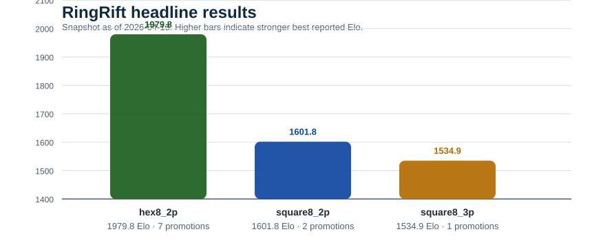
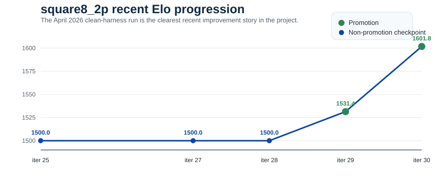

# RingRift Results

This document summarizes the current research evidence from the RingRift self-play training project.

Status is current as of April 17, 2026.

For claim provenance, see
[`docs/data/results_evidence_manifest.json`](/docs/data/results_evidence_manifest.json).
It separates checked-in claims from S3-backed artifacts and newer
operator-reported results that are not yet published here.

## Headline Results

| Config       | Start Elo | Best Reported Elo | Promotions | Status                                                                         |
| ------------ | --------: | ----------------: | ---------: | ------------------------------------------------------------------------------ |
| `hex8_2p`    |    `1500` |          `1979.8` |        `7` | Flagship result; current v3 line hit an exact `50.0%` reject at iteration `36` |
| `square8_2p` |    `1500` |          `1782.0` |        `5` | Strongest recent mover; iterations `34` and `35` both promoted at `62%`        |
| `square8_3p` |    `1500` |          `1534.9` |        `1` | Multiplayer still weak; iteration `21` rejected at `30%`                       |
| `hex8_3p`    |    `1500` |          `1500.0` |        `0` | First completed hex multiplayer eval rejected at `35%`                         |
| `square8_4p` |    `1500` |          `1500.0` |        `0` | No proven improvement above baseline                                           |

> Multiplayer Elo caveat: pre-`dfb3d20c1` `3p/4p` `estimated_elo` values were
> logged with a `2p`-only promotion formula. The historical numbers below are
> preserved as written for provenance and should be recomputed before comparing
> old multiplayer runs against new post-fix data. `2p` numbers were always
> correct, and `1500.0` baseline rows remain numerically unchanged because they
> have no promotions yet. See [Issue
> #90](https://github.com/synaptent/RingRift/issues/90).



## Why These Results Matter

RingRift was built as a novel deterministic strategy game plus an end-to-end AlphaZero-style training system. The central question was not only whether the system could run, but whether it could produce real iterative neural-network improvement on a nontrivial new game.

The answer is now yes.

The strongest evidence is still `hex8_2p`, but `square8_2p` is now materially stronger than it was in the April 13 snapshot. It is no longer just a second weak proof point. It has reached `1782.0` Elo with `5` promotions after two consecutive `62%` promotions at iterations `34` and `35`.

The current state is still not a universal success story, though: only `2` of `12` configs have strong evidence of improvement, multiplayer remains weak, and larger boards remain unproven.

## Concrete Evidence

### `hex8_2p`

- Best reported Elo: `1979.8`
- Promotions: `7`
- Latest verified v3 milestone: iteration `36` rejected at `50.0%` over `400` staged eval games
- Interpretation: strong iterative improvement from the `1500` baseline to a checkpoint family that got very close to `2000`, then flattened on the current v3 line

Promotion progression from the archived gh200-8 `metrics.jsonl`:

| Iteration | Win Rate |         Eval Games | Result  | Estimated Elo |
| --------- | -------: | -----------------: | ------- | ------------: |
| `2`       |  `60.0%` |  `30` staged games | promote |      `1570.4` |
| `7`       |  `60.0%` |  `50` staged games | promote |      `1640.8` |
| `9`       |  `62.0%` |  `50` staged games | promote |      `1725.9` |
| `13`      |  `60.0%` |  `50` staged games | promote |      `1796.3` |
| `17`      |  `66.0%` |  `50` staged games | promote |      `1911.6` |
| `21`      |  `58.0%` |  `50` staged games | promote |      `1967.6` |
| `33`      |  `51.8%` | `400` staged games | promote |      `1979.8` |

The scientific interpretation changed in one important way after the April 15 verification pass: the current supported v3 line now looks plateaued rather than merely noisy. The node is therefore doing the right next thing: keep the `1979.8` result as the supported flagship checkpoint, but spend new GPU time on a `v4` architecture experiment instead of pretending the existing line is still climbing cleanly.

### `hex8_2p` v4 Experiment

The active v4 run is an experiment, not a completed result.

| Field            | Value                                                                        |
| ---------------- | ---------------------------------------------------------------------------- |
| Hypothesis       | A v4 attention-style architecture can break the current `hex8_2p` v3 plateau |
| Baseline         | `1979.8` Elo from the supported v3/v2-family checkpoint                      |
| Success criteria | Promote above `1979.8` within the experiment window                          |
| Hardware         | `gh200-8`                                                                    |
| Start date       | April 15, 2026                                                               |

First completed v4 iterations (source: `gh200-8` node `metrics.jsonl`, not yet mirrored to S3):

| Iteration | Win Rate |  Eval Games | Result  | Estimated Elo |
| --------- | -------: | ----------: | ------- | ------------: |
| `7`       |  `55.0%` | `200` games | promote |      `1534.9` |
| `8`       |  `43.0%` | `100` games | reject  |      `1534.9` |

Interpretation: the training-probe fix committed at `beafb4a07` unstuck the v4 pipeline (previously all iterations failed at the architecture-version-mismatch probe). v4 now completes iterations and has produced one promotion, but it is starting from a `1500` baseline — nowhere near catching the supported v3/v2-family `1979.8` result. It will take many more promotions for v4 to be considered a plateau-break candidate.

Until a completed v4 iteration crosses `1979.8`, the public headline claim remains the v3-family result.

### `hex8_2p` v5-heavy Experiment

A second architecture experiment was launched April 17 on `gh200-11`.

| Field            | Value                                                                                                                                                 |
| ---------------- | ----------------------------------------------------------------------------------------------------------------------------------------------------- |
| Hypothesis       | A v5-heavy architecture (FiLM-conditioned heuristic features + optional GNN + spatial policy heads) can succeed where v4 attention does not           |
| Baseline         | Same as v4: `1979.8` Elo from supported v3/v2-family checkpoint                                                                                       |
| Success criteria | Promote above `1979.8` within the experiment window                                                                                                   |
| Hardware         | `gh200-11`                                                                                                                                            |
| Start date       | April 17, 2026                                                                                                                                        |
| Status           | Launched; first iteration self-play in progress, no completed iteration yet. Compatibility validation between 40ch bootstrap and export/train pending |

Prerequisites landed immediately before launch:

- `6aff2c65c feat(training): export v5 heuristic features from selfplay jsonl`
- `1848182b9 fix(training): align v5-heavy bootstrap schema`

Until the first v5-heavy iteration completes the full self-play → export → train → eval cycle, this is _launched_ rather than _working_. We hold the claim language until we see a completed iteration in `metrics.jsonl`.

### `square8_2p`

This remains the clearest recent improvement story after `hex8_2p`.

Recent progression:

| Iteration | Win Rate |         Eval Games | Result  | Estimated Elo |
| --------- | -------: | -----------------: | ------- | ------------: |
| `29`      |  `54.5%` | `200` staged games | promote |      `1531.4` |
| `30`      |  `60.0%` |  `50` staged games | promote |      `1601.8` |
| `32`      |  `51.5%` | `400` staged games | promote |      `1612.2` |
| `33`      |  `40.0%` |  `50` staged games | reject  |      `1612.2` |
| `34`      |  `62.0%` |  `50` staged games | promote |      `1697.3` |
| `35`      |  `62.0%` |  `50` staged games | promote |      `1782.0` |



Important context:

- iteration `29` onward came after the minimal loop gained true fixed-LR support end to end
- iterations `34` and `35` are back-to-back `62%` promotions, moving the public square8_2p line from `1601.8` to `1782.0`
- the evidence source for the latest square8_2p headline is the gh200-9 `data/minimal_loop_square8_2p/metrics.jsonl` node log plus the archived `s3://ringrift-models-20251214/archive/gh200-9/metrics.jsonl`
- `square8_2p` is now the clearest proof that the cleaned-up minimal-loop stack works on more than one supported 2-player configuration

### `hex8_3p`

- Best reported Elo: `1500.0`
- Promotions: `0`
- First completed result: iteration `1` rejected at `35%` over `400` staged eval games

This result matters because it proves the hex multiplayer path can at least complete the full minimal-loop cycle under the current harness. It does not count as evidence of improvement. The correct interpretation is: first clean result achieved, but no strength gain demonstrated yet.

### `square8_3p`

- Best reported Elo: `1534.9`
- Promotions: `1`
- Best promotion came at iteration `6` with a `55%` win rate

This should be treated cautiously. Multiplayer evaluation was corrected later to rotate one candidate seat per game fairly, but the corrected seat-fair results remain weak: iteration `19` rejected at `20%`, iteration `21` rejected at `30%`, and the current tail is still below a persuasive threshold.

The published `1534.9` Elo figure predates commit `dfb3d20c1` and is preserved
as the contemporaneous trainer estimate, not a retroactively corrected
multiplayer Elo number.

As of April 17, 2026, the node is on iteration `26` self-play after a restart that deployed A1 per-seat WR tracking (commit `98736c566`). Future completed evaluations will surface a `seat_wr` map in the quality-gate output and compare per-seat wins against the same iteration's selfplay seat distribution rather than a uniform-seat assumption. Two hypotheses are still live: (1) the candidate is genuinely weak, or (2) evaluation seat assignment is structurally biased despite the rotation fix. We will not decide between them until corrected post-fix multiplayer data accumulates.

The result is still not strong enough to claim robust multiplayer progress. What it does show is that the multiplayer path is no longer blocked by the earlier evaluator bug; it now has one promotion under the corrected threshold and seat-fair regime, but it still needs another clean promotion before it should be treated as persuasive evidence.

### `square8_4p`

- Best reported Elo: `1500.0`
- Promotions: `0`
- Latest completed eval in the status snapshot was roughly `46%`

This configuration has not demonstrated improvement above baseline. It remains scientifically unproven and is not part of the current strongest evidence path.

## April 15 Methodology And Operations State

The most important fact about the April 15 state is that the training claim now depends more on preserving uninterrupted runtime than on adding more orchestration. The minimal loop has already demonstrated the core research result. The new value is selective:

- keep the supported `1979.8` `hex8_2p` checkpoint as the flagship evidence
- keep pushing `square8_2p`, which just promoted to `1782.0`
- use fresh architecture work on `hex8_2p` rather than pretending the current v3 line is still improving
- keep collecting multiplayer data without overclaiming weak evaluations

The active runtime is now organized as a role-based fleet:

- `5` trainers: `gh200-8` (now launching a `hex8_2p` `v4` architecture experiment), `gh200-9` (`square8_2p`), `gh200-10` (`hex8_3p`), `gh200-12` (`square8_3p`), and `gh200-14` (`square19_2p`)
- `2` selfplay workers: `gh200-11` feeding `hex8_2p`, and `gh200-13` feeding `square8_2p`
- `1` dedicated evaluator: `vultr-a100-20gb`

The reason for this role split is operational, not cosmetic: trainers must spend GPU time on uninterrupted minimal-loop training, while selfplay workers produce supplemental policy data without spawning extra GPU work on trainer nodes.

## What Had To Be Fixed Before These Results Were Trustworthy

The current results only became defensible after several bug families were removed.

### Training-contract and model-selection drift

- square `56`-channel helpers still defaulted to the wrong architecture family in multiple places
- hex heavy channel contracts also drifted across helpers

### Rules and parity issues

- hex territory victory thresholds were wrong in the mutable-state mirror
- structural stalemate resolution was incomplete and biased
- helper-level victory labeling had multiple non-canonical fallbacks

### Experiment-harness issues

- “fixed LR” canaries were not truly fixed end-to-end because the inner training subprocess still hardcoded a scheduler
- multiplayer evaluation incorrectly gave the candidate multiple seats in the same game on some runs
- trainer nodes previously allowed P2P selfplay work to contend for the same GPU, which made loop timing and progress unreliable

The reported April 2026 results should be understood as post-fix results, not as evidence from the earlier buggy harness.

### Hyperparameter and threshold corrections that now matter

- fixed learning rate `5e-5` is now the proven baseline on the supported path
- staged evaluation is the active promotion gate
- multiplayer promotion thresholds were corrected so 3-player and 4-player runs are judged against the right criteria instead of the 2-player defaults

These changes are part of why the `hex8_2p` and `square8_2p` results should be treated as current evidence, while earlier unstable or misconfigured runs should not.

### Supplemental policy-data pipeline

The supplemental policy-data path is now proven far enough to matter operationally:

- selfplay workers generate policy-bearing Gumbel JSONL
- ingestion converts those raw files into supplemental NPZ shards
- those shards land in the target trainers' supplemental directories with metadata manifests

That is the key end-to-end evidence needed for the current role-based architecture. It means workers can produce useful policy-bearing data for the trainers without pretending the main training claim depends only on pure trainer-local selfplay.

## Staged Evaluation

The current minimal loop uses staged evaluation with early exit for clear wins and losses.

| Stage | Cumulative Games | Promote If |        Reject If |
| ----- | ---------------: | ---------: | ---------------: |
| 1     |             `50` |    `> 60%` |          `< 42%` |
| 2     |            `100` |    `> 56%` |          `< 46%` |
| 3     |            `200` |    `> 53%` |          `< 48%` |
| 4     |            `400` |  `> 50.1%` | otherwise reject |

This replaced a weaker fixed-size eval regime that made near-threshold runs hard to interpret.

## Strength Context

Approximate calibration context for interpreting the headline Elo numbers:

| Opponent / Baseline | Approximate Elo | Interpretation                                |
| ------------------- | --------------: | --------------------------------------------- |
| Random              |          `~400` | Legal-move baseline; useful only as a floor   |
| Heuristic           |         `~1200` | Hand-built strategic baseline                 |
| MCTS-medium         |         `~1700` | Search-heavy non-training baseline            |
| `square8_2p` NN     |        `1782.0` | Now above the approximate MCTS-medium context |
| `hex8_2p` NN        |        `1979.8` | Current flagship neural self-play result      |

These baselines are approximate calibration anchors, not new training results.
They are included to make the `1782.0` and `1979.8` claims easier to interpret.

## Limitations

The project is not “finished” in a research sense.

Current limitations:

- `hex8_2p` has a real flagship result, but the current v3 line now looks plateaued rather than still ascending
- `square8_2p` is much stronger at `1782.0`, but it still needs more promotions before the second-board story feels fully mature
- `square8_3p` has only one multiplayer promotion and still looks weak under the corrected evaluator
- `hex8_3p` can complete the cycle, but its first result was still a clear reject
- `square8_4p` remains at baseline
- larger boards and other 3-4 player configs remain much slower and less mature
- the strongest results still come from cluster runs, not commodity local hardware

## Reproducing The Supported Path

The supported public entry point is:

```bash
./scripts/run_proven_experiment.sh hex8_2p
./scripts/run_proven_experiment.sh square8_2p
```

That script launches the same minimal-loop configurations used for the reported results and writes:

- `metrics.jsonl`
- `summary.json`
- `models/best.pth`

under `ai-service/data/proven_experiments/<config>/`.

The checked-in snapshot and SVGs are refreshed from local metrics artifacts with:

```bash
npm run results:refresh
```

That command updates [`docs/data/results_snapshot.json`](/docs/data/results_snapshot.json) and regenerates the SVGs under `docs/assets/results/`. By default it searches the standard metrics locations under `ai-service/data/` and leaves existing snapshot values in place for any config that is missing local metrics.

When a headline number changes, update
[`docs/data/results_evidence_manifest.json`](/docs/data/results_evidence_manifest.json)
in the same patch so readers can see whether the claim is repo-verifiable,
S3-backed, or still operator-reported.

## Bottom Line

RingRift has credible evidence that its neural self-play system can produce stronger models over time on more than one configuration.

That evidence is real, but it is still narrow. The strongest supported claim is:

- `hex8_2p` improved from `1500` to `1979.8`
- `square8_2p` improved from `1500` to `1782.0`
- the corrected minimal-loop stack, fixed-LR baseline, staged evaluator, and role-based fleet are sufficient to keep pushing that line of evidence forward

The next challenge is not proving that the loop can ever improve. It is:

1. keep the supported path reproducible and uninterrupted long enough to finish more iterations
2. see whether `square8_2p` can sustain the two-promotion surge and whether the `hex8_2p` `v4` experiment can break the current plateau
3. extend the proof to multiplayer and larger-board paths without overstating weak results
