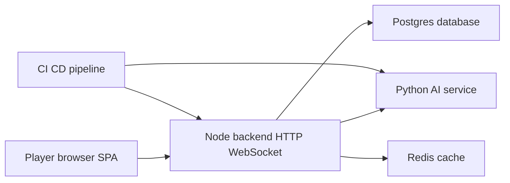

# RingRift Security & Threat Model (S-05)

> **Doc Status (2025-11-27): Active (with historical/aspirational content)**
>
> **Role:** High-level security and threat-model overview for the RingRift stack (frontend SPA, Node.js backend, Python AI service), plus the S‑05 security hardening backlog. It frames security risks, controls, and planned work across auth/session, authorization, abuse/DoS, data protection, and supply chain/CI.
>
> **Not a semantics SSoT:** This document does not define game rules or lifecycle semantics. Rules semantics are owned by the shared TypeScript rules engine under `src/shared/engine/**` plus contracts and vectors (see `RULES_CANONICAL_SPEC.md`, `RULES_ENGINE_ARCHITECTURE.md`, `RULES_IMPLEMENTATION_MAPPING.md`, `docs/RULES_ENGINE_SURFACE_AUDIT.md`). Lifecycle semantics are owned by `docs/CANONICAL_ENGINE_API.md` together with shared types/schemas in `src/shared/types/game.ts`, `src/shared/engine/orchestration/types.ts`, `src/shared/types/websocket.ts`, and `src/shared/validation/websocketSchemas.ts`.
>
> **Related docs:** `docs/SECRETS_MANAGEMENT.md`, `docs/ENVIRONMENT_VARIABLES.md`, `docs/OPERATIONS_DB.md`, `docs/DATA_LIFECYCLE_AND_PRIVACY.md` (S‑05.E details), `docs/SUPPLY_CHAIN_AND_CI_SECURITY.md` (S‑05.F details), and `DOCUMENTATION_INDEX.md`.

**Scope:** Multiplayer RingRift stack covering frontend SPA, Node.js backend (HTTP + WebSocket), and Python AI service.

This document summarizes the security threat model and hardening plan for RingRift. It aligns with:

- [`FINAL_ARCHITECT_REPORT.md`](../archive/FINAL_ARCHITECT_REPORT.md:1)
- [`CURRENT_STATE_ASSESSMENT.md`](../CURRENT_STATE_ASSESSMENT.md:1)
- [`STRATEGIC_ROADMAP.md`](../STRATEGIC_ROADMAP.md:1)

---

## 1. Threat model: scope & actors

### 1.1 Assets

- **Player identity and credentials**
  - Emails, usernames, and password hashes stored in Postgres (see [`prisma/schema.prisma`](../prisma/schema.prisma:1)).
  - Auth tokens (JWT access/refresh) used by HTTP routes in [`auth`](../src/server/routes/auth.ts:1) and WebSocket auth in [`WebSocketServer`](../src/server/websocket/server.ts:1).
- **Game state and history**
  - In-memory state and move history managed by [`GameSession`](../src/server/game/GameSession.ts:1) and [`GameEngine`](../src/server/game/GameEngine.ts:1).
  - Persisted game metadata, snapshots, and moves via Prisma (see [`docs/OPERATIONS_DB.md`](./OPERATIONS_DB.md:1)).
- **Ratings, leaderboards, and profiles**
  - Player ratings, results, and profile data handled by services such as [`RatingService`](../src/server/services/RatingService.ts:1) and shared types in [`user`](../src/shared/types/user.ts:1).
- **Infrastructure access and secrets**
  - Database and Redis credentials, JWT secrets, AI service endpoints, and other operational secrets validated by [`config`](../src/server/config.ts:1) and [`envFlags`](../src/shared/utils/envFlags.ts:1).
- **AI and rules infrastructure**
  - Python AI and rules endpoints described in [`ai-service/README.md`](../ai-service/README.md:1) and [`RULES_ENGINE_ARCHITECTURE.md`](../RULES_ENGINE_ARCHITECTURE.md:1).
- **Logs, metrics, and diagnostics**
  - Structured logs produced by [`logger`](../src/server/utils/logger.ts:1).
  - Metrics from [`rulesParityMetrics`](../src/server/utils/rulesParityMetrics.ts:1) and Python-side metrics under [`ai-service/app/metrics.py`](../ai-service/app/metrics.py:1).
  - Client error reports via [`errorReporting`](../src/client/utils/errorReporting.ts:1) and the `/api/client-errors` route in [`index`](../src/server/routes/index.ts:1).

### 1.2 Trust boundaries

- **Browser SPA ↔ backend HTTP (REST)**
  - Auth, game, and user endpoints implemented in [`auth`](../src/server/routes/auth.ts:1), [`game`](../src/server/routes/game.ts:1), and [`user`](../src/server/routes/user.ts:1).
- **Browser SPA ↔ backend WebSocket**
  - Socket.IO connection managed by [`WebSocketServer`](../src/server/websocket/server.ts:1) and consumed via [`GameContext`](../src/client/contexts/GameContext.tsx:1).
- **Backend ↔ AI / rules service**
  - Internal HTTP calls from [`AIServiceClient`](../src/server/services/AIServiceClient.ts:1) and [`PythonRulesClient`](../src/server/services/PythonRulesClient.ts:1) to the Python service.
- **Backend ↔ Postgres / Redis**
  - Prisma access in [`connection`](../src/server/database/connection.ts:1) and Redis access in [`redis`](../src/server/cache/redis.ts:1) used for caching, locks, and rate limiting.
- **CI/CD and deployment ↔ production stack**
  - GitHub Actions workflows (see [`.github/workflows/ci.yml`](../.github/workflows/ci.yml:1)) build, test, and deploy Node and Python services using Docker, as referenced in [`FINAL_ARCHITECT_REPORT.md`](../FINAL_ARCHITECT_REPORT.md:838).

### 1.3 Attacker profiles

- **Anonymous Internet client** – no account, probing HTTP and WebSocket entrypoints for misconfiguration, enumeration, brute-force, or denial of service.
- **Malicious or competitive player** – authenticated account attempting to cheat, tamper with game state, or harass other players.
- **Compromised client or device** – browser or machine with malware or XSS, allowing theft of tokens and automated actions on behalf of a legitimate user.
- **Curious or malicious insider** – developer or operator with limited infra access misusing credentials, direct DB access, or logs.
- **Automated abuse (bots and scrapers)** – scripts targeting auth, lobby, AI endpoints, or WebSocket traffic at scale.

---

## 2. Threat surfaces, controls, and gaps

This section focuses on concrete threat surfaces and maps each to existing controls and known gaps. It is consistent with the production-readiness analysis in [`FINAL_ARCHITECT_REPORT.md`](../FINAL_ARCHITECT_REPORT.md:1973) and [`CURRENT_STATE_ASSESSMENT.md`](../CURRENT_STATE_ASSESSMENT.md:18).

### 2.1 Authentication & session management

**Threats**

- Credential stuffing and password brute force against login or reset flows.
- Theft or reuse of JWT access and refresh tokens (especially in compromised browsers).
- Incomplete invalidation of sessions after logout, password change, or account compromise.
- Misconfiguration of JWT secrets or token lifetimes in production.

**Existing controls**

- Auth endpoints in [`auth`](../src/server/routes/auth.ts:1) implement registration, login, refresh, logout, email verification, and password reset using bcrypt password hashing.
- Redis-backed rate limiting and login abuse protection via [`rateLimiter`](../src/server/middleware/rateLimiter.ts:1) and auth-specific limiters.
- Account lockout logic and tests are in place to throttle repeated failed login attempts (see [`auth`](../src/server/routes/auth.ts:1) and associated test suites referenced from [`CURRENT_STATE_ASSESSMENT.md`](../CURRENT_STATE_ASSESSMENT.md:37)).
- JWT secrets, token lifetimes, and env configuration are validated by [`config`](../src/server/config.ts:1) and [`envFlags`](../src/shared/utils/envFlags.ts:1), which reject placeholder secrets in production.
- WebSocket authentication in [`WebSocketServer`](../src/server/websocket/server.ts:1) validates JWTs and user status before allowing game joins.
- Client-side token handling is centralized in [`AuthContext`](../src/client/contexts/AuthContext.tsx:1).

**Gaps / risks**

- Refresh-token lifecycle and rotation semantics are not yet captured in a single, documented policy (for example, rotation on every use and revocation on password change or account lock).
- Tokens are accessible to JavaScript in the browser; if XSS is introduced, exfiltration of long-lived tokens becomes straightforward.
- Suspicious-auth pattern visibility (for example, anomalous geo/IP activity or clustered failed logins) relies primarily on logs rather than explicit metrics or dashboards.
- Emergency procedures for forced logout and JWT secret rotation are not yet summarized in operator-facing documentation.

### 2.2 Authorization & game access control

**Threats**

- Joining, observing, or acting in games a user does not own or participate in (horizontal escalation across game IDs or user IDs).
- Spectators viewing hidden information that should only be visible to active players.
- Manipulating ratings, match results, or leaderboards via unguarded endpoints or events.

**Existing controls**

- HTTP routes in [`game`](../src/server/routes/game.ts:1) enforce auth and ownership checks for creating, listing, joining, and leaving games.
- WebSocket handlers in [`WebSocketServer`](../src/server/websocket/server.ts:1) validate `join_game`, `leave_game`, `player_move`, and `player_choice_response` against the authenticated user and game membership.
- Game-level authorization helpers in [`GameSession`](../src/server/game/GameSession.ts:1) and [`GameSessionManager`](../src/server/game/GameSessionManager.ts:1) gate access to in-memory sessions.
- Rating and matchmaking flows are wired through authenticated APIs and services such as [`RatingService`](../src/server/services/RatingService.ts:1) and [`MatchmakingService`](../src/server/services/MatchmakingService.ts:1).

**Gaps / risks**

- Spectator-mode semantics and enforcement are still evolving; strict guarantees about what spectators may see versus active players are not yet fully codified in a single contract.
- There is no concise, auditable matrix today of all game-related HTTP endpoints and WebSocket events with their required authorization conditions.
- Future rating or leaderboard APIs could be implemented without a shared checklist that requires replay-backed result verification and strict authZ checks.

### 2.3 Input validation & injection

**Threats**

- SQL injection or query-manipulation attempts via crafted HTTP or WebSocket payloads.
- Command injection or unsafe deserialization in Node or Python components.
- Rules bypass or data corruption via malformed WebSocket messages or HTTP bodies.

**Existing controls**

- Strong runtime validation for WebSocket events via [`WebSocketPayloadSchemas`](../src/shared/validation/websocketSchemas.ts:1) using Zod.
- Prisma ORM usage in [`connection`](../src/server/database/connection.ts:1) avoids manual SQL string building in most paths.
- Shared domain types in [`game`](../src/shared/types/game.ts:1) and [`user`](../src/shared/types/user.ts:1) constrain in-process data structures.
- The Python AI service validates request bodies via Pydantic models as documented in [`ai-service/README.md`](../ai-service/README.md:1).
- Centralized HTTP error handling in [`errorHandler`](../src/server/middleware/errorHandler.ts:1) ensures internal exceptions are not surfaced directly to clients.

**Gaps / risks**

- Some HTTP routes still rely mainly on TypeScript types and Express parsing rather than explicit Zod schemas or equivalent runtime validation for all inputs (including headers and query parameters).
- AI-service input constraints (for example, payload size limits and concurrency expectations) are not yet called out explicitly in security-facing documentation.
- Log messages may occasionally include raw payloads for debugging, risking both log injection and accidental capture of sensitive fields if not carefully scrubbed.

### 2.4 Abuse, spam, and denial of service

**Threats**

- High-rate login, registration, or reset attempts from individual IPs or networks.
- Lobby or game-creation spam generating large numbers of idle or abusive games.
- Chat or message flooding when in-game chat and social features are expanded.
- Compute exhaustion through AI-heavy games or large numbers of simultaneous AI move requests.

**Existing controls**

- Redis-backed rate limiting middleware in [`rateLimiter`](../src/server/middleware/rateLimiter.ts:1) protects key HTTP entrypoints, especially auth.
- AI timeouts, structured AI errors, and fallbacks in [`AIServiceClient`](../src/server/services/AIServiceClient.ts:1) and [`PythonRulesClient`](../src/server/services/PythonRulesClient.ts:1) ensure AI failures do not stall games.
- Error mapping and fallback behaviours for AI/DB failures are centralized in [`errorHandler`](../src/server/middleware/errorHandler.ts:1) and in `maybePerformAITurn` flows in [`GameSession`](../src/server/game/GameSession.ts:1).
- Redis-backed locks and safety checks in [`redis`](../src/server/cache/redis.ts:1), [`GameSessionManager`](../src/server/game/GameSessionManager.ts:1), and topology flags in [`envFlags`](../src/shared/utils/envFlags.ts:1) reduce the risk of concurrency issues in multi-instance deployments.

**Gaps / risks**

- There is no uniform, documented policy yet for per-account and per-IP quotas on game creation, join attempts, or chat messages; existing rate limiting focuses primarily on HTTP auth.
- Backpressure strategies during sustained AI or DB stress (for example, temporarily rejecting new AI-heavy games or falling back to heuristic-only AI modes) are not yet formalized.
- Abuse-detection metrics (for example, repeated failed joins, extreme reconnect churn, or unusually high AI failure rates) are not yet highlighted as first-class observability signals.

### 2.5 Data protection & privacy

**Threats**

- Leakage of PII (emails, usernames, IP addresses) through logs, metrics, or verbose error messages.
- Unbounded retention of detailed game logs, move histories, or chat content without clear policies.
- Inability to satisfy potential future data export or deletion requests (for example, GDPR or CCPA).

**Existing controls**

- Separation of configuration and secrets into env files validated by [`config`](../src/server/config.ts:1) and documented in [`.env.example`](../.env.example:1).
- Database migration and backup/restore workflows are described in [`docs/OPERATIONS_DB.md`](./OPERATIONS_DB.md:1).
- Structured logging via [`logger`](../src/server/utils/logger.ts:1) and strongly typed client-error reporting via [`errorReporting`](../src/client/utils/errorReporting.ts:1) reduce the need for ad-hoc `console.log` of sensitive values.
- Operator-facing drills for critical secrets and backups now exist as:
  - [`docs/runbooks/SECRETS_ROTATION_DRILL.md`](./runbooks/SECRETS_ROTATION_DRILL.md) – JWT and database credential rotation drill for staging/non-production.
  - [`docs/runbooks/DATABASE_BACKUP_AND_RESTORE_DRILL.md`](./runbooks/DATABASE_BACKUP_AND_RESTORE_DRILL.md) – non-destructive Postgres backup/restore drill using a separate restore database.

**Gaps / risks**

- No explicit data-retention policy yet for logs, metrics, replays, or chat; retention defaults are effectively controlled only by infra configuration.
- No documented user-facing workflow for account deletion or data export, nor an internal checklist of which records must be removed or anonymized.
- Log and metric schemas have not been reviewed systematically for privacy, making it harder to guarantee that PII does not appear in long-lived telemetry stores.

### 2.6 Supply chain & CI/CD

**Threats**

- Dependency compromise via npm or PyPI packages used by the backend or AI service.
- Exposure or misuse of CI secrets and deployment credentials.
- Deployment of unreviewed or insufficiently tested code to production.
- Tampering with Docker images or build artifacts between CI and runtime.

**Existing controls**

- Dependency audits and security scanning (for example, `npm audit` and Snyk) are part of CI as summarized in [`FINAL_ARCHITECT_REPORT.md`](../FINAL_ARCHITECT_REPORT.md:839).
- Python dependencies are pinned in [`ai-service/requirements.txt`](../ai-service/requirements.txt:1), reducing the risk of surprise upstream changes.
- CI workflows under [`.github/workflows`](../.github/workflows/ci.yml:1) build and test both Node and Python components before deployment.
- Docker-based deployment model and a small number of images simplify provenance and rollback.

**Gaps / risks**

- Secret-management practices (for example, rotation, use of a dedicated secret store, and access policies) are not yet fully captured in repository-facing documentation.
- Code-review requirements, protected-branch settings, and release-approval workflows are not described in the docs even if they exist in hosting configuration.
- Image signing, SBOM generation, and automated verification are not yet first-class parts of the pipeline.

---

## 3. S-05 security hardening backlog

The following items define a focused S-05 security backlog. Each item is intentionally high-level so it can be implemented and refined in future code-mode tasks.

### S-05.A – Auth & token lifecycle hardening

- **Goal:** Define and implement a clear lifecycle for access and refresh tokens, including rotation and revocation semantics that work consistently across HTTP and WebSocket flows.
- **Scope:** Backend, frontend, tests, and docs (notably [`auth`](../src/server/routes/auth.ts:1), [`AuthContext`](../src/client/contexts/AuthContext.tsx:1), [`WebSocketServer`](../src/server/websocket/server.ts:1), and [`config`](../src/server/config.ts:1)).
- **Risk level:** High – Directly affects resistance to account takeover and incident response readiness.
- **Dependencies:** Builds on existing rate limiting and lockout logic documented in [`CURRENT_STATE_ASSESSMENT.md`](../CURRENT_STATE_ASSESSMENT.md:37) and complements other auth/Z hardening tasks in the roadmap.

Key directions:

- Specify rotation behaviour for refresh tokens (for example, rotate on each use, keep a sliding window of valid tokens per account).
- Define how global logout and password change affect outstanding tokens and active WebSocket sessions.
- Extend tests to cover compromised-token scenarios and confirm revocation is enforced consistently across all entrypoints.

### S-05.B – Game-session and spectator authorization review

- **Goal:** Make game access rules explicit and verifiable for all HTTP endpoints and WebSocket events, including future spectator and rating features.
- **Scope:** Backend and tests around [`game`](../src/server/routes/game.ts:1), [`WebSocketServer`](../src/server/websocket/server.ts:1), [`GameSession`](../src/server/game/GameSession.ts:1), and related services such as [`RatingService`](../src/server/services/RatingService.ts:1).
- **Risk level:** High – Authorization errors can expose hidden information or allow manipulation of other players’ games and ratings.
- **Dependencies:** Builds on the current multiplayer lifecycle and session-management design in [`archive/FINAL_ARCHITECT_REPORT.md`](../archive/FINAL_ARCHITECT_REPORT.md:1632).

Key directions:

- Produce a compact matrix mapping each game-related HTTP route and WebSocket event to its required authorization checks (for example, participant, owner, spectator, or admin).
- Tighten or add checks where the matrix reveals implicit or undocumented assumptions, especially for emerging spectator flows.
- Add regression tests to prevent unauthorized viewing or modification of game state and rating-related data.

### S-05.C – Abuse, quotas, and backpressure

- **Goal:** Evolve from ad-hoc rate limiting to a documented, coherent abuse-prevention strategy across auth, lobby, games, chat, and AI usage.
- **Scope:** Backend, infra, tests, and docs (centred on [`rateLimiter`](../src/server/middleware/rateLimiter.ts:1), [`game`](../src/server/routes/game.ts:1), and AI integration code paths).
- **Risk level:** High – Without coherent quotas and backpressure, small numbers of malicious or buggy clients can degrade the overall service.
- **Dependencies:** Align with performance and scalability targets in the P-01 section of [`STRATEGIC_ROADMAP.md`](../STRATEGIC_ROADMAP.md:155).

Key directions:

- Define per-account and per-IP quotas for game creation, join attempts, and chat messages, along with reasonable defaults for early production.
- Introduce coarse-grained backpressure modes for sustained AI or DB stress, such as temporarily disabling AI-vs-AI games or capping concurrent AI moves per node.
- Surface quota and abuse metrics explicitly via [`rulesParityMetrics`](../src/server/utils/rulesParityMetrics.ts:1) or companion metrics, suitable for alerts and dashboards.

### S-05.D – Validation coverage & logging hygiene

- **Goal:** Ensure every external input path is validated and that logs avoid leaking secrets or unnecessary PII.
- **Scope:** Backend and AI service endpoints, shared schemas such as [`WebSocketPayloadSchemas`](../src/shared/validation/websocketSchemas.ts:1), and logging utilities like [`logger`](../src/server/utils/logger.ts:1).
- **Risk level:** Medium – Current controls are strong, but gaps can emerge as the feature set grows.
- **Dependencies:** Builds on the existing error-handling and validation design in [`errorHandler`](../src/server/middleware/errorHandler.ts:1) and [`ai-service/README.md`](../ai-service/README.md:1).

Key directions:

- Audit all HTTP handlers and WebSocket events to confirm they are fronted by Zod schemas or equivalent runtime validation, including headers and query parameters where relevant.
- Standardize logging patterns to avoid including raw request bodies, auth tokens, or secrets in logs by default.
- Add tests or static checks where practical to guard against reintroducing sensitive fields into long-lived logs.

### S-05.E – Data retention, privacy, and user data workflows

- **Goal:** Establish pragmatic policies for how long user and game data are retained and how user data can be deleted or exported if needed.
- **Scope:** Backend, DB schema and migrations, and operator documentation such as [`docs/OPERATIONS_DB.md`](./OPERATIONS_DB.md:1).
- **Risk level:** Medium – Important for future regulatory alignment and for limiting the impact of potential data leaks.
- **Dependencies:** Builds on current backup/restore and migration guidance in [`archive/FINAL_ARCHITECT_REPORT.md`](../archive/FINAL_ARCHITECT_REPORT.md:267).
- **Design details:** The concrete data inventory, retention/anonymisation rules, and user data workflows for S‑05.E are defined in [`docs/DATA_LIFECYCLE_AND_PRIVACY.md`](./DATA_LIFECYCLE_AND_PRIVACY.md:1).

Key directions:

- Define retention expectations for structured logs, metrics, replays, and chat, and reflect those expectations in infra configuration and runbooks.
- Design a minimal viable account-deletion and data-export workflow that can be implemented incrementally without overhauling the schema.
- Document which tables and fields are considered sensitive or PII and how they should be handled in backups, analytics datasets, and exports.

### S-05.F – Supply chain & CI/CD safeguards

- **Goal:** Reduce supply-chain risk and make CI/CD guarantees about what code and images reach production explicit.
- **Scope:** CI workflows under [`.github/workflows`](../.github/workflows/ci.yml:1), Docker build pipeline, and contributor documentation.
- **Risk level:** Medium – Becomes more important as the player base and contributor count grow.
- **Dependencies:** Builds on existing CI practices and security scanning noted in [`archive/FINAL_ARCHITECT_REPORT.md`](../archive/FINAL_ARCHITECT_REPORT.md:838).
- **Design details:** The supply-chain & CI/CD threat overview, current controls/gaps, and S‑05.F.x implementation tracks are defined in [`docs/SUPPLY_CHAIN_AND_CI_SECURITY.md`](./SUPPLY_CHAIN_AND_CI_SECURITY.md:1).

Key directions:

- Document minimal code-review and protected-branch expectations for changes that can reach production.
- Clarify how deployment credentials and runtime secrets are stored and rotated (for example, cloud secret stores vs. CI variables).
- Evaluate adding SBOM generation and optional image-signing to the build pipeline, even if enforcement is deferred to a later phase.

---

This S-05 threat model is intended as a living document. As new features such as chat persistence, replays, or expanded social systems are implemented, these threat surfaces and backlog items should be revisited and updated to keep RingRift’s security posture aligned with its architecture and scale.
