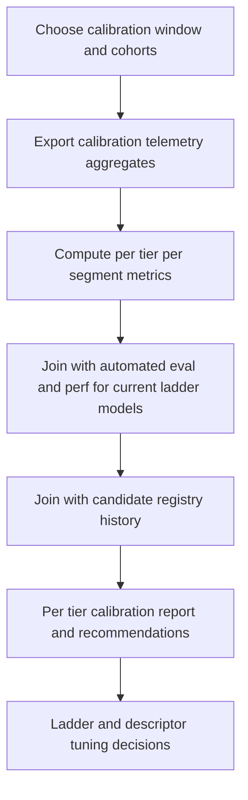

# AI Difficulty Calibration Analysis and Ladder Tuning (Square-8 2-Player)

> **Doc status (2025-12-05): New – H-AI-13 design.**  
> **Role:** Define a repeatable, data-driven analysis process that joins **calibration telemetry**, **automated tier evaluation**, and the **tier candidate registry** to produce concrete tuning recommendations for the Square-8 2-player ladder tiers D2 / D4 / D6 / D8.

This document complements:

- Human calibration guide: [`AI_HUMAN_CALIBRATION_GUIDE.md`](AI_HUMAN_CALIBRATION_GUIDE.md:1)
- Training and promotion pipeline: [`AI_TIER_TRAINING_AND_PROMOTION_PIPELINE.md`](AI_TIER_TRAINING_AND_PROMOTION_PIPELINE.md:1)
- Tier performance budgets: [`AI_TIER_PERF_BUDGETS.md`](AI_TIER_PERF_BUDGETS.md:1)
- Tier training orchestration: [`run_tier_training_pipeline.py`](../../ai-service/scripts/run_tier_training_pipeline.py:1)
- Full gating wrapper: [`run_full_tier_gating.py`](../../ai-service/scripts/run_full_tier_gating.py:1)
- Promotion-plan applier and registry helpers: [`python.tier_promotion_registry`](../../ai-service/app/training/tier_promotion_registry.py:1), [`apply_tier_promotion_plan.py`](../../ai-service/scripts/apply_tier_promotion_plan.py:1)

It is **analysis/process-level only**. No ladder configs, models, or UI are changed directly here.

## For step-by-step operational instructions on running a calibration cycle, see [`AI_CALIBRATION_RUNBOOK.md`](AI_CALIBRATION_RUNBOOK.md:1).

## 1. Scope and Objectives

### 1.1 Scope

- Board: `square8` (8×8 compact ruleset)
- Players: 2
- Ladder difficulties: **D2, D4, D6, D8** (logical difficulties 2, 4, 6, 8)
- AI families and current intended strength ordering are as in [`AI_TIER_TRAINING_AND_PROMOTION_PIPELINE.md`](AI_TIER_TRAINING_AND_PROMOTION_PIPELINE.md:39)

### 1.2 Objectives

For each tier D2 / D4 / D6 / D8:

1. Combine **human-facing calibration signals** (win rates and perceived difficulty) with:
   - Automated AI-vs-AI evaluation and gating results
   - Performance budget checks
   - Tier candidate registry entries
2. Decide whether the tier is:
   - **Within target band** (no action)
   - **Slightly too easy / too hard** (monitor and queue minor tuning)
   - **Clearly mis-tuned** (plan concrete ladder or model changes)
3. Produce an **explicit calibration report artefact** that downstream tools (e.g. a future [`python.analyze_difficulty_calibration.py`](../../ai-service/scripts/analyze_difficulty_calibration.py:1) script) can generate and CI or reviewers can read.

This loop sits between model training/gating (H-AI-9/10/11) and UX-facing difficulty descriptors.

---

## 2. Data Sources

### 2.1 Calibration Telemetry

**Event schema and wiring**

- Shared event payload: [`difficultyCalibrationEvents.ts`](../../src/shared/telemetry/difficultyCalibrationEvents.ts:1)
- Client helper: [`difficultyCalibrationTelemetry.ts`](../../src/client/utils/difficultyCalibrationTelemetry.ts:1)
- Server route: [`difficultyCalibrationTelemetry.ts`](../../src/server/routes/difficultyCalibrationTelemetry.ts:1)
- Metrics sink: [`typescript.MetricsService.recordDifficultyCalibrationEvent`](../../src/server/services/MetricsService.ts:1292)

When a player opts into calibration mode:

- The client emits:
  - `difficulty_calibration_game_started`
  - `difficulty_calibration_game_completed` with payload fields including:
    - `board_type`
    - `num_players`
    - `difficulty`
    - `result` (win / loss / draw / abandoned)
    - `movesPlayed`
    - `perceivedDifficulty` (1–5)
    - `isCalibrationOptIn=true`
- The server increments a counter such as:

```text
ringrift_difficulty_calibration_events_total{
  type,          // started / completed
  board_type,    // e.g. square8
  num_players,   // 2
  difficulty,    // 2,4,6,8
  result         // win / loss / draw / abandoned (for completed)
}
```

Exact label set is defined in [`AI_TIER_TRAINING_AND_PROMOTION_PIPELINE.md`](AI_TIER_TRAINING_AND_PROMOTION_PIPELINE.md:442) and the metrics module.

**Expected storage and access**

- Short-term Prometheus-compatible metrics (for quick aggregates)
- Longer-term log or warehouse export keyed by:
  - `board_type`, `num_players`, `difficulty`
  - Optional `player_profile` (e.g. new / intermediate / strong) when available
  - Timestamp and anonymised `session_id`

**Calibration analysis inputs**

For each `(board_type, num_players, difficulty)` triple (constrained here to `square8`, `2`, `{2,4,6,8}`) and per player segment, we need:

- `n_calibration_games`
- `human_win_rate` (fraction of `result="win"`)
- Empirical distribution of `perceivedDifficulty` (1–5)
- Optionally:
  - `median_game_length_moves`
  - `fraction_abandoned` (abandoned or disconnected)

These can be exported as CSV or Parquet from Prometheus or a log pipeline for offline analysis.

---

### 2.2 Automated Evaluation, Gating, and Perf

Core building blocks (see [`AI_TIER_TRAINING_AND_PROMOTION_PIPELINE.md`](AI_TIER_TRAINING_AND_PROMOTION_PIPELINE.md:96)):

- Tier evaluation configs: [`python.TIER_EVAL_CONFIGS`](../../ai-service/app/training/tier_eval_config.py:53)
- Evaluation runner returning `TierEvaluationResult`: [`python.run_tier_evaluation`](../../ai-service/app/training/tier_eval_runner.py:319)
- Tier gating CLI: [`run_tier_gate.py`](../../ai-service/scripts/run_tier_gate.py:1)
- Combined gating + perf wrapper: [`run_full_tier_gating.py`](../../ai-service/scripts/run_full_tier_gating.py:1)
- Perf budgets and harness:
  - [`python.TIER_PERF_BUDGETS`](../../ai-service/app/config/perf_budgets.py:101)
  - [`python.run_tier_perf_benchmark`](../../ai-service/app/training/tier_perf_benchmark.py:84)

**Run directory layout**

A standard Square-8 2p tier training + gating cycle uses:

1. Train candidate (stub or real) via [`python.main()`](../../ai-service/scripts/run_tier_training_pipeline.py:373):
   - Run dir example:
     - `ai-service/logs/tier_training/sq8_2p/D4/2025-12-05T14-15-00Z/`
   - Key artefacts:
     - `training_report.json`
     - `status.json` (training block initialised; gating/perf/human_calibration stubbed)

2. Gate candidate via [`python.main()`](../../ai-service/scripts/run_full_tier_gating.py:291) pointing at that run dir:
   - Additional artefacts in the same `--run-dir`:
     - `tier_eval_result.json` – `TierEvaluationResult` payload
     - `promotion_plan.json` – difficulty-tier promotion decision
     - `tier_perf_report.json` – perf metrics and budget evaluation, when applicable
     - `gate_report.json` – combined summary
     - Updated `status.json` (automated_gate and perf blocks marked `completed`)

**Calibration analysis needs from these artefacts**

Per tier T ∈ {D2, D4, D6, D8}, for the **current ladder model**:

- From `tier_eval_result.json`:
  - `overall_pass`
  - Per-opponent win rates (especially vs baseline and previous tier)
  - Number of games and confidence ranges if available
- From `promotion_plan.json`:
  - `current_model_id`
  - `candidate_model_id`
  - `decision` and `reason.overall_pass`
- From `tier_perf_report.json` (if exists for that tier):
  - `metrics.average_ms`
  - `metrics.p95_ms`
  - `budget.max_avg_move_ms`
  - `budget.max_p95_move_ms`
  - `evaluation.overall_pass`

These values allow calibration analysis to distinguish between:

- “Calibrated but **underpowered** vs intended band”
- “Calibrated but **overpowered** vs intended band”
- “Suspect human data because automated gate/perf are weak”

---

### 2.3 Tier Candidate Registry

Registry helpers: [`python.tier_promotion_registry`](../../ai-service/app/training/tier_promotion_registry.py:1)

- Default Square-8 2p registry path:
  - [`python.DEFAULT_SQUARE8_2P_REGISTRY_PATH`](../../ai-service/app/training/tier_promotion_registry.py:15)  
    → `ai-service/config/tier_candidate_registry.square8_2p.json`

- Loader and saver:
  - [`python.load_square8_two_player_registry()`](../../ai-service/app/training/tier_promotion_registry.py:29)
  - [`python.save_square8_two_player_registry()`](../../ai-service/app/training/tier_promotion_registry.py:46)

- Registry update from a promotion plan:
  - [`python.update_square8_two_player_registry_for_run()`](../../ai-service/app/training/tier_promotion_registry.py:196)
  - [`python.record_promotion_plan()`](../../ai-service/app/training/tier_promotion_registry.py:113)

**Expected registry shape (conceptual)**

```json
{
  "board": "square8",
  "num_players": 2,
  "tiers": {
    "D4": {
      "current": {
        "tier": "D4",
        "difficulty": 4,
        "board": "square8",
        "board_type": "square8",
        "num_players": 2,
        "model_id": "v1-minimax-4",
        "heuristic_profile_id": "heuristic_v1_2p",
        "ai_type": "MINIMAX",
        "ladder_source": "app.config.ladder_config._build_default_square8_two_player_configs"
      },
      "candidates": [
        {
          "candidate_id": "sq8_2p_d4_cand_20251205_141500",
          "candidate_model_id": "sq8_2p_d4_cand_20251205_141500",
          "tier": "D4",
          "board": "square8",
          "num_players": 2,
          "source_run_dir": "logs/tier_training/sq8_2p/D4/2025-12-05T14-15-00Z",
          "training_report": "training_report.json",
          "gate_report": "gate_report.json",
          "promotion_plan": "promotion_plan.json",
          "model_id": "sq8_2p_d4_cand_20251205_141500",
          "heuristic_profile_id": "heuristic_v1_2p",
          "status": "gated_promote"
        }
      ]
    }
  }
}
```

Calibration analysis will typically inspect:

- `tiers[D*]["current"]` – the model actually live on the ladder
- Recent `candidates` entries with `status ∈ {gated_promote, gated_reject}` for historical context

---

### 2.4 Human Feedback Outside Calibration Telemetry

In addition to in-client calibration telemetry, the process should consider:

- Structured playtests following templates A/B/C in [`AI_HUMAN_CALIBRATION_GUIDE.md`](AI_HUMAN_CALIBRATION_GUIDE.md:137)
- External or invited-tester surveys capturing:
  - Self-reported skill levels
  - Free-text difficulty comments per tier
- Bug reports / support tickets tagged as:
  - “AI too weak / too strong”
  - “Difficulty label misleading”
  - “Calibration mode confusing”

These sources will usually live in external systems (issue tracker, docs, survey tools) and be summarised qualitatively into the calibration report.

---

## 3. Per-Tier Calibration Metrics and Targets

### 3.1 Player Segments

Following [`AI_HUMAN_CALIBRATION_GUIDE.md`](AI_HUMAN_CALIBRATION_GUIDE.md:75) and its templates, we distinguish:

- **New** – first-time or early RingRift players (Template A)
- **Intermediate** – comfortable with D2 and basic tactics, strong casual strategists (Template B)
- **Strong** – strong club-level or very strong abstract players (Template C)

For telemetry, these may be approximated (e.g. via MMR bands or questionnaire), but the analysis design assumes that a boolean `isCalibrationOptIn` and a coarse `player_profile` are available or can be derived for calibration cohorts.

### 3.2 Target Bands (Summary)

Restating the informal targets from [`AI_HUMAN_CALIBRATION_GUIDE.md`](AI_HUMAN_CALIBRATION_GUIDE.md:75):

| Tier | Intended segment     | Target human win rate band (for intended segment) | Too easy (data)                                                          | Too hard (data)                                                     |
| ---- | -------------------- | ------------------------------------------------- | ------------------------------------------------------------------------ | ------------------------------------------------------------------- |
| D2   | New                  | New players should win at least 1 in 3–5 games    | New players win > 80% with perceived difficulty mostly 1–2               | New players win < 10–20%; many 4–5 ratings                          |
| D4   | Intermediate         | 30–70% over 5–10 games                            | Intermediate win rate > 75–80%; strong players crush it and call it easy | Intermediate win rate < 20–25%; many 4–5 ratings                    |
| D6   | Strong               | 40–60% over 10+ games (strong segment)            | Strong players > 70–75% with many 1–2 ratings                            | Strong players < 25–30%; intermediates never win and rate 4–5       |
| D8   | Very strong / expert | Strong players rarely exceed 60%                  | Strong players consistently > 60–65% and say “too easy”                  | Even strong players < 20–25%, intermediates essentially 0% win rate |

The analysis formalises these descriptive ranges into **discrepancy metrics**.

### 3.3 Calibration Metrics

For each tier T and player segment S in a chosen time window:

- `n_games_T_S` – calibration games completed
- `human_win_rate_T_S` – fraction of games where the human wins
- `difficulty_mean_T_S`, `difficulty_median_T_S` – from `perceivedDifficulty` 1–5
- `difficulty_tail_low_T_S` – fraction of games with `perceivedDifficulty ∈ {1,2}`
- `difficulty_tail_high_T_S` – fraction with `perceivedDifficulty ∈ {4,5}`

Derived discrepancy indicators:

- `win_rate_delta_T_S` vs the mid-point of the target band
- `too_easy_flag_T_S` when:
  - `human_win_rate_T_S` above upper band threshold **and**
  - `difficulty_tail_low_T_S` high (sustained 1–2 ratings)
- `too_hard_flag_T_S` when:
  - `human_win_rate_T_S` below lower band threshold **and**
  - `difficulty_tail_high_T_S` high (sustained 4–5 ratings)

**Sample-size guardrails**

To avoid overreacting:

- Treat `(T, S)` as **inconclusive** when `n_games_T_S < 30`
- Apply full decision rules only when:
  - `n_games_T_S ≥ 50` for D2 / D4
  - `n_games_T_S ≥ 30` for D6 / D8 (strong segment is smaller)
- Use small samples only to detect egregious issues (e.g. win rate ≈ 0% or 100%)

---

## 4. Calibration Cycle Workflow

This section defines a **single calibration cycle** – typically run after one or more promotion cycles, once sufficient calibration data has accumulated.

### 4.1 High-Level Flow



### 4.2 Step 1 – Choose Window and Cohorts

- **Time window:** typically last **28 days** or “since last calibration cycle”
- **Filter:**
  - `board_type = square8`
  - `num_players = 2`
  - `difficulty ∈ {2,4,6,8}`
  - `isCalibrationOptIn = true`
- **Segmentation:**
  - Player segment S ∈ {new, intermediate, strong}
  - Optional further breakdown (ranked vs casual, online vs local)

### 4.3 Step 2 – Export Calibration Metrics

Conceptually, a future [`python.analyze_difficulty_calibration.py`](../../ai-service/scripts/analyze_difficulty_calibration.py:1) script will:

1. Query Prometheus or a warehouse and write a CSV/Parquet with rows like:

   ```text
   board_type, num_players, difficulty, player_profile, n_games,
   human_win_rate, difficulty_mean, difficulty_p25, difficulty_p50,
   difficulty_p75, difficulty_tail_low, difficulty_tail_high
   ```

2. Optionally enrich with game-length and abandon rates.

Tooling can be abstract (PromQL, SQL-over-logs, or offline aggregation jobs); this document only constrains the **shape** of the exported aggregates.

### 4.4 Step 3 – Join with Automated Evaluation and Perf

For each Square-8 2p tier T:

1. Resolve the current ladder assignment via the registry:
   - Load registry with [`python.load_square8_two_player_registry()`](../../ai-service/app/training/tier_promotion_registry.py:29)
   - Read `tiers[T]["current"]` to obtain:
     - `model_id`, `heuristic_profile_id`, `ai_type`, `difficulty`

2. Locate the most recent **successful gating run** for that model:
   - For each candidate in `tiers[T]["candidates"]` with `status="gated_promote"` and `model_id` matching the current ladder model:
     - Use `source_run_dir` and its:
       - `gate_report.json`
       - `tier_eval_result.json`
       - `tier_perf_report.json` (if present)

3. Extract key metrics per tier:
   - From `tier_eval_result.json`:
     - `overall_pass`
     - `win_rate_vs_baseline`
     - `win_rate_vs_previous_tier`
     - Game counts per opponent
   - From `tier_perf_report.json` (if exists):
     - `average_ms`, `p95_ms`
     - `within_avg`, `within_p95`, `overall_pass`

The calibration analysis treats these as **hard constraints**: no recommendation may violate gating or perf invariants.

### 4.5 Step 4 – Build Per-Tier Calibration Table

For each tier T, construct an internal table row like:

```text
tier: "D4"
ladder:
  ai_type: "MINIMAX"
  model_id: "v1-minimax-4"
  heuristic_profile_id: "heuristic_v1_2p"
gating:
  overall_pass: true
  win_rate_vs_baseline: 0.78
  win_rate_vs_previous_tier: 0.60
perf:
  overall_pass: true
  average_ms: 450
  p95_ms: 800
calibration:
  segments:
    new:
      n_games: 120
      human_win_rate: 0.85
      difficulty_mean: 1.9
      flags: { too_easy: true, too_hard: false }
    intermediate:
      n_games: 90
      human_win_rate: 0.72
      difficulty_mean: 2.4
      flags: { too_easy: true, too_hard: false }
    strong:
      n_games: 20
      human_win_rate: 0.64
      difficulty_mean: 2.8
      flags: { too_easy: (inconclusive, low n) }
discrepancy_summary:
  status: "too_easy_for_intended_segment"
  notes:
    - "Intermediates cluster above 70% win rate with difficulty_mean <= 2.5"
    - "Automated gate and perf are fine; consider switching to stronger candidate or remapping ladder tiers."
```

### 4.6 Step 5 – Emit Calibration Report Artefacts

For each cycle, write:

1. **Machine-readable JSON summary**
   - Suggested path:
     - `ai-service/logs/difficulty_calibration/square8_2p/CALIB_YYYYMMDD.json`

   - Contains:
     - Metadata (`window_start`, `window_end`, `board_type`, `num_players`)
     - Per-tier calibration rows as above

2. **Human-readable Markdown report**
   - Suggested path:
     - `docs/ai/calibration_runs/CALIB_YYYYMMDD_square8_2p.md`

   - Should include:
     - A table summarising, per tier:
       - Ladder model id and type
       - Automated gate and perf status
       - Human win-rate bands by segment
       - Qualitative discrepancy classification and notes
     - Links back to the JSON summary and relevant training/gating run dirs

This doc (`AI_DIFFICULTY_CALIBRATION_ANALYSIS.md`) is the contract for that report format; Code-mode tasks should align implementation with these shapes.

---

## 5. Tuning Levers and Decision Rules

### 5.1 Allowed Tuning Levers

For each Square-8 2p tier T:

1. **Model selection within tier T**
   - Promote or roll back a candidate model at fixed difficulty T using:
     - The full H-AI-9 pipeline and promotion helpers:
       - [`run_tier_training_pipeline.py`](../../ai-service/scripts/run_tier_training_pipeline.py:1)
       - [`run_full_tier_gating.py`](../../ai-service/scripts/run_full_tier_gating.py:1)
       - [`apply_tier_promotion_plan.py`](../../ai-service/scripts/apply_tier_promotion_plan.py:1)
   - This preserves ladder difficulty numbers and UI labels; only the underlying engine profile changes.

2. **Search budget / think-time adjustments**
   - Adjust `think_time_ms` or search parameters for a tier, **within performance budgets** defined in:
     - [`AI_TIER_PERF_BUDGETS.md`](AI_TIER_PERF_BUDGETS.md:1)
     - [`python.TIER_PERF_BUDGETS`](../../ai-service/app/config/perf_budgets.py:101)
   - Any increase beyond current perf budgets must be:
     - Explicitly justified (e.g. D8 is allowed to be slower)
     - Accompanied by a coordinated budget update and new perf benchmarks

3. **Ladder remapping between tiers**
   - Map a model calibrated at nominal difficulty Dn to a different **surfaced** tier in the client, e.g.:
     - Promote a strong D4-calibrated model to serve D5 or D6, using interpolation tiers as UX bridges.
   - This is primarily a **UX mapping** decision; the underlying ladder config for D2/D4/D6/D8 remains the canonical ordering.

4. **Difficulty descriptor updates (documentation / UX only)**
   - Adjust the textual difficulty descriptions and recommendations in docs and UX specs, not in code here, based on sustained human feedback.
   - Implementation would touch docs and UX-layer files such as:
     - Difficulty description helpers in the client
     - Public-facing difficulty guidance

### 5.2 Guardrails

1. **Do not violate automated gating or perf**
   - A candidate must pass:
     - Difficulty gate (`overall_pass=true` in `tier_eval_result.json`)
     - Perf budget (where defined) with `overall_pass=true` in `tier_perf_report.json`
   - Calibration analysis may recommend **not** promoting a passing candidate (e.g. if it is too strong for human targets), but it may never recommend promoting a failing one.

2. **Maintain tier ordering and non-regression**
   - In terms of strength: **D2 < D4 < D6 < D8** for Square-8 2p
   - No new Dn should be substantially weaker than the previous production Dn (see [`AI_TIER_TRAINING_AND_PROMOTION_PIPELINE.md`](AI_TIER_TRAINING_AND_PROMOTION_PIPELINE.md:339))

3. **Respect perf budgets as UX guardrails**
   - D4 / D6 / D8 must respect the budgets in [`AI_TIER_PERF_BUDGETS.md`](AI_TIER_PERF_BUDGETS.md:14)
   - Any recommendation to increase strength via deeper search must either:
     - Stay within existing budgets, or
     - Propose an explicit budget change with UX justification (e.g. “accept slower D8 turns for a clearly stronger expert tier”)

4. **Avoid overreacting to small samples**
   - No ladder remapping or major model changes based solely on `n_games_T_S < 30`
   - For large shifts (e.g. D4 is moved closer to D6), require:
     - Multiple calibration windows or independent playtest evidence
     - Stable automated-gate results across seeds and game counts

### 5.3 Example Decision Table

**Example: D4 – Intermediate tier**

| Situation (Intermediate segment)                                     | Automated gate & perf | Recommendation                                               |
| -------------------------------------------------------------------- | --------------------- | ------------------------------------------------------------ |
| `human_win_rate ≈ 30–70%`, median difficulty ≈ 3, adequate samples   | Gate pass, perf pass  | Keep current D4; no action beyond monitoring                 |
| `human_win_rate > 80%`, many ratings 1–2, D4 barely stronger than D2 | Gate pass, perf pass  | Promote a stronger D4 candidate or slightly increase search  |
| `human_win_rate 20–30%`, many ratings 4–5, D4 much stronger than D2  | Gate pass, perf pass  | Consider weakening D4 (less search / randomness)             |
| `human_win_rate < 20%`, strong players also < 40%, D4 close to D6    | Gate pass, perf pass  | Treat current D4 candidate as D5/D6; adjust mapping          |
| Calibration highly mixed, small `n_games`                            | Any                   | Defer changes; schedule targeted playtests or more telemetry |

Similar tables should be maintained for D2, D6, and D8 within the calibration report templates.

---

## 6. Roles, Cadence, and Artefact Storage

### 6.1 Roles

- **AI / ML Owner (Ladder Owner)**
  - Owns Square-8 2p ladder configuration and AI training/gating pipelines
  - Interprets automated evaluation and perf metrics
  - Proposes candidate-level actions (new training runs, re-rolls, experiment flags)

- **Data / Telemetry Owner**
  - Owns calibration telemetry queries and exports
  - Maintains standard aggregation scripts or notebooks
  - Validates that label changes in telemetry do not break the analysis

- **Product / Game Design Owner**
  - Interprets human calibration results in the context of UX goals
  - Decides on difficulty descriptor and surfaced-tier mapping changes
  - Signs off on changes that materially affect new-player or ranked experiences

- **Release / Operations Owner**
  - Ensures that promoted models and ladder changes are rolled out safely
  - Coordinates feature flags and staggered releases for contentious changes

### 6.2 Cadence

Suggested cadence:

- **Per major training cycle** (whenever a new candidate for D2/D4/D6/D8 passes gating)
- **At least once per quarter** if calibration telemetry volume is high
- **On demand** after:
  - A major AI bugfix or behaviour change that could affect perceived difficulty
  - Strong player feedback suggesting a tier is badly misaligned

### 6.3 Artefact Storage

- Calibration JSON summaries:
  - `ai-service/logs/difficulty_calibration/square8_2p/CALIB_YYYYMMDD.json`
- Human-readable reports:
  - `docs/ai/calibration_runs/CALIB_YYYYMMDD_square8_2p.md`
- Registry snapshots:
  - `ai-service/config/tier_candidate_registry.square8_2p.json` (managed via [`python.save_square8_two_player_registry()`](../../ai-service/app/training/tier_promotion_registry.py:46))

Each calibration report should clearly indicate:

- Which ladder models were active in the window
- Which AI training and gating runs they correspond to
- Which high-level **tuning recommendations** were made and, once implemented, in which release they shipped

---

## 7. Implementation Notes for Future `analyze_difficulty_calibration.py`

A future Code-mode task is expected to implement a script, conceptually:

- [`python.main()`](../../ai-service/scripts/analyze_difficulty_calibration.py:1) in `ai-service/scripts/analyze_difficulty_calibration.py`

High-level behaviour:

1. **Inputs**
   - CLI options:
     - `--window-start`, `--window-end` (or relative window like `--days-back 28`)
     - `--board square8`
     - `--num-players 2`
     - `--difficulties 2,4,6,8`
     - `--output-json PATH`
     - `--output-md PATH` (optional)
   - Access to:
     - Calibration aggregates (via file, HTTP, or query interface)
     - Current registry JSON
     - Tier gating run dirs via registry `source_run_dir`

2. **Processing**
   - Build per-tier tables as in §4.5
   - Apply discrepancy rules and guardrails in §3.3 and §5
   - Emit:
     - Machine-readable JSON summary matching §4.6
     - Optional Markdown summary under `docs/ai/calibration_runs/`

3. **Outputs**
   - Non-zero exit status for:
     - Data inconsistencies (e.g. registry missing current tier)
     - Severe mis-calibration (e.g. D2 is far too hard for new players) when run in CI “alert” mode
   - Human-readable log summary pointing reviewers to:
     - JSON and Markdown outputs
     - Relevant training/gating runs and registry entries

This document is the architectural contract for that script and for human calibration cycles more broadly; Code-mode implementation should treat the shapes and decision rules above as normative.
