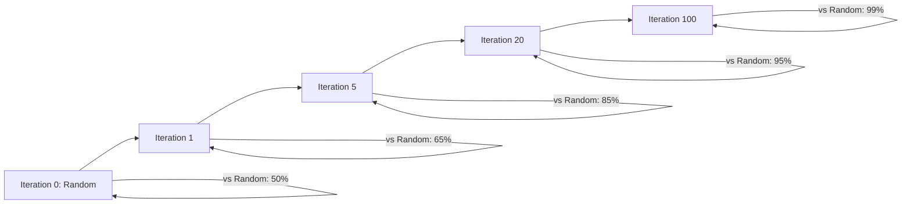

# AI Training Preparation Guide for RingRift

> **Doc Status (2025-11-26): Active (training infrastructure checklist)**
>
> - Canonical pre-flight checklist for AI weight initialization, training infrastructure, and operational safeguards for the Python AI service under `ai-service/`.
> - Assumes the **rules SSoT** is the canonical rules spec (`RULES_CANONICAL_SPEC.md` plus `../rules/COMPLETE_RULES.md` / `../rules/COMPACT_RULES.md`) together with its shared TypeScript engine implementation (helpers → aggregates → orchestrator → contracts) under `src/shared/engine/`, with v2 contract vectors under `tests/fixtures/contract-vectors/v2/`.
> - For Move/decision/WebSocket lifecycle semantics and canonical types, defer to [`docs/architecture/CANONICAL_ENGINE_API.md`](../architecture/CANONICAL_ENGINE_API.md); for TS↔Python rules parity specifics, defer to [`docs/rules/PYTHON_PARITY_REQUIREMENTS.md`](../rules/PYTHON_PARITY_REQUIREMENTS.md) and [`RULES_ENGINE_ARCHITECTURE.md`](../architecture/RULES_ENGINE_ARCHITECTURE.md).
>
> **SSoT alignment:** This guide is a derived pre-flight and training-infrastructure checklist over:
>
> - The **rules semantics SSoT** (canonical rules spec plus shared TS rules engine under `src/shared/engine/**` plus v2 contract vectors in `tests/fixtures/contract-vectors/v2/**`).
> - The AI/training implementation SSoT under `ai-service/app/ai/**` and `ai-service/app/training/**` together with their tests (for example `ai-service/tests/test_memory_config.py`, `ai-service/tests/test_bounded_transposition_table.py`, `ai-service/tests/test_hex_augmentation.py`, `ai-service/tests/test_hex_training.py`, `ai-service/tests/test_training_pipeline_e2e.py`).
>
> If this guide ever conflicts with those executable artefacts or the canonical lifecycle/parity docs it references, **code + tests + canonical rules/lifecycle docs win**, and this guide must be updated to match.
>
> **Last Updated**: 2025-11-26  
> **Applicable To**: [`ai-service/`](../../ai-service) module

---

## Table of Contents

1. [Data Preprocessing and Quality Assurance](#1-data-preprocessing-and-quality-assurance)
2. [Architecture Selection and Hyperparameter Configuration](#2-architecture-selection-and-hyperparameter-configuration)
3. [Computational Resource Allocation](#3-computational-resource-allocation)
4. [Weight Initialization Strategies](#4-weight-initialization-strategies)
5. [Baseline Establishment](#5-baseline-establishment)
6. [Validation Framework Design](#6-validation-framework-design)
7. [Reproducibility Protocols](#7-reproducibility-protocols)
8. [Documentation Requirements](#8-documentation-requirements)
9. [Ethical Considerations](#9-ethical-considerations)
10. [Bias Auditing Procedures](#10-bias-auditing-procedures)
11. [Domain-Specific Prerequisites](#11-domain-specific-prerequisites)
12. [Common Pitfalls and Failure Modes](#12-common-pitfalls-and-failure-modes)
13. [Memory Limiting Implementation Design](#13-memory-limiting-implementation-design)
14. [Infrastructure Improvements Checklist](#14-infrastructure-improvements-checklist)

---

## Current Infrastructure Summary

| Component         | Current Implementation                                                                            |
| ----------------- | ------------------------------------------------------------------------------------------------- |
| AI Service        | Python microservice (FastAPI, uvicorn)                                                            |
| ML Framework      | PyTorch 2.6.0                                                                                     |
| RL Environment    | gymnasium 1.0.0                                                                                   |
| AI Types          | Random, Heuristic, Minimax, MCTS, Descent                                                         |
| Difficulty Levels | 1-10 ladder                                                                                       |
| Neural Network    | [`RingRiftCNN`](../../ai-service/app/ai/neural_net/__init__.py) - 10 residual blocks, 128 filters |
| Hex Neural Net    | [`HexNeuralNet`](../../ai-service/app/ai/neural_net/__init__.py)                                  |
| State Encoding    | 10 channels × 4 frames = 40 input channels                                                        |
| Policy Size       | 55,000 actions (canonical encoding)                                                               |
| Replay Buffer     | MAX_BUFFER_SIZE = 50,000 samples                                                                  |
| Storage Format    | Memory-mapped .npz datasets                                                                       |
| Heuristic Weights | 17 weights with 4 profiles                                                                        |
| Board Types       | SQUARE8 (8×8), SQUARE19 (19×19), HEXAGONAL (radius 12)                                            |

---

## 1. Data Preprocessing and Quality Assurance

### 1.1 Data Validation Pipeline

Before training, all generated datasets must pass validation:

```python
# Data validation checklist
class DatasetValidator:
    """Validates training data before use."""

    def validate_npz(self, path: str) -> ValidationResult:
        """Validate training dataset integrity."""
        checks = []

        # 1. File existence and format
        checks.append(self._check_file_format(path))

        # 2. Array shape consistency
        checks.append(self._check_shapes(path))

        # 3. Value range validation
        checks.append(self._check_value_ranges(path))

        # 4. Policy sum check (should sum to ~1.0 for valid positions)
        checks.append(self._check_policy_normalization(path))

        # 5. Outcome distribution (not all wins or all losses)
        checks.append(self._check_outcome_distribution(path))

        return ValidationResult(checks)
```

#### Required Validation Checks

| Check           | Description                                               | Threshold                                            |
| --------------- | --------------------------------------------------------- | ---------------------------------------------------- |
| Feature Shape   | Spatial dimensions match board type                       | H×W must be 8×8, 19×19, or 25×25 (hex)               |
| Channel Count   | Total input channels = in_channels × (history_length + 1) | Must equal 40                                        |
| Value Range     | Normalized feature values                                 | `[-1.0, 1.0]`                                        |
| Policy Sum      | Probability distribution validity                         | `sum(policy) ∈ [0.99, 1.01]` for non-terminal states |
| Outcome Balance | Win/loss ratio                                            | Neither player > 70% wins                            |
| Sample Count    | Minimum viable dataset size                               | `≥ 10,000` samples recommended                       |

**Required Array Keys in Training Data:**

| Key              | Shape               | Description                                       |
| ---------------- | ------------------- | ------------------------------------------------- |
| `features`       | `(N, C, H, W)`      | Spatial feature planes (N=samples, C=40 channels) |
| `globals`        | `(N, 10)`           | Global features (turn number, ring counts, etc.)  |
| `values`         | `(N,)`              | Game outcome values in [-1, 1]                    |
| `policy_indices` | `(N,)` object array | Sparse policy action indices                      |
| `policy_values`  | `(N,)` object array | Sparse policy probabilities                       |

### 1.2 Feature Normalization Strategies

The current encoding uses 10 feature channels per frame, with 4 frames total (history_length=3 + current):

```python
# Feature channels (from neural_net.py _extract_features)
FEATURE_CHANNELS = {
    0: "player_stacks_normalized",     # Stack heights / 4.0
    1: "opponent_stacks_normalized",   # Stack heights / 4.0
    2: "player_markers",               # Binary presence
    3: "opponent_markers",             # Binary presence
    4: "player_collapsed",             # Binary presence
    5: "opponent_collapsed",           # Binary presence
    6: "player_liberties_normalized",  # Liberties / max_liberties
    7: "opponent_liberties_normalized",# Liberties / max_liberties
    8: "player_line_potential",        # Distance-based [0.0, 1.0]
    9: "opponent_line_potential",      # Distance-based [0.0, 1.0]
}
```

The current encoding in [`encoding.py`](../../ai-service/app/training/encoding.py) uses:

| Feature Type       | Normalization                        | Rationale                  |
| ------------------ | ------------------------------------ | -------------------------- |
| Stack heights      | Divide by max (5)                    | Bounded [0, 1]             |
| Binary masks       | 0/1 encoding                         | Stacks, markers, collapsed |
| Liberty counts     | Log-scale recommended                | High variance raw values   |
| Global turn number | Divide by `max_moves_per_game` (200) | Prevent scale issues       |

**Normalization Requirements:**

- Stack heights: Divide by maximum 4.0
- Liberties: Divide by board-specific maximum (8×8: 168, 19×19: 684, hex: ~400)
- All features should be in `[0.0, 1.0]` range

**Recommended Enhancements:**

```python
# Feature normalization constants
NORMALIZATION_CONSTANTS = {
    "stack_height_max": 5,
    "liberty_max": 8,  # 6 for hex, 4 for square corners
    "turn_max": 200,
    "ring_count_max": 36,  # Maximum rings per board type
}

def normalize_features(raw_features: np.ndarray, board_type: BoardType) -> np.ndarray:
    """Apply board-type-specific normalization."""
    normalized = raw_features.copy()
    # Stack planes: channels 0-1
    normalized[:, 0:2] /= NORMALIZATION_CONSTANTS["stack_height_max"]
    # Liberty plane: channel 6
    normalized[:, 6] = np.log1p(raw_features[:, 6]) / np.log1p(
        NORMALIZATION_CONSTANTS["liberty_max"]
    )
    return np.clip(normalized, 0, 1)
```

### 1.3 Handling Missing/Corrupted Data

**Detection Methods:**

```python
from collections import Counter

def detect_corruption(dataset_path: str) -> List[int]:
    """Return indices of corrupted samples with detailed logging."""
    corrupted_indices = []
    corruption_reasons = []
    data = np.load(dataset_path, mmap_mode='r', allow_pickle=True)

    for i in range(len(data['values'])):
        try:
            # Check for NaN/Inf
            features = data['features'][i]
            if np.any(np.isnan(features)) or np.any(np.isinf(features)):
                corrupted_indices.append(i)
                corruption_reasons.append((i, "NaN/Inf in features"))
                continue

            # Check value bounds
            value = data['values'][i]
            if not -1.0 <= value <= 1.0:
                corrupted_indices.append(i)
                corruption_reasons.append((i, f"Value out of range: {value}"))
                continue

            # Check policy validity
            policy_indices = data['policy_indices'][i]
            if len(policy_indices) == 0:
                corrupted_indices.append(i)
                corruption_reasons.append((i, "Empty policy"))
                continue

            policy_sum = np.sum(data['policy_values'][i])
            if not np.isclose(policy_sum, 1.0, atol=0.01):
                corrupted_indices.append(i)
                corruption_reasons.append((i, f"Policy sum: {policy_sum}"))

        except Exception as e:
            corrupted_indices.append(i)
            corruption_reasons.append((i, str(e)))

    # Log corruption summary
    if corruption_reasons:
        logger.warning(
            f"Found {len(corruption_reasons)} corrupted samples. "
            f"Reasons: {Counter(r[1] for r in corruption_reasons)}"
        )

    return corrupted_indices
```

**Recovery Strategies:**

1. **Exclude corrupted samples**: Filter during DataLoader initialization
2. **Regenerate from game logs**: If source games are archived
3. **Interpolation**: NOT recommended for game AI (leads to illegal states)

### 1.4 Data Augmentation Techniques

RingRift supports geometric augmentation for square boards:

```python
# Implemented in generate_data.py lines 142-178
AUGMENTATION_SQUARE = {
    "rotations": [0, 90, 180, 270],  # degrees
    "flips": [None, "horizontal"],
    "total_factor": 8,  # 4 rotations × 2 flip states
}

AUGMENTATION_HEX = {
    "rotations": [0, 60, 120, 180, 240, 300],  # 6-fold symmetry
    "flip_axes": [],  # Complex for axial coordinates - not implemented
    "total_factor": 6,  # Currently NOT applied (TODO)
}
```

**Augmentation Multipliers:**

| Board Type | Rotations | Flips / Reflections  | Total Factor |
| ---------- | --------- | -------------------- | ------------ |
| SQUARE8    | 4         | 2 (horizontal/no-op) | 8×           |
| SQUARE19   | 4         | 2 (horizontal/no-op) | 8×           |
| HEXAGONAL  | 6         | D6 reflections       | 12×          |

> **Status (2025-11-27):** Square-board augmentation is implemented via rotation/flip in [`generate_data.py`](../../ai-service/app/training/generate_data.py). Hexagonal board augmentation is implemented using the full dihedral group D6 (6 rotations × reflections, 12 total transforms) via `HexSymmetryTransform` / `augment_hex_sample` in [`ai-service/app/training/hex_augmentation.py`](../../ai-service/app/training/hex_augmentation.py) together with `augment_hex_data` in [`generate_data.py`](../../ai-service/app/training/generate_data.py). The table above reflects the implemented behaviour; for exact semantics, the **canonical SSoT** is the live code and tests in [`ai-service/tests/test_hex_augmentation.py`](../../ai-service/tests/test_hex_augmentation.py) and [`ai-service/tests/test_hex_training.py`](../../ai-service/tests/test_hex_training.py).

**Augmentation Pipeline:**

```python
def augment_position(
    features: np.ndarray,
    policy: Dict[str, float],
    board_type: BoardType
) -> List[Tuple[np.ndarray, Dict[str, float]]]:
    """Generate all symmetric variants of a position."""
    if board_type == BoardType.HEXAGONAL:
        # TODO: Implement hex rotation
        return [(features, policy)]

    augmented = []
    for rot in [0, 1, 2, 3]:  # 0°, 90°, 180°, 270°
        for flip in [False, True]:
            aug_features = apply_transform(features, rot, flip)
            aug_policy = transform_policy(policy, rot, flip)
            augmented.append((aug_features, aug_policy))
    return augmented
```

### 1.5 Quality Metrics and Thresholds

| Metric                 | Minimum Threshold | Target Value | Critical Failure    |
| ---------------------- | ----------------- | ------------ | ------------------- |
| Valid Sample Ratio     | ≥ 95%             | ≥ 99%        | < 90%               |
| Policy Entropy (mean)  | ≥ 0.5             | 1.0 - 3.0    | < 0.1 (collapsed)   |
| Value Distribution Std | ≥ 0.2             | 0.3 - 0.6    | < 0.1 (uniform)     |
| Game Length Variance   | ≥ 10 moves        | 20-100 moves | < 5 moves           |
| Unique Positions       | ≥ 80%             | ≥ 95%        | < 50%               |
| NaN/Inf rate           | < 0.001%          | 0%           | ≥ 0.01%             |
| Policy sum deviation   | < 0.05            | < 0.01       | > 0.1               |
| Game completion rate   | > 95%             | 100%         | < 90%               |
| Average game length    | 50-150 moves      | 70-120 moves | < 20 or > 200 moves |

---

## 2. Architecture Selection and Hyperparameter Configuration

### 2.1 CNN Architecture for Board Games

The [`RingRiftCNN`](../../ai-service/app/ai/neural_net/__init__.py) architecture follows AlphaZero-style design:

```
Input: 40 channels × H × W (history_length=3 → 4 frames × 10 channels)
       ↓
Convolution: 128 filters, 3×3, padding=1
       ↓
BatchNorm + ReLU
       ↓
┌─────────────────────────┐
│   10 × Residual Blocks  │  ← num_res_blocks=10
│   (128 filters each)    │
└─────────────────────────┘
       ↓
AdaptiveAvgPool2d(4, 4)
       ↓
Flatten + Concat Global Features
       ↓
  ┌─────┴─────┐
  ↓           ↓
[Policy Head] [Value Head]
  │           │
  ↓           ↓
Linear(2058→256) Linear(2058→256)
BatchNorm+ReLU   BatchNorm+ReLU
Linear(256→55000) Linear(256→1)
LogSoftmax       Tanh
```

### 2.2 Residual Block Depth Selection Rationale

| Depth         | Receptive Field | Training Time | Performance Notes                     |
| ------------- | --------------- | ------------- | ------------------------------------- |
| 5 blocks      | 23×23           | ~0.5x         | Underfits complex positions           |
| **10 blocks** | 43×43           | 1.0x          | **Current default**, good for 8×8     |
| 15 blocks     | 63×63           | ~1.5x         | Better for 19×19, higher compute      |
| 20 blocks     | 83×83           | ~2x           | AlphaZero-scale, requires GPU cluster |

**Recommendation**: Start with 10 blocks for SQUARE8, consider 15 for SQUARE19.

### 2.3 Filter Count Optimization

| Filter Count | GPU Memory (8×8 batch=32) | Quality Impact                    |
| ------------ | ------------------------- | --------------------------------- |
| 64           | ~0.8 GB                   | Faster training, reduced capacity |
| **128**      | ~1.5 GB                   | **Current default**, balanced     |
| 256          | ~4.0 GB                   | AlphaGo-scale, requires GPU       |
| 512          | ~12 GB                    | Not recommended for single-GPU    |

### 2.4 Policy/Value Head Design

**Policy Head Design:**

```python
class PolicyHead(nn.Module):
    """Outputs log-probabilities for 55,000 actions."""
    def __init__(self, in_features=2058, hidden=256, policy_size=55000):
        self.fc1 = nn.Linear(in_features, hidden)
        self.bn = nn.BatchNorm1d(hidden)
        self.fc2 = nn.Linear(hidden, policy_size)

    def forward(self, x):
        x = F.relu(self.bn(self.fc1(x)))
        return F.log_softmax(self.fc2(x), dim=-1)
```

**Design Considerations:**

- Large policy space (55K) requires careful initialization
- LogSoftmax + KLDivLoss is numerically stable
- Consider temperature scaling for exploration

**Value Head Design:**

```python
class ValueHead(nn.Module):
    """Outputs game outcome prediction in [-1, 1]."""
    def __init__(self, in_features=2058, hidden=256):
        self.fc1 = nn.Linear(in_features, hidden)
        self.bn = nn.BatchNorm1d(hidden)
        self.fc2 = nn.Linear(hidden, 1)

    def forward(self, x):
        x = F.relu(self.bn(self.fc1(x)))
        return torch.tanh(self.fc2(x))
```

### 2.5 Hyperparameter Search Strategies

| Strategy              | Pros                     | Cons             | Recommended For     |
| --------------------- | ------------------------ | ---------------- | ------------------- |
| Grid Search           | Exhaustive, reproducible | Exponential cost | ≤3 parameters       |
| Random Search         | Efficient for high-dim   | No exploitation  | Initial exploration |
| **Bayesian (Optuna)** | Sample-efficient         | Complex setup    | Production tuning   |
| Population-Based      | Good for RL              | High compute     | Multi-GPU clusters  |

**Recommended Search Space:**

```python
# Optuna example configuration
def objective(trial):
    config = {
        "learning_rate": trial.suggest_float("lr", 1e-5, 1e-2, log=True),
        "batch_size": trial.suggest_categorical("batch", [16, 32, 64, 128]),
        "weight_decay": trial.suggest_float("wd", 1e-6, 1e-3, log=True),
        "num_res_blocks": trial.suggest_int("blocks", 5, 15),
        "num_filters": trial.suggest_categorical("filters", [64, 128, 256]),
        "value_loss_weight": trial.suggest_float("vlw", 0.5, 2.0),
    }
    return train_and_evaluate(config)
```

### 2.6 Recommended Initial Hyperparameters

Based on [`config.py`](../../ai-service/app/training/config.py) and best practices:

```python
# Current configuration (from config.py)
@dataclass
class TrainConfig:
    batch_size: int = 32          # Good balance for GPU memory
    learning_rate: float = 1e-3   # Standard for Adam
    weight_decay: float = 1e-4    # L2 regularization
    history_length: int = 3       # 4 total frames
    seed: int = 42                # Reproducibility
    max_moves_per_game: int = 200 # Prevent infinite games
    epochs_per_iter: int = 5      # Training epochs per iteration

    # Existing behaviours with dedicated knobs in train.py / CLI:
    warmup_epochs: int = 0        # Learning rate warmup (see --warmup-epochs and create_lr_scheduler())
    early_stopping_patience: int = 10  # EarlyStopping implemented in train.py (see --early-stopping-patience)
    gradient_clip_norm: float = 1.0   # Gradient clipping via torch.nn.utils.clip_grad_norm_ in train.py
```

**Full Recommended Configuration:**

```python
# Recommended starting configuration
INITIAL_HYPERPARAMETERS = {
    # Optimizer
    "learning_rate": 1e-3,          # Adam default, reduce if unstable
    "weight_decay": 1e-4,           # L2 regularization
    "beta1": 0.9,                   # Adam momentum
    "beta2": 0.999,                 # Adam second moment

    # Training
    "batch_size": 32,               # Increase if GPU memory allows
    "epochs_per_iter": 5,           # Per self-play iteration
    "max_moves_per_game": 200,      # Game length limit

    # Architecture
    "num_res_blocks": 10,
    "num_filters": 128,
    "history_length": 3,            # 4 total frames

    # Learning rate schedule
    "lr_scheduler": "ReduceLROnPlateau",
    "lr_patience": 2,
    "lr_factor": 0.5,

    # Loss weights
    "value_loss_weight": 1.0,
    "policy_loss_weight": 1.0,

    # Regularization
    "dropout": 0.0,                 # Residual nets typically don't need
    "label_smoothing": 0.0,         # Try 0.1 if overfitting

    # Existing behaviours (see train.py for exact defaults / CLI):
    "warmup_epochs": 0,             # Controlled via --warmup-epochs and lr_scheduler
    "early_stopping_patience": 10,  # Controlled via --early-stopping-patience and EarlyStopping
    "gradient_clip_norm": 1.0,      # Fixed max-norm in train_model()
}
```

---

## 3. Computational Resource Allocation

### 3.1 CRITICAL: Configurable Memory Limiting System

**Current status (2025-11-27):** Core memory limiting is implemented in [`MemoryConfig`](../../ai-service/app/utils/memory_config.py) and wired into `DescentAI`, `MCTSAI`, and training scripts via `MemoryConfig.from_env()`. This section now serves as a **design appendix** for finer-grained per-component budgets and future refactors beyond the current implementation.

**Target Interface (historical design, partially implemented):**

```python
from dataclasses import dataclass
from typing import Optional

@dataclass
class MemoryConfig:
    """Configurable memory limits for training and inference."""

    # Global limits
    max_memory_gb: float = 16.0

    # Component-specific allocations (percentages of max_memory_gb)
    model_memory_pct: float = 0.20          # ~3.2 GB for model + gradients
    batch_memory_pct: float = 0.30          # ~4.8 GB for batch data
    replay_buffer_pct: float = 0.25         # ~4.0 GB for experience replay
    transposition_table_pct: float = 0.15   # ~2.4 GB for search tables
    overhead_pct: float = 0.10              # ~1.6 GB for OS/framework

    # Derived limits
    @property
    def model_memory_bytes(self) -> int:
        return int(self.max_memory_gb * self.model_memory_pct * 1024**3)

    @property
    def max_batch_size(self) -> int:
        """Auto-scale batch size based on available memory."""
        # Estimate (worst case, hex): 40 channels × 25×25 × 4 bytes × batch_size ≈ 100KB/sample
        bytes_per_sample = 40 * 25 * 25 * 4  # ~100KB
        available = self.max_memory_gb * self.batch_memory_pct * 1024**3
        return min(256, max(8, int(available / bytes_per_sample)))

    @property
    def max_transposition_entries(self) -> int:
        """Maximum entries for DescentAI/MCTS transposition tables."""
        # Estimate: ~1KB per entry (state key + value + children)
        bytes_per_entry = 1024
        available = self.max_memory_gb * self.transposition_table_pct * 1024**3
        return int(available / bytes_per_entry)
```

### 3.2 Memory Budget Allocation

```
┌───────────────────────────────────────────────────────────────┐
│                    16 GB Total Memory                         │
├───────────────────────────────────────────────────────────────┤
│ ┌─────────────┐ ┌─────────────────┐ ┌───────────────────────┐│
│ │    Model    │ │   Batch Data    │ │   Replay Buffer      ││
│ │   (20%)     │ │     (30%)       │ │      (25%)           ││
│ │   3.2 GB    │ │     4.8 GB      │ │      4.0 GB          ││
│ │             │ │                 │ │                       ││
│ │ - Weights   │ │ - Features      │ │ - 50K samples        ││
│ │ - Gradients │ │ - Targets       │ │ - Memory-mapped      ││
│ │ - Optimizer │ │ - Activations   │ │ - Sparse policies    ││
│ └─────────────┘ └─────────────────┘ └───────────────────────┘│
│ ┌─────────────────────────┐ ┌───────────────────────────────┐│
│ │  Transposition Tables   │ │        Overhead               ││
│ │        (15%)            │ │         (10%)                 ││
│ │        2.4 GB           │ │         1.6 GB                ││
│ │                         │ │                               ││
│ │ - DescentAI: 1.2 GB     │ │ - Python/PyTorch runtime      ││
│ │ - MCTS nodes: 1.2 GB    │ │ - OS page cache               ││
│ └─────────────────────────┘ └───────────────────────────────┘│
└───────────────────────────────────────────────────────────────┘
```

### 3.3 Batch Size Auto-Scaling

```python
def calculate_optimal_batch_size(
    memory_config: MemoryConfig,
    board_type: BoardType,
    device: torch.device,
) -> int:
    """Calculate optimal batch size based on memory constraints."""

    # Board dimensions
    if board_type == BoardType.SQUARE8:
        h, w = 8, 8
    elif board_type == BoardType.SQUARE19:
        h, w = 19, 19
    else:  # HEXAGONAL
        h, w = 21, 21

    channels = 40  # 10 feature channels × 4 frames
    bytes_per_sample = channels * h * w * 4  # float32

    # Account for gradients (2x), activations (~2x)
    memory_multiplier = 4.0 if device.type != "cpu" else 2.0

    available_bytes = memory_config.batch_memory_pct * memory_config.max_memory_gb * 1024**3
    max_batch = int(available_bytes / (bytes_per_sample * memory_multiplier))

    # Clamp to reasonable range
    return min(256, max(8, max_batch))
```

### 3.4 Transposition Table Size Limits

**Current Issue**: Both [`DescentAI`](../../ai-service/app/ai/descent_ai.py) and MCTS use unbounded dictionaries.

**Recommended Fix:**

```python
from collections import OrderedDict

class BoundedTranspositionTable:
    """LRU-eviction transposition table with size limit."""

    def __init__(self, max_entries: int = 1_000_000):
        self.max_entries = max_entries
        self._table: OrderedDict = OrderedDict()

    def get(self, key: str):
        if key in self._table:
            self._table.move_to_end(key)
            return self._table[key]
        return None

    def put(self, key: str, value) -> None:
        if key in self._table:
            self._table.move_to_end(key)
        else:
            if len(self._table) >= self.max_entries:
                self._table.popitem(last=False)  # Remove oldest
        self._table[key] = value

    def __len__(self) -> int:
        return len(self._table)

    def clear(self) -> None:
        self._table.clear()
```

**Integration Points:**

- [`descent_ai.py`](../../ai-service/app/ai/descent_ai.py) line 42: Replace `self.transposition_table = {}` with `BoundedTranspositionTable(max_entries)`
- [`mcts_ai.py`](../../ai-service/app/ai/mcts_ai.py) line ~200: Add node count limiting

### 3.5 Dataset Streaming vs Full Loading

| Dataset Size | Recommendation           | Rationale            |
| ------------ | ------------------------ | -------------------- |
| < 1 GB       | Full load to memory      | Fastest training     |
| 1-4 GB       | Memory-mapped (current)  | Balance speed/memory |
| 4-16 GB      | Memory-mapped + prefetch | Stream from disk     |
| > 16 GB      | Chunked DataLoader       | Must stream          |

**Current Implementation** (from [`train.py`](../../ai-service/app/training/train.py)):

```python
# Already uses memory mapping - good!
self.data = np.load(data_path, mmap_mode='r', allow_pickle=True)
```

**Enhancement for Large Datasets:**

```python
class StreamingDataset(torch.utils.data.IterableDataset):
    """Stream large datasets with prefetching."""

    def __init__(self, npz_paths: List[str], chunk_size: int = 10000):
        self.npz_paths = npz_paths
        self.chunk_size = chunk_size

    def __iter__(self):
        import random
        random.shuffle(self.npz_paths)
        for path in self.npz_paths:
            data = np.load(path, mmap_mode='r')
            indices = np.random.permutation(len(data['values']))
            for i in range(0, len(indices), self.chunk_size):
                chunk_indices = indices[i:i+self.chunk_size]
                yield self._load_chunk(data, chunk_indices)
```

### 3.6 Garbage Collection Strategies

```python
import gc
import torch

def aggressive_gc() -> None:
    """Force garbage collection after memory-intensive operations."""
    gc.collect()
    if torch.cuda.is_available():
        torch.cuda.empty_cache()
    elif hasattr(torch.backends, "mps") and torch.backends.mps.is_available():
        # MPS doesn't have explicit empty_cache yet
        gc.collect()

# Call at these points:
# 1. After each epoch
# 2. After building transposition table
# 3. Before converting large arrays
# 4. After saving checkpoints
```

### 3.7 GPU vs CPU Training Considerations

| Hardware     | Training Speed | Memory           | Recommended For        |
| ------------ | -------------- | ---------------- | ---------------------- |
| CPU (8-core) | 1x (baseline)  | 16-64 GB         | Development, debugging |
| MPS (M1/M2)  | 3-5x           | 8-64 GB (shared) | Local iteration        |
| CUDA GPU     | 10-50x         | 8-24 GB          | Production training    |
| Multi-GPU    | 20-100x        | 16-96 GB         | Self-play generation   |

### 3.8 MPS (Apple Silicon) Optimizations

From current [`neural_net.py`](../../ai-service/app/ai/neural_net/__init__.py):

```python
def get_device() -> torch.device:
    """Detect best available device."""
    if torch.backends.mps.is_available():
        return torch.device("mps")
    elif torch.cuda.is_available():
        return torch.device("cuda")
    return torch.device("cpu")
```

**MPS-Specific Considerations:**

1. **Mixed precision**: GradScaler not fully supported on MPS (see line 243 of train.py)
2. **Batch size**: MPS shares memory with system — reduce batch size accordingly
3. **Fallback operations**: Some ops may fall back to CPU
4. **Memory pressure**: Monitor with `Activity Monitor` or `sudo memory_pressure`

```python
# MPS-safe training configuration
if device.type == "mps":
    # Disable features known to be problematic on MPS
    config.use_mixed_precision = False
    config.batch_size = min(config.batch_size, 16)  # Conservative

    # Enable MPS-specific optimizations
    torch.mps.set_per_process_memory_fraction(0.7)  # Leave room for OS
```

### 3.9 Memory Profiling Tools

| Tool                        | Platform   | Usage                  |
| --------------------------- | ---------- | ---------------------- |
| `torch.cuda.memory_stats()` | CUDA       | GPU memory breakdown   |
| `tracemalloc`               | Python     | Python object tracking |
| `memory_profiler`           | Python     | Line-by-line memory    |
| `pympler`                   | Python     | Object size analysis   |
| `Activity Monitor`          | macOS      | MPS/system memory      |
| `nvidia-smi`                | Linux/CUDA | GPU monitoring         |

**Integration Example:**

```python
import tracemalloc

def profile_training_step(model, batch):
    tracemalloc.start()

    # Training step
    loss = model.training_step(batch)

    current, peak = tracemalloc.get_traced_memory()
    tracemalloc.stop()

    return {
        "loss": loss.item(),
        "current_memory_mb": current / 1024**2,
        "peak_memory_mb": peak / 1024**2,
    }
```

---

## 4. Weight Initialization Strategies

### 4.1 Xavier/Glorot Initialization

**When to Use**: Linear layers with sigmoid/tanh activations (value head output)

```python
def init_xavier(module: nn.Module) -> None:
    """Xavier/Glorot uniform initialization."""
    if isinstance(module, nn.Linear):
        nn.init.xavier_uniform_(module.weight)
        if module.bias is not None:
            nn.init.zeros_(module.bias)
```

### 4.2 He/Kaiming Initialization

**When to Use**: Layers followed by ReLU (most of the network)

```python
def init_kaiming(module: nn.Module) -> None:
    """He/Kaiming initialization for ReLU networks."""
    if isinstance(module, nn.Conv2d):
        nn.init.kaiming_normal_(module.weight, mode='fan_out', nonlinearity='relu')
        if module.bias is not None:
            nn.init.zeros_(module.bias)
    elif isinstance(module, nn.Linear):
        nn.init.kaiming_normal_(module.weight, mode='fan_in', nonlinearity='relu')
        if module.bias is not None:
            nn.init.zeros_(module.bias)
    elif isinstance(module, nn.BatchNorm2d):
        nn.init.ones_(module.weight)
        nn.init.zeros_(module.bias)
```

### 4.3 Custom Initialization for Policy/Value Heads

**Policy Head**: Small weights to avoid overconfident initial predictions

```python
def init_policy_head(module: nn.Module) -> None:
    """Initialize policy head for balanced initial distribution."""
    if isinstance(module, nn.Linear):
        # Small scale for near-uniform initial policy
        nn.init.normal_(module.weight, mean=0.0, std=0.01)
        if module.bias is not None:
            nn.init.zeros_(module.bias)
```

**Value Head**: Zero final layer for neutral initial predictions

```python
def init_value_head(module: nn.Module) -> None:
    """Initialize value head for neutral initial predictions."""
    if hasattr(module, 'fc2'):
        nn.init.zeros_(module.fc2.weight)
        nn.init.zeros_(module.fc2.bias)
```

### 4.4 Full Initialization Function

```python
def initialize_model(model: nn.Module) -> None:
    """Apply appropriate initialization to all layers."""
    for name, module in model.named_modules():
        if 'policy' in name:
            init_policy_head(module)
        elif 'value' in name and 'fc2' in name:
            init_value_head(module)
        elif isinstance(module, (nn.Conv2d, nn.Linear)):
            init_kaiming(module)
        elif isinstance(module, nn.BatchNorm2d):
            nn.init.ones_(module.weight)
            nn.init.zeros_(module.bias)
```

### 4.5 Pre-trained Weight Loading

From [`train.py`](../../ai-service/app/training/train.py) (lines 212–222):

```python
def load_pretrained_weights(
    model: nn.Module,
    checkpoint_path: str,
    device: torch.device,
    strict: bool = False,
) -> Tuple[nn.Module, Dict[str, str]]:
    """Load pre-trained weights with compatibility checking."""

    checkpoint = torch.load(checkpoint_path, map_location=device, weights_only=True)

    # Get state dict, handling both raw weights and full checkpoints
    if isinstance(checkpoint, dict) and 'model_state_dict' in checkpoint:
        state_dict = checkpoint['model_state_dict']
    else:
        state_dict = checkpoint

    # Load with strict=False to allow architecture changes
    missing, unexpected = model.load_state_dict(state_dict, strict=strict)

    report = {
        "missing_keys": missing,
        "unexpected_keys": unexpected,
        "loaded_keys": len(state_dict) - len(unexpected),
    }

    logger.info(f"Loaded {report['loaded_keys']} weights from {checkpoint_path}")
    if missing:
        logger.warning(f"Missing keys: {missing}")
    if unexpected:
        logger.warning(f"Unexpected keys: {unexpected}")

    return model, report
```

### 4.6 Initialization Validation Tests

```python
def validate_initialization(model: nn.Module) -> Dict[str, Any]:
    """Validate that model initialization is appropriate."""
    results = {}

    for name, param in model.named_parameters():
        if param.requires_grad:
            mean = param.data.mean().item()
            std = param.data.std().item()
            max_val = param.data.abs().max().item()

            results[name] = {
                "mean": mean,
                "std": std,
                "max_abs": max_val,
            }

            # Validation checks
            if abs(mean) > 0.1:
                logger.warning(f"{name}: mean={mean:.4f} is high")
            if std > 2.0:
                logger.warning(f"{name}: std={std:.4f} is high")

    # Check policy head produces near-uniform distribution
    dummy_input = torch.randn(1, 40, 8, 8)
    dummy_global = torch.randn(1, 10)
    with torch.no_grad():
        policy, value = model(dummy_input, dummy_global)
        policy_entropy = -(policy.exp() * policy).sum()
        results["initial_policy_entropy"] = policy_entropy.item()
        results["initial_value"] = value.item()

    return results
```

---

## 5. Baseline Establishment

### 5.1 Minimum Viable Model Performance

Before training neural networks, establish baseline performance levels:

| Metric                  | Target     | Measurement Method      |
| ----------------------- | ---------- | ----------------------- |
| Win rate vs Random      | > 90%      | 100 games               |
| Win rate vs Heuristic-3 | > 50%      | 100 games               |
| Move selection time     | < 100ms    | Average on CPU          |
| Policy entropy          | > 5.0 bits | Post-softmax entropy    |
| Value accuracy          | > 60%      | Correct sign prediction |

### 5.2 Random Agent Baseline

The [`RandomAI`](../../ai-service/app/ai/random_ai.py) provides the absolute floor:

```python
def evaluate_random_baseline(num_games: int = 100) -> Dict[str, float]:
    """Evaluate random agent baseline."""
    results = {
        "games": num_games,
        "p1_wins": 0,
        "p2_wins": 0,
        "draws": 0,
        "avg_game_length": 0,
    }

    for _ in range(num_games):
        p1 = RandomAI(player=1)
        p2 = RandomAI(player=2)
        outcome = play_game(p1, p2)
        results[f"p{outcome}_wins"] += 1
        results["avg_game_length"] += outcome.moves

    results["avg_game_length"] /= num_games
    return results
```

**Expected Random Baseline** (RingRift):

- First-player advantage: ~52-55% win rate
- Average game length: 100-150 moves
- Games rarely exceed 200 moves

### 5.3 Heuristic Agent Benchmarks

Using [`heuristic_weights.py`](../../ai-service/app/ai/heuristic_weights.py):

| Difficulty | Profile     | Expected Elo (relative) | Win % vs Random |
| ---------- | ----------- | ----------------------- | --------------- |
| 1-2        | Random-ish  | ~100                    | 50-60%          |
| 3-4        | Balanced    | ~300                    | 70-80%          |
| 5-6        | Aggressive  | ~600                    | 85-92%          |
| 7-8        | Territorial | ~900                    | 93-97%          |
| 9-10       | Defensive   | ~1200                   | 98%+            |

**Benchmark Matrix:**

```python
def run_heuristic_benchmark() -> pd.DataFrame:
    """Run full heuristic benchmark matrix."""
    difficulties = [1, 3, 5, 7, 9]
    results = []

    for d1 in difficulties:
        for d2 in difficulties:
            if d1 <= d2:  # Upper triangle only
                wins = play_match(d1, d2, num_games=50)
                results.append({
                    "p1_difficulty": d1,
                    "p2_difficulty": d2,
                    "p1_win_rate": wins / 50,
                })

    return pd.DataFrame(results)
```

### 5.4 Win Rate Expectations per Training Iteration



| Training Iteration | vs Random | vs Heuristic-5 | vs Previous |
| ------------------ | --------- | -------------- | ----------- |
| 0 (untrained)      | 50%       | 5%             | N/A         |
| 1                  | 60-70%    | 10-20%         | 55%         |
| 5                  | 80-90%    | 30-40%         | 52%         |
| 20                 | 95%+      | 50-60%         | 51%         |
| 100                | 99%+      | 70-80%         | 50.5%       |
| 500                | 99.9%     | 90%+           | 50.1%       |

### 5.5 Convergence Indicators

**Healthy Training Signs:**

- Value loss decreases monotonically (with noise)
- Policy loss decreases initially, then stabilizes
- Validation loss tracks training loss (within 20%)
- Win rate vs fixed opponent improves
- Policy entropy remains > 1.0 bit

**Warning Signs:**

- Value loss increases
- Policy entropy < 0.5 bits (collapsed)
- Validation loss diverges from training loss
- Win rate plateaus early (< iteration 20)

```python
def check_convergence(history: TrainingHistory) -> ConvergenceReport:
    """Analyze training history for convergence issues."""
    report = ConvergenceReport()

    # Check value loss trend (last 10 epochs)
    value_trend = np.polyfit(range(10), history.value_loss[-10:], 1)[0]
    if value_trend > 0:
        report.add_warning("Value loss is increasing")

    # Check policy entropy
    if history.policy_entropy[-1] < 1.0:
        report.add_warning("Policy entropy collapsed below 1.0 bit")

    # Check validation gap
    val_gap = history.val_loss[-1] / history.train_loss[-1]
    if val_gap > 1.5:
        report.add_warning(f"Validation gap: {val_gap:.2f}x training loss")

    return report
```

---

## 6. Validation Framework Design

### 6.1 Train/Validation/Test Split Rationale

**Current Implementation** (train.py line 275-280):

- 80% training, 20% validation
- No separate test set

**Recommended Split for Self-Play AI:**

| Split      | Percentage | Purpose                               |
| ---------- | ---------- | ------------------------------------- |
| Train      | 70%        | Weight updates                        |
| Validation | 15%        | Hyperparameter tuning, early stopping |
| Test       | 15%        | Final evaluation (held out)           |

**Self-Play Considerations:**

- Positions from same game are correlated
- Split by game, not by position
- Ensure balanced game outcomes in each split

```python
def split_by_game(
    games: List[Game],
    train_pct: float = 0.7,
    val_pct: float = 0.15,
) -> Tuple[List[Game], List[Game], List[Game]]:
    """Split games ensuring no position leakage."""
    random.shuffle(games)
    n = len(games)
    train_end = int(n * train_pct)
    val_end = int(n * (train_pct + val_pct))

    return games[:train_end], games[train_end:val_end], games[val_end:]
```

### 6.2 Cross-Validation Strategies for Game AI

**Challenge**: Self-play data is autocorrelated across training iterations.

**Recommended Approach: Time-Based Cross-Validation**

```
Training Timeline:
├─ Iteration 1-5:   Fold 1 Test Set
├─ Iteration 6-10:  Fold 2 Test Set
├─ Iteration 11-15: Fold 3 Test Set
└─ Iteration 16-20: Fold 4 Test Set

Each fold is trained on all data EXCEPT its iteration range.
```

### 6.3 Held-Out Test Game Generation

```python
def generate_held_out_test_set(
    num_games: int = 1000,
    output_path: str = "test_games.jsonl",
) -> None:
    """Generate a fixed test set using diverse opening strategies."""

    test_games = []

    # Diverse AI opponents
    opponents = [
        ("random", RandomAI),
        ("heuristic_balanced", lambda p: HeuristicAI(p, profile="balanced")),
        ("heuristic_aggressive", lambda p: HeuristicAI(p, profile="aggressive")),
        ("heuristic_defensive", lambda p: HeuristicAI(p, profile="defensive")),
    ]

    for i in range(num_games):
        p1_type = opponents[i % len(opponents)]
        p2_type = opponents[(i + 1) % len(opponents)]

        # Resolve factories first to avoid accidental Markdown-like syntax such as [1] with argument player=1
        p1_factory = p1_type[1]
        p2_factory = p2_type[1]
        game = play_game(p1_factory(player=1), p2_factory(player=2))
        test_games.append({
            "game_id": i,
            "p1_type": p1_type[0],
            "p2_type": p2_type[0],
            "moves": [m.to_dict() for m in game.moves],
            "outcome": game.outcome,
        })

    with open(output_path, 'w') as f:
        for game in test_games:
            f.write(json.dumps(game) + "\n")
```

### 6.4 Overfitting Detection Methods

| Indicator             | Detection Method              | Threshold     |
| --------------------- | ----------------------------- | ------------- |
| Loss Gap              | val_loss / train_loss         | > 1.3         |
| Win Rate Stagnation   | Δwin_rate < 0.1% for 10 iters | 10 iterations |
| Position Memorization | Unique moves per position     | < 1.5         |
| Policy Collapse       | Policy entropy                | < 1.0 bit     |

```python
def detect_overfitting(history: TrainingHistory) -> OverfittingReport:
    """Detect overfitting from training history."""
    report = OverfittingReport()

    # 1. Loss gap analysis
    loss_ratios = [v / t for v, t in zip(history.val_loss, history.train_loss)]
    if loss_ratios[-1] > 1.3:
        report.add_finding("Loss gap exceeds 30%", severity="high")

    # 2. Policy diversity
    if history.policy_entropy[-1] < 1.0:
        report.add_finding("Policy entropy collapsed", severity="critical")

    # 3. Learning rate too low?
    if history.learning_rate[-1] < 1e-6:
        report.add_finding("Learning rate near zero", severity="warning")

    return report
```

### 6.5 Validation Metrics

| Metric                   | Description                             | Target |
| ------------------------ | --------------------------------------- | ------ |
| **Value Accuracy**       | Sign of predicted value matches outcome | > 70%  |
| **Value MSE**            | Mean squared error of value predictions | < 0.3  |
| **Policy Top-1**         | Correct move is top prediction          | > 40%  |
| **Policy Top-5**         | Correct move in top 5 predictions       | > 70%  |
| **Policy KL Divergence** | Divergence from target distribution     | < 0.5  |
| **Win Rate**             | Win percentage vs reference opponent    | > 80%  |

```python
def calculate_validation_metrics(
    model: nn.Module,
    val_loader: DataLoader,
    device: torch.device,
) -> Dict[str, float]:
    """Calculate comprehensive validation metrics."""
    model.eval()

    metrics = defaultdict(list)

    with torch.no_grad():
        for features, globals, values, policies in val_loader:
            features = features.to(device)
            globals = globals.to(device)

            pred_policy, pred_value = model(features, globals)

            # Value accuracy
            value_acc = ((pred_value.sign() == values.sign()).float().mean())
            metrics["value_accuracy"].append(value_acc.item())

            # Value MSE
            value_mse = F.mse_loss(pred_value.squeeze(), values.to(device))
            metrics["value_mse"].append(value_mse.item())

            # Policy top-k
            for k in [1, 5]:
                top_k = pred_policy.topk(k, dim=-1).indices
                target_idx = policies.argmax(dim=-1).unsqueeze(-1)
                hits = (top_k == target_idx.to(device)).any(dim=-1).float().mean()
                metrics[f"policy_top_{k}"].append(hits.item())

    return {k: np.mean(v) for k, v in metrics.items()}
```

---

## 7. Reproducibility Protocols

### 7.1 Seed Management

**Current Implementation** (from [`config.py`](../../ai-service/app/training/config.py)):

```python
@dataclass
class TrainConfig:
    seed: int = 42
```

**Comprehensive Seeding:**

```python
import os
import random
import numpy as np
import torch

def seed_all(seed: int, deterministic: bool = True) -> None:
    """Seed all random number generators for reproducibility."""
    random.seed(seed)
    np.random.seed(seed)
    torch.manual_seed(seed)

    if torch.cuda.is_available():
        torch.cuda.manual_seed(seed)
        torch.cuda.manual_seed_all(seed)

    if hasattr(torch.backends, "mps"):
        # MPS doesn't have explicit seeding yet
        pass

    os.environ["PYTHONHASHSEED"] = str(seed)

    if deterministic:
        torch.backends.cudnn.deterministic = True
        torch.backends.cudnn.benchmark = False
        os.environ["CUBLAS_WORKSPACE_CONFIG"] = ":4096:8"
```

### 7.2 Deterministic Mode Configuration

```python
def enable_deterministic_mode() -> None:
    """Enable PyTorch deterministic algorithms."""
    torch.use_deterministic_algorithms(True)

    # Handle known non-deterministic ops
    os.environ["CUBLAS_WORKSPACE_CONFIG"] = ":4096:8"
```

**Known Non-Deterministic Operations:**

- `torch.nn.functional.interpolate` with bilinear/trilinear
- `torch.nn.ReplicationPad2d` backward
- Scatter/gather operations
- AdaptiveAvgPool2d backward (workaround: use explicit pooling)

### 7.3 Experiment Tracking Recommendations

| Tool                      | Pros                       | Setup Complexity |
| ------------------------- | -------------------------- | ---------------- |
| **TensorBoard** (current) | Simple, local              | Low              |
| MLflow                    | Model registry, deployment | Medium           |
| Weights & Biases          | Cloud sync, comparisons    | Medium           |
| DVC                       | Data versioning            | Medium           |

**TensorBoard Integration** (already in requirements.txt):

```python
from torch.utils.tensorboard import SummaryWriter

def setup_experiment_tracking(
    experiment_name: str,
    config: TrainConfig,
) -> SummaryWriter:
    """Initialize experiment tracking."""
    log_dir = f"runs/{experiment_name}_{datetime.now().strftime('%Y%m%d_%H%M%S')}"
    writer = SummaryWriter(log_dir)

    # Log hyperparameters
    writer.add_hparams(
        hparam_dict=asdict(config),
        metric_dict={},  # Filled during training
    )

    return writer
```

### 7.4 Version Control for Datasets and Checkpoints

**Dataset Versioning:**

```
models/
├── checkpoints/
│   ├── v1/
│   │   ├── model_iter_001.pt
│   │   ├── model_iter_002.pt
│   │   └── model_final.pt
│   └── v2/
│       └── ...
├── data/
│   ├── v1/
│   │   ├── self_play_001.npz
│   │   └── manifest.json
│   └── v2/
│       └── ...
└── experiments/
    └── experiment_20251126.json
```

**Manifest Format:**

```json
{
  "version": "v1",
  "created_at": "2025-11-26T10:00:00Z",
  "config": {
    "seed": 42,
    "num_games": 1000,
    "ai_type": "descent",
    "difficulty": 7
  },
  "files": [{ "name": "self_play_001.npz", "sha256": "abc123...", "samples": 50000 }],
  "total_samples": 50000,
  "git_commit": "abc1234"
}
```

### 7.5 Environment Specification

**requirements.txt** (current):

- Already pins major versions (good!)
- Consider exact versions for critical packages

**Recommended Docker Pinning:**

```dockerfile
# Pin base image to specific tag
FROM python:3.11.7-slim-bookworm

# Pin system packages
RUN apt-get update && apt-get install -y --no-install-recommends \
    gcc=4:12.2.0-3 \
    && rm -rf /var/lib/apt/lists/*

# Use hash-pinned dependencies
COPY requirements.lock .
RUN pip install --no-cache-dir -r requirements.lock
```

**Generate Lockfile:**

```bash
pip freeze > requirements.lock
```

---

## 8. Documentation Requirements

### 8.1 Training Configuration Logging

Every training run must log:

```python
@dataclass
class TrainingRunMetadata:
    """Metadata for a training run."""

    # Identity
    run_id: str = field(default_factory=lambda: str(uuid4()))
    experiment_name: str = ""
    timestamp: datetime = field(default_factory=datetime.now)

    # Environment
    python_version: str = ""
    torch_version: str = ""
    git_commit: str = ""
    git_dirty: bool = False
    hostname: str = ""

    # Configuration
    config: TrainConfig = field(default_factory=TrainConfig)
    memory_config: MemoryConfig = field(default_factory=MemoryConfig)

    # Data
    train_data_path: str = ""
    train_data_hash: str = ""
    train_samples: int = 0

    # Hardware
    device: str = ""
    gpu_name: str = ""
    gpu_memory_gb: float = 0.0

    def to_json(self) -> str:
        return json.dumps(asdict(self), indent=2, default=str)
```

### 8.2 Experiment Metadata Format

```json
{
  "run_id": "abc123-def456",
  "experiment_name": "baseline_v1",
  "timestamp": "2025-11-26T10:00:00Z",
  "environment": {
    "python": "3.11.7",
    "torch": "2.6.0",
    "git_commit": "abc1234",
    "hostname": "training-server-1"
  },
  "config": {
    "batch_size": 32,
    "learning_rate": 0.001,
    "epochs_per_iter": 5,
    "num_res_blocks": 10,
    "num_filters": 128
  },
  "data": {
    "path": "data/v1/self_play_001.npz",
    "sha256": "abc123...",
    "samples": 50000
  },
  "hardware": {
    "device": "mps",
    "memory_gb": 16.0
  },
  "results": {
    "final_train_loss": 0.45,
    "final_val_loss": 0.52,
    "best_val_loss": 0.48,
    "win_rate_vs_heuristic_5": 0.72
  }
}
```

### 8.3 Model Card Template

```markdown
# Model Card: RingRift CNN v1.0

## Model Details

- **Architecture**: RingRiftCNN, 10 residual blocks, 128 filters
- **Input**: 40 channels × H × W spatial features + 10 global features
- **Output**: 55,000-way policy distribution + scalar value
- **Parameters**: ~5M
- **Training Date**: 2025-11-26
- **Version**: v1.0.0

## Training Data

- **Source**: Self-play games using DescentAI difficulty 6
- **Games**: 1,000
- **Positions**: 50,000
- **Augmentation**: 8× for square boards

## Performance

| Metric                | Value |
| --------------------- | ----- |
| vs Random (win rate)  | 95%   |
| vs Heuristic-5        | 72%   |
| Value accuracy        | 68%   |
| Policy top-5 accuracy | 75%   |

## Limitations

- Trained only on 8×8 square board
- May struggle with unusual opening sequences
- No explicit handling of time pressure

## Ethical Considerations

- No user data used in training
- Difficulty levels must be clearly communicated to players

## Changelog

- v1.0.0 (2025-11-26): Initial release
```

### 8.4 Training Run Documentation Checklist

- [ ] **Pre-Training**
  - [ ] Seed set and logged
  - [ ] Configuration saved to JSON
  - [ ] Git commit hash recorded
  - [ ] Dataset manifest verified
  - [ ] Memory limits configured
- [ ] **During Training**
  - [ ] TensorBoard logging active
  - [ ] Checkpoint saving every N epochs
  - [ ] Validation metrics computed
  - [ ] Win rate evaluations scheduled
- [ ] **Post-Training**
  - [ ] Final model saved
  - [ ] Model card generated
  - [ ] Experiment metadata archived
  - [ ] Performance comparison to baseline
  - [ ] Known issues documented

### 8.5 Performance Regression Documentation

When performance drops, document:

```markdown
## Performance Regression Report

**Date**: 2025-11-27
**Run ID**: xyz789
**Issue**: Win rate vs Heuristic-5 dropped from 72% to 58%

### Investigation

1. Compared training configs: No significant changes
2. Checked data distribution: Policy targets shifted
3. Reviewed recent code changes: Bug in augmentation

### Root Cause

Data augmentation was incorrectly rotating policies, causing
flipped move targets.

### Resolution

Fixed rotation transform in augment_position(). Re-running training.

### Prevention

- Added unit test for augmentation correctness
- Added policy symmetry check to data validation
```

---

## 9. Ethical Considerations

### 9.1 AI Fairness in Gameplay

**Principle**: AI should not have systematic biases that favor certain playstyles over others.

**Testing Requirements:**

| Bias Type           | Test                                | Acceptable Variance   |
| ------------------- | ----------------------------------- | --------------------- |
| Opening diversity   | Unique first 5 moves over 100 games | > 20 unique sequences |
| Positional fairness | Win rate from symmetric positions   | < 5% difference       |
| Time independence   | Decision quality vs time spent      | Monotonic improvement |

### 9.2 Transparency in AI Difficulty Levels

**Requirements:**

1. Each difficulty level must have documented expected strength
2. Players must be informed when playing against AI
3. AI difficulty must match user selection

```python
DIFFICULTY_DESCRIPTIONS = {
    1: "Beginner: Makes random-like moves",
    2: "Novice: Basic piece awareness",
    3: "Easy: Simple tactics",
    4: "Casual: Territorial awareness",
    5: "Medium: Solid all-around play",
    6: "Challenging: Good tactical vision",
    7: "Hard: Strong positional play",
    8: "Expert: Few exploitable weaknesses",
    9: "Master: Near-optimal play",
    10: "Grandmaster: Maximum strength",
}
```

### 9.3 Data Privacy for Self-Play

**Current Status**: ✅ No user data involved

Self-play training uses:

- AI-generated games only
- No human player data
- No identifiable information

**Verification Checklist:**

- [ ] Training data contains no user identifiers
- [ ] No human game replays used
- [ ] No telemetry data incorporated
- [ ] Model weights contain no PII

### 9.4 Responsible AI Deployment

| Practice             | Implementation                        |
| -------------------- | ------------------------------------- |
| Graceful degradation | Fallback to lower difficulty on error |
| Rate limiting        | AI service calls limited per user     |
| Monitoring           | Track AI game outcomes for anomalies  |
| Kill switch          | Ability to disable AI instantly       |

---

## 10. Bias Auditing Procedures

### 10.1 Game-Specific Bias Types

| Bias Type              | Description                   | Detection Method        |
| ---------------------- | ----------------------------- | ----------------------- |
| First-player advantage | P1 wins more often            | Win rate by player      |
| Position bias          | Prefers certain board regions | Heatmap of moves        |
| Opening bias           | Narrow opening repertoire     | Opening tree analysis   |
| Endgame bias           | Inconsistent endgame play     | Endgame conversion rate |

### 10.2 Opening Move Diversity Analysis

```python
def analyze_opening_diversity(
    model: nn.Module,
    num_rollouts: int = 1000,
    depth: int = 5,
) -> OpeningDiversityReport:
    """Analyze diversity of opening move sequences."""

    opening_sequences = defaultdict(int)

    for _ in range(num_rollouts):
        state = create_initial_state()
        moves = []

        for d in range(depth):
            policy, _ = model.predict(state)
            move = sample_from_policy(policy)
            moves.append(move.to_string())
            state = apply_move(state, move)

        opening_sequences[tuple(moves)] += 1

    unique_sequences = len(opening_sequences)
    entropy = -sum(
        (c / num_rollouts) * np.log(c / num_rollouts)
        for c in opening_sequences.values()
    )

    return OpeningDiversityReport(
        unique_sequences=unique_sequences,
        entropy=entropy,
        most_common=sorted(opening_sequences.items(), key=lambda x: -x[1])[:10],
        target_entropy=np.log(num_rollouts) * 0.5,  # At least 50% of max entropy
    )
```

### 10.3 Win Rate Parity Across Positions

```python
def test_position_parity(
    model: nn.Module,
    num_games: int = 100,
) -> PositionParityReport:
    """Test that AI performs equally as P1 and P2."""

    p1_wins = 0
    p2_wins = 0

    for i in range(num_games):
        # Alternate sides
        if i % 2 == 0:
            outcome = play_game(model, random_ai)
            if outcome > 0:
                p1_wins += 1
        else:
            outcome = play_game(random_ai, model)
            if outcome < 0:
                p2_wins += 1

    parity_score = abs(p1_wins - p2_wins) / (num_games / 2)

    return PositionParityReport(
        p1_win_rate=p1_wins / (num_games / 2),
        p2_win_rate=p2_wins / (num_games / 2),
        parity_score=parity_score,
        passes=parity_score < 0.1,  # Less than 10% difference
    )
```

### 10.4 Endgame Behavior Consistency

```python
def test_endgame_consistency(
    model: nn.Module,
    endgame_positions: List[GameState],
) -> EndgameReport:
    """Test consistency of play in won/lost positions."""

    results = {
        "winning_converted": 0,
        "winning_total": 0,
        "drawn_held": 0,
        "drawn_total": 0,
        "losing_extended": 0,
        "losing_total": 0,
    }

    for position in endgame_positions:
        expected = evaluate_theoretical(position)
        outcome = play_out(model, position)

        if expected > 0.5:
            results["winning_total"] += 1
            if outcome > 0:
                results["winning_converted"] += 1
        elif expected < -0.5:
            results["losing_total"] += 1
            # Count if AI extended game significantly
            if outcome < 0 and game_length > expected_length * 1.2:
                results["losing_extended"] += 1

    return EndgameReport(**results)
```

### 10.5 Bias Mitigation Strategies

| Bias                   | Mitigation                               |
| ---------------------- | ---------------------------------------- |
| First-player advantage | Augment with color-swapped positions     |
| Opening narrowness     | Add exploration noise during self-play   |
| Position preference    | Ensure uniform position sampling         |
| Endgame weakness       | Generate dedicated endgame training data |

---

## 11. Domain-Specific Prerequisites

### 11.1 RingRift Rules Understanding

Before training AI, verify understanding of:

- [ ] **Ring stacking mechanics**: Up to 5 rings per stack
- [ ] **Marker placement and removal**: Territory control
- [ ] **Line formation**: 3+ rings trigger marker swap
- [ ] **Territory encirclement**: Marker elimination
- [ ] **Victory conditions**: Elimination or points at move limit

**Reference**: [`../rules/COMPLETE_RULES.md`](../rules/COMPLETE_RULES.md)

### 11.2 Board Representation Invariants

```python
# Invariants that must hold at all times
def validate_board_invariants(state: GameState) -> bool:
    """Validate board state invariants."""

    # 1. Stack heights in valid range
    for pos, stack in state.stacks.items():
        assert 0 <= stack.height <= 5, f"Invalid stack height at {pos}"

    # 2. Markers only on occupied spaces
    for pos, marker in state.markers.items():
        assert pos in state.stacks, f"Marker on empty space {pos}"

    # 3. Collapsed spaces are empty
    for pos in state.collapsed:
        assert pos not in state.stacks, f"Stack on collapsed space {pos}"
        assert pos not in state.markers, f"Marker on collapsed space {pos}"

    # 4. Ring counts match stacks
    total_rings = sum(s.height for s in state.stacks.values())
    expected = sum(state.ring_counts.values())
    assert total_rings == expected, "Ring count mismatch"

    return True
```

### 11.3 Legal Move Generation Validation

```python
def validate_move_generation(state: GameState) -> None:
    """Validate that legal move generator is correct."""

    legal_moves = get_legal_moves(state)

    # Test 1: All returned moves are actually legal
    for move in legal_moves:
        assert is_legal_move(state, move), f"Illegal move returned: {move}"

    # Test 2: No legal moves are missing (expensive, use sampling)
    sample_moves = generate_random_moves(state, n=100)
    for move in sample_moves:
        if is_legal_move(state, move):
            assert move in legal_moves, f"Missing legal move: {move}"
```

### 11.4 Game-Theoretic Considerations

**Training Targets:**

| Target | Source            | Formula                          |
| ------ | ----------------- | -------------------------------- |
| Value  | Game outcome      | `γ^(T-t) × outcome` where γ=0.99 |
| Policy | MCTS visit counts | `N(a)^τ / Σ N(a')^τ` where τ=1   |

**Discount Factor (γ=0.99) Rationale:**

- Encourages faster wins
- Penalizes delayed victories less
- Current implementation: [`generate_territory_dataset.py`](../../ai-service/app/training/generate_territory_dataset.py)

**Policy Temperature Considerations:**

- τ=1.0: Proportional to visit counts (balanced)
- τ>1.0: More uniform (exploration)
- τ<1.0: More concentrated (exploitation)

### 11.5 Turn-Based Game Training Considerations

| Consideration        | Impact                    | Mitigation                                |
| -------------------- | ------------------------- | ----------------------------------------- |
| Alternating turns    | Value sign flips          | Predict from current player's perspective |
| Variable game length | Uneven discounting        | Normalize by average game length          |
| Forced moves         | Low-information positions | Weight less in training                   |
| Stochastic outcomes  | Value variance            | Larger batch sizes                        |

---

## 12. Common Pitfalls and Failure Modes

### 12.1 Training Data Leakage Scenarios

| Scenario                  | Detection             | Prevention          |
| ------------------------- | --------------------- | ------------------- |
| Same game in train/val    | Position hash overlap | Split by game ID    |
| Augmented pairs split     | Correlated positions  | Augment after split |
| Recent data contamination | Temporal overlap      | Time-based splits   |

### 12.2 Overfitting to Narrow Positions

**Symptoms:**

- High accuracy on training positions
- Poor generalization to novel games
- Repetitive play patterns

**Detection:**

```python
def detect_position_memorization(
    model: nn.Module,
    train_positions: List,
    novel_positions: List,
) -> MemorizationReport:
    train_acc = evaluate_accuracy(model, train_positions)
    novel_acc = evaluate_accuracy(model, novel_positions)

    gap = train_acc - novel_acc
    return MemorizationReport(
        train_accuracy=train_acc,
        novel_accuracy=novel_acc,
        gap=gap,
        is_memorizing=gap > 0.2,
    )
```

### 12.3 Value Head Collapse

**Symptoms:**

- Value predictions cluster near 0 or ±1
- Value loss stops decreasing
- Win rate stagnates

**Cause**: Loss gradient dominated by policy, value head undertrained.

**Mitigation:**

```python
# Increase value loss weight
value_loss_weight = 2.0  # Default is 1.0

# Total loss
loss = policy_loss + value_loss_weight * value_loss
```

### 12.4 Policy Head Entropy Decay

**Symptoms:**

- Policy concentrates on few moves
- Exploration disappears
- Win rate plateaus

**Detection:**

```python
def policy_entropy(logits: torch.Tensor) -> float:
    probs = F.softmax(logits, dim=-1)
    entropy = -(probs * probs.log()).sum(dim=-1)
    return entropy.mean().item()
```

**Target**: Entropy > 2.0 bits (out of max ~15.7 bits for 55K actions)

**Mitigation:**

- Add entropy bonus to loss
- Increase exploration during self-play
- Use temperature scaling

```python
entropy_coefficient = 0.01
entropy_bonus = -entropy_coefficient * policy_entropy(logits)
loss = policy_loss + value_loss + entropy_bonus
```

### 12.5 Learning Rate Instability

**Symptoms:**

- Loss spikes
- Training divergence
- NaN gradients

**Detection and Recovery:**

```python
def check_training_stability(
    loss_history: List[float],
    window: int = 10,
) -> StabilityReport:
    recent = loss_history[-window:]

    # Spike detection
    mean_loss = np.mean(recent)
    max_loss = np.max(recent)
    spike_ratio = max_loss / mean_loss

    # Trend detection
    trend = np.polyfit(range(len(recent)), recent, 1)[0]

    return StabilityReport(
        spike_ratio=spike_ratio,
        trend=trend,
        is_stable=spike_ratio < 2.0 and trend < 0.1,
    )
```

**Recommended LR Schedule:**

```python
# Warmup + decay
scheduler = torch.optim.lr_scheduler.OneCycleLR(
    optimizer,
    max_lr=1e-3,
    epochs=num_epochs,
    steps_per_epoch=len(train_loader),
    pct_start=0.1,  # 10% warmup
)
```

### 12.6 Memory Leaks in Long Training Runs

**Common Sources:**

1. TensorBoard histograms accumulating
2. Transposition tables unbounded
3. PyTorch gradients not cleared
4. Python references to old tensors

**Detection:**

```python
import tracemalloc

tracemalloc.start()

# Training step
...

snapshot = tracemalloc.take_snapshot()
top_stats = snapshot.statistics('lineno')

for stat in top_stats[:10]:
    print(stat)
```

**Prevention Checklist:**

- [ ] Clear optimizer gradients each step
- [ ] Delete intermediate tensors
- [ ] Use `with torch.no_grad()` for inference
- [ ] Limit logging frequency
- [ ] Cap transposition table size (see Section 3.4)
- [ ] Call `gc.collect()` periodically

---

## 13. Memory Limiting Implementation Design

### 13.1 Target Interface

```python
from dataclasses import dataclass, field
from typing import Optional
import os

@dataclass
class MemoryConfig:
    """Configurable memory limits for training and inference."""

    # Core limit (can be overridden by environment variable)
    max_memory_gb: float = field(
        default_factory=lambda: float(os.getenv("RINGRIFT_MAX_MEMORY_GB", "16.0"))
    )

    # Component allocation percentages
    model_pct: float = 0.20
    batch_pct: float = 0.30
    replay_buffer_pct: float = 0.25
    transposition_pct: float = 0.15
    overhead_pct: float = 0.10

    def validate(self) -> None:
        total = (
            self.model_pct +
            self.batch_pct +
            self.replay_buffer_pct +
            self.transposition_pct +
            self.overhead_pct
        )
        assert abs(total - 1.0) < 0.01, f"Allocations must sum to 1.0, got {total}"

    @property
    def bytes_total(self) -> int:
        return int(self.max_memory_gb * 1024**3)

    @property
    def bytes_for_model(self) -> int:
        return int(self.bytes_total * self.model_pct)

    @property
    def bytes_for_batch(self) -> int:
        return int(self.bytes_total * self.batch_pct)

    @property
    def bytes_for_replay(self) -> int:
        return int(self.bytes_total * self.replay_buffer_pct)

    @property
    def bytes_for_transposition(self) -> int:
        return int(self.bytes_total * self.transposition_pct)
```

### 13.2 Components to Limit

#### Training Batch Accumulation

```python
class MemoryAwareBatchSampler:
    """Sampler that respects memory limits."""

    def __init__(
        self,
        dataset_size: int,
        sample_bytes: int,
        memory_config: MemoryConfig,
    ):
        self.dataset_size = dataset_size
        self.sample_bytes = sample_bytes
        self.max_batch_size = memory_config.bytes_for_batch // (sample_bytes * 4)
        # Factor of 4 accounts for: input, gradients, activations, overhead

    def __iter__(self):
        indices = np.random.permutation(self.dataset_size)
        for i in range(0, len(indices), self.max_batch_size):
            yield indices[i:i + self.max_batch_size]
```

#### Sample Generation Buffer

```python
class BoundedReplayBuffer:
    """Experience replay buffer with memory limit."""

    def __init__(
        self,
        memory_config: MemoryConfig,
        sample_schema: SampleSchema,  # Defines bytes per sample
    ):
        self.max_bytes = memory_config.bytes_for_replay
        self.bytes_per_sample = sample_schema.size_bytes()
        self.max_samples = self.max_bytes // self.bytes_per_sample

        # Preallocate arrays
        self.features = np.zeros(
            (self.max_samples, *sample_schema.feature_shape),
            dtype=np.float16,  # Use float16 for memory savings
        )
        self.values = np.zeros(self.max_samples, dtype=np.float32)
        self.policies = []  # Sparse, append only

        self.size = 0
        self.position = 0

    def add(self, sample: Sample) -> None:
        idx = self.position % self.max_samples
        self.features[idx] = sample.features.astype(np.float16)
        self.values[idx] = sample.value

        if len(self.policies) <= idx:
            self.policies.append(sample.policy)
        else:
            self.policies[idx] = sample.policy

        self.size = min(self.size + 1, self.max_samples)
        self.position += 1

    def sample(self, batch_size: int) -> Batch:
        indices = np.random.choice(self.size, batch_size, replace=False)
        return Batch(
            features=torch.from_numpy(self.features[indices].astype(np.float32)),
            values=torch.from_numpy(self.values[indices]),
            policies=[self.policies[i] for i in indices],
        )
```

#### Transposition Tables

```python
from collections import OrderedDict
from typing import TypeVar, Generic

K = TypeVar('K')
V = TypeVar('V')

class LRUTranspositionTable(Generic[K, V]):
    """LRU-eviction transposition table with configurable size."""

    def __init__(self, memory_config: MemoryConfig, entry_bytes: int = 1024):
        self.max_entries = memory_config.bytes_for_transposition // entry_bytes
        self._cache: OrderedDict[K, V] = OrderedDict()
        self._hits = 0
        self._misses = 0

    def get(self, key: K) -> Optional[V]:
        if key in self._cache:
            self._hits += 1
            self._cache.move_to_end(key)
            return self._cache[key]
        self._misses += 1
        return None

    def put(self, key: K, value: V) -> None:
        if key in self._cache:
            self._cache.move_to_end(key)
            self._cache[key] = value
        else:
            while len(self._cache) >= self.max_entries:
                self._cache.popitem(last=False)
            self._cache[key] = value

    def clear(self) -> None:
        self._cache.clear()
        self._hits = 0
        self._misses = 0

    @property
    def hit_rate(self) -> float:
        total = self._hits + self._misses
        return self._hits / total if total > 0 else 0.0

    def __len__(self) -> int:
        return len(self._cache)
```

#### Model Checkpoints in Memory

```python
class CheckpointManager:
    """Manages model checkpoints with memory limits."""

    def __init__(
        self,
        save_dir: str,
        memory_config: MemoryConfig,
        keep_last_n: int = 3,
    ):
        self.save_dir = Path(save_dir)
        self.save_dir.mkdir(parents=True, exist_ok=True)
        self.keep_last_n = keep_last_n

        # Estimate checkpoint size from model
        self.max_checkpoint_bytes = memory_config.bytes_for_model // 2

        self._checkpoints: List[Path] = []

    def save(
        self,
        model: nn.Module,
        optimizer: torch.optim.Optimizer,
        epoch: int,
        metrics: Dict[str, float],
    ) -> Path:
        # Save to disk, not memory
        checkpoint_path = self.save_dir / f"checkpoint_epoch_{epoch:04d}.pt"

        torch.save({
            'epoch': epoch,
            'model_state_dict': model.state_dict(),
            'optimizer_state_dict': optimizer.state_dict(),
            'metrics': metrics,
        }, checkpoint_path)

        self._checkpoints.append(checkpoint_path)

        # Prune old checkpoints (keep on disk but limit in-memory refs)
        while len(self._checkpoints) > self.keep_last_n:
            old_checkpoint = self._checkpoints.pop(0)
            # Optionally delete: old_checkpoint.unlink()

        return checkpoint_path

    def load_latest(
        self,
        model: nn.Module,
        optimizer: Optional[torch.optim.Optimizer] = None,
        device: torch.device = torch.device('cpu'),
    ) -> int:
        if not self._checkpoints:
            # Find on disk
            checkpoints = sorted(self.save_dir.glob("checkpoint_*.pt"))
            if not checkpoints:
                return 0
            self._checkpoints = checkpoints

        latest = self._checkpoints[-1]
        checkpoint = torch.load(latest, map_location=device, weights_only=True)
        model.load_state_dict(checkpoint['model_state_dict'])

        if optimizer is not None and 'optimizer_state_dict' in checkpoint:
            optimizer.load_state_dict(checkpoint['optimizer_state_dict'])

        return checkpoint['epoch']
```

### 13.3 Integration Points

```python
# In train.py, add memory config initialization:

def train_model(config: TrainConfig, data_path: str, save_path: str):
    # Initialize memory configuration
    memory_config = MemoryConfig(
        max_memory_gb=float(os.getenv("RINGRIFT_MAX_MEMORY_GB", "16.0"))
    )
    memory_config.validate()
    logger.info(f"Memory config: {memory_config.max_memory_gb} GB total")

    # Auto-scale batch size
    estimated_sample_bytes = 40 * 21 * 21 * 4  # ~70KB per sample
    max_batch = memory_config.bytes_for_batch // (estimated_sample_bytes * 4)
    config.batch_size = min(config.batch_size, max_batch)
    logger.info(f"Batch size auto-scaled to: {config.batch_size}")

    # ... rest of training code
```

```python
# In descent_ai.py, replace transposition table:

class DescentAI(HeuristicAI):
    def __init__(self, player_number: int, config: AIConfig):
        super().__init__(player_number, config)

        # Initialize bounded transposition table
        memory_config = MemoryConfig()
        max_entries = memory_config.bytes_for_transposition // 1024
        self.transposition_table = LRUTranspositionTable(
            memory_config,
            entry_bytes=1024,
        )
```

### 13.4 Memory Monitoring

```python
import psutil
import os

class MemoryMonitor:
    """Monitor memory usage during training."""

    def __init__(self, memory_config: MemoryConfig, log_interval: int = 100):
        self.memory_config = memory_config
        self.log_interval = log_interval
        self.step = 0

    def check(self, prefix: str = "") -> Dict[str, float]:
        self.step += 1
        if self.step % self.log_interval != 0:
            return {}

        process = psutil.Process(os.getpid())
        mem_info = process.memory_info()

        usage = {
            "rss_mb": mem_info.rss / 1024**2,
            "rss_pct_of_limit": mem_info.rss / self.memory_config.bytes_total * 100,
        }

        if usage["rss_pct_of_limit"] > 90:
            logger.warning(
                f"{prefix}Memory usage at {usage['rss_pct_of_limit']:.1f}% of limit!"
            )

        return usage

    def force_gc(self) -> None:
        """Force garbage collection when memory is high."""
        process = psutil.Process(os.getpid())
        if process.memory_info().rss > self.memory_config.bytes_total * 0.85:
            gc.collect()
            if torch.cuda.is_available():
                torch.cuda.empty_cache()
```

---

## 14. Infrastructure Improvements Checklist

### Priority Matrix

```
         ┌────────────────────────────────────────────┐
         │           IMPACT                           │
         │   Low      Medium     High                 │
         ├──────────────────────────────────────────────
    High │ P3: LR    P2: hex    P1: Memory           │
         │ warmup    augment    limits               │
EFFORT   ├──────────────────────────────────────────────
  Medium │ P4: Test  P2: Early  P1: Trans.           │
         │ coverage  stopping   table fix            │
         ├──────────────────────────────────────────────
    Low  │ P5: Docs  P3: CLI    P2: Gamma            │
         │           flags      CLI flag             │
         └────────────────────────────────────────────┘
```

### Priority 1: Critical (Blocking)

| Task                                             | Effort | File(s) to Modify                                                                                                                     | Status         |
| ------------------------------------------------ | ------ | ------------------------------------------------------------------------------------------------------------------------------------- | -------------- |
| **Implement MemoryConfig class**                 | Medium | [`MemoryConfig`](../../ai-service/app/utils/memory_config.py) (training/inference limits, env-driven)                                 | ✅ Implemented |
| **Add bounded transposition table to DescentAI** | Low    | [`BoundedTranspositionTable`](../../ai-service/app/ai/bounded_transposition_table.py) wired into `DescentAI` / `MinimaxAI` / `MCTSAI` | ✅ Implemented |
| **Add node limit to MCTS**                       | Low    | [`mcts_ai.py`](../../ai-service/app/ai/mcts_ai.py) with bounded TT–backed search                                                      | ✅ Implemented |
| **Make num_games CLI configurable**              | Low    | [`generate_data.py`](../../ai-service/app/training/generate_data.py), `--num-games` flag in `_parse_args()`                           | ✅ Implemented |

### Priority 2: High (Should Have)

| Task                                 | Effort | File(s) to Modify                                                                                                                                                                                                                                                                                                  | Status         |
| ------------------------------------ | ------ | ------------------------------------------------------------------------------------------------------------------------------------------------------------------------------------------------------------------------------------------------------------------------------------------------------------------ | -------------- |
| **Add early stopping to training**   | Medium | [`train.py`](../../ai-service/app/training/train.py) (EarlyStopping + --early-stopping-patience CLI)                                                                                                                                                                                                               | ✅ Implemented |
| **Add checkpointing every N epochs** | Medium | [`train.py`](../../ai-service/app/training/train.py) (periodic + best/early-stop checkpoints)                                                                                                                                                                                                                      | ✅ Implemented |
| **Add gamma CLI flag**               | Low    | [`generate_territory_dataset.py`](../../ai-service/app/training/generate_territory_dataset.py) (`--gamma` flag)                                                                                                                                                                                                    | ✅ Implemented |
| **Implement hex board augmentation** | High   | [`generate_data.py`](../../ai-service/app/training/generate_data.py), [`hex_augmentation.py`](../../ai-service/app/training/hex_augmentation.py), [`tests/test_hex_augmentation.py`](../../ai-service/tests/test_hex_augmentation.py), [`tests/test_hex_training.py`](../../ai-service/tests/test_hex_training.py) | ✅ Implemented |

### Priority 3: Medium (Nice to Have)

| Task                                 | Effort | File(s) to Modify                                                                                | Status         |
| ------------------------------------ | ------ | ------------------------------------------------------------------------------------------------ | -------------- |
| **Add learning rate warmup**         | Low    | [`train.py`](../../ai-service/app/training/train.py) (`--warmup-epochs` + `create_lr_scheduler`) | ✅ Implemented |
| **Enable self-play tests in CI**     | Medium | `.github/workflows/*.yml`                                                                        | 🔴 Not Started |
| **Add parity tests to CI**           | Medium | `.github/workflows/*.yml`                                                                        | 🔴 Not Started |
| **Add memory profiling to training** | Medium | [`train.py`](../../ai-service/app/training/train.py)                                             | 🔴 Not Started |

### Priority 4: Low (Future)

| Task                                                 | Effort | File(s) to Modify                                                                                                                                               | Status         |
| ---------------------------------------------------- | ------ | --------------------------------------------------------------------------------------------------------------------------------------------------------------- | -------------- |
| **Add comprehensive unit tests for data generation** | High   | `ai-service/tests/`                                                                                                                                             | 🔴 Not Started |
| **Implement streaming dataset for very large data**  | High   | [`data_loader.py`](../../ai-service/app/training/data_loader.py), [`train.py`](../../ai-service/app/training/train.py) (`StreamingDataLoader`, `use_streaming`) | ✅ Implemented |
| **Add Optuna hyperparameter search**                 | High   | New file                                                                                                                                                        | 🔴 Not Started |

### Priority 5: Documentation

| Task                                 | Effort | Status         |
| ------------------------------------ | ------ | -------------- |
| **Create model card template**       | Low    | 🔴 Not Started |
| **Document heuristic weight tuning** | Low    | 🔴 Not Started |
| **Create troubleshooting guide**     | Medium | 🔴 Not Started |

---

## Pre-Flight Checklist Summary

Before starting any AI training run:

### Environment

- [ ] Python version matches requirements (3.10+; Docker/CI uses 3.11)
- [ ] PyTorch version matches requirements (2.6.0)
- [ ] GPU/MPS drivers up to date
- [ ] Memory limits configured via `RINGRIFT_MAX_MEMORY_GB`

### Data

- [ ] Training data validated (no NaN, correct shapes)
- [ ] Data manifest created and checksummed
- [ ] Train/val/test splits are game-level (no leakage)
- [ ] Augmentation applied correctly

### Model

- [ ] Architecture matches training data board type
- [ ] Weights initialized (Kaiming for body, small for heads)
- [ ] Model can load previous checkpoint (if continuing)

### Training

- [ ] Seed set and logged
- [ ] Learning rate appropriate (start with 1e-3)
- [ ] Batch size within memory budget
- [ ] TensorBoard logging configured
- [ ] Checkpointing enabled

### Monitoring

- [ ] Memory monitor active
- [ ] Loss logging every epoch
- [ ] Validation every N epochs
- [ ] Win rate evaluation scheduled

### Post-Training

- [ ] Model card template ready
- [ ] Experiment metadata format defined
- [ ] Comparison baseline identified

---

## Appendix A: Quick Reference Commands

```bash
# Start training with memory limit
RINGRIFT_MAX_MEMORY_GB=8 python -m app.training.train \
    --data-path data/self_play_v1.npz \
    --save-path models/v1/model.pt \
    --batch-size 32 \
    --epochs 10

# Generate self-play data (policy/value NPZ)
python -m app.training.generate_data \
    --num-games 100 \
    --output logs/training_data.npz

# Run TensorBoard monitoring
tensorboard --logdir runs/

# Check GPU memory (CUDA)
nvidia-smi --query-gpu=memory.used,memory.total --format=csv

# Check memory (macOS)
sudo memory_pressure

# Profile training step
python -m memory_profiler app/training/train.py
```

---

## Appendix B: File Reference Index

| File                                                                                           | Purpose            | Key Functions                    |
| ---------------------------------------------------------------------------------------------- | ------------------ | -------------------------------- |
| [`neural_net.py`](../../ai-service/app/ai/neural_net/__init__.py)                              | CNN architecture   | `RingRiftCNN`, `HexNeuralNet`    |
| [`config.py`](../../ai-service/app/training/config.py)                                         | Training config    | `TrainConfig`                    |
| [`train.py`](../../ai-service/app/training/train.py)                                           | Training loop      | `train_model()`                  |
| [`generate_data.py`](../../ai-service/app/training/generate_data.py)                           | Self-play data     | `generate_dataset()`             |
| [`generate_territory_dataset.py`](../../ai-service/app/training/generate_territory_dataset.py) | Territory data     | Territory+elimination dataset    |
| [`descent_ai.py`](../../ai-service/app/ai/descent_ai.py)                                       | Descent AI         | `DescentAI`, transposition table |
| [`mcts_ai.py`](../../ai-service/app/ai/mcts_ai.py)                                             | MCTS AI            | `MCTSAI`, tree search            |
| [`heuristic_weights.py`](../../ai-service/app/ai/heuristic_weights.py)                         | Heuristic profiles | Weight dictionaries              |

---

_Document generated by Architect mode analysis of RingRift AI infrastructure._
