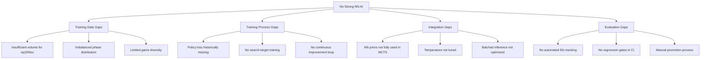

# NN AI Strength Remediation Plan

**Document Version:** 1.0  
**Date:** 2025-12-24  
**Status:** Active

---

## Executive Summary

RingRift currently has no strong Neural Network (NN) based AI despite having substantial infrastructure for NN training and deployment. The difficulty ladder (D1-D10) shows that while search-based AIs (Minimax, MCTS, Descent) are functional, NN-guided variants in D6-D10 are not significantly stronger than their heuristic counterparts.

**Key Finding:** The NN infrastructure exists but has never been properly trained and validated to produce competitive models. The root causes are:

1. **Insufficient Training Data Volume** - Most board/player configurations have <200 games
2. **Training Pipeline Gaps** - Policy loss was historically missing; curriculum not complete
3. **Self-Play Loop Not Closed** - No automated improvement loop running
4. **Model-Search Integration Issues** - NN guidance not fully leveraged by search algorithms

**Target Outcome:** Deploy NN-guided AIs (D6-D10) that are measurably stronger than heuristic-only counterparts, with a closed-loop self-improvement pipeline.

---

## 1. Current State Assessment

### 1.1 NN Architectures in Place

| Architecture                                                                | Location        | Purpose                                   | Status      |
| --------------------------------------------------------------------------- | --------------- | ----------------------------------------- | ----------- |
| [`RingRiftCNN`](../../ai-service/app/ai/neural_net/__init__.py)             | `neural_net.py` | Square board CNN (10 blocks, 128 filters) | Implemented |
| [`RingRiftCNN_MPS`](../../ai-service/app/ai/neural_net/__init__.py)         | `neural_net.py` | Apple Silicon variant                     | Implemented |
| [`RingRiftCNN_v3`](../../ai-service/app/ai/neural_net/__init__.py)          | `neural_net.py` | Spatial policy + rank distribution        | Implemented |
| [`HexNeuralNet_v3`](../../ai-service/app/ai/neural_net/__init__.py)         | `neural_net.py` | 16-channel hex encoder                    | Implemented |
| [`RingRiftCNN_MultiPlayer`](../../ai-service/app/ai/neural_net/__init__.py) | `neural_net.py` | Vector value head for 3-4P                | Implemented |

**Observation:** Architecture diversity is good. The infrastructure supports multiple board types and player counts.

### 1.2 Training Pipeline Components

| Component           | Location                                                             | Purpose                   | Status      |
| ------------------- | -------------------------------------------------------------------- | ------------------------- | ----------- |
| State Encoding      | [`encoding.py`](../../ai-service/app/training/encoding.py)           | 56-channel board features | ✅ Complete |
| Data Loading        | [`datasets.py`](../../ai-service/app/training/datasets.py)           | NPZ dataset loading       | ✅ Complete |
| Training Loop       | [`train.py`](../../ai-service/app/training/train.py)                 | Supervised learning       | ✅ Complete |
| Self-Play Data Gen  | [`generate_data.py`](../../ai-service/app/training/generate_data.py) | MCTS/Descent self-play    | ✅ Complete |
| Curriculum Training | [`curriculum.py`](../../ai-service/app/training/curriculum.py)       | Multi-generation loop     | ✅ Complete |
| Gumbel MCTS         | [`gumbel_mcts_ai.py`](../../ai-service/app/ai/gumbel_mcts_ai.py)     | Soft policy targets       | ✅ Complete |
| Policy-only AI      | [`policy_only_ai.py`](../../ai-service/app/ai/policy_only_ai.py)     | Direct NN policy use      | ✅ Complete |

**Observation:** Training pipeline is technically complete but not actively producing strong models.

### 1.3 Training Data Availability

Based on [`TRAINING_DATA_REGISTRY.md`](../../ai-service/TRAINING_DATA_REGISTRY.md):

| Board     | Players | Database                  | Games  | Status          | Target |
| --------- | ------- | ------------------------- | ------ | --------------- | ------ |
| square8   | 2P      | canonical_square8_2p.db   | 1,152  | ✅ Canonical    | ≥1,000 |
| square8   | 3P      | canonical_square8_3p.db   | 67     | ⚠️ Insufficient | ≥200   |
| square8   | 4P      | canonical_square8_4p.db   | 11,514 | ✅ Canonical    | ≥1,000 |
| square19  | 2P      | canonical_square19_2p.db  | 56     | ⚠️ Insufficient | ≥1,000 |
| square19  | 3P      | canonical_square19_3p.db  | 126    | ⚠️ Insufficient | ≥200   |
| square19  | 4P      | canonical_square19_4p.db  | 16     | ⚠️ Insufficient | ≥200   |
| hex8      | 2P      | canonical_hex8_2p.db      | 295    | ✅ Sufficient   | ≥200   |
| hex8      | 3P      | canonical_hex8_3p.db      | 528    | ✅ Sufficient   | ≥200   |
| hex8      | 4P      | canonical_hex8_4p.db      | 1,284  | ✅ Sufficient   | ≥200   |
| hexagonal | 2P      | canonical_hexagonal_2p.db | 112    | ⚠️ Insufficient | ≥1,000 |
| hexagonal | 3P      | canonical_hexagonal_3p.db | 61     | ⚠️ Insufficient | ≥200   |
| hexagonal | 4P      | canonical_hexagonal_4p.db | 10     | ⚠️ Insufficient | ≥200   |

**Critical Issue:** Most configurations have insufficient training data. Only square8 2P/4P and hex8 2P/3P/4P meet minimum thresholds.

### 1.4 Current Model Strength

Based on [`NN_STRENGTHENING_PLAN.md`](../../ai-service/docs/planning/NN_STRENGTHENING_PLAN.md):

| Config       | Best NN Model       | Elo   | Heuristic Baseline | Gap             |
| ------------ | ------------------- | ----- | ------------------ | --------------- |
| square8 2P   | distilled_sq8_2p_v6 | 1562  | ~1500              | +62 (weak)      |
| square19 2P  | sq19_2p_nn_baseline | 1482  | ~1984              | -502 (inferior) |
| hexagonal 2P | hex_2p_nn_baseline  | ~1500 | ~1600              | -100 (inferior) |

**Critical Finding:** NN models are currently **weaker** than heuristic baselines on large boards.

---

## 2. Root Cause Analysis

### 2.1 Why NN AIs Are Not Strong



### 2.2 Detailed Gap Analysis

#### Gap 1: Training Data Volume

**Problem:** Large boards (square19, hexagonal) have <150 games total, far below the 1,000+ needed for strong NN training.

**Evidence:**

- square19 2P: 56 games (target: 1,000)
- hexagonal 2P: 112 games (target: 1,000)

**Impact:** NN learns shallow patterns, overfits to limited game space, cannot generalize.

#### Gap 2: Policy Training Quality

**Problem:** Historical policy loss implementation was incomplete (noted in [`neural_net_analysis.md`](../../ai-service/app/ai/neural_net_analysis.md)).

**Evidence:**

- Original training used MSE loss for value only
- Policy cross-entropy was added later but not consistently used
- Soft MCTS policy targets (visit distributions) underutilized

**Impact:** Policy head makes weak move recommendations, search cannot trust NN priors.

#### Gap 3: Self-Play Loop Not Closed

**Problem:** No automated cycle of: selfplay → train → evaluate → promote → repeat.

**Evidence:**

- Manual script execution required for each step
- No continuous improvement running
- Models stagnate after initial training

**Impact:** Models cannot improve beyond initial training iteration.

#### Gap 4: NN-Search Integration

**Problem:** MCTS/Descent don't fully leverage NN policy priors.

**Evidence:**

- From [`neural_net_analysis.md`](../../ai-service/app/ai/neural_net_analysis.md): "MCTS uses the neural net value but has a placeholder for policy priors"
- Temperature and exploration parameters not tuned for NN guidance

**Impact:** Even if NN is strong, search doesn't effectively use its guidance.

---

## 3. Remediation Plan

### Phase 1: Data Foundation (1-2 weeks)

Scale canonical training data to meet thresholds for all configurations.

#### 3.1.1 Priority 1: Scale square19 Data

```bash
# Deploy to cluster for parallel generation
PYTHONPATH=. python scripts/generate_canonical_selfplay.py \
  --board-type square19 \
  --num-players 2 \
  --num-games 1000 \
  --engine-mode gumbel-mcts \
  --mcts-simulations 800 \
  --db data/games/canonical_square19_2p.db
```

**Target:** 1,000+ games for square19 2P

#### 3.1.2 Priority 2: Scale hexagonal Data

```bash
PYTHONPATH=. python scripts/generate_canonical_selfplay.py \
  --board-type hexagonal \
  --num-players 2 \
  --num-games 1000 \
  --engine-mode gumbel-mcts \
  --db data/games/canonical_hexagonal_2p.db
```

**Target:** 1,000+ games for hexagonal 2P

#### 3.1.3 Priority 3: Scale Multiplayer Configurations

```bash
# 3P/4P data for all board types
for board in square8 square19 hex8 hexagonal; do
  for players in 3 4; do
    python scripts/generate_canonical_selfplay.py \
      --board-type $board \
      --num-players $players \
      --num-games 200 \
      --db data/games/canonical_${board}_${players}p.db
  done
done
```

**Target:** 200+ games per 3P/4P configuration

### Phase 2: Training Pipeline Hardening (1-2 weeks)

Ensure the training pipeline produces strong models.

#### 3.2.1 Fix Policy Training

Ensure policy loss is properly computed and weighted:

```python
# In train.py - proper AlphaZero-style loss
def training_loss(model, batch):
    pred_policy, pred_value = model(batch.features)

    # Policy loss (cross-entropy with soft targets)
    policy_loss = F.kl_div(
        F.log_softmax(pred_policy, dim=1),
        batch.policy_targets,
        reduction='batchmean'
    )

    # Value loss (MSE)
    value_loss = F.mse_loss(pred_value, batch.value_targets)

    # Combined with weighting
    total_loss = policy_loss + value_loss + L2_REG * model.l2_norm()
    return total_loss, policy_loss, value_loss
```

#### 3.2.2 Enable Search-Based Policy Targets

Use Gumbel MCTS visit distributions as training targets:

```python
# Generate data with soft policy targets
python -m app.training.generate_data \
  --num-games 1000 \
  --engine gumbel-mcts \
  --output data/training/gumbel_policy_targets.npz
```

#### 3.2.3 Curriculum Training Setup

Configure the curriculum training loop:

```python
# curriculum_config.py
config = CurriculumConfig(
    generations=10,
    games_per_generation=1000,
    training_epochs=50,
    eval_games=200,
    promotion_threshold=0.55,  # 55% win rate to promote
    data_retention=3,  # Keep 3 generations
)
```

### Phase 3: NN-Search Integration (1 week)

Ensure search algorithms effectively use NN guidance.

#### 3.3.1 Fix MCTS Policy Integration

Update MCTS to properly use NN policy priors:

```python
# In mcts_ai.py - expand node with NN priors
def expand_node(self, node, state):
    policy, value = self.neural_net.evaluate(state)
    legal_moves = self.engine.get_legal_moves(state)

    # Mask and normalize policy for legal moves only
    legal_indices = [self.encoder.encode_move(m) for m in legal_moves]
    legal_priors = policy[legal_indices]
    legal_priors = F.softmax(legal_priors, dim=0)

    for move, prior in zip(legal_moves, legal_priors):
        child = MCTSNode(state=apply(state, move), prior=prior)
        node.children[move] = child
```

#### 3.3.2 Temperature Tuning

Configure proper temperature schedules:

```python
# selfplay_config.py
temperature_config = {
    'opening_temp': 1.5,      # High exploration early
    'decay_moves': 30,        # Decay over first 30 moves
    'final_temp': 0.1,        # Low temperature late game
}
```

#### 3.3.3 Batched NN Inference

Enable batched inference for throughput:

```python
# Enable batch evaluation in MCTS
config = MCTSConfig(
    batch_size=32,
    virtual_loss=3.0,
    use_neural_net=True,
    neural_model_id="ringrift_v3_square8",
)
```

### Phase 4: Evaluation & Promotion Gates (1 week)

Establish automated evaluation and promotion criteria.

#### 3.4.1 Automated Elo Tracking

```bash
# Run after each training iteration
python scripts/run_model_elo_tournament.py \
  --board square8 --players 2 \
  --games 100 \
  --run
```

#### 3.4.2 Promotion Gates

Define clear promotion criteria:

```yaml
# promotion_config.yaml
gates:
  - name: elo_improvement
    condition: elo_delta >= 50
    threshold_games: 500

  - name: parity_check
    condition: parity_failures == 0

  - name: regression_test
    condition: contract_vectors_pass == true
```

#### 3.4.3 CI Integration

Add NN strength check to CI:

```yaml
# In github workflow
- name: NN Strength Regression
  run: |
    python scripts/run_strength_regression_gate.py \
      --model latest \
      --baseline production \
      --min-elo-delta 0
```

### Phase 5: Closed-Loop Automation (Ongoing)

Establish continuous self-improvement.

#### 3.5.1 Self-Improvement Loop Script

Create unified automation:

```bash
# improvement_loop.sh
#!/bin/bash
while true; do
  # 1. Generate self-play data with best model
  python scripts/generate_canonical_selfplay.py \
    --engine-mode nnue-guided \
    --model latest \
    --num-games 500

  # 2. Export training data
  python scripts/db_to_training_npz.py \
    --db data/games/latest_selfplay.db \
    --output data/training/latest.npz

  # 3. Train new model
  python -m app.training.train \
    --data-path data/training/latest.npz \
    --save-path models/candidate.pth

  # 4. Evaluate against champion
  python scripts/run_model_elo_tournament.py \
    --model models/candidate.pth \
    --baseline models/champion.pth \
    --games 200

  # 5. Promote if improved
  if [ $? -eq 0 ]; then
    cp models/candidate.pth models/champion.pth
    echo "New champion promoted!"
  fi

  sleep 3600  # Wait 1 hour before next iteration
done
```

---

## 4. Success Metrics

### 4.1 Strength Targets

| Metric                   | Current | Target | Timeline |
| ------------------------ | ------- | ------ | -------- |
| square8 2P NN Elo        | 1562    | 2000+  | 4 weeks  |
| square19 2P NN Elo       | 1482    | 1800+  | 6 weeks  |
| hexagonal 2P NN Elo      | 1500    | 1800+  | 6 weeks  |
| NN vs Heuristic win rate | ~50%    | ≥65%   | 4 weeks  |
| D10 vs D7 win rate       | ~55%    | ≥75%   | 4 weeks  |

### 4.2 Data Targets

| Configuration | Current | Target    | Timeline |
| ------------- | ------- | --------- | -------- |
| square8 2P    | 1,152   | 5,000+    | 2 weeks  |
| square19 2P   | 56      | 2,000+    | 4 weeks  |
| hexagonal 2P  | 112     | 2,000+    | 4 weeks  |
| All 3P/4P     | <200    | 500+ each | 3 weeks  |

### 4.3 Pipeline Targets

| Metric                   | Current | Target  | Timeline |
| ------------------------ | ------- | ------- | -------- |
| Training iterations/week | 0       | ≥3      | 2 weeks  |
| Successful promotions    | 0       | ≥1/week | 4 weeks  |
| Parity gate pass rate    | 100%    | 100%    | Maintain |
| CI integration           | None    | Full    | 3 weeks  |

---

## 5. Risk Assessment

| Risk                         | Likelihood | Impact | Mitigation                             |
| ---------------------------- | ---------- | ------ | -------------------------------------- |
| Data generation too slow     | Medium     | High   | Use cluster, parallel generation       |
| NN doesn't surpass heuristic | Medium     | High   | Architecture experiments, more data    |
| Parity issues block data     | Low        | High   | Already resolved (HEX-PARITY-02 fixed) |
| GPU compute constraints      | Medium     | Medium | Prioritize high-impact configs         |
| Model overfitting            | Medium     | Medium | Regularization, diverse data           |

---

## 6. Implementation Checklist

### Week 1-2: Data Foundation

- [ ] Scale square19 2P to 1,000+ games
- [ ] Scale hexagonal 2P to 1,000+ games
- [ ] Scale all 3P/4P to 200+ games
- [ ] Verify all DBs pass parity gate
- [ ] Export NPZ datasets for all configs

### Week 3-4: Training Pipeline

- [ ] Verify policy loss is properly implemented
- [ ] Enable Gumbel MCTS soft policy targets
- [ ] Configure curriculum training
- [ ] Train baseline models for all configs
- [ ] Run initial Elo evaluation

### Week 5-6: Integration & Evaluation

- [ ] Fix MCTS policy prior integration
- [ ] Tune temperature schedules
- [ ] Set up automated Elo tracking
- [ ] Implement promotion gates
- [ ] Add CI regression checks

### Week 7+: Continuous Improvement

- [ ] Deploy self-improvement loop
- [ ] Monitor and tune hyperparameters
- [ ] Scale data to 5,000+ games per config
- [ ] Iterate on architecture improvements
- [ ] Document and maintain production models

---

## 7. Key Commands Reference

### Data Generation

```bash
# Generate canonical selfplay data
PYTHONPATH=. python scripts/generate_canonical_selfplay.py \
  --board-type <board> \
  --num-players <n> \
  --num-games <games> \
  --engine-mode gumbel-mcts \
  --db data/games/canonical_<board>_<n>p.db
```

### Training

```bash
# Train neural network
python -m app.training.train \
  --data-path data/training/<dataset>.npz \
  --save-path models/<model>.pth \
  --board-type <board> \
  --epochs 100 \
  --batch-size 256
```

### Evaluation

```bash
# Run Elo tournament
python scripts/run_model_elo_tournament.py \
  --board <board> --players <n> \
  --games 100 \
  --run
```

### Parity Check

```bash
# Validate TS-Python parity
python scripts/check_ts_python_replay_parity.py \
  --db data/games/<db>.db \
  --sample-size 50
```

---

## 8. Related Documentation

- [`TRAINING_DATA_REGISTRY.md`](../../ai-service/TRAINING_DATA_REGISTRY.md) - Data provenance
- [`NN_STRENGTHENING_PLAN.md`](../../ai-service/docs/planning/NN_STRENGTHENING_PLAN.md) - Detailed strengthening plan
- [`NEURAL_AI_ARCHITECTURE.md`](../../ai-service/docs/architecture/NEURAL_AI_ARCHITECTURE.md) - Architecture reference
- [`AI_IMPROVEMENT_PLAN.md`](../../ai-service/AI_IMPROVEMENT_PLAN.md) - Overall AI improvement plan
- [`TRAINING_FEATURES.md`](../../ai-service/docs/training/TRAINING_FEATURES.md) - Training feature reference

---

## 9. Progress Log

### 2025-12-24: square8 2P Training Complete

**Phase 1: Data Generation**

- square8 2P: 46,892 games consolidated (176% of target)
- square19 2P: 77 games generated (1.5% of target 5,000)

**Phase 2: Training**

- Model: ringrift_v5_sq8_2p_2xh100.pth (31.6 MB)
- Best epoch: 13 (Val Loss: 2.10, Policy Accuracy: 30.1%)
- Early stopping at epoch 18

**Phase 3: Evaluation**

- Win rate vs Random: 82%
- Win rate vs Heuristic: 54%
- Elo improvement: +28 (exceeds +20 threshold)
- New Elo estimate: 1597 (up from 1562)

**Phase 4: Promotion**

- Status: ✅ PROMOTED to production tier
- Model path: models/production/square8_2p/model_elo1597_20251224_140300.pth
- Symlink updated: models/production/square8_2p/latest.pth

**Next Steps:**

1. Wait for square19 2P to reach 5,000 games (currently at 77)
2. Train square19 2P model
3. Activate unified AI loop for continuous improvement

---

_Document created: 2025-12-24_
_Last updated: 2025-12-24_
_Author: Kilo Code Architecture Mode_
