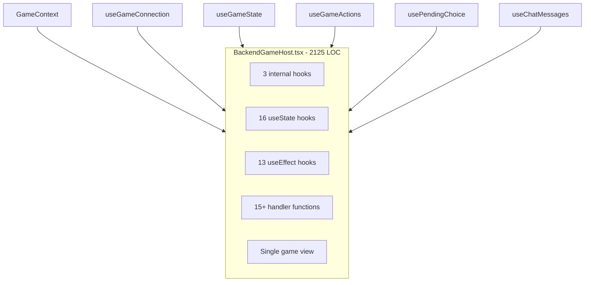
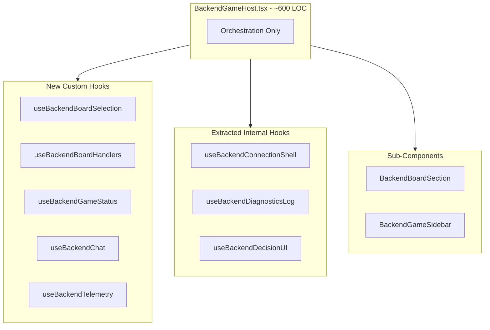
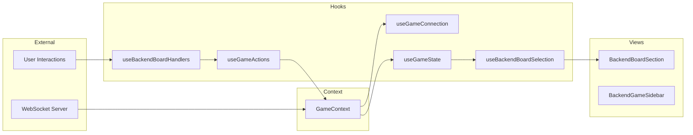

# BackendGameHost Decomposition Plan

> **Doc Status (2025-12-25): Active**
>
> Detailed decomposition plan for refactoring `BackendGameHost.tsx` from 2,125 lines into composable, testable modules.
>
> **Related Documents:**
>
> - [`docs/architecture/SANDBOX_GAME_HOST_DECOMPOSITION_PLAN.md`](SANDBOX_GAME_HOST_DECOMPOSITION_PLAN.md)
> - [`docs/architecture/REFACTORING_OPPORTUNITIES_ANALYSIS.md`](REFACTORING_OPPORTUNITIES_ANALYSIS.md)
> - [`src/client/pages/BackendGameHost.tsx`](../../src/client/pages/BackendGameHost.tsx)

---

## Executive Summary

[`BackendGameHost.tsx`](../../src/client/pages/BackendGameHost.tsx) is a significant React component at **2,125 lines**, containing:

- **~16 useState calls** for local state management
- **~13 useEffect hooks** for side effects and synchronization
- **~15 handler functions** for user interactions
- **Mixed concerns**: WebSocket connection, game state, board interactions, decision UI, chat, diagnostics

This plan proposes decomposing the component following the successful SandboxGameHost pattern:

1. **5 custom hooks** extracting related state clusters
2. **2 sub-components** for view composition
3. **Reuse of existing backend-focused hooks** where available

**Current LOC**: 2,125
**Target LOC**: ~600 (orchestrator) + ~1,400 (distributed across hooks/components)
**Target Reduction**: ~45-55%

---

## 1. Current State Analysis

### 1.1 Key Differences from SandboxGameHost

| Aspect           | BackendGameHost               | SandboxGameHost                  |
| ---------------- | ----------------------------- | -------------------------------- |
| **LOC**          | 2,125                         | 1,922 (post-decomposition)       |
| **State Source** | WebSocket + GameContext       | ClientSandboxEngine              |
| **Connection**   | Backend via useGameConnection | Local engine                     |
| **AI Control**   | Server-side                   | Client-side via useSandboxAILoop |
| **Persistence**  | Server-managed                | useSandboxPersistence            |
| **Scenarios**    | N/A                           | useSandboxScenarios              |
| **Clock**        | Server time control           | useSandboxClock                  |
| **Setup View**   | N/A (separate lobby)          | Integrated setup view            |

### 1.2 State Inventory (useState Hooks)

| Category      | State Variable                | Type                         | Purpose                     | Lines   |
| ------------- | ----------------------------- | ---------------------------- | --------------------------- | ------- |
| **Selection** | `selected`                    | `Position \| undefined`      | Selected cell position      | 564     |
| **Selection** | `validTargets`                | `Position[]`                 | Valid move targets          | 565     |
| **UI/Modal**  | `ringPlacementCountPrompt`    | `Object \| null`             | Ring placement count dialog | 567-571 |
| **UI/Modal**  | `fatalGameError`              | `Object \| null`             | Fatal error banner          | 573-576 |
| **UI/Modal**  | `isVictoryModalDismissed`     | `boolean`                    | Victory modal state         | 580     |
| **UI/Modal**  | `showBoardControls`           | `boolean`                    | Board controls overlay      | 583     |
| **Sidebar**   | `showAdvancedSidebarPanels`   | `boolean`                    | Advanced panels toggle      | 588-595 |
| **Resign**    | `isResigning`                 | `boolean`                    | Resignation in progress     | 610     |
| **Resign**    | `isResignConfirmOpen`         | `boolean`                    | Confirm dialog open         | 611     |
| **Chat**      | `chatInput`                   | `string`                     | Chat input value            | 627     |
| **Refs**      | `weirdStateFirstSeenAtRef`    | `Ref<number \| null>`        | Weird state timing          | 616     |
| **Refs**      | `weirdStateTypeRef`           | `Ref<RulesUxWeirdStateType>` | Weird state type            | 617     |
| **Refs**      | `weirdStateResignReportedRef` | `Ref<Set<string>>`           | Telemetry tracking          | 618     |
| **Refs**      | `calibrationEventReportedRef` | `Ref<boolean>`               | Calibration event flag      | 623     |

### 1.3 Effect Inventory (useEffect Hooks)

| Effect                    | Dependencies                           | Purpose                          | Lines   |
| ------------------------- | -------------------------------------- | -------------------------------- | ------- |
| LocalStorage sidebar sync | `showAdvancedSidebarPanels`            | Persist sidebar preference       | 597-607 |
| Victory modal reset       | `routeGameId, victoryState`            | Reset modal on game change       | 883-886 |
| Rematch navigation        | `rematchGameId`                        | Navigate to rematch game         | 891-895 |
| Ring placement highlights | `gameState.currentPhase, validMoves`   | Auto-highlight placements        | 898-915 |
| Keyboard handler          | `showBoardControls`                    | Escape key handler               | 923-947 |
| Weird state tracking      | `gameState, victoryState`              | Track weird states for telemetry | 778-805 |
| Calibration event         | `victoryState, gameState, routeGameId` | Emit calibration telemetry       | 810-856 |
| Game error placeholder    | `routeGameId`                          | Future error event handling      | 859-880 |

### 1.4 Internal Hooks Already Defined

The component already extracts some logic into internal hooks:

1. **`useBackendConnectionShell`** (Lines 170-201): Connection lifecycle management
2. **`useBackendDiagnosticsLog`** (Lines 213-435): Phase/player/choice event logging
3. **`useBackendDecisionUI`** (Lines 453-467): Pending choice and countdown

### 1.5 Handler Function Inventory

| Handler                           | Purpose                           | Approx Lines | Domain            |
| --------------------------------- | --------------------------------- | ------------ | ----------------- |
| `handleBackendCellClick`          | Board cell click handling         | 150          | Board Interaction |
| `handleBackendCellDoubleClick`    | Double-click for 2-ring placement | 50           | Board Interaction |
| `handleBackendCellContextMenu`    | Context menu for placement count  | 55           | Board Interaction |
| `handleConfirmRingPlacementCount` | Confirm placement count dialog    | 20           | Board Interaction |
| `handleResign`                    | Game resignation with telemetry   | 65           | Game Actions      |
| `getInstruction`                  | Phase-based instruction text      | 35           | UI                |
| `renderGameHeader`                | Game header with player summary   | 25           | UI                |

### 1.6 View Structure

The component renders a single game view branch (unlike SandboxGameHost which has setup + game):

1. **Loading/Error states** (~60 lines, 1355-1414)
   - Connecting spinner
   - Error display
   - Game not available

2. **Active game view** (~710 lines, 1416-2125)
   - Screen reader announcer
   - Connection/opponent status banners
   - Header with game info
   - Victory modal
   - Main layout with board and sidebar
   - Board section
   - Sidebar with HUD, panels, chat
   - Modal dialogs

---

## 2. Proposed Architecture

### 2.1 Component Tree Diagram

```
BackendGameHost - orchestrator, ~600 LOC
├── BackendBoardSection ~400 LOC
│   ├── BoardView - existing
│   ├── BoardInfoPanel
│   └── SelectionPanel
│
└── BackendGameSidebar ~450 LOC
    ├── GameHUD/MobileGameHUD - existing
    ├── ChoiceDialog - existing
    ├── ChatPanel
    ├── AdvancedPanelsCollapsible
    │   ├── GameHistoryPanel
    │   └── EvaluationPanel
    └── MoveHistory - existing
```

### 2.2 Hook Extraction Plan

#### Hook 1: `useBackendBoardSelection` (New)

**Extracted from**: Lines 564-565, 898-915, 951-965, 971-1005, and selection-related effects

**State**:

- `selected: Position | undefined`
- `validTargets: Position[]`

**Effects**:

- Auto-highlight placement targets when in ring_placement phase
- Clear selection on phase change

**Interface**:

```typescript
interface UseBackendBoardSelectionReturn {
  selected: Position | undefined;
  setSelected: (pos: Position | undefined) => void;
  validTargets: Position[];
  setValidTargets: (targets: Position[]) => void;
  mustMoveFrom: Position | undefined;
  chainCapturePath: Position[] | undefined;
  clearSelection: () => void;
}

function useBackendBoardSelection(
  gameState: GameState | null,
  validMoves: Move[] | null
): UseBackendBoardSelectionReturn;
```

**Parallels**: `useSandboxBoardSelection` in sandbox decomposition

#### Hook 2: `useBackendBoardHandlers` (New)

**Extracted from**: Lines 1008-1158, 1161-1210, 1213-1264

**State**:

- `ringPlacementCountPrompt: Object | null`

**Handlers**:

- `handleCellClick`
- `handleCellDoubleClick`
- `handleCellContextMenu`
- `handleConfirmRingPlacementCount`

**Interface**:

```typescript
interface UseBackendBoardHandlersReturn {
  ringPlacementCountPrompt: RingPlacementPrompt | null;
  handleCellClick: (pos: Position, board: BoardState) => void;
  handleCellDoubleClick: (pos: Position, board: BoardState) => void;
  handleCellContextMenu: (pos: Position, board: BoardState) => void;
  handleConfirmRingPlacementCount: (count: number) => void;
  closeRingPlacementPrompt: () => void;
}

function useBackendBoardHandlers(
  gameState: GameState | null,
  validMoves: Move[] | null,
  selection: UseBackendBoardSelectionReturn,
  submitMove: (move: PartialMove) => void,
  isPlayer: boolean,
  isConnectionActive: boolean,
  isMyTurn: boolean,
  triggerInvalidMove: (pos: Position, reason: string) => void
): UseBackendBoardHandlersReturn;
```

**Parallels**: `useSandboxMoveHandlers` + `useSandboxRingPlacement` combined

#### Hook 3: `useBackendGameStatus` (New)

**Extracted from**: Lines 573-576, 580, 610-611, 883-886, 1289-1352

**State**:

- `fatalGameError: Object | null`
- `isVictoryModalDismissed: boolean`
- `isResigning: boolean`
- `isResignConfirmOpen: boolean`

**Handlers**:

- `handleResign`
- `dismissVictoryModal`
- `clearFatalError`

**Interface**:

```typescript
interface UseBackendGameStatusReturn {
  fatalGameError: { message: string; technical?: string } | null;
  isVictoryModalDismissed: boolean;
  isResigning: boolean;
  isResignConfirmOpen: boolean;
  setIsResignConfirmOpen: (open: boolean) => void;
  handleResign: () => Promise<void>;
  dismissVictoryModal: () => void;
  setFatalGameError: (error: Object | null) => void;
}

function useBackendGameStatus(
  gameId: string | null,
  gameState: GameState | null,
  victoryState: GameResult | null,
  routeGameId: string
): UseBackendGameStatusReturn;
```

**Parallels**: Partial parallel to `useSandboxGameLifecycle`

#### Hook 4: `useBackendChat` (New)

**Extracted from**: Lines 627, 2064-2100

**State**:

- `chatInput: string`

**Interface**:

```typescript
interface UseBackendChatReturn {
  chatInput: string;
  setChatInput: (input: string) => void;
  messages: ChatMessage[];
  sendMessage: (text: string) => void;
  handleSubmit: (e: React.FormEvent) => void;
}

function useBackendChat(
  backendChatMessages: ChatMessage[],
  sendChatMessage: (text: string) => void
): UseBackendChatReturn;
```

**Note**: Sandbox does not have chat, so this is backend-specific.

#### Hook 5: `useBackendTelemetry` (New)

**Extracted from**: Lines 616-623, 778-805, 810-856

**Refs**:

- `weirdStateFirstSeenAtRef`
- `weirdStateTypeRef`
- `weirdStateResignReportedRef`
- `calibrationEventReportedRef`

**Effects**:

- Track weird state for resign telemetry
- Emit calibration game completed events

**Interface**:

```typescript
interface UseBackendTelemetryReturn {
  getWeirdStateContext: () => { type: string; durationSeconds: number } | null;
  markWeirdStateResignReported: (type: string) => void;
  isCalibrationEventReported: () => boolean;
  markCalibrationEventReported: () => void;
}

function useBackendTelemetry(
  gameState: GameState | null,
  victoryState: GameResult | null,
  routeGameId: string
): UseBackendTelemetryReturn;
```

**Parallels**: Partially similar to `useSandboxEvaluation` telemetry aspects

### 2.3 Existing Hooks to Leverage

The following hooks already exist and are used by BackendGameHost:

| Hook                     | Usage                   | Notes                  |
| ------------------------ | ----------------------- | ---------------------- |
| `useGameConnection`      | Connection lifecycle    | Already well-extracted |
| `useGameState`           | Game state subscription | Already well-extracted |
| `useGameActions`         | Move submission         | Already well-extracted |
| `usePendingChoice`       | Decision/choice state   | Already well-extracted |
| `useChatMessages`        | Chat message handling   | Already well-extracted |
| `useDecisionCountdown`   | Timer reconciliation    | Already well-extracted |
| `useAutoMoveAnimation`   | Move animations         | Already well-extracted |
| `useInvalidMoveFeedback` | Invalid move feedback   | Already well-extracted |
| `useGameSoundEffects`    | Sound effects           | Already well-extracted |
| `useGlobalGameShortcuts` | Keyboard shortcuts      | Already well-extracted |
| `useGameAnnouncements`   | Screen reader           | Already well-extracted |

### 2.4 Sub-Component Extraction

#### Component 1: `BackendBoardSection`

**Location**: `src/client/components/backend/BackendBoardSection.tsx`

**Extracted from**: Lines 1864-1881 (board rendering section)

**Props**:

```typescript
interface BackendBoardSectionProps {
  boardType: BoardType;
  board: BoardState;
  viewModel: BoardViewModel;
  selected: Position | undefined;
  validTargets: Position[];
  onCellClick: (pos: Position) => void;
  onCellDoubleClick: (pos: Position) => void;
  onCellContextMenu: (pos: Position) => void;
  isSpectator: boolean;
  pendingAnimation?: MoveAnimation;
  onAnimationComplete: () => void;
  chainCapturePath?: Position[];
  shakingCellKey: string | null;
  onShowKeyboardHelp: () => void;
}
```

#### Component 2: `BackendGameSidebar`

**Location**: `src/client/components/backend/BackendGameSidebar.tsx`

**Extracted from**: Lines 1883-2101 (sidebar section)

**Props**:

```typescript
interface BackendGameSidebarProps {
  // HUD
  hudViewModel: HUDViewModel;
  timeControl: TimeControl | null;
  isMobile: boolean;
  rulesUxContext: RulesUxContext;
  onShowBoardControls: () => void;

  // Choice dialog
  pendingChoice: PlayerChoice | null;
  choiceViewModel: ChoiceViewModel | null;
  choiceDeadline: number | null;
  timeRemainingMs: number | null;
  isServerCapped: boolean;
  onSelectOption: (choice: PlayerChoice, option: unknown) => void;
  isPlayer: boolean;

  // Selection panel
  selected: Position | undefined;
  selectedStackDetails: StackDetails | null;
  boardType: BoardType;
  boardInteractionMessage: string | null;

  // Move history
  moves: Move[];
  currentMoveIndex: number;

  // Resign
  isResignEnabled: boolean;
  isConnectionActive: boolean;
  isResigning: boolean;
  isResignConfirmOpen: boolean;
  onResign: () => Promise<void>;
  onResignConfirmOpenChange: (open: boolean) => void;

  // Swap rule
  swapRuleState: SwapRuleState | null;
  onSwapSides: () => void;

  // Auto-resolved decision
  decisionAutoResolved: DecisionAutoResolvedMeta | null;

  // Event log
  eventLog: string[];
  showSystemEventsInLog: boolean;
  onToggleSystemEvents: () => void;
  gameHistory: GameHistoryEntry[];
  victoryState: GameResult | null;

  // Advanced panels
  showAdvancedPanels: boolean;
  onAdvancedPanelsToggle: (show: boolean) => void;
  gameId: string;
  evaluationHistory: PositionEvaluationPayload['data'][];
  players: Player[];

  // Chat
  chatMessages: ChatMessage[];
  chatInput: string;
  onChatInputChange: (input: string) => void;
  onChatSubmit: (e: React.FormEvent) => void;
}
```

---

## 3. Migration Strategy

### Phase 1: Extract New Hooks (Low Risk)

**Goal**: Move state and effects into custom hooks without changing behavior.

**Steps**:

1. Create `hooks/useBackendBoardSelection.ts`
2. Create `hooks/useBackendBoardHandlers.ts`
3. Create `hooks/useBackendGameStatus.ts`
4. Create `hooks/useBackendChat.ts`
5. Create `hooks/useBackendTelemetry.ts`
6. Update BackendGameHost to use new hooks
7. Run existing tests to verify no regressions

**Testing Strategy**:

- Existing E2E tests should pass unchanged
- Add unit tests for each extracted hook
- Verify backend games work end-to-end

**Rollback**: Revert hook files and inline state back into BackendGameHost.

### Phase 2: Promote Internal Hooks (Low Risk)

**Goal**: Move the already-defined internal hooks to standalone files.

**Steps**:

1. Extract `useBackendConnectionShell` to `hooks/useBackendConnectionShell.ts`
2. Extract `useBackendDiagnosticsLog` to `hooks/useBackendDiagnosticsLog.ts`
3. Extract `useBackendDecisionUI` to `hooks/useBackendDecisionUI.ts`
4. Update imports in BackendGameHost

**Note**: These are already well-encapsulated; this is a file organization change.

### Phase 3: Extract Sub-Components (Medium Risk)

**Goal**: Split view rendering into composable sub-components.

**Extraction Order** (safest first):

1. `BackendBoardSection` (board rendering wrapper)
2. `BackendGameSidebar` (complex but isolated)

**Per-Component Process**:

1. Create component file with extracted JSX
2. Define props interface
3. Replace inline JSX with component usage
4. Verify behavior unchanged via E2E tests
5. Add component-level tests

**Testing Strategy**:

- E2E gameplay tests
- Component unit tests for new components

### Phase 4: Evaluate Shared Components (Optional, Higher Risk)

**Goal**: Identify opportunities to share components between Backend and Sandbox.

**Candidates for sharing**:

1. Board section wrapper pattern
2. Sidebar layout pattern
3. Selection panel component

**Deferred**: This phase requires careful design of a shared `GameFacade` abstraction.

---

## 4. Comparison with SandboxGameHost Patterns

### 4.1 Patterns to Reuse

| Pattern                 | Sandbox Implementation     | Backend Adaptation                                              |
| ----------------------- | -------------------------- | --------------------------------------------------------------- |
| Board selection hook    | `useSandboxBoardSelection` | `useBackendBoardSelection` - simpler, no line highlights        |
| Move handlers hook      | `useSandboxMoveHandlers`   | `useBackendBoardHandlers` - uses `submitMove` instead of engine |
| Diagnostics log         | In-component               | `useBackendDiagnosticsLog` already extracted inline             |
| Advanced panels toggle  | LocalStorage persistence   | Same pattern, already present                                   |
| Board section component | `SandboxBoardSection`      | `BackendBoardSection` - similar structure                       |
| Sidebar component       | `SandboxGameSidebar`       | `BackendGameSidebar` - add chat, remove AI controls             |

### 4.2 Backend-Specific Concerns

| Concern                 | Implementation                            |
| ----------------------- | ----------------------------------------- |
| WebSocket connection    | Already handled by `useGameConnection`    |
| Reconnection UI         | Status banners in host component          |
| Opponent disconnection  | `disconnectedOpponents` from context      |
| Rematch flow            | Server-driven via `useGame` context       |
| Chat                    | Backend-only, needs `useBackendChat`      |
| Server-capped decisions | Already handled by `useDecisionCountdown` |
| Spectator mode          | `isPlayer` flag throughout                |

### 4.3 What Backend Does NOT Need

- Clock management (server-controlled)
- AI tracking/loop (server-side AI)
- Scenario loading (no scenarios in backend)
- Persistence hooks (server manages state)
- Evaluation hooks (server evaluates)
- Game lifecycle (lobby handles this)
- Setup view (separate lobby page)

---

## 5. Risk Assessment

### Regression Risks

| Risk                        | Likelihood | Impact | Mitigation                          |
| --------------------------- | ---------- | ------ | ----------------------------------- |
| WebSocket state sync breaks | Low        | High   | Existing hooks well-tested          |
| Decision UI timing breaks   | Low        | High   | useDecisionCountdown already tested |
| Board interaction breaks    | Medium     | High   | Comprehensive handler tests         |
| Chat breaks                 | Low        | Low    | Simple state management             |
| Spectator mode breaks       | Low        | Medium | E2E tests cover spectating          |
| Rematch flow breaks         | Low        | Medium | Server-driven, minimal client logic |

### Testing Requirements

**Before Phase 1**:

- [ ] Document all existing E2E tests that cover backend games
- [ ] Run full E2E suite and capture baseline
- [ ] Create backend-specific test scenarios if gaps exist

**Per Phase**:

- [ ] Run E2E suite after each hook extraction
- [ ] Manual smoke test: human vs AI game, spectate, rematch
- [ ] Verify chat and diagnostics work

---

## 6. Implementation Checklist

### Phase 1: Extract New Hooks

- [ ] Create `src/client/hooks/useBackendBoardSelection.ts`
  - [ ] Extract selection state (Lines 564-565)
  - [ ] Extract mustMoveFrom derivation (Lines 951-965)
  - [ ] Extract chainCapturePath derivation (Lines 971-1005)
  - [ ] Extract placement target highlighting (Lines 898-915)
  - [ ] Add unit tests
- [ ] Create `src/client/hooks/useBackendBoardHandlers.ts`
  - [ ] Extract ring placement prompt state (Lines 567-571)
  - [ ] Extract cell click handler (Lines 1008-1158)
  - [ ] Extract double-click handler (Lines 1161-1210)
  - [ ] Extract context menu handler (Lines 1213-1264)
  - [ ] Extract confirm ring count handler (Lines 1266-1286)
  - [ ] Add unit tests
- [ ] Create `src/client/hooks/useBackendGameStatus.ts`
  - [ ] Extract fatal error state (Lines 573-576)
  - [ ] Extract victory modal dismissed state (Lines 580)
  - [ ] Extract resign states (Lines 610-611)
  - [ ] Extract resign handler (Lines 1289-1352)
  - [ ] Extract victory modal reset effect (Lines 883-886)
  - [ ] Add unit tests
- [ ] Create `src/client/hooks/useBackendChat.ts`
  - [ ] Extract chat input state (Line 627)
  - [ ] Extract submit handler (from form submission)
  - [ ] Add unit tests
- [ ] Create `src/client/hooks/useBackendTelemetry.ts`
  - [ ] Extract weird state tracking refs (Lines 616-618)
  - [ ] Extract calibration ref (Line 623)
  - [ ] Extract weird state tracking effect (Lines 778-805)
  - [ ] Extract calibration event effect (Lines 810-856)
  - [ ] Add unit tests
- [ ] Update BackendGameHost to use hooks
- [ ] Run E2E tests
- [ ] Manual smoke test

### Phase 2: Promote Internal Hooks

- [ ] Extract `useBackendConnectionShell` to separate file
- [ ] Extract `useBackendDiagnosticsLog` to separate file
- [ ] Extract `useBackendDecisionUI` to separate file
- [ ] Update imports in BackendGameHost
- [ ] Run E2E tests

### Phase 3: Extract Sub-Components

- [ ] Create `src/client/components/backend/BackendBoardSection.tsx`
  - [ ] Extract board rendering JSX
  - [ ] Define props interface
  - [ ] Add unit tests
- [ ] Create `src/client/components/backend/BackendGameSidebar.tsx`
  - [ ] Extract sidebar rendering JSX
  - [ ] Define props interface
  - [ ] Add unit tests
- [ ] Update BackendGameHost to use sub-components
- [ ] Run E2E tests
- [ ] Manual smoke test all game modes

---

## 7. Success Metrics

| Metric                             | Current | Target                  |
| ---------------------------------- | ------- | ----------------------- |
| BackendGameHost.tsx LOC            | 2,125   | ~600                    |
| useState calls in BackendGameHost  | ~16     | ~5 (delegated to hooks) |
| useEffect hooks in BackendGameHost | ~13     | ~3                      |
| Internal helper functions in host  | 3       | 0 (extracted)           |
| Time to understand backend flow    | ~1 hour | <20 min                 |

---

## 8. Architecture Diagrams

### Current Architecture



### Target Architecture



### Data Flow



---

## Appendix A: File Locations

| New File                                                | Purpose                          |
| ------------------------------------------------------- | -------------------------------- |
| `src/client/hooks/useBackendBoardSelection.ts`          | Board selection state            |
| `src/client/hooks/useBackendBoardHandlers.ts`           | Cell interaction handlers        |
| `src/client/hooks/useBackendGameStatus.ts`              | Game status and resign           |
| `src/client/hooks/useBackendChat.ts`                    | Chat state management            |
| `src/client/hooks/useBackendTelemetry.ts`               | Telemetry and tracking           |
| `src/client/hooks/useBackendConnectionShell.ts`         | Connection lifecycle (extracted) |
| `src/client/hooks/useBackendDiagnosticsLog.ts`          | Event logging (extracted)        |
| `src/client/hooks/useBackendDecisionUI.ts`              | Decision UI (extracted)          |
| `src/client/components/backend/BackendBoardSection.tsx` | Board section component          |
| `src/client/components/backend/BackendGameSidebar.tsx`  | Sidebar component                |

---

## Appendix B: Shared Infrastructure

These modules could be made more generic for Backend/Sandbox sharing in future:

| Shared Concept      | Current Implementation | Future Opportunity                  |
| ------------------- | ---------------------- | ----------------------------------- |
| Board selection     | Separate hooks         | `useBoardSelection` with mode param |
| Sidebar layout      | Separate components    | `GameSidebar` with slot props       |
| Victory modal logic | Duplicated             | Shared `useVictoryModal` hook       |
| Selection panel     | Inline in both         | `SelectionPanel` component          |

---

## Revision History

| Date       | Author                  | Changes              |
| ---------- | ----------------------- | -------------------- |
| 2025-12-25 | Claude (Architect mode) | Initial plan created |
