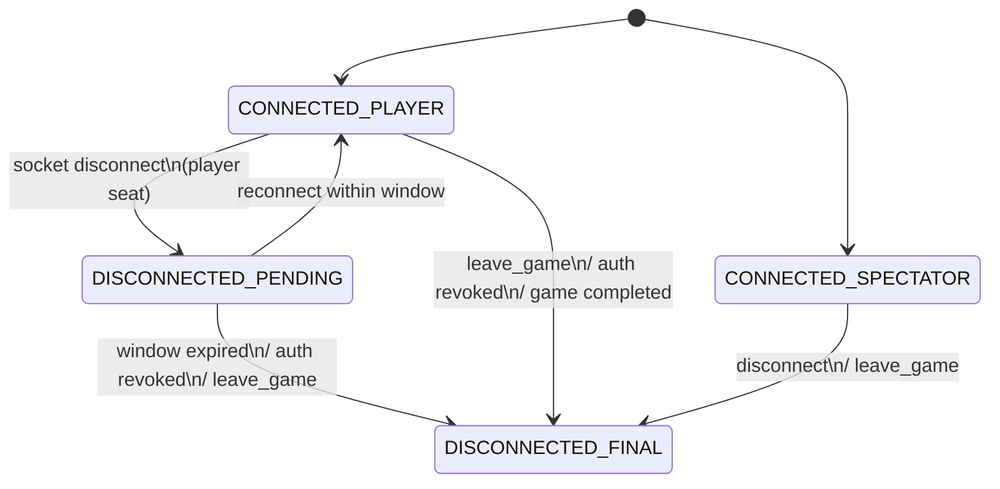

# Canonical Engine Public API

> **SSoT alignment:** This document is a derived view over the following canonical sources:
>
> - **Rules semantics SSoT:** `RULES_CANONICAL_SPEC.md`, `ringrift_complete_rules.md` / `ringrift_compact_rules.md`, and the shared TypeScript rules engine under `src/shared/engine/**` (helpers, mutators, aggregates, orchestrator, contracts plus v2 contract vectors in `tests/fixtures/contract-vectors/v2/**`).
> - **Lifecycle/API SSoT:** `src/shared/types/game.ts`, `src/shared/engine/orchestration/types.ts`, `src/shared/types/websocket.ts`, and `src/shared/validation/websocketSchemas.ts` define the executable Move + orchestrator + WebSocket lifecycle that this doc describes.
> - **Precedence:** If this document ever conflicts with those types, orchestrator implementations, WebSocket schemas, or contract vectors, **code and tests win** and this document must be updated to match them.
>
> In other words, this file is documentation for the canonical engine API; it is not itself a semantics SSoT.

**Task:** T1-W1-B
**Date:** 2025-11-26
**Status:** Complete (Updated with Orchestration Layer)

## 1. Overview

This document defines the narrow, stable public API boundary for the canonical RingRift rules engine located in [`src/shared/engine/`](../src/shared/engine/).

> **Note (November 2025):** A new canonical **Turn Orchestrator** layer has been added in [`src/shared/engine/orchestration/`](../src/shared/engine/orchestration/README.md). This provides `processTurn()` and `processTurnAsync()` as single entry points for turn processing. See [Section 3.9](#39-orchestration-domain-new) for details.

This API is designed to be:

1. **Narrow** - Only essential functions are exported
2. **Stable** - Changes inside the engine don't break adapters
3. **Domain-Driven** - Organized by game domain (Placement, Movement, Capture, Line, Territory, Victory)
4. **Type-Safe** - All inputs/outputs have explicit TypeScript types
5. **Pure** - No side effects; state passed in and returned out

### Design Philosophy

The canonical engine implements RingRift rules as **pure functions** that transform [`GameState`](../src/shared/types/game.ts) immutably. Adapters (Server GameEngine, Client Sandbox, Python AI Service) are responsible for:

- Orchestrating turn/phase flow
- Managing player interaction (choices, timeouts)
- Persistence and networking
- AI integration

The engine itself knows nothing about WebSockets, databases, or user interfaces.

---

## 2. Type Exports

### 2.1 Core Types (from [`src/shared/types/game.ts`](../src/shared/types/game.ts))

```typescript
// Board & Position
export type { Position, BoardType, BoardState, BoardConfig };
export type { RingStack, MarkerInfo, MarkerType };

// Game State
export type { GameState, GameStatus, GamePhase };
export type { Player, PlayerType, AIProfile };
export type { TimeControl };

// Moves & Actions
export type { Move, MoveType, MovePayload };
export type { LineInfo, Territory };

// Configuration
export { BOARD_CONFIGS };

// Utilities
export { positionToString, stringToPosition, positionsEqual };
```

### 2.2 Engine Types (from [`src/shared/engine/types.ts`](../src/shared/engine/types.ts))

```typescript
// Validation
export type { ValidationResult };

// Actions (for host-level action dispatch)
export type { GameAction, ActionType };
export type { PlaceRingAction, MoveStackAction, OvertakingCaptureAction };
export type { ProcessLineAction, ChooseLineRewardAction };
export type { ProcessTerritoryAction, EliminateStackAction };
export type { SkipPlacementAction };

// Generics
export type { Validator, Mutator };
```

### 2.3 Domain Result Types

```typescript
// Turn/Phase
export type { TurnAdvanceResult, PerTurnState } from './turnLogic';
export type { TurnLogicDelegates } from './turnLogic';

// Victory
export type { VictoryResult, VictoryReason } from './victoryLogic';

// Placement
export type { PlacementContext, PlacementValidationResult } from './validators/PlacementValidator';
export type { PlacementApplicationOutcome } from './placementHelpers';

// Movement
export type { SimpleMoveTarget, MovementBoardAdapters } from './movementLogic';

// Capture
export type { CaptureBoardAdapters } from './captureLogic';

// Line Processing
export type { LineEnumerationOptions, LineDecisionApplicationOutcome } from './lineDecisionHelpers';

// Territory Processing
export type { TerritoryProcessingContext, TerritoryProcessingOutcome } from './territoryProcessing';
export type {
  TerritoryEnumerationOptions,
  TerritoryProcessApplicationOutcome,
} from './territoryDecisionHelpers';
export type {
  TerritoryEliminationScope,
  EliminateRingsFromStackOutcome,
} from './territoryDecisionHelpers';

// Board Views (for adapters implementing board interfaces)
export type { MovementBoardView, CaptureSegmentBoardView } from './core';
export type { MarkerPathHelpers } from './core';

// Progress Tracking
export type { ProgressSnapshot, BoardSummary, GameHistoryEntry, GameTrace } from '../types/game';
```

### 2.4 Canonical GamePhase and MoveType literals

For quick reference, the following string literals come directly from the `GamePhase` and
`MoveType` unions in `src/shared/types/game.ts` and should be treated as canonical when
integrating with the engine:

```text
GamePhase:
  'ring_placement' | 'movement' | 'capture' | 'chain_capture' | 'line_processing' | 'territory_processing'

MoveType:
  'place_ring' | 'move_ring' | 'build_stack' | 'move_stack' |
  'overtaking_capture' | 'continue_capture_segment' |
  'swap_sides' |
  'process_line' | 'choose_line_reward' |
  'process_territory_region' | 'eliminate_rings_from_stack' |
  'line_formation' | 'territory_claim' | 'skip_placement'
```

These literals are the **single source of truth** for host/UI/transport code that needs to
branch on a particular phase or move kind. Adapters must not introduce additional ad-hoc
string discriminants outside these sets.

---

## 3. Function Exports by Domain

### 3.1 Placement Domain

**Location:** [`validators/PlacementValidator.ts`](../src/shared/engine/validators/PlacementValidator.ts), [`placementHelpers.ts`](../src/shared/engine/placementHelpers.ts)

```typescript
// Validation (Board-Level)
validatePlacementOnBoard(
  board: BoardState,
  to: Position,
  requestedCount: number,
  ctx: PlacementContext
): PlacementValidationResult

// Validation (GameState-Level)
validatePlacement(state: GameState, action: PlaceRingAction): ValidationResult
validateSkipPlacement(state: GameState, action: SkipPlacementAction): ValidationResult

// Application (canonical helpers in PlacementAggregate / placementHelpers.ts; production-backed)
applyPlacementMove(state: GameState, move: Move): PlacementApplicationOutcome
evaluateSkipPlacementEligibility(state: GameState, player: number): SkipPlacementEligibilityResult
```

**Usage Pattern:**

```typescript
import {
  validatePlacementOnBoard,
  PlacementContext,
} from '@shared/engine/validators/PlacementValidator';

const ctx: PlacementContext = {
  boardType: state.board.type,
  player: currentPlayer,
  ringsInHand: player.ringsInHand,
  ringsPerPlayerCap: BOARD_CONFIGS[state.board.type].ringsPerPlayer,
};

const result = validatePlacementOnBoard(state.board, targetPos, 1, ctx);
if (result.valid) {
  // Apply placement via the canonical helpers (applyPlacementMove / processTurn), not host-specific logic.
}
```

---

### 3.2 Movement Domain

**Location:** [`movementLogic.ts`](../src/shared/engine/movementLogic.ts), [`validators/MovementValidator.ts`](../src/shared/engine/validators/MovementValidator.ts)

```typescript
// Enumeration
enumerateSimpleMoveTargetsFromStack(
  boardType: BoardType,
  from: Position,
  player: number,
  board: MovementBoardAdapters
): SimpleMoveTarget[]

// Validation
validateMovement(state: GameState, action: MoveStackAction): ValidationResult

// Reachability Check (used for no-dead-placement and forced elimination)
hasAnyLegalMoveOrCaptureFromOnBoard(
  boardType: BoardType,
  from: Position,
  player: number,
  board: MovementBoardView,
  options?: { maxNonCaptureDistance?: number; maxCaptureLandingDistance?: number }
): boolean
```

**Usage Pattern:**

```typescript
import { enumerateSimpleMoveTargetsFromStack, MovementBoardAdapters } from '@shared/engine/movementLogic';

const adapters: MovementBoardAdapters = {
  isValidPosition: (pos) => isValidPosition(pos, boardType, board.size),
  isCollapsedSpace: (pos) => board.collapsedSpaces.has(positionToString(pos)),
  getStackAt: (pos) => /* stack lookup */,
  getMarkerOwner: (pos) => /* marker lookup */,
};

const moves = enumerateSimpleMoveTargetsFromStack(boardType, fromPos, player, adapters);
```

---

### 3.3 Capture Domain

**Location:** [`captureLogic.ts`](../src/shared/engine/captureLogic.ts), [`core.ts`](../src/shared/engine/core.ts), [`validators/CaptureValidator.ts`](../src/shared/engine/validators/CaptureValidator.ts)

```typescript
// Enumeration
enumerateCaptureMoves(
  boardType: BoardType,
  from: Position,
  playerNumber: number,
  adapters: CaptureBoardAdapters,
  moveNumber: number
): Move[]

// Validation (single segment)
validateCaptureSegmentOnBoard(
  boardType: BoardType,
  from: Position,
  target: Position,
  landing: Position,
  player: number,
  board: CaptureSegmentBoardView
): boolean

// Validation (GameState-level)
validateCapture(state: GameState, action: OvertakingCaptureAction): ValidationResult
```

**Usage Pattern:**

```typescript
import { enumerateCaptureMoves, CaptureBoardAdapters } from '@shared/engine/captureLogic';

const adapters: CaptureBoardAdapters = {
  isValidPosition: (pos) => /* bounds check */,
  isCollapsedSpace: (pos) => /* collapsed lookup */,
  getStackAt: (pos) => /* stack lookup with capHeight */,
  getMarkerOwner: (pos) => /* marker lookup */,
};

const captures = enumerateCaptureMoves(boardType, fromPos, player, adapters, moveNumber);
```

---

### 3.4 Line Domain

**Location:** [`lineDetection.ts`](../src/shared/engine/lineDetection.ts), [`lineDecisionHelpers.ts`](../src/shared/engine/lineDecisionHelpers.ts)

```typescript
// Detection
findAllLines(board: BoardState): LineInfo[]
findLinesForPlayer(board: BoardState, playerNumber: number): LineInfo[]

// Decision Enumeration
enumerateProcessLineMoves(
  state: GameState,
  player: number,
  options?: LineEnumerationOptions
): Move[]

enumerateChooseLineRewardMoves(
  state: GameState,
  player: number,
  lineIndex: number
): Move[]

// Application
applyProcessLineDecision(state: GameState, move: Move): LineDecisionApplicationOutcome
applyChooseLineRewardDecision(state: GameState, move: Move): LineDecisionApplicationOutcome
```

**Result Type:**

```typescript
interface LineDecisionApplicationOutcome {
  nextState: GameState;
  pendingLineRewardElimination: boolean;
}
```

**Usage Pattern:**

```typescript
import { findLinesForPlayer } from '@shared/engine/lineDetection';
import {
  enumerateProcessLineMoves,
  applyProcessLineDecision,
} from '@shared/engine/lineDecisionHelpers';

// Detect lines for current player
const lines = findLinesForPlayer(state.board, currentPlayer);

if (lines.length > 0) {
  // Enumerate decision moves
  const lineMoves = enumerateProcessLineMoves(state, currentPlayer);

  // Let player/AI choose a move
  const chosenMove = await getPlayerChoice(lineMoves);

  // Apply the decision
  const { nextState, pendingLineRewardElimination } = applyProcessLineDecision(state, chosenMove);
}
```

---

### 3.5 Territory Domain

**Location:** [`territoryDetection.ts`](../src/shared/engine/territoryDetection.ts), [`territoryProcessing.ts`](../src/shared/engine/territoryProcessing.ts), [`territoryDecisionHelpers.ts`](../src/shared/engine/territoryDecisionHelpers.ts)

```typescript
// Detection
findDisconnectedRegions(board: BoardState): Territory[]

// Processability Check
canProcessTerritoryRegion(
  board: BoardState,
  region: Territory,
  ctx: TerritoryProcessingContext
): boolean

filterProcessableTerritoryRegions(
  board: BoardState,
  regions: Territory[],
  ctx: TerritoryProcessingContext
): Territory[]

getProcessableTerritoryRegions(
  board: BoardState,
  ctx: TerritoryProcessingContext
): Territory[]

// Board-Level Application
applyTerritoryRegion(
  board: BoardState,
  region: Territory,
  ctx: TerritoryProcessingContext
): TerritoryProcessingOutcome

// Decision Enumeration
enumerateProcessTerritoryRegionMoves(
  state: GameState,
  player: number,
  options?: TerritoryEnumerationOptions
): Move[]

enumerateTerritoryEliminationMoves(
  state: GameState,
  player: number,
  scope?: TerritoryEliminationScope
): Move[]

// Application
applyProcessTerritoryRegionDecision(
  state: GameState,
  move: Move
): TerritoryProcessApplicationOutcome

applyEliminateRingsFromStackDecision(
  state: GameState,
  move: Move
): EliminateRingsFromStackOutcome
```

**Result Types:**

```typescript
interface TerritoryProcessApplicationOutcome {
  nextState: GameState;
  processedRegionId: string;
  processedRegion: Territory;
  pendingSelfElimination: boolean;
}

interface EliminateRingsFromStackOutcome {
  nextState: GameState;
}
```

**Usage Pattern:**

```typescript
import { findDisconnectedRegions } from '@shared/engine/territoryDetection';
import {
  getProcessableTerritoryRegions,
  enumerateProcessTerritoryRegionMoves,
  applyProcessTerritoryRegionDecision,
  enumerateTerritoryEliminationMoves,
  applyEliminateRingsFromStackDecision,
} from '@shared/engine/territoryDecisionHelpers';

// Find processable regions for current player
const regions = getProcessableTerritoryRegions(state.board, { player: currentPlayer });

if (regions.length > 0) {
  const regionMoves = enumerateProcessTerritoryRegionMoves(state, currentPlayer);
  const chosenMove = await getPlayerChoice(regionMoves);

  const { nextState, pendingSelfElimination } = applyProcessTerritoryRegionDecision(
    state,
    chosenMove
  );

  if (pendingSelfElimination) {
    const elimMoves = enumerateTerritoryEliminationMoves(nextState, currentPlayer);
    const elimChoice = await getPlayerChoice(elimMoves);
    const { nextState: finalState } = applyEliminateRingsFromStackDecision(nextState, elimChoice);
  }
}
```

---

### 3.6 Victory Domain

**Location:** [`victoryLogic.ts`](../src/shared/engine/victoryLogic.ts)

```typescript
// Evaluation
evaluateVictory(state: GameState): VictoryResult

// Tie-breaker Helper
getLastActor(state: GameState): number | undefined
```

**Result Type:**

```typescript
interface VictoryResult {
  isGameOver: boolean;
  winner?: number;
  reason?: VictoryReason;
  handCountsAsEliminated?: boolean;
}

type VictoryReason =
  | 'ring_elimination'
  | 'territory_control'
  | 'last_player_standing'
  | 'game_completed';
```

**Usage Pattern:**

```typescript
// Validation (GameState-Level)
validatePlacement(state: GameState, action: PlaceRingAction): ValidationResult
validateSkipPlacement(state: GameState, action: SkipPlacementAction): ValidationResult

// Application helpers
// NOTE: As of November 2025 the canonical placement helpers live in
// `src/shared/engine/aggregates/PlacementAggregate.ts` and are wired into the
// orchestrator as `applyPlacementMoveAggregate` and
// `evaluateSkipPlacementEligibilityAggregate`. The functions exported from
// `placementHelpers.ts` are fully implemented, production-backed shims over
// this aggregate and are used by both backend and sandbox hosts.
applyPlacementMove(state: GameState, move: Move): PlacementApplicationOutcome
evaluateSkipPlacementEligibility(state: GameState, player: number): SkipPlacementEligibilityResult
```

---

### 3.7 Turn Management

**Location:** [`turnLogic.ts`](../src/shared/engine/turnLogic.ts)

```typescript
// Turn/Phase Progression
advanceTurnAndPhase(
  state: GameState,
  turn: PerTurnState,
  delegates: TurnLogicDelegates
): TurnAdvanceResult
```

**Types:**

```typescript
interface PerTurnState {
  hasPlacedThisTurn: boolean;
  mustMoveFromStackKey?: string;
}

interface TurnAdvanceResult {
  nextState: GameState;
  nextTurn: PerTurnState;
}

interface TurnLogicDelegates {
  getPlayerStacks(
    state: GameState,
    player: number
  ): Array<{ position: Position; stackHeight: number }>;
  hasAnyPlacement(state: GameState, player: number): boolean;
  hasAnyMovement(state: GameState, player: number, turn: PerTurnState): boolean;
  hasAnyCapture(state: GameState, player: number, turn: PerTurnState): boolean;
  applyForcedElimination(state: GameState, player: number): GameState;
  getNextPlayerNumber(state: GameState, current: number): number;
}
```

**Usage Pattern:**

```typescript
import { advanceTurnAndPhase, PerTurnState, TurnLogicDelegates } from '@shared/engine/turnLogic';

const turnState: PerTurnState = { hasPlacedThisTurn: false };

const delegates: TurnLogicDelegates = {
  getPlayerStacks: (s, p) => /* enumerate player stacks */,
  hasAnyPlacement: (s, p) => /* check placement availability */,
  hasAnyMovement: (s, p, t) => /* check movement availability */,
  hasAnyCapture: (s, p, t) => /* check capture availability */,
  applyForcedElimination: (s, p) => /* handle forced elimination */,
  getNextPlayerNumber: (s, c) => /* seat order logic */,
};

const { nextState, nextTurn } = advanceTurnAndPhase(state, turnState, delegates);
```

---

### 3.8 Core Utilities

**Location:** [`core.ts`](../src/shared/engine/core.ts)

```typescript
// Geometry
getMovementDirectionsForBoardType(boardType: BoardType): Direction[]
getPathPositions(from: Position, to: Position): Position[]
calculateDistance(boardType: BoardType, from: Position, to: Position): number

// Stack Calculations
calculateCapHeight(rings: number[]): number
countRingsOnBoardForPlayer(board: BoardState, playerNumber: number): number
countRingsInPlayForPlayer(state: GameState, playerNumber: number): number

// Marker Effects
applyMarkerEffectsAlongPathOnBoard(
  board: BoardState,
  from: Position,
  to: Position,
  playerNumber: number,
  helpers: MarkerPathHelpers,
  options?: { leaveDepartureMarker?: boolean }
): void

// State Hashing & Debugging
hashGameState(state: GameState): string
summarizeBoard(board: BoardState): BoardSummary
computeProgressSnapshot(state: GameState): ProgressSnapshot
```

---

### 3.9 Orchestration Domain (NEW)

**Location:** [`orchestration/`](../src/shared/engine/orchestration/)

The orchestration layer provides a single, canonical entry point for all turn processing, delegating to domain aggregates in deterministic order and surfacing **pending decisions** as canonical `Move[]` options. For host-driven rules interactions, these orchestrator functions are the only canonical entrypoints for applying moves, validating candidate moves, and enumerating legal actions; backend and sandbox hosts must treat this surface as the lifecycle and rules-surface SSoT for turn processing.

```typescript
// Main Entry Points (canonical orchestrator)
processTurn(state: GameState, move: Move): ProcessTurnResult;

processTurnAsync(
  state: GameState,
  move: Move,
  delegates: TurnProcessingDelegates
): Promise<ProcessTurnResult>;

// Validation & enumeration helpers
type ValidationResult = { valid: boolean; reason?: string };

validateMove(state: GameState, move: Move): ValidationResult;
getValidMoves(state: GameState): Move[];
hasValidMoves(state: GameState): boolean;
```

**Result & decision types (mirrors `orchestration/types.ts`):**

```typescript
interface ProcessTurnResult {
  /** Next game state after applying the move */
  nextState: GameState;

  /** Whether the turn completed or is blocked on a decision */
  status: 'complete' | 'awaiting_decision';

  /** Pending decision if status is 'awaiting_decision' */
  pendingDecision?: PendingDecision;

  /** Victory state if the game ended during this turn */
  victoryResult?: VictoryState;

  /** Debug/diagnostic metadata (phases traversed, S-invariant, etc.) */
  metadata: ProcessingMetadata;
}

type DecisionType =
  | 'line_order'
  | 'line_reward'
  | 'region_order'
  | 'elimination_target'
  | 'capture_direction'
  | 'chain_capture';

interface PendingDecision {
  /** What kind of decision is being requested */
  type: DecisionType;

  /** Player who must make the decision */
  player: number;

  /** Canonical Move options for this decision */
  options: Move[];

  /** Optional timeout hint (enforced by adapters, not the engine) */
  timeoutMs?: number;

  /** UI/transport-oriented context (board highlights, copy, etc.) */
  context: DecisionContext;
}

/**
 * ProcessingMetadata semantics:
 *
 * - `sInvariantBefore` / `sInvariantAfter` are the canonical S‑invariant values
 *   computed via `computeProgressSnapshot(state).S` from `src/shared/engine/core.ts`.
 *   They use the same definition as contract vectors and invariant soaks:
 *
 *     S = markers + collapsedSpaces + eliminatedRings
 *
 *   where `eliminatedRings` is derived from `totalRingsEliminated` /
 *   `board.eliminatedRings` when present. These fields are intended to be
 *   **monotone non‑decreasing** over legal moves and are consumed by:
 *
 *   - orchestrator invariant soaks (`scripts/run-orchestrator-soak.ts`);
 *   - S‑invariant regression tests
 *     (`tests/unit/OrchestratorSInvariant.regression.test.ts`);
 *   - contract vector assertions (`sInvariantDelta` in v2 fixtures).
 */
```

> **Victory reasons:** The orchestrator's `VictoryState.reason` union is a superset of the
> rules-level `VictoryResult.reason` from `victoryLogic.ts`—it adds host/transport reasons
> such as `'stalemate_resolution'` and `'resignation'`. Rules semantics for ring-elimination
> and territory-control victories, last-player-standing, and `game_completed` remain anchored
> to `evaluateVictory(...)` in the shared engine; adapters may layer additional host-level
> reasons without redefining rules.

**Decision surfaces and PlayerChoice mapping:**

The orchestrator exposes **only canonical `Move` options**. Transport-level decision objects (WebSocket payloads, UI flows, `PlayerChoice*` types) must treat these as:

> "Select one specific `Move.id` from `pendingDecision.options`."

The core type alignment is:

- Orchestrator `DecisionType` ↔ shared `PlayerChoiceType`:
  - `'line_order'` ↔ `PlayerChoiceType: 'line_order'`
  - `'line_reward'` ↔ `PlayerChoiceType: 'line_reward_option'`
  - `'region_order'` ↔ `PlayerChoiceType: 'region_order'`
  - `'elimination_target'` ↔ `PlayerChoiceType: 'ring_elimination'`
  - `'capture_direction'` ↔ `PlayerChoiceType: 'capture_direction'`
  - `'chain_capture'` – currently surfaced as capture `Move` options; choice flows may treat each `Move` as an implicit direction choice.
- For `line_order`, `region_order`, and `ring_elimination` choices, the shared types in [`game.ts`](../src/shared/types/game.ts) include stable `moveId` fields that point back to the canonical `Move.id` in `pendingDecision.options`.

This ensures that **all decision semantics live in the engine’s `Move` model**, and transports/clients only ever pick among already‑validated canonical actions.

**Usage Pattern (adapter perspective):**

```typescript
import type { GameState, Move } from '@shared/types/game';
import {
  processTurnAsync,
  type ProcessTurnResult,
  type TurnProcessingDelegates,
} from '@shared/engine/orchestration/turnOrchestrator';

async function applyMoveViaOrchestrator(
  state: GameState,
  move: Move,
  delegates: TurnProcessingDelegates
): Promise<ProcessTurnResult> {
  const result = await processTurnAsync(state, move, delegates);

  if (result.status === 'awaiting_decision' && result.pendingDecision) {
    // Present canonical Move options to player/AI based on DecisionType
    // and PlayerChoiceType mapping
    const choiceMove = await delegates.resolveDecision(result.pendingDecision);
    return processTurnAsync(result.nextState, choiceMove, delegates);
  }

  return result;
}
```

**Adapters:**

Two adapters wrap the orchestrator for specific runtime contexts and are the
only sanctioned production integration layers for this API in live games:

1. **Backend Adapter:** [`TurnEngineAdapter.ts`](../src/server/game/turn/TurnEngineAdapter.ts)
   - Wraps the orchestrator with WebSocket/session concerns and persistence.
   - Uses `processTurnAsync`, `validateMove`, `getValidMoves`, and `hasValidMoves` to drive backend rules interactions.
   - Maps `VictoryState` → backend `GameResult` and emits `game:state_update` / `game:ended` events.
   - Controlled by the `useOrchestratorAdapter` feature flag inside the server `GameEngine`.

2. **Sandbox Adapter:** [`SandboxOrchestratorAdapter.ts`](../src/client/sandbox/SandboxOrchestratorAdapter.ts)
   - Wraps the orchestrator for browser-local simulation and tooling.
   - Provides the same surface as `ClientSandboxEngine` (get state, apply moves, query validity).
   - Uses `processTurn` / `processTurnAsync` + `validateMove` / `getValidMoves` to power local RulesMatrix/FAQ scenarios and AI-vs-AI tests.
   - Controlled by a feature flag that allows switching between legacy sandbox flows and the orchestrator-backed path.

In both cases, **`Move` remains the canonical action**, and all decision/choice flows are thin wrappers over orchestrator-provided `Move` options.

Beneath the orchestrator, the domain aggregates and helper modules under `src/shared/engine/**` form the rules-semantics SSoT for their respective domains:

- [`MovementAggregate`](../src/shared/engine/aggregates/MovementAggregate.ts) together with [`movementLogic.ts`](../src/shared/engine/movementLogic.ts) for non-capturing movement.
- [`CaptureAggregate`](../src/shared/engine/aggregates/CaptureAggregate.ts) together with [`captureLogic.ts`](../src/shared/engine/captureLogic.ts) and [`captureChainHelpers.ts`](../src/shared/engine/captureChainHelpers.ts) for capture and chain-capture semantics.
- [`PlacementAggregate`](../src/shared/engine/aggregates/PlacementAggregate.ts) together with [`placementHelpers.ts`](../src/shared/engine/placementHelpers.ts) for placement, multi-ring placement on empty cells, stacking rules, and the no-dead-placement rule.
- [`LineAggregate`](../src/shared/engine/aggregates/LineAggregate.ts) together with helpers such as [`lineDetection.ts`](../src/shared/engine/lineDetection.ts) and [`lineDecisionHelpers.ts`](../src/shared/engine/lineDecisionHelpers.ts) for line detection and line-reward decisions.
- [`TerritoryAggregate`](../src/shared/engine/aggregates/TerritoryAggregate.ts) together with helpers such as [`territoryDetection.ts`](../src/shared/engine/territoryDetection.ts), [`territoryProcessing.ts`](../src/shared/engine/territoryProcessing.ts), and [`territoryDecisionHelpers.ts`](../src/shared/engine/territoryDecisionHelpers.ts) for Territory disconnection, Q23 self-elimination prerequisites, and explicit Territory decisions.
- Victory helpers such as [`victoryLogic.ts`](../src/shared/engine/victoryLogic.ts) and [`VictoryAggregate`](../src/shared/engine/aggregates/VictoryAggregate.ts) for ring-elimination, Territory-control, and last-player-standing victory semantics.

Hosts (backend and sandbox) must treat these aggregates and helpers as the **only authoritative implementation** of movement, capture, placement, line, Territory, and victory rules semantics. Production hosts must go through the orchestrator (`processTurn` / `processTurnAsync` together with `validateMove` / `getValidMoves` / `hasValidMoves`) via [`TurnEngineAdapter`](../src/server/game/turn/TurnEngineAdapter.ts) or [`SandboxOrchestratorAdapter`](../src/client/sandbox/SandboxOrchestratorAdapter.ts); direct calls into aggregates or helpers are reserved for tests, diagnostics, and tooling. For a design-level view of these aggregates see [`docs/DOMAIN_AGGREGATE_DESIGN.md`](../docs/DOMAIN_AGGREGATE_DESIGN.md), and for rule-ID → implementation mapping see [`RULES_IMPLEMENTATION_MAPPING.md`](../RULES_IMPLEMENTATION_MAPPING.md). For consolidation and rollout details, see [`docs/SHARED_ENGINE_CONSOLIDATION_PLAN.md`](../docs/SHARED_ENGINE_CONSOLIDATION_PLAN.md) and [`docs/ORCHESTRATOR_ROLLOUT_PLAN.md`](../docs/ORCHESTRATOR_ROLLOUT_PLAN.md).

##### 3.9.0a High-level turn + decision flow (diagram)

The following diagram summarises the canonical rules flow shared across
`ARCHITECTURE_ASSESSMENT.md` (§2, §4), this document (§3.9–3.9.1), and
`AI_ARCHITECTURE.md` (§1, “Rules, shared engine, and training topology”):

```mermaid
flowchart LR
    subgraph Host
      HState[GameState]
      HMove[Move]
    end

    subgraph Orchestrator
      OProc[processTurn / processTurnAsync]
      OPhases[Phase state machine]
      OPend[PendingDecision]
    end

    subgraph Aggregates
      APlace[PlacementAggregate]
      AMove[MovementAggregate]
      ACapture[CaptureAggregate]
      ALine[LineAggregate]
      ATerr[TerritoryAggregate]
      AVict[VictoryAggregate]
    end

    subgraph Transport
      PC[PlayerChoice*]
      WS[WebSocket payloads]
    end

    HState -->|HMove| OProc
    OProc --> APlace --> AMove --> ACapture --> ALine --> ATerr --> AVict --> OPhases
    OPhases -->|complete| HState
    OPhases -->|awaiting_decision| OPend

    OPend -->|options: Move[]| PC
    PC --> WS --> PC
    PC -->|selected moveId| OProc
```

This is the same conceptual lifecycle described in
`ARCHITECTURE_ASSESSMENT.md` (“The "Move" Lifecycle (Canonical Orchestrator + Hosts)”)
and referenced from `AI_ARCHITECTURE.md` (§1). All three docs should be read
as different views on this single orchestrator‑centred flow.

#### 3.9.1 WebSocket transport and PlayerChoice over Moves

**Key types & modules:**

- Canonical actions & decisions:
  - `Move`, `MoveType`, `GamePhase`, `PlayerChoice*`, `PlayerChoiceType` – [`src/shared/types/game.ts`](../src/shared/types/game.ts)
  - `DecisionType`, `PendingDecision`, `ProcessTurnResult` – [`src/shared/engine/orchestration/types.ts`](../src/shared/engine/orchestration/types.ts)
- WebSocket contracts:
  - Server↔client events & payloads – [`src/shared/types/websocket.ts`](../src/shared/types/websocket.ts)
  - Zod schemas for inbound payloads – [`src/shared/validation/websocketSchemas.ts`](../src/shared/validation/websocketSchemas.ts)
- Backend handlers:
  - Game WebSocket server wiring – [`src/server/websocket/server.ts`](../src/server/websocket/server.ts)
  - Per-game interaction bridge – [`src/server/game/WebSocketInteractionHandler.ts`](../src/server/game/WebSocketInteractionHandler.ts)
  - Game session state machine – [`src/shared/stateMachines/gameSession.ts`](../src/shared/stateMachines/gameSession.ts)

At the WebSocket boundary, **all rules interactions are expressed in terms of canonical `Move` objects and their IDs**:

- The `game_state` event (`GameStateUpdateMessage`) always includes:
  - `gameState: GameState` – full authoritative state.
  - `validMoves: Move[]` – the orchestrator/adapter-provided set of legal actions for the active player.
- Clients submit actions via:
  - `player_move` with a `PlayerMovePayload` that carries a `MovePayload` (type + positions).
  - `player_move_by_id` with a `PlayerMoveByIdPayload` that references a previously-advertised `Move.id`.
- Decision phases that require structured choices (line order, line reward, territory order, ring elimination, capture direction) are surfaced as:
  - `player_choice_required` events with a concrete `PlayerChoice` variant whose `options` each map back to **one canonical `Move.id`** when a canonical Move exists for that decision.
  - `player_choice_response` events from the client, carrying `PlayerChoiceResponse.selectedOption` that must match one of the advertised `options` (validated server-side in `WebSocketInteractionHandler`).

The **type alignment** between orchestrator decisions, PlayerChoice, and WebSockets is:

- Orchestrator `DecisionType` ↔ `PlayerChoiceType` ↔ WebSocket payloads:
  - `DecisionType: 'line_order'` ↔ `PlayerChoiceType: 'line_order'` ↔ `LineOrderChoice.options[*].moveId` (canonical `process_line` Move.id).
  - `DecisionType: 'line_reward'` ↔ `PlayerChoiceType: 'line_reward_option'` ↔ `LineRewardChoice.moveIds[option_*]` (canonical `choose_line_reward` Move.id per option).
  - `DecisionType: 'region_order'` ↔ `PlayerChoiceType: 'region_order'` ↔ `RegionOrderChoice.options[*].moveId` (canonical `process_territory_region` Move.id).
  - `DecisionType: 'elimination_target'` ↔ `PlayerChoiceType: 'ring_elimination'` ↔ `RingEliminationChoice.options[*].moveId` (canonical `eliminate_rings_from_stack` Move.id).
  - `DecisionType: 'capture_direction'` ↔ `PlayerChoiceType: 'capture_direction'` ↔ `CaptureDirectionChoice.options[*]` (currently matched structurally; future work may attach explicit `moveId`s for the corresponding capture `Move`).
  - `DecisionType: 'chain_capture'` – handled today via additional `Move` submissions for follow-up segments (no dedicated `PlayerChoiceType`); UIs guide the player to select further capture segments by sending more canonical capture moves.

In all of these cases, the **semantic contract** is:

> WebSockets and UI never invent new decision payloads; they **only ever choose** among canonical `Move` instances that were already enumerated and validated by the orchestrator.

Concretely:

- For primary actions (placement, movement, overtaking capture, chain continuation):
  - Server sends `validMoves: Move[]` in `game_state`.
  - Client selects a move via `player_move` / `player_move_by_id`.
  - Backend GameEngine or `TurnEngineAdapter` re-validates and passes the `Move` to `processTurn` / `processTurnAsync`.
- For decision phases (line/territory/elimination/capture-direction):
  - Orchestrator produces a `PendingDecision` with `options: Move[]`.
  - Adapters derive a `PlayerChoice` with `options` annotated by the corresponding `Move.id` where applicable.
  - Client replies with `player_choice_response` selecting exactly one of those options.
  - The adapter resolves the choice back into the canonical `Move` (using `moveId` or structural matching) and feeds it to `processTurn` / `processTurnAsync`.

This architecture ensures that **`Move` remains the single canonical description of "what action occurred"**, while WebSockets and PlayerChoice types provide a user- and transport-friendly way to:

- Present decisions.
- Enforce timeouts and defaults.
- Log and replay decisions in terms of stable `Move.id`s across backend, sandbox, and Python parity harnesses.

**Client cancellation and sandbox interactions**

- WebSocket-backed hosts (backend Game pages) treat connection loss and
  reconnection within the documented window as transport concerns; the
  `SocketGameConnection` implementation and higher-level hooks (e.g.
  `GameContext`) own:
  - connection status tracking (connected / reconnecting / disconnected),
  - reconnection attempts within a finite window, and
  - cooperative cancellation of in-flight async work using the shared
    `CancellationToken` / `runWithTimeout` utilities where appropriate.
- Sandbox hosts (`SandboxGameHost` + `useSandboxInteractions`) do **not**
  establish WebSocket connections. All interactions are local to
  `ClientSandboxEngine` and:
  - respect the current `GameState.gameStatus` (ignoring clicks once
    the game is no longer active),
  - clear or ignore input while local AI turns are running, and
  - do not participate in backend reconnection windows or WebSocket
    cancellation logic.

#### 3.9.3 Operational metrics & invariants (orchestrator-facing)

While this document focuses on **function-level** API, the orchestrator
surface is also wired into a small set of metrics that form part of the
operational contract for rollout, scale, and invariant soaks. These metrics
are emitted by [`MetricsService.ts`](../src/server/services/MetricsService.ts)
and referenced from the rollout and alerting docs:

- **Orchestrator error rate:**  
  `ringrift_orchestrator_error_rate` – fraction of orchestrator‑backed
  operations that resulted in an error within the current circuit‑breaker
  window. Backed by `OrchestratorRolloutService.recordSuccess/recordError`
  and used by both:
  - CI SLOs (`SLO-CI-ORCH-PARITY`, `SLO-STAGE-ORCH-ERROR`,
    `SLO-PROD-ORCH-ERROR` in `ORCHESTRATOR_ROLLOUT_PLAN.md`), and
  - alerts such as `OrchestratorErrorRateWarning` in
    `monitoring/prometheus/alerts.yml`.

- **Circuit‑breaker state:**  
  `ringrift_orchestrator_circuit_breaker_state` – `0` when closed,
  `1` when open. Driven by `OrchestratorRolloutService` and mirrored in:
  - the admin status endpoint
    (`/api/admin/orchestrator/status`), and
  - the `OrchestratorCircuitBreakerOpen` alert.

- **Rollout percentage:**  
  `ringrift_orchestrator_rollout_percentage` – current effective rollout
  percentage as seen by the backend host. This is a **derived view over**
  `config.orchestrator.rolloutPercentage` and
  `config.featureFlags.orchestrator.rolloutPercentage`, and is used in
  rollout dashboards and in the environment/phase mapping tables in
  `ORCHESTRATOR_ROLLOUT_PLAN.md` §8.1.1.

- **Shadow mismatch rate:**  
  `ringrift_orchestrator_shadow_mismatch_rate` – rate of divergences between
  orchestrator and legacy paths when shadow mode is enabled. This complements
  the TS↔Python rules‑parity metrics and is referenced by the
  `OrchestratorShadowMismatches` alert group and by
  `SLO-STAGE-ORCH-PARITY` / `SLO-PROD-RULES-PARITY` in
  `ORCHESTRATOR_ROLLOUT_PLAN.md`.

- **Invariant violations (invariant soaks):**  
  `ringrift_orchestrator_invariant_violations_total{type, invariant_id}` – counter for detected
  violations of S‑invariant and related progress invariants during normal
  traffic and orchestrator soaks.
  - `type` is a low‑level violation identifier emitted by hosts and the soak harness
    (for example `S_INVARIANT_DECREASED`, `ACTIVE_NO_MOVES`,
    `NEGATIVE_STACK_HEIGHT`, `ORCHESTRATOR_VALIDATE_MOVE_FAILED`).
  - `invariant_id` is a high‑level invariant ID from
    `docs/INVARIANTS_AND_PARITY_FRAMEWORK.md` (for example `INV-S-MONOTONIC`,
    `INV-ACTIVE-NO-MOVES`, `INV-STATE-STRUCTURAL`, `INV-ORCH-VALIDATION`,
    `INV-TERMINATION`), derived from `type` by `MetricsService`.  
    Violations are:
  - surfaced via short/long soak JSON summaries
    (`results/orchestrator_soak_smoke.json`,
    `results/orchestrator_soak_nightly.json`),
  - checked in CI by `orchestrator-soak-smoke` /
    `orchestrator-short-soak` (`SLO-CI-ORCH-SHORT-SOAK`), and
  - monitored in staging/production via alert thresholds described in
    `docs/ALERTING_THRESHOLDS.md`. Dashboards and alert queries should
    generally group by `invariant_id` rather than raw `type` strings.

- **Rules-parity mismatches (TS ↔ Python):**  
  In addition to the per-dimension counters used by `RulesParity*` alerts:
  - `ringrift_rules_parity_valid_mismatch_total`
  - `ringrift_rules_parity_hash_mismatch_total`
  - `ringrift_rules_parity_game_status_mismatch_total`  
    the backend also exposes a unified counter:  
    `ringrift_rules_parity_mismatches_total{mismatch_type, suite}` – incremented by `RulesBackendFacade.compareTsAndPython()` via `rulesParityMetrics` / `MetricsService.recordRulesParityMismatch`.
  - `mismatch_type` ∈ {`validation`, `hash`, `s_invariant`, `game_status`} and matches the parity IDs in `docs/INVARIANTS_AND_PARITY_FRAMEWORK.md`.
  - `suite` identifies the parity harness, for example `runtime_shadow`, `runtime_python_mode`, or `runtime_ts`.  
    This metric allows dashboards to aggregate and break down parity incidents across suites while keeping alert expressions focused on the per-dimension counters above.

Host implementors must treat these metrics as **observability surfaces over
the canonical orchestrator behaviour**, not as alternative sources of truth
for rules semantics. Changes to their meaning or emission points must remain
aligned with:

- `docs/ORCHESTRATOR_ROLLOUT_PLAN.md` §6.6 (metrics and SLOs),
- `docs/ALERTING_THRESHOLDS.md` (alert expressions and thresholds), and
- the invariant‑soak profiles in `docs/STRICT_INVARIANT_SOAKS.md`.

#### 3.9.2 Worked example: `PendingDecision → PlayerChoice → WebSocket → Move`

This section gives a concrete, code-aligned example of how a **line reward decision** flows from the orchestrator through backend adapters and WebSockets, and back into a canonical `Move`.

> **Scope:** This describes the **canonical orchestrator-backed backend path**.
> Today, `GameEngine` + `TurnEngineAdapter` form the primary backend integration
> over `processTurnAsync`, and `WebSocketInteractionHandler` already uses
> `PlayerChoice` with `moveId` fields for line/territory/elimination decisions.
> Legacy `RuleEngine`/`GameEngine` pipelines are retained only for tests,
> diagnostics, or circuit‑breaker/rollback scenarios; new backend behaviour
> must integrate via `TurnEngineAdapter` and the orchestrator contracts shown
> here (Move IDs carried through `PlayerChoice` and WebSocket payloads).

##### Step 1: Orchestrator produces a `PendingDecision`

After a move that creates multiple scoring lines, the orchestrator’s `processTurnAsync`
returns a `ProcessTurnResult` in the **`awaiting_decision`** state:

```ts
import { processTurnAsync } from '@shared/engine/orchestration/turnOrchestrator';
import type { GameState, Move } from '@shared/types/game';
import type { TurnProcessingDelegates } from '@shared/engine/orchestration/types';

async function applyPlayerMove(state: GameState, move: Move, delegates: TurnProcessingDelegates) {
  const result = await processTurnAsync(state, move, delegates);

  if (result.status === 'awaiting_decision' && result.pendingDecision) {
    // For this example, assume:
    // result.pendingDecision.type === 'line_reward'
    // result.pendingDecision.options: Move[] of type 'choose_line_reward'
    return result.pendingDecision;
  }

  return result;
}
```

At this point the orchestrator knows **everything needed to resolve the rules**:

- `pendingDecision.type === 'line_reward'` (or `'line_order'`, `'region_order'`, etc.)
- `pendingDecision.options: Move[]` – each `Move` is a fully validated
  `choose_line_reward` action with a stable `Move.id`.

##### Step 2: Backend adapter builds a `PlayerChoice`

A backend adapter (today: `GameEngine` line/territory helpers; Phase 3: `TurnEngineAdapter`

- a `DecisionHandler` implemented via `WebSocketInteractionHandler`) converts that
  `PendingDecision` into a transport-level `PlayerChoice`.

The **contract** is:

- Each `PlayerChoice` option carries a **`moveId`** that points back to exactly one
  canonical `Move.id` in `pendingDecision.options`.
- The rest of the option payload is **UI/transport shape** (IDs, marker positions, etc.).

For a line reward decision, the choice looks like:

```ts
import type { LineRewardChoice } from '@shared/types/game';

function buildLineRewardChoice(
  gameId: string,
  pending: PendingDecision // type === 'line_reward'
): LineRewardChoice {
  return {
    id: `line-reward-${gameId}-${Date.now()}`,
    gameId,
    playerNumber: pending.player,
    type: 'line_reward_option',
    prompt: 'Choose how to collapse this line for your reward',
    timeoutMs: pending.timeoutMs,
    options: ['option_1_collapse_all_and_eliminate', 'option_2_min_collapse_no_elimination'],
    moveIds: {
      option_1_collapse_all_and_eliminate: pending.options[0]?.id,
      option_2_min_collapse_no_elimination: pending.options[1]?.id,
    },
  };
}
```

The same pattern is used for other decision types:

- `LineOrderChoice.options[*].moveId` → canonical `'process_line'` `Move.id`.
- `RegionOrderChoice.options[*].moveId` → canonical `'process_territory_region'` `Move.id`.
- `RingEliminationChoice.options[*].moveId` → canonical `'eliminate_rings_from_stack'` `Move.id`.

##### Step 3: WebSocket transport: `player_choice_required` / `player_choice_response`

The backend emits the `PlayerChoice` over WebSockets using the shared contracts in
`src/shared/types/websocket.ts` and `src/shared/validation/websocketSchemas.ts`:

```ts
// server/websocket/server.ts
io.to(targetSocketId).emit('player_choice_required', choice); // choice: PlayerChoice
```

On the client side, React state (e.g. `GameContext`) renders the appropriate UI for the
specific `PlayerChoiceType` and, when the user selects an option, sends:

```ts
socket.emit('player_choice_response', {
  choiceId: choice.id,
  playerNumber: currentPlayerNumber,
  choiceType: choice.type, // optional but recommended
  selectedOption: 'option_2_min_collapse_no_elimination',
});
```

`WebSocketInteractionHandler.handleChoiceResponse(...)` receives this payload,
locates the pending `PlayerChoice`, and validates that `selectedOption` is one of
`choice.options[*]`.

##### Step 4: Resolving back to a canonical `Move`

The **backend decision handler** is responsible for mapping the selected option back
into the canonical `Move` using the `moveId` fields:

```ts
import type { PendingDecision } from '@shared/engine/orchestration/types';
import type { LineRewardChoice, PlayerChoiceResponseFor } from '@shared/types/game';

async function resolveLineRewardDecision(
  pending: PendingDecision,
  emitChoice: (choice: LineRewardChoice) => Promise<PlayerChoiceResponseFor<LineRewardChoice>>
): Promise<Move> {
  const choice = buildLineRewardChoice('game-123', pending);
  const response = await emitChoice(choice);

  const option = response.selectedOption; // one of the union options
  const moveId = choice.moveIds?.[option];
  if (!moveId) {
    throw new Error(`No canonical Move.id mapped for selected option: ${option}`);
  }

  const move = pending.options.find((m) => m.id === moveId);
  if (!move) {
    throw new Error(`PendingDecision.options did not contain Move with id=${moveId}`);
  }

  return move;
}
```

Finally, the adapter feeds that canonical `Move` back into the orchestrator to
continue processing:

```ts
const nextResult = await processTurnAsync(result.nextState, chosenMove, delegates);
```

Throughout this loop:

- **All rules semantics** live in the orchestrator and its `Move` model.
- **All transports and UIs** treat decisions as "pick one `Move.id` from a vetted list".
- WebSocket logs and replayers can reconstruct the full decision history purely from
  `Move` traces and `moveId` references.

#### 3.9.4 WebSocket Lifecycle Semantics

This section documents the **canonical lifecycle semantics** for WebSocket-backed game sessions. These semantics are implemented in [`WebSocketServer`](../src/server/websocket/server.ts) and [`WebSocketInteractionHandler`](../src/server/game/WebSocketInteractionHandler.ts), and form part of the multiplayer "lifecycle SSoT" alongside the rules semantics.

##### Connection roles and state machine

At the level of a single `(gameId, userId)` pair the backend tracks both a **role** and a **connection state**. Conceptually:

- **Roles**
  - `CONNECTED_PLAYER` – authenticated user occupying a player seat in the game.
  - `CONNECTED_SPECTATOR` – authenticated user joined to the game in read‑only mode (`allowSpectators == true`) but not seated as a player.

- **Connection states**
  - `CONNECTED_PLAYER` / `CONNECTED_SPECTATOR` – there is an active WebSocket connection in the game room for this `(gameId, userId)`; events from this socket are authorised as that role.
  - `DISCONNECTED_PENDING` – a seated player's socket has disconnected while the game is still ACTIVE and a reconnection timer is running for this `(gameId, userId)`.
  - `DISCONNECTED_FINAL` – there is no active socket for this `(gameId, userId)` and no further reconnection is possible for this game (reconnect window expired, explicit `leave_game`, auth revocation, or the game has already reached a terminal state).

> **Implementation note:** The concrete enum used in `GameSession` / `WebSocketServer` is `PlayerConnectionState` (values such as `connected`, `disconnected_pending_reconnect`, `disconnected_expired`). This section names the higher‑level lifecycle states that hosts and docs treat as canonical.

**Transitions (per `(gameId, userId)`):**

- HTTP game creation → lobby listing:
  - A game row is created in the database and enters the `LOBBY_OPEN` lobby state (see “Lobby lifecycle and events” below).
- WebSocket `join_game` as a seated player with valid auth →
  - `CONNECTED_PLAYER`.
- WebSocket `join_game` as a spectator with valid auth and `allowSpectators == true` →
  - `CONNECTED_SPECTATOR`.
- Socket disconnect for a **seated player** while the game is ACTIVE →
  - `CONNECTED_PLAYER` → `DISCONNECTED_PENDING` and a reconnection timer is scheduled.
- Reconnect within window (fresh socket + `join_game` with same user and seat) →
  - `DISCONNECTED_PENDING` → `CONNECTED_PLAYER` and the pending reconnection timer is cancelled.
- Reconnection timeout, explicit `leave_game` by a player, or auth revocation →
  - `DISCONNECTED_PENDING` / `CONNECTED_PLAYER` → `DISCONNECTED_FINAL`, and the abandonment handler for that seat may run.
- Spectator disconnect or `leave_game` →
  - `CONNECTED_SPECTATOR` → `DISCONNECTED_FINAL` (no reconnection window or abandonment side effects).



##### Reconnection

Players who disconnect during an active game have a **reconnection window** of **30 seconds** (`RECONNECTION_TIMEOUT_MS`) to reconnect before being treated as abandoned:

- On disconnect, the server updates the player’s `PlayerConnectionState` to `disconnected_pending_reconnect` and starts a reconnection timer for the affected `(gameId, userId)`.
- If the player reconnects within the window:
  - Their session state is preserved (pending choices, timers, board state).
  - Any pending `player_choice_required` events are re‑emitted.
  - The reconnection timer is cancelled and the state returns to `CONNECTED_PLAYER`.
- If the window expires:
  - The player’s connection state becomes `DISCONNECTED_FINAL`.
  - Pending decisions for that player are cancelled or auto‑resolved according to timeout policy.
  - The abandonment handler may end the game (for example, awarding the win to the remaining human opponent in a 2‑player rated game), or the game may continue if other active players remain.

Reconnection is **transport‑level**: the rules engine and orchestrator do not know about connection state. The `GameContext` and `SocketGameConnection` on the client side track connection status (`connected` \| `reconnecting` \| `disconnected`) and attempt automatic reconnection within the allowed window while clocks and decision deadlines continue to advance.

##### Lobby lifecycle and events

The lobby is a dedicated Socket.IO room (`WebSocketServer.LOBBY_ROOM`) that tracks per‑game lobby state independently of the engine. For each game row, the server exposes a simple lobby state machine:

- `LOBBY_OPEN`
  - Game has been created and is joinable.
  - `game.status` is “waiting” (not yet started) and there is at least one free player seat.
  - Emitted via `lobby:game_created` and subsequent `lobby:game_joined` updates as players sit down.
- `LOBBY_FULL`
  - All configured player seats are occupied but the game has not started yet.
  - Further `join_game` attempts as players are rejected; spectators may still join if `allowSpectators == true`.
  - Reflected by `lobby:game_joined` events showing the max player count reached.
- `LOBBY_CLOSED`
  - Game is no longer discoverable in the lobby:
    - Either it has been started (`lobby:game_started`) and moved to ACTIVE play, or
    - It has been cancelled (`lobby:game_cancelled`) before starting.
  - Engine/orchestrator state is only initialised on the first transition from lobby → ACTIVE (game start); pure lobby state changes never advance the rules engine.

Clients opt into lobby updates via:

- **`lobby:subscribe`** – client joins the lobby room to receive:
  - `lobby:game_created` events for new public games.
  - `lobby:game_joined` events for player join/leave.
  - `lobby:game_started` / `lobby:game_cancelled` events for lifecycle transitions.
- **`lobby:unsubscribe`** – client leaves the lobby room to stop receiving updates.

Lobby subscription is independent of game participation. A client may be subscribed to the lobby while also connected to an active game; lobby updates are always derived from persisted game metadata rather than live engine state.

##### Spectator Semantics

Spectators are users who join a game in **read-only mode**. They receive all game state updates but cannot affect gameplay:

- **Join**: Spectators join via `join_game` with spectator intent (when `game.allowSpectators` is true).
- **Read-only enforcement**:
  - `player_move` and `player_move_by_id` events from spectators are rejected with `"Spectators cannot make moves"`.
  - `player_choice_response` events from spectators are rejected with `"Spectators cannot respond to player choices"`.
  - Spectators are tracked in `gameState.spectators` but have no `playerNumber`.
- **Leave / disconnect**:
  - Spectators can leave at any time without affecting game state.
  - Spectator disconnects do **not** start a reconnection timer; they simply transition that `(gameId, userId)` to `DISCONNECTED_FINAL`.
  - Spectators who want to return later rejoin as fresh `CONNECTED_SPECTATOR` sessions via `join_game`.
- **State sync**: Spectators receive the same `game_state` and `game_over` events as players, but never influence abandonment, reconnection‑window expiry, or result reasons.

##### Game Over Handling

When a game reaches a terminal state (`completed`, `abandoned`, `stalemate`):

1. All pending `PlayerChoice` requests are cancelled or auto-resolved.
2. A `game_over` event is emitted to all connected clients (players and spectators).
3. The game room remains open briefly for post-game chat and rematch coordination.
4. Clients should clear any pending decision UI and display the final result.

##### Reconnection window and abandonment vs timeout

Reconnection is a **transport concern** only:

- The shared engine and orchestrator do not know about sockets or timers.
- Game clocks (per‑player time controls) and decision deadlines continue to advance while a player is disconnected; there is no “paused” game state.

From an `IN_PROGRESS` game two independent processes may produce a terminal result:

1. **Rules‑level termination**
   - Victory, resignation, or loss on time according to the rules and time‑control configuration.
   - Implemented via `ClockManager` / `GameSession` timers and evaluated through [`victoryLogic.evaluateVictory`](../src/shared/engine/victoryLogic.ts:51).

2. **Abandonment due to reconnection‑window expiry**
   - When a player’s state moves from `DISCONNECTED_PENDING` to `DISCONNECTED_FINAL` because the reconnection window expired, `GameSession.handleAbandonmentForDisconnectedPlayer` may end the game (for example, awarding a rated win to the remaining human opponent in a 2‑player game).

These processes run concurrently; **whichever fires first wins**:

- If a player’s rules clock expires while they are disconnected, the game ends as a **loss on time while disconnected**. The later reconnection‑timeout handler observes a non‑ACTIVE game and must no‑op.
- If the reconnection window expires first while the disconnected player still has time remaining, the game ends as a **loss by abandonment**. Any subsequent time‑control events must treat the game as already completed.

Persistence distinguishes these outcomes via result metadata stored with the game record (for example, separate result‑reason codes for time loss vs abandonment). Rating and leaderboard logic (`GamePersistenceService`, `RatingService`) can therefore:

- Apply standard rating changes for rules‑level results (including time‑loss), and
- Optionally treat abandonment differently for casual / unrated games or future moderation tooling.

Decision‑phase **timeouts** (failure to answer a `player_choice_required` within the configured deadline) are orthogonal:

- They auto‑resolve the _current decision_ (e.g. choose a default `Move`), usually keeping the game in ACTIVE state.
- They are covered by dedicated tests and scenario rows under `LF5.a` / `LF5.b` in [`RULES_SCENARIO_MATRIX.md`](../rules/RULES_SCENARIO_MATRIX.md:53) and by E2E suites such as [`tests/e2e/decision-phase-timeout.e2e.spec.ts`](../tests/e2e/decision-phase-timeout.e2e.spec.ts:1).

##### Rematch and Back-to-Lobby Flows

Post-game flows are **client-coordinated** rather than server-enforced, but they obey a small set of invariants:

- **Rematch (mutual)**:
  - Only available once a game is in a terminal `COMPLETED` / `game_over` state.
  - A successful rematch **always creates a new game** with a fresh `gameId` and `GameSession`; the previous game remains completed and immutable.
  - At most one active rematch request exists per completed game at a time; additional requests are rejected until the current one is accepted, declined, or expired.
  - When all required participants accept, the server creates the follow‑up game, emits a `rematch_response` with `status: 'accepted'` and `newGameId`, and both clients are expected to:
    - Leave the old game room.
    - Join the new game room.
    - Navigate to the new `gameId` in the UI.
- **Rematch declined / expired**:
  - If any participant declines, or if the rematch request times out, the server emits a `rematch_response` with `status: 'declined'` / `status: 'expired'` and **no new game is created**.
  - Clients should treat this as a normal game end: players may stay on the completed board, review the game history, or return to the lobby to find other games.
- **Back to lobby**:
  - At any time after `game_over`, clients may leave the game room and re‑subscribe to the lobby (`lobby:subscribe`) for new game discovery instead of accepting/initiating a rematch.

Rematch and back‑to‑lobby flows never mutate the completed game’s `GameState` or result; ratings and persistence for the original game are final before any rematch is requested.

##### Test Coverage

The following tests validate lifecycle semantics:

| Scenario                               | Test file(s)                                                                                       |
| -------------------------------------- | -------------------------------------------------------------------------------------------------- |
| Reconnection flow                      | `tests/unit/GameSession.reconnectFlow.test.ts`, `tests/e2e/reconnection.simulation.test.ts`        |
| Reconnect within window (mid-decision) | `tests/unit/GameSession.reconnectDuringDecision.test.ts`                                           |
| Auth revocation and forced disconnect  | `tests/unit/WebSocketServer.authRevocation.test.ts`                                                |
| Spectator join/leave and late join     | `tests/unit/GameSession.spectatorFlow.test.ts`, `tests/unit/GameSession.spectatorLateJoin.test.ts` |
| Connection lifecycle helpers           | `tests/unit/GameConnection.reconnection.test.ts`                                                   |

Additional coverage for lobby flows, abandonment vs timeout, late-join spectators, and rematch semantics is tracked in `TODO.md` §P1.1, in the lifecycle axis rows `LF1`–`LF6` (including `LF1.a`, `LF5.a`, `LF5.b`) of [`RULES_SCENARIO_MATRIX.md`](../rules/RULES_SCENARIO_MATRIX.md:53), and in the ANM/timeout catalogue [`ACTIVE_NO_MOVES_BEHAVIOUR.md`](../ACTIVE_NO_MOVES_BEHAVIOUR.md:1).

### 3.10 Contract Testing Domain (NEW)

**Location:** [`contracts/`](../src/shared/engine/contracts/)

The contract testing domain provides a **language‑neutral description** of key engine behaviours for TypeScript and Python to share. It complements rules-level tests by:

- Serialising `GameState`, `Move`, and `ProcessTurnResult` into deterministic JSON.
- Storing **versioned test vectors** under `tests/fixtures/contract-vectors/v2/*.json`.
- Powering TS (`tests/contracts/contractVectorRunner.test.ts`) and Python (`ai-service/tests/contracts/test_contract_vectors.py`) parity suites.

It is the preferred way to assert that **Python’s `GameEngine` matches the shared TS orchestrator**, and is referenced by:

- `docs/PYTHON_PARITY_REQUIREMENTS.md` (function/type parity).
- `RULES_SCENARIO_MATRIX.md` §10 (contract vectors and Python parity suites).
- `tests/TEST_LAYERS.md` / `tests/TEST_SUITE_PARITY_PLAN.md` (Layer 2: Contract/Scenario tests).

---

### 3.10.1 Core API

```ts
// schemas.ts
export interface ContractInput {
  state: GameState;
  move: Move;
}

export interface ContractOutput {
  nextState: GameState;
  processTurnResult: ProcessTurnResult;
}

export interface ContractTestVector {
  version: 'v2';
  category: 'placement' | 'movement' | 'capture' | 'line_detection' | 'territory';
  id: string; // e.g. "movement.basic_step.square8.m1"
  description: string;
  input: ContractInput;
  expected: ContractOutput;
}
```

```ts
// serialization.ts
serializeGameState(state: GameState): unknown;
serializeMove(move: Move): unknown;
serializeProcessTurnResult(result: ProcessTurnResult): unknown;
```

```ts
// testVectorGenerator.ts
export function generateTestVector(
  category: ContractTestVector['category'],
  id: string,
  description: string,
  state: GameState,
  move: Move,
  process: (s: GameState, m: Move) => ProcessTurnResult
): ContractTestVector {
  const processTurnResult = process(state, move);
  return {
    version: 'v2',
    category,
    id,
    description,
    input: { state, move },
    expected: {
      nextState: processTurnResult.nextState,
      processTurnResult,
    },
  };
}
```

These APIs are primarily used by build/test scripts and should remain **backwards‑compatible** across languages; any breaking change requires regenerating vectors and updating both TS and Python runners together.

---

### 3.10.2 Test vector locations & mapping

Vectors live under:

- `tests/fixtures/contract-vectors/v2/placement.vectors.json`
- `tests/fixtures/contract-vectors/v2/movement.vectors.json`
- `tests/fixtures/contract-vectors/v2/capture.vectors.json`
- `tests/fixtures/contract-vectors/v2/line_detection.vectors.json`
- `tests/fixtures/contract-vectors/v2/territory.vectors.json`

and are mapped in `RULES_SCENARIO_MATRIX.md` §10 to specific rules/scenario clusters
(Movement, Capture, Lines, Territory, Plateau regressions).

TS runner:

- `tests/contracts/contractVectorRunner.test.ts` – iterates each vector file, runs the shared orchestrator, and compares outputs with the expected `nextState` + `processTurnResult`.

Python runner:

- `ai-service/tests/contracts/test_contract_vectors.py` – does the same for the Python `GameEngine`, using a mirror `ContractTestVector` schema and JSON loader.

Together, these suites provide the **orchestrator‑centric TS↔Python parity backbone**, and should be preferred over ad‑hoc seed traces when validating cross‑language rules behaviour.

> **Global legal‑actions and ANM semantics:** Per‑move contracts do not encode whether a player “has a legal action” in the broader sense (placements, movement/capture, territory decisions, or host‑level forced elimination). That surface is specified directly by `src/shared/engine/globalActions.ts` (`hasTurnMaterial`, `hasGlobalPlacementAction`, `hasPhaseLocalInteractiveMove`, `hasForcedEliminationAction`, `computeGlobalLegalActionsSummary`, `isANMState`) with structural/property tests in `tests/unit/globalActions.shared.test.ts`, and mirrored in Python by `app.rules.global_actions` with property/parity tests in `ai-service/tests/test_territory_and_forced_elimination_property.py` and `ai-service/tests/test_forced_elimination_parity.py`. Together with the `INV-ACTIVE-NO-MOVES` / `INV-ELIMINATION-MONOTONIC` invariants in `docs/INVARIANTS_AND_PARITY_FRAMEWORK.md` and the mapping in `docs/rules/PYTHON_PARITY_REQUIREMENTS.md`, these tests form the SSoT for global legal‑actions and forced‑elimination behaviour across TS and Python.

## 4. Internal vs External Boundary

### 4.1 Internal (Not Exported)

The following remain internal implementation details:

| Category                    | Examples                                                                                  |
| --------------------------- | ----------------------------------------------------------------------------------------- |
| **Geometry Internals**      | `getNeighbors()`, `isValidPosition()`, `generateValidPositions()` (in territoryDetection) |
| **Detection Internals**     | `exploreRegionWithBorderColor()`, `getRepresentedPlayers()`, `findLineInDirection()`      |
| **Caching**                 | `adjacencyCache` in territoryDetection                                                    |
| **Board Cloning**           | `cloneBoard()` helpers in processing modules                                              |
| **Move Number Computation** | `computeNextMoveNumber()` in decision helpers                                             |
| **Line Matching**           | `canonicalLineKey()`, `resolveLineForMove()` in lineDecisionHelpers                       |
| **Collapse Internals**      | `collapseLinePositions()` in lineDecisionHelpers                                          |

### 4.2 Future Extensions (Reserved)

| Module                            | Purpose                              |
| --------------------------------- | ------------------------------------ |
| `lpsTracker.ts` (proposed)        | Last Player Standing state machine   |
| `gameStateMachine.ts` (proposed)  | Unified game lifecycle state machine |
| `chainCaptureLogic.ts` (proposed) | Chain capture state management       |

### 4.3 New Modules (Implemented)

| Module                               | Purpose                                | Status      |
| ------------------------------------ | -------------------------------------- | ----------- |
| `orchestration/turnOrchestrator.ts`  | Single entry point for turn processing | ✅ Complete |
| `orchestration/phaseStateMachine.ts` | Phase transition logic                 | ✅ Complete |
| `orchestration/types.ts`             | Orchestration type definitions         | ✅ Complete |
| `contracts/schemas.ts`               | Contract test vector schemas           | ✅ Complete |
| `contracts/serialization.ts`         | Deterministic JSON serialization       | ✅ Complete |
| `contracts/testVectorGenerator.ts`   | Test vector generation utilities       | ✅ Complete |

---

## 5. Adapter Requirements

Adapters (Server GameEngine, Client Sandbox, Python AI Service) must handle:

### 5.1 Player Interaction

| Requirement             | Description                                                                      |
| ----------------------- | -------------------------------------------------------------------------------- |
| **Choice Presentation** | Surface `PlayerChoice` objects for line order, region order, elimination choices |
| **Timeout Handling**    | Enforce decision timeouts with auto-selection fallback                           |
| **AI Integration**      | Route AI turn decisions through appropriate engines                              |

### 5.2 State Management

| Requirement           | Description                                                         |
| --------------------- | ------------------------------------------------------------------- |
| **Board Adapters**    | Implement `MovementBoardView`, `CaptureSegmentBoardView` interfaces |
| **Turn Delegates**    | Implement `TurnLogicDelegates` for `advanceTurnAndPhase()`          |
| **History Recording** | Build `GameHistoryEntry` objects from applied moves                 |

### 5.3 Infrastructure

| Requirement           | Description                                                                                |
| --------------------- | ------------------------------------------------------------------------------------------ |
| **Persistence**       | Save/restore GameState to database or local storage                                        |
| **WebSocket Events**  | Emit state changes, move notifications, choice requests, lobby/rematch/reconnection events |
| **Parity Validation** | (Python) Shadow contract validation against TS engine                                      |

---

## 6. WebSocket Lifecycle Profiles (Backend Host)

> **Scope:** This section describes how the canonical engine API is exercised over
> the WebSocket transport for backend‑hosted games. The concrete event names and
> payloads are defined in `src/shared/types/websocket.ts` and validated by
> `src/shared/validation/websocketSchemas.ts`; this section documents their
> **intended lifecycle** at a high level and names the core Jest/Playwright
> suites that are expected to keep these semantics covered.

### 6.1 Core Game Loop Events

- **Connection & game join**
  - `join_game` – client requests to join a particular game room (as player or spectator).
  - `leave_game` – client leaves a game room; may trigger abandonment logic when initiated by players.
  - `game_state` – server → client authoritative `GameStateUpdateMessage`, including the canonical `GameState`, optional `validMoves`, and diff metadata.
  - `game_over` – server → client terminal `GameOverMessage`, carrying the final `GameState` (for inspection) and `GameResult` (winner, reason).

- **Move submission**
  - `player_move` – geometry‑based move payload (`from`/`to`/`captureTarget`), validated and mapped to canonical `Move` via `GameEngine.makeMove`.
  - `player_move_by_id` – canonical move selection (`{ gameId, moveId }`), where `moveId` comes directly from `GameState.validMoves[*].id`.
  - Both flows ultimately call into the orchestrator adapter (`TurnEngineAdapter`) so that all rules processing is driven by canonical `Move` objects.

- **Decision phases**
  - `player_choice_required` – server → client `PlayerChoice` payload indicating an interactive decision derived from a `PendingDecision` (`line_order`, `line_reward`, `region_order`, `elimination_target`, `capture_direction`, `chain_capture`).
  - `player_choice_response` – client → server `PlayerChoiceResponse`, carrying:
    - `choiceId`
    - `selectedOption` (UI‑oriented discriminant such as `option_1_collapse_all_and_eliminate`)
    - optionally `choiceType` and auxiliary fields
  - The backend maps `selectedOption` back to a canonical `Move.id` via the `moveId` fields on the `PlayerChoice` options and feeds that `Move` back into the orchestrator.

- **Decision‑phase timeouts**
  - `decision_phase_timeout_warning` – server → client warning that a pending decision is approaching auto‑resolution; carries `DecisionPhaseTimeoutWarningPayload` (deadline, decision type, player).
  - `decision_phase_timed_out` – server → client notification that a decision has been auto‑resolved according to the timeout policy; the subsequent `game_state` diff includes `decisionAutoResolved` metadata so HUDs can surface what happened.

### 6.2 Reconnection Window Semantics

The backend maintains a **bounded reconnection window** for players via
`pendingReconnections` and a connection state machine (`PlayerConnectionState`):

- **Disconnect handling**
  - When a player disconnects from a game room:
    - The WebSocket server emits `player_disconnected` to the remaining participants.
    - A reconnection window is started for that `(gameId, userId)` pair; the default window is `RECONNECTION_TIMEOUT_MS = 30_000` ms.
    - `playerConnectionStates` is updated to `disconnected_pending_reconnect` for that player.
  - Spectators do **not** receive a reconnection window; their disconnect simply clears any diagnostics entry. They may reconnect at any time via `join_game` as long as the underlying session and auth token remain valid.

- **Reconnect handling**
  - If the same user reconnects (via a fresh `join_game` and authenticated socket) before the window expires:
    - The server restores their player slot, re‑joins them to the room, and emits `player_reconnected` to other participants.
    - `playerConnectionStates` is updated back to `connected`.
    - The reconnection timeout entry in `pendingReconnections` is cleared.

- **Reconnection timeout**
  - If the reconnection window expires without a successful reconnect:
    - `handleReconnectionTimeout(gameId, userId, playerNumber)`:
      - Marks the connection state as `disconnected_expired`.
      - Cancels all pending choices for that player via `GameSession.getInteractionHandler().cancelAllChoicesForPlayer`.
      - Optionally triggers abandonment handling (e.g. awarding a rated win to the remaining human opponent) via `GameSession.handleAbandonmentForDisconnectedPlayer`.
    - Subsequent `game_state` updates (for example via normal game‑update broadcasts or HTTP polling) reflect the updated game status on the client side; reconnection expiry does **not** emit its own `decision_phase_timed_out` event.

Client adapters such as `GameContext` track these events via:

- `onConnectionStatusChange` → user‑visible connection status (`connecting`, `connected`, `reconnecting`).
- `onDecisionPhaseTimeoutWarning` / `onDecisionPhaseTimedOut` → HUD banners and logs.

**Canonical coverage:** Reconnection window semantics are exercised end‑to‑end by:

- `tests/integration/GameReconnection.test.ts` (backend WebSocket host)
- `tests/e2e/reconnection.simulation.test.ts` (Playwright network partition + reconnect)

These suites should be treated as **required green** when changing
`PlayerConnectionState`, reconnection timers, or the associated WebSocket
payloads.

### 6.3 Lobby Events

Lobby interactions are implemented as a light‑weight, WebSocket‑backed side channel over the same Socket.IO connection:

- **Subscription lifecycle**
  - `lobby:subscribe` – client → server, opt‑in to lobby updates; the server adds the socket to the dedicated lobby room (`WebSocketServer.LOBBY_ROOM`).
  - `lobby:unsubscribe` – client → server, opt‑out; the server removes the socket from the lobby room.

- **Broadcast events** (server → lobby room)
  - `lobby:game_created` – emitted when a new game becomes joinable; includes a minimal `Game` summary used by the lobby list.
  - `lobby:game_joined` – emitted when another player joins a listed game; the payload includes `gameId` and updated player counts.
  - `lobby:game_started` – emitted when a game transitions from waiting to active; lobby clients typically remove it from the “available games” list.
  - `lobby:game_cancelled` – emitted when a pending game is cancelled; clients drop it from the list.

`LobbyPage.tsx` consumes these events to keep the lobby view in sync with the backend while also supporting an initial HTTP fetch (`GET /games/lobby/available`). The WebSocket contracts remain thin shims over the canonical HTTP game summary model.

> **Operational note:** For transport‑only verification of the WebSocket stack (Socket.IO framing, authentication, and basic lobby traffic) under load, use the `tests/load/scenarios/websocket-stress.js` k6 scenario. It drives many concurrent connections through the same `/socket.io` endpoint and exercises the diagnostic `diagnostic:ping` / `diagnostic:pong` channel documented in `docs/API_REFERENCE.md` without touching the rules engine or database.

### 6.4 Rematch Flow

The **rematch** feature builds on the existing game lifecycle and WebSocket transport:

- **Requesting a rematch (client → server)**
  - `rematch_request` – emitted by a player after `game_over`, typically from the victory modal in `BackendGameHost`.
  - Payload: includes the original `gameId` and, implicitly, the requester’s user ID from the authenticated socket.

- **Server‑side handling**
  - The WebSocket server delegates to `RematchService` to:
    - Validate the request (original game exists, requester may request a rematch).
    - Create a pending rematch record.
    - Optionally construct a **new game** by cloning key settings (board type, max players, time control, `allowSpectators`, etc.) and swapping initial seat assignments for fairness.

- **Rematch notifications (server → clients)**
  - `rematch_requested` – emitted to all participants in the original game room, carrying a `RematchRequestPayload` (request ID, requesting player, original game metadata).
  - `rematch_response` – emitted when a participant responds:
    - `status: 'accepted'` and a `newGameId` when the rematch is accepted and the follow‑up game has been created.
    - `status: 'declined'` when a participant declines.
    - `status: 'expired'` if the request timed out without all required responses.

- **Responding to a rematch (client → server)**
  - `rematch_respond` – client acknowledgment of a pending request, with payload:
    - `requestId`
    - `accept: boolean`
  - The server enforces that only authorized participants may accept/decline and broadcasts the resulting `rematch_response` to the original game room.

On the client side, `GameContext` exposes:

- `pendingRematchRequest: RematchRequestPayload | null`
- `requestRematch()`, `acceptRematch(requestId)`, `declineRematch(requestId)`
- `rematchGameId: string | null` – used by `BackendGameHost` to redirect the user into the newly created game after an accepted rematch.

Rematch logic is intentionally implemented **on top of** the canonical GameState/Move lifecycle: follow‑up games are regular games with freshly initialized `GameState` instances and do not alter the rules engine surface.

**Canonical coverage:** Lobby and rematch flows are covered by:

- `tests/integration/LobbyRealtime.test.ts` (Socket.IO lobby room events)
- `tests/integration/FullGameFlow.test.ts` and selected E2E suites that exercise
  post‑game rematch UX.

Any behavioural change to lobby subscription, spectator join/leave, or rematch
event ordering must keep these suites green and, when applicable, update the
payload schemas in `src/shared/types/websocket.ts` /
`src/shared/validation/websocketSchemas.ts`.

## 6. API Stability Guarantees

### 6.1 Semantic Versioning

| Change Type                       | Compatibility                                |
| --------------------------------- | -------------------------------------------- |
| **Parameter Addition** (optional) | Backward compatible                          |
| **New Function Export**           | Backward compatible                          |
| **Return Type Extension**         | Backward compatible (adding fields)          |
| **Parameter Removal**             | Breaking change                              |
| **Type Signature Change**         | Breaking change                              |
| **Behavioral Change**             | Breaking change (requires parity validation) |

### 6.2 Deprecation Process

1. Mark deprecated functions with `@deprecated` JSDoc
2. Add console warnings in development builds
3. Maintain deprecated functions for at least one release cycle
4. Remove in subsequent major version

---

## 7. Example: Complete Turn Flow

```typescript
import { GameState } from '@shared/types/game';
import { validatePlacementOnBoard } from '@shared/engine/validators/PlacementValidator';
import { enumerateSimpleMoveTargetsFromStack } from '@shared/engine/movementLogic';
import { enumerateCaptureMoves } from '@shared/engine/captureLogic';
import {
  findLinesForPlayer,
  enumerateProcessLineMoves,
  applyProcessLineDecision,
} from '@shared/engine/lineDecisionHelpers';
import {
  getProcessableTerritoryRegions,
  enumerateProcessTerritoryRegionMoves,
  applyProcessTerritoryRegionDecision,
} from '@shared/engine/territoryDecisionHelpers';
import { evaluateVictory } from '@shared/engine/victoryLogic';
import { advanceTurnAndPhase } from '@shared/engine/turnLogic';

async function executeTurn(state: GameState, player: number): Promise<GameState> {
  let current = state;

  // 1. Ring Placement Phase
  if (current.currentPhase === 'ring_placement') {
    const placementMove = await getPlacementFromPlayer(current, player);
    if (placementMove) {
      current = applyPlacement(current, placementMove);
    }
    current = advancePhase(current);
  }

  // 2. Movement/Capture Phase
  if (current.currentPhase === 'movement') {
    const moveOrCapture = await getMovementFromPlayer(current, player);
    current = applyMovementOrCapture(current, moveOrCapture);
    current = advancePhase(current);
  }

  // 3. Line Processing Phase
  while (findLinesForPlayer(current.board, player).length > 0) {
    const lineMoves = enumerateProcessLineMoves(current, player);
    const lineChoice = await getPlayerChoice(lineMoves);
    const { nextState } = applyProcessLineDecision(current, lineChoice);
    current = nextState;
  }
  current = advancePhase(current);

  // 4. Territory Processing Phase
  while (getProcessableTerritoryRegions(current.board, { player }).length > 0) {
    const regionMoves = enumerateProcessTerritoryRegionMoves(current, player);
    const regionChoice = await getPlayerChoice(regionMoves);
    const { nextState, pendingSelfElimination } = applyProcessTerritoryRegionDecision(
      current,
      regionChoice
    );
    current = nextState;

    if (pendingSelfElimination) {
      current = await handleSelfElimination(current, player);
    }
  }

  // 5. Victory Check
  const victory = evaluateVictory(current);
  if (victory.isGameOver) {
    return markGameComplete(current, victory);
  }

  // 6. Advance to Next Player
  return advanceToNextPlayer(current);
}
```

---

## 8. Migration Notes

### 8.1 For Server GameEngine

The Server GameEngine already delegates extensively to shared helpers. Remaining work:

1. Replace internal turn-state tracking with `advanceTurnAndPhase()`
2. Adopt `enumerateProcessLineMoves()` / `applyProcessLineDecision()` for line phase
3. Adopt `enumerateProcessTerritoryRegionMoves()` / `applyProcessTerritoryRegionDecision()` for territory phase

### 8.2 For Client Sandbox

The Client Sandbox similarly delegates to shared helpers. Remaining work:

1. ✅ Replace `sandboxLinesEngine` internals with shared line helpers – line decisions now flow directly through `lineDecisionHelpers` via `ClientSandboxEngine.getValidLineProcessingMovesForCurrentPlayer()` / `processLinesForCurrentPlayer()`, and `sandboxLinesEngine.ts` has been removed.
2. ✅ Replace `sandboxTerritoryEngine` internals with shared territory helpers – territory decisions and automatic region processing now flow through `territoryDecisionHelpers` via `ClientSandboxEngine.getValidTerritoryProcessingMovesForCurrentPlayer()` / `processDisconnectedRegionsForCurrentPlayer()`, and `sandboxTerritoryEngine.ts` has been removed.
3. Consolidate turn progression logic via `advanceTurnAndPhase()`

### 8.3 For Python AI Service (host mirror, historical context)

> **Non-SSOT note:** The Python AI Service is a **host/adapter** over the shared TS rules engine, validated via contract vectors and parity suites. It is not a separate rules semantics SSoT; any behavioural disagreements must be resolved in favour of the shared TS engine + orchestrator.

The Python AI Service currently duplicates rules logic in its own `GameEngine`. Long-term options:

1. **Shadow Contracts** (current): Validate against TS engine at runtime
2. **Code Generation**: Generate Python from TS source
3. **WASM Compilation**: Compile TS engine to WASM for Python consumption

---

## Conclusion

This API specification defines a stable, narrow boundary for the canonical RingRift rules engine. By organizing exports by game domain and maintaining pure function semantics, adapters can rely on predictable behavior while the internal implementation evolves.

**Completed (November 2025):**

1. ✅ T1-W1-C: Introduce canonical placement helpers in `aggregates/PlacementAggregate.ts` (mirrored as `applyPlacementMoveAggregate` / `evaluateSkipPlacementEligibilityAggregate` and used by the orchestrator). The `placementHelpers.ts` exports are now fully wired to this aggregate as production-backed shims and are in active use by backend and sandbox hosts.
2. ✅ T1-W1-D: Create adapter layer specifications for each host
3. ✅ Orchestration layer complete with `processTurn()` / `processTurnAsync()`
4. ✅ Backend and sandbox adapters implemented
5. ✅ Contract testing framework with Python parity (100% on 12 test vectors)

**Next Steps:**

1. Enable orchestrator adapters in production (feature flag rollout)
2. Extend contract test vector coverage
3. Consider WASM compilation for Python consumption (long-term)
