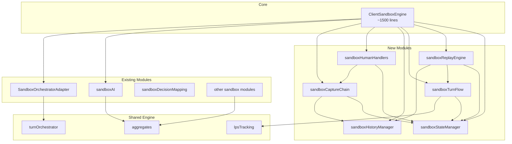

# ClientSandboxEngine.ts Decomposition Plan

> **Document Status:** Active Plan (2025-12-25)
> **Target File:** `src/client/sandbox/ClientSandboxEngine.ts` (4,611 lines)
> **Related Docs:**
>
> - [`CLIENT_SANDBOX_ENGINE_REFACTOR_PROPOSAL.md`](CLIENT_SANDBOX_ENGINE_REFACTOR_PROPOSAL.md) - Prior proposal (Dec 2025, deferred)
> - [`SHARED_ENGINE_CONSOLIDATION_PLAN.md`](SHARED_ENGINE_CONSOLIDATION_PLAN.md) - Canonical engine architecture
> - [`RULES_CANONICAL_SPEC.md`](../../RULES_CANONICAL_SPEC.md) - Canonical rules SSoT

---

## Executive Summary

[`ClientSandboxEngine.ts`](../../src/client/sandbox/ClientSandboxEngine.ts) at 4,611 lines is the largest file in the RingRift codebase. This plan defines a systematic decomposition into smaller, focused modules while maintaining parity with the Python rules engine and existing test coverage.

**Key Constraints:**

1. **Parity Risk** - This file contains critical TS↔Python parity logic. Any extraction must preserve replay semantics.
2. **SSoT Architecture** - The file is explicitly marked as an "ADAPTER, NOT CANONICAL" - it delegates rules logic to `src/shared/engine/`.
3. **Already-Extracted Modules** - Many responsibilities are already extracted; the remaining code is mostly orchestration glue.

---

## 1. Current State Analysis

### 1.1 File Structure Overview

```
Lines    | Section
---------|------------------------------------------
1-150    | Imports and type definitions
151-537  | Constructor and orchestrator adapter setup
538-760  | Orchestrator adapter integration methods
761-928  | State accessors and history snapshots
929-1153 | initFromSerializedState and scenario loading
1154-1238| Move enumeration helpers (getValidMoves, etc.)
1239-1379| Human interaction handlers (handleHumanCellClick)
1380-1445| AI turn delegation (maybeRunAITurn)
1446-1565| Movement enumeration and LPS tracking
1566-1762| Swap sides and LPS helpers
1763-1859| Internal helpers (stacks, board creation)
1860-2175| Turn flow control (forced elimination)
2176-2455| Marker and board operations
2456-2617| Movement and capture handlers
2618-2815| Capture chain and post-movement advancement
2816-3196| Territory and line processing
3197-3300| Victory detection
3301-3576| Line processing and ring placement
3577-3745| Canonical move application core
3746-4165| Replay-specific move application
4166-4478| Auto-resolve helpers for replay
4479-4611| Territory/line resolution and invariants
```

### 1.2 Key Responsibilities Identified

| Responsibility               | Lines | Description                                                        |
| ---------------------------- | ----- | ------------------------------------------------------------------ |
| **State Management**         | ~200  | GameState, victoryResult, per-turn flags                           |
| **Orchestrator Integration** | ~400  | SandboxOrchestratorAdapter setup and delegation                    |
| **History/Replay**           | ~850  | applyCanonicalMoveForReplay, autoResolve\*, snapshot management    |
| **Human Interaction**        | ~200  | handleHumanCellClick, handleMovementClick, handleChainCaptureClick |
| **AI Turn Delegation**       | ~50   | maybeRunAITurn hooks                                               |
| **Movement/Capture**         | ~500  | performCaptureChain, applyCaptureSegment                           |
| **Line/Territory**           | ~450  | processLines*, processDisconnectedRegions*                         |
| **Turn Flow**                | ~300  | advanceTurnAndPhase, startTurn, forced elimination                 |
| **Board Helpers**            | ~300  | marker operations, position validation                             |
| **Move Enumeration**         | ~200  | getValidMoves, getValidLandingPositions\*                          |
| **Victory/LPS**              | ~200  | checkAndApplyVictory, LPS tracking                                 |

### 1.3 Already Extracted Modules

The following have already been extracted to separate files:

| Module                                                                                    | Lines | Description                          |
| ----------------------------------------------------------------------------------------- | ----- | ------------------------------------ |
| [`sandboxAI.ts`](../../src/client/sandbox/sandboxAI.ts)                                   | 2,126 | AI turn execution via SandboxAIHooks |
| [`SandboxOrchestratorAdapter.ts`](../../src/client/sandbox/SandboxOrchestratorAdapter.ts) | 1,238 | Orchestrator wrapper                 |
| [`sandboxDecisionMapping.ts`](../../src/client/sandbox/sandboxDecisionMapping.ts)         | 373   | PlayerChoice builders                |
| [`boardViewFactory.ts`](../../src/client/sandbox/boardViewFactory.ts)                     | 275   | Board view adapters                  |
| [`sandboxPlacement.ts`](../../src/client/sandbox/sandboxPlacement.ts)                     | ~150  | Placement validation                 |
| [`sandboxMovement.ts`](../../src/client/sandbox/sandboxMovement.ts)                       | 136   | Movement helpers                     |
| [`sandboxCaptures.ts`](../../src/client/sandbox/sandboxCaptures.ts)                       | ~200  | Capture enumeration                  |
| [`sandboxTerritory.ts`](../../src/client/sandbox/sandboxTerritory.ts)                     | ~150  | Territory detection                  |
| [`sandboxLines.ts`](../../src/client/sandbox/sandboxLines.ts)                             | ~100  | Line detection                       |
| [`sandboxElimination.ts`](../../src/client/sandbox/sandboxElimination.ts)                 | ~100  | Cap elimination                      |
| [`sandboxGameEnd.ts`](../../src/client/sandbox/sandboxGameEnd.ts)                         | ~200  | Victory detection                    |
| [`sandboxVictory.ts`](../../src/client/sandbox/sandboxVictory.ts)                         | ~100  | Victory result builders              |
| [`scenarioLoader.ts`](../../src/client/sandbox/scenarioLoader.ts)                         | ~200  | Scenario loading                     |
| [`statePersistence.ts`](../../src/client/sandbox/statePersistence.ts)                     | ~100  | State serialization                  |

**Total already extracted:** ~5,500 lines (the module files are substantial)

### 1.4 Dependency Analysis

The [`ClientSandboxEngine`](../../src/client/sandbox/ClientSandboxEngine.ts:215) class depends on:

**Internal State (accessed via `this.`):**

- `gameState: GameState` - Core game state
- `victoryResult: GameResult | null` - Terminal result
- `interactionHandler: SandboxInteractionHandler` - UI callback
- `orchestratorAdapter: SandboxOrchestratorAdapter | null` - Turn processor
- `rng: SeededRNG` - Deterministic randomness
- `_lpsState: LpsTrackingState` - Last-player-standing tracking
- Various per-turn flags (`_hasPlacedThisTurn`, `_mustMoveFromStackKey`, etc.)

**Shared Engine Imports (from `src/shared/engine/`):**

- Type definitions (GameState, Move, BoardState, etc.)
- Aggregate helpers (placement, capture, line, territory)
- Orchestrator (turnOrchestrator, phaseStateMachine)
- LPS tracking helpers (lpsTracking.ts)

---

## 2. Proposed Module Structure

### 2.1 New Module Architecture

```
src/client/sandbox/
├── ClientSandboxEngine.ts         (~1,500 lines - reduced core)
├── engine/
│   ├── sandboxStateManager.ts     (~300 lines - state access/mutation)
│   ├── sandboxReplayEngine.ts     (~700 lines - replay move application)
│   ├── sandboxTurnFlow.ts         (~350 lines - turn/phase advancement)
│   └── sandboxHistoryManager.ts   (~250 lines - history snapshots)
├── interaction/
│   ├── sandboxHumanHandlers.ts    (~200 lines - click handlers)
│   └── sandboxCaptureChain.ts     (~250 lines - capture chain execution)
└── [existing extracted modules]
```

### 2.2 Module Responsibilities

#### 2.2.1 `sandboxStateManager.ts` (~300 lines)

**Responsibility:** Centralized state access and mutation interface.

```typescript
export interface SandboxStateManager {
  // State accessors
  getGameState(): GameState;
  getVictoryResult(): GameResult | null;
  getGameEndExplanation(): GameEndExplanation | null;
  getLpsTrackingState(): LpsTrackingState;

  // State mutators
  updateGameState(state: GameState): void;
  setVictoryResult(result: GameResult | null): void;

  // Per-turn flag management
  resetTurnFlags(): void;
  getPerTurnState(): PerTurnState;
  updatePerTurnState(state: Partial<PerTurnState>): void;
}
```

**Methods to extract from [`ClientSandboxEngine`](../../src/client/sandbox/ClientSandboxEngine.ts):**

- [`getGameState()`](../../src/client/sandbox/ClientSandboxEngine.ts:800-822) - lines 800-822
- [`getVictoryResult()`](../../src/client/sandbox/ClientSandboxEngine.ts:829-831)
- [`getGameEndExplanation()`](../../src/client/sandbox/ClientSandboxEngine.ts:837-839)
- [`getLpsTrackingState()`](../../src/client/sandbox/ClientSandboxEngine.ts:846-858)
- [`cloneGameState()`](../../src/client/sandbox/ClientSandboxEngine.ts:934-955)
- Per-turn flag reset logic scattered through the file

---

#### 2.2.2 `sandboxReplayEngine.ts` (~700 lines)

**Responsibility:** Canonical move application for replay/parity scenarios.

```typescript
export interface SandboxReplayEngine {
  applyCanonicalMoveForReplay(
    move: Move,
    nextMove?: Move | null,
    hooks: ReplayHooks
  ): Promise<void>;

  autoResolvePendingDecisionPhasesForReplay(nextMove: Move, hooks: ReplayHooks): Promise<void>;
}

export interface ReplayHooks {
  getGameState(): GameState;
  updateGameState(state: GameState): void;
  advanceTurnAndPhase(): void;
  checkAndApplyVictory(): void;
  // ... other callbacks
}
```

**Methods to extract:**

- [`applyCanonicalMoveForReplay()`](../../src/client/sandbox/ClientSandboxEngine.ts:3746-4165) - lines 3746-4165 (~420 lines)
- [`autoResolvePendingDecisionPhasesForReplay()`](../../src/client/sandbox/ClientSandboxEngine.ts:4175-4478) - lines 4175-4478 (~300 lines)
- [`autoResolveOneTerritoryRegionForReplay()`](../../src/client/sandbox/ClientSandboxEngine.ts:4484-4530)
- [`autoResolveOneLineForReplay()`](../../src/client/sandbox/ClientSandboxEngine.ts:4536-4568)

---

#### 2.2.3 `sandboxTurnFlow.ts` (~350 lines)

**Responsibility:** Turn/phase advancement and forced elimination.

```typescript
export interface SandboxTurnFlow {
  advanceTurnAndPhaseForCurrentPlayer(hooks: TurnFlowHooks): void;
  startTurnForCurrentPlayer(hooks: TurnFlowHooks): void;
  maybeProcessForcedEliminationForCurrentPlayer(hooks: TurnFlowHooks): boolean;
  handleStartOfInteractiveTurn(hooks: TurnFlowHooks): void;
}

export interface TurnFlowHooks {
  getGameState(): GameState;
  updateGameState(state: GameState): void;
  getPerTurnState(): PerTurnState;
  updatePerTurnState(state: Partial<PerTurnState>): void;
  checkAndApplyVictory(): void;
  // ... LPS hooks
}
```

**Methods to extract:**

- [`advanceTurnAndPhaseForCurrentPlayer()`](../../src/client/sandbox/ClientSandboxEngine.ts:2142-2157)
- [`startTurnForCurrentPlayer()`](../../src/client/sandbox/ClientSandboxEngine.ts:1978-2028)
- [`maybeProcessForcedEliminationForCurrentPlayer()`](../../src/client/sandbox/ClientSandboxEngine.ts:2030-2046)
- [`maybeProcessForcedEliminationForCurrentPlayerInternal()`](../../src/client/sandbox/ClientSandboxEngine.ts:2048-2140)
- [`handleStartOfInteractiveTurn()`](../../src/client/sandbox/ClientSandboxEngine.ts:1765-1807)
- [`updateLpsRoundTrackingForCurrentPlayer()`](../../src/client/sandbox/ClientSandboxEngine.ts:1668-1692)
- [`maybeEndGameByLastPlayerStanding()`](../../src/client/sandbox/ClientSandboxEngine.ts:1710-1758)

---

#### 2.2.4 `sandboxHistoryManager.ts` (~250 lines)

**Responsibility:** History entry creation and snapshot management.

```typescript
export interface SandboxHistoryManager {
  appendHistoryEntry(before: GameState, action: Move, opts?: HistoryOpts): void;
  recordHistorySnapshotsOnly(before: GameState): void;
  getStateAtMoveIndex(moveIndex: number): GameState | null;
  rebuildSnapshotsFromMoveHistory(finalState: GameState): void;
}
```

**Methods to extract:**

- [`appendHistoryEntry()`](../../src/client/sandbox/ClientSandboxEngine.ts:404-438)
- [`recordHistorySnapshotsOnly()`](../../src/client/sandbox/ClientSandboxEngine.ts:448-456)
- [`getStateAtMoveIndex()`](../../src/client/sandbox/ClientSandboxEngine.ts:894-928)
- [`rebuildSnapshotsFromMoveHistory()`](../../src/client/sandbox/ClientSandboxEngine.ts:966-1042)
- Snapshot array management (`_stateSnapshots`, `_initialStateSnapshot`)

---

#### 2.2.5 `sandboxHumanHandlers.ts` (~200 lines)

**Responsibility:** Human player interaction handling.

```typescript
export interface SandboxHumanHandlers {
  handleHumanCellClick(pos: Position, hooks: HumanHandlerHooks): Promise<void>;
  handleMovementClick(pos: Position, hooks: HumanHandlerHooks): Promise<void>;
  handleChainCaptureClick(pos: Position, hooks: HumanHandlerHooks): Promise<void>;
  promptForCaptureDirection(options: Move[], hooks: HumanHandlerHooks): Promise<Move>;
}
```

**Methods to extract:**

- [`handleHumanCellClick()`](../../src/client/sandbox/ClientSandboxEngine.ts:1239-1379)
- [`handleMovementClick()`](../../src/client/sandbox/ClientSandboxEngine.ts:2534-2617)
- [`handleChainCaptureClick()`](../../src/client/sandbox/ClientSandboxEngine.ts:2501-2532)
- [`promptForCaptureDirection()`](../../src/client/sandbox/ClientSandboxEngine.ts:2463-2494)

---

#### 2.2.6 `sandboxCaptureChain.ts` (~250 lines)

**Responsibility:** Capture chain execution and callbacks.

```typescript
export interface SandboxCaptureChain {
  performCaptureChainInternal(
    initialFrom: Position,
    initialTarget: Position,
    initialLanding: Position,
    playerNumber: number,
    isCanonicalReplay: boolean,
    hooks: CaptureChainHooks
  ): Promise<void>;

  handleCaptureSegmentApplied(info: CaptureSegmentInfo): Promise<void>;
  handleSimpleMoveApplied(info: SimpleMoveInfo): Promise<void>;
}
```

**Methods to extract:**

- [`performCaptureChainInternal()`](../../src/client/sandbox/ClientSandboxEngine.ts:2619-2752)
- [`performCaptureChain()`](../../src/client/sandbox/ClientSandboxEngine.ts:1935-1941)
- [`handleCaptureSegmentApplied()`](../../src/client/sandbox/ClientSandboxEngine.ts:330-364)
- [`handleSimpleMoveApplied()`](../../src/client/sandbox/ClientSandboxEngine.ts:372-393)

---

### 2.3 Estimated Line Count After Extraction

| File                     | Before | After  |
| ------------------------ | ------ | ------ |
| ClientSandboxEngine.ts   | 4,611  | ~1,500 |
| sandboxStateManager.ts   | -      | ~300   |
| sandboxReplayEngine.ts   | -      | ~700   |
| sandboxTurnFlow.ts       | -      | ~350   |
| sandboxHistoryManager.ts | -      | ~250   |
| sandboxHumanHandlers.ts  | -      | ~200   |
| sandboxCaptureChain.ts   | -      | ~250   |
| **Total**                | 4,611  | ~3,550 |

The reduced total reflects elimination of duplicated code patterns and consolidation of scattered logic.

---

## 3. Dependency Diagram



---

## 4. Step-by-Step Migration Plan

### Phase 1: Foundation (Low Risk)

#### Step 1.1: Extract `sandboxHistoryManager.ts`

- **Target Methods:** History snapshot management
- **Risk:** Low - isolated functionality
- **Dependencies:** GameState types only
- **Testing:** Existing history/replay tests

#### Step 1.2: Extract `sandboxStateManager.ts`

- **Target Methods:** State accessors and per-turn flags
- **Risk:** Low - read-heavy operations
- **Dependencies:** GameState, LpsTrackingState types
- **Testing:** Add unit tests for state cloning

### Phase 2: Human Interaction (Medium Risk)

#### Step 2.1: Extract `sandboxHumanHandlers.ts`

- **Target Methods:** Click handlers
- **Risk:** Medium - UI interaction paths
- **Dependencies:** State manager, orchestrator adapter
- **Testing:** Existing interaction tests + manual verification

#### Step 2.2: Extract `sandboxCaptureChain.ts`

- **Target Methods:** Capture chain execution
- **Risk:** Medium - complex async flow
- **Dependencies:** State manager, history manager
- **Testing:** Existing capture chain tests

### Phase 3: Turn Flow (Medium-High Risk)

#### Step 3.1: Extract `sandboxTurnFlow.ts`

- **Target Methods:** Turn/phase advancement
- **Risk:** Medium-High - affects game progression
- **Dependencies:** State manager, LPS helpers
- **Testing:** Turn advancement tests, LPS scenarios

### Phase 4: Replay Engine (High Risk)

#### Step 4.1: Extract `sandboxReplayEngine.ts`

- **Target Methods:** Canonical replay application
- **Risk:** High - critical for TS↔Python parity
- **Dependencies:** All other extracted modules
- **Testing:** Full parity test suite, contract vectors

---

## 5. Acceptance Criteria

### 5.1 General Criteria (All Modules)

- [ ] Module can be imported independently
- [ ] No circular dependencies introduced
- [ ] TypeScript compiles without errors
- [ ] All existing tests pass unchanged
- [ ] Module has dedicated unit tests
- [ ] JSDoc comments preserved/added

### 5.2 Module-Specific Criteria

#### `sandboxStateManager.ts`

- [ ] GameState cloning preserves all Map/array fields
- [ ] Per-turn flag reset matches original behavior
- [ ] LPS tracking state accessible and mutable

#### `sandboxHistoryManager.ts`

- [ ] History entries match exact format of original
- [ ] Snapshot reconstruction produces identical states
- [ ] getStateAtMoveIndex returns correct snapshots

#### `sandboxHumanHandlers.ts`

- [ ] Click handling produces identical moves
- [ ] Capture direction prompts work correctly
- [ ] Selection state management preserved

#### `sandboxCaptureChain.ts`

- [ ] Chain continuation logic unchanged
- [ ] History entries for each segment correct
- [ ] Final segment triggers post-movement processing

#### `sandboxTurnFlow.ts`

- [ ] Phase transitions match original exactly
- [ ] Forced elimination triggers correctly
- [ ] LPS tracking updates at correct times

#### `sandboxReplayEngine.ts`

- [ ] All parity tests pass (critical)
- [ ] Contract vector tests pass
- [ ] No divergence in 100-game replay soak
- [ ] traceMode semantics preserved

### 5.3 Parity Verification

Before merging any extraction:

1. Run `npm run test:orchestrator-parity` - must pass
2. Run parity harness: `ai-service/scripts/check_ts_python_replay_parity.py`
3. Verify no new divergences in 20-game sample

---

## 6. Risk Mitigation

### 6.1 Parity Regression Prevention

1. **Snapshot Tests:** Create snapshot tests of GameState at key points before extraction
2. **Trace Comparison:** Add trace logging to both old and new paths during migration
3. **Gradual Rollout:** Use feature flags to switch between old/new implementations
4. **Revert Plan:** Each extraction should be a separate PR, easily revertible

### 6.2 Test Coverage Requirements

| Module                | Minimum Coverage |
| --------------------- | ---------------- |
| sandboxStateManager   | 95%              |
| sandboxHistoryManager | 90%              |
| sandboxHumanHandlers  | 85%              |
| sandboxCaptureChain   | 90%              |
| sandboxTurnFlow       | 95%              |
| sandboxReplayEngine   | 98%              |

### 6.3 Rollback Strategy

Each phase should be independently revertible:

1. Keep old methods as deprecated during transition
2. Add runtime flag to switch between old/new
3. Monitor parity metrics for 1 week post-merge

---

## 7. Implementation Notes

### 7.1 Hooks Pattern

All extracted modules should use a hooks interface pattern (like [`SandboxAIHooks`](../../src/client/sandbox/sandboxAI.ts) already does):

```typescript
// Good: Hooks interface pattern
export interface TurnFlowHooks {
  getGameState(): GameState;
  updateGameState(state: GameState): void;
}

export function advanceTurn(hooks: TurnFlowHooks): void {
  const state = hooks.getGameState();
  // ... logic
  hooks.updateGameState(newState);
}
```

This pattern:

- Avoids circular dependencies
- Enables easy testing with mock hooks
- Preserves the existing engine interface

### 7.2 Avoid State Coupling

Extracted modules should NOT hold their own state. State lives in [`ClientSandboxEngine`](../../src/client/sandbox/ClientSandboxEngine.ts) and is accessed via hooks.

```typescript
// Bad: Module holds state
class SandboxTurnFlow {
  private gameState: GameState;
}

// Good: State accessed via hooks
export function startTurn(hooks: TurnFlowHooks): void {
  const state = hooks.getGameState();
}
```

### 7.3 Async/Await Preservation

Several methods are async due to interaction handler callbacks. Preserve this:

```typescript
// Preserve async for interaction-requiring methods
export async function handleMovementClick(pos: Position, hooks: HumanHandlerHooks): Promise<void>;
```

---

## 8. Timeline Recommendation

| Phase | Scope                        | Priority                      |
| ----- | ---------------------------- | ----------------------------- |
| 1     | Foundation (History + State) | P2 - Can defer                |
| 2     | Human Interaction            | P3 - Low priority             |
| 3     | Turn Flow                    | P2 - Moderate value           |
| 4     | Replay Engine                | P1 - High value but high risk |

**Recommendation:** Start with Phase 1 (lowest risk) and validate the hooks pattern works well before proceeding. Phase 4 (Replay Engine) provides the most value but should only be attempted after the pattern is proven.

---

## 9. Alternatives Considered

### 9.1 Do Nothing (Previous Recommendation)

The December 2025 proposal recommended deferring due to parity risk. However:

- File has grown from 4,162 to 4,611 lines (+449 lines)
- Established hooks pattern (sandboxAI.ts) proves viability
- CanonicalReplayEngine reduces replay parity concerns

### 9.2 Full Class Decomposition

Breaking [`ClientSandboxEngine`](../../src/client/sandbox/ClientSandboxEngine.ts:215) into multiple classes was considered but rejected:

- Introduces constructor coordination complexity
- Breaks existing test patterns that instantiate the engine
- No clear benefit over hooks pattern

### 9.3 State Machine Extraction Only

The prior proposal focused on extracting replay state machine logic. This plan subsumes that approach while adding other extraction opportunities.

---

## Revision History

| Date       | Author                  | Changes                    |
| ---------- | ----------------------- | -------------------------- |
| 2025-12-25 | Claude (Architect mode) | Initial decomposition plan |
