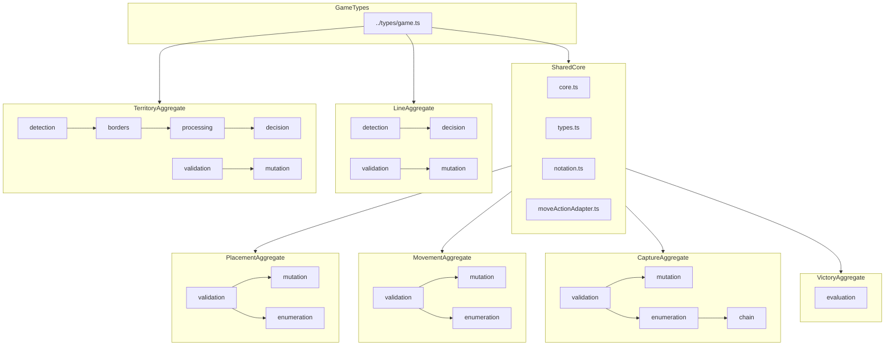

# Domain Aggregate Design: `src/shared/engine/`

> **Doc Status (2025-11-26): Partially historical (design with implemented core)**
>
> - This document captures the **aggregate-centric design** for the shared TS rules engine.
> - The **implemented, canonical rules surface today** is:
>   - Shared helpers under `src/shared/engine/*.ts` (geometry, reachability, detection, decision helpers, victory, AI heuristics).
>   - Single-file domain aggregates under `src/shared/engine/aggregates/*.ts` (Placement, Movement, Capture, Line, Territory, Victory).
>   - The canonical turn orchestrator and phase state machine under `src/shared/engine/orchestration/*`.
>   - Cross-language contracts under `src/shared/engine/contracts/*` plus JSON fixtures under `tests/fixtures/contract-vectors/v2/`.
> - The **multi-file per-aggregate layouts and migration phases below** are a **target design**. They have been partially implemented via the current `aggregates/*.ts` modules and refactors, but many legacy validators/mutators still exist as compatibility shims.
> - For the **authoritative, current module inventory and concern types**, see:
>   - [`docs/MODULE_RESPONSIBILITIES.md`](./MODULE_RESPONSIBILITIES.md) (helpers → aggregates → orchestrator → contracts).
>   - [`RULES_ENGINE_ARCHITECTURE.md`](../RULES_ENGINE_ARCHITECTURE.md).
> - For the **canonical Move / PendingDecision / PlayerChoice / WebSocket lifecycle**, see:
>   - [`docs/CANONICAL_ENGINE_API.md` §3.9–3.10](./CANONICAL_ENGINE_API.md).
>
> Use this document as a **design reference** when evolving the aggregate internals, not as the sole source of truth about the current file layout.

**Task:** T1-W2-B  
**Last design revision:** 2025-11-26

---

## 1. Overview

This document specifies the **domain aggregate structure** for the shared RingRift rules engine. The design consolidates the original 36-engine-file layout into **8 primary domain aggregates** plus a **shared core module**, reducing fragmentation while maintaining backward compatibility.

Today, the implementation sits in the following shape:

- **Shared helpers**: `core.ts`, `movementLogic.ts`, `movementApplication.ts`, `captureLogic.ts`, `lineDetection.ts`, `lineDecisionHelpers.ts`, `territoryDetection.ts`, `territoryBorders.ts`, `territoryProcessing.ts`, `territoryDecisionHelpers.ts`, `victoryLogic.ts`, `placementHelpers.ts`, `notation.ts`, `moveActionAdapter.ts`, `types.ts`, etc.
- **Single-file aggregates** (implemented):
  - `aggregates/PlacementAggregate.ts`
  - `aggregates/MovementAggregate.ts`
  - `aggregates/CaptureAggregate.ts`
  - `aggregates/LineAggregate.ts`
  - `aggregates/TerritoryAggregate.ts`
  - `aggregates/VictoryAggregate.ts`
- **Orchestrator** (canonical entry point): `orchestration/turnOrchestrator.ts`, `orchestration/phaseStateMachine.ts`, `orchestration/types.ts`.
- **Contracts**: `contracts/schemas.ts`, `contracts/serialization.ts`, `contracts/testVectorGenerator.ts`.
- **Legacy validators/mutators**: `validators/*.ts`, `mutators/*.ts`, `mutators/TurnMutator.ts`, and `GameEngine.ts` remain in-tree as **implementation plumbing and compatibility shims**.

The tables and interfaces in sections 2–8 describe the **target internal decomposition** of each aggregate (e.g., `validation.ts`, `mutation.ts`, `enumeration.ts` inside per-aggregate directories). These are **conceptual boundaries** that are partially but not fully reflected in the current file structure.

### 1.1 Summary (Target Aggregate View)

| Group                | Files Consolidated (conceptual) | Concern Types                              |
| -------------------- | ------------------------------- | ------------------------------------------ |
| PlacementAggregate   | 3                               | Validation, Mutation, Query                |
| MovementAggregate    | 4                               | Validation, Mutation, Query, Helper        |
| CaptureAggregate     | 4                               | Validation, Mutation, Query, Orchestration |
| LineAggregate        | 4                               | Validation, Mutation, Detection, Query     |
| TerritoryAggregate   | 6                               | Validation, Mutation, Detection, Query     |
| VictoryAggregate     | 1                               | Query                                      |
| EliminationAggregate | 1                               | Validation, Mutation, Query                |
| RecoveryAggregate    | 1                               | Validation, Mutation, Query                |
| SharedCore           | 6                               | Helper, Types                              |
| Turn/Orchestration   | 6                               | Orchestration, Mutation                    |
| AI/Evaluation        | 2                               | Query                                      |
| **Total**            | **38**                          |                                            |

---

## 2. Design Principles (Aggregate Layer)

These principles guide how helpers and legacy validators/mutators are consolidated into domain aggregates that feed the orchestrator.

### 2.1 Single Responsibility per Aggregate

Each aggregate owns one game domain completely:

- All validation logic for that domain.
- All mutation logic for that domain.
- All query/enumeration logic for that domain.
- All detection logic for that domain (if applicable).

### 2.2 Pure Functions

All aggregate functions are **pure**:

- No side effects on external state.
- No I/O operations (network, file, database).
- Deterministic outputs for identical inputs.
- State passed in and returned out.

### 2.3 Immutable State Updates

All mutations return **new state objects**:

- Never mutate input `GameState` or `BoardState`.
- Clone maps and arrays before modification.
- Support structural sharing where beneficial.

### 2.4 Explicit Dependencies

Aggregates declare dependencies explicitly:

- Import only from SharedCore or `../types/game`.
- No circular dependencies between aggregates.
- Dependencies flow downward in the aggregate hierarchy.

### 2.5 Type-safe Contracts

All public interfaces have explicit TypeScript types:

- Input parameters fully typed.
- Return types never `any`.
- Domain-specific result types for complex returns.

---

## 3. Aggregate Specifications (Target Design)

> **Note:**
>
> - The interfaces in this section express the **intended public surface** of each aggregate.
> - Today, many of these responsibilities are implemented in the single-file aggregates (e.g. `PlacementAggregate.ts`) and helper modules.
> - Some function names/types may differ slightly in the current code; when in doubt, the **canonical semantics come from the orchestrator + helpers + tests**, not from this design text.

### 3.1 PlacementAggregate

#### Purpose

Owns all ring placement validation, mutation, and enumeration logic.

#### Source Modules (conceptual consolidation)

| File                                                                                        | Status in design        |
| ------------------------------------------------------------------------------------------- | ----------------------- |
| [`validators/PlacementValidator.ts`](../src/shared/engine/validators/PlacementValidator.ts) | Absorbed into aggregate |
| [`mutators/PlacementMutator.ts`](../src/shared/engine/mutators/PlacementMutator.ts)         | Absorbed into aggregate |
| [`placementHelpers.ts`](../src/shared/engine/placementHelpers.ts)                           | Absorbed into aggregate |

#### Public Interface (design sketch)

```typescript
// ═══════════════════════════════════════════════════════════════════════════
// Types
// ═══════════════════════════════════════════════════════════════════════════

export interface PlacementContext {
  boardType: BoardType;
  player: number;
  ringsInHand: number;
  ringsPerPlayerCap: number;
  ringsOnBoard?: number;
  maxAvailableGlobal?: number;
}

export interface PlacementValidationResult {
  valid: boolean;
  maxPlacementCount?: number;
  reason?: string;
  code?: string;
}

export interface PlacementApplicationOutcome {
  nextState: GameState;
  appliedCount: number;
}

export interface SkipPlacementEligibilityResult {
  eligible: boolean;
  reason?: string;
}

// ═══════════════════════════════════════════════════════════════════════════
// Validation Functions
// ═══════════════════════════════════════════════════════════════════════════

/**
 * Validate ring placement on a board independent of GameState.
 * Rule Reference: Section 4.1 - Ring Placement
 */
export function validatePlacementOnBoard(
  board: BoardState,
  to: Position,
  requestedCount: number,
  ctx: PlacementContext
): PlacementValidationResult;

/**
 * Validate PLACE_RING action against full GameState.
 */
export function validatePlacement(state: GameState, action: PlaceRingAction): ValidationResult;

/**
 * Validate SKIP_PLACEMENT action.
 */
export function validateSkipPlacement(
  state: GameState,
  action: SkipPlacementAction
): ValidationResult;

// ═══════════════════════════════════════════════════════════════════════════
// Query Functions
// ═══════════════════════════════════════════════════════════════════════════

/**
 * Enumerate all legal placement positions for a player.
 */
export function enumeratePlacementPositions(state: GameState, player: number): Position[];

/**
 * Evaluate whether skip placement is legal.
 */
export function evaluateSkipPlacementEligibility(
  state: GameState,
  player: number
): SkipPlacementEligibilityResult;

// ═══════════════════════════════════════════════════════════════════════════
// Mutation Functions
// ═══════════════════════════════════════════════════════════════════════════

/**
 * Apply placement mutation to board only.
 */
export function applyPlacementOnBoard(
  board: BoardState,
  position: Position,
  playerId: number,
  count: number
): BoardState;

/**
 * Apply placement mutation to full GameState.
 */
export function mutatePlacement(state: GameState, action: PlaceRingAction): GameState;

/**
 * Apply placement via Move representation.
 */
export function applyPlacementMove(state: GameState, move: Move): PlacementApplicationOutcome;
```

#### Internal Structure (target)

```text
PlacementAggregate/
├── validation.ts      # validatePlacementOnBoard, validatePlacement, validateSkipPlacement
├── mutation.ts        # applyPlacementOnBoard, mutatePlacement, applyPlacementMove
├── enumeration.ts     # enumeratePlacementPositions, evaluateSkipPlacementEligibility
├── types.ts           # PlacementContext, PlacementValidationResult, etc.
└── index.ts           # Re-exports all public API
```

#### Dependencies

- **SharedCore**: `calculateCapHeight`, `hasAnyLegalMoveOrCaptureFromOnBoard`, `countRingsOnBoardForPlayer`.
- **`../types/game`**: `GameState`, `BoardState`, `Position`, `BOARD_CONFIGS`.

#### Migration Notes

- In current code, placement responsibilities are split between `placementHelpers.ts`, `validators/PlacementValidator.ts`, `mutators/PlacementMutator.ts`, and `aggregates/PlacementAggregate.ts`.
- Over time, the goal is to **centralize placement semantics** into `PlacementAggregate` and helpers, with validators/mutators reduced to thin re-exports or removed.
- Existing tests in `tests/unit/placement.shared.test.ts` must continue to pass with no semantic regressions.

---

### 3.2 MovementAggregate

#### Purpose

Owns all non-capturing movement validation, enumeration, and mutation logic.

#### Source Modules (conceptual consolidation)

| File                                                                                      | Status in design        |
| ----------------------------------------------------------------------------------------- | ----------------------- |
| [`validators/MovementValidator.ts`](../src/shared/engine/validators/MovementValidator.ts) | Absorbed into aggregate |
| [`mutators/MovementMutator.ts`](../src/shared/engine/mutators/MovementMutator.ts)         | Absorbed into aggregate |
| [`movementLogic.ts`](../src/shared/engine/movementLogic.ts)                               | Absorbed into aggregate |
| [`movementApplication.ts`](../src/shared/engine/movementApplication.ts)                   | Absorbed into aggregate |

#### Public Interface (design sketch)

```typescript
// ═══════════════════════════════════════════════════════════════════════════
// Types
// ═══════════════════════════════════════════════════════════════════════════

export interface SimpleMoveTarget {
  from: Position;
  to: Position;
}

export interface MovementBoardAdapters {
  isValidPosition(pos: Position): boolean;
  isCollapsedSpace(pos: Position): boolean;
  getStackAt(
    pos: Position
  ): { controllingPlayer: number; capHeight: number; stackHeight: number } | undefined;
  getMarkerOwner(pos: Position): number | undefined;
}

export interface SimpleMovementParams {
  from: Position;
  to: Position;
  player: number;
}

export interface MovementApplicationOutcome {
  nextState: GameState;
  markerEffectsApplied: boolean;
}

// ═══════════════════════════════════════════════════════════════════════════
// Validation Functions
// ═══════════════════════════════════════════════════════════════════════════

/**
 * Validate MOVE_STACK action.
 * Rule Reference: Section 8 - Movement
 */
export function validateMovement(state: GameState, action: MoveStackAction): ValidationResult;

// ═══════════════════════════════════════════════════════════════════════════
// Query Functions
// ═══════════════════════════════════════════════════════════════════════════

/**
 * Enumerate all legal non-capturing moves from a stack.
 */
export function enumerateSimpleMoveTargetsFromStack(
  boardType: BoardType,
  from: Position,
  player: number,
  board: MovementBoardAdapters
): SimpleMoveTarget[];

/**
 * Enumerate all simple moves for a player.
 */
export function enumerateSimpleMovesForPlayer(state: GameState, player: number): Move[];

// ═══════════════════════════════════════════════════════════════════════════
// Mutation Functions
// ═══════════════════════════════════════════════════════════════════════════

/**
 * Apply simple movement mutation.
 */
export function mutateMovement(state: GameState, action: MoveStackAction): GameState;

/**
 * Apply simple movement with marker effects.
 */
export function applySimpleMovement(
  state: GameState,
  params: SimpleMovementParams
): MovementApplicationOutcome;
```

#### Internal Structure (target)

```text
MovementAggregate/
├── validation.ts      # validateMovement
├── mutation.ts        # mutateMovement, applySimpleMovement
├── enumeration.ts     # enumerateSimpleMoveTargetsFromStack, enumerateSimpleMovesForPlayer
├── types.ts           # SimpleMoveTarget, MovementBoardAdapters, etc.
└── index.ts           # Re-exports all public API
```

#### Dependencies

- **SharedCore**: `getMovementDirectionsForBoardType`, `getPathPositions`, `calculateDistance`, `applyMarkerEffectsAlongPathOnBoard`.
- **`../types/game`**: `GameState`, `BoardState`, `Position`, `Move`.

#### Migration Notes

- Today, movement responsibilities are spread across `movementLogic.ts`, `movementApplication.ts`, `validators/MovementValidator.ts`, `mutators/MovementMutator.ts`, and `aggregates/MovementAggregate.ts`.
- Tests in `tests/unit/movement.shared.test.ts` must remain authoritative for movement semantics.

---

### 3.3 CaptureAggregate

#### Purpose

Owns all overtaking capture validation, enumeration, and mutation logic, including chain capture orchestration.

#### Source Modules (conceptual consolidation)

| File                                                                                    | Status in design        |
| --------------------------------------------------------------------------------------- | ----------------------- |
| [`validators/CaptureValidator.ts`](../src/shared/engine/validators/CaptureValidator.ts) | Absorbed into aggregate |
| [`mutators/CaptureMutator.ts`](../src/shared/engine/mutators/CaptureMutator.ts)         | Absorbed into aggregate |
| [`captureLogic.ts`](../src/shared/engine/captureLogic.ts)                               | Absorbed into aggregate |

#### Public Interface (design sketch)

```typescript
// ═══════════════════════════════════════════════════════════════════════════
// Types
// ═══════════════════════════════════════════════════════════════════════════

export interface CaptureBoardAdapters {
  isValidPosition(pos: Position): boolean;
  isCollapsedSpace(pos: Position): boolean;
  getStackAt(
    pos: Position
  ): { controllingPlayer: number; capHeight: number; stackHeight: number } | undefined;
  getMarkerOwner(pos: Position): number | undefined;
}

export interface ChainCaptureStateSnapshot {
  currentPosition: Position;
  capturedThisChain: Position[];
  mustContinue: boolean;
}

export interface ChainCaptureContinuationInfo {
  mustContinue: boolean;
  availableContinuations: Move[];
}

export interface CaptureSegmentParams {
  from: Position;
  target: Position;
  landing: Position;
  player: number;
}

export interface CaptureApplicationOutcome {
  nextState: GameState;
  ringsTransferred: number;
  chainContinuationRequired: boolean;
}

// ═══════════════════════════════════════════════════════════════════════════
// Validation Functions
// ═══════════════════════════════════════════════════════════════════════════

/**
 * Validate OVERTAKING_CAPTURE action.
 * Rule Reference: Section 10 - Overtaking Capture
 */
export function validateCapture(
  state: GameState,
  action: OvertakingCaptureAction
): ValidationResult;

/**
 * Validate a single capture segment geometry.
 */
export function validateCaptureSegmentOnBoard(
  boardType: BoardType,
  from: Position,
  target: Position,
  landing: Position,
  player: number,
  board: CaptureSegmentBoardView
): boolean;

// ═══════════════════════════════════════════════════════════════════════════
// Query Functions
// ═══════════════════════════════════════════════════════════════════════════

/**
 * Enumerate all legal capture moves from a position.
 */
export function enumerateCaptureMoves(
  boardType: BoardType,
  from: Position,
  playerNumber: number,
  adapters: CaptureBoardAdapters,
  moveNumber: number
): Move[];

/**
 * Enumerate chain capture continuations.
 */
export function enumerateChainCaptureSegments(
  state: GameState,
  snapshot: ChainCaptureStateSnapshot
): Move[];

/**
 * Check if a chain capture must continue.
 */
export function getChainCaptureContinuationInfo(
  state: GameState,
  player: number,
  currentPosition: Position
): ChainCaptureContinuationInfo;

// ═══════════════════════════════════════════════════════════════════════════
// Mutation Functions
// ═══════════════════════════════════════════════════════════════════════════

/**
 * Apply capture mutation.
 */
export function mutateCapture(state: GameState, action: OvertakingCaptureAction): GameState;

/**
 * Apply a capture segment with marker effects.
 */
export function applyCaptureSegment(
  state: GameState,
  params: CaptureSegmentParams
): CaptureApplicationOutcome;
```

#### Internal Structure (target)

```text
CaptureAggregate/
├── validation.ts      # validateCapture, validateCaptureSegmentOnBoard (re-export from SharedCore)
├── mutation.ts        # mutateCapture, applyCaptureSegment
├── enumeration.ts     # enumerateCaptureMoves, enumerateChainCaptureSegments
├── chain.ts           # getChainCaptureContinuationInfo, chain state management
├── types.ts           # CaptureBoardAdapters, ChainCaptureStateSnapshot, etc.
└── index.ts           # Re-exports all public API
```

#### Dependencies

- **SharedCore**: `validateCaptureSegmentOnBoard`, `getMovementDirectionsForBoardType`, `applyMarkerEffectsAlongPathOnBoard`, `calculateCapHeight`.
- **`../types/game`**: `GameState`, `BoardState`, `Position`, `Move`.

#### Migration Notes

- In code, chain capture logic is implemented across `captureLogic.ts`, `mutators/CaptureMutator.ts`, and `aggregates/CaptureAggregate.ts`.
- Tests such as `tests/unit/captureLogic.shared.test.ts`, `tests/unit/GameEngine.chainCapture.test.ts`, and `tests/unit/ClientSandboxEngine.chainCapture.scenarios.test.ts` are the parity constraints.

---

### 3.4 LineAggregate

#### Purpose

Owns all marker line detection, validation, and collapse logic including line reward decisions.

#### Source Modules (conceptual consolidation)

| File                                                                              | Status in design        |
| --------------------------------------------------------------------------------- | ----------------------- |
| [`validators/LineValidator.ts`](../src/shared/engine/validators/LineValidator.ts) | Absorbed into aggregate |
| [`mutators/LineMutator.ts`](../src/shared/engine/mutators/LineMutator.ts)         | Absorbed into aggregate |
| [`lineDetection.ts`](../src/shared/engine/lineDetection.ts)                       | Absorbed into aggregate |
| [`lineDecisionHelpers.ts`](../src/shared/engine/lineDecisionHelpers.ts)           | Absorbed into aggregate |

#### Public Interface (design sketch)

```typescript
// ═══════════════════════════════════════════════════════════════════════════
// Types
// ═══════════════════════════════════════════════════════════════════════════

export interface LineEnumerationOptions {
  detectionMode?: 'use_board_cache' | 'detect_now';
  boardTypeOverride?: BoardType;
}

export interface LineDecisionApplicationOutcome {
  nextState: GameState;
  pendingLineRewardElimination: boolean;
}

// ═══════════════════════════════════════════════════════════════════════════
// Detection Functions
// ═══════════════════════════════════════════════════════════════════════════

/**
 * Detect all marker lines on the board.
 * Rule Reference: Section 11.1 - Line Formation
 */
export function findAllLines(board: BoardState): LineInfo[];

/**
 * Detect lines for a specific player.
 */
export function findLinesForPlayer(board: BoardState, playerNumber: number): LineInfo[];

// ═══════════════════════════════════════════════════════════════════════════
// Validation Functions
// ═══════════════════════════════════════════════════════════════════════════

/**
 * Validate PROCESS_LINE action.
 */
export function validateProcessLine(state: GameState, action: ProcessLineAction): ValidationResult;

/**
 * Validate CHOOSE_LINE_REWARD action.
 */
export function validateChooseLineReward(
  state: GameState,
  action: ChooseLineRewardAction
): ValidationResult;

// ═══════════════════════════════════════════════════════════════════════════
// Query Functions
// ═══════════════════════════════════════════════════════════════════════════

/**
 * Enumerate process_line decision moves.
 */
export function enumerateProcessLineMoves(
  state: GameState,
  player: number,
  options?: LineEnumerationOptions
): Move[];

/**
 * Enumerate choose_line_option decision moves (legacy alias: choose_line_reward).
 */
export function enumerateChooseLineRewardMoves(
  state: GameState,
  player: number,
  lineIndex: number
): Move[];

// ═══════════════════════════════════════════════════════════════════════════
// Mutation Functions
// ═══════════════════════════════════════════════════════════════════════════

/**
 * Apply process_line decision.
 */
export function applyProcessLineDecision(
  state: GameState,
  move: Move
): LineDecisionApplicationOutcome;

/**
 * Apply choose_line_option decision (legacy alias: choose_line_reward).
 */
export function applyChooseLineRewardDecision(
  state: GameState,
  move: Move
): LineDecisionApplicationOutcome;

/**
 * Apply line processing mutation via action.
 */
export function mutateProcessLine(state: GameState, action: ProcessLineAction): GameState;

/**
 * Apply line reward choice mutation.
 */
export function mutateChooseLineReward(state: GameState, action: ChooseLineRewardAction): GameState;
```

#### Internal Structure (target)

```text
LineAggregate/
├── detection.ts       # findAllLines, findLinesForPlayer
├── validation.ts      # validateProcessLine, validateChooseLineReward
├── mutation.ts        # mutateProcessLine, mutateChooseLineReward
├── decision.ts        # enumerateProcessLineMoves, enumerateChooseLineRewardMoves, apply*Decision
├── types.ts           # LineEnumerationOptions, LineDecisionApplicationOutcome
└── index.ts           # Re-exports all public API
```

#### Dependencies

- **SharedCore**: None directly (self-contained geometry in `lineDetection.ts`).
- **`../types/game`**: `GameState`, `BoardState`, `LineInfo`, `BOARD_CONFIGS`.

#### Migration Notes

- Current implementation uses `lineDetection.ts`, `lineDecisionHelpers.ts`, and `aggregates/LineAggregate.ts` as the primary semantic surface; legacy `validators/LineValidator.ts` and `mutators/LineMutator.ts` are historical.
- Tests in `tests/unit/lineDecisionHelpers.shared.test.ts`, `tests/unit/lineDetection.shared.test.ts`, `tests/unit/LineDetectionParity.rules.test.ts`, and parity fixtures under `tests/fixtures/rules-parity/v1/*.json` must remain green.

---

### 3.5 TerritoryAggregate

#### Purpose

Owns all territory disconnection detection, border analysis, processability checks, and collapse/elimination logic.

#### Source Modules (conceptual consolidation)

| File                                                                                        | Status in design        |
| ------------------------------------------------------------------------------------------- | ----------------------- |
| [`validators/TerritoryValidator.ts`](../src/shared/engine/validators/TerritoryValidator.ts) | Absorbed into aggregate |
| [`mutators/TerritoryMutator.ts`](../src/shared/engine/mutators/TerritoryMutator.ts)         | Absorbed into aggregate |
| [`territoryDetection.ts`](../src/shared/engine/territoryDetection.ts)                       | Absorbed into aggregate |
| [`territoryBorders.ts`](../src/shared/engine/territoryBorders.ts)                           | Absorbed into aggregate |
| [`territoryProcessing.ts`](../src/shared/engine/territoryProcessing.ts)                     | Absorbed into aggregate |
| [`territoryDecisionHelpers.ts`](../src/shared/engine/territoryDecisionHelpers.ts)           | Absorbed into aggregate |

#### Public Interface (design sketch)

```typescript
// ═══════════════════════════════════════════════════════════════════════════
// Types
// ═══════════════════════════════════════════════════════════════════════════

export interface TerritoryProcessingContext {
  player: number;
  boardType?: BoardType;
}

export interface TerritoryProcessingOutcome {
  nextBoard: BoardState;
  collapsedCount: number;
  eliminatedRingsByPlayer: Map<number, number>;
}

export interface TerritoryEnumerationOptions {
  filterByProcessability?: boolean;
}

export interface TerritoryProcessApplicationOutcome {
  nextState: GameState;
  processedRegionId: string;
  processedRegion: Territory;
  pendingSelfElimination: boolean;
}

export interface TerritoryEliminationScope {
  stackPosition?: Position;
  maxRings?: number;
}

export interface EliminateRingsFromStackOutcome {
  nextState: GameState;
}

export type TerritoryBorderMode = 'own_markers' | 'opponent_markers' | 'all_markers';

export interface TerritoryBorderOptions {
  mode?: TerritoryBorderMode;
  player?: number;
}

// ═══════════════════════════════════════════════════════════════════════════
// Detection Functions
// ═══════════════════════════════════════════════════════════════════════════

/**
 * Find all disconnected regions on the board.
 * Rule Reference: Section 12.2 - Territory Disconnection
 */
export function findDisconnectedRegions(board: BoardState): Territory[];

/**
 * Get border marker positions for a territory region.
 */
export function getBorderMarkerPositionsForRegion(
  board: BoardState,
  region: Territory,
  options?: TerritoryBorderOptions
): Position[];

// ═══════════════════════════════════════════════════════════════════════════
// Validation Functions
// ═══════════════════════════════════════════════════════════════════════════

/**
 * Validate PROCESS_TERRITORY action.
 */
export function validateProcessTerritory(
  state: GameState,
  action: ProcessTerritoryAction
): ValidationResult;

/**
 * Validate ELIMINATE_STACK action.
 */
export function validateEliminateStack(
  state: GameState,
  action: EliminateStackAction
): ValidationResult;

// ═══════════════════════════════════════════════════════════════════════════
// Query Functions
// ═══════════════════════════════════════════════════════════════════════════

/**
 * Check if a territory region can be processed.
 */
export function canProcessTerritoryRegion(
  board: BoardState,
  region: Territory,
  ctx: TerritoryProcessingContext
): boolean;

/**
 * Filter regions by processability.
 */
export function filterProcessableTerritoryRegions(
  board: BoardState,
  regions: Territory[],
  ctx: TerritoryProcessingContext
): Territory[];

/**
 * Get all processable regions for a player.
 */
export function getProcessableTerritoryRegions(
  board: BoardState,
  ctx: TerritoryProcessingContext
): Territory[];

/**
 * Enumerate process_territory decision moves.
 */
export function enumerateProcessTerritoryRegionMoves(
  state: GameState,
  player: number,
  options?: TerritoryEnumerationOptions
): Move[];

/**
 * Enumerate elimination decision moves.
 */
export function enumerateTerritoryEliminationMoves(
  state: GameState,
  player: number,
  scope?: TerritoryEliminationScope
): Move[];

// ═══════════════════════════════════════════════════════════════════════════
// Mutation Functions
// ═══════════════════════════════════════════════════════════════════════════

/**
 * Apply territory region collapse at board level.
 */
export function applyTerritoryRegion(
  board: BoardState,
  region: Territory,
  ctx: TerritoryProcessingContext
): TerritoryProcessingOutcome;

/**
 * Apply process_territory decision.
 */
export function applyProcessTerritoryRegionDecision(
  state: GameState,
  move: Move
): TerritoryProcessApplicationOutcome;

/**
 * Apply elimination decision.
 */
export function applyEliminateRingsFromStackDecision(
  state: GameState,
  move: Move
): EliminateRingsFromStackOutcome;

/**
 * Apply territory processing mutation via action.
 */
export function mutateProcessTerritory(state: GameState, action: ProcessTerritoryAction): GameState;

/**
 * Apply elimination mutation via action.
 */
export function mutateEliminateStack(state: GameState, action: EliminateStackAction): GameState;
```

#### Internal Structure (target)

```text
TerritoryAggregate/
├── detection.ts       # findDisconnectedRegions, internal flood-fill
├── borders.ts         # getBorderMarkerPositionsForRegion
├── processing.ts      # canProcessTerritoryRegion, filterProcessable*, applyTerritoryRegion
├── validation.ts      # validateProcessTerritory, validateEliminateStack
├── mutation.ts        # mutateProcessTerritory, mutateEliminateStack
├── decision.ts        # enumerate*Moves, apply*Decision
├── types.ts           # All territory-specific types
└── index.ts           # Re-exports all public API
```

#### Dependencies

- **SharedCore**: `positionToString`, `stringToPosition` (position utilities).
- **`../types/game`**: `GameState`, `BoardState`, `Territory`, `BOARD_CONFIGS`.

#### Migration Notes

- Territory is the most complex aggregate and is heavily tested via:
  - `tests/unit/territoryDecisionHelpers.shared.test.ts`
  - `tests/unit/territoryProcessing.shared.test.ts`
  - Scenario and parity suites under `tests/scenarios/RulesMatrix.Territory.*.test.ts`, `tests/unit/TerritoryParity.GameEngine_vs_Sandbox.test.ts`, `tests/unit/TerritoryCore.GameEngine_vs_Sandbox.test.ts`, etc.
- The design here should be read alongside `RULES_ENGINE_ARCHITECTURE.md` and `RULES_SCENARIO_MATRIX.md`, which describe invariants like Q23, S‑invariant, and elimination exclusivity.

---

### 3.6 VictoryAggregate

#### Purpose

Owns all victory condition evaluation and tie-breaker logic.

#### Source Modules (conceptual consolidation)

| File                                                      | Status in design        |
| --------------------------------------------------------- | ----------------------- |
| [`victoryLogic.ts`](../src/shared/engine/victoryLogic.ts) | Absorbed into aggregate |

#### Public Interface (design sketch)

```typescript
// ═══════════════════════════════════════════════════════════════════════════
// Types
// ═══════════════════════════════════════════════════════════════════════════

export type VictoryReason =
  | 'ring_elimination'
  | 'territory_control'
  | 'last_player_standing'
  | 'game_completed';

export interface VictoryResult {
  isGameOver: boolean;
  winner?: number;
  reason?: VictoryReason;
  handCountsAsEliminated?: boolean;
}

// ═══════════════════════════════════════════════════════════════════════════
// Query Functions
// ═══════════════════════════════════════════════════════════════════════════

/**
 * Evaluate all victory conditions.
 * Rule Reference: Section 13 - Victory Conditions
 */
export function evaluateVictory(state: GameState): VictoryResult;

/**
 * Determine last player to act for tie-breaking.
 */
export function getLastActor(state: GameState): number | undefined;
```

#### Internal Structure (target)

```text
VictoryAggregate/
├── evaluation.ts      # evaluateVictory, getLastActor
├── types.ts           # VictoryResult, VictoryReason
└── index.ts           # Re-exports all public API
```

#### Dependencies

- **SharedCore**: `hasAnyLegalMoveOrCaptureFromOnBoard` (for bare-board terminality check).
- **`../types/game`**: `GameState`, `BoardState`.

#### Migration Notes

- Current implementation relies on `victoryLogic.ts` and `aggregates/VictoryAggregate.ts`.
- Tests in `tests/unit/victory.shared.test.ts`, `tests/unit/GameEngine.victory.scenarios.test.ts`, and `tests/scenarios/RulesMatrix.Victory.*.test.ts` are the parity spine.

---

### 3.7 EliminationAggregate

#### Purpose

Owns all elimination semantics for RingRift, providing a single source of truth for stack elimination across all contexts (line processing, territory processing, forced elimination, and recovery).

#### Source Modules (conceptual consolidation)

| File                                                                                            | Status in design |
| ----------------------------------------------------------------------------------------------- | ---------------- |
| [`aggregates/EliminationAggregate.ts`](../src/shared/engine/aggregates/EliminationAggregate.ts) | Canonical SSoT   |

#### Public Interface (design sketch)

```typescript
// ═══════════════════════════════════════════════════════════════════════════
// Types
// ═══════════════════════════════════════════════════════════════════════════

/**
 * Context in which elimination occurs. Determines cost and eligibility.
 * - 'line': Line processing reward (RR-CANON-R122) - 1 ring, any stack
 * - 'territory': Territory self-elimination (RR-CANON-R145) - entire cap
 * - 'forced': Forced elimination when no moves (RR-CANON-R100) - entire cap
 * - 'recovery': Recovery buried ring extraction (RR-CANON-R113) - 1 buried ring
 */
export type EliminationContext = 'line' | 'territory' | 'forced' | 'recovery';

export interface EliminationParams {
  context: EliminationContext;
  player: number;
  stackPosition: Position;
  board: BoardState;
  reason?: EliminationReason;
  buriedRingIndex?: number;
}

export interface EliminationResult {
  success: boolean;
  ringsEliminated: number;
  updatedBoard: BoardState;
  updatedStack: RingStack | null;
  error?: string;
  auditEvent?: EliminationAuditEvent;
}

// ═══════════════════════════════════════════════════════════════════════════
// Core Functions
// ═══════════════════════════════════════════════════════════════════════════

/**
 * Calculate cap height - consecutive rings from top belonging to controlling player.
 */
export function calculateCapHeight(rings: number[]): number;

/**
 * Check if a stack is eligible for elimination in a given context.
 */
export function isStackEligibleForElimination(
  stack: RingStack,
  context: EliminationContext,
  player: number
): StackEligibility;

/**
 * Calculate how many rings to eliminate based on context.
 */
export function getRingsToEliminate(stack: RingStack, context: EliminationContext): number;

/**
 * Perform elimination from a stack (canonical function).
 */
export function eliminateFromStack(params: EliminationParams): EliminationResult;

/**
 * Enumerate all eligible stacks for elimination in a given context.
 */
export function enumerateEligibleStacks(
  board: BoardState,
  player: number,
  context: EliminationContext,
  excludePositions?: Set<string>
): RingStack[];

/**
 * Check if player has any eligible elimination targets.
 */
export function hasEligibleEliminationTarget(
  board: BoardState,
  player: number,
  context: EliminationContext,
  excludePositions?: Set<string>
): boolean;
```

#### Internal Structure (target)

```text
EliminationAggregate.ts (single-file aggregate)
├── Types: EliminationContext, EliminationParams, EliminationResult
├── Core: calculateCapHeight, isStackEligibleForElimination, getRingsToEliminate
├── Mutation: eliminateFromStack
├── Query: enumerateEligibleStacks, hasEligibleEliminationTarget
└── Audit: emitEliminationAuditEvent
```

#### Dependencies

- **`../types/game`**: `BoardState`, `Position`, `RingStack`, `positionToString`.

#### Rule References

- RR-CANON-R100: Forced elimination mechanics
- RR-CANON-R122: Line processing elimination (1 ring from top)
- RR-CANON-R145: Territory processing elimination (entire cap)
- RR-CANON-R113: Recovery buried ring extraction

---

### 3.8 RecoveryAggregate

#### Purpose

Owns all recovery action validation, enumeration, and mutation for temporarily eliminated players who can slide a marker to complete a line.

#### Source Modules (conceptual consolidation)

| File                                                                                      | Status in design     |
| ----------------------------------------------------------------------------------------- | -------------------- |
| [`aggregates/RecoveryAggregate.ts`](../src/shared/engine/aggregates/RecoveryAggregate.ts) | Canonical SSoT       |
| [`playerStateHelpers.ts`](../src/shared/engine/playerStateHelpers.ts)                     | Helper (eligibility) |

#### Public Interface (design sketch)

```typescript
// ═══════════════════════════════════════════════════════════════════════════
// Types
// ═══════════════════════════════════════════════════════════════════════════

export type RecoveryOption = 1 | 2;
export type RecoveryMode = 'line' | 'fallback' | 'stack_strike';

export interface RecoverySlideMove extends Move {
  type: 'recovery_slide';
  player: number;
  from: Position;
  to: Position;
  recoveryMode?: RecoveryMode;
  option?: RecoveryOption;
  collapsePositions?: Position[];
  extractionStacks: string[];
}

export interface RecoverySlideTarget {
  from: Position;
  to: Position;
  formedLineLength: number;
  isOverlength: boolean;
  option1Cost: 1;
  option2Available: boolean;
  option2Cost: 0;
  linePositions: Position[];
}

export interface RecoveryApplicationOutcome {
  nextState: GameState;
  formedLine: LineInfo | undefined;
  collapsedPositions: Position[];
  optionUsed: RecoveryOption | undefined;
  extractionCount: number;
  territoryGained: number;
}

// ═══════════════════════════════════════════════════════════════════════════
// Enumeration Functions
// ═══════════════════════════════════════════════════════════════════════════

/**
 * Enumerate all valid recovery slide targets for a player.
 */
export function enumerateRecoverySlideTargets(
  state: GameState,
  playerNumber: number
): RecoverySlideTarget[];

/**
 * Enumerate recovery slide targets using expanded fallback rule (RR-CANON-R112).
 */
export function enumerateExpandedRecoverySlideTargets(
  state: GameState,
  playerNumber: number
): ExpandedRecoverySlideTarget[];

/**
 * Check if a player has any valid recovery moves.
 */
export function hasAnyRecoveryMove(state: GameState, playerNumber: number): boolean;

/**
 * Enumerate all stacks from which a player can extract a buried ring.
 */
export function enumerateEligibleExtractionStacks(
  board: BoardState,
  playerNumber: number
): EligibleExtractionStack[];

// ═══════════════════════════════════════════════════════════════════════════
// Validation Functions
// ═══════════════════════════════════════════════════════════════════════════

/**
 * Validate a recovery slide move.
 */
export function validateRecoverySlide(
  state: GameState,
  move: RecoverySlideMove
): RecoveryValidationResult;

// ═══════════════════════════════════════════════════════════════════════════
// Application Functions
// ═══════════════════════════════════════════════════════════════════════════

/**
 * Apply a recovery slide move to the game state.
 */
export function applyRecoverySlide(
  state: GameState,
  move: RecoverySlideMove
): RecoveryApplicationOutcome;
```

#### Internal Structure (target)

```text
RecoveryAggregate.ts (single-file aggregate)
├── Types: RecoveryOption, RecoveryMode, RecoverySlideMove, RecoverySlideTarget
├── Enumeration: enumerateRecoverySlideTargets, enumerateExpandedRecoverySlideTargets
├── Validation: validateRecoverySlide, validateCollapsePositions
├── Mutation: applyRecoverySlide
├── Query: hasAnyRecoveryMove, enumerateEligibleExtractionStacks
└── Helpers: getAdjacencyDirections, isAdjacent, getFormedLineInfo, detectFormedLine
```

#### Dependencies

- **`playerStateHelpers.ts`**: `isEligibleForRecovery`, `countBuriedRings`.
- **`rulesConfig.ts`**: `getEffectiveLineLengthThreshold`.
- **`core.ts`**: `calculateCapHeight`.
- **`../types/game`**: `GameState`, `BoardState`, `Position`, `Move`, `LineInfo`.

#### Rule References

- RR-CANON-R110: Recovery eligibility (no stacks, has markers, has buried rings)
- RR-CANON-R111: Marker slide adjacency (Moore for square, hex-adjacency for hex)
- RR-CANON-R112: Line requirement with fallback repositioning
- RR-CANON-R113: Buried ring extraction cost
- RR-CANON-R114: Cascade processing (territory regions after line collapse)
- RR-CANON-R115: Recording semantics (recovery_slide move type)

---

## 4. Shared Core Module (Design Role)

### Purpose

Cross-cutting utilities used by multiple aggregates: geometry, stack calculations, marker effects, state hashing, and board views.

In the actual codebase, this role is currently played by:

- `core.ts`
- `types.ts`
- `notation.ts`
- `moveActionAdapter.ts`
- `validators/utils.ts` (partially folded into `core.ts`)

### Source Modules (conceptual consolidation)

| File                                                                | Status in design                              |
| ------------------------------------------------------------------- | --------------------------------------------- |
| [`core.ts`](../src/shared/engine/core.ts)                           | Remains as SharedCore                         |
| [`types.ts`](../src/shared/engine/types.ts)                         | Remains as SharedCore                         |
| [`notation.ts`](../src/shared/engine/notation.ts)                   | Remains as SharedCore                         |
| [`moveActionAdapter.ts`](../src/shared/engine/moveActionAdapter.ts) | Remains as SharedCore                         |
| [`validators/utils.ts`](../src/shared/engine/validators/utils.ts)   | Conceptually merged into SharedCore           |
| [`validators/index.ts`](../src/shared/engine/validators/index.ts)   | Deprecated (barrel replaced by aggregate API) |

### Public Interface (design sketch)

```typescript
// ═══════════════════════════════════════════════════════════════════════════
// Geometry
// ═══════════════════════════════════════════════════════════════════════════

export interface Direction {
  x: number;
  y: number;
  z?: number;
}

export const SQUARE_MOORE_DIRECTIONS: Direction[];
export const HEX_DIRECTIONS: Direction[];

export function getMovementDirectionsForBoardType(boardType: BoardType): Direction[];
export function getPathPositions(from: Position, to: Position): Position[];
export function calculateDistance(boardType: BoardType, from: Position, to: Position): number;

// ═══════════════════════════════════════════════════════════════════════════
// Stack Calculations
// ═══════════════════════════════════════════════════════════════════════════

export function calculateCapHeight(rings: number[]): number;
export function countRingsOnBoardForPlayer(board: BoardState, playerNumber: number): number;
export function countRingsInPlayForPlayer(state: GameState, playerNumber: number): number;

// ═══════════════════════════════════════════════════════════════════════════
// Board Views (Interfaces for adapters)
// ═══════════════════════════════════════════════════════════════════════════

export interface MovementBoardView {
  isValidPosition(pos: Position): boolean;
  isCollapsedSpace(pos: Position): boolean;
  getStackAt(
    pos: Position
  ): { controllingPlayer: number; capHeight: number; stackHeight: number } | undefined;
  getMarkerOwner?(pos: Position): number | undefined;
}

export interface CaptureSegmentBoardView extends MovementBoardView {}

// ═══════════════════════════════════════════════════════════════════════════
// Capture Validation (shared by CaptureAggregate and reachability checks)
// ═══════════════════════════════════════════════════════════════════════════

export function validateCaptureSegmentOnBoard(
  boardType: BoardType,
  from: Position,
  target: Position,
  landing: Position,
  player: number,
  board: CaptureSegmentBoardView
): boolean;

export function hasAnyLegalMoveOrCaptureFromOnBoard(
  boardType: BoardType,
  from: Position,
  player: number,
  board: MovementBoardView,
  options?: { maxNonCaptureDistance?: number; maxCaptureLandingDistance?: number }
): boolean;

// ═══════════════════════════════════════════════════════════════════════════
// Marker Effects
// ═══════════════════════════════════════════════════════════════════════════

export interface MarkerPathHelpers {
  setMarker(position: Position, playerNumber: number, board: BoardState): void;
  collapseMarker(position: Position, playerNumber: number, board: BoardState): void;
  flipMarker(position: Position, playerNumber: number, board: BoardState): void;
}

export function applyMarkerEffectsAlongPathOnBoard(
  board: BoardState,
  from: Position,
  to: Position,
  playerNumber: number,
  helpers: MarkerPathHelpers,
  options?: { leaveDepartureMarker?: boolean }
): void;

// ═══════════════════════════════════════════════════════════════════════════
// State Hashing & Debugging
// ═══════════════════════════════════════════════════════════════════════════

export function hashGameState(state: GameState): string;
export function summarizeBoard(board: BoardState): BoardSummary;
export function computeProgressSnapshot(state: GameState): ProgressSnapshot;

// ═══════════════════════════════════════════════════════════════════════════
// Notation & Adapter Utilities
// ═══════════════════════════════════════════════════════════════════════════

export function formatPosition(pos: Position): string;
export function formatMove(move: Move): string;
export function moveToGameAction(move: Move): GameAction;
export function gameActionToMove(action: GameAction, moveNumber: number): Move;

// ═══════════════════════════════════════════════════════════════════════════
// Position Validation
// ═══════════════════════════════════════════════════════════════════════════

export function isValidPosition(pos: Position, boardType: BoardType, size: number): boolean;
```

---

## 5. Turn / Orchestration & AI (Context)

The aggregate design here feeds into the **canonical orchestrator layer**, which is the real public API for rules semantics:

- `orchestration/turnOrchestrator.ts` – `processTurn` / `processTurnAsync`, `validateMove`, `getValidMoves`, `hasValidMoves`.
- `orchestration/phaseStateMachine.ts` – phase transition logic.
- `orchestration/types.ts` – `ProcessTurnResult`, `PendingDecision`, `DecisionType`, `VictoryState`, etc.

Host adapters (backend `TurnEngineAdapter`, sandbox `SandboxOrchestratorAdapter`, Python `game_engine/__init__.py`) consume the orchestrator and expose **Move-centric** APIs. For the end-to-end Move/decision/WebSocket lifecycle, defer to:

- `docs/CANONICAL_ENGINE_API.md` (Move lifecycle SSoT).

AI/evaluation modules live alongside aggregates as **consumers** of these semantics:

- `heuristicEvaluation.ts`
- `localAIMoveSelection.ts`

---

## 6. Migration Path (Historical Plan)

> **Status (2025-11-26):**
>
> - Many of the refactors implied by this plan have been partially completed (single-file aggregates, orchestrator, contracts, parity tests).
> - Validators/mutators and `GameEngine.ts` still exist and are treated as **legacy plumbing** behind the orchestrator.
> - This section should be read as a **historic/aspirational migration plan**, not an exact record of the current state.

### 6.1 Phase 1: Foundation (T1-W2-C)

**Goal:** Establish SharedCore and PlacementAggregate.

1. Create `src/shared/engine/aggregates/` directory structure (done, as single-file aggregates).
2. Consolidate `core.ts`, `types.ts`, `notation.ts`, `moveActionAdapter.ts`, `validators/utils.ts` into a SharedCore concept.
3. Implement `PlacementAggregate` by consolidating placement files (partially done; helpers + aggregate + validator/mutator).
4. Implement stub functions in `placementHelpers.ts`.
5. Update `index.ts` to re-export from new locations (done for orchestrator/aggregates).
6. Verify all placement tests pass (enforced via CI).

**Risk:** Low – Placement is relatively self-contained.

### 6.2 Phase 2: Movement & Capture (T1-W2-D, T1-W2-E)

**Goal:** Consolidate movement and capture domains.

1. Implement `MovementAggregate` (T1-W2-D) across helpers + validator/mutator.
2. Implement `CaptureAggregate` (T1-W2-E) across helpers + validator/mutator.
3. Keep `MovementValidator`, `CaptureValidator`, and corresponding mutators as thin wrappers or deprecated re-exports where necessary for host compatibility.
4. Verify movement and capture tests pass.

**Risk:** Medium – Shared marker effect logic requires careful coordination.

### 6.3 Phase 3: Line & Territory (T1-W2-F, T1-W2-G)

**Goal:** Consolidate detection-heavy domains.

1. Implement `LineAggregate` (T1-W2-F) over `lineDetection.ts` + `lineDecisionHelpers.ts`.
2. Implement `TerritoryAggregate` (T1-W2-G) over `territoryDetection.ts`, `territoryBorders.ts`, `territoryProcessing.ts`, `territoryDecisionHelpers.ts`.
3. Preserve adjacency caches and performance-sensitive structures.
4. Verify line and territory tests pass.

**Risk:** Medium – Territory is the most complex aggregate.

### 6.4 Phase 4: Victory & Cleanup (T1-W2-H)

**Goal:** Complete consolidation and verify parity.

1. Implement `VictoryAggregate` over `victoryLogic.ts`.
2. Gradually deprecate/remove modules in `validators/` and `mutators/` once hosts and tests are fully orchestrator/aggregate-backed.
3. Update all imports in adapters (Server `GameEngine`, client sandbox) to call aggregates/orchestrator directly.
4. Run full test suite and parity checks.
5. Document final API in `CANONICAL_ENGINE_API.md` (now done for the orchestrator and Move lifecycle).

**Risk:** Low – Victory is simple; cleanup is mechanical but must be done carefully to preserve historical context.

---

## 7. Dependency Graph (Aggregate View)

The following mermaid graph shows conceptual dependencies between aggregates and SharedCore. For the **actual implemented module graph**, see `docs/MODULE_RESPONSIBILITIES.md`.



---

## 8. File Structure After Full Migration (Target)

> **Note:** This is a **target structure** that may not exactly match the current repository. Use it as a guide when performing future refactors.

```text
src/shared/engine/
├── aggregates/
│   ├── PlacementAggregate/
│   │   ├── index.ts
│   │   ├── types.ts
│   │   ├── validation.ts
│   │   ├── mutation.ts
│   │   └── enumeration.ts
│   ├── MovementAggregate/
│   │   ├── index.ts
│   │   ├── types.ts
│   │   ├── validation.ts
│   │   ├── mutation.ts
│   │   └── enumeration.ts
│   ├── CaptureAggregate/
│   │   ├── index.ts
│   │   ├── types.ts
│   │   ├── validation.ts
│   │   ├── mutation.ts
│   │   ├── enumeration.ts
│   │   └── chain.ts
│   ├── LineAggregate/
│   │   ├── index.ts
│   │   ├── types.ts
│   │   ├── detection.ts
│   │   ├── validation.ts
│   │   ├── mutation.ts
│   │   └── decision.ts
│   ├── TerritoryAggregate/
│   │   ├── index.ts
│   │   ├── types.ts
│   │   ├── detection.ts
│   │   ├── borders.ts
│   │   ├── processing.ts
│   │   ├── validation.ts
│   │   ├── mutation.ts
│   │   └── decision.ts
│   └── VictoryAggregate/
│       ├── index.ts
│       ├── types.ts
│       └── evaluation.ts
├── SharedCore/
│   ├── index.ts
│   ├── core.ts           # geometry, board views, capture validation
│   ├── types.ts          # ValidationResult, GameAction, etc.
│   ├── notation.ts       # formatPosition, formatMove
│   ├── moveActionAdapter.ts
│   └── utils.ts          # isValidPosition
├── index.ts              # Public API barrel (stable)
│
├── # Orchestration (not domain aggregates)
├── GameEngine.ts
├── turnLogic.ts
├── turnLifecycle.ts
├── turnDelegateHelpers.ts
├── initialState.ts
│
├── # AI (not domain aggregates)
├── heuristicEvaluation.ts
├── localAIMoveSelection.ts
│
└── mutators/
    └── TurnMutator.ts    # Turn-specific mutation (orchestration)
```

---

## 9. Summary

| Metric                            | Before             | After (target)                           |
| --------------------------------- | ------------------ | ---------------------------------------- |
| Files in `engine/`                | 36                 | ~35 (aggregates consolidated internally) |
| Domain aggregates                 | 0 (implicit)       | 8 (explicit)                             |
| Public API surface                | Scattered          | Unified via `index.ts` + orchestrator    |
| Cross-file dependencies           | High               | Lower (explicit imports)                 |
| Test coverage maintained (target) | Not explicitly set | 100%                                     |

### Key Design Decisions

1. **8 Primary Aggregates**: Placement, Movement, Capture, Line, Territory, Victory, Elimination, Recovery.
2. **SharedCore for Cross-cutting**: Geometry, stack calculations, marker effects, board views.
3. **Turn/Orchestration Separate**: `turnOrchestrator.ts` and friends remain the public rules entry point.
4. **Incremental Migration**: Each aggregate can be evolved independently as long as orchestrator contracts and tests remain stable.
5. **Backward Compatible**: `index.ts` and orchestrator exports remain the canonical API surface for hosts/adapters.

When making future changes:

- Treat **helpers → aggregates → orchestrator → contracts** as the canonical executable rules surface derived from the written rules SSoT (`RULES_CANONICAL_SPEC.md` plus the Complete/Compact rules docs).
- Use this document to reason about **where responsibilities should live** inside aggregates.
- Use `docs/MODULE_RESPONSIBILITIES.md` and `docs/CANONICAL_ENGINE_API.md` to understand the **current implemented surface and lifecycles**.
