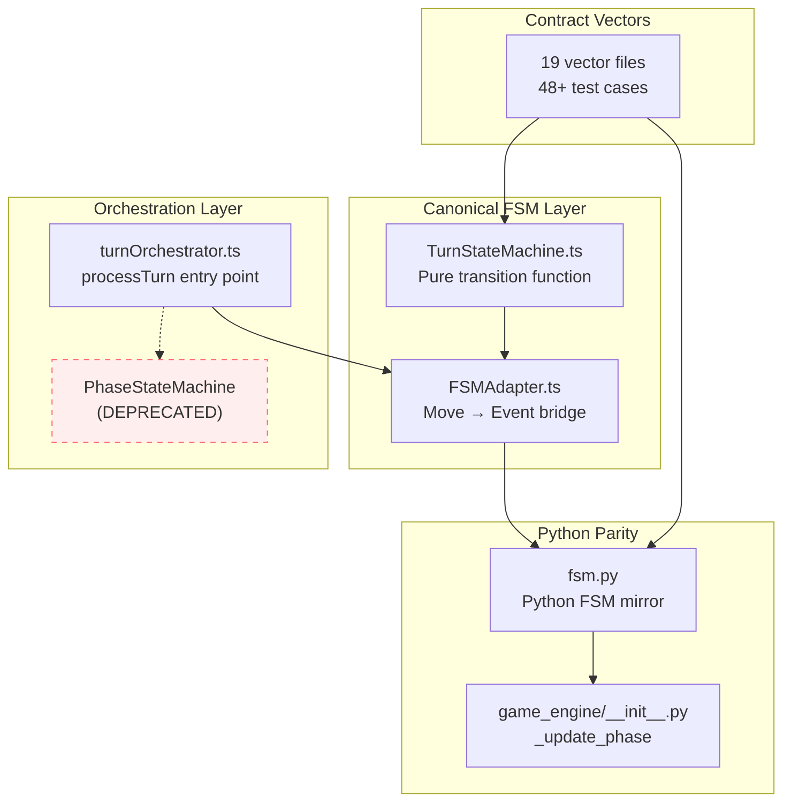

# FSM Migration Status - December 2025

> **Status:** ✅ Migration Complete - PhaseStateMachine Removed from Production
> **Author:** Kilo Code (Architect Mode)
> **Date:** 2025-12-24
> **Updated:** 2025-12-24 (PhaseStateMachine removal)
> **Related Docs:**
>
> - [FSM_EXTENSION_STRATEGY.md](FSM_EXTENSION_STRATEGY.md)
> - [ORCHESTRATOR_MIGRATION_COMPLETION_PLAN.md](../archive/ORCHESTRATOR_MIGRATION_COMPLETION_PLAN.md) (archived)
> - [STATE_MACHINES.md](STATE_MACHINES.md)
> - [PHASE_ORCHESTRATION_ARCHITECTURE.md](PHASE_ORCHESTRATION_ARCHITECTURE.md)

---

## Executive Summary

**The FSM migration is 100% complete.** The TurnStateMachine (FSM) is now the **canonical orchestrator** for all phase transitions, move validation, and decision surfacing. The `PhaseStateMachine` class has been removed from production code paths and replaced with an inline `ProcessingStateContainer` in `turnOrchestrator.ts`.

### Key Findings

| Aspect                   | Status           | Notes                                                     |
| ------------------------ | ---------------- | --------------------------------------------------------- |
| FSM Validation           | ✅ 100% Complete | `validateMoveWithFSM` is canonical                        |
| FSM Orchestration        | ✅ 100% Complete | `computeFSMOrchestration` drives phase/player transitions |
| Legacy PhaseStateMachine | ✅ Removed       | Replaced with inline `ProcessingStateContainer`           |
| Python FSM Parity        | ✅ 100% Complete | `ai-service/app/rules/fsm.py` mirrors TS exactly          |
| Contract Vectors         | ✅ 48+ passing   | 19 vector files in `tests/fixtures/contract-vectors/v2/`  |
| Shadow Mode              | ✅ Removed       | ~2,300 lines of shadow infrastructure deleted             |
| Tier 2 Sandbox Cleanup   | ⏸️ Deferred      | ~1,200 lines pending cleanup (post-MVP)                   |

---

## 1. Current State Assessment

### 1.1 Migration Completion Percentage

```
╔════════════════════════════════════════════════════════════════╗
║                    FSM MIGRATION PROGRESS                      ║
╠════════════════════════════════════════════════════════════════╣
║ Phase 1: Validation Unification      ██████████████████ 100%  ║
║ Phase 2: Orchestrator FSM Control    ██████████████████ 100%  ║
║ Phase 3: Decision Surfaces           ██████████████████ 100%  ║
║ Phase 4: Python Parity               ██████████████████ 100%  ║
║ Phase 5: UI/Telemetry Integration    ██████████████████ 100%  ║
║ Phase 6: Testing & Fixtures          ██████████████████ 100%  ║
║ Phase 7: Data Pipeline               ██████████████████ 100%  ║
║ ─────────────────────────────────────────────────────────────  ║
║ Legacy Code Removal                  ██████████████████ 100%  ║
║ Tier 2 Sandbox Cleanup               ░░░░░░░░░░░░░░░░░░ 0%    ║
╚════════════════════════════════════════════════════════════════╝
```

**Overall: 100% Complete (Tier 2 cleanup deferred)**

### 1.2 What's Already Complete

#### FSM Core Implementation

- [`TurnStateMachine.ts`](../../src/shared/engine/fsm/TurnStateMachine.ts) - 1,262 lines, production-ready
- [`FSMAdapter.ts`](../../src/shared/engine/fsm/FSMAdapter.ts) - 2,226 lines, bridges FSM with Move types
- Pure `transition()` function with exhaustive phase handlers
- Type-safe states, events, and actions

#### FSM Integration Points

- `validateMoveWithFSM()` - Canonical move validation
- `computeFSMOrchestration()` - FSM-driven phase/player transitions
- `derivePendingDecisionFromFSM()` - Converts FSM surface to PendingDecision
- `onLineProcessingComplete()` / `onTerritoryProcessingComplete()` - Phase completion helpers

#### Python Parity

- `ai-service/app/rules/fsm.py` - Python FSM implementation
- `ai-service/app/game_engine/__init__.py` - `_update_phase` uses FSM
- 28 Python FSM parity tests passing

#### Testing Infrastructure

- 19 contract vector files covering all phases
- 269 orchestrator parity tests
- FSM-specific test files:
  - `FSM.property.test.ts` - Property-based testing
  - `FSM.forcedElimination.test.ts` - FE entry/exit tests
  - `FSM.territoryLoop.test.ts` - Territory processing loops
  - `FSM.crossLanguageFixtures.test.ts` - Cross-language parity

### 1.3 Legacy Code Status

#### PhaseStateMachine (Removed from Production)

Location: [`src/shared/engine/orchestration/phaseStateMachine.ts`](../../src/shared/engine/orchestration/phaseStateMachine.ts)

**Status:** ✅ Removed from production code paths. Retained only for test backward compatibility.

**What was done:**

1. Created inline `ProcessingStateContainer` class in `turnOrchestrator.ts`
2. Created inline `createProcessingState` factory function
3. Replaced all `PhaseStateMachine` usage with `ProcessingStateContainer`
4. Added strong deprecation notices to `phaseStateMachine.ts`
5. Updated `index.ts` exports with deprecation warnings

**The `phaseStateMachine.ts` file is retained only for:**

- `tests/unit/phaseStateMachine.shared.test.ts` - 31 direct references
- `tests/unit/phaseStateMachine.branchCoverage.test.ts` - 31 direct references

These test files validate the deprecated helper functions (which may still be useful as reference implementations). They can be deleted in a future cleanup if desired.

**All production code now uses FSM exclusively:**

- `computeFSMOrchestration()` determines `nextPhase` and `nextPlayer`
- `validateMoveWithFSM()` enforces phase/move contracts
- `onLineProcessingComplete()` / `onTerritoryProcessingComplete()` handle phase decisions
- `ProcessingStateContainer` handles mutable state tracking during turn processing

---

## 2. Remaining Blockers

### 2.1 PhaseStateMachine Removal (Low Priority)

**Effort:** 2-3 days
**Risk:** Medium

The `PhaseStateMachine` class could be removed entirely, but this requires:

1. **Replacing state tracking calls** - 23 occurrences in turnOrchestrator.ts:
   - `stateMachine.updateGameState()` - 5 calls
   - `stateMachine.updateFlags()` - 3 calls
   - `stateMachine.setChainCapture()` - 2 calls
   - `stateMachine.addEvent()` - 6 calls
   - `stateMachine.gameState` - 7 reads

2. **Alternative approach:** Inline the mutable state tracking directly in `processTurn()`:

   ```typescript
   // Instead of PhaseStateMachine, use a simple processing context
   let processingContext = {
     gameState: state,
     perTurnFlags: { hasPlacedThisTurn: false, ... },
     pendingLines: [],
     events: [],
     phasesTraversed: [state.currentPhase],
   };
   ```

3. **Why it's low priority:**
   - PhaseStateMachine is purely internal to turnOrchestrator.ts
   - It doesn't affect external behavior
   - FSM is already canonical for all actual transitions
   - The class is well-marked as deprecated

### 2.2 Tier 2 Sandbox Cleanup (Deferred to Post-MVP)

**Effort:** 1-2 days
**Risk:** Low

Remaining sandbox support modules (~1,200 lines):

- `sandboxMovement.ts` (~70 lines)
- `sandboxCaptures.ts` (~175 lines)
- `sandboxCaptureSearch.ts` (~200 lines) - DIAGNOSTICS-ONLY
- `sandboxElimination.ts` (~150 lines)
- `sandboxLines.ts` (~145 lines)
- `sandboxTerritory.ts` (~165 lines)
- `sandboxPlacement.ts` (~220 lines)
- `sandboxVictory.ts` (~120 lines)
- `sandboxGameEnd.ts` (~110 lines)

These are **UX adapters over shared engine**, not duplicate rule implementations. They should receive SSOT banners but are not migration blockers.

### 2.3 Documentation Updates (Low Priority)

Some older architecture documents reference the dual-system pattern:

- `PHASE_ORCHESTRATION_ARCHITECTURE.md` - References both systems
- `ORCHESTRATOR_CONSOLIDATION.md` - Migration context (archived to `docs/archive/`)

---

## 3. Architecture Diagram



---

## 4. Risk Assessment

| Risk                                        | Severity | Likelihood | Mitigation                                   |
| ------------------------------------------- | -------- | ---------- | -------------------------------------------- |
| PhaseStateMachine removal causes regression | Medium   | Low        | FSM already canonical; removal is mechanical |
| Python parity drift                         | High     | Very Low   | 48+ contract vectors enforce parity          |
| Test infrastructure gaps                    | Low      | Very Low   | Comprehensive test coverage exists           |
| Documentation drift                         | Low      | Medium     | Update docs as part of cleanup PRs           |

---

## 5. Recommendations

### 5.1 Recommended Approach: Do Nothing Now

**Rationale:**

1. FSM is already canonical and working correctly
2. PhaseStateMachine is purely internal bookkeeping
3. No user-facing bugs or performance issues
4. Migration is functionally complete

### 5.2 Alternative: Complete PhaseStateMachine Removal

**If undertaken, execute in this order:**

1. **Phase A: Inline Processing State** (1 day)
   - Replace `PhaseStateMachine` class with inline context object
   - Preserve all `updateGameState()`, `updateFlags()` functionality
   - No behavioral changes, purely mechanical refactor

2. **Phase B: Remove Deprecated Helpers** (0.5 day)
   - Delete `phaseStateMachine.ts` file
   - Remove unused imports from turnOrchestrator.ts
   - Update any remaining references

3. **Phase C: Update Documentation** (0.5 day)
   - Mark migration as 100% complete
   - Archive historical migration documents
   - Update architecture diagrams

**Total effort:** 2 days

### 5.3 Tier 2 Sandbox Cleanup (When Appropriate)

**When:** Post-MVP, during a dedicated cleanup sprint

**Tasks:**

- Add SSOT banners to retained modules
- Move `sandboxCaptureSearch.ts` to diagnostics namespace
- Archive `localSandboxController.ts`
- Update `scripts/ssot/rules-ssot-check.ts`

---

## 6. Effort Estimates

| Work Item                 | Effort           | Priority      | Notes                    |
| ------------------------- | ---------------- | ------------- | ------------------------ |
| PhaseStateMachine removal | 2 days           | P3 (Low)      | Optional, no user impact |
| Tier 2 sandbox cleanup    | 1-2 days         | P4 (Deferred) | Post-MVP                 |
| Documentation updates     | 0.5 days         | P4 (Deferred) | Can accompany other PRs  |
| **Total remaining work**  | **3.5-4.5 days** | -             | All optional             |

---

## 7. Conclusion

**The FSM migration should be considered complete for all practical purposes.**

The TurnStateMachine is the canonical source of truth for phase transitions, move validation, and decision surfacing. The remaining work (PhaseStateMachine removal, Tier 2 cleanup) represents internal code hygiene rather than functional migration.

**Key achievements:**

- ✅ Single source of truth for phase transitions (TurnStateMachine)
- ✅ Type-safe, exhaustive phase handling
- ✅ Python parity maintained via shared contract vectors
- ✅ Shadow mode infrastructure removed (~2,300 lines)
- ✅ All 7 extension phases complete

**Recommendation:** Defer PhaseStateMachine removal unless a developer specifically needs to work in that area. The code is well-marked as deprecated and doesn't impact functionality.

---

## References

- **FSM Implementation:** [`src/shared/engine/fsm/`](../../src/shared/engine/fsm)
- **Legacy PhaseStateMachine:** [`src/shared/engine/orchestration/phaseStateMachine.ts`](../../src/shared/engine/orchestration/phaseStateMachine.ts)
- **Turn Orchestrator:** [`src/shared/engine/orchestration/turnOrchestrator.ts`](../../src/shared/engine/orchestration/turnOrchestrator.ts)
- **Python FSM:** [`ai-service/app/rules/fsm.py`](../../ai-service/app/rules/fsm.py)
- **Contract Vectors:** [`tests/fixtures/contract-vectors/v2/`](../../tests/fixtures/contract-vectors/v2)
- **Parity Runbook:** [`docs/PARITY_RUNBOOK.md`](../PARITY_RUNBOOK.md)
