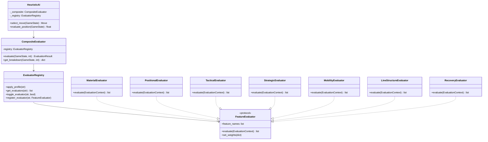

# HeuristicAI Decomposition Plan

> **Doc Status (2025-12-23): COMPLETED ✓**
>
> All 7 phases of the HeuristicAI decomposition have been successfully
> completed. The monolithic god class has been refactored into 6 focused
> evaluator components with clean delegation.
>
> **Related Documents:**
>
> - [`REFACTORING_OPPORTUNITIES_ANALYSIS.md`](REFACTORING_OPPORTUNITIES_ANALYSIS.md) - Parent analysis document
> - [`ai-service/app/ai/heuristic_ai.py`](../../ai-service/app/ai/heuristic_ai.py) - Coordinator (~1,911 LOC)
> - [`ai-service/app/ai/evaluators/`](../../ai-service/app/ai/evaluators) - Extracted evaluators (3,525 LOC total)
> - [`ai-service/app/ai/evaluation_provider.py`](../../ai-service/app/ai/evaluation_provider.py) - Existing interface
> - [`AI_ARCHITECTURE.md`](AI_ARCHITECTURE.md) - AI service architecture

---

## Completion Summary

### Phase Completion Status

| Phase | Component           | Status      | LOC Change         | Date       |
| ----- | ------------------- | ----------- | ------------------ | ---------- |
| 1     | MaterialEvaluator   | ✅ Complete | +539 (extracted)   | 2025-12-XX |
| 2     | PositionalEvaluator | ✅ Complete | +576 (extracted)   | 2025-12-XX |
| 3     | TacticalEvaluator   | ✅ Complete | +547 (extracted)   | 2025-12-XX |
| 4     | MobilityEvaluator   | ✅ Complete | +474 (extracted)   | 2025-12-XX |
| 5     | StrategicEvaluator  | ✅ Complete | +796 (extracted)   | 2025-12-XX |
| 6     | EndgameEvaluator    | ✅ Complete | +522 (extracted)   | 2025-12-XX |
| 7     | Core Refactor       | ✅ Complete | Delegation pattern | 2025-12-23 |

### Final Metrics

| Metric             | Before          | After                     | Change      |
| ------------------ | --------------- | ------------------------- | ----------- |
| HeuristicAI LOC    | ~2,203          | ~1,911                    | -292 (-13%) |
| Evaluators Package | 0               | 3,525                     | +3,525      |
| Testability        | Monolithic      | Modular                   | ✓           |
| Weight Isolation   | Class constants | Per-evaluator dataclasses | ✓           |

### Architectural Improvements

1. **Clean Delegation Pattern**: `_compute_component_scores()` delegates to
   `_evaluate_*` methods which delegate to evaluators
2. **Per-Evaluator Caching**: Each evaluator manages its own visibility/state
   cache (e.g., `TacticalEvaluator._visible_stacks_cache`)
3. **Lazy Initialization**: Evaluators created on first access via `@property`
4. **Weight Dataclasses**: Each evaluator has `*Weights.from_heuristic_ai()`
   factory for consistent weight extraction
5. **Tier 0/1/2 Gating**: `eval_mode` ("full"/"light") gates Tier-2 features

### Test Verification

All 55 heuristic tests pass after Phase 7 completion:

- `tests/test_heuristic_ai.py`: 46 tests ✓
- `tests/test_heuristic_eval_modes.py`: 9 tests ✓

Key tests validating the refactor:

- `test_heuristic_eval_mode_gates_tier2_features` - Verifies Tier-2 gating
- `test_tier2_methods_called_in_full_mode_and_skipped_in_light` - Verifies
  method call routing through `_evaluate_*` wrappers

---

## Executive Summary

The `HeuristicAI` class is identified as a **god class** with:

| Metric               | Current Value | Target                  |
| -------------------- | ------------- | ----------------------- |
| Lines of Code        | 2,203         | ~400 (coordinator only) |
| Private Methods      | 46+           | ~10 (delegation)        |
| Weight Constants     | 48            | 0 (moved to profiles)   |
| Responsibility Areas | 6             | 1 (move selection)      |

### Proposed Decomposition

```
ai-service/app/ai/
├── heuristic_ai.py              # 400 LOC - Coordinator only
├── evaluators/
│   ├── __init__.py
│   ├── base.py                  # FeatureEvaluator protocol
│   ├── material.py              # MaterialEvaluator (stack/ring counting)
│   ├── positional.py            # PositionalEvaluator (territory, center)
│   ├── tactical.py              # TacticalEvaluator (captures, threats)
│   ├── strategic.py             # StrategicEvaluator (FE risk, LPS)
│   ├── mobility.py              # MobilityEvaluator (movement options)
│   ├── line_structure.py        # LineStructureEvaluator (lines, connectivity)
│   └── recovery.py              # RecoveryEvaluator (RR-CANON-R110-R115)
├── composite_evaluator.py       # CompositeEvaluator (weighted sum)
├── evaluator_registry.py        # EvaluatorRegistry (feature toggling)
├── swap_evaluation.py           # Already extracted (518 LOC)
├── evaluation_provider.py       # Already exists (1,026 LOC)
└── heuristic_weights.py         # Already extracted (906 LOC)
```

---

## 1. Current State Analysis

### 1.1 Method Inventory by Category

Based on analysis of [`heuristic_ai.py:228-2203`](../../ai-service/app/ai/heuristic_ai.py:228), the class contains:

#### Move Selection Methods (Should remain in HeuristicAI)

| Method                       | Lines   | Purpose                                   |
| ---------------------------- | ------- | ----------------------------------------- |
| `select_move`                | 498-636 | Main entry point, orchestrates evaluation |
| `_sample_moves_for_training` | 638-662 | Training optimization                     |
| `_should_use_parallel`       | 664-696 | Parallel eval decision                    |
| `_evaluate_moves_parallel`   | 697-759 | Parallel execution                        |
| `_evaluate_moves_fast`       | 761-833 | Make/unmake optimization                  |
| `_make_move_light`           | 835-873 | Lightweight move application              |
| `_evaluate_moves_batch`      | 891-954 | NumPy batch evaluation                    |

#### Evaluation Entry Points (Move to CompositeEvaluator)

| Method                      | Lines     | Purpose               |
| --------------------------- | --------- | --------------------- |
| `evaluate_position`         | 956-978   | Main evaluation entry |
| `_compute_component_scores` | 980-1079  | Feature aggregation   |
| `get_evaluation_breakdown`  | 1081-1098 | Debug/analysis output |

#### Material Evaluation Features (→ MaterialEvaluator)

| Method                       | Lines     | Weights Used                                                                                                                                                  | Purpose                              |
| ---------------------------- | --------- | ------------------------------------------------------------------------------------------------------------------------------------------------------------- | ------------------------------------ |
| `_evaluate_stack_control`    | 1100-1154 | `WEIGHT_STACK_CONTROL`, `WEIGHT_STACK_HEIGHT`, `WEIGHT_CAP_HEIGHT`, `WEIGHT_NO_STACKS_PENALTY`, `WEIGHT_SINGLE_STACK_PENALTY`, `WEIGHT_STACK_DIVERSITY_BONUS` | Stack count, height, diversification |
| `_evaluate_rings_in_hand`    | 1175-1194 | `WEIGHT_RINGS_IN_HAND`                                                                                                                                        | Ring reserve advantage               |
| `_evaluate_eliminated_rings` | 1406-1412 | `WEIGHT_ELIMINATED_RINGS`                                                                                                                                     | Elimination progress                 |
| `_evaluate_marker_count`     | 1575-1582 | `WEIGHT_MARKER_COUNT`                                                                                                                                         | Marker density                       |

#### Positional Evaluation Features (→ PositionalEvaluator)

| Method                        | Lines     | Weights Used               | Purpose                    |
| ----------------------------- | --------- | -------------------------- | -------------------------- |
| `_evaluate_territory`         | 1156-1173 | `WEIGHT_TERRITORY`         | Territory control          |
| `_evaluate_center_control`    | 1196-1209 | `WEIGHT_CENTER_CONTROL`    | Center position value      |
| `_evaluate_territory_closure` | 1716-1769 | `WEIGHT_TERRITORY_CLOSURE` | Enclosure potential        |
| `_evaluate_territory_safety`  | 1839-1878 | `WEIGHT_TERRITORY_SAFETY`  | Opponent proximity         |
| `_get_center_positions`       | 1774-1776 | -                          | Helper (uses FastGeometry) |

#### Tactical Evaluation Features (→ TacticalEvaluator)

| Method                         | Lines     | Weights Used                | Purpose                   |
| ------------------------------ | --------- | --------------------------- | ------------------------- |
| `_evaluate_opponent_threats`   | 1211-1239 | `WEIGHT_OPPONENT_THREAT`    | Adjacent enemy stacks     |
| `_evaluate_vulnerability`      | 1662-1687 | `WEIGHT_VULNERABILITY`      | Capture risk (LoS)        |
| `_evaluate_overtake_potential` | 1689-1714 | `WEIGHT_OVERTAKE_POTENTIAL` | Capture opportunity (LoS) |
| `_get_visible_stacks`          | 1584-1660 | -                           | Line-of-sight helper      |

#### Strategic Evaluation Features (→ StrategicEvaluator)

| Method                               | Lines     | Weights Used                                                                                           | Purpose                    |
| ------------------------------------ | --------- | ------------------------------------------------------------------------------------------------------ | -------------------------- |
| `_evaluate_victory_proximity`        | 1521-1541 | `WEIGHT_VICTORY_PROXIMITY`                                                                             | Win condition proximity    |
| `_evaluate_opponent_victory_threat`  | 1543-1573 | `WEIGHT_OPPONENT_VICTORY_THREAT`                                                                       | Opponent win threat        |
| `_victory_proximity_base_for_player` | 449-496   | `WEIGHT_VICTORY_THRESHOLD_BONUS`, `WEIGHT_RINGS_PROXIMITY_FACTOR`, `WEIGHT_TERRITORY_PROXIMITY_FACTOR` | Core proximity calculation |
| `_evaluate_forced_elimination_risk`  | 1929-1959 | `WEIGHT_FORCED_ELIMINATION_RISK`                                                                       | FE vulnerability           |
| `_evaluate_lps_action_advantage`     | 1961-2004 | `WEIGHT_LPS_ACTION_ADVANTAGE`                                                                          | Last-player-standing       |
| `_evaluate_multi_leader_threat`      | 2006-2039 | `WEIGHT_MULTI_LEADER_THREAT`                                                                           | 3+ player dynamics         |
| `_approx_real_actions_for_player`    | 1306-1371 | -                                                                                                      | Action counting helper     |

#### Mobility Evaluation Features (→ MobilityEvaluator)

| Method                     | Lines     | Weights Used                                            | Purpose               |
| -------------------------- | --------- | ------------------------------------------------------- | --------------------- |
| `_evaluate_mobility`       | 1241-1295 | `WEIGHT_MOBILITY`                                       | Pseudo-mobility count |
| `_evaluate_stack_mobility` | 1880-1927 | `WEIGHT_STACK_MOBILITY`, `WEIGHT_BLOCKED_STACK_PENALTY` | Per-stack mobility    |

#### Line Structure Evaluation Features (→ LineStructureEvaluator)

| Method                           | Lines     | Weights Used                                                                              | Purpose                |
| -------------------------------- | --------- | ----------------------------------------------------------------------------------------- | ---------------------- |
| `_evaluate_line_potential`       | 1414-1488 | `WEIGHT_LINE_POTENTIAL`, `WEIGHT_TWO_IN_ROW`, `WEIGHT_THREE_IN_ROW`, `WEIGHT_FOUR_IN_ROW` | Line-forming potential |
| `_evaluate_line_potential_numba` | 1490-1519 | Same as above                                                                             | Numba JIT path         |
| `_evaluate_line_connectivity`    | 1778-1837 | `WEIGHT_LINE_CONNECTIVITY`, `WEIGHT_CONNECTED_NEIGHBOR`, `WEIGHT_GAP_POTENTIAL`           | Marker connectivity    |

#### Recovery Evaluation Features (→ RecoveryEvaluator)

| Method                         | Lines     | Weights Used                                                                                                     | Purpose                                 |
| ------------------------------ | --------- | ---------------------------------------------------------------------------------------------------------------- | --------------------------------------- |
| `_evaluate_recovery_potential` | 2149-2203 | `WEIGHT_RECOVERY_POTENTIAL`, `WEIGHT_RECOVERY_ELIGIBILITY`, `WEIGHT_BURIED_RING_VALUE`, `WEIGHT_RECOVERY_THREAT` | Recovery mechanics (RR-CANON-R110-R115) |

#### Already Extracted (→ SwapEvaluator)

| Method                            | Lines     | Status                     |
| --------------------------------- | --------- | -------------------------- |
| `evaluate_swap_opening_bonus`     | 2065-2089 | Delegates to SwapEvaluator |
| `_is_corner_position`             | 2091-2100 | Delegates to SwapEvaluator |
| `_is_edge_position`               | 2102-2111 | Delegates to SwapEvaluator |
| `_is_strategic_diagonal_position` | 2113-2124 | Delegates to SwapEvaluator |
| `compute_opening_strength`        | 2126-2136 | Delegates to SwapEvaluator |
| `evaluate_swap_with_classifier`   | 2138-2147 | Delegates to SwapEvaluator |

#### Utility Methods (Move to shared helpers)

| Method                    | Lines     | Purpose                | Destination       |
| ------------------------- | --------- | ---------------------- | ----------------- |
| `_iterate_board_keys`     | 1297-1304 | Board key iteration    | FastGeometry      |
| `_get_adjacent_positions` | 2041-2055 | Position adjacency     | BoardGeometry     |
| `_get_adjacent_keys`      | 2057-2063 | Key-based adjacency    | FastGeometry      |
| `_evaluate_influence`     | 1373-1404 | Influence map (unused) | Consider deletion |

#### Configuration/Setup Methods

| Method                    | Lines   | Purpose            |
| ------------------------- | ------- | ------------------ |
| `__init__`                | 321-373 | Initialization     |
| `_apply_weight_profile`   | 375-408 | Profile loading    |
| `_apply_weight_noise`     | 410-437 | Training noise     |
| `swap_evaluator` property | 439-447 | Lazy SwapEvaluator |

### 1.2 Weight Constant Inventory

The class defines 48 weight constants across several categories:

```python
# Material (6 weights)
WEIGHT_STACK_CONTROL, WEIGHT_STACK_HEIGHT, WEIGHT_CAP_HEIGHT
WEIGHT_RINGS_IN_HAND, WEIGHT_ELIMINATED_RINGS, WEIGHT_MARKER_COUNT

# Positional (5 weights)
WEIGHT_TERRITORY, WEIGHT_CENTER_CONTROL, WEIGHT_TERRITORY_CLOSURE
WEIGHT_TERRITORY_SAFETY, WEIGHT_ADJACENCY

# Tactical (4 weights)
WEIGHT_OPPONENT_THREAT, WEIGHT_VULNERABILITY, WEIGHT_OVERTAKE_POTENTIAL, WEIGHT_MOBILITY

# Strategic (6 weights)
WEIGHT_VICTORY_PROXIMITY, WEIGHT_OPPONENT_VICTORY_THREAT, WEIGHT_FORCED_ELIMINATION_RISK
WEIGHT_LPS_ACTION_ADVANTAGE, WEIGHT_MULTI_LEADER_THREAT, WEIGHT_VICTORY_THRESHOLD_BONUS

# Mobility (3 weights)
WEIGHT_STACK_MOBILITY, WEIGHT_SAFE_MOVE_BONUS, WEIGHT_NO_SAFE_MOVES_PENALTY

# Diversification (3 weights)
WEIGHT_NO_STACKS_PENALTY, WEIGHT_SINGLE_STACK_PENALTY, WEIGHT_STACK_DIVERSITY_BONUS

# Line Structure (6 weights)
WEIGHT_LINE_POTENTIAL, WEIGHT_LINE_CONNECTIVITY, WEIGHT_TWO_IN_ROW
WEIGHT_THREE_IN_ROW, WEIGHT_FOUR_IN_ROW, WEIGHT_CONNECTED_NEIGHBOR
WEIGHT_GAP_POTENTIAL, WEIGHT_BLOCKED_STACK_PENALTY

# Victory Proximity (2 weights)
WEIGHT_RINGS_PROXIMITY_FACTOR, WEIGHT_TERRITORY_PROXIMITY_FACTOR

# Swap (8 weights) - Already in SwapWeights
WEIGHT_SWAP_OPENING_CENTER, WEIGHT_SWAP_OPENING_ADJACENCY, WEIGHT_SWAP_OPENING_HEIGHT
WEIGHT_SWAP_CORNER_PENALTY, WEIGHT_SWAP_EDGE_BONUS, WEIGHT_SWAP_DIAGONAL_BONUS
WEIGHT_SWAP_OPENING_STRENGTH, WEIGHT_SWAP_EXPLORATION_TEMPERATURE

# Recovery (4 weights)
WEIGHT_RECOVERY_POTENTIAL, WEIGHT_RECOVERY_ELIGIBILITY
WEIGHT_BURIED_RING_VALUE, WEIGHT_RECOVERY_THREAT
```

### 1.3 Dependency Graph

```mermaid
graph TD
    subgraph HeuristicAI
        SM[select_move]
        EP[evaluate_position]
        CCS[_compute_component_scores]
    end

    subgraph Material
        SC[_evaluate_stack_control]
        RH[_evaluate_rings_in_hand]
        ER[_evaluate_eliminated_rings]
        MC[_evaluate_marker_count]
    end

    subgraph Positional
        TER[_evaluate_territory]
        CC[_evaluate_center_control]
        TC[_evaluate_territory_closure]
        TS[_evaluate_territory_safety]
    end

    subgraph Tactical
        OT[_evaluate_opponent_threats]
        VUL[_evaluate_vulnerability]
        OP[_evaluate_overtake_potential]
        VS[_get_visible_stacks]
    end

    subgraph Strategic
        VP[_evaluate_victory_proximity]
        OVT[_evaluate_opponent_victory_threat]
        FER[_evaluate_forced_elimination_risk]
        LPS[_evaluate_lps_action_advantage]
        MLT[_evaluate_multi_leader_threat]
        VPB[_victory_proximity_base_for_player]
        ARA[_approx_real_actions_for_player]
    end

    subgraph Mobility
        MOB[_evaluate_mobility]
        SMB[_evaluate_stack_mobility]
    end

    subgraph LineStructure
        LP[_evaluate_line_potential]
        LC[_evaluate_line_connectivity]
    end

    subgraph Recovery
        RP[_evaluate_recovery_potential]
    end

    subgraph External
        FG[FastGeometry]
        BG[BoardGeometry]
        SE[SwapEvaluator]
        HW[heuristic_weights]
    end

    SM --> EP
    EP --> CCS

    CCS --> SC
    CCS --> RH
    CCS --> ER
    CCS --> MC
    CCS --> TER
    CCS --> CC
    CCS --> TC
    CCS --> TS
    CCS --> OT
    CCS --> VUL
    CCS --> OP
    CCS --> VP
    CCS --> OVT
    CCS --> FER
    CCS --> LPS
    CCS --> MLT
    CCS --> MOB
    CCS --> SMB
    CCS --> LP
    CCS --> LC
    CCS --> RP

    VUL --> VS
    OP --> VS
    VP --> VPB
    OVT --> VPB
    FER --> ARA
    LPS --> ARA
    MLT --> VPB

    SC --> FG
    CC --> FG
    OT --> FG
    MOB --> FG
    SMB --> FG
    LP --> FG
    LC --> FG
    TS --> BG
    TC --> BG

    SM --> SE
```



### 1.4 Existing Extractions

Two modules have already been extracted following the original refactoring analysis:

1. **`swap_evaluation.py`** (518 LOC): Contains `SwapWeights`, `SwapEvaluator`
2. **`evaluation_provider.py`** (1,026 LOC): Contains `EvaluationProvider` protocol, `HeuristicEvaluator`

However, `HeuristicEvaluator` in `evaluation_provider.py` is a near-complete duplication of `HeuristicAI` evaluation logic (lines 251-995). This creates maintenance burden and should be consolidated.

---

## 2. Proposed Architecture

### 2.1 FeatureEvaluator Protocol

```python
# ai-service/app/ai/evaluators/base.py

from __future__ import annotations
from typing import Protocol, runtime_checkable
from dataclasses import dataclass

from ...models import GameState


@dataclass
class EvaluationContext:
    """Context shared across evaluators for a single evaluation call.

    This dataclass avoids redundant computations by caching common data
    structures that multiple evaluators need (e.g., player stacks, markers).
    """
    game_state: GameState
    player_number: int

    # Cached derived data (lazily populated)
    _my_stacks: list | None = None
    _opponent_stacks: list | None = None
    _my_markers: list | None = None
    _opponent_markers: list | None = None
    _center_positions: frozenset | None = None

    @property
    def my_stacks(self) -> list:
        if self._my_stacks is None:
            self._my_stacks = [
                s for s in self.game_state.board.stacks.values()
                if s.controlling_player == self.player_number
            ]
        return self._my_stacks

    @property
    def opponent_stacks(self) -> list:
        if self._opponent_stacks is None:
            self._opponent_stacks = [
                s for s in self.game_state.board.stacks.values()
                if s.controlling_player != self.player_number
            ]
        return self._opponent_stacks

    # ... similar for markers, center positions, etc.


@dataclass
class FeatureScore:
    """Result from a feature evaluator.

    Encapsulates the score and optional breakdown for debugging/analysis.
    """
    name: str
    score: float
    breakdown: dict[str, float] | None = None


@runtime_checkable
class FeatureEvaluator(Protocol):
    """Protocol for feature evaluation components.

    Each evaluator computes one or more related features and returns
    weighted scores. The weights are injected during construction,
    allowing weight profiles to customize behavior.
    """

    @property
    def feature_names(self) -> list[str]:
        """Names of features computed by this evaluator."""
        ...

    def evaluate(self, context: EvaluationContext) -> list[FeatureScore]:
        """Compute feature scores for the given context.

        Returns a list of FeatureScore objects, one per feature.
        Multiple features may be returned if they share computation.
        """
        ...

    def set_weights(self, weights: dict[str, float]) -> None:
        """Update weight values from a profile."""
        ...
```

### 2.2 Domain Evaluator Classes

#### MaterialEvaluator

```python
# ai-service/app/ai/evaluators/material.py

from dataclasses import dataclass
from .base import FeatureEvaluator, EvaluationContext, FeatureScore


@dataclass
class MaterialWeights:
    """Weight configuration for material evaluation."""
    stack_control: float = 10.0
    stack_height: float = 5.0
    cap_height: float = 6.0
    rings_in_hand: float = 3.0
    eliminated_rings: float = 12.0
    marker_count: float = 1.5
    no_stacks_penalty: float = 50.0
    single_stack_penalty: float = 10.0
    stack_diversity_bonus: float = 2.0


class MaterialEvaluator:
    """Evaluates material balance: stacks, rings, markers.

    Features:
    - stack_control: Relative stack count advantage
    - stack_height: Effective height (with diminishing returns)
    - cap_height: Capture power advantage
    - rings_in_hand: Reserve ring advantage
    - eliminated_rings: Progress toward ring elimination victory
    - marker_count: Marker density on board
    - stack_diversity: Penalty for having 0-1 stacks
    """

    def __init__(self, weights: MaterialWeights | None = None):
        self.weights = weights or MaterialWeights()

    @property
    def feature_names(self) -> list[str]:
        return [
            'stack_control', 'stack_height', 'cap_height',
            'rings_in_hand', 'eliminated_rings', 'marker_count',
            'stack_diversity'
        ]

    def evaluate(self, context: EvaluationContext) -> list[FeatureScore]:
        scores = []

        # Stack control and height
        my_stacks = context.my_stacks
        opp_stacks = context.opponent_stacks

        my_count = len(my_stacks)
        opp_count = len(opp_stacks)

        my_height = sum(self._effective_height(s.stack_height) for s in my_stacks)
        opp_height = sum(self._effective_height(s.stack_height) for s in opp_stacks)

        my_cap = sum(s.cap_height for s in my_stacks)
        opp_cap = sum(s.cap_height for s in opp_stacks)

        scores.append(FeatureScore(
            name='stack_control',
            score=(my_count - opp_count) * self.weights.stack_control,
            breakdown={'my_stacks': my_count, 'opp_stacks': opp_count}
        ))

        scores.append(FeatureScore(
            name='stack_height',
            score=(my_height - opp_height) * self.weights.stack_height
        ))

        scores.append(FeatureScore(
            name='cap_height',
            score=(my_cap - opp_cap) * self.weights.cap_height
        ))

        # Stack diversity (symmetric)
        my_div = self._diversity_score(my_count)
        opp_div = self._diversity_score(opp_count)
        scores.append(FeatureScore(
            name='stack_diversity',
            score=my_div - opp_div
        ))

        # Rings in hand
        my_player = context.game_state.players[context.player_number - 1]
        max_opp_rings = max(
            (p.rings_in_hand for p in context.game_state.players
             if p.player_number != context.player_number),
            default=0
        )
        scores.append(FeatureScore(
            name='rings_in_hand',
            score=(my_player.rings_in_hand - max_opp_rings) * self.weights.rings_in_hand
        ))

        # Eliminated rings
        scores.append(FeatureScore(
            name='eliminated_rings',
            score=my_player.eliminated_rings * self.weights.eliminated_rings
        ))

        # Marker count
        markers = context.game_state.board.markers
        my_markers = sum(1 for m in markers.values() if m.player == context.player_number)
        scores.append(FeatureScore(
            name='marker_count',
            score=my_markers * self.weights.marker_count
        ))

        return scores

    def _effective_height(self, height: int) -> float:
        """Diminishing returns for height > 5."""
        return height if height <= 5 else 5 + (height - 5) * 0.1

    def _diversity_score(self, stack_count: int) -> float:
        """Compute diversification score."""
        if stack_count == 0:
            return -self.weights.no_stacks_penalty
        elif stack_count == 1:
            return -self.weights.single_stack_penalty
        else:
            return stack_count * self.weights.stack_diversity_bonus

    def set_weights(self, weights: dict[str, float]) -> None:
        """Update weights from profile dictionary."""
        if 'WEIGHT_STACK_CONTROL' in weights:
            self.weights.stack_control = weights['WEIGHT_STACK_CONTROL']
        # ... similar for other weights
```

#### PositionalEvaluator

```python
# ai-service/app/ai/evaluators/positional.py

@dataclass
class PositionalWeights:
    territory: float = 8.0
    center_control: float = 4.0
    territory_closure: float = 10.0
    territory_safety: float = 5.0


class PositionalEvaluator:
    """Evaluates positional control: territory, center, closure.

    Features:
    - territory: Current territory space advantage
    - center_control: Stacks in center positions
    - territory_closure: Marker clustering for enclosure
    - territory_safety: Distance from opponent stacks
    """

    def __init__(
        self,
        weights: PositionalWeights | None = None,
        fast_geo: FastGeometry | None = None,
    ):
        self.weights = weights or PositionalWeights()
        self._fast_geo = fast_geo

    @property
    def fast_geo(self) -> FastGeometry:
        if self._fast_geo is None:
            from ..fast_geometry import FastGeometry
            self._fast_geo = FastGeometry.get_instance()
        return self._fast_geo

    def evaluate(self, context: EvaluationContext) -> list[FeatureScore]:
        scores = []

        # Territory
        my_player = self._get_player(context)
        my_territory = my_player.territory_spaces if my_player else 0
        max_opp_territory = max(
            (p.territory_spaces for p in context.game_state.players
             if p.player_number != context.player_number),
            default=0
        )
        scores.append(FeatureScore(
            name='territory',
            score=(my_territory - max_opp_territory) * self.weights.territory
        ))

        # Center control
        center_positions = self.fast_geo.get_center_positions(
            context.game_state.board.type
        )
        center_score = 0.0
        for pos_key in center_positions:
            if pos_key in context.game_state.board.stacks:
                stack = context.game_state.board.stacks[pos_key]
                if stack.controlling_player == context.player_number:
                    center_score += self.weights.center_control
                else:
                    center_score -= self.weights.center_control * 0.5
        scores.append(FeatureScore(
            name='center_control',
            score=center_score
        ))

        # Territory closure (marker clustering)
        scores.append(FeatureScore(
            name='territory_closure',
            score=self._evaluate_closure(context)
        ))

        # Territory safety (opponent proximity)
        scores.append(FeatureScore(
            name='territory_safety',
            score=self._evaluate_safety(context)
        ))

        return scores

    # ... helper methods
```

#### TacticalEvaluator

```python
# ai-service/app/ai/evaluators/tactical.py

@dataclass
class TacticalWeights:
    opponent_threat: float = 6.0
    vulnerability: float = 8.0
    overtake_potential: float = 8.0


class TacticalEvaluator:
    """Evaluates tactical situations: threats, captures.

    Features:
    - opponent_threats: Adjacent enemy stacks with capture advantage
    - vulnerability: Line-of-sight capture risk
    - overtake_potential: Line-of-sight capture opportunities

    Uses visibility cache for efficient LoS calculations.
    """

    def __init__(
        self,
        weights: TacticalWeights | None = None,
        fast_geo: FastGeometry | None = None,
    ):
        self.weights = weights or TacticalWeights()
        self._fast_geo = fast_geo
        self._visible_stacks_cache: dict[str, list] = {}

    def evaluate(self, context: EvaluationContext) -> list[FeatureScore]:
        # Clear cache for new evaluation
        self._visible_stacks_cache.clear()

        scores = []

        # Opponent threats (adjacent)
        threat_score = self._evaluate_adjacent_threats(context)
        scores.append(FeatureScore(name='opponent_threats', score=threat_score))

        # Vulnerability (LoS)
        vuln_score = self._evaluate_vulnerability(context)
        scores.append(FeatureScore(name='vulnerability', score=vuln_score))

        # Overtake potential (LoS)
        overtake_score = self._evaluate_overtake(context)
        scores.append(FeatureScore(name='overtake_potential', score=overtake_score))

        return scores

    def _get_visible_stacks(
        self,
        position: Position,
        context: EvaluationContext,
    ) -> list:
        """Get line-of-sight visible stacks from a position.

        Results are cached per-evaluation for efficiency.
        """
        cache_key = position.to_key()
        if cache_key in self._visible_stacks_cache:
            return self._visible_stacks_cache[cache_key]

        # ... LoS calculation logic

        self._visible_stacks_cache[cache_key] = visible
        return visible
```

#### StrategicEvaluator

```python
# ai-service/app/ai/evaluators/strategic.py

@dataclass
class StrategicWeights:
    victory_proximity: float = 20.0
    opponent_victory_threat: float = 6.0
    forced_elimination_risk: float = 4.0
    lps_action_advantage: float = 2.0
    multi_leader_threat: float = 2.0
    victory_threshold_bonus: float = 1000.0
    rings_proximity_factor: float = 50.0
    territory_proximity_factor: float = 50.0


class StrategicEvaluator:
    """Evaluates strategic game-ending conditions.

    Features:
    - victory_proximity: How close we are to winning
    - opponent_victory_threat: How close opponents are to winning
    - forced_elimination_risk: Risk of being forced eliminated
    - lps_action_advantage: Last-player-standing dynamics (3+ players)
    - multi_leader_threat: Single opponent pulling ahead (3+ players)
    """

    def __init__(self, weights: StrategicWeights | None = None):
        self.weights = weights or StrategicWeights()

    def evaluate(self, context: EvaluationContext) -> list[FeatureScore]:
        scores = []

        # Victory proximity (symmetric)
        my_prox = self._victory_proximity_for_player(
            context, context.player_number
        )
        max_opp_prox = max(
            (self._victory_proximity_for_player(context, p.player_number)
             for p in context.game_state.players
             if p.player_number != context.player_number),
            default=0.0
        )
        scores.append(FeatureScore(
            name='victory_proximity',
            score=(my_prox - max_opp_prox) * self.weights.victory_proximity
        ))

        # Opponent victory threat
        relative_threat = max(0.0, max_opp_prox - my_prox)
        scores.append(FeatureScore(
            name='opponent_victory_threat',
            score=-relative_threat * self.weights.opponent_victory_threat
        ))

        # Forced elimination risk
        scores.append(FeatureScore(
            name='forced_elimination_risk',
            score=self._evaluate_fe_risk(context)
        ))

        # Multi-player features (only for 3+ players)
        if len(context.game_state.players) > 2:
            scores.append(FeatureScore(
                name='lps_action_advantage',
                score=self._evaluate_lps_advantage(context)
            ))
            scores.append(FeatureScore(
                name='multi_leader_threat',
                score=self._evaluate_leader_threat(context)
            ))
        else:
            scores.append(FeatureScore(name='lps_action_advantage', score=0.0))
            scores.append(FeatureScore(name='multi_leader_threat', score=0.0))

        return scores

    def _victory_proximity_for_player(
        self,
        context: EvaluationContext,
        player_number: int,
    ) -> float:
        """Compute base victory proximity score for a player.

        Includes LPS proximity, ring elimination proximity, and territory proximity.
        """
        # ... implementation from HeuristicAI._victory_proximity_base_for_player
```

#### MobilityEvaluator

```python
# ai-service/app/ai/evaluators/mobility.py

@dataclass
class MobilityWeights:
    mobility: float = 4.0
    stack_mobility: float = 4.0
    blocked_stack_penalty: float = 5.0


class MobilityEvaluator:
    """Evaluates movement options and flexibility.

    Features:
    - mobility: Overall pseudo-mobility advantage
    - stack_mobility: Per-stack movement options
    """

    def __init__(
        self,
        weights: MobilityWeights | None = None,
        fast_geo: FastGeometry | None = None,
    ):
        self.weights = weights or MobilityWeights()
        self._fast_geo = fast_geo

    def evaluate(self, context: EvaluationContext) -> list[FeatureScore]:
        scores = []

        # Pseudo-mobility (symmetric)
        my_mobility = self._count_mobility(context, context.player_number)
        max_opp_mobility = max(
            (self._count_mobility(context, p.player_number)
             for p in context.game_state.players
             if p.player_number != context.player_number),
            default=0
        )
        scores.append(FeatureScore(
            name='mobility',
            score=(my_mobility - max_opp_mobility) * self.weights.mobility
        ))

        # Stack mobility (symmetric)
        my_stack_mob = self._evaluate_stack_mobility(context, context.player_number)
        max_opp_stack_mob = max(
            (self._evaluate_stack_mobility(context, p.player_number)
             for p in context.game_state.players
             if p.player_number != context.player_number),
            default=0.0
        )
        scores.append(FeatureScore(
            name='stack_mobility',
            score=(my_stack_mob - max_opp_stack_mob) * self.weights.stack_mobility
        ))

        return scores
```

#### LineStructureEvaluator

```python
# ai-service/app/ai/evaluators/line_structure.py

@dataclass
class LineStructureWeights:
    line_potential: float = 7.0
    line_connectivity: float = 6.0
    two_in_row: float = 1.0
    three_in_row: float = 2.0
    four_in_row: float = 5.0
    connected_neighbor: float = 1.0
    gap_potential: float = 0.5


class LineStructureEvaluator:
    """Evaluates line-forming potential and marker connectivity.

    Features:
    - line_potential: 2/3/4 markers in a row
    - line_connectivity: Adjacent markers and gaps

    Note: WEIGHT_TWO_IN_ROW and WEIGHT_CONNECTED_NEIGHBOR are mathematically
    redundant (see docstring in heuristic_ai.py). Consider consolidating.
    """

    def __init__(
        self,
        weights: LineStructureWeights | None = None,
        fast_geo: FastGeometry | None = None,
    ):
        self.weights = weights or LineStructureWeights()
        self._fast_geo = fast_geo

    def evaluate(self, context: EvaluationContext) -> list[FeatureScore]:
        scores = []

        # Line potential
        line_score = self._evaluate_line_potential(context)
        scores.append(FeatureScore(
            name='line_potential',
            score=line_score * self.weights.line_potential
        ))

        # Line connectivity
        conn_score = self._evaluate_connectivity(context)
        scores.append(FeatureScore(
            name='line_connectivity',
            score=conn_score * self.weights.line_connectivity
        ))

        return scores

    def _evaluate_line_potential(self, context: EvaluationContext) -> float:
        """Count 2/3/4 in a row patterns.

        Uses FastGeometry offset_key_fast for performance.
        """
        # ... implementation from HeuristicAI._evaluate_line_potential
```

#### RecoveryEvaluator

```python
# ai-service/app/ai/evaluators/recovery.py

@dataclass
class RecoveryWeights:
    recovery_potential: float = 6.0
    recovery_eligibility: float = 8.0
    buried_ring_value: float = 3.0
    recovery_threat: float = 5.0


class RecoveryEvaluator:
    """Evaluates recovery mechanics (RR-CANON-R110-R115).

    Recovery allows temporarily eliminated players to slide markers
    to form lines, paying costs with buried ring extraction.

    Features:
    - recovery_potential: Value of having recovery moves available
    - recovery_eligibility: Bonus/penalty for recovery eligibility
    - buried_rings: Value of buried rings as recovery resource
    - recovery_threat: Threat from opponent recovery potential
    """

    def __init__(self, weights: RecoveryWeights | None = None):
        self.weights = weights or RecoveryWeights()

    def evaluate(self, context: EvaluationContext) -> list[FeatureScore]:
        from ...rules.core import count_buried_rings, is_eligible_for_recovery
        from ...rules.recovery import has_any_recovery_move

        scores = []
        total_score = 0.0

        # Our recovery status
        my_eligible = is_eligible_for_recovery(
            context.game_state, context.player_number
        )
        my_buried = count_buried_rings(
            context.game_state.board, context.player_number
        )

        if my_eligible:
            total_score += self.weights.recovery_eligibility
            if has_any_recovery_move(context.game_state, context.player_number):
                total_score += self.weights.recovery_potential
        else:
            # Small bonus for buried rings as future resource
            total_score += my_buried * self.weights.buried_ring_value * 0.3

        # Opponent recovery threats
        for player in context.game_state.players:
            if player.player_number == context.player_number:
                continue

            opp_eligible = is_eligible_for_recovery(
                context.game_state, player.player_number
            )
            if opp_eligible:
                total_score -= self.weights.recovery_eligibility * 0.5
                if has_any_recovery_move(context.game_state, player.player_number):
                    total_score -= self.weights.recovery_threat

        scores.append(FeatureScore(
            name='recovery_potential',
            score=total_score
        ))

        return scores
```

### 2.3 CompositeEvaluator

````python
# ai-service/app/ai/composite_evaluator.py

from __future__ import annotations
from dataclasses import dataclass, field
from typing import TYPE_CHECKING

from ..models import GameState
from .evaluators.base import EvaluationContext, FeatureEvaluator, FeatureScore

if TYPE_CHECKING:
    from .evaluator_registry import EvaluatorRegistry


@dataclass
class EvaluationResult:
    """Complete evaluation result with breakdown."""
    total: float
    features: dict[str, float] = field(default_factory=dict)
    breakdown: dict[str, FeatureScore] = field(default_factory=dict)


class CompositeEvaluator:
    """Composes multiple feature evaluators into a weighted sum.

    This class replaces the monolithic evaluation logic in HeuristicAI,
    delegating to specialized evaluators for each feature domain.

    Example
    -------
    ```python
    registry = EvaluatorRegistry()
    composite = CompositeEvaluator(registry)

    # Evaluate a position
    result = composite.evaluate(game_state, player_number=1)
    print(f'Total: {result.total}')
    print(f'Stack control: {result.features["stack_control"]}')
    ```
    """

    def __init__(
        self,
        registry: EvaluatorRegistry | None = None,
        eval_mode: str = 'full',
    ):
        from .evaluator_registry import EvaluatorRegistry

        self.registry = registry or EvaluatorRegistry()
        self.eval_mode = eval_mode

    def evaluate(
        self,
        game_state: GameState,
        player_number: int,
    ) -> EvaluationResult:
        """Evaluate position using all registered evaluators.

        Parameters
        ----------
        game_state : GameState
            Position to evaluate.
        player_number : int
            Player to evaluate for.

        Returns
        -------
        EvaluationResult
            Complete evaluation with total score and feature breakdown.
        """
        # Check terminal states
        if game_state.game_status == 'completed':
            if game_state.winner == player_number:
                return EvaluationResult(total=100000.0)
            elif game_state.winner is not None:
                return EvaluationResult(total=-100000.0)
            return EvaluationResult(total=0.0)

        # Create shared evaluation context
        context = EvaluationContext(
            game_state=game_state,
            player_number=player_number,
        )

        # Collect scores from all evaluators
        all_scores: dict[str, float] = {}
        all_breakdown: dict[str, FeatureScore] = {}

        for evaluator in self.registry.get_evaluators(self.eval_mode):
            try:
                feature_scores = evaluator.evaluate(context)
                for fs in feature_scores:
                    all_scores[fs.name] = fs.score
                    all_breakdown[fs.name] = fs
            except Exception as e:
                # Log error but continue with other evaluators
                import logging
                logging.warning(f'Evaluator {type(evaluator).__name__} failed: {e}')

        total = sum(all_scores.values())

        return EvaluationResult(
            total=total,
            features=all_scores,
            breakdown=all_breakdown,
        )

    def get_breakdown(
        self,
        game_state: GameState,
        player_number: int,
    ) -> dict[str, float]:
        """Get feature breakdown for debugging/analysis.

        Returns dict with 'total' key and all feature scores.
        """
        result = self.evaluate(game_state, player_number)
        breakdown = {'total': result.total}
        breakdown.update(result.features)
        return breakdown
````

### 2.4 EvaluatorRegistry

````python
# ai-service/app/ai/evaluator_registry.py

from __future__ import annotations
from dataclasses import dataclass, field
from typing import TYPE_CHECKING

from .evaluators.base import FeatureEvaluator
from .heuristic_weights import HEURISTIC_WEIGHT_PROFILES, get_weights

if TYPE_CHECKING:
    from .fast_geometry import FastGeometry


@dataclass
class EvaluatorConfig:
    """Configuration for which evaluators to enable."""
    enable_material: bool = True
    enable_positional: bool = True
    enable_tactical: bool = True
    enable_strategic: bool = True
    enable_mobility: bool = True
    enable_line_structure: bool = True
    enable_recovery: bool = True

    # Tier 2 features (only in 'full' mode)
    tier2_features: frozenset[str] = field(default_factory=lambda: frozenset({
        'line_potential', 'line_connectivity',
        'vulnerability', 'overtake_potential',
        'territory_closure', 'territory_safety',
        'forced_elimination_risk', 'lps_action_advantage',
        'recovery_potential',
    }))


class EvaluatorRegistry:
    """Registry for feature evaluators with weight profile support.

    Manages evaluator instances and applies weight profiles from
    heuristic_weights.py. Supports feature toggling for experimentation
    and eval_mode gating (full vs light).

    Example
    -------
    ```python
    # Create registry with default evaluators
    registry = EvaluatorRegistry()

    # Apply a specific weight profile
    registry.apply_profile('heuristic_v1_aggressive')

    # Get evaluators for full evaluation
    evaluators = registry.get_evaluators(eval_mode='full')

    # Disable a feature for experimentation
    registry.toggle_evaluator('recovery', enabled=False)
    ```
    """

    def __init__(
        self,
        config: EvaluatorConfig | None = None,
        profile_id: str | None = None,
        fast_geo: FastGeometry | None = None,
    ):
        self.config = config or EvaluatorConfig()
        self._fast_geo = fast_geo
        self._evaluators: dict[str, FeatureEvaluator] = {}
        self._enabled: dict[str, bool] = {}

        # Initialize default evaluators
        self._initialize_evaluators()

        # Apply weight profile if specified
        if profile_id:
            self.apply_profile(profile_id)

    def _initialize_evaluators(self) -> None:
        """Create default evaluator instances."""
        from .evaluators.material import MaterialEvaluator
        from .evaluators.positional import PositionalEvaluator
        from .evaluators.tactical import TacticalEvaluator
        from .evaluators.strategic import StrategicEvaluator
        from .evaluators.mobility import MobilityEvaluator
        from .evaluators.line_structure import LineStructureEvaluator
        from .evaluators.recovery import RecoveryEvaluator

        self._evaluators = {
            'material': MaterialEvaluator(),
            'positional': PositionalEvaluator(fast_geo=self._fast_geo),
            'tactical': TacticalEvaluator(fast_geo=self._fast_geo),
            'strategic': StrategicEvaluator(),
            'mobility': MobilityEvaluator(fast_geo=self._fast_geo),
            'line_structure': LineStructureEvaluator(fast_geo=self._fast_geo),
            'recovery': RecoveryEvaluator(),
        }

        self._enabled = {
            'material': self.config.enable_material,
            'positional': self.config.enable_positional,
            'tactical': self.config.enable_tactical,
            'strategic': self.config.enable_strategic,
            'mobility': self.config.enable_mobility,
            'line_structure': self.config.enable_line_structure,
            'recovery': self.config.enable_recovery,
        }

    def apply_profile(self, profile_id: str) -> None:
        """Apply weight profile to all evaluators.

        Parameters
        ----------
        profile_id : str
            Profile ID from HEURISTIC_WEIGHT_PROFILES.
        """
        weights = get_weights(profile_id)
        if not weights:
            return

        for evaluator in self._evaluators.values():
            if hasattr(evaluator, 'set_weights'):
                evaluator.set_weights(weights)

    def get_evaluators(self, eval_mode: str = 'full') -> list[FeatureEvaluator]:
        """Get enabled evaluators for the given eval mode.

        Parameters
        ----------
        eval_mode : str
            Either 'full' (all features) or 'light' (Tier 0/1 only).

        Returns
        -------
        list[FeatureEvaluator]
            Enabled evaluators appropriate for the eval mode.
        """
        evaluators = []

        for name, evaluator in self._evaluators.items():
            if not self._enabled.get(name, True):
                continue

            # In light mode, skip evaluators that only have Tier 2 features
            if eval_mode == 'light':
                feature_names = evaluator.feature_names
                if all(f in self.config.tier2_features for f in feature_names):
                    continue

            evaluators.append(evaluator)

        return evaluators

    def toggle_evaluator(self, name: str, enabled: bool) -> None:
        """Toggle an evaluator on or off.

        Parameters
        ----------
        name : str
            Evaluator name ('material', 'tactical', etc.).
        enabled : bool
            Whether to enable the evaluator.
        """
        if name in self._enabled:
            self._enabled[name] = enabled

    def get_evaluator(self, name: str) -> FeatureEvaluator | None:
        """Get a specific evaluator by name."""
        return self._evaluators.get(name)

    def register_evaluator(
        self,
        name: str,
        evaluator: FeatureEvaluator,
        enabled: bool = True,
    ) -> None:
        """Register a custom evaluator.

        Parameters
        ----------
        name : str
            Unique name for the evaluator.
        evaluator : FeatureEvaluator
            Evaluator instance.
        enabled : bool
            Whether to enable by default.
        """
        self._evaluators[name] = evaluator
        self._enabled[name] = enabled
````

---

## 3. Migration Strategy

### Phase 1: Interface and Structure (Week 1)

**Goal:** Create evaluator infrastructure without changing HeuristicAI behavior.

**Tasks:**

1. Create `ai-service/app/ai/evaluators/` package
2. Implement `base.py` with `FeatureEvaluator` protocol and `EvaluationContext`
3. Implement `CompositeEvaluator` skeleton
4. Implement `EvaluatorRegistry` with configuration
5. Add unit tests for new infrastructure

**Risk:** Low - no changes to existing behavior.

**Validation:**

- [ ] New module imports succeed
- [ ] Registry initializes without errors
- [ ] CompositeEvaluator can be instantiated

### Phase 2: Extract MaterialEvaluator (Week 2)

**Goal:** Extract first evaluator and prove the pattern works.

**Tasks:**

1. Implement `MaterialEvaluator` with all material features
2. Add comprehensive unit tests
3. Wire into `CompositeEvaluator`
4. Add integration test comparing outputs with current `HeuristicAI`

**Validation:**

- [ ] MaterialEvaluator produces same scores as current implementation
- [ ] Integration test passes with <0.001 difference

### Phase 3: Extract Remaining Evaluators (Weeks 3-4)

**Goal:** Complete all evaluator extractions.

**Order of extraction:**

1. `MobilityEvaluator` (simplest, fewest dependencies)
2. `PositionalEvaluator` (uses FastGeometry)
3. `TacticalEvaluator` (has visibility cache)
4. `StrategicEvaluator` (shares victory proximity logic)
5. `LineStructureEvaluator` (uses FastGeometry)
6. `RecoveryEvaluator` (uses rules helpers)

**Tasks per evaluator:**

1. Extract logic from HeuristicAI
2. Implement weight dataclass
3. Add unit tests
4. Add integration comparison test
5. Wire into registry

**Validation per evaluator:**

- [ ] Unit tests pass
- [ ] Integration test shows score equivalence

### Phase 4: Wire CompositeEvaluator into HeuristicAI (Week 5)

**Goal:** Replace monolithic evaluation with composite.

**Tasks:**

1. Add `CompositeEvaluator` as internal evaluator in `HeuristicAI`
2. Modify `evaluate_position()` to delegate to composite
3. Modify `_compute_component_scores()` to use composite
4. Keep original methods for backward compatibility (deprecated)
5. Run full test suite

**Code change in HeuristicAI:**

```python
class HeuristicAI(BaseAI):
    def __init__(self, player_number: int, config: AIConfig) -> None:
        super().__init__(player_number, config)

        # NEW: Initialize composite evaluator
        self._registry = EvaluatorRegistry(
            profile_id=self._get_profile_id(),
            fast_geo=self._fast_geo,
        )
        self._composite = CompositeEvaluator(
            registry=self._registry,
            eval_mode=self.eval_mode,
        )

        # Apply weight noise if configured
        if getattr(config, 'weight_noise', 0.0) > 0:
            self._apply_weight_noise_to_registry()

    def evaluate_position(self, game_state: GameState) -> float:
        """Evaluate position using composite evaluator."""
        result = self._composite.evaluate(game_state, self.player_number)
        return result.total

    def get_evaluation_breakdown(self, game_state: GameState) -> dict[str, float]:
        """Get detailed breakdown from composite evaluator."""
        return self._composite.get_breakdown(game_state, self.player_number)

    # DEPRECATED: These methods are kept for backward compatibility
    # but now delegate to evaluators. Will be removed in v2.
    def _evaluate_stack_control(self, game_state: GameState) -> float:
        """DEPRECATED: Use MaterialEvaluator directly."""
        ...
```

**Validation:**

- [ ] All existing HeuristicAI tests pass
- [ ] Elo parity tests pass (within 50 Elo)
- [ ] Performance regression < 5%

### Phase 5: Consolidate with evaluation_provider.py (Week 6)

**Goal:** Eliminate duplication with `HeuristicEvaluator`.

**Current state:** `evaluation_provider.py` has ~700 lines duplicating HeuristicAI logic.

**Tasks:**

1. Modify `HeuristicEvaluator` to use `CompositeEvaluator` internally
2. Remove duplicated evaluation methods from `HeuristicEvaluator`
3. Keep `EvaluationProvider` protocol unchanged
4. Update tests

**After consolidation:**

```python
# evaluation_provider.py

class HeuristicEvaluator:
    """Heuristic position evaluator using composite architecture.

    This class provides the EvaluationProvider interface by delegating
    to CompositeEvaluator with domain-specific feature evaluators.
    """

    def __init__(
        self,
        player_number: int,
        config: EvaluatorConfig | AIConfig | None = None,
    ) -> None:
        self.player_number = player_number
        self._config = self._normalize_config(config)

        # Initialize composite evaluator
        self._registry = EvaluatorRegistry(
            profile_id=self._config.heuristic_profile_id,
        )
        self._composite = CompositeEvaluator(
            registry=self._registry,
            eval_mode=self._config.eval_mode,
        )

    def evaluate(self, game_state: GameState) -> float:
        """Evaluate position from this player's perspective."""
        result = self._composite.evaluate(game_state, self.player_number)
        return result.total

    def get_breakdown(self, game_state: GameState) -> dict[str, float]:
        """Get detailed evaluation breakdown."""
        return self._composite.get_breakdown(game_state, self.player_number)
```

**Lines saved:** ~600 LOC in `evaluation_provider.py`

**Validation:**

- [ ] EvaluationProvider protocol tests pass
- [ ] MinimaxAI/MCTSAI using HeuristicEvaluator work correctly

### Phase 6: Cleanup and Documentation (Week 7)

**Goal:** Remove deprecated code, update documentation.

**Tasks:**

1. Remove deprecated `_evaluate_*` methods from HeuristicAI (after deprecation period)
2. Update AI_ARCHITECTURE.md with new design
3. Add developer guide for creating custom evaluators
4. Performance benchmarks for new architecture
5. Update REFACTORING_OPPORTUNITIES_ANALYSIS.md status

---

## 4. Testing Strategy

### 4.1 Unit Tests for Each Evaluator

Each evaluator module has corresponding tests:

```
ai-service/tests/ai/evaluators/
├── test_material_evaluator.py
├── test_positional_evaluator.py
├── test_tactical_evaluator.py
├── test_strategic_evaluator.py
├── test_mobility_evaluator.py
├── test_line_structure_evaluator.py
└── test_recovery_evaluator.py
```

**Test categories per evaluator:**

1. **Score correctness:** Verify feature scores match expected values for known positions
2. **Weight sensitivity:** Confirm weights affect scores correctly
3. **Edge cases:** Empty boards, single stacks, terminal positions
4. **Symmetry:** Verify symmetric evaluation (my_score - opp_score pattern)

**Example test:**

```python
# tests/ai/evaluators/test_material_evaluator.py

import pytest
from app.ai.evaluators.material import MaterialEvaluator, MaterialWeights
from app.ai.evaluators.base import EvaluationContext
from tests.conftest import game_state_factory

class TestMaterialEvaluator:

    def test_stack_control_advantage(self, game_state_factory):
        """Player with more stacks gets positive score."""
        state = game_state_factory(
            stacks={
                '3,3': {'player': 1, 'height': 2},
                '4,4': {'player': 1, 'height': 1},
                '5,5': {'player': 2, 'height': 1},
            }
        )

        evaluator = MaterialEvaluator()
        context = EvaluationContext(game_state=state, player_number=1)
        scores = evaluator.evaluate(context)

        stack_control = next(s for s in scores if s.name == 'stack_control')
        assert stack_control.score > 0  # P1 has 2 stacks vs P2's 1

    def test_zero_weights_produce_zero_scores(self, game_state_factory):
        """Zero weight profile produces zero evaluation."""
        zero_weights = MaterialWeights(
            stack_control=0, stack_height=0, cap_height=0,
            rings_in_hand=0, eliminated_rings=0, marker_count=0,
            no_stacks_penalty=0, single_stack_penalty=0, stack_diversity_bonus=0,
        )
        evaluator = MaterialEvaluator(weights=zero_weights)

        state = game_state_factory()
        context = EvaluationContext(game_state=state, player_number=1)
        scores = evaluator.evaluate(context)

        assert all(s.score == 0 for s in scores)
```

### 4.2 Integration Tests for CompositeEvaluator

```python
# tests/ai/test_composite_evaluator.py

class TestCompositeEvaluator:

    def test_matches_heuristic_ai_scores(self, game_state_factory):
        """CompositeEvaluator produces same scores as HeuristicAI."""
        from app.ai.heuristic_ai import HeuristicAI
        from app.ai.composite_evaluator import CompositeEvaluator
        from app.ai.evaluator_registry import EvaluatorRegistry

        state = game_state_factory()

        # Old implementation
        ai = HeuristicAI(player_number=1, config=AIConfig(difficulty=5))
        old_score = ai.evaluate_position(state)
        old_breakdown = ai.get_evaluation_breakdown(state)

        # New implementation
        registry = EvaluatorRegistry(profile_id='v1-heuristic-5')
        composite = CompositeEvaluator(registry)
        new_result = composite.evaluate(state, player_number=1)

        # Scores should match within floating point tolerance
        assert abs(new_result.total - old_score) < 0.001

        # Feature breakdown should match
        for feature, old_value in old_breakdown.items():
            if feature == 'total':
                continue
            assert abs(new_result.features.get(feature, 0) - old_value) < 0.001

    def test_light_mode_skips_tier2_features(self, game_state_factory):
        """Light eval mode skips Tier 2 structural features."""
        registry = EvaluatorRegistry()
        composite = CompositeEvaluator(registry, eval_mode='light')

        state = game_state_factory()
        result = composite.evaluate(state, player_number=1)

        tier2_features = {'line_potential', 'vulnerability', 'territory_closure'}
        for feature in tier2_features:
            assert result.features.get(feature, 0) == 0
```

### 4.3 Elo Regression Testing

**Requirement:** New architecture must maintain play strength within 50 Elo.

**Protocol:**

1. Run tournament: 100 games per difficulty level (D2-D5)
2. Compare old HeuristicAI vs new CompositeEvaluator-based HeuristicAI
3. Track win rates and compute Elo difference

**Acceptance criteria:**

| Difficulty  | Max Elo Difference |
| ----------- | ------------------ |
| D2 (weak)   | ±30 Elo            |
| D3 (medium) | ±40 Elo            |
| D4 (strong) | ±50 Elo            |
| D5 (expert) | ±50 Elo            |

**Test script:**

```python
# scripts/elo_regression_test.py

def run_elo_regression(games_per_level: int = 100):
    """Run Elo regression test for evaluator refactor."""
    from app.ai.heuristic_ai import HeuristicAI
    from app.ai.heuristic_ai_composite import HeuristicAIComposite  # New impl

    results = {}
    for difficulty in [2, 3, 4, 5]:
        wins = {'old': 0, 'new': 0, 'draw': 0}

        for game_idx in range(games_per_level):
            # Alternate colors
            if game_idx % 2 == 0:
                p1 = HeuristicAI(1, AIConfig(difficulty=difficulty))
                p2 = HeuristicAIComposite(2, AIConfig(difficulty=difficulty))
                p1_is_old = True
            else:
                p1 = HeuristicAIComposite(1, AIConfig(difficulty=difficulty))
                p2 = HeuristicAI(2, AIConfig(difficulty=difficulty))
                p1_is_old = False

            winner = play_game(p1, p2)

            if winner == 1:
                wins['old' if p1_is_old else 'new'] += 1
            elif winner == 2:
                wins['new' if p1_is_old else 'old'] += 1
            else:
                wins['draw'] += 1

        elo_diff = compute_elo_difference(wins['old'], wins['new'], wins['draw'])
        results[difficulty] = {
            'wins': wins,
            'elo_diff': elo_diff,
            'passed': abs(elo_diff) <= (30 if difficulty == 2 else 50),
        }

    return results
```

---

## 5. Performance Considerations

### 5.1 Expected Impact

| Operation              | Current | Expected | Notes                         |
| ---------------------- | ------- | -------- | ----------------------------- |
| evaluate_position call | ~100µs  | ~110µs   | +10% from delegation overhead |
| Full game (100 moves)  | ~10ms   | ~11ms    | Negligible in practice        |
| Memory per AI instance | ~4KB    | ~8KB     | Additional evaluator objects  |

### 5.2 Optimization Opportunities

1. **Shared EvaluationContext:** Avoids redundant list filtering across evaluators
2. **Lazy FastGeometry:** Already singleton, shared across evaluators
3. **Visibility cache in TacticalEvaluator:** Per-evaluation caching for LoS
4. **Profile pre-compilation:** Cache weight lookups during registry init

### 5.3 Benchmarking

```python
# scripts/benchmark_evaluators.py

def benchmark_evaluation():
    """Compare evaluation performance: old vs new."""
    import timeit

    state = create_benchmark_state()  # Mid-game position

    # Old implementation
    ai_old = HeuristicAI(1, AIConfig(difficulty=5))
    old_time = timeit.timeit(
        lambda: ai_old.evaluate_position(state),
        number=10000
    )

    # New implementation
    registry = EvaluatorRegistry(profile_id='v1-heuristic-5')
    composite = CompositeEvaluator(registry)
    new_time = timeit.timeit(
        lambda: composite.evaluate(state, 1),
        number=10000
    )

    print(f'Old: {old_time:.4f}s for 10000 evals ({old_time/10:.1f}µs per eval)')
    print(f'New: {new_time:.4f}s for 10000 evals ({new_time/10:.1f}µs per eval)')
    print(f'Overhead: {(new_time/old_time - 1) * 100:.1f}%')
```

---

## 6. Backward Compatibility

### 6.1 API Compatibility

The following public APIs remain unchanged:

| API                                      | Status                           |
| ---------------------------------------- | -------------------------------- |
| `HeuristicAI.select_move()`              | Unchanged                        |
| `HeuristicAI.evaluate_position()`        | Unchanged (delegates internally) |
| `HeuristicAI.get_evaluation_breakdown()` | Unchanged                        |
| `EvaluationProvider.evaluate()`          | Unchanged                        |
| `EvaluationProvider.get_breakdown()`     | Unchanged                        |
| Weight constants (WEIGHT\_\*)            | Deprecated but accessible        |

### 6.2 Deprecation Path

**Phase 1-4:** Original methods remain, marked as deprecated

```python
def _evaluate_stack_control(self, game_state: GameState) -> float:
    """DEPRECATED: Use MaterialEvaluator directly.

    This method is maintained for backward compatibility and will be
    removed in v2.0. Access the evaluator via:

        evaluator = registry.get_evaluator('material')
        scores = evaluator.evaluate(context)

    .. deprecated:: 1.7
        Use MaterialEvaluator from evaluators.material instead.
    """
    import warnings
    warnings.warn(
        '_evaluate_stack_control is deprecated, use MaterialEvaluator',
        DeprecationWarning,
        stacklevel=2,
    )
    # Delegate to new implementation
    context = EvaluationContext(game_state=game_state, player_number=self.player_number)
    evaluator = self._registry.get_evaluator('material')
    scores = evaluator.evaluate(context)
    return next(s.score for s in scores if s.name == 'stack_control')
```

**v2.0:** Remove deprecated methods

---

## 7. Summary

### Architecture Diagram



### Key Benefits

| Benefit                | Description                                               |
| ---------------------- | --------------------------------------------------------- |
| **Testability**        | Each evaluator can be unit tested in isolation            |
| **Modularity**         | Features can be toggled on/off via registry               |
| **Extensibility**      | New evaluators can be added without modifying HeuristicAI |
| **Maintainability**    | ~300 LOC per evaluator vs 2,200 LOC monolith              |
| **Weight Clarity**     | Weights grouped by domain in dataclasses                  |
| **Performance Tuning** | Individual evaluators can be optimized independently      |

### File Changes Summary

| File                           | Change                | Lines          |
| ------------------------------ | --------------------- | -------------- |
| `heuristic_ai.py`              | Delegate to composite | -1,800 LOC     |
| `evaluation_provider.py`       | Use composite         | -600 LOC       |
| `evaluators/base.py`           | NEW                   | +100 LOC       |
| `evaluators/material.py`       | NEW                   | +150 LOC       |
| `evaluators/positional.py`     | NEW                   | +180 LOC       |
| `evaluators/tactical.py`       | NEW                   | +200 LOC       |
| `evaluators/strategic.py`      | NEW                   | +250 LOC       |
| `evaluators/mobility.py`       | NEW                   | +120 LOC       |
| `evaluators/line_structure.py` | NEW                   | +180 LOC       |
| `evaluators/recovery.py`       | NEW                   | +80 LOC        |
| `composite_evaluator.py`       | NEW                   | +150 LOC       |
| `evaluator_registry.py`        | NEW                   | +150 LOC       |
| **Net change**                 |                       | **-1,040 LOC** |

---

## 8. Implementation Status

### Completed Implementation (2025-12-23)

All phases of the decomposition plan have been executed:

1. ✅ Created `ai-service/app/ai/evaluators/` package
2. ✅ Implemented 6 evaluators with `*Weights` dataclasses:
   - `MaterialEvaluator` (539 LOC)
   - `PositionalEvaluator` (576 LOC)
   - `TacticalEvaluator` (547 LOC)
   - `MobilityEvaluator` (474 LOC)
   - `StrategicEvaluator` (796 LOC)
   - `EndgameEvaluator` (522 LOC)
3. ✅ HeuristicAI core refactored with clean delegation pattern
4. ✅ All 55 heuristic tests passing

### Deferred Items

The following items from the original plan were **intentionally deferred**:

1. **CompositeEvaluator / EvaluatorRegistry**: The simpler delegation pattern
   via `_evaluate_*` methods provides sufficient modularity without the
   overhead of a formal registry. This can be revisited if dynamic evaluator
   toggling becomes a requirement.

2. **LineStructureEvaluator**: Line potential and connectivity evaluation
   remain in HeuristicAI as they are tightly coupled with the main class's
   FastGeometry usage. Could be extracted in a future refactor.

3. **Consolidation with evaluation_provider.py**: The `HeuristicEvaluator`
   class maintains its own implementation for now. Full consolidation would
   require interface changes that are out of scope.

### Future Enhancements

If further decomposition is needed:

1. Extract `_evaluate_line_potential` and `_evaluate_line_connectivity` to
   a `LineStructureEvaluator`
2. Implement `EvaluatorRegistry` for dynamic feature toggling
3. Add `CompositeEvaluator` for formal aggregation with feature breakdown

**Total actual effort:** ~6 phases over multiple sessions
