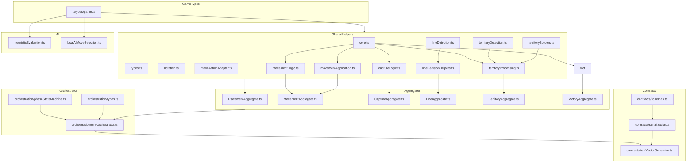

# Module Responsibilities: `src/shared/engine/`

This document catalogs the responsibilities of each module in the **canonical shared rules engine**. It is the working reference for how helpers, aggregates, the orchestrator, and contracts fit together.

> **SSoT alignment:** This module catalog is a derived view over the following canonical sources:
>
> - **Rules semantics SSoT:** The canonical rules documents (`RULES_CANONICAL_SPEC.md` together with `ringrift_complete_rules.md` / `ringrift_compact_rules.md`) are the single source of truth for RingRift game semantics. The shared TypeScript rules engine under `src/shared/engine/**` (helpers → domain aggregates → turn orchestrator → contracts), v2 contract vectors and runners (`tests/fixtures/contract-vectors/v2/**`, `tests/contracts/contractVectorRunner.test.ts`, `ai-service/tests/contracts/test_contract_vectors.py`), and rules docs (`RULES_ENGINE_ARCHITECTURE.md`, `RULES_IMPLEMENTATION_MAPPING.md`, `docs/RULES_ENGINE_SURFACE_AUDIT.md`) describe and validate the primary executable implementation of that spec.
> - **Lifecycle/API SSoT:** `docs/CANONICAL_ENGINE_API.md` and shared types/schemas under `src/shared/types/**`, `src/shared/engine/orchestration/types.ts`, and `src/shared/validation/websocketSchemas.ts` for the executable Move/orchestrator/WebSocket lifecycle these modules support.
> - **Precedence:** If this document ever conflicts with those specs, engines, types, or contract vectors, **code + tests win**, and this document must be updated to match them.
>
> **Doc Status (2025-11-30): Active (with historical appendix)**
>
> - Names like `PlacementMutator`, `MovementMutator`, `CaptureMutator`, `LineMutator`, `TerritoryMutator`, `TurnMutator`, and their validator counterparts should be read as **semantic boundary labels** for the corresponding helper+aggregate clusters in the canonical shared TS engine, not as always-implying one TS file per name. Some still exist as TS modules (e.g. `mutators/PlacementMutator.ts`, `mutators/MovementMutator.ts`, `mutators/CaptureMutator.ts`), others (including historical `TerritoryMutator` / `TurnMutator`) are now fully absorbed into aggregates and helpers.
> - Python modules with the same names (e.g. `ai-service/app/rules/mutators/territory.py`) are **adapters** that mirror these semantics for the AI service; they are validated via contract vectors and parity tests rather than being independent rules SSoTs.

> - The **implemented, canonical rules surface** is:
>   - Shared helpers under `src/shared/engine/*.ts` (geometry, reachability, detection, decision helpers, victory, AI heuristics).
>   - Domain aggregates under `src/shared/engine/aggregates/*.ts` (Placement, Movement, Capture, Line, Territory, Victory).
>   - The canonical turn orchestrator and phase state machine under `src/shared/engine/orchestration/*`.
>   - Cross-language contracts under `src/shared/engine/contracts/*` plus JSON fixtures under `tests/fixtures/contract-vectors/v2/`.
> - Older design language in terms of a **monolithic shared `GameEngine.ts` orchestrating `validators/*` + `mutators/*`** is now **historical**. Those modules still exist as transitional plumbing and compatibility shims, but new work should target **helpers + aggregates + orchestrator + contracts**.
> - For the architectural overview and rollout, see:
>   - `RULES_ENGINE_ARCHITECTURE.md`
>   - `docs/DOMAIN_AGGREGATE_DESIGN.md`
>   - `docs/CANONICAL_ENGINE_API.md`
>   - `AI_ARCHITECTURE.md`

The rest of this document is organized in two layers:

1. **Current architecture (canonical)** – helpers, aggregates, orchestrator, and contracts as implemented today.
2. **Historical appendix** – the original validators/mutators/monolithic-engine layout, retained as a design-time reference but no longer the primary mental model.

---

## 1. Current Canonical Layout

### 1.1 High-level groups

The `src/shared/engine/` directory contains the following **active module groups**:

- **Shared helpers (pure logic)**
  - `core.ts` – geometry, distances, capture reachability, marker-path effects, state hashing.
  - `movementLogic.ts`, `movementApplication.ts` – movement enumeration and application helpers.
  - `captureLogic.ts` – capture enumeration helpers.
  - `lineDetection.ts`, `lineDecisionHelpers.ts` – line geometry and line decision moves.
  - `territoryDetection.ts`, `territoryBorders.ts`, `territoryProcessing.ts`, `territoryDecisionHelpers.ts` – territory detection, borders, processing, and decision moves.
  - `placementHelpers.ts` – placement helpers used by placement aggregate and hosts.
  - `notation.ts`, `moveActionAdapter.ts` – debugging/notation and Move↔GameAction adapters.
  - `types.ts` – engine-internal types and interfaces.

- **Domain aggregates (façades over helpers)**
  - `aggregates/PlacementAggregate.ts`
  - `aggregates/MovementAggregate.ts`
  - `aggregates/CaptureAggregate.ts`
  - `aggregates/LineAggregate.ts`
  - `aggregates/TerritoryAggregate.ts`
  - `aggregates/VictoryAggregate.ts`

  These files provide domain-focused façades that coordinate the underlying helpers for each vertical (Placement, Movement, Capture, Line, Territory, Victory). They are what the **turn orchestrator** calls.

- **Turn orchestration (canonical entry point)**
  - `orchestration/turnOrchestrator.ts` – `processTurn` / `processTurnAsync` and phase-level processing.
  - `orchestration/phaseStateMachine.ts` – phase transition logic.
  - `orchestration/types.ts` – `ProcessTurnResult`, `PendingDecision`, `DecisionType`, `VictoryState`, etc.
  - `orchestration/index.ts` – orchestration barrel.

- **Contracts (TS↔Python parity and vectors)**
  - `contracts/schemas.ts` – contract-vector schemas.
  - `contracts/serialization.ts` – deterministic serialization of `GameState`, `Move`, `TurnResult`.
  - `contracts/testVectorGenerator.ts` – helpers for creating new contract-vector suites.
  - `contracts/index.ts` – contracts barrel.

- **AI / evaluation helpers**
  - `heuristicEvaluation.ts` – heuristic evaluation and weight profiles.
  - `localAIMoveSelection.ts` – local/fallback AI move selection policy.

- **Legacy / transitional orchestration & plumbing** (still in use, but not the canonical mental model)
  - `GameEngine.ts`, `turnLogic.ts`, `turnLifecycle.ts`, `turnDelegateHelpers.ts`, `initialState.ts` – older orchestration surface originally designed around validators/mutators; now layered under or alongside the canonical orchestrator in host adapters.
  - `validators/*.ts`, `mutators/*.ts`, `mutators/TurnMutator.ts`, `validators/utils.ts`, `validators/index.ts` – per-domain validators/mutators.
    - **Placement** validator/mutator remain the main typed entry points for low-level placement.
    - Other validators/mutators now primarily serve as implementation details behind aggregates and host-specific adaptation.

---

## 2. Module Catalog (Canonical View)

This section focuses on **helpers + aggregates + orchestrator + contracts**. Legacy validators/mutators and the monolithic shared `GameEngine.ts` are documented separately in the historical appendix.

### 2.1 Shared Core & Infrastructure

#### [`core.ts`](../src/shared/engine/core.ts)

- **Primary Responsibility:** Geometry, reachability, marker effects, and invariant bookkeeping used across all domains.
- **Key Concerns:**
  - Board geometry and distances for each board type.
  - Capture-segment validation and movement/capture reachability (`hasAnyLegalMoveOrCaptureFromOnBoard`).
  - Marker-path application (`applyMarkerEffectsAlongPathOnBoard`).
  - State summarization and hashing (`hashGameState`, `computeProgressSnapshot`).
- **Dependencies:** `../types/game` (canonical game types).
- **Dependents:** Movement, Capture, Territory, Victory helpers; aggregates; hosts; tests.
- **Concern Type:** `HELPER` (geometry + invariants).

#### [`types.ts`](../src/shared/engine/types.ts)

- **Primary Responsibility:** Engine-specific internal types used across helpers, aggregates, and orchestration.
- **Examples:** Internal validation/result types, helper interfaces for board views, and engine-specific action/event shapes that are not part of the public `src/shared/types/game.ts` API.
- **Dependents:** Many helpers, aggregates, legacy validators/mutators.
- **Concern Type:** `HELPER` (type definitions).

#### [`index.ts`](../src/shared/engine/index.ts)

- **Primary Responsibility:** Barrel file that exposes the **canonical shared-engine API** to hosts (backend `GameEngine.ts`, sandbox `ClientSandboxEngine.ts`, Python parity tooling, tests).
- **Notes:**
  - Re-exports orchestrator entry points, domain aggregates, and key helpers.
  - Older exports from validators/mutators/monolithic GameEngine are maintained where needed for backward compatibility, but new callers should prefer the orchestrator surface (`processTurn` / `processTurnAsync`).
- **Concern Type:** `ORCHESTRATION` (API surface).

#### [`notation.ts`](../src/shared/engine/notation.ts)

- **Primary Responsibility:** Human-readable formatting for positions and moves for debugging, logs, and tests.
- **Concern Type:** `HELPER`.

#### [`moveActionAdapter.ts`](../src/shared/engine/moveActionAdapter.ts)

- **Primary Responsibility:** Conversion helpers between canonical `Move` structures (`src/shared/types/game.ts`) and legacy `GameAction`/validator-style action types.
- **Use Cases:**
  - Bridging between older test harnesses and new Move-centric orchestrator.
  - Debugging tools that still work in terms of `GameAction`.
- **Concern Type:** `HELPER` (adapter).

#### [`initialState.ts`](../src/shared/engine/initialState.ts)

- **Primary Responsibility:** Factory for pristine `GameState` instances with correct zobrist seeds, per-player ring counts, and board configuration.
- **Dependents:** Host engines and tests that need fresh game states.
- **Concern Type:** `MUTATION` (state initialization only).

#### [`rulesConfig.ts`](../src/shared/engine/rulesConfig.ts)

- **Primary Responsibility:** Board-type and player-count specific rules configuration helpers.
- **Key Concerns:**
  - `getEffectiveLineLengthThreshold` – computes the effective line length for collapse/rewards based on board type and player count (e.g., 4-in-a-row for square8 2-player games, 3 for 3p/4p).
- **Dependents:** Line detection, line processing, tests.
- **Concern Type:** `HELPER` (configuration).

#### [`globalActions.ts`](../src/shared/engine/globalActions.ts)

- **Primary Responsibility:** Global legal action surface enumeration for invariants and termination checking.
- **Key Concerns:**
  - `GlobalLegalActionsSummary` – summary of legal actions for a player (placement, movement, forced elimination).
  - `hasTurnMaterial` – checks if player has controlled stacks or rings in hand (RR-CANON-R201).
  - `hasGlobalPlacementAction` – checks if any legal ring placement exists.
  - `hasPhaseLocalInteractiveMove` – checks if any interactive move is legal in the current phase.
  - `hasForcedEliminationAction` – checks if forced elimination preconditions hold.
- **Dependents:** Invariant tests, termination detection, ANM (active-no-moves) handling.
- **Concern Type:** `QUERY` (action enumeration).

---

### 2.2 Placement Domain

#### [`placementHelpers.ts`](../src/shared/engine/placementHelpers.ts)

- **Primary Responsibility:** Low-level helpers for applying placements and checking skip-placement eligibility.
- **Notes:**
  - Implements core semantics for `place_ring` and `skip_placement` used by the placement aggregate and host engines.
  - Enforces no-dead-placement semantics in collaboration with `core.hasAnyLegalMoveOrCaptureFromOnBoard`.
- **Concern Type:** `MUTATION` + `QUERY`.

#### [`validators/PlacementValidator.ts`](../src/shared/engine/validators/PlacementValidator.ts)

#### [`mutators/PlacementMutator.ts`](../src/shared/engine/mutators/PlacementMutator.ts)

- **Role in canonical architecture:**
  - Still used directly by some hosts/tests for placement validation and mutation.
  - Placement semantics are also surfaced through `PlacementAggregate` and the orchestrator.
  - These modules can be viewed as the **low-level implementation layer** for Placement.

(See the historical appendix for full validator/mutator breakdown.)

#### [`aggregates/PlacementAggregate.ts`](../src/shared/engine/aggregates/PlacementAggregate.ts)

- **Primary Responsibility:** Domain façade for all placement-related operations.
- **Typical Responsibilities:**
  - Validate and apply `place_ring` and `skip_placement` moves against `GameState`.
  - Enumerate legal placement moves (subject to ring caps and no-dead-placement rules).
  - Delegate per-stack reachability checks to `core.hasAnyLegalMoveOrCaptureFromOnBoard`.
- **Dependents:** Turn orchestrator, tests, host adapters.
- **Concern Type:** `AGGREGATE` (validation + query + mutation for placement).

---

### 2.3 Movement & Capture Domains

#### [`movementLogic.ts`](../src/shared/engine/movementLogic.ts)

- **Primary Responsibility:** Enumerate simple (non-capturing) movement options for stacks.
- **Key Concerns:**
  - Ray-based movement over board geometry.
  - Stack-height and board-type specific distance rules.
- **Concern Type:** `QUERY` (move enumeration).

#### [`movementApplication.ts`](../src/shared/engine/movementApplication.ts)

- **Primary Responsibility:** Apply non-capturing movement (and associated marker-path effects) to `GameState` / `BoardState`.
- **Concern Type:** `MUTATION`.

#### [`captureLogic.ts`](../src/shared/engine/captureLogic.ts)

- **Primary Responsibility:** Enumerate overtaking capture moves from a given position.
- **Concern Type:** `QUERY` (capture-move enumeration).

#### [`aggregates/MovementAggregate.ts`](../src/shared/engine/aggregates/MovementAggregate.ts)

- **Primary Responsibility:** Aggregate all non-capturing movement logic for the orchestrator.
- **Typical Responsibilities:**
  - Validate and apply `move_stack` moves.
  - Enumerate legal simple moves for a player.
  - Coordinate `movementLogic`, `movementApplication`, and core marker-path effects.
- **Concern Type:** `AGGREGATE`.

#### [`aggregates/CaptureAggregate.ts`](../src/shared/engine/aggregates/CaptureAggregate.ts)

- **Primary Responsibility:** Aggregate capture and chain-capture semantics.
- **Typical Responsibilities:**
  - Enumerate legal capture options from a stack.
  - Validate and apply overtaking capture segments.
  - Manage chain-capture continuation, including `must_continue` semantics.
- **Concern Type:** `AGGREGATE`.

> **Note:** Legacy `validators/MovementValidator.ts`, `validators/CaptureValidator.ts`, `mutators/MovementMutator.ts`, and `mutators/CaptureMutator.ts` remain in the tree, but the canonical semantics are exposed via the two aggregates and the orchestrator.

---

### 2.4 Line Domain

#### [`lineDetection.ts`](../src/shared/engine/lineDetection.ts)

- **Primary Responsibility:** Detect lines of markers on the board for all players and board types.
- **Concern Type:** `DETECTION`.

#### [`lineDecisionHelpers.ts`](../src/shared/engine/lineDecisionHelpers.ts)

- **Primary Responsibility:** Canonical enumeration and application of line-related decision moves.
- **Key Concerns:**
  - Enumerate `process_line` moves from the current board.
  - Enumerate `choose_line_option` options when a collapse grants a reward (legacy alias: `choose_line_reward`).
  - Apply those decisions to `GameState` including marker collapse, ring elimination, and pending reward elimination flags.
- **Concern Type:** `QUERY` + `MUTATION`.

#### [`aggregates/LineAggregate.ts`](../src/shared/engine/aggregates/LineAggregate.ts)

- **Primary Responsibility:** Domain façade for the line subsystem.
- **Typical Responsibilities:**
  - Provide orchestrator-ready functions for `process_line` and `choose_line_option` decision phases (legacy alias: `choose_line_reward`).
  - Coordinate detection and decision/helpers to maintain consistent line semantics across hosts.
- **Concern Type:** `AGGREGATE`.

---

### 2.5 Territory Domain

#### [`territoryDetection.ts`](../src/shared/engine/territoryDetection.ts)

- **Primary Responsibility:** Canonical detection of disconnected territory regions for all geometries.
- **Concern Type:** `DETECTION`.

#### [`territoryBorders.ts`](../src/shared/engine/territoryBorders.ts)

- **Primary Responsibility:** Identify border markers adjacent to Territory regions and support the Q23 prerequisite.
- **Concern Type:** `QUERY`.

#### [`territoryProcessing.ts`](../src/shared/engine/territoryProcessing.ts)

- **Primary Responsibility:** Territory region processability, collapse, and elimination pipeline.
- **Key Concerns:**
  - Q23 self-elimination prerequisite.
  - Board-level collapse + elimination bookkeeping consistent with S‑invariant and exclusivity rules.
- **Concern Type:** `QUERY` + `MUTATION`.

#### [`territoryDecisionHelpers.ts`](../src/shared/engine/territoryDecisionHelpers.ts)

- **Primary Responsibility:** Enumerate and apply Territory decision moves.
- **Key Concerns:**
  - `choose_territory_option` decision enumeration and application (legacy alias: `process_territory_region`).
  - `eliminate_rings_from_stack` decision enumeration and application.
  - Shared implementation for backend and sandbox hosts.
- **Concern Type:** `QUERY` + `MUTATION`.

#### [`aggregates/TerritoryAggregate.ts`](../src/shared/engine/aggregates/TerritoryAggregate.ts)

- **Primary Responsibility:** Cohesive façade for Territory detection, Q23 eligibility, processing, and elimination.
- **Typical Responsibilities:**
  - Provide orchestrator-ready APIs to discover and process Territory regions.
  - Keep Territory invariants (region gating, exclusivity, S‑invariant) encoded in one place.
- **Concern Type:** `AGGREGATE`.

---

### 2.6 Victory Domain

#### [`aggregates/VictoryAggregate.ts`](../src/shared/engine/aggregates/VictoryAggregate.ts)

- **Primary Responsibility:** Canonical victory evaluation and last-actor tiebreaking.
- **Key Concerns:**
  - Ring elimination victory.
  - Territory-majority victory.
  - Last-player-standing (LPS) ladder.
  - Stalemate/non-progress detection.
  - Early LPS detection (total ring counting).
- **Key Exports:**
  - `evaluateVictory()` - Main victory evaluation function.
  - `getLastActor()` - Tie-break helper for last player to act.
  - `VictoryResult`, `VictoryReason` - Victory types.
- **Concern Type:** `AGGREGATE`.

> **Note (Dec 2025):** `victoryLogic.ts` was removed. All victory logic is now consolidated in `VictoryAggregate.ts`.

---

### 2.7 Turn Orchestration (Canonical)

#### [`turnLogic.ts`](../src/shared/engine/turnLogic.ts)

- **Primary Responsibility:** Shared phase/turn state machine used historically by host engines and still referenced by orchestrator-related code.
- **Concern Type:** `ORCHESTRATION`.

#### [`turnDelegateHelpers.ts`](../src/shared/engine/turnDelegateHelpers.ts)

- **Primary Responsibility:** Default delegates/helpers for turn-logic operations (e.g., checking if any placements or moves exist for a player).
- **Concern Type:** `ORCHESTRATION` + `QUERY`.

#### [`turnLifecycle.ts`](../src/shared/engine/turnLifecycle.ts)

- **Primary Responsibility:** Higher-level helpers for moving between phases/turn boundaries.
- **Concern Type:** `ORCHESTRATION`.

#### [`orchestration/types.ts`](../src/shared/engine/orchestration/types.ts)

- **Primary Responsibility:** Types used by the orchestrator and its adapters.
- **Key Types:** `ProcessTurnResult`, `PendingDecision`, `DecisionType`, `VictoryState`, and related orchestration results.
- **Concern Type:** `HELPER` (type definitions).

#### [`orchestration/phaseStateMachine.ts`](../src/shared/engine/orchestration/phaseStateMachine.ts)

- **Primary Responsibility:** Canonical phase transition logic for the orchestrator.
- **Concern Type:** `ORCHESTRATION`.

#### [`orchestration/turnOrchestrator.ts`](../src/shared/engine/orchestration/turnOrchestrator.ts)

- **Primary Responsibility:** **Single canonical entry point** for rules application.
- **Key Responsibilities:**
  - `processTurn` / `processTurnAsync` – drive a full turn, including all decision phases.
  - Invoke domain aggregates in deterministic order: Placement → Movement → Capture → Line → Territory → Victory.
  - Emit `PendingDecision` values (with Move options) that host adapters convert to `PlayerChoice` structures.
- **Dependents:** `TurnEngineAdapter` (backend), `SandboxOrchestratorAdapter` (sandbox), contract test vector generation, trace parity tests.
- **Concern Type:** `ORCHESTRATION`.

#### [`orchestration/index.ts`](../src/shared/engine/orchestration/index.ts)

- **Primary Responsibility:** Orchestration barrel.

> For details on how `PendingDecision` → `PlayerChoice` → WebSocket → Move flows are wired, see `CANONICAL_ENGINE_API.md`, `AI_ARCHITECTURE.md`, and the websocket types/schemas in `src/shared/types/websocket.ts` and `src/shared/validation/websocketSchemas.ts`.

---

### 2.8 Contracts & Cross-language Parity

#### [`contracts/schemas.ts`](../src/shared/engine/contracts/schemas.ts)

- **Primary Responsibility:** Type-level schemas for contract vectors shared between TS and Python.
- **Concern Type:** `HELPER` (type definitions).

#### [`contracts/serialization.ts`](../src/shared/engine/contracts/serialization.ts)

- **Primary Responsibility:** Deterministic JSON serialization/deserialization for game state, moves, and turn results.
- **Concern Type:** `HELPER`.

#### [`contracts/testVectorGenerator.ts`](../src/shared/engine/contracts/testVectorGenerator.ts)

- **Primary Responsibility:** Utilities for generating new contract-vector suites, typically by driving the orchestrator through interesting scenarios.
- **Dependents:** `tests/contracts/contractVectorRunner.test.ts`, Python contract tests, vector-generation scripts.
- **Concern Type:** `HELPER`.

#### [`contracts/index.ts`](../src/shared/engine/contracts/index.ts)

- **Primary Responsibility:** Contracts barrel.

---

### 2.9 AI / Evaluation Helpers

#### [`heuristicEvaluation.ts`](../src/shared/engine/heuristicEvaluation.ts)

- **Primary Responsibility:** Heuristic evaluation and feature extraction for AI.
- **Concern Type:** `QUERY`.

#### [`localAIMoveSelection.ts`](../src/shared/engine/localAIMoveSelection.ts)

- **Primary Responsibility:** Local/fallback AI move-choice policy used by backend AI and sandbox AI when the Python service is unavailable or for quick heuristics.
- **Concern Type:** `QUERY`.

---

### 2.10 Host Adapters (Backend & Sandbox)

These adapters connect the shared orchestrator to the backend and sandbox host environments. They are at **100% rollout** as of November 2025.

#### [`src/server/game/turn/TurnEngineAdapter.ts`](../src/server/game/turn/TurnEngineAdapter.ts)

- **Primary Responsibility:** Backend adapter that wraps the canonical turn orchestrator for the `GameEngine` / `GameSession` environment.
- **Key Concerns:**
  - Converts `PendingDecision` from the orchestrator into `PlayerChoice` structures for WebSocket delivery.
  - Manages session-level state and WebSocket interaction concerns.
  - Calls `processTurn` / `processTurnAsync` from the orchestrator.
  - Integrates with `MetricsService` for orchestrator session tracking.
- **Dependents:** `GameEngine.ts`, `GameSession.ts`, `TurnEngine.ts`.
- **Concern Type:** `ORCHESTRATION` (host adapter).

#### [`src/client/sandbox/SandboxOrchestratorAdapter.ts`](../src/client/sandbox/SandboxOrchestratorAdapter.ts)

- **Primary Responsibility:** Client sandbox adapter that wraps the canonical turn orchestrator for local `ClientSandboxEngine` simulation.
- **Key Concerns:**
  - Converts `PendingDecision` from the orchestrator into sandbox-compatible decision structures.
  - Manages local sandbox state and AI interaction concerns.
  - Calls `processTurn` / `processTurnAsync` from the orchestrator.
  - Integrates with sandbox AI for automated move selection.
- **Dependents:** `ClientSandboxEngine.ts`, sandbox helpers.
- **Concern Type:** `ORCHESTRATION` (host adapter).

> **Rollout Status:** Both adapters are at 100% rollout across all environments (dev, staging, CI, production). The orchestrator is the canonical turn-processing path.

---

## 3. Concern Type Summary (Canonical View)

| Concern Type      | Representative Modules                                                                                                                                                                                                     |
| ----------------- | -------------------------------------------------------------------------------------------------------------------------------------------------------------------------------------------------------------------------- |
| **HELPER**        | `core.ts`, `types.ts`, `notation.ts`, `moveActionAdapter.ts`, `rulesConfig.ts`, `territoryBorders.ts`, `territoryProcessing.ts` (query side), `contracts/*`, `orchestration/types.ts`                                      |
| **DETECTION**     | `lineDetection.ts`, `territoryDetection.ts`                                                                                                                                                                                |
| **QUERY**         | `movementLogic.ts`, `captureLogic.ts`, `globalActions.ts`, `territoryDecisionHelpers.ts` (enumeration side), `lineDecisionHelpers.ts` (enumeration side), `heuristicEvaluation.ts`, `localAIMoveSelection.ts`              |
| **MUTATION**      | `movementApplication.ts`, `territoryProcessing.ts` (apply side), `territoryDecisionHelpers.ts` (apply side), `lineDecisionHelpers.ts` (apply side), `placementHelpers.ts`, `initialState.ts`                               |
| **AGGREGATE**     | `PlacementAggregate.ts`, `MovementAggregate.ts`, `CaptureAggregate.ts`, `LineAggregate.ts`, `TerritoryAggregate.ts`, `VictoryAggregate.ts`                                                                                 |
| **ORCHESTRATION** | `turnLogic.ts`, `turnDelegateHelpers.ts`, `turnLifecycle.ts`, `orchestration/phaseStateMachine.ts`, `orchestration/turnOrchestrator.ts`, `TurnEngineAdapter.ts`, `SandboxOrchestratorAdapter.ts`, `index.ts` (API surface) |

Legacy validators/mutators (`validators/*`, `mutators/*`, `mutators/TurnMutator.ts`) and the shared `GameEngine.ts` sit beneath this layer and are treated as **implementation plumbing** or compatibility shims.

---

## 4. Simplified Dependency Graph (Canonical)

This graph intentionally omits legacy validators/mutators and the shared `GameEngine.ts` for clarity; see the historical appendix if you need to trace those pathways.

---

## 5. Historical Appendix: Validators/Mutators & Monolithic `GameEngine.ts`

This section preserves the original **validators/mutators + monolithic `GameEngine.ts`** picture as a historical design reference. It is **not** the canonical mental model for new work, but it can be useful when reading older design docs or investigating legacy call sites.

### 5.1 Historical Layout Summary

Historically, the engine was described as:

- A central `GameEngine.ts` class under `src/shared/engine/` that:
  - Received `GameAction` values.
  - Routed them to `validators/*` for legality checks.
  - Routed them to `mutators/*` for state updates.
  - Managed phase and turn transitions (`turnLogic.ts`, `turnLifecycle.ts`, `turnDelegateHelpers.ts`, `mutators/TurnMutator.ts`).
- Domain-specific modules were grouped as:
  - **Placement:** `validators/PlacementValidator.ts`, `mutators/PlacementMutator.ts`, `placementHelpers.ts`.
  - **Movement:** `movementLogic.ts`, `validators/MovementValidator.ts`, `mutators/MovementMutator.ts`, `movementApplication.ts`.
  - **Capture:** `captureLogic.ts`, `captureChainHelpers.ts`, `validators/CaptureValidator.ts`, `mutators/CaptureMutator.ts`.
  - **Line:** `lineDetection.ts`, `lineDecisionHelpers.ts`, `validators/LineValidator.ts`, `mutators/LineMutator.ts`.
  - **Territory:** `territoryDetection.ts`, `territoryBorders.ts`, `territoryProcessing.ts`, `territoryDecisionHelpers.ts` (canonical helpers), plus legacy plumbing `validators/TerritoryValidator.ts` and `mutators/TerritoryMutator.ts` used as implementation details under `TerritoryAggregate`.
  - **Victory:** `aggregates/VictoryAggregate.ts`.
  - **Shared core & utilities:** `core.ts`, `types.ts`, `notation.ts`, `moveActionAdapter.ts`, `validators/utils.ts`, `validators/index.ts`.

Over time, this design was **refined** into the helpers + aggregates + orchestrator stack described in sections 1–4 above. The per-domain validators/mutators and the monolithic `GameEngine.ts` remain in the tree primarily as:

- Thin wrappers or compatibility layers for older tests and hosts.
- Historical artifacts referenced by older documentation (`docs/PYTHON_PARITY_REQUIREMENTS.md`, early parity plans, and some archived architecture docs).

When a historical document refers to, for example, `MovementValidator` or `TerritoryMutator` as if they were the primary domain boundaries, you should now interpret those names as **semantic anchors** for the Movement and Territory **aggregates** and helper clusters.

For a detailed description of how these historical groupings map onto the current aggregates, see `docs/DOMAIN_AGGREGATE_DESIGN.md`.

---

_Generated/updated November 2025 to align with helpers + aggregates + orchestrator + contracts as the canonical TS rules surface, while retaining historical context for validators/mutators and monolithic `GameEngine.ts`._
