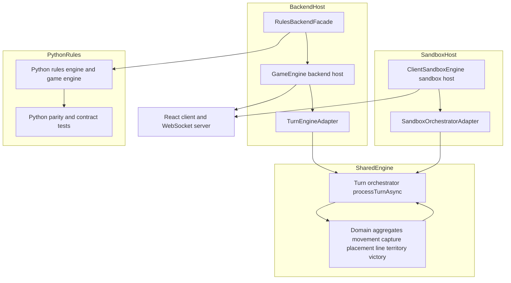
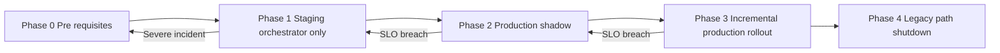

> **Doc Status (2025-11-30): Active (derived)**
> **Role:** Orchestrator-first rollout and legacy rules shutdown plan for Track A.
>
> **Rollout Status (2025-11-30):** **Phase 4 – Orchestrator Authoritative (100% rollout)**.
> All environments (dev, staging, CI) are configured with `ORCHESTRATOR_ADAPTER_ENABLED=true`
> and `ORCHESTRATOR_ROLLOUT_PERCENTAGE=100`. Soak tests show zero invariant violations
> across all board types. Production deployment follows same configuration.
>
> **SSoT alignment:** This document is a derived architectural and rollout plan over:
>
> - **Rules/invariants semantics SSoT:** `RULES_CANONICAL_SPEC.md`, `ringrift_complete_rules.md`, `ringrift_compact_rules.md`, and the shared TypeScript rules engine under `src/shared/engine/**` plus v2 contract vectors in `tests/fixtures/contract-vectors/v2/**`.
> - **Lifecycle/API SSoT:** `docs/CANONICAL_ENGINE_API.md` and shared TS/WebSocket types under `src/shared/types/game.ts`, `src/shared/engine/orchestration/types.ts`, `src/shared/types/websocket.ts`, and `src/shared/validation/websocketSchemas.ts`.
> - **TS↔Python parity & determinism SSoT:** `docs/PYTHON_PARITY_REQUIREMENTS.md` and the TS and Python parity/determinism test suites.
>
> **Precedence:** This plan is never the source of truth for rules behaviour or lifecycle semantics. On any conflict with executable code, tests, or canonical rules/lifecycle docs, **code + tests win** and this document must be updated.

# Orchestrator Rollout and Legacy Rules Shutdown Plan

## 1. Purpose and Scope

This document defines the orchestrator-first rollout strategy and legacy rules shutdown blueprint for Track A (tasks P16.6.\*, P16.7, P16.8). It assumes:

- Rules semantics are single-sourced in the shared TS engine under `src/shared/engine/**` (helpers → aggregates → turn orchestrator → contracts) as documented in `docs/SHARED_ENGINE_CONSOLIDATION_PLAN.md` and `docs/RULES_ENGINE_SURFACE_AUDIT.md`.
- The Python rules engine under `ai-service/app/rules/**` is a parity and contract mirror, not an independent SSOT.
- Orchestrator adapters exist for both backend and sandbox hosts and are wired into CI and runbooks as described in `CURRENT_STATE_ASSESSMENT.md`, `WEAKNESS_ASSESSMENT_REPORT.md`, and `docs/runbooks/ORCHESTRATOR_ROLLOUT_RUNBOOK.md`.

The goals of this plan are to:

1. Declare explicit SSOT and ownership boundaries for turn processing.
2. Inventory remaining legacy rules-related modules and paths.
3. Define a small number of concrete shutdown phases.
4. Specify gating tests, metrics, and rollback levers per phase.
5. Provide a concise overview consumable by Track A implementation tasks (P16.6.\*, P16.7, P16.8).

### 1.1 Orchestrator flags and incident posture

At runtime, orchestrator selection and rollout are controlled by a small set of
environment flags:

- `ORCHESTRATOR_ADAPTER_ENABLED` – master switch to enable/disable orchestrator adapters for new sessions.
- `ORCHESTRATOR_ROLLOUT_PERCENTAGE` – percentage of eligible sessions that should use orchestrator; used for gradual rollout where supported.
- `ORCHESTRATOR_SHADOW_MODE_ENABLED` – toggles shadow runs where the orchestrator computes moves in parallel with legacy paths for comparison.
- `RINGRIFT_RULES_MODE` – high‑level rules mode selector (allowed values: `ts`, `python`, `shadow` as per `src/server/config/env.ts`), used by hosts and diagnostics jobs to determine which rules engine implementation is authoritative.

**During incidents:**

- Treat these flags as **rules‑engine levers**, not general‑purpose mitigations:
  - If symptoms are clearly AI‑only (remote AI service down/slow/erroring) or infra‑related (timeouts, WebSocket saturation, host overload), leave orchestrator flags in the **orchestrator‑ON** posture and follow the AI and infra runbooks:
    - `docs/runbooks/AI_ERRORS.md`
    - `docs/runbooks/AI_PERFORMANCE.md`
    - `docs/runbooks/AI_FALLBACK.md`
    - `docs/runbooks/AI_SERVICE_DOWN.md`
    - `docs/runbooks/HIGH_LATENCY.md`, `docs/runbooks/SERVICE_DEGRADATION.md`
  - Only adjust `ORCHESTRATOR_ADAPTER_ENABLED` / `ORCHESTRATOR_ROLLOUT_PERCENTAGE` / `RINGRIFT_RULES_MODE` when there is strong evidence of a **rules‑engine or orchestrator defect** (e.g. canonical contract tests failing, `.shared` suites red, or explicit violation of `RULES_CANONICAL_SPEC.md`), and then follow the Safe rollback flow in this document.
- See `AI_ARCHITECTURE.md` §0 (AI Incident Overview) for a quick “rules vs AI vs infra” classification, and use that to choose between **this plan** (rules/orchestrator rollback) and the AI/infra runbooks above.

## 2. Canonical SSOT and Ownership Boundaries

### 2.1 Turn-processing entrypoints

For host-driven turn processing and rules-surface queries, the canonical orchestrator APIs into the shared TS rules engine are:

- `processTurnAsync(state, move, delegates)` in [`turnOrchestrator.ts`](../src/shared/engine/orchestration/turnOrchestrator.ts:1) – **canonical host-facing entrypoint** for applying moves.
- `processTurn(state, move)` in [`turnOrchestrator.ts`](../src/shared/engine/orchestration/turnOrchestrator.ts:1) – synchronous helper used where decisions can be resolved inline.
- `validateMove(state, move)`, `getValidMoves(state)`, and `hasValidMoves(state)` in [`turnOrchestrator.ts`](../src/shared/engine/orchestration/turnOrchestrator.ts:1) – canonical validation and enumeration helpers for hosts and diagnostics harnesses.

All host stacks (backend `GameEngine`, client sandbox `ClientSandboxEngine`, diagnostics harnesses) **must** treat `processTurnAsync` and these helpers as the lifecycle and rules-surface SSOT for turn processing. Legacy turn loops in `GameEngine` and `ClientSandboxEngine` are treated as migration scaffolding to be removed or demoted by this plan.

### 2.2 Domain aggregates as rules semantics SSOT

The following domain aggregates under `src/shared/engine/aggregates/**` are the **single source of truth for rules semantics** in their respective domains:

- [`MovementAggregate`](../src/shared/engine/aggregates/MovementAggregate.ts:1) – non-capturing movement validation, enumeration, and mutation.
- [`CaptureAggregate`](../src/shared/engine/aggregates/CaptureAggregate.ts:1) – capture and chain-capture validation, enumeration, mutation, and continuation logic.
- [`PlacementAggregate`](../src/shared/engine/aggregates/PlacementAggregate.ts:1) – placement and no-dead-placement validation, enumeration, and mutation.
- [`LineAggregate`](../src/shared/engine/aggregates/LineAggregate.ts:1) – line detection and decision moves via `enumerateProcessLineMoves` and `applyProcessLineDecision`.
- [`TerritoryAggregate`](../src/shared/engine/aggregates/TerritoryAggregate.ts:1) – disconnected-region detection, Q23 gating, territory collapse, and elimination decisions.
- [`VictoryAggregate`](../src/shared/engine/aggregates/VictoryAggregate.ts:1) – victory evaluation and tie-breaking, surfaced via `evaluateVictory`.

All hosts and helpers (backend, sandbox, Python mirror, diagnostics scripts) **must** treat these aggregates and their helper modules (`movementLogic.ts`, `captureLogic.ts`, `lineDecisionHelpers.ts`, `territoryDecisionHelpers.ts`, `victoryLogic.ts`, etc.) as the **only authoritative implementation of movement, capture, placement, line, territory, and victory semantics**.

### 2.3 Host adapters and hosts

The orchestrator integration layers are:

- Backend adapter: [`TurnEngineAdapter`](../src/server/game/turn/TurnEngineAdapter.ts:1).
- Sandbox adapter: [`SandboxOrchestratorAdapter`](../src/client/sandbox/SandboxOrchestratorAdapter.ts:1).

These adapters:

- Own all calls from hosts into `processTurnAsync` / `processTurn`.
- Bridge host-specific concerns (state mutability, timers, WebSocket notifications, AI interaction, diagnostics) with the pure shared engine.
- Provide validation/enumeration shims (`validateMove`, `getValidMoves`) that directly delegate to the orchestrator.

**Exclusive integration rule**

For orchestrator-driven turn processing, **all** production and sandbox hosts **must** integrate with the shared rules engine **only via**:

- `TurnEngineAdapter` on the backend.
- `SandboxOrchestratorAdapter` in the sandbox.

Direct calls from hosts into aggregate helpers are allowed for:

- Pure read-side diagnostics and tooling (e.g. board visualisations, offline analysis).
- Test harnesses that deliberately exercise the core engine.

They are **not** allowed as alternative production turn-processing pipelines once this plan is complete.

### 2.4 Host stacks and Python mirror

- Backend host stack:
  - `GameEngine` in [`GameEngine.ts`](../src/server/game/GameEngine.ts:1) – stateful backend host responsible for timers, WebSocket integration, rating updates, and structured history. It currently has:
    - An orchestrator path via `processMoveViaAdapter` + `TurnEngineAdapter`.
    - A legacy path via `makeMove` and internal phase loops that apply moves via shared aggregates and helpers.
  - `RuleEngine` in [`RuleEngine.ts`](../src/server/game/RuleEngine.ts:1) – rules-facing validation and enumeration surface used by `GameEngine` and `TurnEngine`. It delegates to shared helpers and aggregates but still exposes an older `processMove` pipeline.
  - `TurnEngine` in [`turn/TurnEngine.ts`](../src/server/game/turn/TurnEngine.ts:1) – shared backend turn/phase lifecycle for the backend path, already aligned with shared `turnLogic`.

- Sandbox host stack:
  - `ClientSandboxEngine` in [`ClientSandboxEngine.ts`](../src/client/sandbox/ClientSandboxEngine.ts:1) – client-local host for `/sandbox`, with:
    - An orchestrator path via `processMoveViaAdapter` + `SandboxOrchestratorAdapter`.
    - A legacy sandbox pipeline composed out of shared aggregates and sandbox helpers (movement, capture, lines, territory, forced elimination, LPS, and victory).
  - Sandbox helpers under `src/client/sandbox/**` (movement, captures, territory, lines, victory, AI, game-end) – now predominantly UX/diagnostics wrappers over shared aggregates.

- Python rules/AI mirror:
  - `GameEngine` in [`ai-service/app/game_engine.py`](../ai-service/app/game_engine.py:1) and rule modules under `ai-service/app/rules/**` implement a parity-checked Python port of the TS rules engine.
  - Parity and contract tests under `ai-service/tests/**` and `tests/parity/**` validate that Python behaviour matches the TS SSOT.
  - Python code is **not** a semantics SSOT; any divergence must be fixed by updating Python to match the TS shared engine and contracts.

## 3. Architecture Overview



Key properties:

- The **SharedEngine** subgraph (orchestrator + aggregates + helpers) is the **rules semantics SSOT**.
- `TurnEngineAdapter` and `SandboxOrchestratorAdapter` are the **only sanctioned host integration layers** into `processTurnAsync`.
- Backend and sandbox hosts are responsible only for state ownership, player interaction, transport, and diagnostics.
- Python rules/AI remain a validated mirror and do not own semantics.

## 4. Legacy Rules Surfaces Inventory

This section enumerates remaining TS backend and sandbox modules that either:

- Implement or previously implemented movement, capture, placement, line, territory, or victory semantics **outside** the orchestrator+aggregates stack; or
- Provide post-processing over older `RuleEngine` / `GameEngine` / sandbox semantics that are now redundant.

### 4.1 Backend host and rules modules

**Table 1 – Backend rules-related modules and paths**

| File                                                | Current role                                                                                                                                                                                                                                                       | Rules Semantics? (Y/N)                                                                                                  | Remove?                                                                                                                                                                   | Diagnostics-only?                                                              | Target phase                                                                            |
| --------------------------------------------------- | ------------------------------------------------------------------------------------------------------------------------------------------------------------------------------------------------------------------------------------------------------------------ | ----------------------------------------------------------------------------------------------------------------------- | ------------------------------------------------------------------------------------------------------------------------------------------------------------------------- | ------------------------------------------------------------------------------ | --------------------------------------------------------------------------------------- |
| `src/server/game/GameEngine.ts`                     | Stateful backend host; currently has dual path: legacy `makeMove` turn pipeline and orchestrator-based `processMoveViaAdapter` using `TurnEngineAdapter`. Contains chain-capture state, line and territory decision helpers, forced elimination, and LPS tracking. | Y – host-level orchestration semantics layered over aggregates and `TurnEngine`.                                        | Partial – keep GameEngine as backend host but **remove the legacy non-adapter pipeline** and require `TurnEngineAdapter` for all production moves.                        | No – remains primary backend host.                                             | Phase A (enforce adapter) and Phase C (delete dead helpers once adapter-only)           |
| `src/server/game/RuleEngine.ts`                     | Stateless rules facade for validation and enumeration. Delegates to shared aggregates and helpers but still exposes legacy `processMove`, `processLineFormation`, and `processTerritoryDisconnection` flows.                                                       | Y – contains historical orchestration and some pre-aggregate helpers, though main semantics now delegate to aggregates. | Partial – retain validation/enumeration entrypoints, but **delete or quarantine legacy `processMove` and post-processing helpers** once orchestrator-only path is stable. | Yes for legacy helpers – legacy helpers become diagnostics-only until removal. | Phase A (no production calls to `processMove`), Phase C (delete or move to diagnostics) |
| `src/server/game/turn/TurnEngine.ts`                | Shared backend turn lifecycle built on `turnLogic` and shared aggregates. Used by `GameEngine.advanceGame`.                                                                                                                                                        | N – lifecycle orchestration only (semantics live in shared engine).                                                     | No.                                                                                                                                                                       | No.                                                                            | N/A (already canonical host lifecycle)                                                  |
| `src/server/game/BoardManager.ts`                   | Backend board container and geometry bridge. Used by `GameEngine`, `RuleEngine`, and `TurnEngine`.                                                                                                                                                                 | N – uses shared core geometry and does not define independent rules.                                                    | No.                                                                                                                                                                       | No.                                                                            | N/A                                                                                     |
| `src/server/game/rules/lineProcessing.ts`           | Historical backend line-processing module referenced in earlier passes. Marked as removed in [`docs/RULES_ENGINE_SURFACE_AUDIT.md`](./RULES_ENGINE_SURFACE_AUDIT.md:105).                                                                                          | Y (historical)                                                                                                          | Already removed (no current code path).                                                                                                                                   | N/A                                                                            | Historical only                                                                         |
| `src/server/game/rules/territoryProcessing.ts`      | Historical backend territory-processing module. Marked as removed in [`docs/RULES_ENGINE_SURFACE_AUDIT.md`](./RULES_ENGINE_SURFACE_AUDIT.md:106).                                                                                                                  | Y (historical)                                                                                                          | Already removed.                                                                                                                                                          | N/A                                                                            | Historical only                                                                         |
| `src/server/game/rules/captureChainEngine.ts`       | Historical backend capture-chain state helper. Replaced by `CaptureAggregate` and `GameEngine` wiring.                                                                                                                                                             | Y (historical)                                                                                                          | Already removed.                                                                                                                                                          | N/A                                                                            | Historical only                                                                         |
| `src/server/game/RulesBackendFacade.ts`             | Backend rules/AI boundary; selects between TS and Python engines and coordinates shadow parity via `rulesParityMetrics`.                                                                                                                                           | N – engine selection and parity only.                                                                                   | No.                                                                                                                                                                       | No.                                                                            | N/A                                                                                     |
| `src/server/services/OrchestratorRolloutService.ts` | Backend service controlling orchestrator rollout percentage, shadow mode, allow/deny lists, and circuit breaker wiring, surfaced via `/api/admin/orchestrator/status` and Prometheus metrics.                                                                      | N – rollout control only.                                                                                               | No.                                                                                                                                                                       | No.                                                                            | N/A                                                                                     |

**Backend summary**

- The only substantive _legacy semantics_ remaining live in:
  - The non-adapter branch of `GameEngine.makeMove` and associated helpers (`applyMove`, `processLineFormations`, `processOneLine`, `processOneDisconnectedRegion`, legacy forced-elimination and LPS wiring).
  - Legacy orchestration helpers in `RuleEngine` that predate `CaptureAggregate`, `LineAggregate`, and `TerritoryAggregate`.

- All direct geometry and mutator logic now delegates to shared helpers and aggregates as recorded in `docs/SHARED_ENGINE_CONSOLIDATION_PLAN.md` and `docs/RULES_ENGINE_SURFACE_AUDIT.md`.

### 4.2 Sandbox host and helper modules

**Table 2 – Sandbox rules-related modules and paths**

| File                                               | Current role                                                                                                                                                                                                                                               | Rules Semantics? (Y/N)                                                                                       | Remove?                                                                                                                                                         | Diagnostics-only?                                                 | Target phase                                                                                  |
| -------------------------------------------------- | ---------------------------------------------------------------------------------------------------------------------------------------------------------------------------------------------------------------------------------------------------------- | ------------------------------------------------------------------------------------------------------------ | --------------------------------------------------------------------------------------------------------------------------------------------------------------- | ----------------------------------------------------------------- | --------------------------------------------------------------------------------------------- |
| `src/client/sandbox/ClientSandboxEngine.ts`        | Client-local sandbox host. Supports two paths: orchestrator-based via `SandboxOrchestratorAdapter` and legacy sandbox pipeline using shared aggregates plus sandbox helpers for movement, capture, lines, territory, forced elimination, LPS, and victory. | Y – host-level orchestration semantics layered over aggregates.                                              | Partial – retain as sandbox host but **remove or fence legacy pipeline** once orchestrator path is validated; orchestrator becomes the only sandbox rules path. | Legacy pipeline becomes diagnostics-only until removed.           | Phase B (orchestrator-only) and Phase C (remove dead helpers)                                 |
| `src/client/sandbox/SandboxOrchestratorAdapter.ts` | Sandbox adapter over `processTurn` / `processTurnAsync`; exposes `processMove`, `processMoveSync`, `previewMove`, `validateMove`, and `getValidMoves`.                                                                                                     | N – pure adapter over orchestrator.                                                                          | No.                                                                                                                                                             | No.                                                               | N/A (canonical adapter)                                                                       |
| `src/client/sandbox/sandboxMovement.ts`            | Sandbox movement helpers: simple movement landing enumeration and marker-path effects, now delegating to `MovementAggregate` and shared marker helpers. Used by `ClientSandboxEngine` and AI helpers.                                                      | N (semantics delegated to shared engine; acts as adapter and UX helper).                                     | No immediate removal; refactor to explicit UX/diagnostics namespace.                                                                                            | Yes – treated as UX/diagnostics-only helper, not a rules surface. | Phase B (ensure no direct semantics) and Phase C (namespace / banner update)                  |
| `src/client/sandbox/sandboxCaptures.ts`            | Sandbox capture helpers and board-level chain enumeration. Delegates to `CaptureAggregate` and shared helpers, with a retained mutable-board simulator for diagnostics (`applyCaptureSegmentOnBoard`).                                                     | N for live engine semantics (delegates to aggregate); Y for the mutable-board simulator used in diagnostics. | Keep as diagnostics-only; ensure live engine paths use `CaptureAggregate` exclusively.                                                                          | Yes – diagnostics-only (chain search, parity tooling).            | Phase B (engine paths fully adapter-based) and Phase C (diagnostics fencing and SSOT banners) |
| `src/client/sandbox/sandboxCaptureSearch.ts`       | Offline DFS search for maximal capture chains using shared capture enumeration plus sandbox-local mutation for analysis. Not used by live sandbox engine or backend.                                                                                       | Y (analysis semantics only; not a production rules path).                                                    | Keep; move under diagnostics namespace if desired.                                                                                                              | Yes – diagnostics-only.                                           | Phase C                                                                                       |
| `src/client/sandbox/sandboxTerritory.ts`           | Sandbox helpers for disconnected-region discovery and eligibility. Already delegates to shared `territoryDetection`, `territoryProcessing`, and `territoryDecisionHelpers` and is explicitly documented as thin adapter.                                   | N – adapter/visualisation on top of shared semantics.                                                        | Keep; ensure clearly marked as adapter-only.                                                                                                                    | Yes – UX/diagnostics-only.                                        | Phase B and C                                                                                 |
| `src/client/sandbox/sandboxLines.ts`               | Sandbox line-detection helpers; delegates to shared `lineDetection` and is documented as adapter-only.                                                                                                                                                     | N – adapter/visualisation only.                                                                              | Keep; ensure clearly marked as adapter-only.                                                                                                                    | Yes – UX/diagnostics-only.                                        | Phase B and C                                                                                 |
| `src/client/sandbox/sandboxVictory.ts`             | Sandbox wrapper around shared victory evaluation for local games.                                                                                                                                                                                          | N – adapter only.                                                                                            | Keep.                                                                                                                                                           | No.                                                               | N/A                                                                                           |
| `src/client/sandbox/sandboxElimination.ts`         | Sandbox forced-elimination helpers for local games, built on shared helpers.                                                                                                                                                                               | N – host-level orchestration only.                                                                           | Keep; ensure semantics remain aligned with shared aggregates.                                                                                                   | No.                                                               | N/A                                                                                           |
| `src/client/sandbox/sandboxGameEnd.ts`             | Sandbox game-end utilities and stalemate resolution, delegating to shared helpers.                                                                                                                                                                         | N – host-level orchestration only.                                                                           | Keep.                                                                                                                                                           | No.                                                               | N/A                                                                                           |
| `src/client/sandbox/sandboxAI.ts`                  | Local sandbox AI harness for human vs AI sandbox games. Uses shared engine helpers and sandbox movement/capture adapters.                                                                                                                                  | N – AI/UX only.                                                                                              | Keep; may be refactored but not part of rules semantics SSOT.                                                                                                   | No.                                                               | N/A                                                                                           |
| `src/client/sandbox/localSandboxController.ts`     | Minimal, browser-safe local sandbox harness with a very small, experimental rule subset (ring placement + simple movement) independent of `ClientSandboxEngine`.                                                                                           | Y – limited semantics outside orchestrator+aggregates.                                                       | Yes – once `ClientSandboxEngine` orchestrator path is stable and `/sandbox` no longer depends on this harness.                                                  | Yes – treat as legacy/diagnostics-only until removal.             | Phase C                                                                                       |
| `src/client/sandbox/test-sandbox-parity-cli.ts`    | CLI parity harness used for diagnostics, built on `ClientSandboxEngine` and shared engine.                                                                                                                                                                 | N – diagnostics tooling only.                                                                                | Keep; ensure clearly marked as diagnostics-only.                                                                                                                | Yes.                                                              | Phase C                                                                                       |

**Sandbox summary**

- All sandbox helpers that once contained independent rules logic have been refactored to delegate to shared helpers and aggregates.
- Remaining risk lies in the **legacy sandbox orchestration pipeline** in `ClientSandboxEngine` and the implicit assumption that some helpers are still “engine-like” rather than pure UX/diagnostics.
- This plan formalises the orchestrator adapter as the only production rules path for sandbox, demoting the legacy pipeline and analysis helpers to diagnostics-only status.

### 4.3 Diagnostics scripts and tooling

Some scripts under `scripts/` use shared engine helpers to explore or debug rules behaviour (for example, [`scripts/findCyclicCaptures.js`](../scripts/findCyclicCaptures.js:1) and [`scripts/findCyclicCapturesHex.js`](../scripts/findCyclicCapturesHex.js:1)). These scripts:

- Do **not** implement independent semantics.
- Are explicitly documented as analysis tools.
- Should remain available but clearly fenced as diagnostics-only.

They are not considered legacy rules _paths_ for the purposes of rollback; they are covered by **Phase C – Legacy helper shutdown & diagnostics fencing** purely for namespace and SSOT-banner hygiene.

## 5. Shutdown Phases

The remaining orchestrator rollout and legacy shutdown work is organised into four coarse-grained phases that can be implemented in 1–2 passes each by Code, QA, and DevOps agents.

### 5.1 Phase overview table

**Table 3 – Rollout phases**

| Phase                                                      | Description                                                                                                                                                                        | Modules in scope (examples)                                                                                                                                                                                                                                                     | Required tests & metrics (gates)                                                                                                                                                                                                                                                                                                                                      | Rollback levers                                                                                                                                                                                                                                                                               |
| ---------------------------------------------------------- | ---------------------------------------------------------------------------------------------------------------------------------------------------------------------------------- | ------------------------------------------------------------------------------------------------------------------------------------------------------------------------------------------------------------------------------------------------------------------------------- | --------------------------------------------------------------------------------------------------------------------------------------------------------------------------------------------------------------------------------------------------------------------------------------------------------------------------------------------------------------------- | --------------------------------------------------------------------------------------------------------------------------------------------------------------------------------------------------------------------------------------------------------------------------------------------- |
| **Phase A – Backend orchestrator-only path**               | Make `TurnEngineAdapter` + `processTurnAsync` the only production backend turn path. Legacy `GameEngine` and `RuleEngine` pipelines remain only as test harnesses and diagnostics. | `GameEngine.ts` (non-adapter branch of `makeMove` and decision loops), `RuleEngine.ts` legacy `processMove` and post-processing helpers, `TurnEngineAdapter.ts`, `RulesBackendFacade.ts`, `OrchestratorRolloutService.ts`.                                                      | TS: full `test:core`, rules scenario suites (`tests/scenarios/**`), backend parity suites (`tests/unit/Backend_vs_Sandbox.*`), adapter tests. Python: all `ai-service/tests/**` including parity/contract tests. Metrics: orchestrator error rate < 2%, `ringrift_orchestrator_shadow_mismatch_rate` near 0 in shadow runs, `game_move_latency_ms` meeting v1.0 SLOs. | Env flags: `ORCHESTRATOR_ADAPTER_ENABLED=true`, `ORCHESTRATOR_ROLLOUT_PERCENTAGE` kept < 100 until gates met, `ORCHESTRATOR_SHADOW_MODE_ENABLED` toggled for diagnostics, `RINGRIFT_RULES_MODE=ts` vs `shadow` for staging. Git: Phase A implemented in a small number of reversible commits. |
| **Phase B – Sandbox orchestrator-only path**               | Make `SandboxOrchestratorAdapter` + `processTurnAsync` the only sandbox rules path. Legacy sandbox pipeline remains only in trace/parity harnesses.                                | `ClientSandboxEngine.ts` legacy pipeline and post-movement helpers, `SandboxOrchestratorAdapter.ts`, sandbox helpers (`sandboxMovement.ts`, `sandboxCaptures.ts`, `sandboxLines.ts`, `sandboxTerritory.ts`, `sandboxGameEnd.ts`, `sandboxElimination.ts`, `sandboxVictory.ts`). | TS: sandbox unit tests (`tests/unit/ClientSandboxEngine.*.test.ts`), RulesMatrix sandbox scenarios, backend vs sandbox parity tests, orchestrator adapter tests. Metrics: local sandbox parity vs backend on trace seeds, no regressions in `tests/scenarios/RulesMatrix.*`, no change in CLI parity harness behaviour.                                               | Flag: `ClientSandboxEngine.useOrchestratorAdapter` default `true`, with explicit opt-out preserved only for diagnostics. Git: Phase B changes split from Phase A so sandbox-only regressions can be reverted independently.                                                                   |
| **Phase C – Legacy helper shutdown & diagnostics fencing** | Remove truly redundant modules and move any remaining tools into a diagnostics namespace with explicit SSOT banners.                                                               | Backend legacy helpers in `RuleEngine.ts` and `GameEngine.ts` that are no longer referenced; sandbox helpers that are pure analysis (`sandboxCaptureSearch.ts`, mutable-board simulators); diagnostics scripts under `scripts/`.                                                | TS: any tests that directly reference legacy helpers either updated to call shared aggregates or moved under an `archive/` diagnostics suite. Contract and parity tests remain green. No new references to deprecated helpers appear in `eslint-report.json` or `scripts/ssot/rules-ssot-check.ts`.                                                                   | Git: removal commits grouped per host (backend vs sandbox) so reverts are straightforward. No feature flags required; by this point production paths are already orchestrator-only.                                                                                                           |
| **Phase D – Final clean-up and documentation alignment**   | Align documentation and runbooks with orchestrator-only architecture; ensure SSOT checks cover this plan.                                                                          | `docs/CANONICAL_ENGINE_API.md`, `docs/SHARED_ENGINE_CONSOLIDATION_PLAN.md`, `docs/PASS16_ASSESSMENT_REPORT.md`, `docs/INDEX.md`, `docs/runbooks/ORCHESTRATOR_ROLLOUT_RUNBOOK.md`, `docs/RULES_ENGINE_SURFACE_AUDIT.md`.                                                         | Docs: updated SSOT banners and diagrams; cross-links from PASS16 and the docs index to this plan. Scripts: `scripts/ssot/rules-ssot-check.ts` extended to assert that backend and sandbox hosts reference the orchestrator and aggregates as SSOT. All tests and metrics remain green as in previous phases.                                                          | Git: doc-only commits, easily reversible but low risk. No feature flags.                                                                                                                                                                                                                      |

### 5.2 Phase A – Backend orchestrator-only path

**Concrete code-level actions**

- Enforce `TurnEngineAdapter` for all production backend moves:
  - Update `GameEngine.makeMove` to:
    - Consult `OrchestratorRolloutService` and environment flags (`ORCHESTRATOR_ADAPTER_ENABLED`, `ORCHESTRATOR_ROLLOUT_PERCENTAGE`, allow/deny lists).
    - Route all non-test moves through `processMoveViaAdapter`, with legacy path reserved only for test harnesses (guarded by `NODE_ENV === 'test'` or explicit override).

- Quarantine and then deprecate legacy `RuleEngine` pipelines:
  - Identify all remaining call sites of `RuleEngine.processMove`, `processLineFormation`, `processTerritoryDisconnection`, and similar legacy helpers.
  - Replace those call sites with orchestrator adapter calls or direct aggregate usage where appropriate.
  - Mark legacy helpers as deprecated with SSOT banners pointing to shared aggregates and orchestrator, and add TODOs assigning them to **Phase C** removal.

- Tighten backend testing around the adapter:
  - Ensure that existing backend tests for lines, territory, and LPS (`tests/unit/GameEngine.lines.scenarios.test.ts`, `tests/unit/GameEngine.territoryDisconnection.test.ts`, etc.) run with `ORCHESTRATOR_ADAPTER_ENABLED=true` and `RINGRIFT_RULES_MODE=ts`.
  - Add or extend adapter-focused tests if needed to cover:
    - Capture chains including continuation and termination.
    - Line processing including overlength line rewards.
    - Territory disconnection including Q23 self-elimination prerequisite.
    - Last-player-standing (R172) scenarios.

**Gating tests and metrics**

- All TS tests passing:
  - Unit and scenario tests under `tests/unit/**` and `tests/scenarios/**`.
  - Backend vs sandbox parity tests.
  - Contract tests (`tests/contracts/**` and TS-side contract runners).

- All Python tests passing:
  - `ai-service/tests/**`, including parity suites such as `ai-service/tests/parity/test_line_and_territory_scenario_parity.py`.

- Operational gates:
  - No regressions in `game_move_latency_ms` and WebSocket error rates as described in `docs/runbooks/GAME_HEALTH.md`.
  - Orchestrator rollout metrics from `OrchestratorRolloutService`:
    - `ringrift_orchestrator_error_rate < 0.02`.
    - `ringrift_orchestrator_shadow_mismatch_rate < 0.01` for any shadow-mode staging runs.

**Rollback**

- Immediate rollback:
  - Set `ORCHESTRATOR_ADAPTER_ENABLED=false` via environment config to route new sessions back to the legacy backend path.
  - Optionally lower `ORCHESTRATOR_ROLLOUT_PERCENTAGE` to 0 for additional safety.

- Phase rollback:
  - Keep all adapter-enforcement changes in clearly labelled commits (e.g. `P16.6.1 backend orchestrator-first`) so that `git revert` restores the previous behaviour if necessary.

### 5.3 Phase B – Sandbox orchestrator-only path

**Concrete code-level actions**

- Make `SandboxOrchestratorAdapter` the default and only rules path for sandbox:
  - Ensure `ClientSandboxEngine.useOrchestratorAdapter` defaults to `true` across all environments (already true in current code).
  - Tighten sandbox entrypoints so that:
    - Canonical move application (`applyCanonicalMove`, AI turns, parity harnesses) route exclusively through `processMoveViaAdapter`.
    - Legacy sandbox movement/capture/territory pipelines are used only in explicitly marked trace or diagnostics modes.

- Demote sandbox helpers to UX and diagnostics:
  - Review `sandboxMovement.ts`, `sandboxCaptures.ts`, `sandboxCaptureSearch.ts`, `sandboxLines.ts`, `sandboxTerritory.ts`, `sandboxGameEnd.ts`, `sandboxElimination.ts`, and `sandboxVictory.ts`:
    - Confirm all live semantics delegate to shared aggregates and helpers.
    - Add SSOT banners marking these modules as UX/diagnostics-only, deferring to shared TS engine for rules semantics.
    - Ensure no new callers treat these helpers as an alternative engine (SSOT tooling like `rules-ssot-check.ts` can be extended to enforce this).

**Gating tests and metrics**

- All sandbox-focused TS tests passing:
  - `tests/unit/ClientSandboxEngine.*.test.ts` suites (lines, territory, LPS).
  - RulesMatrix sandbox scenarios (territory, chain capture, late-game flows).
  - Backend vs sandbox parity tests and orchestrator adapter tests.

- Operational checks:
  - No regressions in local sandbox behaviour observed via `test-sandbox-parity-cli.ts`.
  - CI jobs that exercise sandbox-only flows (if present) run with `useOrchestratorAdapter=true`.

**Rollback**

- Immediate rollback:
  - Expose a constructor or configuration option to disable orchestrator adapter in `ClientSandboxEngine` for local diagnostics or emergency rollback.
  - For production-style sandbox builds, toggle the same flag via environment variable (mirroring backend `ORCHESTRATOR_ADAPTER_ENABLED`).

- Phase rollback:
  - Keep sandbox orchestrator-enforcement refactors in dedicated commits (e.g. `P16.6.2 sandbox orchestrator-first`) so that `git revert` can restore the previous mixed-path behaviour without touching backend.

### 5.4 Phase C – Legacy helper shutdown and diagnostics fencing

**Concrete code-level actions**

- Backend:
  - Once Phase A is stable and all production call sites use `TurnEngineAdapter`:
    - Delete or archive legacy helpers in `RuleEngine.ts` that are no longer referenced (e.g. `processMove`, `processLineFormation`, `processTerritoryDisconnection`, internal ray-walk helpers).
    - Remove or archive any remaining `src/server/game/rules/**` modules that duplicate aggregate behaviour (most are already removed, as documented in `docs/RULES_ENGINE_SURFACE_AUDIT.md`).

- Sandbox:
  - Move pure analysis helpers (not used by `ClientSandboxEngine` in orchestrator mode) into a dedicated diagnostics namespace (for example, `src/client/sandbox/diagnostics/**`):
    - Chain search and maximal-chain exploration in `sandboxCaptureSearch.ts`.
    - Any residual mutable-board simulators.

  - Add SSOT banners to diagnostics modules making clear that they are **not** rules semantics SSOT; they interpret the shared engine for analysis only.

- Tooling:
  - Update `scripts/ssot/rules-ssot-check.ts` to:
    - Assert that no production code imports removed legacy modules.
    - Enforce that diagnostics modules carry the correct SSOT banners and are not imported from server or client runtime entrypoints.

**Gating tests and metrics**

- All TS and Python tests stay green with no changes to semantics.
- CI reports no imports from deleted legacy modules.
- `rulesParityMetrics` and orchestrator rollout metrics are stable, indicating that helper removal did not alter behaviour.

**Rollback**

- Phase C is inherently low-risk if executed after Phases A and B:
  - All changes are deletions or namespace moves guarded by tests and SSOT scripts.
  - If necessary, individual helper deletions can be reverted using `git revert` without reintroducing them into production code paths.

### 5.5 Phase D – Final clean-up and documentation alignment

**Concrete code-level and documentation actions**

- Update documentation to reflect orchestrator-only architecture:
  - `docs/CANONICAL_ENGINE_API.md` – ensure turn lifecycle sections describe `processTurnAsync` as the only host entrypoint and update placement helper language to reflect that helpers and `PlacementAggregate` are now canonical and production-backed.
  - `docs/SHARED_ENGINE_CONSOLIDATION_PLAN.md` – mark backend and sandbox consolidation phases as complete; update duplicate-line estimates; point to this plan for legacy shutdown status.
  - `docs/PASS16_ASSESSMENT_REPORT.md` – in Section 8 (Remediation Roadmap), reference this plan as the authoritative blueprint for P16.6.\*, P16.7, P16.8.
  - `docs/INDEX.md` – add a link to `docs/ORCHESTRATOR_ROLLOUT_PLAN.md` under the Canonical Orchestrator or architecture sections.

- Tighten SSOT checks and runbooks:
  - Extend `scripts/ssot/rules-ssot-check.ts` and related checks to cover:
    - Orchestrator ownership boundaries (adapters and aggregates as SSOT).
    - Document banners on this plan and on key rules docs.

  - Update `docs/runbooks/ORCHESTRATOR_ROLLOUT_RUNBOOK.md` to:
    - Reference the final steady-state where legacy paths are removed.
    - Document that CI and staging always run with `ORCHESTRATOR_ADAPTER_ENABLED=true` and `ORCHESTRATOR_ROLLOUT_PERCENTAGE=100`.

**Gating tests and metrics**

- No new behavioural gates beyond those for Phases A–C.
- Documentation checks (`scripts/ssot/docs-banner-ssot-check.ts`) and rules SSOT checks pass in CI.

**Rollback**

- Documentation-only changes; rollback is straightforward via `git revert` but unlikely to be needed.

## 6. SLOs, tests, metrics, and rollback summary

This section defines orchestrator‑specific SLOs and error budgets and then restates
the supporting tests, metrics, and rollback levers that enforce them. Alert
thresholds in [`ALERTING_THRESHOLDS.md`](ALERTING_THRESHOLDS.md:1) and
[`monitoring/prometheus/alerts.yml`](../monitoring/prometheus/alerts.yml:1) are
intentionally a little looser than these SLO targets so that on‑call receives
early warning before the error budget is exhausted.

### 6.1 Orchestrator SLO overview

The SLOs below are intentionally small in number and map directly to concrete
metrics or CI jobs:

- CI gating SLOs (per‑release):
  - `SLO-CI-ORCH-PARITY` – orchestrator parity CI job always green for releases.
  - `SLO-CI-ORCH-SHORT-SOAK` – short orchestrator soak has **zero** invariant
    violations before a release can be promoted.

- Staging SLOs (orchestrator‑only staging, used to gate promotion to production):
  - `SLO-STAGE-ORCH-ERROR` – orchestrator error fraction in staging stays well
    below overall HTTP error SLOs.
  - `SLO-STAGE-ORCH-PARITY` – shadow and TS↔Python parity mismatches in staging
    are effectively zero.
  - `SLO-STAGE-ORCH-INVARIANTS` – no new orchestrator invariant violations in
    staging or short soaks.

- Production SLOs (orchestrator‑specific):
  - `SLO-PROD-ORCH-ERROR` – orchestrator‑related errors on game requests stay
    below global availability SLOs.
  - `SLO-PROD-ORCH-INVARIANTS` – no new invariant violations attributable to the
    orchestrator in production or in nightly soaks.
  - `SLO-PROD-RULES-PARITY` – runtime TS↔Python rules‑parity incidents are
    extremely rare and never affect game outcomes.

Each SLO is defined more precisely below with a name, metric, target, window,
and a rough error budget.

#### 6.1.1 Phase 2 – Production Preview success criteria (P18.4-4)

Phase 2 – Production Preview (P18.4-4) is defined as a **limited-scope incremental rollout** where at most 10% of eligible production games are handled by the orchestrator (`ORCHESTRATOR_ROLLOUT_PERCENTAGE <= 10`). It maps to **environment Phase 3 – Incremental production rollout** (§8.5) but intentionally caps traffic until preview SLOs are met.

A Production Preview window is considered successful when all of the following hold over the observation period (typically 1–3 hours per step and ≥24h overall at the final preview percentage):

- **Stability**
  - No unhandled exceptions or crashes in orchestrator adapters or `processTurnAsync` paths visible in application logs.
  - No `OrchestratorCircuitBreakerOpen` alerts in production during the preview window.

- **Performance**
  - `game_move_latency_ms` p95 for orchestrator-handled moves remains within **+10%** of the pre-preview baseline for the same endpoints.
  - No sustained `HighLatency` / game-performance alerts attributable to orchestrator (see `docs/runbooks/GAME_PERFORMANCE.md` for thresholds).

- **Parity**
  - When shadow is enabled for spot-checks, `ringrift_orchestrator_shadow_mismatch_rate <= 0.001` (0.1%) and **zero** `RulesParityGameStatusMismatch` alerts.
  - No new orchestrator-specific invariant violations in production logs (`ringrift_orchestrator_invariant_violations_total`), and short soaks against the production image continue to report `totalInvariantViolations == 0`.

- **User impact**
  - No P0/P1 incidents or tickets referencing "stuck games", "impossible moves", or obviously incorrect winners that are attributable to orchestrator.
  - Support/telemetry show no spike in client-visible errors for move submission or game state streaming during the preview window.

These conditions define "Success" for Phase 2 in the context of P18.4-4; moving beyond 10% rollout is governed by the broader Phase 3 and Phase 4 criteria elsewhere in this document.

### 6.2 CI SLOs (pre‑merge and pre‑release)

**SLO-CI-ORCH-PARITY – Orchestrator parity CI gate**

- **Metric:** Status of the `orchestrator-parity` GitHub Actions job defined in
  [`.github/workflows/ci.yml`](.github/workflows/ci.yml:1), which runs
  `npm run test:orchestrator-parity:ts` and
  `./scripts/run-python-contract-tests.sh --verbose`.
- **Target:** For any commit that will be:
  - merged to `main`, and
  - promoted to staging or production,
    the `orchestrator-parity` job must be green.
- **Window:** Per‑commit / per‑release candidate.
- **Error budget:** 0 red jobs for release candidates. Any red run on `main`
  blocks promotion until fixed. If the job is flaky (multiple red runs in a
  week for unrelated commits), treat that as SLO debt and prioritise
  hardening the tests rather than weakening the SLO.

**SLO-CI-ORCH-SHORT-SOAK – Short orchestrator soak**

- **Metric:** Exit status and invariant summary from the short orchestrator soak:
  - Canonical CI command:
    `npm run soak:orchestrator:short`
    (as used by the `orchestrator-short-soak` job in
    [`.github/workflows/ci.yml`](../.github/workflows/ci.yml:1)).
  - Smoke variant (single-game fast check):
    `npm run soak:orchestrator:smoke` producing
    [`results/orchestrator_soak_smoke.json`](../results/orchestrator_soak_smoke.json:1).
  - For deeper offline or scheduled runs (not required for this SLO) see
    `npm run soak:orchestrator:nightly`, which produces
    [`results/orchestrator_soak_nightly.json`](../results/orchestrator_soak_nightly.json:1).
- **Target:**
  - `totalInvariantViolations == 0` and no S-invariant or host-consistency
    violations recorded in the summary.
  - Process exit code `0` (no `--failOnViolation` failure).
- **Window:** Must be run on the exact commit being promoted:
  - At least once before tagging a release that will go to staging or production.
  - Optionally as part of a nightly job against `main`.
- **Error budget:** 0. Any invariant violation in the short soak is an SLO
  breach and **must** block promotion until the underlying rules bug is
  understood and fixed or explicitly waived.

These CI SLOs correspond to **Phase 0 – Pre‑requisites** in the environment
rollout plan (see §8).

**Auxiliary CI signal – Python AI self‑play invariants**

Although not a hard gate for orchestrator rollout, Python strict‑invariant healthchecks provide an important **P1/P2‑level early warning** for rules/AI regressions:

- **Metric / alerts:**
  - `ringrift_python_invariant_violations_total{invariant_id, type}` exported by the AI self‑play soak harness (`run_self_play_soak.py` under `RINGRIFT_STRICT_NO_MOVE_INVARIANT=1`).
  - `PythonInvariantViolations` alert in [`monitoring/prometheus/alerts.yml`](../monitoring/prometheus/alerts.yml:580) and described in [`docs/ALERTING_THRESHOLDS.md`](docs/ALERTING_THRESHOLDS.md:640).
- **CI / workflows:**
  - `python-ai-healthcheck` job in [`.github/workflows/ci.yml`](../.github/workflows/ci.yml:1) – runs `python scripts/run_self_play_soak.py --profile ai-healthcheck --max-moves 200 --fail-on-anomaly` across `square8`, `square19`, and `hexagonal`, emitting invariant violations keyed by `INV-*` IDs (see [`docs/INVARIANTS_AND_PARITY_FRAMEWORK.md`](docs/INVARIANTS_AND_PARITY_FRAMEWORK.md:1)).
  - `AI Self-Play Healthcheck (Nightly)` workflow in [`.github/workflows/ai-healthcheck-nightly.yml`](../.github/workflows/ai-healthcheck-nightly.yml:1) – deeper variant with increased `RINGRIFT_AI_HEALTHCHECK_GAMES` and a higher `--max-moves` cap.
- **Rollout posture:**
  - For any release candidate going to staging or production, Python AI healthchecks **should be green** and `PythonInvariantViolations` should be quiet over the recent window, or any violations must be understood and explicitly triaged as AI‑only or training‑only issues.
  - When Python invariant alerts indicate potential cross‑stack rules regressions (for example `INV-ACTIVE-NO-MOVES` or `INV-S-MONOTONIC` anomalies), treat them as inputs to the same investigation loop as orchestrator invariant and rules‑parity signals before advancing phases in §8.

### 6.3 Staging SLOs (orchestrator‑only staging)

Staging runs with the orchestrator as the only rules path:

- `ORCHESTRATOR_ADAPTER_ENABLED=true`
- `ORCHESTRATOR_ROLLOUT_PERCENTAGE=100`
- `RINGRIFT_RULES_MODE=ts`
- `ORCHESTRATOR_SHADOW_MODE_ENABLED` toggled on/off for experiments only.

The SLOs below are primarily used to **gate promotion** from staging to
production.

**SLO-STAGE-ORCH-ERROR – Staging orchestrator error rate**

- **Metric:** `ringrift_orchestrator_error_rate{environment="staging"}` – the
  fraction of orchestrator‑handled requests that failed in the most recent
  error window, as exposed by [`MetricsService`](../src/server/services/MetricsService.ts:1).
- **Target:**
  `ringrift_orchestrator_error_rate <= 0.001` (0.1%) over a trailing 24‑hour window.
- **Window:** 24h trailing, evaluated via e.g.:
  - `max_over_time(ringrift_orchestrator_error_rate{environment="staging"}[24h])`.
- **Error budget (staging):**
  - At most one short spike above `0.001` lasting < 10 minutes in a 24‑hour
    period.
  - Any sustained period `>= 0.01` (1%) for 10 minutes or more, or any
    `OrchestratorCircuitBreakerOpen` alert in staging, is considered an SLO
    breach and blocks promotion to production.

**SLO-STAGE-ORCH-PARITY – Staging orchestrator parity and shadow mismatches**

- **Metrics:**
  - `ringrift_orchestrator_shadow_mismatch_rate{environment="staging"}`
  - Rules‑parity counters in the `rules-parity` alert group, for staging
    traffic or scheduled parity jobs:
    - `ringrift_rules_parity_valid_mismatch_total`
    - `ringrift_rules_parity_hash_mismatch_total`
    - `ringrift_rules_parity_game_status_mismatch_total`
- **Target:**
  - `ringrift_orchestrator_shadow_mismatch_rate <= 0.001` (0.1%) whenever
    shadow is enabled in staging.
  - Over any 24‑hour period in staging:
    - Validation/hash mismatches:
      `increase(..._valid_mismatch_total[24h]) <= 5` and
      `increase(..._hash_mismatch_total[24h]) <= 5`
    - Game‑status mismatches:
      `increase(..._game_status_mismatch_total[24h]) == 0`
- **Window:** 24h trailing.
- **Error budget (staging):**
  - 0 game‑status mismatches.
  - At most a handful of validation/hash mismatches during early rollout,
    all investigated and either fixed or documented as expected legacy
    behaviour before promotion.

**SLO-STAGE-ORCH-INVARIANTS – Staging invariant violations**

- **Metrics:**
  - `ringrift_orchestrator_invariant_violations_total{environment="staging",type,invariant_id}`.
  - In‑cluster logs derived from orchestrator invariant guards and from
    `npm run soak:orchestrator` runs against staging images.
- **Target:**
  - No **new** invariant violation types in staging.
  - Short orchestrator soaks against the staging image behave like CI short
    soaks: `totalInvariantViolations == 0`.
- **Window:** 7d trailing for trend analysis; hard gate is per‑release soak.
- **Error budget (staging):**
  - Discovery of a single new invariant‐violation pattern is acceptable as
    long as it is immediately triaged and turned into a regression test,
    but promotion to production is paused until fixed or explicitly waived.

### 6.4 Production SLOs (orchestrator‑specific)

Production SLOs are phrased in terms of orchestrator‑specific metrics and sit
under the broader availability and latency SLOs documented in
[`ALERTING_THRESHOLDS.md`](ALERTING_THRESHOLDS.md:1).

**SLO-PROD-ORCH-ERROR – Production orchestrator error rate**

- **Metrics:**
  - `ringrift_orchestrator_error_rate{environment="production"}`.
  - HTTP error‑rate fraction for game move endpoints, approximated by:
    ```promql
    sum(rate(http_requests_total{route=~"/api/game/.+",status=~"5.."}[5m]))
      /
    sum(rate(http_requests_total{route=~"/api/game/.+"}[5m]))
    ```
- **Target:**
  - `ringrift_orchestrator_error_rate <= 0.005` (0.5%) over a 28‑day window.
  - Game move HTTP 5xx fraction `<= 0.01` (1%) over the same window.
- **Window:** 28 days trailing.
- **Error budget (production):**
  - Roughly 0.5% of orchestrator‑handled moves in a 28‑day period may fail
    before the SLO is considered breached.
  - Practically: more than **one** orchestrator‑specific P1 incident or more
    than **three** `OrchestratorErrorRateWarning` episodes lasting > 10m in a
    28‑day period should trigger a rollout freeze and possibly a rollback to
    the previous phase.

**SLO-PROD-ORCH-INVARIANTS – Production invariant violations**

- **Metrics:**
  - `ringrift_orchestrator_invariant_violations_total{environment="production",type,invariant_id}`.
  - Logs and soak summaries derived from the orchestrator soak harness
    running periodically against production images
    (see [`STRICT_INVARIANT_SOAKS.md`](STRICT_INVARIANT_SOAKS.md:1)).
- **Target:**
  - No invariant violations attributable to the orchestrator in production
    logs.
  - Short soaks run against the production image continue to report
    `totalInvariantViolations == 0`.
- **Window:** 28 days trailing for production logs; per‑run for soaks.
- **Error budget (production):**
  - Any new invariant violation observed in production should be treated as
    an SLO breach for rollout purposes:
    - Freeze further rollout or deprecations.
    - Escalate to rules maintainers to add a regression test and fix the
      bug before resuming rollout.

**SLO-PROD-RULES-PARITY – Runtime TS↔Python rules parity**

- **Metrics:** Same `rules-parity` metrics as in staging, but restricted to
  the production environment.
- **Target:**
  - No production `RulesParityGameStatusMismatch` alerts.
  - Validation/hash mismatches `<= 5` per 24h and limited to known,
    documented historical cases (see `docs/PARITY_SEED_TRIAGE.md`).
- **Window:** 28 days trailing, with fine‑grained 1h / 24h views for
  debugging.
- **Error budget (production):**
  - 0 game‑status mismatch incidents affecting real games.
  - If more than 2 parity‑related incidents occur in a quarter, consider:
    - Reducing use of the Python engine in production traffic.
    - Tightening parity tests and contract vectors before further rollout.

### 6.5 Test suites

For each phase (implementation Phases A–D and environment Phases 0–4), the
following suites must be green. These are explicitly tied to the **PASS18 Weakest Aspect** (Host Integration & Parity) and **Hardest Problem** (Deep Multi-Engine Parity).

- **TypeScript (Host Integration & Parity)**
  - **Capture & Territory Host Parity:**
    - `tests/unit/captureSequenceEnumeration.test.ts`
    - `tests/unit/GameEngine.chainCapture*.test.ts`
    - `tests/unit/GameEngine.territoryDisconnection.test.ts`
    - `tests/unit/ClientSandboxEngine.territoryDisconnection.hex.test.ts`
  - **AI RNG Parity:**
    - `tests/unit/Sandbox_vs_Backend.aiRngParity.test.ts`
    - `tests/unit/Sandbox_vs_Backend.aiRngFullParity.test.ts`
  - **General Parity & Contracts:**
    - Backend vs sandbox parity (`tests/unit/Backend_vs_Sandbox.*`).
    - Orchestrator adapter tests for backend and sandbox.
    - Contract tests: `tests/contracts/**` and TS‑side contract runners.
  - **Core Scenarios:**
    - `tests/scenarios/**` (including RulesMatrix territory and line tests).

- **Python (Deep Multi-Engine Parity)**
  - **Core Rules:** `ai-service/tests/**`.
  - **Parity & Contracts:**
    - `ai-service/tests/parity/test_line_and_territory_scenario_parity.py` (covers `PARITY-TS-PY-TERRITORY-LINE`)
    - `ai-service/tests/parity/test_chain_capture_parity.py`
    - `ai-service/tests/contracts/test_contract_vectors.py` (covers `PARITY-TS-PY-CONTRACT-VECTORS`)
  - **Invariants:**
    - `ai-service/tests/invariants/**` (covers `INV-ACTIVE-NO-MOVES` regressions).

These suites are part of the **SLO enforcement mechanism**: failing tests
invalidate `SLO-CI-ORCH-PARITY` and halt rollout until fixed.

### 6.6 Metrics and observability

Across implementation Phases A–C and environment Phases 0–4, the following
metrics must be monitored, as described in
[`docs/runbooks/ORCHESTRATOR_ROLLOUT_RUNBOOK.md`](runbooks/ORCHESTRATOR_ROLLOUT_RUNBOOK.md:1),
[`docs/runbooks/RULES_PARITY.md`](runbooks/RULES_PARITY.md:1), and
[`docs/runbooks/GAME_HEALTH.md`](runbooks/GAME_HEALTH.md:1):

- Orchestrator‑specific metrics:
  - `ringrift_orchestrator_error_rate`.
  - `ringrift_orchestrator_circuit_breaker_state`.
  - `ringrift_orchestrator_rollout_percentage`.
  - `ringrift_orchestrator_shadow_mismatch_rate`.

- Game performance metrics:
  - `game_move_latency_ms` (backend move latency).
  - `ai_move_latency_ms` and AI fallback counts (`ai_fallback_total`).
  - WebSocket connection and error metrics.

- Rules parity metrics:
  - `rulesParityMetrics` counters surfaced by `RulesBackendFacade` in shadow
    mode and by TS↔Python parity jobs.

Target thresholds should align with v1.0 user‑visible SLOs in
[`PROJECT_GOALS.md`](../PROJECT_GOALS.md:76) and the thresholds in
[`monitoring/prometheus/alerts.yml`](../monitoring/prometheus/alerts.yml:1),
while remaining consistent with the orchestrator SLOs in §§6.2–6.4.

### 6.7 Rollback levers

Rollbacks should rely on:

- Feature flags and environment variables:
  - `ORCHESTRATOR_ADAPTER_ENABLED`.
  - `ORCHESTRATOR_ROLLOUT_PERCENTAGE`.
  - `ORCHESTRATOR_SHADOW_MODE_ENABLED`.
  - `ORCHESTRATOR_CIRCUIT_BREAKER_ENABLED` and related thresholds.
  - `RINGRIFT_RULES_MODE` (`ts` vs `shadow`).
  - Sandbox `useOrchestratorAdapter` flag where exposed.

- Git and deployment practices:
  - Each phase implemented in focused, reversible commits or pull requests.
  - Staging deployments gated on a full green test suite and healthy
    orchestrator metrics.
  - Production deployments using the existing deployment runbooks and
    rollback procedures in
    [`docs/runbooks/DEPLOYMENT_ROUTINE.md`](runbooks/DEPLOYMENT_ROUTINE.md:1)
    and [`docs/runbooks/DEPLOYMENT_ROLLBACK.md`](runbooks/DEPLOYMENT_ROLLOUT.md:1).

These levers define the rollback targets referenced in the environment phases
(§8).

### 6.8 Test / CI profiles (orchestrator vs legacy/shadow)

To keep semantics and CI signals consistent, test and CI jobs should be
organised around a small set of standard profiles:

- **Orchestrator‑ON (default gate)**
  - Env:
    - `ORCHESTRATOR_ADAPTER_ENABLED=true`
    - `ORCHESTRATOR_ROLLOUT_PERCENTAGE=100`
    - `ORCHESTRATOR_SHADOW_MODE_ENABLED=false` (unless a job is explicitly a shadow test)
    - `RINGRIFT_RULES_MODE=ts`
  - TS:
    - Core/unit/integration suites (`npm run test:core`, `npm run test:ci`),
      including `.shared` helpers, contract vectors, RulesMatrix/FAQ
      scenarios, and adapter‑level tests.
  - Python:
    - `pytest` over `ai-service/tests/**`, including contracts and
      fixture‑driven parity.
  - Policy:
    - These jobs are the **only** ones allowed to block merges; any failure
      here is a hard gate and a direct `SLO-CI-ORCH-PARITY` breach.

- **Legacy / SHADOW diagnostics**
  - Env (examples; exact wiring may vary by job):
    - `ORCHESTRATOR_ADAPTER_ENABLED=true`
    - `ORCHESTRATOR_SHADOW_MODE_ENABLED=true`
    - `RINGRIFT_RULES_MODE=shadow` or `legacy` for explicitly marked
      diagnostic runs.
    - `ORCHESTRATOR_ROLLOUT_PERCENTAGE` set according to the experiment
      (often < 100 in staging).
  - TS:
    - Selected parity/trace suites and host‑comparison tests that are
      explicitly tagged as **diagnostic** (see `tests/README.md`,
      `tests/TEST_SUITE_PARITY_PLAN.md`).
  - Python:
    - Optional additional parity / soak tests over TS‑generated fixtures.
  - Policy:
    - These jobs are **non‑canonical** and must not redefine semantics; when
      they disagree with the orchestrator‑ON profile and `.shared` tests,
      treat traces as derived and update or archive them.
    - Failures here should open investigation tickets but do not
      automatically block merges unless explicitly promoted.

### 6.9 Orchestrator gating set (tests, soaks, metrics)

For each promotion (staging and production), treat the following as the
**orchestrator gating set**. All items must be green or within SLO before
proceeding:

- **TypeScript tests (rules + hosts)**
  - Coverage: suites listed in §6.5 under **TypeScript (Host Integration & Parity)**.
  - CI job: `orchestrator-parity` (TS side).
  - Local example:
    ```bash
    npm run test:orchestrator-parity:ts
    ```

- **Python tests (parity + invariants)**
  - Coverage: suites listed in §6.5 under **Python (Deep Multi-Engine Parity)**.
  - CI job: Python contract/parity lane (see `SUPPLY_CHAIN_AND_CI_SECURITY.md`).
  - Local example (when `PYTHONPATH` is configured as in CI):
    ```bash
    ./scripts/run-python-contract-tests.sh --verbose
    ```

- **Orchestrator short soak (invariant gate)**
  - Goal: ensure `totalInvariantViolations == 0` on the candidate image.
  - CI job: `orchestrator-short-soak` (SLO `SLO-CI-ORCH-SHORT-SOAK`).
  - Local example:
    ```bash
    npm run soak:orchestrator:short
    # equivalent:
    # TS_NODE_PROJECT=tsconfig.server.json \
    #   ts-node scripts/run-orchestrator-soak.ts \
    #     --profile=ci-short --failOnViolation=true
    ```

- **Metrics and alerts (runtime posture)**
  - Metrics: `ringrift_orchestrator_error_rate`,
    `ringrift_orchestrator_shadow_mismatch_rate`,
    `ringrift_orchestrator_invariant_violations_total`,
    `game_move_latency_ms`, `ai_move_latency_ms`, WebSocket error metrics.
  - Alerts: `OrchestratorCircuitBreakerOpen`,
    `OrchestratorErrorRateWarning`, `OrchestratorShadowMismatches`,
    `RulesParity*`, and the general game-health alerts in
    `monitoring/prometheus/alerts.yml`.
  - Requirement: no active P0/P1 alerts in these groups for the candidate
    build or environment; SLOs in §§6.2–6.4 and the runbooks above must be
    satisfied.

### 6.10 Optional AI health overlay (evaluate_ai_models.py)

Separately from rules/orchestrator correctness, operators may layer in an
**AI strength and latency healthcheck** using the existing evaluation
framework in `ai-service/scripts/evaluate_ai_models.py`. This is **not yet a
hard gate** but is recommended as a companion signal when preparing major
releases that touch AI difficulty profiles or models.

- **Purpose**
  - Track win-rates, game lengths, and decision times for higher difficulty
    bands (e.g. 7–10 “Stronger Opponents”) relative to a baseline.
  - Detect regressions in AI strength or latency even when orchestrator
    rules tests and soaks are green.

- **Example invocation (staging image, nightly or pre-release)**

  ```bash
  cd ai-service
  python scripts/evaluate_ai_models.py \
    --player1 neural_network \
    --player2 minimax \
    --games 50 \
    --board square8 \
    --seed 42 \
    --output ../results/ai_eval_neural_vs_minimax.json
  ```

- **Consumption**
  - Treat the JSON output as an input to AI performance dashboards or ad-hoc
    analysis (see `docs/runbooks/AI_PERFORMANCE.md` and
    `ai-service/AI_IMPROVEMENT_PLAN.md` for interpretation).
  - If evaluation reveals clear strength/latency regressions, pause rollout
    and handle under the AI runbooks even if orchestrator gates are green.

When adding new CI jobs or local profiles, align them with one of these two
buckets and keep their environment flags documented so it is always clear
whether a given failure is in the canonical orchestrator‑ON lane or in a
diagnostic legacy/SHADOW lane.

### 6.9 Orchestrator Parity CI Job (`orchestrator-parity`)

The orchestrator parity CI gate is implemented as the `orchestrator-parity` job
in [`.github/workflows/ci.yml`](.github/workflows/ci.yml:1). It runs under the
**orchestrator‑ON** profile described above and is required for
orchestrator‑first rollout and TS↔Python parity guarantees.

- **TS orchestrator/host tests:**
  - Command: `npm run test:orchestrator-parity:ts`
  - Scope: backend and sandbox orchestrator multi‑phase scenarios plus core
    lines/territory unit suites:
    - [`tests/scenarios/Orchestrator.Backend.multiPhase.test.ts`](tests/scenarios/Orchestrator.Backend.multiPhase.test.ts:1)
    - [`tests/scenarios/Orchestrator.Sandbox.multiPhase.test.ts`](tests/scenarios/Orchestrator.Sandbox.multiPhase.test.ts:1)
    - [`tests/unit/GameEngine.lines.scenarios.test.ts`](tests/unit/GameEngine.lines.scenarios.test.ts:1)
    - [`tests/unit/ClientSandboxEngine.lines.test.ts`](tests/unit/ClientSandboxEngine.lines.test.ts:1)
    - [`tests/unit/territoryDecisionHelpers.shared.test.ts`](tests/unit/territoryDecisionHelpers.shared.test.ts:1)
    - [`tests/unit/GameEngine.territoryDisconnection.test.ts`](tests/unit/GameEngine.territoryDisconnection.test.ts:1)
    - [`tests/unit/ClientSandboxEngine.territoryDisconnection.hex.test.ts`](tests/unit/ClientSandboxEngine.territoryDisconnection.hex.test.ts:1)

- **Python contract vectors:**
  - Command (from repo root): `./scripts/run-python-contract-tests.sh --verbose`
  - Uses [`ai-service/requirements.txt`](ai-service/requirements.txt:1) and
    [`ai-service/tests/contracts/test_contract_vectors.py`](ai-service/tests/contracts/test_contract_vectors.py:1)
    to validate Python rules behaviour against shared TS contract vectors.

Failures in this job indicate either an orchestrator/host regression in the TS
engine or a TS↔Python contract vector divergence, and **must block merges**
until resolved. They are treated as direct `SLO-CI-ORCH-PARITY` violations.

## 7. Track A Orchestrator Rollout Overview

This section summarises the plan for use by Track A implementation tasks:

- **P16.6.1-CODE – Backend orchestrator-first**
  - Implement **Phase A** actions, making `TurnEngineAdapter` + `processTurnAsync` the only backend production path.
  - Quarantine and then deprecate legacy `RuleEngine` pipelines.
  - Ensure all backend tests run with orchestrator enabled and parity metrics monitored.

- **P16.6.2-CODE – Sandbox orchestrator-first**
  - Implement **Phase B** actions, making `SandboxOrchestratorAdapter` + `processTurnAsync` the only sandbox rules path.
  - Demote sandbox helpers to UX/diagnostics-only and ensure orchestrator is used for canonical move processing in `/sandbox`.

- **P16.6.3-CODE – Legacy shutdown & diagnostics fencing**
  - Implement **Phase C**, removing dead backend and sandbox helpers and fencing diagnostics tooling into clearly marked namespaces with SSOT banners.

- **P16.7-QA – Parity and soak testing**
  - Expand orchestrator parity and soak testing across representative seeds and board types, exercising deep capture chains, line and territory combinations, and LPS cases.
  - Ensure TS and Python parity suites remain green and that `rulesParityMetrics` do not regress under realistic workloads.

- **P16.8-DEVOPS – Staging rollout and SLO gating**
  - Use `ORCHESTRATOR_ROLLOUT_PERCENTAGE`, shadow mode, and orchestrator metrics to drive a gradual rollout as described in `docs/runbooks/ORCHESTRATOR_ROLLOUT_RUNBOOK.md`.
  - Require at least one successful staging bake-in period (with shadow metrics and SLOs met) before enabling orchestrator-only mode in production.
  - Maintain clear rollback procedures using feature flags and deployment runbooks.

### 7.1 Phase A – Backend orchestrator-only status (2025-11-28)

- Backend `GameSession` / `GameEngine` production move processing now routes
  exclusively through `TurnEngineAdapter.processMove(...)` and the shared
  `processTurnAsync` orchestrator whenever `config.isTest === false`.
- Legacy `GameEngine` / `RuleEngine` turn pipelines remain available only for
  test and diagnostics harnesses:
  - `GameEngine.makeMove` falls back to the legacy branch only under
    `config.isTest === true` when tests explicitly call
    `disableOrchestratorAdapter()`.
  - `RuleEngine.processMove`, `processLineFormation`, and
    `processTerritoryDisconnection` are now marked as
    **DIAGNOSTICS-ONLY (legacy)** and have no production call sites.
- WebSocket handlers (`GameSession.handlePlayerMove` /
  `handlePlayerMoveById`) and `RulesBackendFacade.applyMove` /
  `applyMoveById` therefore apply moves via the shared orchestrator-only
  backend path in production.

### 7.2 Phase B – Sandbox orchestrator-only status (2025-11-28)

- `/sandbox` and the React host in [`GamePage`](../src/client/pages/GamePage.tsx:1) now
  drive all canonical local sandbox moves through:
  - `ClientSandboxEngine.processMoveViaAdapter`
  - [`SandboxOrchestratorAdapter`](../src/client/sandbox/SandboxOrchestratorAdapter.ts:1)
  - `processTurnAsync` in the shared orchestrator.
- The legacy `LocalSandboxState` + `localSandboxController` harness is fully
  fenced off from production sandbox flows:
  - `GamePage.tsx` no longer imports `LocalSandboxState` or projects it into a
    faux `GameState` for the live `/sandbox` view.
  - [`useSandboxInteractions`](../src/client/hooks/useSandboxInteractions.ts:1) no longer
    imports or calls `handleLocalSandboxCellClick`; it always uses
    `ClientSandboxEngine` when a sandbox is configured.
  - `SandboxContext` continues to construct `ClientSandboxEngine` via
    `initLocalSandboxEngine`; no code paths re-instantiate the legacy harness
    for production `/sandbox` usage.

### 7.5 Wave 4 – Orchestrator Rollout & Invariant Hardening (summary)

For planning and status-tracking purposes, the Track A work above can be viewed as
**Wave 4 – Orchestrator Rollout & Invariant Hardening**, composed of four focused
sub‑waves:

- **4‑A – Parity & contract expansion**
  - TS orchestrator parity suites (backend + sandbox multi‑phase scenarios, lines/
    territory helpers) as described in §6.8–6.9 and §7.1–7.2.
  - Python contract‑vector tests (`scripts/run-python-contract-tests.sh`,
    `ai-service/tests/contracts/test_contract_vectors.py`) anchored on the v2 contract
    vectors under `tests/fixtures/contract-vectors/v2/**`.
- **4‑B – Invariant soaks & CI gates**
  - Short orchestrator invariant soak (`npm run soak:orchestrator:short` and the
    `orchestrator-short-soak` CI job) backing `SLO-CI-ORCH-SHORT-SOAK` (§6.2 and
    `docs/STRICT_INVARIANT_SOAKS.md`), with `soak:orchestrator:smoke` available
    as a fast single-game smoke profile.
  - Longer/staged soaks against `main` and staging images using
    `scripts/run-orchestrator-soak.ts` with `--failOnViolation` (for example
    `npm run soak:orchestrator:nightly`), producing
    `results/orchestrator_soak_summary.json` / `results/orchestrator_soak_nightly.json`
    for regression mining.
- **4‑C – Rollout flags, topology & fallbacks**
  - Environment/flag wiring via `OrchestratorRolloutService` and
    `src/server/config/env.ts`, with CI/staging/production profiles matching the
    environment phases referenced throughout §6 and §7.
  - Clear rollback levers using `ORCHESTRATOR_ADAPTER_ENABLED`,
    `ORCHESTRATOR_ROLLOUT_PERCENTAGE`, `ORCHESTRATOR_SHADOW_MODE_ENABLED`, and the
    circuit‑breaker flags, as summarised in §6.7 and the rollout runbook.
- **4‑D – Observability & incident readiness**
  - Orchestrator and rules‑parity metrics (`ringrift_orchestrator_*`,
    `rulesParityMetrics`) exported by `MetricsService` and wired into Prometheus
    alerts (see §6.6 and `monitoring/prometheus/alerts.yml`).
  - Runbooks (`docs/runbooks/ORCHESTRATOR_ROLLOUT_RUNBOOK.md`,
    `docs/runbooks/RULES_PARITY.md`, `docs/runbooks/GAME_HEALTH.md`) that map alerts
    to concrete levers (rollout percentage, shadow mode, adapter kill‑switch, or
    AI/infra runbooks).

Wave 4 is considered complete when:

- The `orchestrator-parity` CI job is stable and treated as a hard gate for merges to
  `main`.
- Orchestrator invariant soaks (short CI soak plus longer scheduled soaks) reliably
  block promotion on new invariant violations.
- Environment phases (0–4) have a direct mapping to env flags and have been verified in
  staging.
- Orchestrator metrics and alerts match the SLOs defined in §6 and are backed by
  up‑to‑date runbooks.
- The `localSandboxController.ts` module remains in place as a
  **DIAGNOSTICS-ONLY (legacy)** harness for tests and CLI tooling, and is
  fenced by `scripts/ssot/rules-ssot-check.ts` so it cannot be imported from
  `GamePage`, `SandboxContext`, or `ClientSandboxEngine`.

### 7.3 Phase C – Legacy helper shutdown & diagnostics fencing status (2025-11-28)

- **Backend helpers**
  - Legacy helpers in [`RuleEngine`](../src/server/game/RuleEngine.ts:1)
    (`processMove`, `processChainReactions`, `processLineFormation`,
    `processTerritoryDisconnection`) are explicitly documented as
    **DIAGNOSTICS-ONLY (legacy backend pipeline)** and are not called from:
    - `GameEngine.makeMove`
    - `GameSession`
    - WebSocket handlers under `src/server/websocket/**`.
  - `GameEngine` uses `RuleEngine` only for validation/enumeration
    (`validateMove`, `getValidMoves`, `checkGameEnd`); all production move
    application is driven via shared aggregates and the orchestrator.
  - No additional backend deletions were required for this pass; legacy helpers
    remain available for deep diagnostics and archived tests but are fully
    fenced from production hosts by call-site search and SSOT checks.
- **Sandbox diagnostics surface**
  - [`sandboxCaptures.applyCaptureSegmentOnBoard`](../src/client/sandbox/sandboxCaptures.ts:103)
    now carries a top-level **DIAGNOSTICS-ONLY (SANDBOX ANALYSIS TOOL)** banner.
    It is only used by:
    - Capture/chain diagnostics tests (e.g.
      [`captureSequenceEnumeration.test.ts`](../tests/unit/captureSequenceEnumeration.test.ts:1),
      cyclic-capture suites).
    - Diagnostic helpers built on cloned boards; live sandbox capture mutation
      in `ClientSandboxEngine` delegates exclusively to `CaptureAggregate`.
  - [`sandboxCaptureSearch`](../src/client/sandbox/sandboxCaptureSearch.ts:1) now has a
    module header declaring it **DIAGNOSTICS-ONLY (SANDBOX CAPTURE CHAIN SEARCH)**:
    - It performs DFS over cloned `BoardState`s using shared
      `enumerateCaptureSegmentsFromBoard` + `applyCaptureSegmentOnBoard`.
    - It is imported only from tests and diagnostics/CLI code, never from
      `ClientSandboxEngine`, `SandboxContext`, or `/sandbox` UI components.
  - `scripts/ssot/rules-ssot-check.ts` includes narrow, string-based guards that
    fail the SSOT check if `localSandboxController` or `sandboxCaptureSearch`
    are imported from production hosts (backend game stack, `GamePage`,
    `SandboxContext`, `ClientSandboxEngine`), preventing accidental reintroduction
    of legacy rules paths.

Once all phases are complete, **all production and sandbox rules paths will route exclusively through**:

- `processTurnAsync` in the shared orchestrator as the lifecycle SSOT.
- The six domain aggregates as the rules semantics SSOT for movement, capture, placement, line, territory, and victory.
- `TurnEngineAdapter` and `SandboxOrchestratorAdapter` as the exclusive host integration layers.

Legacy rules pipelines in backend and sandbox hosts will be fully removed or quarantined as diagnostics-only helpers, and documentation will accurately reflect the orchestrator-first architecture.

## 8. Environment rollout phases and SLO gating

The implementation phases in §5 focus on **code structure** (making adapters
canonical and fencing legacy helpers). This section defines complementary
**environment rollout phases** that describe how orchestrator‑first is enabled,
baked in, and eventually made the only production rules path, using the SLOs
from §6 as gates.

### 8.1 Phase map (summary)

| Phase                              | Environment posture                                          | Typical environment    | Key SLO gates                                                                | Primary rollback target                                           |
| ---------------------------------- | ------------------------------------------------------------ | ---------------------- | ---------------------------------------------------------------------------- | ----------------------------------------------------------------- |
| 0 – Pre‑requisites                 | Legacy or mixed, orchestrator available but not relied on    | CI, dev, early staging | `SLO-CI-ORCH-PARITY`, `SLO-CI-ORCH-SHORT-SOAK` green                         | N/A (baseline)                                                    |
| 1 – Staging‑only orchestrator      | Staging uses orchestrator for all games                      | Staging                | `SLO-STAGE-ORCH-ERROR`, `SLO-STAGE-ORCH-PARITY`, `SLO-STAGE-ORCH-INVARIANTS` | Phase 0 (disable orchestrator in staging)                         |
| 2 – Production shadow              | Legacy engine authoritative, orchestrator running in shadow  | Production             | `SLO-PROD-RULES-PARITY` (no new incidents), shadow mismatch rate near zero   | Phase 1 (keep staging orchestrator‑only, turn off shadow in prod) |
| 3 – Incremental production rollout | Orchestrator authoritative for a slice of production traffic | Production             | `SLO-PROD-ORCH-ERROR`, `SLO-PROD-ORCH-INVARIANTS`, `SLO-PROD-RULES-PARITY`   | Phase 2 or Phase 1 depending on severity                          |
| 4 – Legacy path shutdown           | Orchestrator is the only production rules path               | Staging and production | All SLOs stable over multiple windows                                        | Phase 3 (feature‑flag rollback only)                              |



#### 8.1.1 Environment and flag presets by phase

The tables below give **concrete env/flag presets** for the most common
orchestrator rollout postures. They are not an exhaustive matrix, but are
intended as **canonical examples** that should be reflected in:

- `.env` / deployment configuration for each environment
- CI job `env:` blocks in [`.github/workflows/ci.yml`](../.github/workflows/ci.yml:1)
- Operator expectations in the rollout runbook

> On any conflict between these tables and live CI configs or env validation
> code, **code + CI configs win** and this section must be updated.
> These presets are exercised by automated tests in
> `tests/unit/env.config.test.ts` (env parsing) and
> `tests/unit/OrchestratorRolloutService.test.ts` (rollout decisions), which
> act as executable examples for this table.

**Table 4 – Canonical env/flag presets (by environment & phase)**

| Profile                                          | Typical environment / usage                                            | `NODE_ENV`                  | `RINGRIFT_APP_TOPOLOGY`      | `RINGRIFT_RULES_MODE`                        | `ORCHESTRATOR_ADAPTER_ENABLED` | `ORCHESTRATOR_ROLLOUT_PERCENTAGE` | `ORCHESTRATOR_SHADOW_MODE_ENABLED`  | Notes                                                                                                                                                                                                               |
| ------------------------------------------------ | ---------------------------------------------------------------------- | --------------------------- | ---------------------------- | -------------------------------------------- | ------------------------------ | --------------------------------- | ----------------------------------- | ------------------------------------------------------------------------------------------------------------------------------------------------------------------------------------------------------------------- |
| **Local dev – orchestrator‑ON**                  | Developer machines (`npm run dev`, `npm test`)                         | `development` (default)     | `single` (default)           | `ts` (or unset → resolved by `getRulesMode`) | `true` (default)               | `100` (default)                   | `false` (default)                   | Shared TS engine + adapters are canonical; legacy/sandbox legacy paths are diagnostics‑only.                                                                                                                        |
| **CI – orchestrator‑ON profile**                 | Jest/unit/integration/parity soaks, except legacy lanes                | `test` (effective via Jest) | `single` (default)           | `ts`                                         | `true`                         | `100`                             | `false`                             | Matches the `env:` blocks in `test`, `ts-rules-engine`, `ts-orchestrator-parity`, `ts-parity`, `ts-integration`, `orchestrator-soak-smoke`, `orchestrator-short-soak`, `orchestrator-parity`, and `e2e-tests` jobs. |
| **Staging Phase 0 – pre‑requisites**             | Early staging when orchestrator is available but not yet authoritative | `staging`                   | `multi-sticky` (recommended) | `ts` or `shadow` (for diagnostics)           | `true`                         | `0–100` (deployment‑specific)     | `false` or `true` (for experiments) | Used while SLO‑CI gates and dashboards are being wired. Legacy paths may still handle some traffic; orchestrator is exercised mostly via CI and targeted staging tests.                                             |
| **Staging Phase 1 – orchestrator‑only**          | Staging steady‑state for gating promotion to prod                      | `staging`                   | `multi-sticky`               | `ts`                                         | `true`                         | `100`                             | `false`                             | Canonical **staging orchestrator‑only** posture from §8.3. Legacy pipelines must not handle staging traffic.                                                                                                        |
| **Prod Phase 2 – legacy authoritative + shadow** | Production shadow/mirroring                                            | `production`                | `multi-sticky`               | `shadow`                                     | `true`                         | `0` (or very low)                 | `true`                              | Legacy engine remains authoritative, orchestrator runs in shadow. Rollout percentage typically `0` while shadow is evaluated; may be raised carefully for experiments.                                              |
| **Prod Phase 3 – incremental rollout**           | Production orchestrator‑authoritative slice                            | `production`                | `multi-sticky`               | `ts`                                         | `true`                         | `1–99`                            | `false` (preferred)                 | Orchestrator is authoritative for the configured fraction of traffic. Shadow is usually disabled to avoid double‑compute overhead during ramp‑up.                                                                   |
| **Prod Phase 4 – orchestrator‑only**             | Production steady‑state after legacy shutdown                          | `production`                | `multi-sticky`               | `ts`                                         | `true`                         | `100`                             | `false`                             | Legacy backend/sandbox pipelines are removed or quarantined as diagnostics‑only per §§5.4–5.5.                                                                                                                      |

These presets are intentionally **minimal**:

- They do **not** encode all environment variables required for deployment
  (database URLs, Redis, JWT secrets, etc. are validated elsewhere via
  `EnvSchema` and `unified.ts`).
- They instead focus on the **orchestrator‑relevant knobs** and their
  recommended combinations, so that:
  - CI jobs use a consistent orchestrator‑ON profile.
  - Staging and production phases can be mapped directly to concrete flag
    values when following the rollout runbook.

#### 8.1.2 Phase 2 – Production Preview `.env.production` template (P18.4-4)

For **Phase 2 – Production Preview**, use the following baseline in `.env.production` (or equivalent deployment configuration) for the API service:

```bash
# P18.4-4 Phase 2 – Production Preview (limited-scope orchestrator rollout)
RINGRIFT_RULES_MODE=ts
ORCHESTRATOR_ADAPTER_ENABLED=true

# Start small (1–5%) and only increase after preview SLOs are met (§6.1.1)
ORCHESTRATOR_ROLLOUT_PERCENTAGE=5

# Shadow is normally disabled during Production Preview; use Phase 2 (Prod shadow)
# with ORCHESTRATOR_ROLLOUT_PERCENTAGE=0 and RINGRIFT_RULES_MODE=shadow
# if you need an additional shadow-only warmup before enabling preview traffic.
ORCHESTRATOR_SHADOW_MODE_ENABLED=false
```

- **Invariant:** `RINGRIFT_RULES_MODE` must be `ts` for Production Preview; legacy TS pipelines remain diagnostics-only and routing is controlled via `ORCHESTRATOR_ADAPTER_ENABLED` and `ORCHESTRATOR_ROLLOUT_PERCENTAGE`.
- Operators who want an extra parity warmup can briefly re-enter **Prod Phase 2 – legacy authoritative + shadow** (Table 4) before enabling preview, using:
  - `ORCHESTRATOR_ADAPTER_ENABLED=true`
  - `ORCHESTRATOR_ROLLOUT_PERCENTAGE=0`
  - `ORCHESTRATOR_SHADOW_MODE_ENABLED=true`
  - `RINGRIFT_RULES_MODE=shadow`

For implementation details of how `NODE_ENV`, topology, and rules mode are
parsed and enforced, see:

- `src/server/config/env.ts` (Zod `EnvSchema`, `NodeEnvSchema`, `AppTopologySchema`, `RulesModeSchema`)
- `src/server/config/unified.ts` (assembled `config.app.topology`, `config.orchestrator`, and `config.featureFlags.orchestrator`)
- `src/shared/utils/envFlags.ts` (`getRulesMode` and helpers)

### 8.2 Phase 0 – Pre‑requisites

**Preconditions**

- Implementation Phases A and B are functionally complete enough that:
  - Backend and sandbox can run fully via `TurnEngineAdapter` and
    `SandboxOrchestratorAdapter`.
  - Legacy rules pipelines exist only as test/diagnostics scaffolding.
- CI SLOs are enforced:
  - `SLO-CI-ORCH-PARITY` and `SLO-CI-ORCH-SHORT-SOAK` are wired into CI
    (or into a pre‑release pipeline) and must be green for any release
    candidate.
- **Weakest Aspect Gates (PASS18):**
  - **Capture/Territory Host Parity:** All suites listed in §6.5 under "Capture & Territory Host Parity" are green.
  - **AI RNG Parity:** All suites listed in §6.5 under "AI RNG Parity" are green.
  - **Decision Lifecycles:** Decision-phase timeout and reconnect tests (P18.8-DEBUG scope) are green.
- Python contract vectors and parity suites are green.

**Observability requirements**

Before moving beyond Phase 0, the following must exist:

- Dashboards that show, at minimum:
  - Orchestrator error rate and circuit‑breaker status.
  - Orchestrator rollout percentage and shadow mismatch rate.
  - Game move latency and key HTTP/availability/error SLOs.
  - Rules‑parity metrics for TS↔Python.
- Alerts configured as in
  [`monitoring/prometheus/alerts.yml`](../monitoring/prometheus/alerts.yml:1)
  for:
  - `OrchestratorCircuitBreakerOpen`
  - `OrchestratorErrorRateWarning`
  - `OrchestratorShadowMismatches`
  - `RulesParity*` mismatches.

**SLO checks and gating**

- A release may proceed out of Phase 0 only if:
  - CI SLOs are met for the candidate commit.
  - No open P0/P1 incidents related to rules parity or orchestrator invariant
    violations remain.

**Rollback triggers**

- Not applicable; Phase 0 is the baseline for other phases. If a later phase
  is rolled back “all the way”, the environment returns to Phase 0 posture
  (orchestrator disabled or used only for diagnostics).

### 8.3 Phase 1 – Staging‑only orchestrator

In Phase 1, the **staging environment** runs orchestrator‑first exclusively:

- `ORCHESTRATOR_ADAPTER_ENABLED=true`
- `ORCHESTRATOR_ROLLOUT_PERCENTAGE=100`
- `RINGRIFT_RULES_MODE=ts`
- Legacy rules pipelines are not used for staging traffic.

**Preconditions**

- All Phase 0 preconditions and CI SLOs hold.
- Orchestrator‑only backend and sandbox paths are stable under local and CI
  load.
- Dashboards and alerts for orchestrator metrics are live in staging.

**Observability requirements**

- Staging dashboards must show, at minimum:
  - `ringrift_orchestrator_error_rate{environment="staging"}`
  - `ringrift_orchestrator_shadow_mismatch_rate{environment="staging"}` (when
    shadow is enabled for experiments).
  - Game move latency and HTTP error‑rate breakdowns.
  - Rules‑parity metrics scoped to staging.

**SLO‑driven entry/exit criteria**

- **Entry to Phase 1 (staging orchestrator‑only):**
  - `SLO-CI-ORCH-PARITY` and `SLO-CI-ORCH-SHORT-SOAK` satisfied on the
    candidate build.
  - At least one **orchestrator HTTP/load smoke** run (`npm run load:orchestrator:smoke`)
    against the staging stack succeeds, and a **metrics/observability smoke**
    confirms that `/metrics` is exposed with orchestrator gauges
    (`tests/e2e/metrics.e2e.spec.ts` or an equivalent manual scrape).
  - A focused **host‑UX smoke** pass over the orchestrator‑ON backend and sandbox
    hosts is green (for example the `@host-ux` Playwright suites
    `tests/e2e/backendHost.host-ux.e2e.spec.ts` and
    `tests/e2e/sandboxHost.host-ux.e2e.spec.ts`), verifying that core gameplay
    flows, keyboard navigation, spectator views, and connection‑loss UX behave
    correctly with `RINGRIFT_RULES_MODE=ts`,
    `ORCHESTRATOR_ADAPTER_ENABLED=true`,
    `ORCHESTRATOR_ROLLOUT_PERCENTAGE=100`, and
    `ORCHESTRATOR_SHADOW_MODE_ENABLED=false`.
  - No active critical rules‑parity or invariant incidents.
- **Exit from Phase 1 (promotion towards production shadow or rollout):**
  - `SLO-STAGE-ORCH-ERROR`, `SLO-STAGE-ORCH-PARITY`, and
    `SLO-STAGE-ORCH-INVARIANTS` are all met for at least **24–72 hours** of
    normal staging traffic:
    - No `OrchestratorCircuitBreakerOpen` alerts in staging.
    - No new invariant or game‑status parity incidents.

**Rollback and destination**

- If staging SLOs are breached:
  - **Soft rollback:** keep orchestrator enabled but stop promoting new builds
    until the issue is fixed.
  - **Hard rollback to Phase 0:** set
    `ORCHESTRATOR_ADAPTER_ENABLED=false` in staging and redeploy a known‑good
    image that is already validated under the legacy turn pipeline. The
    `RINGRIFT_RULES_MODE` flag should remain within its supported values
    (`ts`, `python`, `shadow`) and is not used to select the legacy TS turn
    loop directly.

### 8.4 Phase 2 – Production shadow / mirroring

In Phase 2, production continues to use the **legacy rules path as
authoritative**, but the orchestrator runs in **shadow** for some or all
sessions so that results can be compared.

Typical configuration:

- `ORCHESTRATOR_ADAPTER_ENABLED=true`
- `ORCHESTRATOR_SHADOW_MODE_ENABLED=true`
- `RINGRIFT_RULES_MODE=shadow`
- `ORCHESTRATOR_ROLLOUT_PERCENTAGE` may remain 0 (no orchestrator‑authoritative
  games) while shadow runs for a configurable fraction of traffic.

**Preconditions**

- Phase 1 has been successful for at least 24–72 hours.
- Staging SLOs remain green.
- Shadow‑mode comparison logic and metrics
  (e.g. `ringrift_orchestrator_shadow_mismatch_rate`) are wired and visible
  in dashboards for both staging and production.

**Observability requirements**

- Dashboards for production must surface:
  - Shadow mismatch rate and total comparisons.
  - Orchestrator vs legacy latency comparisons.
  - Rules‑parity metrics scoped to production parity harnesses.

**SLO‑driven entry/exit criteria**

- **Entry to Phase 2:**
  - Staging SLOs green.
  - No open P0/P1 parity or invariant incidents.
- **Exit from Phase 2 (towards Phase 3 incremental rollout):**
  - Over at least **24 hours** of production shadow traffic:
    - `ringrift_orchestrator_shadow_mismatch_rate <= 0.001` and no
      `OrchestratorShadowMismatches` alerts.
    - No `RulesParityGameStatusMismatch` alerts in production.
    - Any validation/hash mismatches are understood and either fixed or
      documented as expected legacy behaviour.

**Rollback and destination**

- If shadow SLOs are breached:
  - Disable shadow mode in production
    (`ORCHESTRATOR_SHADOW_MODE_ENABLED=false`,
    `RINGRIFT_RULES_MODE=ts`) and return to Phase 1 posture (orchestrator used
    only in staging). The `RINGRIFT_RULES_MODE` flag should remain within its
    supported values (`ts`, `python`, `shadow`) and is not used to select the
    legacy TS turn loop directly; use `ORCHESTRATOR_ADAPTER_ENABLED` and
    `ORCHESTRATOR_ROLLOUT_PERCENTAGE` for legacy vs orchestrator routing.
  - Investigate under the rules‑parity runbook before re‑enabling shadow.

### 8.5 Phase 3 – Incremental production rollout

Phase 3 gradually makes the orchestrator authoritative for real production
games, controlled by `ORCHESTRATOR_ROLLOUT_PERCENTAGE`.

For **P18.4-4 – Phase 2: Production Preview**, we carve out an initial **limited-scope** stage that caps orchestrator traffic at **10% of eligible games**:

- 0% (Prod Phase 2 – shadow only, legacy authoritative)
- **1% → 5% → 10%** (Phase 2 – Production Preview, orchestrator authoritative for a small slice)

Higher percentages (for example 25% → 50% → 100%) are part of the broader Phase 3 plan but are **out of scope** for P18.4-4 and should only be attempted once Production Preview has met its success criteria (§6.1.1).

Each step in the Production Preview slice should have an observation window of at least **2–3 error‑rate windows** (e.g. 15–30 minutes) and the final 10% preview posture should run for at least **24 hours** before you consider moving beyond 10%.

**Preconditions**

- Phase 2 (production shadow) has been stable for at least 24 hours.
- `SLO-PROD-RULES-PARITY` holds (no unexplained parity incidents).
- Production dashboards and alerts for orchestrator metrics are healthy and
  frequently consulted by on‑call.
- **P18.4-3 gating – staging:** latest staging orchestrator soak and parity runs (for example `results/orchestrator_soak_staging_*.json` and `results/parity_healthcheck_staging_*.json`) show:
  - `totalInvariantViolations == 0` for the candidate image.
  - 0 contract-vector and plateau parity mismatches, including chain-capture cases.
- **PASS18 Weakest Aspect / frontend UX gating:**
  - No open P0/P1 issues in the **Weakest Aspect – Host Integration & Parity / Frontend UX** category that would be exacerbated by a small orchestrator slice (check `docs/PASS18_ASSESSMENT_REPORT.md`, `docs/PASS18_REMEDIATION_PLAN.md`, and `WEAKNESS_ASSESSMENT_REPORT.md`).
  - No open incidents referencing stuck games, move submission failures, or broken reconnect flows in production.

**Staged rollout steps – Phase 2 Production Preview (1–10%)**

For each preview percentage increase (e.g. 1% → 5% → 10%):

1. **Pre‑check SLOs, alerts, and environment**
   - Ensure there are **no active** `OrchestratorCircuitBreakerOpen`,
     `OrchestratorErrorRateWarning`, or `OrchestratorShadowMismatches`
     alerts.
   - Confirm production is currently in a non-preview posture:
     - `ORCHESTRATOR_ADAPTER_ENABLED=true`
     - `ORCHESTRATOR_ROLLOUT_PERCENTAGE=0` (or very low)
     - `RINGRIFT_RULES_MODE=ts` (preview) or `shadow` (if you are still in Phase 2 – shadow only).
   - Check:
     - `ringrift_orchestrator_error_rate` is near 0.
     - Baseline `game_move_latency_ms` p95 for move endpoints is healthy.
     - Rules-parity dashboards show no unexplained incidents.

2. **Apply the preview change**
   - Choose a target within the preview band:
     - 1% for very cautious initial rollout, or
     - 5% when risk is lower and staging/CI signals are strong.
   - Update the environment, for example:
     ```bash
     kubectl set env deployment/ringrift-api ORCHESTRATOR_ROLLOUT_PERCENTAGE=5
     ```
   - Ensure `RINGRIFT_RULES_MODE=ts` and `ORCHESTRATOR_SHADOW_MODE_ENABLED=false` for the main preview window (shadow-only warmups are handled under Phase 2, not here).

3. **Observation window**
   - Wait at least **2–3 error‑rate windows** (e.g. 15–30 minutes) with real
     traffic at the new percentage.
   - Re‑check:
     - Orchestrator error rate and HTTP 5xx share on game endpoints.
     - `game_move_latency_ms` p95/p99 for orchestrator-handled moves versus pre-preview baselines.
     - Shadow mismatch rate (only if you temporarily re-enable shadow for spot-checks).
     - Rules‑parity and game‑health dashboards.

4. **Decide to advance, hold, or roll back**
   - Advance within the preview band (e.g. 1% → 5% → 10%) **only if**:
     - `ringrift_orchestrator_error_rate` remains well below 1% with no rising trend.
     - `game_move_latency_ms` p95 remains within +10% of baseline.
     - No new invariant or rules‑parity incidents are observed.
     - No emerging user-impact signals (support tickets, incident reports) point to orchestrator.
   - Hold or roll back if any of the following occur:
     - `ringrift_orchestrator_error_rate > 0.01` (1%) for > 10 minutes.
     - `game_move_latency_ms` p95 increases by more than ~20% versus baseline or exceeds ~500ms for typical move endpoints.
     - Any new invariant or parity incident appears, or you see credible user reports of stuck/invalid games.

**Rollback and destination (preview band 1–10%)**

- **Minor SLO breach or early warning:**
  - Reduce `ORCHESTRATOR_ROLLOUT_PERCENTAGE` within the preview band (for example, from 10% back to 5%, or 5% back to 1%) but keep
    orchestrator enabled; continue monitoring until metrics stabilise.
- **Major SLO breach or incident:**
  - Immediately set:
    ```bash
    kubectl set env deployment/ringrift-api ORCHESTRATOR_ROLLOUT_PERCENTAGE=0
    ```
  - If behaviour appears clearly orchestrator-specific or user impact is severe (P0/P1):
    ```bash
    kubectl set env deployment/ringrift-api ORCHESTRATOR_ADAPTER_ENABLED=false
    ```
  - This returns production effectively to Phase 2 (shadow‑only or legacy authoritative) or Phase 1 (staging‑only orchestrator) depending on how you configure `RINGRIFT_RULES_MODE` and `ORCHESTRATOR_SHADOW_MODE_ENABLED`. Investigate under the rules-parity and game-health runbooks before re-enabling preview.

### 8.6 Phase 4 – Legacy path shutdown

In Phase 4 the orchestrator is the **only** rules path in both staging and
production; legacy pipelines are deleted or fully quarantined as diagnostics,
as described in implementation Phase C.

**Preconditions**

- `ORCHESTRATOR_ROLLOUT_PERCENTAGE=100` in production for a sustained period
  (e.g. several weeks) with:
  - `SLO-PROD-ORCH-ERROR`, `SLO-PROD-ORCH-INVARIANTS`, and
    `SLO-PROD-RULES-PARITY` all met.
  - No orchestrator‑specific P0/P1 incidents in that period.
- All critical runbooks (`ORCHESTRATOR_ROLLOUT_RUNBOOK.md`,
  `RULES_PARITY.md`, `GAME_HEALTH.md`, incident docs under
  `docs/incidents/`) have been exercised at least once under orchestrator‑ON.

**Observability and SLO checks**

- Monitoring continues as in Phase 3; the main change is that legacy
  pipelines are no longer available for low‑risk rollbacks.
- Error budgets for orchestrator‑specific SLOs must be respected more
  strictly; exceeding them may require:
  - Re‑enabling a legacy path from git history, or
  - Temporarily routing a small subset of games to a Python‑backed rules
    mirror, depending on product decisions.

**Rollback and destination**

- Once Phase 4 is reached, rollback is primarily **feature‑flag and
  deployment‑based**:
  - Reduce rollout percentage or disable the adapter if legacy code has not
    yet been physically removed.
  - If code has been deleted, rollback consists of deploying a previous
    release that still contained the legacy path (effectively returning the
    environment to Phase 3 posture).

At the end of Phase 4, orchestrator‑first is the long‑term steady state, and
legacy rules paths are treated as historical artefacts only.

### 8.7 Phase completion checklist (operator cheat sheet)

This section provides a compact, operator‑focused checklist for advancing
between environment phases. It is a summary of §§6.2–6.4 and §§8.2–8.6; on any
conflict, the detailed SLO definitions and CI configs remain authoritative.

**Before leaving Phase 0 – Pre‑requisites**

- CI gates:
  - `orchestrator-parity` job in `.github/workflows/ci.yml` is green on the
    release candidate (`SLO-CI-ORCH-PARITY`).
  - Short orchestrator soak CI lane is green (`SLO-CI-ORCH-SHORT-SOAK`).
- Observability:
  - Dashboards exist for orchestrator, rules parity, AI, and infra as described
    in `ALERTING_THRESHOLDS.md` and §6.2.
  - Orchestrator alerts (`OrchestratorErrorRateWarning`,
    `OrchestratorCircuitBreakerOpen`, `OrchestratorShadowMismatches`,
    `RulesParity*`) are deployed and routed.
- Incidents:
  - No open P0/P1 incidents involving rules parity or orchestrator invariants.

**Before leaving Phase 1 – Staging‑only orchestrator**

- Environment posture:
  - Staging uses the canonical preset from Table 4:
    - `ORCHESTRATOR_ADAPTER_ENABLED=true`
    - `ORCHESTRATOR_ROLLOUT_PERCENTAGE=100`
    - `RINGRIFT_RULES_MODE=ts`
  - Legacy rules paths are not used for staging traffic.
- SLOs (staging):
  - `SLO-STAGE-ORCH-ERROR`, `SLO-STAGE-ORCH-PARITY`, and
    `SLO-STAGE-ORCH-INVARIANTS` are met for at least 24–72 hours.
  - No `OrchestratorCircuitBreakerOpen` alerts in staging.
  - No new invariant or rules‑parity incidents in staging.
- Runbook:
  - On‑call has exercised the basic staging rollback lever at least once
    (dropping back to Phase 0 via `ORCHESTRATOR_ADAPTER_ENABLED=false`).

**Validation Tooling**

To ensure staging configuration remains compliant with Phase 1 requirements, the `scripts/validate-deployment-config.ts` script has been updated to:

1.  **Validate `.env.staging`:** Checks that `RINGRIFT_RULES_MODE=ts`, `ORCHESTRATOR_ADAPTER_ENABLED=true`, `ORCHESTRATOR_ROLLOUT_PERCENTAGE=100`, and `ORCHESTRATOR_SHADOW_MODE_ENABLED=false` are set correctly.
2.  **Validate CI Workflow:** Ensures that critical orchestrator jobs (`orchestrator-soak-smoke`, `orchestrator-short-soak`, `orchestrator-parity`) are present in `.github/workflows/ci.yml`.

Run this validation locally or in CI via:

```bash
npm run validate:deployment
```

**Before leaving Phase 2 – Production shadow**

- Environment posture:
  - Production uses the shadow preset from Table 4:
    - `ORCHESTRATOR_ADAPTER_ENABLED=true`
    - `ORCHESTRATOR_SHADOW_MODE_ENABLED=true`
    - `RINGRIFT_RULES_MODE=shadow`
    - `ORCHESTRATOR_ROLLOUT_PERCENTAGE=0` (or effectively zero).
- SLOs (production shadow):
  - Over ≥24h of shadow traffic:
    - `ringrift_orchestrator_shadow_mismatch_rate` is near zero and no
      `OrchestratorShadowMismatches` alerts fire.
    - No `RulesParityGameStatusMismatch` alerts in production.
    - Any validation/hash mismatches are triaged and either fixed or explicitly
      documented as expected legacy behaviour.
- Runbook:
  - Operators are comfortable disabling shadow mode and returning to Phase 1
    posture if needed.

**Before leaving Phase 3 – Incremental production rollout**

- Environment posture:
  - Production uses a non‑zero rollout preset from Table 4:
    - `ORCHESTRATOR_ADAPTER_ENABLED=true`
    - `RINGRIFT_RULES_MODE=ts`
    - `ORCHESTRATOR_ROLLOUT_PERCENTAGE` in the 1–99 range.
- SLOs (production rollout):
  - `SLO-PROD-ORCH-ERROR`, `SLO-PROD-ORCH-INVARIANTS`, and
    `SLO-PROD-RULES-PARITY` are met at the current percentage.
  - In each step 0→10→25→50→100%, the pre/post checks in §8.5 have been
    followed (no sustained `OrchestratorErrorRateWarning` or invariant alerts).
- Runbook:
  - On‑call has rehearsed reducing `ORCHESTRATOR_ROLLOUT_PERCENTAGE` and/or
    setting `ORCHESTRATOR_ADAPTER_ENABLED=false` in production to return to
    Phase 2/Phase 1 postures.

**Before declaring Phase 4 – Legacy path shutdown**

- Environment posture:
  - `ORCHESTRATOR_ROLLOUT_PERCENTAGE=100` in production for several weeks.
  - Any remaining legacy rules pipelines are either removed or explicitly
    fenced as diagnostics‑only per Phase C in §5.1.
- SLOs (steady state):
  - `SLO-PROD-ORCH-ERROR`, `SLO-PROD-ORCH-INVARIANTS`, and
    `SLO-PROD-RULES-PARITY` are consistently met over their 28‑day windows.
  - No orchestrator‑specific P0/P1 incidents in the same period.
- Runbooks and drills:
  - `ORCHESTRATOR_ROLLOUT_RUNBOOK.md`, `RULES_PARITY.md`, and `GAME_HEALTH.md`
    have each been exercised at least once with orchestrator authoritative.
  - Operators understand that rollback primarily consists of deploying a
    previous release that still contained the legacy path (returning the
    environment to Phase 3 posture).
