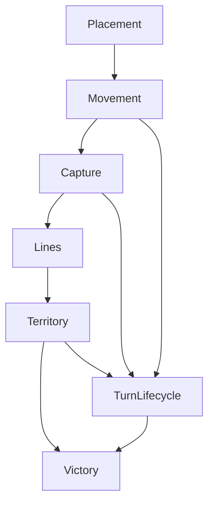
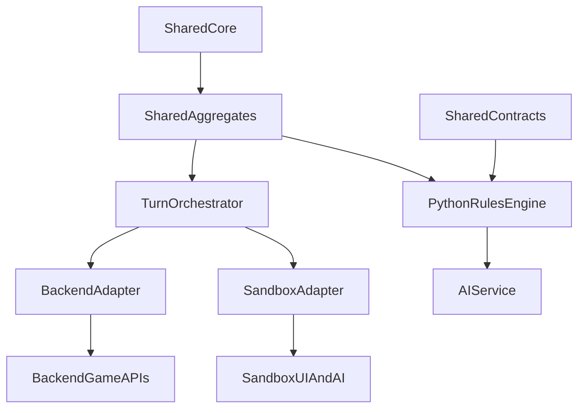

> **Doc Status (2025-11-30): Historical / Completed**
> **Role:** Consolidation and migration plan for moving backend, sandbox, and Python rules hosts onto the shared TS rules engine, orchestrator, and contracts.
>
> **Status (2025-11-30):** ✅ **Consolidation Complete** – The orchestrator is at 100% rollout across all environments. Backend and sandbox hosts now use `TurnEngineAdapter` and `SandboxOrchestratorAdapter` exclusively. Legacy cleanup (Wave 5.4) is the remaining work.
>
> **SSoT alignment:** This document is a derived architectural and planning view over the **Rules/invariants semantics SSoT** and related surfaces:
>
> - Rules/invariants semantics SSoT: `RULES_CANONICAL_SPEC.md`, `../rules/COMPLETE_RULES.md`, `../rules/COMPACT_RULES.md`, and the shared TS engine under `src/shared/engine/**` plus v2 contract vectors in `tests/fixtures/contract-vectors/v2/**`.
> - Lifecycle/API SSoT: `docs/CANONICAL_ENGINE_API.md` and shared types/schemas under `src/shared/types/game.ts`, `src/shared/engine/orchestration/types.ts`, `src/shared/types/websocket.ts`, and `src/shared/validation/websocketSchemas.ts`.
> - TS↔Python parity & determinism SSoT: `docs/PYTHON_PARITY_REQUIREMENTS.md` and the TS/Python parity + determinism test suites.
> - **Rules surface ownership SSoT:** `docs/RULES_ENGINE_SURFACE_AUDIT.md` (especially §0, _Rules Entry Surfaces / SSoT checklist_), which defines exactly which modules may encode rules semantics and which must act as thin host adapters over the shared engine.
>
> **Precedence:** This file is never the source of truth for rules behaviour. On any conflict with executable code, tests, or the canonical rules/lifecycle docs, **the code + tests win** and this plan must be updated.

# Shared Engine Consolidation Plan

## Executive Summary

This plan consolidates RingRift's rules logic into a single canonical engine in [`src/shared/engine`](../../src/shared/engine) with thin adapters for the backend, sandbox, and Python AI service. It targets removal of ~3,800 lines of duplicated placement, movement, capture, line, territory, lifecycle, and victory logic across [`GameEngine.ts`](../../src/server/game/GameEngine.ts), [`ClientSandboxEngine.ts`](../../src/client/sandbox/ClientSandboxEngine.ts), and [`game_engine/__init__.py`](../../ai-service/app/game_engine/__init__.py) while preserving strict TS–Python parity and 90%+ test coverage. The phases below are ordered by dependency so that lower-level mechanics (capture chains, movement, placement) are stabilized first, then higher-level flows (lines, territory, lifecycle, victory) and host adapters.

## Current State Analysis

### Duplicate Code Inventory

The tables below classify duplication by logic category, not by file. "Lines" is an approximate total of duplicated rule logic across backend, sandbox, and Python implementations for that category. Prior analysis (Pass 15) estimated ~3,800 lines of meaningful duplication; the numbers here are rounded to keep the total near that figure.

| Logic Category       | Backend File(s)                                                                                                                                                                                                                                                                     | Sandbox File(s)                                                                                                                                                                                                         | Python File(s)                                                                                                                                                                                                                                                                        | Lines (Dup Logic) | Priority |
| -------------------- | ----------------------------------------------------------------------------------------------------------------------------------------------------------------------------------------------------------------------------------------------------------------------------------- | ----------------------------------------------------------------------------------------------------------------------------------------------------------------------------------------------------------------------- | ------------------------------------------------------------------------------------------------------------------------------------------------------------------------------------------------------------------------------------------------------------------------------------- | ----------------- | -------- |
| Placement            | [`GameEngine.ts`](../../src/server/game/GameEngine.ts), [`RuleEngine.ts`](../../src/server/game/RuleEngine.ts), `src/server/game/rules/placement*.ts` (legacy where present)                                                                                                        | [`ClientSandboxEngine.ts`](../../src/client/sandbox/ClientSandboxEngine.ts), [`sandboxPlacement.ts`](../../src/client/sandbox/sandboxPlacement.ts)                                                                      | [`game_engine/__init__.py`](../../ai-service/app/game_engine/__init__.py), [`validators/placement.py`](../../ai-service/app/rules/validators/placement.py), [`mutators/placement.py`](../../ai-service/app/rules/mutators/placement.py)                                               | ~500              | P1       |
| Movement             | [`GameEngine.ts`](../../src/server/game/GameEngine.ts), [`RuleEngine.ts`](../../src/server/game/RuleEngine.ts), [`BoardManager.ts`](../../src/server/game/BoardManager.ts), `src/server/game/rules/movement*.ts`                                                                    | [`ClientSandboxEngine.ts`](../../src/client/sandbox/ClientSandboxEngine.ts), [`sandboxMovement.ts`](../../src/client/sandbox/sandboxMovement.ts)                                                                        | [`game_engine/__init__.py`](../../ai-service/app/game_engine/__init__.py), [`mutators/movement.py`](../../ai-service/app/rules/mutators/movement.py), [`validators/movement.py`](../../ai-service/app/rules/validators/movement.py)                                                   | ~700              | P1       |
| Capture (incl chain) | [`GameEngine.ts`](../../src/server/game/GameEngine.ts), [`RuleEngine.ts`](../../src/server/game/RuleEngine.ts), `src/server/game/rules/capture*.ts` (legacy), [`aggregates/CaptureAggregate.ts`](../../src/shared/engine/aggregates/CaptureAggregate.ts) integration code on server | [`ClientSandboxEngine.ts`](../../src/client/sandbox/ClientSandboxEngine.ts), [`sandboxCaptures.ts`](../../src/client/sandbox/sandboxCaptures.ts)                                                                        | [`game_engine/__init__.py`](../../ai-service/app/game_engine/__init__.py), [`mutators/capture.py`](../../ai-service/app/rules/mutators/capture.py), [`validators/capture.py`](../../ai-service/app/rules/validators/capture.py)                                                       | ~900              | P1       |
| Line Processing      | [`GameEngine.ts`](../../src/server/game/GameEngine.ts), [`RuleEngine.ts`](../../src/server/game/RuleEngine.ts), `src/server/game/rules/lineProcessing.ts` (legacy), server-side history and cap-elimination glue                                                                    | [`ClientSandboxEngine.ts`](../../src/client/sandbox/ClientSandboxEngine.ts), [`sandboxLines.ts`](../../src/client/sandbox/sandboxLines.ts)                                                                              | [`game_engine/__init__.py`](../../ai-service/app/game_engine/__init__.py), [`mutators/line.py`](../../ai-service/app/rules/mutators/line.py), [`validators/line.py`](../../ai-service/app/rules/validators/line.py), Python line reward and collapse logic                            | ~550              | P1       |
| Territory Processing | [`GameEngine.ts`](../../src/server/game/GameEngine.ts), `src/server/game/rules/territoryProcessing.ts` (legacy), backend-specific Q23 gating and elimination bookkeeping                                                                                                            | [`ClientSandboxEngine.ts`](../../src/client/sandbox/ClientSandboxEngine.ts) (disconnected-region gating, Q23 wrapper, explicit elimination flow), [`sandboxTerritory.ts`](../../src/client/sandbox/sandboxTerritory.ts) | [`game_engine/__init__.py`](../../ai-service/app/game_engine/__init__.py), [`mutators/territory.py`](../../ai-service/app/rules/mutators/territory.py), [`validators/territory.py`](../../ai-service/app/rules/validators/territory.py), internal Q23 and region-claim implementation | ~600              | P1       |
| Turn Lifecycle       | [`GameEngine.ts`](../../src/server/game/GameEngine.ts), [`TurnEngine.ts`](../../src/server/game/turn/TurnEngine.ts), `src/server/game/rules/*.ts` phase glue, backend LPS and forced-elimination logic                                                                              | [`ClientSandboxEngine.ts`](../../src/client/sandbox/ClientSandboxEngine.ts) (sandbox LPS bookkeeping and forced-elimination orchestration)                                                                              | [`game_engine/__init__.py`](../../ai-service/app/game_engine/__init__.py) phase update and end-turn helpers, forced-elimination helpers, LPS tracking and round index logic                                                                                                           | ~350              | P2       |
| Victory Detection    | [`RuleEngine.ts`](../../src/server/game/RuleEngine.ts) victory wrapper around shared evaluator, older backend-only checks in [`GameEngine.ts`](../../src/server/game/GameEngine.ts)                                                                                                 | [`sandboxGameEnd.ts`](../../src/client/sandbox/sandboxGameEnd.ts), victory and stalemate resolution helpers, sandbox-specific normalisation of phases                                                                   | [`game_engine/__init__.py`](../../ai-service/app/game_engine/__init__.py) `_check_victory` and tie-breaker implementation                                                                                                                                                             | ~200              | P2       |

**Total Duplicate Lines (approx):** ~3,800

Notes:

- Many of these modules already _call_ shared helpers (for example, backend and sandbox both use shared placement and capture validators), but still contain duplicated orchestration and bookkeeping that should move into canonical aggregates or a shared orchestrator.
- Python currently reimplements large portions of shared core semantics (movement geometry, capture reachability, territory processing, line collapse, and LPS) inside [`game_engine/__init__.py`](../../ai-service/app/game_engine/__init__.py) and `ai-service/app/rules/mutators/*.py`.

### Already Consolidated (Reference)

These modules already act as single sources of truth in TypeScript and are heavily used by backend and sandbox. Python has corresponding ports for many of them in [`core.py`](../../ai-service/app/rules/core.py) and in its own engine logic.

| Module                       | Path                                                                                                                                                                                                                                                         | Lines (approx)    | Coverage                                                                                                                                                                                                                                       |
| ---------------------------- | ------------------------------------------------------------------------------------------------------------------------------------------------------------------------------------------------------------------------------------------------------------ | ----------------- | ---------------------------------------------------------------------------------------------------------------------------------------------------------------------------------------------------------------------------------------------- |
| captureLogic                 | [`captureLogic.ts`](../../src/shared/engine/captureLogic.ts)                                                                                                                                                                                                 | ~300              | Canonical capture geometry, segment validation, and shared helpers for capture aggregation                                                                                                                                                     |
| movementLogic                | [`movementLogic.ts`](../../src/shared/engine/movementLogic.ts)                                                                                                                                                                                               | ~300              | Canonical movement validation and enumeration, shared by backend [`RuleEngine.ts`](../../src/server/game/RuleEngine.ts) and sandbox movement helpers                                                                                           |
| territoryProcessing          | [`territoryProcessing.ts`](../../src/shared/engine/territoryProcessing.ts)                                                                                                                                                                                   | ~230              | Canonical territory region processing (Q23 gating, internal eliminations, border markers, collapse); used by backend and sandbox wrappers                                                                                                      |
| lineDetection                | [`lineDetection.ts`](../../src/shared/engine/lineDetection.ts)                                                                                                                                                                                               | ~220              | Canonical marker-line detection for all board types; used by backend board manager and sandbox line helpers                                                                                                                                    |
| lineDecisionHelpers          | [`lineDecisionHelpers.ts`](../../src/shared/engine/lineDecisionHelpers.ts)                                                                                                                                                                                   | ~260              | Canonical enumeration and application of line decisions (process line, choose reward) for backend and sandbox                                                                                                                                  |
| territoryDecisionHelpers     | [`territoryDecisionHelpers.ts`](../../src/shared/engine/territoryDecisionHelpers.ts)                                                                                                                                                                         | ~220              | Canonical enumeration and application of territory decisions (region processing and explicit elimination)                                                                                                                                      |
| Turn orchestration core      | [`turnLogic.ts`](../../src/shared/engine/turnLogic.ts), [`orchestration/phaseStateMachine.ts`](../../src/shared/engine/orchestration/phaseStateMachine.ts), [`orchestration/turnOrchestrator.ts`](../../src/shared/engine/orchestration/turnOrchestrator.ts) | ~400              | Shared turn advancement semantics (phase transitions, forced elimination gating, basic LPS hooks)                                                                                                                                              |
| Core geometry and hashing    | [`core.ts`](../../src/shared/engine/core.ts), [`core.py`](../../ai-service/app/rules/core.py)                                                                                                                                                                | ~350 TS / ~240 Py | Board geometry, distance, path generation, S-invariant, hashGameState; TS is canonical, Python is a port kept in contract parity                                                                                                               |
| Capture aggregate            | [`aggregates/CaptureAggregate.ts`](../../src/shared/engine/aggregates/CaptureAggregate.ts)                                                                                                                                                                   | ~280              | Shared capture-chain state representation and continuation helpers; used by backend [`GameEngine.ts`](../../src/server/game/GameEngine.ts)                                                                                                     |
| Territory aggregate          | [`aggregates/TerritoryAggregate.ts`](../../src/shared/engine/aggregates/TerritoryAggregate.ts)                                                                                                                                                               | ~260              | Shared high-level territory resolution; backend and sandbox call into lower-level [`territoryProcessing.ts`](../../src/shared/engine/territoryProcessing.ts) via this aggregate                                                                |
| Victory aggregate            | [`aggregates/VictoryAggregate.ts`](../../src/shared/engine/aggregates/VictoryAggregate.ts)                                                                                                                                                                   | ~220              | Canonical victory evaluation and tie-breaking logic, exported via `evaluateVictory` and reused by backend and tests                                                                                                                            |
| Canonical orchestrator       | [`orchestration/turnOrchestrator.ts`](../../src/shared/engine/orchestration/turnOrchestrator.ts)                                                                                                                                                             | ~400              | ✅ Canonical `processTurn` orchestration, fully wired via [`TurnEngineAdapter`](../../src/server/game/turn/TurnEngineAdapter.ts) and [`SandboxOrchestratorAdapter.ts`](../../src/client/sandbox/SandboxOrchestratorAdapter.ts) at 100% rollout |
| Shared contracts and vectors | [`contracts/*.ts`](../../src/shared/engine/contracts), tests under `tests/parity`                                                                                                                                                                            | ~300+             | JSON Schemas and parity vector tooling for TS–Python parity; already in use for several categories                                                                                                                                             |

Overall, TS shared modules already provide strong single sources of truth for:

- Geometry, distance, paths, and hash (`core.ts`).
- Basic placement, movement, capture, line, territory, and victory primitives (aggregates and helpers).

Remaining duplication is mainly:

- Host-specific orchestration (turn lifecycle, forced elimination, LPS).
- Decision surfacing and move enumeration presentation (especially in Python).
- Old direct implementations that predate or partially wrap shared aggregates.

### Dependency Graph

#### Logical Rules Dependencies

These are semantic dependencies between categories; higher rows rely on invariants from lower rows.

Interpretation:

- Placement must respect future movement/capture reachability (no-dead-placement).
- Capture uses movement geometry plus markers along paths.
- Lines depend on marker placement along movement/capture paths.
- Territory depends on the end-of-movement board state and prior line collapses.
- Turn lifecycle coordinates all of the above and feeds victory evaluation.

#### Implementation and Adapter Dependencies

At the module level, consolidation should proceed from the canonical TS core outwards to adapters, with Python validated by contracts rather than by re-implementing orchestration.

Safe consolidation order implied by these graphs:

1. Stabilize shared core and aggregates (placement, movement, capture, line, territory, victory).
2. Finalize canonical turn orchestrator (`processTurn`) over those aggregates.
3. Migrate backend and sandbox to thin adapters over the orchestrator.
4. Align Python's engine with TS semantics via contract tests and simplified mutators/validators.
5. Remove legacy per-host rule engines and duplicated orchestration.

## Phase 1: Foundation and Capture Chain (Week 1–2)

### P1.1: Capture Chain Semantics Design

**Agent:** Architect  
**Input Dependencies:** [`RULES_ENGINE_CONSOLIDATION_DESIGN.md`](../archive/RULES_ENGINE_CONSOLIDATION_DESIGN.md), existing [`CaptureAggregate.ts`](../../src/shared/engine/aggregates/CaptureAggregate.ts), TS/Python parity tests under [`tests/parity`](../../ai-service/tests/parity)

**Acceptance Criteria:**

- [x] Single canonical capture-chain model defined in shared engine (segment representation, visited positions, termination conditions).
- [x] Documented mapping from backend chain-capture phase, sandbox chain-capture flow, and Python chain-capture representation into this shared model.
- [x] Edge cases covered: landing on own marker, mixed-colour stacks, long-distance captures, and no-legal-continuation chains.
- [x] Updated design section in [`RULES_ENGINE_CONSOLIDATION_DESIGN.md`](../archive/RULES_ENGINE_CONSOLIDATION_DESIGN.md) referencing the final capture-chain spec.

**Deliverables:**

- Capture chain architecture addendum in design doc.
- Updated comments in [`CaptureAggregate.ts`](../../src/shared/engine/aggregates/CaptureAggregate.ts) and Python docstrings in [`game_engine/__init__.py`](../../ai-service/app/game_engine/__init__.py).

### P1.2: Shared Capture Chain Core Implementation

**Agent:** Code
**Input Dependencies:** P1.1 design

**Acceptance Criteria:**

- [x] Shared capture-chain core consolidated into [`CaptureAggregate.ts`](../../src/shared/engine/aggregates/CaptureAggregate.ts), exposing a pure API for "compute valid capture segments" and "update chain state after segment" (the earlier standalone `captureChainCore.ts` helper remains a historical design note only).
- [x] Backend and sandbox capture enumeration flows call into shared capture helpers instead of duplicating ray-walk logic.
- [x] Existing TS capture parity tests (e.g. `tests/parity/test_chain_capture_parity.py`) pass unchanged.
- [x] 90%+ coverage on new capture-chain paths in TS unit tests.

**Deliverables:**

- Capture-chain core implementation and tests under `tests/unit/*capture*`.

#### P1.2 Implementation Note (TS shared capture core, 2025‑11‑28)

Implementation for this task was completed by consolidating all TS capture‑chain behaviour onto the canonical aggregate in [`CaptureAggregate.ts`](../../src/shared/engine/aggregates/CaptureAggregate.ts).

**Functions / types touched (TS):**

- Capture aggregate (canonical core):
  - [`ChainCaptureSegment`](../../src/shared/engine/aggregates/CaptureAggregate.ts:56), [`ChainCaptureState`](../../src/shared/engine/aggregates/CaptureAggregate.ts:71), [`ChainCaptureStateSnapshot`](../../src/shared/engine/aggregates/CaptureAggregate.ts:115), [`ChainCaptureEnumerationOptions`](../../src/shared/engine/aggregates/CaptureAggregate.ts:141), [`ChainCaptureContinuationInfo`](../../src/shared/engine/aggregates/CaptureAggregate.ts:170)
  - [`CaptureSegmentParams`](../../src/shared/engine/aggregates/CaptureAggregate.ts:188), [`CaptureApplicationOutcome`](../../src/shared/engine/aggregates/CaptureAggregate.ts:202), [`CaptureValidationResult`](../../src/shared/engine/aggregates/CaptureAggregate.ts:225), [`CaptureMutationResult`](../../src/shared/engine/aggregates/CaptureAggregate.ts:230)
  - Enumeration and state helpers:
    - [`enumerateCaptureMoves`](../../src/shared/engine/aggregates/CaptureAggregate.ts:382)
    - [`enumerateAllCaptureMoves`](../../src/shared/engine/aggregates/CaptureAggregate.ts:498)
    - [`enumerateChainCaptureSegments`](../../src/shared/engine/aggregates/CaptureAggregate.ts:535)
    - [`getChainCaptureContinuationInfo`](../../src/shared/engine/aggregates/CaptureAggregate.ts:579)
    - [`enumerateChainCaptures`](../../src/shared/engine/aggregates/CaptureAggregate.ts:606)
  - Mutation / application helpers:
    - [`validateCapture`](../../src/shared/engine/aggregates/CaptureAggregate.ts:317)
    - [`mutateCapture`](../../src/shared/engine/aggregates/CaptureAggregate.ts:632)
    - [`updateChainCaptureStateAfterCapture`](../../src/shared/engine/aggregates/CaptureAggregate.ts:800)
    - [`applyCaptureSegment`](../../src/shared/engine/aggregates/CaptureAggregate.ts:844)
    - [`applyCapture`](../../src/shared/engine/aggregates/CaptureAggregate.ts:877)

- Legacy helpers now acting as shims:
  - [`captureLogic.ts`](../../src/shared/engine/captureLogic.ts)
    - Reduced to a thin wrapper that re‑exports `CaptureBoardAdapters` and forwards [`enumerateCaptureMoves`](../../src/shared/engine/captureLogic.ts:22) to the aggregate implementation. All ray‑walk and geometry logic was removed from this file.
  - [`captureChainHelpers.ts`](src/shared/engine/chainCaptureTracking.ts)
    - Refactored into a compatibility layer that:
      - Defines a legacy [`ChainCaptureStateSnapshot`](src/shared/engine/chainCaptureTracking.ts:41) with `visitedTargets?: string[]` and maps it to the canonical snapshot’s `capturedThisChain: Position[]` via `stringToPosition`.
      - Adapts [`ChainCaptureEnumerationOptions`](src/shared/engine/chainCaptureTracking.ts:68) to the aggregate’s `ChainCaptureEnumerationOptions`, with explicit property copying to keep `exactOptionalPropertyTypes` happy.
      - Delegates:
        - [`enumerateChainCaptureSegments`](src/shared/engine/chainCaptureTracking.ts:192) → aggregate `enumerateChainCaptureSegments`.
        - [`getChainCaptureContinuationInfo`](src/shared/engine/chainCaptureTracking.ts:213) → aggregate `enumerateChainCaptureSegments`, re‑exposed as `{ hasFurtherCaptures, segments }`.
        - [`canCapture`](src/shared/engine/chainCaptureTracking.ts:239) → shared [`validateCaptureSegmentOnBoard`](../../src/shared/engine/core.ts:243).
        - [`getValidCaptureTargets`](src/shared/engine/chainCaptureTracking.ts:265) → aggregate `enumerateCaptureMoves` grouped by `captureTarget`.
        - [`processChainCapture`](src/shared/engine/chainCaptureTracking.ts:312) → uses `canCapture` plus aggregate enumeration on the _unmutated_ state; documented as an approximate, analysis‑only helper.
  - Mutator shim:
    - [`mutators/CaptureMutator.ts`](../../src/shared/engine/mutators/CaptureMutator.ts)
      - Now bridges the engine `GameState` type to the shared `GameState` and delegates `mutateCapture` calls directly to [`CaptureAggregate.mutateCapture`](../../src/shared/engine/aggregates/CaptureAggregate.ts:632), making the aggregate the single TS source of truth for capture application.

**Significant internal refactors:**

- All capture ray‑walk and reachability logic in legacy helpers has been removed in favour of [`enumerateCaptureMoves`](../../src/shared/engine/aggregates/CaptureAggregate.ts:382) and [`enumerateChainCaptureSegments`](../../src/shared/engine/aggregates/CaptureAggregate.ts:535). Backend and sandbox enumeration already flow through these helpers (directly or via adapters), so future P1.3/P1.4 work can safely delete any remaining host‑side capture geometry.
- Capture mutation semantics (departure marker, intermediate marker processing, ring transfer, landing‑on‑own‑marker elimination) are now implemented only in [`mutateCapture`](../../src/shared/engine/aggregates/CaptureAggregate.ts:632). Backend and sandbox mutators are thin adapters over this core.
- [`captureChainHelpers.ts`](src/shared/engine/chainCaptureTracking.ts) is explicitly documented as:
  - A UI/AI convenience layer for approximate chain inspection.
  - A strict delegator for enumeration and validation, not an independent rules surface.

**Behaviour clarifications / spec‑justified details:**

- **Landing on any marker:** per canonical spec ([`RR-CANON-R091/R092`](../../RULES_CANONICAL_SPEC.md) and [`RR-CANON-R101/R102`](../../RULES_CANONICAL_SPEC.md)), landing on any marker (own or opponent) is legal during both movement and captures, but incurs a cap-elimination cost. The marker is removed and the top ring of the moving stack's cap is eliminated. This is enforced by:
  - Using [`validateCaptureSegmentOnBoard`](../../src/shared/engine/core.ts:243) for all segment legality checks.
  - [`mutateCapture`](../../src/shared/engine/aggregates/CaptureAggregate.ts:632) removes any marker found at the landing cell and eliminates the top ring of the attacking stack's cap.
- **Visited‑set policy:** the aggregate keeps `capturedThisChain` and an optional `disallowRevisitedTargets` flag (used only by analysis tools such as [`scripts/findCyclicCaptures.js`](../../scripts/findCyclicCaptures.js:1)). Rules‑level helpers such as [`getChainCaptureContinuationInfo`](../../src/shared/engine/aggregates/CaptureAggregate.ts:579) call `enumerateChainCaptureSegments` without this flag, ensuring cyclic and revisiting chains remain legal as required by [`RR-CANON-R103`](../../RULES_CANONICAL_SPEC.md:317).
- **TS coverage:** targeted Jest runs over capture‑focused suites (including `captureLogic.shared`, `captureChainHelpers.shared`, `captureSequenceEnumeration`, `GameEngine.chainCapture`, and [`CaptureAggregate.chainCapture.shared`](../../tests/unit/CaptureAggregate.chainCapture.shared.test.ts:1)) now report:
  - [`captureLogic.ts`](../../src/shared/engine/captureLogic.ts:1) — 100% statements/branches/functions/lines.
  - [`captureChainHelpers.ts`](src/shared/engine/chainCaptureTracking.ts:1) — ~92% statements/lines and >80% branches.
  - [`CaptureAggregate.ts`](../../src/shared/engine/aggregates/CaptureAggregate.ts:1) — ≈93% statements, ≈94% branches, ≈94% lines.
  - Global Jest coverage thresholds for the entire repository remain below 80%, but the capture modules themselves meet the ≥90% line/branch target for this phase.

No intentional semantic changes to the canonical capture rules were introduced in this step; all adjustments either removed duplicated implementations or clarified behaviour already mandated by [`RULES_CANONICAL_SPEC.md`](../../RULES_CANONICAL_SPEC.md:1). Any future divergence discovered by TS–Python parity tests (e.g. [`test_chain_capture_parity.py`](../../ai-service/tests/parity/test_chain_capture_parity.py:1)) should be treated as a bug against this consolidated TS source of truth.

### P1.3: Backend Capture Integration

**Agent:** Code
**Input Dependencies:** P1.2 implementation

**Acceptance Criteria:**

- [x] Backend capture enumeration and validation in [`RuleEngine.ts`](../../src/server/game/RuleEngine.ts) delegate fully to shared capture helpers (no custom geometry rules).
- [x] Backend chain-capture phase state in [`GameEngine.ts`](../../src/server/game/GameEngine.ts) is expressed purely via shared `CaptureAggregate` types.
- [x] All backend capture and chain-capture tests pass without behavioral changes.
- [x] Legacy capture-only helpers under `src/server/game/rules/*capture*.ts` (if still present) are marked deprecated and scheduled for Phase 5 removal.

**Deliverables:**

- Refactored backend capture code using shared capture core.
- Short migration note in `CURRENT_RULES_STATE.md`.

#### P1.3 Implementation Note (Backend capture wiring, 2025‑11‑28)

Backend capture enumeration, validation, and mutation in the Node/TS backend now delegate exclusively to the shared capture core in [`CaptureAggregate.ts`](../../src/shared/engine/aggregates/CaptureAggregate.ts:56). The key backend entry points and their wiring are:

- [`GameEngine.applyMove`](../../src/server/game/GameEngine.ts:1288) — the `'overtaking_capture'` and `'continue_capture_segment'` branches call the canonical [`applyCapture`](../../src/shared/engine/aggregates/CaptureAggregate.ts:877) helper (imported as `applyCaptureAggregate`) and then copy the resulting `board` maps back into the existing `GameState.board` instance to preserve Map identities for legacy tests.
- [`GameEngine.getValidMoves`](../../src/server/game/GameEngine.ts:2752) — when `currentPhase === 'chain_capture'`, continuation options are computed via [`getCaptureOptionsFromPosition`](../../src/server/game/GameEngine.ts:1566), which is a thin adapter over [`getChainCaptureContinuationInfo`](../../src/shared/engine/aggregates/CaptureAggregate.ts:579). Chain state bookkeeping uses [`updateChainCaptureStateAfterCapture`](../../src/shared/engine/aggregates/CaptureAggregate.ts:800) and the shared [`ChainCaptureState`](../../src/shared/engine/aggregates/CaptureAggregate.ts:71) type.
- [`GameEngine.hasAnyRealActionForPlayer`](../../src/server/game/GameEngine.ts:3049) and test-only helpers [`GameEngine.resolveBlockedStateForCurrentPlayerForTesting`](../../src/server/game/GameEngine.ts:3315) / [`GameEngine.stepAutomaticPhasesForTesting`](../../src/server/game/GameEngine.ts:3514) now detect global capture availability via [`enumerateAllCaptureMoves`](../../src/shared/engine/aggregates/CaptureAggregate.ts:498) (re-exported as `enumerateAllCaptureMovesAggregate`) instead of any backend-specific ray-walk logic.
- [`TurnEngine.hasValidCaptures`](../../src/server/game/turn/TurnEngine.ts:168) and [`TurnEngine.hasValidActions`](../../src/server/game/turn/TurnEngine.ts:209) implement the `hasAnyCapture` predicate entirely via the shared [`enumerateAllCaptureMoves`](../../src/shared/engine/aggregates/CaptureAggregate.ts:498) helper, with additional filtering for `mustMoveFromStackKey` so that forced-move semantics remain consistent with [`GameEngine.getValidMoves`](../../src/server/game/GameEngine.ts:2752).
- [`RuleEngine.getValidMoves` capture/movement branches](../../src/server/game/RuleEngine.ts:685) delegate capture enumeration to [`getValidCaptures`](../../src/server/game/RuleEngine.ts:881), which wraps the canonical per-stack [`enumerateCaptureMoves`](../../src/shared/engine/aggregates/CaptureAggregate.ts:382). No backend code walks capture rays directly.
- [`RuleEngine.validateCapture`](../../src/server/game/RuleEngine.ts:281) and [`RuleEngine.validateChainCaptureContinuation`](../../src/server/game/RuleEngine.ts:321) validate segments via the shared [`validateCaptureSegmentOnBoard`](../../src/shared/engine/core.ts:367) helper using a [`CaptureSegmentBoardView`](../../src/shared/engine/aggregates/CaptureAggregate.ts:188) adapter; all geometry and path-blocking rules for capture segments now live in the shared engine.
- [`RuleEngine.processCapture`](../../src/server/game/RuleEngine.ts:520) has been reduced to a thin adapter over `applyCaptureAggregate`, mutating the cloned `GameState` returned by [`RuleEngine.cloneGameState`](../../src/server/game/RuleEngine.ts:1217) with `result.newState`. Marker-path effects, ring transfer, and landing-on-own-marker elimination are all implemented only in [`mutateCapture`](../../src/shared/engine/aggregates/CaptureAggregate.ts:632).

Legacy helpers and residual backend-specific capture code have been isolated to diagnostics only:

- [`RuleEngine.processChainReactions`](../../src/server/game/RuleEngine.ts:551), [`RuleEngine.getCaptureDirections`](../../src/server/game/RuleEngine.ts:1082), [`RuleEngine.isPathClear`](../../src/server/game/RuleEngine.ts:247), and [`RuleEngine.isStraightLineMovement`](../../src/server/game/RuleEngine.ts:1195) are no longer used by any live capture enumeration or mutation path. They are retained only for historical/debugging purposes and are referenced via [`RuleEngine._debugUseInternalHelpers`](../../src/server/game/RuleEngine.ts:1452) until they are formally removed in Phase 5 clean-up.
- [`GameEngine.performOvertakingCapture`](../../src/server/game/GameEngine.ts:1593) is similarly unused; all backend capture application now flows through the shared aggregate, and this method is kept only as a legacy reference for comparison against the consolidated implementation.

Backend tests exercising capture behaviour at the engine surface have been re-run against this wiring:

- [`tests/unit/GameEngine.chainCapture.test.ts`](../../tests/unit/GameEngine.chainCapture.test.ts:1) — validates multi-step chain-capture behaviour via `GameEngine.makeMove` and `GameEngine.getValidMoves` in the `chain_capture` phase.
- [`tests/scenarios/RulesMatrix.ChainCapture.GameEngine.test.ts`](../../tests/scenarios/RulesMatrix.ChainCapture.GameEngine.test.ts:1) — scenario-level chain-capture flows through `GameEngine`, ensuring continuation options and termination semantics match the shared core.
- [`tests/unit/CaptureMarker.GameEngine_vs_Sandbox.test.ts`](../../tests/unit/CaptureMarker.GameEngine_vs_Sandbox.test.ts:1) — updated so that the backend-style path applies captures via [`applyCapture`](../../src/shared/engine/aggregates/CaptureAggregate.ts:877) on a backend-shaped `GameState` and compares the resulting board to the sandbox capture helpers, confirming that both adapters agree on marker + capture interactions.

Together, these changes ensure that TS capture semantics (enumeration, validation, application, and chain continuation) now have a single algorithmic source of truth in the shared capture core, with backend modules acting purely as adapters over that core.

### P1.4: Sandbox and Python Capture Alignment

**Agent:** Code

**Input Dependencies:** P1.2 implementation

**Acceptance Criteria:**

- [x] Sandbox capture helpers [`sandboxCaptures.ts`](../../src/client/sandbox/sandboxCaptures.ts:1) use TS capture core for reachability decisions where possible (or share common helpers with backend).
- [x] Python capture methods in [`game_engine/__init__.py`](../../ai-service/app/game_engine/__init__.py:1) (`_get_capture_moves`, `_apply_chain_capture`) are reviewed and documented against the canonical capture-chain spec, with any deviations surfaced via tests.
- [x] Chain-capture parity tests in [`test_chain_capture_parity.py`](../../ai-service/tests/parity/test_chain_capture_parity.py:1) remain green.

**Deliverables:**

- Updated sandbox capture engine wired closer to shared capture core.
- Python capture implementation notes referencing canonical semantics.

#### P1.4 Implementation Note (Sandbox capture wiring, 2025‑11‑28)

This subphase aligns the **TS sandbox capture implementation** with the shared capture core so that all rules‑level capture enumeration and application flows through [`CaptureAggregate.ts`](../../src/shared/engine/aggregates/CaptureAggregate.ts:1), with the sandbox acting purely as an adapter plus UI tooling.

**Sandbox entry points now calling shared capture APIs**

- **Per‑stack capture enumeration (sandbox helpers):**
  - [`enumerateCaptureSegmentsFromBoard()`](../../src/client/sandbox/sandboxCaptures.ts:35) is a thin adapter over the canonical [`enumerateCaptureMoves()`](../../src/shared/engine/aggregates/CaptureAggregate.ts:382) via [`captureLogic.enumerateCaptureMoves()`](../../src/shared/engine/captureLogic.ts:22). It builds a lightweight [`CaptureBoardAdapters`](../../src/shared/engine/aggregates/CaptureAggregate.ts:87) view from the sandbox `BoardState`.
  - `ClientSandboxEngine.enumerateCaptureSegmentsFrom()` wraps `enumerateCaptureSegmentsFromBoard` for use by movement flows, wiring `isValidPosition`, `isCollapsedSpace`, and `getMarkerOwner` back to the host engine.

- **UI landing enumeration and highlights:**
  - [`enumerateCaptureSegmentsFrom()`](../../src/client/sandbox/ClientSandboxEngine.ts:1413) constructs sandbox `CaptureBoardAdapters` and delegates to `enumerateCaptureSegmentsFromBoard`.
  - [`getValidLandingPositionsForCurrentPlayer()`](../../src/client/sandbox/ClientSandboxEngine.ts:967):
    - First calls `enumerateCaptureSegmentsFrom(from, currentPlayer)` to obtain canonical capture landings from the shared core.
    - Falls back to [`enumerateSimpleMovementLandings()`](../../src/client/sandbox/ClientSandboxEngine.ts:1037) (which itself uses shared movement helpers) only when no capture segments exist.
    - As a result, all capture targets and landings highlighted in the sandbox UI are driven by `CaptureAggregate.enumerateCaptureMoves`.

- **Movement click → capture detection (legacy sandbox path):**
  - `ClientSandboxEngine.handleLegacyMovementClick()` now:
    - Uses `enumerateCaptureSegmentsFromSandbox` to fetch all legal capture segments for the selected stack from `CaptureAggregate`.
    - Checks whether the clicked destination matches the `landing` of any canonical segment and, if so, starts a chain via `performCaptureChainInternal()` using the exact `(from, target, landing)` triple supplied by the shared core.
    - Only treats the click as a simple non‑capture move when no canonical capture segment to that landing exists.

- **Capture application (sandbox engine + hooks):**
  - [`applyCaptureSegment()`](../../src/client/sandbox/ClientSandboxEngine.ts:1434) is now a thin wrapper over [`applyCaptureSegment`](../../src/shared/engine/aggregates/CaptureAggregate.ts:844):
    - Builds `CaptureSegmentParams { from, target, landing, player }`.
    - Calls the aggregate helper and assigns `this.gameState = outcome.nextState`.
    - All marker path effects, ring transfer, landing‑on‑own‑marker elimination, and defensive marker clearing are owned solely by [`mutateCapture()`](../../src/shared/engine/aggregates/CaptureAggregate.ts:632).
  - `ClientSandboxEngine.applyCaptureSegment()` calls the shared [`applyCaptureSegment`](../../src/shared/engine/aggregates/CaptureAggregate.ts:844), updating the host’s `GameState` directly.
  - The older sandbox‑local mutator [`applyCaptureSegmentOnBoard()`](../../src/client/sandbox/sandboxCaptures.ts:96) remains only for **analysis/debug** use (e.g. offline chain enumeration tests); its doc comment explicitly marks it as non‑canonical and not used by live engine flows.

- **Chain continuation semantics (legacy sandbox path):**
  - In the non‑orchestrator capture branch of [`applyCanonicalMoveInternal()`](../../src/client/sandbox/ClientSandboxEngine.ts:2552), the capture cases:
    - Apply the segment via `this.applyCaptureSegment(...)`, which delegates to `CaptureAggregate.applyCaptureSegment`.
    - Ask the shared core whether the chain must continue using [`getChainCaptureContinuationInfoAggregate()`](../../src/client/sandbox/ClientSandboxEngine.ts:35), which maps directly to [`getChainCaptureContinuationInfo()`](../../src/shared/engine/aggregates/CaptureAggregate.ts:579).
    - When `mustContinue === true`, enter the `'chain_capture'` phase; otherwise, run line and territory processing and normalise the phase to `'territory_processing'` (mirroring backend `GameEngine` behaviour).
  - This ensures that chain continuation (including visited‑target policy) is controlled entirely by `CaptureAggregate` rather than sandbox‑local heuristics.

- **Global “any capture?” checks in sandbox flows:**
  - Sandbox turn/lifecycle helpers use shared reachability primitives for forced‑elimination and last‑player‑standing logic:
    - No‑dead‑placement and “has any capture from this stack” are enforced via [`hasAnyLegalMoveOrCaptureFromOnBoard()`](../../src/shared/engine/core.ts:408) underneath the sandbox adapter (see [`hasAnyLegalMoveOrCaptureFrom()`](../../src/client/sandbox/ClientSandboxEngine.ts:1386)).
    - This matches the backend’s use of `hasAnyLegalMoveOrCaptureFromOnBoard` and [`enumerateAllCaptureMoves()`](../../src/shared/engine/aggregates/CaptureAggregate.ts:498) inside `TurnEngine`.

**Sandbox logic explicitly marked as non‑SSOT / analysis‑only**

- [`sandboxCaptures.applyCaptureSegmentOnBoard()`](../../src/client/sandbox/sandboxCaptures.ts:96)
  - Retained as a lightweight, mutable board helper used only by:
    - Chain search / enumeration tooling (e.g. [`captureSequenceEnumeration.test.ts`](../../tests/unit/captureSequenceEnumeration.test.ts:1)).
    - Diagnostic scripts and parity harnesses that want a cheap board simulator.
  - Doc comment now states:
    - It is **non‑canonical**.
    - Live sandbox capture application (engine and movement hooks) must use `CaptureAggregate.applyCaptureSegment` / `applyCapture` instead.

- [`sandboxCaptureSearch.findMaxCaptureChains()`](../../src/client/sandbox/sandboxCaptureSearch.ts:75)
  - Continues to perform bounded DFS over possible capture segments using:
    - Shared per‑stack enumeration via `enumerateCaptureSegmentsFromBoard` → `CaptureAggregate.enumerateCaptureMoves`.
    - Local mutation via `applyCaptureSegmentOnBoard` on cloned boards.
    - Optional `pruneVisitedPositions` to avoid exploring long cyclic paths.
  - Its header comment explicitly documents:
    - This is an **analysis/debug‑only** helper.
    - It must **not** be used to drive `getValidMoves`, `ClientSandboxEngine.handleMovementClick`, AI legality checks, or any other user‑visible rules surfaces.
    - All canonical legality and continuation semantics must instead come from `CaptureAggregate` (or shims in [`captureLogic.ts`](../../src/shared/engine/captureLogic.ts:1) / [`captureChainHelpers.ts`](src/shared/engine/chainCaptureTracking.ts:1)).

**Tests updated / extended for sandbox–core parity**

- **Single‑segment capture parity (backend vs sandbox):**
  - [`CaptureMarker.GameEngine_vs_Sandbox.test.ts`](../../tests/unit/CaptureMarker.GameEngine_vs_Sandbox.test.ts:1) already compares:
    - Backend path: applying a single [`overtaking_capture`](../../src/shared/types/game.ts:1) via [`applyCapture()`](../../src/shared/engine/aggregates/CaptureAggregate.ts:877) on a backend‑shaped `GameState`.
    - Sandbox path: applying the corresponding segment through [`ClientSandboxEngine.applyCaptureSegment()`](../../src/client/sandbox/ClientSandboxEngine.ts:1434), which now delegates to `CaptureAggregate.applyCaptureSegment`.
  - This test confirms parity for capture + marker + landing‑on‑own‑marker elimination semantics in a focused fixture.

- **Two‑segment chain capture parity (backend vs sandbox):**
  - A new test in [`CaptureMarker.GameEngine_vs_Sandbox.test.ts`](../../tests/unit/CaptureMarker.GameEngine_vs_Sandbox.test.ts:153) exercises a **two‑segment chain**:
    - Backend:
      - Applies two capture moves (`'overtaking_capture'` then `'continue_capture_segment'`) via [`applyCapture()`](../../src/shared/engine/aggregates/CaptureAggregate.ts:877) and records the final `GameState`.
    - Sandbox:
      - Seeds a `ClientSandboxEngine` with the same board and players.
      - Invokes the internal [`applyCaptureSegment()`](../../src/client/sandbox/ClientSandboxEngine.ts:1434) twice with the same `(from, target, landing, player)` triples.
    - Final board + elimination counters are compared via snapshot helpers to ensure exact parity between backend and sandbox capture application across multiple segments.

- **Capture sequence enumeration parity (sandbox helper vs aggregate):**
  - [`captureSequenceEnumeration.test.ts`](../../tests/unit/captureSequenceEnumeration.test.ts:1) remains the primary sanity check for:
    - Enumerating bounded capture chains using `sandboxCaptures.enumerateCaptureSegmentsFromBoard` + `applyCaptureSegmentOnBoard`.
    - Matching those sequences against continuation information and geometry implied by [`getChainCaptureContinuationInfo()`](../../src/shared/engine/aggregates/CaptureAggregate.ts:579) and `CaptureAggregate` reachability on equivalent test boards.
  - This test is explicitly treated as **tooling parity** rather than rules SSOT; with P1.4 it now sits on top of the same capture core used by both backend and sandbox engines.

Together with the backend wiring in P1.3, these changes make `CaptureAggregate` the single TS source of truth for all capture enumeration, validation, mutation, and chain continuation semantics, with sandbox code reduced to adapters, UI helpers, and clearly demarcated analysis tools.

#### P1.4 Implementation Note (Python capture parity, 2025‑11‑28)

On the Python side, chain‑capture semantics are implemented in [`GameEngine`](../../ai-service/app/game_engine/__init__.py:1) and validated against the TS SSoT via dedicated parity tests:

- **Capture enumeration:**
  - [`GameEngine._get_capture_moves`](../../ai-service/app/game_engine/__init__.py:1595) ray‑walks from an attacker in each movement direction to find candidate targets and landings, then validates each `(from, target, landing)` triple via an internal `_validate_capture_segment_on_board` helper.
  - `_validate_capture_segment_on_board` is a direct Python analogue of TS [`validateCaptureSegmentOnBoard`](../../src/shared/engine/core.ts:367), enforcing:
    - On‑board positions for `from`, `target`, `landing` using `BoardManager.is_valid_position`.
    - `attacker.capHeight >= target.capHeight` (own‑stack captures allowed).
    - Straight‑line geometry per board type (Chebyshev for square, axial constraints for hex).
    - Clear paths on both `from→target` and `target→landing` (no stacks, no collapsed spaces).
    - Landing strictly beyond target, total distance ≥ attacker.stack_height.
    - Landing cell not collapsed and stack‑free (markers permitted as in TS).
  - Aggregate availability checks (`_has_valid_captures`, `_has_valid_actions`, `_has_real_action_for_player`) are built on `_get_capture_moves`, mirroring the TS last‑player‑standing and forced‑elimination predicates.

- **Capture application and chain state:**
  - `_apply_chain_capture` (see [`GameEngine._apply_chain_capture`](../../ai-service/app/game_engine/__init__.py:2557)) mirrors TS [`mutateCapture`](../../src/shared/engine/aggregates/CaptureAggregate.ts:632) and the chain state helpers in `CaptureAggregate`:
    - Removes the attacker stack from `from` and places a departure marker.
    - Processes markers along `from→target→landing`, flipping opponent markers and collapsing own markers into territory.
    - Transfers the captured top ring from the target stack to the bottom of the attacker’s ring list and recomputes `stackHeight`, `capHeight`, and `controllingPlayer`.
    - Clears any marker at `landing` before placing the updated stack, then applies landing‑on‑own‑marker elimination by calling the Python `_eliminate_top_ring` analogue when appropriate.
    - Updates Python’s `chainCaptureState` (start/current positions, segments, and available continuations) in lockstep with TS `ChainCaptureState`, so that `_get_capture_moves` and the AI harness can drive mandatory continuations correctly.

- **Parity tests:**
  - [`test_chain_capture_parity.py`](../../ai-service/tests/parity/test_chain_capture_parity.py:1) covers a canonical chain scenario:
    - Builds a minimal board where a P1 stack can capture over two successive P2 stacks on `square8`.
    - Uses `_get_capture_moves` to enumerate the initial capture and continuation segments, then applies them via `GameEngine.apply_move`.
    - Asserts that:
      - The chain terminates when no further captures exist.
      - Final attacker position, stack height, and captured‑ring composition match expectations (growth by 2 captured rings inserted at the bottom).
  - This parity suite, together with the TS capture tests and shared `CaptureAggregate` implementation, is now treated as the cross‑language SSoT for chain‑capture behaviour.

In combination with the sandbox wiring described above, P1.4’s Python and TS hosts now both delegate capture semantics to the same formal rules (RR‑CANON R100–R103) and are validated by explicit TS↔Python chain‑capture parity tests. Any future changes to capture logic should be made first in the TS shared engine and then reflected in Python, with `test_chain_capture_parity.py` used as the primary guardrail.

---

### Capture Chain Canonical Semantics (P1.1-ARCH Output)

This section captures the **single source of truth** for overtaking capture-chains across all hosts. It is grounded in [`RR-CANON-R100–R103`](../../RULES_CANONICAL_SPEC.md:281) and the termination analysis in [`RULES_TERMINATION_ANALYSIS.md`](../supplementary/RULES_TERMINATION_ANALYSIS.md:19), and in the current shared TS implementation in [`CaptureAggregate.ts`](../../src/shared/engine/aggregates/CaptureAggregate.ts) and [`captureLogic.ts`](../../src/shared/engine/captureLogic.ts).

#### 1. Capture segment (single step)

A **capture segment** is a single overtaking capture action represented as a triple `(from, target, landing)`:

- `from`: position of the attacking stack under the moving player P.
- `target`: position of a stack T (any controlling player).
- `landing`: position strictly beyond `target` along a single movement ray.

Formal legality (all board types) is:

- Local stack conditions (from [`RR-CANON-R101`](../../RULES_CANONICAL_SPEC.md:293)):
  - `from` holds a stack S controlled by P with height `H ≥ 1` and capHeight `CH`.
  - `target` holds a stack T with capHeight `CH_T ≥ 1`.
  - `CH ≥ CH_T` (self-capture is legal; target may be P-controlled).
- Geometry and path:
  - `from`, `target`, `landing` lie on a straight movement ray for the board type, using movement adjacency from [`RR-CANON-R001–R003`](../../RULES_CANONICAL_SPEC.md:46).
  - On the open segment `from → target`: no stacks, no collapsed spaces.
  - On the open segment `target → landing`: no stacks, no collapsed spaces.
  - Total distance `distance(from, landing) ≥ H`, where `distance` is Chebyshev on square boards and cube distance on hex, as in [`core.calculateDistance`](../../src/shared/engine/core.ts:76) and [`BoardGeometry.calculate_distance`](../../ai-service/app/rules/geometry.py:1).
- Landing cell:
  - Not a collapsed space.
  - Contains no stack.
  - May contain any marker (own or opponent). Landing on a marker incurs a cap-elimination cost per RR-CANON-R091/R092, R101/R102.

These conditions are enforced in TS via [`validateCaptureSegmentOnBoard`](../../src/shared/engine/core.ts:367), and in Python via [`GameEngine._validate_capture_segment_on_board_for_reachability`](../../ai-service/app/game_engine/__init__.py:1091).

**Application semantics** of a single legal segment (from [`RR-CANON-R102`](../../RULES_CANONICAL_SPEC.md:307)):

1. Remove the attacker stack from `from` and place a regular marker for P at `from`.
2. Process markers along the open path from `from → target → landing`:
   - Passing over an opponent marker flips it to P.
   - Passing over P's own marker collapses that cell into Territory for P.
3. Remove the **top ring** from the target stack and append it to the **bottom** of the attacking stack's ring list.
4. Recompute `stackHeight`, `capHeight`, `controllingPlayer` for both stacks; delete `target` if empty.
5. Place the updated attacker stack at `landing` (after clearing any marker there to maintain stack/marker exclusivity).
6. If the landing cell held a P marker, remove that marker and immediately eliminate the **top ring** of the landing stack, crediting the elimination to P.

These semantics are implemented in TS via [`mutateCapture`](../../src/shared/engine/aggregates/CaptureAggregate.ts:632) and in Python via [`GameEngine._apply_chain_capture`](../../ai-service/app/game_engine/__init__.py:2557).

#### 2. Capture chains, state, and visited positions

A **capture chain** is a finite sequence of capture segments `σ = [s₁, …, sₙ]` such that:

- Each `sᵢ` is a legal segment on the board after applying `s₁,…,sᵢ₋₁`.
- For `i > 1`, `sᵢ.from = sᵢ₋₁.landing`.
- All segments share the same acting player P.

Normative chain rules (from [`RR-CANON-R103`](../../RULES_CANONICAL_SPEC.md:317)):

- Once P performs **any** capture in a turn, that capture becomes the **start** of a chain.
- From the new stack position:
  - If **no** legal capture segments exist, the chain ends.
  - If **one or more** exist, P **must** choose one and continue the chain.
- P may choose a continuation that yields no further captures, ending the chain even if some alternative continuation would allow more segments.

Canonical TS chain state is represented by [`ChainCaptureState`](../../src/shared/engine/aggregates/CaptureAggregate.ts:71):

- `playerNumber`: acting player.
- `startPosition`: origin of the first capture segment.
- `currentPosition`: landing position of the most-recent segment.
- `segments: ChainCaptureSegment[]`: full history of `(from, target, landing, capturedCapHeight)`.
- `availableMoves: Move[]`: cached legal continuation moves from `currentPosition` (host-managed).
- `visitedPositions: Set<string>`: set of stringified positions visited by the attacking stack.

For **enumeration** purposes, a lighter snapshot [`ChainCaptureStateSnapshot`](../../src/shared/engine/aggregates/CaptureAggregate.ts:115) is used:

- `player`: acting player.
- `currentPosition`: next segment origin.
- `capturedThisChain: Position[]`: list of target positions already captured in this chain (stringified via `positionToString`).

In Python, [`ChainCaptureState`](ai-service/app/models/core.py:1) mirrors the TS shape and is maintained by [`GameEngine._apply_chain_capture`](../../ai-service/app/game_engine/__init__.py:2557).

**Visited-set semantics (normative vs implementation):**

- The **rules** do **not** forbid revisiting previously targeted stacks or previously occupied positions within a chain, as long as each individual segment is legal under [`RR-CANON-R101`](../../RULES_CANONICAL_SPEC.md:293).
- TS provides an optional `disallowRevisitedTargets` flag on [`ChainCaptureEnumerationOptions`](../../src/shared/engine/aggregates/CaptureAggregate.ts:141) that filters candidate segments whose `captureTarget` appears in `capturedThisChain`. This is a **search/heuristic** knob (used in offline analysis like [`findCyclicCaptures.js`](../../scripts/findCyclicCaptures.js:1)), not part of the legal-move surface.
- The canonical **legal-move** enumeration used for `getValidMoves` in capture or `chain_capture` phases **must not** exclude segments solely because they revisit a previously targeted stack or landing position. In TS, [`getChainCaptureContinuationInfo`](../../src/shared/engine/aggregates/CaptureAggregate.ts:579) calls [`enumerateChainCaptureSegments`](../../src/shared/engine/aggregates/CaptureAggregate.ts:535) without `disallowRevisitedTargets`, which is the required behaviour.

Visited sets remain available to:

- Bound search trees in analysis tools (sandbox chain search).
- Detect or prevent host-specific pathologies (e.g. user interfaces that should not display infinite cycles).

They are **not** used to constrain what the rules consider a legal chain.

#### 3. Termination, branching, and forced-capture-only positions

**Branching chains.** At any step where multiple legal segments exist from the current position, the chain **branches** conceptually:

- The engine enumerates all legal `Move` options whose `type ∈ { 'overtaking_capture', 'continue_capture_segment' }`.
- The player chooses exactly one; the resulting partial chain is extended by one segment.
- Different choices can lead to different subsequent availability of captures, lines, or territory.

The semantic model therefore treats a full chain as a **path** in a tree whose edges are segments and whose branching factor is “number of legal segments from the current position”. This is reflected in TS by [`enumerateChainCaptureSegments`](../../src/shared/engine/aggregates/CaptureAggregate.ts:535) and in Python by [`GameEngine._get_capture_moves`](../../ai-service/app/game_engine/__init__.py:1595) when `game_state.chain_capture_state` is set.

**Termination conditions for a chain:**

A particular capture chain for player P **must terminate** in one of the following ways:

1. **No legal continuation**
   - After applying the latest segment, the shared continuation helper reports `mustContinue === false` and an empty continuation set, as in [`getChainCaptureContinuationInfo`](../../src/shared/engine/aggregates/CaptureAggregate.ts:579).
   - Hosts then:
     - Clear `chainCaptureState`.
     - Advance to line processing and territory processing per [`RR-CANON-R070–R071`](../../RULES_CANONICAL_SPEC.md:192).

2. **Player chooses a terminal branch**
   - Multiple continuations may exist; P is free to choose a segment whose landing position admits no further captures, even if other choices would allow longer chains.
   - This is precisely the “end-early” allowance in [`RR-CANON-R103`](../../RULES_CANONICAL_SPEC.md:317).

3. **Global termination of the game**
   - Rarely, the application of the final capture segment may immediately satisfy elimination or territory victory conditions (e.g. by eliminating the last required ring cap via landing-on-own-marker self-elimination or by creating enough Territory via subsequent line/region processing).
   - In these cases, the game ends after the chain, but before the next player acts, per [`RR-CANON-R170–R173`](../../RULES_CANONICAL_SPEC.md:425) and the S-invariant analysis in [`RULES_TERMINATION_ANALYSIS.md`](../supplementary/RULES_TERMINATION_ANALYSIS.md:21).

**Forced-capture-only positions.**

At the start of P's **movement/capture** step (after any mandatory or chosen placement):

- Compute:
  - `hasAnyNonCaptureMovement` using movement rules [`RR-CANON-R090–R092`](../../RULES_CANONICAL_SPEC.md:244).
  - `hasAnyCapture` using capture rules [`RR-CANON-R101`](../../RULES_CANONICAL_SPEC.md:293).
- Cases:
  - If `hasAnyNonCaptureMovement === true`: P may choose **either** a non-capture move or to start a capture chain. Capturing is **optional**.
  - If `hasAnyNonCaptureMovement === false` and `hasAnyCapture === true`: P is in a **forced-capture-only** state and must begin a capture chain; skipping movement/capture is illegal, and forced elimination is **not** permitted (because a capture is a legal real action).
  - If `hasAnyNonCaptureMovement === false` and `hasAnyCapture === false` but P controls at least one stack: P must perform a **forced elimination** per [`RR-CANON-R100`](../../RULES_CANONICAL_SPEC.md:280) (eliminate an entire cap from a controlled stack).
  - If P controls no stacks and has no placements, they are temporarily inactive for that turn (see [`RR-CANON-R072`](../../RULES_CANONICAL_SPEC.md:193) and [`RR-CANON-R172`](../../RULES_CANONICAL_SPEC.md:437)).

In TS, the global “does this player have any capture options?” predicate is implemented via shared helpers such as [`core.hasAnyLegalMoveOrCaptureFromOnBoard`](../../src/shared/engine/core.ts:367) and [`CaptureAggregate.enumerateAllCaptureMoves`](../../src/shared/engine/aggregates/CaptureAggregate.ts:498), and is used by the turn logic in [`TurnEngine.hasValidCaptures`](../../src/server/game/turn/TurnEngine.ts:1) and [`TurnEngine.hasValidActions`](../../src/server/game/turn/TurnEngine.ts:1). Python mirrors this via [`GameEngine._has_valid_captures`](../../ai-service/app/game_engine/__init__.py:1847) and [`GameEngine._has_valid_actions`](../../ai-service/app/game_engine/__init__.py:1855).

#### 4. Cycles and visited-set policy

The canonical rules explicitly **allow cyclic capture paths**:

- Chains may:
  - Reverse direction 180° over previously targeted stacks.
  - Revisit earlier landing cells.
  - Capture additional rings from the same stack in multiple segments, as long as [`RR-CANON-R101`](../../RULES_CANONICAL_SPEC.md:293) is satisfied each time.
- Cycles do **not** threaten termination because:
  - Every legal movement or capture strictly increases the progress metric `S = M + C + E`, and `S` is bounded above, as proven in [`RR-CANON-R191`](../../RULES_CANONICAL_SPEC.md:475) and elaborated in [`RULES_TERMINATION_ANALYSIS.md`](../supplementary/RULES_TERMINATION_ANALYSIS.md:21).
  - Each capture segment either:
    - Increases markers (new departure marker) or
    - Increases collapsed spaces (via path-crossing own markers) or
    - Increases eliminated rings (via landing-on-own-marker or follow-on line/territory effects).

Implementation guidance (TS and Python):

- **Legal move surface:**
  - `enumerateChainCaptureSegments` **must** consider all segments that satisfy the single-step legality rules, even if they revisit previously visited positions or targets.
  - Hosts must not treat “revisiting” as illegal; they may, at most, use visited-sets to prune **search** in non-player-facing tools or for tie-breaking between semantically equivalent continuations.
- **Search / analysis tools:**
  - Tools such as [`sandboxCaptureSearch.findMaxCaptureChains`](../../src/client/sandbox/sandboxCaptureSearch.ts:75) may take an option like `pruneVisitedPositions` to avoid enumerating very long cyclic trees; this is acceptable because:
    - These tools are not used directly for `getValidMoves`.
    - They are clearly documented as “maximal-chain search” utilities, not authoritative legality checkers.

#### 5. Square vs hex boards

Capture-chain semantics are identical across board types; only geometry changes. The shared behaviour is:

- **Directions**: rays follow `movementAdjacency` directions from [`RR-CANON-R001–R003`](../../RULES_CANONICAL_SPEC.md:46):
  - `square8` and `square19`: 8-direction Moore neighbourhood (orthogonal + diagonal).
  - `hexagonal`: 6 cube-axis directions.
  - Implemented via [`getMovementDirectionsForBoardType`](../../src/shared/engine/core.ts:36) in TS and [`BoardManager._get_all_directions`](../../ai-service/app/board_manager.py:1) in Python.
- **Distance**:
  - Square boards: `distance(from, to) = max(|dx|, |dy|)`.
  - Hex: `distance = (|dx| + |dy| + |dz|) / 2`.
  - Implemented via [`core.calculateDistance`](../../src/shared/engine/core.ts:76) and [`BoardGeometry.calculate_distance`](../../ai-service/app/rules/geometry.py:1).
- **Path blocking**:
  - Intermediate cells on `from → target` and `target → landing` must be:
    - On-board.
    - Not collapsed.
    - Stack-free.
    - Markers are allowed as intermediates.
  - Implemented in TS by [`validateCaptureSegmentOnBoard`](../../src/shared/engine/core.ts:367) and in Python by `_validate_capture_segment_on_board_for_reachability` in [`GameEngine`](../../ai-service/app/game_engine/__init__.py:1091).
- **Markers and collapsed spaces**:
  - Marker path-effects and landing-on-own-marker elimination do **not** depend on board type, only on path cells. The same marker semantics apply on square and hex boards.

Any future board types must implement compatible `movementAdjacency`, `calculateDistance`, and `getPathPositions` primitives; the capture-chain semantics then lift automatically.

#### 6. Worked examples

The examples below are schematic and omit irrelevant empty cells. All assume **no other stacks or markers** exist outside those described.

##### Example 1: Single-step forced capture on square8

- Board type: `square8`.
- Player P = 1, opponent Q = 2.
- Attacking stack S at `(3,3)` (d4) with rings `[1,1]` (height 2, capHeight 2).
- Target stack T at `(3,5)` (d6) with rings `[2]` (height 1, capHeight 1).
- Cells on the vertical ray:
  - `(3,4)` (d5): empty.
  - `(3,6)` (d7): empty.
  - `(3,7)` and beyond: collapsed spaces or off-board, blocking further movement.
- All other directions from `(3,3)` either:
  - Lead immediately off-board, or
  - Are blocked by collapsed spaces at distance < `H`, or
  - Contain stacks with capHeight > 2 that cannot be overtaken.

**Initial legal actions for P:**

- There is **no** legal non-capture movement from S: every direction except “north” is blocked, and the north ray only admits the capture described below.
- The **only** legal capture segment is:
  - `from = (3,3)`
  - `target = (3,5)`
  - `landing = (3,6)`

Therefore P is in a **forced-capture-only** state for this turn.

**Chain evolution:**

1. Segment `s₁ = (from=(3,3), target=(3,5), landing=(3,6))`:
   - Departure marker placed at `(3,3)`.
   - No markers on the path; no new collapses.
   - T's top ring `2` is transferred to the **bottom** of S:
     - Before: S rings `[1,1]` (top first), T rings `[2]`.
     - After: S' rings `[1,1,2]` at `(3,6)`; T is removed.
   - No marker at landing; no self-elimination.

2. Continuation check from `(3,6)`:
   - All outward rays from `(3,6)` are blocked by collapsed spaces or off-board within distance <= `H' = 3`.
   - `enumerateChainCaptureSegments` returns an empty list; `mustContinue === false`.

**Final board:**

- Stack at `(3,6)` with rings `[1,1,2]`, height 3, capHeight 2, controllingPlayer 1.
- Marker at `(3,3)` for player 1.
- No rings eliminated this turn (elimination totals unchanged).

##### Example 2: Branching two-step chain on square8

- Board type: `square8`.
- Player P = 1, opponents Q = 2 and R = 3.
- Attacking stack S at `(4,4)` (e5) with rings `[1,1]` (height 2, capHeight 2).
- Targets:
  - T₁ at `(4,6)` (e7) with rings `[2,2]` (height 2, capHeight 2).
  - T₂ at `(6,4)` (g5) with rings `[3]` (height 1, capHeight 1).
- Rays:
  - Vertical ray `x=4` is clear from `(4,4)` through `(4,5)` to `(4,6)` and then to `(4,7)`.
  - Horizontal ray `y=4` is clear from `(4,4)` through `(5,4)` to `(6,4)` and then to `(7,4)`.
- All other directions are blocked sufficiently to make the only initial captures those targeting T₁ and T₂.

**Step 1 – branching options from `(4,4)`**

Legal initial capture segments for P (assuming no markers on paths):

1. `s₁A = (from=(4,4), target=(4,6), landing=(4,7))`
   - Distance `distance(from, landing) = 3 ≥ H=2`.
   - Cap condition: S.capHeight = 2 ≥ T₁.capHeight = 2.

2. `s₁B = (from=(4,4), target=(6,4), landing=(7,4))`
   - Distance `distance(from, landing) = 3 ≥ H=2`.
   - Cap condition: S.capHeight = 2 ≥ T₂.capHeight = 1.

P may choose either `s₁A` or `s₁B` as the first segment.

**Branch A: `s₁A` then `s₂A`**

1. Apply `s₁A`:
   - Marker at `(4,4)`.
   - New stack S' at `(4,7)` with rings `[1,1,2,2]` (capturing one ring from T₁'s top, then one more ring from the second segment below; for this example we treat T₁ as `[2,2]` and capture only one ring now, leaving `[2]`—the exact mix is not important; only that capHeight and geometry allow the next step).
2. From `(4,7)`, suppose there is a second target T₃ along the diagonal, say at `(6,5)` (g6), with a clear path and capHeight ≤ S'.capHeight.
   - A second segment `s₂A = (from=(4,7), target=(6,5), landing=(7,4))` is legal.
   - After applying `s₂A`, S'' moves to `(7,4)` with increased height; no further captures exist.

**Branch B: `s₁B` then `s₂B`**

1. Apply `s₁B`:
   - Marker at `(4,4)`.
   - New stack S' at `(7,4)` with rings `[1,1,3]`.
2. From `(7,4)`, suppose there is a target T₄ at `(7,6)` with rings `[2,2]` and a clear ray; then:
   - `s₂B = (from=(7,4), target=(7,6), landing=(7,7))` is legal.
   - After applying `s₂B`, S'' is at `(7,7)`; no further captures exist.

In both branches:

- **Chain length** is 2 segments.
- P chooses between different paths (A or B) at step 1, and again between any multiple continuations at step 2 if present.
- The engine's job is to:
  - Enumerate `s₁A` and `s₁B` from `(4,4)`.
  - After P chooses one, apply it and then enumerate next segments from the new position.
  - Require continuation while any legal segment remains.

##### Example 3: Hex-board cycle with revisited target

- Board type: `hexagonal` (cube coordinates).
- Player P = 1, opponent Q = 2.
- Attacker S at `(0,0,0)` with rings `[1,1]` (height 2, capHeight 2).
- Targets:
  - T₁ at `(2,-1,-1)` with rings `[2,2]` (height 2, capHeight 2).
  - T₂ at `(0,-2,2)` with rings `[2]` (height 1, capHeight 1).
- Geometry assumptions:
  - `(0,0,0) → (2,-1,-1) → (4,-2,-2)` is a straight ray along one cube axis.
  - `(4,-2,-2) → (2,-3,1) → (0,-4,4)` is another legal ray for captures.
  - `(0,-4,4) → (0,-2,2) → (0,0,0)` is a legal ray back toward the origin.
  - All intermediate cells on these rays are on-board, non-collapsed, and stack-free except for the two target stacks.

One possible chain for P:

1. `s₁: from (0,0,0) → target T₁ at (2,-1,-1) → landing L₁ at (4,-2,-2)`.
2. `s₂: from L₁ at (4,-2,-2) → target T₂ at (0,-2,2) → landing L₂ at (0,-4,4)`.
3. `s₃: from L₂ at (0,-4,4) → target (revisited) T₁ now reduced at (2,-1,-1) → landing L₃ at (0,0,0)`.

Key points:

- T₁ is overtaken **twice** in the same chain (once in `s₁`, again in `s₃`), as allowed by [`RR-CANON-R103`](../../RULES_CANONICAL_SPEC.md:317).
- The attacking stack's height increases with each capture; after 3 segments it is at least height 5, which may eventually make further captures impossible on finite boards due to the `distance ≥ stackHeight` constraint.
- A visited-set implementation **may** record `(0,0,0)` and `(4,-2,-2)` as visited and, for search purposes, choose not to explore further cycles that return to these cells; however, it must still consider `s₃` legal in the rules sense and must not remove it from player-visible continuation lists.

---

### Canonical Capture Chain APIs (TS and Python)

This section defines the **public capture-chain surface** for both TS and Python. It is intentionally minimal: enumeration and application APIs only, split between **pure helpers** and **host-managed state**. All functions must be **pure and deterministic** with respect to their inputs (no randomness; metadata like timestamps are non-semantic).

#### 1. Shared TypeScript capture-chain API

All TS capture-chain logic lives in `src/shared/engine` and is consumed by backend and sandbox hosts. The canonical types and functions are:

##### 1.1 Types

- [`ChainCaptureSegment`](../../src/shared/engine/aggregates/CaptureAggregate.ts:56)
  - Shape: `{ from: Position; target: Position; landing: Position; capturedCapHeight: number }`.
  - Meaning: one recorded capture segment within a chain. `capturedCapHeight` is the capHeight of the target stack **before** the segment.

- [`ChainCaptureState`](../../src/shared/engine/aggregates/CaptureAggregate.ts:71)
  - Host-owned state tracking a live chain:
    - `playerNumber`
    - `startPosition`
    - `currentPosition`
    - `segments: ChainCaptureSegment[]`
    - `availableMoves: Move[]` (cached continuations; host may recompute or ignore)
    - `visitedPositions: Set<string>` (implementation-level cycle aid; not normative)

- [`ChainCaptureStateSnapshot`](../../src/shared/engine/aggregates/CaptureAggregate.ts:115)
  - Lightweight struct for enumeration:
    - `player`
    - `currentPosition`
    - `capturedThisChain: Position[]` (targets already captured in this chain).

- [`ChainCaptureEnumerationOptions`](../../src/shared/engine/aggregates/CaptureAggregate.ts:141)
  - Optional configuration:
    - `disallowRevisitedTargets?: boolean` — may be used by **search tools**, but **must be false** for rules-level move enumeration.
    - `moveNumber?: number` — injected into generated `Move`s (host-supplied).
    - `kind?: 'initial' | 'continuation'` — controls `Move.type` labelling.

- [`ChainCaptureContinuationInfo`](../../src/shared/engine/aggregates/CaptureAggregate.ts:170)
  - Return type describing continuations from a position:
    - `mustContinue: boolean`
    - `availableContinuations: Move[]`

- [`CaptureSegmentParams`](../../src/shared/engine/aggregates/CaptureAggregate.ts:188)
  - Parameters for applying a single segment:
    - `from`, `target`, `landing`, `player`.

- [`CaptureApplicationOutcome`](../../src/shared/engine/aggregates/CaptureAggregate.ts:202)
  - Result of applying one segment:
    - `nextState: GameState`
    - `ringsTransferred: number` (normally `1`)
    - `chainContinuationRequired: boolean`

- [`CaptureValidationResult`](../../src/shared/engine/aggregates/CaptureAggregate.ts:225) and [`CaptureMutationResult`](../../src/shared/engine/aggregates/CaptureAggregate.ts:230)
  - Standard validation/mutation result types for host error handling.

##### 1.2 Enumeration functions

- [`enumerateCaptureMoves`](../../src/shared/engine/aggregates/CaptureAggregate.ts:382)
  **Signature:**
  `enumerateCaptureMoves(boardType, from, playerNumber, adapters, moveNumber): Move[]`
  - Inputs:
    - `boardType: BoardType`
    - `from: Position` — origin of the attacking stack.
    - `playerNumber: number` — acting player.
    - `adapters: CaptureBoardAdapters` — lightweight view over `BoardState`:
      - `isValidPosition`
      - `isCollapsedSpace`
      - `getStackAt`
      - `getMarkerOwner`
    - `moveNumber: number` — move-number metadata for generated `Move`s.
  - Behaviour:
    - Walks all movement rays.
    - For each ray, finds the first capturable target stack with `attacker.capHeight ≥ target.capHeight`.
    - Enumerates all landing candidates beyond that target.
    - Validates each candidate segment via [`validateCaptureSegmentOnBoard`](../../src/shared/engine/core.ts:367).
    - Returns one `Move` per legal segment with `type: 'overtaking_capture'`.

  - Determinism:
    - For fixed `boardType`, `from`, `playerNumber`, `adapters`, and `moveNumber`, the returned set of geometric segments is deterministic and independent of call order. `id`, `timestamp`, and `thinkTime` fields are non-semantic metadata.

- [`enumerateAllCaptureMoves`](../../src/shared/engine/aggregates/CaptureAggregate.ts:498)
  **Signature:**
  `enumerateAllCaptureMoves(state: GameState, player: number): Move[]`
  - Behaviour:
    - Iterates all stacks where `controllingPlayer === player`.
    - Uses `enumerateCaptureMoves` for each, with `moveNumber` derived from `state.moveHistory.length + 1`.
    - Returns a flat list of all capture segments as `Move`s.

- [`enumerateChainCaptureSegments`](../../src/shared/engine/aggregates/CaptureAggregate.ts:535)
  **Signature:**
  `enumerateChainCaptureSegments(state, snapshot, options?): Move[]`
  - Inputs:
    - `state: GameState` — immutable input.
    - `snapshot: ChainCaptureStateSnapshot` — player, currentPosition, capturedThisChain.
    - `options?: ChainCaptureEnumerationOptions`.
  - Behaviour:
    - Calls `enumerateCaptureMoves` from `snapshot.currentPosition`.
    - If `options.disallowRevisitedTargets` is true, filters out segments whose `captureTarget` matches any in `capturedThisChain`.
    - Normalises `Move.type` to:
      - `'overtaking_capture'` if `options.kind === 'initial'`.
      - `'continue_capture_segment'` otherwise.
    - Rewrites `Move.id` to use a consistent `kind-from-target-landing-moveNumber` template.
  - Determinism:
    - For a fixed `state`, `snapshot`, and `options`, the resulting set is deterministic. When used for rules-level enumeration, `disallowRevisitedTargets` **must be omitted or false**.

- [`getChainCaptureContinuationInfo`](../../src/shared/engine/aggregates/CaptureAggregate.ts:579)
  **Signature:**
  `getChainCaptureContinuationInfo(state, player, currentPosition): ChainCaptureContinuationInfo`
  - Behaviour:
    - Constructs a default `ChainCaptureStateSnapshot` with `capturedThisChain = []`.
    - Calls `enumerateChainCaptureSegments` with `kind: 'continuation'`.
    - Returns:
      - `mustContinue = segments.length > 0`
      - `availableContinuations = segments`

- [`enumerateChainCaptures`](../../src/shared/engine/aggregates/CaptureAggregate.ts:606)
  Convenience function returning only landing positions of continuations; used mainly in diagnostics and tests.

##### 1.3 Mutation and state-update functions

- [`validateCapture`](../../src/shared/engine/aggregates/CaptureAggregate.ts:317)
  - Validates an [`OvertakingCaptureAction`](../../src/shared/engine/types.ts:1) against a full `GameState`:
    - Phase is one of `movement | capture | chain_capture`.
    - Acting player matches `state.currentPlayer`.
    - `from`, `captureTarget`, `to` are on-board.
    - Delegates segment legality to [`validateCaptureSegmentOnBoard`](../../src/shared/engine/core.ts:367).
  - Returns a [`CaptureValidationResult`](../../src/shared/engine/aggregates/CaptureAggregate.ts:225).

- [`mutateCapture`](../../src/shared/engine/aggregates/CaptureAggregate.ts:632)
  - Pure capture application for `OVERTAKING_CAPTURE` or `CONTINUE_CHAIN_CAPTURE` actions:
    - Applies marker semantics, stack transfer, and landing-on-own-marker elimination.
    - Returns a **new** `GameState`; does not mutate the input.
  - Used internally by higher-level helpers.

- [`updateChainCaptureStateAfterCapture`](../../src/shared/engine/aggregates/CaptureAggregate.ts:800)
  - Host utility for maintaining [`ChainCaptureState`](../../src/shared/engine/aggregates/CaptureAggregate.ts:71) after each applied capture `Move`:
    - On first segment, initialises the state.
    - On subsequent segments, appends to `segments`, updates `currentPosition`, and extends `visitedPositions`.
  - Hosts remain responsible for storing this state (e.g. `GameEngine.chainCaptureState` in the backend).

- [`applyCaptureSegment`](../../src/shared/engine/aggregates/CaptureAggregate.ts:844)
  - Pure helper that:
    - Builds an `OvertakingCaptureAction` from [`CaptureSegmentParams`](../../src/shared/engine/aggregates/CaptureAggregate.ts:188).
    - Delegates to `mutateCapture`.
    - Invokes `getChainCaptureContinuationInfo` on the result.
    - Returns a [`CaptureApplicationOutcome`](../../src/shared/engine/aggregates/CaptureAggregate.ts:202).

- [`applyCapture`](../../src/shared/engine/aggregates/CaptureAggregate.ts:877)
  - Error-handling wrapper that:
    - Accepts a canonical `Move` (`'overtaking_capture'` or `'continue_capture_segment'`).
    - Validates presence of `from` and `captureTarget`.
    - Calls `applyCaptureSegment`.
    - Collects possible continuation landing positions as `chainCaptures: Position[]` if further captures are required.
  - Returns a [`CaptureMutationResult`](../../src/shared/engine/aggregates/CaptureAggregate.ts:230) discriminated union.

**Host responsibilities (TS):**

- Backend [`GameEngine.makeMove`](../../src/server/game/GameEngine.ts:1) and [`GameEngine.getValidMoves`](../../src/server/game/GameEngine.ts:1) must:
  - Use `ChainCaptureState` and `getChainCaptureContinuationInfo` to implement the `chain_capture` phase.
  - Expose continuation segments to clients as `Move` objects with `type: 'continue_capture_segment'`.
  - Use `updateChainCaptureStateAfterCapture` after each applied capture.
- Sandbox [`ClientSandboxEngine`](../../src/client/sandbox/ClientSandboxEngine.ts:1) must:
  - Use `enumerateCaptureMoves` / `enumerateChainCaptureSegments` for sandbox capture enumeration.
  - Use `applyCaptureSegment` or `applyCapture` when applying canonical capture moves if not delegating fully to the orchestrator.

#### 2. Python capture-chain API (ai-service)

Python must expose a parallel, but Pythonic, capture-chain surface that:

- Matches TS semantics exactly for:
  - Single segments.
  - Chain continuation / mandatory continuation.
  - Marker and elimination behaviour.
- Uses the same **Move** shape and `MoveType` values (`OVERTAKING_CAPTURE`, `CONTINUE_CAPTURE_SEGMENT`) as defined in `app.models`.

The following functions and types are the canonical Python entry points, to be implemented under `ai-service/app/rules/core.py` or a new `ai-service/app/rules/capture_chain.py` module:

##### 2.1 Types

- [`PyChainCaptureSegment`](../../ai-service/app/rules/core.py:246)
  - Dataclass analogue of TS [`ChainCaptureSegment`](../../src/shared/engine/aggregates/CaptureAggregate.ts:56):
    - `from_pos: Position`
    - `target_pos: Position`
    - `landing_pos: Position`
    - `captured_cap_height: int`

- [`PyChainCaptureStateSnapshot`](../../ai-service/app/rules/core.py:246)
  - Equivalent to TS [`ChainCaptureStateSnapshot`](../../src/shared/engine/aggregates/CaptureAggregate.ts:115):
    - `player: int`
    - `current_position: Position`
    - `captured_this_chain: list[Position]`

- [`PyChainCaptureContinuationInfo`](../../ai-service/app/rules/core.py:246)
  - Equivalent to TS [`ChainCaptureContinuationInfo`](../../src/shared/engine/aggregates/CaptureAggregate.ts:170):
    - `must_continue: bool`
    - `available_continuations: list[Move]`

- [`PyCaptureSegmentParams`](../../ai-service/app/rules/core.py:246) and [`PyCaptureApplicationOutcome`](../../ai-service/app/rules/core.py:246)
  - Shape aligned with TS `CaptureSegmentParams` / `CaptureApplicationOutcome`.

Python already defines [`ChainCaptureState`](ai-service/app/models/core.py:1); hosts should continue to own this and update it using the helpers below.

##### 2.2 Enumeration functions

- [`enumerate_capture_moves_py()`](../../ai-service/app/rules/core.py:246)
  **Signature (proposed):**
  `def enumerate_capture_moves_py(state: GameState, player: int, from_pos: Position, *, move_number: int, kind: str = "initial") -> list[Move]: ...`
  - Behaviour:
    - Uses `BoardGeometry` and `BoardManager` to enumerate all legal capture segments from `from_pos`, mirroring TS [`enumerateCaptureMoves`](../../src/shared/engine/aggregates/CaptureAggregate.ts:382).
    - Sets `Move.type` to:
      - `MoveType.OVERTAKING_CAPTURE` when `kind == "initial"`.
      - `MoveType.CONTINUE_CAPTURE_SEGMENT` when `kind == "continuation"`.
    - Does **not** mutate `state`.

- [`enumerate_chain_capture_segments_py()`](../../ai-service/app/rules/core.py:246)
  **Signature (proposed):**
  `def enumerate_chain_capture_segments_py(state: GameState, snapshot: PyChainCaptureStateSnapshot, *, disallow_revisited_targets: bool = False, move_number: int | None = None, kind: str = "continuation") -> list[Move]: ...`
  - Behaviour:
    - Equivalent to TS [`enumerateChainCaptureSegments`](../../src/shared/engine/aggregates/CaptureAggregate.ts:535).
    - When `disallow_revisited_targets` is true, filters out moves whose `capture_target` matches any element of `captured_this_chain`.
    - When used for rules-level enumeration (`GameEngine._get_capture_moves`), **must** pass `disallow_revisited_targets=False`.

- [`get_chain_capture_continuation_info_py()`](../../ai-service/app/rules/core.py:246)
  **Signature (proposed):**
  `def get_chain_capture_continuation_info_py(state: GameState, player: int, current_position: Position) -> PyChainCaptureContinuationInfo: ...`
  - Behaviour:
    - Constructs a default snapshot and delegates to `enumerate_chain_capture_segments_py`.
    - Returns `must_continue` and `available_continuations`.

These functions will replace the inline enumeration logic currently in [`GameEngine._get_capture_moves`](../../ai-service/app/game_engine/__init__.py:1595), which should be reduced to a host adapter that:

- Identifies the current attacker position (from `chain_capture_state` or last move).
- Delegates segment enumeration to `enumerate_chain_capture_segments_py`.
- Labels resulting moves with appropriate `MoveType`.

##### 2.3 Mutation and state-update functions

- [`apply_capture_segment_py()`](../../ai-service/app/rules/core.py:246)
  **Signature (proposed):**
  `def apply_capture_segment_py(state: GameState, params: PyCaptureSegmentParams) -> PyCaptureApplicationOutcome: ...`
  - Behaviour:
    - Purely applies a single capture segment to a **copy** of `state`, mirroring TS [`applyCaptureSegment`](../../src/shared/engine/aggregates/CaptureAggregate.ts:844).
    - Reuses:
      - [`BoardManager`](../../ai-service/app/board_manager.py:1) for stack/marker writes.
      - [`GameEngine._process_markers_along_path`](../../ai-service/app/game_engine/__init__.py:971) for marker semantics.
      - [`GameEngine._eliminate_top_ring_at`](../../ai-service/app/game_engine/__init__.py:1019) for landing-on-own-marker elimination.
    - Computes `chainContinuationRequired` using `get_chain_capture_continuation_info_py` on the resulting state.

- [`apply_capture_py()`](../../ai-service/app/rules/core.py:246)
  **Signature (proposed):**
  `def apply_capture_py(state: GameState, move: Move) -> tuple[bool, GameState, list[Position] | str]: ...`
  - Behaviour:
    - Accepts only `OVERTAKING_CAPTURE` and `CONTINUE_CAPTURE_SEGMENT` move types.
    - Validates `from_pos` and `capture_target`.
    - Delegates to `apply_capture_segment_py`.
    - Returns `(success, new_state, chain_captures_or_error)` where:
      - On success: `True, next_state, [landing_positions_of_continuations]`.
      - On failure: `False, state, "reason"`.

- [`update_chain_capture_state_py()`](../../ai-service/app/rules/core.py:246)
  - Python analogue of TS [`updateChainCaptureStateAfterCapture`](../../src/shared/engine/aggregates/CaptureAggregate.ts:800), updating the `chain_capture_state` field on `GameState` using the shared [`ChainCaptureState`](ai-service/app/models/core.py:1) dataclass.

**Host responsibilities (Python):**

- [`CaptureValidator.validate`](../../ai-service/app/rules/validators/capture.py:7) continues to:
  - Enforce phase/turn/must-move checks.
  - Delegate segment legality to shared helpers (`_validate_capture_segment_on_board_for_reachability` or, eventually, `enumerate_capture_moves_py`).
- [`CaptureMutator.apply`](../../ai-service/app/rules/mutators/capture.py:6) becomes a thin wrapper:
  - Calls `apply_capture_py` instead of `_apply_chain_capture` directly.
  - Leaves phase transitions and chain-state updates to `GameEngine.apply_move` (which may internally use `update_chain_capture_state_py`).

---

### Capture Chain Migration Matrix (Backend, Sandbox, Python)

The table below maps **current engine entry points** to the new canonical APIs defined above. Behaviour notes indicate any expected changes.

#### Backend (Node/TS)

| Concern                                        | Current entry point                                                                                                                                                                                 | Mapping to canonical API                                                                                                                                                                                                                                                                      | Behaviour notes                                                                                                                                                                                                                                                                       |
| ---------------------------------------------- | --------------------------------------------------------------------------------------------------------------------------------------------------------------------------------------------------- | --------------------------------------------------------------------------------------------------------------------------------------------------------------------------------------------------------------------------------------------------------------------------------------------- | ------------------------------------------------------------------------------------------------------------------------------------------------------------------------------------------------------------------------------------------------------------------------------------- |
| Single-segment validation                      | [`RuleEngine.validateCapture`](../../src/server/game/RuleEngine.ts:1)                                                                                                                               | Delegate geometry and path checks to [`validateCapture`](../../src/shared/engine/aggregates/CaptureAggregate.ts:317), which wraps [`validateCaptureSegmentOnBoard`](../../src/shared/engine/core.ts:367).                                                                                     | No behavioural change expected; this is already effectively the case.                                                                                                                                                                                                                 |
| Capture enumeration in movement/capture phases | [`RuleEngine.getValidMoves` (capture branch)](../../src/server/game/RuleEngine.ts:1) and any remaining logic in [`src/server/game/rules/capture*.ts`](src/server/game/rules/captureChainEngine.ts)  | Replace ray-walk logic with [`enumerateAllCaptureMoves`](../../src/shared/engine/aggregates/CaptureAggregate.ts:498) and/or [`enumerateCaptureMoves`](../../src/shared/engine/aggregates/CaptureAggregate.ts:382).                                                                            | Expected behaviour: identical or stricter; any divergence should be surfaced by existing parity tests (e.g. [`test_chain_capture_parity.py`](../../ai-service/tests/parity/test_chain_capture_parity.py:1)). Legacy `captureChainEngine` helpers become thin adapters or are removed. |
| Applying a single capture segment              | [`GameEngine.performOvertakingCapture`](../../src/server/game/GameEngine.ts:1)                                                                                                                      | Internally delegate to [`applyCaptureSegment`](../../src/shared/engine/aggregates/CaptureAggregate.ts:844) or [`applyCapture`](../../src/shared/engine/aggregates/CaptureAggregate.ts:877) instead of duplicating marker/stack logic.                                                         | Minor internal refactor; semantics already match shared core. Any difference around landing-on-opponent-marker should be normalised to “illegal by enumeration; defensive removal only”.                                                                                              |
| Chain-capture phase continuation               | [`GameEngine.makeMove` chain-capture branch](../../src/server/game/GameEngine.ts:1) and [`GameEngine.getValidMoves` when `currentPhase === 'chain_capture'`](../../src/server/game/GameEngine.ts:1) | Use [`ChainCaptureState`](../../src/shared/engine/aggregates/CaptureAggregate.ts:71) and [`getChainCaptureContinuationInfo`](../../src/shared/engine/aggregates/CaptureAggregate.ts:579) as the sole source of continuation options, relabelling `Move.type` as `'continue_capture_segment'`. | Behaviour is already aligned; this migration mainly removes bespoke relabelling code and ensures `disallowRevisitedTargets` is never used for rules-level enumeration.                                                                                                                |
| Forced-capture-only detection                  | [`TurnEngine.hasValidCaptures`](../../src/server/game/turn/TurnEngine.ts:1) and [`TurnEngine.hasValidActions`](../../src/server/game/turn/TurnEngine.ts:1)                                          | Implement `hasAnyCapture` via [`enumerateAllCaptureMoves`](../../src/shared/engine/aggregates/CaptureAggregate.ts:498).                                                                                                                                                                       | No intended semantic change; ensures forced elimination is only entered when **no** captures exist anywhere on the board.                                                                                                                                                             |

#### Sandbox (TS)

| Concern                                 | Current entry point                                                                                                                        | Mapping to canonical API                                                                                                                                                                                                                                                                                                               | Behaviour notes                                                                                                                                          |
| --------------------------------------- | ------------------------------------------------------------------------------------------------------------------------------------------ | -------------------------------------------------------------------------------------------------------------------------------------------------------------------------------------------------------------------------------------------------------------------------------------------------------------------------------------- | -------------------------------------------------------------------------------------------------------------------------------------------------------- |
| Per-stack capture enumeration           | [`sandboxCaptures.enumerateCaptureSegmentsFromBoard`](../../src/client/sandbox/sandboxCaptures.ts:35)                                      | Continue delegating to shared [`enumerateCaptureMoves`](../../src/shared/engine/aggregates/CaptureAggregate.ts:382) via adapters; treat this as the canonical path.                                                                                                                                                                    | Already wired; this task freezes it as the official route.                                                                                               |
| Single-segment application              | [`sandboxCaptures.applyCaptureSegmentOnBoard`](../../src/client/sandbox/sandboxCaptures.ts:96)                                             | Align semantics with [`applyCaptureSegment`](../../src/shared/engine/aggregates/CaptureAggregate.ts:844): departure marker, two-leg marker processing, target ring transfer, landing-on-own-marker elimination. Optionally, refactor to call the shared helper via an adapter.                                                         | Today this closely matches backend semantics; any differences (e.g. marker clearing at landing) are already being corrected and should be fully aligned. |
| Chain search / AI heuristics            | [`sandboxCaptureSearch.findMaxCaptureChains`](../../src/client/sandbox/sandboxCaptureSearch.ts:75)                                         | Treat this as a **diagnostic/search** tool that uses shared enumeration (`enumerateCaptureSegmentsFromBoard`) plus optional `pruneVisitedPositions`. It should not be used for rules-level legality.                                                                                                                                   | Behaviour can retain optional visited-set pruning. This spec clarifies that `pruneVisitedPositions` is heuristic-only.                                   |
| Canonical move application for captures | [`ClientSandboxEngine.applyCanonicalMoveInternal` (capture and chain-capture branches)](../../src/client/sandbox/ClientSandboxEngine.ts:1) | For non-orchestrator paths, delegate capture application to [`applyCapture`](../../src/shared/engine/aggregates/CaptureAggregate.ts:877) and continuation decisions to [`getChainCaptureContinuationInfo`](../../src/shared/engine/aggregates/CaptureAggregate.ts:579). For orchestrator paths, rely on shared orchestrator semantics. | Expected to reduce duplication between backend and sandbox; semantics should remain unchanged where parity tests already exist.                          |

#### Python (ai-service)

| Concern                                  | Current entry point                                                                                                                                                                                                                                                          | Mapping to canonical API                                                                                                                                                                                                          | Behaviour notes                                                                                                                                             |
| ---------------------------------------- | ---------------------------------------------------------------------------------------------------------------------------------------------------------------------------------------------------------------------------------------------------------------------------- | --------------------------------------------------------------------------------------------------------------------------------------------------------------------------------------------------------------------------------- | ----------------------------------------------------------------------------------------------------------------------------------------------------------- |
| Capture validation                       | [`CaptureValidator.validate`](../../ai-service/app/rules/validators/capture.py:7)                                                                                                                                                                                            | Continue enforcing phase/turn/must-move checks, but delegate segment legality to shared functions (either `_validate_capture_segment_on_board_for_reachability` or the new `enumerate_capture_moves_py` for reachability checks). | No intended behaviour change; this just clarifies that geometry rules must remain centralised.                                                              |
| Capture enumeration                      | [`GameEngine._get_capture_moves`](../../ai-service/app/game_engine/__init__.py:1595)                                                                                                                                                                                         | Reduce to a thin adapter over [`enumerate_chain_capture_segments_py`](../../ai-service/app/rules/core.py:246), using `chain_capture_state` (if present) or last move's `to` field to select `current_position`.                   | This removes the local ray-walk implementation and ensures TS–Python parity for capture reachability.                                                       |
| Single-segment application               | [`GameEngine._apply_chain_capture`](../../ai-service/app/game_engine/__init__.py:2557)                                                                                                                                                                                       | Internally call [`apply_capture_segment_py`](../../ai-service/app/rules/core.py:246) or `apply_capture_py`, keeping hash and logging semantics local to `GameEngine`.                                                             | Behaviour is already intended to match TS; any remaining edge cases (e.g. landing on opponent markers) will be aligned with TS during migration.            |
| Mutator entry point                      | [`CaptureMutator.apply`](../../ai-service/app/rules/mutators/capture.py:6)                                                                                                                                                                                                   | Delegate to `apply_capture_py` (or, during an intermediate phase, to `GameEngine.apply_move` which itself uses the canonical helpers).                                                                                            | No semantic change; this just removes duplication of capture application logic.                                                                             |
| Forced-capture-only / forced elimination | [`GameEngine._has_valid_captures`](../../ai-service/app/game_engine/__init__.py:1847), [`GameEngine._has_valid_actions`](../../ai-service/app/game_engine/__init__.py:1855), [`GameEngine._get_forced_elimination_moves`](../../ai-service/app/game_engine/__init__.py:1952) | Ensure `has_valid_captures` uses `enumerate_chain_capture_segments_py` (or `enumerate_capture_moves_py`) for consistency with TS.                                                                                                 | Behaviour should remain the same; this task explicitly documents that forced elimination is only entered when **no** capture (or other real action) exists. |

No behavioural changes are **intentionally** introduced by this migration; any differences discovered by:

- TS unit tests under `tests/unit/*capture*`.
- TS–Python contract vectors, especially [`test_chain_capture_parity.py`](../../ai-service/tests/parity/test_chain_capture_parity.py:1).
- Strict invariants and soak tests documented in [`STRICT_INVARIANT_SOAKS.md`](../testing/STRICT_INVARIANT_SOAKS.md:1).

must be treated as either:

- Bugs in pre-existing implementations to be fixed to match this spec, or
- Genuine ambiguities in the rules requiring updates to [`RULES_CANONICAL_SPEC.md`](../../RULES_CANONICAL_SPEC.md:1).

## Phase 2: Movement & Placement (Week 3–4)

### P2.1: No-Dead-Placement and Reachability Unification

**Agent:** Architect

**Input Dependencies:** P1.\*, shared placement helpers in [`core.ts`](../../src/shared/engine/core.ts) and TS placement aggregate, Python helpers in [`core.py`](../../ai-service/app/rules/core.py) and [`game_engine/__init__.py`](../../ai-service/app/game_engine/__init__.py)

**Acceptance Criteria:**

- [x] Single documented algorithm for no-dead-placement, describing how hypothetical placement + future movement/capture from the placed stack must be evaluated. See **Section 6.2 "Shared No-Dead-Placement Core"** in [`RULES_ENGINE_ARCHITECTURE.md`](RULES_ENGINE_ARCHITECTURE.md:1) for the canonical description and host mappings.
- [x] Mapping from TS placement aggregate and backend [`RuleEngine.ts`](../../src/server/game/RuleEngine.ts) behavior to Python's `_get_ring_placement_moves` and `_has_any_movement_or_capture_after_hypothetical_placement` in [`game_engine/__init__.py`](../../ai-service/app/game_engine/__init__.py), as documented in [`RULES_ENGINE_ARCHITECTURE.md`](RULES_ENGINE_ARCHITECTURE.md:1).
- [ ] Alignment confirmed via a small set of cross-language test vectors focused on placements near board edges, next to collapsed spaces, and on tall stacks.

**Deliverables:**

- No-dead-placement spec section in `RULES_ENGINE_ARCHITECTURE.md`.
- Design note around hypothetical-placement helpers (TS vs Python).

### P2.2: Movement Aggregate Hardening

**Agent:** Code

**Input Dependencies:** P2.1 spec

**Acceptance Criteria:**

- [x] Movement enumeration in backend [`RuleEngine.ts`](../../src/server/game/RuleEngine.ts) and sandbox movement helpers ([`sandboxMovement.ts`](../../src/client/sandbox/sandboxMovement.ts)) rely exclusively on shared, canonical movement helpers (MovementAggregate / `movementLogic`), rather than host-local geometry. Hosts construct lightweight board views and delegate to shared enumerators.
- [x] Path-blocking and straight-line constraints (orthogonal/diagonal for square, axial for hex) are expressed only in shared code; host engines do not duplicate geometry checks. Backend `TurnEngine.hasValidMovements()` and sandbox gating both determine movement availability via `RuleEngine.getValidMoves` / shared enumerators instead of bespoke BFS.
- [ ] Python non-capture movement helpers (`_get_movement_moves` and `_is_path_clear_for_movement` in [`game_engine/__init__.py`](../../ai-service/app/game_engine/__init__.py)) match the TS semantics per contract vectors for mixed stacks, markers along paths, and long-distance moves.
- [ ] 90%+ coverage on MovementAggregate and path helpers in TS tests.

**Deliverables:**

- Refactored movement aggregate and updated unit tests.
- Sandbox and backend movement code that is mostly adapter glue:
  - Sandbox simple moves in `ClientSandboxEngine.handleLegacyMovementClick` now call `applySimpleMovement` via the MovementAggregate, and capture chains call `applyCaptureSegment` via the CaptureAggregate.
  - Backend non-capturing movement in [`GameEngine.applyMove`](../../src/server/game/GameEngine.ts:1350) delegates `move_stack` / `move_ring` mutation to `applySimpleMovementAggregate`, then merges the resulting `GameState.board` back into the existing board for identity-preserving updates.

### P2.3: Placement Aggregate Alignment and Enumeration

**Agent:** Code

**Input Dependencies:** P2.1, P2.2

**Acceptance Criteria:**

- [ ] Shared PlacementAggregate covers: ring caps per board type, stacking-on-existing-stack rules, multi-ring placements on empty cells, and integration with no-dead-placement helper.
- [ ] Backend placement validation in [`RuleEngine.ts`](../../src/server/game/RuleEngine.ts:1) and sandbox placement helpers [`sandboxPlacement.ts`](../../src/client/sandbox/sandboxPlacement.ts:1) delegate fully to the shared placement aggregate.
- [ ] Python placement helper `_get_ring_placement_moves` uses logic equivalent to TS placement aggregate and passes all placement-related contract tests.
- [ ] Shared skip-placement semantics (when optional) are documented and tested across TS and Python.

**Deliverables:**

- Consolidated placement aggregate implementation and tests.
- Updated placement scenarios in `tests/scenarios/RulesMatrix.*.Placement*.test.ts`.

---

### Placement Canonical Semantics & APIs (P2.1-ARCH Output)

This section captures the **single source of truth** for ring placement semantics and placement APIs across all hosts. It is grounded in [`RR-CANON-R020`](../../RULES_CANONICAL_SPEC.md:71), [`RR-CANON-R070–R072`](../../RULES_CANONICAL_SPEC.md:191), [`RR-CANON-R080–R082`](../../RULES_CANONICAL_SPEC.md:221), [`RR-CANON-R090–R092`](../../RULES_CANONICAL_SPEC.md:244), [`RR-CANON-R100`](../../RULES_CANONICAL_SPEC.md:280), and [`RR-CANON-R172`](../../RULES_CANONICAL_SPEC.md:438), together with the shared no-dead-placement core described in [`RULES_ENGINE_ARCHITECTURE.md` §6.2](RULES_ENGINE_ARCHITECTURE.md:752). It reconciles existing TS behaviour in [`PlacementAggregate.ts`](../../src/shared/engine/aggregates/PlacementAggregate.ts:1), [`placementHelpers.ts`](../../src/shared/engine/placementHelpers.ts:1), backend [`RuleEngine.ts`](../../src/server/game/RuleEngine.ts:1) / [`GameEngine.ts`](../../src/server/game/GameEngine.ts:1), sandbox [`ClientSandboxEngine.ts`](../../src/client/sandbox/ClientSandboxEngine.ts:1) / [`sandboxPlacement.ts`](../../src/client/sandbox/sandboxPlacement.ts:1), and Python behaviour in [`game_engine/__init__.py`](../../ai-service/app/game_engine/__init__.py:1), [`validators/placement.py`](../../ai-service/app/rules/validators/placement.py:1), and [`mutators/placement.py`](../../ai-service/app/rules/mutators/placement.py:1).

#### 1. Overview & Goals

- Provide a **canonical placement model** that:
  - Applies uniformly in all phases where `currentPhase === 'ring_placement'` for all board types and player counts.
  - Treats "initial placements" as a special _situation_ (no stacks yet), not a different ruleset.
- Define **legal placement cells** and **stacking rules** in a way that:
  - Preserves the own-colour ring caps of [`RR-CANON-R020`](../../RULES_CANONICAL_SPEC.md:71).
  - Respects board-cell exclusivity invariants (stack vs marker vs collapsed) from [`RULES_ENGINE_ARCHITECTURE.md` §5.0](RULES_ENGINE_ARCHITECTURE.md:452).
- Make the shared no-dead-placement rule (NDP) from [`RULES_ENGINE_ARCHITECTURE.md` §6.2](RULES_ENGINE_ARCHITECTURE.md:752) the **only** legality criterion for "does this placement leave at least one real action from the placed stack".
- Specify **skip-placement** semantics and their interaction with forced elimination and LPS such that:
  - Hosts expose a consistent `skip_placement` move type.
  - LPS counting uses the same definition of "real action" as [`RR-CANON-R172`](../../RULES_CANONICAL_SPEC.md:438).
- Expose parallel **TS and Python placement APIs** (enumeration, validation, application, skip-eligibility) suitable for:
  - Backend and sandbox adapters.
  - Python AI engines and mutator-first pipelines.

#### 2. Canonical Placement Semantics

##### 2.1 Turn / phase context

- Placement always occurs in the `ring_placement` phase as defined in [`RR-CANON-R070`](../../RULES_CANONICAL_SPEC.md:191):
  - The _intention_ of this phase is to let players convert rings in hand into stacks on the board before mandatory movement/capture.
- For current player P:
  - Let `ringsInHand[P]` be P's rings in hand.
  - Let `controlsAnyStack` mean "P controls at least one stack by top ring".
  - Let `hasAnyMoveOrCapture` be "there exists at least one legal non-capture move or overtaking capture for P from any controlled stack", computed via the shared movement/capture helpers (`MovementAggregate`, [`CaptureAggregate.ts`](../../src/shared/engine/aggregates/CaptureAggregate.ts:1)) or their Python analogues.
- [`RR-CANON-R080`](../../RULES_CANONICAL_SPEC.md:221) defines when placement is **forbidden**, **mandatory**, and **optional**:
  - **Forbidden:** `ringsInHand[P] == 0`.
  - **Mandatory:** `ringsInHand[P] > 0` and:
    - either `controlsAnyStack == false`, or
    - `controlsAnyStack == true` _and_ `hasAnyMoveOrCapture == false`.
  - **Optional:** `ringsInHand[P] > 0`, `controlsAnyStack == true`, and `hasAnyMoveOrCapture == true`.
- Engines must treat these conditions as **rules-level constraints**:
  - When placement is forbidden (`ringsInHand[P] == 0`), the player still enters `ring_placement` and records an explicit `no_placement_action` bookkeeping move, then proceeds to `movement`. Hosts must not use `skip_placement` as a stand-in for forbidden placement.
  - When placement is mandatory, hosts must _not_ offer a `skip_placement` choice.
  - When placement is optional, hosts may expose either a `place_ring` move or a `skip_placement` move.

##### 2.2 Legal placement cells & per-phase rules

For any candidate `place_ring` move by player P into position `to` with `count ∈ {1,2,3}` rings:

- **Cell content & exclusivity:**
  - `to` must be on-board and **not** collapsed (`board.collapsedSpaces` has no entry for `to`).
  - If `board.markers` has an entry at `to`, the placement is illegal: no placement on markers.
  - If `board.stacks` has no entry at `to`, the cell is treated as **empty**.
  - If `board.stacks` has a stack at `to`, the cell is treated as **occupied stack** (own or opponent).
- **Per-cell caps (from existing TS/Python behaviour and consistent with [`RR-CANON-R081–R082`](../../RULES_CANONICAL_SPEC.md:229)):**
  - On an **empty** cell:
    - P may place **1–3 rings** (`count ∈ {1,2,3}`), subject to:
      - `count ≤ ringsInHand[P]`.
      - Own-colour global cap (`ringsPerPlayer`) not exceeded after placement.
  - On an **existing stack** (any controlling player):
    - P may place **exactly 1** ring (`count === 1`) from hand on **top** of the stack.
    - Multi-ring stacking on an existing stack is illegal.
- **Initial placements vs midgame:**
  - There is **no special "initial placement region"** in the canonical rules:
    - On all board types, at all times, any non-collapsed, marker-free cell is a potential placement cell, subject to NDP and caps.
    - The "initial placement" situation is simply the early game where `controlsAnyStack == false` for some or all players, making placement mandatory.
  - Board-type differences (square8, square19, hex8, hexagonal) affect:
    - The total own-colour supply cap (`ringsPerPlayer`, [`RR-CANON-R020`](../../RULES_CANONICAL_SPEC.md:71)).
    - Movement geometry used by the no-dead-placement check.
    - They **do not** create board-type-specific placement zones.

##### 2.3 Stacking rules & per-cell caps

- **Stacking on empty cells (multi-ring):**
  - Legal placement is:
    - `place_ring` with `count ∈ {1,2,3}` onto an empty cell.
    - In TS, this is validated by [`validatePlacementOnBoard()`](../../src/shared/engine/aggregates/PlacementAggregate.ts:1) using a [`PlacementContext`](../../src/shared/engine/aggregates/PlacementAggregate.ts:1).
    - In Python, by `_get_ring_placement_moves` in [`game_engine/__init__.py`](../../ai-service/app/game_engine/__init__.py:1471) which enumerates `PLACE_RING` moves with allowed counts.
  - Application semantics:
    - A new stack is created at `to` with `count` rings of P's colour at the top (and hence all of them).
    - `controllingPlayer` becomes P, `stackHeight = count`, `capHeight = count`.
- **Stacking on existing stacks (single ring):**
  - Legal placement is:
    - `place_ring` with `count === 1` onto any stack at `to` (own or opponent).
  - Application semantics:
    - Add exactly one P-colour ring **on top** of the existing ring list.
    - Recompute `controllingPlayer`, `stackHeight`, and `capHeight` according to [`RR-CANON-R022`](../../RULES_CANONICAL_SPEC.md:88).
    - This is implemented in TS by [`applyPlacementOnBoard()`](../../src/shared/engine/aggregates/PlacementAggregate.ts:1) and in Python by `_apply_place_ring` in [`game_engine/__init__.py`](../../ai-service/app/game_engine/__init__.py:2216).
- **Global own-colour caps:**
  - For each placement, P must satisfy [`RR-CANON-R020`](../../RULES_CANONICAL_SPEC.md:71):
    - After placement, the total number of rings of P's colour **in play** (in stacks anywhere on the board, plus in hand) must be ≤ `ringsPerPlayer[boardType]`.
  - In TS:
    - [`PlacementContext`](../../src/shared/engine/aggregates/PlacementAggregate.ts:1) carries:
      - Board type and per-player caps.
      - Current `ringsInHand[P]` and (optionally) a precomputed count of P-colour rings on board.
    - [`PlacementAggregate.validatePlacementOnBoard()`](../../src/shared/engine/aggregates/PlacementAggregate.ts:1) rejects placements that would exceed the cap.
  - In Python:
    - `_estimate_rings_per_player` and `_count_rings_of_player_on_board` in [`game_engine/__init__.py`](../../ai-service/app/game_engine/__init__.py:1) implement equivalent checks in `_get_ring_placement_moves`.

##### 2.4 Markers, Territory & board types

- Placement **never**:
  - Creates markers (markers come only from movement/capture per [`RR-CANON-R092`](../../RULES_CANONICAL_SPEC.md:268)).
  - Collapses markers or Territory.
- Placement is **illegal** on:
  - Any cell that currently has a marker (any player).
  - Any collapsed space (any player).
- These constraints are enforced by:
  - TS: [`validatePlacementOnBoard()`](../../src/shared/engine/aggregates/PlacementAggregate.ts:1) and shared board invariants in [`core.ts`](../../src/shared/engine/core.ts:1).
  - Sandbox: `ClientSandboxEngine.tryPlaceRings` and [`sandboxPlacement.enumerateLegalRingPlacements()`](../../src/client/sandbox/sandboxPlacement.ts:1), both delegating to the shared validator.
  - Python: `_get_ring_placement_moves` and [`PlacementValidator.validate()`](../../ai-service/app/rules/validators/placement.py:1), which explicitly reject collapsed/marker cells.

Board-type differences (square vs hex) affect only movement geometry used by NDP, not legality of the target cell itself.

##### 2.5 No-dead-placement (NDP)

- **Rule-level statement (RR-CANON-R081–R082):**
  - A placement `place_ring` is legal only if, after applying it hypothetically, the resulting stack at `to` has **at least one** legal:
    - non-capture move, or
    - overtaking capture,
      under the standard movement/capture rules.
- **Shared core (TS)** – [`hasAnyLegalMoveOrCaptureFromOnBoard()`](../../src/shared/engine/core.ts:408):
  - Inputs:
    - `boardType`, `from` position, `player`, and a `MovementBoardView` over the board (valid-position, collapsed-space, stack, marker accessors).
  - Behaviour:
    - Enumerates all legal non-capture moves from `from` for player `player` using [`movementLogic.ts`](../../src/shared/engine/movementLogic.ts:1).
    - If none, enumerates all legal overtaking captures from `from` using [`captureLogic.ts`](../../src/shared/engine/captureLogic.ts:1) / [`CaptureAggregate`](../../src/shared/engine/aggregates/CaptureAggregate.ts:1).
    - Returns `true` iff at least one such move or capture exists.
  - Placement usage:
    - [`PlacementAggregate.validatePlacementOnBoard()`](../../src/shared/engine/aggregates/PlacementAggregate.ts:1) constructs a **hypothetical board** with the placement applied and calls `hasAnyLegalMoveOrCaptureFromOnBoard` at `to`.
    - If it returns `false`, the placement is rejected as "dead".
- **Python analogue** – `_create_hypothetical_board_with_placement` and `_has_any_movement_or_capture_after_hypothetical_placement` in [`game_engine/__init__.py`](../../ai-service/app/game_engine/__init__.py:919):
  - `_create_hypothetical_board_with_placement`:
    - Clones the board and applies the candidate placement (empty vs stacked semantics).
  - `_has_any_movement_or_capture_after_hypothetical_placement`:
    - Builds a temporary `GameState` with:
      - `current_phase = MOVEMENT`.
      - `must_move_from_stack_key` fixed to `to`.
      - A synthetic `PLACE_RING` move appended to `move_history`.
    - Calls `_get_movement_moves` and `_get_capture_moves`.
    - Returns `True` iff at least one legal move or capture exists from `to`.
  - `_get_ring_placement_moves`:
    - Uses both helpers for each candidate placement and only emits `PLACE_RING` moves where NDP passes.
- **Canonical requirement:**
  - All host-visible placement enumeration (`getValidMoves` in ring_placement) **must** use these helpers (or precise analogues) to enforce NDP.
  - Any host-local placement helpers _not_ using NDP (e.g. legacy sandbox helpers) must be treated as non-canonical diagnostics only.

##### 2.6 Skip-placement semantics

- **Canonical conditions (RR-CANON-R080):**
  - `skip_placement` is a legal move for P **iff** all of the following hold:
    1. `currentPhase === 'ring_placement'`.
    2. `ringsInHand[P] > 0` (placement is _allowed_).
    3. P controls at least one stack.
    4. `hasAnyMoveOrCapture == true` from some controlled stack.
  - Intuition:
    - P is allowed but not forced to deploy new rings as long as they already have at least one real action from stacks on the board.
- **TS behaviour:**
  - Backend:
    - [`RuleEngine.validateSkipPlacement()`](../../src/server/game/RuleEngine.ts:1) implements the canonical conditions above and is the authoritative TS behaviour for skip-placement in production (`getValidMoves` surface).
  - Shared aggregate:
    - [`PlacementAggregate.evaluateSkipPlacementEligibility()`](../../src/shared/engine/aggregates/PlacementAggregate.ts:1) provides a reusable helper to compute:
      - whether skip-placement is currently legal, and
      - diagnostic reasons when it is not.
    - Some TS code paths historically allowed a _relaxed_ form where `ringsInHand[P] == 0` was treated as trivially eligible; for P2.1-ARCH, this is documented as a **non-canonical UX convenience only**:
      - Hosts **must not** rely on `skip_placement` being exposed when `ringsInHand == 0`.
      - Backend and Python rules services should continue to follow the canonical conditions above.
- **Python behaviour:**
  - `_get_skip_placement_moves` in [`game_engine/__init__.py`](../../ai-service/app/game_engine/__init__.py:1):
    - Enumerates a single `SKIP_PLACEMENT` move exactly under the canonical conditions.
  - [`PlacementValidator.validate()`](../../ai-service/app/rules/validators/placement.py:1):
    - Delegates skip-placement legality to `_get_skip_placement_moves`.
- **LPS interaction:**
  - `skip_placement` is **not** itself a "real action" for LPS purposes under [`RR-CANON-R172`](../../RULES_CANONICAL_SPEC.md:438).
  - However, any subsequent `place_ring`, `move_stack`, or `overtaking_capture` in the same turn _is_ a real action and will cause that turn to count as active for LPS.
  - Engines **must not** count a pure `skip_placement` turn (with no subsequent real action) as providing a "real action" for the player.

##### 2.7 Interaction with forced elimination & LPS

- **Forced elimination entry (RR-CANON-R072, R100):**
  - At the start of P's action for a turn (after any mandatory placement has been applied), compute:
    - `hasValidPlacements` – using canonical placement enumerators:
      - TS: [`PlacementAggregate.enumeratePlacementPositions()`](../../src/shared/engine/aggregates/PlacementAggregate.ts:1) or equivalent host wrapper used by [`TurnLogicDelegates.hasAnyPlacement`](../../src/shared/engine/turnLogic.ts:132).
      - Python: `_get_ring_placement_moves` in [`game_engine/__init__.py`](../../ai-service/app/game_engine/__init__.py:1471), wrapped by `_has_valid_placements`.
    - `hasValidMovement` – any legal non-capture moves from stacks.
    - `hasValidCaptures` – any overtaking capture moves from stacks.
  - If P controls at least one stack and
    - `hasValidPlacements == false`,
    - `hasValidMovement == false`,
    - `hasValidCaptures == false`,
      then P **must** perform a forced elimination (eliminate an entire cap from a controlled stack) per [`RR-CANON-R100`](../../RULES_CANONICAL_SPEC.md:280).
- **NDP interaction:**
  - Because `hasValidPlacements` is defined via canonical enumerators that apply NDP, **dead placements do not block forced elimination**:
    - If every candidate placement would leave the placed stack with no legal move/capture, NDP rejects all of them.
    - `hasValidPlacements` becomes `false`, enabling forced elimination when movement and capture are also unavailable.
- **LPS (`RR-CANON-R172`):**
  - For LPS accounting, a player has a "real action" at the start of their action when **any** of:
    - `hasValidPlacements`,
    - `hasValidMovement`,
    - `hasValidCaptures`
      is `true`.
  - Forced eliminations are not real actions; skip-placement is not a real action.
  - Engine-level LPS helpers:
    - TS backend: `hasAnyRealActionForPlayer` in [`GameEngine.ts`](../../src/server/game/GameEngine.ts:1) and LPS helpers in [`turnLogic.ts`](../../src/shared/engine/turnLogic.ts:132).
    - Python: `_has_real_action_for_player` and LPS logic in `_check_victory` in [`game_engine/__init__.py`](../../ai-service/app/game_engine/__init__.py:1).
  - These helpers must base their "real action" checks on the same canonical placement and movement/capture enumerators described above.

#### 3. Worked Examples

The examples below are schematic; they illustrate legal vs illegal placements and the interaction between NDP and forced elimination. They omit irrelevant empty cells and assume no lines or Territory processing during these turns.

##### Example A: Initial placement on square8 (2 players)

- Board type: `square8`.
- Players: P1 and P2.
- Initial state:
  - No stacks, markers, or collapsed spaces on the board.
  - `ringsInHand[P1] = ringsInHand[P2] = 18` (from [`RR-CANON-R020`](../../RULES_CANONICAL_SPEC.md:71)).
- **Turn 1 – P1 (initial placement):**
  - `controlsAnyStack == false`, so placement is **mandatory** for P1.
  - Legal cells:
    - Every non-collapsed, empty cell on the 8×8 board is a candidate placement cell.
    - There are no markers or collapsed spaces, so all 64 cells are candidates.
  - Suppose P1 chooses to place 3 rings at `(3,3)`:
    - `count = 3 ≤ ringsInHand[P1]`.
    - Own-colour cap: after placement, P1 has 3 rings in play and 15 in hand, ≤ 18.
    - NDP check:
      - On the hypothetical board, the new stack at `(3,3)` (height 3) has at least one direction (e.g. north, east, or a diagonal) with distance ≥ 3 and no stacks or collapsed spaces along the path.
      - `hasAnyLegalMoveOrCaptureFromOnBoard` therefore returns `true`.
    - Placement is **legal** and applied, leaving:
      - Stack at `(3,3)` with `[1,1,1]` (P1 on top).
      - `ringsInHand[P1] = 15`.
- **Turn 1 – P2 (initial placement):**
  - P2 still controls no stacks, so placement is also **mandatory**.
  - All non-collapsed, empty cells **except `(3,3)`** are legal placement cells for P2 (subject to NDP).
  - There is no special "half-board" or home-row restriction; symmetrical initial placement applies across the whole board.

##### Example B: Midgame stacking and no-dead-placement

- Board type: `square8`.
- Player P = 1, opponent Q = 2.
- Board (only relevant cells shown):
  - `(3,3)`: stack S with rings `[1,1]` (P controls; `stackHeight = 2`).
  - `(3,5)`: stack T with rings `[2,2]` (Q controls; `capHeight = 2`).
  - `(4,3)`: marker of Q.
  - `(2,3)`: collapsed space (any owner).
  - All other nearby cells are empty and non-collapsed.
- State:
  - `ringsInHand[P] = 5`, `ringsInHand[Q] = 10`.
  - Own-colour caps are not close to being exceeded.
- **Candidate 1 – legal multi-ring placement on empty cell:**
  - P considers placing 2 rings on `(5,3)` (empty).
  - Checks:
    - Cell `(5,3)` is on-board, non-collapsed, and has no marker or stack → **structurally legal**.
    - `count = 2 ≤ ringsInHand[P]` and own-colour cap remains below 18.
    - Hypothetical board:
      - New stack U at `(5,3)` with height 2, capHeight 2, controlled by P.
      - From `(5,3)`, there exists at least one non-capture path of length ≥ 2 (e.g., east toward `(7,3)`) with no stacks or collapsed spaces on the path.
    - NDP passes → placement is **legal**.
- **Candidate 2 – illegal dead placement on a "caged" empty cell:**
  - Suppose instead that collapsed spaces fully surround `(1,1)` such that:
    - All rays from `(1,1)` either:
      - Hit a collapsed space within distance < `count`, or
      - Leave the board before distance `count`.
    - There are no capturable stacks in line with `(1,1)` that satisfy capture rules.
  - P considers placing 3 rings on `(1,1)`:
    - Structural checks pass (non-collapsed, empty, no marker).
    - Own-colour cap is respected.
    - Hypothetical board:
      - New stack V at `(1,1)` with height 3.
      - `hasAnyLegalMoveOrCaptureFromOnBoard(boardType, from=(1,1), player=P, view)` returns `false` because no legal move/capture exists from `(1,1)` with `H = 3`.
    - NDP fails → placement is **illegal**, even though the cell is structurally valid.
- **Candidate 3 – stacking on opponent stack and NDP:**
  - P considers placing 1 ring onto Q's stack T at `(3,5)`:
    - Structural checks pass (non-collapsed cell with a stack; no marker).
    - `count = 1`, so per-cell cap is satisfied for stacking on a stack.
    - Hypothetical board:
      - Stack T' at `(3,5)` gains a P ring on top:
        - Top ring colour becomes 1 → `controllingPlayer` becomes P.
        - `stackHeight` increases by 1; `capHeight` recomputed from top.
      - From `(3,5)`, at least one legal move or capture exists (for example, if there is an open ray toward `(3,7)`).
    - NDP passes → placement is **legal**, and control of T passes immediately to P.

##### Example C: No-dead-placement vs forced elimination

- Board type: `square8`.
- Single active player P; all opponents have been eliminated but some of their rings remain buried.
- Board (relevant region):
  - P controls exactly one stack S at `(4,4)` (centre) with rings `[1,1,1,1]` (`stackHeight = 4`).
  - Around S, collapsed spaces form a tight cage:
    - All cells `(3,4)`, `(5,4)`, `(4,3)`, `(4,5)`, and both diagonals `(3,3)`, `(3,5)`, `(5,3)`, `(5,5)` are collapsed.
  - All other cells are either off-board or collapsed as well; there are no other stacks or markers.
- State:
  - `ringsInHand[P] = 3` (P still has rings in hand).
  - `controlsAnyStack == true` (S).
- **Placement availability:**
  - Structural candidates:
    - There may be a few distant cells that are not collapsed and do not contain markers.
    - However, for any such cell `to`, either:
      - There is no legal non-capture move from `to` due to the surrounding collapsed cage, and
      - There is no legal capture from `to` because no opponent stacks remain.
  - NDP behaviour:
    - For every candidate `to` and allowed `count`, NDP rejects the placement:
      - `_get_ring_placement_moves` in Python and [`PlacementAggregate.enumeratePlacementPositions()`](../../src/shared/engine/aggregates/PlacementAggregate.ts:1) in TS both return **no** `place_ring` moves for P.
  - Therefore `hasValidPlacements == false`.
- **Movement/capture availability:**
  - From `(4,4)`, non-capture movement is impossible:
    - Every ray from `(4,4)` is blocked by a collapsed space in the first step.
  - Capture is impossible (no target stacks).
  - So `hasValidMovement == false`, `hasValidCaptures == false`.
- **Forced elimination:**
  - Forced elimination condition from [`RR-CANON-R100`](../../RULES_CANONICAL_SPEC.md:280) is met:
    - P controls at least one stack (S) and has no legal placement, movement, or capture.
  - Engines must:
    - Enumerate a forced-elimination move (remove S's entire cap).
    - Apply it and advance the turn.
- **LPS:**
  - At the start of this turn, P has no real actions, only forced elimination:
    - This turn does **not** count as a "real action" turn for LPS.
  - If other players were still present but already in the same "no real actions" state for a full round, a last-player-standing victory might already have been triggered before this scenario.

#### 4. Canonical TypeScript Placement APIs

All TS placement logic lives under `src/shared/engine` and must be used as the SSoT for placement semantics. Hosts (backend, sandbox, orchestrator) act as adapters over these APIs.

##### 4.1 Types

The core types are defined in [`PlacementAggregate.ts`](../../src/shared/engine/aggregates/PlacementAggregate.ts:1) and related modules:

- [`PlacementContext`](../../src/shared/engine/aggregates/PlacementAggregate.ts:1)
  - Describes global and per-player placement constraints:
    - `boardType`.
    - Per-player own-colour caps derived from [`RR-CANON-R020`](../../RULES_CANONICAL_SPEC.md:71).
    - `ringsInHand` for the acting player.
    - Optional cached counts of own-colour rings already on the board.
- [`PlacementValidationResult`](../../src/shared/engine/aggregates/PlacementAggregate.ts:1)
  - Discriminated union describing:
    - `ok` vs `error` cases.
    - Error codes such as `OUT_OF_BOUNDS`, `ON_MARKER`, `ON_COLLAPSED_SPACE`, `EXCEEDS_PER_PLAYER_CAP`, `EXCEEDS_PER_CELL_CAP`, `DEAD_PLACEMENT`, etc.
- [`PlacementApplicationOutcome`](../../src/shared/engine/aggregates/PlacementAggregate.ts:1)
  - Result of applying a placement:
    - `nextState: GameState`.
    - `ringsPlaced: number`.
    - Optional computed metadata (e.g. `newStackHeight` at the target).
- [`SkipPlacementEligibilityResult`](../../src/shared/engine/aggregates/PlacementAggregate.ts:1)
  - Structured result for skip-placement checks:
    - `canSkip: boolean`.
    - `reason?: string` for diagnostic use.
- Action / move types:
  - [`PlaceRingAction`](../../src/shared/engine/aggregates/PlacementAggregate.ts:1) – canonical action for placements.
  - [`SkipPlacementAction`](../../src/shared/engine/aggregates/PlacementAggregate.ts:1) – canonical action for skip-placement.
  - [`Move`](../../src/shared/types/game.ts:1) – overarching move type used by the orchestrator.

##### 4.2 Board-level helpers

The board-level helpers operate on a `BoardState` plus a [`PlacementContext`](../../src/shared/engine/aggregates/PlacementAggregate.ts:1):

- [`validatePlacementOnBoard()`](../../src/shared/engine/aggregates/PlacementAggregate.ts:1)
  - Signature (conceptual):
    - `validatePlacementOnBoard(board: BoardState, to: Position, requestedCount: number, ctx: PlacementContext): PlacementValidationResult`.
  - Behaviour:
    - Performs all structural checks (on-board, not collapsed, no marker).
    - Enforces per-cell and per-player caps.
    - Applies NDP by constructing a hypothetical board and calling [`hasAnyLegalMoveOrCaptureFromOnBoard()`](../../src/shared/engine/core.ts:408) at `to`.
  - Determinism:
    - Pure and deterministic for fixed `board`, `to`, `requestedCount`, and `ctx`.
- [`applyPlacementOnBoard()`](../../src/shared/engine/aggregates/PlacementAggregate.ts:1)
  - Signature (conceptual):
    - `applyPlacementOnBoard(board: BoardState, to: Position, player: PlayerId, count: number): BoardState`.
  - Behaviour:
    - Applies the placement to a copy of `board`:
      - Creates or updates stacks at `to` per §2.3.
      - Does not mutate markers or collapsed spaces.
      - Does **not** perform NDP checks; caller is responsible for calling `validatePlacementOnBoard` first.
  - Determinism:
    - Pure function of inputs; no randomness or hidden state.

##### 4.3 GameState-level helpers & host usage

GameState-level helpers glue placements into full game state transitions:

- [`validatePlacement()`](../../src/shared/engine/aggregates/PlacementAggregate.ts:1)
  - Validates a [`PlaceRingAction`](../../src/shared/engine/aggregates/PlacementAggregate.ts:1) against a `GameState`:
    - Ensures `currentPhase === 'ring_placement'` and `currentPlayer` matches.
    - Constructs an appropriate [`PlacementContext`](../../src/shared/engine/aggregates/PlacementAggregate.ts:1) and delegates to [`validatePlacementOnBoard()`](../../src/shared/engine/aggregates/PlacementAggregate.ts:1).
- [`enumeratePlacementPositions()`](../../src/shared/engine/aggregates/PlacementAggregate.ts:1)
  - Signature (conceptual):
    - `enumeratePlacementPositions(state: GameState, player: PlayerId): Position[]`.
  - Behaviour:
    - Scans all cells of the board and:
      - Filters those that pass structural checks.
      - For each allowed `count` (1–3 or 1 on stacks), calls [`validatePlacementOnBoard()`](../../src/shared/engine/aggregates/PlacementAggregate.ts:1) with the current [`PlacementContext`](../../src/shared/engine/aggregates/PlacementAggregate.ts:1).
      - Collects positions with at least one legal `count`.
    - Intended for:
      - Forced-elimination gating.
      - AI search and diagnostics.
- [`mutatePlacement()`](../../src/shared/engine/aggregates/PlacementAggregate.ts:1)
  - Applies a validated placement action to a `GameState`:
    - Updates `board.stacks`.
    - Decrements `ringsInHand` for the acting player.
    - Preserves board invariants.
- [`applyPlacementMove()`](../../src/shared/engine/aggregates/PlacementAggregate.ts:1)
  - Accepts a canonical `Move` of type `'place_ring'`:
    - Validates it (optionally).
    - Delegates to [`mutatePlacement()`](../../src/shared/engine/aggregates/PlacementAggregate.ts:1).
    - Returns a [`PlacementApplicationOutcome`](../../src/shared/engine/aggregates/PlacementAggregate.ts:1).
- [`evaluateSkipPlacementEligibility()`](../../src/shared/engine/aggregates/PlacementAggregate.ts:1)
  - Computes whether a `skip_placement` is legal for a given `GameState` and player, according to §2.6.
- Host responsibilities:
  - Backend:
    - [`RuleEngine.getValidRingPlacements`](../../src/server/game/RuleEngine.ts:1) should be treated as an adapter over [`validatePlacementOnBoard()`](../../src/shared/engine/aggregates/PlacementAggregate.ts:1) / [`enumeratePlacementPositions()`](../../src/shared/engine/aggregates/PlacementAggregate.ts:1).
    - [`GameEngine.applyMove`](../../src/server/game/GameEngine.ts:1) should apply placement via [`applyPlacementMove()`](../../src/shared/engine/aggregates/PlacementAggregate.ts:1) or [`mutatePlacement()`](../../src/shared/engine/aggregates/PlacementAggregate.ts:1).
  - Sandbox:
    - [`ClientSandboxEngine.enumerateLegalRingPlacements`](../../src/client/sandbox/ClientSandboxEngine.ts:1) and `tryPlaceRings` must delegate to the shared helpers (directly or via lightweight adapters).
    - Orchestrator-backed flows should treat the shared aggregate as the only placement semantics source.

#### 5. Canonical Python Placement APIs

Python should expose a thin rules-level façade, mirroring the TS contracts and delegating to the existing `GameEngine` helpers. This façade can live in a new module [`ai-service/app/rules/placement.py`](../../ai-service/app/rules/placement.py:1).

##### 5.1 Types

Proposed dataclasses (Pythonic analogues of §4.1):

- [`PlacementContextPy`](../../ai-service/app/rules/placement.py:1)
  - Encapsulates:
    - Board type and own-colour caps.
    - Acting player.
    - `rings_in_hand`.
    - Optional cached counts of rings on board.
- [`PlacementValidationResultPy`](../../ai-service/app/rules/placement.py:1)
  - Mirrors [`PlacementValidationResult`](../../src/shared/engine/aggregates/PlacementAggregate.ts:1) with Python enums/strings for error codes.
- [`PlacementApplicationOutcomePy`](../../ai-service/app/rules/placement.py:1)
  - Mirrors [`PlacementApplicationOutcome`](../../src/shared/engine/aggregates/PlacementAggregate.ts:1).
- [`SkipPlacementEligibilityResultPy`](../../ai-service/app/rules/placement.py:1)
  - Mirrors [`SkipPlacementEligibilityResult`](../../src/shared/engine/aggregates/PlacementAggregate.ts:1).

##### 5.2 Pure helper functions

- [`validate_placement_on_board_py()`](../../ai-service/app/rules/placement.py:1)
  - Signature (conceptual):
    - `def validate_placement_on_board_py(board, pos, requested_count, ctx: PlacementContextPy) -> PlacementValidationResultPy: ...`
  - Behaviour:
    - Performs structural and cap checks equivalent to [`validatePlacementOnBoard()`](../../src/shared/engine/aggregates/PlacementAggregate.ts:1).
    - Uses `_create_hypothetical_board_with_placement` and `_has_any_movement_or_capture_after_hypothetical_placement` from [`game_engine/__init__.py`](../../ai-service/app/game_engine/__init__.py:919) to enforce NDP.
- [`enumerate_placement_moves_py()`](../../ai-service/app/rules/placement.py:1)
  - Signature (conceptual):
    - `def enumerate_placement_moves_py(state: GameState, player: int) -> list[Move]: ...`
  - Behaviour:
    - Wraps `_get_ring_placement_moves` in [`game_engine/__init__.py`](../../ai-service/app/game_engine/__init__.py:1471) and returns a list of `Move` objects of type `PLACE_RING`.
    - Intended for:
      - AI search.
      - Forced-elimination gating.
      - Parity diagnostics.
- [`evaluate_skip_placement_eligibility_py()`](../../ai-service/app/rules/placement.py:1)
  - Signature (conceptual):
    - `def evaluate_skip_placement_eligibility_py(state: GameState, player: int) -> SkipPlacementEligibilityResultPy: ...`
  - Behaviour:
    - Wraps `_get_skip_placement_moves` in [`game_engine/__init__.py`](../../ai-service/app/game_engine/__init__.py:1):
      - `canSkip` is true iff `_get_skip_placement_moves` returns a non-empty list.
      - `reason` is derived from the canonical conditions in §2.6.

##### 5.3 Mutator / validator integration

- [`apply_place_ring_py()`](../../ai-service/app/rules/placement.py:1)
  - Signature (conceptual):
    - `def apply_place_ring_py(state: GameState, move: Move) -> GameState: ...`
  - Behaviour:
    - Thin wrapper around `_apply_place_ring` in [`game_engine/__init__.py`](../../ai-service/app/game_engine/__init__.py:2216).
    - Applies the placement, decrements `rings_in_hand`, and returns the new state.
- Integration points:
  - [`PlacementValidator`](../../ai-service/app/rules/validators/placement.py:1):
    - Should delegate structural and NDP checks to `validate_placement_on_board_py`, rather than duplicating logic.
    - Should retain its existing phase/turn/must-move checks.
  - [`PlacementMutator`](../../ai-service/app/rules/mutators/placement.py:1):
    - Should become a thin wrapper that calls `apply_place_ring_py` and leaves phase transitions and LPS bookkeeping to `GameEngine.apply_move`.

All these helpers must be **pure and deterministic** with respect to their inputs. They may not use randomness or mutate global state.

#### 6. Placement Migration Matrix (Backend, Sandbox, Python)

The table below maps major placement-related entry points to the canonical APIs defined above.

##### Backend (Node/TS)

| Concern                                 | Current entry point                                                                                | Mapping to canonical API                                                                                                                                                                                                                                                                | Behaviour notes                                                                                                                 |
| --------------------------------------- | -------------------------------------------------------------------------------------------------- | --------------------------------------------------------------------------------------------------------------------------------------------------------------------------------------------------------------------------------------------------------------------------------------- | ------------------------------------------------------------------------------------------------------------------------------- |
| Single-placement validation             | [`RuleEngine.validateRingPlacement`](../../src/server/game/RuleEngine.ts:1)                        | Delegate structural, cap, and NDP checks to [`validatePlacementOnBoard()`](../../src/shared/engine/aggregates/PlacementAggregate.ts:1) with a [`PlacementContext`](../../src/shared/engine/aggregates/PlacementAggregate.ts:1) derived from the backend `GameState`.                    | Behaviour should match current production semantics; any divergence is a bug against the TS SSoT.                               |
| Placement enumeration in ring_placement | [`RuleEngine.getValidRingPlacements`](../../src/server/game/RuleEngine.ts:1)                       | Treat as an adapter over [`enumerate_placement_positions`](../../src/shared/engine/aggregates/PlacementAggregate.ts:1) / [`enumeratePlacementPositions()`](../../src/shared/engine/aggregates/PlacementAggregate.ts:1), surfacing `place_ring` moves for each legal `(to, count)` pair. | Expected behaviour: identical to current `getValidRingPlacements`, but the shared aggregate is treated explicitly as SSoT.      |
| Skip-placement validation               | [`RuleEngine.validateSkipPlacement`](../../src/server/game/RuleEngine.ts:1)                        | Delegate to [`evaluateSkipPlacementEligibility()`](../../src/shared/engine/aggregates/PlacementAggregate.ts:1) and enforce canonical conditions from §2.6.                                                                                                                              | Confirms and documents that skip-placement is only legal when `ringsInHand > 0`, `controlsAnyStack`, and `hasAnyMoveOrCapture`. |
| Applying a placement move               | `'place_ring'` branch in [`GameEngine.applyMove`](../../src/server/game/GameEngine.ts:1)           | Delegate to [`applyPlacementMove()`](../../src/shared/engine/aggregates/PlacementAggregate.ts:1) (or [`mutatePlacement()`](../../src/shared/engine/aggregates/PlacementAggregate.ts:1)) to update board and `ringsInHand`.                                                              | No intended semantic change; refactor removes backend-local duplication of stack/hand updates.                                  |
| Forced-elimination gating               | `TurnLogicDelegates.hasAnyPlacement` in [`turnLogic.ts`](../../src/shared/engine/turnLogic.ts:132) | Implement via [`enumeratePlacementPositions()`](../../src/shared/engine/aggregates/PlacementAggregate.ts:1), consistent with §2.7.                                                                                                                                                      | Ensures forced elimination is entered only when **no** legal placement exists, after NDP is applied.                            |

##### Sandbox (TS)

| Concern                          | Current entry point                                                                                                 | Mapping to canonical API                                                                                                                                                                                                                                                                                                                 | Behaviour notes                                                                                         |
| -------------------------------- | ------------------------------------------------------------------------------------------------------------------- | ---------------------------------------------------------------------------------------------------------------------------------------------------------------------------------------------------------------------------------------------------------------------------------------------------------------------------------------- | ------------------------------------------------------------------------------------------------------- |
| Per-player placement enumeration | [`ClientSandboxEngine.enumerateLegalRingPlacements`](../../src/client/sandbox/ClientSandboxEngine.ts:1)             | Adapter over [`enumeratePlacementPositions()`](../../src/shared/engine/aggregates/PlacementAggregate.ts:1) and/or [`validatePlacementOnBoard()`](../../src/shared/engine/aggregates/PlacementAggregate.ts:1) with a [`PlacementContext`](../../src/shared/engine/aggregates/PlacementAggregate.ts:1) built from the sandbox `GameState`. | Already mostly wired; this spec freezes that path as canonical for sandbox UI and AI.                   |
| Manual placement in sandbox UI   | `tryPlaceRings` and click-handling in [`ClientSandboxEngine.ts`](../../src/client/sandbox/ClientSandboxEngine.ts:1) | Use [`validatePlacement()`](../../src/shared/engine/aggregates/PlacementAggregate.ts:1) / [`applyPlacementMove()`](../../src/shared/engine/aggregates/PlacementAggregate.ts:1) when not delegating to the orchestrator.                                                                                                                  | Ensures sandbox humans and AI see exactly the same placement legality as backend and Python AI.         |
| Legacy placement helpers         | [`sandboxPlacement.ts`](../../src/client/sandbox/sandboxPlacement.ts:1)                                             | Retain only as analysis/debug helpers when they **do not** use a [`PlacementContext`](../../src/shared/engine/aggregates/PlacementAggregate.ts:1); mark clearly as non-SSOT.                                                                                                                                                             | Any paths in sandbox that still compute placements without NDP or caps must be considered tooling-only. |
| Skip-placement in sandbox AI     | `maybeRunAITurnSandbox` in [`sandboxAI.ts`](../../src/client/sandbox/sandboxAI.ts:1)                                | Compute skip eligibility via [`evaluateSkipPlacementEligibility()`](../../src/shared/engine/aggregates/PlacementAggregate.ts:1) or by mirroring the canonical conditions in §2.6.                                                                                                                                                        | Aligns sandbox AI skip decisions with backend and Python rules.                                         |

##### Python (ai-service)

| Concern                          | Current entry point                                                                                           | Mapping to canonical API                                                                                                                                                                                       | Behaviour notes                                                                                      |
| -------------------------------- | ------------------------------------------------------------------------------------------------------------- | -------------------------------------------------------------------------------------------------------------------------------------------------------------------------------------------------------------- | ---------------------------------------------------------------------------------------------------- |
| Placement move enumeration       | `_get_ring_placement_moves` in [`game_engine/__init__.py`](../../ai-service/app/game_engine/__init__.py:1471) | Treat as the canonical implementation underlying [`enumerate_placement_moves_py()`](../../ai-service/app/rules/placement.py:1).                                                                                | No change in behaviour; this spec formalises its role as the Python placement SSoT.                  |
| Skip-placement enumeration       | `_get_skip_placement_moves` in [`game_engine/__init__.py`](../../ai-service/app/game_engine/__init__.py:1)    | Treat as the canonical implementation underlying [`evaluate_skip_placement_eligibility_py()`](../../ai-service/app/rules/placement.py:1).                                                                      | Confirms alignment with RR-CANON-R080; no changes needed.                                            |
| Placement validation entry point | [`PlacementValidator.validate`](../../ai-service/app/rules/validators/placement.py:1)                         | Delegate structural, cap, and NDP checks to [`validate_placement_on_board_py()`](../../ai-service/app/rules/placement.py:1); keep phase/turn/must-move checks locally.                                         | Tightens validator behaviour to match TS; per-player caps become explicitly enforced here.           |
| Placement mutator entry point    | [`PlacementMutator.apply`](../../ai-service/app/rules/mutators/placement.py:1)                                | Thin wrapper over [`apply_place_ring_py()`](../../ai-service/app/rules/placement.py:1) and, indirectly, `_apply_place_ring` in [`game_engine/__init__.py`](../../ai-service/app/game_engine/__init__.py:2216). | Behaviour remains the same; the façade just clarifies the semantic boundary.                         |
| Forced-elimination gating        | `_has_valid_placements` in [`game_engine/__init__.py`](../../ai-service/app/game_engine/__init__.py:1)        | Implement via [`enumerate_placement_moves_py()`](../../ai-service/app/rules/placement.py:1) (or `_get_ring_placement_moves`) so that "no legal placements" is defined consistently with TS.                    | Ensures forced elimination in Python uses the same notion of "legal placement" as TS, including NDP. |

#### 7. Documented Deviations & Behaviour Changes

The following deviations and expected behaviour changes are explicitly documented for implementers:

1. **Skip-placement UX relaxation in TS aggregate (non-canonical).**
   - Some TS helpers historically allowed `skip_placement` when `ringsInHand == 0` as a convenience.
   - Canonical rules (RR-CANON-R080) and backend/Python implementations require `ringsInHand > 0` for skip-placement to be a _strategic_ option.
   - For P2.3 and later:
     - Backend and Python **must** continue enforcing the canonical condition.
     - Shared TS helpers should treat `skip_placement` with `ringsInHand == 0` as a host/transport detail only, not as an additional rules-level option.

2. **Python validator cap enforcement tightening.**
   - Today, the Python [`PlacementValidator`](../../ai-service/app/rules/validators/placement.py:1) relies on `_get_ring_placement_moves` for some legality but does not centrally enforce own-colour caps.
   - Moving to [`validate_placement_on_board_py()`](../../ai-service/app/rules/placement.py:1) with explicit cap checks will:
     - Reject over-cap placements that may currently be rejected only indirectly.
     - Align Python behaviour exactly with TS [`PlacementAggregate`](../../src/shared/engine/aggregates/PlacementAggregate.ts:1).

3. **Legacy sandbox placement helpers treated as non-SSOT.**
   - `sandboxPlacement` and any helpers that construct hypothetical boards without a [`PlacementContext`](../../src/shared/engine/aggregates/PlacementAggregate.ts:1) are:
     - Allowed only for diagnostics and analysis.
     - **Not** part of the canonical legality surface for placement.
   - All live sandbox flows (`getValidMoves`, AI, human click-handling) must go through shared placement helpers.

4. **No special initial placement zones.**
   - Earlier design discussions occasionally mentioned front-row or territory-based initial placement zones for certain variants.
   - The canonical rules SSoT (`RR-CANON-R080–R082`) and all existing engines impose **no such restrictions**.
   - This section codifies the "any non-collapsed, marker-free cell" rule as canonical for initial and midgame placements on all board types.

5. **Movement aggregate changes may refine NDP but not placement semantics.**
   - Future P2.2 changes to [`MovementAggregate.ts`](../../src/shared/engine/aggregates/MovementAggregate.ts:1) may refine movement enumeration (e.g., path-blocking, markers along paths).
   - Those changes will indirectly affect NDP (by changing which moves are considered legal after a hypothetical placement) but **must not** change:
     - The structural definition of legal placement cells.
     - Per-cell and per-player caps.
     - Skip-placement or forced-elimination entry conditions defined in this section.

These deviations and clarifications are considered part of the canonical placement contract for P2.1-ARCH. Any TS–Python parity failures or scenario regressions involving placement should be diagnosed against this section and the underlying RR-CANON rules.

## Phase 3: Lines & Territory (Week 5–6)

### P3.1: Canonical Line Detection and Decision Surface

**Agent:** Architect

**Input Dependencies:** P2.\*, existing [`lineDetection.ts`](../../src/shared/engine/lineDetection.ts), [`lineDecisionHelpers.ts`](../../src/shared/engine/lineDecisionHelpers.ts), Python line helpers in [`game_engine/__init__.py`](../../ai-service/app/game_engine/__init__.py) and `ai-service/app/rules/mutators/line.py`

**Acceptance Criteria:**

- [ ] A single documented definition of "valid line" (directions, minimum length by board type, disqualifying content such as stacks or collapsed spaces) with examples for each board type.
- [ ] Line decision model standardized: "process line" and "choose reward" decisions, including default behaviors for overlength lines in auto-play contexts.
- [ ] Mapping written from TS line decisions to Python `_get_line_processing_moves` and `_apply_line_formation` in [`game_engine/__init__.py`](../../ai-service/app/game_engine/__init__.py), highlighting any currently differing behaviors (e.g. elimination side-effects, territory counters).

**Deliverables:**

- Line semantics section in `RULES_ENGINE_ARCHITECTURE.md`.
- Commented examples in shared line decision helpers and Python.

### P3.2: Remove Legacy Line Implementations

**Agent:** Code

**Input Dependencies:** P3.1

**Acceptance Criteria:**

- [ ] Backend no longer uses `src/server/game/rules/lineProcessing.ts`; all line formation and choice logic flows through shared LineAggregate/lineDecisionHelpers and backend adapters.
- [ ] Sandbox no longer uses [`sandboxLines.ts`](../../src/client/sandbox/sandboxLines.ts) for geometry; it serves only as a thin UI/helper layer over the shared detector, and `sandboxLinesEngine.ts` has been fully removed per design.
- [ ] TS unit tests for line scenarios (`tests/unit/GameEngine.lines.scenarios.test.ts`, `tests/unit/sandboxLines.test.ts`, `tests/unit/lineDecisionHelpers.shared.test.ts`) pass unchanged.
- [ ] Line-related parity tests in `ai-service/tests/parity/test_line_and_territory_scenario_parity.py` remain green.

**Deliverables:**

- PR removing or deprecating legacy line-processing modules.
- Updated documentation of adapter-level line behavior.

### P3.3: Territory Processing Consolidation

**Agent:** Code

**Input Dependencies:** P3.1, existing [`territoryProcessing.ts`](../../src/shared/engine/territoryProcessing.ts)

**Acceptance Criteria:**

- [ ] Backend and sandbox territory region detection and Q23 gating both funnel through shared helpers (`filterProcessableTerritoryRegions`, `applyTerritoryRegion`, and decision helpers), with host-specific code limited to interaction and history.
- [ ] Python territory logic (`_get_territory_processing_moves`, `_apply_territory_claim`, `_can_process_disconnected_region` in [`game_engine/__init__.py`](../../ai-service/app/game_engine/__init__.py) and `mutators/territory.py`) is verified against TS via contract vectors for simple regions, complex regions, and Q23 edge cases.
- [ ] All territory-related tests (e.g. `tests/unit/GameEngine.territoryDisconnection.test.ts`, `tests/unit/ClientSandboxEngine.territoryDisconnection.hex.test.ts`, `ai-service/tests/test_territory_forced_elimination_divergence.py`) pass and show converging behavior across engines.

**Deliverables:**

- Refactored sandbox and backend territory flows using shared TerritoryAggregate.
- Updated parity documentation for territory scenarios.

## Phase 4: Turn Lifecycle & LPS (Week 7–8)

### P4.1: Canonical Turn State Machine

**Agent:** Architect

**Input Dependencies:** P1–P3, shared orchestrator design in [`RULES_ENGINE_CONSOLIDATION_DESIGN.md`](../archive/RULES_ENGINE_CONSOLIDATION_DESIGN.md), existing [`turnLogic.ts`](../../src/shared/engine/turnLogic.ts) and [`orchestration/phaseStateMachine.ts`](../../src/shared/engine/orchestration/phaseStateMachine.ts)

**Acceptance Criteria:**

- [ ] Fully specified state machine for phase transitions (ring_placement, movement, capture, chain_capture, line_processing, territory_processing, terminal states), including forced elimination points and chain-capture handling.
- [ ] Documented mapping from backend turn lifecycle (in [`GameEngine.ts`](../../src/server/game/GameEngine.ts) and [`TurnEngine.ts`](../../src/server/game/turn/TurnEngine.ts)), sandbox lifecycle (in [`ClientSandboxEngine.ts`](../../src/client/sandbox/ClientSandboxEngine.ts)), and Python lifecycle (`_update_phase`, `_end_turn` in [`game_engine/__init__.py`](../../ai-service/app/game_engine/__init__.py)) to the canonical state machine.
- [ ] Identification of any edge cases currently handled differently (e.g. capturing then immediate forced elimination vs next-turn-only).

**Deliverables:**

- Turn lifecycle diagrams and narrative in `STATE_MACHINES.md`.
- Updated comments in shared orchestrator source.

### P4.2: Shared LPS and Forced-Elimination Logic

**Agent:** Code

**Input Dependencies:** P4.1

**Acceptance Criteria:**

- [ ] Shared turn orchestrator explicitly owns LPS round tracking and forced-elimination gating, rather than duplicating in backend/sandbox/Python.
- [ ] Backend LPS helpers and forced-elimination flows in [`GameEngine.ts`](../../src/server/game/GameEngine.ts) and [`TurnEngine.ts`](../../src/server/game/turn/TurnEngine.ts) are slim wrappers around shared logic.
- [ ] Sandbox LPS bookkeeping (`_updateLpsRoundTrackingForCurrentPlayer`, `_lps*` fields in [`ClientSandboxEngine.ts`](../../src/client/sandbox/ClientSandboxEngine.ts)) is either removed or trivially delegated to the shared orchestrator via [`SandboxOrchestratorAdapter.ts`](../../src/client/sandbox/SandboxOrchestratorAdapter.ts).
- [ ] Python LPS helpers (`_has_real_action_for_player`, `_update_lps_round_tracking_for_current_player`, LPS portion of `_check_victory` in [`game_engine/__init__.py`](../../ai-service/app/game_engine/__init__.py)) are aligned with canonical definitions via contract tests.
- [ ] Existing invariant tests (`ai-service/tests/invariants/test_active_no_moves_*`, strict no-move invariant in Python, any TS invariant soak tests in `STRICT_INVARIANT_SOAKS.md`) pass.

**Deliverables:**

- Shared LPS and forced-elimination utilities plus tests.
- Simplified host-level lifecycle code focusing purely on adapters.

### P4.3: Orchestrator Adapter Rollout

**Agent:** Code

**Input Dependencies:** P4.2

**Acceptance Criteria:**

- [ ] Backend uses a `ServerEngineAdapter` (as designed in [`RULES_ENGINE_CONSOLIDATION_DESIGN.md`](../archive/RULES_ENGINE_CONSOLIDATION_DESIGN.md)) that delegates `processMove` to `processTurn` with proper decision resolution via existing interaction handlers.
- [ ] Sandbox uses a `SandboxEngineAdapter` wired from [`ClientSandboxEngine.ts`](../../src/client/sandbox/ClientSandboxEngine.ts) instead of duplicating lifecycle logic; existing `useOrchestratorAdapter` flag becomes the primary path.
- [ ] Feature flags (per Pass 8) allow toggling between legacy and adapter-driven orchestrator paths independently for backend and sandbox, with metrics covering error rates and latency.
- [ ] All existing backend and sandbox tests pass with feature flags enabled.

**Deliverables:**

- New adapter classes under `src/server/game/adapters` and `src/client/sandbox/adapters`.
- Feature-flag configuration and rollout playbook.

## Phase 5: Victory & Integration (Week 9–10)

### P5.1: Victory Semantics Alignment

**Agent:** Architect

**Input Dependencies:** P1–P4, [`VictoryAggregate.ts`](../../src/shared/engine/aggregates/VictoryAggregate.ts), Python `_check_victory` in [`game_engine/__init__.py`](../../ai-service/app/game_engine/__init__.py)

**Acceptance Criteria:**

- [ ] Canonical ordering of victory conditions (ring elimination, last player standing, territory control, stalemate resolution) documented and tested in shared TS.
- [ ] Tie-breaker ladders (territory, eliminated rings including rings in hand, markers, last actor) are explicitly specified and verified for both TS and Python using contract vectors.
- [ ] Any remaining divergence in early-termination scenarios (for example, territory-first vs ring-first) is eliminated or explicitly documented as a ruled exception.

**Deliverables:**

- Updated victory section in `RULES_TERMINATION_ANALYSIS.md` and `RULES_ENGINE_ARCHITECTURE.md`.
- Additional contract vectors covering tricky victory scenarios.

### P5.2: Cross-Engine Contract Testing and Cleanup

**Agent:** Code

**Input Dependencies:** P5.1, previous phases

**Acceptance Criteria:**

- [ ] Contract vector generation script in [`src/shared/engine/contracts/generate-vectors.ts`](src/shared/engine/contracts/generate-vectors.ts) covers all categories: placement, movement, capture, chain_capture, lines, territory (including Q23), forced elimination, and all victory reasons.
- [ ] New Python contract tests in [`ai-service/tests/parity/test_contract_parity.py`](ai-service/tests/parity/test_contract_parity.py) replace legacy parity suites such as `test_rules_parity.py` while retaining coverage.
- [ ] Deprecated backend and sandbox rules modules (listed in [`RULES_ENGINE_CONSOLIDATION_DESIGN.md`](../archive/RULES_ENGINE_CONSOLIDATION_DESIGN.md)) are removed or reduced to trivial adapters: `src/server/game/rules/lineProcessing.ts`, `src/server/game/rules/territoryProcessing.ts`, [`sandboxLines.ts`](../../src/client/sandbox/sandboxLines.ts), [`sandboxLinesEngine.ts`](src/client/sandbox/sandboxLines.ts), [`sandboxTerritory.ts`](../../src/client/sandbox/sandboxTerritory.ts), [`sandboxTerritoryEngine.ts`](src/client/sandbox/sandboxTerritory.ts), [`sandboxCaptures.ts`](../../src/client/sandbox/sandboxCaptures.ts) as applicable.
- [ ] Documentation updated: `RULES_ENGINE_ARCHITECTURE.md`, [`CANONICAL_ENGINE_API.md`](CANONICAL_ENGINE_API.md), and `CURRENT_RULES_STATE.md` reflect the new consolidated architecture.

**Deliverables:**

- Final set of contract tests and test vectors.
- Cleanup PR removing legacy modules and updating docs.

## Risk Mitigation

- [ ] **Feature flags for rollback:** Backend and sandbox orchestrator adapters guarded by environment flags, defaulting to conservative rollout (e.g. "enable in sandbox first, then in backend for non-rated games, then fully").
- [ ] **Shadow mode comparison:** For a transition period, run legacy and adapter-driven engines in parallel for a subset of games in test environments, comparing resulting states via hash and invariants.
- [ ] **Parity tests for each migration:** Each Pn.m task that changes semantics must add or extend TS–Python contract vectors and parity tests (especially in `ai-service/tests/parity`).
- [ ] **Invariant checks:** Maintain or extend S-invariant and board exclusivity checks in both TS and Python (see `STRICT_INVARIANT_SOAKS.md` and invariant tests under `ai-service/tests/invariants`).
- [ ] **Staged clean-up:** Do not remove legacy modules until contract coverage and adapter paths have been battle-tested in CI and staging.

## Success Metrics

- Duplicate rules logic reduced from ~3,800 lines across backend, sandbox, and Python to <500 lines of host-specific adapter glue (excluding tests and type definitions).
- All existing rules tests (including scenario matrices, soak tests, and invariants) continue to pass with the consolidated engine.
- TS–Python contract tests reach >= 95% coverage of rule categories and key edge cases (capture chain, Q23, stalemates, LPS).
- Per-module test coverage for consolidated TS modules (aggregates, orchestrator, helpers) remains at or above 90%.
- Python AI-service test runtime reduced by at least 30% via removal of heavy shadow-contract paths.
- Operational metrics (latency and error rates) for move processing remain within existing SLOs after rollout, as tracked by existing monitoring dashboards.
