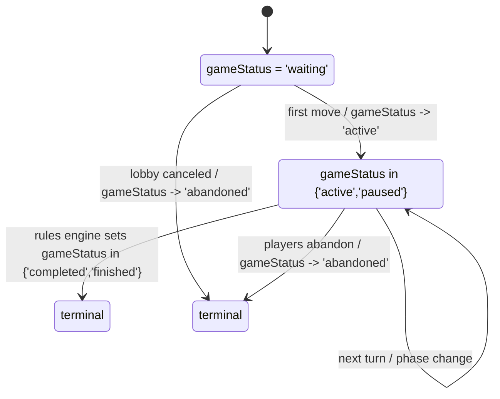
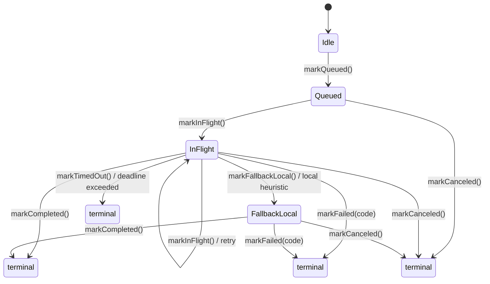
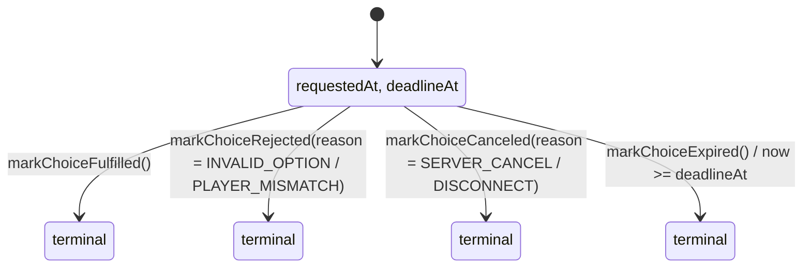
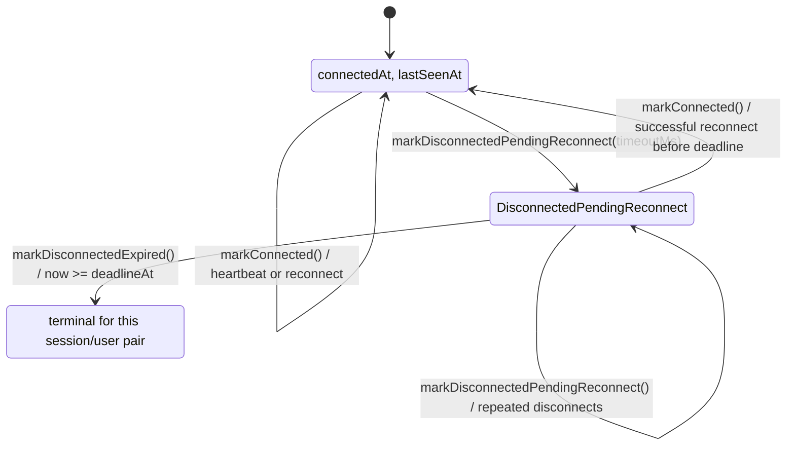

# Shared State Machines: Session, AI, Choice, Connection

> **Doc Status (2025-11-27): Active (architecture/state overview, non-semantics)**  
> Overview of the shared state machines used to orchestrate game sessions, AI requests, player choices, and WebSocket connections. These machines are **derived lifecycle views** over the canonical rules and lifecycle SSoTs; they do not redefine rules semantics or transport contracts.
>
> **Upstream SSoTs:**  
> • **Rules semantics SSoT:** canonical rules spec (`RULES_CANONICAL_SPEC.md` together with `../rules/COMPLETE_RULES.md` / `../rules/COMPACT_RULES.md`) as the single source of truth for rules semantics, with the shared TS engine under `src/shared/engine/**` + contracts and vectors (`tests/fixtures/contract-vectors/v2/**`, `tests/contracts/contractVectorRunner.test.ts`, `ai-service/tests/contracts/test_contract_vectors.py`) as its primary executable implementation.  
> • **Lifecycle/API SSoT:** `docs/CANONICAL_ENGINE_API.md` + shared types and schemas (`src/shared/types/game.ts`, `src/shared/engine/orchestration/types.ts`, `src/shared/types/websocket.ts`, `src/shared/validation/websocketSchemas.ts`).
>
> **Role of this doc:** explain how the shared state machines in `src/shared/stateMachines/**` project these SSoTs into small, explicit lifecycle models that are used by hosts/adapters (backend, client sandbox, Python AI service) and tests.

**Related docs:**

- `DOCUMENTATION_INDEX.md` (narrative index – this doc lives under "Architecture & topology" / "Lifecycle")
- `ARCHITECTURE_ASSESSMENT.md`, `ARCHITECTURE_REMEDIATION_PLAN.md` (overall architecture and remediation tracks)
- `RULES_ENGINE_ARCHITECTURE.md`, `RULES_IMPLEMENTATION_MAPPING.md`, `RULES_SCENARIO_MATRIX.md`, `docs/RULES_ENGINE_SURFACE_AUDIT.md`
- `docs/STRICT_INVARIANT_SOAKS.md`, `docs/PYTHON_PARITY_REQUIREMENTS.md`, `AI_ARCHITECTURE.md`
- Test meta-docs: `tests/README.md`, `tests/TEST_LAYERS.md`, `tests/TEST_SUITE_PARITY_PLAN.md`

---

## 1. Overview: What These State Machines Are (and Are Not)

RingRift exposes several **shared state machines** under `src/shared/stateMachines/**` that model lifecycle concerns which sit **on top of** the canonical rules and lifecycle SSoTs:

- `gameSession.ts` – session-level projection of `GameState` (waiting/active/terminal/abandoned).
- `aiRequest.ts` – lifecycle for a single AI move request (queued/in-flight/completed/failed/etc.).
- `choice.ts` – lifecycle for a single `PlayerChoice` (pending/fulfilled/rejected/canceled/expired).
- `connection.ts` – lifecycle for a player’s WebSocket connection to a game (connected/disconnected).

**Key properties:**

- They are **pure, dependency-light TypeScript models**, intentionally host-agnostic.
- They are **derived views** over upstream SSoTs:
  - They use `GameState` and `Move`/choice types from `src/shared/types/game.ts` and the orchestrator.
  - They align with the lifecycle semantics in `docs/CANONICAL_ENGINE_API.md` and WebSocket schemas.
- They are exercised by focused Jest tests and used by hosts/adapters:
  - Backend: `src/server/game/GameSession.ts`, `src/server/websocket/server.ts`, `src/server/game/ai/AIEngine.ts`, `src/server/game/WebSocketInteractionHandler.ts`.
  - Client sandbox: `src/client/contexts/GameContext.tsx`, hooks, and sandbox modules.
  - Python AI service: indirectly via WebSocket/API behaviour and parity tests.

> When editing these state machines, treat **rules semantics** and **API contracts** as fixed constraints. Changes here must not silently contradict the shared engine or `CANONICAL_ENGINE_API` – instead, they should reflect or clarify the existing lifecycle.

---

## 2. Game Session Lifecycle (`gameSession.ts`)

**File:** `src/shared/stateMachines/gameSession.ts`  
**Primary backend usage:** `src/server/game/GameSession.ts` (internal session orchestration)  
**Key tests:** `tests/unit/GameSession.gameSessionStatus.test.ts`

### 2.1 State model

The `GameSessionStatus` projection provides a small, intent-focused view of a game session, derived purely from the canonical `GameState` and (optionally) a `GameResult`:

```ts
// Live vs terminal status aliases
export type LiveGameStatus = Extract<GameStatus, 'waiting' | 'active' | 'paused'>;
export type TerminalGameStatus = Extract<GameStatus, 'completed' | 'finished' | 'abandoned'>;

export interface WaitingForPlayersSession {
  kind: 'waiting_for_players';
  gameId: string;
  status: Extract<GameStatus, 'waiting'>;
}

export interface ActiveTurnSession {
  kind: 'active_turn';
  gameId: string;
  status: Extract<GameStatus, 'active' | 'paused'>;
  currentPlayer: number;
  phase: GamePhase;
}

export interface CompletedSession {
  kind: 'completed';
  gameId: string;
  status: Extract<GameStatus, 'completed' | 'finished'>;
  result?: GameResult | undefined;
}

export interface AbandonedSession {
  kind: 'abandoned';
  gameId: string;
  status: Extract<GameStatus, 'abandoned'>;
  result?: GameResult | undefined;
}

export type GameSessionStatus =
  | WaitingForPlayersSession
  | ActiveTurnSession
  | CompletedSession
  | AbandonedSession;
```

`deriveGameSessionStatus(state: GameState, result?: GameResult)` is a **side‑effect‑free** helper that maps from canonical `GameState` to one of the four variants.

### 2.2 Transitions (derived from `GameState`)

The session lifecycle does **not** introduce independent status – it re-labels `GameState.gameStatus` and attaches minimal extra context for orchestration (current player, phase, result):



Invariants:

- `kind` and `status` are always consistent (e.g. `kind === 'active_turn'` implies `status ∈ {'active','paused'}`).
- Session state is **derived**, never manually mutated; hosts recompute it from `GameState` as needed.

### 2.3 Tests and hosts

- `tests/unit/GameSession.gameSessionStatus.test.ts` stubs `GameSession`’s `gameEngine.getGameState` and verifies that:
  - `waiting` → `waiting_for_players`.
  - `active` → `active_turn` with the correct `currentPlayer` and `phase`.
  - `abandoned` + `GameResult` → `abandoned` with `result` snapshot.
- `src/server/game/GameSession.ts` uses this projection to:
  - Expose a small session snapshot to WebSocket handlers.
  - Drive timers and AI orchestration decisions without exposing full `GameState` payloads.

Session lifecycles also act as **cancellation roots** for long‑lived async
operations linked to a game:

- `GameSession` maintains a per‑session `CancellationSource` created via
  `createCancellationSource()` from `src/shared/utils/cancellation.ts`.
- AI turns derive their time budgets and cancellation behaviour from this
  source:
  - `maybePerformAITurn` passes `sessionCancellationSource.token` into
    `getAIMoveWithTimeout`, which in turn threads it through
    `globalAIEngine.getAIMove` → `AIServiceClient.getAIMove`.
  - When `GameSession.terminate(reason)` is called (for example due to
    abnormal shutdown or account deletion), the session token is canceled
    first, causing any subsequent AI requests to be cooperatively aborted
    before hitting the network.
  - The `AIRequestState` machine remains the authoritative record of
    per‑request outcomes (`completed`, `timed_out`, `failed`, `canceled`);
    session‑level cancellation simply prevents new work from being started
    after termination.

---

## 3. AI Request Lifecycle (`aiRequest.ts`)

**File:** `src/shared/stateMachines/aiRequest.ts`  
**Primary backend usage:** `src/server/game/GameSession.ts`, `src/server/game/ai/AIEngine.ts`  
**Key tests:** `tests/unit/GameSession.aiRequestState.test.ts`, `tests/unit/AIWebSocketResilience.test.ts`, `tests/unit/AIServiceClient.concurrency.test.ts`

### 3.1 State model

`AIRequestState` models a single AI move request lifecycle, including queuing, retries, timeouts, local fallbacks, and terminal outcomes:

```ts
export type AIRequestTerminalCode = AIServiceErrorCode | 'AI_SERVICE_OVERLOADED';

export type AIRequestState =
  | { kind: 'idle' }
  | { kind: 'queued'; requestedAt: number; timeoutMs?: number }
  | {
      kind: 'in_flight';
      requestedAt: number;
      lastAttemptAt: number;
      attempt: number;
      deadlineAt?: number;
    }
  | { kind: 'fallback_local'; requestedAt: number; lastAttemptAt: number }
  | { kind: 'completed'; completedAt: number; latencyMs?: number }
  | {
      kind: 'timed_out';
      requestedAt: number;
      completedAt: number;
      durationMs: number;
      attempt: number;
    }
  | {
      kind: 'failed';
      completedAt: number;
      code: AIRequestTerminalCode;
      aiErrorType?: string | undefined;
      durationMs?: number;
    }
  | {
      kind: 'canceled';
      completedAt: number;
      reason: AIRequestCancelReason | string;
      durationMs?: number;
    };
```

Helpers:

- `idleAIRequest` – initial state.
- Guards: `isTerminalState`, `isCancelable`, `isDeadlineExceeded`, `getTerminalKind`.
- Transitions: `markQueued`, `markInFlight`, `markFallbackLocal`, `markCompleted`, `markTimedOut`, `markFailed`, `markCanceled`.

### 3.2 Transitions



Invariants and semantics:

- `requestedAt` is preserved across retries and fallbacks for accurate latency measurement.
- `attempt` counts only `in_flight` attempts; timeouts/terminal states record which attempt failed.
- `AI_SERVICE_OVERLOADED` is a synthetic terminal code capturing orchestration failures (for example remote + fallback moves both rejected by rules engine).

### 3.3 Tests and hosts

- `tests/unit/GameSession.aiRequestState.test.ts` simulates AI turns within `GameSession` by:
  - Stubbing `globalAIEngine` (`getAIMove`, `getLocalFallbackMove`).
  - Stubbing `rulesFacade.applyMove` to accept or reject moves.
  - Verifying that successful service-backed moves yield `kind === 'completed'`.
  - Verifying that service + local fallback rejection yields `kind === 'failed'` with `code === 'AI_SERVICE_OVERLOADED'` and an `aiErrorType`.
- `tests/unit/AIServiceClient.concurrency.test.ts` and `tests/unit/AIWebSocketResilience.test.ts` exercise how AI requests behave under concurrency, timeouts, and service failures.

> The AI request machine is **downstream of** the canonical rules SSoT: it never changes which moves are legal, only how the host behaves when orchestrating AI turns (timeouts, fallbacks, metrics).

### 3.4 Timeouts & Cancellation integration

Two shared utilities underpin the timeout/cancellation behaviour used by
`AIRequestState` and its hosts:

- `src/shared/utils/cancellation.ts` – defines `CancellationToken` and
  `CancellationSource` primitives plus `createLinkedCancellationSource` for
  deriving child tokens from a parent session token.
- `src/shared/utils/timeout.ts` – defines `runWithTimeout`, which wraps an
  async operation and returns a structured result
  (`{ kind: 'ok' | 'timeout' | 'canceled', durationMs, value? }`) instead of
  throwing on timeout.

`GameSession.getAIMoveWithTimeout` composes these pieces as follows:

- Uses `runWithTimeout` around `globalAIEngine.getAIMove(...)` with an explicit
  `timeoutMs` derived from configuration (`aiRequestTimeoutMs`).
- On `kind === 'timeout'`, raises a synthetic timeout error that the
  `AIRequestState` machine maps to `kind === 'timed_out'` via `markTimedOut`.
- On `kind === 'canceled'`, surfaces a cancellation-specific error that can be
  used to transition to `kind === 'canceled'` when a parent session token is
  canceled.

Hosts that adopt `CancellationToken` for long‑lived operations (for example
game sessions or WebSocket lifecycles) are expected to:

- Create a parent `CancellationSource` for the session.
- Derive per‑request child sources via `createLinkedCancellationSource`.
- Check `token.throwIfCanceled()` at appropriate boundaries inside async
  workflows (AI turns, WebSocket handlers) so that cooperative cancellation
  transitions `AIRequestState` into the `canceled` terminal state when needed.

---

## 4. Player Choice Lifecycle (`choice.ts`)

**File:** `src/shared/stateMachines/choice.ts`  
**Primary backend usage:** `src/server/game/WebSocketInteractionHandler.ts`, `src/server/websocket/server.ts`  
**Key tests:** `tests/unit/WebSocketInteractionHandler.test.ts`, `tests/unit/GameSession.decisionPhaseTimeout.test.ts`, `tests/unit/WebSocketServer.connectionState.test.ts`

### 4.1 State model

`ChoiceStatus` tracks the lifecycle of a single `PlayerChoice` (for example line reward selection, territory decision, or AI line reward choice routed via the AI service):

```ts
export type ChoiceRejectionReason = 'INVALID_OPTION' | 'PLAYER_MISMATCH';
export type ChoiceCancelReason = 'SERVER_CANCEL' | 'DISCONNECT';

export type ChoiceStatus =
  | {
      kind: 'pending';
      gameId: string;
      choiceId: string;
      playerNumber: number;
      choiceType?: PlayerChoiceType;
      requestedAt: number;
      deadlineAt: number;
    }
  | {
      kind: 'fulfilled';
      gameId: string;
      choiceId: string;
      playerNumber: number;
      choiceType?: PlayerChoiceType;
      completedAt: number;
    }
  | {
      kind: 'rejected';
      gameId: string;
      choiceId: string;
      playerNumber: number;
      choiceType?: PlayerChoiceType;
      completedAt: number;
      reason: ChoiceRejectionReason;
    }
  | {
      kind: 'canceled';
      gameId: string;
      choiceId: string;
      playerNumber: number;
      choiceType?: PlayerChoiceType;
      completedAt: number;
      reason: ChoiceCancelReason;
    }
  | {
      kind: 'expired';
      gameId: string;
      choiceId: string;
      playerNumber: number;
      choiceType?: PlayerChoiceType;
      requestedAt: number;
      deadlineAt: number;
      completedAt: number;
    };
```

Helpers:

- `makePendingChoiceStatus(choice, timeoutMs, now)` – creates a pending choice with `deadlineAt = now + timeoutMs`.
- `markChoiceFulfilled`, `markChoiceRejected`, `markChoiceCanceled`, `markChoiceExpired`.

### 4.2 Transitions



Diagnostics:

- `requestedAt`, `deadlineAt`, and `completedAt` allow instrumentation of choice latency and timeout behaviour.
- The machine is **transport-agnostic** – it can be driven by WebSocket messages, HTTP endpoints, or future transports as long as they honour the canonical API in `docs/CANONICAL_ENGINE_API.md`.

### 4.3 WebSocket integration & CancellationToken threading

The WebSocket flow for player choices and AI-backed decisions composes the
`ChoiceStatus` machine with shared timeout/cancellation helpers:

- `src/server/game/WebSocketInteractionHandler.ts`:
  - Creates a `ChoiceStatus` via `makePendingChoiceStatus` when emitting
    `player_choice_required`.
  - Schedules a Node timer for the choice deadline; on expiry it:
    - Transitions the status to `expired` via `markChoiceExpired`.
    - Rejects the pending Promise, which callers (e.g. `GameSession`) map
      into decision auto-resolution and metrics.
  - On disconnect or explicit server cancel, calls
    `cancelAllChoicesForPlayer`, using `markChoiceCanceled` with
    `reason: 'DISCONNECT'` / `'SERVER_CANCEL'`.
- `src/server/websocket/server.ts`:
  - On reconnection window expiry (`handleReconnectionTimeout`), calls
    `session.getInteractionHandler().cancelAllChoicesForPlayer(...)`
    before invoking abandonment handling. This keeps the choice state
    machine in sync with the connection state machine.

For AI-backed choice flows (line rewards, ring elimination, region order),
the backend also threads `CancellationToken` through the AI service client:

- `AIEngine.getAIMove` and the AI choice helpers pass an optional
  `{ token?: CancellationToken }` into `AIServiceClient` methods.
- `AIServiceClient` performs cooperative pre-flight cancellation via
  `options?.token?.throwIfCanceled(...)` before touching the network. When a
  higher-level host cancels the token (for example via a per-request
  `CancellationSource` tied to a WebSocket or session lifecycle), these
  calls are short-circuited locally and no HTTP request is issued.

---

## 5. Player Connection Lifecycle (`connection.ts`)

**File:** `src/shared/stateMachines/connection.ts`  
**Primary backend usage:** `src/server/websocket/server.ts`, `src/server/game/GameSession.ts`  
**Key tests:** `tests/unit/WebSocketServer.connectionState.test.ts`, `tests/unit/GameSession.decisionPhaseTimeout.test.ts`, `tests/integration/GameReconnection.test.ts`, `tests/integration/AIResilience.test.ts`

### 5.1 State model

`PlayerConnectionState` represents a single user’s WebSocket connection to a game, with explicit handling of reconnection windows:

```ts
export type PlayerConnectionState =
  | {
      kind: 'connected';
      gameId: string;
      userId: string;
      playerNumber?: number;
      connectedAt: number;
      lastSeenAt: number;
    }
  | {
      kind: 'disconnected_pending_reconnect';
      gameId: string;
      userId: string;
      playerNumber: number;
      disconnectedAt: number;
      deadlineAt: number;
    }
  | {
      kind: 'disconnected_expired';
      gameId: string;
      userId: string;
      playerNumber: number;
      disconnectedAt: number;
      expiredAt: number;
    };
```

Helpers:

- `markConnected(gameId, userId, playerNumber, previous, now)` – preserves `connectedAt` across reconnects, bumps `lastSeenAt`.
- `markDisconnectedPendingReconnect(previous, gameId, userId, playerNumber, timeoutMs, now)` – starts or extends a reconnection window.
- `markDisconnectedExpired(previous, gameId, userId, playerNumber, now)` – marks the reconnection window as expired.

### 5.2 Transitions



This model is used to:

- Decide when a player should be treated as truly gone vs. briefly disconnected.
- Drive decision/turn timeouts and forfeits in `GameSession` and WebSocket handlers.
- Feed observability (metrics on disconnect rates, reconnection success, and timeouts).

### 5.3 WebSocket integration and tests

On the backend, `WebSocketServer` drives this state machine in three places:

- `handleJoinGame` – calls `markConnected` whenever a player joins or successfully reconnects, and emits `player_joined` or `player_reconnected` to the room.
- `handleDisconnect` – calls `markDisconnectedPendingReconnect` with the configured reconnection window (`WS_RECONNECTION_TIMEOUT_MS`) and schedules `handleReconnectionTimeout`.
- `handleReconnectionTimeout` – calls `markDisconnectedExpired` and asks the interaction handler to `cancelAllChoicesForPlayer` so stale decisions cannot block the game.

The concrete connect → disconnect → reconnect behaviour is exercised by:

- `tests/unit/WebSocketServer.connectionState.test.ts` – asserts:
  - `connected → disconnected_pending_reconnect → connected` on successful reconnect before the deadline.
  - Emission of a `player_reconnected` event to the game room when the player returns within the window.
  - `connected → disconnected_pending_reconnect → disconnected_expired` when the reconnection window elapses, including cleanup of pending choices via the interaction handler.

---

## 6. Tests & Coverage Map

This section lists key tests that validate the state machines and their integration with hosts/adapters. It is **illustrative**, not exhaustive; see `tests/README.md` and `tests/TEST_LAYERS.md` for the full test taxonomy.

### 6.1 Game session

- `tests/unit/GameSession.gameSessionStatus.test.ts` – unit coverage for `deriveGameSessionStatus` via `GameSession`.
- `tests/integration/GameReconnection.test.ts`, `tests/integration/GameSession.aiDeterminism.test.ts`, `tests/integration/GameSession.aiFatalFailure.test.ts` – integration flows that rely on stable session/connection semantics.

### 6.2 AI request

- `tests/unit/GameSession.aiRequestState.test.ts` – verifies AI request state transitions for service success, fallbacks, and terminal failures.
- `tests/unit/AIServiceClient.concurrency.test.ts` – concurrency and timeout behaviour for AI requests.
- `tests/unit/AIWebSocketResilience.test.ts`, `tests/integration/AIResilience.test.ts` – resilience under AI service outages, timeouts, and reconnects.

### 6.3 Player choice

- `tests/unit/WebSocketInteractionHandler.test.ts` – decision handling, including invalid choices, timeouts, and cancellations.
- `tests/unit/GameSession.decisionPhaseTimeout.test.ts` – how choice/decision timeouts interact with session and connection state.
- `tests/unit/GameEngine.lines.scenarios.test.ts` – AI-assisted choice flows (line reward) crossing WebSocket and AI-service boundaries.

- `tests/unit/WebSocketServer.connectionState.test.ts` – explicit tests of `PlayerConnectionState` behaviour in the WebSocket server.
- `tests/unit/GameContext.reconnect.test.tsx`, `tests/integration/LobbyRealtime.test.ts`, `tests/integration/GameReconnection.test.ts`, `tests/unit/client/BackendGameHost.test.tsx`, `tests/e2e/multiplayer.e2e.spec.ts` – client and server reconnection flows, including host-level UX for reconnect banners, abandonment, spectator mode, and rematch handshakes.

If you add new states or transitions, add or update focused unit tests in the relevant `tests/unit/**` files and, where appropriate, cross-host integration tests under `tests/integration/**` and `tests/e2e/**`.

---

### 6.5 Frontend host mapping: reconnect, spectators, rematch

While this document focuses on **shared, host-agnostic state machines**, the client hosts map those machines into concrete UX flows. The key mappings for Wave&nbsp;2.2 are:

#### 6.5.1 Reconnection window and abandonment

Backend semantics are governed by `PlayerConnectionState` (see §5):

- `connected` – player has an active WebSocket; heartbeats keep `lastSeenAt` fresh.
- `disconnected_pending_reconnect` – backend has observed a disconnect and started a reconnection window (`deadlineAt`), but the player may still return.
- `disconnected_expired` – reconnection window elapsed; the session treats the player as gone and may transition the game to `abandoned`.

The React client maps this as follows:

- `GameContext` (`src/client/contexts/GameContext.tsx`) wraps `SocketGameConnection` and exposes:
  - `connectionStatus ∈ {'connecting','connected','reconnecting','disconnected'}`.
  - `lastHeartbeatAt` (ms since epoch) for staleness detection.
  - `disconnectedOpponents: DisconnectedPlayer[]` – opponents currently in `disconnected_pending_reconnect`.
  - `gameEndedByAbandonment: boolean` – derived from `victoryState?.reason === 'abandonment'`.
- `useGameConnection` (`src/client/hooks/useGameConnection.ts`) projects these into:
  - Health flags (`isHealthy`, `isStale`, `isDisconnected`) and a human-readable `statusLabel`.
  - Connection actions (`connectToGame`, `disconnect`).

`BackendGameHost` (`src/client/pages/BackendGameHost.tsx`) consumes this projection to drive reconnect UX:

- While `connectionStatus !== 'connected'` but a `game_state` snapshot is present, it shows a non-modal reconnection banner:
  - `connecting` → “Connecting to game server…”.
  - `reconnecting` → “Connection lost. Attempting to reconnect…”.
  - `disconnected` → “Disconnected from server. Moves are paused.”

- `disconnectedOpponents.length > 0` → an orange “waiting for opponent to reconnect” banner.
- When the backend marks the game as `abandoned` (via `game_over` with `GameResult.reason === 'abandonment'`), `GameContext` sets `gameEndedByAbandonment = true`. The host shows a red “Game ended by abandonment. A player failed to reconnect within the allowed time.” banner and treats the game as terminal.

Decision and timer consistency across reconnects:

- Any fresh `game_state` payload from the backend is treated as **authoritative**:
  - `onGameState` in `GameContext`:
    - Replaces `gameState` and `validMoves`.
    - Clears any stale decision UI: `pendingChoice = null`, `choiceDeadline = null`, `decisionPhaseTimeoutWarning = null`.
    - Stores the latest `decisionAutoResolved` metadata from the diff summary (if present).

- `usePendingChoice` and `useDecisionCountdown` (`src/client/hooks/useDecisionCountdown.ts`) then recompute client-side countdowns for the active choice based on:
  - The fresh `choiceDeadline`.
  - Any `decision_phase_timeout_warning` events that arrive after reconnect.
- `BackendGameHost` passes the reconciled `effectiveTimeRemainingMs` and `isServerCapped` flags into both:
  - `GameHUD` (for high-level “time pressure” cues).
  - `ChoiceDialog` (for the per-decision countdown and auto-resolve hints).

These behaviours are exercised end-to-end by:

- `tests/unit/GameSession.reconnectDuringDecision.test.ts` (backend decision-timeout and reconnect semantics).
- `tests/unit/WebSocketServer.connectionState.test.ts` (connection-state transitions).
- `tests/unit/client/BackendGameHost.test.tsx` (host-level reconnect banners, abandonment flags, and decision/timer consistency).
- `tests/e2e/multiplayer.e2e.spec.ts` (multi-browser reconnect flows).

#### 6.5.2 Spectator join/leave and read-only semantics

Spectators do **not** participate in `PlayerConnectionState` as players; they attach as observers:

- They join via a dedicated route: `/spectate/:gameId` → `GamePage` → `BackendGameHost`.
- On the client, `BackendGameHost` computes:
  - `isPlayer = gameState.players.some(p => p.id === user?.id)`.
  - `isSpectator = !isPlayer`.

- Spectator behaviour is enforced at multiple layers:
  - UI:
    - `GameHUD` receives `isSpectator` via the `HUDViewModel` and shows a prominent “Spectator Mode” banner and spectator count.
    - `BoardView` receives `isSpectator={true}` and hides/blocks interactive controls.
    - The selection panel renders “Moves disabled while spectating.”.
    - A small “Spectating” chip and “Back to lobby” button in `BackendGameHost` allow clean exit.
  - Actions:
    - `useGameActions` (`src/client/hooks/useGameActions.ts`) gates **all** move and decision dispatchers on the viewer being a real player:

      ```ts
      const isPlayer =
        !!user &&
        Array.isArray((gameState as any).players) &&
        (gameState as any).players.some((p: any) => p.id === user.id || p.userId === user.id);

      if (!isPlayer) {
        console.warn('submitMove called by spectator – ignoring');
        return;
      }
      ```

    - The same check is applied to `respondToChoice`. Spectators may still send chat.

- Leaving as a spectator:
  - Pressing “Back to lobby” navigates to `/lobby`. The route change unmounts `BackendGameHost`, whose connection shell (`useBackendConnectionShell`) calls `disconnect()` on cleanup, closing the underlying WebSocket.
  - No dangling `GameSession` is left: spectators never acquire a `playerNumber` or influence abandonment timers.

Key coverage:

- `tests/unit/hooks/useGameActions.test.tsx` – verifies that spectators:
  - Cannot submit moves or decisions (handlers are not called).
  - See capabilities `canSubmitMove = false`, `canRespondToChoice = false`, `canSendChat = true`.
- `tests/unit/client/BackendGameHost.test.tsx` – verifies spectator HUD and evaluation panel behaviour.
- `tests/e2e/multiplayer.e2e.spec.ts` – “Spectator can watch an ongoing game with read-only HUD and leave back to lobby”:
  - Joins via `/spectate/:gameId`.
  - Asserts spectator HUD, read-only message, and clean navigation back to lobby.

#### 6.5.3 Post-game rematch vs back-to-lobby

Rematch is modelled as a **new game session**, not a mutation of the existing one:

- Backend:
  - Uses explicit `rematch_request` / `rematch_response` WebSocket events (see `docs/CANONICAL_ENGINE_API.md` §3.9.x).
  - On acceptance, creates a fresh `GameSession` with a new `gameId` and emits a `rematch_response` containing `status: 'accepted'` and `newGameId`.

- Client mapping:
  - `SocketGameConnection` (`src/client/services/GameConnection.ts`) wires:
    - Outgoing `requestRematch()` → `rematch_request`.
    - Outgoing `respondToRematch(requestId, accept)` → `rematch_respond`.
    - Incoming `rematch_requested` / `rematch_response` → `GameEventHandlers` callbacks.
  - `GameContext` tracks:
    - `pendingRematchRequest: RematchRequestPayload | null`.
    - `rematchGameId: string | null` – set on `status === 'accepted'`.
    - `rematchLastStatus ∈ {'accepted' | 'declined' | 'expired' | null}`.
  - `BackendGameHost`:
    - Observes `rematchGameId` and navigates to `/game/:rematchGameId` when set. This unmounts the old host, calls `disconnect()`, and then reconnects to the new session via the route’s `:gameId`.
    - Derives a `RematchStatus` view model passed into `VictoryModal` so both sides see pending/accepted/declined/expired status.

- Victory modal actions:
  - “Request Rematch” → `GameContext.requestRematch()` → emits `rematch_request`.
  - “Accept” / “Decline” → `GameContext.acceptRematch` / `declineRematch` → emits `rematch_respond`.
  - “Return to Lobby” → navigates to `/lobby`, tearing down the WebSocket via `disconnect()` on unmount.

Coverage:

- Backend lifecycle: `tests/integration/FullGameFlow.test.ts`, `tests/e2e/game-flow.e2e.spec.ts` (rematch semantics and session creation).
- Frontend:
  - `tests/unit/client/BackendGameHost.test.tsx` – verifies rematch view-model wiring and that a new `gameId` causes host navigation.
  - `tests/e2e/multiplayer.e2e.spec.ts` – “Rematch flow: winner requests rematch and opponent accepts”:
    - Uses a near-victory fixture to reach a terminal state.
    - Player 1 requests rematch; Player 2 accepts.
    - Asserts both clients navigate to a **new** `/game/:id` and see a reset HUD and move log.
  - Another E2E slice verifies that “Return to Lobby” from the victory modal:
    - Navigates back to `/lobby`.
    - Leaves no stale game view or connection.

Together, these mappings ensure that:

- Reconnection honours the backend reconnection window and abandonment semantics.
- Spectators remain strictly read-only and can leave without affecting player sessions.
- Rematch always produces a new `GameSession` and WebSocket connection, avoiding leaks of choices, timers, or session IDs.

## 7. Guidance for Changes & Extensions

---

## 7. Guidance for Changes & Extensions

1. **Treat rules and lifecycle SSoTs as constraints.**
   - If a desired state transition seems to contradict `docs/CANONICAL_ENGINE_API.md` or the shared engine contracts, update those SSoTs first – not this doc alone.

2. **Maintain host-agnostic, shared logic.**
   - New state machines or variants should live under `src/shared/stateMachines/**` and avoid backend-specific dependencies.
   - Backend components (`GameSession`, WebSocket server), client sandbox, and Python AI adapters should **consume** these models rather than duplicate lifecycle logic.

3. **Keep machines small and explicit.**
   - Prefer a handful of well-named states with clear semantics over large, implicit flag sets spread across hosts.
   - Use dedicated reason codes (`AIRequestTerminalCode`, `ChoiceRejectionReason`, etc.) rather than overloading generic error strings.

4. **Back every change with tests.**
   - Unit tests for each state machine under `tests/unit/**`.
   - Integration tests where host orchestration or cross-host parity is involved.

5. **Document host/adaptor usage, not new semantics.**
   - When extending behaviour (for example new AI failure modes, new decision types), update:
     - This doc (to describe the state machine shape and transitions), and
     - The relevant architecture/AI docs to explain **how hosts use** the machine.
   - Do **not** redefine rules semantics or WebSocket message contracts here – those live in the SSoTs referenced at the top.
