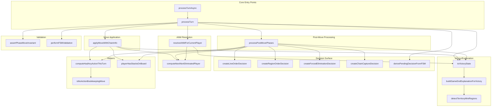

# Turn Orchestrator Modularization Study

**Date:** 2025-12-25  
**File:** [`src/shared/engine/orchestration/turnOrchestrator.ts`](../../src/shared/engine/orchestration/turnOrchestrator.ts)  
**Current Size:** 3,927 LOC  
**Status:** Analysis Complete

---

## Executive Summary

The `turnOrchestrator.ts` file (3,927 LOC) is the largest file in the shared engine and is a strong candidate for modularization. This study analyzes its structure, identifies extraction candidates, and proposes a phased decomposition plan that could reduce the file to approximately 1,500-2,000 LOC while maintaining full backward compatibility and TS/Python parity.

Prior successful decompositions in this codebase:

- **SandboxGameHost:** 3,779 → 1,922 LOC (49% reduction)
- **BackendGameHost:** 2,125 → 1,114 LOC (48% reduction)

**Projected reduction:** 50-60% (to approximately 1,500-2,000 LOC)

---

## 1. Function Inventory

### 1.1 Exported Functions (Public API)

| Function                                                                                      | Lines     | LOC  | Responsibility                                 |
| --------------------------------------------------------------------------------------------- | --------- | ---- | ---------------------------------------------- |
| [`processTurn`](../../src/shared/engine/orchestration/turnOrchestrator.ts:1419)               | 1419-1980 | ~560 | Main synchronous entry point                   |
| [`processTurnAsync`](../../src/shared/engine/orchestration/turnOrchestrator.ts:3256)          | 3256-3333 | ~77  | Async turn processing with decision resolution |
| [`validateMove`](../../src/shared/engine/orchestration/turnOrchestrator.ts:3351)              | 3351-3426 | ~75  | Move validation                                |
| [`getValidMoves`](../../src/shared/engine/orchestration/turnOrchestrator.ts:3452)             | 3452-3784 | ~332 | Enumerate valid moves per phase                |
| [`hasValidMoves`](../../src/shared/engine/orchestration/turnOrchestrator.ts:3789)             | 3789-3791 | ~3   | Check if player has moves                      |
| [`toVictoryState`](../../src/shared/engine/orchestration/turnOrchestrator.ts:412)             | 412-454   | ~42  | Convert victory to structured state            |
| [`__test_only_toVictoryState`](../../src/shared/engine/orchestration/turnOrchestrator.ts:461) | 461-463   | ~3   | Test-only wrapper                              |
| [`applyMoveForReplay`](../../src/shared/engine/orchestration/turnOrchestrator.ts:3915)        | 3915-3927 | ~13  | Lower-level replay application                 |

### 1.2 Internal Functions (Private)

| Function                                                                                               | Lines     | LOC  | Responsibility Group  |
| ------------------------------------------------------------------------------------------------------ | --------- | ---- | --------------------- |
| **ProcessingStateContainer class**                                                                     | 172-239   | ~68  | State Container       |
| [`createProcessingState`](../../src/shared/engine/orchestration/turnOrchestrator.ts:245)               | 245-264   | ~20  | State Container       |
| [`computeNextNonEliminatedPlayer`](../../src/shared/engine/orchestration/turnOrchestrator.ts:286)      | 286-309   | ~24  | Turn Rotation         |
| [`computeSInvariant`](../../src/shared/engine/orchestration/turnOrchestrator.ts:319)                   | 319-321   | ~3   | State Resolution      |
| [`resolveANMForCurrentPlayer`](../../src/shared/engine/orchestration/turnOrchestrator.ts:334)          | 334-399   | ~65  | ANM Resolution        |
| [`buildGameEndExplanationForVictory`](../../src/shared/engine/orchestration/turnOrchestrator.ts:471)   | 471-792   | ~321 | Victory/Explanation   |
| [`toPlayerId`](../../src/shared/engine/orchestration/turnOrchestrator.ts:794)                          | 794-796   | ~3   | Victory/Explanation   |
| [`createScoreBreakdown`](../../src/shared/engine/orchestration/turnOrchestrator.ts:798)                | 798-810   | ~13  | Victory/Explanation   |
| [`deriveShortSummaryKey`](../../src/shared/engine/orchestration/turnOrchestrator.ts:812)               | 812-830   | ~19  | Victory/Explanation   |
| [`deriveUxCopyKeys`](../../src/shared/engine/orchestration/turnOrchestrator.ts:840)                    | 840-890   | ~50  | Victory/Explanation   |
| [`hasForcedEliminationMove`](../../src/shared/engine/orchestration/turnOrchestrator.ts:901)            | 901-909   | ~9   | Victory/Explanation   |
| [`detectTerritoryMiniRegions`](../../src/shared/engine/orchestration/turnOrchestrator.ts:941)          | 941-976   | ~36  | Mini-region Detection |
| [`parsePositionKey`](../../src/shared/engine/orchestration/turnOrchestrator.ts:981)                    | 981-988   | ~8   | Mini-region Detection |
| [`groupIntoConnectedRegions`](../../src/shared/engine/orchestration/turnOrchestrator.ts:997)           | 997-1039  | ~43  | Mini-region Detection |
| [`getTerritoryNeighborsForMiniRegion`](../../src/shared/engine/orchestration/turnOrchestrator.ts:1046) | 1046-1089 | ~44  | Mini-region Detection |
| [`createLineOrderDecision`](../../src/shared/engine/orchestration/turnOrchestrator.ts:1098)            | 1098-1110 | ~13  | Decision Creation     |
| [`createRegionOrderDecision`](../../src/shared/engine/orchestration/turnOrchestrator.ts:1115)          | 1115-1149 | ~35  | Decision Creation     |
| [`createForcedEliminationDecision`](../../src/shared/engine/orchestration/turnOrchestrator.ts:1161)    | 1161-1214 | ~54  | Decision Creation     |
| [`createChainCaptureDecision`](../../src/shared/engine/orchestration/turnOrchestrator.ts:1219)         | 1219-1228 | ~10  | Decision Creation     |
| [`derivePendingDecisionFromFSM`](../../src/shared/engine/orchestration/turnOrchestrator.ts:1242)       | 1242-1337 | ~95  | FSM Integration       |
| [`applyMoveWithChainInfo`](../../src/shared/engine/orchestration/turnOrchestrator.ts:2001)             | 2001-2465 | ~464 | Move Application      |
| [`assertPhaseMoveInvariant`](../../src/shared/engine/orchestration/turnOrchestrator.ts:2493)           | 2493-2502 | ~10  | Validation            |
| [`performFSMValidation`](../../src/shared/engine/orchestration/turnOrchestrator.ts:2561)               | 2561-2627 | ~67  | FSM Validation        |
| [`emitFSMValidationEvent`](../../src/shared/engine/orchestration/turnOrchestrator.ts:2540)             | 2540-2549 | ~10  | FSM Validation        |
| [`processPostMovePhases`](../../src/shared/engine/orchestration/turnOrchestrator.ts:2649)              | 2649-3231 | ~582 | Post-Move Processing  |
| [`didCurrentTurnIncludeRecoverySlide`](../../src/shared/engine/orchestration/turnOrchestrator.ts:3233) | 3233-3244 | ~12  | Helper                |
| [`computeHadAnyActionThisTurn`](../../src/shared/engine/orchestration/turnOrchestrator.ts:3799)        | 3799-3838 | ~40  | Helper                |
| [`playerHasStacksOnBoard`](../../src/shared/engine/orchestration/turnOrchestrator.ts:3844)             | 3844-3851 | ~8   | Helper                |
| [`isNoActionBookkeepingMove`](../../src/shared/engine/orchestration/turnOrchestrator.ts:3875)          | 3875-3888 | ~14  | Helper                |

---

## 2. Responsibility Groupings

### 2.1 Group A: Victory & Game End Explanation (~500 LOC)

**Functions:**

- `toVictoryState` (42 LOC)
- `buildGameEndExplanationForVictory` (321 LOC)
- `toPlayerId` (3 LOC)
- `createScoreBreakdown` (13 LOC)
- `deriveShortSummaryKey` (19 LOC)
- `deriveUxCopyKeys` (50 LOC)
- `hasForcedEliminationMove` (9 LOC)
- `detectTerritoryMiniRegions` (36 LOC)
- `parsePositionKey` (8 LOC)
- `groupIntoConnectedRegions` (43 LOC)
- `getTerritoryNeighborsForMiniRegion` (44 LOC)

**Characteristics:**

- **Independence:** HIGH - mostly pure functions using only GameState
- **Cohesion:** HIGH - all related to victory/game-end explanation
- **External Dependencies:** Low (uses `evaluateVictory` from VictoryAggregate, `getWeirdStateReasonForType`)
- **Parity Risk:** LOW - explanation is TS-only UX concern

**Extraction Viability:** ⭐⭐⭐⭐⭐ EXCELLENT

### 2.2 Group B: Decision Surface Creation (~220 LOC)

**Functions:**

- `createLineOrderDecision` (13 LOC)
- `createRegionOrderDecision` (35 LOC)
- `createForcedEliminationDecision` (54 LOC)
- `createChainCaptureDecision` (10 LOC)
- `derivePendingDecisionFromFSM` (95 LOC)

**Characteristics:**

- **Independence:** MEDIUM - uses GameState and aggregate enumerators
- **Cohesion:** HIGH - all decision creation logic
- **External Dependencies:** Uses TerritoryAggregate, CaptureAggregate enumerators
- **Parity Risk:** LOW - decision surface is TS-only concept

**Extraction Viability:** ⭐⭐⭐⭐ VERY GOOD

### 2.3 Group C: Move Application (~465 LOC)

**Functions:**

- `applyMoveWithChainInfo` (464 LOC)

**Characteristics:**

- **Independence:** LOW - heavily integrated with all move types
- **Cohesion:** HIGH - single large switch statement
- **External Dependencies:** Uses all domain aggregates (Placement, Movement, Capture, Line, Territory)
- **Parity Risk:** HIGH - must match Python `GameEngine.apply_move`

**Extraction Viability:** ⭐⭐⭐ GOOD (with careful parity testing)

### 2.4 Group D: ANM Resolution (~90 LOC)

**Functions:**

- `computeSInvariant` (3 LOC)
- `resolveANMForCurrentPlayer` (65 LOC)
- `computeNextNonEliminatedPlayer` (24 LOC)

**Characteristics:**

- **Independence:** MEDIUM - uses globalActions, VictoryAggregate
- **Cohesion:** HIGH - all ANM/elimination resolution
- **Parity Risk:** HIGH - must match Python ANM semantics

**Extraction Viability:** ⭐⭐⭐ GOOD (with parity tests)

### 2.5 Group E: FSM Validation (~80 LOC)

**Functions:**

- `assertPhaseMoveInvariant` (10 LOC)
- `performFSMValidation` (67 LOC)
- `emitFSMValidationEvent` (10 LOC)

**Characteristics:**

- **Independence:** HIGH - delegates to FSMAdapter
- **Cohesion:** HIGH - all FSM validation
- **Parity Risk:** LOW - validation is TS-specific

**Extraction Viability:** ⭐⭐⭐⭐ VERY GOOD

### 2.6 Group F: Post-Move Phase Processing (~600 LOC)

**Functions:**

- `processPostMovePhases` (582 LOC)
- `didCurrentTurnIncludeRecoverySlide` (12 LOC)

**Characteristics:**

- **Independence:** LOW - core orchestration logic with many dependencies
- **Cohesion:** MEDIUM - handles lines, territory, chain captures, victory
- **Parity Risk:** CRITICAL - must match Python phase_machine.py

**Extraction Viability:** ⭐⭐ MODERATE (high parity risk)

### 2.7 Group G: Valid Moves Enumeration (~340 LOC)

**Functions:**

- `getValidMoves` (332 LOC)
- `hasValidMoves` (3 LOC)
- Helper enumerators

**Characteristics:**

- **Independence:** HIGH - uses aggregate enumerators
- **Cohesion:** HIGH - all move enumeration
- **Parity Risk:** HIGH - must match Python legal move enumeration

**Extraction Viability:** ⭐⭐⭐ GOOD (with contract tests)

### 2.8 Group H: Processing State Container (~90 LOC)

**Functions:**

- `ProcessingStateContainer` class (68 LOC)
- `createProcessingState` (20 LOC)

**Characteristics:**

- **Independence:** HIGH - self-contained mutable state wrapper
- **Cohesion:** HIGH - single purpose
- **Parity Risk:** NONE - internal TS structure

**Extraction Viability:** ⭐⭐⭐⭐⭐ EXCELLENT

### 2.9 Group I: Utility Helpers (~65 LOC)

**Functions:**

- `computeHadAnyActionThisTurn` (40 LOC)
- `playerHasStacksOnBoard` (8 LOC)
- `isNoActionBookkeepingMove` (14 LOC)

**Characteristics:**

- **Independence:** HIGH - pure helper functions
- **Cohesion:** HIGH - turn state helpers
- **Parity Risk:** MEDIUM - must match Python action detection

**Extraction Viability:** ⭐⭐⭐⭐ VERY GOOD

---

## 3. Coupling Analysis

### 3.1 External Dependencies (Imports)

```mermaid
graph TD
    TO[turnOrchestrator.ts] --> GT[game.ts types]
    TO --> GEE[gameEndExplanation.ts]
    TO --> WSR[weirdStateReasons.ts]
    TO --> CORE[core.ts]
    TO --> GA[globalActions.ts]
    TO --> FSM[fsm module]
    TO --> PA[PlacementAggregate]
    TO --> MA[MovementAggregate]
    TO --> CA[CaptureAggregate]
    TO --> LA[LineAggregate]
    TO --> TA[TerritoryAggregate]
    TO --> VA[VictoryAggregate]
    TO --> RA[RecoveryAggregate]
    TO --> SSH[swapSidesHelpers]
    TO --> ERR[errors/CanonicalRecordError]
    TO --> LEG[legacy/legacyReplayHelper]
    TO --> LMT[legacy/legacyMoveTypes]
```



### 3.2 External Consumers (Exports)

| Consumer                                                                                  | Imports Used                                                                 |
| ----------------------------------------------------------------------------------------- | ---------------------------------------------------------------------------- |
| [`SandboxOrchestratorAdapter.ts`](../../src/client/sandbox/SandboxOrchestratorAdapter.ts) | `processTurn`, `processTurnAsync`, `getValidMoves`, `toVictoryState` + types |
| [`TurnEngineAdapter.ts`](../../src/server/game/turn/TurnEngineAdapter.ts)                 | `processTurn`, `processTurnAsync`, `hasValidMoves` + types                   |
| [`sandboxHistoryManager.ts`](../../src/client/sandbox/sandboxHistoryManager.ts)           | `applyMoveForReplay`                                                         |
| [`replayHelpers.ts`](../../src/shared/engine/replayHelpers.ts)                            | `processTurn` + types                                                        |
| [`FSMAdapter.ts`](../../src/shared/engine/fsm/FSMAdapter.ts)                              | `getValidMoves`, `validateMove`                                              |
| [`orchestration/index.ts`](../../src/shared/engine/orchestration/index.ts)                | All public exports                                                           |

### 3.3 Internal Coupling Diagram



---

## 4. Extraction Candidates

### 4.1 Priority 1: Victory & Explanation (RECOMMENDED)

**New File:** `victoryExplanation.ts` (~500 LOC extracted)

**Functions to Extract:**

- `toVictoryState` (export)
- `buildGameEndExplanationForVictory`
- `toPlayerId`
- `createScoreBreakdown`
- `deriveShortSummaryKey`
- `deriveUxCopyKeys`
- `hasForcedEliminationMove`
- `detectTerritoryMiniRegions`
- `parsePositionKey`
- `groupIntoConnectedRegions`
- `getTerritoryNeighborsForMiniRegion`

**Scoring:**
| Criterion | Score | Notes |
|-----------|-------|-------|
| Independence | 5/5 | Pure functions, minimal deps |
| Cohesion | 5/5 | All victory/explanation logic |
| Size | 4/5 | ~500 LOC worth extracting |
| Test Coverage | 5/5 | Extensive tests in victoryExplanation.\*.test.ts |
| Parity Risk | 5/5 | TS-only UX concern |
| **Total** | **24/25** | **EXCELLENT** |

### 4.2 Priority 2: Decision Surface Creation

**New File:** `decisionSurface.ts` (~220 LOC extracted)

**Functions to Extract:**

- `createLineOrderDecision`
- `createRegionOrderDecision`
- `createForcedEliminationDecision`
- `createChainCaptureDecision`
- `derivePendingDecisionFromFSM`

**Scoring:**
| Criterion | Score | Notes |
|-----------|-------|-------|
| Independence | 4/5 | Uses aggregate enumerators |
| Cohesion | 5/5 | All decision creation |
| Size | 3/5 | ~220 LOC |
| Test Coverage | 4/5 | Well tested |
| Parity Risk | 5/5 | TS-only concept |
| **Total** | **21/25** | **VERY GOOD** |

### 4.3 Priority 3: Move Application

**New File:** `moveApplication.ts` (~465 LOC extracted)

**Functions to Extract:**

- `applyMoveWithChainInfo`

**Scoring:**
| Criterion | Score | Notes |
|-----------|-------|-------|
| Independence | 2/5 | Large switch, many imports |
| Cohesion | 5/5 | Single responsibility |
| Size | 5/5 | ~465 LOC |
| Test Coverage | 4/5 | Well tested via contract vectors |
| Parity Risk | 2/5 | Must match Python apply_move |
| **Total** | **18/25** | **GOOD** |

### 4.4 Priority 4: ANM Resolution

**New File:** `anmResolution.ts` (~90 LOC extracted)

**Functions to Extract:**

- `computeSInvariant`
- `resolveANMForCurrentPlayer`
- `computeNextNonEliminatedPlayer`

**Scoring:**
| Criterion | Score | Notes |
|-----------|-------|-------|
| Independence | 3/5 | Uses globalActions, VictoryAggregate |
| Cohesion | 5/5 | All ANM logic |
| Size | 2/5 | ~90 LOC |
| Test Coverage | 4/5 | Has dedicated tests |
| Parity Risk | 2/5 | Critical for TS/Python parity |
| **Total** | **16/25** | **GOOD** |

### 4.5 Priority 5: Valid Moves Enumeration

**New File:** `validMoves.ts` (~340 LOC extracted)

**Functions to Extract:**

- `getValidMoves`
- `hasValidMoves`
- `validateMove` (deprecated)

**Scoring:**
| Criterion | Score | Notes |
|-----------|-------|-------|
| Independence | 4/5 | Uses aggregate enumerators |
| Cohesion | 5/5 | All move enumeration |
| Size | 4/5 | ~340 LOC |
| Test Coverage | 5/5 | Extensive tests |
| Parity Risk | 3/5 | Must match Python legal moves |
| **Total** | **21/25** | **VERY GOOD** |

### 4.6 Priority 6: Processing State Container

**New File:** `processingState.ts` (~90 LOC extracted)

**Functions to Extract:**

- `ProcessingStateContainer` class
- `createProcessingState`

**Scoring:**
| Criterion | Score | Notes |
|-----------|-------|-------|
| Independence | 5/5 | Self-contained |
| Cohesion | 5/5 | Single purpose |
| Size | 2/5 | ~90 LOC (small) |
| Test Coverage | 3/5 | Implicitly tested |
| Parity Risk | 5/5 | TS-only internal |
| **Total** | **20/25** | **VERY GOOD** |

### 4.7 NOT RECOMMENDED for Extraction

**`processPostMovePhases` (~582 LOC)**

- **Reason:** This is the core orchestration logic with heavy coupling to all other functions
- **Risk:** Extracting would create circular dependencies
- **Alternative:** Keep as the "orchestrator core" after other extractions

---

## 5. Phased Decomposition Plan

### Phase 1: Low-Risk Extractions (Week 1)

**Goal:** Extract ~700 LOC with minimal parity risk

1. **Create `victoryExplanation.ts`** (~500 LOC)
   - All victory/explanation functions
   - Update imports in turnOrchestrator.ts
   - Run existing tests to verify

2. **Create `decisionSurface.ts`** (~220 LOC)
   - All decision creation functions
   - Clear interface boundary

**Expected Result:** turnOrchestrator.ts reduced to ~3,200 LOC

### Phase 2: Medium-Risk Extractions (Week 2)

**Goal:** Extract ~430 LOC with controlled parity risk

1. **Create `validMoves.ts`** (~340 LOC)
   - Move enumeration functions
   - Run contract vector tests

2. **Create `processingState.ts`** (~90 LOC)
   - ProcessingStateContainer class
   - createProcessingState function

**Expected Result:** turnOrchestrator.ts reduced to ~2,770 LOC

### Phase 3: Higher-Risk Extractions (Week 3)

**Goal:** Extract ~555 LOC with parity testing

1. **Create `moveApplication.ts`** (~465 LOC)
   - applyMoveWithChainInfo function
   - Run full TS/Python parity suite

2. **Create `anmResolution.ts`** (~90 LOC)
   - ANM resolution functions
   - Run canonical parity tests

**Expected Result:** turnOrchestrator.ts reduced to ~2,215 LOC

### Phase 4: Consolidation (Week 4)

**Goal:** Final cleanup and optimization

1. Review remaining ~2,200 LOC core orchestrator
2. Consider extracting FSM validation functions (~80 LOC)
3. Consider extracting utility helpers (~65 LOC)
4. Update documentation and re-export via index.ts

**Expected Final Result:** turnOrchestrator.ts reduced to ~1,500-2,000 LOC

---

## 6. File Structure

### Current State (Phase 1 Complete)

```
src/shared/engine/
├── victoryExplanation.ts         # ✅ CREATED: Victory & game-end explanation (700 LOC)
└── orchestration/
    ├── index.ts                  # Public API re-exports (updated)
    ├── turnOrchestrator.ts       # Core orchestration (3,284 LOC, reduced from 3,927)
    └── types.ts                  # Shared types (unchanged)
```

### Proposed Future State (After All Phases)

```
src/shared/engine/
├── victoryExplanation.ts         # ✅ Victory & game-end explanation (~700 LOC)
└── orchestration/
    ├── index.ts                  # Public API re-exports
    ├── turnOrchestrator.ts       # Core orchestration (~1,500-2,000 LOC)
    ├── decisionSurface.ts        # Decision creation (~220 LOC)
    ├── validMoves.ts             # Move enumeration (~340 LOC)
    ├── moveApplication.ts        # Move application logic (~465 LOC)
    ├── anmResolution.ts          # ANM & elimination resolution (~90 LOC)
    ├── processingState.ts        # State container (~90 LOC)
    └── types.ts                  # Shared types (unchanged)
```

---

## 7. Risk Assessment

### 7.1 Python Parity Risks

| Risk                        | Severity | Mitigation                                               |
| --------------------------- | -------- | -------------------------------------------------------- |
| Move application divergence | HIGH     | Run `check_ts_python_replay_parity.py` after each change |
| ANM resolution mismatch     | HIGH     | Contract vector tests for ANM scenarios                  |
| Valid moves disagreement    | MEDIUM   | Cross-validate with Python legal move enumerator         |
| Phase transition bugs       | HIGH     | Keep processPostMovePhases as monolith initially         |

### 7.2 Contract Test Risks

| Risk                   | Severity | Mitigation                            |
| ---------------------- | -------- | ------------------------------------- |
| Broken exports         | LOW      | TypeScript will catch at compile time |
| Semantic changes       | MEDIUM   | Existing test suite covers behavior   |
| Performance regression | LOW      | Monitor S-invariant processing times  |

### 7.3 Circular Dependency Risks

| Risk                                    | Severity | Mitigation                         |
| --------------------------------------- | -------- | ---------------------------------- |
| victoryExplanation ↔ turnOrchestrator   | LOW      | Clear unidirectional dependency    |
| decisionSurface ↔ FSMAdapter            | MEDIUM   | Use interface injection pattern    |
| moveApplication ↔ processPostMovePhases | HIGH     | Keep in same file or use callbacks |

### 7.4 Testing Continuity

The following test files must pass after each phase:

**Critical (run after every change):**

- `tests/unit/turnOrchestrator.*.test.ts` (6 files)
- `tests/contracts/contractVectorRunner.test.ts`
- `tests/scenarios/*.contractVectors.test.ts`

**Parity (run after Phase 3):**

- `ai-service/scripts/check_ts_python_replay_parity.py`
- `ai-service/scripts/check_canonical_phase_history.py`

---

## 8. Success Metrics

| Metric                | Current | Target      | Measurement                 |
| --------------------- | ------- | ----------- | --------------------------- |
| Main file LOC         | 3,927   | 1,500-2,000 | `wc -l turnOrchestrator.ts` |
| Cyclomatic complexity | High    | Medium      | ESLint complexity rule      |
| Test pass rate        | 100%    | 100%        | Jest test suite             |
| Parity divergence     | 0       | 0           | Python parity script        |
| Circular dependencies | 0       | 0           | madge or similar            |

---

## 9. Recommendations

### 9.1 Proceed with Extraction

The analysis strongly supports modularization with the following priorities:

1. **Immediate Win:** Extract `victoryExplanation.ts` - zero parity risk, ~500 LOC reduction
2. **Quick Follow-up:** Extract `decisionSurface.ts` and `processingState.ts`
3. **Careful Extraction:** Extract `validMoves.ts` with contract test validation
4. **Last:** Extract `moveApplication.ts` and `anmResolution.ts` with full parity testing

### 9.2 What to Keep Together

Keep `processTurn`, `processTurnAsync`, and `processPostMovePhases` in the main file. These are the core orchestration functions with the highest coupling and parity sensitivity.

### 9.3 Implementation Order

Following the ClientSandboxEngine and BackendGameHost patterns:

1. Create new module files with extracted functions
2. Add re-exports in index.ts to maintain backward compatibility
3. Update internal imports in turnOrchestrator.ts
4. Run full test suite
5. Proceed to next extraction only after all tests pass

---

## 10. Appendix: LOC Distribution

```
Total: 3,927 LOC

Victory/Explanation:     500 LOC (12.7%)
Decision Surface:        220 LOC ( 5.6%)
Move Application:        465 LOC (11.8%)
Valid Moves:             340 LOC ( 8.7%)
Post-Move Processing:    600 LOC (15.3%)
ANM Resolution:           90 LOC ( 2.3%)
Processing State:         90 LOC ( 2.3%)
Core processTurn:        560 LOC (14.3%)
processTurnAsync:         80 LOC ( 2.0%)
FSM Validation:           80 LOC ( 2.0%)
Helpers:                  65 LOC ( 1.7%)
Imports/Types/Comments:  837 LOC (21.3%)
```

**Extractable:** ~1,750 LOC (44.5%)  
**Core to Keep:** ~1,340 LOC (34.1%)  
**Overhead:** ~837 LOC (21.3%)

---

_This study was prepared following the modularization patterns established in AGENTS.md and lessons learned from SandboxGameHost and BackendGameHost decompositions._
