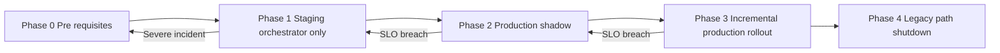

# Orchestrator Rollout Phases (Historical)

This file preserves the historical environment/phase rollout matrix and operator checklists
previously embedded in `docs/architecture/ORCHESTRATOR_ROLLOUT_PLAN.md`. It is **not** an
operational playbook; refer to the current posture summary and runbooks for live guidance.

## 8. Environment rollout phases and SLO gating (Historical reference)

> **Historical only:** The phase presets below reference `ORCHESTRATOR_ROLLOUT_PERCENTAGE`
> and shadow-mode settings that no longer exist. Current production runs with
> the orchestrator always on and `RINGRIFT_RULES_MODE=ts`; use
> `RINGRIFT_RULES_MODE=python` only for explicit parity diagnostics.

The implementation phases in §5 focus on **code structure** (making adapters
canonical and fencing legacy helpers). This section defines complementary
**environment rollout phases** that describe how orchestrator‑first is enabled,
baked in, and eventually made the only production rules path, using the SLOs
from §6 as gates.

### 8.1 Phase map (summary)

| Phase                              | Environment posture                                          | Typical environment    | Key SLO gates                                                                | Primary rollback target                                           |
| ---------------------------------- | ------------------------------------------------------------ | ---------------------- | ---------------------------------------------------------------------------- | ----------------------------------------------------------------- |
| 0 – Pre‑requisites                 | Legacy or mixed, orchestrator available but not relied on    | CI, dev, early staging | `SLO-CI-ORCH-PARITY`, `SLO-CI-ORCH-SHORT-SOAK` green                         | N/A (baseline)                                                    |
| 1 – Staging‑only orchestrator      | Staging uses orchestrator for all games                      | Staging                | `SLO-STAGE-ORCH-ERROR`, `SLO-STAGE-ORCH-PARITY`, `SLO-STAGE-ORCH-INVARIANTS` | Phase 0 (disable orchestrator in staging)                         |
| 2 – Production shadow              | Legacy engine authoritative, orchestrator running in shadow  | Production             | `SLO-PROD-RULES-PARITY` (no new incidents), shadow mismatch rate near zero   | Phase 1 (keep staging orchestrator‑only, turn off shadow in prod) |
| 3 – Incremental production rollout | Orchestrator authoritative for a slice of production traffic | Production             | `SLO-PROD-ORCH-ERROR`, `SLO-PROD-ORCH-INVARIANTS`, `SLO-PROD-RULES-PARITY`   | Phase 2 or Phase 1 depending on severity                          |
| 4 – Legacy path shutdown           | Orchestrator is the only production rules path               | Staging and production | All SLOs stable over multiple windows                                        | Phase 3 (feature‑flag rollback only)                              |



#### 8.1.1 Environment and flag presets by phase

The tables below give **concrete env/flag presets** for the most common
orchestrator rollout postures. They are not an exhaustive matrix, but are
intended as **canonical examples** that should be reflected in:

- `.env` / deployment configuration for each environment
- CI job `env:` blocks in [`.github/workflows/ci.yml`](../../.github/workflows/ci.yml:1)
- Operator expectations in the rollout runbook

> On any conflict between these tables and live CI configs or env validation
> code, **code + CI configs win** and this section must be updated.
> These presets are exercised by automated tests in
> `tests/unit/env.config.test.ts` (env parsing) and
> `tests/unit/OrchestratorRolloutService.test.ts` (rollout decisions), which
> act as executable examples for this table.

**Table 4 – Canonical env/flag presets (by environment & phase)**

| Profile                                          | Typical environment / usage                                            | `NODE_ENV`                  | `RINGRIFT_APP_TOPOLOGY`      | `RINGRIFT_RULES_MODE`                        | `ORCHESTRATOR_ADAPTER_ENABLED` | `ORCHESTRATOR_ROLLOUT_PERCENTAGE` | `ORCHESTRATOR_SHADOW_MODE_ENABLED`  | Notes                                                                                                                                                                                                               |
| ------------------------------------------------ | ---------------------------------------------------------------------- | --------------------------- | ---------------------------- | -------------------------------------------- | ------------------------------ | --------------------------------- | ----------------------------------- | ------------------------------------------------------------------------------------------------------------------------------------------------------------------------------------------------------------------- |
| **Local dev – orchestrator‑ON**                  | Developer machines (`npm run dev`, `npm test`)                         | `development` (default)     | `single` (default)           | `ts` (or unset → resolved by `getRulesMode`) | `true` (default)               | `100` (default)                   | `false` (default)                   | Shared TS engine + adapters are canonical; legacy/sandbox legacy paths are diagnostics‑only.                                                                                                                        |
| **CI – orchestrator‑ON profile**                 | Jest/unit/integration/parity soaks, except legacy lanes                | `test` (effective via Jest) | `single` (default)           | `ts`                                         | `true`                         | `100`                             | `false`                             | Matches the `env:` blocks in `test`, `ts-rules-engine`, `ts-orchestrator-parity`, `ts-parity`, `ts-integration`, `orchestrator-soak-smoke`, `orchestrator-short-soak`, `orchestrator-parity`, and `e2e-tests` jobs. |
| **Staging Phase 0 – pre‑requisites**             | Early staging when orchestrator is available but not yet authoritative | `staging`                   | `multi-sticky` (recommended) | `ts` or `shadow` (for diagnostics)           | `true`                         | `0–100` (deployment‑specific)     | `false` or `true` (for experiments) | Used while SLO‑CI gates and dashboards are being wired. Legacy paths may still handle some traffic; orchestrator is exercised mostly via CI and targeted staging tests.                                             |
| **Staging Phase 1 – orchestrator‑only**          | Staging steady‑state for gating promotion to prod                      | `staging`                   | `multi-sticky`               | `ts`                                         | `true`                         | `100`                             | `false`                             | Canonical **staging orchestrator‑only** posture from §8.3. Legacy pipelines must not handle staging traffic.                                                                                                        |
| **Prod Phase 2 – legacy authoritative + shadow** | Production shadow/mirroring                                            | `production`                | `multi-sticky`               | `shadow`                                     | `true`                         | `0` (or very low)                 | `true`                              | Legacy engine remains authoritative, orchestrator runs in shadow. Rollout percentage typically `0` while shadow is evaluated; may be raised carefully for experiments.                                              |
| **Prod Phase 3 – incremental rollout**           | Production orchestrator‑authoritative slice                            | `production`                | `multi-sticky`               | `ts`                                         | `true`                         | `1–99`                            | `false` (preferred)                 | Orchestrator is authoritative for the configured fraction of traffic. Shadow is usually disabled to avoid double‑compute overhead during ramp‑up.                                                                   |
| **Prod Phase 4 – orchestrator‑only**             | Production steady‑state after legacy shutdown                          | `production`                | `multi-sticky`               | `ts`                                         | `true`                         | `100`                             | `false`                             | Legacy backend/sandbox pipelines are removed or quarantined as diagnostics‑only per §§5.4–5.5.                                                                                                                      |

These presets are intentionally **minimal**:

- They do **not** encode all environment variables required for deployment
  (database URLs, Redis, JWT secrets, etc. are validated elsewhere via
  `EnvSchema` and `unified.ts`).
- They instead focus on the **orchestrator‑relevant knobs** and their
  recommended combinations, so that:
  - CI jobs use a consistent orchestrator‑ON profile.
  - Staging and production phases can be mapped directly to concrete flag
    values when following the rollout runbook.

#### 8.1.2 Phase 2 – Production Preview `.env.production` template (P18.4-4)

For **Phase 2 – Production Preview**, use the following baseline in `.env.production` (or equivalent deployment configuration) for the API service:

```bash
# P18.4-4 Phase 2 – Production Preview (limited-scope orchestrator rollout)
RINGRIFT_RULES_MODE=ts
ORCHESTRATOR_ADAPTER_ENABLED=true

# Start small (1–5%) and only increase after preview SLOs are met (§6.1.1)
ORCHESTRATOR_ROLLOUT_PERCENTAGE=5

# Shadow is normally disabled during Production Preview; use Phase 2 (Prod shadow)
# with ORCHESTRATOR_ROLLOUT_PERCENTAGE=0 and RINGRIFT_RULES_MODE=shadow
# if you need an additional shadow-only warmup before enabling preview traffic.
ORCHESTRATOR_SHADOW_MODE_ENABLED=false
```

- **Invariant:** `RINGRIFT_RULES_MODE` must be `ts` for Production Preview; legacy TS pipelines remain diagnostics-only and routing is controlled via `ORCHESTRATOR_ADAPTER_ENABLED` and `ORCHESTRATOR_ROLLOUT_PERCENTAGE`.
- Operators who want an extra parity warmup can briefly re-enter **Prod Phase 2 – legacy authoritative + shadow** (Table 4) before enabling preview, using:
  - `ORCHESTRATOR_ADAPTER_ENABLED=true`
  - `ORCHESTRATOR_ROLLOUT_PERCENTAGE=0`
  - `ORCHESTRATOR_SHADOW_MODE_ENABLED=true`
  - `RINGRIFT_RULES_MODE=shadow`

For implementation details of how `NODE_ENV`, topology, and rules mode are
parsed and enforced, see:

- `src/server/config/env.ts` (Zod `EnvSchema`, `NodeEnvSchema`, `AppTopologySchema`, `RulesModeSchema`)
- `src/server/config/unified.ts` (assembled `config.app.topology`, `config.orchestrator`, and `config.featureFlags.orchestrator`)
- `src/shared/utils/envFlags.ts` (`getRulesMode` and helpers)

### 8.2 Phase 0 – Pre‑requisites

**Preconditions**

- Implementation Phases A and B are functionally complete enough that:
  - Backend and sandbox can run fully via `TurnEngineAdapter` and
    `SandboxOrchestratorAdapter`.
  - Legacy rules pipelines exist only as test/diagnostics scaffolding.
- CI SLOs are enforced:
  - `SLO-CI-ORCH-PARITY` and `SLO-CI-ORCH-SHORT-SOAK` are wired into CI
    (or into a pre‑release pipeline) and must be green for any release
    candidate.
- **Weakest Aspect Gates (PASS18):**
  - **Capture/Territory Host Parity:** All suites listed in §6.5 under "Capture & Territory Host Parity" are green.
  - **AI RNG Parity:** All suites listed in §6.5 under "AI RNG Parity" are green.
  - **Decision Lifecycles:** Decision-phase timeout and reconnect tests (P18.8-DEBUG scope) are green.
- Python contract vectors and parity suites are green.

**Observability requirements**

Before moving beyond Phase 0, the following must exist:

- Dashboards that show, at minimum:
  - Orchestrator error rate and circuit‑breaker status.
  - Orchestrator rollout percentage and shadow mismatch rate.
  - Game move latency and key HTTP/availability/error SLOs.
  - Rules‑parity metrics for TS↔Python.
- Alerts configured as in
  [`monitoring/prometheus/alerts.yml`](../../monitoring/prometheus/alerts.yml:1)
  for:
  - `OrchestratorCircuitBreakerOpen`
  - `OrchestratorErrorRateWarning`
  - `OrchestratorShadowMismatches`
  - `RulesParity*` mismatches.

**SLO checks and gating**

- A release may proceed out of Phase 0 only if:
  - CI SLOs are met for the candidate commit.
  - No open P0/P1 incidents related to rules parity or orchestrator invariant
    violations remain.

**Rollback triggers**

- Not applicable; Phase 0 is the baseline for other phases. If a later phase
  is rolled back “all the way”, the environment returns to Phase 0 posture
  (orchestrator disabled or used only for diagnostics).

### 8.3 Phase 1 – Staging‑only orchestrator

In Phase 1, the **staging environment** runs orchestrator‑first exclusively:

- `ORCHESTRATOR_ADAPTER_ENABLED=true`
- `ORCHESTRATOR_ROLLOUT_PERCENTAGE=100`
- `RINGRIFT_RULES_MODE=ts`
- Legacy rules pipelines are not used for staging traffic.

**Preconditions**

- All Phase 0 preconditions and CI SLOs hold.
- Orchestrator‑only backend and sandbox paths are stable under local and CI
  load.
- Dashboards and alerts for orchestrator metrics are live in staging.

**Observability requirements**

- Staging dashboards must show, at minimum:
  - `ringrift_orchestrator_error_rate{environment="staging"}`
  - `ringrift_orchestrator_shadow_mismatch_rate{environment="staging"}` (when
    shadow is enabled for experiments).
  - Game move latency and HTTP error‑rate breakdowns.
  - Rules‑parity metrics scoped to staging.

**SLO‑driven entry/exit criteria**

- **Entry to Phase 1 (staging orchestrator‑only):**
  - `SLO-CI-ORCH-PARITY` and `SLO-CI-ORCH-SHORT-SOAK` satisfied on the
    candidate build.
  - At least one **orchestrator HTTP/load smoke** run (`npm run load:orchestrator:smoke`)
    against the staging stack succeeds, and a **metrics/observability smoke**
    confirms that `/metrics` is exposed with orchestrator gauges
    (`tests/e2e/metrics.e2e.spec.ts` or an equivalent manual scrape).
  - A focused **host‑UX smoke** pass over the orchestrator‑ON backend and sandbox
    hosts is green (for example the `@host-ux` Playwright suites
    `tests/e2e/backendHost.host-ux.e2e.spec.ts` and
    `tests/e2e/sandboxHost.host-ux.e2e.spec.ts`), verifying that core gameplay
    flows, keyboard navigation, spectator views, and connection‑loss UX behave
    correctly with `RINGRIFT_RULES_MODE=ts`,
    `ORCHESTRATOR_ADAPTER_ENABLED=true`,
    `ORCHESTRATOR_ROLLOUT_PERCENTAGE=100`, and
    `ORCHESTRATOR_SHADOW_MODE_ENABLED=false`.
  - No active critical rules‑parity or invariant incidents.
- **Exit from Phase 1 (promotion towards production shadow or rollout):**
  - `SLO-STAGE-ORCH-ERROR`, `SLO-STAGE-ORCH-PARITY`, and
    `SLO-STAGE-ORCH-INVARIANTS` are all met for at least **24–72 hours** of
    normal staging traffic:
    - No `OrchestratorCircuitBreakerOpen` alerts in staging.
    - No new invariant or game‑status parity incidents.

**Rollback and destination**

- If staging SLOs are breached:
  - **Soft rollback:** keep orchestrator enabled but stop promoting new builds
    until the issue is fixed.
  - **Hard rollback to Phase 0:** set
    `ORCHESTRATOR_ADAPTER_ENABLED=false` in staging and redeploy a known‑good
    image that is already validated under the legacy turn pipeline. The
    `RINGRIFT_RULES_MODE` flag should remain within its supported values
    (`ts`, `python`, `shadow`) and is not used to select the legacy TS turn
    loop directly.

### 8.4 Phase 2 – Production shadow / mirroring

In Phase 2, production continues to use the **legacy rules path as
authoritative**, but the orchestrator runs in **shadow** for some or all
sessions so that results can be compared.

Typical configuration:

- `ORCHESTRATOR_ADAPTER_ENABLED=true`
- `ORCHESTRATOR_SHADOW_MODE_ENABLED=true`
- `RINGRIFT_RULES_MODE=shadow`
- `ORCHESTRATOR_ROLLOUT_PERCENTAGE` may remain 0 (no orchestrator‑authoritative
  games) while shadow runs for a configurable fraction of traffic.

**Preconditions**

- Phase 1 has been successful for at least 24–72 hours.
- Staging SLOs remain green.
- Shadow‑mode comparison logic and metrics
  (e.g. `ringrift_orchestrator_shadow_mismatch_rate`) are wired and visible
  in dashboards for both staging and production.

**Observability requirements**

- Dashboards for production must surface:
  - Shadow mismatch rate and total comparisons.
  - Orchestrator vs legacy latency comparisons.
  - Rules‑parity metrics scoped to production parity harnesses.

**SLO‑driven entry/exit criteria**

- **Entry to Phase 2:**
  - Staging SLOs green.
  - No open P0/P1 parity or invariant incidents.
- **Exit from Phase 2 (towards Phase 3 incremental rollout):**
  - Over at least **24 hours** of production shadow traffic:
    - `ringrift_orchestrator_shadow_mismatch_rate <= 0.001` and no
      `OrchestratorShadowMismatches` alerts.
    - No `RulesParityGameStatusMismatch` alerts in production.
    - Any validation/hash mismatches are understood and either fixed or
      documented as expected legacy behaviour.

**Rollback and destination**

- If shadow SLOs are breached:
  - Disable shadow mode in production
    (`ORCHESTRATOR_SHADOW_MODE_ENABLED=false`,
    `RINGRIFT_RULES_MODE=ts`) and return to Phase 1 posture (orchestrator used
    only in staging). The `RINGRIFT_RULES_MODE` flag should remain within its
    supported values (`ts`, `python`, `shadow`) and is not used to select the
    legacy TS turn loop directly; use `ORCHESTRATOR_ADAPTER_ENABLED` and
    `ORCHESTRATOR_ROLLOUT_PERCENTAGE` for legacy vs orchestrator routing.
  - Investigate under the rules‑parity runbook before re‑enabling shadow.

### 8.5 Phase 3 – Incremental production rollout

Phase 3 gradually makes the orchestrator authoritative for real production
games, controlled by `ORCHESTRATOR_ROLLOUT_PERCENTAGE`.

For **P18.4-4 – Phase 2: Production Preview**, we carve out an initial **limited-scope** stage that caps orchestrator traffic at **10% of eligible games**:

- 0% (Prod Phase 2 – shadow only, legacy authoritative)
- **1% → 5% → 10%** (Phase 2 – Production Preview, orchestrator authoritative for a small slice)

Higher percentages (for example 25% → 50% → 100%) are part of the broader Phase 3 plan but are **out of scope** for P18.4-4 and should only be attempted once Production Preview has met its success criteria (§6.1.1).

Each step in the Production Preview slice should have an observation window of at least **2–3 error‑rate windows** (e.g. 15–30 minutes) and the final 10% preview posture should run for at least **24 hours** before you consider moving beyond 10%.

**Preconditions**

- Phase 2 (production shadow) has been stable for at least 24 hours.
- `SLO-PROD-RULES-PARITY` holds (no unexplained parity incidents).
- Production dashboards and alerts for orchestrator metrics are healthy and
  frequently consulted by on‑call.
- **P18.4-3 gating – staging:** latest staging orchestrator soak and parity runs (for example `results/orchestrator_soak_staging_*.json` and `results/parity_healthcheck_staging_*.json`) show:
  - `totalInvariantViolations == 0` for the candidate image.
  - 0 contract-vector and plateau parity mismatches, including chain-capture cases.
- **PASS18 Weakest Aspect / frontend UX gating:**
  - No open P0/P1 issues in the **Weakest Aspect – Host Integration & Parity / Frontend UX** category that would be exacerbated by a small orchestrator slice (check `docs/PASS18_ASSESSMENT_REPORT.md`, `docs/PASS18_REMEDIATION_PLAN.md`, and `WEAKNESS_ASSESSMENT_REPORT.md`).
  - No open incidents referencing stuck games, move submission failures, or broken reconnect flows in production.

**Staged rollout steps – Phase 2 Production Preview (1–10%)**

For each preview percentage increase (e.g. 1% → 5% → 10%):

1. **Pre‑check SLOs, alerts, and environment**
   - Ensure there are **no active** `OrchestratorCircuitBreakerOpen`,
     `OrchestratorErrorRateWarning`, or `OrchestratorShadowMismatches`
     alerts.
   - Confirm production is currently in a non-preview posture:
     - `ORCHESTRATOR_ADAPTER_ENABLED=true`
     - `ORCHESTRATOR_ROLLOUT_PERCENTAGE=0` (or very low)
     - `RINGRIFT_RULES_MODE=ts` (preview) or `shadow` (if you are still in Phase 2 – shadow only).
   - Check:
     - `ringrift_orchestrator_error_rate` is near 0.
     - Baseline `game_move_latency_ms` p95 for move endpoints is healthy.
     - Rules-parity dashboards show no unexplained incidents.

2. **Apply the preview change**
   - Choose a target within the preview band:
     - 1% for very cautious initial rollout, or
     - 5% when risk is lower and staging/CI signals are strong.
   - Update the environment, for example:
     ```bash
     kubectl set env deployment/ringrift-api ORCHESTRATOR_ROLLOUT_PERCENTAGE=5
     ```
   - Ensure `RINGRIFT_RULES_MODE=ts` and `ORCHESTRATOR_SHADOW_MODE_ENABLED=false` for the main preview window (shadow-only warmups are handled under Phase 2, not here).

3. **Observation window**
   - Wait at least **2–3 error‑rate windows** (e.g. 15–30 minutes) with real
     traffic at the new percentage.
   - Re‑check:
     - Orchestrator error rate and HTTP 5xx share on game endpoints.
     - `game_move_latency_ms` p95/p99 for orchestrator-handled moves versus pre-preview baselines.
     - Shadow mismatch rate (only if you temporarily re-enable shadow for spot-checks).
     - Rules‑parity and game‑health dashboards.

4. **Decide to advance, hold, or roll back**
   - Advance within the preview band (e.g. 1% → 5% → 10%) **only if**:
     - `ringrift_orchestrator_error_rate` remains well below 1% with no rising trend.
     - `game_move_latency_ms` p95 remains within +10% of baseline.
     - No new invariant or rules‑parity incidents are observed.
     - No emerging user-impact signals (support tickets, incident reports) point to orchestrator.
   - Hold or roll back if any of the following occur:
     - `ringrift_orchestrator_error_rate > 0.01` (1%) for > 10 minutes.
     - `game_move_latency_ms` p95 increases by more than ~20% versus baseline or exceeds ~500ms for typical move endpoints.
     - Any new invariant or parity incident appears, or you see credible user reports of stuck/invalid games.

**Rollback and destination (preview band 1–10%)**

- **Minor SLO breach or early warning:**
  - Reduce `ORCHESTRATOR_ROLLOUT_PERCENTAGE` within the preview band (for example, from 10% back to 5%, or 5% back to 1%) but keep
    orchestrator enabled; continue monitoring until metrics stabilise.
- **Major SLO breach or incident:**
  - Immediately set:
    ```bash
    kubectl set env deployment/ringrift-api ORCHESTRATOR_ROLLOUT_PERCENTAGE=0
    ```
  - If behaviour appears clearly orchestrator-specific or user impact is severe (P0/P1):
    ```bash
    kubectl set env deployment/ringrift-api ORCHESTRATOR_ADAPTER_ENABLED=false
    ```
  - This returns production effectively to Phase 2 (shadow‑only or legacy authoritative) or Phase 1 (staging‑only orchestrator) depending on how you configure `RINGRIFT_RULES_MODE` and `ORCHESTRATOR_SHADOW_MODE_ENABLED`. Investigate under the rules-parity and game-health runbooks before re-enabling preview.

### 8.6 Phase 4 – Legacy path shutdown

In Phase 4 the orchestrator is the **only** rules path in both staging and
production; legacy pipelines are deleted or fully quarantined as diagnostics,
as described in implementation Phase C.

**Preconditions**

- `ORCHESTRATOR_ROLLOUT_PERCENTAGE=100` in production for a sustained period
  (e.g. several weeks) with:
  - `SLO-PROD-ORCH-ERROR`, `SLO-PROD-ORCH-INVARIANTS`, and
    `SLO-PROD-RULES-PARITY` all met.
  - No orchestrator‑specific P0/P1 incidents in that period.
- All critical runbooks (`ORCHESTRATOR_ROLLOUT_RUNBOOK.md`,
  `RULES_PARITY.md`, `GAME_HEALTH.md`, incident docs under
  `docs/incidents/`) have been exercised at least once under orchestrator‑ON.

**Observability and SLO checks**

- Monitoring continues as in Phase 3; the main change is that legacy
  pipelines are no longer available for low‑risk rollbacks.
- Error budgets for orchestrator‑specific SLOs must be respected more
  strictly; exceeding them may require:
  - Re‑enabling a legacy path from git history, or
  - Temporarily routing a small subset of games to a Python‑backed rules
    mirror, depending on product decisions.

**Rollback and destination**

- Once Phase 4 is reached, rollback is primarily **feature‑flag and
  deployment‑based**:
  - Reduce rollout percentage or disable the adapter if legacy code has not
    yet been physically removed.
  - If code has been deleted, rollback consists of deploying a previous
    release that still contained the legacy path (effectively returning the
    environment to Phase 3 posture).

At the end of Phase 4, orchestrator‑first is the long‑term steady state, and
legacy rules paths are treated as historical artefacts only.

### 8.7 Phase completion checklist (operator cheat sheet)

This section provides a compact, operator‑focused checklist for advancing
between environment phases. It is a summary of §§6.2–6.4 and §§8.2–8.6; on any
conflict, the detailed SLO definitions and CI configs remain authoritative.

**Before leaving Phase 0 – Pre‑requisites**

- CI gates:
  - `orchestrator-parity` job in `.github/workflows/ci.yml` is green on the
    release candidate (`SLO-CI-ORCH-PARITY`).
  - Short orchestrator soak CI lane is green (`SLO-CI-ORCH-SHORT-SOAK`).
- Observability:
  - Dashboards exist for orchestrator, rules parity, AI, and infra as described
    in `ALERTING_THRESHOLDS.md` and §6.2.
  - Orchestrator alerts (`OrchestratorErrorRateWarning`,
    `OrchestratorCircuitBreakerOpen`, `OrchestratorShadowMismatches`,
    `RulesParity*`) are deployed and routed.
- Incidents:
  - No open P0/P1 incidents involving rules parity or orchestrator invariants.

**Before leaving Phase 1 – Staging‑only orchestrator**

- Environment posture:
  - Staging uses the canonical preset from Table 4:
    - `ORCHESTRATOR_ADAPTER_ENABLED=true`
    - `ORCHESTRATOR_ROLLOUT_PERCENTAGE=100`
    - `RINGRIFT_RULES_MODE=ts`
  - Legacy rules paths are not used for staging traffic.
- SLOs (staging):
  - `SLO-STAGE-ORCH-ERROR`, `SLO-STAGE-ORCH-PARITY`, and
    `SLO-STAGE-ORCH-INVARIANTS` are met for at least 24–72 hours.
  - No `OrchestratorCircuitBreakerOpen` alerts in staging.
  - No new invariant or rules‑parity incidents in staging.
- Runbook:
  - On‑call has exercised the basic staging rollback lever at least once
    (dropping back to Phase 0 via `ORCHESTRATOR_ADAPTER_ENABLED=false`).

**Validation Tooling**

To ensure staging configuration remains compliant with Phase 1 requirements, the `scripts/validate-deployment-config.ts` script has been updated to:

1.  **Validate `.env.staging`:** Checks that `RINGRIFT_RULES_MODE=ts`, `ORCHESTRATOR_ADAPTER_ENABLED=true`, `ORCHESTRATOR_ROLLOUT_PERCENTAGE=100`, and `ORCHESTRATOR_SHADOW_MODE_ENABLED=false` are set correctly.
2.  **Validate CI Workflow:** Ensures that critical orchestrator jobs (`orchestrator-soak-smoke`, `orchestrator-short-soak`, `orchestrator-parity`) are present in `.github/workflows/ci.yml`.

Run this validation locally or in CI via:

```bash
npm run validate:deployment
```

**Before leaving Phase 2 – Production shadow**

- Environment posture:
  - Production uses the shadow preset from Table 4:
    - `ORCHESTRATOR_ADAPTER_ENABLED=true`
    - `ORCHESTRATOR_SHADOW_MODE_ENABLED=true`
    - `RINGRIFT_RULES_MODE=shadow`
    - `ORCHESTRATOR_ROLLOUT_PERCENTAGE=0` (or effectively zero).
- SLOs (production shadow):
  - Over ≥24h of shadow traffic:
    - `ringrift_orchestrator_shadow_mismatch_rate` is near zero and no
      `OrchestratorShadowMismatches` alerts fire.
    - No `RulesParityGameStatusMismatch` alerts in production.
    - Any validation/hash mismatches are triaged and either fixed or explicitly
      documented as expected legacy behaviour.
- Runbook:
  - Operators are comfortable disabling shadow mode and returning to Phase 1
    posture if needed.

**Before leaving Phase 3 – Incremental production rollout**

- Environment posture:
  - Production uses a non‑zero rollout preset from Table 4:
    - `ORCHESTRATOR_ADAPTER_ENABLED=true`
    - `RINGRIFT_RULES_MODE=ts`
    - `ORCHESTRATOR_ROLLOUT_PERCENTAGE` in the 1–99 range.
- SLOs (production rollout):
  - `SLO-PROD-ORCH-ERROR`, `SLO-PROD-ORCH-INVARIANTS`, and
    `SLO-PROD-RULES-PARITY` are met at the current percentage.
  - In each step 0→10→25→50→100%, the pre/post checks in §8.5 have been
    followed (no sustained `OrchestratorErrorRateWarning` or invariant alerts).
- Runbook:
  - On‑call has rehearsed reducing `ORCHESTRATOR_ROLLOUT_PERCENTAGE` and/or
    setting `ORCHESTRATOR_ADAPTER_ENABLED=false` in production to return to
    Phase 2/Phase 1 postures.

**Before declaring Phase 4 – Legacy path shutdown**

- Environment posture:
  - `ORCHESTRATOR_ROLLOUT_PERCENTAGE=100` in production for several weeks.
  - Any remaining legacy rules pipelines are either removed or explicitly
    fenced as diagnostics‑only per Phase C in §5.1.
- SLOs (steady state):
  - `SLO-PROD-ORCH-ERROR`, `SLO-PROD-ORCH-INVARIANTS`, and
    `SLO-PROD-RULES-PARITY` are consistently met over their 28‑day windows.
  - No orchestrator‑specific P0/P1 incidents in the same period.
- Runbooks and drills:
  - `ORCHESTRATOR_ROLLOUT_RUNBOOK.md`, `RULES_PARITY.md`, and `GAME_HEALTH.md`
    have each been exercised at least once with orchestrator authoritative.
  - Operators understand that rollback primarily consists of deploying a
    previous release that still contained the legacy path (returning the
    environment to Phase 3 posture).
