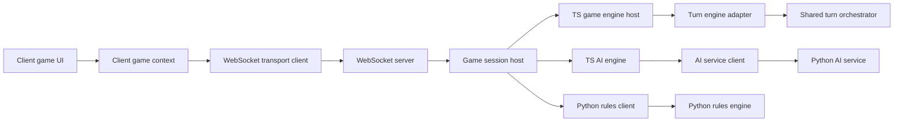

# Pass 18 – Full-Project Reassessment Report

> **⚠️ SUPERSEDED BY PASS18B** – This assessment was superseded by PASS18B on November 30, 2025.
> For current project status, see:
>
> - `CURRENT_STATE_ASSESSMENT.md` – Latest implementation status
> - `docs/PASS18B_ASSESSMENT_REPORT.md` – Most recent assessment pass
> - `docs/PASS18A_ASSESSMENT_REPORT.md` – Intermediate assessment pass

> **Assessment Date:** 2025-11-30
> **Assessment Pass:** 18 (Post-ANM Remediation & Parity Re-evaluation)
> **Assessor:** Architect mode – holistic system review

> **Doc Status (2025-11-30): Historical (superseded by PASS18B)**
> This report supersedes PASS16 and PASS17 assessments. It identifies the current weakest aspect and hardest outstanding problem following the successful remediation of Active-No-Moves (ANM) semantics and the initial consolidation of the shared rules engine.

---

## 1. Executive Summary

- **Weakest Aspect (Pass 18): TS rules/host stack for advanced phases & RNG parity.**  
  While the core rules engine is solid, the integration of advanced phases (chain captures, territory disconnection, self-elimination) into the backend and sandbox hosts remains brittle. Recent test runs reveal clusters of failures in capture sequence enumeration, territory scenarios, and RNG-aligned AI parity between sandbox and backend. This area now represents the highest risk to correctness and fairness in complex endgames.

- **Hardest Outstanding Problem: Orchestrator-first rollout execution & deep multi-engine parity.**  
  The architectural design for the orchestrator and parity framework is complete, but the operational execution remains the hardest problem. This involves:
  1.  Driving the orchestrator rollout through staging and production phases with strict SLO enforcement.
  2.  Achieving and maintaining deep semantic parity across three engines (TS shared, TS sandbox, Python) for edge-case geometries (hex) and complex multi-phase turns (lines + territory + elimination).

- **Progress since PASS17:**
  - **ANM/Termination:** The previous top risk (Active-No-Moves semantics) has been heavily remediated with canonical specs (R200–R207), invariants, and regression suites. It is no longer the weakest link.
  - **Frontend UX:** Host architecture and component quality have improved; while some copy mismatches remain (chain capture optionality), the fundamental UX is robust.
  - **AI Architecture:** The AI service and training pipeline are architecturally sound, with clear separation of concerns and a defined difficulty ladder.

---

## 2. Updated Component Scorecard (Pass 18)

| Component                       | Score (1–5) | Trend | Notes                                                                                                                                    |
| :------------------------------ | :---------: | :---: | :--------------------------------------------------------------------------------------------------------------------------------------- |
| **Rules Engine (Shared TS)**    |   **4.8**   |   ➔   | Strong core; helpers/aggregates are solid. Minor gaps in complex scenario coverage.                                                      |
| **Rules Host Integration (TS)** |   **3.5**   |   ↘   | **Weakest Area.** Failing suites in capture/territory/RNG parity indicate brittle host wiring in `GameEngine` and `ClientSandboxEngine`. |
| **Python Rules & AI**           |   **4.5**   |   ↗   | Strong architecture; parity tests are rigorous. Main gap is state-copying perf (technical debt, not correctness).                        |
| **Frontend UX & Client**        |   **4.2**   |   ↗   | Solid components. Main issues are semantic mismatches in HUD copy (chain capture, victory) vs canonical rules.                           |
| **Backend & WebSocket**         |   **4.4**   |   ➔   | Robust session management and auth. Some WebSocket type duplication remains.                                                             |
| **Docs & SSOT**                 |   **4.0**   |   ➔   | Strong structure. Some core docs (`PROJECT_GOALS`, `CURRENT_STATE`) are stale regarding test health and risk priorities.                 |
| **Ops & CI**                    |   **4.2**   |   ↗   | CI is mature. Orchestrator rollout tooling is ready but not yet fully exercised in production.                                           |

---

## 3. Weakest Aspect Analysis: TS Rules/Host Integration & Parity

### 3.1 Evidence of Weakness

- **Failing Test Clusters:** A fresh local run of `jest` reveals failures in:
  - `captureSequenceEnumeration.test.ts`: Divergence between backend and sandbox capture enumeration.
  - `RefactoredEngine.test.ts`: Issues with capture chain continuation and stack elimination.
  - `GameEngine.chainCapture*.test.ts`: Complex chain-capture enforcement logic.
  - `GameEngine.territoryDisconnection.test.ts`: Territory processing scenarios.
  - `Sandbox_vs_Backend.aiRng*.test.ts`: RNG alignment breaks between sandbox and backend AI.
- **Complexity:** The interaction between the shared engine's pure helpers and the stateful host orchestrators (`GameEngine`, `ClientSandboxEngine`) is complex, especially for multi-phase turns (move → line → territory → victory).
- **Impact:** These failures directly threaten game correctness (illegal moves allowed, legal moves rejected) and fairness (AI divergence, replay desyncs) in late-game scenarios.

### 3.2 Why it ranks #1

- **vs. ANM/Termination:** ANM is now well-specified and tested. The current failures are in _active_ play mechanics (capture, territory), which are more fundamental.
- **vs. Orchestrator Rollout:** Rollout is an operational challenge; host integration is a _correctness_ challenge. Correctness precedes deployment.
- **vs. Frontend UX:** UX issues are mostly textual/presentational; engine issues are semantic and structural.

---

## 4. Hardest Outstanding Problem: Orchestrator Rollout & Deep Parity

### 4.1 The Challenge

Moving from "design complete" to "production reality" for the orchestrator-first architecture involves:

- **Execution:** Actually running the phased rollout (Phase 1 → 4) in staging/prod environments.
- **Verification:** Using shadow mode to prove 100% parity between legacy and orchestrator paths on live traffic.
- **Deep Parity:** Extending the contract vector suite to cover the "long tail" of complex interactions (e.g., hex board territory disconnection with simultaneous line formation) where engines are most likely to diverge.

### 4.2 Why it remains hard

- **Coordination:** Requires lockstep updates across TS backend, TS client, and Python service.
- **Observability:** Requires careful monitoring of parity metrics (`ringrift_rules_parity_mismatches_total`) to detect subtle regressions.
- **Legacy Drag:** The existence of legacy code paths (even if deprecated) adds maintenance overhead and confusion until Phase 4 (Legacy Shutdown) is complete.

---

## 5. Documentation & UX Audit Findings

### 5.1 Documentation Drift (second-pass alignment)

- **`PROJECT_GOALS.md`:**
  - Now explicitly identifies **host integration & deep multi-engine parity** as the current highest-risk semantics area and orchestrator rollout as the hardest outstanding problem (see §3.4).
  - **PASS18 implication:** treat this as the SSoT for risk framing; any index or overview docs that still describe ANM/forced-elimination as the "current highest-risk" semantics area are stale and should be updated to match.

- **`CURRENT_STATE_ASSESSMENT.md`:**
  - Claims "1629+ TS tests, 245 Python tests" and "TypeScript tests: 1629+ tests passing".
  - Current local Jest results show multiple failing TS suites in advanced capture, territory, parity, and AI RNG areas, so these "all passing" statements are only historically correct.
  - **Recommended action:** emphasise the assessment date and treat the numbers as a snapshot; point readers to CI dashboards or a light-weight `CURRENT_TEST_HEALTH` note for live status.

- **`CURRENT_RULES_STATE.md`:**
  - Marks the rules engine as "Fully implemented" with "No critical known issues".
  - Given active red suites around capture enumeration, territory disconnection, and RNG parity, this is misleading even if some failures are expectation drift.
  - **Recommended action:** explicitly call out the current advanced-phase and parity issues and cross-link to [`WEAKNESS_ASSESSMENT_REPORT.md`](WEAKNESS_ASSESSMENT_REPORT.md:1) and this PASS18 report.

- **`DOCUMENTATION_INDEX.md` and `docs/INDEX.md`:**
  - Still describe [`PROJECT_GOALS.md`](PROJECT_GOALS.md:1) and [`docs/INVARIANTS_AND_PARITY_FRAMEWORK.md`](docs/INVARIANTS_AND_PARITY_FRAMEWORK.md:1) as capturing the "current highest-risk" semantics area in terms of ANM and forced-elimination invariants.
  - With [`PROJECT_GOALS.md`](PROJECT_GOALS.md:1) now updated to focus on host integration and deep multi-engine parity, these indices should be revised to either:
    - Describe ANM and forced-elimination as the **historically riskiest semantics area**, or
    - Point to this PASS18 report and [`WEAKNESS_ASSESSMENT_REPORT.md`](WEAKNESS_ASSESSMENT_REPORT.md:1) for the **current** weakest aspect and hardest problem.

- **`AI_ARCHITECTURE.md` and `RULES_ENGINE_ARCHITECTURE.md`:**
  - Both remain largely accurate regarding TS rules SSoT, orchestrator design, Python adapter role, and parity and testing strategy.
  - **Recommended action:** after PASS18, re-check any sections that still describe Python rules as permanently simplifying line or territory behaviour and ensure they either match reality or are clearly marked as historical limitations.

### 5.2 Frontend UX Mismatches

- **Chain Capture:** HUD says "continue or end turn", implying optionality. Rules require mandatory continuation.
- **Victory:** Modal says "eliminate all rings". Rules say ">50%".
- **Decision Phases:** Vague copy for line/territory decisions; doesn't clearly communicate compulsory vs. optional aspects.

---

## 6. Remediation Plan (High Level)

The detailed remediation tasks will be defined in the `PASS18-REMEDIATION-PLAN` todo list, but the strategy is:

1.  **Stabilize the Weakest Link:** Fix the failing TS host integration tests (capture enumeration, territory, RNG parity). This is P0.
2.  **Correct the Record:** Update core docs (`PROJECT_GOALS`, `CURRENT_STATE`) to reflect the current reality (ANM fixed, host parity is the new focus).
3.  **Fix UX Semantics:** Update frontend copy to match RR-CANON (mandatory chains, victory thresholds).
4.  **Push the Hardest Problem:** Define concrete next steps for Orchestrator Rollout (e.g., "Execute Phase 1 in Staging").

---

**Next Steps:** Proceed to `PASS18-WEAKNESS-DOC` update and `PASS18-REMEDIATION-PLAN` generation.

---

## 7. Second-pass refinement (PASS18-ARCH-REASSESS-2)

### 7.1 Re-validated weakest aspect

Second-pass review of the host stack and tests reinforces the first-pass conclusion: the weakest aspect remains the **TS rules and host stack for advanced phases & RNG parity**, but it is now more cleanly decomposed into three sub-streams:

1. **Capture and territory host-integration parity.**
   The shared TS orchestrator and helper aggregates are strong, but wiring into backend host [`GameEngine.ts`](src/server/game/GameEngine.ts:1), host orchestration in [`GameSession.ts`](src/server/game/GameSession.ts:1), client sandbox [`ClientSandboxEngine.ts`](src/client/sandbox/ClientSandboxEngine.ts:1), and Python adapters [`RulesBackendFacade.ts`](src/server/game/RulesBackendFacade.ts:1), [`PythonRulesClient.ts`](src/server/services/PythonRulesClient.ts:1) remains brittle for long multi-phase turns (capture → line → territory → elimination). Failing suites around capture sequence enumeration, territory disconnection, and combined line-plus-territory scenarios confirm that this integration surface is still fragile.

2. **AI RNG parity across hosts and engines.**
   [`AIEngine.ts`](src/server/game/ai/AIEngine.ts:1) and [`AIServiceClient.ts`](src/server/services/AIServiceClient.ts:1) are designed to thread deterministic seeds from `gameState.rngSeed` into both Python AI and TS local heuristics, with good unit coverage (e.g., `AIEngine.fallback` and `AIServiceClient.concurrency` tests). However, real games still rely on `Math.random()` in some host paths (for example, `GameSession.maybePerformAITurn` currently calls `getAIMove` without an explicit RNG), so sandbox vs backend AI parity and TS vs Python AI behaviour remain fragile under some conditions.

3. **Host edge semantics and decision lifecycles.**
   Decision-phase timeouts, auto-resolutions, reconnection handling, and resignation flows route through [`WebSocketInteractionHandler.ts`](src/server/game/WebSocketInteractionHandler.ts:1), [`server.ts`](src/server/websocket/server.ts:1), and [`GameSession.ts`](src/server/game/GameSession.ts:1). The design is robust and well-instrumented, but tests and docs do not yet cover all edge cases (for example, HTTP-level resignation semantics vs in-engine resignation moves), which interacts with perceived fairness and rules parity in late-game states.

Overall, this area still scores lowest on the component scorecard and remains the single weakest aspect for Pass 18.

### 7.2 Re-validated hardest outstanding problem

Second-pass analysis also confirms and refines the hardest outstanding problem as:

> **Orchestrator-first rollout execution & deep multi-engine parity under live load.**

The architectural design for the shared turn orchestrator and its adapters is complete and implemented in production code via [`TurnEngineAdapter.ts`](src/server/game/turn/TurnEngineAdapter.ts:1) and host wiring in [`GameEngine.ts`](src/server/game/GameEngine.ts:1). The remaining difficulty is operational:

- **SLO-gated rollout:** Executing the staged rollout described in [`docs/ORCHESTRATOR_ROLLOUT_PLAN.md`](docs/ORCHESTRATOR_ROLLOUT_PLAN.md:1) and [`docs/runbooks/ORCHESTRATOR_ROLLOUT_RUNBOOK.md`](docs/runbooks/ORCHESTRATOR_ROLLOUT_RUNBOOK.md:1) in staging and production with clear entry/exit criteria, hyper-care windows, and rollback procedures.
- **Deep multi-engine parity:** Maintaining parity not only between legacy and orchestrator paths, but also between TS hosts and the Python rules and AI service during and after rollout, using invariants from [`docs/INVARIANTS_AND_PARITY_FRAMEWORK.md`](docs/INVARIANTS_AND_PARITY_FRAMEWORK.md:1) and parity suites (contract vectors, snapshot traces).
- **Observability and confidence:** Interpreting parity and invariant signals (for example, `ringrift_rules_parity_mismatches_total`, S-invariant counters, ACTIVE_NO_MOVES regression suites) quickly enough to make safe go/no-go decisions at each rollout phase.

### 7.3 Other candidates and why they are not ranked #1

Several other areas were considered as potential weakest aspects or hardest problems:

- **Frontend UX and client flows.**
  Host architecture and components (`GameContext`, `GameHUD`, `VictoryModal`, lobby pages) are well-factored, with explicit support for decision deadlines, reconnect signalling, and error toasts. Remaining issues (chain-capture copy, victory text, decision-phase explanations, reconnect affordances) are important but largely **semantic and UX polish**, not core correctness, and can be addressed via targeted Code/Ask tasks.

- **AI training robustness and scale-out.**
  [`AI_ARCHITECTURE.md`](AI_ARCHITECTURE.md:1), [`docs/AI_TRAINING_AND_DATASETS.md`](docs/AI_TRAINING_AND_DATASETS.md:1), and tests under [`ai-service/tests`](ai-service/tests/test_engine_determinism.py:1) show a mature training pipeline with strong determinism, model-versioning, and error-recovery guarantees. Remaining work (hex training scale-out, cost optimisation) is meaningful but does not dominate overall project risk compared to rules/host parity and orchestrator rollout.

- **Ops/SLOs and incident handling.**
  Runbooks and SLOs in `docs/runbooks` and incident docs (for example, [`docs/incidents/INDEX.md`](docs/incidents/INDEX.md:1), [`docs/ALERTING_THRESHOLDS.md`](docs/ALERTING_THRESHOLDS.md:1)) are well structured. The main challenge is executing the orchestrator rollout within this framework rather than designing the framework itself, so Ops is tightly coupled to the hardest problem but not itself the weakest component.

- **Documentation and SSOT drift.**
  SSoT banners and SSOT checks (see [`docs/SSOT_BANNER_GUIDE.md`](docs/SSOT_BANNER_GUIDE.md:1) and [`scripts/ssot/ssot-check.ts`](scripts/ssot/ssot-check.ts:1)) give the documentation set a strong structural backbone. Second-pass alignment work is needed for indices and state snapshots, but these are targeted fixes, not systemic weaknesses comparable to host integration parity.

### 7.4 Test coverage & health scores (1–5)

Using `jest-results.json`, the TS Jest test tree, and the Python `ai-service/tests` suites, the current qualitative confidence scores for coverage and health are:

| Area                                        | Confidence (1–5) | Notes                                                                                                                                                                                                               |
| :------------------------------------------ | :--------------: | :------------------------------------------------------------------------------------------------------------------------------------------------------------------------------------------------------------------ |
| **Frontend (auth, lobby, HUD, game pages)** |     **3.8**      | Good unit and integration coverage for core flows; some reconnect, spectator, and advanced decision UX paths remain lightly tested and rely on manual verification.                                                 |
| **Backend, API & WebSocket**                |     **4.2**      | Strong coverage for auth, game HTTP routes, WebSocket auth revocation, AI service boundary, and basic game-loop flows. Edge-case WebSocket reconnection and error-path UX could benefit from more end-to-end tests. |
| **Rules & engine (TS + Python)**            |     **4.3**      | Extensive unit, scenario, invariant, and parity tests across TS and Python. Remaining red clusters are concentrated in advanced host-integration and parity suites rather than in core rules semantics.             |
| **AI training & evaluation**                |     **4.6**      | E2E training pipeline tests, eval pools, and model-versioning coverage are strong. Main risks are performance and cost at scale, not correctness.                                                                   |
| **Docs & SSOT enforcement**                 |     **4.2**      | SSOT banners and checks cover core rules, architecture, lifecycle, and parity docs. Residual drift exists in indices and state snapshots but is well bounded and now catalogued for remediation.                    |

These scores complement (and largely validate) the component health scores in §2 while focusing specifically on **test coverage and brittleness**.

### 7.5 Newly examined areas (WebSockets, auth, training, SSOT tooling)

Second-pass work added explicit review of several areas:

- **WebSocket and game-loop flows:** [`server.ts`](src/server/websocket/server.ts:1), [`GameSession.ts`](src/server/game/GameSession.ts:1), and [`WebSocketInteractionHandler.ts`](src/server/game/WebSocketInteractionHandler.ts:1) provide robust auth, join/reconnect, decision-choice, and timeout handling with clear invariants and diagnostics. Residual risk is mostly in UX and end-to-end coverage for reconnect and timeout behaviours, not in protocol design.

- **Auth, lobby, and user flows:** [`auth.ts`](src/server/routes/auth.ts:1) and [`game.ts`](src/server/routes/game.ts:1) implement modern password handling, rotating refresh-token families, per-user and per-IP quotas, and consistent spectator invariants. Resignation semantics at the HTTP layer remain simplified compared to in-engine rules and should be brought into alignment but do not displace host parity as the weakest aspect.

- **AI training and infra:** [`ai-service/tests/integration/test_training_pipeline_e2e.py`](ai-service/tests/integration/test_training_pipeline_e2e.py:1) and [`ai-service/app/training/env.py`](ai-service/app/training/env.py:1) confirm that training pipelines, evaluation presets, and RNG handling are robust and aligned with production rules configurations.

- **SSOT tooling:** The aggregated SSOT runner [`scripts/ssot/ssot-check.ts`](scripts/ssot/ssot-check.ts:1) and specialised checks such as [`scripts/ssot/python-parity-ssot-check.ts`](scripts/ssot/python-parity-ssot-check.ts:1) and [`scripts/ssot/docs-banner-ssot-check.ts`](scripts/ssot/docs-banner-ssot-check.ts:1) centralise drift detection for rules, parity artefacts, docs banners, env and CI. Future PASS18 tasks should extend these checks to cover orchestrator rollout configuration and key parity suites so that they cannot silently fall out of CI.

### 7.6 Orchestrator, host, AI and RNG topology (illustrative)

This diagram summarises how the weakest aspect (TS host integration for advanced phases and RNG parity) and the hardest problem (orchestrator-first rollout with deep multi-engine parity) sit within the overall topology. It provides a visual anchor for the P18 remediation tasks defined in [`docs/PASS18_REMEDIATION_PLAN.md`](docs/PASS18_REMEDIATION_PLAN.md:1).
