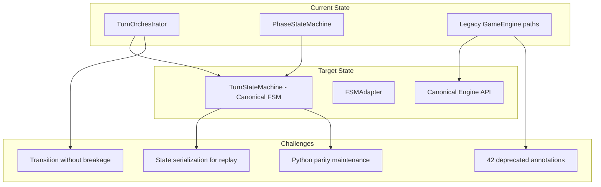

# PASS23 Comprehensive Project Assessment Report

> **Assessment Date:** 2025-12-24  
> **Assessment Pass:** 23 (Multi-Domain Health Assessment)  
> **Assessor:** Architect mode – comprehensive cross-domain analysis  
> **Previous Pass:** PASS22 (Production Polish: Branch coverage, load testing, observability)

> **Doc Status (2025-12-24): Active**  
> Comprehensive assessment synthesizing findings from Project Goals, Document Hygiene, Test Hygiene, and Code Quality audits. Provides actionable remediation plan for addressing identified gaps.

---

## 1. Executive Summary

### Overall Project Health Grade: **B+** (85/100)

RingRift has matured significantly through 22 assessment passes, with a robust TypeScript/Python rules engine, strong test infrastructure, and clear architectural direction. However, several technical debt items and testing gaps require attention before the project achieves full production-grade maturity.

### Assessment Summary Matrix

| Domain                        | Score  | Grade | Critical Findings                                                  |
| ----------------------------- | ------ | ----- | ------------------------------------------------------------------ |
| **Project Goals Foundation**  | STRONG | A     | SSoT hierarchy clear, success criteria well-defined                |
| **Document Hygiene**          | 87%    | B+    | 2 missing aggregates, 11 undocumented helpers, 1 path error        |
| **Test Hygiene**              | B+     | B+    | 10,259+ tests passing, 75.67% coverage, weak assertions identified |
| **Code Quality/Architecture** | B+     | B+    | 3 mega-components, 42 deprecated annotations, Python complexity    |

### Key Achievements

✅ **10,259+ TypeScript tests passing** with 75.67% statement coverage  
✅ **PROJECT_GOALS.md is current and comprehensive** with clear SSoT hierarchy  
✅ **HeuristicAI decomposition completed** (6 evaluators extracted, ~1,911 LOC coordinator)  
✅ **Observability infrastructure mature** (Grafana dashboards, k6 load tests)  
✅ **42 KEEP-SKIPPED tests well-triaged** with documented rationales

### Critical Gaps Requiring Attention

🔴 **SandboxGameHost.tsx**: 3,779 LOC mega-component (decomposition plan exists)  
🔴 **Client component testing gap**: BoardView, GameHUD, VictoryModal at 0% coverage  
🔴 **Critical hooks untested**: useGameConnection, useSandboxInteractions  
🔴 **1,346 weak/trivial assertions** identified across test suite  
🔴 **Python coordination layer complexity**: 63 files in coordination/

---

## 2. Weakest Aspect Analysis

### Verdict: **Client-Side Component Testing**

After analyzing all four assessment domains, the **client-side component testing gap** emerges as the greatest vulnerability and bottleneck for project success.

#### Why This Was Chosen Over Other Candidates

| Candidate                          | Severity     | Why Not Primary                                                                                                                                         |
| ---------------------------------- | ------------ | ------------------------------------------------------------------------------------------------------------------------------------------------------- |
| **SandboxGameHost mega-component** | High         | Has detailed decomposition plan; refactor path is clear                                                                                                 |
| **Python layer complexity**        | Medium-High  | HeuristicAI decomposition already completed; remaining complexity is coordination layer with 63 files but these are operational scripts, not core logic |
| **Weak assertions**                | Medium       | Can be addressed incrementally during normal development                                                                                                |
| **Client component testing**       | **Critical** | No existing plan, blocks UI regression detection, affects user-facing quality                                                                           |

#### Impact Analysis

1. **User-Facing Quality Risk**
   - [`BoardView.tsx`](../../../src/client/components/BoardView.tsx) - Core game rendering at 0% test coverage
   - [`GameHUD.tsx`](../../../src/client/components/GameHUD.tsx) - Player feedback at 0% coverage
   - [`VictoryModal.tsx`](../../../src/client/components/VictoryModal.tsx) - Game completion UX untested

2. **Regression Detection Blind Spot**
   - No safeguards against visual/interaction regressions in core gameplay
   - Critical hooks ([`useGameConnection.ts`](../../../src/client/hooks/useGameConnection.ts), [`useSandboxInteractions.ts`](../../../src/client/hooks/useSandboxInteractions.ts)) have no unit tests
   - WebSocket reconnection logic untested

3. **CI/CD Quality Gate Gap**
   - Backend has strong test coverage gates
   - Frontend can ship with broken interactions undetected

#### Contributing Factors

- **Historical focus on rules engine parity** (justified for correctness)
- **E2E tests provide some coverage** but are slow and coarse-grained
- **Component testing infrastructure exists** (Jest + React Testing Library) but underutilized
- **Teaching overlays and accessibility features** added without corresponding tests

#### Remediation Path

1. **Phase 1**: Add basic render tests for critical components (BoardView, GameHUD)
2. **Phase 2**: Add interaction tests for critical hooks (useGameConnection)
3. **Phase 3**: Add snapshot/visual regression for victory states
4. **Phase 4**: Establish coverage gates for client code

---

## 3. Most Challenging Unsolved Problem

### Verdict: **Full FSM-Driven Orchestration Migration**

The transition from the current orchestrator architecture to a fully FSM-driven system represents the highest technical complexity and resource requirement among remaining challenges.

#### Technical Complexity Analysis

#### Why This Is The Hardest Problem

| Factor                 | Complexity Rating | Details                                                    |
| ---------------------- | ----------------- | ---------------------------------------------------------- |
| **Scope**              | XL                | Touches orchestrator, phase machine, engine, and all hosts |
| **Parity Requirement** | High              | Must maintain TS↔Python parity throughout migration        |
| **Risk of Regression** | High              | Core gameplay logic; any bug breaks games                  |
| **Dependencies**       | Many              | 42 deprecated annotations reference legacy paths           |
| **Testing Burden**     | Heavy             | Requires comprehensive contract vector verification        |

#### Current State

From [`docs/architecture/FSM_EXTENSION_STRATEGY.md`](../../../docs/architecture/FSM_EXTENSION_STRATEGY.md):

- FSMAdapter exists and is partially integrated
- TurnStateMachine validates transitions
- Shadow mode contract validation implemented
- However, legacy paths still active (flagged by 42 `@deprecated` annotations)

#### Blockers

1. **No complete migration plan document** - Only extension strategy exists
2. **Python GameEngine must mirror FSM** - Maintaining dual implementations
3. **Replay system depends on specific state shapes** - Risk of breaking saved games
4. **42 deprecated annotations** scattered across TypeScript codebase

#### Recommended Approach

1. **Write FSM_MIGRATION_COMPLETION_PLAN.md** documenting exact cut-over steps
2. **Create comprehensive contract vectors** for all phase transitions
3. **Implement shadow mode validation** comparing legacy vs FSM paths
4. **Gradual flag-driven rollout** per environment
5. **Remove deprecated paths only after** 2-week shadow mode with zero divergences

---

## 4. Remediation Plan

### Priority Legend

- **P0**: Critical - blocks production confidence
- **P1**: High - significant quality/maintainability impact
- **P2**: Medium - technical debt with clear path
- **P3**: Low - nice-to-have improvements
- **P4**: Deferred - future consideration

### 4.1 P0 Critical Tasks

| ID      | Task                                                      | Acceptance Criteria                                                   | Dependency | Effort | Mode      |
| ------- | --------------------------------------------------------- | --------------------------------------------------------------------- | ---------- | ------ | --------- |
| P23.0-1 | Add BoardView render tests                                | Component renders without error for all board types; key props tested | None       | M      | code      |
| P23.0-2 | Add GameHUD interaction tests                             | HUD displays correct phase/player info; action buttons work           | None       | M      | code      |
| P23.0-3 | Add useGameConnection hook tests                          | Connection lifecycle tested; reconnection logic verified              | None       | M      | code      |
| P23.0-4 | Add VictoryModal state tests                              | All victory types render correctly; dismiss action works              | None       | S      | code      |
| P23.0-5 | Document missing aggregates in DOMAIN_AGGREGATE_DESIGN.md | EliminationAggregate and RecoveryAggregate documented                 | None       | S      | architect |

### 4.2 P1 High Priority Tasks

| ID      | Task                                                      | Acceptance Criteria                                                                                   | Dependency | Effort | Mode      |
| ------- | --------------------------------------------------------- | ----------------------------------------------------------------------------------------------------- | ---------- | ------ | --------- |
| P23.1-1 | Add useSandboxInteractions hook tests                     | All interaction types tested; edge cases covered                                                      | None       | M      | code      |
| P23.1-2 | Fix ai-service/docs/ARCHITECTURE.md game_engine path      | Path updated from `game_engine.py` to `game_engine/__init__.py`                                       | None       | S      | code      |
| P23.1-3 | Document 11 missing helpers in MODULE_RESPONSIBILITIES.md | All helper files documented with responsibilities                                                     | P23.0-5    | M      | architect |
| P23.1-4 | Begin SandboxGameHost Phase 1 decomposition               | useSandboxClock hook extracted per [plan](../../architecture/SANDBOX_GAME_HOST_DECOMPOSITION_PLAN.md) | None       | L      | code      |
| P23.1-5 | Extract useSandboxAITracking hook                         | AI tracking state/effects in dedicated hook                                                           | P23.1-4    | M      | code      |
| P23.1-6 | Address top 100 weak assertions                           | Identified assertions upgraded to meaningful checks                                                   | None       | L      | code      |

### 4.3 P2 Medium Priority Tasks

| ID      | Task                                  | Acceptance Criteria                                  | Dependency | Effort | Mode      |
| ------- | ------------------------------------- | ---------------------------------------------------- | ---------- | ------ | --------- |
| P23.2-1 | Extract useSandboxBoardSelection hook | Selection state/effects in dedicated hook            | P23.1-5    | M      | code      |
| P23.2-2 | Extract useSandboxDiagnostics hook    | Diagnostic handlers in dedicated hook                | P23.2-1    | S      | code      |
| P23.2-3 | Create SandboxGameFacade              | Implement GameFacade interface for sandbox mode      | P23.2-2    | M      | code      |
| P23.2-4 | Extract SandboxSetupView component    | ~750 LOC setup view as separate component            | P23.2-3    | M      | code      |
| P23.2-5 | Extract SandboxBoardSection component | Board section as separate component                  | P23.2-4    | M      | code      |
| P23.2-6 | Python coordination layer assessment  | Audit 63 files; identify consolidation opportunities | None       | M      | architect |
| P23.2-7 | Create client coverage gates          | Jest config enforces minimum client coverage         | P23.0-1..4 | S      | code      |

### 4.4 P3 Low Priority Tasks

| ID      | Task                                              | Acceptance Criteria                                    | Dependency | Effort | Mode      |
| ------- | ------------------------------------------------- | ------------------------------------------------------ | ---------- | ------ | --------- |
| P23.3-1 | Extract SandboxGameSidebar component              | Sidebar as separate component                          | P23.2-5    | M      | code      |
| P23.3-2 | Extract SandboxAdvancedPanels component           | Advanced panels as separate component                  | P23.3-1    | M      | code      |
| P23.3-3 | Update test count references in docs              | All documentation reflects current 10,259+ test count  | None       | S      | architect |
| P23.3-4 | Remove 42 deprecated TypeScript annotations       | Deprecated code paths removed after verification       | P23.2-6    | XL     | code      |
| P23.3-5 | BackendGameHost/SandboxGameHost unification study | Document shared patterns; propose unified architecture | P23.3-2    | L      | architect |
| P23.3-6 | Address remaining 1,246 weak assertions           | Full assertion quality upgrade                         | P23.1-6    | XL     | code      |

### 4.5 P4 Deferred Tasks

| ID      | Task                            | Acceptance Criteria                                  | Dependency | Effort | Mode |
| ------- | ------------------------------- | ---------------------------------------------------- | ---------- | ------ | ---- |
| P23.4-1 | Full FSM migration completion   | All legacy paths removed; FSM is sole orchestration  | P23.3-4    | XL     | code |
| P23.4-2 | Python GameEngine FSM alignment | Python engine uses FSM-equivalent state machine      | P23.4-1    | XL     | code |
| P23.4-3 | Training pipeline consolidation | 131 training files consolidated to focused structure | None       | XL     | code |
| P23.4-4 | GameFacade full unification     | Single facade serves both backend and sandbox        | P23.3-5    | L      | code |

---

## 5. Cross-Reference Validation Summary

### Document Accuracy Matrix

| Document                                                                                                | Status        | Issues Found                                                    | Resolution |
| ------------------------------------------------------------------------------------------------------- | ------------- | --------------------------------------------------------------- | ---------- |
| [`PROJECT_GOALS.md`](../../../PROJECT_GOALS.md)                                                         | ✅ Current    | None                                                            | N/A        |
| [`DOMAIN_AGGREGATE_DESIGN.md`](../../architecture/DOMAIN_AGGREGATE_DESIGN.md)                           | ⚠️ Incomplete | Missing EliminationAggregate, RecoveryAggregate                 | P23.0-5    |
| [`MODULE_RESPONSIBILITIES.md`](../../architecture/MODULE_RESPONSIBILITIES.md)                           | ⚠️ Incomplete | 11 helper files undocumented                                    | P23.1-3    |
| [`ai-service/docs/ARCHITECTURE.md`](../../../ai-service/docs/ARCHITECTURE.md)                           | ❌ Incorrect  | `game_engine.py` path should be `game_engine/__init__.py`       | P23.1-2    |
| [`SANDBOX_GAME_HOST_DECOMPOSITION_PLAN.md`](../../architecture/SANDBOX_GAME_HOST_DECOMPOSITION_PLAN.md) | ✅ Current    | Plan is detailed and actionable                                 | N/A        |
| [`HEURISTIC_AI_DECOMPOSITION_PLAN.md`](../../architecture/HEURISTIC_AI_DECOMPOSITION_PLAN.md)           | ✅ Completed  | Marked as completed, 6 evaluators extracted                     | N/A        |
| [`FSM_EXTENSION_STRATEGY.md`](../../architecture/FSM_EXTENSION_STRATEGY.md)                             | ⚠️ Partial    | Extension strategy exists but migration completion plan missing | P23.4-1    |

### SSoT Hierarchy Verification

| Source of Truth    | Location                                                | Status              |
| ------------------ | ------------------------------------------------------- | ------------------- |
| Rules Semantics    | `RULES_CANONICAL_SPEC.md`, `ringrift_complete_rules.md` | ✅ Authoritative    |
| Game Types         | `src/shared/types/game.ts`                              | ✅ Canonical        |
| Engine Logic       | `src/shared/engine/**`                                  | ✅ Canonical        |
| Python Parity      | `ai-service/app/game_engine/`                           | ✅ Mirrors TS       |
| Assessment History | `docs/archive/assessments/`                             | ✅ PASS22 is latest |

---

## 6. Recommendations Timeline

### Sprint 1 (Week 1-2): Critical Client Testing

Focus: Close the client-side testing gap that represents highest risk.

| Task                                  | Owner     | Effort |
| ------------------------------------- | --------- | ------ |
| P23.0-1: BoardView render tests       | Code      | M      |
| P23.0-2: GameHUD interaction tests    | Code      | M      |
| P23.0-3: useGameConnection hook tests | Code      | M      |
| P23.0-4: VictoryModal state tests     | Code      | S      |
| P23.0-5: Document missing aggregates  | Architect | S      |

**Sprint Goal**: Core gameplay components have basic test coverage.

### Sprint 2 (Week 3-4): Documentation & Hook Testing

Focus: Complete documentation gaps and test remaining critical hooks.

| Task                                  | Owner     | Effort |
| ------------------------------------- | --------- | ------ |
| P23.1-1: useSandboxInteractions tests | Code      | M      |
| P23.1-2: Fix ARCHITECTURE.md path     | Code      | S      |
| P23.1-3: Document 11 missing helpers  | Architect | M      |
| P23.2-7: Create client coverage gates | Code      | S      |

**Sprint Goal**: Documentation accurate and client testing infrastructure complete.

### Sprint 3-4 (Week 5-8): SandboxGameHost Decomposition Phase 1

Focus: Extract hooks from mega-component following existing plan.

| Task                                           | Owner | Effort |
| ---------------------------------------------- | ----- | ------ |
| P23.1-4: Extract useSandboxClock hook          | Code  | L      |
| P23.1-5: Extract useSandboxAITracking hook     | Code  | M      |
| P23.2-1: Extract useSandboxBoardSelection hook | Code  | M      |
| P23.2-2: Extract useSandboxDiagnostics hook    | Code  | S      |

**Sprint Goal**: SandboxGameHost reduced from 3,779 to ~2,500 LOC.

### Sprint 5-6 (Week 9-12): SandboxGameHost Decomposition Phase 2

Focus: Extract components and create facade.

| Task                                     | Owner | Effort |
| ---------------------------------------- | ----- | ------ |
| P23.2-3: Create SandboxGameFacade        | Code  | M      |
| P23.2-4: Extract SandboxSetupView        | Code  | M      |
| P23.2-5: Extract SandboxBoardSection     | Code  | M      |
| P23.1-6: Address top 100 weak assertions | Code  | L      |

**Sprint Goal**: SandboxGameHost reduced to ~600 LOC orchestrator.

### Quarter 2: Architecture Consolidation

Focus: Longer-term technical debt and unification.

| Task                                    | Owner     | Effort |
| --------------------------------------- | --------- | ------ |
| P23.2-6: Python coordination assessment | Architect | M      |
| P23.3-4: Remove deprecated annotations  | Code      | XL     |
| P23.3-5: Host unification study         | Architect | L      |

**Quarter Goal**: Clear path to unified game host architecture.

---

## 7. Metrics & Success Criteria

### PASS23 Complete When:

- [ ] Critical client components have ≥70% test coverage (BoardView, GameHUD, VictoryModal)
- [ ] Critical hooks have unit test coverage (useGameConnection, useSandboxInteractions)
- [ ] DOMAIN_AGGREGATE_DESIGN.md documents all 8 aggregates
- [ ] MODULE_RESPONSIBILITIES.md documents all helper files
- [ ] ai-service/docs/ARCHITECTURE.md path corrected
- [ ] SandboxGameHost hook extraction Phase 1 complete (4 hooks)
- [ ] Client coverage gates established in CI

### Key Performance Indicators

| Metric                         | Current | Target    | Timeline |
| ------------------------------ | ------- | --------- | -------- |
| Client component test coverage | ~5%     | 70%       | Sprint 2 |
| SandboxGameHost LOC            | 3,779   | 600       | Sprint 6 |
| Documentation accuracy         | 87%     | 98%       | Sprint 2 |
| Weak assertions addressed      | 0/1,346 | 100/1,346 | Sprint 5 |
| Deprecated annotations         | 42      | 0         | Q2       |

---

## 8. Risk Assessment

### High Risk Items

| Risk                                     | Likelihood | Impact | Mitigation                                                 |
| ---------------------------------------- | ---------- | ------ | ---------------------------------------------------------- |
| SandboxGameHost refactor breaks gameplay | Medium     | High   | Phased extraction with E2E test verification at each stage |
| Client tests reveal hidden bugs          | Medium     | Medium | Time budget for fixing discovered issues                   |
| Deprecated removal breaks legacy paths   | Medium     | High   | Shadow mode validation before removal                      |

### Medium Risk Items

| Risk                                          | Likelihood | Impact | Mitigation                                |
| --------------------------------------------- | ---------- | ------ | ----------------------------------------- |
| Python coordination consolidation scope creep | Medium     | Medium | Start with assessment, not implementation |
| Hook extraction changes behavior              | Low        | Medium | Unit tests before and after extraction    |

---

## 9. Comparison with Previous Assessments

### Progress Trajectory

| Assessment | Focus                    | Key Achievement                             | Grade  |
| ---------- | ------------------------ | ------------------------------------------- | ------ |
| PASS18     | Orchestrator integration | Phase state machine deployed                | B      |
| PASS19     | E2E infrastructure       | Test stability achieved                     | B+     |
| PASS20     | Phase 3 migration        | ~1,118 lines legacy removed                 | B+     |
| PASS21     | Observability            | 3 Grafana dashboards, monitoring by default | A-     |
| PASS22     | Production polish        | Load testing framework, k6 scenarios        | B+     |
| **PASS23** | **Multi-domain health**  | **Comprehensive assessment synthesized**    | **B+** |

### Trend Analysis

- **Positive**: Consistent B+ or better grades; no regressions
- **Positive**: HeuristicAI decomposition completed successfully
- **Positive**: Observability matured significantly (PASS21)
- **Concern**: Client-side testing gap persists across assessments
- **Opportunity**: Detailed decomposition plans exist but implementation pending

---

## 10. Conclusion

RingRift is a **mature, well-architected project** with strong foundations in rules engine correctness, test infrastructure, and documentation. The assessment reveals that while the backend and rules engine are well-tested, **client-side testing represents the greatest vulnerability** to project success.

### Immediate Priorities

1. **Close client testing gap** (Sprints 1-2) - Highest impact on quality confidence
2. **Execute SandboxGameHost decomposition** (Sprints 3-6) - Following existing detailed plan
3. **Complete documentation updates** (Sprint 2) - Low effort, high value

### Strategic Direction

The project is well-positioned for the next phase of maturity. The existence of detailed decomposition plans ([`SANDBOX_GAME_HOST_DECOMPOSITION_PLAN.md`](../../architecture/SANDBOX_GAME_HOST_DECOMPOSITION_PLAN.md)) and completed refactors ([`HEURISTIC_AI_DECOMPOSITION_PLAN.md`](../../architecture/HEURISTIC_AI_DECOMPOSITION_PLAN.md)) demonstrates architectural clarity. The recommended path forward prioritizes **risk reduction through testing** before **continuing large refactors**.

---

## 11. References

### Assessment Data Sources

- Project Goals audit (2025-12-24)
- Document hygiene scan (2025-12-24)
- Test suite analysis (10,259+ tests, 75.67% coverage)
- Code quality metrics (LOC analysis, deprecated audit)

### Related Documents

- [`docs/archive/assessments/PASS22_ASSESSMENT_REPORT.md`](PASS22_ASSESSMENT_REPORT.md)
- [`docs/architecture/SANDBOX_GAME_HOST_DECOMPOSITION_PLAN.md`](../../architecture/SANDBOX_GAME_HOST_DECOMPOSITION_PLAN.md)
- [`docs/architecture/HEURISTIC_AI_DECOMPOSITION_PLAN.md`](../../architecture/HEURISTIC_AI_DECOMPOSITION_PLAN.md)
- [`docs/architecture/DOMAIN_AGGREGATE_DESIGN.md`](../../architecture/DOMAIN_AGGREGATE_DESIGN.md)
- [`docs/architecture/MODULE_RESPONSIBILITIES.md`](../../architecture/MODULE_RESPONSIBILITIES.md)

### Key Files Referenced

- [`src/client/pages/SandboxGameHost.tsx`](../../../src/client/pages/SandboxGameHost.tsx) - 3,779 LOC mega-component
- [`src/client/pages/BackendGameHost.tsx`](../../../src/client/pages/BackendGameHost.tsx) - 1,953 LOC
- [`src/client/components/BoardView.tsx`](../../../src/client/components/BoardView.tsx) - 0% test coverage
- [`src/client/components/GameHUD.tsx`](../../../src/client/components/GameHUD.tsx) - 0% test coverage
- [`src/client/hooks/useGameConnection.ts`](../../../src/client/hooks/useGameConnection.ts) - 0% test coverage
- [`ai-service/app/ai/heuristic_ai.py`](../../../ai-service/app/ai/heuristic_ai.py) - 1,911 LOC after decomposition

---

**Assessment Complete:** 2025-12-24  
**Recommended Next Assessment:** PASS24 (Post-Sprint 2: Client Testing Validation)  
**Confidence Level:** HIGH - Multi-domain assessment with clear remediation paths identified
