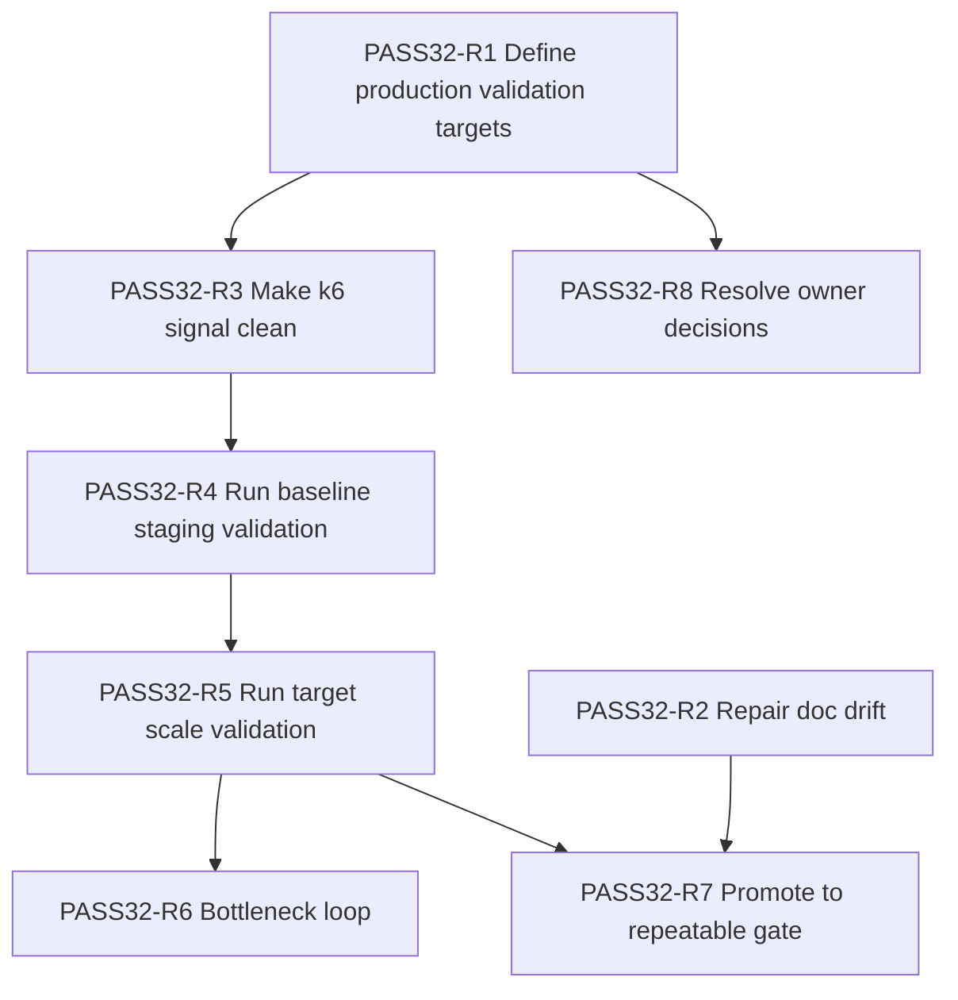

# PASS32 — Refresh Comprehensive Weakness + Hardest Problem Assessment

> **Doc status:** Active assessment (PASS32)
>
> **Objective:** Identify the single weakest aspect and the single hardest remaining problem blocking the objectives in [`PROJECT_GOALS.md`](../../../PROJECT_GOALS.md:1), and provide a remediation plan with dependency ordering, acceptance criteria, and owner mode.
>
> **Assessment date:** 2025-12-26
>
> **Basis documents (SSoT + supporting):**
>
> - Goals/scope SSoT: [`PROJECT_GOALS.md`](../../../PROJECT_GOALS.md:1)
> - Rules semantics SSoT: [`RULES_CANONICAL_SPEC.md`](../../../RULES_CANONICAL_SPEC.md:1)
> - Active issue tracker: [`KNOWN_ISSUES.md`](../../../KNOWN_ISSUES.md:1)
> - Prior weakness snapshot (superseded by this report): [`WEAKNESS_AND_HARDEST_PROBLEM_REPORT.md`](WEAKNESS_AND_HARDEST_PROBLEM_REPORT.md:1)
> - Implementation status SSoT (note: currently stale in a few places; see §1.3): [`CURRENT_STATE_ASSESSMENT.md`](../historical/CURRENT_STATE_ASSESSMENT.md:1)
> - Training-data provenance SSoT for AI: [`TRAINING_DATA_REGISTRY.md`](../../../ai-service/TRAINING_DATA_REGISTRY.md:1)

---

## 0. Executive summary

### 0.1 Goals/scope clarity verdict

The goals, success criteria, and scope boundaries are **clearly documented** with explicit SSoT hierarchy in [`PROJECT_GOALS.md`](../../../PROJECT_GOALS.md:1), including release gates and SLOs in [`PROJECT_GOALS.md`](../../../PROJECT_GOALS.md:143) and explicit in-scope/out-of-scope boundaries in [`PROJECT_GOALS.md`](../../../PROJECT_GOALS.md:235).

There are a few remaining ambiguities/drifts that should be cleaned up (see §1.2–§1.3), but the project has a strong direction SSoT.

### 0.2 Single weakest aspect (largest vulnerability/bottleneck)

**Weakest aspect:** **Production validation at target scale with clean signal**.

Even after substantial engine consolidation and parity improvements (including square19 replay parity now passing in the highlighted work and tracked as resolved in [`KNOWN_ISSUES.md`](../../../KNOWN_ISSUES.md:1103)), the largest remaining _risk to v1.0 confidence_ is the lack of a **repeatable, low-noise, target-scale SLO validation gate** that exercises:

- mixed human/AI gameplay,
- WebSocket concurrency (including reconnection patterns), and
- realistic AI service load,

and produces a **clean error-budget interpretation** aligned to the SLOs in [`PROJECT_GOALS.md`](../../../PROJECT_GOALS.md:155).

### 0.3 Single hardest remaining problem

**Hardest problem:** **Operationalizing production validation into a repeatable SLO gate and closing the first real bottlenecks it reveals**.

This is hard because it is inherently cross-system (Node backend + WebSockets + Redis + Postgres + AI service) and the “correct” work only becomes obvious after you obtain clean measurements. It therefore combines engineering + debugging + ops discipline, and requires iteration.

---

## 1. Goals/scope clarity

### 1.1 Confirmed SSoT and success criteria

**Confirmed SSoT structure is explicit and strong:**

- Project direction, goals, and success criteria are owned by [`PROJECT_GOALS.md`](../../../PROJECT_GOALS.md:1).
- Rules semantics are owned by [`RULES_CANONICAL_SPEC.md`](../../../RULES_CANONICAL_SPEC.md:1) and referenced throughout the goals document (for example in [`PROJECT_GOALS.md`](../../../PROJECT_GOALS.md:149)).
- Live implementation status is delegated to [`CURRENT_STATE_ASSESSMENT.md`](../historical/CURRENT_STATE_ASSESSMENT.md:1) per [`PROJECT_GOALS.md`](../../../PROJECT_GOALS.md:22).

This is the right structure: it prevents “status docs” from accidentally rewriting scope or success criteria.

### 1.2 Remaining ambiguities in goals/scope

1. **Board types in scope are slightly inconsistent inside the goals doc.**
   - The v1.0 objectives summary describes “four supported board types” including hex8 in [`PROJECT_GOALS.md`](../../../PROJECT_GOALS.md:66).
   - The “Board types (must have)” list omits hex8 in [`PROJECT_GOALS.md`](../../../PROJECT_GOALS.md:255).

   This should be clarified in the goals SSoT so downstream docs and acceptance checks don’t drift.

2. **Owner decisions are explicitly listed (good), but still unresolved.**
   - AI ladder positioning (whether 7–10 are v1.0 rated-grade) remains open in [`PROJECT_GOALS.md`](../../../PROJECT_GOALS.md:397).
   - Launch concurrency target interpretation remains open in [`PROJECT_GOALS.md`](../../../PROJECT_GOALS.md:403).

   These aren’t blocking for internal development, but they _do_ affect what “production validation at scale” must prove.

### 1.3 Doc hygiene drift impacting clarity (not goals SSoT, but supporting docs)

This pass found a few places where “status” or “registry” docs appear stale relative to the stated current state:

- [`CURRENT_STATE_ASSESSMENT.md`](../historical/CURRENT_STATE_ASSESSMENT.md:87) references a legacy orchestrator component that has since been removed (the report lists `phaseStateMachine.ts` in the engine layer diagram and again in the implementation table at [`CURRENT_STATE_ASSESSMENT.md`](../historical/CURRENT_STATE_ASSESSMENT.md:137)). This undermines its role as the status SSoT.

- [`TRAINING_DATA_REGISTRY.md`](../../../ai-service/TRAINING_DATA_REGISTRY.md:19) lists many canonical DBs as `pending_gate` due to tooling issues, while square19 replay parity is now described as resolved in [`KNOWN_ISSUES.md`](../../../KNOWN_ISSUES.md:1103). This likely reflects drift between “what is true now” and “what the registry currently asserts”.

These are not rule correctness issues, but they can cause teams to chase the wrong next-step (especially around training readiness and parity).

---

## 2. Weakest aspect: production validation at target scale with clean signal

### 2.1 Selection

The single weakest aspect is **production validation at target scale with clean signal**.

This matches the explicit v1.0 release-gate framing in [`PROJECT_GOALS.md`](../../../PROJECT_GOALS.md:143) and the previously documented weakness in [`WEAKNESS_AND_HARDEST_PROBLEM_REPORT.md`](WEAKNESS_AND_HARDEST_PROBLEM_REPORT.md:14), but is refreshed here with today’s context:

- Rules engine consolidation and parity work have removed a major historic blocker (for example the square19 parity thread tracked in [`KNOWN_ISSUES.md`](../../../KNOWN_ISSUES.md:1103)).
- Remaining risk is primarily “can we prove, repeatedly, that the _system_ meets the SLOs under representative load?”

### 2.2 Evidence

1. **The goals explicitly require SLO validation under target load**, not just “it seems fast locally”. The SLO table in [`PROJECT_GOALS.md`](../../../PROJECT_GOALS.md:155) is normative for v1.0.

2. **Current known-issues tracking still treats clean load-test signal as unfinished work.** The k6 section in [`KNOWN_ISSUES.md`](../../../KNOWN_ISSUES.md:487) describes remaining reruns and signal-quality concerns.

3. **This weakness is a bottleneck because it gates multiple other decisions:**
   - whether AI difficulty defaults are acceptable (ties into [`PROJECT_GOALS.md`](../../../PROJECT_GOALS.md:397)),
   - whether the concurrency target is feasible within budget (ties into [`PROJECT_GOALS.md`](../../../PROJECT_GOALS.md:403)),
   - whether operational runbooks/alerts are actually effective in real failure modes.

### 2.3 Why this is the weakest vs other plausible candidates

This section explicitly compares against several plausible candidates from the requested focus areas (docs/test/code quality/architecture).

| Candidate                                                                         | Why it is plausible                                                                                                                                                                                                                                   | Why it is not the single weakest right now                                                                                                                                                               |
| --------------------------------------------------------------------------------- | ----------------------------------------------------------------------------------------------------------------------------------------------------------------------------------------------------------------------------------------------------- | -------------------------------------------------------------------------------------------------------------------------------------------------------------------------------------------------------- |
| **Documentation hygiene / drift**                                                 | There is demonstrable drift between status/registry docs and current reality (see [`CURRENT_STATE_ASSESSMENT.md`](../historical/CURRENT_STATE_ASSESSMENT.md:87) and [`TRAINING_DATA_REGISTRY.md`](../../../ai-service/TRAINING_DATA_REGISTRY.md:19)). | This is a _process and clarity risk_, but it does not directly threaten v1.0 correctness or uptime. It is also easier to remediate than production-scale validation.                                     |
| **Test hygiene / coverage**                                                       | The project has a large test surface and a non-trivial skipped/diagnostic taxonomy in [`PROJECT_GOALS.md`](../../../PROJECT_GOALS.md:169).                                                                                                            | The existing suites already provide strong correctness assurance for rules/parity. Remaining test work is incremental hardening; it is not the dominant unknown compared to scale validation.            |
| **Architecture: duplicate TS `GameState` types blocking validator consolidation** | This is explicitly called out as blocking consolidation in [`NEXT_STEPS.md`](../../architecture/NEXT_STEPS.md:40).                                                                                                                                    | This is real maintainability debt, but it is not a release gate in [`PROJECT_GOALS.md`](../../../PROJECT_GOALS.md:143). It can be scheduled as a post-v1.0 internal cleanup if needed.                   |
| **AI strength and advanced search**                                               | Truly strong multiplayer AI is objectively hard and ongoing in the long run.                                                                                                                                                                          | Strong evidence in [`PROJECT_GOALS.md`](../../../PROJECT_GOALS.md:287) that “advanced AI” is a post‑v1.0 objective; v1.0 requires a functional ladder and resilient fallbacks, not frontier-strength AI. |

---

## 3. Hardest remaining problem: operationalize production validation into a repeatable SLO gate

### 3.1 Selection

The single hardest remaining problem is **turning production validation into a repeatable, low-noise, end-to-end SLO gate**, then addressing the first real bottleneck(s) it exposes.

This is “hard” in a different way than rules bugs:

- rules and parity issues are deterministic and can be fixed by narrowing a failing seed or contract vector;
- production-scale issues are often emergent, load-dependent, and require cross-service observability.

### 3.2 Why it is hard

1. **Multi-system coupling**
   - WebSocket concurrency and reconnection storms load the Node event loop and state management.
   - Postgres and Redis become shared bottlenecks.
   - AI service latency can backpressure the turn loop.

2. **Measurement is the work**
   You cannot “prove SLOs” without (a) realistic scenarios and (b) a clean interpretation of failures. A run dominated by known, non-SLO failures (token expiry, expected 429s) is not a meaningful gate.

3. **The bottleneck is not known ahead of time**
   The first limiting factor might be AI p95 latency, DB pooling, event-loop starvation, memory pressure, or a reconnection edge-case. The workflow must be designed to find and isolate the first bottleneck quickly.

---

## 4. Remediation plan (dependency-ordered checklist)

Each item below includes:

- **Objective**: what outcome it produces
- **Acceptance criteria**: what “done” means
- **Owner mode**: recommended agent mode (architect / code / debug / ask)
- **Depends on**: prerequisites

### 4.1 Checklist

- [ ] **PASS32-R1 — Decide and document production validation targets**
  - Objective: remove ambiguity about what the system must prove for v1.0.
  - Acceptance criteria:
    - A single doc section exists that states:
      - target concurrency definition (baseline vs launch target), consistent with [`PROJECT_GOALS.md`](../../../PROJECT_GOALS.md:403)
      - whether AI 7–10 are in-scope for production SLO gating, consistent with [`PROJECT_GOALS.md`](../../../PROJECT_GOALS.md:397)
      - the exact k6 scenarios and success interpretation that constitute a “clean pass” against [`PROJECT_GOALS.md`](../../../PROJECT_GOALS.md:155)
  - Owner mode: **architect**
  - Depends on: none

- [ ] **PASS32-R2 — Repair doc drift in high-authority status/registry docs**
  - Objective: ensure the written “current reality” matches the codebase state.
  - Acceptance criteria:
    - [`CURRENT_STATE_ASSESSMENT.md`](../historical/CURRENT_STATE_ASSESSMENT.md:1) no longer references removed legacy modules and correctly describes the current orchestrator stack.
    - [`TRAINING_DATA_REGISTRY.md`](../../../ai-service/TRAINING_DATA_REGISTRY.md:1) entries about canonical DB gate status reflect the latest parity/health facts (or explicitly declare what is unknown and why).
  - Owner mode: **architect**
  - Depends on: none

- [ ] **PASS32-R3 — Make k6 signal “clean” (auth, rate limit classification, AI-heavy realism)**
  - Objective: reduce noise so load-test failures reflect true capacity or correctness issues.
  - Acceptance criteria:
    - Load scenarios:
      - refresh auth correctly for long runs,
      - classify expected 429s distinctly from unexpected failures,
      - include an AI-heavy profile that produces meaningful `/ai/move` request volume.
    - A short run produces a report where primary failure causes are actionable (not dominated by known harness artifacts).
  - Owner mode: **code**
  - Depends on: [`PASS32-R1 — Decide and document production validation targets`](PASS32_WEAKNESS_AND_HARDEST_PROBLEM_ASSESSMENT.md:1)

- [ ] **PASS32-R4 — Execute baseline staging validation and capture artifacts**
  - Objective: verify observability and dashboards capture the needed signals under load.
  - Acceptance criteria:
    - A baseline run completes and yields:
      - k6 summary output archived
      - dashboard screenshots or exported panels
      - a short written interpretation mapped to the SLO fields in [`PROJECT_GOALS.md`](../../../PROJECT_GOALS.md:155)
  - Owner mode: **debug**
  - Depends on: [`PASS32-R3 — Make k6 signal clean`](PASS32_WEAKNESS_AND_HARDEST_PROBLEM_ASSESSMENT.md:1)

- [ ] **PASS32-R5 — Execute target-scale mixed human/AI validation**
  - Objective: prove p95 latency and error budgets at the intended concurrency.
  - Acceptance criteria:
    - A target-scale run completes with:
      - clearly separated expected vs unexpected errors
      - p95 metrics computed for HTTP + WebSocket + AI latencies
      - an explicit pass/fail statement against [`PROJECT_GOALS.md`](../../../PROJECT_GOALS.md:155)
  - Owner mode: **debug**
  - Depends on: [`PASS32-R4 — Execute baseline staging validation`](PASS32_WEAKNESS_AND_HARDEST_PROBLEM_ASSESSMENT.md:1)

- [ ] **PASS32-R6 — Bottleneck triage and remediation loop**
  - Objective: fix the first real limiting factor surfaced by the target-scale run, then re-validate.
  - Acceptance criteria:
    - For the first identified bottleneck:
      - root cause is documented
      - at least one concrete fix is implemented
      - the target-scale run is repeated and shows improvement in the bottleneck metric
  - Owner mode: **debug** (triage) + **code** (fix)
  - Depends on: [`PASS32-R5 — Execute target-scale mixed human/AI validation`](PASS32_WEAKNESS_AND_HARDEST_PROBLEM_ASSESSMENT.md:1)

- [ ] **PASS32-R7 — Promote production validation to a repeatable gate**
  - Objective: prevent regressions by making “clean target-scale validation” a standard, repeatable step.
  - Acceptance criteria:
    - A documented runbook exists that specifies:
      - how to run the gate
      - which artifacts to capture
      - how to interpret pass/fail
    - The run can be executed by a new contributor using only the doc.
  - Owner mode: **architect**
  - Depends on: [`PASS32-R5 — Execute target-scale mixed human/AI validation`](PASS32_WEAKNESS_AND_HARDEST_PROBLEM_ASSESSMENT.md:1)

- [ ] **PASS32-R8 — Resolve remaining open questions with a concrete choice**
  - Objective: close the “owner decision required” loop so “done” is well-defined.
  - Acceptance criteria:
    - The open questions in [`PROJECT_GOALS.md`](../../../PROJECT_GOALS.md:393) are resolved (either in the goals doc itself or in an explicitly referenced decision record), including:
      - AI ladder positioning for v1.0
      - launch concurrency target interpretation
  - Owner mode: **ask**
  - Depends on: [`PASS32-R1 — Decide and document production validation targets`](PASS32_WEAKNESS_AND_HARDEST_PROBLEM_ASSESSMENT.md:1)

### 4.2 Dependency diagram

---

## 5. What changed since the prior weakness report

Relative to [`WEAKNESS_AND_HARDEST_PROBLEM_REPORT.md`](WEAKNESS_AND_HARDEST_PROBLEM_REPORT.md:1), this PASS32 refresh:

- keeps the _core diagnosis_ (production validation is still the gating vulnerability),
- updates context to reflect the current parity posture (for example the square19 parity thread resolution in [`KNOWN_ISSUES.md`](../../../KNOWN_ISSUES.md:1103)), and
- adds an explicit remediation item to repair doc drift where high-authority status docs no longer reflect recent changes (see [`CURRENT_STATE_ASSESSMENT.md`](../historical/CURRENT_STATE_ASSESSMENT.md:87)).

---

## 6. Conclusion

RingRift’s rules/engine stack and parity posture have materially improved and are no longer the dominant blocker. The remaining gating risk for the objectives in [`PROJECT_GOALS.md`](../../../PROJECT_GOALS.md:60) is operational: **a clean, repeatable production validation gate at target scale**.

The remediation checklist in §4 focuses on turning production validation into a repeatable SLO gate, while also repairing the doc drift that would otherwise make this work harder to coordinate.
