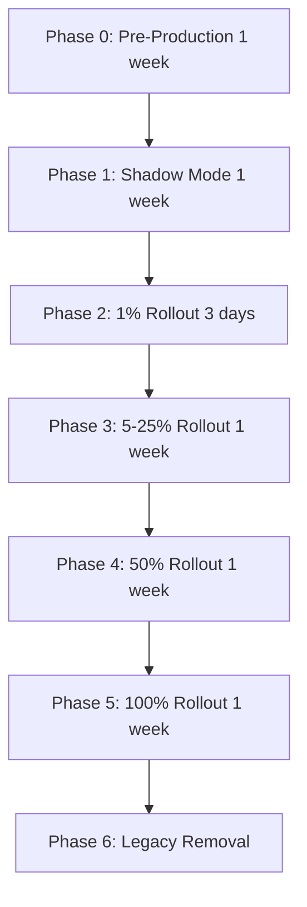
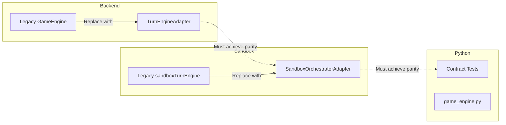

# Pass 8 - Comprehensive Project Assessment Report

> **⚠️ HISTORICAL DOCUMENT** – This is a point-in-time assessment from November 2025.
> For current project status, see:
>
> - [`../historical/CURRENT_STATE_ASSESSMENT.md`](../historical/CURRENT_STATE_ASSESSMENT.md) – Latest implementation status
> - `docs/PASS18A_ASSESSMENT_REPORT.md` – Most recent assessment pass

> **Assessment Date:** 2025-11-27
> **Assessment Pass:** Eighth (Post-DevOps/CI Remediation)
> **Previous Pass:** Pass 7 - DevOps/CI Enforcement identified as weakest (3.4/5.0)

---

## Executive Summary

Pass 8 is a **comprehensive reassessment** following Pass 7 remediation work. The DevOps/CI improvements in Pass 7 successfully addressed the quality gate bypass issues, raising DevOps/CI from 3.4 to 3.9. The project now has **two tied weakest areas**: Client UI/UX and DevOps/CI, both at 3.9/5.0.

### Pass History Summary

| Pass  | Area Remediated         | Score Change | Key Achievement                                     |
| ----- | ----------------------- | ------------ | --------------------------------------------------- |
| 1     | Turn Orchestration      | 3.5→4.4      | 7 bugs fixed                                        |
| 2     | Legacy Code             | 2.5→4.2      | 977 lines eliminated                                |
| 2     | AI Performance          | 2.8→4.5      | 12-25x speedup via make/unmake                      |
| 3     | Training Infrastructure | 2.9→4.4      | 253+ tests, 5 new modules                           |
| 4     | Database/Persistence    | 3.0→4.5      | GamePersistenceService, RatingService               |
| 5     | E2E Testing             | 2.9→4.5      | 85+ tests, 4 POMs, 5 browsers                       |
| 6     | Security/Privacy        | 2.5→4.2      | Full GDPR compliance                                |
| 7     | DevOps/CI               | 3.4→3.9      | ESLint/E2E CI-blocking, orchestrator rollout design |
| **8** | **Fresh Assessment**    | **—**        | **Client UI/UX identified (3.9)**                   |

### Key Findings

| Finding             | Details                                             |
| ------------------- | --------------------------------------------------- |
| **Weakest Areas**   | Client UI/UX (3.9) and DevOps/CI (3.9) - tied       |
| **Hardest Problem** | Orchestrator Production Rollout (4.5/5 difficulty)  |
| **Overall Health**  | Strong - 11 of 13 components score ≥4.0             |
| **Pass 7 Success**  | Quality gates now enforced, rollout design complete |

---

## Pass 7 Improvements Verified ✅

### P0.1: ESLint Now CI-Blocking ✅

**Evidence:** [`.github/workflows/ci.yml:69-70`](.github/workflows/ci.yml:69)

```yaml
- name: Run ESLint
  run: npm run lint -- --format stylish
# No continue-on-error - ESLint failures block CI
```

**Impact:** All lint violations now block PR merges, enforcing code quality standards.

### P0.2: E2E Tests Now CI-Blocking ✅

**Evidence:** [`.github/workflows/ci.yml:320-410`](.github/workflows/ci.yml:320)

```yaml
e2e-tests:
  name: Playwright E2E Tests
  runs-on: ubuntu-latest
  # No continue-on-error - E2E failures block CI
```

**Impact:** 85+ Playwright tests now gate deployments. Includes:

- Postgres and Redis service containers
- Prisma database migrations
- Chromium browser testing with retry support
- Artifact uploads for test reports and failure debugging

### P0.3: Lint Fix Script Documented ✅

**Evidence:** [`CONTRIBUTING.md:356-383`](CONTRIBUTING.md:356)

````markdown
## 🔍 Code Quality

### Linting

```bash
# Check for lint errors
npm run lint

# Auto-fix lint errors
npm run lint:fix
```
````

````

**Impact:** Clear developer guidance for maintaining code quality.

### P1.1: Orchestrator Adapter Enabled in Staging ✅

**Evidence:** [`src/server/index.ts:182-186`](src/server/index.ts:182)

```typescript
// Log orchestrator adapter mode for observability
const orchestratorEnabled = config.featureFlags.orchestratorAdapterEnabled;
logger.info(`Orchestrator adapter mode: ${orchestratorEnabled ? 'ENABLED' : 'DISABLED'}`, {
  orchestratorAdapterEnabled: orchestratorEnabled,
  engineMode: orchestratorEnabled ? 'TurnEngineAdapter (shared orchestrator)' : 'TurnEngine (legacy)',
});
````

**Evidence:** [`.env.staging:117-118`](.env.staging:117)

```env
# Orchestrator adapter for unified turn processing (Phase 3 migration)
ORCHESTRATOR_ADAPTER_ENABLED=true
```

**Impact:** Orchestrator now observable in logs, enabled by default in staging.

### P1.2: Feature Flags Design for Phased Rollout ✅

**Evidence:** [`docs/drafts/ORCHESTRATOR_ROLLOUT_FEATURE_FLAGS.md`](docs/drafts/ORCHESTRATOR_ROLLOUT_FEATURE_FLAGS.md) (834 lines)

**Comprehensive design includes:**

- 8 environment variables for rollout control
- Shadow mode for parallel validation
- Circuit breaker for automatic disable on errors
- User allowlist/denylist targeting
- Percentage-based gradual rollout
- 12 Prometheus metrics for observability
- 8 alert rules for production monitoring
- 6-phase migration timeline (5-7 weeks total)
- Rollback procedures at multiple levels

---

## Component Scoring Matrix (Pass 8 - Updated)

### Scoring Criteria (1-5 scale)

| Code | Criterion                   | Description                 |
| ---- | --------------------------- | --------------------------- |
| TC   | Technical Complexity        | Architecture sophistication |
| IC   | Implementation Completeness | Features vs requirements    |
| CQ   | Code Quality                | Patterns, maintainability   |
| DC   | Documentation Coverage      | Technical and user docs     |
| Test | Test Coverage               | Unit, integration, E2E      |
| DR   | Dependency/Risk             | External risks, mitigation  |
| AG   | Alignment with Goals        | PROJECT_GOALS.md alignment  |

### Component Scores (Pass 8)

| Component               | TC  | IC  | CQ  | DC  | Test | DR  | AG  | **Avg** | Δ from P7 | Status              |
| ----------------------- | --- | --- | --- | --- | ---- | --- | --- | ------- | --------- | ------------------- |
| Rules Engine            | 5   | 5   | 5   | 5   | 5    | 5   | 5   | **5.0** | →         | ✅ Excellent        |
| Training Infrastructure | 5   | 5   | 5   | 4   | 5    | 4   | 4   | **4.6** | →         | ✅ Excellent        |
| AI Service              | 4   | 5   | 5   | 4   | 5    | 4   | 5   | **4.5** | →         | ✅ Excellent        |
| Server Infrastructure   | 4   | 5   | 5   | 4   | 5    | 4   | 5   | **4.5** | →         | ✅ Excellent        |
| E2E Testing             | 4   | 5   | 5   | 4   | 5    | 4   | 5   | **4.5** | →         | ✅ Excellent        |
| Database/Persistence    | 4   | 5   | 5   | 4   | 4    | 4   | 5   | **4.5** | →         | ✅ Excellent        |
| WebSocket Communication | 4   | 5   | 5   | 4   | 4    | 4   | 5   | **4.4** | →         | ✅ Good             |
| Security/Privacy        | 4   | 4   | 4   | 5   | 4    | 4   | 4   | **4.2** | →         | ✅ Good             |
| Documentation           | 4   | 4   | 4   | 5   | N/A  | 4   | 4   | **4.2** | →         | ✅ Good             |
| AI Algorithms           | 5   | 4   | 4   | 4   | 4    | 3   | 4   | **4.0** | →         | ✅ Good             |
| Client Sandbox          | 4   | 4   | 4   | 4   | 4    | 4   | 4   | **4.0** | →         | ✅ Good             |
| **DevOps/CI**           | 3   | 4   | 4   | 4   | 4    | 4   | 4   | **3.9** | ↑0.5      | ⚠️ Adequate         |
| **Client UI/UX**        | 4   | 4   | 4   | 4   | 3    | 4   | 4   | **3.9** | →         | ⚠️ **TIED WEAKEST** |

### Score Change Analysis: DevOps/CI (3.4 → 3.9)

| Criterion | Before P7 | After P7 | Reason                                     |
| --------- | --------- | -------- | ------------------------------------------ |
| IC        | 3         | 4        | Quality gates now implemented and enforced |
| Test      | 3         | 4        | E2E tests now block CI                     |
| AG        | 3         | 4        | Better alignment with quality goals        |

---

## Weakest Area: Client UI/UX

### Score: 3.9/5.0 (Tied with DevOps/CI)

### Why Client UI/UX Is Now the Primary Weakness

With DevOps/CI remediated to 3.9, **Client UI/UX emerges as the primary weakness** because it represents user-facing value rather than infrastructure. While DevOps/CI is important for process quality, Client UI/UX directly impacts player experience.

### Specific Deficiencies

#### 1. Developer-Centric UI Design

**Evidence:** [`KNOWN_ISSUES.md`](KNOWN_ISSUES.md) P1.1

The current UI is functional but built for developers, not players:

- Complex state displays meant for debugging
- Technical terminology in user-facing elements
- Missing progressive disclosure of complexity

#### 2. GamePage Component Size

**Evidence:** [`src/client/pages/GamePage.tsx`](src/client/pages/GamePage.tsx) - 2,144 lines

**Issue:** Single monolithic component handling:

- Board rendering coordination
- WebSocket message handling
- AI turn management
- Move validation display
- Victory modal logic
- Error states
- Debug overlays

**Impact:** Difficult to maintain, test, and extend. Needs decomposition.

#### 3. Missing UX Polish

| Missing Feature        | Impact                    | Priority |
| ---------------------- | ------------------------- | -------- |
| Loading states         | Jarring transitions       | High     |
| Error recovery UI      | Users see raw errors      | High     |
| Reconnection feedback  | Unclear connection status | Medium   |
| Spectator improvements | Limited viewing features  | Medium   |
| Move animations        | Lack of visual feedback   | Low      |
| Sound effects          | Reduced engagement        | Low      |

#### 4. Test Coverage Gap

**Evidence:** E2E tests exist (85+) but Client UI/UX specific tests are limited:

- Visual regression tests: 1 file ([`visual-regression.e2e.spec.ts`](tests/e2e/visual-regression.e2e.spec.ts))
- No dedicated UX interaction tests
- Limited responsive design validation

### Score Breakdown

| Criterion | Score | Justification                          |
| --------- | ----- | -------------------------------------- |
| TC        | 4     | React + Tailwind architecture is solid |
| IC        | 4     | Core functionality complete            |
| CQ        | 4     | Code is well-structured                |
| DC        | 4     | Good component documentation           |
| **Test**  | **3** | **Limited UX-specific testing**        |
| DR        | 4     | Standard dependencies                  |
| AG        | 4     | Aligned but needs polish               |

---

## Hardest Unsolved Problem: Orchestrator Production Rollout

### Difficulty: 4.5/5 (Reduced from 5/5 - Design Complete)

### Problem Statement

The canonical turn orchestrator ([`turnOrchestrator.ts`](src/shared/engine/orchestration/turnOrchestrator.ts)) is complete and tested with adapters for both backend and client. The **production rollout** is now well-designed but requires careful execution across a 5-7 week timeline.

### Why Difficulty Reduced from 5/5 to 4.5/5

| Factor              | Pass 7 Status | Pass 8 Status                                |
| ------------------- | ------------- | -------------------------------------------- |
| Rollout strategy    | Undefined     | ✅ Comprehensive design document (834 lines) |
| Feature flags       | Basic on/off  | ✅ 8 variables with granular control         |
| Monitoring          | Undefined     | ✅ 12 metrics + 8 alerts designed            |
| Rollback procedures | Undefined     | ✅ Multi-level rollback documented           |
| Timeline            | Unknown       | ✅ 6-phase, 5-7 week plan                    |

### Remaining Complexity Factors

#### 1. Multi-Phase Execution Required



Each phase requires:

- Metric validation before advancing
- Error rate monitoring (<5%)
- Shadow mismatch validation (<0.1%)
- Stakeholder sign-off

#### 2. Legacy Code Removal (~3,793 lines)

**Tier 1 - Core Engine Logic (1,713 lines):**

| Module                                                                          | Lines | Status                                                                       |
| ------------------------------------------------------------------------------- | ----- | ---------------------------------------------------------------------------- |
| ~~[`sandboxTurnEngine.ts`](src/client/sandbox/sandboxTurnEngine.ts)~~           | 377   | **Removed – responsibilities moved to shared helpers + ClientSandboxEngine** |
| ~~[`sandboxMovementEngine.ts`](src/client/sandbox/sandboxMovementEngine.ts)~~   | 678   | **Removed – responsibilities moved to shared helpers + ClientSandboxEngine** |
| ~~[`sandboxLinesEngine.ts`](src/client/sandbox/sandboxLinesEngine.ts)~~         | 285   | **Removed – responsibilities moved to shared helpers + ClientSandboxEngine** |
| ~~[`sandboxTerritoryEngine.ts`](src/client/sandbox/sandboxTerritoryEngine.ts)~~ | 373   | **Removed – responsibilities moved to shared helpers + ClientSandboxEngine** |

**Tier 2 + 3 Additional ~2,080 lines** after Phase 5 completion.

#### 3. Cross-System Coordination



### Implementation Path (Now Well-Defined)

1. **Implement Feature Flags** - Add 8 environment variables per [`ORCHESTRATOR_ROLLOUT_FEATURE_FLAGS.md`](docs/drafts/ORCHESTRATOR_ROLLOUT_FEATURE_FLAGS.md:186-250)
2. **Add Metrics** - Implement 12 Prometheus metrics per design
3. **Configure Alerts** - Add 8 alert rules to [`alerts.yml`](monitoring/prometheus/alerts.yml)
4. **Execute Shadow Mode** - Validate with production traffic
5. **Gradual Rollout** - Follow 6-phase plan
6. **Legacy Elimination** - Remove code after 100% rollout

---

## Prioritized Remediation Plan

### P0 (Critical) - Orchestrator Feature Flag Implementation

| Task | Description                                                                                 | Mode | Est. Effort |
| ---- | ------------------------------------------------------------------------------------------- | ---- | ----------- |
| P0.1 | **Implement rollout environment variables**                                                 | Code | 2-3 hours   |
|      | Add `ORCHESTRATOR_ROLLOUT_PERCENTAGE`, `ORCHESTRATOR_SHADOW_MODE_ENABLED`, etc. to `env.ts` |      |             |
| P0.2 | **Create OrchestratorRolloutService**                                                       | Code | 4-6 hours   |
|      | Centralized rollout decision logic per design                                               |      |             |
| P0.3 | **Implement ShadowModeComparator**                                                          | Code | 4-6 hours   |
|      | Compare engine outputs, log discrepancies                                                   |      |             |

**Total P0 Effort:** 10-15 hours

### P1 (Important) - Client UI/UX Improvements

| Task | Description                                                                        | Mode | Est. Effort |
| ---- | ---------------------------------------------------------------------------------- | ---- | ----------- |
| P1.1 | **Decompose GamePage component**                                                   | Code | 8-12 hours  |
|      | Extract subcomponents: BoardSection, GameHUDSection, MoveLogSection, ChoiceSection |      |             |
| P1.2 | **Add loading and error states**                                                   | Code | 4-6 hours   |
|      | Skeleton loaders, error boundaries with retry, connection status indicators        |      |             |
| P1.3 | **Improve reconnection UX**                                                        | Code | 4-6 hours   |
|      | Clear status messages, automatic retry with backoff, manual reconnect option       |      |             |
| P1.4 | **Add move feedback animations**                                                   | Code | 3-4 hours   |
|      | Ring placement animation, movement paths, capture effects                          |      |             |
| P1.5 | **Improve spectator mode**                                                         | Code | 4-6 hours   |
|      | Dedicated spectator view, player perspective toggle, game state scrubber           |      |             |

**Total P1 Effort:** 23-34 hours

### P2 (Nice-to-have) - Monitoring and Polish

| Task | Description                                    | Mode | Est. Effort |
| ---- | ---------------------------------------------- | ---- | ----------- |
| P2.1 | **Add orchestrator Prometheus metrics**        | Code | 4-6 hours   |
|      | Implement 12 metrics per rollout design        |      |             |
| P2.2 | **Configure orchestrator alerts**              | Code | 2-3 hours   |
|      | Add 8 alert rules to alerts.yml                |      |             |
| P2.3 | **Create Grafana dashboard**                   | Code | 3-4 hours   |
|      | Traffic split, error rates, latency comparison |      |             |
| P2.4 | **Add visual regression tests**                | Code | 4-6 hours   |
|      | Expand to cover all board types and states     |      |             |
| P2.5 | **Begin Tier 1 legacy elimination**            | Code | 6-8 hours   |
|      | Remove sandboxTurnEngine.ts after validation   |      |             |

**Total P2 Effort:** 19-27 hours

---

## Test Coverage Analysis

### Current Test Counts

| Category                    | Count      | Status           |
| --------------------------- | ---------- | ---------------- |
| TypeScript Unit/Integration | 1,200+     | ✅ Comprehensive |
| Python Unit/Parity          | 245+       | ✅ Comprehensive |
| E2E (Playwright)            | 85+        | ✅ Comprehensive |
| Contract Tests              | 12 vectors | ✅ Complete      |
| Security/Privacy            | 25         | ✅ Complete      |

### Client UI/UX Test Gap

| Test Type             | Current | Target         |
| --------------------- | ------- | -------------- |
| Visual regression     | 1 file  | 5+ files       |
| Component interaction | Limited | Comprehensive  |
| Responsive design     | None    | Multi-viewport |
| Accessibility         | None    | WCAG 2.1 AA    |

---

## Summary

| Item                       | Value                                         |
| -------------------------- | --------------------------------------------- |
| **Assessment Pass**        | 8 (Post-DevOps/CI Remediation)                |
| **Weakest Areas**          | Client UI/UX (3.9) and DevOps/CI (3.9) - tied |
| **Primary Focus**          | Client UI/UX (user-facing impact)             |
| **Hardest Problem**        | Orchestrator Production Rollout               |
| **Hardest Difficulty**     | 4.5/5 (reduced - design complete)             |
| **P0 Task Count**          | 3 tasks (orchestrator feature flags)          |
| **P1 Task Count**          | 5 tasks (Client UI/UX improvements)           |
| **P2 Task Count**          | 5 tasks (monitoring and polish)               |
| **Overall Project Health** | Strong - 11/13 components ≥4.0                |

### Recommended Mode Assignments

| Priority  | Focus Area                 | Recommended Mode |
| --------- | -------------------------- | ---------------- |
| P0.1-P0.3 | Orchestrator feature flags | `code`           |
| P1.1-P1.5 | Client UI/UX improvements  | `code`           |
| P2.1-P2.3 | Monitoring setup           | `code`           |
| P2.4      | Visual regression tests    | `code`           |
| P2.5      | Legacy elimination         | `code`           |

---

## Version History

| Pass  | Date           | Weakest Area            | Score   | Key Achievement         |
| ----- | -------------- | ----------------------- | ------- | ----------------------- |
| 1     | 2025-11-26     | Turn Orchestration      | 3.5     | 7 bugs fixed            |
| 2     | 2025-11-26     | Legacy Code             | 2.5     | 977 lines eliminated    |
| 3     | 2025-11-27     | Training Infrastructure | 2.9     | 5 new training modules  |
| 4     | 2025-11-27     | Database/Persistence    | 3.0     | GamePersistenceService  |
| 5     | 2025-11-27     | E2E Testing             | 2.9     | 85 tests, 4 POMs        |
| 6     | 2025-11-27     | Security/Privacy        | 2.5     | Full GDPR compliance    |
| 7     | 2025-11-27     | DevOps/CI               | 3.4     | Quality gates enforced  |
| **8** | **2025-11-27** | **Client UI/UX**        | **3.9** | **Assessment complete** |

---

_Pass 8 assessment identifies Client UI/UX as the new weakest area (tied at 3.9/5.0 with DevOps/CI). The orchestrator rollout remains the hardest problem but is now better scoped (4.5/5 difficulty) due to comprehensive design documentation. Remediation priorities focus on orchestrator feature flag implementation (P0) followed by Client UI/UX improvements (P1)._
