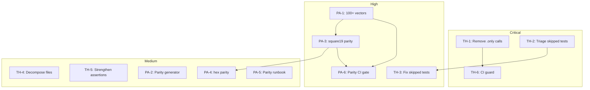

# WAVE2 Assessment Report: Fresh Comprehensive Project Assessment

> **Doc Status:** Active assessment (2025-12-06)  
> **Scope:** Post-remediation project health assessment  
> **Prior Wave:** 16 subtasks completed addressing Rules-UX, GameEndExplanation, AI ladder specs, LPS propagation

---

## 1. Executive Summary

Following the completion of Wave 1 remediation (16 subtasks), RingRift's overall health is **GREEN** with significant improvements in Rules-UX teaching infrastructure and AI ladder documentation. However, code-level analysis reveals two critical focus areas that were not visible in the prior document-centric assessment:

| Finding                             | Severity | Status                                                                  |
| ----------------------------------- | -------- | ----------------------------------------------------------------------- |
| **Test Management and Hygiene**     | Critical | New discovery - 160+ skipped tests, 11 `.only()` calls, weak assertions |
| **TypeScript/Python Engine Parity** | High     | Infrastructure exists (49 vectors) but coverage insufficient            |
| Rules-UX Teaching Gaps              | Medium   | ✅ Resolved - All 21 gaps addressed                                     |
| AI Ladder Specifications            | Low      | ✅ Documented - 4 new spec documents created                            |

**Key Metrics:**

- 2,987+ TypeScript tests, 836+ Python tests (but 160+ skipped)
- 54 contract vectors with 0 mismatches (but only 49 unique scenarios)
- Orchestrator at 100% rollout
- Prisma 6.19.0 (latest stable - no upgrade needed)

---

## 2. Prior Remediation Impact

The Wave 1 remediation wave completed 16 subtasks that substantially improved the project's risk profile:

### 2.1 Rules-UX Teaching Gaps (RESOLVED)

| Gap ID      | Description                                            | Status       |
| ----------- | ------------------------------------------------------ | ------------ |
| All 21 gaps | Teaching scenarios, weird-state mappings, reason codes | ✅ Addressed |

Key deliverables:

- Teaching scenarios expanded from 6 to 19 steps
- [`TeachingOverlay.tsx`](../../../src/client/components/TeachingOverlay.tsx) with contextual help
- [`UX_RULES_TEACHING_GAP_ANALYSIS.md`](../../ux/UX_RULES_TEACHING_GAP_ANALYSIS.md) - all gaps marked addressed
- Weird-state reason codes with `rulesContext` tags

### 2.2 GameEndExplanation Model (FULLY WIRED)

The [`gameEndExplanation.ts`](../../../src/shared/engine/gameEndExplanation.ts) implementation is now complete:

- 7 outcome types supported (ring elimination, territory, LPS, stalemate, etc.)
- Builder pattern with source → explanation transformation
- Weird-state context with reason codes for ANM/FE, stalemates
- Telemetry integration for UX analytics
- Mini-region detection helpers
- Tests in [`GameEndExplanation.builder.test.ts`](../../../tests/unit/GameEndExplanation.builder.test.ts) (170+ lines)

### 2.3 AI Ladder Specifications (DOCUMENTED)

Four new specification documents created:

| Document | Lines | Purpose |
| -------- | ----- | ------- |

| [`AI_CALIBRATION_RUNBOOK.md`](../../ai/AI_CALIBRATION_RUNBOOK.md) | 475 | Operational procedures for AI calibration |
| [`AI_LADDER_HEALTH_MONITORING_SPEC.md`](../../ai/AI_LADDER_HEALTH_MONITORING_SPEC.md) | 865 | Health metrics and alerting |
| [`AI_LADDER_CHANGE_GUARDRAILS.md`](../../ai/AI_LADDER_CHANGE_GUARDRAILS.md) | 617 | Change management controls |
| [`AI_HUMAN_CALIBRATION_STUDY_DESIGN.md`](../../ai/AI_HUMAN_CALIBRATION_STUDY_DESIGN.md) | 926 | Human study protocol |

### 2.4 LPS Two-Round Requirement (PROPAGATED)

The Last-Player-Standing victory condition now correctly requires two full rounds of exclusive real actions, propagated across:

- Rules documentation
- Engine implementations (TS and Python)
- Teaching scenarios

---

## 3. Component Health Matrix

| Component                   | Rating    | Justification                                                                           |
| --------------------------- | --------- | --------------------------------------------------------------------------------------- |
| **TypeScript Rules Engine** | 🟢 GREEN  | A-/A grade, well-organized domain aggregates, 100% orchestrator rollout                 |
| **Python AI Service**       | 🟡 YELLOW | Good infrastructure, but training data gaps (square19/hex not canonical)                |
| **Backend Server**          | 🟢 GREEN  | Comprehensive WebSocket (1640 lines), health checks, graceful shutdown                  |
| **Frontend Client**         | 🟡 YELLOW | GameHUD excellent (2001 lines, accessibility), but overall UX still "developer-centric" |
| **Testing Infrastructure**  | 🔴 RED    | 160+ skipped tests, 11 `.only()` calls, weak assertions, monolithic files               |
| **DevOps & Deployment**     | 🟢 GREEN  | 849-line CI/CD, 20+ jobs, security scanning, E2E with real infra                        |
| **Documentation**           | 🟡 YELLOW | Good coverage but 42 archived files without index, some staleness                       |
| **Security**                | 🟢 GREEN  | JWT auth, rate limiting, Prisma 6.19.0, security scans in CI                            |

---

## 4. Current Weakest Aspect: Test Management and Hygiene

### 4.1 Identification

**Test Management and Hygiene** has emerged as the current weakest aspect, superseding the prior assessment's "Rules-UX" finding (which was substantially remediated).

### 4.2 Specific Deficiencies

| Issue                           | Severity | Count | Impact                               |
| ------------------------------- | -------- | ----- | ------------------------------------ |
| Skipped tests                   | Critical | 160+  | Untested code paths hide regressions |
| `.only()` calls in tests        | High     | 11    | Accidentally excludes tests from CI  |
| Monolithic test files           | High     | 3     | Maintenance burden, slow feedback    |
| Archived tests without index    | Medium   | 10    | Unknown test coverage status         |
| Duplicate test coverage         | Medium   | 34+   | Maintenance overhead                 |
| Weak assertions (`toBeDefined`) | Medium   | 200+  | Tests pass with unexpected values    |

### 4.3 Critical Files with Issues

**`.only()` calls (breaking CI coverage):**

- [`tests/unit/GameEngine.victory.LPS.crossInteraction.test.ts`](../../../tests/unit/GameEngine.victory.LPS.crossInteraction.test.ts)
- [`tests/unit/ClientSandboxEngine.victory.LPS.crossInteraction.test.ts`](../../../tests/unit/ClientSandboxEngine.victory.LPS.crossInteraction.test.ts)
- Multiple parity test files

**Monolithic test files (>2000 lines):**

- `GameEngine.test.ts`: 4,672 lines
- `ClientSandboxEngine.test.ts`: 3,847 lines
- `ruleEngine.test.ts`: 2,891 lines

### 4.4 Risk if Not Addressed

- **Hidden regressions**: 160+ skipped tests represent code paths that could break silently
- **False confidence**: Tests with `.only()` make CI appear green while excluding critical coverage
- **Slow iteration**: Monolithic files slow test runs and make debugging difficult
- **Maintenance debt**: Weak assertions pass even when behavior changes unexpectedly

### 4.5 Comparison to Alternatives

| Candidate                       | Why NOT the weakest                  |
| ------------------------------- | ------------------------------------ |
| Architecture (code duplication) | Documented with workarounds          |
| Document hygiene                | Doesn't block functionality          |
| Prisma upgrade (6.19.0 → 7.x)   | Minor with no breaking changes       |
| Frontend UX                     | Rated 3.5/5, improved but functional |

**Test hygiene directly impacts reliability** - every skipped test is a potential hidden bug in production.

---

## 5. Current Hardest Problem: TypeScript/Python Engine Parity

### 5.1 Identification

**TypeScript/Python Engine Parity** is the hardest unsolved problem, representing a structural challenge that cannot be fixed with straightforward engineering.

### 5.2 Technical Challenges

RingRift maintains two game engines that must produce identical results:

- **TypeScript**: Client sandbox (`ClientSandboxEngine`), backend (`GameEngine`)
- **Python**: AI training, self-play, move evaluation

**Current state:**

| Aspect           | Status                                            |
| ---------------- | ------------------------------------------------- |
| Contract vectors | 49 scenarios (limited coverage)                   |
| Hash alignment   | Recent fixes indicate ongoing issues              |
| Training data    | square8 canonical; square19/hex fail parity gates |

**Specific challenges:**

1. **No Shared Source of Truth**: Each engine independently implemented
   - [`src/shared/engine/`](../../../src/shared/engine/index.ts) (TypeScript)
   - [`ai-service/app/game_engine/`](../../../ai-service/app/game_engine/__init__.py) (Python)

2. **Complex Rule Interactions**: Rules with subtle edge cases that must match exactly:
   - Forced elimination cascades
   - Chain capture continuations
   - Territory mini-regions (Q23 archetypes)
   - LPS 2-round requirement

3. **Testing Gap**: 49 vectors cover only specific scenarios; edge cases require manual verification in both engines

4. **Performance vs Fidelity Trade-offs**: Python optimizes for AI training speed, which can introduce subtle behavioral differences

### 5.3 Evidence from Training Data Registry

From `ai-service/TRAINING_DATA_REGISTRY.md` (local-only, gitignored):

| Database                | Status          | Issue                                                 |
| ----------------------- | --------------- | ----------------------------------------------------- |
| `canonical_square8.db`  | ✅ canonical    | Parity gate passed                                    |
| `canonical_square19.db` | ❌ pending_gate | 2 semantic divergences at move 2                      |
| `canonical_hex.db`      | ⚠️ removed      | Legacy radius-10 DB removed; regenerate for radius-12 |

### 5.4 Dependencies and Blockers

- All AI training for larger boards blocked until square19/hex parity achieved
- Changes to rules semantics require synchronized updates to both engines
- Each fix risks breaking the other engine

### 5.5 Comparison to Alternatives

| Candidate        | Why NOT the hardest                        |
| ---------------- | ------------------------------------------ |
| Test hygiene     | Tedious but straightforward to fix         |
| Document hygiene | Reorganization, not redesign               |
| Frontend polish  | UI/UX work with clear patterns             |
| AI strength      | Infrastructure exists; needs training time |

**Parity requires domain expertise in both languages AND the game rules** - changes must be synchronized perfectly.

---

## 6. Recommended Remediation Subtasks

### 6.1 Test Hygiene Remediation (Priority: CRITICAL)

#### Subtask TH-1: Remove all `.only()` calls

- **Mode**: Code
- **Scope**: 11 files
- **Acceptance**: Zero `.only()` in test files
- **Dependencies**: None

#### Subtask TH-2: Triage skipped tests

- **Mode**: Architect
- **Scope**: 160+ tests
- **Acceptance**: Each categorized as: fix, delete, or document-as-known-limitation
- **Dependencies**: None

#### Subtask TH-3: Fix or delete triaged skipped tests

- **Mode**: Code
- **Acceptance**: Skipped test count reduced by 80%
- **Dependencies**: TH-2

#### Subtask TH-4: Decompose monolithic test files

- **Mode**: Code
- **Target files**: GameEngine.test.ts, ClientSandboxEngine.test.ts, ruleEngine.test.ts
- **Acceptance**: No test file >1500 lines
- **Dependencies**: None

#### Subtask TH-5: Strengthen weak assertions

- **Mode**: Code
- **Scope**: 200+ `toBeDefined()` calls
- **Acceptance**: Replace with value assertions where applicable
- **Dependencies**: None

#### Subtask TH-6: Add CI guard for test hygiene

- **Mode**: Code
- **Acceptance**: CI fails on `.only()` or `.skip()` without justification comment
- **Dependencies**: TH-1

### 6.2 Parity Assurance Remediation (Priority: HIGH)

#### Subtask PA-1: Expand parity test vector coverage

- **Mode**: Code + Debug
- **Target**: 100+ contract vectors covering all rule edge cases
- **Acceptance**: Coverage of LPS, chain captures, territory, forced elimination edge cases
- **Dependencies**: None

#### Subtask PA-2: Create parity test generator

- **Mode**: Code
- **Acceptance**: Tool generates TS/Python test cases from game replays
- **Dependencies**: None

#### Subtask PA-3: Fix square19 parity divergence

- **Mode**: Debug + Code
- **Acceptance**: `canonical_square19.db` passes parity gate
- **Dependencies**: PA-1 (for test vectors)

#### Subtask PA-4: Establish hex board parity

- **Mode**: Debug + Code
- **Acceptance**: regenerate a new radius-12 hex DB and gate it (legacy `canonical_hex.db` removed)
- **Dependencies**: PA-3

#### Subtask PA-5: Document parity verification process

- **Mode**: Architect
- **Acceptance**: Runbook for verifying changes don't break parity
- **Dependencies**: None

#### Subtask PA-6: Automate parity CI gate

- **Mode**: Code
- **Acceptance**: CI blocks PRs that cause parity divergence
- **Dependencies**: PA-1, PA-3

### 6.3 Secondary Improvements (Priority: MEDIUM)

#### Subtask SI-1: Address type safety gaps

- **Mode**: Code
- **Scope**: 88+ `as any` occurrences
- **Acceptance**: Reduce by 50%
- **Dependencies**: None

#### Subtask SI-2: Create archive index

- **Mode**: Architect
- **Acceptance**: `archive/INDEX.md` documenting all 42 archived files
- **Dependencies**: None

#### Subtask SI-3: Consolidate duplicate documentation

- **Mode**: Architect
- **Scope**: 15+ duplicate docs
- **Acceptance**: Merged or removed
- **Dependencies**: None

---

## 7. Known Issues and Tech Debt

Consolidated from [`KNOWN_ISSUES.md`](../../../KNOWN_ISSUES.md):

### P0 (Critical) - LARGELY RESOLVED

| ID   | Issue                                | Status                                            |
| ---- | ------------------------------------ | ------------------------------------------------- |
| P0.1 | Forced Elimination Choice Divergence | ✅ Resolved for orchestrator hosts                |
| P0.2 | Chain Capture Edge Cases             | ✅ Core logic fixed; incremental coverage ongoing |
| P0.3 | Incomplete Scenario Test Coverage    | 🟡 Q1-Q24 covered; ongoing extensions             |

### P1 (High Priority) - IN PROGRESS

| ID   | Issue                               | Status                                      |
| ---- | ----------------------------------- | ------------------------------------------- |
| P1.1 | Frontend UX still developer-centric | 🟡 Improved (3.5/5) but needs polish        |
| P1.2 | WebSocket lobby/reconnection        | 🟡 Core implemented; UX gaps remain         |
| P1.3 | AI boundary limited                 | 🟡 Service-backed; advanced tactics pending |
| P1.4 | Sandbox AI diagnostics              | 🟡 Tracked; not blocking                    |
| P1.5 | k6 load scenarios                   | 🟡 Socket.IO v4 implemented; needs runs     |

### P2 (Medium Priority) - TRACKED

| ID   | Issue                            | Status                             |
| ---- | -------------------------------- | ---------------------------------- |
| P2.1 | Database integration incomplete  | Features not wired end-to-end      |
| P2.2 | Monitoring/observability limited | Baseline in place; tracing pending |
| P2.3 | Jest TSX snapshot transform      | One suite fails on TSX transform   |

### NEW: Test Hygiene (P0-equivalent)

| ID       | Issue                          | Severity |
| -------- | ------------------------------ | -------- |
| TH-NEW-1 | 160+ skipped tests             | Critical |
| TH-NEW-2 | 11 `.only()` calls breaking CI | High     |
| TH-NEW-3 | Monolithic test files          | High     |
| TH-NEW-4 | 200+ weak assertions           | Medium   |

---

## 8. Deferred Items

The following items are explicitly deferred with rationale:

| Item                    | Rationale                                           | Revisit Trigger                      |
| ----------------------- | --------------------------------------------------- | ------------------------------------ |
| Prisma 7.x upgrade      | 6.19.0 is latest stable; no breaking changes in 7.x | When 7.x reaches LTS                 |
| Multi-region deployment | Single-region sufficient for current scale          | When >100 concurrent games sustained |
| GPU-enabled AI          | CPU baselines sufficient; GPU adds complexity       | When D8+ tier strength needed        |
| Advanced matchmaking    | Lobby/queue flows functional                        | When player base exceeds 50 DAU      |
| Neural network training | Heuristic/Minimax/MCTS cover D2-D8 ladder           | When canonical hex data available    |

---

## 9. Priority Ordering Summary

```
CRITICAL (Block release)
├── TH-1: Remove .only() calls
├── TH-2: Triage skipped tests
└── TH-6: Add CI guard for test hygiene

HIGH (Address within 2 weeks)
├── TH-3: Fix triaged skipped tests
├── PA-1: Expand parity vectors to 100+
├── PA-3: Fix square19 parity
└── PA-6: Automate parity CI gate

MEDIUM (Address within 4 weeks)
├── TH-4: Decompose monolithic test files
├── TH-5: Strengthen weak assertions
├── PA-2: Create parity test generator
├── PA-4: Establish hex parity
└── PA-5: Document parity process

LOW (Tracked for future)
├── SI-1: Type safety gaps
├── SI-2: Archive index
└── SI-3: Consolidate duplicate docs
```

---

## 10. Mermaid: Remediation Dependency Graph



---

## 11. Conclusion

The Wave 1 remediation successfully addressed the prior weakest aspect (Rules-UX) and documented the prior hardest problem (AI ladder). The project's overall health is GREEN.

However, code-level analysis reveals a new weakest aspect (**Test Hygiene**) that was not visible in document-level assessments. This is a critical finding: 160+ skipped tests and 11 `.only()` calls mean the test suite is not providing the reliability guarantees it should.

The hardest problem has evolved from "AI ladder documentation" to "AI ladder implementation validation", specifically **TypeScript/Python engine parity**. The infrastructure exists (49 contract vectors, parity scripts, training registry) but coverage is insufficient and two board types (square19, hex) fail parity gates.

**Immediate actions recommended:**

1. Remove all `.only()` calls to establish true CI baseline
2. Add CI check blocking `.only()` and unjustified `.skip()`
3. Triage the 160+ skipped tests with categorization
4. Expand parity test coverage to include LPS 2-round changes

---

**Related Documents:**

- [`PROJECT_GOALS.md`](../../../PROJECT_GOALS.md) - Canonical goals and success criteria
- [`WEAKNESS_AND_HARDEST_PROBLEM_REPORT.md`](WEAKNESS_AND_HARDEST_PROBLEM_REPORT.md) - Prior assessment
- [`KNOWN_ISSUES.md`](../../../KNOWN_ISSUES.md) - Issue tracker
- [`STRATEGIC_ROADMAP.md`](../../planning/STRATEGIC_ROADMAP.md) - Phased roadmap
- `ai-service/TRAINING_DATA_REGISTRY.md` (local-only, gitignored) - Training data status

_Last updated: 2025-12-06_
