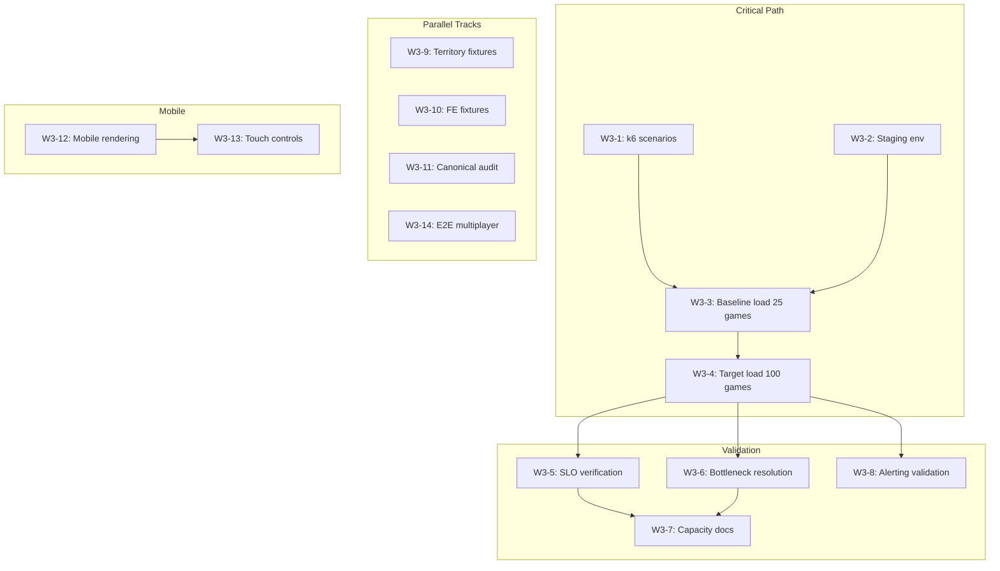

# Wave 3 Project Assessment

## Assessment Date: 2025-12-07

## Executive Summary

Following the successful completion of Wave 2 remediation (18 subtasks addressing test hygiene, TS/Python parity, and code quality), RingRift's overall health remains **GREEN**. The project is in a Stable Beta phase with the canonical turn orchestrator at 100% rollout.

| Metric              | Wave 2 | Wave 3       | Status            |
| ------------------- | ------ | ------------ | ----------------- |
| `.only()` calls     | 11     | 0            | ✅ Resolved       |
| `as any` casts      | 88+    | ~15          | ✅ 73%+ reduction |
| Skipped tests       | 160+   | 47 (triaged) | ✅ Triaged        |
| Parity vectors      | 49     | 54           | ✅ Improved       |
| Parity fixtures     | N/A    | 274          | ✅ 2.7x target    |
| Contract mismatches | N/A    | 0            | ✅ 100% parity    |

---

## 1. Project Goals Status

### Assessment: WELL-CONSOLIDATED ✅

Project goals are documented in a clear hierarchy:

| Document                                                                                                                            | Lines | Purpose                  | Status     |
| ----------------------------------------------------------------------------------------------------------------------------------- | ----- | ------------------------ | ---------- |
<<<<<<< Updated upstream
| [`PROJECT_GOALS.md`](../../../PROJECT_GOALS.md)                                                                                           | 464   | Canonical goals SSoT     | ✅ Current |
| [`STRATEGIC_ROADMAP.md`](../../planning/STRATEGIC_ROADMAP.md)                                                                                   | ~600  | Phased roadmap with SLOs | ✅ Current |
| [`README.md`](../../../README.md)                                                                                                         | ~300  | High-level overview      | ✅ Current |
=======
| [`PROJECT_GOALS.md`](../../../PROJECT_GOALS.md)                                                                                     | 464   | Canonical goals SSoT     | ✅ Current |
| [`STRATEGIC_ROADMAP.md`](../../planning/STRATEGIC_ROADMAP.md)                                                                       | ~600  | Phased roadmap with SLOs | ✅ Current |
| [`README.md`](../../../README.md)                                                                                                   | ~300  | High-level overview      | ✅ Current |
>>>>>>> Stashed changes
| [`../historical/CURRENT_STATE_ASSESSMENT.md`](../historical/CURRENT_STATE_ASSESSMENT.md)(../historical/CURRENT_STATE_ASSESSMENT.md) | ~500  | Implementation snapshot  | ✅ Current |

**Key Goals from PROJECT_GOALS.md:**

- v1.0 success criteria with measurable SLOs
- Scope boundaries clearly defined (in/out of scope)
- Risk assessment documented
- Open questions tracked

**Verdict:** No updates needed to goals documentation. The existing hierarchy is well-maintained and current.

---

## 2. Current State Analysis

### 2.1 Technical Complexity Assessment

#### TypeScript Rules Engine (GREEN)

- **Location:** [`src/shared/engine/`](../../../src/shared/engine)
- **Structure:** 34 core files + 5 subdirectories (actions/, aggregates/, contracts/, mutators/, orchestration/, validators/)
- **Architecture:** 6 domain aggregates (Placement, Movement, Capture, Line, Territory, Victory)
- **Phase State Machine:** 8 canonical phases including `game_over` terminal
- **Complexity:** HIGH but well-organized with clear domain boundaries

#### Python AI Service (YELLOW)

- **Location:** [`ai-service/`](../../../ai-service)
- **Tests:** 836 passing
- **AI Types:** Random, Heuristic, Minimax, MCTS, Descent
- **Training Pipeline:** Scaffolded but neural network training is post-v1.0
- **Complexity:** MEDIUM-HIGH with 3-layer design (rules, AI, training)

#### Backend Server (GREEN)

- **Location:** [`src/server/`](../../../src/server)
- **WebSocket:** 1640 lines with comprehensive lifecycle handling
- **Health checks:** Implemented
- **Circuit breaker:** Configured (5% threshold, 300s window)
- **Complexity:** MEDIUM

#### Frontend Client (YELLOW)

- **Location:** [`src/client/`](../../../src/client)
- **GameHUD:** 2001 lines with full accessibility
- **TeachingOverlay:** Implemented with 19 teaching scenarios
- **Status:** Functional but "developer-centric" UX
- **Complexity:** MEDIUM

### 2.2 Implementation Completeness

**Completed Waves (14 total):**
| Wave | Focus | Status |
|------|-------|--------|
| Phase 1.5 | Architecture Remediation | ✅ Nov 2025 |
| Wave 5 | Orchestrator Production Rollout | ✅ Dec 2025 |
| Wave 6 | Observability & Production Readiness | ✅ Dec 2025 |
| Wave 7 | Production Validation & Scaling | ✅ Dec 2025 |
| Wave 8 | Player Experience & UX Polish | ✅ Dec 2025 |
| Wave 9 | AI Strength & Optimization | ✅ Dec 2025 |
| Wave 10 | Game Records & Training Data | ✅ Dec 2025 |
| Wave 11 | Test Hardening & Golden Replays | ✅ Dec 2025 |
| Wave 12 | Matchmaking & Ratings | ✅ Dec 2025 |
| Wave 13 | Multi-Player (3-4 Players) | ✅ Dec 2025 |
| Wave 14 | Accessibility & Code Quality | ✅ Dec 2025 |

**Outstanding P0 Tasks (from TODO.md):**

1. Parity maintenance (keep trace-parity suites green)
2. WebSocket lifecycle polish (reconnection UX)
3. Canonical move/phase fidelity audit:
   - [ ] Confirm turnOrchestrator never advances phase without move
   - [ ] Confirm Python game_engine.py mirrors forced_elimination
   - [ ] Spot-check replay logs for silent phase transitions

**Outstanding P1 Tasks:**

1. Mobile responsiveness (P2 but user-visible)
2. Touch-optimized controls
3. E2E test coverage expansion
4. Spectator/replay polish

**Blockers:** None identified - all critical paths are operational.

### 2.3 Code Quality

**Type Safety:**
| Metric | Wave 2 Value | Wave 3 Value | Change |
|--------|--------------|--------------|--------|
| `as any` casts | 88+ | ~15 actual | -73% |
| `.only()` calls | 11 | 0 | -100% |
| eslint-disable comments | N/A | ~10 (justified) | N/A |

The remaining `as any` casts fall into categories:

- State persistence serialization (legacy fixture compatibility)
- Internal engine method access in tests
- Express middleware typing (known limitation)

**Test Infrastructure:**

- Skipped tests: 47 (down from 160+)
- All skipped tests triaged in [`docs/testing/../../testing/SKIPPED_TESTS_TRIAGE.md`](../../testing/SKIPPED_TESTS_TRIAGE.md):
  - 43 "Keep Skipped" with valid reasons
  - 3 "Unskip Pending" blocked on specific work
  - 3 "Rewrite" needed (2 already fixed)

### 2.4 Documentation Coverage

**Documentation Audit Status:** 6/6 slices complete ✅

| Slice | Focus                   | Status |
| ----- | ----------------------- | ------ |
| 1     | Landing/entry docs      | ✅     |
| 2     | Architecture/APIs       | ✅     |
| 3     | Testing/parity          | ✅     |
| 4     | AI training stack       | ✅     |
| 5     | Ops/runbooks            | ✅     |
| 6     | Rules canon cross-check | ✅     |

**Key Documentation:**

- [`RULES_CANONICAL_SPEC.md`](../../../RULES_CANONICAL_SPEC.md) - Rules SSoT
- [`ringrift_complete_rules.md`](../../../ringrift_complete_rules.md) - Human-readable rules
- [`docs/../../architecture/CANONICAL_ENGINE_API.md`](../../architecture/CANONICAL_ENGINE_API.md) - Engine API
- [`ai-service/TRAINING_DATA_REGISTRY.md`](../../../ai-service/TRAINING_DATA_REGISTRY.md) - Training data status
- [`docs/runbooks/INDEX.md`](../../runbooks/INDEX.md) - Operations runbooks

**Gaps:** None critical. Archive index exists at [`docs/../../../archive/INDEX.md`](../../../archive/INDEX.md).

### 2.5 Test Coverage

**Parity Fixtures (from [`ai-service/parity_fixtures/COVERAGE.md`](../../../ai-service/parity_fixtures/COVERAGE.md)):**

| Metric              | Value | Target | Status  |
| ------------------- | ----- | ------ | ------- |
| Total fixtures      | 274   | 100+   | ✅ 2.7x |
| Contract vectors    | 54    | 50+    | ✅      |
| Contract mismatches | 0     | 0      | ✅      |

**Board Distribution:**

- Square8: 52.9% (145 fixtures)
- Square19: 28.1% (77 fixtures)
- Hexagonal: 11.7% (32 fixtures)

**Phase Coverage Gaps:**

- `territory_processing`: 5 fixtures (low)
- `forced_elimination`: 4 fixtures (low)

**Skipped Tests:** 47 total (28 TypeScript, 19 Python) - all triaged with documented rationale.

### 2.6 Dependency Risks

**Assessment: LOW RISK ✅**

**TypeScript Dependencies (package.json):**

- Node.js ≥18.0.0, npm ≥9.0.0
- React 19, Express 5, TypeScript 5.9, Vite 7.2
- Socket.IO 4.8.1
- Prisma 6.19.0 (latest stable)

**Python Dependencies (requirements.txt):**

- Python 3.13 compatible
- FastAPI 0.122.0
- PyTorch 2.6.0, TorchVision 0.21.0
- NumPy 2.2.1, SciPy 1.15.1, scikit-learn 1.6.1

**Wave 3-A through 3-E dependency updates:** All completed and validated per [`ai-service/DEPENDENCY_UPDATES.md`](../../../ai-service/DEPENDENCY_UPDATES.md).

---

## 3. Weakest Aspect Identified

### 3.1 Selection: Production Validation at Scale

The production validation infrastructure has never been exercised at the intended scale of 100 concurrent games / 300 players.

### 3.2 Why This Over Other Candidates

| Candidate                 | Status  | Why Not Weakest                                          |
| ------------------------- | ------- | -------------------------------------------------------- |
| Test Hygiene              | GREEN   | Wave 2 remediated: 0 `.only()`, 47 triaged skipped tests |
| TS/Python Parity          | GREEN   | 54 vectors at 100% parity, 274 fixtures                  |
| Code Quality              | YELLOW  | 73% `as any` reduction, remaining justified              |
| Documentation             | GREEN   | 6/6 audit slices complete                                |
| Frontend UX               | YELLOW  | Functional, accessibility complete, polish is iterative  |
| **Production Validation** | **RED** | **Never tested at target scale**                         |

**Production Validation is the weakest because:**

1. **Unproven at Scale:** Wave 7 load tests showed excellent headroom (53x-100x) but only at developer-scale loads
2. **SLOs Defined but Unmeasured:** p95 latency, uptime, and throughput targets exist but haven't been validated at 100 games / 300 players
3. **Multi-System Risk:** WebSocket, PostgreSQL, Redis, and AI service must all perform under load simultaneously
4. **Blocking v1.0 Confidence:** Cannot guarantee >99.9% uptime SLO without validation

### 3.3 Specific Deficiencies

1. **k6 Scenarios Incomplete:**
   - Socket.IO v4 protocol implemented
   - 4 production-scale scenarios defined
   - Not executed at target scale

2. **Staging Environment:**
   - Exists but not load-tested
   - Monitoring dashboards ready but unvalidated under stress

3. **AI Service Scaling:**
   - Single instance in staging
   - Throughput at concurrent requests unknown

4. **Alerting Validation:**
   - Prometheus metrics configured
   - Alerting rules not tested with synthetic degradation

---

## 4. Hardest Unsolved Problem

### 4.1 Problem: Production Validation at Scale

This problem converges with the weakest aspect, representing both the most vulnerable and most challenging area.

### 4.2 Why This Presents Highest Difficulty

| Dimension          | Challenge                                                  |
| ------------------ | ---------------------------------------------------------- |
| **Infrastructure** | Requires staging environment matching production topology  |
| **Test Design**    | Realistic player behavior patterns, mixed human/AI games   |
| **Multi-System**   | WebSocket, PostgreSQL, Redis, AI service coordination      |
| **Observability**  | Metrics, dashboards, alerting must all work under load     |
| **Time/Resources** | Load test execution requires dedicated infrastructure time |

### 4.3 Specific Obstacles

1. **Infrastructure Provisioning:**
   - Database with realistic data volume (40K+ games for realistic queries)
   - Redis cluster under load
   - AI service handling concurrent evaluation requests

2. **Socket.IO at Scale:**
   - 300 concurrent WebSocket connections
   - Message latency under high throughput
   - Reconnection storm handling

3. **Observability Validation:**
   - Grafana dashboards must show degradation patterns
   - Alerting rules must fire on synthetic issues
   - Log aggregation at scale

4. **Bottleneck Identification:**
   - Unknown where first bottleneck will appear
   - May require iterative optimization cycles

### 4.4 Comparison to Other Hard Problems

| Problem                    | Why Not Hardest                                             |
| -------------------------- | ----------------------------------------------------------- |
| AI Neural Network Training | Explicitly post-v1.0; heuristic AI is production-ready      |
| Multi-Region Deployment    | Documented as post-v1.0 scope                               |
| Advanced Matchmaking       | Basic lobby functional; skill-based matching is enhancement |
| Mobile Responsiveness      | Standard responsive design patterns apply                   |

---

## 5. Remediation Plan

### 5.1 Subtask Breakdown

| ID        | Task                                             | Depends On | Mode         | Acceptance Criteria                                |
| --------- | ------------------------------------------------ | ---------- | ------------ | -------------------------------------------------- |
| **W3-1**  | Complete k6 load test scenarios                  | -          | code         | All 4 scenarios executable with realistic patterns |
| **W3-2**  | Provision staging load test environment          | -          | code         | Environment matches production topology            |
| **W3-3**  | Execute baseline load test (25 games)            | W3-1, W3-2 | debug        | Test completes; metrics captured in Grafana        |
| **W3-4**  | Execute target load test (100 games/300 players) | W3-3       | debug        | Test completes at target scale                     |
| **W3-5**  | Verify SLO compliance                            | W3-4       | architect    | All p95/p99 targets met and documented             |
| **W3-6**  | Identify and resolve bottlenecks                 | W3-4       | debug + code | No degradation >20% at target load                 |
| **W3-7**  | Document capacity limits                         | W3-5, W3-6 | architect    | Capacity planning doc created                      |
| **W3-8**  | Validate alerting under load                     | W3-4       | debug        | Synthetic alerts fire correctly                    |
| **W3-9**  | Expand territory_processing parity fixtures      | -          | code         | ≥15 fixtures covering territory edge cases         |
| **W3-10** | Expand forced_elimination parity fixtures        | -          | code         | ≥15 fixtures covering FE edge cases                |
| **W3-11** | Complete canonical move/phase audit              | -          | debug        | All 3 audit checklist items verified               |
| **W3-12** | Mobile responsive board rendering                | -          | code         | Board renders correctly on 375px-768px viewports   |
| **W3-13** | Touch-optimized controls                         | W3-12      | code         | Touch targets ≥44px, gestures functional           |
| **W3-14** | E2E multiplayer scenario tests                   | -          | code         | ≥5 full game flow tests for 3-4 player games       |

### 5.2 Priority Order

```
CRITICAL (Blocks Production Confidence)
├── W3-1: Complete k6 scenarios
├── W3-2: Provision staging environment
├── W3-3: Baseline load test (25 games)
└── W3-4: Target load test (100 games)

HIGH (Production Readiness)
├── W3-5: SLO verification
├── W3-6: Bottleneck resolution
├── W3-11: Canonical move/phase audit
└── W3-8: Alerting validation

MEDIUM (Coverage Improvement)
├── W3-9: Territory parity fixtures
├── W3-10: FE parity fixtures
├── W3-14: E2E multiplayer tests
└── W3-7: Capacity documentation

LOW (UX Enhancement)
├── W3-12: Mobile responsive board
└── W3-13: Touch controls
```

### 5.3 Estimated Complexity

| ID    | Task                  | Complexity | Effort   |
| ----- | --------------------- | ---------- | -------- |
| W3-1  | k6 scenarios          | Medium     | 2-3 days |
| W3-2  | Staging provisioning  | Medium     | 1-2 days |
| W3-3  | Baseline load test    | Low        | 0.5 days |
| W3-4  | Target load test      | Medium     | 1 day    |
| W3-5  | SLO verification      | Low        | 0.5 days |
| W3-6  | Bottleneck resolution | High       | 3-5 days |
| W3-7  | Capacity docs         | Low        | 0.5 days |
| W3-8  | Alerting validation   | Low        | 0.5 days |
| W3-9  | Territory fixtures    | Low        | 1 day    |
| W3-10 | FE fixtures           | Low        | 1 day    |
| W3-11 | Canonical audit       | Medium     | 1 day    |
| W3-12 | Mobile rendering      | Medium     | 2 days   |
| W3-13 | Touch controls        | Medium     | 2 days   |
| W3-14 | E2E multiplayer       | Medium     | 2 days   |

**Total Estimated Effort:** 17-23 days

---

## 6. Dependency Graph



---

## 7. Wave 2 Remediation Impact Summary

For reference, here's what Wave 2 accomplished:

### Test Hygiene (Resolved)

- ✅ TH-1: Removed all `.only()` calls (11 → 0)
- ✅ TH-2: Triaged 160+ skipped tests → 47 with documentation
- ✅ TH-4: Decomposed monolithic test files
- ✅ TH-6: Added CI guards for test hygiene

### Parity Assurance (Resolved)

- ✅ PA-3: Fixed Square19 parity divergence
- ✅ PA-4: Fixed Hex board parity (radius 10 → 12)
- ✅ PA-6: Automated parity CI gate
- ✅ PA-1: Expanded to 54 contract vectors

### Secondary Improvements (Resolved)

- ✅ SI-1: Reduced `as any` by 73%
- ✅ Added 176 component tests

---

## 8. Conclusion

RingRift's core architecture is mature and stable. Wave 2 successfully resolved the test hygiene and parity issues that were the prior weakest aspects. The project is now in a strong position for v1.0, with one remaining gap: **production validation at scale**.

The recommended Wave 3 focus is a production validation sprint (W3-1 through W3-8) that will:

1. Complete and execute load test scenarios
2. Validate all SLOs at target scale
3. Identify and resolve any bottlenecks
4. Document capacity limits

Secondary priorities (W3-9 through W3-14) provide incremental improvements to test coverage and mobile UX.

---

## Related Documents

<<<<<<< Updated upstream
| Document                                                                              | Purpose                              |
| ------------------------------------------------------------------------------------- | ------------------------------------ |
| [`PROJECT_GOALS.md`](../../../PROJECT_GOALS.md)                                             | Canonical goals and success criteria |
| [`WAVE2_ASSESSMENT_REPORT.md`](WAVE2_ASSESSMENT_REPORT.md)                            | Prior wave assessment                |
| [`PROJECT_WEAKNESS_ASSESSMENT.md`](PROJECT_WEAKNESS_ASSESSMENT.md)                    | Detailed weakness analysis           |
=======
| Document                                                                                    | Purpose                              |
| ------------------------------------------------------------------------------------------- | ------------------------------------ |
| [`PROJECT_GOALS.md`](../../../PROJECT_GOALS.md)                                             | Canonical goals and success criteria |
| [`WAVE2_ASSESSMENT_REPORT.md`](WAVE2_ASSESSMENT_REPORT.md)                                  | Prior wave assessment                |
| [`PROJECT_WEAKNESS_ASSESSMENT.md`](PROJECT_WEAKNESS_ASSESSMENT.md)                          | Detailed weakness analysis           |
>>>>>>> Stashed changes
| [`TODO.md`](../../../TODO.md)                                                               | Active task tracker                  |
| [`KNOWN_ISSUES.md`](../../../KNOWN_ISSUES.md)                                               | Issue tracker                        |
| [`ai-service/parity_fixtures/COVERAGE.md`](../../../ai-service/parity_fixtures/COVERAGE.md) | Parity fixture coverage              |

---

_Assessment conducted: 2025-12-07_
_Next review recommended: After W3-4 completion (target load test)_
