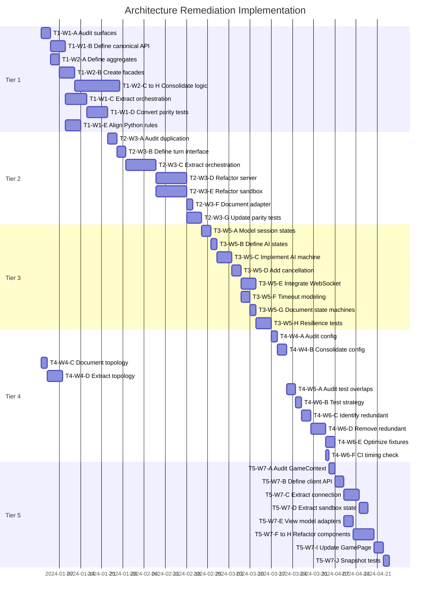

# Architecture Remediation Plan

This document outlines a comprehensive, prioritized set of subtasks to address seven identified architectural weaknesses in the RingRift codebase. The weaknesses are organized into five priority tiers based on the synthesis assessment.

> **SSoT alignment:** This remediation plan is a derived roadmap over the following canonical sources:
>
> - **Rules semantics SSoT:** Shared TypeScript rules engine under `src/shared/engine/**` (helpers → domain aggregates → turn orchestrator → contracts) plus v2 contract vectors and runners (`tests/fixtures/contract-vectors/v2/**`, `tests/contracts/contractVectorRunner.test.ts`, `ai-service/tests/contracts/test_contract_vectors.py`) and rules docs (`RULES_CANONICAL_SPEC.md`, `RULES_ENGINE_ARCHITECTURE.md`, `RULES_IMPLEMENTATION_MAPPING.md`, `docs/RULES_ENGINE_SURFACE_AUDIT.md`).
> - **Lifecycle/API SSoT:** `docs/CANONICAL_ENGINE_API.md` and shared types/schemas under `src/shared/types/**`, `src/shared/engine/orchestration/types.ts`, and `src/shared/validation/websocketSchemas.ts` for the executable Move/orchestrator/WebSocket lifecycle.
> - **Operational SSoT:** CI workflows (`.github/workflows/*.yml`), Dockerfiles, docker-compose stacks, monitoring configs under `monitoring/**`, and runtime config/env validation code under `src/server/config/**`, `src/shared/utils/envFlags.ts`, and `scripts/validate-deployment-config.ts`.
> - **Precedence:** If this plan ever conflicts with those specs, engines, types, or configs, **code + tests win**, and this document must be updated to match them.
>
> **Doc Status (2025-11-26): Active (Tiers 1–2 Complete; Tiers 3–5 Planned / In Progress / Partially Historical)**
>
> - Tiers 1–2 describe the **canonical helpers + aggregates + orchestrator + contracts** stack and the backend/client adapters over it; these tiers are now **implemented and verified**.
> - Tiers 3–5 capture **planned or partially implemented** work around async state machines, configuration/test consolidation, and client architecture separation.
> - Some Tier 3–5 subtasks are aspirational or superseded by later designs; they are kept here for historical context and as a planning backlog, not as a strict implementation contract.
> - A few subtask rows mention conceptual modules (for example `src/server/game/PlayerInteractionManager.ts` and additional `validators/*` / `mutators/*` files). These were used as design handles and were never created; on conflict, always defer to the concrete modules and paths documented in `RULES_IMPLEMENTATION_MAPPING.md` and `docs/RULES_ENGINE_SURFACE_AUDIT.md`.
>
> Readers should treat this document as the **authoritative roadmap for past and future remediation work**, with Tiers 1–2 reflecting the completed orchestrator-centric architecture and Tiers 3–5 serving as structured planning guidance.
>
> **🎉 Status Update (2025-11-26)**: Tiers 1 and 2 are now COMPLETE. The canonical turn orchestrator has been implemented with backend and client adapters, and cross-language contract tests achieve 100% parity.

## Executive Summary

~~The codebase is well-documented and heavily tested, particularly around rules parity and AI integration. The identified weaknesses are not critical failures but rather high-complexity, high-coupling zones where future changes will be slow and risky unless the architecture is tightened.~~

**Current Status**: The major architectural weaknesses have been addressed through a 4-phase remediation effort. Tiers 1-2 are complete with the canonical orchestrator pattern fully implemented.

---

## Priority Tier 1: Canonical Rules Engine and Public Surface

**Weaknesses Addressed:** #1 (Rules Engine Duplication and Parity Burden), #2 (Shared Rules Engine Complexity and Fragmentation)

### Tier Overview

This tier establishes a single canonical rules engine with a narrow, stable public API boundary. The goal is to reduce the three rules engine surfaces (`src/shared/engine`, `src/server/game`, `ai-service/app/rules`) to a clear hierarchy where server and client sandbox become thin orchestration layers over the shared engine.

**Expected Outcomes:**

- Single source of truth for game rules
- Domain-driven decomposition with clear aggregates
- Reduced cognitive load when making rules changes
- Parity tests converted to contract tests validating the canonical engine

### Subtasks

| Subtask ID | Weakness # | Description                                                                                                                                         | Deliverable/Outcome                                                                                                                                                                                  | Files/Modules in Scope                                                                                                                                                                 | Dependencies            | Complexity | Agent     |
| ---------- | ---------- | --------------------------------------------------------------------------------------------------------------------------------------------------- | ---------------------------------------------------------------------------------------------------------------------------------------------------------------------------------------------------- | -------------------------------------------------------------------------------------------------------------------------------------------------------------------------------------- | ----------------------- | ---------- | --------- |
| T1-W1-A    | 1          | **Audit current rules engine surfaces** - Document all rules logic entry points across shared engine, server game/, and Python ai-service/app/rules | Markdown document mapping each surface's responsibilities, overlaps, and divergence points                                                                                                           | `src/shared/engine/*.ts`, `src/server/game/GameEngine.ts`, `src/server/game/RuleEngine.ts`, `src/server/game/rules/*.ts`, `ai-service/app/rules/*.py`                                  | None                    | M          | Architect |
| T1-W1-B    | 1          | **Define canonical engine public API** - Create explicit interface module defining the stable public API for the shared engine                      | `src/shared/engine/index.ts` with explicit exports, `CanonicalEngine` interface type definition                                                                                                      | `src/shared/engine/index.ts` (new or refactored), `src/shared/engine/types.ts`                                                                                                         | T1-W1-A                 | L          | Architect |
| T1-W1-C    | 1          | **Extract orchestration concerns from shared engine** - Separate pure rules logic from orchestration/session concerns                               | Refactored shared engine with clear separation; orchestration extracted to dedicated module                                                                                                          | `src/shared/engine/GameEngine.ts`, `src/shared/engine/turnLifecycle.ts`, `src/shared/engine/turnLogic.ts`                                                                              | T1-W1-B                 | L          | Code      |
| T1-W2-A    | 2          | **Define domain aggregates** - Identify and document domain aggregates with single entry points                                                     | Architecture document defining aggregates: Placement, Movement, Capture, Line, Territory, Victory                                                                                                    | `src/shared/engine/` directory analysis, new `DOMAIN_AGGREGATES.md`                                                                                                                    | T1-W1-A                 | M          | Architect |
| T1-W2-B    | 2          | **Create aggregate facade interfaces** - Define explicit facade interfaces for each domain aggregate                                                | TypeScript interfaces: `PlacementAggregate`, `MovementAggregate`, `CaptureAggregate`, `LineAggregate`, `TerritoryAggregate`, `VictoryAggregate`                                                      | `src/shared/engine/aggregates/` (new directory), `src/shared/engine/types.ts`                                                                                                          | T1-W2-A                 | M          | Code      |
| T1-W2-C    | 2          | **Consolidate placement logic** - Refactor fragmented placement helpers into Placement aggregate                                                    | Single `PlacementAggregate` facade combining `placementHelpers.ts`, `PlacementMutator.ts`, `PlacementValidator.ts`                                                                                   | `src/shared/engine/placementHelpers.ts`, `src/shared/engine/mutators/PlacementMutator.ts`, `src/shared/engine/validators/PlacementValidator.ts`                                        | T1-W2-B                 | M          | Code      |
| T1-W2-D    | 2          | **Consolidate movement logic** - Refactor movement modules into Movement aggregate                                                                  | Single `MovementAggregate` facade combining `movementLogic.ts`, `movementApplication.ts`, `MovementMutator.ts`, `MovementValidator.ts`                                                               | `src/shared/engine/movementLogic.ts`, `src/shared/engine/movementApplication.ts`, `src/shared/engine/mutators/MovementMutator.ts`, `src/shared/engine/validators/MovementValidator.ts` | T1-W2-B                 | M          | Code      |
| T1-W2-E    | 2          | **Consolidate capture logic** - Refactor capture modules into Capture aggregate                                                                     | Single `CaptureAggregate` facade combining `captureLogic.ts`, `captureChainHelpers.ts`, `CaptureMutator.ts`, `CaptureValidator.ts`                                                                   | `src/shared/engine/captureLogic.ts`, `src/shared/engine/captureChainHelpers.ts`, `src/shared/engine/mutators/CaptureMutator.ts`, `src/shared/engine/validators/CaptureValidator.ts`    | T1-W2-B                 | L          | Code      |
| T1-W2-F    | 2          | **Consolidate line logic** - Refactor line modules into Line aggregate                                                                              | Single `LineAggregate` facade combining `lineDetection.ts`, `lineDecisionHelpers.ts`, `LineMutator.ts`, `LineValidator.ts`                                                                           | `src/shared/engine/lineDetection.ts`, `src/shared/engine/lineDecisionHelpers.ts`, `src/shared/engine/mutators/LineMutator.ts`, `src/shared/engine/validators/LineValidator.ts`         | T1-W2-B                 | M          | Code      |
| T1-W2-G    | 2          | **Consolidate territory logic** - Refactor territory modules into Territory aggregate                                                               | Single `TerritoryAggregate` facade combining `territoryDetection.ts`, `territoryProcessing.ts`, `territoryBorders.ts`, `territoryDecisionHelpers.ts`, `TerritoryMutator.ts`, `TerritoryValidator.ts` | `src/shared/engine/territory*.ts`, `src/shared/engine/mutators/TerritoryMutator.ts`, `src/shared/engine/validators/TerritoryValidator.ts`                                              | T1-W2-B                 | L          | Code      |
| T1-W2-H    | 2          | **Document module invariants** - Add JSDoc invariant documentation to each aggregate                                                                | Each aggregate facade has documented preconditions, postconditions, and invariants                                                                                                                   | All `src/shared/engine/aggregates/*.ts` files                                                                                                                                          | T1-W2-C through T1-W2-G | S          | Code      |
| T1-W1-D    | 1          | **Convert parity tests to contract tests** - Refactor Backend_vs_Sandbox tests to validate canonical engine API contracts                           | Contract test suite in `tests/contracts/` validating canonical engine invariants                                                                                                                     | `tests/unit/Backend_vs_Sandbox.*.test.ts`, new `tests/contracts/` directory                                                                                                            | T1-W1-C, T1-W2-H        | L          | Code      |
| T1-W1-E    | 1          | **Align Python rules with canonical interface** - Update Python rules service to implement equivalent canonical interface                           | Python `RulesEngine` class matching TypeScript `CanonicalEngine` interface                                                                                                                           | `ai-service/app/rules/interfaces.py`, `ai-service/app/rules/default_engine.py`                                                                                                         | T1-W1-B                 | M          | Code      |

### Completion Criteria

- [x] All rules logic flows through documented canonical engine API ✅
- [x] Domain aggregates have single entry points with documented invariants ✅
- [x] No direct imports of internal engine modules from server/game or client/sandbox ✅ (adapters use orchestrator)
- [x] Contract tests replace duplicative parity tests ✅ (12 vectors in tests/fixtures/contract-vectors/v2/)
- [x] Python rules implement equivalent interface to TypeScript canonical engine ✅ (100% parity)

### Verification Steps

1. Run `npm run lint` - no errors in refactored engine modules
2. Run `npm test -- --testPathPattern="contracts"` - all contract tests pass
3. Run `npm test -- --testPathPattern="Backend_vs_Sandbox"` - remaining parity tests pass
4. Verify no direct imports of engine internals: `grep -r "from '.*shared/engine/" src/server/game src/client/sandbox | grep -v "/index" | grep -v "/types" | grep -v "/aggregates"`
5. Run Python rules tests: `cd ai-service && pytest tests/`

---

## Priority Tier 2: Backend/Sandbox Orchestration Collapse

**Weakness Addressed:** #3 (Backend vs Client Sandbox Orchestration Divergence)

### Tier Overview

The client sandbox currently mirrors server game orchestration for phases, territory decisions, line detection, captures, and victory evaluation. This tier collapses the divergence by making the sandbox a thin visualization and interaction adapter over the canonical shared turn engine.

**Expected Outcomes:**

- Sandbox reduced to ~500 lines of adapter code
- Clear separation between authoritative rules and client-only UX features
- Parity tests validate adapter compliance rather than parallel implementations

### Subtasks

| Subtask ID | Weakness # | Description                                                                                                                             | Deliverable/Outcome                                                                       | Files/Modules in Scope                                                                                                                       | Dependencies               | Complexity | Agent     |
| ---------- | ---------- | --------------------------------------------------------------------------------------------------------------------------------------- | ----------------------------------------------------------------------------------------- | -------------------------------------------------------------------------------------------------------------------------------------------- | -------------------------- | ---------- | --------- |
| T2-W3-A    | 3          | **Audit Backend/Sandbox code duplication** - Catalog all duplicated logic between server GameEngine and ClientSandboxEngine             | Duplication matrix showing line-by-line correspondence and divergence                     | `src/server/game/GameEngine.ts` (~3,329 lines), `src/client/sandbox/ClientSandboxEngine.ts` (~2,712 lines), `src/client/sandbox/sandbox*.ts` | T1-W1-A                    | M          | Architect |
| T2-W3-B    | 3          | **Define shared turn engine interface** - Create a minimal interface that both server and sandbox can implement                         | `TurnEngine` interface in `src/shared/engine/orchestration/types.ts`                      | `src/shared/engine/orchestration/types.ts` (new), `src/shared/engine/types.ts`                                                               | T2-W3-A, Tier 1 completion | M          | Architect |
| T2-W3-C    | 3          | **Extract shared turn orchestration** - Create shared turn orchestration module used by both server and sandbox                         | `src/shared/engine/orchestration/turnOrchestrator.ts` implementing `TurnEngine` interface | `src/shared/engine/orchestration/turnOrchestrator.ts` (new), `src/shared/engine/turnLifecycle.ts`, `src/shared/engine/turnLogic.ts`          | T2-W3-B                    | XL         | Code      |
| T2-W3-D    | 3          | **Refactor server GameEngine to use TurnOrchestrator** - Server delegates turn logic to shared orchestrator                             | Server GameEngine reduced to ~1,000 lines, uses `TurnOrchestrator`                        | `src/server/game/GameEngine.ts`, `src/server/game/RuleEngine.ts`                                                                             | T2-W3-C                    | XL         | Code      |
| T2-W3-E    | 3          | **Refactor sandbox to thin adapter** - Replace sandbox rule implementations with calls to TurnOrchestrator                              | ClientSandboxEngine reduced to ~500 lines adapter code                                    | `src/client/sandbox/ClientSandboxEngine.ts`, all `src/client/sandbox/sandbox*.ts` files                                                      | T2-W3-C                    | XL         | Code      |
| T2-W3-F    | 3          | **Document adapter responsibilities** - Clearly document what sandbox adapter handles vs shared engine                                  | Updated README in `src/client/sandbox/` defining UX-only concerns                         | `src/client/sandbox/README.md` (new)                                                                                                         | T2-W3-E                    | S          | Architect |
| T2-W3-G    | 3          | **Update parity tests for adapter compliance** - Refactor parity tests to validate sandbox adapter correctly delegates to shared engine | Simplified parity test suite in `tests/unit/SandboxAdapter.*.test.ts`                     | `tests/unit/Backend_vs_Sandbox.*.test.ts` → `tests/unit/SandboxAdapter.*.test.ts`                                                            | T2-W3-E                    | L          | Code      |

### Completion Criteria

- [x] `ClientSandboxEngine.ts` delegates to `TurnOrchestrator` ✅ (via SandboxOrchestratorAdapter)
- [x] All turn logic flows through `TurnOrchestrator` ✅ (processTurn/processTurnAsync)
- [x] No duplicated rules logic between server and sandbox ✅ (both use shared orchestrator)
- [x] Parity tests validate adapter delegation, not parallel implementation ✅ (46 adapter tests)
- [x] Clear documentation of UX-only sandbox concerns ✅ (orchestration/README.md)

### Verification Steps

1. Line count check: `wc -l src/client/sandbox/ClientSandboxEngine.ts` should show ≤500
2. Run adapter tests: `npm test -- --testPathPattern="SandboxAdapter"`
3. Run integration tests: `npm test -- --testPathPattern="integration"`
4. Manual verification: Play a game in sandbox mode and verify behavior matches server

---

## Priority Tier 3: AI/WebSocket/Gameflow State Machine Hardening

**Weakness Addressed:** #5 (Error Handling and Resilience in Async Gameflow Paths)

### Tier Overview

Game sessions, AI service calls, and WebSocket events form a distributed state machine without explicit transition modeling. This tier elevates these async flows into a documented state machine with proper timeout, cancellation, and error handling patterns.

**Status Notes (2025-11-26): Planned / Partially Implemented / Aspirational**

- **Partially implemented:**
  - Shared state machines already exist under `src/shared/stateMachines/` (e.g. `gameSession.ts`, `aiRequest.ts`, `choice.ts`, `connection.ts`) and are exercised by tests such as `tests/unit/GameSession.gameSessionStatus.test.ts`, `tests/unit/GameSession.aiRequestState.test.ts`, `tests/unit/WebSocketServer.connectionState.test.ts`, and `tests/unit/AIWebSocketResilience.test.ts`.
  - AI/WebSocket resilience and timeout behaviour are covered by integration tests like `tests/integration/AIResilience.test.ts` and `tests/unit/AIServiceClient.concurrency.test.ts`.
- **Planned / aspirational:**
  - Consolidating these patterns into an explicit, documented state-machine model (with Mermaid diagrams and a single `docs/STATE_MACHINES.md`).
  - Introducing shared cancellation/timeout utilities where ad-hoc patterns still exist.

Treat the subtasks in this tier as **planning guidance** and a refinement backlog over the existing `src/shared/stateMachines/**` foundations, rather than a claim that no state machines exist today.

**Expected Outcomes:**

- Explicit game session state machine in TypeScript types
- Centralized AI request lifecycle management
- Proper timeout and cancellation patterns for all async operations
- Resilience tests validating error recovery

### Subtasks

| Subtask ID | Weakness # | Description                                                                                                    | Deliverable/Outcome                                                                                             | Files/Modules in Scope                                                             | Dependencies            | Complexity | Agent     |
| ---------- | ---------- | -------------------------------------------------------------------------------------------------------------- | --------------------------------------------------------------------------------------------------------------- | ---------------------------------------------------------------------------------- | ----------------------- | ---------- | --------- |
| T3-W5-A    | 5          | **Model game session state machine** - Define explicit state machine for game session lifecycle                | TypeScript discriminated union types for `GameSessionState` with all valid transitions                          | `src/server/game/GameSession.ts`, `src/shared/types/game.ts`                       | None                    | M          | Architect |
| T3-W5-B    | 5          | **Define AI request lifecycle states** - Create explicit state types for AI request lifecycle                  | `AIRequestState` discriminated union: `pending`, `in_progress`, `completed`, `failed`, `cancelled`, `timed_out` | `src/server/services/AIServiceClient.ts`, `src/server/game/ai/AIEngine.ts`         | T3-W5-A                 | M          | Architect |
| T3-W5-C    | 5          | **Implement AI request state machine** - Refactor AIServiceClient to use explicit state transitions            | `AIRequestStateMachine` class managing request lifecycle                                                        | `src/server/services/AIServiceClient.ts`                                           | T3-W5-B                 | L          | Code      |
| T3-W5-D    | 5          | **Add cancellation token pattern** - Implement cancellation tokens for all async game operations               | `CancellationToken` utility in `src/shared/utils/cancellation.ts`                                               | `src/shared/utils/cancellation.ts` (new), `src/server/services/AIServiceClient.ts` | T3-W5-C                 | M          | Code      |
| T3-W5-E    | 5          | **Integrate cancellation with WebSocket flows** - Use cancellation tokens for pending choices and reconnection | WebSocket handlers check cancellation before processing                                                         | `src/server/websocket/server.ts`, `src/server/game/WebSocketInteractionHandler.ts` | T3-W5-D                 | L          | Code      |
| T3-W5-F    | 5          | **Explicit timeout modeling** - Replace setTimeout patterns with typed timeout handling                        | `TimedOperation<T>` wrapper with explicit timeout types                                                         | `src/shared/utils/timeout.ts` (new), `src/server/websocket/server.ts`              | T3-W5-D                 | M          | Code      |
| T3-W5-G    | 5          | **Document state machine transitions** - Create Mermaid diagrams for all state machines                        | `docs/STATE_MACHINES.md` with session, AI request, and WebSocket lifecycle diagrams                             | `docs/STATE_MACHINES.md`                                                           | T3-W5-A through T3-W5-F | S          | Architect |
| T3-W5-H    | 5          | **Create resilience test suite** - Test error recovery, timeouts, and cancellation paths                       | `tests/integration/Resilience.*.test.ts` covering all async failure modes                                       | `tests/integration/AIResilience.test.ts` (extend), new resilience tests            | T3-W5-G                 | L          | Code      |

### Completion Criteria

- [ ] All game session states explicitly typed as discriminated union
- [ ] AI request lifecycle has explicit state machine with transitions
- [ ] Cancellation tokens used for all async operations
- [ ] Timeout handling uses typed wrappers
- [ ] State machine documentation with Mermaid diagrams
- [ ] Resilience tests cover all identified failure modes

### Verification Steps

1. TypeScript verification: `npm run typecheck` with no errors
2. Run resilience tests: `npm test -- --testPathPattern="Resilience"`
3. Verify AI timeouts: `npm test -- --testPathPattern="AIServiceClient.concurrency"`
4. Documentation review: Verify `docs/STATE_MACHINES.md` contains all state diagrams

---

## Priority Tier 4: Configuration Consolidation and Test Suite Trimming

**Weaknesses Addressed:** #4 (Cross-cutting Configuration and Topology Concerns), #6 (Test Suite Weight and Maintainability)

### Tier Overview

This tier simplifies configuration management by consolidating multiple config entrypoints and reduces test suite maintenance burden by curating tests into clear layers with focused responsibilities.

**Expected Outcomes:**

- Single config entrypoint with well-typed config object
- Topology logic documented as runtime mode module
- Test suite organized into fast units, contract tests, and focused parity tests
- Reduced CI time through elimination of redundant tests

### Subtasks

| Subtask ID | Weakness # | Description                                                                                           | Deliverable/Outcome                                                                    | Files/Modules in Scope                                                                           | Dependencies     | Complexity | Agent     |
| ---------- | ---------- | ----------------------------------------------------------------------------------------------------- | -------------------------------------------------------------------------------------- | ------------------------------------------------------------------------------------------------ | ---------------- | ---------- | --------- |
| T4-W4-A    | 4          | **Audit configuration entrypoints** - Document all config sources and their consumers                 | Config audit document showing all entrypoints and usage                                | `src/server/config.ts`, `src/server/config/env.ts`, `src/server/config/index.ts`, `.env.example` | None             | S          | Architect |
| T4-W4-B    | 4          | **Consolidate to single config entrypoint** - Merge all config modules into unified config            | Single `src/server/config/index.ts` exporting typed `Config` object                    | `src/server/config/*.ts` → `src/server/config/index.ts`                                          | T4-W4-A          | M          | Code      |
| T4-W4-C    | 4          | **Document topology modes** - Create documentation for topology enforcement modes                     | `docs/TOPOLOGY_MODES.md` explaining square8, square19, hexagonal modes                 | `docs/TOPOLOGY_MODES.md` (new)                                                                   | None             | S          | Architect |
| T4-W4-D    | 4          | **Extract topology as runtime module** - Move topology logic to dedicated module with clear interface | `src/shared/engine/topology/` with `TopologyConfig` and board-specific implementations | `src/shared/engine/core.ts` topology sections, new `src/shared/engine/topology/`                 | T4-W4-C          | M          | Code      |
| T4-W6-A    | 6          | **Audit test coverage overlaps** - Identify tests covering identical behavior                         | Test overlap matrix document                                                           | `tests/unit/`, `tests/scenarios/`, `tests/integration/`                                          | None             | M          | Architect |
| T4-W6-B    | 6          | **Define test layering strategy** - Document test layer responsibilities                              | `tests/TEST_LAYERS.md` defining unit, contract, integration, e2e layers                | `tests/TEST_LAYERS.md`                                                                           | T4-W6-A          | S          | Architect |
| T4-W6-C    | 6          | **Identify redundant tests for removal** - List tests that duplicate coverage                         | Deprecation list for redundant tests                                                   | Analysis of `tests/unit/*.test.ts`                                                               | T4-W6-A, T4-W6-B | M          | Architect |
| T4-W6-D    | 6          | **Remove or consolidate redundant tests** - Execute test suite trimming                               | Reduced test count, faster CI                                                          | Files identified in T4-W6-C                                                                      | T4-W6-C          | L          | Code      |
| T4-W6-E    | 6          | **Optimize parity test fixtures** - Reduce fixture size and brittleness                               | Smaller, more focused fixtures in `tests/fixtures/`                                    | `tests/fixtures/rules-parity/`                                                                   | T4-W6-D          | M          | Code      |
| T4-W6-F    | 6          | **Add test timing CI check** - Fail CI if test suite exceeds time budget                              | GitHub Actions step checking total test time                                           | `.github/workflows/` CI config                                                                   | T4-W6-D          | S          | Code      |

**Status Update (2025-11-28 – Test Archival Pattern):**

- Introduced explicit archival locations for superseded parity/trace suites:
  - TS: `archive/tests/**` (for example `archive/tests/unit/TerritoryParity.GameEngine_vs_Sandbox.test.ts`, `archive/tests/unit/Backend_vs_Sandbox.traceParity.test.ts`).
  - Python: `ai-service/tests/archive/**` (for example `ai-service/tests/archive/archived_test_rules_parity.py`).
- Archived suites:
  - Are no longer discovered by Jest/pytest in normal profiles.
  - Remain available for historical/diagnostic reference.
  - Are only populated once equivalent or stronger coverage exists via `*.shared.test.ts` + contracts + RulesMatrix/FAQ suites, in line with T4-W6-C/D.

### Completion Criteria

- [ ] Single config entrypoint at `src/server/config/index.ts`
- [ ] Topology documented and extracted to dedicated module
- [x] Test strategy document defines clear layer responsibilities (`tests/TEST_LAYERS.md`)
- [ ] Redundant tests removed or consolidated (≥20% reduction target)
- [ ] CI includes test timing check
- [ ] WebSocket/session lifecycle, reconnection windows, and rematch flows are
      covered by a small, named set of integration/E2E suites (see
      `RULES_SCENARIO_MATRIX.md` §7).

### Verification Steps

1. Config import check: `grep -r "from.*config" src/server | grep -v "config/index"` returns no hits
2. Run all tests: `npm test` - passes with reduced runtime
3. CI timing: Check GitHub Actions run time before/after
4. Documentation review: `docs/TOPOLOGY_MODES.md` and `tests/TEST_LAYERS.md` exist

---

## Priority Tier 5: Client Architecture Separation

**Weakness Addressed:** #7 (Client-side Game Architecture and UX Domain Separation)

### Tier Overview

GameContext currently carries responsibilities for server synchronization, local sandbox state, reconnections, and view-level concerns. This tier separates these concerns by treating GameContext as a pure client-side application layer over a clean domain API.

**Expected Outcomes:**

- GameContext focused on server communication only
- Separate sandbox state management
- View model adapters translating engine types to presentation
- Components focused on pure presentation

### Subtasks

| Subtask ID | Weakness # | Description                                                                                | Deliverable/Outcome                                                  | Files/Modules in Scope                                                               | Dependencies            | Complexity | Agent     |
| ---------- | ---------- | ------------------------------------------------------------------------------------------ | -------------------------------------------------------------------- | ------------------------------------------------------------------------------------ | ----------------------- | ---------- | --------- |
| T5-W7-A    | 7          | **Audit GameContext responsibilities** - Document all current GameContext concerns         | Responsibility matrix for GameContext                                | `src/client/contexts/GameContext.tsx` (~493 lines)                                   | None                    | S          | Architect |
| T5-W7-B    | 7          | **Define client domain API** - Design clean API boundary for client-side game logic        | `src/client/domain/GameAPI.ts` interface definition                  | `src/client/domain/` (new directory)                                                 | T5-W7-A                 | M          | Architect |
| T5-W7-C    | 7          | **Extract server communication layer** - Separate WebSocket handling from state management | `src/client/services/GameConnection.ts` handling WebSocket lifecycle | `src/client/contexts/GameContext.tsx`, `src/client/services/GameConnection.ts` (new) | T5-W7-B                 | L          | Code      |
| T5-W7-D    | 7          | **Extract sandbox state management** - Separate local sandbox state into dedicated context | `src/client/contexts/SandboxContext.tsx` for local game state        | `src/client/contexts/SandboxContext.tsx` (new)                                       | T5-W7-C                 | M          | Code      |
| T5-W7-E    | 7          | **Create view model adapters** - Translate shared engine types to view models              | `src/client/adapters/GameViewModels.ts` with typed transformations   | `src/client/adapters/` (new directory)                                               | T5-W7-B                 | M          | Code      |
| T5-W7-F    | 7          | **Refactor GameHUD for presentation purity** - Extract domain logic from HUD component     | `GameHUD.tsx` receives only view models, no engine types             | `src/client/components/GameHUD.tsx`                                                  | T5-W7-E                 | M          | Code      |
| T5-W7-G    | 7          | **Refactor BoardView for presentation purity** - Extract domain logic from board component | `BoardView.tsx` receives only view models, no engine types           | `src/client/components/BoardView.tsx`                                                | T5-W7-E                 | L          | Code      |
| T5-W7-H    | 7          | **Refactor GameEventLog for presentation purity** - Extract domain logic from event log    | `GameEventLog.tsx` receives only view models                         | `src/client/components/GameEventLog.tsx`                                             | T5-W7-E                 | S          | Code      |
| T5-W7-I    | 7          | **Update GamePage to use new architecture** - Wire up separated contexts and adapters      | `GamePage.tsx` using new context structure                           | `src/client/pages/GamePage.tsx`                                                      | T5-W7-C through T5-W7-H | L          | Code      |
| T5-W7-J    | 7          | **Add component snapshot tests** - Verify presentation components render correctly         | Extended snapshot tests for refactored components                    | `tests/unit/*.snapshot.test.tsx`                                                     | T5-W7-I                 | M          | Code      |

### Completion Criteria

- [ ] GameContext focused on server communication (≤200 lines)
- [ ] Sandbox state in separate SandboxContext
- [ ] View model adapters translate all engine types
- [ ] Components receive only view models, not engine types
- [ ] Snapshot tests verify component rendering

### Verification Steps

1. Line count: `wc -l src/client/contexts/GameContext.tsx` shows ≤200
2. Import check: `grep -r "shared/engine" src/client/components/` returns only type imports
3. Run snapshot tests: `npm test -- --testPathPattern="snapshot"`
4. Manual verification: All client pages render correctly

---

## Implementation Sequence

---

## Risk Mitigation

### High-Risk Subtasks

| Subtask                   | Risk                                              | Mitigation                                                                                  |
| ------------------------- | ------------------------------------------------- | ------------------------------------------------------------------------------------------- |
| T2-W3-C, T2-W3-D, T2-W3-E | Large-scale refactoring may introduce regressions | Feature flag to switch between old/new orchestration; maintain both paths during transition |
| T1-W1-D                   | Converting parity tests may miss edge cases       | Retain subset of original parity tests as smoke tests during transition                     |
| T3-W5-E                   | WebSocket cancellation may cause race conditions  | Extensive integration testing; staged rollout with canary                                   |
| T4-W6-D                   | Removing tests may reduce coverage                | Measure coverage before/after; only remove demonstrably redundant tests                     |

### Rollback Strategy

Each tier should be deployable independently with feature flags:

- `FEATURE_CANONICAL_ENGINE`: Use new canonical engine API
- `FEATURE_SHARED_ORCHESTRATOR`: Use shared turn orchestrator
- `FEATURE_STATE_MACHINES`: Use explicit state machine types
- `FEATURE_NEW_CLIENT_ARCH`: Use separated client architecture

---

## Success Metrics

| Metric                       | Baseline | Current (2025-11-26)       | Target | Status                                   |
| ---------------------------- | -------- | -------------------------- | ------ | ---------------------------------------- |
| Server GameEngine.ts lines   | ~3,329   | ~3,329 (w/ adapter wiring) | ≤1,500 | 🔄 Adapter ready, legacy removal pending |
| ClientSandboxEngine.ts lines | ~2,712   | ~2,712 (w/ adapter wiring) | ≤500   | 🔄 Adapter ready, legacy removal pending |
| GameContext.tsx lines        | ~493     | ~493                       | ≤200   | Pending (Tier 5)                         |
| Config entrypoints           | 3        | 3                          | 1      | Pending (Tier 4)                         |
| Test suite runtime           | Current  | Similar                    | -20%   | Pending                                  |
| Parity test count            | Current  | +46 adapter/contract       | -30%   | 🔄 Contract tests added                  |
| Contract test vectors        | 0        | 12                         | 50+    | ✅ Foundation complete                   |
| Python contract tests        | 0        | 15                         | 50+    | ✅ Foundation complete                   |

---

## Appendix: File Inventory

### Files Requiring Major Changes

| File                                        | Current Lines | Expected After | Tier |
| ------------------------------------------- | ------------- | -------------- | ---- |
| `src/server/game/GameEngine.ts`             | ~3,329        | ~1,500         | 2    |
| `src/client/sandbox/ClientSandboxEngine.ts` | ~2,712        | ~500           | 2    |
| `src/server/websocket/server.ts`            | ~960          | ~800           | 3    |
| `src/server/services/AIServiceClient.ts`    | ~743          | ~600           | 3    |
| `src/client/contexts/GameContext.tsx`       | ~493          | ~200           | 5    |

### New Files to Create

| File                                                   | Purpose                        | Tier | Status                     |
| ------------------------------------------------------ | ------------------------------ | ---- | -------------------------- |
| `src/shared/engine/index.ts`                           | Canonical engine public API    | 1    | ✅ Complete                |
| `src/shared/engine/aggregates/*.ts`                    | Domain aggregate facades       | 1    | ✅ Complete (6 aggregates) |
| `src/shared/engine/orchestration/turnOrchestrator.ts`  | Shared turn orchestration      | 2    | ✅ Complete                |
| `src/shared/engine/orchestration/phaseStateMachine.ts` | Phase transitions              | 2    | ✅ Complete                |
| `src/shared/engine/contracts/*.ts`                     | Contract schemas/serialization | 2    | ✅ Complete                |
| `src/server/game/turn/TurnEngineAdapter.ts`            | Backend adapter                | 2    | ✅ Complete (326 lines)    |
| `src/client/sandbox/SandboxOrchestratorAdapter.ts`     | Client adapter                 | 2    | ✅ Complete (476 lines)    |
| `ai-service/app/rules/serialization.py`                | Python serialization           | 2    | ✅ Complete (487 lines)    |
| `ai-service/tests/contracts/test_contract_vectors.py`  | Python contract tests          | 2    | ✅ Complete (330 lines)    |
| `tests/fixtures/contract-vectors/v2/*.json`            | Contract test vectors          | 2    | ✅ Complete (12 vectors)   |
| `src/shared/utils/cancellation.ts`                     | Cancellation token utility     | 3    | Pending                    |
| `src/shared/utils/timeout.ts`                          | Typed timeout handling         | 3    | Pending                    |
| `src/client/domain/GameAPI.ts`                         | Client domain API              | 5    | In Progress                |
| `src/client/services/GameConnection.ts`                | WebSocket handling             | 5    | In Progress                |
| `src/client/contexts/SandboxContext.tsx`               | Sandbox state                  | 5    | Pending                    |
| `src/client/adapters/GameViewModels.ts`                | View model adapters            | 5    | Pending                    |
| `docs/STATE_MACHINES.md`                               | State machine documentation    | 3    | ✅ Complete                |
| `docs/TOPOLOGY_MODES.md`                               | Topology documentation         | 4    | ✅ Complete                |
| `tests/TEST_LAYERS.md`                                 | Test layer strategy            | 4    | ✅ Complete                |

---

## Phase Completion Report

### Phase 1: Architecture & Design (COMPLETE)

- Created canonical turn orchestrator in `src/shared/engine/orchestration/`
- Added contract schemas in `src/shared/engine/contracts/`
- Created initial test vectors in `tests/fixtures/contract-vectors/v2/`

### Phase 2: Rules Engine Consolidation (COMPLETE)

- Wired orchestrator to all 6 aggregates
- Added line detection and territory test vectors
- 14 contract tests passing

### Phase 3: Backend/Sandbox Adapter Migration (COMPLETE)

- Created `TurnEngineAdapter.ts` for backend (326 lines)
- Created `SandboxOrchestratorAdapter.ts` for client (476 lines)
- 46 adapter/contract tests passing

### Phase 4: Python Contract Test Runner (COMPLETE)

- Created Python serialization matching TypeScript format (487 lines)
- Created contract test runner for Python engine (330 lines)
- 100% cross-language parity on 12 test vectors
- 15 Python contract tests passing

### Next Steps

1. Enable adapters by default (flip feature flags)
2. Remove legacy duplicated code (~2,200 lines in sandbox)
3. Proceed with Tiers 3-5 as needed
