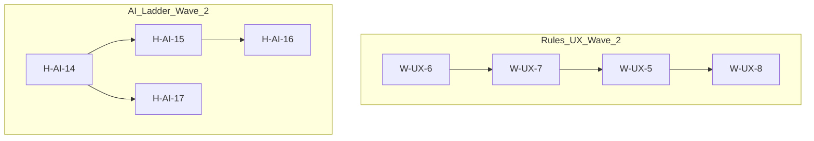

# Next-Wave Remediation Plan from Weakest-Aspect / Hardest-Problem Assessment

> Status: Draft planning document (2025-12-05)

## 1. Introduction

This plan operationalises the canonical weakest-aspect / hardest-problem assessment in [`WEAKNESS_AND_HARDEST_PROBLEM_REPORT.md`](WEAKNESS_AND_HARDEST_PROBLEM_REPORT.md:1) into a small set of concrete, high-leverage subtasks.

The chosen weakest aspect is **rules UX and onboarding**, and the chosen hardest problem is **advanced AI strength and a stable high-tier ladder for Square-8 2-player**. This document does not re-argue those choices; it assumes them and translates the conclusions into actionable work items on two axes: `rules-ux` and `ai-ladder`.

## 2. Existing foundations (summary)

This section briefly lists the existing foundations each axis builds on; details live in the linked specs and modules.

### 2.1 Rules UX axis – existing foundation

**Telemetry and specs**

- [`docs/UX_RULES_TELEMETRY_SPEC.md`](docs/UX_RULES_TELEMETRY_SPEC.md:1) – rules-UX telemetry schema and hotspot metrics.
- [`docs/UX_RULES_WEIRD_STATES_SPEC.md`](docs/UX_RULES_WEIRD_STATES_SPEC.md:1) – weird-state reason codes and UX mappings.
- [`docs/UX_RULES_TEACHING_SCENARIOS.md`](docs/UX_RULES_TEACHING_SCENARIOS.md:1) – scenario-driven teaching flows for complex mechanics.
- [`docs/UX_RULES_IMPROVEMENT_LOOP.md`](docs/UX_RULES_IMPROVEMENT_LOOP.md:1) – telemetry-driven rules-UX improvement process and iteration cadence.
- [`docs/ux/rules_iterations/UX_RULES_IMPROVEMENT_ITERATION_0001.md`](docs/ux/rules_iterations/UX_RULES_IMPROVEMENT_ITERATION_0001.md:1) – first concrete iteration focusing on ANM/FE, structural stalemate, and mini-regions.

**Implementation**

- Telemetry types and helpers:
  - [`src/shared/telemetry/rulesUxEvents.ts`](src/shared/telemetry/rulesUxEvents.ts:1)
  - [`src/client/utils/rulesUxTelemetry.ts`](src/client/utils/rulesUxTelemetry.ts:1)
  - [`src/server/routes/rulesUxTelemetry.ts`](src/server/routes/rulesUxTelemetry.ts:1)
- Weird-state mapping and UX surfaces:
  - [`src/shared/engine/weirdStateReasons.ts`](src/shared/engine/weirdStateReasons.ts:1)
  - [`src/client/components/GameHUD.tsx`](src/client/components/GameHUD.tsx:1)
  - [`src/client/components/VictoryModal.tsx`](src/client/components/VictoryModal.tsx:1)
- Teaching flows:
  - [`src/shared/teaching/teachingScenarios.ts`](src/shared/teaching/teachingScenarios.ts:1)
  - [`src/client/components/TeachingOverlay.tsx`](src/client/components/TeachingOverlay.tsx:1)
- Hotspot analyzer:
  - [`src/shared/telemetry/rulesUxHotspotTypes.ts`](src/shared/telemetry/rulesUxHotspotTypes.ts:1)
  - [`scripts/analyze_rules_ux_telemetry.ts`](scripts/analyze_rules_ux_telemetry.ts:1)
  - [`tests/unit/RulesUxHotspotAnalysis.test.ts`](tests/unit/RulesUxHotspotAnalysis.test.ts:1)

Taken together, these artefacts turn rules UX into a measurable, iterated system rather than ad-hoc copy changes.

### 2.2 AI ladder axis – existing foundation

**Specs**

- [`docs/ai/AI_TIER_TRAINING_AND_PROMOTION_PIPELINE.md`](docs/ai/AI_TIER_TRAINING_AND_PROMOTION_PIPELINE.md:1) – tiered training and promotion pipeline for Square-8 2-player.
- [`docs/ai/AI_TIER_PERF_BUDGETS.md`](docs/ai/AI_TIER_PERF_BUDGETS.md:1) – per-tier performance budgets and benchmark harness contracts.
- [`docs/ai/AI_DIFFICULTY_CALIBRATION_ANALYSIS.md`](docs/ai/AI_DIFFICULTY_CALIBRATION_ANALYSIS.md:1) – difficulty calibration analysis and report structure.

**Implementation**

- Training and gating scripts:
  - [`ai-service/scripts/run_tier_training_pipeline.py`](ai-service/scripts/run_tier_training_pipeline.py:1)
  - [`ai-service/scripts/run_full_tier_gating.py`](ai-service/scripts/run_full_tier_gating.py:1)
- Candidate registry and promotion:
  - [`ai-service/config/tier_candidate_registry.square8_2p.json`](ai-service/config/tier_candidate_registry.square8_2p.json:1)
  - [`ai-service/app/training/tier_promotion_registry.py`](ai-service/app/training/tier_promotion_registry.py:1)
  - [`ai-service/scripts/apply_tier_promotion_plan.py`](ai-service/scripts/apply_tier_promotion_plan.py:1)
- Calibration analysis:
  - [`ai-service/scripts/analyze_difficulty_calibration.py`](ai-service/scripts/analyze_difficulty_calibration.py:1)
  - [`ai-service/tests/test_analyze_difficulty_calibration.py`](ai-service/tests/test_analyze_difficulty_calibration.py:1)

These foundations make it possible to run repeatable training, promotion, and calibration loops for the Square-8 2-player ladder.

## 3. New subtasks – rules-UX axis

The following subtasks extend the existing rules-UX system with clearer conceptual structure, better explanations for game-end states, and coverage audits for teaching flows. All tasks are scoped to be deliverable as focused Architect-mode work products with clear handoffs to Code-mode implementation.

### 3.1 Task summary

| ID     | Title                                                       | Axis     | Primary mode/agent   |
| ------ | ----------------------------------------------------------- | -------- | -------------------- |
| W-UX-5 | Rules UX Iteration 0002: Hotspot-Driven Improvements        | rules-ux | Architect → Code     |
| W-UX-6 | Rules Concepts Index & Cross-Links                          | rules-ux | Architect            |
| W-UX-7 | Structured "Why Did the Game End?" Explanation Model        | rules-ux | Architect            |
| W-UX-8 | Teaching Scenario Coverage Audit for High-Risk Rules Topics | rules-ux | Architect (analysis) |

### 3.2 W-UX-5 – Rules UX Iteration 0002: Hotspot-Driven Improvements

- **Axis:** `rules-ux`
- **Primary mode/agent:** `Architect` (spec) → `Code` (implementation)

**Description**

Define and scope the second rules-UX iteration (`UX_RULES_IMPROVEMENT_ITERATION_0002`) driven explicitly by hotspot and weird-state telemetry. Building on the improvement loop in [`docs/UX_RULES_IMPROVEMENT_LOOP.md`](docs/UX_RULES_IMPROVEMENT_LOOP.md:1) and the first iteration in [`docs/ux/rules_iterations/UX_RULES_IMPROVEMENT_ITERATION_0001.md`](docs/ux/rules_iterations/UX_RULES_IMPROVEMENT_ITERATION_0001.md:1), this task produces a new iteration document that targets the next wave of confusion around ANM/FE, structural stalemates, mini-regions, and related concepts.

The iteration spec should select 2–3 top-priority rules contexts (based on telemetry from [`scripts/analyze_rules_ux_telemetry.ts`](scripts/analyze_rules_ux_telemetry.ts:1) or, if necessary, reasoned expectations) and define concrete UX changes for HUD, VictoryModal, TeachingOverlay, and sandbox flows.

**Key dependencies**

- Assessment and framing:
  - [`WEAKNESS_AND_HARDEST_PROBLEM_REPORT.md`](WEAKNESS_AND_HARDEST_PROBLEM_REPORT.md:210)
  - [`docs/supplementary/RULES_DOCS_UX_AUDIT.md`](docs/supplementary/RULES_DOCS_UX_AUDIT.md:1)
- Iteration loop and existing iteration:
  - [`docs/UX_RULES_IMPROVEMENT_LOOP.md`](docs/UX_RULES_IMPROVEMENT_LOOP.md:1)
  - [`docs/ux/rules_iterations/UX_RULES_IMPROVEMENT_ITERATION_0001.md`](docs/ux/rules_iterations/UX_RULES_IMPROVEMENT_ITERATION_0001.md:1)
- Telemetry and hotspot tooling:
  - [`docs/UX_RULES_TELEMETRY_SPEC.md`](docs/UX_RULES_TELEMETRY_SPEC.md:1)
  - [`src/shared/telemetry/rulesUxEvents.ts`](src/shared/telemetry/rulesUxEvents.ts:1)
  - [`src/shared/telemetry/rulesUxHotspotTypes.ts`](src/shared/telemetry/rulesUxHotspotTypes.ts:1)
  - [`scripts/analyze_rules_ux_telemetry.ts`](scripts/analyze_rules_ux_telemetry.ts:1)

**Acceptance criteria**

- New iteration spec [`docs/ux/rules_iterations/UX_RULES_IMPROVEMENT_ITERATION_0002.md`](docs/ux/rules_iterations/UX_RULES_IMPROVEMENT_ITERATION_0002.md:1) exists and:
  - Names 2–3 specific rules contexts (e.g. ANM/FE loops, structural stalemate variants, mini-region archetypes) selected via hotspot metrics or clearly justified proxies.
  - For each context, records baseline telemetry snapshots (or clearly labelled “pre-telemetry” estimates) and defines target movement for those metrics.
  - Specifies a concrete list of UI copy / routing / teaching changes to be implemented in `GameHUD`, `VictoryModal`, `TeachingOverlay`, and sandbox.
- The spec includes a short “handoff” section tagging the required Code-mode implementation work and test touchpoints.

### 3.3 W-UX-6 – Rules Concepts Index & Cross-Links

- **Axis:** `rules-ux`
- **Primary mode/agent:** `Architect`

**Description**

Create a documentation-level “rules concepts index” that maps high-risk rules topics (ANM/FE, structural stalemates, mini-regions, capture chains, Last-Player-Standing, etc.) to canonical rules docs, UX specs, telemetry concepts, and in-game surfaces. The goal is to make it trivial for any contributor to see, for a given rules concept, where it is defined, where it is surfaced, and how it is measured.

The index should live as a new doc under `docs/` (for example [`docs/UX_RULES_CONCEPTS_INDEX.md`](docs/UX_RULES_CONCEPTS_INDEX.md:1)) and act as a hub connecting rules semantics, audit findings, UX specs, teaching scenarios, and telemetry labels.

**Key dependencies**

- Canonical rules and audits:
  - [`RULES_CANONICAL_SPEC.md`](RULES_CANONICAL_SPEC.md:1)
  - [`ringrift_complete_rules.md`](ringrift_complete_rules.md:1)
  - [`docs/supplementary/RULES_DOCS_UX_AUDIT.md`](docs/supplementary/RULES_DOCS_UX_AUDIT.md:1)
- Rules-UX system:
  - [`docs/UX_RULES_WEIRD_STATES_SPEC.md`](docs/UX_RULES_WEIRD_STATES_SPEC.md:1)
  - [`docs/UX_RULES_TEACHING_SCENARIOS.md`](docs/UX_RULES_TEACHING_SCENARIOS.md:1)
  - [`docs/UX_RULES_TELEMETRY_SPEC.md`](docs/UX_RULES_TELEMETRY_SPEC.md:1)
- Implementation touchpoints:
  - [`src/shared/engine/weirdStateReasons.ts`](src/shared/engine/weirdStateReasons.ts:1)
  - [`src/shared/teaching/teachingScenarios.ts`](src/shared/teaching/teachingScenarios.ts:1)
  - [`src/shared/telemetry/rulesUxEvents.ts`](src/shared/telemetry/rulesUxEvents.ts:1)

**Acceptance criteria**

- A new index document [`docs/UX_RULES_CONCEPTS_INDEX.md`](docs/UX_RULES_CONCEPTS_INDEX.md:1) exists and:
  - Enumerates at least the following concept families: ANM/FE, structural stalemate, territory mini-regions, capture chains and mandatory continuation, Last-Player-Standing, and line/territory ordering.
  - For each concept, lists:
    - Canonical rules references (sections or anchors in [`RULES_CANONICAL_SPEC.md`](RULES_CANONICAL_SPEC.md:1) or [`ringrift_complete_rules.md`](ringrift_complete_rules.md:1)).
    - Relevant UX specs and teaching scenarios.
    - Key code/telemetry identifiers (reason codes, `rulesContext`, scenario IDs).
- At least two existing docs (for example [`docs/supplementary/RULES_DOCS_UX_AUDIT.md`](docs/supplementary/RULES_DOCS_UX_AUDIT.md:1) and [`docs/UX_RULES_IMPROVEMENT_LOOP.md`](docs/UX_RULES_IMPROVEMENT_LOOP.md:1)) gain a concise “See also: concepts index” link pointing to the new document.

### 3.4 W-UX-7 – Structured "Why Did the Game End?" Explanation Model

- **Axis:** `rules-ux`
- **Primary mode/agent:** `Architect`

**Description**

Design an architectural spec for a structured explanation model that unifies victory conditions, weird-state reason codes, rules citations, and teaching topics into a single explanation payload that can be rendered by HUD and VictoryModal. The aim is to replace ad-hoc string copy with a composable model that consistently answers “Why did the game end?” across ANM/FE, structural stalemates, territory collapses, Last-Player-Standing, and normal wins.

The model should define types and example payloads that can be produced by the rules engine layer (or a thin adapter) and consumed by client components, while remaining traceable back to canonical rules and UX specs.

**Key dependencies**

- Rules semantics and audits:
  - [`RULES_CANONICAL_SPEC.md`](RULES_CANONICAL_SPEC.md:1)
  - [`docs/supplementary/RULES_TERMINATION_ANALYSIS.md`](docs/supplementary/RULES_TERMINATION_ANALYSIS.md:1)
- Weird states and UX copy:
  - [`docs/UX_RULES_WEIRD_STATES_SPEC.md`](docs/UX_RULES_WEIRD_STATES_SPEC.md:1)
  - [`docs/UX_RULES_COPY_SPEC.md`](docs/UX_RULES_COPY_SPEC.md:1)
- Client surfaces:
  - [`src/client/components/GameHUD.tsx`](src/client/components/GameHUD.tsx:1)
  - [`src/client/components/VictoryModal.tsx`](src/client/components/VictoryModal.tsx:1)
- Telemetry and teaching:
  - [`docs/UX_RULES_TELEMETRY_SPEC.md`](docs/UX_RULES_TELEMETRY_SPEC.md:1)
  - [`docs/UX_RULES_TEACHING_SCENARIOS.md`](docs/UX_RULES_TEACHING_SCENARIOS.md:1)

**Acceptance criteria**

- A new spec document (for example [`docs/UX_RULES_EXPLANATION_MODEL_SPEC.md`](docs/UX_RULES_EXPLANATION_MODEL_SPEC.md:1)) exists and:
  - Defines a structured explanation payload (e.g. `RulesEndExplanation`) with clearly named fields for outcome type, primary reason code, contributing factors, rules citations, teaching topics, and telemetry tags.
  - Provides worked examples for at least four endings:
    - Normal win by ring majority.
    - ANM/FE-driven elimination.
    - Structural stalemate resolved via tiebreak ladder.
    - Territory mini-region self-elimination scenario.
  - Sketches the mapping from engine outcome objects and weird-state reason codes to the explanation payload, including where in the stack this mapping should live.
- The spec calls out a follow-up Code-mode task to implement the model and wire it into `GameHUD` and `VictoryModal`, with clear boundaries and risks.

### 3.5 W-UX-8 – Teaching Scenario Coverage Audit for High-Risk Rules Topics

- **Axis:** `rules-ux`
- **Primary mode/agent:** `Architect` (analysis) with optional `Ask` support for UX review

**Description**

Perform a focused audit of teaching scenario coverage for the highest-risk rules contexts identified in [`WEAKNESS_AND_HARDEST_PROBLEM_REPORT.md`](WEAKNESS_AND_HARDEST_PROBLEM_REPORT.md:92): ANM/FE, structural stalemates, territory mini-regions, capture chains, and Last-Player-Standing. The goal is to ensure that each concept has at least one high-quality, discoverable teaching scenario, or is explicitly recorded as a gap.

The audit should examine both specification-level scenarios in [`docs/UX_RULES_TEACHING_SCENARIOS.md`](docs/UX_RULES_TEACHING_SCENARIOS.md:1) and concrete implementations in [`src/shared/teaching/teachingScenarios.ts`](src/shared/teaching/teachingScenarios.ts:1) and [`src/client/components/TeachingOverlay.tsx`](src/client/components/TeachingOverlay.tsx:1), along with how they are surfaced from HUD, VictoryModal, and sandbox.

**Key dependencies**

- Assessment framing:
  - [`WEAKNESS_AND_HARDEST_PROBLEM_REPORT.md`](WEAKNESS_AND_HARDEST_PROBLEM_REPORT.md:210)
  - [`docs/supplementary/RULES_DOCS_UX_AUDIT.md`](docs/supplementary/RULES_DOCS_UX_AUDIT.md:1)
- Teaching specs and implementation:
  - [`docs/UX_RULES_TEACHING_SCENARIOS.md`](docs/UX_RULES_TEACHING_SCENARIOS.md:1)
  - [`src/shared/teaching/teachingScenarios.ts`](src/shared/teaching/teachingScenarios.ts:1)
  - [`src/client/components/TeachingOverlay.tsx`](src/client/components/TeachingOverlay.tsx:1)
  - [`src/client/pages/SandboxGameHost.tsx`](src/client/pages/SandboxGameHost.tsx:1)

**Acceptance criteria**

- A new audit document (for example [`docs/ux/TEACHING_SCENARIO_COVERAGE_AUDIT_2025_12.md`](docs/ux/TEACHING_SCENARIO_COVERAGE_AUDIT_2025_12.md:1)) exists and:
  - Lists the target high-risk concept set and, for each concept, all existing teaching scenarios (IDs and entrypoints) or marks it as “missing”.
  - Identifies at least one concrete, discoverable entrypoint (HUD, VictoryModal, sandbox, or rules clinic) for each concept that currently has coverage.
  - Provides a numbered list of “missing or weak” scenarios suitable to become follow-up Code-mode tasks, including suggested scenario names and rough content.
- Where appropriate, the document cross-links to [`docs/UX_RULES_CONCEPTS_INDEX.md`](docs/UX_RULES_CONCEPTS_INDEX.md:1) so future iterations can use a single concepts vocabulary.

## 4. New subtasks – AI ladder axis

These subtasks strengthen the operational scaffolding around the hardest problem: advanced AI strength and a stable high-tier Square-8 2-player ladder. They focus on calibration runbooks, health monitoring, change guardrails, and structured human studies, building on the existing training, gating, and calibration tooling.

### 4.1 Task summary

| ID      | Title                               | Axis      | Primary mode/agent |
| ------- | ----------------------------------- | --------- | ------------------ |
| H-AI-14 | AI Calibration Runbook & Templates  | ai-ladder | Architect          |
| H-AI-15 | AI Ladder Health & Drift Monitoring | ai-ladder | Architect / AI-ops |
| H-AI-16 | AI Ladder Change Guardrails         | ai-ladder | Architect          |
| H-AI-17 | Human Difficulty Calibration Study  | ai-ladder | Architect          |

### 4.2 H-AI-14 – AI Calibration Runbook & Templates

- **Axis:** `ai-ladder`
- **Primary mode/agent:** `Architect`

**Description**

Produce a detailed, operator-friendly runbook for executing a full AI difficulty calibration cycle using [`ai-service/scripts/analyze_difficulty_calibration.py`](ai-service/scripts/analyze_difficulty_calibration.py:1) and the telemetry pipeline defined in [`docs/ai/AI_DIFFICULTY_CALIBRATION_ANALYSIS.md`](docs/ai/AI_DIFFICULTY_CALIBRATION_ANALYSIS.md:1). The runbook should cover prerequisites, data collection windows, script invocations, expected inputs/outputs, storage locations, and how to interpret the resulting reports.

The task also includes defining a standard folder and filename convention for calibration outputs under `docs/ai/calibration_runs/` and providing template Markdown/JSON stubs that future calibration runs can fill in.

**Key dependencies**

- Analysis and guidance:
  - [`docs/ai/AI_DIFFICULTY_CALIBRATION_ANALYSIS.md`](docs/ai/AI_DIFFICULTY_CALIBRATION_ANALYSIS.md:1)
  - [`docs/ai/AI_HUMAN_CALIBRATION_GUIDE.md`](docs/ai/AI_HUMAN_CALIBRATION_GUIDE.md:1)
- Scripts and telemetry:
  - [`ai-service/scripts/analyze_difficulty_calibration.py`](ai-service/scripts/analyze_difficulty_calibration.py:1)
  - [`ai-service/tests/test_analyze_difficulty_calibration.py`](ai-service/tests/test_analyze_difficulty_calibration.py:1)
  - Difficulty calibration telemetry definitions and server routing (as referenced in [`WEAKNESS_AND_HARDEST_PROBLEM_REPORT.md`](WEAKNESS_AND_HARDEST_PROBLEM_REPORT.md:347)).

**Acceptance criteria**

- A new runbook [`docs/ai/AI_CALIBRATION_RUNBOOK.md`](docs/ai/AI_CALIBRATION_RUNBOOK.md:1) exists and:
  - Describes an end-to-end calibration workflow from “decide to calibrate” through “reports stored and interpreted”.
  - Includes concrete CLI examples for running `analyze_difficulty_calibration.py` for at least one Square-8 2-player tier and referencing real or example telemetry inputs.
  - Specifies the canonical directory structure under `docs/ai/calibration_runs/` and the expected artifacts per run.
- A template file (for example [`docs/ai/calibration_runs/TEMPLATE.md`](docs/ai/calibration_runs/TEMPLATE.md:1)) is added that future calibration runs can copy and fill in.

### 4.3 H-AI-15 – AI Ladder Health & Drift Monitoring Spec

- **Axis:** `ai-ladder`
- **Primary mode/agent:** `Architect` / `AI-ops`

**Description**

Define a monitoring and alerting spec for AI ladder health and drift, tying together automated evaluation results, difficulty calibration telemetry, and ladder configuration data. The goal is to detect regressions or drift over time (e.g. tiers becoming too easy/hard, perf regressions, or broken ordering between tiers) and to provide clear, actionable alerts for operators.

The spec should recommend metrics, queries, and alert thresholds, and describe how they relate to SLOs and promotion pipeline invariants.

**Key dependencies**

- Ladder pipeline and perf budgets:
  - [`docs/ai/AI_TIER_TRAINING_AND_PROMOTION_PIPELINE.md`](docs/ai/AI_TIER_TRAINING_AND_PROMOTION_PIPELINE.md:1)
  - [`docs/ai/AI_TIER_PERF_BUDGETS.md`](docs/ai/AI_TIER_PERF_BUDGETS.md:1)
- Calibration analysis and human data:
  - [`docs/ai/AI_DIFFICULTY_CALIBRATION_ANALYSIS.md`](docs/ai/AI_DIFFICULTY_CALIBRATION_ANALYSIS.md:1)
  - [`docs/ai/AI_HUMAN_CALIBRATION_GUIDE.md`](docs/ai/AI_HUMAN_CALIBRATION_GUIDE.md:1)
- Operations and alerting:
  - [`docs/operations/ALERTING_THRESHOLDS.md`](docs/operations/ALERTING_THRESHOLDS.md:1)

**Acceptance criteria**

- A new spec [`docs/ai/AI_LADDER_HEALTH_MONITORING_SPEC.md`](docs/ai/AI_LADDER_HEALTH_MONITORING_SPEC.md:1) exists and:
  - Defines a concrete set of tier-level health metrics (e.g. automated winrates vs baselines, calibration winrate bands, pick rates, p95 latency per tier).
  - Proposes at least three specific alert conditions (for example, “tier D6 human winrate vs target band drift > 15 percentage points” or “tier D8 p95 latency exceeds budget for N consecutive days”) with guidance on severity and response.
  - Suggests Prometheus-style metric names or dashboard panels that can be implemented in a follow-up Code/AI-ops task.
- The document explicitly references how these signals should be consulted during tier promotion decisions, linking back to [`docs/ai/AI_TIER_TRAINING_AND_PROMOTION_PIPELINE.md`](docs/ai/AI_TIER_TRAINING_AND_PROMOTION_PIPELINE.md:1).

### 4.4 H-AI-16 – AI Ladder Change Guardrails

- **Axis:** `ai-ladder`
- **Primary mode/agent:** `Architect`

**Description**

Define a policy and checklist for making changes to AI ladder configurations or promoting new models. The goal is to ensure that every ladder change (tier promotion, difficulty remapping, perf budget adjustment) passes through a consistent set of checks: training completeness, gating outcomes, perf benchmarks, calibration signals, and human review.

The guardrails should be light enough to be usable in day-to-day work, but strict enough to prevent accidental regressions in top-tier strength or stability.

**Key dependencies**

- Ladder pipeline and registry:
  - [`docs/ai/AI_TIER_TRAINING_AND_PROMOTION_PIPELINE.md`](docs/ai/AI_TIER_TRAINING_AND_PROMOTION_PIPELINE.md:1)
  - [`ai-service/config/tier_candidate_registry.square8_2p.json`](ai-service/config/tier_candidate_registry.square8_2p.json:1)
  - [`ai-service/app/training/tier_promotion_registry.py`](ai-service/app/training/tier_promotion_registry.py:1)
- Calibration and monitoring:
  - [`docs/ai/AI_DIFFICULTY_CALIBRATION_ANALYSIS.md`](docs/ai/AI_DIFFICULTY_CALIBRATION_ANALYSIS.md:1)
  - [`docs/ai/AI_CALIBRATION_RUNBOOK.md`](docs/ai/AI_CALIBRATION_RUNBOOK.md:1) (from H-AI-14)
  - [`docs/ai/AI_LADDER_HEALTH_MONITORING_SPEC.md`](docs/ai/AI_LADDER_HEALTH_MONITORING_SPEC.md:1) (from H-AI-15)

**Acceptance criteria**

- A new policy/checklist document [`docs/ai/AI_LADDER_CHANGE_GUARDRAILS.md`](docs/ai/AI_LADDER_CHANGE_GUARDRAILS.md:1) exists and:
  - Defines required evidence for a ladder change (e.g. recent training run IDs, gating reports, perf benchmarks, calibration summary, drift dashboard snapshot).
  - Provides a PR template or change-request checklist that Code/AI-ops engineers can paste into reviews.
  - Specifies who must sign off (roles rather than individuals) for different classes of change (e.g. top-tier promotions vs low-tier tweaks).
- The document is referenced from [`docs/ai/AI_TIER_TRAINING_AND_PROMOTION_PIPELINE.md`](docs/ai/AI_TIER_TRAINING_AND_PROMOTION_PIPELINE.md:1) in a short “See also: change guardrails” note.

### 4.5 H-AI-17 – Human Difficulty Calibration Study

- **Axis:** `ai-ladder`
- **Primary mode/agent:** `Architect`

**Description**

Design a structured human difficulty calibration study to validate calibrated difficulty tiers with real players, building on the guidance in [`docs/ai/AI_HUMAN_CALIBRATION_GUIDE.md`](docs/ai/AI_HUMAN_CALIBRATION_GUIDE.md:1) and the analysis framework in [`docs/ai/AI_DIFFICULTY_CALIBRATION_ANALYSIS.md`](docs/ai/AI_DIFFICULTY_CALIBRATION_ANALYSIS.md:1). The study should specify sampling strategy, session structure, survey prompts, and how responses map back into telemetry and calibration reports.

The goal is to have a repeatable protocol that can be run periodically (for example, quarterly) to ground automated metrics in human perception across different skill bands.

**Key dependencies**

- Human calibration guidance and analysis:
  - [`docs/ai/AI_HUMAN_CALIBRATION_GUIDE.md`](docs/ai/AI_HUMAN_CALIBRATION_GUIDE.md:1)
  - [`docs/ai/AI_DIFFICULTY_CALIBRATION_ANALYSIS.md`](docs/ai/AI_DIFFICULTY_CALIBRATION_ANALYSIS.md:1)
- Calibration runbook and monitoring (for context):
  - [`docs/ai/AI_CALIBRATION_RUNBOOK.md`](docs/ai/AI_CALIBRATION_RUNBOOK.md:1)
  - [`docs/ai/AI_LADDER_HEALTH_MONITORING_SPEC.md`](docs/ai/AI_LADDER_HEALTH_MONITORING_SPEC.md:1)

**Acceptance criteria**

- A new study design document [`docs/ai/AI_HUMAN_CALIBRATION_STUDY_DESIGN.md`](docs/ai/AI_HUMAN_CALIBRATION_STUDY_DESIGN.md:1) exists and:
  - Describes target participant segments, sample sizes, and recruitment channels.
  - Outlines a concrete session script (number of games, which tiers/board types, instructions to participants).
  - Provides a set of survey or prompt questions and shows how their responses will map into existing telemetry fields and calibration reports.
  - Identifies which outputs should be stored under `docs/ai/calibration_runs/` or a sibling directory, and how they will be linked back to automated metrics.

## 5. Cross-axis prioritisation and sequencing

This section sketches a recommended execution order and highlights cross-dependencies between the rules-UX and AI-ladder subtasks.

### 5.1 Recommended execution order

**Rules-UX wave 2**

1. **W-UX-6 – Rules Concepts Index & Cross-Links**  
   Establishes a shared vocabulary and mapping layer across rules docs, UX specs, teaching scenarios, and telemetry, which subsequent tasks can reference.
2. **W-UX-7 – Structured "Why Did the Game End?" Explanation Model**  
   Uses the concepts index and existing weird-state specs to define a structured explanation payload for endings.
3. **W-UX-5 – Rules UX Iteration 0002: Hotspot-Driven Improvements**  
   Applies telemetry and the explanation model to a targeted iteration focused on the highest-impact confusion hotspots.
4. **W-UX-8 – Teaching Scenario Coverage Audit**  
   Audits and extends teaching coverage in light of the new concepts index and iteration 0002 priorities.

**AI-ladder wave 2**

1. **H-AI-14 – AI Calibration Runbook & Templates**  
   Codifies the end-to-end calibration workflow and output structure.
2. **H-AI-15 – AI Ladder Health & Drift Monitoring Spec**  
   Builds on the calibration runbook and pipeline docs to define health and drift metrics.
3. **H-AI-16 – AI Ladder Change Guardrails**  
   Uses the pipeline, calibration runbook, and monitoring spec to define policy and checklists for safe ladder changes.
4. **H-AI-17 – Human Difficulty Calibration Study**  
   Leverages the calibration and monitoring framework to design periodic human studies that validate and tune ladder settings.

### 5.2 Cross-dependencies and readiness

- The rules-UX and AI-ladder tracks are largely independent and can proceed in parallel.
- Within rules-UX:
  - W-UX-6 is a soft prerequisite for W-UX-7 and W-UX-8, since both benefit from a shared concepts vocabulary and cross-linking.
  - W-UX-7 informs future Code-mode UI work but does not block W-UX-5, which can initially proceed using current copy-routing plus telemetry.
- Within ai-ladder:
  - H-AI-14 should precede H-AI-15 and H-AI-16 so that monitoring and guardrails reference a concrete calibration workflow and artifact locations.
  - H-AI-17 is easier to design once H-AI-14 and H-AI-15 have specified how automated calibration data will be produced and monitored.

**Ready to launch immediately**

All eight subtasks (W-UX-5 through W-UX-8, H-AI-14 through H-AI-17) are ready to launch in Architect mode. They depend only on existing specs, scripts, and telemetry wiring, and each produces a self-contained planning, spec, or audit artefact that subsequent Code, Debug, Ask, or AI-ops tasks can implement or extend.
