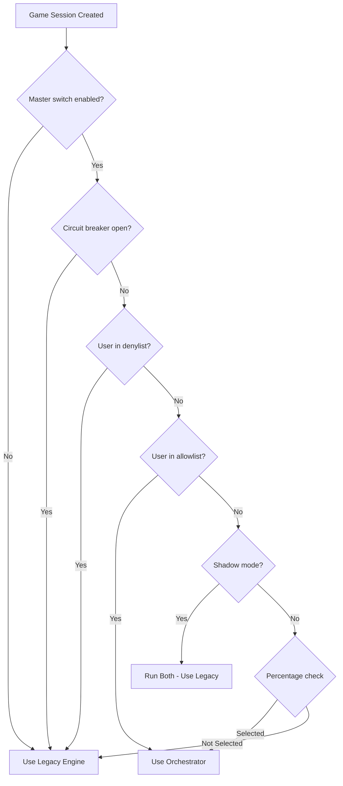

# Orchestrator Rollout Feature Flags Design

> **⚠️ HISTORICAL / IMPLEMENTED** – This design was implemented in November 2025. The orchestrator is now at 100% rollout.
> For current feature flag documentation, see:
> - `docs/ORCHESTRATOR_ROLLOUT_PLAN.md` – Production rollout status (Phase 4 complete)
> - `docs/ENVIRONMENT_VARIABLES.md` – Current environment variable reference

**Created**: 2025-11-27
**Status**: ✅ Implemented (Phase 4 complete as of 2025-11-30)
**Author**: Engineering Team
**Related**: P1.1 (Basic Feature Flag), Pass 7 (Hardest Problems Report)

## Executive Summary

This document describes a comprehensive feature flag system for safe, phased production rollout of the Orchestrator Adapter. The design enables gradual traffic migration, shadow/compare validation, user-based targeting, automatic circuit-breaking, and full observability.

---

## Table of Contents

1. [Background](#1-background)
2. [Proposed Feature Flags](#2-proposed-feature-flags)
3. [Configuration Schema](#3-configuration-schema)
4. [Environment Variable Reference](#4-environment-variable-reference)
5. [Configuration Examples by Phase](#5-configuration-examples-by-phase)
6. [Implementation Approach](#6-implementation-approach)
7. [Rollout Decision Logic](#7-rollout-decision-logic)
8. [Metrics Integration](#8-metrics-integration)
9. [Alerting Recommendations](#9-alerting-recommendations)
10. [Rollback Procedures](#10-rollback-procedures)
11. [Testing Strategy](#11-testing-strategy)
12. [Migration Timeline](#12-migration-timeline)
13. [Dependencies](#13-dependencies)

---

## 1. Background

### Current State

The orchestrator adapter is controlled by a single boolean flag:

```typescript
// src/server/config/env.ts:319-325
ORCHESTRATOR_ADAPTER_ENABLED: z
  .string()
  .default('true')
  .transform((val) => val === 'true' || val === '1'),
```

This is exposed via:

```typescript
// src/server/config/unified.ts:282
config.featureFlags.orchestratorAdapterEnabled;
```

And used in GameEngine:

```typescript
// src/server/game/GameEngine.ts:775-777
if (this.useOrchestratorAdapter) {
  return this.processMoveViaAdapter(move);
}
```

### Problem Statement

A simple on/off flag is insufficient for safe production rollout because:

1. **No gradual rollout** - Cannot enable for 1% of traffic and scale up
2. **No shadow testing** - Cannot validate output without risk
3. **No user targeting** - Cannot enable for testers/staff only
4. **No automatic protection** - Cannot auto-disable on errors
5. **No observability** - Limited metrics for comparison

---

## 2. Proposed Feature Flags

### 2.1 Master Kill Switch (Existing)

| Property    | Value                                    |
| ----------- | ---------------------------------------- |
| **Name**    | `ORCHESTRATOR_ADAPTER_ENABLED`           |
| **Type**    | Boolean                                  |
| **Default** | `true`                                   |
| **Purpose** | Master enable/disable for entire feature |

**Behavior**: When `false`, all orchestrator features are disabled regardless of other flags.

---

### 2.2 Rollout Percentage

| Property    | Value                                          |
| ----------- | ---------------------------------------------- |
| **Name**    | `ORCHESTRATOR_ROLLOUT_PERCENTAGE`              |
| **Type**    | Integer (0-100)                                |
| **Default** | `100`                                          |
| **Purpose** | Percentage of game sessions using orchestrator |

**Behavior**: Each new game session is hashed to determine eligibility. Once a session is assigned to orchestrator mode, it stays there for its entire lifetime.

---

### 2.3 Shadow Mode

| Property    | Value                                         |
| ----------- | --------------------------------------------- |
| **Name**    | `ORCHESTRATOR_SHADOW_MODE_ENABLED`            |
| **Type**    | Boolean                                       |
| **Default** | `false`                                       |
| **Purpose** | Run both engines, compare results, use legacy |

**Behavior**:

- Both orchestrator and legacy engines process every move
- Legacy engine's result is always used
- Results are compared and discrepancies logged/metriced
- Zero production risk, full validation coverage

---

### 2.4 User/Session Targeting

| Property    | Value                                        |
| ----------- | -------------------------------------------- |
| **Name**    | `ORCHESTRATOR_ALLOWLIST_USERS`               |
| **Type**    | Comma-separated user IDs                     |
| **Default** | `""` (empty)                                 |
| **Purpose** | Force-enable orchestrator for specific users |

| Property    | Value                                         |
| ----------- | --------------------------------------------- |
| **Name**    | `ORCHESTRATOR_DENYLIST_USERS`                 |
| **Type**    | Comma-separated user IDs                      |
| **Default** | `""` (empty)                                  |
| **Purpose** | Force-disable orchestrator for specific users |

**Behavior**:

- Allowlist takes precedence over percentage rollout (always enabled)
- Denylist takes precedence over allowlist (always disabled)
- Useful for: staff testing, beta testers, users experiencing issues

---

### 2.5 Automatic Circuit Breaker

| Property    | Value                                      |
| ----------- | ------------------------------------------ |
| **Name**    | `ORCHESTRATOR_ERROR_THRESHOLD_PERCENT`     |
| **Type**    | Integer (0-100)                            |
| **Default** | `5`                                        |
| **Purpose** | Error rate threshold for automatic disable |

| Property    | Value                                  |
| ----------- | -------------------------------------- |
| **Name**    | `ORCHESTRATOR_ERROR_WINDOW_SECONDS`    |
| **Type**    | Integer                                |
| **Default** | `300` (5 minutes)                      |
| **Purpose** | Time window for error rate calculation |

| Property    | Value                                  |
| ----------- | -------------------------------------- |
| **Name**    | `ORCHESTRATOR_CIRCUIT_BREAKER_ENABLED` |
| **Type**    | Boolean                                |
| **Default** | `false`                                |
| **Purpose** | Enable automatic circuit breaking      |

**Behavior**:

- Track error rate over the configured window
- If error rate exceeds threshold, automatically disable orchestrator
- Emit critical alert when circuit opens
- Require manual intervention to re-enable (no auto-recovery to prevent flapping)

---

### 2.6 Latency Monitoring

| Property    | Value                               |
| ----------- | ----------------------------------- |
| **Name**    | `ORCHESTRATOR_LATENCY_THRESHOLD_MS` |
| **Type**    | Integer                             |
| **Default** | `500`                               |
| **Purpose** | P99 latency threshold for warnings  |

**Behavior**: Alert when orchestrator P99 latency exceeds this threshold, but don't auto-disable.

---

## 3. Configuration Schema

### 3.1 Zod Schema Addition to `env.ts`

```typescript
// === ORCHESTRATOR ROLLOUT FLAGS ===

/** Orchestrator rollout percentage (0-100) */
ORCHESTRATOR_ROLLOUT_PERCENTAGE: z.coerce
  .number()
  .int()
  .min(0)
  .max(100)
  .default(100),

/** Enable shadow/compare mode (run both, use legacy) */
ORCHESTRATOR_SHADOW_MODE_ENABLED: z
  .string()
  .optional()
  .transform((val) => val === 'true' || val === '1')
  .default('false'),

/** Comma-separated user IDs to force-enable orchestrator */
ORCHESTRATOR_ALLOWLIST_USERS: z
  .string()
  .default('')
  .transform((val) => val.split(',').filter(Boolean)),

/** Comma-separated user IDs to force-disable orchestrator */
ORCHESTRATOR_DENYLIST_USERS: z
  .string()
  .default('')
  .transform((val) => val.split(',').filter(Boolean)),

/** Enable automatic circuit breaker */
ORCHESTRATOR_CIRCUIT_BREAKER_ENABLED: z
  .string()
  .optional()
  .transform((val) => val === 'true' || val === '1')
  .default('false'),

/** Error rate threshold for circuit breaker (percentage) */
ORCHESTRATOR_ERROR_THRESHOLD_PERCENT: z.coerce
  .number()
  .int()
  .min(0)
  .max(100)
  .default(5),

/** Time window for error rate calculation (seconds) */
ORCHESTRATOR_ERROR_WINDOW_SECONDS: z.coerce
  .number()
  .int()
  .min(60)
  .max(3600)
  .default(300),

/** Latency threshold for P99 alerting (milliseconds) */
ORCHESTRATOR_LATENCY_THRESHOLD_MS: z.coerce
  .number()
  .int()
  .min(100)
  .max(10000)
  .default(500),
```

### 3.2 Config Structure in `unified.ts`

```typescript
featureFlags: z.object({
  orchestratorAdapterEnabled: z.boolean(),
  orchestratorRollout: z.object({
    percentage: z.number().int().min(0).max(100),
    shadowModeEnabled: z.boolean(),
    allowlistUsers: z.array(z.string()),
    denylistUsers: z.array(z.string()),
    circuitBreaker: z.object({
      enabled: z.boolean(),
      errorThresholdPercent: z.number().int(),
      errorWindowSeconds: z.number().int(),
    }),
    latencyThresholdMs: z.number().int(),
  }),
}),
```

---

## 4. Environment Variable Reference

| Variable                               | Type   | Default | Description                      |
| -------------------------------------- | ------ | ------- | -------------------------------- |
| `ORCHESTRATOR_ADAPTER_ENABLED`         | bool   | `true`  | Master kill switch               |
| `ORCHESTRATOR_ROLLOUT_PERCENTAGE`      | int    | `100`   | % of sessions using orchestrator |
| `ORCHESTRATOR_SHADOW_MODE_ENABLED`     | bool   | `false` | Run both engines, compare only   |
| `ORCHESTRATOR_ALLOWLIST_USERS`         | string | `""`    | Force-enabled user IDs           |
| `ORCHESTRATOR_DENYLIST_USERS`          | string | `""`    | Force-disabled user IDs          |
| `ORCHESTRATOR_CIRCUIT_BREAKER_ENABLED` | bool   | `false` | Auto-disable on errors           |
| `ORCHESTRATOR_ERROR_THRESHOLD_PERCENT` | int    | `5`     | Error % to trip breaker          |
| `ORCHESTRATOR_ERROR_WINDOW_SECONDS`    | int    | `300`   | Window for error calculation     |
| `ORCHESTRATOR_LATENCY_THRESHOLD_MS`    | int    | `500`   | P99 latency warning threshold    |

---

## 5. Configuration Examples by Phase

### Phase 0: Pre-Production Validation (Current)

```env
ORCHESTRATOR_ADAPTER_ENABLED=true
ORCHESTRATOR_ROLLOUT_PERCENTAGE=100
# Running in staging/test environments only
```

### Phase 1: Shadow Mode Production Validation

```env
ORCHESTRATOR_ADAPTER_ENABLED=true
ORCHESTRATOR_SHADOW_MODE_ENABLED=true
ORCHESTRATOR_ROLLOUT_PERCENTAGE=100
# Zero risk - legacy engine handles all traffic
# All moves compared, discrepancies logged
```

### Phase 2: Initial Production Rollout (1%)

```env
ORCHESTRATOR_ADAPTER_ENABLED=true
ORCHESTRATOR_SHADOW_MODE_ENABLED=false
ORCHESTRATOR_ROLLOUT_PERCENTAGE=1
ORCHESTRATOR_CIRCUIT_BREAKER_ENABLED=true
ORCHESTRATOR_ERROR_THRESHOLD_PERCENT=5
```

### Phase 3: Staff/Tester Rollout

```env
ORCHESTRATOR_ADAPTER_ENABLED=true
ORCHESTRATOR_ROLLOUT_PERCENTAGE=1
ORCHESTRATOR_ALLOWLIST_USERS=staff-user-1,staff-user-2,beta-tester-3
# Staff gets orchestrator regardless of percentage
```

### Phase 4: Gradual Increase (5% → 10% → 25%)

```env
# 5%
ORCHESTRATOR_ROLLOUT_PERCENTAGE=5

# 10%
ORCHESTRATOR_ROLLOUT_PERCENTAGE=10

# 25%
ORCHESTRATOR_ROLLOUT_PERCENTAGE=25
```

### Phase 5: Majority Rollout (50%)

```env
ORCHESTRATOR_ADAPTER_ENABLED=true
ORCHESTRATOR_ROLLOUT_PERCENTAGE=50
ORCHESTRATOR_CIRCUIT_BREAKER_ENABLED=true
ORCHESTRATOR_ERROR_THRESHOLD_PERCENT=3
```

### Phase 6: Full Rollout (100%)

```env
ORCHESTRATOR_ADAPTER_ENABLED=true
ORCHESTRATOR_ROLLOUT_PERCENTAGE=100
ORCHESTRATOR_CIRCUIT_BREAKER_ENABLED=true
ORCHESTRATOR_ERROR_THRESHOLD_PERCENT=2
```

### Emergency Rollback

```env
ORCHESTRATOR_ADAPTER_ENABLED=false
# OR
ORCHESTRATOR_ROLLOUT_PERCENTAGE=0
```

---

## 6. Implementation Approach

### 6.1 Recommended: Environment Variables + Runtime Config

**Rationale**:

- Simplest to implement with existing infrastructure
- No additional database/service dependencies
- Testable locally via `.env` files
- Deployable via Kubernetes ConfigMaps/Secrets

**Trade-offs**:

- Requires restart for most changes (except circuit breaker state)
- No dynamic per-request modifications
- No A/B testing dashboard

### 6.2 Alternative: Database-backed Feature Flags

Would enable:

- Dynamic updates without restart
- Per-organization/team targeting
- Feature flag dashboard

Not recommended for initial rollout due to:

- Additional infrastructure complexity
- Database dependency for critical path
- Overkill for single-feature rollout

### 6.3 Alternative: Third-party Feature Flag Service

(LaunchDarkly, Split.io, etc.)

Not recommended due to:

- External dependency in critical game path
- Additional latency
- Cost
- Overkill for single-feature rollout

---

## 7. Rollout Decision Logic



### 7.1 Percentage Selection Algorithm

```typescript
function shouldUseOrchestrator(sessionId: string, percentage: number): boolean {
  // Use consistent hashing so same session always gets same result
  const hash = createHash('sha256').update(sessionId).digest('hex');
  const hashInt = parseInt(hash.substring(0, 8), 16);
  const bucket = hashInt % 100;
  return bucket < percentage;
}
```

**Properties**:

- Deterministic: Same session always gets same result
- Sticky: Session assignment persists for its lifetime
- Uniform distribution across buckets
- No external state required

---

## 8. Metrics Integration

### 8.1 New Metrics for MetricsService

The live implementation in `MetricsService` wires the following shapes:

```typescript
// Counters
orchestratorSessionsTotal: Counter<'engine' | 'selection_reason'>;
orchestratorMovesTotal: Counter<'engine' | 'outcome'>;

// Gauges
orchestratorCircuitBreakerState: Gauge<string>; // 0=closed, 1=open
orchestratorErrorRate: Gauge<string>; // 0.0–1.0 fraction
orchestratorRolloutPercentage: Gauge<string>; // Configured % (0–100)

// Shadow-mode gauges (fed from ShadowModeComparator.getMetrics())
orchestratorShadowComparisonsCurrent: Gauge<string>;
orchestratorShadowMismatchesCurrent: Gauge<string>;
orchestratorShadowMismatchRate: Gauge<string>;
orchestratorShadowOrchestratorErrorsCurrent: Gauge<string>;
orchestratorShadowOrchestratorErrorRate: Gauge<string>;
orchestratorShadowAvgLegacyLatencyMs: Gauge<string>;
orchestratorShadowAvgOrchestratorLatencyMs: Gauge<string>;
```

### 8.2 Metric Definitions

| Metric Name                                        | Type    | Labels                       | Description                                    |
| -------------------------------------------------- | ------- | ---------------------------- | ---------------------------------------------- |
| `ringrift_orchestrator_sessions_total`             | Counter | `engine`, `selection_reason` | Sessions created by engine                     |
| `ringrift_orchestrator_moves_total`                | Counter | `engine`, `outcome`          | Moves processed                                |
| `ringrift_orchestrator_shadow_comparisons_current` | Gauge   | -                            | Current comparisons in memory (rolling window) |
| `ringrift_orchestrator_shadow_mismatches_current`  | Gauge   | -                            | Current mismatches in memory (rolling window)  |
| `ringrift_orchestrator_circuit_breaker_state`      | Gauge   | -                            | Circuit breaker state                          |
| `ringrift_orchestrator_rollout_percentage`         | Gauge   | -                            | Current rollout %                              |
| `ringrift_orchestrator_error_rate`                 | Gauge   | -                            | Current error rate                             |

### 8.3 Selection Reason Labels

| Reason         | Description                    |
| -------------- | ------------------------------ |
| `percentage`   | Selected by percentage rollout |
| `allowlist`    | User in allowlist              |
| `denylist`     | User in denylist               |
| `shadow`       | Shadow mode active             |
| `circuit_open` | Circuit breaker open           |
| `disabled`     | Master switch off              |

### 8.4 Shadow Mode Comparison Results

| Result                | Description                             |
| --------------------- | --------------------------------------- |
| `match`               | Both engines produced identical results |
| `state_hash_mismatch` | Final state hash differs                |
| `validation_mismatch` | Move validation verdict differs         |
| `phase_mismatch`      | Resulting phase differs                 |
| `winner_mismatch`     | Game end winner differs                 |
| `error_orchestrator`  | Orchestrator errored, legacy succeeded  |
| `error_legacy`        | Legacy errored, orchestrator succeeded  |
| `both_error`          | Both engines errored                    |

---

## 9. Alerting Recommendations

### 9.1 New Alert Rules

Add to `monitoring/prometheus/alerts.yml`:

```yaml
# ===========================================================================
# ORCHESTRATOR ROLLOUT ALERTS
# ===========================================================================
- name: orchestrator-rollout
  interval: 30s
  rules:
    # Circuit Breaker Opened
    - alert: OrchestratorCircuitBreakerOpen
      expr: ringrift_orchestrator_circuit_breaker_state == 1
      for: 30s
      labels:
        severity: critical
        team: backend
      annotations:
        summary: 'Orchestrator circuit breaker is OPEN'
        description: 'The orchestrator has been automatically disabled due to high error rate.'
        runbook_url: 'docs/runbooks/ORCHESTRATOR_CIRCUIT_BREAKER.md'
        impact: 'All traffic using legacy engine. Requires manual investigation.'

    # High Error Rate Warning (before circuit breaks)
    - alert: OrchestratorErrorRateWarning
      expr: ringrift_orchestrator_error_rate > 0.02
      for: 2m
      labels:
        severity: warning
        team: backend
      annotations:
        summary: 'Orchestrator error rate elevated ({{ $value | humanizePercentage }})'
        description: 'Orchestrator error rate is above 2%. Circuit may trip at 5%.'

    # Shadow Mode Mismatches
    - alert: OrchestratorShadowMismatches
      expr: |
        sum(rate(ringrift_orchestrator_shadow_comparisons_total{result!="match"}[10m])) 
        / 
        sum(rate(ringrift_orchestrator_shadow_comparisons_total[10m])) > 0.01
      for: 5m
      labels:
        severity: warning
        team: backend
      annotations:
        summary: 'Orchestrator shadow mode showing mismatches'
        description: 'More than 1% of shadow comparisons show differences between engines.'

    # Winner Mismatch (Critical)
    - alert: OrchestratorWinnerMismatch
      expr: increase(ringrift_orchestrator_shadow_comparisons_total{result="winner_mismatch"}[1h]) > 0
      for: 1m
      labels:
        severity: critical
        team: backend
      annotations:
        summary: 'CRITICAL: Orchestrator winner mismatch detected'
        description: 'Shadow mode detected different game outcomes. DO NOT increase rollout.'

    # Latency Degradation
    - alert: OrchestratorLatencyDegraded
      expr: |
        histogram_quantile(0.99, 
          sum(rate(ringrift_orchestrator_move_latency_seconds_bucket{engine="orchestrator"}[5m])) by (le)
        ) > 0.5
      for: 5m
      labels:
        severity: warning
        team: backend
      annotations:
        summary: 'Orchestrator P99 latency high ({{ $value | humanizeDuration }})'
        description: 'Orchestrator P99 latency exceeds 500ms.'
```

### 9.2 Recommended Thresholds

| Metric               | Warning | Critical | Action                    |
| -------------------- | ------- | -------- | ------------------------- |
| Error Rate           | >2%     | >5%      | Investigate/Circuit Break |
| P99 Latency          | >500ms  | >2s      | Investigate               |
| Shadow Mismatch Rate | >1%     | >5%      | Block rollout increase    |
| Winner Mismatch      | >0      | -        | Critical bug, rollback    |

---

## 10. Rollback Procedures

### 10.1 Immediate Rollback (Kill Switch)

**When**: Critical bugs, winner mismatches, data corruption risk

```bash
# Kubernetes
kubectl set env deployment/ringrift-api ORCHESTRATOR_ADAPTER_ENABLED=false

# Docker Compose
docker-compose up -d --env ORCHESTRATOR_ADAPTER_ENABLED=false

# Manual restart
# Edit .env, set ORCHESTRATOR_ADAPTER_ENABLED=false, restart
```

**Effect**: Immediate disable for new sessions. Existing orchestrator sessions will continue until game ends or server restart.

### 10.2 Gradual Rollback (Reduce Percentage)

**When**: Elevated errors, latency issues, uncertainty

```bash
# Reduce from 50% to 10%
kubectl set env deployment/ringrift-api ORCHESTRATOR_ROLLOUT_PERCENTAGE=10
```

**Effect**: New sessions have 10% chance of orchestrator. Existing sessions unaffected.

### 10.3 User-Specific Rollback

**When**: Specific user experiencing issues

```bash
# Add user to denylist
kubectl set env deployment/ringrift-api \
  ORCHESTRATOR_DENYLIST_USERS=problem-user-123
```

### 10.4 Post-Rollback Checklist

1. [ ] Verify error rate decreasing
2. [ ] Check no new shadow mismatches
3. [ ] Review logs for root cause
4. [ ] Document incident
5. [ ] Create bug ticket if needed
6. [ ] Plan remediation before re-rollout

---

## 11. Testing Strategy

### 11.1 Unit Tests

```typescript
describe('OrchestratorRolloutDecision', () => {
  it('should respect master kill switch', () => {
    const config = createConfig({ enabled: false, percentage: 100 });
    expect(shouldUseOrchestrator(config, 'session-1', 'user-1')).toBe(false);
  });

  it('should respect denylist over allowlist', () => {
    const config = createConfig({
      enabled: true,
      allowlistUsers: ['user-1'],
      denylistUsers: ['user-1'],
    });
    expect(shouldUseOrchestrator(config, 'session-1', 'user-1')).toBe(false);
  });

  it('should hash sessions consistently', () => {
    const config = createConfig({ enabled: true, percentage: 50 });
    const result1 = shouldUseOrchestrator(config, 'session-123', 'user-1');
    const result2 = shouldUseOrchestrator(config, 'session-123', 'user-1');
    expect(result1).toBe(result2);
  });

  it('should distribute evenly at 50%', () => {
    const config = createConfig({ enabled: true, percentage: 50 });
    const results = Array.from({ length: 10000 }, (_, i) =>
      shouldUseOrchestrator(config, `session-${i}`, 'user-1')
    );
    const orchestratorCount = results.filter(Boolean).length;
    expect(orchestratorCount).toBeGreaterThan(4500);
    expect(orchestratorCount).toBeLessThan(5500);
  });
});
```

### 11.2 Integration Tests

```typescript
describe('Shadow Mode Integration', () => {
  it('should run both engines and compare results', async () => {
    const engine = new GameEngine(/* shadow mode enabled */);
    await engine.makeMove(validMove);

    expect(metrics.shadowComparisonsTotal.get({ result: 'match' })).toBe(1);
  });

  it('should use legacy result in shadow mode', async () => {
    const engine = new GameEngine(/* shadow mode enabled */);
    // Force orchestrator to return different result
    const result = await engine.makeMove(validMove);

    expect(result.source).toBe('legacy');
  });
});
```

### 11.3 Load Testing

Before increasing rollout percentage:

1. Run load test with target percentage
2. Verify error rate stays below threshold
3. Verify latency P99 acceptable
4. Verify memory/CPU within bounds

---

## 12. Migration Timeline

| Phase | Duration | Percentage   | Shadow | Criteria to Advance     |
| ----- | -------- | ------------ | ------ | ----------------------- |
| 0     | 1 week   | 0% (staging) | No     | All tests pass          |
| 1     | 1 week   | 100%         | Yes    | <0.1% shadow mismatches |
| 2     | 3 days   | 1%           | No     | <1% error rate          |
| 3     | 3 days   | 5%           | No     | <1% error rate          |
| 4     | 3 days   | 10%          | No     | <0.5% error rate        |
| 5     | 1 week   | 25%          | No     | <0.5% error rate        |
| 6     | 1 week   | 50%          | No     | <0.5% error rate        |
| 7     | 1 week   | 100%         | No     | Stable                  |
| 8     | -        | -            | -      | Remove legacy code      |

**Total estimated timeline**: 5-7 weeks

---

## 13. Dependencies

### 13.1 Existing Infrastructure

| Component      | File                                                                             | Status    |
| -------------- | -------------------------------------------------------------------------------- | --------- |
| Env Schema     | [`src/server/config/env.ts`](src/server/config/env.ts)                           | ✅ Extend |
| Unified Config | [`src/server/config/unified.ts`](src/server/config/unified.ts)                   | ✅ Extend |
| GameEngine     | [`src/server/game/GameEngine.ts`](src/server/game/GameEngine.ts)                 | ✅ Extend |
| MetricsService | [`src/server/services/MetricsService.ts`](src/server/services/MetricsService.ts) | ✅ Extend |
| Alert Rules    | [`monitoring/prometheus/alerts.yml`](monitoring/prometheus/alerts.yml)           | ✅ Extend |

### 13.2 New Components Needed

| Component                    | Description                        | Priority |
| ---------------------------- | ---------------------------------- | -------- |
| `OrchestratorRolloutService` | Centralized rollout decision logic | High     |
| `CircuitBreakerService`      | Error rate tracking & auto-disable | Medium   |
| `ShadowModeComparator`       | Compare engine outputs             | High     |

### 13.3 No External Dependencies

The design intentionally avoids:

- New database requirements
- External feature flag services
- Additional infrastructure components

All functionality builds on existing patterns.

---

## Appendix A: Quick Reference Card

### A.1 Emergency Commands

```bash
# KILL SWITCH - Disable immediately
kubectl set env deployment/ringrift-api ORCHESTRATOR_ADAPTER_ENABLED=false

# REDUCE ROLLOUT - Lower percentage
kubectl set env deployment/ringrift-api ORCHESTRATOR_ROLLOUT_PERCENTAGE=0

# EXCLUDE USER - Add to denylist
kubectl set env deployment/ringrift-api ORCHESTRATOR_DENYLIST_USERS=user-id
```

### A.2 Key Metrics to Monitor

```promql
# Error rate
sum(rate(ringrift_orchestrator_moves_total{outcome="error"}[5m])) /
sum(rate(ringrift_orchestrator_moves_total[5m]))

# Shadow mismatch rate
sum(rate(ringrift_orchestrator_shadow_comparisons_total{result!="match"}[5m])) /
sum(rate(ringrift_orchestrator_shadow_comparisons_total[5m]))

# P99 latency
histogram_quantile(0.99, sum(rate(ringrift_orchestrator_move_latency_seconds_bucket[5m])) by (le))

# Traffic split
sum(ringrift_orchestrator_sessions_total) by (engine)
```

### A.3 Grafana Dashboard Panels

Recommended dashboard panels:

1. Traffic split pie chart (orchestrator vs legacy)
2. Error rate time series by engine
3. Latency comparison (P50, P95, P99)
4. Shadow mode mismatch breakdown
5. Circuit breaker state indicator
6. Rollout percentage gauge

---

## Appendix B: Decision Record

### Why Environment Variables Over Database?

| Factor                 | Env Vars         | Database              |
| ---------------------- | ---------------- | --------------------- |
| Implementation effort  | Low              | Medium                |
| Runtime changes        | Restart required | Dynamic               |
| Testability            | Excellent        | Good                  |
| Infrastructure deps    | None             | Database availability |
| Operational complexity | Low              | Medium                |
| Production safety      | High             | Medium                |

**Decision**: Use environment variables for initial rollout. Consider database-backed flags for future multi-tenant or A/B testing scenarios.

### Why No Auto-Recovery for Circuit Breaker?

Auto-recovery risks:

1. Flapping between states under marginal conditions
2. Repeated failures if underlying bug not fixed
3. Difficult to debug intermittent issues

Manual recovery ensures:

1. Human reviews incident before re-enabling
2. Root cause is investigated
3. Fixes are applied before retry
