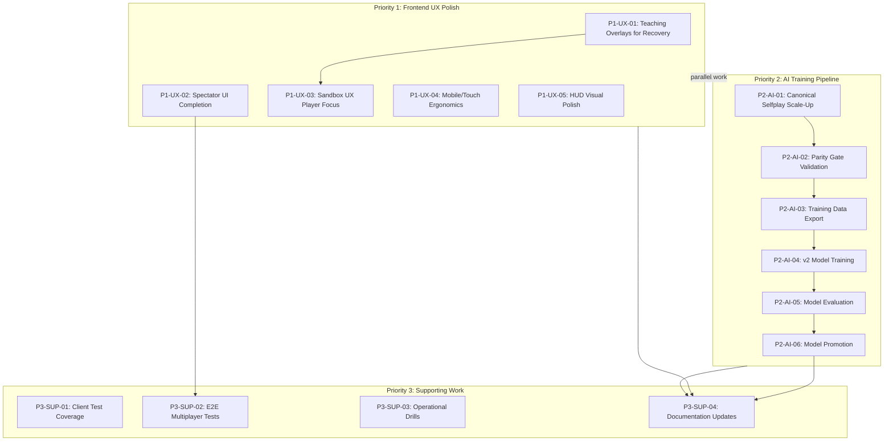

# Remediation Plan: Critical Assessment Findings

**Date:** 2025-12-15  
**Status:** Active  
**Owner:** Development Team  
**Related Documents:**

- [`PROJECT_GOALS.md`](../../PROJECT_GOALS.md)
- [`KNOWN_ISSUES.md`](../../KNOWN_ISSUES.md)
- [`CURRENT_STATE_ASSESSMENT.md`](../../CURRENT_STATE_ASSESSMENT.md)
- [`ai-service/TRAINING_DATA_REGISTRY.md`](../../ai-service/TRAINING_DATA_REGISTRY.md)
- [`docs/ux/UX_RULES_TEACHING_GAP_ANALYSIS.md`](../ux/UX_RULES_TEACHING_GAP_ANALYSIS.md)

---

## 1. Executive Summary

This remediation plan addresses two critical findings from the 2025-12-14 project assessment that represent the highest-impact gaps for production readiness:

### Critical Finding 1: Frontend UX & Player-Facing Experience

**Score:** 3.5/5 (lowest of all components)

The frontend UX remains developer-centric rather than player-ready. Key gaps include:

- **Teaching overlays:** 4 teaching gaps remain unaddressed for recovery actions
- **Spectator UI:** Incomplete read-only viewing experience
- **Sandbox UX:** Oriented for debugging rather than player exploration
- **Mobile/touch ergonomics:** Need additional polish

### Critical Finding 2: AI Model Training Pipeline Completion

**Score:** Pipeline exists but no models promoted

The AI training infrastructure is substantial (13 nodes, ~2,500 selfplay jobs) but has not yet produced canonical neural models:

- **All current neural models:** Marked `legacy_noncanonical`
- **v2 target models:** `ringrift_v2_square8/19/hex.pth` all pending
- **Complex dependency chain:** canonical selfplay → parity gates → encoding → training → evaluation → promotion

---

## 2. Priority 1: Frontend UX Polish

### P1-UX-01: Teaching Overlay Completion for Recovery Actions

**Scope:** Implement remaining 4 teaching gaps (GAP-RECOV-01 through GAP-RECOV-04) for the Recovery Action rule feature, now that engine implementation is complete.

**Deliverables:**

- New `recovery_action` TeachingOverlay topic in [`teachingTopics.ts`](../../src/shared/teaching/teachingTopics.ts)
- 2-3 teaching scenario steps in [`teachingScenarios.ts`](../../src/shared/teaching/teachingScenarios.ts)
- Integration with LPS teaching to clarify recovery ≠ real action
- Recovery-specific HUD hints and eligibility indicators

**Acceptance Criteria:**

- [ ] `recovery_action` topic appears in TeachingOverlay with eligibility explanation
- [ ] At least 2 teaching scenarios use existing contract vectors from `recovery_action.vectors.json`
- [ ] LPS teaching tips explicitly state: "Recovery and forced elimination do not count for LPS"
- [ ] Temporary vs permanent elimination distinction clearly taught
- [ ] All 4 GAP-RECOV items marked complete in `UX_RULES_TEACHING_GAP_ANALYSIS.md`

**Effort Estimate:** M (Medium)  
**Dependencies:** None - engine complete as of 2025-12-08  
**Recommended Mode:** code

---

### P1-UX-02: Spectator UI Completion

**Scope:** Complete the spectator experience with read-only board interactions, clear spectator indicators, and appropriate HUD adaptations.

**Deliverables:**

- Enhanced spectator badge and status indicators in `GameHUD.tsx`
- Spectator-specific overlay panel showing watcher count and current player context
- Disabled interaction states for board clicks/selections
- Spectator re-connection handling in WebSocket layer

**Acceptance Criteria:**

- [ ] Spectators see clear visual badge ("Watching") in HUD
- [ ] Board interactions are disabled (no click handlers fire)
- [ ] Watcher count displayed to all participants
- [ ] Spectator reconnection works seamlessly (tested via E2E)
- [ ] No spectator actions can modify game state (fuzz tested)

**Effort Estimate:** M (Medium)  
**Dependencies:** None  
**Recommended Mode:** code

---

### P1-UX-03: Sandbox UX Player Focus

**Scope:** Transform sandbox from a developer debugging tool into an accessible learning environment while preserving advanced features for power users.

**Deliverables:**

- "Beginner Mode" toggle that hides advanced diagnostics (AI stall tools, fixture export)
- Guided onboarding preset for new players with simplified configuration
- Quick-start presets for common configurations (2P square8, 3P square8, etc.)
- Streamlined scenario picker with learning-oriented categories
- Progressive disclosure: advanced features in collapsible/secondary panels

**Acceptance Criteria:**

- [ ] New "Beginner Mode" toggle in sandbox settings
- [ ] When enabled, hides: AI stall diagnostics, fixture exports, replay DB tools
- [ ] At least 3 quick-start presets available for one-click game start
- [ ] Scenario picker has "Learn Rules" category with teaching scenarios
- [ ] Advanced tools remain accessible via "Developer Mode" toggle
- [ ] First-time sandbox users see onboarding tooltip

**Effort Estimate:** L (Large)  
**Dependencies:** P1-UX-01 (teaching scenarios used in presets)  
**Recommended Mode:** code

---

### P1-UX-04: Mobile/Touch Ergonomics

**Scope:** Improve touch interaction on mobile devices for comfortable gameplay.

**Deliverables:**

- Touch-friendly tap targets (minimum 44×44px per WCAG)
- Swipe gestures for board navigation on large boards
- Mobile-optimized choice dialog layouts
- Viewport handling for on-screen keyboard interference
- Touch-specific feedback (visual ripples, haptic if available)

**Acceptance Criteria:**

- [ ] All interactive elements ≥44×44px on mobile viewports
- [ ] Board can be panned/zoomed via pinch gestures on hex/19×19
- [ ] Choice dialogs stack vertically on narrow screens
- [ ] No layout breaks when on-screen keyboard appears
- [ ] Playwright mobile viewport tests pass for core flows
- [ ] Manual testing on iOS Safari and Android Chrome passes

**Effort Estimate:** L (Large)  
**Dependencies:** None  
**Recommended Mode:** code

---

### P1-UX-05: HUD Visual Polish

**Scope:** Refine HUD layout, copy, and visual hierarchy for player readability rather than developer debugging.

**Deliverables:**

- Cleaner visual hierarchy with player-focused information prominent
- Consistent iconography for phase indicators
- Improved decision-phase countdown banner styling
- Tooltip improvements for victory conditions panel
- Color mode consistency (dark/light themes)

**Acceptance Criteria:**

- [ ] Phase indicators use unified icon set
- [ ] Decision countdown banner meets contrast requirements (WCAG AA)
- [ ] Victory tooltips explain conditions in player-friendly language
- [ ] Both dark and light modes render correctly (snapshot tests)
- [ ] No developer-facing debug text visible in production build

**Effort Estimate:** M (Medium)  
**Dependencies:** None  
**Recommended Mode:** code

---

## 3. Priority 2: AI Model Training Pipeline

### P2-AI-01: Canonical Selfplay Scale-Up

**Scope:** Scale canonical selfplay databases to training-appropriate sizes across all board types and player counts.

**Deliverables:**

- `canonical_square8.db`: Scale from 12 games to 100+ games
- `canonical_square8_3p.db`: Scale from 2 games to 50+ games
- `canonical_square8_4p.db`: Scale from 2 games to 50+ games
- `canonical_square19.db`: Scale from 1 game to 25+ games
- `canonical_hex.db`: Scale from 1 game to 25+ games
- Updated gate summaries (`db_health.canonical_*.json`) for all DBs

**Acceptance Criteria:**

- [ ] Each canonical DB has `canonical_ok: true` in latest gate summary
- [ ] `canonical_square8.db` ≥100 completed games
- [ ] `canonical_square8_3p.db` ≥50 completed games
- [ ] `canonical_square8_4p.db` ≥50 completed games
- [ ] `canonical_square19.db` ≥25 completed games
- [ ] `canonical_hex.db` ≥25 completed games
- [ ] All DBs pass parity + canonical history + FE/territory fixture gates

**Effort Estimate:** L (Large - compute intensive)  
**Dependencies:** None (infrastructure exists)  
**Recommended Mode:** code

---

### P2-AI-02: Parity Gate Validation

**Scope:** Verify TS↔Python parity for scaled canonical databases before training.

**Deliverables:**

- Parity run output for each canonical DB
- State bundle analysis for any divergences
- Documentation of parity gate status in `TRAINING_DATA_REGISTRY.md`

**Acceptance Criteria:**

- [ ] Each DB passes `check_ts_python_replay_parity.py` with 0 semantic divergences
- [ ] Structural issues (if any) documented with resolution path
- [ ] Parity summaries stored as `parity_summary.canonical_*.json`
- [ ] `TRAINING_DATA_REGISTRY.md` updated with current gate status

**Effort Estimate:** M (Medium)  
**Dependencies:** P2-AI-01  
**Recommended Mode:** code

---

### P2-AI-03: Training Data Export

**Scope:** Export canonical databases to training-ready format (NPZ/tensor datasets).

**Deliverables:**

- Training data export script updates for v2 encoding
- NPZ exports for each canonical DB
- Data manifest documenting provenance and encoding version
- Holdout split (evaluation games excluded from training)

**Acceptance Criteria:**

- [ ] Export script produces valid NPZ files loadable by PyTorch
- [ ] Data manifest includes: source_db, canonical flag, rules version, board type
- [ ] Holdout DBs (tournament/evaluation) excluded from training exports
- [ ] Encoding version tracked in manifest (for architecture compatibility)
- [ ] At least 80% of canonical games successfully export

**Effort Estimate:** M (Medium)  
**Dependencies:** P2-AI-02  
**Recommended Mode:** code

---

### P2-AI-04: v2 Model Training Runs

**Scope:** Train v2 neural models on canonical data for each board type.

**Deliverables:**

- `ringrift_v2_square8.pth` trained on `canonical_square8.db`
- `ringrift_v2_square19.pth` trained on `canonical_square19.db`
- `ringrift_v2_hex.pth` trained on `canonical_hex.db`
- Training logs and checkpoints with versioning metadata
- Loss curves and training metrics documentation

**Acceptance Criteria:**

- [ ] Each model has valid architecture version and config stored
- [ ] Training completes without divergence or NaN losses
- [ ] Loss curves show convergence (documented in training report)
- [ ] All models loadable via `ModelVersionManager` with matching checksums
- [ ] Models marked as `pending_evaluation` in registry (not yet `canonical`)

**Effort Estimate:** L (Large - GPU intensive)  
**Dependencies:** P2-AI-03  
**Recommended Mode:** code

---

### P2-AI-05: Model Evaluation

**Scope:** Evaluate v2 models via Elo tournaments and strength assessment.

**Deliverables:**

- Elo tournament results for each v2 model vs HeuristicAI baselines
- Strength assessment against difficulty ladder calibration
- Holdout game evaluation metrics
- Evaluation report documenting model capabilities

**Acceptance Criteria:**

- [ ] Each model evaluated in ≥100 tournament games
- [ ] Elo ratings computed and stored in `elo_leaderboard.db`
- [ ] Models beat HeuristicAI (difficulty 2) at ≥70% win rate
- [ ] Models competitive with MinimaxAI (difficulty 3-4)
- [ ] Evaluation documented in `data/model_promotion_history.json`

**Effort Estimate:** M (Medium)  
**Dependencies:** P2-AI-04  
**Recommended Mode:** code

---

### P2-AI-06: Model Promotion

**Scope:** Promote evaluated v2 models to canonical status for production use.

**Deliverables:**

- Update `TRAINING_DATA_REGISTRY.md` with v2 model status: `canonical`
- Update `data/promoted_models.json` with v2 model entries
- Integration test verifying v2 models load in AI service
- Production smoke test with v2 models at higher difficulty levels

**Acceptance Criteria:**

- [ ] All v2 models pass promotion checklist (Elo, holdout, parity)
- [ ] `TRAINING_DATA_REGISTRY.md` shows v2 models as `canonical`
- [ ] AI service successfully loads and uses v2 models
- [ ] Higher difficulty levels (7-10) use v2 models instead of legacy
- [ ] No regression in AI latency SLOs with v2 models

**Effort Estimate:** S (Small)  
**Dependencies:** P2-AI-05  
**Recommended Mode:** code

---

## 4. Priority 3: Supporting Work

### P3-SUP-01: Client Component Test Coverage

**Scope:** Improve test coverage for critical React components to reduce frontend regression risk.

**Deliverables:**

- React Testing Library tests for `BoardView` edge cases
- Test coverage for `ChoiceDialog` all PlayerChoice variants
- `GameHUD` state rendering tests
- `VictoryModal` scenario coverage

**Acceptance Criteria:**

- [ ] `BoardView.tsx` test coverage ≥70%
- [ ] All 6+ PlayerChoice variants have ChoiceDialog render tests
- [ ] GameHUD renders correctly for all 8 phases (snapshot tests)
- [ ] VictoryModal renders all 3 victory conditions with explanations
- [ ] No new regressions introduced (CI green)

**Effort Estimate:** M (Medium)  
**Dependencies:** None  
**Recommended Mode:** code

---

### P3-SUP-02: E2E Multiplayer Coverage

**Scope:** Extend Playwright E2E tests for complex multiplayer scenarios.

**Deliverables:**

- E2E test for 3-player game completion
- Reconnection scenario E2E test
- Spectator join/leave E2E test
- AI difficulty ladder E2E test (verifying difficulty affects move quality)

**Acceptance Criteria:**

- [ ] 3-player E2E test passes in CI
- [ ] Reconnection test exercises: disconnect → reconnect → continue
- [ ] Spectator E2E test: join mid-game, receive updates, leave
- [ ] AI test: difficulty 1 vs difficulty 6 produce observably different play
- [ ] All E2E tests complete within timeout (5 min max)

**Effort Estimate:** M (Medium)  
**Dependencies:** P1-UX-02 (spectator UI must work for spectator E2E)  
**Recommended Mode:** code

---

### P3-SUP-03: Operational Validation Drills

**Scope:** Execute remaining operational readiness drills before production.

**Deliverables:**

- Backup/restore drill executed and documented
- Secrets rotation drill executed and documented
- AI service degradation drill executed and documented
- Drill results logged in `docs/runbooks/OPERATIONAL_DRILLS_RESULTS_*.md`

**Acceptance Criteria:**

- [ ] Backup/restore: DB backup created and restored successfully
- [ ] Secrets rotation: JWT, DB credentials rotated without service interruption
- [ ] AI degradation: Fallback to local AI activates when service down
- [ ] Each drill has documented runbook with timing and results
- [ ] No P0 issues discovered during drills

**Effort Estimate:** M (Medium)  
**Dependencies:** None  
**Recommended Mode:** debug (for drill execution and analysis)

---

### P3-SUP-04: Documentation Updates

**Scope:** Update documentation to reflect remediation work and current state.

**Deliverables:**

- Updated `CURRENT_STATE_ASSESSMENT.md` with UX and AI status
- Updated `KNOWN_ISSUES.md` closing resolved items
- Updated `docs/ux/UX_RULES_TEACHING_GAP_ANALYSIS.md` with recovery gaps addressed
- Release notes draft for v1.0 beta

**Acceptance Criteria:**

- [ ] All referenced documents reflect actual implementation state
- [ ] No P0/P1 items in KNOWN_ISSUES remain unaddressed without rationale
- [ ] Teaching gap analysis shows all 25 gaps addressed
- [ ] Release notes cover: new features, known limitations, migration notes

**Effort Estimate:** S (Small)  
**Dependencies:** All P1 and P2 tasks (documentation reflects completed work)  
**Recommended Mode:** code

---

## 5. Dependency Graph



---

## 6. Execution Order

### Phase A: Foundation (Days 1-5)

**Parallel Work Streams:**

| Stream          | Tasks                        | Rationale                             |
| --------------- | ---------------------------- | ------------------------------------- |
| **UX Stream**   | P1-UX-01, P1-UX-02, P1-UX-05 | Independent tasks for quick wins      |
| **AI Stream**   | P2-AI-01                     | Compute-intensive, start early        |
| **Test Stream** | P3-SUP-01, P3-SUP-03         | Coverage + ops validation in parallel |

**Key Milestone:** Canonical DBs scaled (P2-AI-01), Teaching overlays complete (P1-UX-01), Spectator UI functional (P1-UX-02)

### Phase B: Core Delivery (Days 6-15)

**Sequential AI Pipeline:**

- P2-AI-02 → P2-AI-03 → P2-AI-04 (strict sequence, blocking dependencies)

**Parallel UX Work:**

- P1-UX-03 (requires P1-UX-01 complete)
- P1-UX-04 (independent, can proceed in parallel)

**Supporting:**

- P3-SUP-02 (after P1-UX-02 complete)

**Key Milestone:** Training runs complete (P2-AI-04), Sandbox UX transformed (P1-UX-03)

### Phase C: Evaluation & Polish (Days 16-20)

**AI Completion:**

- P2-AI-05 → P2-AI-06 (evaluation → promotion)

**Documentation:**

- P3-SUP-04 (after all implementation complete)

**Key Milestone:** v2 models promoted, documentation updated, production-ready

### Gantt Overview

```
Day:    1  2  3  4  5  6  7  8  9 10 11 12 13 14 15 16 17 18 19 20
───────────────────────────────────────────────────────────────────
P1-UX-01: [======]
P1-UX-02: [======]
P1-UX-05: [======]
P1-UX-03:          [==========]
P1-UX-04:          [==========]
───────────────────────────────────────────────────────────────────
P2-AI-01: [==========]
P2-AI-02:             [===]
P2-AI-03:                [===]
P2-AI-04:                   [=======]
P2-AI-05:                            [====]
P2-AI-06:                                 [==]
───────────────────────────────────────────────────────────────────
P3-SUP-01: [======]
P3-SUP-02:          [====]
P3-SUP-03: [======]
P3-SUP-04:                                     [====]
```

---

## 7. Success Metrics

### Priority 1: Frontend UX Polish - Success Criteria

| Metric                | Target                | Measurement Method                           |
| --------------------- | --------------------- | -------------------------------------------- |
| Teaching Gap Closure  | 25/25 gaps addressed  | `UX_RULES_TEACHING_GAP_ANALYSIS.md` audit    |
| Spectator UI Complete | 100% feature coverage | E2E test + manual review                     |
| Sandbox Beginner Mode | Available and tested  | Feature toggle + user feedback               |
| Mobile Compatibility  | All core flows work   | Playwright mobile tests + manual iOS/Android |
| Component Score       | ≥4.0/5                | `CURRENT_STATE_ASSESSMENT.md` rating         |

### Priority 2: AI Training Pipeline - Success Criteria

| Metric             | Target                    | Measurement Method          |
| ------------------ | ------------------------- | --------------------------- |
| Canonical DB Scale | See P2-AI-01 counts       | `TRAINING_DATA_REGISTRY.md` |
| Parity Gate        | 0 semantic divergences    | Parity summary JSONs        |
| v2 Models Trained  | 3 models (sq8, sq19, hex) | Model files + checksums     |
| Model Elo          | Beat HeuristicAI ≥70%     | `elo_leaderboard.db`        |
| Model Promotion    | All 3 models canonical    | `TRAINING_DATA_REGISTRY.md` |

### Priority 3: Supporting Work - Success Criteria

| Metric                | Target                      | Measurement Method     |
| --------------------- | --------------------------- | ---------------------- |
| Client Test Coverage  | ≥70% on critical components | Jest coverage report   |
| E2E Multiplayer Tests | 4+ scenarios passing        | Playwright CI          |
| Ops Drills Complete   | 3/3 drills executed         | Drill result documents |
| Documentation Current | No stale P0/P1 items        | Cross-doc audit        |

### Overall Success

The remediation is complete when:

1. **Frontend UX score** improves from 3.5/5 to ≥4.0/5
2. **All v2 models** are marked `canonical` in the training registry
3. **Teaching gaps** reduced from 4 pending to 0
4. **No blocker issues** remain in `KNOWN_ISSUES.md` for v1.0 launch

---

## 8. Risk Mitigation

| Risk                                | Likelihood | Impact | Mitigation                                        |
| ----------------------------------- | ---------- | ------ | ------------------------------------------------- |
| Training compute bottleneck         | Medium     | High   | Start P2-AI-01 immediately; use distributed nodes |
| Parity divergence in scaled DBs     | Low        | High   | Run parity gates incrementally during scale-up    |
| Mobile browser edge cases           | Medium     | Medium | Test early on real devices; prioritize iOS Safari |
| Model evaluation shows poor quality | Low        | High   | Iterate on training hyperparameters; extend data  |
| Teaching scenario authoring slows   | Low        | Medium | Reuse existing contract vectors as templates      |

---

## 9. Next Actions

1. **Assign owners** to each subtask
2. **Create tracking issues** in project management system
3. **Begin Phase A** parallel work streams
4. **Schedule daily standups** to monitor AI compute pipeline
5. **Plan user testing** for UX changes after Phase B

---

_This plan will be updated as work progresses. All changes should be reflected in `TODO.md` and `CURRENT_STATE_ASSESSMENT.md`._
