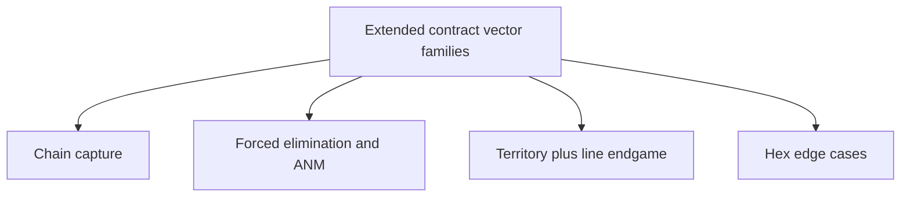

# Extended Contract Vectors Design

&gt; **Doc Status (2025-12-01): Active (derived)**  
&gt; **Role:** Design specification for an extended set of v2 contract test vectors that exercise long-tail, multi-phase, and hex-specific rules scenarios, to be implemented in TypeScript and consumed by Python for TS↔Python parity and orchestrator parity soaks.  
&gt;  
&gt; **SSoT alignment:** This document is a derived contract design over the **Canonical TS rules surface**:  
&gt;  
&gt; - Shared TS rules engine under [`src/shared/engine`](src/shared/engine/core.ts:1).  
&gt; - Contract schemas and serialization in [`schemas.ts`](src/shared/engine/contracts/schemas.ts:1) and [`serialization.ts`](src/shared/engine/contracts/serialization.ts:1), plus v2 contract vectors in [`tests/fixtures/contract-vectors/v2`](tests/fixtures/contract-vectors/v2/README.md:1).  
&gt; - TS contract runner [`contractVectorRunner.test.ts`](tests/contracts/contractVectorRunner.test.ts:1) and Python contract runner [`test_contract_vectors.py`](ai-service/tests/contracts/test_contract_vectors.py:1).  
&gt; - Invariant and parity framework in [`INVARIANTS_AND_PARITY_FRAMEWORK.md`](docs/INVARIANTS_AND_PARITY_FRAMEWORK.md:1) and Python strict-invariant guidance in [`STRICT_INVARIANT_SOAKS.md`](docs/STRICT_INVARIANT_SOAKS.md:1).  
&gt;  
&gt; **Precedence:** If this design ever conflicts with the shared TS engine, contract schemas, existing v2 vectors, or their TS/Python tests, **code + tests win** and this document must be updated.

---

## 1. Purpose and Context

The existing v2 contract vectors under [`tests/fixtures/contract-vectors/v2`](tests/fixtures/contract-vectors/v2/README.md:1) cover core domains:

- Placement, movement, capture.
- Basic chain-capture continuation on `square19` (see [`chain_capture.vectors.json`](tests/fixtures/contract-vectors/v2/chain_capture.vectors.json:1)).
- Territory detection and simple movement-territory interactions (see [`territory.vectors.json`](tests/fixtures/contract-vectors/v2/territory.vectors.json:1)).
- A single orchestrator-driven composite territory region + self-elimination sequence generated by [`generate-orchestrator-contract-vectors.ts`](scripts/generate-orchestrator-contract-vectors.ts:1) and stored in [`territory_processing.vectors.json`](tests/fixtures/contract-vectors/v2/territory_processing.vectors.json:1).

Parity and invariants at scale are guarded by:

- TS orchestrator contract tests and soaks (see [`contractVectorRunner.test.ts`](tests/contracts/contractVectorRunner.test.ts:1) and `run-orchestrator-soak.ts`).
- Python parity and invariant tests under [`ai-service/tests/parity`](ai-service/tests/parity/test_chain_capture_parity.py:1) and [`ai-service/tests/invariants`](ai-service/tests/invariants/test_active_no_moves_movement_forced_elimination_regression.py:1).
- The meta-framework in [`INVARIANTS_AND_PARITY_FRAMEWORK.md`](docs/INVARIANTS_AND_PARITY_FRAMEWORK.md:42), especially `INV-ACTIVE-NO-MOVES`, `INV-TERMINATION`, and `PARITY-TS-PY-CONTRACT-VECTORS`.

However, several **long-tail behaviours** are currently exercised only indirectly via plateau traces and self-play soaks:

- Deep, branching **chain captures** across multiple phases.
- **Forced elimination** chains and Active-No-Moves (ANM) shapes in both movement and territory contexts.
- Composite **line plus territory** interactions near endgame on large and hex boards.
- **Hexagonal** edge and corner pathologies for capture, territory, and forced elimination.

This document defines an extended contract vector design that makes these behaviours **explicit, targeted, and traceable**, so that:

- TS can generate and validate new v2 bundles.
- Python can consume them via [`test_contract_vectors.py`](ai-service/tests/contracts/test_contract_vectors.py:1).
- Orchestrator parity soaks and incident analysis can reference them by stable ID.

---

## 2. Existing v2 Contract Schema and Runners

### 2.1 Schema summary

The canonical v2 TestVector schema is defined in [`TestVectorSchema`](src/shared/engine/contracts/schemas.ts:381):

- `id: string` – unique, stable identifier.
- `version: "v2"`.
- `category: "placement" | "movement" | "capture" | "chain_capture" | "line_processing" | "territory_processing" | "victory" | "edge_case"`.
- `input: { state: GameState, move: Move }` – using the serialized form produced by [`serializeGameState`](src/shared/engine/contracts/serialization.ts:170).
- `expectedOutput: { status, assertions }`:
  - `status: "complete" | "awaiting_decision"`.
  - `assertions` is a sparse object including some or all of:
    - `currentPlayer`, `currentPhase`, `gameStatus`.
    - `stackCount`, `markerCount`, `collapsedCount`.
    - `sInvariantDelta`.
    - `victoryWinner`.
    - Additional scenario-specific fields (e.g. `player1EliminatedRings`).

TS helpers such as [`createTestVector`](src/shared/engine/contracts/serialization.ts:269) and the vector bundle utilities wrap this schema in JSON bundles of the form:

```json
{
  "version": "v2",
  "generated": "ISO-8601",
  "count": 3,
  "categories": ["movement"],
  "description": "Description",
  "vectors": [
    /* TestVector[] */
  ]
}
```

See [`v2/README.md`](tests/fixtures/contract-vectors/v2/README.md:1) for concrete examples from existing bundles.

### 2.2 TS and Python runners

TS runner [`contractVectorRunner.test.ts`](tests/contracts/contractVectorRunner.test.ts:1):

- Loads all `*.vectors.json` bundles from `tests/fixtures/contract-vectors/v2`.
- For each vector:
  - Deserializes the `state` via [`deserializeGameState`](src/shared/engine/contracts/serialization.ts:206).
  - Applies `processTurn` to `state` and `move`.
  - Validates `result.nextState` against `expectedOutput.assertions` using `validateAgainstAssertions`.
  - Verifies `result.status` matches `expectedOutput.status`.
- Additionally, groups vectors by `sequence:&lt;id&gt;` tags via `groupVectorsBySequenceTag` to form multi-step sequences.

Python runner [`test_contract_vectors.py`](ai-service/tests/contracts/test_contract_vectors.py:1):

- Loads all configured categories from `tests/fixtures/contract-vectors/v2`.
- Uses `GameEngine.apply_move` on each vector.
- Checks:
  - `current_player`, `current_phase`, `game_status`.
  - Aggregate counts (`stack_count`, `marker_count`, `collapsed_count`).
  - `s_invariant_delta` computed from `compute_progress_snapshot`.

The extended vectors designed here **reuse this schema and harness**; no schema change is required, but we **do** rely on:

- Tolerant handling of additional assertion keys in Python.
- Proper preservation of extra move fields in TS via `convertVectorMove` in [`contractVectorRunner.test.ts`](tests/contracts/contractVectorRunner.test.ts:98).

---

## 3. Taxonomy and Coverage Goals

The extended vector set is organised into four primary **families**.



High-level families:

1. **A – Chain Capture (Deep and Branching)**
   - Deep (depth ≥ 3) and branching chains.
   - Different starting phases (`movement`, `capture`, `chain_capture`).
   - Interaction with self-capture and victory thresholds.
   - Coverage across `square8`, `square19`, and `hexagonal`.

2. **B – Forced Elimination and ANM**
   - Forced elimination chains from single and multiple stacks.
   - Multi-player rotation semantics (skipping fully eliminated players).
   - Clarifying when host-level forced elimination occurs vs explicit `eliminate_rings_from_stack`.
   - Directly exercises `INV-ACTIVE-NO-MOVES`, `INV-ELIMINATION-MONOTONIC`, and `INV-TERMINATION`.

3. **C – Territory and Line Interactions Near Endgame**
   - Overlong lines and line rewards feeding into territory disconnection.
   - Single-point swings in combined elimination/territory ladders.
   - Decision-phase exit behaviour when no territory decisions remain.
   - Strongly related to `PARITY-TS-PY-TERRITORY-LINE` and the analysis in [`RULES_TERMINATION_ANALYSIS.md`](docs/supplementary/RULES_TERMINATION_ANALYSIS.md:19).

4. **D – Hex-Specific Edge and Corner Cases**
   - Chain captures along axial hex directions near edges/corners.
   - Tiny territory regions at hex corners.
   - 3-player ANM and forced-elimination pathologies that only arise with hex geometry.

### 3.1 Board-type coverage

For each family we target:

- **Square boards**:
  - `square8` – smaller geometry, easier to visualise and debug.
  - `square19` – stress test for distance, cap-height, and line/territory interactions.

- **Hex**:
  - `hexagonal` – at least one sequence per family where geometry is critical.

This design does **not** cover every Cartesian product of {family} × {board type}, but for each family we ensure **at least one** sequence on each relevant board type.

---

## 4. Schema, Assertions, and Naming Guidelines

### 4.1 Assertions for new vectors

All new vectors MUST set:

- `expectedOutput.status`: `"complete"` or `"awaiting_decision"`.
- `assertions.currentPhase`: the resulting high-level phase (`"movement"`, `"capture"`, `"chain_capture"`, `"line_processing"`, `"territory_processing"`, `"game_over"`).
- `assertions.gameStatus`: `"active"` or `"completed"`.
- `assertions.stackCount`: total stacks after the move.
- `assertions.markerCount`: total markers after the move.
- `assertions.collapsedCount`: total collapsed spaces after the move.
- `assertions.sInvariantDelta`: `S(next) - S(prev)` where `S` is defined in [`computeProgressSnapshot`](src/shared/engine/core.ts:1) and analysed in [`INVARIANTS_AND_PARITY_FRAMEWORK.md`](docs/INVARIANTS_AND_PARITY_FRAMEWORK.md:84).

For long-tail scenarios we also RECOMMEND:

- `assertions.currentPlayer`.
- `assertions.victoryWinner` when `gameStatus = "completed"`.
- Per-player fields for any players whose state meaningfully changes:
  - `player1RingsInHand`, `player1EliminatedRings`, `player1TerritorySpaces`, etc.
  - `player2...`, `player3...` as needed.
- `assertions.totalRingsEliminated` when forced elimination is involved.

Python’s current assertion model ignores additional keys; P18.5‑2 is expected to either:

- Extend Python’s `TestVector` assertion handling to support these extra fields, or
- Document which of them are purely informational for Python.

### 4.2 ID naming convention

Extended vector IDs follow:

```text
&lt;family&gt;.&lt;scenario&gt;.&lt;variant&gt;.&lt;board&gt;
```

Where:

- `family` ∈ {`chain_capture`, `forced_elimination`, `territory_line`, `hex_edge_case`} (existing vectors continue to use `placement`, `movement`, `capture`, `territory`, etc.).
- `scenario` describes the structural pattern (e.g. `depth3`, `branch`, `monotone_chain`, `overlong_line`, `corner_region`).
- `variant` disambiguates steps or forks (`segment1`, `segment2`, `final`, `case1`, `branchA`).
- `board` ∈ {`square8`, `square19`, `hexagonal`}.

Examples:

- `chain_capture.depth3.segment1.square8`
- `forced_elimination.monotone_chain.step2.square8`
- `territory_line.overlong_line.step1.square19`
- `hex_edge_case.corner_region.case1.hexagonal`

### 4.3 Sequence tags

Multi-step flows are linked by sequence tags in the `tags` array:

```text
"tags": ["parity", "sequence:chain_capture.depth3.linear.square8"]
```

We standardise:

```text
sequence:&lt;family&gt;.&lt;scenario&gt;.&lt;board&gt;
```

e.g.:

- `sequence:chain_capture.depth3.linear.square8`
- `sequence:forced_elimination.monotone_chain.square8`
- `sequence:territory_line.overlong_line.square19`
- `sequence:hex_edge_case.corner_region.hexagonal`

The TS runner already groups such vectors via `groupVectorsBySequenceTag` in [`contractVectorRunner.test.ts`](tests/contracts/contractVectorRunner.test.ts:68).

### 4.4 Bundle files

In addition to existing bundles, P18.5‑2 is expected to add:

- `chain_capture_long_tail.vectors.json` – Family A extended scenarios.
- `forced_elimination.vectors.json` – Family B.
- `territory_line_endgame.vectors.json` – Family C.
- `hex_edge_cases.vectors.json` – Family D.

Each bundle uses the same outer structure as existing v2 bundles, with `categories` aligned to the underlying rules domains (`chain_capture`, `territory_processing`, `line_processing`, `edge_case`).

---

## 5. Extended Vector Catalogue (Design-Level)

The following tables define the **intended** new contract vectors. Implementers will instantiate concrete board coordinates consistent with these descriptions and the canonical rules in `RULES_CANONICAL_SPEC.md`.

Each row is one `processTurn` step (one vector). Sequences are grouped by their sequence tag.

### 5.1 Family A – Chain Capture (Deep and Branching)

#### A1 – Linear depth 3 chain on square8

**Sequence tag:** `sequence:chain_capture.depth3.linear.square8`  
**Goal:** Validate depth‑3 chain transitions, `chainCapturePosition`, and termination.

| ID                                      | Category        | Board type | Initial situation (short)                                                                                                                                                                                        | Expected outcome (high level)                                                                                                                                                                                                                                           |
| --------------------------------------- | --------------- | ---------- | ---------------------------------------------------------------------------------------------------------------------------------------------------------------------------------------------------------------- | ----------------------------------------------------------------------------------------------------------------------------------------------------------------------------------------------------------------------------------------------------------------------- |
| `chain_capture.depth3.segment1.square8` | `chain_capture` | `square8`  | P1 height‑2 stack at centre column, two or three P2 stacks in a line ahead. First `overtaking_capture` from `movement` phase jumps over nearest P2, landing where at least two further chain captures are legal. | `status = "awaiting_decision"`, `currentPhase = "chain_capture"`, `currentPlayer = 1`, `stackCount` unchanged (attacker plus remaining targets), `markerCount` increased by 1 (departure), `sInvariantDelta = 1`, `chainCapturePosition` at attacker landing stack.     |
| `chain_capture.depth3.segment2.square8` | `chain_capture` | `square8`  | From chain-capture state, P1 executes second capture over next P2 stack along same direction. A third target remains reachable.                                                                                  | `status = "awaiting_decision"`, `currentPhase = "chain_capture"`, `currentPlayer = 1`, `stackCount` still 2, `markerCount` stable or incremented (depending on design), `sInvariantDelta ≥ 1`, `chainCapturePosition` updated.                                          |
| `chain_capture.depth3.segment3.square8` | `chain_capture` | `square8`  | Final continuation capture over last target in the line; after landing, no valid `continue_capture_segment` moves remain.                                                                                        | `status = "complete"`, `currentPhase = "ring_placement"`, `currentPlayer` rotated to next player, `stackCount = 1` (only attacker remains on line), `markerCount` reflects all departure markers, `sInvariantDelta ≥ 1`, no chain-capture moves available for attacker. |

#### A2 – Linear depth 3 chain on square19

**Sequence tag:** `sequence:chain_capture.depth3.linear.square19`  
**Goal:** Same semantics as A1 but on a larger board, stressing distance and cap-height rules.

| ID                                       | Category        | Board type | Initial situation                                                                                                                                                    | Expected outcome                                                                                                                              |
| ---------------------------------------- | --------------- | ---------- | -------------------------------------------------------------------------------------------------------------------------------------------------------------------- | --------------------------------------------------------------------------------------------------------------------------------------------- |
| `chain_capture.depth3.segment1.square19` | `chain_capture` | `square19` | Horizontal chain: P1 height‑2 at `(x0, y)`, three P2 stacks spaced further apart than on square8; first capture jumps over near target and lands with two remaining. | `status = "awaiting_decision"`, `currentPhase = "chain_capture"`, `currentPlayer = 1`, correct `chainCapturePosition`, `sInvariantDelta = 1`. |
| `chain_capture.depth3.segment2.square19` | `chain_capture` | `square19` | Second continuation capture along same row.                                                                                                                          | Same as above, still `chain_capture` with at least one remaining target.                                                                      |
| `chain_capture.depth3.segment3.square19` | `chain_capture` | `square19` | Third and final capture; chain terminates.                                                                                                                           | `status = "complete"`, `currentPhase = "ring_placement"`, `currentPlayer` rotated, `stackCount` reduced, no further chain-capture options.    |

#### A3 – Linear depth 3 chain on hexagonal

**Sequence tag:** `sequence:chain_capture.depth3.linear.hexagonal`  
**Goal:** Validate chain-capture geometry and `chainCapturePosition` on hex boards.

| ID                                        | Category        | Board type  | Initial situation                                                                                                                                                                                          | Expected outcome                                                                                                                                               |
| ----------------------------------------- | --------------- | ----------- | ---------------------------------------------------------------------------------------------------------------------------------------------------------------------------------------------------------- | -------------------------------------------------------------------------------------------------------------------------------------------------------------- |
| `chain_capture.depth3.segment1.hexagonal` | `chain_capture` | `hexagonal` | P1 height‑2 stack near centre, three P2 stacks aligned along a hex axial direction in cube coordinates; first capture from `movement` or `capture` phase jumps over first P2 to an intermediate cube cell. | `status = "awaiting_decision"`, `currentPhase = "chain_capture"`, `currentPlayer = 1`, `chainCapturePosition` set to new cube position, `sInvariantDelta = 1`. |
| `chain_capture.depth3.segment2.hexagonal` | `chain_capture` | `hexagonal` | Second continuation along same axis, still at least one further target.                                                                                                                                    | Still `chain_capture`, `stackCount` unchanged modulo targets, `sInvariantDelta ≥ 1`.                                                                           |
| `chain_capture.depth3.segment3.hexagonal` | `chain_capture` | `hexagonal` | Final continuation along same axis reaches edge; no legal capture directions remain.                                                                                                                       | `status = "complete"`, `currentPhase = "ring_placement"`, `currentPlayer` rotated, no `chain_capture` moves available for attacker, `sInvariantDelta ≥ 1`.     |

#### A4 – Branching chain on square8

**Sequence tags:**

- `sequence:chain_capture.branch.vertical.square8`
- `sequence:chain_capture.branch.diagonal.square8`

**Goal:** Ensure both TS and Python enumerate equivalent branch options and handle alternative choices correctly.

| ID                                               | Category        | Board type | Initial situation                                                                                                                                                                       | Expected outcome                                                                                                                                                                            |
| ------------------------------------------------ | --------------- | ---------- | --------------------------------------------------------------------------------------------------------------------------------------------------------------------------------------- | ------------------------------------------------------------------------------------------------------------------------------------------------------------------------------------------- |
| `chain_capture.branch.entry.square8`             | `chain_capture` | `square8`  | P1 height‑2 at `(3,3)` captures over a P2 stack toward `(3,5)`, landing where there is a P2 target straight ahead `(3,7)` and another on a diagonal `(5,5)`, both capturable per rules. | `status = "awaiting_decision"`, `currentPhase = "chain_capture"`, `currentPlayer = 1`, `chainCapturePosition` at `(3,5)`, at least two legal `continue_capture_segment` options enumerated. |
| `chain_capture.branch.vertical.segment2.square8` | `chain_capture` | `square8`  | Same starting layout and first segment as above; second segment chooses the **vertical** target `(3,7)`.                                                                                | `status = "complete"`, `currentPhase = "ring_placement"`, `currentPlayer` rotated, board contains P1 stack at landing of vertical branch, no further chain captures.                        |
| `chain_capture.branch.diagonal.segment2.square8` | `chain_capture` | `square8`  | Same entry segment, but second segment chooses the **diagonal** target `(5,5)`.                                                                                                         | Same invariants as vertical branch, but final stack position and markers reflect diagonal choice; both TS and Python must agree on legality and resulting state.                            |

#### A5 – Chain interrupted by self-elimination victory on square19

**Sequence tag:** `sequence:chain_capture.self_elim_victory.square19`  
**Goal:** Validate that a chain terminates when victory is reached mid-chain.

| ID                                                  | Category        | Board type | Initial situation                                                                                                                                                                                                                                            | Expected outcome                                                                                                                                                                                                                           |
| --------------------------------------------------- | --------------- | ---------- | ------------------------------------------------------------------------------------------------------------------------------------------------------------------------------------------------------------------------------------------------------------ | ------------------------------------------------------------------------------------------------------------------------------------------------------------------------------------------------------------------------------------------ |
| `chain_capture.self_elim_victory.segment1.square19` | `chain_capture` | `square19` | Late game; P1 has `victoryThreshold - 1` eliminated rings. A chain-capture continuation lands on P1’s own marker, causing elimination of the top ring from the attacker’s stack and pushing P1 over the threshold while further capture targets still exist. | `status = "complete"`, `currentPhase = "game_over"`, `gameStatus = "completed"`, `victoryWinner = 1`, `player1EliminatedRings ≥ victoryThreshold`, `totalRingsEliminated` monotone, and no further chain-capture is applied after victory. |

#### A6 – Hex chain with no continuation

**Sequence tag:** `sequence:chain_capture.no_continuation.hexagonal`

| ID                                                    | Category        | Board type  | Initial situation                                                                                                                                                                         | Expected outcome                                                                                                                                                                                                               |
| ----------------------------------------------------- | --------------- | ----------- | ----------------------------------------------------------------------------------------------------------------------------------------------------------------------------------------- | ------------------------------------------------------------------------------------------------------------------------------------------------------------------------------------------------------------------------------ |
| `chain_capture.no_continuation.single_step.hexagonal` | `chain_capture` | `hexagonal` | P1 height‑2 stack captures over a P2 stack along an edge-adjacent hex direction but lands near the board boundary with no legal continuation due to off-board cells and collapsed spaces. | `status = "complete"`, `currentPhase = "ring_placement"`, `currentPlayer` rotated, `stackCount` reduced by removal of target, `sInvariantDelta ≥ 1`, and `_get_capture_moves` / TS equivalent return no chain-capture options. |

---

### 5.2 Family B – Forced Elimination and ANM

#### B1 – Monotone forced-elimination chain (single stack, square8)

**Sequence tag:** `sequence:forced_elimination.monotone_chain.square8`

| ID                                                | Category                              | Board type | Initial situation                                                                                                                     | Expected outcome                                                                                                                                                                                                                    |
| ------------------------------------------------- | ------------------------------------- | ---------- | ------------------------------------------------------------------------------------------------------------------------------------- | ----------------------------------------------------------------------------------------------------------------------------------------------------------------------------------------------------------------------------------- |
| `forced_elimination.monotone_chain.step1.square8` | `territory_processing` or `edge_case` | `square8`  | P1 has a single high stack trapped by collapsed spaces, `ringsInHand = 0`, and no legal moves; forced elimination selects this stack. | `status = "complete"`, `gameStatus = "active"`, `totalRingsEliminated` and `player1EliminatedRings` increase by at least 1, `stackCount` may remain 1 with reduced height, `sInvariantDelta ≥ 1`.                                   |
| `forced_elimination.monotone_chain.step2.square8` | same                                  | `square8`  | Same game immediately after step 1; another forced elimination is applied to the same stack.                                          | Same invariants: `totalRingsEliminated` and `player1EliminatedRings` strictly larger than step 1, `sInvariantDelta ≥ 1`.                                                                                                            |
| `forced_elimination.monotone_chain.final.square8` | same                                  | `square8`  | Final forced elimination removes last ring(s) from the trapped stack.                                                                 | After move, `stackCount` for P1-controlled stacks is 0, `totalRingsEliminated` monotone; either victory is triggered (if threshold reached) or P1 is fully eliminated and not left as `currentPlayer` with `gameStatus = "active"`. |

#### B2 – Turn rotation skipping fully eliminated player (3-player square8)

**Sequence tag:** `sequence:forced_elimination.rotation.skip_eliminated.square8`

| ID                                                    | Category    | Board type | Initial situation                                                                                                                                                                              | Expected outcome                                                                                                                                                                                                      |
| ----------------------------------------------------- | ----------- | ---------- | ---------------------------------------------------------------------------------------------------------------------------------------------------------------------------------------------- | --------------------------------------------------------------------------------------------------------------------------------------------------------------------------------------------------------------------- |
| `forced_elimination.rotation.skip_eliminated.square8` | `edge_case` | `square8`  | 3-player game: P1 has a trapped stack and `ringsInHand = 0`; P2 has no stacks and no rings (fully eliminated); P3 has rings and at least one legal move. Forced elimination is applied for P1. | After the move and any automatic `_end_turn` logic, `currentPlayer = 3`, `gameStatus = "active"`, P2 remains fully eliminated and is **not** chosen as `currentPlayer`, consistent with `INV-ANM-TURN-MATERIAL-SKIP`. |

#### B3 – Territory-phase explicit elimination vs host-level forced elimination

These vectors mirror the divergence patterns documented in [`test_territory_forced_elimination_divergence.py`](ai-service/tests/test_territory_forced_elimination_divergence.py:1).

| ID                                                | Category               | Board type | Initial situation                                                                                                                                                                                                               | Expected outcome                                                                                                                                                                                                                                                                                                             |
| ------------------------------------------------- | ---------------------- | ---------- | ------------------------------------------------------------------------------------------------------------------------------------------------------------------------------------------------------------------------------- | ---------------------------------------------------------------------------------------------------------------------------------------------------------------------------------------------------------------------------------------------------------------------------------------------------------------------------- |
| `forced_elimination.territory_explicit.square8`   | `territory_processing` | `square8`  | Territory-phase state where P1 applies `eliminate_rings_from_stack` to their own stack while P2 has a trapped stack and no moves; historically, host-level forced elimination might have been applied automatically after this. | `status = "complete"`, both canonical `GameEngine.apply_move` and mutator-based `DefaultRulesEngine` (Python) produce a state where exactly one ring is eliminated from P1 as specified, P2’s trapped stack remains intact, `totalRingsEliminated` increases by 1, and no additional forced elimination occurs in this turn. |
| `forced_elimination.territory_no_host_fe.square8` | `territory_processing` | `square8`  | Territory-phase state where P1 eliminates from their own stack and P2 has rings in hand and legal placements, so host-level forced elimination must **not** trigger.                                                            | `status = "complete"`, `totalRingsEliminated` reflects only P1’s explicit elimination, no additional elimination on P2, `gameStatus = "active"`, and subsequent legal moves for P2 exist.                                                                                                                                    |

#### B4 – Hex forced elimination ANM guard (3-player)

**Sequence tag:** `sequence:forced_elimination.anm_guard.hexagonal`

| ID                                       | Category    | Board type  | Initial situation                                                                                                                                                                                                 | Expected outcome                                                                                                                                                                                                                                                                                                     |
| ---------------------------------------- | ----------- | ----------- | ----------------------------------------------------------------------------------------------------------------------------------------------------------------------------------------------------------------- | -------------------------------------------------------------------------------------------------------------------------------------------------------------------------------------------------------------------------------------------------------------------------------------------------------------------- |
| `forced_elimination.anm_guard.hexagonal` | `edge_case` | `hexagonal` | 3-player hex game; current player controls stacks near the edge but still has at least one legal non-forced-elimination move or placement; there are also stacks that could be candidates for forced elimination. | After applying a legal non-elimination move, `gameStatus = "active"`, no host-level forced elimination is invoked, `totalRingsEliminated` unchanged, and `GameEngine.get_valid_moves` or TS equivalent still observes non-empty legal actions for the active player, ensuring `INV-ACTIVE-NO-MOVES` is not violated. |

---

### 5.3 Family C – Territory and Line Endgame

#### C1 – Overlong line then mini-region (all board types)

These sequences encode the same conceptual flow as [`test_line_and_territory_scenario_parity.py`](ai-service/tests/parity/test_line_and_territory_scenario_parity.py:109), but as explicit `processTurn` steps.

**Sequence tags:**

- `sequence:territory_line.overlong_line.square8`
- `sequence:territory_line.overlong_line.square19`
- `sequence:territory_line.overlong_line.hexagonal`

For each board type:

| ID  | Category | Board type | Initial situation | Expected outcome |
| --- | -------- | ---------- | ----------------- | ---------------- |

| ID                                           | Category               | Board type | Initial situation                                                                                                                                                                                                                                             | Expected outcome                                                                                                                                                                                                                                                        |
| -------------------------------------------- | ---------------------- | ---------- | ------------------------------------------------------------------------------------------------------------------------------------------------------------------------------------------------------------------------------------------------------------- | ----------------------------------------------------------------------------------------------------------------------------------------------------------------------------------------------------------------------------------------------------------------------- |
| `territory_line.overlong_line.step1.square8` | `line_processing`      | `square8`  | State set up analogously to the Python test: overlong P1 line of length `requiredLength + 1` and a synthetic region with a single-cell disconnected territory containing a P2 stack. The move is a `choose_line_reward` / Option‑2 minimal-collapse decision. | `status = "complete"`, `currentPhase` remains or exits `line_processing` per canonical rules, exactly `requiredLength` markers for P1 collapse to Territory, `player1EliminatedRings` unchanged, `collapsedCount` increases by `requiredLength`, `sInvariantDelta ≥ 0`. |
| `territory_line.overlong_line.step2.square8` | `territory_processing` | `square8`  | From the post-line state above, P1 processes the disconnected region around the single P2 stack via `process_territory_region`.                                                                                                                               | `status = "complete"`, `board.stacks` entry for the region cell is removed, `collapsedSpaces` gains that cell for P1, `player1TerritorySpaces` increases by 1, `player1EliminatedRings` increases by 1, `totalRingsEliminated` increases by 1, `sInvariantDelta ≥ 1`.   |

The same two-step pattern is instantiated for `square19` and `hexagonal`:

- `territory_line.overlong_line.step1.square19`
- `territory_line.overlong_line.step2.square19`
- `territory_line.overlong_line.step1.hexagonal`
- `territory_line.overlong_line.step2.hexagonal`

Each uses the board-size-appropriate `requiredLength` and geometry, but the expected outcomes mirror the `square8` case.

#### C2 – Territory vs elimination single-point swing (square19)

**Sequence tag:** `sequence:territory_line.single_point_swing.square19`

| ID                                           | Category               | Board type | Initial situation                                                                                                                                                                                                                                     | Expected outcome                                                                                                                                                                                                                                                        |
| -------------------------------------------- | ---------------------- | ---------- | ----------------------------------------------------------------------------------------------------------------------------------------------------------------------------------------------------------------------------------------------------- | ----------------------------------------------------------------------------------------------------------------------------------------------------------------------------------------------------------------------------------------------------------------------- |
| `territory_line.single_point_swing.square19` | `territory_processing` | `square19` | Late-game state on `square19` where P1 and P2 are within one point in the combined elimination/territory ladder; a `process_territory_region` move for P1 both collapses a 1-cell region and forces mandatory self-elimination from a specific stack. | `status = "complete"`, `gameStatus = "completed"`, `victoryWinner` equals the player favoured by the canonical tiebreak ladder, `player1TerritorySpaces` and `player1EliminatedRings` reflect the exact change, `totalRingsEliminated` monotone, `sInvariantDelta ≥ 1`. |

#### C3 – Decision-phase auto-exit (territory_processing)

**Sequence tag:** `sequence:territory_line.decision_auto_exit.square8`

| ID                                          | Category               | Board type | Initial situation                                                                                                                                                                                                                                                                          | Expected outcome                                                                                                                                                                                                                                                                                 |
| ------------------------------------------- | ---------------------- | ---------- | ------------------------------------------------------------------------------------------------------------------------------------------------------------------------------------------------------------------------------------------------------------------------------------------ | ------------------------------------------------------------------------------------------------------------------------------------------------------------------------------------------------------------------------------------------------------------------------------------------------ |
| `territory_line.decision_auto_exit.square8` | `territory_processing` | `square8`  | State where `currentPhase = "territory_processing"` for player P, but there are **no** legal Territory decisions: no processable regions and no valid `eliminate_rings_from_stack` decisions. A final no-op or synthetic decision (for harness purposes) is applied to trigger phase exit. | `status = "complete"`, resulting state has `gameStatus = "active"` but `currentPhase` advanced out of `territory_processing` (to the next appropriate phase or player), and the new `currentPlayer` has at least one legal action, satisfying `INV-PHASE-CONSISTENCY` and `INV-ACTIVE-NO-MOVES`. |

Traceability for Family C (territory + line endgame):

- **Rules / scenarios matrix:** the `territory_line.*` contract vectors (overlong line + mini-region,
  single-point swing, decision auto-exit) are referenced under the T3 territory axis in
  `RULES_SCENARIO_MATRIX.md` as the combined territory+line endgame contracts, alongside the square/hex
  region-then-elim multi-step sequences.
- **Python parity:** `docs/PYTHON_PARITY_REQUIREMENTS.md` §8.5.3 names the same IDs as the canonical
  TS↔Python contract surface for territory+line interactions; Python exercises them via the
  `territory_line_endgame.vectors.json` bundle in
  `ai-service/tests/contracts/test_contract_vectors.py` and the scenario parity suite
  `ai-service/tests/parity/test_line_and_territory_scenario_parity.py`.

---

### 5.4 Family D – Hex-Specific Edge and Corner Cases

#### D1 – Hex edge chain capture

**Sequence tag:** `sequence:hex_edge_case.edge_chain.hexagonal`

| ID                                            | Category        | Board type  | Initial situation                                                                                                                                                                                                   | Expected outcome                                                                                                                                                                                                                       |
| --------------------------------------------- | --------------- | ----------- | ------------------------------------------------------------------------------------------------------------------------------------------------------------------------------------------------------------------- | -------------------------------------------------------------------------------------------------------------------------------------------------------------------------------------------------------------------------------------- |
| `hex_edge_case.edge_chain.segment1.hexagonal` | `chain_capture` | `hexagonal` | P1 height‑2 stack near the outer ring captures over a P2 stack along a hex axial direction, landing adjacent to the edge such that only one continuation direction remains legal (others are off-board or blocked). | `status = "awaiting_decision"`, `currentPhase = "chain_capture"`, `currentPlayer = 1`, `chainCapturePosition` at the new cube coordinate, `stackCount` unchanged modulo markers, `sInvariantDelta = 1`.                                |
| `hex_edge_case.edge_chain.segment2.hexagonal` | `chain_capture` | `hexagonal` | From that chain-capture state, P1 executes the unique legal continuation along the edge direction to capture a second P2 stack and land at or near the corner.                                                      | `status = "complete"`, `currentPhase = "ring_placement"`, `currentPlayer` rotated, `stackCount` adjusted (captured stacks merged into attacker), `sInvariantDelta ≥ 1`, and no further continuation exists in any legal hex direction. |

#### D2 – Hex corner territory region

**Sequence tag:** `sequence:hex_edge_case.corner_region.hexagonal`

| ID                                            | Category               | Board type  | Initial situation                                                                                                                                                                           | Expected outcome                                                                                                                                                                                                                                                                                                                                                             |
| --------------------------------------------- | ---------------------- | ----------- | ------------------------------------------------------------------------------------------------------------------------------------------------------------------------------------------- | ---------------------------------------------------------------------------------------------------------------------------------------------------------------------------------------------------------------------------------------------------------------------------------------------------------------------------------------------------------------------------- |
| `hex_edge_case.corner_region.case1.hexagonal` | `territory_processing` | `hexagonal` | A 2–3 cell disconnected region lies adjacent to a hex corner; the region encloses one or more P2 stacks and is bounded entirely by P1 markers and/or board edge (no square-grid artefacts). | `status = "complete"`, target stacks in the region are removed, those cells are added to `collapsedSpaces` for P1, `player1TerritorySpaces` increases by the region size, `player1EliminatedRings` and `totalRingsEliminated` increase according to stacks removed, `sInvariantDelta ≥ region_size + eliminated_rings`, and no extra cells outside the region are collapsed. |

#### D3 – Hex forced elimination ANM (3-player)

**Sequence tag:** `sequence:hex_edge_case.forced_elim_3p.hexagonal`

| ID                                       | Category    | Board type  | Initial situation                                                                                                                                                                   | Expected outcome                                                                                                                                                                                                                                                                                  |
| ---------------------------------------- | ----------- | ----------- | ----------------------------------------------------------------------------------------------------------------------------------------------------------------------------------- | ------------------------------------------------------------------------------------------------------------------------------------------------------------------------------------------------------------------------------------------------------------------------------------------------- |
| `hex_edge_case.forced_elim_3p.hexagonal` | `edge_case` | `hexagonal` | 3-player hex game: P1 has only trapped stacks and no rings in hand; P2 is fully eliminated (no stacks or rings); P3 has legal moves. A forced elimination action is applied for P1. | After forced elimination and any automatic turn handling, `currentPlayer = 3`, `gameStatus = "active"`, `totalRingsEliminated` increases monotonically, and no ACTIVE state exists where `currentPlayer` has no legal actions, satisfying `INV-ACTIVE-NO-MOVES` and `INV-ANM-TURN-MATERIAL-SKIP`. |

---

## 6. Traceability to Invariants and Parity IDs

Each family maps directly to invariant and parity IDs defined in [`INVARIANTS_AND_PARITY_FRAMEWORK.md`](docs/INVARIANTS_AND_PARITY_FRAMEWORK.md:42):

- **Family A – Chain capture**
  - `INV-PHASE-CONSISTENCY`, `INV-TERMINATION`, `INV-S-MONOTONIC`.
  - `PARITY-TS-PY-CONTRACT-VECTORS` (TS↔Python contract parity on chain-capture).
  - Edge/hex-specific scenarios also touch `PARITY-TS-PY-SEED-PLATEAU` where plateau traces involve chain-capture tails.

- **Family B – Forced elimination and ANM**
  - `INV-ACTIVE-NO-MOVES`, `INV-ELIMINATION-MONOTONIC`, `INV-TERMINATION`.
  - `INV-ANM-TURN-MATERIAL-SKIP` for turn rotation over fully eliminated players.
  - `PARITY-TS-PY-ACTIVE-NO-MOVES` and `PARITY-TS-PY-CONTRACT-VECTORS`.

- **Family C – Territory and line endgame**
  - `INV-TERMINATION` (decision-phase progress via T = C + E).
  - `PARITY-TS-PY-TERRITORY-LINE` for composite line + territory flows on all board types.
  - `INV-S-MONOTONIC` for S-invariant deltas during line collapse and territory processing.

- **Family D – Hex edge cases**
  - The same IDs as A–C, constrained to `BoardType.HEXAGONAL` and connected self-play parity suites (e.g. `test_hex_training.py` and hex plateau seeds).

These mappings should be referenced when promoting new regression seeds into additional contract vectors or when correlating soak anomalies (`S_INVARIANT_DECREASED`, `ACTIVE_NO_MOVES`) back to specific families.

---

## 7. Implementation Notes for P18.5-2 and P18.5-3

### 7.1 P18.5-2 – Code and Test Integration

Code-mode tasks following this design are expected to:

1. **TS vector creation**
   - Implement generators and/or manual fixtures that realise the IDs enumerated in §5 using the canonical TS engine and orchestrator:
     - Prefer orchestrator-driven paths via [`processTurn`](src/shared/engine/orchestration/turnOrchestrator.ts:1) when constructing composite sequences (chain capture, territory + line, forced elimination).
     - Use helper patterns from [`generate-orchestrator-contract-vectors.ts`](scripts/generate-orchestrator-contract-vectors.ts:1) and existing bundles such as [`chain_capture.vectors.json`](tests/fixtures/contract-vectors/v2/chain_capture.vectors.json:1).

2. **Bundle structure**
   - Create new v2 bundles as needed:
     - `chain_capture_long_tail.vectors.json`
     - `forced_elimination.vectors.json`
     - `territory_line_endgame.vectors.json`
     - `hex_edge_cases.vectors.json`
   - Ensure `version`, `categories`, and `count` fields follow current conventions in [`v2/README.md`](tests/fixtures/contract-vectors/v2/README.md:1).

3. **TS contract runner**
   - Update or extend [`contractVectorRunner.test.ts`](tests/contracts/contractVectorRunner.test.ts:1) to:
     - Load and validate the new bundles.
     - Ensure multi-step sequences (via `sequence:` tags) are internally consistent, as already done for territory composite vectors.

4. **Python contract runner**
   - Update [`test_contract_vectors.py`](ai-service/tests/contracts/test_contract_vectors.py:1) to:
     - Include any new bundle filenames in `VECTOR_CATEGORIES` or document the mapping if using existing category names.
     - Optionally extend `validate_assertions` to support additional per-player fields used by new vectors.

### 7.2 P18.5-3 – Orchestrator Parity Soaks and Debugging

Debug-mode tasks for P18.5-3 should:

1. **Integrate vector IDs into parity soaks**
   - Expose vector IDs in orchestrator parity and soak summaries where applicable (for example, when re-running a sequence constructed from a contract vector in a soak context).
   - When a soak discovers a new invariant or parity failure that matches a long-tail pattern, promote it into:
     - A new contract vector under an appropriate family in this design.
     - Or a new scenario in the Python invariant suites, cross-referenced via the same IDs.

2. **Cross-reference with seed/plateau harnesses**
   - Where plateau or seed-based parity harnesses exist (see [`test_ts_seed_plateau_snapshot_parity.py`](ai-service/tests/parity/test_ts_seed_plateau_snapshot_parity.py:1) and [`PARITY_SEED_TRIAGE.md`](docs/PARITY_SEED_TRIAGE.md:1)), link problem seeds back to the closest contract-vector family in this design (e.g. A/B/C/D) to avoid redundant bespoke fixtures.

3. **Maintain SSOT alignment**
   - Treat this design and the P18.5‑1 section in [`PYTHON_PARITY_REQUIREMENTS.md`](docs/PYTHON_PARITY_REQUIREMENTS.md:1) as **derived**, and always prefer:
     - The shared TS engine and orchestrator under `src/shared/engine/**`.
     - The executable v2 bundles under `tests/fixtures/contract-vectors/v2/**`.
     - The Python parity and invariant tests.

Any changes to rules semantics or orchestrator behaviour that affect these families must:

- First be reflected in TS engine code and tests.
- Then be propagated into updated vector bundles and, if necessary, revisions to this design document and the parity requirements doc.
