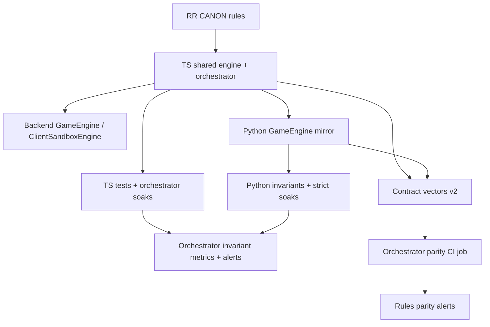

# Invariants & Parity Framework (Rules, Orchestrator, Hosts)

> **Doc Status (2025-11-30): Active (derived, meta-framework)**  
> **Role:** High-level overview of rules-level invariants and TS↔Python↔host parity, and how they are enforced via tests, soaks, metrics, and rollout SLOs. AI/training behaviour is treated as context only, not as an invariant surface.
>
> **SSoT alignment:** This document is a **derived** framework over:
>
> - **Rules/invariants semantics SSoT:** `RULES_CANONICAL_SPEC.md`, `ringrift_complete_rules.md`, `ringrift_compact_rules.md`, and the shared TS engine under `src/shared/engine/**` plus v2 contract vectors in `tests/fixtures/contract-vectors/v2/**`.
> - **Lifecycle/API SSoT:** `docs/CANONICAL_ENGINE_API.md` and shared TS/WebSocket types & schemas under `src/shared/types/game.ts`, `src/shared/engine/orchestration/types.ts`, `src/shared/types/websocket.ts`, and `src/shared/validation/websocketSchemas.ts`.
> - **Parity & invariants meta-docs:** `docs/RULES_SSOT_MAP.md` §7, `docs/PYTHON_PARITY_REQUIREMENTS.md`, and `docs/STRICT_INVARIANT_SOAKS.md`.
> - **Operational SSoTs:** Orchestrator rollout and observability docs (`docs/ORCHESTRATOR_ROLLOUT_PLAN.md`, `docs/ALERTING_THRESHOLDS.md`) and monitoring config under `monitoring/**`.
>
> **Precedence:** If this document ever conflicts with the shared TS engine, contract vectors, Python mirror, or their tests (including orchestrator soaks and strict-invariant soaks), **code + tests win** and this document must be updated.

This document is a navigation aid over the canonical TS engine and orchestrator under [`src/shared/engine`](src/shared/engine), the Python rules mirror under [`ai-service/app`](ai-service/app/game_engine.py:1), and the production hosts (backend `GameEngine`, sandbox `ClientSandboxEngine`, Python self‑play). It does **not** redefine rules semantics; when in doubt, defer to the SSoTs listed above.

## 1. Overview & Goals

The goals of this framework are:

- Provide a single catalogue of **rules-level invariants** and **parity expectations** across:
  - Shared TS engine + turn orchestrator.
  - Python rules mirror.
  - Hosts (backend, sandbox, Python self‑play harnesses).
- Give each invariant and parity expectation a **stable ID** that other docs, CI jobs, and alerts can reference.
- Map each ID to concrete enforcement mechanisms:
  - TS unit/scenario tests and orchestrator soaks.
  - Python invariants/parity tests and strict-invariant soaks.
  - CI jobs and Prometheus alerts.
- Expose **gaps, overlaps, and risks** so that future tasks can harden coverage without duplicating work.

**Out of scope**

- AI strength/quality, heuristic fitness, and training-time metrics. These live in AI-focused docs and are only relevant here insofar as they reuse the rules engine and invariant/parity harnesses.

**Relationship to other docs**

- [`docs/RULES_SSOT_MAP.md`](docs/RULES_SSOT_MAP.md:262) already contains a short "Invariants & Soaks Overview"; this framework expands that section into a structured catalogue with IDs and mappings.
- [`docs/STRICT_INVARIANT_SOAKS.md`](docs/STRICT_INVARIANT_SOAKS.md:12) is the operational recipe for strict no‑move and S‑invariant soaks; this doc treats those soaks as **implementations** of the invariant IDs below.
- [`docs/PYTHON_PARITY_REQUIREMENTS.md`](docs/PYTHON_PARITY_REQUIREMENTS.md:19) defines function/type-level parity between TS and Python; this doc focuses on **behavioural** and **host-level** parity.

## 2. Invariant Catalogue

This section defines the canonical invariants we care about operationally. Each invariant has:

- **ID** – stable identifier.
- **Description** – the property that must hold.
- **Scope** – where it is expected to hold.
- **Motivation** – bugs/incidents guarded against.
- **Enforcement** – mapping to TS/Python tests, soaks, and ops.

### 2.1 Structural Board & State Invariant

**ID:** `INV-STATE-STRUCTURAL`

**Description**

- For any reachable state:
  - Each cell is in exactly one of {empty, stack, marker, collapsed}.
  - For every stack: `stackHeight ≥ 0`, `capHeight ∈ [0, stackHeight]`, and `stackHeight == rings.length`.
  - Eliminated-ring counts are non‑negative for every player.
  - Board metadata (`board.type`, `size`) and ring/marker maps remain internally consistent.

**Scope**

- TS shared engine (`BoardState`, `GameState`, `computeProgressSnapshot`).
- Backend and sandbox hosts via [`BoardManager`](src/server/game/BoardManager.ts:37) and [`ClientSandboxEngine`](src/client/sandbox/ClientSandboxEngine.ts:137).
- Python engine via [`BoardState`](ai-service/app/models/core.py:1) and [`BoardManager`](ai-service/app/board_manager.py:1).

**Motivation**

- Guards against corrupt states that invalidate all higher-level invariants (e.g. negative heights, double occupancy, inconsistent elimination accounting).
- Historical bugs around territory processing and capture chains have often first appeared as board-structure anomalies.

**Enforcement mapping**

| Channel          | Mechanisms                                                                                                                                                                                                                                                                                                                                                                                                           |
| ---------------- | -------------------------------------------------------------------------------------------------------------------------------------------------------------------------------------------------------------------------------------------------------------------------------------------------------------------------------------------------------------------------------------------------------------------- |
| **TS tests**     | [`BoardManager.assertBoardInvariants()`](src/server/game/BoardManager.ts:37), [`ClientSandboxEngine.assertBoardInvariants()`](src/client/sandbox/ClientSandboxEngine.ts:2337), shared-engine tests such as [`territoryDecisionHelpers.shared.test.ts`](tests/unit/territoryDecisionHelpers.shared.test.ts:1), [`GameEngine.territoryDisconnection.test.ts`](tests/unit/GameEngine.territoryDisconnection.test.ts:1). |
| **TS soaks**     | [`scripts/run-orchestrator-soak.ts`](scripts/run-orchestrator-soak.ts:1) via `checkStructuralInvariants` and violation IDs `NEGATIVE_STACK_HEIGHT`, `STACK_HEIGHT_MISMATCH`, `INVALID_CAP_HEIGHT`, `NEGATIVE_ELIMINATED_RINGS`.                                                                                                                                                                                      |
| **Python tests** | Structural expectations embedded in [`test_mutable_state.py`](ai-service/tests/test_mutable_state.py:1), [`test_rules_evaluate_move.py`](ai-service/tests/test_rules_evaluate_move.py:1), and parity tests that compare stacks/markers between TS and Python.                                                                                                                                                        |
| **Ops / alerts** | Any structural violation detected by the TS soak harness contributes to `ringrift_orchestrator_invariant_violations_total` and can trigger `OrchestratorInvariantViolationsStaging` / `OrchestratorInvariantViolationsProduction` in [`alerts.yml`](monitoring/prometheus/alerts.yml:636).                                                                                                                           |

### 2.2 S‑Invariant and Elimination Monotonicity

**ID:** `INV-S-MONOTONIC` (progress) and `INV-ELIMINATION-MONOTONIC`

**Description**

- Let `S = M + C + E` as in [`RR-CANON-R191`](RULES_CANONICAL_SPEC.md:476):
  - `M` = markers on the board.
  - `C` = collapsed spaces.
  - `E` = total eliminated rings credited to any player.
- Under any legal move or forced elimination:
  - `S` must be **non‑decreasing**.
  - `totalRingsEliminated` must be **non‑decreasing**.

**Scope**

- TS shared engine (`computeProgressSnapshot` in [`core.ts`](src/shared/engine/core.ts:1)).
- Backend host via [`GameEngine.appendHistoryEntry`](src/server/game/GameEngine.ts:92).
- Sandbox host via [`ClientSandboxEngine.appendHistoryEntry`](src/client/sandbox/ClientSandboxEngine.ts:271).
- Python mirror uses an equivalent `compute_progress_snapshot` but currently does **not** enforce monotonicity during soaks.

**Motivation**

- Encodes finite‑termination guarantee and rules‑level progress (no infinite play).
- Historical bugs: S‑invariant decreases during line/territory chains, incorrect elimination bookkeeping in territory processing and forced elimination.

**Enforcement mapping**

| Channel                  | Mechanisms                                                                                                                                                                                                                                                                                                                                                                 |
| ------------------------ | -------------------------------------------------------------------------------------------------------------------------------------------------------------------------------------------------------------------------------------------------------------------------------------------------------------------------------------------------------------------------- |
| **TS tests**             | Shared-engine S‑invariant tests such as [`ProgressSnapshot.core.test.ts`](tests/unit/ProgressSnapshot.core.test.ts:1), [`SharedMutators.invariants.test.ts`](tests/unit/SharedMutators.invariants.test.ts:1), scenario tests around late‑game progress.                                                                                                                    |
| **TS soaks**             | [`run-orchestrator-soak.ts`](scripts/run-orchestrator-soak.ts:1) checks `S` and `totalRingsEliminated` on every turn, emitting `S_INVARIANT_DECREASED` and `TOTAL_RINGS_ELIMINATED_DECREASED` violations. Regression seeds may be promoted into [`OrchestratorSInvariant.regression.test.ts`](tests/unit/OrchestratorSInvariant.regression.test.ts:1).                     |
| **Python tests / soaks** | Parity of `compute_progress_snapshot` vs `computeProgressSnapshot` validated indirectly via contract vectors and parity tests described in [`docs/PYTHON_PARITY_REQUIREMENTS.md`](docs/PYTHON_PARITY_REQUIREMENTS.md:277). No dedicated Python S‑monotonic soak yet (gap).                                                                                                 |
| **Ops / alerts**         | Violations from the TS soak harness flow into the same invariant metrics and `OrchestratorInvariantViolations*` alerts as `INV-STATE-STRUCTURAL`. Long‑running games that frequently hit `maxTurns` in soak summaries (see [`results/orchestrator_soak_summary.json`](results/orchestrator_soak_summary.json:1)) are treated as soft signals of potential progress issues. |

### 2.3 Active-No-Moves: Global Legal Actions for the Active Player

**ID:** `INV-ACTIVE-NO-MOVES`

**Formal definitions (notation)**

For any valid `GameState state` with `state.gameStatus == ACTIVE` and `state.currentPlayer = P`:

- **Turn-material** (RR-CANON-R201):
  - P has turn-material in `state` iff either:
    - P controls at least one stack (some stack whose top ring has P's colour); or
    - `state.ringsInHand[P] > 0`.

- **Global legal actions** for P in `state` (RR-CANON-R200) are the set
  - `G(state, P) = Placements(state, P) ∪ PhaseMoves(state, P) ∪ ForcedElim(state, P)`, where:
    - `Placements(state, P)` is the set of ring placements (and an explicit `skip_placement` where applicable) that would be legal for P the next time they enter `ring_placement`, computed from the current board, `ringsInHand[P]`, `ringsPerPlayer`, and the no-dead-placement rule, **independent of** `state.currentPhase`.

    - `PhaseMoves(state, P)` is the set of phase-local interactive moves currently available to P in `state.currentPhase`:
      - in `ring_placement`: placements and `skip_placement`;
      - in `movement` / `capture` / `chain_capture`: non-capture moves and overtaking capture segments/chains;
      - in `line_processing`: `process_line` and `choose_line_reward` decisions;
      - in `territory_processing`: `process_territory_region`, `choose_territory_option`, and `eliminate_rings_from_stack` decisions.

    - `ForcedElim(state, P)` is `{ forced_elimination }` exactly when the precondition of [`RR-CANON-R100`](RULES_CANONICAL_SPEC.md:379) holds in `state` for P (P controls at least one stack and has **no** legal placement, non-capture movement, or overtaking capture). Otherwise it is the empty set.

- **ANM predicate** (RR-CANON-R202):
  - `ANM(state, P)` holds iff:
    - P has turn-material in `state`; and
    - `G(state, P)` is empty.

Intuitively, ANM means "P still has material but literally no way to act": no placements, no movements or captures, no line/territory decisions, and no forced elimination.

**Invariant statement**

- For every _reachable_ state `state` produced by the TS or Python engines, at every **invariant checkpoint** (post shared-engine `processTurn` / Python `GameEngine.apply_move`, after any automatic phase-exit / forced-elimination chain, and at soak snapshot boundaries):
  - If `state.gameStatus == ACTIVE` and `state.currentPlayer = P`, then:
    - P has turn-material in `state`; and
    - `G(state, P)` is **non-empty** (i.e. `ANM(state, P)` is false).

- The **only** allowed shape in which _all_ players have no global legal actions is the global stalemate of [`RR-CANON-R173`](RULES_CANONICAL_SPEC.md:551), which must be resolved immediately into a terminal state. Engines should not surface such a state to hosts or soaks as `gameStatus == ACTIVE`.

- In particular, the following ANM scenario families from [`ACTIVE_NO_MOVES_BEHAVIOUR.md`](docs/ACTIVE_NO_MOVES_BEHAVIOUR.md:35) must never appear as long-lived ACTIVE states:
  - **ANM-SCEN-01 – Movement, forced-elimination available:** movement/capture phases where forced elimination exists but is not counted as a legal action.
  - **ANM-SCEN-02 – Movement, placements-only actions:** movement phases where placements are available on a future `ring_placement` phase but ignored by the invariant.
  - **ANM-SCEN-03 – Fully eliminated current player:** movement phases where `currentPlayer` has no turn-material but remains active.
  - **ANM-SCEN-04 / 05 – Decision phases with no remaining decisions:** line and Territory phases that strand the current player with no legal decisions.
  - **ANM-SCEN-06 – Global stalemate:** global no-moves shapes that are not immediately converted to terminal stalemate under [`RR-CANON-R173`](RULES_CANONICAL_SPEC.md:551).

**Scope**

- TS shared engine and turn logic ([`turnLogic.advanceTurnAndPhase`](src/shared/engine/turnLogic.ts:135), orchestrator).
- Backend and sandbox hosts via orchestrator adapters and `getValidMoves`-style surfaces.
- Python canonical engine and `RingRiftEnv` strict-invariant mode.

**Motivation**

- Encodes the "no dead player" semantics of [`RR-CANON-R072`](RULES_CANONICAL_SPEC.md:209), the ANM definition and avoidance in the R2xx cluster ([`RR-CANON-R200`–`RR-CANON-R204`](RULES_CANONICAL_SPEC.md:219)), and global-stalemate handling in [`RR-CANON-R173`](RULES_CANONICAL_SPEC.md:551).
- Strong enough to catch the historical bugs catalogued in [`ACTIVE_NO_MOVES_BEHAVIOUR.md`](docs/ACTIVE_NO_MOVES_BEHAVIOUR.md:35) and the Python invariant suites:
  - Movement phases with forced elimination available but not considered (`ANM-SCEN-01`; [`test_active_no_moves_movement_forced_elimination_regression.py`](ai-service/tests/invariants/test_active_no_moves_movement_forced_elimination_regression.py:1)).
  - Movement phases with placements-only global actions ignored by the invariant (`ANM-SCEN-02`; [`test_active_no_moves_movement_placements_only_regression.py`](ai-service/tests/invariants/test_active_no_moves_movement_placements_only_regression.py:1)).
  - Fully eliminated players left as `currentPlayer` (`ANM-SCEN-03`; [`test_active_no_moves_movement_fully_eliminated_regression.py`](ai-service/tests/invariants/test_active_no_moves_movement_fully_eliminated_regression.py:1)).
  - Line and Territory phases that strand the current player with no decisions (`ANM-SCEN-04` / `ANM-SCEN-05`; [`test_active_no_moves_territory_processing_regression.py`](ai-service/tests/invariants/test_active_no_moves_territory_processing_regression.py:1), [`test_active_no_moves_line_processing_regression.py`](ai-service/tests/parity/test_active_no_moves_line_processing_regression.py:1)).
  - Global-stalemate edge cases (`ANM-SCEN-06`) where all players simultaneously have no global legal actions.

**Enforcement mapping**

| Channel               | Mechanisms                                                                                                                                                                                                                                                                                                                                                                                                                                                                                                                                                                                                                                                                                                                                                                              |
| --------------------- | --------------------------------------------------------------------------------------------------------------------------------------------------------------------------------------------------------------------------------------------------------------------------------------------------------------------------------------------------------------------------------------------------------------------------------------------------------------------------------------------------------------------------------------------------------------------------------------------------------------------------------------------------------------------------------------------------------------------------------------------------------------------------------------- |
| **TS soaks**          | [`run-orchestrator-soak.ts`](scripts/run-orchestrator-soak.ts:1) enforces an ACTIVE‑no‑moves invariant after shared-engine move enumeration, emitting `ACTIVE_NO_MOVES` / `ACTIVE_NO_CANDIDATE_MOVES` violations when `gameStatus == 'active'` but no legal or candidate moves exist for `currentPlayer`.                                                                                                                                                                                                                                                                                                                                                                                                                                                                               |
| **TS tests**          | Decision/turn and multi‑phase tests such as [`GameEngine.lines.scenarios.test.ts`](tests/unit/GameEngine.lines.scenarios.test.ts:1), [`GameEngine.territoryDisconnection.test.ts`](tests/unit/GameEngine.territoryDisconnection.test.ts:1), and orchestrator multi‑phase suites under the `orchestrator-parity` job in [`ORCHESTRATOR_ROLLOUT_PLAN.md`](docs/ORCHESTRATOR_ROLLOUT_PLAN.md:739).                                                                                                                                                                                                                                                                                                                                                                                         |
| **Python invariants** | Strict invariant `_assert_active_player_has_legal_action` in [`GameEngine`](ai-service/app/game_engine.py:1), with ANM regression tests [`test_active_no_moves_movement_forced_elimination_regression.py`](ai-service/tests/invariants/test_active_no_moves_movement_forced_elimination_regression.py:1), [`test_active_no_moves_movement_placements_only_regression.py`](ai-service/tests/invariants/test_active_no_moves_movement_placements_only_regression.py:1), [`test_active_no_moves_movement_fully_eliminated_regression.py`](ai-service/tests/invariants/test_active_no_moves_movement_fully_eliminated_regression.py:1), [`test_active_no_moves_territory_processing_regression.py`](ai-service/tests/invariants/test_active_no_moves_territory_processing_regression.py:1). |
| **Python soaks**      | [`run_self_play_soak.py`](ai-service/scripts/run_self_play_soak.py:1) under `RINGRIFT_STRICT_NO_MOVE_INVARIANT=1` treats `no_legal_moves_for_current_player` as an anomaly and can `--fail-on-anomaly`. Snapshots under `ai-service/logs/invariant_failures/` are promoted into the invariant regression tests above.                                                                                                                                                                                                                                                                                                                                                                                                                                                                   |
| **Ops / alerts**      | ACTIVE‑no‑moves violations detected by TS soaks contribute to `ringrift_orchestrator_invariant_violations_total` and drive `OrchestratorInvariantViolations*` alerts. Python strict-invariant anomalies from self‑play soaks (including the AI healthcheck profiles) increment `ringrift_python_invariant_violations_total` and are surfaced via the `PythonInvariantViolations` alert; they are treated as a warning‑level AI/Rules health signal that should be correlated with, but not override, orchestrator‑centric SLO alerts.                                                                                                                                                                                                                                                   |

**Priority and related IDs**

- Active-no-moves detection and **forced elimination semantics** (including their interaction with line/territory processing, last-player-standing, and stalemate resolution) are treated as a **P0 correctness target** for the rules engine.
- This area is primarily captured by invariants:
  - `INV-ACTIVE-NO-MOVES` (this section) – global legal actions for the active player are never empty in non-terminal ACTIVE states.
  - `INV-PHASE-CONSISTENCY` – deterministic phase/turn progression, including correct handling of decision-phase exits.
  - `INV-ANM-TURN-MATERIAL-SKIP` – turn rotation never leaves a fully eliminated player as `currentPlayer` in an ACTIVE state.
  - `INV-TERMINATION` – finite termination and avoidance of progress stalls, using the S- and T-metrics from [`RR-CANON-R191`](RULES_CANONICAL_SPEC.md:573) / [`RR-CANON-R207`](RULES_CANONICAL_SPEC.md:296).
- Cross-language behaviour for these semantics is guarded by parity expectations:
  - `PARITY-TS-PY-ACTIVE-NO-MOVES` – alignment of "legal actions exist for the active player" / `ANM(state, P)` between TS and Python.
  - `PARITY-TS-PY-SEED-PLATEAU` – long-sequence plateaus exercising active-no-moves, forced elimination, and late-game terminations.
  - `PARITY-TS-PY-CONTRACT-VECTORS` – contract vectors that encode canonical ANM/forced-elimination and termination scenarios.
- Any additional edge-case properties discovered during the ANM workstream should extend this catalogue under focused IDs rather than introducing ad-hoc invariants.

### 2.4 Phase & Turn Consistency

**IDs:** `INV-PHASE-CONSISTENCY`, `INV-ANM-TURN-MATERIAL-SKIP`

**Description**

- **INV-PHASE-CONSISTENCY (decision phases and automatic exits)**
  - Phase progression must be deterministic and consistent with [`RR-CANON-R070`–`RR-CANON-R072`](RULES_CANONICAL_SPEC.md:192) and the ANM cluster [`RR-CANON-R204`](RULES_CANONICAL_SPEC.md:256):
    - If `currentPhase == line_processing` and the moving player P has **no** legal line decisions (`process_line` / `choose_line_reward`), the engine must **immediately** advance out of `line_processing`:
      - either into `territory_processing` for P if any Territory decisions exist; or
      - directly to victory evaluation and turn rotation per [`RR-CANON-R170`–`RR-CANON-R173`](RULES_CANONICAL_SPEC.md:523).

      It is illegal to remain in `line_processing` with `gameStatus == ACTIVE` and `ANM(state, P) == true`. This captures the shape in ANM-SCEN-05.

    - If `currentPhase == territory_processing` and P has **no** legal Territory decisions (`process_territory_region`, `choose_territory_option`, `eliminate_rings_from_stack`), the engine must:
      - either apply forced elimination for P if required by [`RR-CANON-R072` / `RR-CANON-R100`](RULES_CANONICAL_SPEC.md:379); or
      - end the turn, rotate `currentPlayer` to the next player with turn-material, and evaluate victory per [`RR-CANON-R170`–`RR-CANON-R173`](RULES_CANONICAL_SPEC.md:523).

      It is illegal to remain in `territory_processing` with `gameStatus == ACTIVE` and `ANM(state, P) == true`. This captures ANM-SCEN-04 and the territory mutator incident shape.

    - For `ring_placement`, `movement`, `capture`, and `chain_capture`, phase rules [`RR-CANON-R070`–`RR-CANON-R072`](RULES_CANONICAL_SPEC.md:192) together with `INV-ACTIVE-NO-MOVES` already ensure that whenever P has turn-material, at least one global legal action (possibly forced elimination) exists.

- **INV-ANM-TURN-MATERIAL-SKIP (turn rotation over fully eliminated players)**
  - A player P is **fully eliminated for turn rotation** when they have **no** turn-material in the sense of [`RR-CANON-R201`](RULES_CANONICAL_SPEC.md:231) (no controlled stacks and `ringsInHand[P] == 0`), regardless of buried rings of P's colour in other players' stacks.

  - In any state with `gameStatus == ACTIVE`:
    - `currentPlayer` must always be chosen from players who **do** have turn-material.
    - Turn rotation (`endTurn` / `_end_turn`) must skip fully eliminated players and must never leave an ACTIVE state whose `currentPlayer` lacks turn-material.

  - This invariant is the turn-rotation counterpart of `INV-ACTIVE-NO-MOVES` and rules out ANM-SCEN-03 and ANM-SCEN-08, where a fully eliminated player improperly retains the turn.

**Scope**

- TS shared engine turn logic and orchestrator.
- Backend and sandbox hosts via adapters.
- Python engine `_update_phase` / `_end_turn`.

**Motivation**

- Prevents composite phases from stranding the current player with no decisions (ANM-SCEN-04 / ANM-SCEN-05) and ensures that fully eliminated players do not continue to receive turns while others still have material (ANM-SCEN-03 / ANM-SCEN-08).
- Documented in [`docs/INCIDENT_TERRITORY_MUTATOR_DIVERGENCE.md`](docs/INCIDENT_TERRITORY_MUTATOR_DIVERGENCE.md:69), the ANM scenario catalogue [`ACTIVE_NO_MOVES_BEHAVIOUR.md`](docs/ACTIVE_NO_MOVES_BEHAVIOUR.md:100), and the Python active-no-moves regression tests.

**Enforcement mapping**

| Channel          | Mechanisms                                                                                                                                                                                                                                                                                                                                                                                                            |
| ---------------- | --------------------------------------------------------------------------------------------------------------------------------------------------------------------------------------------------------------------------------------------------------------------------------------------------------------------------------------------------------------------------------------------------------------------- |
| **TS tests**     | Turn/phase and Territory tests under [`territoryDecisionHelpers.shared.test.ts`](tests/unit/territoryDecisionHelpers.shared.test.ts:1), [`GameEngine.territoryDisconnection.test.ts`](tests/unit/GameEngine.territoryDisconnection.test.ts:1), and orchestrator multi‑phase scenario suites listed under the `orchestrator-parity` CI job in [`ORCHESTRATOR_ROLLOUT_PLAN.md`](docs/ORCHESTRATOR_ROLLOUT_PLAN.md:739). |
| **Python tests** | The ANM invariant suites (see `INV-ACTIVE-NO-MOVES`) plus [`test_territory_forced_elimination_divergence.py`](docs/INCIDENT_TERRITORY_MUTATOR_DIVERGENCE.md:229) validate that `_update_phase` and `_end_turn` mirror TS phase semantics and correctly skip fully eliminated players.                                                                                                                                 |
| **Soaks**        | Both TS orchestrator soaks and Python strict-invariant self‑play soaks implicitly exercise phase transitions and rotation across long games; anomalies typically manifest as ACTIVE‑no‑moves or unexpected status violations.                                                                                                                                                                                         |
| **Ops / alerts** | Phase inconsistency that leaks into host-visible behaviour will often surface as orchestrator errors (`ringrift_orchestrator_error_rate`, `OrchestratorErrorRateWarning`) or invariant violations; parity‑driven differences may also trigger `RulesParityGameStatusMismatch`.                                                                                                                                        |

### 2.5 Termination & Max-Turn Behaviour

**ID:** `INV-TERMINATION`

**Description**

- Rules-level termination is justified by the S‑invariant `S = M + C + E` in [`RR-CANON-R191`](RULES_CANONICAL_SPEC.md:573) together with ANM and forced-elimination semantics in [`RR-CANON-R207`](RULES_CANONICAL_SPEC.md:296). For invariant checks and soaks we refine this into two concrete, computable progress measures:
  - `S(state) = M + C + E` as in RR-CANON-R191, where:
    - `M` = number of markers on the board,
    - `C` = number of collapsed spaces,
    - `E` = total eliminated rings (all players).

  - `T(state) = C + E`, the "territory–elimination" component of `S`.

- **Progress under forced-elimination-only sequences**
  - For any action classified as **host-level forced elimination** under [`RR-CANON-R205`](RULES_CANONICAL_SPEC.md:274) (RR-CANON-R100 precondition holds and the engine applies the `forced_elimination` action):
    - `E` must strictly increase (`E(next) > E(prev)`), by exactly the number of rings removed from the acting player's cap.
    - Eliminated rings must never re‑enter play; any decrease of `E` is a violation of `INV-ELIMINATION-MONOTONIC`.

  - Because each player has finitely many rings, a sequence in which some player can only perform forced elimination cannot be infinite. This is the formal termination shape behind ANM-SCEN-01 and the Last-Player-Standing pattern in ANM-SCEN-07.

- **Progress under decision-phase chains (lines and Territory)**
  - For any contiguous subsequence of states in which:
    - the moving player P is fixed, and
    - `currentPhase ∈ { line_processing, territory_processing }` throughout,

    the measure `T(state) = C + E` must be **strictly increasing** from the start of the subsequence to its end.

  - Operationally, this decomposes into per-step checks that are computable from each state transition:
    - For every line-processing decision (RR-CANON-R120–R122):
      - Collapsing markers to Territory may preserve `M + C`, but it must never decrease `C`; any elimination strictly increases `E`.
      - Therefore `T` is non‑decreasing per step, and across a full line-processing chain for fixed P, at least one step must satisfy `T(next) > T(prev)`.

    - For every Territory-processing decision (RR-CANON-R140–R145):
      - Region collapse and mandatory self‑elimination strictly increase `E` and never decrease `C`.
      - Therefore `T` must strictly increase on each processed region.

  - These constraints rule out infinite loops confined to line/territory decision phases that leave the board and eliminated-ring totals unchanged, and they are strong enough to cover ANM-SCEN-04 / ANM-SCEN-05 / ANM-SCEN-06 and historical plateau regressions.

- **Global termination expectation**
  - Together with the no‑dead‑placement rule and ANM avoidance (RR-CANON-R200–R204), `S` and `T` are both **bounded above** by finite functions of board size and total rings; enforcing `INV-S-MONOTONIC` and the stricter `T`‑based progress requirements above is therefore sufficient to ensure that every legal game terminates in finite time (see also [`RULES_TERMINATION_ANALYSIS.md`](docs/supplementary/RULES_TERMINATION_ANALYSIS.md:19)).

  - Any soak or test that observes:
    - repeated forced eliminations without `E` increasing; or
    - decision-phase chains in which `T` fails to increase over the chain or cycles back to a previously seen `(board, markers, eliminatedRings)` configuration,

    must treat this as a violation of `INV-TERMINATION`.

- Operationally, long games should:
  - Terminate before hitting `maxTurns` in orchestrator soaks, except for a small, well-understood tail.
  - Never exceed `env.max_moves` in Python self‑play stability tests.

**Scope**

- TS shared engine and hosts.
- Python engine and `RingRiftEnv`.

**Motivation**

- Protects against infinite loops in capture/territory chains or last-player-standing logic.
- Ensures soak and self‑play jobs can be used as reliable gating tools.

**Enforcement mapping**

| Channel          | Mechanisms                                                                                                                                                                                                                                                                                                     |
| ---------------- | -------------------------------------------------------------------------------------------------------------------------------------------------------------------------------------------------------------------------------------------------------------------------------------------------------------- |
| **TS soaks**     | [`run-orchestrator-soak.ts`](scripts/run-orchestrator-soak.ts:1) records `hitMaxTurns` per game and reports `maxTurnsGames` in summaries such as [`results/orchestrator_soak_summary.json`](results/orchestrator_soak_summary.json:1). Hitting `maxTurns` is treated as a soft anomaly and should remain rare. |
| **Python tests** | [`test_self_play_stability.py`](ai-service/tests/test_self_play_stability.py:1) asserts that games do not exceed `env.max_moves` and that `env.step` remains exception‑free under strict invariant.                                                                                                            |
| **Python soaks** | [`run_self_play_soak.py`](ai-service/scripts/run_self_play_soak.py:1) tracks per‑game length and termination reason; repeated `max_moves_reached` or `no_legal_moves_for_current_player` reasons under strict invariant indicate potential progress bugs.                                                      |
| **Ops / alerts** | Long-running games and stalled sessions contribute to `LongRunningGames` and game‑latency alerts in [`alerts.yml`](monitoring/prometheus/alerts.yml:349), and may correlate with orchestrator invariant alerts. No dedicated termination alert exists yet for `maxTurns` anomalies (gap).                      |

### 2.6 Orchestrator vs Host Validation

**ID:** `INV-ORCH-VALIDATION`

**Description**

- For any host‑enumerated move `m` in a given state `s`:
  - The shared orchestrator's [`validateMove()`](src/shared/engine/orchestration/turnOrchestrator.ts:1) must mark `m` as valid.
- Hosts must not expose moves that the orchestrator considers illegal.

**Scope**

- Backend `GameEngine` + `TurnEngineAdapter`.
- (Future) sandbox host when a sandbox soak harness is reintroduced.

**Motivation**

- Prevents host‑specific bugs in move enumeration from drifting away from canonical orchestrator semantics.
- Critical during and after orchestrator rollout, where hosts are adapters over the shared engine.

**Enforcement mapping**

| Channel          | Mechanisms                                                                                                                                                                                                                                                                                 |
| ---------------- | ------------------------------------------------------------------------------------------------------------------------------------------------------------------------------------------------------------------------------------------------------------------------------------------ |
| **TS soaks**     | [`run-orchestrator-soak.ts`](scripts/run-orchestrator-soak.ts:1) re‑validates every move returned by `GameEngine.getValidMoves` via [`validateMove()`](src/shared/engine/orchestration/turnOrchestrator.ts:1), emitting `ORCHESTRATOR_VALIDATE_MOVE_FAILED` violations when they disagree. |
| **TS tests**     | Orchestrator multi‑phase suites under `npm run test:orchestrator-parity:ts` exercise backend and sandbox adapters against the shared orchestrator, catching systematic enumeration mismatches.                                                                                             |
| **Ops / alerts** | Validation mismatches detected via soaks contribute to invariant metrics and may manifest as orchestrator errors or invariant alerts during rollout. There is no dedicated metric keyed specifically to `INV-ORCH-VALIDATION` yet (gap).                                                   |

### 2.7 Game Status & Victory Consistency

**ID:** `INV-GAME-STATUS`

**Description**

- Game status and victory metadata must be consistent with the canonical victory rules [`RR-CANON-R170`–`R173`](RULES_CANONICAL_SPEC.md:426):
  - Terminal states are correctly marked `completed` with a well‑formed victory result.
  - Non‑terminal states use `active` (never exotic or host‑specific status codes).
  - Global stalemate and last‑player‑standing outcomes follow the canonical tie‑breaking ladder.

**Scope**

- TS victory logic and hosts.
- Python victory evaluation.
- TS↔Python parity for `GameStatus` and victory outcomes.

**Motivation**

- Ensures users and AI see consistent winners across hosts and languages.
- Critical alert surface: disagreement here is treated as a P0 parity bug.

**Enforcement mapping**

| Channel              | Mechanisms                                                                                                                                                                                                                                                                                                                            |
| -------------------- | ------------------------------------------------------------------------------------------------------------------------------------------------------------------------------------------------------------------------------------------------------------------------------------------------------------------------------------- |
| **TS tests**         | Victory scenario suites such as [`GameEngine.victory.scenarios.test.ts`](tests/unit/GameEngine.victory.scenarios.test.ts:1) plus shared‐engine victory tests.                                                                                                                                                                         |
| **Python tests**     | Victory parity and stalemate tests under [`ai-service/tests/test_engine_correctness.py`](ai-service/tests/test_engine_correctness.py:1) and parity fixtures.                                                                                                                                                                          |
| **Contract vectors** | Victory‑focused vectors using the `victory` category in [`tests/fixtures/contract-vectors/v2`](tests/fixtures/contract-vectors/v2/README.md:1), enforced by [`contractVectorRunner.test.ts`](tests/contracts/contractVectorRunner.test.ts:1) and [`test_contract_vectors.py`](ai-service/tests/contracts/test_contract_vectors.py:1). |
| **Ops / alerts**     | `RulesParityGameStatusMismatch` alert in [`alerts.yml`](monitoring/prometheus/alerts.yml:570) fires when TS and Python disagree on game status or winners; this is treated as a critical breach of `INV-GAME-STATUS`.                                                                                                                 |

## 3. Parity Catalogue (TS ↔ Python ↔ Hosts)

Parity expectations ensure that, given identical inputs, different engines and hosts agree on legality, state transitions, and outcomes.

### 3.1 TS ↔ Python Contract Vector Parity

**ID:** `PARITY-TS-PY-CONTRACT-VECTORS`

**Description**

- For all v2 contract vectors under [`tests/fixtures/contract-vectors/v2`](tests/fixtures/contract-vectors/v2):
  - TS [`processTurn()`](src/shared/engine/orchestration/turnOrchestrator.ts:1) and Python [`GameEngine.apply_move()`](ai-service/app/game_engine.py:1) must produce:
    - Identical serialized `nextState` (up to known normalisations).
    - Matching `status` (`complete` vs `awaiting_decision`).
    - Matching key assertions (`currentPlayer`, `currentPhase`, `gameStatus`, counts, `sInvariantDelta`, and victory winner where specified).

**Scope**

- Full shared-engine semantics across placement, movement, capture, lines, territory, and victory.

**Enforcement mapping**

| Channel          | Mechanisms                                                                                                                                                                                                                                                                                                  |
| ---------------- | ----------------------------------------------------------------------------------------------------------------------------------------------------------------------------------------------------------------------------------------------------------------------------------------------------------- |
| **TS tests**     | [`contractVectorRunner.test.ts`](tests/contracts/contractVectorRunner.test.ts:1) loads v2 bundles and runs each vector through [`processTurn()`](src/shared/engine/orchestration/turnOrchestrator.ts:1).                                                                                                    |
| **Python tests** | [`test_contract_vectors.py`](ai-service/tests/contracts/test_contract_vectors.py:1) runs the same vectors against [`GameEngine.apply_move()`](ai-service/app/game_engine.py:1).                                                                                                                             |
| **CI**           | `orchestrator-parity` job in [`.github/workflows/ci.yml`](.github/workflows/ci.yml:1) runs `npm run test:orchestrator-parity:ts` followed by `./scripts/run-python-contract-tests.sh --verbose`, enforcing `SLO-CI-ORCH-PARITY` in [`ORCHESTRATOR_ROLLOUT_PLAN.md`](docs/ORCHESTRATOR_ROLLOUT_PLAN.md:438). |
| **Alerts**       | Failures surface as CI breakage; repeated parity regressions should also correlate with `RulesParity*` alerts if they leak into runtime parity harnesses.                                                                                                                                                   |

### 3.2 TS ↔ Python Line & Territory Scenario Parity

**ID:** `PARITY-TS-PY-TERRITORY-LINE`

**Description**

- For focused composite scenarios that combine:
  - Overlength line processing (Option 1 vs Option 2).
  - Territory disconnection and Q23 self‑elimination.
- TS and Python must agree on:
  - Which markers collapse and to whom.
  - Territory space counts per player.
  - Eliminated‑ring attribution (including self‑elimination).

**Scope**

- Line + territory pipeline semantics on all board types.

**Enforcement mapping**

| Channel          | Mechanisms                                                                                                                                                                                                                                                                                                                                                                                |
| ---------------- | ----------------------------------------------------------------------------------------------------------------------------------------------------------------------------------------------------------------------------------------------------------------------------------------------------------------------------------------------------------------------------------------- |
| **Python tests** | [`test_line_and_territory_scenario_parity.py`](ai-service/tests/parity/test_line_and_territory_scenario_parity.py:1) constructs synthetic line + region setups for square8/square19/hexagonal and asserts behaviour consistent with TS semantics (from RulesMatrix/Q7/Q20/Q22).                                                                                                           |
| **TS tests**     | Scenario suites such as [`GameEngine.lines.scenarios.test.ts`](tests/unit/GameEngine.lines.scenarios.test.ts:1), [`RulesMatrix.Territory.MiniRegion.test.ts`](tests/scenarios/RulesMatrix.Territory.MiniRegion.test.ts:1), and FAQ/Q15–Q23 tests encode the TS reference behaviour.                                                                                                       |
| **CI**           | Python parity suites run under `python-rules-parity` / `python-core` jobs, and a TS snapshot‑based parity harness for these scenarios now exists via `tests/unit/ExportLineAndTerritorySnapshot.test.ts` (TS snapshot export) and `test_line_and_territory_ts_snapshot_parity` in the Python parity suite (on‑demand snapshot comparison; fixture generation is not yet automated in CI). |
| **Alerts**       | Divergence severe enough to change outcomes should eventually surface as `RulesParityHashMismatch` or `RulesParityGameStatusMismatch`, but there is no dedicated alert keyed specifically to this scenario family.                                                                                                                                                                        |

### 3.3 TS ↔ Python Seed / Plateau Parity

**ID:** `PARITY-TS-PY-SEED-PLATEAU`

**Description**

- For selected long‑running games (plateau seeds and snapshots):
  - TS and Python engines must agree on state hashes, S‑invariant, and game status at key moves.

**Scope**

- Composite, long‑sequence behaviour across captures, lines, territory, and LPS.

**Enforcement mapping**

| Channel          | Mechanisms                                                                                                                                                                                                                                                         |
| ---------------- | ------------------------------------------------------------------------------------------------------------------------------------------------------------------------------------------------------------------------------------------------------------------ |
| **Python tests** | Seed/plateau parity suites under [`ai-service/tests/parity`](ai-service/tests/parity/test_ts_seed_plateau_snapshot_parity.py:1), [`test_rules_parity_fixtures.py`](ai-service/tests/parity/test_rules_parity_fixtures.py:1), and related plateau diagnostics.      |
| **TS tests**     | Legacy trace replay in [`TraceFixtures.sharedEngineParity.test.ts`](tests/unit/TraceFixtures.sharedEngineParity.test.ts:1) and archived backend‑vs‑sandbox parity in [`archive/tests/unit`](archive/tests/unit/Backend_vs_Sandbox.aiParallelDebug.test.ts:1).      |
| **CI / metrics** | Seed/plateau suites are treated as diagnostic; canonical parity gates are contract vectors and orchestrator‑parity CI. Mismatches that leak into runtime parity harnesses increase `ringrift_rules_parity_*_mismatch_total` and can trigger `RulesParity*` alerts. |

### 3.4 Backend ↔ Sandbox TS Host Parity

**ID:** `PARITY-BACKEND-SANDBOX-TS`

**Description**

- For identical starting states and move/decision sequences:
  - Backend `GameEngine` (via [`TurnEngineAdapter`](src/server/game/turn/TurnEngineAdapter.ts:1)) and sandbox [`ClientSandboxEngine`](src/client/sandbox/ClientSandboxEngine.ts:137) (via [`SandboxOrchestratorAdapter`](src/client/sandbox/SandboxOrchestratorAdapter.ts:1)) must:
    - Produce identical game states and victory outcomes.
    - Agree on legal moves and decision options.

**Scope**

- All rules domains across TS hosts; this is host‑parity rather than cross‑language parity.

**Enforcement mapping**

| Channel      | Mechanisms                                                                                                                                                                                                                                                                                                                                                                                                                                                                                                           |
| ------------ | -------------------------------------------------------------------------------------------------------------------------------------------------------------------------------------------------------------------------------------------------------------------------------------------------------------------------------------------------------------------------------------------------------------------------------------------------------------------------------------------------------------------- |
| **TS tests** | Backend vs sandbox suites such as [`ClientSandboxEngine.lines.test.ts`](tests/unit/ClientSandboxEngine.lines.test.ts:1), [`ClientSandboxEngine.territoryDisconnection.hex.test.ts`](tests/unit/ClientSandboxEngine.territoryDisconnection.hex.test.ts:1), and orchestrator multi‑phase parity tests (`Orchestrator.Backend.multiPhase`, `Orchestrator.Sandbox.multiPhase`) run under `npm run test:orchestrator-parity:ts` as documented in [`ORCHESTRATOR_ROLLOUT_PLAN.md`](docs/ORCHESTRATOR_ROLLOUT_PLAN.md:739). |
| **CI**       | `orchestrator-parity` job enforces that both hosts, when using orchestrator adapters, stay aligned with the shared engine.                                                                                                                                                                                                                                                                                                                                                                                           |
| **Alerts**   | Host-parity issues discovered via runtime shadowing or parity harnesses contribute to `RulesParity*` metrics and may be surfaced as `OrchestratorShadowMismatches` if legacy vs orchestrator paths disagree.                                                                                                                                                                                                                                                                                                         |

### 3.5 TS ↔ Python Active-No-Moves Semantics

**ID:** `PARITY-TS-PY-ACTIVE-NO-MOVES`

**Description**

- The interpretation of "legal actions exist for the active player" must match between TS and Python:
  - Placements, movements, captures, and forced eliminations count as legal actions.
  - Fully eliminated players and territory/line phases must rotate turns consistently.

**Scope**

- Turn and termination semantics across TS and Python.

**Enforcement mapping**

| Channel         | Mechanisms                                                                                                                                                                                                                                                 |
| --------------- | ---------------------------------------------------------------------------------------------------------------------------------------------------------------------------------------------------------------------------------------------------------- |
| **TS**          | ACTIVE‑no‑moves invariant and phase behaviour exercised by orchestrator soaks and TS turn/territory tests (see `INV-ACTIVE-NO-MOVES` and `INV-PHASE-CONSISTENCY`).                                                                                         |
| **Python**      | Strict no‑move invariant and regression tests in [`ai-service/tests/invariants`](ai-service/tests/invariants/test_active_no_moves_movement_forced_elimination_regression.py:1).                                                                            |
| **Parity / CI** | While there is no single dedicated "ACTIVE-no-moves parity" test, any semantic difference here will break contract vectors (e.g. sInvariant deltas, game status) or parity fixtures and will surface in `orchestrator-parity` CI or `RulesParity*` alerts. |

## 4. Mapping to CI Jobs and Alerts

This section provides a matrix view from invariant/parity IDs to CI jobs and Prometheus alerts.

### 4.1 CI Job Mapping

| ID(s)                                                                                                                               | Primary CI jobs                                                                 | Notes                                                                                                                                                                                                                                                                                                                                                                                                                                                 |
| ----------------------------------------------------------------------------------------------------------------------------------- | ------------------------------------------------------------------------------- | ----------------------------------------------------------------------------------------------------------------------------------------------------------------------------------------------------------------------------------------------------------------------------------------------------------------------------------------------------------------------------------------------------------------------------------------------------- |
| `INV-STATE-STRUCTURAL`, `INV-S-MONOTONIC`, `INV-ACTIVE-NO-MOVES`, `INV-PHASE-CONSISTENCY`, `INV-TERMINATION`, `INV-ORCH-VALIDATION` | `test` (Jest umbrella), `ts-rules-engine`                                       | Shared-engine and host tests under `tests/unit/**` and `tests/scenarios/**` validate core invariants.                                                                                                                                                                                                                                                                                                                                                 |
| `INV-S-MONOTONIC`, `INV-ACTIVE-NO-MOVES`, `INV-ORCH-VALIDATION`, `INV-STATE-STRUCTURAL`                                             | `orchestrator-soak-smoke`, `orchestrator-short-soak` (short soak lanes)         | These jobs run `npm run soak:orchestrator:smoke` / `:short` with `--failOnViolation`, backing `SLO-CI-ORCH-SHORT-SOAK` in [`ORCHESTRATOR_ROLLOUT_PLAN.md`](docs/ORCHESTRATOR_ROLLOUT_PLAN.md:455).                                                                                                                                                                                                                                                    |
| `PARITY-TS-PY-CONTRACT-VECTORS`                                                                                                     | `orchestrator-parity`                                                           | Runs `npm run test:orchestrator-parity:ts` plus `./scripts/run-python-contract-tests.sh --verbose`, enforcing TS↔Python contract-vector parity.                                                                                                                                                                                                                                                                                                       |
| `PARITY-TS-PY-TERRITORY-LINE`, `PARITY-TS-PY-SEED-PLATEAU`, `PARITY-TS-PY-ACTIVE-NO-MOVES`                                          | `python-core`, `python-rules-parity`                                            | Python parity and invariants suites under `ai-service/tests/parity/**` and `ai-service/tests/invariants/**`.                                                                                                                                                                                                                                                                                                                                          |
| `INV-S-MONOTONIC`, `INV-ACTIVE-NO-MOVES`, `INV-TERMINATION`                                                                         | `python-ai-healthcheck` (CI job), `AI Self-Play Healthcheck (Nightly)` workflow | The CI job and nightly workflow defined in [`.github/workflows/ci.yml`](.github/workflows/ci.yml:1) and [`.github/workflows/ai-healthcheck-nightly.yml`](.github/workflows/ai-healthcheck-nightly.yml:1) run `run_self_play_soak.py --profile ai-healthcheck` under strict invariant, surfacing Python-side invariant regressions across square8/square19/hexagonal as a **P1/P2 health signal** that complements the orchestrator-centric SLO gates. |
| `PARITY-BACKEND-SANDBOX-TS`                                                                                                         | `orchestrator-parity`                                                           | Backend vs sandbox orchestrator multi‑phase suites. Explicitly tied to the **Capture/Territory Host Parity** weakest aspect in [`ORCHESTRATOR_ROLLOUT_PLAN.md`](docs/ORCHESTRATOR_ROLLOUT_PLAN.md:636).                                                                                                                                                                                                                                               |

### 4.2 Alert Mapping

| ID(s)                                                                                                           | Alerts / metrics                                                                                                                          | Description                                                                                                                                                                                                                                                                                                                                                                                                                                                                                                            |
| --------------------------------------------------------------------------------------------------------------- | ----------------------------------------------------------------------------------------------------------------------------------------- | ---------------------------------------------------------------------------------------------------------------------------------------------------------------------------------------------------------------------------------------------------------------------------------------------------------------------------------------------------------------------------------------------------------------------------------------------------------------------------------------------------------------------- |
| `INV-STATE-STRUCTURAL`, `INV-S-MONOTONIC`, `INV-ACTIVE-NO-MOVES`, `INV-ORCH-VALIDATION`, `INV-TERMINATION`      | `OrchestratorInvariantViolationsStaging`, `OrchestratorInvariantViolationsProduction`, `ringrift_orchestrator_invariant_violations_total` | Triggered when TS orchestrator soak harness (or future runtime guards) records invariant violations.                                                                                                                                                                                                                                                                                                                                                                                                                   |
| `INV-S-MONOTONIC`, `INV-ELIMINATION-MONOTONIC`, `INV-ACTIVE-NO-MOVES`                                           | `PythonInvariantViolations`, `ringrift_python_invariant_violations_total` (Python self‑play soaks)                                        | Python self‑play soaks (including the AI healthcheck profiles exercised by CI and nightly workflows) record invariant violations via `run_self_play_soak.py`, emitting `ringrift_python_invariant_violations_total{invariant_id, type}`. The `PythonInvariantViolations` alert in [`docs/ALERTING_THRESHOLDS.md`](docs/ALERTING_THRESHOLDS.md:640) treats any new violation as a **warning‑level AI/Rules health signal**; it should normally be triaged alongside, but not override, orchestrator‑centric SLO alerts. |
| `INV-TERMINATION` (symptom), `INV-ACTIVE-NO-MOVES`                                                              | `LongRunningGames`, `HighGameMoveLatency`                                                                                                 | Long games or slow moves can signal progress/invariant issues even when no explicit invariant metric exists.                                                                                                                                                                                                                                                                                                                                                                                                           |
| `PARITY-TS-PY-*`, `PARITY-BACKEND-SANDBOX-TS`, `INV-GAME-STATUS`                                                | `RulesParityValidationMismatch`, `RulesParityHashMismatch`, `RulesParityGameStatusMismatch`, `ringrift_rules_parity_*_mismatch_total`     | TS↔Python and host parity issues, including disagreement on legality, hashes, or game outcomes.                                                                                                                                                                                                                                                                                                                                                                                                                        |
| `PARITY-BACKEND-SANDBOX-TS` (legacy vs orchestrator), `PARITY-TS-PY-CONTRACT-VECTORS` (if shadowing at runtime) | `OrchestratorShadowMismatches`, `ringrift_orchestrator_shadow_mismatch_rate`                                                              | When orchestrator and legacy/alternate paths disagree during shadow mode.                                                                                                                                                                                                                                                                                                                                                                                                                                              |
| All invariants                                                                                                  | `OrchestratorCircuitBreakerOpen`, `OrchestratorErrorRateWarning`, `ringrift_orchestrator_error_rate`                                      | Invariant or parity failures that cause orchestrator errors can trip the circuit breaker or elevate error rates.                                                                                                                                                                                                                                                                                                                                                                                                       |

### 4.3 Example Metrics Queries (conceptual)

- Orchestrator invariants by ID (staging):  
  `increase(ringrift_orchestrator_invariant_violations_total{environment="staging"}[1h]) by (invariant_id)`
- Python self-play invariants by ID (soak jobs):  
  `increase(ringrift_python_invariant_violations_total[1h]) by (invariant_id)`
- Cross-stack comparison for S-invariant violations:  
  Compare the two expressions above filtered to `invariant_id="INV-S-MONOTONIC"` over the same time window/dashboard.

## 5. Gaps, Overlaps, and Risk Assessment

### 5.1 Gaps

1. **Python S‑invariant monotonic soaks**
   - **IDs:** `INV-S-MONOTONIC`, `INV-ELIMINATION-MONOTONIC`.
   - **Gap:** Python uses the same `compute_progress_snapshot` semantics but does not currently enforce S‑monotonicity during self‑play soaks; anomalies are only indirectly observable (e.g. via weird terminations).
   - **Impact:** Medium – TS soaks will still catch S‑invariant regressions in the canonical engine, but deep Python‑only bugs could hide in training/self‑play.
   - **Likelihood:** Medium – territory and line logic are complex; new changes may regress S locally.
   - **Priority:** High for P17.B3 to add explicit S‑invariant checks to Python soaks.

2. **Per‑invariant runtime metrics**
   - **IDs:** `INV-STATE-STRUCTURAL`, `INV-S-MONOTONIC`, `INV-ACTIVE-NO-MOVES`, `INV-ORCH-VALIDATION`.
   - **Gap (partially addressed):** Prometheus now exposes `ringrift_orchestrator_invariant_violations_total{type, invariant_id}` on the TS/backend side and `ringrift_python_invariant_violations_total{invariant_id, type}` for Python self‑play soaks. `MetricsService` and the Python soak harness both derive `invariant_id` values such as `INV-S-MONOTONIC`, `INV-ACTIVE-NO-MOVES`, and `INV-STATE-STRUCTURAL` from low‑level violation types. Dashboards and alerts, however, still need to consistently **group and slice by `invariant_id`** rather than raw `type` strings, and there are no shared cross‑stack views yet that correlate TS and Python invariant rates.
   - **Impact:** Medium – TS/backend and Python invariants can now be analysed per ID, but inconsistent use of `invariant_id` across dashboards or the absence of joint TS↔Python visualisations will still hinder cross‑stack triage.
   - **Likelihood:** High – as more invariants are added, keeping observability aligned across stacks remains non‑trivial.
   - **Priority:** High for P17.B4 to finish wiring `invariant_id` into dashboards and, where appropriate, surface side‑by‑side TS↔Python invariant views.

3. **TS snapshot-based parity for line + territory scenarios**
   - **IDs:** `PARITY-TS-PY-TERRITORY-LINE`.
   - **Gap (partially addressed):** Python has a dedicated line+territory scenario parity test, and TS now exposes corresponding JSON `ComparableSnapshot` fixtures via `ExportLineAndTerritorySnapshot` together with a Python `test_line_and_territory_ts_snapshot_parity` harness. Snapshot generation is still a manual/on‑demand step rather than an automated CI fixture stage, and additional composite scenarios may need fixtures over time.
   - **Impact:** Medium – TS remains the semantic SSoT, and there is now a concrete cross‑language snapshot check for these flows, but missing CI automation or broadened fixture coverage could still allow subtle drift to go unnoticed.
   - **Likelihood:** Medium – territory/line interactions are historically fragile.
   - **Priority:** Medium for P17.B2/B3 to keep fixtures current and consider a lightweight CI lane that regenerates and validates them periodically.

4. **Python invariant metrics and alerts**
   - **IDs:** `INV-ACTIVE-NO-MOVES`, `INV-PHASE-CONSISTENCY`.
   - **Gap (partially addressed):** Python strict no‑move invariant and related checks in `run_self_play_soak.py` now emit `ringrift_python_invariant_violations_total{invariant_id, type}`, but there are no dedicated Prometheus alerts or dashboards wired to this metric yet, and phase‑consistency invariants remain log/test‑only.
   - **Impact:** Medium – regressions in AI/self‑play environments may still go unnoticed until they affect TS‑visible surfaces, even though metrics are now available.
   - **Likelihood:** Medium.
   - **Priority:** Medium for P17.B4/P17.B6 to add lightweight alerts/dashboards over `ringrift_python_invariant_violations_total` and to extend metric coverage to phase‑consistency invariants.

5. **Termination / `maxTurns` signalling**
   - **IDs:** `INV-TERMINATION`.
   - **Gap:** Hitting `maxTurns` in orchestrator soaks is recorded but not treated as an explicit invariant violation or surfaced via dedicated alerts.
   - **Impact:** Low–Medium – a large increase in `maxTurnsGames` could signal progress regressions without tripping other invariants.
   - **Likelihood:** Low–Medium – existing S‑invariant checks should catch most regressions, but not all.
   - **Priority:** Medium for P17.B2/P17.B4 to add thresholds or soft alerts.

### 5.2 Overlaps / Redundancy

- **TS S‑invariant tests vs orchestrator soaks**
  - Shared-engine tests already assert S‑invariant behaviour at small scales; orchestrator soaks re‑exercise the same invariant at scale via random self‑play.
  - This overlap is intentional; the risk is mainly that failing soaks produce noisy signals for issues already caught by unit tests.

- **Python strict-invariant tests vs self‑play soaks**
  - The four `test_active_no_moves_*` suites directly replay logs captured by strict‑invariant soaks.
  - Self‑play soaks continue to produce new snapshots; some redundancy is unavoidable but desirable as long as new failure classes are promoted into regression tests.

- **Trace/seed parity vs contract vectors**
  - Legacy trace fixtures and plateau seeds exercise long sequences but partially duplicate coverage from v2 contract vectors.
  - The framework treats contract vectors as the **primary** parity spec; trace‑based suites are diagnostic and may be gradually demoted to archived tests as confidence grows.

### 5.3 Risk Summary

- **High impact / Medium likelihood**
  - Divergence in ACTIVE‑no‑moves or phase semantics (`INV-ACTIVE-NO-MOVES`, `INV-PHASE-CONSISTENCY`, `PARITY-TS-PY-ACTIVE-NO-MOVES`) leading to stalls or incorrect eliminations.
  - S‑invariant or elimination monotonic regressions (`INV-S-MONOTONIC`, `INV-ELIMINATION-MONOTONIC`) that break termination guarantees.

- **Medium impact / Medium likelihood**
  - Subtle TS↔Python parity drift in composite line+territory flows (`PARITY-TS-PY-TERRITORY-LINE`), especially on hex and high‑player‑count games.
  - Missing or coarse metrics for invariants, hindering triage.

- **Medium impact / Low likelihood**
  - Structural board invariants violations escaping unit tests and only appearing under edge seeds.
  - Host enumeration bugs caught only by `INV-ORCH-VALIDATION`.

### 5.4 Open Questions Specific to ANM & Termination

- **Strength of INV-TERMINATION for decision-phase loops**
  - The `T = C + E` progress requirement in §2.5 is intentionally conservative: it rules out infinite line/territory chains but does **not** attempt to bound how many neutral (ΔT = 0) moves may occur in other phases before progress is forced.
  - ANM-04-CODE / ANM-05-CODE may choose to tighten this (for example by also counting processed line/region identifiers in the progress snapshot) if soak data reveals pathological but finite loops that are undesirable in practice.

- **Last-Player-Standing (RR-CANON-R172) implementation strength**
  - The canonical Last-Player-Standing semantics in [`RR-CANON-R172`](RULES_CANONICAL_SPEC.md:535) rely on the distinction between real actions and forced eliminations. Current engines approximate this behaviour but do not yet implement the full "exclusive real-action round" condition (see ANM-SCEN-07 and [`RULES_CONSISTENCY_EDGE_CASES.md`](docs/supplementary/RULES_CONSISTENCY_EDGE_CASES.md:184)).
  - ANM-04-CODE / ANM-05-CODE and ANM-08-DEBUG should decide whether to:
    - fully implement the RR-CANON-R172 early-termination rule; and/or
    - add explicit invariant checks or progress metrics around sequences where exactly one player retains real actions and others have only forced eliminations.

## 6. Proposed Follow-Up Tasks (Inputs to P17.B2–B6)

This section lists concrete, tagged follow‑ups for subsequent tasks. Each bullet references invariant/parity IDs and the stack to be changed.

### 6.1 P17.B2-DEBUG – TS Orchestrator Soak Expansion & Hardening

- **B2‑1 – Multi‑board soak coverage for progress invariants** (`INV-S-MONOTONIC`, `INV-TERMINATION`)
  - Expand `npm run soak:orchestrator:short` and/or add a new profile to cover `square19` and `hexagonal` with moderate `gamesPerBoard`.
  - Ensure summaries (e.g. [`results/orchestrator_soak_summary.json`](results/orchestrator_soak_summary.json:1)) are archived per board type and inspected as part of rollout.

- **B2‑2 – Explicit `maxTurns` anomaly handling** (`INV-TERMINATION`)
  - Treat high `maxTurnsGames` counts in soak summaries as a soft invariant breach and optionally wire a threshold into CI (e.g. "no more than N% of games may hit `maxTurns`").

- **B2‑3 – Sandbox soak harness (orchestrator-backed)** (`INV-ACTIVE-NO-MOVES`, `PARITY-BACKEND-SANDBOX-TS`)
  - Reintroduce a sandbox‑based variant of the orchestrator soak harness once `ClientSandboxEngine` + [`SandboxOrchestratorAdapter`](src/client/sandbox/SandboxOrchestratorAdapter.ts:1) are fully CI‑clean.
  - Use it to cross‑check backend vs sandbox moves and invariants under random self‑play.

### 6.2 P17.B3-DEBUG – Python Invariants & Soaks Alignment

- **B3‑1 – Python S‑invariant check in soaks** (`INV-S-MONOTONIC`, `INV-ELIMINATION-MONOTONIC`)
  - Extend [`run_self_play_soak.py`](ai-service/scripts/run_self_play_soak.py:1) to compute `S` and `total_rings_eliminated` per move and flag any decreases when strict invariant is enabled.
  - Optionally add a `--fail-on-s-invariant` flag that mirrors `--fail-on-anomaly`.

- **B3‑2 – Territory/line snapshot parity harness** (`PARITY-TS-PY-TERRITORY-LINE`, `INV-PHASE-CONSISTENCY`)
  - Maintain and extend the TS snapshots for the line+territory scenarios referenced in [`test_line_and_territory_scenario_parity.py`](ai-service/tests/parity/test_line_and_territory_scenario_parity.py:1), and consider wiring snapshot generation (`ExportLineAndTerritorySnapshot`) into a small CI lane so that `test_line_and_territory_ts_snapshot_parity` runs against up‑to‑date fixtures.

- **B3‑3 – Active-no-moves invariant config profile** (`INV-ACTIVE-NO-MOVES`, `PARITY-TS-PY-ACTIVE-NO-MOVES`)
  - Define a standard Python strict‑invariant profile (board types, player counts, difficulty band) mirroring the TS short soak, and document it in [`docs/STRICT_INVARIANT_SOAKS.md`](docs/STRICT_INVARIANT_SOAKS.md:92).

### 6.3 P17.B4-CODE – Unified Metrics & Alerting

- **B4‑1 – Per‑invariant metrics with IDs** (`INV-STATE-STRUCTURAL`, `INV-S-MONOTONIC`, `INV-ACTIVE-NO-MOVES`, `INV-ORCH-VALIDATION`, `INV-TERMINATION`)
  - Extend the TS soak harness and/or runtime guards so that `ringrift_orchestrator_invariant_violations_total` exposes a stable `invariant_id` label (in addition to, or replacing, the existing `type` label) with values matching this framework’s IDs.
  - Update [`monitoring/prometheus/alerts.yml`](monitoring/prometheus/alerts.yml:583) and [`docs/ALERTING_THRESHOLDS.md`](docs/ALERTING_THRESHOLDS.md:561) to document and use these labels.

- **B4‑2 – Python invariant metrics (AI self‑play)** (`INV-ACTIVE-NO-MOVES`, `INV-PHASE-CONSISTENCY`, `INV-TERMINATION`)
  - Add lightweight counters in Python soaks for strict-invariant failures and abnormal termination reasons (`no_legal_moves_for_current_player`, `step_exception:*`, repeated `max_moves_reached`).
  - Optionally surface them via a metrics endpoint in the AI service, tied into existing AI alerts.

- **B4‑3 – Rules parity metrics refinement** (`PARITY-TS-PY-*`, `PARITY-BACKEND-SANDBOX-TS`, `INV-GAME-STATUS`)
  - Ensure `rulesParityMetrics` label space can bucket mismatches by `parity_id` (e.g. contract vectors vs seed fixtures) to better correlate alerts back to this framework.

### 6.4 P17.B5-ASK – Docs Narrative Unification

- **B5‑1 – Link existing docs to this framework** (all IDs)
  - Update [`docs/STRICT_INVARIANT_SOAKS.md`](docs/STRICT_INVARIANT_SOAKS.md:262), [`docs/RULES_SSOT_MAP.md`](docs/RULES_SSOT_MAP.md:262), and [`docs/PYTHON_PARITY_REQUIREMENTS.md`](docs/PYTHON_PARITY_REQUIREMENTS.md:19) to reference this file by name and reuse invariant/parity IDs where they discuss the same concepts.

- **B5‑2 – Clarify canonical invariant naming** (`INV-S-MONOTONIC`, `INV-ACTIVE-NO-MOVES`)
  - Replace ad‑hoc labels like "strict no‑move invariant" and "S invariant" in scattered docs with explicit references to the IDs defined here, improving searchability and SSoT alignment.

- **B5‑3 – Centralise parity story** (`PARITY-TS-PY-*`, `PARITY-BACKEND-SANDBOX-TS`)
  - Ensure parity docs (`PYTHON_PARITY_REQUIREMENTS`, `RULES_ENGINE_ARCHITECTURE`, `RULES_IMPLEMENTATION_MAPPING`, `docs/PARITY_SEED_TRIAGE.md`) share a common short description of each parity ID and link back here rather than duplicating ad‑hoc descriptions.

### 6.5 P17.B6-DEBUG – AI Self-Play Health Checks

- **B6‑1 – Nightly AI self‑play invariant dashboard** (`INV-ACTIVE-NO-MOVES`, `INV-TERMINATION`, `INV-S-MONOTONIC`)
  - Define a nightly job that runs [`run_self_play_soak.py`](ai-service/scripts/run_self_play_soak.py:1) under strict invariant for a representative mix of board types and players.
  - Aggregate invariant anomalies and termination reasons into a small dashboard keyed by invariant IDs from this framework.

- **B6‑2 – Cross‑reference AI failures to TS invariants** (`PARITY-TS-PY-ACTIVE-NO-MOVES`, `PARITY-TS-PY-SEED-PLATEAU`)
  - For any AI self‑play anomaly classified as a rules problem, ensure the seed or snapshot is promoted into:
    - A TS orchestrator soak regression seed (for S‑invariant or ACTIVE‑no‑moves issues).
    - A Python invariant or parity test, with references to the relevant IDs here.

## 7. Visual Overview

The following diagram shows how invariants and parity checks relate across stacks:

All new work on rules, hosts, or Python parity should anchor its design back to the IDs and mappings in this framework and extend the tables above rather than inventing new, untracked invariants.

## 8. ANM & Termination Invariant Mapping

The table below summarises how the ANM- and termination-related invariants and parity expectations tie back to canonical rules, behavioural scenarios, and enforcement mechanisms.

| ID                                              | Short description                                                                                                                                                                                             | Canonical rules                                                                                                                                                                                                                                | Behaviour catalogue scenarios                                                             | Primary enforcement mechanisms                                                                                                                                                                                                                              |
| ----------------------------------------------- | ------------------------------------------------------------------------------------------------------------------------------------------------------------------------------------------------------------- | ---------------------------------------------------------------------------------------------------------------------------------------------------------------------------------------------------------------------------------------------- | ----------------------------------------------------------------------------------------- | ----------------------------------------------------------------------------------------------------------------------------------------------------------------------------------------------------------------------------------------------------------- |
| `INV-ACTIVE-NO-MOVES`                           | Active player in an ACTIVE state always has at least one global legal action (placements, phase-local moves, or forced elimination); ANM states are resolved immediately or only arise as terminal stalemate. | [`RR-CANON-R200`–`RR-CANON-R204`](RULES_CANONICAL_SPEC.md:219), [`RR-CANON-R072`](RULES_CANONICAL_SPEC.md:209), [`RR-CANON-R100`](RULES_CANONICAL_SPEC.md:379), [`RR-CANON-R173`](RULES_CANONICAL_SPEC.md:551)                                 | ANM-SCEN-01..06 in [`ACTIVE_NO_MOVES_BEHAVIOUR.md`](docs/ACTIVE_NO_MOVES_BEHAVIOUR.md:35) | TS orchestrator soaks (`ACTIVE_NO_MOVES` / `ACTIVE_NO_CANDIDATE_MOVES`), TS turn/phase scenario tests, Python strict no-move invariant and regression tests (`test_active_no_moves_*`), Python self-play soaks with strict invariant enabled.               |
| `INV-PHASE-CONSISTENCY`                         | Composite phases (`line_processing`, `territory_processing`) auto-exit when no local decisions remain, handing control to either further decision phases, forced elimination, or the next player's turn.      | [`RR-CANON-R070`–`RR-CANON-R072`](RULES_CANONICAL_SPEC.md:192), [`RR-CANON-R204`](RULES_CANONICAL_SPEC.md:256), [`RR-CANON-R120`–`RR-CANON-R122`](RULES_CANONICAL_SPEC.md:432), [`RR-CANON-R140`–`RR-CANON-R145`](RULES_CANONICAL_SPEC.md:468) | ANM-SCEN-04, ANM-SCEN-05                                                                  | TS line/territory helper tests, orchestrator multi-phase suites, Python territory/phase regression tests (`test_active_no_moves_territory_processing_regression.py`, `test_active_no_moves_line_processing_regression.py`).                                 |
| `INV-ANM-TURN-MATERIAL-SKIP`                    | `currentPlayer` in ACTIVE states always has turn-material; fully eliminated players are skipped by rotation and never left as the active player.                                                              | [`RR-CANON-R201`](RULES_CANONICAL_SPEC.md:231), [`RR-CANON-R202`](RULES_CANONICAL_SPEC.md:238), [`RR-CANON-R070`–`RR-CANON-R072`](RULES_CANONICAL_SPEC.md:192)                                                                                 | ANM-SCEN-03, ANM-SCEN-08                                                                  | TS turn-rotation logic tests, Python `_end_turn` invariants and [`test_active_no_moves_movement_fully_eliminated_regression.py`](ai-service/tests/invariants/test_active_no_moves_movement_fully_eliminated_regression.py:1), multi-player self-play soaks. |
| `INV-S-MONOTONIC` / `INV-ELIMINATION-MONOTONIC` | `S = M + C + E` and total eliminated rings are non-decreasing under all legal actions; supports global termination arguments.                                                                                 | [`RR-CANON-R191`](RULES_CANONICAL_SPEC.md:573), [`RR-CANON-R207`](RULES_CANONICAL_SPEC.md:296)                                                                                                                                                 | ANM-SCEN-01, ANM-SCEN-06, plateau chains referenced by `PARITY-TS-PY-SEED-PLATEAU`        | TS shared-engine progress tests and orchestrator soaks (`S_INVARIANT_DECREASED`, `TOTAL_RINGS_ELIMINATED_DECREASED`), Python parity tests for progress snapshots.                                                                                           |
| `INV-TERMINATION`                               | No infinite play: forced-elimination-only sequences and decision-phase chains must make progress in `C + E`, and long games rarely hit configured turn limits.                                                | [`RR-CANON-R191`](RULES_CANONICAL_SPEC.md:573), [`RR-CANON-R207`](RULES_CANONICAL_SPEC.md:296), [`RR-CANON-R170`–`RR-CANON-R173`](RULES_CANONICAL_SPEC.md:523)                                                                                 | ANM-SCEN-01, ANM-SCEN-04..07; long plateau seeds in `PARITY-TS-PY-SEED-PLATEAU`           | TS orchestrator soaks (`hitMaxTurns`), Python self-play stability and soak tests, AI healthcheck profiles.                                                                                                                                                  |
| `PARITY-TS-PY-ACTIVE-NO-MOVES`                  | TS and Python agree on `ANM(state, P)` and on how ANM states are resolved (forced elimination vs rotation vs stalemate).                                                                                      | Same as `INV-ACTIVE-NO-MOVES`, plus [`RR-CANON-R205`–`RR-CANON-R207`](RULES_CANONICAL_SPEC.md:274)                                                                                                                                             | ANM-SCEN-01..06                                                                           | Python ANM invariants/parity tests vs TS orchestrator behaviour, ANM-focused contract vectors and plateau fixtures.                                                                                                                                         |
| `PARITY-TS-PY-SEED-PLATEAU`                     | Long-running plateau traces have matching hashes, S / T progress, and game status across TS and Python.                                                                                                       | [`RR-CANON-R191`](RULES_CANONICAL_SPEC.md:573), [`RR-CANON-R170`–`RR-CANON-R173`](RULES_CANONICAL_SPEC.md:523)                                                                                                                                 | Plateau and late-game ANM shapes; especially ANM-SCEN-01, ANM-SCEN-06, ANM-SCEN-07        | TS trace replay and plateau tests, Python plateau parity suites under [`ai-service/tests/parity`](ai-service/tests/parity/test_ts_seed_plateau_snapshot_parity.py:1).                                                                                       |
| `PARITY-TS-PY-CONTRACT-VECTORS`                 | Canonical contract vectors, including those covering ANM, forced elimination, and termination shapes, produce identical next states and invariant deltas in TS and Python.                                    | Full ruleset, especially R2xx and [`RR-CANON-R170`–`RR-CANON-R173`](RULES_CANONICAL_SPEC.md:523)                                                                                                                                               | Selected ANM- and termination-focused vectors; overlaps ANM-SCEN-01..06                   | TS/Python contract vector runners and the `orchestrator-parity` CI job.                                                                                                                                                                                     |
