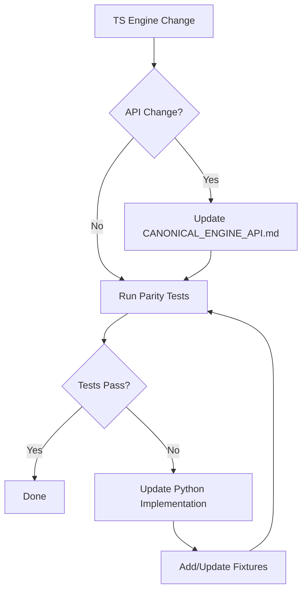

# Python Parity Requirements

> **SSoT alignment:** This document is a derived parity/contract view over the canonical TS rules engine. It explains how the Python rules implementation in `ai-service/app/**` is validated against the **Canonical TS rules surface** (`src/shared/engine/**` helpers + aggregates + orchestrator + contracts and v2 contract vectors), and how parity fixtures/tests are maintained. It does not define new rules semantics.
>
> **Doc Status (2025-12-11): Active (with historical TypeScript implementation details)**
>
> - Canonical TS rules surface is the helpers + aggregates + orchestrator stack under `src/shared/engine/`: `core.ts`, movement/capture/line/territory/victory helpers, `aggregates/*Aggregate.ts`, and `orchestration/turnOrchestrator.ts` / `phaseStateMachine.ts`, plus contract vectors in `src/shared/engine/contracts/**` and `tests/fixtures/contract-vectors/v2/*.json`.
> - Function and class names under `validators/*.ts` and `mutators/*.ts` in the tables below should be read as **semantic anchors**, not necessarily 1:1 concrete TS files. As of this date, only `validators/PlacementValidator.ts` and a subset of `mutators/*Mutator.ts` exist on the TS side; the rest of the semantics are expressed via helpers, aggregates, and the orchestrator and are exercised by:
>   - TS contract tests in `tests/contracts/contractVectorRunner.test.ts`
>   - Shared-engine parity in `tests/unit/TraceFixtures.sharedEngineParity.test.ts`
>   - Backend↔sandbox parity in `tests/unit/Backend_vs_Sandbox.*.test.ts`
>   - Python contract tests in `ai-service/tests/contracts/test_contract_vectors.py`
> - When this document refers to e.g. `MovementValidator` or `LineMutator` on the TS side, it is describing the **domain boundary** that the Python `validators/*` and `mutators/*` modules implement and validate against, with the shared contract vectors as the canonical spec.

**Task:** T1-W1-F  
**Date:** 2025-11-26  
**Status:** Complete

**Quickstart (current parity harness)**

```bash
cd ai-service
python -m scripts.check_ts_python_replay_parity \
  --db <path-to-db> \
  --emit-state-bundles-dir parity_bundles
python -m scripts.diff_state_bundle --bundle parity_bundles/<bundle>.state_bundle.json
```

- Use `--compact` to reduce noise; use `--emit-fixtures-dir` for minimal divergence fixtures.
- Fix the underlying TS/Python logic; do not weaken parity expectations.

## 1. Overview

This document specifies the parity requirements between the TypeScript canonical engine ([`src/shared/engine/`](../../src/shared/engine)) and the Python AI service rules implementation ([`ai-service/app/rules/`](../../ai-service/app/rules)).

In particular, **Wave 4 – Orchestrator Rollout & Invariant Hardening** introduces
an explicit SLO around orchestrator-driven contract vectors:

- The v2 contract vectors under `tests/fixtures/contract-vectors/v2/**` include
  families that exercise orchestrator‑first paths (turn/phase transitions,
  line→territory sequences, capture chains, and LPS/forced‑elimination tails).
- These vectors are treated as a **gating SLO** via:
  - the `orchestrator-parity` CI job in
    [`.github/workflows/ci.yml`](../../.github/workflows/ci.yml:1), which runs:
    - `npm run test:orchestrator-parity:ts` (TS orchestrator suites), then
    - `./scripts/run-python-contract-tests.sh --verbose`
      (Python runner over the v2 contract vectors).
- Any failure in `ai-service/tests/contracts/test_contract_vectors.py` under this
  job is considered a direct breach of `SLO-CI-ORCH-PARITY` in
  [`docs/ORCHESTRATOR_ROLLOUT_PLAN.md`](../architecture/ORCHESTRATOR_ROLLOUT_PLAN.md#62-ci-slos)
  and must block rollout until resolved (either by fixing a bug or updating
  vectors/fixtures in line with the canonical TS engine).

### 1.1 Purpose of Python Rules Engine

The Python rules engine serves two primary purposes:

1. **AI Training**: Provides rules validation for reinforcement learning training loops
2. **AI Inference**: Enables move generation and state simulation during AI move selection

### 1.2 Relationship to TypeScript Canonical Engine

| Aspect           | TypeScript Engine                  | Python AI Service                       |
| ---------------- | ---------------------------------- | --------------------------------------- |
| **Role**         | Canonical source of truth          | Derived implementation                  |
| **Location**     | `src/shared/engine/`               | `ai-service/app/rules/`                 |
| **Exports**      | 90+ functions/types via `index.ts` | Thin adapter via `RulesEngine` protocol |
| **Validation**   | Pure functions                     | Shadow contract validation against TS   |
| **Code Sharing** | Used by Server + Client            | Language boundary prevents sharing      |

### 1.3 Canonical Move Lifecycle & SSoT References

- Move, `MoveType`, `GamePhase`, `GameStatus`, and player choice types are defined in the shared TS types under [`src/shared/types/game.ts`](../../src/shared/types/game.ts).
- Orchestrator result/decision types (`ProcessTurnResult`, `PendingDecision`, `DecisionType`, `VictoryState`, `ProcessingMetadata`) are defined under [`src/shared/engine/orchestration/types.ts`](../../src/shared/engine/orchestration/types.ts).
- WebSocket transport and `PlayerChoice*` decision surfaces are defined in [`src/shared/types/websocket.ts`](../../src/shared/types/websocket.ts) and validated by [`src/shared/validation/websocketSchemas.ts`](../../src/shared/validation/websocketSchemas.ts).
- The canonical description of the Move → PendingDecision → PlayerChoice → WebSocket → Move.id lifecycle lives in [`docs/CANONICAL_ENGINE_API.md`](../architecture/CANONICAL_ENGINE_API.md); this document defers all lifecycle semantics to that SSoT and focuses purely on TS↔Python rules parity.

### 1.4 Architecture Pattern

The Python AI service uses a **shadow contract validation** pattern:

```
┌─────────────────────────────────────────────────────────────────┐
│                     DefaultRulesEngine                          │
│                                                                 │
│  ┌──────────────────────┐    ┌───────────────────────────────┐ │
│  │  Python Mutators     │    │  GameEngine.apply_move        │ │
│  │  (PlacementMutator,  │◄───│  (Canonical Python GameEngine) │ │
│  │   MovementMutator,   │    │                               │ │
│  │   CaptureMutator,    │    │  Mirrors TS semantics         │ │
│  │   LineMutator,       │    │                               │ │
│  │   TerritoryMutator)  │    └───────────────────────────────┘ │
│  └──────────────────────┘                                       │
│           │                                                     │
│           ▼                                                     │
│  Shadow Contract Assertion: mutator_state == engine_state       │
└─────────────────────────────────────────────────────────────────┘
```

### 1.5 Orchestrator‑driven contract vector families

Wave 4 introduces explicit **orchestrator‑first contract vector bundles** under
`tests/fixtures/contract-vectors/v2/**`. These are treated as part of the
`SLO-CI-ORCH-PARITY` gate because they encode composite turn/phase behaviour
that must remain aligned across TS and Python:

- `chain_capture.vectors.json` (`category: chain_capture`) – multi‑segment
  orchestrator‑driven chain captures, including continued `continue_capture_segment`
  moves and sequence‑tagged bundles exercised by
  `tests/contracts/contractVectorRunner.test.ts`.
- `territory_processing.vectors.json` (`category: territory_processing`) – composite
  **territory region + self‑elimination** flows generated by
  `scripts/generate-orchestrator-contract-vectors.ts`, using the canonical
  `processTurn` path.

The Python runner in `ai-service/tests/contracts/test_contract_vectors.py` loads
all v2 bundles (including these orchestrator‑focused families) via
`VECTOR_CATEGORIES` and validates them against `GameEngine.apply_move()`. Any
regression in these vectors under the `orchestrator-parity` CI job is a direct
SLO breach and must be triaged as a rules/orchestrator parity issue, not an
AI‑only concern.

---

## 2. Function Parity Matrix

### 2.1 Core Utilities

| TS Function                                                                | TS File   | Python Function                                                                                              | Python File               | Parity Status | Notes                |
| -------------------------------------------------------------------------- | --------- | ------------------------------------------------------------------------------------------------------------ | ------------------------- | ------------- | -------------------- |
| [`calculateCapHeight()`](../../src/shared/engine/core.ts)                  | `core.ts` | [`calculate_cap_height()`](../../ai-service/app/rules/core.py:58)                                            | `core.py`                 | ✅ MATCHED    | Direct port          |
| [`calculateDistance()`](../../src/shared/engine/core.ts)                   | `core.ts` | [`calculate_distance()`](../../ai-service/app/rules/core.py:76)                                              | `core.py`                 | ✅ MATCHED    | Direct port          |
| [`getPathPositions()`](../../src/shared/engine/core.ts)                    | `core.ts` | [`get_path_positions()`](../../ai-service/app/rules/core.py:94)                                              | `core.py`                 | ✅ MATCHED    | Direct port          |
| [`hashGameState()`](../../src/shared/engine/core.ts)                       | `core.ts` | [`hash_game_state()`](../../ai-service/app/rules/core.py:208)                                                | `core.py`                 | ✅ MATCHED    | Direct port          |
| [`summarizeBoard()`](../../src/shared/engine/core.ts)                      | `core.ts` | [`summarize_board()`](../../ai-service/app/rules/core.py:127)                                                | `core.py`                 | ✅ MATCHED    | Direct port          |
| [`computeProgressSnapshot()`](../../src/shared/engine/core.ts)             | `core.ts` | [`compute_progress_snapshot()`](../../ai-service/app/rules/core.py:157)                                      | `core.py`                 | ✅ MATCHED    | Direct port          |
| [`countRingsInPlayForPlayer()`](../../src/shared/engine/core.ts)           | `core.ts` | [`count_rings_in_play_for_player()`](../../ai-service/app/rules/core.py:179)                                 | `core.py`                 | ✅ MATCHED    | Direct port          |
| [`countRingsOnBoardForPlayer()`](../../src/shared/engine/core.ts)          | `core.ts` | -                                                                                                            | -                         | ⚠️ MISSING    | Computed inline      |
| [`getMovementDirectionsForBoardType()`](../../src/shared/engine/core.ts)   | `core.ts` | [`_get_all_directions()`](../../ai-service/app/board_manager.py)                                             | `board_manager.py`        | ✅ MATCHED    | Different location   |
| [`applyMarkerEffectsAlongPathOnBoard()`](../../src/shared/engine/core.ts)  | `core.ts` | [`_process_markers_along_path()`](../../ai-service/app/game_engine/__init__.py:971)                          | `game_engine/__init__.py` | ✅ MATCHED    | Different name       |
| [`hasAnyLegalMoveOrCaptureFromOnBoard()`](../../src/shared/engine/core.ts) | `core.ts` | [`_has_any_legal_move_or_capture_from_on_board()`](../../ai-service/app/game_engine/__init__.py:1205)        | `game_engine/__init__.py` | ✅ MATCHED    | Direct port          |
| [`validateCaptureSegmentOnBoard()`](../../src/shared/engine/core.ts)       | `core.ts` | [`_validate_capture_segment_on_board_for_reachability()`](../../ai-service/app/game_engine/__init__.py:1090) | `game_engine/__init__.py` | ✅ MATCHED    | Different name       |
| `positionToString()`                                                       | `game.ts` | [`Position.to_key()`](../../ai-service/app/models/core.py)                                                   | `models.py`               | ✅ MATCHED    | Method style         |
| `stringToPosition()`                                                       | `game.ts` | -                                                                                                            | -                         | ⚠️ MISSING    | Not needed in Python |
| `positionsEqual()`                                                         | `game.ts` | `==` operator                                                                                                | -                         | ✅ MATCHED    | Via Pydantic         |

### 2.2 Placement Domain

| TS Function                                                                              | TS File                 | Python Function                                                                         | Python File               | Parity Status | Notes           |
| ---------------------------------------------------------------------------------------- | ----------------------- | --------------------------------------------------------------------------------------- | ------------------------- | ------------- | --------------- |
| [`validatePlacementOnBoard()`](../../src/shared/engine/validators/PlacementValidator.ts) | `PlacementValidator.ts` | [`PlacementValidator.validate()`](../../ai-service/app/rules/validators/placement.py:7) | `validators/placement.py` | ✅ MATCHED    | Reimplemented   |
| [`validatePlacement()`](../../src/shared/engine/validators/PlacementValidator.ts)        | `PlacementValidator.ts` | [`PlacementValidator.validate()`](../../ai-service/app/rules/validators/placement.py:7) | `validators/placement.py` | ✅ MATCHED    | Combined        |
| [`validateSkipPlacement()`](../../src/shared/engine/validators/PlacementValidator.ts)    | `PlacementValidator.ts` | [`_get_skip_placement_moves()`](../../ai-service/app/game_engine/__init__.py:1407)      | `game_engine/__init__.py` | ✅ MATCHED    | Via enumeration |
| [`applyPlacementMove()`](../../src/shared/engine/placementHelpers.ts)                    | `placementHelpers.ts`   | [`GameEngine._apply_place_ring()`](../../ai-service/app/game_engine/__init__.py:2306)   | `game_engine/__init__.py` | ✅ MATCHED    | Different name  |
| [`evaluateSkipPlacementEligibility()`](../../src/shared/engine/placementHelpers.ts)      | `placementHelpers.ts`   | [`_get_skip_placement_moves()`](../../ai-service/app/game_engine/__init__.py:1407)      | `game_engine/__init__.py` | ✅ MATCHED    | Combined        |

### 2.3 Movement Domain

| TS Function                                                                         | TS File                | Python Function                                                                       | Python File               | Parity Status | Notes          |
| ----------------------------------------------------------------------------------- | ---------------------- | ------------------------------------------------------------------------------------- | ------------------------- | ------------- | -------------- |
| [`enumerateSimpleMoveTargetsFromStack()`](../../src/shared/engine/movementLogic.ts) | `movementLogic.ts`     | [`_get_movement_moves()`](../../ai-service/app/game_engine/__init__.py:2183)          | `game_engine/__init__.py` | ✅ MATCHED    | Returns Move[] |
| [`validateMovement()`](../../src/shared/engine/validators/MovementValidator.ts)     | `MovementValidator.ts` | [`MovementValidator.validate()`](../../ai-service/app/rules/validators/movement.py:8) | `validators/movement.py`  | ✅ MATCHED    | Reimplemented  |

### 2.4 Capture Domain

| TS Function                                                                   | TS File               | Python Function                                                                     | Python File               | Parity Status | Notes         |
| ----------------------------------------------------------------------------- | --------------------- | ----------------------------------------------------------------------------------- | ------------------------- | ------------- | ------------- |
| [`enumerateCaptureMoves()`](../../src/shared/engine/captureLogic.ts)          | `captureLogic.ts`     | [`_get_capture_moves()`](../../ai-service/app/game_engine/__init__.py:1594)         | `game_engine/__init__.py` | ✅ MATCHED    | Direct port   |
| [`validateCapture()`](../../src/shared/engine/validators/CaptureValidator.ts) | `CaptureValidator.ts` | [`CaptureValidator.validate()`](../../ai-service/app/rules/validators/capture.py:8) | `validators/capture.py`   | ✅ MATCHED    | Reimplemented |

### 2.5 Line Domain

| TS Function                                                                          | TS File                  | Python Function                                                                           | Python File               | Parity Status | Notes              |
| ------------------------------------------------------------------------------------ | ------------------------ | ----------------------------------------------------------------------------------------- | ------------------------- | ------------- | ------------------ |
| [`findAllLines()`](../../src/shared/engine/lineDetection.ts)                         | `lineDetection.ts`       | [`BoardManager.find_all_lines()`](../../ai-service/app/board_manager.py)                  | `board_manager.py`        | ✅ MATCHED    | Different location |
| [`findLinesForPlayer()`](../../src/shared/engine/lineDetection.ts)                   | `lineDetection.ts`       | Filtered from `find_all_lines()`                                                          | `board_manager.py`        | ✅ MATCHED    | Inline filter      |
| [`enumerateProcessLineMoves()`](../../src/shared/engine/lineDecisionHelpers.ts)      | `lineDecisionHelpers.ts` | [`_get_line_processing_moves()`](../../ai-service/app/game_engine/__init__.py:2022)       | `game_engine/__init__.py` | ✅ MATCHED    | Different name     |
| [`enumerateChooseLineRewardMoves()`](../../src/shared/engine/lineDecisionHelpers.ts) | `lineDecisionHelpers.ts` | [`_get_line_processing_moves()`](../../ai-service/app/game_engine/__init__.py:2022)       | `game_engine/__init__.py` | ⚠️ PARTIAL    | Combined           |
| [`applyProcessLineDecision()`](../../src/shared/engine/lineDecisionHelpers.ts)       | `lineDecisionHelpers.ts` | [`GameEngine._apply_line_formation()`](../../ai-service/app/game_engine/__init__.py:2788) | `game_engine/__init__.py` | ✅ MATCHED    | Different name     |
| [`applyChooseLineRewardDecision()`](../../src/shared/engine/lineDecisionHelpers.ts)  | `lineDecisionHelpers.ts` | [`GameEngine._apply_line_formation()`](../../ai-service/app/game_engine/__init__.py:2788) | `game_engine/__init__.py` | ✅ MATCHED    | Combined           |

### 2.6 Territory Domain

| TS Function                                                                                     | TS File                       | Python Function                                                                               | Python File               | Parity Status | Notes              |
| ----------------------------------------------------------------------------------------------- | ----------------------------- | --------------------------------------------------------------------------------------------- | ------------------------- | ------------- | ------------------ |
| [`findDisconnectedRegions()`](../../src/shared/engine/territoryDetection.ts)                    | `territoryDetection.ts`       | [`BoardManager.find_disconnected_regions()`](../../ai-service/app/board_manager.py)           | `board_manager.py`        | ✅ MATCHED    | Different location |
| [`canProcessTerritoryRegion()`](../../src/shared/engine/territoryProcessing.ts)                 | `territoryProcessing.ts`      | [`_can_process_disconnected_region()`](../../ai-service/app/game_engine/__init__.py:2160)     | `game_engine/__init__.py` | ✅ MATCHED    | Different name     |
| [`filterProcessableTerritoryRegions()`](../../src/shared/engine/territoryProcessing.ts)         | `territoryProcessing.ts`      | Inline in `_get_territory_processing_moves()`                                                 | `game_engine/__init__.py` | ✅ MATCHED    | Inline             |
| [`getProcessableTerritoryRegions()`](../../src/shared/engine/territoryProcessing.ts)            | `territoryProcessing.ts`      | Inline in `_get_territory_processing_moves()`                                                 | `game_engine/__init__.py` | ✅ MATCHED    | Inline             |
| [`applyTerritoryRegion()`](../../src/shared/engine/territoryProcessing.ts)                      | `territoryProcessing.ts`      | [`GameEngine._apply_territory_claim()`](../../ai-service/app/game_engine/__init__.py:2894)    | `game_engine/__init__.py` | ✅ MATCHED    | Different name     |
| [`enumerateProcessTerritoryRegionMoves()`](../../src/shared/engine/territoryDecisionHelpers.ts) | `territoryDecisionHelpers.ts` | [`_get_territory_processing_moves()`](../../ai-service/app/game_engine/__init__.py:2082)      | `game_engine/__init__.py` | ✅ MATCHED    | Different name     |
| [`enumerateTerritoryEliminationMoves()`](../../src/shared/engine/territoryDecisionHelpers.ts)   | `territoryDecisionHelpers.ts` | [`_get_territory_processing_moves()`](../../ai-service/app/game_engine/__init__.py:2082)      | `game_engine/__init__.py` | ✅ MATCHED    | Combined           |
| [`applyProcessTerritoryRegionDecision()`](../../src/shared/engine/territoryDecisionHelpers.ts)  | `territoryDecisionHelpers.ts` | [`GameEngine._apply_territory_claim()`](../../ai-service/app/game_engine/__init__.py:2894)    | `game_engine/__init__.py` | ✅ MATCHED    | Different name     |
| [`applyEliminateRingsFromStackDecision()`](../../src/shared/engine/territoryDecisionHelpers.ts) | `territoryDecisionHelpers.ts` | [`GameEngine._apply_forced_elimination()`](../../ai-service/app/game_engine/__init__.py:3164) | `game_engine/__init__.py` | ✅ MATCHED    | Different name     |
| [`getBorderMarkerPositionsForRegion()`](../../src/shared/engine/territoryBorders.ts)            | `territoryBorders.ts`         | [`BoardManager.get_border_marker_positions()`](../../ai-service/app/board_manager.py)         | `board_manager.py`        | ✅ MATCHED    | Different location |

### 2.7 Victory Domain

| TS Function                                                                            | TS File               | Python Function                                                                       | Python File               | Parity Status | Notes                               |
| -------------------------------------------------------------------------------------- | --------------------- | ------------------------------------------------------------------------------------- | ------------------------- | ------------- | ----------------------------------- |
| [`evaluateVictory()`](../../src/shared/engine/aggregates/VictoryAggregate.ts)          | `VictoryAggregate.ts` | [`GameEngine._check_victory()`](../../ai-service/app/game_engine/__init__.py:269)     | `game_engine/__init__.py` | ✅ MATCHED    | Different name                      |
| [`getLastActor()`](../../src/shared/engine/aggregates/VictoryAggregate.ts)             | `VictoryAggregate.ts` | Inline in `_check_victory()`                                                          | `game_engine/__init__.py` | ✅ MATCHED    | Inline                              |
| [`countTotalRingsForPlayer()`](../../src/shared/engine/aggregates/VictoryAggregate.ts) | `VictoryAggregate.ts` | [`count_rings_in_play_for_player()`](../../ai-service/app/game_engine/__init__.py:98) | `game_engine/__init__.py` | ✅ MATCHED    | Added Dec 2025 for Early LPS parity |

> **Note (Dec 2025):** `victoryLogic.ts` was removed. All victory logic is now in `VictoryAggregate.ts`.

**Note (Dec 2025):** The `evaluateVictory()` function was updated to:

- Count territory directly from `collapsedSpaces` map (not `player.territorySpaces`)
- Use `countTotalRingsForPlayer()` for Early LPS detection (includes buried rings)
  These changes align TS with Python's `_check_victory()` semantics. See [AI_PIPELINE_PARITY_FIXES.md](../ai/AI_PIPELINE_PARITY_FIXES.md) for details.
- LPS victory is not evaluated during ANM sequences; Python defers LPS checks when `global_actions.is_anm_state(state)` is true to mirror TS.

### 2.8 Turn Management

| TS Function                                                     | TS File        | Python Function                                                                  | Python File               | Parity Status | Notes                       |
| --------------------------------------------------------------- | -------------- | -------------------------------------------------------------------------------- | ------------------------- | ------------- | --------------------------- |
| [`advanceTurnAndPhase()`](../../src/shared/engine/turnLogic.ts) | `turnLogic.ts` | [`GameEngine._update_phase()`](../../ai-service/app/game_engine/__init__.py:440) | `game_engine/__init__.py` | ✅ MATCHED    | Combined with `_end_turn()` |

### 2.9 Mutators

| TS Mutator         | TS File                                                                                               | Python Mutator                                                           | Python File             | Parity Status | Notes                                                                                  |
| ------------------ | ----------------------------------------------------------------------------------------------------- | ------------------------------------------------------------------------ | ----------------------- | ------------- | -------------------------------------------------------------------------------------- |
| `PlacementMutator` | `mutators/PlacementMutator.ts`                                                                        | [`PlacementMutator`](../../ai-service/app/rules/mutators/placement.py:6) | `mutators/placement.py` | ✅ MATCHED    | Delegates to GameEngine                                                                |
| `MovementMutator`  | `mutators/MovementMutator.ts`                                                                         | [`MovementMutator`](../../ai-service/app/rules/mutators/movement.py:6)   | `mutators/movement.py`  | ✅ MATCHED    | Delegates to GameEngine                                                                |
| `CaptureMutator`   | `mutators/CaptureMutator.ts`                                                                          | [`CaptureMutator`](../../ai-service/app/rules/mutators/capture.py:6)     | `mutators/capture.py`   | ✅ MATCHED    | Delegates to GameEngine                                                                |
| `LineMutator`      | semantic boundary over shared line helpers (`lineDecisionHelpers.ts`, `LineAggregate.ts`)             | [`LineMutator`](../../ai-service/app/rules/mutators/line.py:6)           | `mutators/line.py`      | ✅ MATCHED    | Python mutator implements the same domain boundary validated via line contract vectors |
| `TerritoryMutator` | semantic boundary over shared territory helpers (`territoryProcessing.ts`, `TerritoryAggregate.ts`)   | [`TerritoryMutator`](../../ai-service/app/rules/mutators/territory.py:6) | `mutators/territory.py` | ✅ MATCHED    | Python mutator implements the same domain boundary validated via territory contracts   |
| `TurnMutator`      | semantic boundary over shared turn orchestrator (`turnLogic.ts`, `orchestration/turnOrchestrator.ts`) | [`TurnMutator`](../../ai-service/app/rules/mutators/turn.py:6)           | `mutators/turn.py`      | ✅ MATCHED    | Python mutator implements the same domain boundary validated via turn/phase contracts  |

### 2.10 Validators

| TS Validator         | TS File                                                                                             | Python Validator                                                             | Python File               | Parity Status | Notes                                                                                 |
| -------------------- | --------------------------------------------------------------------------------------------------- | ---------------------------------------------------------------------------- | ------------------------- | ------------- | ------------------------------------------------------------------------------------- |
| `PlacementValidator` | `validators/PlacementValidator.ts`                                                                  | [`PlacementValidator`](../../ai-service/app/rules/validators/placement.py:6) | `validators/placement.py` | ✅ MATCHED    | Reimplemented                                                                         |
| `MovementValidator`  | semantic boundary over shared movement helpers (`movementLogic.ts`, `movementApplication.ts`)       | [`MovementValidator`](../../ai-service/app/rules/validators/movement.py:7)   | `validators/movement.py`  | ✅ MATCHED    | Python validator enforces the same rules as TS movement helpers + RuleEngine binding  |
| `CaptureValidator`   | semantic boundary over shared capture helpers (`captureLogic.ts`, `CaptureAggregate.ts`)            | [`CaptureValidator`](../../ai-service/app/rules/validators/capture.py:7)     | `validators/capture.py`   | ✅ MATCHED    | Python validator enforces the same rules as TS capture helpers + RuleEngine binding   |
| `LineValidator`      | semantic boundary over shared line helpers (`lineDetection.ts`, `lineDecisionHelpers.ts`)           | [`LineValidator`](../../ai-service/app/rules/validators/line.py:15)          | `validators/line.py`      | ✅ MATCHED    | Python validator enforces the same rules as TS line helpers + RuleEngine binding      |
| `TerritoryValidator` | semantic boundary over shared territory helpers (`territoryDetection.ts`, `territoryProcessing.ts`) | [`TerritoryValidator`](../../ai-service/app/rules/validators/territory.py:6) | `validators/territory.py` | ✅ MATCHED    | Python validator enforces the same rules as TS territory helpers + RuleEngine binding |

### 2.11 Functions NOT Implemented in Python

| TS Function                       | TS File                   | Status        | Reason                                      |
| --------------------------------- | ------------------------- | ------------- | ------------------------------------------- |
| `chooseLocalMoveFromCandidates()` | `localAIMoveSelection.ts` | 🚫 NOT NEEDED | Python has own AI selection                 |
| `SQUARE_MOORE_DIRECTIONS`         | `core.ts`                 | ⚠️ INLINE     | Defined directly in `_get_all_directions()` |
| `HEX_DIRECTIONS`                  | `core.ts`                 | ⚠️ INLINE     | Defined directly in `_get_all_directions()` |

---

## 3. Type Parity Matrix

### 3.1 Core Types

| TS Type            | TS File   | Python Type   | Python File | Parity Status |
| ------------------ | --------- | ------------- | ----------- | ------------- |
| `Position`         | `game.ts` | `Position`    | `models.py` | ✅ MATCHED    |
| `BoardType`        | `game.ts` | `BoardType`   | `models.py` | ✅ MATCHED    |
| `BoardState`       | `game.ts` | `BoardState`  | `models.py` | ✅ MATCHED    |
| `BoardConfig`      | `game.ts` | `BoardConfig` | `core.py`   | ✅ MATCHED    |
| `RingStack`        | `game.ts` | `RingStack`   | `models.py` | ✅ MATCHED    |
| `MarkerInfo`       | `game.ts` | `MarkerInfo`  | `models.py` | ✅ MATCHED    |
| `MarkerType`       | `game.ts` | `str` literal | -           | ⚠️ PARTIAL    |
| `GameState`        | `game.ts` | `GameState`   | `models.py` | ✅ MATCHED    |
| `GameStatus`       | `game.ts` | `GameStatus`  | `models.py` | ✅ MATCHED    |
| `GamePhase`        | `game.ts` | `GamePhase`   | `models.py` | ✅ MATCHED    |
| `Player`           | `game.ts` | `Player`      | `models.py` | ✅ MATCHED    |
| `Move`             | `game.ts` | `Move`        | `models.py` | ✅ MATCHED    |
| `MoveType`         | `game.ts` | `MoveType`    | `models.py` | ✅ MATCHED    |
| `LineInfo`         | `game.ts` | `LineInfo`    | `models.py` | ✅ MATCHED    |
| `Territory`        | `game.ts` | `Territory`   | `models.py` | ✅ MATCHED    |
| `GameResult`       | `game.ts` | -             | -           | ⚠️ MISSING    |
| `PlayerChoice`     | `game.ts` | -             | -           | 🚫 NOT NEEDED |
| `ProgressSnapshot` | `game.ts` | `dict`        | -           | ⚠️ PARTIAL    |

### 3.2 Engine Types

| TS Type            | TS File    | Python Type | Python File     | Parity Status |
| ------------------ | ---------- | ----------- | --------------- | ------------- |
| `ValidationResult` | `types.ts` | `bool`      | -               | ⚠️ SIMPLIFIED |
| `GameAction`       | `types.ts` | `Move`      | `models.py`     | ✅ MATCHED    |
| `ActionType`       | `types.ts` | `MoveType`  | `models.py`     | ✅ MATCHED    |
| `Validator`        | `types.ts` | `Validator` | `interfaces.py` | ✅ MATCHED    |
| `Mutator`          | `types.ts` | `Mutator`   | `interfaces.py` | ✅ MATCHED    |

### 3.3 Domain Result Types

| TS Type             | TS File                 | Python Type         | Python File | Parity Status |
| ------------------- | ----------------------- | ------------------- | ----------- | ------------- |
| `TurnAdvanceResult` | `turnLogic.ts`          | -                   | -           | ⚠️ INLINE     |
| `PerTurnState`      | `turnLogic.ts`          | GameState fields    | `models.py` | ✅ MATCHED    |
| `VictoryResult`     | `victoryLogic.ts`       | GameState fields    | `models.py` | ✅ MATCHED    |
| `VictoryReason`     | `victoryLogic.ts`       | -                   | -           | ⚠️ MISSING    |
| `PlacementContext`  | `PlacementValidator.ts` | -                   | -           | ⚠️ INLINE     |
| `SimpleMoveTarget`  | `movementLogic.ts`      | `Move`              | `models.py` | ✅ MATCHED    |
| `ChainCaptureState` | `game.ts`               | `ChainCaptureState` | `models.py` | ✅ MATCHED    |

---

## 4. Behavioral Requirements

### 4.1 Capture Enumeration Parity

**Critical Requirement:** [`enumerateCaptureMoves()`](../../src/shared/engine/captureLogic.ts) and [`GameEngine._get_capture_moves()`](../../ai-service/app/game_engine/__init__.py:1594) must produce identical sets of legal capture moves.

**Verification Points:**

- Cap height comparison: `attacker.cap_height >= target.cap_height`
- Self-capture allowed (capturing own stack)
- Ray-walking termination on collapsed spaces
- Landing marker ownership validation
- Segment distance >= stack height

**Test Strategy:**

```json
{
  "fixture_type": "capture_enumeration",
  "input": { "state": "<GameState>", "player": 1 },
  "expected_output": { "moves": ["<Move>", ...] }
}
```

### 4.2 Movement Validation Parity

**Critical Requirement:** [`validateMovement()`](../../src/shared/engine/validators/MovementValidator.ts) and [`MovementValidator.validate()`](../../ai-service/app/rules/validators/movement.py:8) must agree on all inputs.

**Verification Points:**

- Minimum distance = stack height
- Path clear of stacks and collapsed spaces
- Landing on any marker (own or opponent) allowed with cap-elimination cost
- Must-move constraint after placement
- Straight-line direction only

**Test Strategy:**

```json
{
  "fixture_type": "movement_validation",
  "input": { "state": "<GameState>", "move": "<Move>" },
  "expected_output": { "valid": true/false }
}
```

### 4.3 Line Detection Parity

**Critical Requirement:** [`findAllLines()`](../../src/shared/engine/lineDetection.ts) and [`BoardManager.find_all_lines()`](../../ai-service/app/board_manager.py) must detect identical lines.

**Verification Points:**

- Line length thresholds per board type (3 for square8, 4 for others)
- Overlength line detection
- Player ownership from marker ownership
- Axis-aligned direction iteration

### 4.4 Territory Detection Parity

**Critical Requirement:** [`findDisconnectedRegions()`](../../src/shared/engine/territoryDetection.ts) and [`BoardManager.find_disconnected_regions()`](../../ai-service/app/board_manager.py) must identify identical regions.

**Verification Points:**

- Region connectivity via player-owned markers
- Border marker identification
- Region processability (stack outside region required)

### 4.5 Victory Evaluation Parity

**Critical Requirement:** [`evaluateVictory()`](../../src/shared/engine/aggregates/VictoryAggregate.ts) and [`GameEngine._check_victory()`](../../ai-service/app/game_engine/__init__.py:269) must produce identical results.

**Verification Points:**

- Ring elimination threshold (victory_threshold)
- Territory control threshold (territory_victory_threshold)
- Last-player-standing (R172) tracking
- Global stalemate tie-breaker ladder
- Rings-in-hand counted as eliminated for tie-breaking

### 4.6 Heuristic Training & Evaluation Sanity

While heuristic evaluation is **not** part of the canonical rules surface, the Python training/evaluation harness must behave in a way that meaningfully exercises different heuristic weight profiles and avoids degenerate “all policies look the same” failures.

**Critical Requirements:**

- The shared fitness evaluator [`evaluate_fitness`](../../ai-service/scripts/run_cmaes_optimization.py) must:
  - Distinguish a strong baseline (`heuristic_v1_balanced`) from a clearly bad profile (e.g. all-zero weights) under identical conditions.
  - Correctly apply candidate weights to the `HeuristicAI` instances (no accidental reuse of baseline weights).
  - Expose per-evaluation diagnostics (wins, draws, losses, and candidate–baseline L2 distance) via `debug_hook` so plateau investigations can see whether distinct policies are being explored.
- `HeuristicAI` position evaluation must _depend_ on the active weight vector:
  - On a nontrivial mid-game state, evaluations for baseline vs all-zero (or similarly extreme) profiles must differ for the same player.

**Test Strategy:**

- `ai-service/tests/test_heuristic_training_evaluation.py`:
  - `test_evaluate_fitness_zero_profile_is_strictly_worse_than_baseline`:
    - Asserts baseline vs baseline evaluates to ≈0.5 with symmetric W/L and zero weight distance.
    - Asserts an all-zero profile loses decisively vs the same baseline and has non-zero `weight_l2`, confirming that the fitness harness both applies and distinguishes different weights.
  - `test_heuristic_ai_position_evaluation_depends_on_weights`:
    - Builds a mid-game Square8 state via the shared training helper (`create_initial_state` + baseline self-play).
    - Verifies that `HeuristicAI.get_evaluation_breakdown(state)["total"]` differs between baseline and all-zero profiles on the same state.
- `ai-service/tests/test_multi_start_evaluation.py`:
  - Smoke-tests the `eval_mode="multi-start"` path in `evaluate_fitness` using a small, temporary Square8 state pool written in JSONL format.
  - Confirms that the wiring between eval pools (`app/training/eval_pools.py`), the multi-start loop, and CLI-facing parameters (`--eval-mode`, `--state-pool-id`) is functional and yields baseline-vs-baseline fitness values in `[0.0, 1.0]`.
- `ai-service/tests/test_eval_randomness_integration.py`:
  - Integration-tests the `eval_randomness` parameter of `evaluate_fitness` in `scripts/run_cmaes_optimization.py`.
  - Asserts that with a fixed `seed`, both `eval_randomness=0.0` (fully deterministic evaluation) and small non-zero values (controlled stochastic tie-breaking) produce deterministic, repeatable fitness values.
  - Guards against regressions where hidden RNG sources (e.g. numpy, Python `random`) or refactors to tie-breaking introduce non-determinism into CMA-ES/GA evaluation despite fixed seeds.

These tests are not rules-parity checks, but they are treated as **required sanity guards** for the heuristic training stack. Any change to `evaluate_fitness`, `HeuristicAI`, or the weight-application path that would cause these tests to pass trivially (e.g. equal fitness or identical evaluations for very different profiles) must be investigated as a potential wiring or plateau-diagnostics regression.

---

## 5. Test Parity Strategy

### 5.1 Shared Test Fixtures

Primary cross-language rules parity is enforced via **contract vectors (v2)** stored in [`tests/fixtures/contract-vectors/v2/`](../../tests/fixtures/contract-vectors/v2).

- TypeScript runner: [`tests/contracts/contractVectorRunner.test.ts`](../../tests/contracts/contractVectorRunner.test.ts)
- Python runner: [`ai-service/tests/contracts/test_contract_vectors.py`](../../ai-service/tests/contracts/test_contract_vectors.py)
- Vector schemas: [`src/shared/engine/contracts/schemas.ts`](../../src/shared/engine/contracts/schemas.ts) and [`src/shared/engine/contracts/serialization.ts`](../../src/shared/engine/contracts/serialization.ts)
- JSON examples: [`tests/fixtures/contract-vectors/v2/README.md`](../../tests/fixtures/contract-vectors/v2/README.md)

Legacy **trace-based fixtures** under [`tests/fixtures/rules-parity/`](../../tests/fixtures/rules-parity) are retained for historical debugging and seed/trace investigations (see `docs/PARITY_SEED_TRIAGE.md` and `RULES_SCENARIO_MATRIX.md`). They should not be treated as the primary spec for TS↔Python parity.

### 5.2 Deterministic Seed-Based Scenarios

For complex multi-move scenarios, use seeded RNG:

```python
# Python
import random
random.seed(42)
state = GameEngine.apply_move(state, ai.select_move(state))
```

```typescript
// TypeScript
import { createSeededRng } from '@shared/utils/rng';
const rng = createSeededRng(42);
const state = applyMove(state, ai.selectMove(state, rng));
```

### 5.3 Property-Based Testing for Equivalence

> **Status:** As of 2025-11-26 this section is aspirational; property-based suites are not yet wired into CI and should be treated as future work.

Use hypothesis (Python) and fast-check (TypeScript) for:

1. **State hash equivalence:** `hash_game_state(state) === hashGameState(state)`
2. **Move enumeration equivalence:** `set(py_moves) === set(ts_moves)`
3. **State transition equivalence:** `apply_move(state, move) === applyMove(state, move)`

### 5.4 Existing Parity & Sanity Tests

| Test Suite                                   | Location                      | Coverage                                                                                    |
| -------------------------------------------- | ----------------------------- | ------------------------------------------------------------------------------------------- |
| `contractVectorRunner.test.ts`               | `tests/contracts/`            | Contract vectors (TS): shared engine semantics → v2 contract vectors                        |
| `test_contract_vectors.py`                   | `ai-service/tests/contracts/` | Contract vectors (Python): TS↔Python rules parity on v2 vectors                             |
| `test_rules_parity_fixtures.py`              | `ai-service/tests/parity/`    | TS→Python trace/plateau parity using generated fixtures                                     |
| `test_ts_seed_plateau_snapshot_parity.py`    | `ai-service/tests/parity/`    | Seed plateau snapshot parity against TS engine                                              |
| `test_ai_plateau_progress.py`                | `ai-service/tests/parity/`    | AI plateau progress parity vs TS plateau traces                                             |
| `test_line_and_territory_scenario_parity.py` | `ai-service/tests/parity/`    | Focused line+territory scenario parity using TS-generated fixtures                          |
| `test_default_engine_equivalence.py`         | `ai-service/tests/rules/`     | Move application parity (DefaultRulesEngine vs GameEngine)                                  |
| `test_default_engine_flags.py`               | `ai-service/tests/rules/`     | Mutator shadow contracts / safety flags                                                     |
| `test_heuristic_training_evaluation.py`      | `ai-service/tests/`           | Heuristic training/evaluation sanity: fitness harness and HeuristicAI weight sensitivity    |
| `TraceFixtures.sharedEngineParity.test.ts`   | `tests/unit/`                 | Legacy trace replay parity (diagnostic; see `docs/PARITY_SEED_TRIAGE.md` for usage context) |

---

## 6. Maintenance Protocol

### 6.1 Change Detection

When modifying the TypeScript canonical engine:

1. **Update `CANONICAL_ENGINE_API.md`** if API signature changes
2. **Run parity test suite** to detect Python divergence
3. **Update Python implementation** if behavior changed
4. **Add new fixtures** for new functionality

### 6.2 Sync Workflow



### 6.3 CI Integration

The following CI checks enforce rules and parity guarantees (see [`.github/workflows/ci.yml`](../../.github/workflows/ci.yml)):

1. **`test` (Jest umbrella):** Runs the full TS Jest suite, including shared-engine unit tests and `tests/contracts/contractVectorRunner.test.ts`.
2. **`ts-rules-engine`:** Runs `npm run test:ts-rules-engine`, focusing on rules-level suites and shared-engine invariants.
3. **`python-core`:** Runs `python -m pytest` over `ai-service/tests` excluding `tests/parity/`, covering core Python rules/AI tests (including `test_heuristic_training_evaluation.py`).
4. **`python-rules-parity`:** Generates TS→Python rules-parity fixtures via `tests/scripts/generate_rules_parity_fixtures.ts`, then runs `ai-service/tests/parity/test_rules_parity_fixtures.py` under `pytest`.

### 6.4 Documentation Requirements

For each TypeScript engine change:

| Change Type       | Documentation Required                 |
| ----------------- | -------------------------------------- |
| New export        | Update this document + API doc         |
| Signature change  | Update this document + migration guide |
| Behavioral change | Update this document + add fixtures    |
| Bug fix           | Add regression fixture                 |

---

## 7. Parity Summary

### 7.1 Overall Statistics

| Category            | MATCHED | PARTIAL | MISSING | NOT NEEDED |
| ------------------- | ------- | ------- | ------- | ---------- |
| Core Utilities      | 13      | 0       | 2       | 0          |
| Placement           | 5       | 0       | 0       | 0          |
| Movement            | 2       | 0       | 0       | 0          |
| Capture             | 2       | 0       | 0       | 0          |
| Line                | 5       | 1       | 0       | 0          |
| Territory           | 8       | 0       | 0       | 0          |
| Victory             | 2       | 0       | 0       | 0          |
| Turn                | 1       | 0       | 0       | 0          |
| Mutators            | 6       | 0       | 0       | 0          |
| Validators          | 5       | 0       | 0       | 0          |
| **Total Functions** | **49**  | **1**   | **2**   | **3**      |

### 7.2 Type Parity Summary

| Category        | MATCHED | PARTIAL | MISSING | NOT NEEDED |
| --------------- | ------- | ------- | ------- | ---------- |
| Core Types      | 14      | 2       | 1       | 1          |
| Engine Types    | 4       | 1       | 0       | 0          |
| Domain Types    | 4       | 1       | 2       | 0          |
| **Total Types** | **22**  | **4**   | **3**   | **1**      |

### 7.3 Key Findings

1. **Strong Parity:** 49 of 52 tracked functions have MATCHED parity status
2. **Shadow Contract Pattern:** Python mutators delegate to `GameEngine` static methods, ensuring semantic alignment
3. **Primary Risk:** `BoardManager` and `GameEngine` static methods in Python are manually synced; changes require vigilance
4. **Missing Types:** `VictoryReason`, `GameResult` are not explicitly typed in Python (inline/simplified)

### 7.4 Recommendations

1. **Code Generation:** Consider generating Python from TypeScript AST for perfect sync
2. **WASM Compilation:** Long-term option to compile TS engine to WASM for Python consumption
3. **Fixture Expansion:** Add fixtures for edge cases discovered during AI training
4. **Automated Diffing:** Implement AST-based diffing to detect undocumented TS changes

---

## Appendix A: File Inventory

### TypeScript Canonical Engine (`src/shared/engine/`)

| File                          | Lines | Purpose                    |
| ----------------------------- | ----- | -------------------------- |
| `index.ts`                    | ~350  | Public API exports         |
| `core.ts`                     | ~650  | Core utilities             |
| `turnLogic.ts`                | ~250  | Turn/phase state machine   |
| `movementLogic.ts`            | ~200  | Movement reachability      |
| `captureLogic.ts`             | ~350  | Capture enumeration        |
| `lineDetection.ts`            | ~200  | Line geometry              |
| `lineDecisionHelpers.ts`      | ~400  | Line decision moves        |
| `territoryDetection.ts`       | ~250  | Territory region detection |
| `territoryProcessing.ts`      | ~300  | Territory collapse         |
| `territoryDecisionHelpers.ts` | ~400  | Territory decision moves   |
| `victoryLogic.ts`             | ~150  | Victory evaluation         |
| `validators/*.ts`             | ~600  | Move validation            |
| `mutators/*.ts`               | ~800  | State mutation             |

### Python AI Service (`ai-service/app/rules/`)

| File                | Lines | Purpose                        |
| ------------------- | ----- | ------------------------------ |
| `__init__.py`       | ~10   | Package exports                |
| `interfaces.py`     | ~55   | Protocol definitions           |
| `core.py`           | ~245  | Core utilities                 |
| `geometry.py`       | ~190  | Board geometry                 |
| `default_engine.py` | ~994  | Shadow contract engine         |
| `factory.py`        | ~20   | Engine factory                 |
| `validators/*.py`   | ~350  | Move validation                |
| `mutators/*.py`     | ~100  | State mutation (thin wrappers) |

### Python Game Engine (`ai-service/app/`)

| File                      | Lines  | Purpose                |
| ------------------------- | ------ | ---------------------- |
| `game_engine/__init__.py` | ~3,186 | Canonical Python rules |
| `board_manager.py`        | ~600   | Board state operations |

---

## Appendix B: Shadow Contract Verification

The [`DefaultRulesEngine.apply_move()`](../../ai-service/app/rules/default_engine.py:285) method implements per-move shadow contracts:

```python
def apply_move(self, state: GameState, move: Move) -> GameState:
    # 1. Canonical result from GameEngine
    next_via_engine = GameEngine.apply_move(state, move)

    # 2. Shadow contract for each move type
    if move.type == MoveType.PLACE_RING:
        mutator_state = state.model_copy(deep=True)
        PlacementMutator().apply(mutator_state, move)
        # Assert board/player parity...

    # 3. Always return canonical state
    return next_via_engine
```

This ensures that:

- Mutators are validated against the canonical engine
- Any divergence raises `RuntimeError` with diagnostic details
- The canonical `GameEngine` result is always authoritative

## 8. P18.5-1 – Extended Contract Vectors (Long-tail, Multi-phase, Hex)

### 8.1 Purpose and scope

Wave 4 introduced v2 contract vectors and orchestrator-driven bundles (see [`tests/fixtures/contract-vectors/v2`](../../tests/fixtures/contract-vectors/v2/README.md:1)) plus Python consumption via [`test_contract_vectors.py`](../../ai-service/tests/contracts/test_contract_vectors.py:1). Those vectors primarily cover:

- Core placement, movement, capture.
- Basic chain-capture continuation on `square19` (`chain_capture.vectors.json`).
- Simple territory and a single composite territory-processing sequence generated by [`generate-orchestrator-contract-vectors.ts`](../../scripts/generate-orchestrator-contract-vectors.ts:1) into `territory_processing.vectors.json`.

P18.5-1 extends this surface with a **designed** set of additional contract vector families that explicitly hit:

- Deep and branching **chain captures** across phases and board types.
- **Forced elimination** plus Active-No-Moves (ANM) semantics.
- Composite **territory + line** endgame interactions.
- **Hexagonal** edge and corner pathologies.

This section summarises the taxonomy, schema conventions, naming rules, and the intended catalogue of new vector IDs from the Python parity perspective. A fuller design narrative lives in [`CONTRACT_VECTORS_DESIGN.md`](CONTRACT_VECTORS_DESIGN.md:1).

### 8.2 Taxonomy and coverage goals

The extended vectors are organised into four primary **families**:

- **Family A – Chain capture (deep and branching)**
  - Deep (depth ≥ 3) chain-capture sequences across `movement`, `capture`, and `chain_capture` phases.
  - Branching continuations (multiple legal `continue_capture_segment` options).
  - Self-capture and victory-interruption mid-chain.
  - Coverage on `square8`, `square19`, and `hexagonal`.

- **Family B – Forced elimination and ANM**
  - Forced elimination chains from a single trapped stack (monotone `totalRingsEliminated`).
  - Multi-player rotation semantics (skipping permanently eliminated players).
  - Territory-phase explicit elimination vs host-level forced elimination.
  - ANM guard cases where forced elimination must _not_ be triggered despite constrained geometry.

- **Family C – Territory and line interactions near endgame**
  - Overlength line-processing followed by territory region processing (line+territory composites akin to [`test_line_and_territory_scenario_parity.py`](../../ai-service/tests/parity/test_line_and_territory_scenario_parity.py:1)).
  - Single-point elimination/territory swings that flip victory in late-game.
  - Decision-phase auto-exit behaviour when no Territory decisions remain (guarding `INV-PHASE-CONSISTENCY` and `INV-ACTIVE-NO-MOVES`).

- **Family D – Hex-specific edge and corner cases**
  - Chain captures along axial hex directions near edges/corners.
  - Small territory regions at hex corners.
  - 3-player forced-elimination / ANM patterns that depend on hex geometry.

**Board-type coverage**

- `square8`: simple, visual scenarios and smoke-level coverage.
- `square19`: high-distance geometry and richer line/territory interactions.
- `hexagonal`: explicit exercise of cube-coordinate movement, capture, and region detection.
- `hex8`: placement/movement + capture/line/territory vectors and v2 rules-parity fixtures are now included; extended chain/forced-elimination families remain pending.

### 8.3 Schema and assertion conventions

All new vectors reuse [`TestVectorSchema`](../../src/shared/engine/contracts/schemas.ts:381) and the JSON bundle shape described in §5.1 of this document and in [`v2/README.md`](../../tests/fixtures/contract-vectors/v2/README.md:1).

For **every** new vector:

- `expectedOutput.status` is set to `"complete"` or `"awaiting_decision"`.
- `expectedOutput.assertions` includes:
  - `currentPhase` (string, matching `GamePhaseSchema`).
  - `gameStatus` (`"active"` or `"completed"`).
  - `stackCount`, `markerCount`, `collapsedCount`.
  - `sInvariantDelta` (S-invariant delta as defined in [`computeProgressSnapshot`](../../src/shared/engine/core.ts:1)).

For long-tail scenarios we additionally RECOMMEND:

- `currentPlayer`.
- `victoryWinner` (or `null`) when `game_status == "completed"`.
- Per-player counters for the players whose state changes meaningfully:
  - `player1RingsInHand`, `player1EliminatedRings`, `player1TerritorySpaces`, etc.
- `totalRingsEliminated` when forced-elimination behaviour is central.

Python’s current assertion harness in [`test_contract_vectors.py`](../../ai-service/tests/contracts/test_contract_vectors.py:136) already enforces the generic fields and `s_invariant_delta`. P18.5-2 MAY extend the Python `TestVector` assertion model to consume selected per-player fields from these extended vectors, but it is not required for this design to be valid.

### 8.4 Naming and bundles

#### 8.4.1 Vector IDs

Extended vector IDs follow:

```text
&lt;family&gt;.&lt;scenario&gt;.&lt;variant&gt;.&lt;board&gt;
```

Where:

- `family` ∈ {`chain_capture`, `forced_elimination`, `territory_line`, `hex_edge_case`} (existing bundles continue to use `placement`, `movement`, `capture`, `territory`, etc.).
- `scenario` describes the structural pattern (`depth3`, `branch`, `monotone_chain`, `overlong_line`, `corner_region`, etc.).
- `variant` distinguishes steps or branches (`segment1`, `segment2`, `final`, `step1`, `case1`, `branchA`).
- `board` ∈ {`square8`, `square19`, `hex8`, `hexagonal`}.

Hex8 tags now cover basic placement/movement vectors; extended-family coverage is still pending.

These IDs are intended to be **stable** and referenced directly by both TS and Python when debugging or triaging parity and invariant issues.

#### 8.4.2 Sequence tags

Multi-step flows use `sequence:` tags in their `tags` arrays. The canonical shape is:

```text
sequence:&lt;family&gt;.&lt;scenario&gt;.&lt;board&gt;
```

Examples:

- `sequence:chain_capture.depth3.linear.square8`
- `sequence:forced_elimination.monotone_chain.square8`
- `sequence:territory_line.overlong_line.square19`
- `sequence:hex_edge_case.corner_region.hexagonal`

TS groups and validates such sequences via `groupVectorsBySequenceTag` in [`contractVectorRunner.test.ts`](../../tests/contracts/contractVectorRunner.test.ts:68). Python does not currently use sequence tags directly, but IDs and tags can be used for logging or targeted debugging.

#### 8.4.3 Bundle files

In addition to the existing v2 bundles, P18.5-2 is expected to introduce:

- `chain_capture_long_tail.vectors.json` – Family A.
- `forced_elimination.vectors.json` – Family B.
- `territory_line_endgame.vectors.json` – Family C.
- `hex_edge_cases.vectors.json` – Family D.

TS will treat these as normal v2 bundles, and Python can either:

- Add matching entries to `VECTOR_CATEGORIES` in [`test_contract_vectors.py`](../../ai-service/tests/contracts/test_contract_vectors.py:47), or
- Continue to load v2 bundles by filename pattern rather than by category name (implementation choice for P18.5-2).

### 8.5 Catalogue of new vector IDs (design-level)

This section lists the **intended** new IDs, grouped by family with short semantics. The full design narrative and richer prose descriptions live in [`CONTRACT_VECTORS_DESIGN.md`](CONTRACT_VECTORS_DESIGN.md:1).

#### 8.5.1 Family A – Chain capture (deep and branching)

**Deep linear chains**

- `chain_capture.depth3.segment1.square8`
  - Category: `chain_capture`, board: `square8`.
  - First `overtaking_capture` segment from `movement`: attacker begins a 3-step chain; continuation is mandatory.
- `chain_capture.depth3.segment2.square8`
  - Second continuation segment in the same chain; further capture still available.
- `chain_capture.depth3.segment3.square8`
  - Final continuation; no further legal `continue_capture_segment` moves; chain terminates and turn advances.

- `chain_capture.depth3.segment1.square19`
- `chain_capture.depth3.segment2.square19`
- `chain_capture.depth3.segment3.square19`
  - Same semantics as the `square8` depth‑3 chain, but on `square19` with longer distances and more space for mis-implementation of distance/cap-height checks.

- `chain_capture.depth3.segment1.hexagonal`
- `chain_capture.depth3.segment2.hexagonal`
- `chain_capture.depth3.segment3.hexagonal`
  - Hexagonal analog of the depth‑3 chain; exercises cube-coordinate adjacency and `chainCapturePosition` on hex boards.

**Branching chains**

- `chain_capture.branch.entry.square8`
  - Category: `chain_capture`, board: `square8`.
  - After the first capture, attacker lands at a junction with at least two legal continuations (vertical vs diagonal).
- `chain_capture.branch.vertical.segment2.square8`
  - Continuation that chooses the vertical branch; chain terminates and turn advances.
- `chain_capture.branch.diagonal.segment2.square8`
  - Continuation that chooses the diagonal branch; chain terminates and turn advances.

**Self-elimination and victory interruption**

- `chain_capture.self_elim_victory.segment1.square19`
  - Category: `chain_capture`, board: `square19`.
  - Continuation that lands on attacker’s own marker, triggering self-elimination which pushes the attacker over the victory threshold mid-chain; game must end immediately.

**No-continuation chain on hex**

- `chain_capture.no_continuation.single_step.hexagonal`
  - Category: `chain_capture`, board: `hexagonal`.
  - Single capture from `movement`/`capture` phase that lands where no further continuation is possible due to hex board edges and collapsed spaces.

#### 8.5.2 Family B – Forced elimination and ANM

**Monotone forced-elimination chain**

- `forced_elimination.monotone_chain.step1.square8`
- `forced_elimination.monotone_chain.step2.square8`
- `forced_elimination.monotone_chain.final.square8`
  - Category: `territory_processing` or `edge_case`, board: `square8`.
  - Sequence of host-level forced eliminations applied to a single trapped stack; `totalRingsEliminated` and the acting player’s `eliminatedRings` strictly increase each step, and the chain terminates in finitely many steps.

**Turn rotation skipping permanently eliminated player (3-player)**

- `forced_elimination.rotation.skip_eliminated.square8`
  - Category: `edge_case`, board: `square8`.
  - After P1’s forced elimination, turn rotation must skip a permanently eliminated P2 and hand the turn to P3 (who is not permanently eliminated) with legal moves, enforcing `INV-ANM-TURN-MATERIAL-SKIP`.

**Territory-phase explicit elimination vs host-level forced elimination**

- `forced_elimination.territory_explicit.square8`
  - Category: `territory_processing`.
  - P1 performs `eliminate_rings_from_stack` in a Territory context; P2’s trapped stack remains intact; no additional host-level forced elimination occurs.
- `forced_elimination.territory_no_host_fe.square8`
  - Category: `territory_processing`.
  - P1 eliminates from a stack while P2 still has rings in hand and legal moves; host-level forced elimination must **not** trigger for P2.

**Hex ANM guard**

- `forced_elimination.anm_guard.hexagonal`
  - Category: `edge_case`, board: `hexagonal`.
  - A 3-player hex scenario where forced elimination exists as an option but ANM does _not_ hold, because the current player still has at least one non-elimination action; we verify that no forced elimination is incorrectly applied and no ACTIVE-no-moves state occurs.

TS↔Python harnesses for these semantics:

- **TypeScript:** `tests/unit/globalActions.shared.test.ts` (`hasForcedEliminationAction`, `applyForcedEliminationForPlayer`, `enumerateForcedEliminationOptions`, `computeGlobalLegalActionsSummary`, `isANMState`) – structural specification of forced-elimination availability, selection ordering (smallest positive capHeight, fallback to first stack), and ACTIVE-no-moves invariants.
- **Python:** `ai-service/tests/test_forced_elimination_parity.py` (`has_forced_elimination_action`, `_get_forced_elimination_moves`, `apply_forced_elimination_for_player`) – mirrors the same mixed-cap, all-zero-cap, and “global actions exist ⇒ no FE” cases, plus negative coverage where placements/moves are available, ensuring Python global-actions behaviour matches the TS spec.

#### 8.5.3 Family C – Territory and line interactions near endgame

**Overlong line then mini-region (all board types)**

- `territory_line.overlong_line.step1.square8`
- `territory_line.overlong_line.step2.square8`
- `territory_line.overlong_line.step1.square19`
- `territory_line.overlong_line.step2.square19`
- `territory_line.overlong_line.step1.hexagonal`
- `territory_line.overlong_line.step2.hexagonal`
  - Category: `line_processing` for `step1`, `territory_processing` for `step2`.
  - Two-step sequences mirroring [`test_line_and_territory_scenario_parity.py`](../../ai-service/tests/parity/test_line_and_territory_scenario_parity.py:109), where:
    - Step 1 chooses an overlong line reward option that collapses exactly `requiredLength` markers with no elimination.
    - Step 2 processes a small disconnected region, eliminating one enemy stack and collapsing a single space to the moving player.

**Territory vs elimination single-point swing**

- `territory_line.single_point_swing.square19`
  - Category: `territory_processing`, board: `square19`.
  - Single `choose_territory_option` move (legacy alias: `process_territory_region`) that both collapses a region and forces mandatory self-elimination, causing a one-point swing in combined territory/elimination scoring sufficient to decide the winner.

**Decision-phase auto-exit (territory)**

- `territory_line.decision_auto_exit.square8`
  - Category: `territory_processing`, board: `square8`.
  - A territory-processing state where the active player has **no** Territory moves; after applying the final decision/placeholder, the engine must exit `territory_processing` and rotate turn such that the new active player has at least one legal action (`INV-PHASE-CONSISTENCY`, `INV-ACTIVE-NO-MOVES`).

**Mixed multi-region line+territory (square8, 19, hex)**

- `sequence:turn.line_then_territory.multi_region.{square8,square19,hex}`
  - Category: `multi_phase_turn`, boards: `square8`, `square19`, `hexagonal`.
  - Mixed sequences coupling an overlong line reward (Option 2: min collapse) with two-region territory processing, used as TS↔Python contract IDs for Q20/Q23-style multi-region endgames.
  - TS side:
    - v2 vector metadata in `tests/fixtures/contract-vectors/v2/multi_phase_turn.vectors.json` (see tags `sequence:turn.line_then_territory.multi_region.*`).
    - Backend↔sandbox host parity in `tests/parity/Backend_vs_Sandbox.CaptureAndTerritoryParity.test.ts` (combined multi-region line+territory flows on square8/19/hex).
    - TS snapshot exporter in `tests/unit/ExportLineAndTerritoryMultiRegionSnapshot.test.ts` writing `ai-service/tests/parity/line_territory_multi_region_square8.snapshot.json`.
  - Python side:
    - Metadata and sequence-tag parity in `ai-service/tests/parity/test_line_and_territory_scenario_parity.py::test_multi_phase_vector_metadata_and_tags`.
    - Full TS↔Python ComparableSnapshot parity for the square8 mixed multi-region endgame in `ai-service/tests/parity/test_line_and_territory_scenario_parity.py::test_line_and_territory_multi_region_ts_snapshot_parity`.

#### 8.5.4 Family D – Hex-specific edge and corner cases

**Hex edge chain capture**

- `hex_edge_case.edge_chain.segment1.hexagonal`
- `hex_edge_case.edge_chain.segment2.hexagonal`
  - Category: `chain_capture`, board: `hexagonal`.
  - Two-step chain along an edge-adjacent hex direction near the outer ring: the first capture enters `chain_capture`, the second consumes the only legal continuation and terminates the chain.

**Hex corner territory region**

- `hex_edge_case.corner_region.case1.hexagonal`
  - Category: `territory_processing`, board: `hexagonal`.
  - Processes a tiny region at a hex corner, collapsing only the intended cells and eliminating any enclosed stacks, guarding against off-by-one or square-grid assumptions.

**Hex forced-elimination ANM (3-player)**

- `hex_edge_case.forced_elim_3p.hexagonal`
  - Category: `edge_case`, board: `hexagonal`.
  - 3-player hex game where forced elimination is applied to a player with trapped stacks while a permanently eliminated player is skipped and a third non-permanently-eliminated player receives the turn, and no ACTIVE-no-moves state leaks out.

### 8.6 Consumption and maintenance expectations (Python side)

From the Python perspective:

- **Contract runner alignment**
  - `VECTOR_CATEGORIES` in [`test_contract_vectors.py`](../../ai-service/tests/contracts/test_contract_vectors.py:47) SHOULD be updated (in P18.5-2) to include any new v2 bundles that encode these IDs, or the loader should be generalised to read all `*.vectors.json` under `tests/fixtures/contract-vectors/v2`.
  - Additional assertion fields described in §8.3 MAY be enforced over time; however, `current_player`, `current_phase`, `game_status`, `stack_count`, `marker_count`, `collapsed_count`, and `s_invariant_delta` remain the minimum contract set required for parity.

- **Traceability to invariants and parity IDs**
  - Each family connects directly to invariant/parity IDs in [`INVARIANTS_AND_PARITY_FRAMEWORK.md`](INVARIANTS_AND_PARITY_FRAMEWORK.md:84):
    - Family A → `INV-PHASE-CONSISTENCY`, `INV-TERMINATION`, `PARITY-TS-PY-CONTRACT-VECTORS`.
    - Family B → `INV-ACTIVE-NO-MOVES`, `INV-ELIMINATION-MONOTONIC`, `INV-TERMINATION`, `PARITY-TS-PY-ACTIVE-NO-MOVES`.
    - Family C → `INV-TERMINATION`, `PARITY-TS-PY-TERRITORY-LINE`, `PARITY-TS-PY-CONTRACT-VECTORS`.
    - Family D → the same IDs restricted to `BoardType.HEXAGONAL` plus hex-specific plateau parity where applicable.

- **Regression and future fixtures**
  - New regression seeds or invariant failures discovered by Python strict-invariant soaks (see [`STRICT_INVARIANT_SOAKS.md`](../testing/STRICT_INVARIANT_SOAKS.md:1)) SHOULD, where possible, be promoted into additional contract vectors under one of the families above, extending this catalogue rather than inventing unrelated ID patterns.

This P18.5-1 catalogue, together with [`CONTRACT_VECTORS_DESIGN.md`](CONTRACT_VECTORS_DESIGN.md:1), serves as the Python-facing specification for extended contract vectors; TS generator implementations and future Python assertion expansions should treat these IDs as stable references.

---

## 9. Replay Parity Infrastructure (Dec 2025)

### 9.1 Overview

The replay parity infrastructure validates that TS and Python engines produce identical game states when replaying recorded selfplay games. This is critical for AI training data consistency.

**Key Components:**

- `scripts/selfplay-db-ts-replay.ts` - TS replay engine for selfplay DBs
- `ai-service/scripts/check_ts_python_replay_parity.py` - Cross-engine parity checker
- `ai-service/app/db/game_replay.py` - Game recording and retrieval

### 9.2 State Hash Parity

Both engines use an identical hash algorithm for state comparison:

```
Fingerprint Format: meta#players#stacks#markers#collapsed
Hash Algorithm: FNV-1a variant (16-char hex output)
```

**TS Implementation:** `src/shared/engine/core.ts:745-777`
**Python Implementation:** `ai-service/app/db/game_replay.py:240-278`

Parity tests: `ai-service/tests/parity/test_hash_parity.py`

### 9.3 Early Victory Detection

**Requirement:** Both engines must detect victory at the same point during replay.

**TS Implementation (Dec 2025 fix):**

- `evaluateVictory()` called after each move in replay
- Early termination with `ts-replay-game-ended` event
- State hash emitted for parity comparison

**Python Implementation:**

- `GameEngine._check_victory()` called after each move
- Game terminates immediately when victory detected

**Parity handling:** When TS terminates early due to victory detection, the parity checker accepts the move count difference if:

1. Both engines show `gameStatus: completed`
2. State hashes match at termination point

### 9.4 Replay Events

The TS replay script emits structured events for parity tracking:

| Event                        | Purpose                                     |
| ---------------------------- | ------------------------------------------- |
| `ts-replay-initial`          | Initial state before any moves              |
| `ts-replay-step`             | State after each move (indexed by k)        |
| `ts-replay-db-move-complete` | State after canonical DB move + bookkeeping |
| `ts-replay-early-victory`    | Victory detected mid-replay                 |
| `ts-replay-game-ended`       | Early termination with final summary        |

### 9.5 Current Parity Status

**Contract Vectors:** 48 passed, 36 skipped (multi-phase orchestrator tests)
**Selfplay Replays:** 9+ games validated with 0 semantic divergences

See [AI_PIPELINE_PARITY_FIXES.md](../ai/AI_PIPELINE_PARITY_FIXES.md) for recent fixes.
