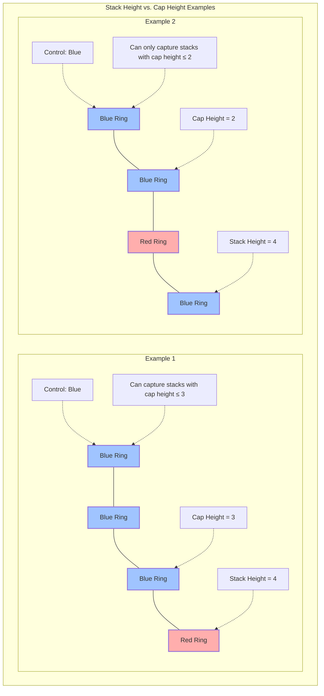
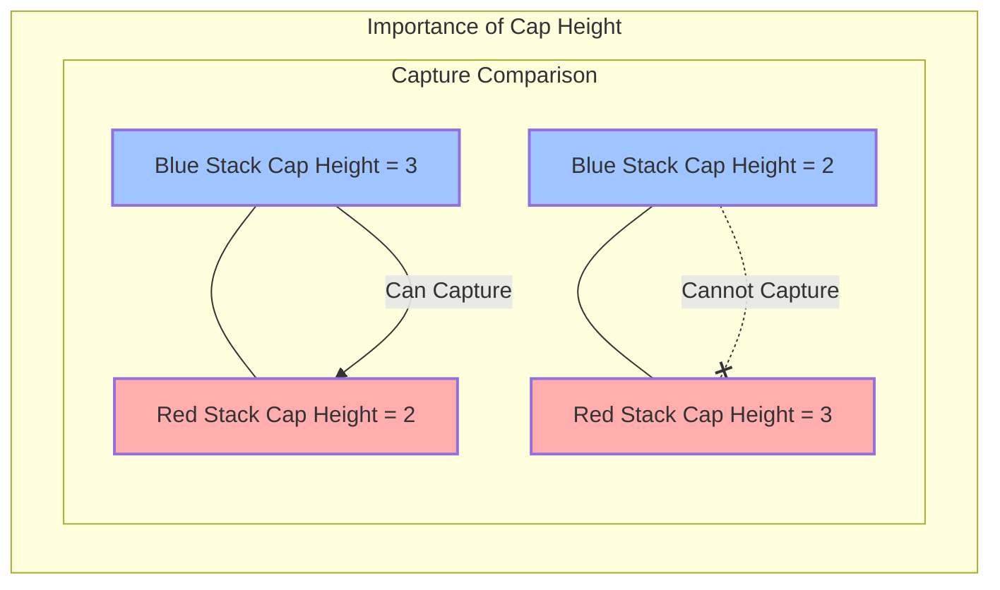
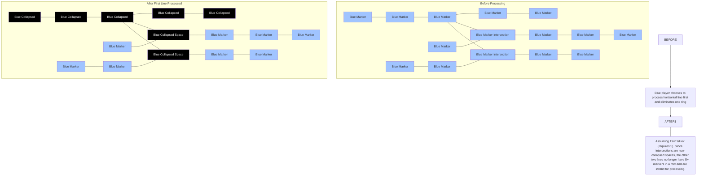
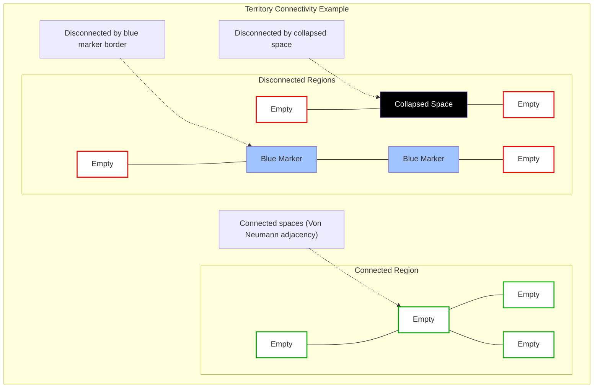
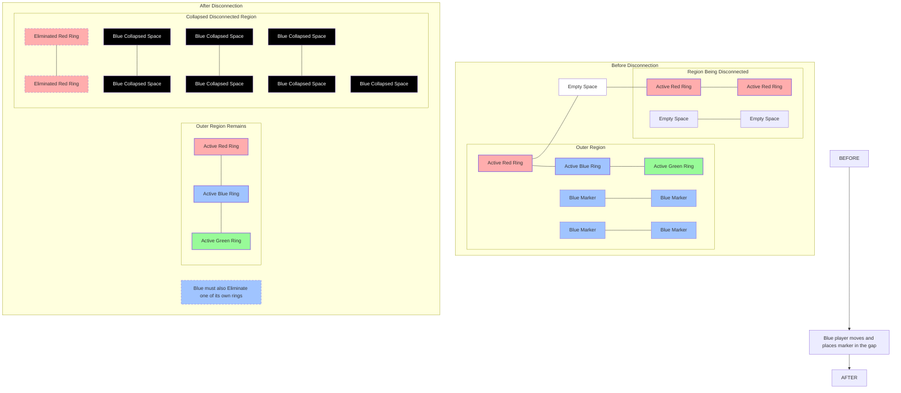
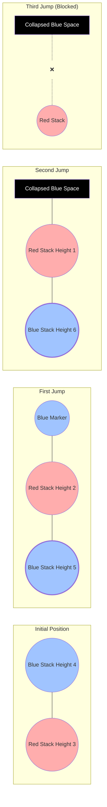

# RingRift Complete Rules

### What is RingRift?

> _🌑 A cosmos to cleft._
>
> _Structure birthing emergency._

> _A game about the tension between freedom and boundaries — between containment and creativity._
>
> _A fractured arena where shifting rings of influence determine power — where moves create fault lines, and mastery comes from navigating both space and its ultimate collapse._
>
> _An invitation to seek threads of dangerous precision through nets of control, to weave, weave through, and render unwoven. Each choice spawning new dangers and new pathways._

> _A field of contest unexpectedly alive, that shifts and threatens to fracture in critical moments, where order meets instability, when cycles meet rupture, where subtle choices cause seismic consequences._
>
> _Creative destruction, adaptation under evolving pressures. Tradeoffs and sacrifices intrinsic — strength and weakness interlaced, implying one another all the way through, from shallow to deep, top to bottom, beginning to end._
>
> _Fom these eternal tensions, this creation arises._

RingRift is an abstract strategy game where you build stacks of rings, claim territory, and outmaneuver your opponents. Every move leaves a mark on the board, and the landscape is constantly shifting.

The game rewards both careful planning and bold plays. You'll form temporary alliances, execute dramatic chain captures, and watch as entire regions of the board collapse in your favor — or against you.

> **At a glance (where to go next)**
>
> - Need crisp, implementation-ready semantics? See `docs/rules/ringrift_compact_rules.md` and `RULES_CANONICAL_SPEC.md`.
> - Want tests that correspond to FAQs/scenarios? See `docs/rules/RULES_SCENARIO_MATRIX.md`.
> - Building or validating engines? Defer to the shared TS engine under `src/shared/engine/**` as the executable SSoT.

### Ruleset Design Goals & Rationale

The RingRift ruleset is intentionally designed around a **modest number of simple, universal mechanics**—stack building and movement, overtaking vs. elimination captures, line formation and collapse, territory disconnection, and last-player-standing turn semantics. These mechanics are combined to achieve the following design goals:

- **High emergent complexity from simple rules.**
  The core rules are meant to be teachable and mechanically consistent across board types and player counts, while still producing a rich decision space with deep tactical and strategic play. Complexity arises from the interaction of stacking, movement, capture chains, line rewards, and territory disconnection, with each element essential.

- **Exciting, tense, and strategically non-trivial games.**
  Games should remain **live and contested** for a long time: temporary leads in ring count or territory are deliberately not a straightforward proxy for eventual victory. Multiple victory paths (ring elimination, territory control, last-player-standing) plus multi-player dynamics and chain reactions are designed so that:
  - Seemingly “won” positions can still collapse through territory cascades or alliance shifts.
  - Short-term sacrifices and self-elimination can be correct play toward long-term advantage.
  - The board’s evolving geometry (via line formations and threatened and actual region disconnections) maintains tension and constantly reshapes incentives and risk.

- **Human–computer competitive balance in a perfect-information, zero-sum game.**
  Unlike many classic perfect-information strategy games where engines have quickly outclassed humans, RingRift is explicitly crafted so that strong human players can **compete with and sometimes outplay strong AIs** into the future:
  - The default 3-player configuration and multi-player variants create social and political dynamics (temporary alliances, leader-punishing behaviour) that are difficult for purely algorithmic agents to model. These dynamics reward reading opponents and adapting on the fly.
  - The extremely high branching factor (up to millions of choices per turn), long tactical chains (especially in captures and territory disconnections), and subtle short vs long horizon tradeoffs between rings and stacks, markers, and territory, make exhaustive brute force search prohibitively expensive even for well-optimized engines. It may even challenge the newest approaches. This means intuition, pattern recognition, and strategic vision become essential.
  - The rules support a spectrum of AI strengths while intentionally preserving room for competitive human creativity, intuition, coalition forming, and non-myopic tactical thinking and long-term strategic planning over deep horizons to matter at all skill levels, whether playing against humans or computer opponents.

Together, these goals are the primary reasons RingRift was created as a distinct abstract strategy game, and they define **how the game should feel**: simple enough to describe at the rules level, but with deep, emergent strategy; high tension and sudden comeback potential. RingRift is designed to offer an arena where humans and computer opponents can enjoyably pit their wits against one another and remain meaningfully competitive over the long term.

**Game Design Influences**: RingRift combines elements from classical abstract games, including piece capturing and stacking (like Emergo, TZAAR, and DVONN), color reversal and line formation (inspired by Othello, Go-moku, and YINSH), shrinking board dynamics (from ZÈRTZ), and territory control (from Go).

### Learning and Playing RingRift

Remember that RingRift is designed to be learned incrementally. Begin with the basics of ring movement, then gradually incorporate advanced concepts like chain captures, line formation, and territory disconnection as you become more comfortable with the core mechanics.

For the richest experience, we recommend:

1. Play your first few games with the 8×8 version to learn the basics
2. Practice with 2-3 players to understand the flow of play
3. Move to the full hex and 19×19 boards once you're comfortable with the core dynamics
4. Experiment with different player counts to experience how alliance dynamics shift

Above all, embrace the dynamic and emergent nature of the game - the richest strategies often arise from the interactions between players and the ever-changing board state.

### How to Navigate This Document

The rule documentation is structured to facilitate different learning approaches:

- **New Players**: Start with the [Quick Start Guide](#13-quick-start-guide) followed by the [Simplified 8×8 Version](#2-simplified-88-version)
- **Visual Learners**: Focus on the diagrams and flowcharts throughout the document
- **Tactical Players**: Dive into the [Strategy Guide](#14-strategy-guide-all-versions) and [FAQ](#154-frequently-asked-questions)
- **Rules Enthusiasts**: Explore the full hex and [19×19 Version](#3-core-game-elements-19×19-full-version) details
- **Looking for Specific Answers**: Check the [FAQ](#154-frequently-asked-questions) or use the [Quick Reference Guide](#162-core-mechanics-reference-all-versions)
- **Engine Implementers**: For terse, implementation-ready semantics, pair this doc with `docs/rules/ringrift_compact_rules.md` and `RULES_CANONICAL_SPEC.md`.
  > **Note on Diagrams**: This document includes visual diagrams to illustrate concepts. If you're reading a printed or plain-text version, you can skip these sections without losing essential information—the text descriptions stand alone.

## Table of Contents

- [RingRift Complete Rules](#ringrift-complete-rules)
  - [What is RingRift?](#what-is-ringrift)
  - [Ruleset Design Goals \& Rationale](#ruleset-design-goals--rationale)
  - [Learning and Playing RingRift](#learning-and-playing-ringrift)
  - [How to Navigate This Document](#how-to-navigate-this-document)
  - [Table of Contents](#table-of-contents)
  - [1. Introduction (All Versions)](#1-introduction-all-versions)
    - [What is RingRift?](#what-is-ringrift-1)
    - [1.1 Game Overview](#11-game-overview)
    - [1.2 The Three Versions of RingRift](#12-the-three-versions-of-ringrift)
      - [1.2.1 Version Comparison Summary](#121-version-comparison-summary)
    - [1.3 Quick Start Guide](#13-quick-start-guide)
      - [Game Objective](#game-objective)
      - [Start With The Simpler Version](#start-with-the-simpler-version)
      - [Setup in 30 Seconds](#setup-in-30-seconds)
      - [Your Turn in 4 Steps](#your-turn-in-4-steps)
      - [Quick Phase Flow (player view)](#quick-phase-flow-player-view)
      - [First-Move Balancing in 2‑Player Games (Pie Rule)](#first-move-balancing-in-2player-games-pie-rule)
      - [What Makes RingRift Unique and Interesting](#what-makes-ringrift-unique-and-interesting)
      - [Quick Strategy Tips](#quick-strategy-tips)
  - [2. Core Concepts \& Vocabulary](#2-core-concepts--vocabulary)
    - [2.1 Adjacency Relationships](#21-adjacency-relationships)
    - [2.2 Stack Terms](#22-stack-terms)
    - [2.3 Capture Types](#23-capture-types)
    - [2.4 Territory Terms](#24-territory-terms)
    - [2.5 Quick Glossary (plain language)](#25-quick-glossary-plain-language)
  - [3. Core Game Elements (19×19 Full Version)](#3-core-game-elements-1919-full-version)
    - [3.1 The Board (19×19 Full Version)](#31-the-board-1919-full-version)
    - [3.2 Player Pieces (19×19 Full Version)](#32-player-pieces-1919-full-version)
      - [3.2.1 Rings (19×19 Full Version)](#321-rings-1919-full-version)
      - [3.2.2 Markers (19×19 Full Version)](#322-markers-1919-full-version)
  - [4. Turn Sequence (19×19 Full Version)](#4-turn-sequence-1919-full-version)
    - [4.1 Ring Placement Phase](#41-ring-placement-phase)
    - [4.1.1 First-Move Balancing (Pie Rule) — 2-Player Games Only](#411-first-move-balancing-pie-rule--2-player-games-only)
    - [4.2 Movement Phase (Required if Ring Placed or Valid Moves Available)](#42-movement-phase-required-if-ring-placed-or-valid-moves-available)
      - [4.2.1 Basic Movement Requirements](#421-basic-movement-requirements)
    - [4.3 Capture Phase](#43-capture-phase)
    - [4.4 Forced Elimination When Blocked](#44-forced-elimination-when-blocked)
    - [4.5 Post-Movement Processing](#45-post-movement-processing)
  - [5. Ring Stack Mechanics (Basics - All Versions)](#5-ring-stack-mechanics-basics---all-versions)
    - [5.1 Stack Height](#51-stack-height)
    - [5.2 Cap Height](#52-cap-height)
    - [5.3 Control Rules](#53-control-rules)
  - [6. Ring Placement (All Versions)](#6-ring-placement-all-versions)
    - [6.1 Initial Placement Rules](#61-initial-placement-rules)
    - [6.2 Placement on Empty Spaces](#62-placement-on-empty-spaces)
    - [6.3 Placement on Stacks](#63-placement-on-stacks)
  - [7. Ring Stack Dynamics (All Versions)](#7-ring-stack-dynamics-all-versions)
    - [7.1 Stack Building](#71-stack-building)
    - [7.2 Control Changes](#72-control-changes)
    - [7.3 Mixed Color Stacks](#73-mixed-color-stacks)
  - [8. Non-Capture Movement (All Versions)](#8-non-capture-movement-all-versions)
    - [8.1 Basic Movement Rules (All Versions)](#81-basic-movement-rules-all-versions)
    - [8.2 Minimum Distance Requirements (All Versions)](#82-minimum-distance-requirements-all-versions)
      - [Key Movement Rules (All Versions)](#key-movement-rules-all-versions)
      - [Landing Rules (All Versions)](#landing-rules-all-versions)
    - [8.3 Marker Interaction](#83-marker-interaction)
  - [9. Capture Types: Overtaking vs Elimination (All Versions)](#9-capture-types-overtaking-vs-elimination-all-versions)
    - [9.1 Overtaking Captures (Rings Stay in Play)](#91-overtaking-captures-rings-stay-in-play)
    - [9.2 Elimination Captures (Rings Permanently Leave Play)](#92-elimination-captures-rings-permanently-leave-play)
  - [10. Capture (Overtaking) Movement (All Versions)](#10-capture-overtaking-movement-all-versions)
    - [10.1 Basic Requirements](#101-basic-requirements)
    - [10.2 Executing an Overtaking Capture](#102-executing-an-overtaking-capture)
    - [10.3 Chain Overtaking](#103-chain-overtaking)
    - [10.4 Capture Patterns](#104-capture-patterns)
  - [11. Line Formation \& Collapse (All Versions)](#11-line-formation--collapse-all-versions)
    - [11.1 Line Formation Rules](#111-line-formation-rules)
    - [11.2 Collapse Process](#112-collapse-process)
      - [Exact-length lines (3 markers on 8×8 in 3-4p games, 4 on 8×8 2p/19×19/Hex)](#exact-length-lines-3-markers-on-88-in-3-4p-games-4-on-88-2p1919hex)
      - [Longer lines give you a choice](#longer-lines-give-you-a-choice)
      - [About collapsed spaces](#about-collapsed-spaces)
      - [Important processing notes](#important-processing-notes)
    - [11.3 Multiple Lines](#113-multiple-lines)
  - [12. Area Disconnection \& Collapse (All Versions)](#12-area-disconnection--collapse-all-versions)
    - [12.1 Territory Rules](#121-territory-rules)
      - [Core Territory Concepts](#core-territory-concepts)
    - [12.2 Disconnection Process](#122-disconnection-process)
    - [12.3 Chain Reactions](#123-chain-reactions)
  - [13. Victory Conditions (All Versions)](#13-victory-conditions-all-versions)
    - [13.1 Ring Elimination Victory (Primary Victory Path)](#131-ring-elimination-victory-primary-victory-path)
    - [13.2 Territory Victory (Primary Victory Path)](#132-territory-victory-primary-victory-path)
    - [13.3 Last Player Standing](#133-last-player-standing)
    - [13.4 End of Game "Stalemate" Resolution](#134-end-of-game-stalemate-resolution)
    - [13.5 Progress \& Termination Guarantee](#135-progress--termination-guarantee)
  - [14. Strategy Guide (All Versions)](#14-strategy-guide-all-versions)
    - [14.1 Stack Management Principles](#141-stack-management-principles)
    - [14.2 Territory Control Tactics](#142-territory-control-tactics)
    - [14.3 Social Dynamics](#143-social-dynamics)
  - [15. FAQ \& CLARIFICATIONS (All Versions Unless Specified)](#15-faq--clarifications-all-versions-unless-specified)
    - [15.1 FAQ Version \& Player Count Guide](#151-faq-version--player-count-guide)
    - [15.2 Turn Sequence and Flow](#152-turn-sequence-and-flow)
      - [15.2.1 Flowchart of a Turn](#1521-flowchart-of-a-turn)
    - [15.3 Common Capture Patterns](#153-common-capture-patterns)
      - [15.3.1 180° Reversal Pattern](#1531-180-reversal-pattern)
      - [15.3.2 Cyclic Pattern](#1532-cyclic-pattern)
    - [15.4 Frequently Asked Questions](#154-frequently-asked-questions)
      - [Q1: Can I split or rearrange the order of rings in a stack?](#q1-can-i-split-or-rearrange-the-order-of-rings-in-a-stack)
      - [Q2: What exactly counts for the minimum jump requirement? (Version-Specific)](#q2-what-exactly-counts-for-the-minimum-jump-requirement-version-specific)
      - [Q3: During captures, can I choose how far to move past the captured (Overtaken) piece? (Version-Specific)](#q3-during-captures-can-i-choose-how-far-to-move-past-the-captured-overtaken-piece-version-specific)
      - [Q4: What happens to rings under the top one in an Overtaken (captured) stack?](#q4-what-happens-to-rings-under-the-top-one-in-an-overtaken-captured-stack)
      - [Q5: Can I Overtake (capture) multiple rings from one stack?](#q5-can-i-overtake-capture-multiple-rings-from-one-stack)
      - [Q6: What's the difference between Overtaking and Elimination captures?](#q6-whats-the-difference-between-overtaking-and-elimination-captures)
      - [Q7: What happens if I form multiple lines of markers? (Version Specific Length)](#q7-what-happens-if-i-form-multiple-lines-of-markers-version-specific-length)
      - [Q8: What happens if I have no rings/stacks to remove when required?](#q8-what-happens-if-i-have-no-ringsstacks-to-remove-when-required)
      - [Q9: What happens if a chain Overtaking capture would block all further moves?](#q9-what-happens-if-a-chain-overtaking-capture-would-block-all-further-moves)
      - [Q10: How are disconnected regions evaluated with multicolored stacks?](#q10-how-are-disconnected-regions-evaluated-with-multicolored-stacks)
      - [Q11: What happens in a stalemate with rings in hand?](#q11-what-happens-in-a-stalemate-with-rings-in-hand)
      - [Q12: What happens if a chain Overtaking capture would eliminate all my rings?](#q12-what-happens-if-a-chain-overtaking-capture-would-eliminate-all-my-rings)
      - [Q13: What's the difference between Moore and Von Neumann neighborhoods in different game versions?](#q13-whats-the-difference-between-moore-and-von-neumann-neighborhoods-in-different-game-versions)
      - [Q14: When is capturing optional vs mandatory?](#q14-when-is-capturing-optional-vs-mandatory)
      - [Q15: How is a region determined to be "surrounded" or disconnected? (Version-specific)](#q15-how-is-a-region-determined-to-be-surrounded-or-disconnected-version-specific)
      - [Q16: How does control transfer in a multicolored ring stack?](#q16-how-does-control-transfer-in-a-multicolored-ring-stack)
      - [Q17: Is there a special movement rule for the very first ring placement on an empty board?](#q17-is-there-a-special-movement-rule-for-the-very-first-ring-placement-on-an-empty-board)
      - [Q18: What happens if multiple victory conditions seem to be met?](#q18-what-happens-if-multiple-victory-conditions-seem-to-be-met)
      - [Q19: Can RingRift be played with 2 or 4 players? (Player Count Variations)](#q19-can-ringrift-be-played-with-2-or-4-players-player-count-variations)
      - [Q20: How do territory disconnection rules differ between the 8×8 and 19×19 versions?](#q20-how-do-territory-disconnection-rules-differ-between-the-88-and-1919-versions)
      - [Q21: How are victory thresholds determined with variable player counts?](#q21-how-are-victory-thresholds-determined-with-variable-player-counts)
      - [Q22: What strategic considerations should guide my choice with the Graduated Line Rewards rule?](#q22-what-strategic-considerations-should-guide-my-choice-with-the-graduated-line-rewards-rule)
      - [Q23: What happens if I cannot eliminate any rings when processing a disconnected region?](#q23-what-happens-if-i-cannot-eliminate-any-rings-when-processing-a-disconnected-region)
      - [Q24: What happens if I control stacks but have no valid placement, movement, or capture options on my turn?](#q24-what-happens-if-i-control-stacks-but-have-no-valid-placement-movement-or-capture-options-on-my-turn)
  - [16. Simplified 8×8 Version and Comparison with Full Version](#16-simplified-88-version-and-comparison-with-full-version)
    - [16.1 **Quick Version Comparison:**](#161-quick-version-comparison)
    - [16.2 Core Mechanics Reference (All Versions)](#162-core-mechanics-reference-all-versions)
    - [16.3 Overview of Simplifications on 8x8](#163-overview-of-simplifications-on-8x8)
    - [16.4 Components \& Setup (8×8)](#164-components--setup-88)
    - [16.5 Key Rules \& Turn Flow (Simplified)](#165-key-rules--turn-flow-simplified)
      - [16.5.1 Movement (8×8)](#1651-movement-88)
      - [16.5.2 Overtaking (Stack Capture)](#1652-overtaking-stack-capture)
      - [16.5.3 Elimination Captures](#1653-elimination-captures)
    - [16.6 Winning Conditions (8×8)](#166-winning-conditions-88)
    - [16.7 Quick Start Example (8×8)](#167-quick-start-example-88)
    - [16.8 Territory Disconnection Example (8×8)](#168-territory-disconnection-example-88)
    - [16.9 Full 19×19 Version](#169-full-1919-version)
      - [16.9.1 Major Differences from 8×8](#1691-major-differences-from-88)
      - [16.9.2 Components \& Setup (19×19)](#1692-components--setup-1919)
      - [16.9.3 Turn Sequence Summary (Full)](#1693-turn-sequence-summary-full)
      - [16.9.4 Detailed Rules](#1694-detailed-rules)
        - [16.9.4.1 Movement \& Adjacency](#16941-movement--adjacency)
        - [16.9.4.2 Overtaking vs. Elimination](#16942-overtaking-vs-elimination)
        - [16.9.4.3 Lines \& Collapses (19×19 / Hexagonal Focus)](#16943-lines--collapses-1919--hexagonal-focus)
        - [16.9.4.4 Territory Disconnection](#16944-territory-disconnection)
        - [16.9.4.5 Victory Conditions \& Tiebreakers](#16945-victory-conditions--tiebreakers)
      - [16.9.5 Quick Start Examples (19×19)](#1695-quick-start-examples-1919)
      - [16.9.6 Territory Disconnection Example (19×19 Using Von Neumann/4-Direction Adjacency)](#1696-territory-disconnection-example-1919-using-von-neumann4-direction-adjacency)
      - [16.9.7 Victory Through Territory Control](#1697-victory-through-territory-control)
      - [16.9.8 Chain Reaction Example](#1698-chain-reaction-example)
    - [16.10 Comparing the Three Editions](#1610-comparing-the-three-editions)
    - [16.11 Closing Note](#1611-closing-note)
  - [17. Conclusion](#17-conclusion)
    - [Summary of RingRift](#summary-of-ringrift)

## 1. Introduction (All Versions)

### What is RingRift?

RingRift is an abstract strategy board game where 2-4 players compete for territory and ring elimination through clever stack building, marker placement, and tactical captures. The game features no chance elements and perfect information, with 3-4 multi-player dynamics creating shifting alliances and new types of strategic depth.

**Core Gameplay Summary:**

- Players build stacks of rings, moving them across the board and leaving color markers behind
- Taller stacks must move farther but can capture more effectively
- Players can claim territory by forming lines of markers or surrounding regions
- Victory comes through eliminating rings or controlling territory
- The social dynamics create natural balancing as players ally against leaders

Three versions of the game exist, offering different strategic landscapes while sharing core mechanics:

- **8×8 Simplified Version**: A smaller square grid (64 spaces) for faster games and easier learning. Uses 18 rings per player.
- **19×19 Full Version**: The original, larger square grid (361 spaces) offering maximum tactical complexity. Uses 36 rings per player.
- **Hexagonal Version**: A regular hexagonal grid with 13 spaces per side (469 total spaces), providing the deepest strategic landscape and the fullest realization of the design vision. Uses 48 rings per player.

### 1.1 Game Overview

Any combination of human and computer players can participate. Two, three, or four total players are possible. When playing with three or four players, the social dynamics and complex decision space make gameplay particularly engaging — multiple human players can cooperate and compete against a computer opponent, leveraging psychological and social dynamics that purely algorithmic opponents struggle to model. The game can be enjoyed over a physical board or digitally.

The game's rich strategic depth, tension and drama emerge from the interplay between dynamic stack building, stack stranding, and stack elimination, line formation and collapse, complex chain capturing tactics, strategic territory control, a shrinking set of available spaces, ever mounting potential for entire regions to be disconnected; and thus an always potentially shifting balance of power between players.

### 1.2 The Three Versions of RingRift

**Version & Player Count Reference Guide**:

> This document covers all three versions (8×8 Square, 19×19 Square, Hexagonal) and rules for 2-4 players. Sections are labeled with version applicability.
>
> - Sections marked "All Versions" apply universally.
> - Sections marked "Square Grid Versions" apply to both 8×8 and 19×19.
> - Sections marked "19×19 / Hexagonal Versions" apply to those two large-format versions.
> - Sections marked "8×8 Version", "19×19 Version", or "Hexagonal Version" are specific.
> - For player count variations, see [Section 13](#13-victory-conditions-all-versions).
> - For a detailed comparison, see [Section 16.10](#1610-comparing-the-three-editions).

#### 1.2.1 Version Comparison Summary

| Feature                  | 19×19 Full Version                           | 8×8 Simplified Version                       | Hexagonal Version                            |
| ------------------------ | -------------------------------------------- | -------------------------------------------- | -------------------------------------------- |
| Board Size               | 361 spaces (19×19)                           | 64 spaces (8×8)                              | 469 spaces (13 per side)                     |
| Rings per Player         | 36 rings                                     | 18 rings                                     | 48 rings                                     |
| Victory Threshold (3p)   | >54 rings                                    | >27 rings                                    | >72 rings                                    |
| Movement Adjacency       | Moore (8-direction)                          | Moore (8-direction)                          | Hexagonal (6-direction)                      |
| Line Formation Adjacency | Moore (8-direction)                          | Moore (8-direction)                          | Hexagonal (6-direction)                      |
| Territory Adjacency      | Von Neumann (4-direction)                    | Von Neumann (4-direction)                    | Hexagonal (6-direction)                      |
| Movement Landing Rule    | Min distance, any valid space beyond markers | Min distance, any valid space beyond markers | Min distance, any valid space beyond markers |
| Capture Landing Rule     | Min distance, any empty beyond target        | Min distance, any empty beyond target        | Min distance, any empty beyond target        |
| Tactical Complexity      | Highest                                      | Moderate                                     | High                                         |
| Strategic Complexity     | High                                         | Low                                          | Highest                                      |

### 1.3 Quick Start Guide

**For New Players: Start Here!**

#### Game Objective

RingRift is a territory control and ring elimination game where you'll build stacks, capture rings, claim territory, and form temporary alliances. To win, either:

- Eliminate more than 50% of the total rings in play
- Control more than 50% of the board as territory
- Win by last-player-standing: be the only player with legal actions for at least one full round, and remain the only one with actions when the round returns to you (see Section 13.3 for details)

#### Start With The Simpler Version

We recommend beginning with the **8×8 version** - it has simpler rules but preserves all core mechanics. The full 19×19 version and full hexagonal version add tactical and strategic depth once you're comfortable with the basics.

#### Setup in 30 Seconds

- Each player takes the appropriate number of rings of their own color for the chosen version (18 for 8×8, 36 for 19×19/Hexagonal); this is their entire personal ring supply for the game.
- No rings start on the board - players place and move them during play.
- Decide turn order and begin!

#### Your Turn in 4 Steps

Each turn follows the same rhythm. Here's the short version:

1. **PLACE** a ring _(optional, unless you have nothing on the board)_
   - Place a ring from your hand onto an empty space or on top of any stack
   - Placing on a stack instantly takes control of it—a powerful move!

2. **MOVE** your stack _(required)_
   - Slide your stack in a straight line (orthogonal or diagonal)
   - It must travel at least as many spaces as rings it contains
   - You'll leave a marker behind where you started

3. **CAPTURE** if you can _(optional to start, then mandatory)_
   - Jump over enemy stacks to snatch their top ring
   - Captured rings go to the bottom of your stack
   - Once you start capturing, you must keep going until no more captures are possible

4. **CLAIM TERRITORY** _(automatic)_
   - Lines of your markers collapse into permanent territory (see Section 11 for thresholds: 3‑in‑a‑row on 8×8 in 3–4 player games, 4‑in‑a‑row on 8×8 in 2‑player games, and 4‑in‑a‑row on 19×19/Hex)
   - Surrounded areas that lack representation from all active players can also become your territory
   - Both line collapses and territory captures remove rings from the game, counting toward victory

That's the core loop! Now let's look at each phase in more detail.

#### Quick Phase Flow (player view)

- Ring Placement → Movement → Capture / Chain Capture (mandatory once begun) → Line Processing → Territory Processing → Forced Elimination (only when you have material but no legal placement/move/capture) → Next player.
- Every phase visit is explicit and recorded; there are no silent skips.

#### First-Move Balancing in 2‑Player Games (Pie Rule)

- In **2‑player** games only, after Player 1 completes their first full turn from the empty starting position (placement, movement/capture, line/territory processing), **Player 2 may choose to swap sides instead of taking a normal turn**.
- If Player 2 chooses to swap:
  - The board state is unchanged.
  - The players simply exchange which colour/seat they occupy (Player 1 ↔ Player 2), including ring supplies, eliminated‑ring counts, and territory totals.
  - It remains Player 2’s turn to move from the resulting position, now playing the colour that moved first.
- This pie rule is available **once per game**, only immediately after Player 1’s first turn, and only in 2‑player games; 3‑ and 4‑player games are unaffected.

#### What Makes RingRift Unique and Interesting

- **Strategic Alliances**: In 3-4 player games, players naturally form temporary alliances against the leader
- **Chain Reactions**: One move can trigger dramatic chain captures and territory collapse cascades

#### Quick Strategy Tips

- Balance having a few tall cap stacks (powerful but less mobile) with maintaining multiple smaller stacks
- Pay attention to which player is advancing toward victory
- Form temporary alliances against the leader
- Create lines of your markers to claim territory
- Use territory control to cut off opponent movement

For full details, continue reading or skip ahead to [Section 2](#2-core-concepts--vocabulary) for core concepts, or [Section 16](#16-simplified-88-version-and-comparison-with-full-version) for the simplified 8×8 rules.

## 2. Core Concepts & Vocabulary

Before diving into the detailed rules, it's helpful to understand some core concepts and specialized vocabulary used in RingRift:

### 2.1 Adjacency Relationships

- **Moore Neighborhood**: The 8 surrounding spaces around a position (orthogonal and diagonal). In RingRift, this adjacency is used for:
  - Movement and capturing (in both 19×19 and 8×8 versions)
  - Line formation (in both versions)
  - _Note: Territory connectivity for 8×8 uses Von Neumann, see Section 12.1._

- **Von Neumann Neighborhood**: Only the 4 orthogonally adjacent spaces (up, down, left, right). Used for territory connectivity checks in **both 8×8 and 19×19** square versions.
- **Hexagonal Adjacency**: The 6 adjacent spaces on a hexagonal grid. Used for movement, line formation, AND territory connectivity in the Hexagonal version.

### 2.2 Stack Terms

- **Stack Height**: The total number of rings in a stack, regardless of color. Determines minimum movement distance.

- **Cap Height**: The number of consecutive rings of the same color from the top of a stack. Determines ability to capture other stacks.

- **Control**: Determined solely by the top ring's color. The player whose color is on top controls the stack's movement.

### 2.3 Capture Types

- **Overtaking**: Captures that occur during movement when jumping over a ring or stack. The top ring from the captured stack is added to the bottom of the capturing ring stack, and hence remains in play.

- **Elimination**: When rings are permanently removed from the board (by being eliminated through line formations or territory disconnections). These rings count toward victory.

### 2.4 Territory Terms

- **Markers**: Tokens left behind when rings move. Can be flipped to different colors.

- **Collapsed Spaces**: Permanently claimed territory that cannot be moved through or occupied.

- **Disconnected Region**: An area, cut off from the rest of the board by a border, that is not connected to at least one color of ring or stack that is present on the board as a whole. See [FAQ Q15](#q15-how-is-a-region-determined-to-be-surrounded-or-disconnected-version-specific) for detailed criteria and distinctions.

### 2.5 Quick Glossary (plain language)

- **Stack**: One or more rings in a space. Controlled by the colour on top.
- **Cap**: The run of same-colour rings at the top of a stack; sets capture power.
- **Line**: A straight run of markers of one colour that can collapse into territory.
- **Region**: A set of connected empty/marker cells using territory adjacency (4-dir on square, 6-dir on hex).
- **Collapse**: When a line or disconnected region turns into permanent territory; rings inside are eliminated.
- **Forced elimination**: A dedicated phase where you remove your own cap because you have material but no legal placement/move/capture.
- **Active-no-moves (ANM)**: Hypothetical state where the current player has material but no legal actions; the rules require that play transitions (often via FE) so ANM never persists.

## 3. Core Game Elements (19×19 Full Version)

### 3.1 The Board (19×19 Full Version)

• **Structure**:

- A square grid of 19×19 intersections (totaling 361 spaces)
- Each space is an intersection point of grid lines

• **Neighbor Relationships**:

- Movement & Line Formation: Uses 8-direction adjacency (Moore neighborhood - orthogonal and diagonal).
- Territory Connectivity: Uses 4-direction adjacency (Von Neumann neighborhood - orthogonal only). This distinction is crucial for tactical excitement and strategic depth.

• **Space States**:

- Empty: Available for movement and placement
- Occupied: Contains rings, ring stacks, or markers
- Collapsed: Permanently unusable; these spaces are "claimed" by a player's color and are marked by a collapsed space marker of said color

### 3.2 Player Pieces (19×19 Full Version)

#### 3.2.1 Rings (19×19 Full Version)

• Quantity: Each player has a fixed personal supply of rings of their own colour: 36 in the 19×19 version, 48 in the Hexagonal version, 18 in the 8×8 version.
• Supply limit: At any time, the total number of rings of a player's colour that are in play (on the board in any stack, regardless of who controls those stacks, plus in that player's hand) can never exceed this limit. Captured rings of other colours in stacks you control do not count against your own supply—they still belong, by colour, to their original owner for conservation and victory accounting. A quick check: `ringsInHand + ringsOnBoardOfColor` must always equal the starting supply for that board size.
• Characteristics:
• Begin "in hand" (off the board)
• May be placed on the board and later form part of a stack
• Within a stack, the top ring determines control
• Can be captured through Overtaking and added to enemy stacks, or through Elimination and removed from play

#### 3.2.2 Markers (19×19 Full Version)

• Quantity: 361 markers (one per board space)
• Design:
• Physical Form: A rounded cubic die with six circular faces (e.g. produced by intersecting a cube with a truncating sphere and three orthogonal cylinders)
• Face Types:
• Regular Marker Faces (3 faces): Display solid player colors. These markers are in play, may be traversed over or flipped, and are used in forming lines and boundaries
• Collapsed Territory Faces (3 faces): Display black circles with colored center dots. These denote permanently claimed territory

## 4. Turn Sequence (19×19 Full Version)

Each player's turn consists of distinct phases that must be executed in order. When the game ends (victory/stalemate), `currentPhase` moves to a terminal `game_over` phase to keep the recorded state aligned with `gameStatus: completed`; this terminal phase is outside the normal turn loop.

### 4.1 Ring Placement Phase

(Optional, Unless You Control No Rings On The Board)

• **Movement is always mandatory when possible.** Ring placement is mandatory only if either:

- You have no rings on the board, and you have rings in hand, or
- You have no legal moves available for the rings and stacks controlled by you on the board, but you have rings in hand.

• **Conditions for Placement**:

- If you have rings remaining in hand and no rings on the board, you must attempt to place one on any empty space.
- If you have rings in hand and already have rings or stacks on the board, you may optionally:
  - Place **1-3 rings** on an empty, non-collapsed space, forming a stack of the chosen height, subject to both your remaining rings in hand and your remaining capacity under the version's supply limit, or
  - Place a **single ring** on top of any existing stack (friendly or opponent-controlled). This immediately gives you control of that stack through the new top ring, which becomes the controlling color.

• **Placement Restrictions**:

- Ring placement must only occur before the movement phase
- **Subsequent Move Prerequisite:** Before a placement is considered valid, it must be confirmed that the resulting stack (at its new position and with its potentially new height) would have at least one legal move available according to the standard movement rules (Section 8 and Sections 16.5.1 / 16.9.4.1). This check is performed on the hypothetical state _after_ placement. If no legal move would be possible, the placement itself is illegal and cannot be chosen. For example, placing a ring to create a stack of height 9 on an 8×8 board is illegal anywhere, as no subsequent move is possible. This check applies to both placing on empty spaces and placing on top of existing stacks.

• **Edge Cases**:

- If a player must place a ring but no legal placement locations exist **and they control no stacks on the board**, the player forfeits their turn.
- If a player must place a ring but no legal placement locations exist **and they do control at least one stack on the board**, they are treated as **blocked with stacks** and must resolve the situation using the forced elimination rule in Section 4.4 before their turn can end.
- Play continues normally, and if the situation changes to allow legal placements, the player may place rings on future turns.

### 4.1.1 First-Move Balancing (Pie Rule) — 2-Player Games Only

In 2-player games, the first-move advantage can be significant. To balance this:

1. Player 1 completes their first full turn normally (placement, movement, captures, line/territory processing)
2. Player 2 may then choose to **swap sides** instead of taking a normal turn
3. If Player 2 swaps:
   - Board state remains unchanged
   - Players exchange colors, ring supplies, and all game statistics
   - Player 2 (now playing Player 1's original color) takes the next turn

This option is available **only once**, immediately after Player 1's first turn, and **only in 2-player games**. Games with 3 or 4 players do not use the pie rule.

> **Why this matters:** The pie rule encourages Player 1 to make a balanced opening move. If their first move is too strong, Player 2 will simply swap and take it for themselves!

### 4.2 Movement Phase (Required if Ring Placed or Valid Moves Available)

• **Movement is mandatory whenever possible**:

- If a ring was placed:
  - That specific ring or ring stack MUST be moved
  - No other rings or stacks may be moved for the player turn
- If no ring was placed:
  - Player must move one of their controlled rings or stacks, freely chosen from those that have valid moves
  - Movement is only skipped if no valid moves are available. In particular, if at the beginning of a player's action they have no legal placement, no legal movement, and no legal capture **but still control one or more stacks on the board**, they do **not** simply skip movement; instead they are considered **blocked with stacks** and must follow the forced‑elimination rule in Section 4.4.

#### 4.2.1 Basic Movement Requirements

• **Selection and Marker Placement**:

- Select one ring or stack to move (must be newly placed ring/stack if placement occurred)
- Leave a marker of your color on departure space

• **Movement Path**:

- Move in straight line (orthogonal or diagonal)
- Must travel at least as many spaces as stack height
- Cannot pass through collapsed spaces or other rings (except during Overtaking)

• **When Moving Over Markers**:

- Follow the unified movement landing rule (Section 8.2): you may land on **any valid space beyond the markers** along the line of travel, provided it is either **(a) empty** or **(b) occupied by any marker (own or opponent)**, and the total distance from start to landing is at least your stack's height.
- Landing on any marker removes it and eliminates a ring from your cap (see Section 8.2).
- You are **not required to stop at the first valid space** after the markers.
- Opponent markers along the path (not at landing) flip to your color.
- Your markers become collapsed territory.
- Empty spaces remain unchanged.

### 4.3 Capture Phase

• **Initial Move Options**:

- Initial Move can be a non-capturing move, followed by opting for an Overtaking capture move by the same ring or stack, starting from the initial landing space
- Initial Move can be an Overtaking capture move itself

• **Chain Captures**:

- Once an Overtaking capture begins, chain Overtaking captures are mandatory
- Must continue until no legal Overtaking captures remain from landing space
- Can change direction between Overtaking captures
- Can Overtake from same stack multiple times
- When multiple capture directions are available:
  - The moving player chooses which valid jump segment to perform next
  - **Mandatory Continuation vs. Choice of Path:** While continuing the capture _sequence_ is mandatory as long as _any_ legal capture segment exists from the current landing spot, the player _chooses which specific legal capture segment_ to perform at each step. This choice might lead to a position with no further captures, thus ending the mandatory chain, even if other initial choices might have allowed the chain to continue longer.
- Capture segments may change direction (within the grid's axes - 8 for square, 6 for hex), continue straight, or reverse 180° (if legal) to jump back over a previously encountered stack.
- It is possible to jump over the same ring stack multiple times (capturing its new top ring each time) if the path and landing spots remain valid for each subsequent jump.
- **Example:** From a 4-ring stack, you jump east over a 2-ring enemy stack (capture 1), land two cells away, then choose whether to jump north or continue east; whichever path you pick, you must keep jumping until no capture remains from your new landing spot.

### 4.4 Forced Elimination When Blocked

• **Condition:** At the _beginning_ of a player's turn, before any placement (see Sections 4.1, 6.1-6.3) or movement selection (see Sections 4.2.1, 8.1 for standard moves; Sections 4.3, 10.1 for captures) is made, if that player has no valid placement, standard move, or capture option available, but they control one or more ring stacks on the board.
• **Action:** The player _must_ eliminate the entire cap (all consecutive top rings of the controlling color) of one of their controlled ring stacks.
• **Choice:** The choice of which stack's cap to eliminate is up to the player.
• **Victory Condition:** These eliminated rings are removed from play and count towards the player's total for the Ring Elimination victory condition.
• **Control-Flip Edge Case:** If the player's only control over a stack was a cap of height 1 (a single ring of their color on top of opponent rings), forced elimination removes that cap and flips stack control to the opponent. If this causes the player to have **zero controlled stacks** and **zero rings in hand**, they become "temporarily inactive" (see Section 13.3) immediately. Turn rotation should then skip that player and proceed to the next player who has material; the player's turn effectively ends at the moment of forced elimination without any further action.
• **Ensuring the Game Continues:** As long as **any stacks remain on the board**, the game cannot reach a state where no player has any available action. If no player has a legal placement, movement, or capture but at least one stack exists, the player whose turn it is must perform a forced elimination. Successive forced eliminations continue (possibly cycling through multiple players) until **no stacks remain**; only then can the game reach an endgame state resolved by the stalemate rules in Section 13.4.
• **Phase & recording:** Forced elimination is its own phase (`forced_elimination`) with an explicit move; never apply it silently during territory or line processing.
• **Last Player Standing:** LPS is determined after post-processing/FE when only one player has turn-material (controlled stack or rings in hand); forced eliminations can trigger LPS by exhausting a player’s material.

### 4.5 Post-Movement Processing

• **After movement and any captures are complete (and after any same-color marker removal upon landing), check for**:

1.  **Line formations (board-specific thresholds)**
    - On the **8×8 board**:
      - Geometric lines are runs of **3 or more** consecutive markers of one colour.
      - For **2‑player games**, line rewards / processing only trigger from **4‑in‑a‑row**; 3‑in‑a‑row still matters tactically, but does not trigger line collapse.
      - For **3–4 player games**, line rewards / processing trigger from **3‑in‑a‑row**.
    - On the **19×19** and **Hexagonal** boards, line rewards / processing trigger from **4‑in‑a‑row**.
    - Process each **eligible** line one at a time, with the moving player selecting which line to process first.
    - For rules that depend on the _required_ line length, use:
      - 3 for 8×8 in 3–4 player games;
      - 4 for 8×8 in 2‑player games;
      - 4 for 19×19 and Hexagonal.
    - For each eligible line:
      - **For lines of exactly the required length:**
        - Replace the entire line with collapsed spaces of your color.
        - Eliminate either:
          - one of your standalone rings (a height‑1 stack you control), or
          - the entire cap (all consecutive top rings of the controlling color) of one of your controlled ring stacks.
      - **For lines longer than the required length (any length > required length):** You may choose either:
        - **Option 1:** Replace the entire line with collapsed spaces of your color **and** eliminate one of your standalone rings or the entire cap of one of your controlled ring stacks, or
        - **Option 2:** Replace exactly the required number of _any_ consecutive markers of your choice within the line with collapsed spaces of your color **without eliminating any of your rings or caps**. Option 2 is always available for overlength lines, even if you have no legal way to eliminate a ring or cap.
      - After resolving a line, check again for any remaining eligible lines; continue until none remain.
      - Collapsed spaces never form part of a valid line.
    - All rings eliminated as part of line processing count toward the ring‑elimination victory condition.

2.  **Disconnected regions**
    - Check for disconnected regions after all line processing is complete.
    - You may process **any subset** of eligible disconnected regions, in any order you choose, subject to the self‑elimination prerequisite in Section 12.2; you are **not** required to process every region that happens to be disconnected.
    - For each disconnected region that you choose to process:
      - Fill all cells in the region with collapsed spaces of your color (removing any stacks or markers inside).
      - Identify the markers of the single border colour that actually participate in at least one blocked path from the region to the rest of the board (per the disconnection definition in Section 12.2); collapse **only those** markers to your colour. Same‑colour markers that do not contribute to blocking any such path remain as markers.
      - Eliminate all rings within the region (all colours); these are credited to you.
      - Eliminate one additional of your rings or the entire cap of one of your controlled ring stacks **outside** the region (subject to the prerequisite check in Section 12.2). As with line rewards, this can be either a single standalone ring (height‑1 stack) or an entire cap.
      - After each region is processed, re‑check for any new disconnected regions that may have been created.
    - Important notes:
      - All eliminated rings (inside the region and from the mandatory self-elimination) count toward your victory total.
      - Line formations must always be fully resolved before any disconnected regions are processed.
      - Line collapses may create or affect disconnected regions; territory processing may in turn change future line possibilities.
      - Rings eliminated inside a collapsing region are credited to **you** (the acting player) for victory/supply accounting, regardless of original ownership.

3.  **Victory check**
    - Victory conditions are only checked after all post-movement processing is complete

## 5. Ring Stack Mechanics (Basics - All Versions)

Ring stacks are a central element of RingRift. Understanding their fundamental mechanics is essential for gameplay:

### 5.1 Stack Height

**Stack height** is simply the total number of rings in a stack, regardless of their colors.

This matters because:

- **Movement distance**: A stack must move _at least_ as many spaces as its height. A 4-ring stack must travel at least 4 spaces.
- **Mobility trade-off**: Taller stacks are more powerful but less flexible—they can't make short moves.

When you capture a ring, it goes to the _bottom_ of your stack. The order of rings never changes otherwise—no rearranging allowed.

### 5.2 Cap Height

**Cap height** is the number of consecutive rings of the same color at the top of a stack.

Why it matters:

- **Capture power**: You can only capture stacks with cap heights _less than or equal to_ your own
- **Strategic depth**: A tall stack with a thin cap (just one ring of your color on top) is vulnerable despite its height

> **Examples:**
>
> - Three blue rings on top of one red ring → cap height of 3
> - Two blue, one red, then one blue (from top down) → cap height of only 2 (the red breaks the sequence)





_In these examples, the Blue player controls both stacks (as Blue is on top). Example 1 has a stronger cap height (3) compared to Example 2 (cap height 2), which affects its ability to capture other stacks. This illustrates the strategic tradeoff between having more separate rings on different spaces versus having more consecutive rings of your color on top of a stack (higher cap). The second diagram shows how cap height directly determines capturing ability: you can only capture stacks with cap heights less than or equal to your own._

### 5.3 Control Rules

• **Determination**: The color of the top ring determines which player controls the stack
• **Change of Control**: When the top ring is captured, control may change to the next ring down
• **Lower Ring Relevance**: Lower rings only become relevant when rings above them are removed
• **Immediate Control**: Placing a ring on any stack immediately gives control through the new top ring

## 6. Ring Placement (All Versions)

### 6.1 Initial Placement Rules

• Players start with rings "in hand" (off the board)
• Must place a ring if you have no rings on board and rings in hand
• Optional placement if you have rings both on board and in hand
• The placed ring or stack must have legal moves available
• Can place on any empty, non-collapsed space - or -
• Can place on top of any existing stack (friendly or opponent)

### 6.2 Placement on Empty Spaces

- You may place **1–3 rings** on any empty, non-collapsed space, forming a stack. The exact number is constrained by both your remaining rings in hand and your supply limit for the board type (18 for 8×8, 36 for 19×19/Hexagonal): the total number of rings of your color currently on the board in any stack, plus in your hand, must not exceed this limit. Captured opponent-color rings in stacks you control do not reduce this capacity.
  • Before a placement is legal, the resulting stack must have at least one legal move or capture available according to the standard movement and capture rules (the **no-dead-placement** rule).
  • Must move the newly placed stack immediately.
  • The placed stack's movement follows standard rules for its initial height (e.g., placing 3 rings requires moving at least 3 spaces).
  • No special rule for first placement

### 6.3 Placement on Stacks

• Can place on top of any existing stack (friendly or opponent)
• Immediately gains control according to new top ring
• Must move the updated stack immediately
• Movement follows standard rules based on new stack height and new cap height

## 7. Ring Stack Dynamics (All Versions)

### 7.1 Stack Building

• Stacks grow through Overtaking captures
• New rings always added to bottom
• Order of rings cannot be changed
• Height increases affect movement requirements

### 7.2 Control Changes

• Top ring determines control
• Control can change when top ring is captured (Overtaken), if new top ring is of a different color
• Player gaining control through top ring change due to Overtaking can move stack on their next turn (top ring must still be their color on top when their turn arrives)

### 7.3 Mixed Color Stacks

• Can contain rings from multiple players
• Only top consecutive rings of the same color count for cap height
• Lower rings can become relevant if exposed, which provides opportunity for control changes

## 8. Non-Capture Movement (All Versions)

### 8.1 Basic Movement Rules (All Versions)

• Movement Path:
• Move in straight line (orthogonal or diagonal)
• Cannot pass through collapsed spaces
• Cannot pass through other rings or stacks
• Must leave a marker of your color on departure space
• Movement is mandatory whenever possible
• Must move newly placed ring/stack if placement occurred

### 8.2 Minimum Distance Requirements (All Versions)

#### Key Movement Rules (All Versions)

**The basic rule:** Your stack must move at least as many spaces as its height. A height-3 stack must travel at least 3 spaces.

- Distance is counted before any marker flipping/collapsing occurs
- Both empty spaces and markers count toward the distance
- You can move _further_ than the minimum if you want (as long as the path is clear)

#### Landing Rules (All Versions)

When moving over markers, you have flexibility in where you land:

**Valid landing spaces:**

- Any empty space, OR
- A space with any marker (own or opponent)—which triggers special handling—see below

**Requirements:**

- Total distance traveled must be at least your stack height
- Path must be clear of other stacks and collapsed spaces
- You're _not_ forced to stop at the first valid space—keep going if you want

**Landing on any marker:**
If you land on a space containing any marker (yours or an opponent's), this happens:

1. The marker is removed (not collapsed)
2. Your stack lands there
3. The top ring of your stack's cap is immediately eliminated (counts toward victory!)

This can be a deliberate sacrifice for strategic gain—clearing opponent markers or your own at a cost.

**Never legal:** Landing on collapsed spaces.

> This landing rule applies consistently across all versions of RingRift.

```mermaid
graph LR
    subgraph "Stack Height & Movement Examples"
        subgraph "Stack Height 1"
            S1((Stack Height 1)) --- E1[Empty] --- E2[Empty]

            style S1 fill:#a0c4ff,stroke-width:2px
            style E1 fill:white,stroke:#00aa00,stroke-width:2px
            style E2 fill:white,stroke:#00aa00,stroke-width:2px

            note1["Can move at least 1 space All spaces beyond minimum are also valid landing points"]
            note1 -.- E1
        end

        subgraph "Stack Height 3"
            S3((Stack Height 3)) --- E31[Empty] --- E32[Empty] --- E33[Empty] --- E34[Empty]

            style S3 fill:#98fb98,stroke-width:2px
            style E31 fill:white
            style E32 fill:white
            style E33 fill:white,stroke:#00aa00,stroke-width:2px
            style E34 fill:white,stroke:#00aa00,stroke-width:2px

            note3["Must move at least 3 spaces Cannot land on spaces closer than stack height"]
            note3 -.- E33
        end

        subgraph "With Markers (Unified Rule)"
            S2((Stack Height 2)) --- E21[Empty] --- M1[Red Marker] --- E22[Empty] --- E23[Empty] --- S2M[Red Marker] --- E24[Empty]

            style S2 fill:#ffadad,stroke-width:2px
            style E21 fill:white
            style M1 fill:#ffadad
            style E22 fill:white,stroke:#00aa00,stroke-width:2px
            style E23 fill:white,stroke:#00aa00,stroke-width:2px
            style S2M fill:#ffadad,stroke:#00aa00,stroke-width:2px
            style E24 fill:white,stroke:#00aa00,stroke-width:2px

            note2["Can land on ANY valid space (empty or own marker) after markers, if min distance met. E22, E23, S2M (removing marker), E24 are all potential landings."]
            note2 -.- E22
        end
    end
```

```mermaid
graph LR
    subgraph "Minimum Movement Distance Examples"
        subgraph "Example 1: Stack Height = 3, No Markers"
            S1((Blue Stack Height 3)) --- E1[Empty] --- E2[Empty] --- E3[Empty] --- E4[Empty] --- E5[Empty]

            START1["Starting Position"] -.-> S1
            MIN1["Minimum Required Distance (3 spaces)"] -.-> E3
            LEGAL1["Legal Landing Zone"] -.-> E5
            NOTE1["With no markers, can land on any space that's at least stack height (3) away"]

            style S1 fill:#a0c4ff,stroke-width:2px
            style E1 fill:white
            style E2 fill:white
            style E3 fill:white,stroke:#00aa00,stroke-width:2px
            style E4 fill:white,stroke:#00aa00,stroke-width:2px
            style E5 fill:white,stroke:#00aa00,stroke-width:2px
        end

        subgraph "Example 2: Stack Height = 2 with Markers"
            S2((Blue Stack Height 2)) --- M1[Red Marker] --- M2[Green Marker] --- E6[Empty] --- E7[Empty]

            START2["Starting Position"] -.-> S2
            COUNT2["Distance Counting"] -.-> M2
            LEGAL2["Can land here (min distance 2 met)"] -.-> E6
            ALSO_LEGAL2["Can also land here (min distance 2 met)"] -.-> E7

            style S2 fill:#a0c4ff,stroke-width:2px
            style M1 fill:#ffadad
            style M2 fill:#98fb98
            style E6 fill:white,stroke:#00aa00,stroke-width:2px
            style E7 fill:white,stroke:#ff0000,stroke-width:1px,stroke-dasharray: 5 5
        end

        subgraph "Example 3: Disallowed Movement - First Empty Too Close"
            S3((Blue Stack Height 3)) --- E8[Empty] --- M3[Red Marker] --- E9[Empty]

            START3["Starting Position"] -.-> S3
            DISTANCE3["Total Distance = 2 spaces"] -.-> E9
            INVALID3["INVALID: Landing position E9 is only 2 spaces away but stack height is 3. Must travel at least 3 spaces."] -..-> E9

            style S3 fill:#a0c4ff,stroke-width:2px
            style E8 fill:white
            style M3 fill:#ffadad
            style E9 fill:white,stroke:#ff0000,stroke-width:2px
        end

        subgraph "Example 4: What Happens After Movement"
            S4((Blue Stack Height 2)) --- M4[Red Marker] --- M5[Red Marker] --- E10[Empty]

            BEFORE4["Before"] -.-> S4
            AFTER4["After movement: - Blue marker left at starting space - Red markers flipped to Blue - Stack lands on valid space (E10) meeting min distance"]
            RESULT4["Result: Two more Blue markers and potential for line formation"]

            style S4 fill:#a0c4ff,stroke-width:2px
            style M4 fill:#ffadad
            style M5 fill:#ffadad
            style E10 fill:white,stroke:#00aa00,stroke-width:2px
        end
    end
```





_These examples illustrate three key movement scenarios:_

_1. With no markers (Example 1): A stack with height 3 must move at least 3 spaces, with any non collapsed unoccupied space ≥3 spaces away being a valid landing point._

*2. With markers (Example 2 - Unified Rule): A stack with height 2 must travel at least 2 spaces. It can land on *any* valid space (empty or same-color marker) after the markers (E6, E7, etc.) that meets this minimum distance. It is *not* required to stop at the first one.*

*3. Disallowed movement (Example 3): If *no* valid landing space (empty or same-color marker) after passing markers meets the minimum distance requirement (stack height 3 requires moving >= 3 spaces, but E9 is only 2 away), movement in that direction is illegal.*

### 8.3 Marker Interaction

• **Opponent Markers**:

- Flip to your color when jumped over
- Count toward minimum distance requirement
  • **Your Own Markers**:
- Become collapsed territory when jumped over
- Count toward minimum distance requirement
  • **Empty Spaces**:
- Remain unchanged when jumped over.
- Count toward minimum distance requirement.
  • **Landing on Same-Color Markers**:
- If a move or overtaking capture segment concludes by landing on a space occupied by a single marker of the moving stack's color (and all other movement conditions like distance and path legality are met), first the marker occupying that space is removed from the board, then the stack lands on that space, and immediately after landing the moving stack must eliminate its top ring, crediting that eliminated ring to the moving player. This removal and elimination occurs _before_ the Post-Movement Processing phase (checking for lines and disconnections).

## 9. Capture Types: Overtaking vs Elimination (All Versions)

There are two fundamentally different ways to capture rings in RingRift - Overtaking vs Elimination. Understanding this distinction is crucial for play:

### 9.1 Overtaking Captures (Rings Stay in Play)

• **When Occurs:** During movement when jumping over a ring or ring stack
• **Process:**
• The captured ring is taken from the top of the jumped-over stack and added to the bottom of the capturing stack
• The captured ring remains in play on the board as the bottommost part of the new, now taller overtaking capturing stack
• **Impact:**
• Does not count toward victory conditions based on Eliminated rings
• Allows building of taller stacks with mixed colors through Overtaking
• Example: Blue stack jumps over Red stack, Overtaking its top ring by adding it to bottom of Blue stack
• **Requirements:**
• Cap height must equal/exceed target's cap height
• Must have clear line of sight
• Must have valid landing space beyond target

### 9.2 Elimination Captures (Rings Permanently Leave Play)

• **When Occurs:** Rings are permanently removed from the board in these situations:

1.  **Line Formation:** When a player forms an **eligible line of markers** (as defined in Section 11.1) they must Eliminate one of their rings or the entire cap of one of their controlled ring stacks for each distinct line formed, unless they choose Option 2 for longer lines. Concretely:
    - On **8×8**, geometric lines are runs of 3+ markers; in 3–4 player games, line rewards / processing trigger from 3‑in‑a‑row, while in 2‑player games they only trigger from 4‑in‑a‑row.
    - On **19×19** and **Hexagonal** boards, line rewards / processing trigger from 4‑in‑a‑row.
2.  **Surrounded Territory:** When a player collapses (claims) an area by disconnecting it, they must Eliminate one of their rings or the entire cap of one of their controlled ring stacks per each collapsed area.
3.  **Disconnected Regions:** When a region becomes disconnected (see Section 12 and Section 15.4, Q15 for detailed criteria), all spaces within the region are collapsed and claimed in the color of the player moving, all rings within that region are Eliminated from play. The player who caused the disconnection must also Eliminate one of their rings or the entire cap of one of their ring stacks (subject to prerequisite check), and all Eliminated rings count toward their victory condition.

• **Victory Impact**:
• Eliminated rings count toward the Elimination victory threshold (>50% of total rings)
• Both your own and your opponents' Eliminated rings count
• Once Eliminated, rings cannot return to play

## 10. Capture (Overtaking) Movement (All Versions)

### 10.1 Basic Requirements

• Must have clear line of sight to target ring or ring stack
• Your stack's cap height must equal or exceed target's cap height
• Must have valid landing space beyond target that meets minimum distance requirement
• Cannot pass through collapsed spaces or other rings/stacks (except target)

### 10.2 Executing an Overtaking Capture

• Move in straight line (orthogonal or diagonal)
• Must travel at least as many spaces as your stack's height
• Jump over exactly one ring or ring stack per capture segment
• **Landing Flexibility (All Versions):** During an Overtaking capture, you may land on **any valid space beyond the captured stack** along the line of travel, provided:

- Total distance traveled is at least your stack's height
- Path to landing (excluding the target) is clear of other stacks and collapsed spaces
- Landing space is either **(a) empty** or **(b) your own marker** (not collapsed)
  • If landing on a same-color marker, that marker is immediately removed from the board and then the moving stack must eliminate its top ring, crediting that eliminated ring to the moving player (before checking for lines or disconnections).
  • You are **not required to stop at the first valid space** after the captured piece during an Overtaking capture move. This landing flexibility matches the unified non‑capture movement rule for all board types: in both movement and capture, any landing that satisfies the distance and landing constraints is legal.
  • Add captured ring (always the top ring of the target stack) to the bottom of your stack.
  • Handle markers along the path as usual (flip opponent's, collapse your own).
  • For capture over a multi-ring stack, only the top ring is captured per jump segment.
  • Can capture the top ring from either friendly or opponent stacks.
  • If no valid landing space exists beyond the target that meets the minimum distance requirement, capture in that direction is disallowed.

### 10.3 Chain Overtaking

• **Mandatory Chain Rule:** Once an Overtaking capture begins, chain Overtaking becomes mandatory: at each landing position, if any legal capture segment exists, you MUST perform one of them. You may choose which legal capture segment to take when multiple options are available (strategic choice).
• **Strategic Chain-Ending:** You can deliberately choose a capture that leads to a position with NO further legal captures, thus ending the mandatory chain—even if other available capture choices from your current position would have allowed it to continue longer. - This is an intentional tactical element that lets players avoid unfavorable forced sequences. - Example: From position X, you can capture in direction A (leading to 4 more forced captures), direction B (leading to 2 more), or direction C (leading to no more captures). You may choose C to end the chain.
• You may change direction between capture segments within the grid's movement axes (8 directions on square boards, 6 on hex).
• You may capture from the same stack multiple times (through reversal or cyclic patterns).
• Chain captures must continue even if they would: - Result in the capturing player having no rings/stacks left. - Create lines of required length (i.e., eligible lines for collapse under Section 11). - Create disconnected regions. - Cause you to reach the victory threshold (>50% of total rings). - Reverse any of the temporarily achieved events above by continuing.
• Victory conditions are only checked after all turn phases are complete.

### 10.4 Capture Patterns

• 180° Reversal: Jump back and forth over same stack to overtake an additional ring from the target stack
• Cyclic Patterns: Jump over and Overtake multiple stacks with direction changes between segments to loop back and Overtake again from revisited target stacks
• Chain captures must eventually end due to: - Collapsed spaces blocking paths - Increasing stack height requirements - No legal captures remaining

## 11. Line Formation & Collapse (All Versions)

### 11.1 Line Formation Rules

• A line is formed when the required number of consecutive markers of the same color are aligned in a straight line:

- **8×8 Version:** 3+ markers (3–4 player games) or 4+ markers (2-player games)
- **19×19 & Hexagonal Versions:** 4+ markers
  • Can be orthogonal or diagonal on square grids (Moore neighborhood), or along one of the 3 main axes on the hexagonal grid.
  • Must consist only of consecutive, contiguous, non-collapsed markers of your color (cannot be interrupted by empty spaces, opponent markers, collapsed spaces of any color, or rings/stacks).
  • Multiple lines can be formed in a single turn.
  • Lines can intersect or overlap.

### 11.2 Collapse Process

When you form an eligible line, you convert it to permanent territory—but there's a cost.

#### Exact-length lines (3 markers on 8×8 in 3-4p games, 4 on 8×8 2p/19×19/Hex)

- All markers in the line become collapsed spaces (your territory)
- You must sacrifice one ring: either a standalone ring OR the entire cap from one of your stacks
- The sacrificed ring(s) count toward your elimination victory total

#### Longer lines give you a choice

| Option                         | Territory Gained                                    | Ring Cost                 |
| ------------------------------ | --------------------------------------------------- | ------------------------- |
| **Option 1: Full Collapse**    | Entire line becomes territory                       | Sacrifice one ring or cap |
| **Option 2: Partial Collapse** | Only the required length (you choose which segment) | No sacrifice              |

Option 2 is always available for overlength lines, even if you have no ring to sacrifice.

> **Why choose Option 2?** Sometimes preserving your rings matters more than maximizing territory — especially when you need rings for upcoming territory disconnections or to maintain board presence.

#### About collapsed spaces

Collapsed spaces are:

- Permanently claimed territory
- Impassable (can't be moved through, placed on, moved onto, or otherwise occupied by markers or rings / stacks)
- Counted toward territory victory

#### Important processing notes

- For exact-length lines, you must collapse the entire line (no partial collapses)
- For longer lines with Option 2, you choose which consecutive segment to collapse
- When eliminating from a stack, the _entire_ cap is removed (not just one ring)
- Collapsed spaces can never form part of future lines
- After each collapse, check for any new valid lines that may have formed

```mermaid
graph TD
   subgraph "Graduated Line Reward Example - 5 Markers in a Row (8×8 Version)"
       subgraph "Before Processing"
           M1[Blue Marker] --- M2[Blue Marker] --- M3[Blue Marker] --- M4[Blue Marker] --- M5[Blue Marker]

           style M1 fill:#a0c4ff
           style M2 fill:#a0c4ff
           style M3 fill:#a0c4ff
           style M4 fill:#a0c4ff
           style M5 fill:#a0c4ff
           style M6 fill:#a0c4ff
           style M7 fill:#a0c4ff
           style M1 fill:#a0c4ff
           style M2 fill:#a0c4ff
           style M3 fill:#a0c4ff
           style M4 fill:#a0c4ff
           style M5 fill:#a0c4ff
       end

       NOTE["Blue player has 5 markers in a row (8×8 board). Required length is 4. Must choose between two options."]

       subgraph "Option 1: Collapse All & Eliminate Ring"
           O1C1[Blue Collapsed] --- O1C2[Blue Collapsed] --- O1C3[Blue Collapsed] --- O1C4[Blue Collapsed] --- O1C5[Blue Collapsed]
           O1R[Eliminated Blue Ring]

           O1NOTE["5 collapsed spaces claimed. Greater territory control. One ring eliminated."]

           style O1C1 fill:#000,stroke:#a0c4ff,stroke-width:2px
           style O1C2 fill:#000,stroke:#a0c4ff,stroke-width:2px
           style O1C3 fill:#000,stroke:#a0c4ff,stroke-width:2px
           style O1C4 fill:#000,stroke:#a0c4ff,stroke-width:2px
           style O1C5 fill:#000,stroke:#a0c4ff,stroke-width:2px
           style O1R fill:#a0c4ff,stroke-dasharray: 5 5
       end

       subgraph "Option 2: Collapse Only 4 & Keep Ring"
           O2C1[Blue Collapsed] --- O2C2[Blue Collapsed] --- O2C3[Blue Collapsed] --- O2C4[Blue Collapsed] --- O2M5[Blue Marker]

           O2NOTE["Only 4 consecutive spaces claimed. Less territory, but no ring elimination. Remaining marker can form new lines."]

           style O2C1 fill:#000,stroke:#a0c4ff,stroke-width:2px
           style O2C2 fill:#000,stroke:#a0c4ff,stroke-width:2px
           style O2C3 fill:#000,stroke:#a0c4ff,stroke-width:2px
           style O2C4 fill:#000,stroke:#a0c4ff,stroke-width:2px
           style O2M5 fill:#a0c4ff
       end
   end
```



_This diagram illustrates the strategic choice offered by the Graduated Line Rewards rule on an 8×8 board in a 2-player game. When forming a line of 5 consecutive markers (which is longer than the required 4), Blue can choose to either collapse the entire line and eliminate one of their rings (Option 1, maximizing territory control), or collapse only 4 consecutive markers without eliminating any rings (Option 2, preserving rings for future moves). Note: In 3–4 player games on 8×8, lines require only 3+ markers._

### 11.3 Multiple Lines

• Process each line one at a time in the exact sequence chosen by the moving player
• The moving player has complete freedom to choose which line to process first, second, etc.
• This choice can be strategically significant as processing one line may affect the existence of other lines
• For each distinct line:
• Collapse the line to your color
• Eliminate one of your rings or the entire stack cap.
• Check for new valid lines after each collapse.
• Continue until no valid lines remain.
• Note: A line that would have intersected a collapsed line is no longer valid if it doesn't meet the required length anymore.



_In this example (assuming 19×19/Hex), Blue forms three lines of 5 markers (horizontal, diagonal up and diagonal down), all sharing intersections. When the player chooses to process the horizontal line first, it collapses to Blue's color. The other two potential lines no longer meet the 5+ consecutive marker requirement because their intersections are now collapsed spaces. This demonstrates why the order of processing lines can be strategically important._

## 12. Area Disconnection & Collapse (All Versions)

### 12.1 Territory Rules

#### Core Territory Concepts

• **Connectivity Definition**: Territory connectivity uses the appropriate adjacency rule for the game version: - **Square Boards (19×19 and 8×8 Versions)**: Von Neumann (4-direction orthogonal adjacency - up, down, left, right). - **Hexagonal Version**: Hexagonal (6-direction adjacency).
• **Region Definition**: A region is any set of unoccupied or marker-occupied spaces connected via the relevant territory adjacency rule, bounded by rings/stacks, collapsed spaces, board edges, or markers forming a border.
• **Disconnection Barriers**: Regions can be disconnected by barriers formed by: - Collapsed spaces (of any color). - A continuous border formed _only_ by markers of **one single player's color**. - Board edges. - Any combination of the above. (Clarification: _All non-collapsed marker portions_ of a disconnecting border must belong to the _same single player_. A border consisting of a player's markers combined with collapsed spaces of any color - including some or all of other colors - still qualifies as a disconnecting border).
• **Key Strategic Element**: Territory disconnection is one of the most powerful mechanics, potentially allowing massive ring elimination and dramatic shifts in control.

> **Cross-Reference**: See [FAQ Q15](#q15-how-is-a-region-determined-to-be-surrounded-or-disconnected-version-specific) for detailed criteria and [Section 16.9.6](#1696-territory-disconnection-example-19×19-using-von-neumann4-direction-adjacency) for examples.

```mermaid
graph TD
    subgraph "Disconnected Region Example"
        subgraph "Before Disconnection"
            P1((Red Ring)) --- P2((Red Ring))
            P3((Empty)) --- P4((Empty))

            B1[Blue Marker] --- P1
            B2[Blue Marker] --- P3

            Gap[Empty] --- P2

            O1((Green Ring)) --- O2((Blue Ring))

            style P1 fill:#ffadad,stroke-width:2px
            style P2 fill:#ffadad,stroke-width:2px
            style P3 fill:white
            style P4 fill:white
            style Gap fill:white
            style B1 fill:#a0c4ff
            style B2 fill:#a0c4ff
            style O1 fill:#98fb98,stroke-width:2px
            style O2 fill:#a0c4ff,stroke-width:2px
        end

        Move["Blue player moves and places marker in the gap"]

        subgraph "After Disconnection"
            D1[Blue Collapsed] --- D2[Blue Collapsed]
            D3[Blue Collapsed] --- D4[Blue Collapsed]

            DB1[Blue Collapsed] --- D1
            DB2[Blue Collapsed] --- D3
            DBG[Blue Collapsed] --- D2

            R1[Eliminated Red Ring] --- R2[Eliminated Red Ring]

            NO1((Green Ring)) --- NO2((Blue Ring))
            BS((Blue Self-Eliminated Ring))

            Notes["All rings in disconnected region are eliminated, and Blue must also eliminate one of its own rings. All count toward Blue's victory total."]

            style D1 fill:#000,stroke:#a0c4ff,stroke-width:2px
            style D2 fill:#000,stroke:#a0c4ff,stroke-width:2px
            style D3 fill:#000,stroke:#a0c4ff,stroke-width:2px
            style D4 fill:#000,stroke:#a0c4ff,stroke-width:2px
            style DB1 fill:#000,stroke:#a0c4ff,stroke-width:2px
            style DB2 fill:#000,stroke:#a0c4ff,stroke-width:2px
            style DBG fill:#000,stroke:#a0c4ff,stroke-width:2px
            style R1 fill:#ffadad,stroke-dasharray: 5 5
            style R2 fill:#ffadad,stroke-dasharray: 5 5
            style NO1 fill:#98fb98,stroke-width:2px
            style NO2 fill:#a0c4ff,stroke-width:2px
            style BS fill:#a0c4ff,stroke-dasharray: 5 5
        end
    end
```





_This diagram illustrates how territory connectivity works in RingRift:_
_1. Spaces are considered connected only through orthogonal (not diagonal) adjacency_
_2. Collapsed spaces act as barriers that disconnect regions_
_3. A continuous border of markers of a single color also disconnects regions_
_4. For a region to be processed as "disconnected", it must also lack representation from at least one player color that has rings on the board_

### 12.2 Disconnection Process

• A region becomes disconnected when:

1.  **Physical Disconnection:** It is completely surrounded (using the version's territory adjacency rule) by a barrier consisting of collapsed spaces (any color), board edges, and/or a border formed _only_ by markers of **one single player's color**. All non‑collapsed marker cells that are required to block **every** adjacency path from the region to the rest of the board must belong to that **single** player. If markers of multiple colours are needed to block all such paths, the region is **not** physically disconnected.
2.  **Color Representation:** The region must lack representation from at least one player color that currently has rings **on the board**.
    - **Representation Definition:** A player has "representation" within a region if they control at least one **ring stack** located on a space within that region.
    - **Markers and Empty Spaces:** Markers or empty spaces within the region **do not** count as representation for this check.
    - **Active Players:** Only players who currently have rings on the board (not just in hand) are considered for this check.

• When you choose to **process** a region that meets both criteria above:

- **Interior collapse:** Fill the region with collapsed spaces of the moving player's (your) color, removing all stacks and markers from the interior.
- **Border-marker collapse:** Identify the markers of the single border color that participate in at least one minimal blocking path used to establish physical disconnection (i.e., they are actually part of a path that cuts off all adjacency routes from the region to the rest of the board). Collapse **only those** markers to your color. Markers of that same colour that do not participate in any such blocking path remain as markers.
- **Ring elimination inside the region:** Eliminate all rings within the region (all rings in all stacks, regardless of colour); they are credited to you as Eliminated rings.
- **Self-Elimination Prerequisite Check (Per Region):** Before you process a specific disconnected region, you must already have at least one ring or stack cap under your control that is located _outside that particular region_.
  - Each such ring or cap can be used to process **exactly one** disconnected region.
  - Disconnected regions are processed one at a time, in any order you choose. Before processing each region, you re-check that you still have at least one ring or cap outside that region available for the mandatory self-elimination.
  - **Equivalent Hypothetical View:** If you _hypothetically_ eliminated all rings currently inside that region, you must still have at least one ring or cap somewhere else on the board afterward in order to pay the self-elimination cost. Because eliminating rings inside the region does not affect rings or caps outside it, these two formulations are logically equivalent.
  - If you do **not** have any ring or cap outside that specific region that could be self-eliminated, processing that region is **illegal**: the region remains unchanged and no rings are eliminated.
  - If the prerequisite **is** satisfied:
    - You collapse the region and the relevant single-color border markers to your color.
    - Then, you eliminate all rings within the now-collapsed region.
    - Finally, you _must_ eliminate one of your remaining controlled rings (from a height‑1 stack) or the entire cap of one of your remaining controlled stacks located outside the just-processed region.
    - All eliminated rings (those inside the region plus your self-eliminated ring or cap) count toward your victory total.



### 12.3 Chain Reactions

• After processing a disconnected region:
• Check for new disconnected regions.
• Process any new disconnections one at a time, in a sequence selected by the player moving (you).
• **Processing Order for Multiple Regions:** If multiple regions become disconnected simultaneously, the moving player chooses which region to process first. This choice may be strategically significant, as processing one region might affect whether other regions can be legally processed.
• If multiple regions are eligible to be processed (i.e., they satisfy the disconnection and self‑elimination prerequisites), you may process **any subset** of them, in any order you choose. You are not forced to process every simultaneously disconnected region; skipping a region is allowed.
• As each region is processed, the moving player (you) claims all Eliminated rings from that region.
• Important Notes: - For each potential disconnected region, the moving player must first check the **Self-Elimination Prerequisite** (see 12.2). Only regions that pass this check can be processed. - If multiple regions pass the prerequisite check, the moving player processes any subset of them one by one, choosing the order. For each processed region: eliminate internal rings, collapse the area, then perform the mandatory self-elimination. - Choice of ring or cap for self‑elimination by the moving player may affect whether other regions become disconnected and/or remain processable. - Chain reactions can lead to dramatic board changes and often result in victory. - After you have finished processing any disconnected regions you choose to resolve, check victory conditions; if no victory condition is met, play passes to the next player.

## 13. Victory Conditions (All Versions)

RingRift offers three distinct paths to victory, with clear resolution mechanics for all game-ending scenarios:

### 13.1 Ring Elimination Victory (Primary Victory Path)

• Threshold:
• A player wins by achieving more than 50% of the total rings in play as Eliminated rings
• Threshold is >50% of the total rings initially in play for the chosen version and player count: - **8×8 Version:** >18 (2p), >27 (3p) - **19×19 Version:** >36 (2p), >54 (3p), >72 (4p) - **Hexagonal Version:** >48 (2p), >72 (3p), >96 (4p)
• What Counts Toward Victory:
• Rings Self-Eliminated through line formations (your own rings removed when collapsing lines)
• Rings Self-Eliminated through claiming disconnected territory (your own rings removed when claiming areas)
• Rings Eliminated from regions you disconnected (both your rings and opponent rings within disconnected areas)
• Rings Self-Eliminated by moving onto markers
• Rings Self-Eliminated by forced elimination.
• Both your own Eliminated rings and opponent rings you've Eliminated during your turns
• What Does Not Count:
• Rings captured through Overtaking that remain in play as part of stacks
• Any rings that remain on the board in any form

Note: With more than 50% of rings required for victory, simultaneous victory of multiple players is impossible. This creates a clear, unambiguous victory condition regardless of player count.

### 13.2 Territory Victory (Primary Victory Path)

• Threshold:
• A player wins by controlling more than 50% of the total board spaces as collapsed territory claimed in their color.
• Thresholds: >180 spaces (19×19), >165 spaces (Hexagonal), >32 spaces (8×8).

Note: With more than 50% of territory required for victory, simultaneous victory of multiple players is impossible. This creates a clear, unambiguous victory condition regardless of player count.

### 13.3 Last Player Standing

• **Last-player-standing Victory:** Last Player Standing is a third victory condition, alongside Ring Elimination and Territory victories.

• **Real actions vs forced elimination:** For Last Player Standing purposes, a player P has a **real action** on their own turn if they have at least one legal ring placement, non-capture movement, or overtaking capture available at the start of their action. Having only forced elimination available (Section 4.4) does **not** count as having a real action.

• **Full-round condition:** A player P wins by Last Player Standing if all of the following are true:

- For at least one complete round of turns (each non-eliminated player taking exactly one turn in order), P has at least one legal real action available and has taken at least one such action during their own turn in that round, while in every other player's turns in that same round, those players have **no** legal real action available at the start of their turn (they may have only forced eliminations or no legal actions at all).
- After after that first round completes (including all post-movement processing), on the following round, P remains the only player who has taken any legal real action in the the second round.
- After after that second round completes (including all post-movement processing), and after every other seat (including empty seats with no stacks and no rings) has recorded its required no-action or forced-elimination moves for that round, P is thus declared the winner, by Last Player Standing. This is the case without regard to their relative position in terms of territory claimed, or rings eliminated. This declaration happens before the first seat begins any action in a subsequent round.

- **Temporarily inactive players:** A player is **temporarily inactive** on their own turns when:

- They control no stacks on the board and have no legal placements (because they have no rings in hand or because all placements would be illegal), or
- They do control stacks but have no legal placements, no legal moves or overtaking captures, and no other legal other turn actions at all, so their only possible turn action is forced elimination (Section 4.4).
  In this state the player has no real actions for Last Player Standing purposes, but this does **not** mean all of their rings have left the game. They may still have rings buried inside mixed-color stacks controlled by other players; those rings simply cannot act until exposed.

• **Empty/temporarily inactive seats still act:** Seats with no stacks and no rings still take their turns and must record the canonical no-action/FE moves each round per the phase requirements (no skipping empty seats).

• **Recovery:** A temporarily inactive player can return to full activity if they regain a real action, most commonly by gaining control of a multicolored stack through its top ring becoming their color, thereby regaining a controlled stack, or by reduction of the height of a stack they control so that it can move again. If any temporarily inactive player regains a real action **before** the full-round condition above has been satisfied, the Last Player Standing condition is not met.

### 13.4 End of Game "Stalemate" Resolution

• Global Stalemate Is Applied and Game Ends When:
• No player can complete any legal actions during their turn, including forced eliminations
• Equivalently, all players must consecutively forfeit their turns, and no one has won by Last Player Standing
• Importantly, this **global stalemate** can only occur when **no player** has any legal placement, non‑capture move, capture, or forced elimination available. This means that all stacks have been eliminated from the board. Global stalemate due to structural terminality is ruled out by the forced‑elimination rule in Section 4.4 if there are any rings or stacks still present on the board, as a forced elimination action is treated as a turn action completing a player turn.

• Upon Global Stalemate The Following Events Occur:
• Ring Handling:
• Any rings remaining in players' hands are counted as Eliminated rings for those players.
• The Game Ends, and the Winner is determined by the following Tie-Breaking System (in order) - Winner is the player with:

1.  Most Collapsed spaces (indicating the most territorial control)
2.  Most Eliminated rings (including rings eliminated during gameplay AND any rings remaining in hand at the point of stalemate), if still tied after comparing collapsed spaces.
3.  Most Remaining markers (the greatest board presence), if still tied after comparing Eliminated rings.
4.  Last person to complete a valid turn action, if still tied after comparing the above.

This victory system ensures every game reaches a definitive conclusion with a definitive winner, while rewarding both tactical play (ring control) and strategic positioning (territorial control), and it formalises the idea that **structural terminality only happens once both ordinary actions and forced eliminations have been exhausted**.

### 13.5 Progress & Termination Guarantee

RingRift is designed to always reach a conclusion. To understand why every game must eventually end, consider a simple progress measure:

- Let **M** = number of markers currently on the board.
- Let **C** = number of collapsed spaces currently on the board.
- Let **E** = total number of _eliminated_ rings credited to any player (including rings eliminated from lines, disconnected regions, forced eliminations, and stalemate conversion of rings in hand).
- Define the **progress metric**:

  ```text
  S = M + C + E
  ```

Under the rules above:

- Any legal **movement** (non-capture or overtaking) always places a new marker on the departure space, and never removes collapsed spaces or resurrects eliminated rings. Landing on one of your own markers removes that marker but immediately eliminates the top ring of the moving stack, keeping `M + E` unchanged at the landing cell. The departure marker therefore ensures **S strictly increases** on every move.
- **Collapsing markers to territory** (from line formation or territory disconnection) replaces markers with collapsed spaces one-for-one, so `M + C` remains unchanged by that operation alone.
- **Eliminations** (from lines, disconnected regions, forced elimination, or stalemate conversion of rings in hand) strictly increase `E` and never decrease markers or collapsed spaces.
- **Forced elimination when blocked** always eliminates at least one ring, so it strictly increases `E` even on turns where no movement is possible.
- No rule ever decreases the number of collapsed spaces or eliminated rings.

On any turn where a player performs a legal action (movement, chain capture segment, region processing, or forced elimination), **S strictly increases**. The only turns that may leave `S` unchanged are rare “pure forfeits” where a player is required to place but has no legal placement and no stacks, so they simply pass.

Because the board has a finite number of spaces and a finite total number of rings, there is a finite upper bound on `S`:

```text
S ≤ (#boardSpaces) + (#boardSpaces) + (totalRingsInPlay) = 2·N + R_total.
```

Since `S` is non-decreasing and bounded, there can only be **finitely many** turns that involve a real action (movement or forced elimination) in any game. Eventually, no player can have any legal placement, movement, or capture without exceeding this bound. At that point the game is in a global no-moves state and must be resolved by the rules in this section (victory thresholds, last-player-standing, or stalemate tiebreakers).

This ensures that every game of RingRift will reach a definite conclusion with a winner, regardless of how the players choose to play.

## 14. Strategy Guide (All Versions)

### 14.1 Stack Management Principles

1. Height vs Mobility Trade-off
   • Taller stacks offer greater capture potential if height is due to a larger cap
   • Having many taller stacks reduces overall board presence and movement flexibility
   • Balance the power of tall stacks against having multiple rings or smaller stacks
   • Consider the risk/reward of building very tall stacks, eg the risk of very tall stacks becoming too immobile
   • Maintain flexibility in stack distribution across the board
   • Watch for opportunities to split forces effectively

2. Cap Height Optimization
   • Maintain stacks with a strong (thick) cap of your color
   • Use mixed-color stacks tactically when beneficial
   • Watch for ring placement takeover by opponents and capture vulnerabilities from opponent stacks
   • Keep positionally important stacks protected with a solid cap height
   • However, thick caps imply controlling fewer stacks each with more restricted movement
   • Balance between offensive and defensive stack configurations

### 14.2 Territory Control Tactics

1. Marker Placement
   • Set up future flips strategically
   • Create potential lines (runs of **3+ markers on 8×8** and **4+ markers on 19×19/Hex**). Remember that on 8×8, 2‑player games only **process** lines for rewards from 4‑in‑a‑row, while 3–4 player games already process from 3‑in‑a‑row.
   • Position markers to enable future disconnected regions
   • Create markers of your own color to collapse later by jumping over them
   • Plan marker placement to maximize territory control opportunities
   • Set up potential chain reactions through strategic marker positioning
   • Consider both immediate and long-term marker positioning benefits

2. Graduated Line Rewards Strategy
   • With lines longer than the required length (more than 3 markers on 8×8, more than 4 on 19×19/Hex), evaluate whether to:
   - Maximize territory control (Option 1: collapse all markers and eliminate a ring/cap)
   - Preserve rings for future plays (Option 2: collapse only the required number of consecutive markers equal to the board’s required line length — 3 on 8×8, 4 on 19×19/Hex — without eliminating any rings or caps)
     • Use Option 1 when:
   - The territory gained is strategically valuable
   - You're far from victory threshold and want to maximize territory
   - The collapsed territory would cut off opponent movement
   - The territory would create potential disconnected regions
     • Use Option 2 when:
   - You need rings for upcoming territory disconnections
   - The remaining uncollapsed markers might help form additional lines.
   - You want to preserve positionally important stacks.
     • Try to form lines longer than the minimum required (**3 for 8×8**, **4 for 19×19/Hex**) to gain this strategic flexibility.
     • Consider how each option affects the board state for future turns.

3. Collapse Strategy
   • Use collapses to isolate or force capture of enemy rings and stacks
   • Create strategic barriers with collapsed territory
   • Force disadvantageous movements by opponents
   • Plan multi-step collapses that trigger chain reactions
   • Use collapsed spaces to control board flow and limit opponent options
   • Create pressure points that force opponents into difficult decisions
   • Look for opportunities to create multiple threats simultaneously

### 14.3 Social Dynamics

1. Alliance Management
   • Temporary alliances may form against leaders
   • Balance cooperation and competition carefully
   • Watch for shifting allegiances as positions change
   • Avoid becoming too threatening too early
   • Maintain flexibility in alliance choices
   • Consider long-term implications of alliance decisions
   • Be prepared to adapt as power dynamics shift

2. Positional Awareness
   • Monitor each player's ring count and territory control
   • Track potential victory conditions for all players
   • Consider how your moves might help or hinder others
   • Look for opportunities to benefit from opponent conflicts
   • Stay aware of the overall board state and power dynamics
   • Anticipate potential shifts in board control
   • Evaluate the strategic value of different board regions

## 15. FAQ & CLARIFICATIONS (All Versions Unless Specified)

### 15.1 FAQ Version & Player Count Guide

> **Default Configuration**: Unless specifically noted, all examples and explanations in this document (both in the main sections and FAQ) assume:
>
> - The **19×19 version** of the game
> - **3 players** as the default player count
> - **36 rings per player** (108 total rings)
> - **Victory threshold** of >54 eliminated rings (>50% of total)
>
> Where rules differ between versions (8×8 vs. 19×19) or player counts (2, 3, or 4), this is explicitly indicated in headings or explained in the text. For comprehensive differences between game versions, refer to Section 16.10 which provides detailed comparisons.

> **Note on Intentional Redundancy**: This FAQ section deliberately restates and expands upon rules presented elsewhere in the document, often using different phrasing to help clarify concepts. This deliberate redundancy ensures players can understand key concepts regardless of which section they read first and helps reinforce important rules through varied explanations.

### 15.2 Turn Sequence and Flow

#### 15.2.1 Flowchart of a Turn

A complete turn in RingRift consists of the following phases, which must be executed in order:

1.  **Ring Placement Phase** (Optional unless you have no rings on board)
    - If you have rings in hand, you may place one on an empty space or any stack
    - If you have no rings on board but have rings in hand, you must place one
    - Placing on a stack immediately gives you control of that stack

2.  **Movement Phase** (Required if able)
    - Move the newly placed ring/stack (if placement occurred)
    - Otherwise, move any ring/stack you control
    - Leave a marker of your color on the starting space
    - Travel at least stack-height distance in a straight line

3.  **Overtaking Capture Phase** (Optional to start from landing position only, then mandatory chain capture)
    - You may choose to initiate an Overtaking capture **only from the stack that just moved, at its landing position** — captures from other stacks you control are not available until those stacks are moved on a subsequent turn
    - Once started, chain Overtaking (capturing) is mandatory until no more legal Overtaking captures exist from the current chain position
    - Each Overtaking capture adds the top ring from the target stack to the bottom of your stack

4.  **Post-Movement Processing**
    - Check for **eligible lines** of markers:
      - On 8×8, geometric lines are 3+ markers; in 3–4 player games, line processing starts from 3‑in‑a‑row, while in 2‑player games it starts from 4‑in‑a‑row.
      - On 19×19/Hex, line processing starts from 4‑in‑a‑row.
      - For each eligible line, collapse markers and (for exact‑length and Option‑1 overlength lines) eliminate a standalone ring or an entire cap as described in Section 11.2. Option 2 (partial collapse with no elimination) is always available for overlength lines.
    - Check for disconnected regions → collapse any regions you choose to process → eliminate one of your rings/caps per processed region, subject to the prerequisites in Section 12.2.
5.  **Victory Check**
    - If >50% of total rings eliminated or >50% of board territory controlled, game ends
    - Otherwise, next player's turn

```mermaid
flowchart TD
    Start([Begin Turn]) --> A{Have rings in hand?}
    A -->|Yes| B{Rings on board?}
    A -->|No| C[Cannot place]
    B -->|No| D[Must place ring]
    B -->|Yes| E{Choose to place?}
    E -->|Yes| F[Place ring]
    E -->|No| G[Choose controlled ring/stack]
    C --> G %% If cannot place, must try to move existing
    D --> F

    %% Check if ANY valid action is possible
    F --> J0{Valid Action Exists?}
    G --> J0

    J0 --> |Yes| H[Move Placed/Chosen Ring/Stack] %% Combined H and I for simplicity
    J0 --> |No| J1{Control Stacks?}

    J1 --> |Yes| J2[Force Eliminate Stack Cap] --> W
    J1 --> |No| W %% No actions, no stacks -> Next Turn (Stalemate check implied)

    %% If action was possible, proceed with move/capture logic
    H --> J{Can make capture?}
    J -->|Yes, choose to| K[Start Overtaking]
    J -->|No/Skip| L[Check for lines (4+/5+)]
    K --> N{More legal captures?}
    N -->|Yes| O[Continue chain capture]
    N -->|No| L
    O --> N
    L --> P{Lines formed?}
    P -->|Yes| Q[Process lines one by one]
    P -->|No| R[Check for disconnected regions]
    Q --> R
    R --> S{Regions disconnected?}
    S -->|Yes| T[Process regions one by one]
    S -->|No| U{Victory condition met?}
    T --> U
    U -->|Yes| V([End Game])
    U -->|No| W([Next Player's Turn])
```

### 15.3 Common Capture Patterns

The square grid with orthogonal and diagonal movement enables several patterns for overtaking multiple cap rings from the same stack:

#### 15.3.1 180° Reversal Pattern

Captures back and forth over the same target ring stack. Here’s a detailed example that focuses on the structure of the pattern rather than specific coordinates:

**Initial Position**

- Blue has a stack of height 4 (all blue) at position **A**.
- Red has a stack of height 3 (all red) at position **B** along the same straight line.
- There are enough empty spaces in both directions along that line so that Blue can:
  - First jump from **A** over **B** to a legal landing space **C** further along the line, and
  - Then jump back from **C** over **B** to a different legal landing space **D** on the opposite side of **B**.
- Each jump segment must obey the normal capture rules:
  - The move is in a straight line (orthogonal/diagonal on square boards, along a main axis on hex).
  - The total distance from the starting space, over the target stack at **B**, to the landing space (**C** or **D**) is at least the current stack height.
  - Other than the target stack itself, the path contains no additional stacks or collapsed spaces.
  - The landing space is a valid, non‑collapsed destination according to the standard capture rules.

**Capture Sequence**

1. **First Jump (A → over B → C)**
   - Blue jumps from **A** over Red’s stack at **B** to some legal landing space **C** further along the same line, satisfying the minimum‑distance rule for Blue’s current stack height (4).
   - Blue leaves a blue marker on **A**.
   - Blue overtakes (captures) the **top red ring** from **B** and adds it to the **bottom** of the Blue stack.
   - Red’s stack at **B** now has stack height 2.
   - Blue’s stack at **C** now has stack height 5 (4 blue + 1 red).

2. **Second Jump (C → over B → D, 180° reversal)**
   - From **C**, Blue performs a second capture segment by reversing direction 180°, jumping back over the same Red stack at **B** and landing on a different legal space **D** on the far side of **B**.
   - This second capture also satisfies the minimum‑distance rule for the new Blue stack height (now 5), uses a clear path (other than the target at **B**), and lands on a valid destination.
   - Blue leaves a blue marker on **D**.
   - Any blue marker left earlier on **A** may later be traversed and converted to collapsed blue territory according to the standard marker and territory rules (Sections 8.2 and 10.2).
   - Blue again overtakes the **top red ring** from **B** and adds it to the **bottom** of the Blue stack.
   - Red’s stack at **B** now has stack height 1.
   - Blue’s stack at **D** now has stack height 6 (4 blue + 2 red).

3. **Third Jump Not Allowed**

- After these two captures, any additional attempt to jump back over **B** in the same line is illegal in this example, because either:
  - The path would be blocked by collapsed spaces created by earlier movement and marker collapses, or
  - No landing space remains that both satisfies the minimum‑distance rule for the now‑taller Blue stack and is legally reachable without crossing other stacks or collapsed territory.

**Resulting State (Key Takeaways)**

- Blue has performed two legal overtaking captures against the **same** Red stack at **B** by reversing direction 180° between capture segments.
- The final board state has:
  - Exactly one Blue‑controlled stack resulting from the sequence, with **stack height 6** (4 original Blue rings + 2 captured Red rings).
  - Red’s original stack at **B** reduced to **height 1** (one remaining red ring).
- This illustrates the 180° reversal pattern: as long as each individual capture segment satisfies the standard movement and capture requirements, a player may reverse direction and jump over the **same** target stack more than once in a chain, until the geometry or the minimum‑distance rule makes further captures impossible.



#### 15.3.2 Cyclic Pattern

Uses multiple ring or stack targets to jump over the same stack more than once by jumping back over a stack:
• Capturing sequence can (and sometimes must) be repeated as long as jump capture segment requirements are met
• Cycle must eventually stop due to:

- Capturing ring stack leaving behind markers that become collapsed spaces if same path is followed
- Incrementing stack height making movement requirements increasingly restrictive for the capturing ring stack

### 15.4 Frequently Asked Questions

#### Q1: Can I split or rearrange the order of rings in a stack?

A1: No. Once rings are stacked, their stacking order cannot be changed except through captures. New rings always are pushed to the bottom of the capturing stack and overtaken rings are always popped off the top cap of the target stack.

#### Q2: What exactly counts for the minimum jump requirement? (Version-Specific)

A2: The minimum jump requirements differ between game versions:

**For Both Versions (8×8 and 19×19)**:
• You must travel at least as many spaces as your stack's total height
• Both empty spaces and markers count toward the movement requirement
• If there are collapsed spaces in the path, the move is not allowed

**For 19×19 / Hexagonal / 8×8 Versions (Unified Rule)**:
• When moving over markers during a non-capture move, you may land on **any valid space beyond the markers** (empty or same-color marker) that satisfies the minimum distance requirement (at least stack height away).
• You are **not required to stop at the first** such valid space.
• If landing on your marker, it is removed and then the moving stack must eliminate its top ring, with that ring credited to you for victory-condition purposes.
• If no valid landing space beyond the markers satisfies the minimum distance, movement in that direction is disallowed.

**Note**: The landing rules are consistent across all three versions (8×8, 19×19, and Hexagonal).
**Examples (Both Versions)**:
• A stack of height 1 must travel at least one space
• A stack of height 4 must travel at least 4 spaces

**Important**: The spaces counted are all spaces in the movement path, regardless of any flipping or collapsing that occurs as a result of the move.

#### Q3: During captures, can I choose how far to move past the captured (Overtaken) piece? (Version-Specific)

A3: The landing rules after capturing differ between versions:

**For 19×19 / Hexagonal / 8×8 Versions**:
Yes, with restrictions. You may land on **any valid space beyond the captured piece** along the line of travel, as long as:

- The total distance traveled (including the jump) is **at least your stack's height**.
- The path to the landing space (excluding the target itself) is clear of other rings/stacks and collapsed spaces.
- The landing space itself is either **(a) empty and not collapsed**, or **(b) occupied by a single marker of the moving stack's color and not collapsed**.
- You cannot land closer than your stack height.
- You are **not required to stop at the first valid space** after the captured piece.
- If landing on your marker, it is removed and then the moving stack must eliminate its top ring, with that ring credited to you for victory-condition purposes.

**(Note:** The core landing flexibility during captures is now consistent across versions, allowing landing on empty spaces or same-color markers beyond the target, provided distance and path rules are met.)
**In Both Versions**: The captured ring is always taken from the top of the target stack and added to the bottom of your stack, changing the stack height for subsequent captures.

#### Q4: What happens to rings under the top one in an Overtaken (captured) stack?

A4: Only the top ring is Overtaken (captured). The remaining rings stay in place, with the next ring down becoming the new top ring and (potentially changing stack control, if of a different color).

#### Q5: Can I Overtake (capture) multiple rings from one stack?

A5: Yes and no. In a single jump segment, you can only Overtake (capture) the top ring of a stack. However, during a chain Overtaking capture sequence, you can - or may even be required to - jump over the same stack multiple times (through 180 degree reversal jumps, or cyclic patterns), capturing its new top ring each time.

#### Q6: What's the difference between Overtaking and Elimination captures?

A6: Overtaking captures occur during movement when you jump over a ring or stack - the captured ring stays in play, placed at the bottom of your Overtaking (capturing) ring stack. Elimination captures happen when rings are permanently Eliminated from the board due to line formations, surrounded territory, or being in disconnected regions. Only Eliminated rings count toward the victory threshold (which is Eliminating >50% of total starting rings).

#### Q7: What happens if I form multiple lines of markers? (Version Specific Length)

A7: You must process each line one at a time. Determine the required length (3 for 8×8, 4 for 19×19/Hex). For each line:

1. **For lines of exactly the required length:**
   - Eliminate one of your standalone rings (a height‑1 stack you control), or the entire cap of one of your controlled ring stacks, from the board.
   - Collapse all markers in the line, marking the collapsed spaces as claimed territory in your color.

2. **For lines longer than the required length:** You have a choice:
   - **Option 1:** Eliminate one of your standalone rings or the entire cap of one of your stacks **and** collapse the entire line, OR
   - **Option 2:** Collapse only the required number of consecutive markers (3 on 8×8, 4 on 19×19/Hex) of your choice within the line **without eliminating any of your rings**. Option 2 is always legal for overlength lines, even if you currently have no ring or cap you can eliminate.

3. Check for any remaining valid lines (some may no longer meet the length requirement due to intersections with collapsed spaces).

4. Continue until no valid lines remain, or you have no more rings/stacks to eliminate when required for exact‑length lines or Option 1 on overlength lines.

5. Any remaining lines of the exact required length that you cannot collapse due to running out of rings/stacks to eliminate remain on the board. For longer lines, you can always choose Option 2 to collapse exactly the required number of markers without paying any elimination cost.

#### Q8: What happens if I have no rings/stacks to remove when required?

A8: Your turn ends immediately. If you have rings in hand but none on board, you must place one on your next turn (if legal placement moves exist). If you have neither rings on board nor in hand, you cannot make moves unless a multicolored stack changes control to you.

#### Q9: What happens if a chain Overtaking capture would block all further moves?

A9: You must complete the chain — even if it blocks all your future moves. There's no backing out once you've started capturing. If the only way forward leads to a dead end, that's the risk of initiating the capture in the first place!

#### Q10: How are disconnected regions evaluated with multicolored stacks?

A10: When checking if a region is disconnected, only the current control state of stacks matters (based on their top rings). Potential future control changes that might occur if top rings were captured do not affect whether a region is considered disconnected.

#### Q11: What happens in a stalemate with rings in hand?

A11: The game ends, and rings still in players' hands count as eliminated rings for tiebreaker purposes. This can happen when all remaining stacks are too tall to move legally and can't accept new placements. The winner is determined by standard tiebreakers (see Section 13.4).

#### Q12: What happens if a chain Overtaking capture would eliminate all my rings?

A12: Yes, you must complete the chain — even if it wipes you out! If your captures trigger line collapses or territory disconnections that eliminate all your rings, so be it. Complete the turn, then face the consequences.

#### Q13: What's the difference between Moore and Von Neumann neighborhoods in different game versions?

A13: These terms describe different ways of considering adjacent spaces:
• Moore neighborhood: Includes all 8 surrounding spaces - orthogonal and diagonal. Used for:

- Movement (19×19 and 8×8 versions)
- Line Formation (19×19 and 8×8 versions)
  • Von Neumann neighborhood: Only includes the 4 orthogonally adjacent spaces. Used for territory connectivity checks in **both 8×8 and 19×19** square versions.
  For example, from a space at (x,y):
  • Moore neighbors: (x+1,y), (x+1,y+1), (x,y+1), (x-1,y+1), (x-1,y), (x-1,y-1), (x,y-1), (x+1,y-1)
  • Von Neumann neighbors: (x+1,y), (x,y+1), (x-1,y), (x,y-1)

#### Q14: When is capturing optional vs mandatory?

Great question—this catches a lot of new players.

**Starting a capture:** Totally optional. After your initial move, you can choose whether to begin capturing or not.

**Once you start:** You're committed. If any legal capture exists from your current position, you _must_ take one.

**The twist:** When multiple captures are possible, _you_ choose which one. This is where strategy comes in—you can deliberately pick a capture that leads to a dead end, ending your chain early, even if other choices would have let you continue.

Think of it like checkers, but with an escape hatch.

#### Q15: How is a region determined to be "surrounded" or disconnected? (Version-specific)

A15: A region is marked as disconnected if it is surrounded (meaning it is not orthogonally connected to the rest of the board without crossing over a collapsed space, or a marker of one specific player's color), and does not contain at least one of the colors of ring or ring stacks that are currently represented on the board overall.
That is to say:
A region is considered disconnected when it meets two criteria:

1.  **Physical Disconnection:** The region must be cut off from the rest of the board using the appropriate territory adjacency rule for the version (**Von Neumann for 8×8 and 19×19**, Hexagonal for Hex). This barrier can be formed by collapsed spaces (any color), board edges, and/or a continuous border formed _only_ by markers of **one single player's color** (all non-collapsed marker portions of the border must belong to the same single player).
2.  **Color Representation:** The region must lack representation from at least one player color that currently has rings **on the board**.
    - **Representation Definition:** A player has "representation" within a region if they control at least one **ring stack** located on a space within that region. Markers or empty spaces **do not** count as representation.
    - **Active Players:** Only players who currently have rings on the board (not just in hand) are considered.
    - **Examples (assuming 3 active players R, G, B):**
      - Region contains only R stacks: Lacks G and B representation -> Disconnected.
      - Region contains R and G stacks: Lacks B representation -> Disconnected.
      - Region contains R, G, and B stacks: Lacks no representation -> NOT Disconnected.
      - Region contains only R stacks and G markers: Lacks G and B representation (markers don't count) -> Disconnected.
      - Region contains only markers/empty spaces: Lacks R, G, and B representation -> Disconnected.
    - **General Rule:** If the set of players controlling stacks _inside_ the region is a proper subset of the set of players with stacks _anywhere on the board_, the region is disconnected.
      • **Examples (Original):**
      • 3 players with rings on board: A region with only 1 or 2 colors represented (via stacks) is disconnected.
      • 2 players with rings on board: A region with only 1 color represented (via stacks) is disconnected.
      • 1 player with rings on board: Only regions with _no_ rings/stacks are disconnected.
      • **IMPORTANT EXCEPTION:** A region containing representation from **ALL** player colors currently on the board is **NEVER** disconnected, regardless of physical surrounding.

When a region satisfies these two criteria, it is processed exactly as described in **Section 12.2 (Disconnection Process)**:
• **Self-Elimination Prerequisite Check (see also Q23):** _Before_ processing a region, perform the hypothetical check from Section 12.2: if all rings within the region were eliminated, would the moving player still have at least one ring or stack cap elsewhere on the board? If not, the region **cannot** be processed at all.
• If the prerequisite is satisfied, the moving player may choose to process that region (and any other qualifying regions one at a time): collapse the region and any single-color border markers to their color, eliminate all rings inside (regardless of color), and _then_ perform the mandatory self-elimination of one of their remaining rings or an entire cap outside that region. All eliminated rings (internal + self-eliminated) count toward the moving player's victory total.

#### Q16: How does control transfer in a multicolored ring stack?

A16: Control of a ring stack is determined solely by its top ring. If, after a capture or movement, the top ring becomes that of a player who previously had no rings on the board, that player will be eligible to move on their next turn (provided the top ring remains theirs by the time their turn arrives).

#### Q17: Is there a special movement rule for the very first ring placement on an empty board?

A17: No. Even on an entirely empty board, when you place your first ring, it must move according to the standard movement rules described in Section 8.2 (Minimum Distance Requirements).

#### Q18: What happens if multiple victory conditions seem to be met?

A18:
• Ring Elimination Victory: This condition is exclusive and cannot be met simultaneously by more than one player due to the nature of Elimination captures.
• Territory Victory: Similarly, this condition cannot be met by multiple players simultaneously since it requires controlling more than 50% of the board.
• Priority of Victory Conditions: If a player achieves both victory conditions in the same turn (e.g., reaching both >50% eliminated rings and >50% territory control), the Ring Elimination Victory takes precedence, but this is largely academic as they've won either way.
• If no player reaches either the Elimination or Territory Control threshold: The game will resolve either through "Last Player Standing" or, if necessary, the tie-breakers listed under Stalemate Resolution.

#### Q19: Can RingRift be played with 2 or 4 players? (Player Count Variations)

A19: Yes, RingRift can be played with 2, 3, or 4 players, though 3 players is the recommended count that best balances the game's social dynamics. When playing with different player counts:

• 2 Players: The game retains most core mechanics but loses some of the alliance dynamics. Each player uses 36 rings in the 19×19 version (18 rings in the 8×8 version), and the victory threshold is set at >50% of total rings (i.e., >36 eliminated rings for the 19×19 version or >18 for the 8×8 version).

• 3 Players: This is the preferred player count, using 36 rings per player in the 19×19 version (18 in the 8×8 version). Victory requires >50% of total rings (>54 eliminated rings for the 19×19 version or >27 for the 8×8 version).

• 4 Players: The 19×19 version can accommodate 4 players, each using 36 rings (144 total). Victory requires >50% of total rings (>72 eliminated rings). Four-player games create the richest alliance dynamics and strategic depth, but with longer playtimes.

Regardless of player count, the core mechanics remain the same, and victory can also be achieved through territory control (>50% of collapsed spaces) or by being the last player with legal moves.

#### Q20: How do territory disconnection rules differ between the 8×8 and 19×19 versions?

A20: The key difference lies in how adjacency is defined:

• **Square Boards (8×8 and 19×19 Versions):** Use Moore (8-direction) adjacency for movement and line formation, but **Von Neumann (4-direction orthogonal)** adjacency for territory disconnection checks.
• **Hexagonal Version:** Uses Hexagonal (6-direction) adjacency for movement, line formation, AND territory disconnection checks.
Both square versions use this dual adjacency system (Moore for movement/lines, Von Neumann for territory disconnection checks), while the Hexagonal version uses a single system (Hexagonal for all).

#### Q21: How are victory thresholds determined with variable player counts?

A21: The victory threshold is always set at more than 50% of the total rings in play, regardless of the number of players:

• **8×8:** >18 (2p), >27 (3p)
• **19×19:** >36 (2p), >54 (3p), >72 (4p)
• **Hexagonal:** >48 (2p), >72 (3p), >96 (4p)

Additionally, a player can win by claiming more than 50% of the board as collapsed territory, regardless of player count.

If no player reaches these thresholds, victory can be achieved by being the last player able to make legal moves. In case of a stalemate, the tiebreaker sequence remains: most collapsed spaces, most eliminated rings, most remaining markers.

#### Q22: What strategic considerations should guide my choice with the Graduated Line Rewards rule?

A22: When you form a **line longer than the required length for your board** (an “overlength” line: more than 3 markers on 8×8, more than 4 on 19×19/Hex), your strategic decision between the two options in Section 11.2 should consider:

1. **Ring Count Status**:
   • If you're close to running out of rings, **Option 2** (collapse exactly the required number of markers with **no ring or cap elimination**) may leave open your ability to move more flexibly, create more lines with remaining markers and rings, or create or process future disconnected regions with remaining markers and rings.
   • If an opponent is near victory, **Option 1** (collapse the entire line and eliminate one standalone ring or an entire cap) may help you gain territory and eliminated rings faster.

2. **Board Position**:
   • Option 1 maximizes claimed territory and can create barriers cutting off opponent movement
   • Option 2 leaves some markers uncollapsed, which could potentially become part of future lines

3. **Late Game Tactics**:
   • As the board shrinks, collapsed spaces become more valuable for territory victory
   • When territory is disconnecting, having rings available for mandatory elimination becomes critical

4. **Line Formation Efficiency**:
   • Deliberately create lines longer than the minimum required (longer than 3 markers on 8×8, longer than 4 on 19×19/Hex) to gain this strategic flexibility: you then have access to both Option 1 and Option 2.
   • This graduated reward system means longer lines are often more valuable than exactly‑minimum lines, because overlength lines always give you the safety valve of Option 2 even when you cannot or do not wish to eliminate a ring or cap.

#### Q23: What happens if I cannot eliminate any rings when processing a disconnected region?

A23: The ability to perform the mandatory self-elimination is a **prerequisite** checked _hypothetically_ _before_ processing a disconnected region (the same Self-Elimination Prerequisite defined in Section 12.2 and referenced in Q15). You must determine: "If I were to eliminate all rings currently inside this region, would I still have at least one ring or stack cap under my control somewhere else on the board _after_ that hypothetical elimination?" If the answer is no (meaning eliminating the internal rings would leave you with nothing to perform the mandatory self-elimination with), then you cannot fulfill the prerequisite. Therefore, you are **disallowed** from processing that region. It remains unchanged, and no rings (internal or self-eliminated) are removed.

This creates an interesting strategic consideration: if you're running low on rings, you might want to avoid creating disconnected regions that you cannot claim. Also, if you have only one ring/cap left _outside_ a potential disconnected region, you must choose carefully if multiple regions become disconnected simultaneously, as you can only process one before potentially losing your last piece for self-elimination.

#### Q24: What happens if I control stacks but have no valid placement, movement, or capture options on my turn?

A24: In this specific situation, you cannot simply skip your turn. You _must_ choose one of the ring stacks you control and eliminate its entire cap (all consecutive top rings of your color). These eliminated rings count towards your victory total. See Section 4.4 for the formal rule.

Note that by definition, any stack you control must have at least one ring of your colour at the top—that's what "control" means. Therefore, there is always a non-empty cap to eliminate. The situation of "controlling stacks but having no cap to eliminate" simply cannot arise in a properly played game.

## 16. Simplified 8×8 Version and Comparison with Full Version

### 16.1 **Quick Version Comparison:**

| Feature                  | 19×19 Full Version                           | 8×8 Simplified Version                       | Hexagonal Version                            |
| ------------------------ | -------------------------------------------- | -------------------------------------------- | -------------------------------------------- |
| Board Size               | 361 spaces (19×19)                           | 64 spaces (8×8)                              | 469 spaces (13 per side)                     |
| Rings per Player         | 36 rings                                     | 18 rings                                     | 48 rings                                     |
| Victory Threshold (3p)   | >54 rings                                    | >27 rings                                    | >72 rings                                    |
| Movement Adjacency       | Moore (8-direction)                          | Moore (8-direction)                          | Hexagonal (6-direction)                      |
| Line Formation Adjacency | Moore (8-direction)                          | Moore (8-direction)                          | Hexagonal (6-direction)                      |
| Territory Adjacency      | Von Neumann (4-direction)                    | Von Neumann (4-direction)                    | Hexagonal (6-direction)                      |
| Movement Landing Rule    | Min distance, any valid space beyond markers | Min distance, any valid space beyond markers | Min distance, any valid space beyond markers |
| Capture Landing Rule     | Min distance, any empty beyond target        | Min distance, any empty beyond target        | Min distance, any empty beyond target        |
| Tactical Complexity      | Highest                                      | Moderate                                     | High                                         |
| Strategic Complexity     | High                                         | Low                                          | Highest                                      |

### 16.2 Core Mechanics Reference (All Versions)

**Turn Sequence:**

1. (Optional) Place a ring - if you have rings in hand
2. Move a ring/stack (mandatory) - either the newly placed ring or a stack you control
3. (Optional) Begin Overtaking capture from the landing position only → chain captures (mandatory once started)
4. Check for lines of required length (**3+ for 8×8 in 3–4p games**, **4+ for 8×8 in 2p games**, **4+ for 19×19/Hex**) → collapse → eliminate one ring or cap per line (with graduated rewards for longer lines).
5. Check for disconnected regions → collapse → eliminate one ring or cap per region.
6. Victory check: >50% rings eliminated, >50% territory control, or last player standing.

**Victory Conditions:**

- Eliminate >50% of total rings (>54 for 3 players in 19×19, >27 for 3 players in 8×8, >72 for 3 players in Hexagonal)
- Control >50% of board as collapsed territory (>180 spaces in 19×19, >32 in 8×8)
- Be the last player able to make legal moves

### 16.3 Overview of Simplifications on 8x8

1.  Board & Adjacency
    • Uses an 8×8 grid of 64 spaces.
    • Movement and Line Formation use 8-direction (Moore neighborhood) adjacency.
    • Territory Disconnection checks use **4-direction (Von Neumann neighborhood)** adjacency (orthogonal only). This standardizes the territory rule across square boards.
2.  Movement Distance Rule
    • Single simplified rule:
    "You can move in a straight line (orthogonal or diagonal) any number of empty spaces (or to a same‑color marker space, which is then handled as described in Sections 8.2 / 16.5.1), but you must not stop closer to your start than your stack's height. If no available landing space meets that requirement, you cannot move in that direction."
    • The landing rule after passing markers during non-capture moves is consistent across all versions. You are not required to stop at the first valid space after markers.
3.  Rings & Counts
    • Each player has 18 rings of their own color (instead of 36). These are their entire personal ring supply; this yields 36 total rings for 2 players, or 54 total rings for 3 players.
    • The ring Elimination victory threshold is >50% of total rings: >18 for 2 players, >27 for 3 players.
4.  Line and Territory Formation
    • Lines of **3+** markers trigger line processing in 3–4 player games; in 2-player games, **4+** markers are required. Lines can be formed in both orthogonal and diagonal directions (Moore neighborhood).
    • Territory disconnection uses **Von Neumann neighborhood (4-direction)** adjacency, consistent with the 19×19 version.

Despite these changes from the full version, we preserve:
• Overtaking vs. Elimination captures.
• Line collapses (3+ for 3–4 players, 4+ for 2 players), territory disconnection, chain Overtaking captures, etc.

### 16.4 Components & Setup (8×8)

• Board: 8×8 intersections, each "space" can be empty, occupied, or collapsed.
• Rings: Each player (A, B, optionally C) has 18 rings of their own color; this is their entire personal ring supply.
• Markers: Enough markers for each space. Each marker has faces for 3 colors + 3 collapsed color sides (if you like the physical version).
• Initial Setup:

1.  No rings on the board initially; each player has 18 in hand.
2.  Decide turn order (A → B → C → A → … for 3 players).

### 16.5 Key Rules & Turn Flow (Simplified)

Turn Flow Summary:

1.  (Optional) Place a Ring if you have any in hand.
2.  Move that ring (or any ring/stack you control if you skipped placing).
3.  (Optional) Begin Overtaking from the landing position if a capture is possible from there.
4.  Chain Overtaking until no more captures.
5.  Check Lines of **3** (orthogonal or diagonal). Collapse them, Eliminate one ring or cap of one controlled ring stack for each (with graduated reward for 4+).
6.  Check Territory (using Von Neumann neighborhood). Collapse disconnected regions, Eliminate one ring or cap of one controlled ring stack for each.
7.  Check for Win or pass to next player.

#### 16.5.1 Movement (8×8)

• Select a ring or ring stack you control.
• Leave a marker of your color on its starting space.
• Move in a straight line (orthogonal or diagonal) any distance, landing on a space that is at least your stack's height away from your start. The landing space must be either **(a) empty** or **(b) occupied by a single marker of the moving stack's color**. You cannot pass through collapsed spaces or ring stacks.
• Markers jumped over: Opponent markers flip to your color, your own markers become collapsed territory of your color.
• Landing on your own marker: If the move concludes by landing on a space occupied by a single marker of your color (and meets distance/path rules), the stack lands there, the marker is removed from the board, and then the stack must eliminate its top ring, with that ring credited to you for victory-condition purposes. This removal and elimination happens _before_ checking for lines/disconnections.

#### 16.5.2 Overtaking (Stack Capture)

• If, after or during your move, you can jump over an opposing ring stack in a straight line, do so.
• Add that stack's top ring under your stack. (Your stack's height increases by 1).
• You may chain multiple overtakes, changing direction as needed.
• Overtaking never removes rings from the board (so it does not count toward Eliminated rings).

#### 16.5.3 Elimination Captures

• Occurs only from:

1.  **Line collapses (orthogonal or diagonal):**
    - **8×8 with 2 players:** Lines require 4+ consecutive markers.
    - **8×8 with 3–4 players:** Lines require 3+ consecutive markers.
    - **For exactly the minimum line length:** You must Eliminate one of your rings or the cap of one of your controlled ring stacks per line. Collapse all markers in the line.
    - **For longer lines (1+ markers beyond minimum):** You may choose either:
      - **Option 1:** Eliminate one of your rings/caps AND collapse the entire line, OR
      - **Option 2:** Collapse only the minimum number of consecutive markers of your choice within the line WITHOUT eliminating any rings.
    - This "Graduated Line Rewards" system adds strategic depth.
2.  Territory Collapse from disconnection. You must Eliminate one of your rings or the cap of one of your controlled ring stack per region collapsed.
3.  Any rings in the newly collapsed region are also Eliminated.
    • These Eliminated rings count toward the victory threshold (>18 for 2 players, >27 for 3 players).

### 16.6 Winning Conditions (8×8)

1.  Ring Elimination Victory: Once a player achieves more than 50% of total rings as Eliminated rings (>18 for 2 players, >27 for 3 players), they instantly win.
2.  Last Player Standing: If you satisfy the Last Player Standing condition from Section 13.3 (one full round in which only you ever have any legal real action and you are still the only player with a real action when the round returns to you), then you win by Last Player Standing.
3.  Stalemate: If no moves are possible, compare collapsed spaces (then ring Elimination totals, then markers if needed) to pick a winner.

### 16.7 Quick Start Example (8×8)

```

    0 1 2 3 4 5 6 7

+-+-+-+-+-+-+-+-+
0 | | | |A| | | | | ← Player A's ring lands here
1 | | | |B→A| | | | ← B-marker flipped to A-color
2 | | | | | | | | |
3 | | | |A| | | | | ← A-marker left at starting position
4 | | | | | | | | |
5 | | | | | | | | |
6 | | | | | | | | |
7 | | | | | | | | |
+-+-+-+-+-+-+-+-+

Step 1: Player A places a single ring on row 3, column 3
Step 2: A moves ring upward 3 spaces (exceeding minimum distance of 1)
Step 3: A's ring jumps over B-marker at (3,1), flipping it to A's color
Step 4: A's ring lands at (3,0), leaving an A-marker at starting position (3,3)
Step 5: On a future turn, if a B ring is in line, A could capture it with a cap height ≥ B's cap height

```

_This example illustrates basic movement. The ring only needs to satisfy the minimum distance requirement (stack height 1 = move at least 1 space). Landing after markers follows the unified rule (can land on any valid space beyond markers meeting the distance requirement)._

### 16.8 Territory Disconnection Example (8×8)

```

BEFORE PLAYER A'S TURN: AFTER PLAYER A'S TURN:
0 1 2 3 4 5 6 7 0 1 2 3 4 5 6 7
+-+-+-+-+-+-+-+-+ +-+-+-+-+-+-+-+-+
0 |A|A|A|A|A| | | | 0 |A|A|A|A|A| | | |
+-+-+-+-+-+-+-+-+ +-+-+-+-+-+-+-+-+
1 |A| | | |A| | | | 1 |A|X|X|X|A| | | |
+-+-+-+-+-+-+-+-+ +-+-+-+-+-+-+-+-+
2 |A| |B|B|A| | | | Legend: 2 |A|X|✓|✓|A| | | | Legend:
+-+-+-+-+-+-+-+-+ A = A's marker +-+-+-+-+-+-+-+-+ A = A's marker
3 |A| | | |A| | | | B = B's ring 3 |A|X|X|X|A| | | | X = A's collapsed space
+-+-+-+-+-+-+-+-+ C = C's ring +-+-+-+-+-+-+-+-+ ✓ = Eliminated B rings
4 |A|A|A|A|A| | | | 4 |A|A|A|A|A| | | | _ = A's self-eliminated ring
+-+-+-+-+-+-+-+-+ +-+-+-+-+-+-+-+-+
5 | | | | | | | | | Key points: 5 | | | | | |_| | | Key points:
+-+-+-+-+-+-+-+-+ • Region contains +-+-+-+-+-+-+-+-+ • A completes border with move
6 | | | | | | | | | only B rings (no C) 6 | | | | | | | | | • Region becomes disconnected
+-+-+-+-+-+-+-+-+ • C rings exist +-+-+-+-+-+-+-+-+ • A fills with collapsed spaces
7 | | |C| | | | | | elsewhere on board 7 | | |C| | | | | | • All B rings are eliminated
+-+-+-+-+-+-+-+-+ +-+-+-+-+-+-+-+-+ • A must eliminate one own ring
• All eliminated rings count
toward A's victory total

```

The example above illustrates how territory disconnection works in the 8×8 version:

1. Player A has created a nearly complete border of A-markers around a region
2. The region contains only B's rings, while C has rings elsewhere on the board
3. When A completes the border, the region becomes disconnected because:
   - It's completely surrounded by A-markers (using Von Neumann/orthogonal adjacency)
   - It lacks representation from C (whose rings/stacks exist elsewhere on the board) - the B rings inside are the only stack representation.
4. As a result:
   - The entire region is filled with A's collapsed spaces
   - All rings within the region (B's rings) are Eliminated
   - A must also eliminate one of their own rings
   - All eliminated rings count toward A's victory total

This powerful mechanic can shift the balance dramatically, often leading to victory when timed correctly.

(This simpler 8×8 version is easier to pick up while still offering multi-player depth!)

### 16.9 Full 19×19 Version

Below are the 19×19 full rules in comparison with the simplified 8×8 version.
• Board: 19×19 intersections, with Moore adjacency for movement & lines of 4+, but Von Neumann adjacency for territory disconnection.
• Movement: Minimum distance = stack height. Landing after markers allows landing on any valid space beyond them meeting the distance requirement (no mandatory stop at first).
• Captures: "Overtaking" vs. "Elimination," as introduced, with partial ring capture.
• Victory: Eliminate more than half of all rings (>54 for 3 players, >72 for 4 players on 19×19; >72 for 3 players, >96 for 4 players on Hex), or last standing, or stalemate tiebreak.

#### 16.9.1 Major Differences from 8×8

1.  **Line Formation:**
    • Line Formation: Requires **4+** markers.
2.  Bigger Board = 361 spaces, and 36 rings per player (108 total).
    • The ring Elimination victory threshold is >54 for 3 players (>50% of 108 total rings), or >72 for 4 players (>50% of 144 total rings). (Or >36 for 2 players).

#### 16.9.2 Components & Setup (19×19)

• Board: 19×19 = 361 intersection spaces.
• Rings: Each player has 36 rings of their own color (regardless of player count: 2, 3, or 4 players); this is their entire personal ring supply.
• Markers: Enough for each space, with faces for player colors + collapsed sides.
• Initial State: No rings on board, each player has 36 in hand.
• Turn Order:

- For 3 players (default): A → B → C → A → …
- For 2 players: A → B → A → B → …
- For 4 players: A → B → C → D → A → …

#### 16.9.3 Turn Sequence Summary (Full)

Every Turn:

1.  (Optional) Place a Ring (if in hand).
2.  Move that ring (or another ring/stack you control).
3.  (Optional) Begin Overtaking if possible.
4.  Chain Overtaking (forced if available).
5.  Line Check (Moore adjacency): 4+ markers collapse the line → Eliminate rings (with graduated reward for 5+).
6.  Territory Disconnection Check (Von Neumann). Collapse regions → Eliminate rings.
7.  Check for Victory: If any player satisfies Ring Elimination, Territory Control, or Last Player Standing (Sections 13.1–13.3 / 16.9.4.5), the game ends with that victory; otherwise, next player.

#### 16.9.4 Detailed Rules

##### 16.9.4.1 Movement & Adjacency

• Movement uses 8 directions (Moore adjacency).
• Line detection (4+ markers) also uses 8 directions (Moore).
• Territory Disconnection uses 4 directions (Von Neumann).

Minimum Distance Rule:

Your stack must move at least as many spaces as your stack's total height.

Minimum Distance & Landing Rule In Detail (All Versions - Non-Capture):
• Basic Requirements: - Must move at least as many spaces as your stack's total height. - Distance is counted before any marker flipping/collapsing occurs. - Both empty spaces and markers count toward the minimum distance.
• Landing Options: - The landing space must be either **(a) empty** or **(b) occupied by a single marker of the moving stack's color**. - Landing on opponent markers or collapsed spaces is illegal.
• Marker Interaction: - When markers (friendly or opponent) are encountered in your path:
_ You may land on **any valid space** (empty or same-color marker) beyond the markers, as long as the minimum distance requirement is met.
_ You are **not required to stop at the first** valid space after the markers. - If landing on a same-color marker, it is removed. - If no valid landing space beyond the markers satisfies the minimum distance, movement in that direction is invalid.
• Examples: - Stack height 3: Must move at least 3 spaces to a valid landing spot. - Stack height 5 with markers: Must move at least 5 spaces, can land on any valid space (empty or own marker) beyond markers satisfying this distance.

##### 16.9.4.2 Overtaking vs. Elimination

Overtaking (Stack Capture)
• Occurs during ring movement if you jump over an opponent ring stack
• You take its top ring and place it under your stack
• The captured ring remains in play as part of your stack
• Does not count toward ring Elimination victory
• Requirements: - Your stack's cap height must equal/exceed target's cap height - Must have clear line of sight and valid landing space - Must meet minimum distance requirement for your stack's height

Elimination Captures
• Occurs via:

1.  **Line collapses (4+ markers on 19×19/Hex):** Collapsing the line (with graduated reward for 5+), Eliminating one ring or the cap of one stack of your own per line (unless choosing Option 2 for 5+ lines).
2.  **Territory:** Surrounded or disconnected regions are collapsed; you must Eliminate one ring or the cap of one of your controlled ring stacks per region, and all rings within that region are also Eliminated.
    • All Eliminated rings count toward the ring Elimination victory threshold.
    • Important Notes:
    - Eliminated rings are permanently removed from play
    - Both your own and opponent rings can be Eliminated
    - All Eliminated rings count toward your victory total
    - Choice of which ring/stack cap to Eliminate is up to the moving player

##### 16.9.4.3 Lines & Collapses (19×19 / Hexagonal Focus)

_Note: The general rules for line formation and collapse, including the graduated rewards (Option 1 vs Option 2 for lines longer than required), are covered in Section 11. This section focuses specifically on the **4+ marker length requirement** for the 19×19 and Hexagonal versions._

• If you have ≥4 consecutive markers in any of the 8 directions (19×19) or 3 axes (Hex), you must:

1.  **For exactly 4 markers:** Collapse all 4 markers to your color's collapsed spaces AND remove one ring or the cap of one ring stack you control (Elimination).
2.  **For 5+ markers:** Choose Option 1 (collapse all, eliminate 1 ring/cap) or Option 2 (collapse exactly 4 consecutive markers of your choice, eliminate 0 rings/caps).
    • Important Notes:
    - Process each line in its full extent (unless choosing Option 2 for 5+ lines).
    - Moving player chooses which of their rings/stack caps to Eliminate when required.
    - After each line collapse, check for any remaining valid lines.
    - Lines that intersected a collapsed line may no longer be valid if less than **4** markers in a row remain on the board.
    - All Eliminated rings count toward victory total.
    - Process all lines before checking for disconnected regions.

##### 16.9.4.4 Territory Disconnection

• Uses 4-direction (Von Neumann) adjacency to check for physical disconnection.
• Checks if the physically disconnected region lacks representation (ring stacks) from at least one player active on the board.
• If both conditions are met, that region collapses to your color, removing any rings inside (Elimination) plus forcing you to remove one ring or the cap of one of your controlled ring stacks for each region collapsed (after passing the self-elimination prerequisite check). - Process each disconnected region in its full extent. - Moving player chooses which of their rings/stack caps to Eliminate for each region. - After each region collapse and ring removal, check for new disconnected regions - All rings in the region are Eliminated regardless of their color or stack position - The player who caused the disconnection claims all Eliminated rings toward their victory total - Process all disconnected regions before checking victory conditions

##### 16.9.4.5 Victory Conditions & Tiebreakers

1. Ring Elimination Victory: Once you have more than 50% of total rings as Eliminated rings, you win immediately
2. Last Player Standing: If you satisfy the Last Player Standing condition from Section 13.3 (one full round in which only you ever have any legal real action and you are still the only player with a real action when the round returns to you), then you win by Last Player Standing.
3. Stalemate: If no moves are possible for any players, compare, in order:
   - Most collapsed spaces (indicating territorial control) first
   - Most Eliminated rings (including rings eliminated during gameplay **and** any rings remaining in hand at the point of stalemate) if still tied
   - Most remaining markers (board presence) if still tied
   - Last person to complete a valid turn action, if still tied

• Important Notes: - Victory conditions are checked only after all post-movement processing - Ring Elimination victory takes precedence over other conditions - Rings in hand that cannot be placed count as Eliminated rings in stalemate situations - A player with rings in hand but no board presence is still active if legal placements exist

#### 16.9.5 Quick Start Examples (19×19)

Scenario 1 - Basic Movement:
• Initial State: - A places ring at (10, 10) - Must move it since it was just placed (height=1) - Two B-markers are on spaces (11, 11) and (12, 12)
• Movement Details: - Moves diagonally up-right 3 spaces (since 3≥1) - Leaves A-marker behind at (10, 10) - Jumps over both B-markers, flipping them to A - Can land on (13, 13) or any further valid space along the path meeting the distance requirement. Let's assume it lands on (13, 13).
• Movement is valid because: - Moved at least 1 space (minimum for height 1) - Landed on a valid space beyond markers satisfying minimum distance - Path was clear (no collapsed spaces or rings)

Scenario 2 - Capture Example:
• Next Turn Setup for A: - B has a stack (height 2, cap height 1) at (14, 14) - B's stack has 1 ring as the cap and 1 of A's rings below - A's ring from previous turn is at (13, 13)
• Capture Requirements: - A's cap height (1) must equal/exceed B's cap height (1) - Must have clear line of sight to B's stack - Must have valid landing space beyond B's stack
• Capture Execution: - A jumps from (13, 13) over B's stack - Must move at least 1 space (A's height) - Lands on (15, 15), a valid space after B's stack meeting the distance requirement (capture landing allows flexibility). - Captures B's top ring, adding it under A's ring - A's stack now height 2 (A on top, B on bottom) - B's former stack is now a single ring belonging to A on (14,14)

Scenario 3 - Chain Capture with Territory Impact:
• Continuing from Previous: - A's stack now height 2, cap 1 at (15, 15) - Another B stack (height 1) is at (16, 16) - A's single ring is at (14, 14) - A-markers at (10, 10), (11, 11), (12, 12), (13, 13)
• Second Capture Options: - Must continue capturing since legal capture exists - Two possible capture directions: 1. Forward: Capture B at (16, 16) to land at (17, 17) 2. Backward: Capture A's ring at (14, 14) to land at (9, 9)
• A Chooses Backward Capture: - A's cap height (1) equals target's cap height (1) - Jumps from (15, 15) over A's ring at (14, 14) - Must move at least 2 spaces (new stack height) - Lands on (9, 9), a valid space after A's ring meeting the distance requirement. - Stack now height 3, cap 1 (rings are A, B, A from top to bottom) - Markers at (10, 10), (11, 11), (12, 12), (13, 13) become collapsed territory - This creates a continuous border of A's collapsed spaces - If this border helps surround a region containing only B's rings, that region would become disconnected

#### 16.9.6 Territory Disconnection Example (19×19 Using Von Neumann/4-Direction Adjacency)

In practice, territory disconnection on the 19×19 board works exactly like the 8×8 example in Section 16.8 and the general rules in Sections 12.1–12.3, but on a larger canvas. Use Von Neumann (4‑direction) adjacency for region connectivity, apply the same two‑step test (physical disconnection plus missing color representation), then collapse each qualifying region and its single‑color border markers, eliminate all rings inside, and pay the mandatory self‑elimination cost as described in Section 12.2.

#### 16.9.7 Victory Through Territory Control

1.  Initial Board State:
    • Player A has 65 Eliminated rings
    • Player B is concentrated in a region with 4 ring stacks (8 rings total)
    • Player C has rings elsewhere on the board
    • A continuous set of A-markers forms most of an almost complete border around B's region
    • A few collapsed spaces of various colors also contribute to the border

2.  Player A's Turn:
    • A moves a ring stack to complete the border around B's region
    • The move creates a continuous border of A-colored markers
    • The enclosed region contains only B's rings (no C rings present)
    • Since C has rings on the board but none in this region:
    - The region becomes disconnected
    - All 8 of the rings in B's controlled ring stacks in the region are Eliminated
    - A must also Eliminate one of their rings (or the cap of one of their controlled ring stacks)
    - All Eliminated rings, (at least 9), count toward A's total

3.  Victory Calculation:
    • A's previous Eliminated rings: 65
    • B's controlled rings Eliminated from region: +8
    • A's additional ring or cap Eliminated: +1 (or more)
    • A's new total: 74 rings (or more)
    • Since 74 > 54 (which is >50% of 108 total rings), A wins immediately

4.  Key Strategic Elements:
    • Territory control led to multiple ring Eliminations at once
    • The disconnected region trapped a significant number of opponent rings
    • A's previous Eliminated rings made this a winning move
    • The mandatory self-ring Elimination was worth the victory
    • This illustrates how territory control can create victory opportunities

#### 16.9.8 Chain Reaction Example

1.  Initial Board State:
    • Player A has 58 Eliminated rings
    • Board is almost divided into three regions by collapsed spaces:
    - Left region: Contains B's rings only
    - Center region: Contains rings from all three players
    - Right region: Contains C's rings or ring stacks only
      • A's markers form most of the remaining border around the left region and right region, each border is missing only one marker to be complete

2.  Player A's Turn:
    • A completes the border around the left region and the right region by moving a ring stack from the border of the left region into to the right region, leaving a ring on its starting space to complete the border around the left region and flipping a marker on the movement path to complete the border around the right region
    • Since this left region contains only B's rings:
    - Region becomes disconnected
    - All B's rings in region are Eliminated (5 rings)
    - A must Eliminate one of their rings or caps and choses to remove the cap from the ring stack it has just moved into the Right region
      • This creates a new situation:
    - Surrounded right region now contains only C's rings
    - A and B controlled rings remain on board only in the Center region
    - The right region automatically becomes disconnected
    - All C's controlled rings in the right region are Eliminated (8 rings)
    - A must Eliminate another ring or cap

3.  Victory Calculation:
    • A's previous Eliminated rings: 58
    • B's controlled rings Eliminated from left region: +5
    • C's controlled rings Eliminated from right region: +8
    • A's two mandatory ring Eliminations: +2
    • A's new total: 73 rings
    • Since 73 > 54 (which is >50% of 108 total rings), A wins through chain reaction

4.  Strategic Insights:
    • Chain reactions can multiply the impact of a single move
    • Territory control can create cascading effects
    • Eliminating one's rings or caps can trigger additional disconnections
    • Planning for chain reactions adds strategic depth
    • Victory can come from unexpected combinations of events

### 16.10 Comparing the Three Editions

8×8 Simplified:
• Dual adjacency: 8-dir Moore (movement & lines), 4-dir Von Neumann (territory disconnection).
• Line formation requires **3+** markers in 3–4 player games, **4+** markers in 2-player games.
• Unified minimum-distance movement: Can land on any valid space beyond markers meeting stack height requirement.
• 18 rings/player, victory at >50% of total rings.
• Both orthogonal and diagonal movement and lines.
• Quicker games, simpler logic.

19×19 Full:
• Dual adjacency: 8-dir Moore (movement & lines), 4-dir Von Neumann (territory disconnection).
• Line formation requires **4+** markers.
• Unified minimum-distance movement: Can land on any valid space beyond markers meeting stack height requirement.
• 36 rings/player, victory at >50% of total rings.
• Both orthogonal and diagonal movement and lines.
• Richer, more advanced environment with higher branching factor and high tactical complexity.

Hexagonal Version:
• Regular hexagon with 13 spaces per side (469 total spaces).
• 6-direction hexagonal adjacency used for movement, line formation, AND territory connectivity.
• 48 rings/player, victory at >50% of total rings.
• Movement landing rule: Min distance, any valid space beyond markers (Unified rule).
• Capture landing rule: Min distance, any empty beyond target (same as 19×19).
• Unique spatial dynamics due to 6-directional movement and 3 line axes.
• Deepest strategy - takes longer to tactically threaten territory disconnection than on square boards.

### 16.11 Closing Note

These three versions of RingRift offer different on-ramps to the same fundamental experience: a three-player game with stack-building, marker flipping, line formation, and territory disconnection — all fueling dynamic alliances and strategic depth. The 8×8 edition provides a more accessible introduction, the 19×19 edition presents the original ambition and complexity, and the Hexagonal version offers unique geometric properties and elegant board structure with the deepest strategy. Enjoy exploring RingRift in whichever form suits your group's appetite for depth and challenge!

## 17. Conclusion

### Summary of RingRift

RingRift combines multifaceted movement, capturing, and territory mechanics to create a deep and engaging strategic experience for players. By carefully balancing stacks, eliminations and territory while planning capture sequences and anticipating opponents' moves, players can tip the balance of power. Mastery of these interwoven dynamics offers a rewarding challenge for both casual and competitive play.
