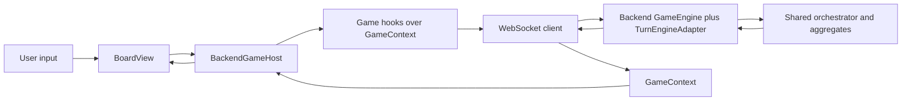
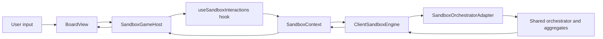
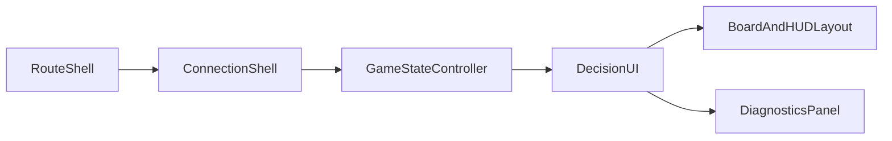

# Client Game Architecture: Hosts, Presentation, and Orchestrator Integration

> **Doc Status (2025-11-29): Active (frontend hosts, presentation, orchestrator integration)**
>
> - Defines patterns for host components, presentational components, and adapters/hooks in the game client.
> - Documents how frontend hosts integrate with the shared TypeScript orchestrator **indirectly** via backend and sandbox adapters.
> - Not a rules or lifecycle single source of truth. Rules semantics SSoT is [`RULES_CANONICAL_SPEC.md`](RULES_CANONICAL_SPEC.md:1) plus the shared TS engine under `src/shared/engine/**` as catalogued in [`CANONICAL_ENGINE_API.md`](docs/CANONICAL_ENGINE_API.md:1) and [`MODULE_RESPONSIBILITIES.md`](docs/MODULE_RESPONSIBILITIES.md:1). Lifecycle and WebSocket contracts are owned by shared types and schemas under `src/shared/types/**` and `src/shared/validation/**`.
> - Orchestrator rollout, SLOs, and incident posture are owned by [`ORCHESTRATOR_ROLLOUT_PLAN.md`](docs/ORCHESTRATOR_ROLLOUT_PLAN.md:1) and [`STRICT_INVARIANT_SOAKS.md`](docs/STRICT_INVARIANT_SOAKS.md:1).

This document is an **implementation guide for frontend developers**. It explains:

- How to structure host components vs presentational components.
- How React code should interact with backend and sandbox hosts without embedding rules logic.
- How new game UX features should be added while keeping orchestrator integration and SLOs intact.

---

## 1. Goals and Scope

Frontend game code has three primary goals:

1. Provide a high‑quality, accessible UI for playing, spectating, and experimenting with RingRift.
2. Integrate cleanly with backend and sandbox hosts that are already orchestrator‑first.
3. Remain easy to evolve as rules, orchestrator behaviour, and UX requirements change.

To achieve these, the client must:

- Treat the shared engine and orchestrator as **black boxes** behind typed APIs and contexts.
- Keep rules semantics out of React components and hooks.
- Prefer view models and small host containers over “god components”.

The rest of this document defines concrete patterns to enforce these rules.

---

## 2. Component Categories: Hosts, Presentation, and Adapters

At a high level, client code falls into three categories:

- **Host components** – stateful containers that integrate with backend or sandbox hosts and own game/session lifecycle.
- **Presentational components** – pure or near‑pure React components that render UI from props and view models.
- **Adapters and hooks** – non‑visual glue that maps domain types to view models and exposes safe hooks over contexts.

### 2.1 Host components

**Examples:**

- [`GamePage.tsx`](src/client/pages/GamePage.tsx:1) – routing shell that selects the correct host.
- [`BackendGameHost.tsx`](src/client/pages/BackendGameHost.tsx:1) – online and spectate games (backend WebSocket‑driven).
- [`SandboxGameHost.tsx`](src/client/pages/SandboxGameHost.tsx:1) – local sandbox games (client‑side engine).
- Context providers:
  - [`GameContext.tsx`](src/client/contexts/GameContext.tsx:1)
  - [`SandboxContext.tsx`](src/client/contexts/SandboxContext.tsx:1)
  - [`AuthContext.tsx`](src/client/contexts/AuthContext.tsx:1)

**Host responsibilities (allowed):**

- Own connections to backend services or local engines:
  - Establish, monitor, and tear down backend game WebSockets via `GameContext` hooks.
  - Construct and reset `ClientSandboxEngine` instances via `SandboxContext`.
- Own **game/session lifecycle**:
  - Create or join games (`/game/:gameId`, `/spectate/:gameId`, `/sandbox`).
  - Handle reconnection and transient failures (reconnect banners, retry flows).
  - Support reset/replay for sandbox sessions.
- Bridge between domain models and view models:
  - Translate `GameState`, connection state, and diagnostics into `HUDViewModel`, `BoardViewModel`, `EventLogViewModel`, and `VictoryViewModel` via [`gameViewModels.ts`](src/client/adapters/gameViewModels.ts:1).
- Drive routing and high‑level mode selection:
  - Decide which host to render (backend vs sandbox).
  - Decide whether the user is a player, spectator, or in pre‑game setup.
- Maintain **host‑local UI state**:
  - Selection and targeting state for board interactions.
  - Overlay flags (help, settings, diagnostics).
  - Error banners and toasts.

**Host non‑responsibilities (forbidden):**

- Implementing RingRift rules semantics:
  - No movement, capture, line, territory, or victory logic in React.
  - No recomputation of “legal moves” outside backend or `ClientSandboxEngine`.
- Calling shared engine aggregates or orchestrator directly:
  - Do not import `turnOrchestrator`, `MovementAggregate`, `CaptureAggregate`, etc.
- Duplicating backend invariants or parity checks.
- Bypassing contexts to talk directly to WebSockets, fetch, or low‑level sandbox helpers.

### 2.2 Presentational components

**Examples:**

- [`BoardView.tsx`](src/client/components/BoardView.tsx:1)
- [`GameHUD.tsx`](src/client/components/GameHUD.tsx:1)
- [`GameEventLog.tsx`](src/client/components/GameEventLog.tsx:1)
- [`VictoryModal.tsx`](src/client/components/VictoryModal.tsx:1)
- [`AIDebugView.tsx`](src/client/components/AIDebugView.tsx:1)
- [`GameHistoryPanel.tsx`](src/client/components/GameHistoryPanel.tsx:1)

**Presentational responsibilities (allowed):**

- Render UI given well‑shaped props:
  - View models for board, HUD, event log, victory.
  - Simple flags and strings (loading states, labels, copy).
- Provide local UI behaviour:
  - Layout, theming, conditional sections, animations.
  - Local component state (tabs, accordions, “expanded” flags).
- Delegate user interactions back to host‑provided callbacks:
  - `onCellClick`, `onCellKeyDown`, `onConfirmChoice`, `onClose`, etc.

**Presentational non‑responsibilities (forbidden):**

- Talking directly to backend APIs, WebSockets, or sandbox engines.
- Importing contexts or hooks such as `useGame`, `useSandbox`, or `useAuth`.
- Deriving complex rules semantics from raw state:
  - No own `getValidMoves` implementations.
  - No custom capture or territory resolution.

### 2.3 Adapters and hooks

These are non‑visual modules that glue hosts and presentation together.

- View‑model adapters in [`gameViewModels.ts`](src/client/adapters/gameViewModels.ts:1):
  - `toHUDViewModel`, `toBoardViewModel`, `toEventLogViewModel`, `toVictoryViewModel`.
- Game hooks:
  - [`useGameState.ts`](src/client/hooks/useGameState.ts:1) – read‑only access to game state and view models.
  - [`useGameConnection.ts`](src/client/hooks/useGameConnection.ts:1) – connection status and heartbeat metadata.
  - [`useGameActions.ts`](src/client/hooks/useGameActions.ts:1) – `submitMove`, `submitChoice`, `sendChatMessage`, and `validMoves`.
- Sandbox hooks:
  - [`useSandboxInteractions.ts`](src/client/hooks/useSandboxInteractions.ts:1) – interprets board input events and forwards them to `ClientSandboxEngine` via `SandboxContext`.

**Responsibilities:**

- Hide context internals behind stable, testable APIs.
- Centralize mapping from domain types (`GameState`, engine diagnostics) into view‑models tailored for presentation.
- Provide composition‑friendly hooks hosts can use to build new experiences (e.g. replay viewers, analysis tools).

**Non‑responsibilities:**

- Owning global state or connections directly (that belongs in contexts).
- Calling orchestrator APIs; they should only call into contexts, backend APIs, or `ClientSandboxEngine`.

### 2.4 Responsibilities mapping for key components

| Component | Category | Main responsibilities | Forbidden responsibilities |
| --------- | -------- | --------------------- | ------------------------- |
| [`BackendGameHost.tsx`](src/client/pages/BackendGameHost.tsx:1) | Host | Online/spectate host, backend connection lifecycle, mapping backend game state to view models, wiring board and HUD interactions to `submitMove` and `submitChoice` | Direct engine/orchestrator imports; rules logic; manual WebSocket usage |
| [`SandboxGameHost.tsx`](src/client/pages/SandboxGameHost.tsx:1) | Host | Sandbox configuration, `ClientSandboxEngine` lifecycle via `SandboxContext`, sandbox diagnostics, mapping sandbox state to view models and sandbox‑specific HUD | Local rules logic; calling shared engine helpers directly; bypassing `ClientSandboxEngine` |
| [`BoardView.tsx`](src/client/components/BoardView.tsx:1) | Presentational | Render board from `BoardViewModel` and low‑level props; handle click/keyboard events; call host callbacks | Talking to backend or sandbox; computing legal moves or outcomes |
| [`GameHUD.tsx`](src/client/components/GameHUD.tsx:1) | Presentational | Render HUD from `HUDViewModel` (or legacy props); show phase, turn, connection state, helper text | Inspecting or mutating `GameState` outside view models |
| [`GameEventLog.tsx`](src/client/components/GameEventLog.tsx:1) | Presentational | Render event log from `EventLogViewModel`; optional replay callbacks | Parsing engine history directly; querying backend |
| [`AIDebugView.tsx`](src/client/components/AIDebugView.tsx:1) | Presentational | Render AI diagnostics given derived props from hosts | Direct AI service calls; orchestrator or engine imports |
| [`GameHistoryPanel.tsx`](src/client/components/GameHistoryPanel.tsx:1) | Presentational | Render per‑turn summaries, allow navigation via host callbacks | Owning game/session lifecycle; direct context access |

**Allowed dependencies by category:**

- Hosts:
  - May depend on contexts and hooks (`useGame`, `useSandbox`, `useAuth`), routing, and domain services such as [`GameAPI`](src/client/domain/GameAPI.ts:1).
  - May import view‑model adapters and shared types.
- Presentational components:
  - May depend on props, view‑model types, and UI primitives under [`components/ui`](src/client/components/ui/Button.tsx:1).
  - Must not depend on contexts, hooks, or domain‑service modules.
- Adapters/hooks:
  - May depend on contexts, shared types, and view‑models.
  - Must not call orchestrator or shared engine helpers directly.

---

## 3. Orchestrator‑First Integration Paths

Frontend React code **never calls the orchestrator directly**. All rules semantics flow through:

- Backend host stack:
  - WebSocket API → backend `GameEngine` → [`TurnEngineAdapter.ts`](src/server/game/turn/TurnEngineAdapter.ts:1) → shared orchestrator and aggregates.
- Sandbox host stack:
  - [`ClientSandboxEngine.ts`](src/client/sandbox/ClientSandboxEngine.ts:1) → [`SandboxOrchestratorAdapter.ts`](src/client/sandbox/SandboxOrchestratorAdapter.ts:1) → shared orchestrator and aggregates.

The canonical orchestrator API and decision model are documented in [`CANONICAL_ENGINE_API.md`](docs/CANONICAL_ENGINE_API.md:596). Orchestrator rollout phases, SLOs, and rollback levers are defined in [`ORCHESTRATOR_ROLLOUT_PLAN.md`](docs/ORCHESTRATOR_ROLLOUT_PLAN.md:52) and [`STRICT_INVARIANT_SOAKS.md`](docs/STRICT_INVARIANT_SOAKS.md:168).

### 3.1 Backend game flow (online and spectate)

The typical lifecycle for a user action in a backend game is:

1. The user clicks or taps on the board in [`BoardView.tsx`](src/client/components/BoardView.tsx:1).
2. `BoardView` calls an `onCellClick` or keyboard handler provided by [`BackendGameHost.tsx`](src/client/pages/BackendGameHost.tsx:1).
3. `BackendGameHost` uses `validMoves` and other data from `useGameActions()` / `useGameState()` to:
   - Interpret the click in the context of the current phase (placement, movement, capture, choices).
   - Build a canonical move payload for the selected action.
   - Call `submitMove` or `submitChoice` from [`useGameActions.ts`](src/client/hooks/useGameActions.ts:1).
4. [`GameContext.tsx`](src/client/contexts/GameContext.tsx:1) serializes the move into a WebSocket `player_move` / `player_move_by_id` message using shared `Move` and WebSocket types.
5. The backend `GameEngine` receives the message and delegates to [`TurnEngineAdapter.ts`](src/server/game/turn/TurnEngineAdapter.ts:1), which calls the shared orchestrator (`processTurnAsync`) and aggregates.
6. The backend emits a `game_state` message with updated `GameState`, `validMoves`, and any pending `PlayerChoice` decisions.
7. `GameContext` updates its internal state and derived fields (`connectionStatus`, `pendingChoice`, `victoryState`, etc.).
8. `BackendGameHost` recomputes view models via [`gameViewModels.ts`](src/client/adapters/gameViewModels.ts:1) and re‑renders `BoardView`, `GameHUD`, `GameEventLog`, and `VictoryModal`.

The high‑level data flow looks like:



In spectate mode, the same path is used; hosts simply treat the current user as a non‑acting spectator and avoid issuing `submitMove` except for UI actions like chat.

### 3.2 Sandbox game flow

For sandbox games under `/sandbox` the flow is local to the browser but still orchestrator‑first:

1. The user interacts with the board in `BoardView`.
2. Event handlers provided by [`SandboxGameHost.tsx`](src/client/pages/SandboxGameHost.tsx:1) are implemented using [`useSandboxInteractions.ts`](src/client/hooks/useSandboxInteractions.ts:1).
3. `useSandboxInteractions` reads `sandboxEngine` and sandbox configuration from [`SandboxContext.tsx`](src/client/contexts/SandboxContext.tsx:1) and:
   - Interprets the click or gesture based on the current phase and any pending decisions.
   - Calls methods on `ClientSandboxEngine` such as `tryPlaceRings`, `applyCanonicalMove`, or `runSandboxAiTurnLoop`.
4. [`ClientSandboxEngine.ts`](src/client/sandbox/ClientSandboxEngine.ts:1) uses [`SandboxOrchestratorAdapter.ts`](src/client/sandbox/SandboxOrchestratorAdapter.ts:1) (when `useOrchestratorAdapter` is enabled) to:
   - Call the shared orchestrator (`processTurn` / `processTurnAsync`) and aggregates.
   - Track `GameState`, victory results, and any pending decisions.
5. `SandboxContext` exposes derived fields such as `getSandboxGameState` and sandbox diagnostics (stall watchdog state, capture targets, trace handles).
6. `SandboxGameHost` maps this data into standard view models plus sandbox‑specific summaries, and renders the same presentational components used by backend games (`BoardView`, `GameHUD`, `GameEventLog`, `VictoryModal`, plus sandbox panels).

A simplified flow:



Sandbox hosts therefore share the same rules semantics and invariants as the backend path, but run entirely in the browser with additional diagnostics and AI tooling.

### 3.3 Frontend constraints and SLO alignment

Because orchestrator behaviour and invariants are guarded by CI and soak SLOs (see [`ORCHESTRATOR_ROLLOUT_PLAN.md`](docs/ORCHESTRATOR_ROLLOUT_PLAN.md:399) and [`STRICT_INVARIANT_SOAKS.md`](docs/STRICT_INVARIANT_SOAKS.md:243)), frontend code must adhere to the following constraints:

- **Do not call orchestrator helpers directly from React.**
  - No imports of `src/shared/engine/orchestration/turnOrchestrator.ts` or domain aggregates from client code.
  - All move processing must go through:
    - Backend WebSocket APIs and `GameEngine` + `TurnEngineAdapter`.
    - `ClientSandboxEngine` + `SandboxOrchestratorAdapter` for sandbox.
- **Do not duplicate rules semantics in components, hooks, or contexts.**
  - Legal moves, forced eliminations, capture chains, and territory processing are owned by the shared engine.
- **Treat engine and orchestrator responses as authoritative.**
  - UI should display and act on `validMoves`, `pendingChoice`, and victory results provided by hosts without second‑guessing rules.

Violating these rules risks diverging from the orchestrator SLO‑backed behaviour and undermines the guarantees provided by parity tests and invariant soaks.

---

## 4. Roles and Responsibilities for Key Frontend Modules

This section spells out allowed and forbidden responsibilities for the main host and context modules.

### 4.1 [`GamePage.tsx`](src/client/pages/GamePage.tsx:1)

**Allowed:**

- Act as a thin routing shell:
  - Map routes like `/game/:gameId`, `/spectate/:gameId`, and `/sandbox` to the appropriate host component.
- Pass route parameters and simple flags (e.g. `gameId`, spectate mode) into hosts.
- Own only minimal layout and loading shells around hosts.

**Forbidden:**

- Implementing any game rules or orchestrator logic.
- Owning game or sandbox lifecycle; this belongs in hosts and contexts.
- Talking directly to backend APIs, WebSockets, or `ClientSandboxEngine`.

`GamePage` should remain **small and boring**: if it begins to accumulate logic beyond routing and simple layout decisions, that logic should be moved into `BackendGameHost` or `SandboxGameHost`.

### 4.2 [`BackendGameHost.tsx`](src/client/pages/BackendGameHost.tsx:1)

**Allowed responsibilities:**

- **Connection and session lifecycle for backend games:**
  - Use `useGame()` / `useGameState()` / `useGameConnection()` / `useGameActions()` to:
    - Connect to `/game/:gameId` or `/spectate/:gameId`.
    - Handle reconnects and identity changes from `AuthContext`.
    - Show banners for `connected`, `connecting`, `reconnecting`, and `disconnected` states.
- **Mapping backend state into view models:**
  - Use adapters in [`gameViewModels.ts`](src/client/adapters/gameViewModels.ts:1) to compute:
    - `HUDViewModel` for `GameHUD`.
    - `BoardViewModel` for `BoardView`.
    - `EventLogViewModel` for `GameEventLog`.
    - `VictoryViewModel` for `VictoryModal`.
- **Driving spectate and player UX:**
  - Respect current user identity from [`AuthContext.tsx`](src/client/contexts/AuthContext.tsx:1) to determine if the user is a player or spectator.
  - Enable or disable move submission accordingly.
  - Provide spectator‑friendly HUD hints (whose turn, timers, pending decisions).
- **Board and HUD interaction orchestration:**
  - Own selection and targeting state for clicks and keyboard navigation.
  - Interpret user input in terms of `validMoves` and call `submitMove`/`submitChoice`.
- **Error and reconnect handling:**
  - Display backend errors surfaced through `GameContext`.
  - Offer simple call‑to‑action buttons (retry, return to lobby) as needed.

**Forbidden responsibilities:**

- Any direct imports from shared engine or orchestrator modules.
- Implementing rules logic such as:
  - Determining whether a move is legal without using `validMoves`.
  - Re‑evaluating victory conditions locally.
- Issuing raw WebSocket commands; all messaging must go through `GameContext` hooks.

### 4.3 [`SandboxGameHost.tsx`](src/client/pages/SandboxGameHost.tsx:1)

**Allowed responsibilities:**

- **Sandbox configuration and lifecycle:**
  - Manage sandbox configuration state (board type, player count, AI/human seats).
  - Attempt to create real backend sandbox games via [`GameAPI`](src/client/domain/GameAPI.ts:1) when desired, and gracefully fall back to local sandbox.
  - Use [`SandboxContext.tsx`](src/client/contexts/SandboxContext.tsx:1) to initialise and reset `ClientSandboxEngine`.
- **Sandbox diagnostics and tooling:**
  - Surface sandbox‑specific diagnostics (stall watchdog state, AI traces, debug summaries) derived from `SandboxContext`.
  - Gate advanced diagnostics behind explicit UI affordances so the default UX remains simple.
- **Mapping sandbox state into presentational models:**
  - Use the same view‑model adapters as backend hosts wherever possible.
  - Provide sandbox‑specific HUD or panels as a thin wrapper over sandbox diagnostics.
- **Board and HUD interaction orchestration:**
  - Use [`useSandboxInteractions.ts`](src/client/hooks/useSandboxInteractions.ts:1) to wire `BoardView` input events into sandbox engine actions.
  - Own sandbox‑only UX flows such as pre‑game setup, quick reset, and AI‑vs‑AI modes.

**Forbidden responsibilities:**

- Implementing alternative rules paths; all canonical move processing must go through `ClientSandboxEngine` and its orchestrator adapter.
- Importing shared engine helpers or orchestrator modules directly.
- Re‑implementing invariants, S‑invariant checks, or parity checks in React.

### 4.4 [`GameContext.tsx`](src/client/contexts/GameContext.tsx:1)

**Allowed responsibilities:**

- Maintain authoritative backend game state client‑side:
  - `gameState`, `validMoves`, `pendingChoice`, `victoryState`, chat messages, and connection metadata.
- Encapsulate the WebSocket connection and message handlers.
- Provide typed hooks (`useGame`, `useGameState`, `useGameConnection`, `useGameActions`) for hosts.

**Forbidden responsibilities:**

- Calling orchestrator or shared engine helpers directly.
- Owning UI‑specific state (selection, overlays) – this belongs in hosts.

### 4.5 [`SandboxContext.tsx`](src/client/contexts/SandboxContext.tsx:1)

**Allowed responsibilities:**

- Manage sandbox configuration and `ClientSandboxEngine` lifecycle (`initLocalSandboxEngine`, `resetSandboxEngine`).
- Expose safe methods such as `getSandboxGameState` and sandbox diagnostics (stall watchdog state, capture targets, trace handles).
- Provide a stable API surface for `useSandbox()` and `useSandboxInteractions()`.

**Forbidden responsibilities:**

- Replaying or reinventing engine logic that already lives in `ClientSandboxEngine` or the shared engine.
- Owning React UI state; it should remain a non‑visual data layer.

### 4.6 [`AuthContext.tsx`](src/client/contexts/AuthContext.tsx:1)

**Allowed responsibilities:**

- Manage authentication and user profile state (login, logout, register, refresh).
- Expose `useAuth()` to hosts and pages for gating actions and showing user identity.

**Forbidden responsibilities:**

- Directly manipulating game or sandbox state.
- Embedding any rules semantics; it should remain purely auth/session oriented.

---

## 5. Adding New Game UX Features

This section describes how to add overlays, control panels, and interactions without violating host vs presentation boundaries or orchestrator‑first rules.

### 5.1 General guidelines

When adding a new UX feature:

1. Decide whether it is:
   - Backend‑only, sandbox‑only, or shared.
2. Extend **hosts and adapters**, not presentational components, with:
   - New state and callbacks.
   - New view‑model fields in [`gameViewModels.ts`](src/client/adapters/gameViewModels.ts:1) when presentation needs additional derived data.
3. Keep orchestrator integration **transparent** to the new UI:
   - Hosts expose high‑level actions like `onRequestMove`, `onRequestUndo`, `onToggleOverlay`, rather than orchestrator‑specific calls.
4. Presentational components should:
   - Receive simple props (`viewModel`, flags, callbacks).
   - Never import contexts, hosts, or engine modules.

### 5.2 Example A – Sandbox‑only control panel

**Goal:** Add a panel in `/sandbox` that controls sandbox‑specific behaviour (e.g. AI speed, auto‑advance, diagnostics toggles).

**Pattern:**

1. In [`SandboxGameHost.tsx`](src/client/pages/SandboxGameHost.tsx:1):
   - Add local React state for control settings (e.g. `aiSpeed`, `autoAdvance`, `showDiagnostics`).
   - Use `useSandbox()` to wire these settings to `ClientSandboxEngine` via `SandboxContext` (e.g. update AI configuration, enable/disable diagnostics).
2. Create `SandboxControlPanel` as a presentational component:
   - Props include plain values and callbacks:
     - `aiSpeed`, `onAiSpeedChange`.
     - `autoAdvance`, `onToggleAutoAdvance`.
     - `showDiagnostics`, `onToggleDiagnostics`.
   - It does **not** import `SandboxContext` or `ClientSandboxEngine`.
3. Render `SandboxControlPanel` from `SandboxGameHost`, passing in state and handlers.

**Anti‑pattern to avoid:**

- `SandboxControlPanel` calling `useSandbox()` or importing `ClientSandboxEngine` directly; orchestration belongs in the host.

### 5.3 Example B – Controls and shortcuts overlay

**Goal:** Add an overlay that explains controls, keyboard shortcuts, and basic rules hints for the current mode.

**Pattern:**

1. In `BackendGameHost` and/or `SandboxGameHost`:
   - Add overlay state: `isControlsOverlayOpen`, `setIsControlsOverlayOpen`.
   - Build a simple data structure describing sections and shortcut hints based on:
     - Current mode (backend vs sandbox).
     - View‑model fields (e.g. current phase, whether AI is active).
2. Implement a `ControlsHelpOverlay` presentational component:
   - Props:
     - `isOpen`, `onClose`.
     - `sections` – static or derived description of controls and shortcuts.
   - Does not access contexts or raw `GameState`.
3. In hosts:
   - Add a button or menu item (and optional hotkey) to toggle the overlay.
   - Pass the overlay props and data into `ControlsHelpOverlay`.

**Key property:**

- The overlay presents **information only**; it does not mutate game state directly. Any buttons inside it call back into host handlers.

### 5.4 Example C – Shared overlay for backend and sandbox

**Goal:** Introduce a shared overlay (e.g. “How to play this board type” or “Phase explanation”) that works in both backend and sandbox modes.

**Pattern:**

1. Define a small presentational component, e.g. `PhaseExplanationOverlay`:
   - Props might include:
     - `isOpen`, `onClose`.
     - `boardType`.
     - `currentPhase`.
     - Optional flags such as `isSandbox` or `isSpectator`.
   - It renders explanatory text and diagrams based solely on props.
2. In `BackendGameHost`:
   - Use `HUDViewModel` and shared types to derive `boardType` and `currentPhase`.
   - Maintain `isPhaseOverlayOpen` state and callbacks.
   - Render `PhaseExplanationOverlay` with backend‑appropriate props (e.g. `isSandbox=false`, `isSpectator` derived from `AuthContext`).
3. In `SandboxGameHost`:
   - Derive the same props from sandbox state (via `SandboxContext` and view models).
   - Reuse `PhaseExplanationOverlay`, potentially passing `isSandbox=true`.

**Benefits:**

- Shared presentation component stays ignorant of backend vs sandbox implementation details.
- Hosts each control when the overlay appears and how it interacts with their local state.
- Future changes to rules or phase explanations remain aligned with orchestrator behaviour because the overlay only reflects data already exposed by hosts.

---

## 6. Anti‑Patterns and Migration Notes

The following patterns are **forbidden** or **strongly discouraged** in new code. Any remaining instances should be treated as technical debt.

### 6.1 Direct rules or orchestrator imports in React

- Do not import shared engine or orchestrator modules into React components, hooks, or contexts, including:
  - `src/shared/engine/orchestration/turnOrchestrator.ts`
  - Domain aggregates such as `MovementAggregate`, `CaptureAggregate`, `PlacementAggregate`, `LineAggregate`, `TerritoryAggregate`, `VictoryAggregate`.
  - Low‑level helpers such as `movementLogic`, `territoryDecisionHelpers`, or `captureChainHelpers`.

All production rules calls must go through:

- Backend: WebSocket API → `GameEngine` → `TurnEngineAdapter` → orchestrator.
- Sandbox: `ClientSandboxEngine` → `SandboxOrchestratorAdapter` → orchestrator.

### 6.2 Re‑implementing rules semantics in the frontend

- Do not:
  - Recompute `validMoves`.
  - Implement custom capture chain or territory resolution logic.
  - Implement S‑invariant or other invariant checks in the client.

These behaviours are owned by the shared engine and orchestrator, which are validated by contract tests, parity suites, and invariant soaks.

### 6.3 Duplicating backend parity or invariant checks

- Frontend code should not try to mirror parity checks or host invariants that run on the backend or in CI.
- If additional diagnostics are needed in the client or sandbox:
  - Use safe read‑side helpers exposed by `ClientSandboxEngine`.
  - Treat them as **diagnostics‑only**, never as alternative rules paths.

### 6.4 Migration and technical debt

- Any existing React code that:
  - Imports shared engine helpers or orchestrator modules, or
  - Re‑implements rules semantics,

  should be considered **technical debt** and gradually refactored to use:

  - Backend WebSocket APIs for online games.
  - `ClientSandboxEngine` and `SandboxContext` for sandbox.

- Remaining legacy or diagnostics‑only rules helpers are tracked and fenced by:
  - [`WEAKNESS_ASSESSMENT_REPORT.md`](WEAKNESS_ASSESSMENT_REPORT.md:751)
  - [`PASS16_ASSESSMENT_REPORT.md`](docs/PASS16_ASSESSMENT_REPORT.md:309)
  - SSOT tooling under `scripts/ssot/**`

New frontend work must not add fresh dependencies on legacy rules paths or diagnostics‑only helpers.

---

## 7. Background: Historical Client Layering

Before host components were split and orchestrator‑first rules were formalised, the client architecture was primarily described in terms of **UI → view models → hooks → GameContext → domain services**. That layering is still valid and useful, but it is **secondary** to the host vs presentation and orchestrator integration patterns above.

A simplified view of the layers:

```
┌─────────────────────────────────────────────────────────┐
│                     UI Components                        │
│    (GameHUD, GameEventLog, BoardView, VictoryModal)     │
├─────────────────────────────────────────────────────────┤
│                      View Models                         │
│  (HUDViewModel, BoardViewModel, EventLogViewModel, etc) │
├─────────────────────────────────────────────────────────┤
│                    Custom Hooks                          │
│   (useGameState, useGameActions, useGameConnection)     │
├─────────────────────────────────────────────────────────┤
│                    Game Contexts                         │
│        (GameContext, SandboxContext, AuthContext)       │
├─────────────────────────────────────────────────────────┤
│                  Domain Services                         │
│  (Backend GameEngine, ClientSandboxEngine, GameAPI)     │
├─────────────────────────────────────────────────────────┤
│                   Shared Types                           │
│         (GameState, Player, BoardState, etc)            │
└─────────────────────────────────────────────────────────┘
```

In this model:

- **UI components** live under [`src/client/components`](src/client/components): they render view models and call callbacks.
- **View models** are defined and built in [`gameViewModels.ts`](src/client/adapters/gameViewModels.ts:1), transforming `GameState` into UI‑friendly shapes.
- **Custom hooks** in [`src/client/hooks`](src/client/hooks/index.ts:1) provide focused access to game state, connection state, and actions.
- **Contexts** under [`src/client/contexts`](src/client/contexts/GameContext.tsx:1) own connections and engine instances.
- **Domain services** such as `ClientSandboxEngine` and `GameAPI` live under [`src/client/sandbox`](src/client/sandbox/ClientSandboxEngine.ts:1) and [`src/client/domain`](src/client/domain/GameAPI.ts:1) respectively.

This layered view remains useful when designing new hooks or view models, but all new frontend work should first ask:

1. Which **host component** owns this feature?
2. How does it integrate with backend or sandbox orchestrator paths without embedding rules logic?
3. What new view‑model or adapter changes are needed, if any?

Answering those questions using the patterns in sections 2–6 will keep the frontend aligned with orchestrator‑first architecture and make future evolution safer.


---

## 8. Game Host Decomposition &amp; State Boundaries

### 8.1 Overview

This section defines a concrete decomposition of the frontend **game host layer** into a small set of roles. The goals are:

- Keep the shared engine and orchestrator (for example [`turnOrchestrator.ts`](src/shared/engine/orchestration/turnOrchestrator.ts:1)) as the **only rules SSOT**, consistent with [`RULES_SSOT_MAP.md`](docs/RULES_SSOT_MAP.md:73).
- Make backend and sandbox hosts easier to reason about and test by separating **connection**, **session control**, **interaction and decision UI**, **layout**, and **diagnostics**.
- Provide a migration target for existing hosts such as [`BackendGameHost.tsx`](src/client/pages/BackendGameHost.tsx:1) and [`SandboxGameHost.tsx`](src/client/pages/SandboxGameHost.tsx:1) without changing behaviour.

The host layer is decomposed into the following conceptual roles:

- **RouteShell** – selects the appropriate host for the current route.
- **ConnectionShell** – owns WebSocket or sandbox‑engine lifecycle, connection status, and reconnection.
- **GameStateController** – subscribes to game state, translates orchestrator outputs into view models, and owns host‑local interaction state (selection, overlays).
- **DecisionUI** – renders pending decisions, legal‑move hints, victory modals, and chat, wiring callbacks back to controllers.
- **BoardAndHUDLayout** – pure layout that arranges board, HUD, logs, overlays, and touch controls.
- **DiagnosticsPanel** – surfaces sandbox and host diagnostics (stall warnings, capture‑tree explorers, AI traces) in a non‑canonical way.

Each role may be implemented as a component, a small set of components, or a custom hook. The mapping to current code is summarised in §8.5.

A high‑level flow for both backend and sandbox looks like:



### 8.2 Responsibility &amp; State Matrix

The table below defines **owned state**, **allowed dependencies**, and **forbidden responsibilities** for each role. Example implementers refer to current modules.

| Role | Example implementers | Owns React state | May read or call | Forbidden |
| ---- | -------------------- | ---------------- | ---------------- | --------- |
| **RouteShell** | [`GamePage.tsx`](src/client/pages/GamePage.tsx:1) | Route params, simple layout flags | React Router `useParams`, `gameId` and mode (backend vs sandbox) | Game or sandbox lifecycle, engine calls, WebSockets, orchestrator helpers |
| **ConnectionShell** | Backend: connection portion of [`BackendGameHost.tsx`](src/client/pages/BackendGameHost.tsx:1) using [`useGameConnection.ts`](src/client/hooks/useGameConnection.ts:1). Sandbox: setup and session wiring in [`SandboxGameHost.tsx`](src/client/pages/SandboxGameHost.tsx:1) using [`SandboxContext.tsx`](src/client/contexts/SandboxContext.tsx:1). | Connection status banners, loading shells, backend error strings | `useGameConnection()` and `useConnectionStatus()` from [`useGameConnection.ts`](src/client/hooks/useGameConnection.ts:104), backend `connectToGame` and `disconnect` from [`GameContext.tsx`](src/client/contexts/GameContext.tsx:1); sandbox config and engine lifecycle (`initLocalSandboxEngine`, `resetSandboxEngine`) from [`SandboxContext.tsx`](src/client/contexts/SandboxContext.tsx:64); backend game creation via [`GameAPI`](src/client/domain/GameAPI.ts:1) | Inspecting or mutating board or rules state; calling [`ClientSandboxEngine`](src/client/sandbox/ClientSandboxEngine.ts:337) methods directly; importing orchestrator helpers such as [`turnOrchestrator.ts`](src/shared/engine/orchestration/turnOrchestrator.ts:1) |
| **GameStateController** | Backend: controller logic in [`BackendGameHost.tsx`](src/client/pages/BackendGameHost.tsx:1) (selection, `validMoves` interpretation, view‑model construction) plus focused hooks such as [`useGameState.ts`](src/client/hooks/useGameState.ts:1) and [`useGameActions.ts`](src/client/hooks/useGameActions.ts:1). Sandbox: controller logic in [`SandboxGameHost.tsx`](src/client/pages/SandboxGameHost.tsx:1) together with [`useSandboxInteractions.ts`](src/client/hooks/useSandboxInteractions.ts:1). | Board selection and `validTargets`, per‑host overlays (controls help, diagnostics toggles), local countdowns and timers, chat input buffer (where not owned by DecisionUI) | Read‑only game data via [`useGameState()`](src/client/hooks/useGameState.ts:94); `validMoves` and helper APIs via [`useValidMoves()`](src/client/hooks/useGameActions.ts:331); actions via [`useGameActions()`](src/client/hooks/useGameActions.ts:118); sandbox state via [`useSandbox()`](src/client/contexts/SandboxContext.tsx:242) and interaction handlers from [`useSandboxInteractions()`](src/client/hooks/useSandboxInteractions.ts:16); view‑model adapters in [`gameViewModels.ts`](src/client/adapters/gameViewModels.ts:1); identity via [`AuthContext.tsx`](src/client/contexts/AuthContext.tsx:1) | Direct imports of shared engine or orchestrator modules; custom legality logic (movement, capture, territory, victory); direct WebSocket usage; direct imports of sandbox helpers like [`sandboxMovement.ts`](src/client/sandbox/sandboxMovement.ts:1) from React code |
| **DecisionUI** | Backend: choice dialog, instructions, victory modal, and chat wiring in [`BackendGameHost.tsx`](src/client/pages/BackendGameHost.tsx:1). Sandbox: `ChoiceDialog` and capture‑direction wiring in [`SandboxGameHost.tsx`](src/client/pages/SandboxGameHost.tsx:1) plus decision portions of [`useSandboxInteractions.ts`](src/client/hooks/useSandboxInteractions.ts:1). | Choice dialog visibility and timers, victory modal dismissal, ephemeral UI state around chat input | `pendingChoice` and `choiceDeadline` via [`usePendingChoice()`](src/client/hooks/useGameActions.ts:241) or host‑level sandbox choice state; `respondToChoice` and `sendChatMessage` via [`useGameActions()`](src/client/hooks/useGameActions.ts:118); victory and HUD view models via [`gameViewModels.ts`](src/client/adapters/gameViewModels.ts:1); sandbox choices and capture targets via [`SandboxContext.tsx`](src/client/contexts/SandboxContext.tsx:64) | Subscribing directly to connection lifecycle; owning engine instances; constructing or mutating `GameState` directly; computing `validMoves` |
| **BoardAndHUDLayout** | Composition sections at the bottom of [`BackendGameHost.tsx`](src/client/pages/BackendGameHost.tsx:1) and [`SandboxGameHost.tsx`](src/client/pages/SandboxGameHost.tsx:1); layout wrappers around [`BoardView.tsx`](src/client/components/BoardView.tsx:1), [`GameHUD.tsx`](src/client/components/GameHUD.tsx:1), [`GameEventLog.tsx`](src/client/components/GameEventLog.tsx:1), [`VictoryModal.tsx`](src/client/components/VictoryModal.tsx:1), [`SandboxTouchControlsPanel.tsx`](src/client/components/SandboxTouchControlsPanel.tsx:1), [`BoardControlsOverlay.tsx`](src/client/components/BoardControlsOverlay.tsx:1) | Pure UI state only (tab selection, collapsed sections), no domain state | Typed props and view models (`BoardViewModel`, `HUDViewModel`, `EventLogViewModel`, `VictoryViewModel`) from [`gameViewModels.ts`](src/client/adapters/gameViewModels.ts:1); callbacks provided by GameStateController and DecisionUI | Accessing React contexts such as `useGame`, `useSandbox`, or `useAuth`; importing [`ClientSandboxEngine`](src/client/sandbox/ClientSandboxEngine.ts:337), [`SandboxOrchestratorAdapter`](src/client/sandbox/SandboxOrchestratorAdapter.ts:162), or backend `GameEngine`; computing legal moves or decisions |
| **DiagnosticsPanel** | Backend: event log and connection‑status watcher inside [`BackendGameHost.tsx`](src/client/pages/BackendGameHost.tsx:1). Sandbox: stall watchdog and AI trace controls in [`SandboxGameHost.tsx`](src/client/pages/SandboxGameHost.tsx:1) and diagnostics fields in [`SandboxContext.tsx`](src/client/contexts/SandboxContext.tsx:64). Presentational panels such as [`AIDebugView.tsx`](src/client/components/AIDebugView.tsx:1). | Diagnostics event log, toggles for “moves only” vs “moves + system”, stall warnings, flags for trace export or advanced panels | Host‑exposed diagnostics from [`GameContext.tsx`](src/client/contexts/GameContext.tsx:1) (connection status, errors, last heartbeat); sandbox diagnostics from [`SandboxContext.tsx`](src/client/contexts/SandboxContext.tsx:64) (stall watcher, trace buffer handle); read‑only helpers that operate on cloned boards, such as functions from [`sandboxCaptureSearch.ts`](src/client/sandbox/sandboxCaptureSearch.ts:1) invoked in non‑UI tooling | Driving canonical legality or victory decisions; mutating live `GameState` outside of `ClientSandboxEngine`; calling orchestrator or aggregates directly; being treated as a rules SSOT |

**Who may talk to engines and hosts**

- Only **ConnectionShell** and **GameStateController** roles are allowed to talk to host engines and contexts:
  - Backend: via [`GameContext.tsx`](src/client/contexts/GameContext.tsx:1) and hooks such as [`useGameState.ts`](src/client/hooks/useGameState.ts:1), [`useGameConnection.ts`](src/client/hooks/useGameConnection.ts:1), and [`useGameActions.ts`](src/client/hooks/useGameActions.ts:1).
  - Sandbox: via [`SandboxContext.tsx`](src/client/contexts/SandboxContext.tsx:64), [`ClientSandboxEngine.ts`](src/client/sandbox/ClientSandboxEngine.ts:337), and [`SandboxOrchestratorAdapter.ts`](src/client/sandbox/SandboxOrchestratorAdapter.ts:162) (indirectly).
- **DecisionUI**, **BoardAndHUDLayout**, and **DiagnosticsPanel** must treat host state and diagnostics as **props** or hook‑level data and must not import shared engine modules.

### 8.3 Rules / Host / UI Boundary Rules

This section refines the SSOT rules from [`RULES_SSOT_MAP.md`](docs/RULES_SSOT_MAP.md:73) for the frontend.

**Rules and orchestrator layer**

- All rules semantics are owned by:
  - Shared engine helpers and aggregates under [`src/shared/engine`](src/shared/engine/types.ts:1).
  - Orchestrator entry points such as [`processTurn()`](src/shared/engine/orchestration/turnOrchestrator.ts:202), [`processTurnAsync()`](src/shared/engine/orchestration/turnOrchestrator.ts:549), [`validateMove()`](src/shared/engine/orchestration/turnOrchestrator.ts:600), [`getValidMoves()`](src/shared/engine/orchestration/turnOrchestrator.ts:657), and [`hasValidMoves()`](src/shared/engine/orchestration/turnOrchestrator.ts:723).
- Frontend React code **must not** import orchestrator or aggregate modules directly. The only allowed orchestrator usage is via:
  - Backend adapter [`TurnEngineAdapter.ts`](src/server/game/turn/TurnEngineAdapter.ts:1) driven by `GameEngine`.
  - Sandbox adapter [`SandboxOrchestratorAdapter.ts`](src/client/sandbox/SandboxOrchestratorAdapter.ts:162) used by [`ClientSandboxEngine.ts`](src/client/sandbox/ClientSandboxEngine.ts:337).

**Host orchestration layer**

- Backend host stack:
  - WebSocket transport and message handling are encapsulated by [`GameContext.tsx`](src/client/contexts/GameContext.tsx:1) and [`SocketGameConnection`](src/client/services/GameConnection.ts:1).
  - Backend rules execution goes through the adapter path documented in [`RULES_SSOT_MAP.md` §3.1](docs/RULES_SSOT_MAP.md:105).
- Sandbox host stack:
  - [`ClientSandboxEngine`](src/client/sandbox/ClientSandboxEngine.ts:337) owns local `GameState` and calls the orchestrator via [`SandboxOrchestratorAdapter`](src/client/sandbox/SandboxOrchestratorAdapter.ts:162) when `useOrchestratorAdapter` is enabled.
  - [`SandboxContext.tsx`](src/client/contexts/SandboxContext.tsx:64) owns engine lifecycle and exposes `getSandboxGameState()` and diagnostics.

**Host / UI boundary rules**

- Only **ConnectionShell** and **GameStateController** roles may:
  - Call `connectToGame()` or `disconnect()` on the backend via [`useGameConnection()`](src/client/hooks/useGameConnection.ts:104).
  - Call `initLocalSandboxEngine()` and `resetSandboxEngine()` from [`SandboxContext.tsx`](src/client/contexts/SandboxContext.tsx:64).
  - Access `sandboxEngine` and call methods such as `getGameState()`, `getVictoryResult()`, or `maybeRunAITurn()` on [`ClientSandboxEngine.ts`](src/client/sandbox/ClientSandboxEngine.ts:1005).
- No React component outside host controllers may:
  - Import any helper from `src/shared/engine/**`.
  - Import sandbox helpers such as [`sandboxMovement.ts`](src/client/sandbox/sandboxMovement.ts:1), [`sandboxCaptures.ts`](src/client/sandbox/sandboxCaptures.ts:1), or [`sandboxTerritory.ts`](src/client/sandbox/sandboxTerritory.ts:1) directly.
  - Re‑implement legality logic (`getValidMoves`, capture chains, territory disconnection) or victory checks. These must always come from:
    - Backend `validMoves` and `GameResult` exposed via [`GameContext.tsx`](src/client/contexts/GameContext.tsx:1).
    - Sandbox `getValidMoves()` and victory helpers inside [`ClientSandboxEngine.ts`](src/client/sandbox/ClientSandboxEngine.ts:823) and [`sandboxVictory.ts`](src/client/sandbox/sandboxVictory.ts:70) when used via the engine.
- Presentation components (including `BoardAndHUDLayout` and Diagnostics views) must:
  - Depend only on view models and plain props.
  - Return all interactions via callbacks into controllers (for example `onCellClick`, `onSelectOption`, `onToggleOverlay`).

These rules extend the anti‑patterns in §6 to the finer‑grained host roles and align with SSOT enforcement tooling under [`scripts/ssot`](scripts/ssot/rules-ssot-check.ts:1).

### 8.4 Sandbox Diagnostics Classification

The following helper modules under `src/client/sandbox/**` are **not** rules SSOTs. They must only be used in the ways described here.

| Module | Intended status | Allowed usage patterns | Forbidden usage |
| ------ | --------------- | ---------------------- | --------------- |
| [`sandboxMovement.ts`](src/client/sandbox/sandboxMovement.ts:1) | `UX / diagnostics‑only adapter` over shared movement helpers | May be used inside [`ClientSandboxEngine.ts`](src/client/sandbox/ClientSandboxEngine.ts:1088) and test utilities to enumerate simple movement landings and apply marker‑path effects for highlighting and AI heuristics; may be used in diagnostics tools to visualise reachable cells on a cloned `BoardState` | Must not be used by React components or hooks to compute canonical `validMoves`; must not mutate live `GameState` or `BoardState` originating from contexts |
| [`sandboxCaptures.ts`](src/client/sandbox/sandboxCaptures.ts:1) | `UX / diagnostics‑only adapter` over shared capture helpers | May be used by [`ClientSandboxEngine.ts`](src/client/sandbox/ClientSandboxEngine.ts:1468) and offline tools to enumerate capture segments or apply diagnostic capture segments on cloned boards; may support capture‑visualisation overlays in diagnostics panels | Must not define an alternative capture pipeline for live games; must not be imported from components, contexts, or [`useSandboxInteractions.ts`](src/client/hooks/useSandboxInteractions.ts:1) |
| [`sandboxTerritory.ts`](src/client/sandbox/sandboxTerritory.ts:1) | `adapter over canonical territory engine; candidate for consolidation` | Delegates territory detection and processing to shared helpers (for example `applyTerritoryRegion`); may be used by sandbox engines and tests to compute disconnected regions and border markers; may power diagnostics views that visualise regions on snapshots | New semantics must be added in shared territory modules, not here; React code must not call it directly, only via `ClientSandboxEngine` or specialised test utilities |
| [`sandboxLines.ts`](src/client/sandbox/sandboxLines.ts:1) | `adapter over canonical line detection; candidate for consolidation` | Uses shared `findAllLines` to expose marker lines for sandbox engines and diagnostics; safe for line visualisation on cloned boards | Must not introduce bespoke line‑finding rules; React components must not import it directly |
| [`sandboxElimination.ts`](src/client/sandbox/sandboxElimination.ts:1) | `adapter with invariants; candidate for consolidation` | Provides helpers such as `forceEliminateCapOnBoard()` for engines and tests, enforcing board invariants; may be used by [`ClientSandboxEngine.ts`](src/client/sandbox/ClientSandboxEngine.ts:1754) and parity suites | Must not be called from UI code; elimination semantics must continue to be validated against backend tests and orchestrator contract vectors |
| [`sandboxVictory.ts`](src/client/sandbox/sandboxVictory.ts:1) | `adapter over canonical victory helper; candidate for consolidation` | Delegates victory detection to shared `evaluateVictory` and builds UI‑facing `GameResult` objects for sandbox; suitable for diagnostics dashboards that replay sandbox games | Must not diverge from orchestrator victory reasons; any new victory logic belongs in shared engine and orchestrator |
| [`sandboxCaptureSearch.ts`](src/client/sandbox/sandboxCaptureSearch.ts:1) | `diagnostics‑only (analysis tool)` | May be used in unit tests, parity tools, or debug scripts to explore maximal capture chains on cloned boards; may be invoked from CLI or devtools UIs that are clearly marked “Diagnostics” | Must never be imported into production React components, contexts, or host controllers; must not drive AI policies or any `getValidMoves` surface |

**Key constraint:** all sandbox helpers operate only **on cloned board snapshots** for diagnostics, or as thin adapters inside [`ClientSandboxEngine.ts`](src/client/sandbox/ClientSandboxEngine.ts:337). They must not be used to define or override canonical behaviour for live games.

### 8.5 Migration Plan from Current Hosts to Target Roles

This section maps current responsibilities in [`GamePage.tsx`](src/client/pages/GamePage.tsx:1), [`BackendGameHost.tsx`](src/client/pages/BackendGameHost.tsx:1), [`SandboxGameHost.tsx`](src/client/pages/SandboxGameHost.tsx:1), and related hooks/contexts to the target roles.

#### 8.5.1 `GamePage` → RouteShell

Current state:

- [`GamePage.tsx`](src/client/pages/GamePage.tsx:1) already behaves as a minimal routing shell: it reads `gameId` from the route and chooses between `BackendGameHost` and `SandboxGameHost`.

Target:

- Keep `GamePage` as the **RouteShell**:
  - Continue to own only route parameter parsing and host selection.
  - Do not add game or sandbox lifecycle logic here; any new concerns must be implemented in host‑specific ConnectionShell or GameStateController code.

#### 8.5.2 Backend path: `BackendGameHost` decomposition

Current responsibilities in [`BackendGameHost.tsx`](src/client/pages/BackendGameHost.tsx:1) include:

- Connection lifecycle and reconnection banners via `useGame()`:
  - `connectToGame`, `disconnect`, `connectionStatus`, `isConnecting`, `error`, `lastHeartbeatAt`.
- Game state subscription:
  - `gameState`, `validMoves`, `pendingChoice`, `choiceDeadline`, `victoryState`, `chatMessages`.
- Board interaction wiring:
  - Selection and `validTargets` React state.
  - Click, double‑click, and context‑menu handlers that interpret `validMoves` in placement and movement phases.
- Decision handling:
  - Rendering [`ChoiceDialog`](src/client/components/ChoiceDialog.tsx:1) and wiring `respondToChoice`.
  - Counting down `choiceTimeRemainingMs` with a timer.
- View‑model computation:
  - `toBoardViewModel`, `toHUDViewModel`, `toEventLogViewModel`, `toVictoryViewModel` from [`gameViewModels.ts`](src/client/adapters/gameViewModels.ts:1).
- Diagnostics and logging:
  - Phase/currentPlayer/choice change logs.
  - Connection‑status logs, `eventLog` buffer, and “moves only” vs “moves + system” toggle.
- Chat UI and local fallback when backend chat is not available.
- Layout of board, HUD, event log, chat, overlays, and victory modal.

**Target mapping:**

- **ConnectionShell (backend)**:
  - Extract connection‑focused logic into a small component or hook (for example `useBackendConnectionShell`) that uses [`useGameConnection()`](src/client/hooks/useGameConnection.ts:104) instead of raw `useGame()`.
  - Responsibilities:
    - Connecting and disconnecting based on `gameId`.
    - Exposing `connectionStatus`, `isConnecting`, `error`, and `lastHeartbeatAt`.
    - Rendering the reconnection banner and initial “connecting” or “unable to load game” shells.
  - `BackendGameHost` should delegate connection concerns to this shell and receive connection props instead of holding duplicate connection state.

- **GameStateController (backend)**:
  - Introduce a controller hook, for example `useBackendGameStateController`, that:
    - Reads `gameState`, `validMoves`, `pendingChoice`, `victoryState` via [`useGameState()`](src/client/hooks/useGameState.ts:94) and [`useValidMoves()`](src/client/hooks/useGameActions.ts:331).
    - Owns board selection and `validTargets` state (currently the `selected` and `validTargets` fields).
    - Builds all view models via [`gameViewModels.ts`](src/client/adapters/gameViewModels.ts:1).
    - Computes interaction copy (`boardInteractionMessage`, `getInstruction`) from phase and identity (via [`AuthContext.tsx`](src/client/contexts/AuthContext.tsx:1)).
    - Exposes strongly typed callbacks (`onCellClick`, `onCellDoubleClick`, `onCellContextMenu`) that are pure functions of `gameState` and `validMoves` and delegate to [`useGameActions()`](src/client/hooks/useGameActions.ts:118).
  - `BackendGameHost` becomes a thin wiring layer from this hook into `BoardAndHUDLayout`.

- **DecisionUI (backend)**:
  - Move choice timer and `ChoiceDialog` wiring into a focused hook (for example `useBackendDecisionUI`) or a small component nested under the host:
    - Uses `pendingChoice` and `choiceDeadline` from [`usePendingChoice()`](src/client/hooks/useGameActions.ts:241).
    - Owns `choiceTimeRemainingMs` and the timer ref.
    - Renders [`ChoiceDialog`](src/client/components/ChoiceDialog.tsx:1) and calls `respondToChoice`.
  - Keep victory modal dismissal state and mapping from `GameResult` to `VictoryViewModel` here.

- **BoardAndHUDLayout (backend)**:
  - Factor out a pure layout component (for example `BackendGameLayout`) that:
    - Receives `board`, `boardViewModel`, `hudViewModel`, `eventLogViewModel`, `victoryViewModel`, chat props, and all callbacks.
    - Composes [`BoardView.tsx`](src/client/components/BoardView.tsx:1), [`GameHUD.tsx`](src/client/components/GameHUD.tsx:1), [`GameEventLog.tsx`](src/client/components/GameEventLog.tsx:1), [`VictoryModal.tsx`](src/client/components/VictoryModal.tsx:1), chat panel, and [`BoardControlsOverlay.tsx`](src/client/components/BoardControlsOverlay.tsx:1).
    - Contains only local UI state for layout (for example “moves + system” toggle) and no direct context usage.

- **DiagnosticsPanel (backend)**:
  - Consolidate phase/currentPlayer/choice and connection status logging into a dedicated hook (for example `useGameDiagnosticsLog`) that:
    - Observes `gameState`, `pendingChoice`, and `connectionStatus`.
    - Produces a list of diagnostic strings suitable for [`GameEventLog.tsx`](src/client/components/GameEventLog.tsx:1).
  - The host passes this diagnostic log into `toEventLogViewModel` and does not mutate it elsewhere.

**Migration steps (backend)**:

1. Introduce `useBackendConnectionShell` and refactor [`BackendGameHost.tsx`](src/client/pages/BackendGameHost.tsx:1) to consume it instead of using raw connection fields from `useGame()`.
2. Extract board interaction logic into `useBackendBoardInteractions` that implements `onCellClick`, `onCellDoubleClick`, and `onCellContextMenu` using [`useValidMoves()`](src/client/hooks/useGameActions.ts:331) and [`useGameActions()`](src/client/hooks/useGameActions.ts:118).
3. Extract decision handling and timers into `useBackendDecisionUI` and update `BackendGameHost` to render [`ChoiceDialog`](src/client/components/ChoiceDialog.tsx:1) via this hook.
4. Create `BackendGameLayout` that receives view models and callbacks from the controller and connection shell and renders the existing JSX structure.
5. Move diagnostics logging into `useGameDiagnosticsLog` and pass its output to [`GameEventLog`](src/client/components/GameEventLog.tsx:1) via `toEventLogViewModel`.

#### 8.5.3 Sandbox path: `SandboxGameHost` decomposition

Current responsibilities in [`SandboxGameHost.tsx`](src/client/pages/SandboxGameHost.tsx:1) include:

- Pre‑game setup:
  - Local config (`LocalConfig`) for `boardType`, `numPlayers`, and `playerTypes`.
  - Attempted backend sandbox game creation via [`gameApi.createGame`](src/client/services/api.ts:1) and fallback to local `ClientSandboxEngine`.
- Sandbox engine lifecycle:
  - Calls `initLocalSandboxEngine()` and `resetSandboxEngine()` from [`SandboxContext.tsx`](src/client/contexts/SandboxContext.tsx:64).
  - Reads `sandboxEngine.getGameState()` and `sandboxEngine.getVictoryResult()`.
- Board interaction orchestration:
  - Delegated to [`useSandboxInteractions.ts`](src/client/hooks/useSandboxInteractions.ts:1), with `selected` and `validTargets` held in the host.
- Diagnostics:
  - Surfaces `sandboxStallWarning` and `sandboxLastProgressAt` from [`SandboxContext.tsx`](src/client/contexts/SandboxContext.tsx:64).
  - Provides “Copy AI trace” functionality backed by the `__RINGRIFT_SANDBOX_TRACE__` buffer.
- Layout and HUD:
  - Renders [`BoardView.tsx`](src/client/components/BoardView.tsx:1), [`SandboxTouchControlsPanel.tsx`](src/client/components/SandboxTouchControlsPanel.tsx:1), [`GameEventLog.tsx`](src/client/components/GameEventLog.tsx:1), phase guide, and sandbox notes.

**Target mapping:**

- **ConnectionShell (sandbox)**:
  - Treat the pre‑game setup and engine initialisation as the sandbox ConnectionShell:
    - Own `LocalConfig`, backend sandbox error, and `isConfigured`.
    - Call `initLocalSandboxEngine()` with a [`SandboxInteractionHandler`](src/client/sandbox/ClientSandboxEngine.ts:112) derived from `playerTypes`.
    - Expose a simple `startSandboxGame()` and `resetSandboxGame()` API to the rest of the host.
  - This logic can remain in `SandboxGameHost` but should be isolated from board rendering and diagnostics.

- **GameStateController (sandbox)**:
  - Introduce `useSandboxGameStateController` that:
    - Reads `sandboxGameState` and `sandboxVictoryResult` via [`useSandbox()`](src/client/contexts/SandboxContext.tsx:242) and `sandboxEngine.getGameState()`.
    - Owns `selected`, `validTargets`, `showMovementGrid`, `showValidTargetsOverlay`, and board controls overlay flags.
    - Uses [`toBoardViewModel`](src/client/adapters/gameViewModels.ts:1) and [`toVictoryViewModel`](src/client/adapters/gameViewModels.ts:1) to create view models.
    - Merges capture targets from `sandboxCaptureTargets` with standard `validTargets` for highlighting.

- **DecisionUI (sandbox)**:
  - Continue to use [`ChoiceDialog`](src/client/components/ChoiceDialog.tsx:1) and [`SandboxTouchControlsPanel.tsx`](src/client/components/SandboxTouchControlsPanel.tsx:1), but treat them as part of DecisionUI:
    - Wrap `sandboxPendingChoice`, `sandboxCaptureChoice`, and `sandboxCaptureTargets` in a small hook (for example `useSandboxDecisionUI`) that exposes a uniform `pendingDecision` API to the UI.
    - Ensure that decision resolution always flows back through the `SandboxInteractionHandler` and ultimately `ClientSandboxEngine`.

- **BoardAndHUDLayout (sandbox)**:
  - Factor a `SandboxGameLayout` component that:
    - Receives board and HUD view models, selection state, and all board interaction callbacks (from [`useSandboxInteractions.ts`](src/client/hooks/useSandboxInteractions.ts:1)).
    - Renders the board, player list, phase guide, diagnostics panels, and overlays.
    - Does not import [`useSandbox`](src/client/contexts/SandboxContext.tsx:242) or [`ClientSandboxEngine`](src/client/sandbox/ClientSandboxEngine.ts:337).

- **DiagnosticsPanel (sandbox)**:
  - Move stall watchdog rendering and “Copy AI trace” controls into a dedicated diagnostics component, driven by `sandboxStallWarning`, `sandboxDiagnosticsEnabled`, and `sandboxLastProgressAt` from [`SandboxContext.tsx`](src/client/contexts/SandboxContext.tsx:64).
  - Any future diagnostics that rely on helpers like [`sandboxCaptureSearch.ts`](src/client/sandbox/sandboxCaptureSearch.ts:1) must operate on snapshots obtained via `getSandboxGameState()` only and may not influence move legality or turn progression.

**Migration steps (sandbox)**:

1. Encapsulate setup and engine initialisation logic in a `useSandboxConnectionShell` hook that exposes `startSandboxGame`, `resetSandboxGame`, and configuration state, and refactor [`SandboxGameHost.tsx`](src/client/pages/SandboxGameHost.tsx:1) to use it.
2. Introduce `useSandboxGameStateController` to own selection, view models, and phase copy derived from `sandboxGameState`, and to compose data for [`SandboxTouchControlsPanel.tsx`](src/client/components/SandboxTouchControlsPanel.tsx:1).
3. Move stall warnings and AI trace export into a `SandboxDiagnosticsPanel` component that consumes diagnostics props from the controller or [`SandboxContext`](src/client/contexts/SandboxContext.tsx:64).
4. Extract a `SandboxGameLayout` component that composes the board, HUD‑like panels, event log, touch controls, and diagnostics from props, keeping it free of contexts and engine imports.

#### 8.5.4 Shared hooks and contexts

To support this decomposition:

- Prefer **narrow hooks** over `useGame()`:
  - Replace direct `useGame()` usage in hosts with [`useGameState()`](src/client/hooks/useGameState.ts:94), [`useGameConnection()`](src/client/hooks/useGameConnection.ts:104), [`useGameActions()`](src/client/hooks/useGameActions.ts:118), and [`useValidMoves()`](src/client/hooks/useGameActions.ts:331) wherever practical.
  - Keep [`GameContext`](src/client/contexts/GameContext.tsx:1) as a non‑visual owner of backend game state and WebSocket lifecycle; do not move host‑local UI state (selection, overlays) into it.
- Consider a thin `useSandboxState()` wrapper for [`SandboxContext`](src/client/contexts/SandboxContext.tsx:64) that:
  - Returns `sandboxGameState`, `sandboxVictoryResult`, and key diagnostics fields.
  - Helps keep React components out of direct engine calls except via well‑defined hooks such as [`useSandboxInteractions.ts`](src/client/hooks/useSandboxInteractions.ts:1).

### 8.6 Testing Strategy Hooks

Decomposing hosts into the roles above creates clear test seams.

**ConnectionShell tests**

- Unit test [`useGameConnection()`](src/client/hooks/useGameConnection.ts:104) and any `useBackendConnectionShell` or `useSandboxConnectionShell` wrappers by:
  - Providing a mocked [`GameContext`](src/client/contexts/GameContext.tsx:1) or [`SandboxContext`](src/client/contexts/SandboxContext.tsx:64).
  - Verifying correct banners and skeletons for `connecting`, `reconnecting`, `disconnected`, and stale heartbeat states.
- These tests should not depend on real WebSocket connections or orchestrator behaviour.

**GameStateController tests**

- For backend controllers:
  - Mount components under a test `GameProvider` with a fake [`GameConnection`](src/client/domain/GameAPI.ts:1) or stubbed [`SocketGameConnection`](src/client/services/GameConnection.ts:1) that emits scripted `game_state` and `game_over` messages.
  - Assert that selection logic, `validTargets`, and view models match expectations based solely on `validMoves` and `GameState`.
- For sandbox controllers:
  - Provide a lightweight fake [`ClientSandboxEngine`](src/client/sandbox/ClientSandboxEngine.ts:337) that returns canned `GameState` snapshots and accepts no‑op methods for moves.
  - Verify that [`useSandboxInteractions()`](src/client/hooks/useSandboxInteractions.ts:1) correctly interprets clicks, double‑clicks, and AI turns given those snapshots.

**DecisionUI tests**

- Use React Testing Library to test decision flows:
  - Simulate `pendingChoice` values and ensure [`ChoiceDialog`](src/client/components/ChoiceDialog.tsx:1) calls `respondToChoice` with the right payloads.
  - Exercise countdown logic in isolation by faking `choiceDeadline`.
- Chat flows can be tested via [`useChatMessages`](src/client/hooks/useGameActions.ts:290) with a fake [`GameContext`](src/client/contexts/GameContext.tsx:1).

**BoardAndHUDLayout tests**

- Treat layout components as **pure presentation**:
  - Snapshot or DOM tests using static view models from [`gameViewModels.ts`](src/client/adapters/gameViewModels.ts:1).
  - No engine, context, or orchestrator mocking is required.

**DiagnosticsPanel tests**

- For backend diagnostics:
  - Feed synthetic sequences of `GameState` and `ConnectionStatus` into a `useGameDiagnosticsLog` hook and assert on log entries rendered by [`GameEventLog.tsx`](src/client/components/GameEventLog.tsx:1).
- For sandbox diagnostics:
  - Provide fake `__RINGRIFT_SANDBOX_TRACE__` buffers and verify that stall banners and “Copy AI trace” behaviour work as expected in `SandboxDiagnosticsPanel`.
  - Any tests that use [`sandboxCaptureSearch.ts`](src/client/sandbox/sandboxCaptureSearch.ts:1) must operate on cloned boards and never on live engine instances.

**End‑to‑end coverage**

- Keep end‑to‑end tests (for example Playwright suites) focused on **cross‑role behaviour**:
  - Full backend game flow (placement → movement/capture → line and territory decisions → victory) using orchestrator‑backed backend.
  - Sandbox flows for mixed human/AI and AI‑vs‑AI games, verifying that hosts remain orchestrator‑aligned and that diagnostics stay non‑blocking and non‑canonical.

With these roles, boundaries, and testing hooks, the frontend host layer can be refactored incrementally while strictly preserving the orchestrator‑as‑SSOT model described in [`RULES_SSOT_MAP.md`](docs/RULES_SSOT_MAP.md:73).
